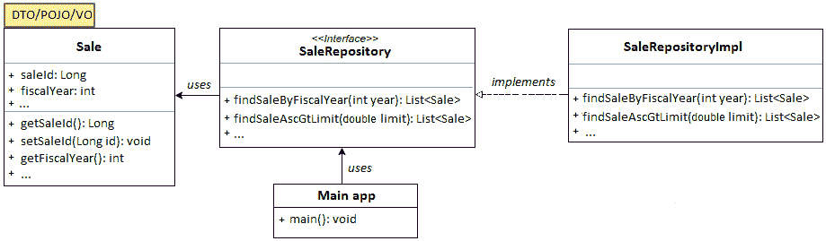

# *第四章*：构建 DAO 层（演进生成的 DAO 层）

到目前为止，我们知道如何启用 jOOQ 代码生成器，以及如何通过 jOOQ DSL API 表达查询，并且我们对 jOOQ 的工作原理有了相当的了解。换句话说，我们知道如何启动和配置一个依赖 jOOQ 进行持久层实现的 Spring Boot 应用程序。

在本章中，我们探讨了在 **数据访问对象** （**DAO**）层中组织查询的不同方法。作为一个 Spring Boot 粉丝，你很可能熟悉以仓库为中心的 DAO 层，因此，你会看到 jOOQ 如何适应这个环境。到本章结束时，你将熟悉以下内容：

+   连接到 DAO 层

+   构建 DAO 设计模式并使用 jOOQ

+   构建通用的 DAO 设计模式并使用 jOOQ

+   扩展 jOOQ 内置 DAO

让我们开始吧！

# 技术要求

本章的代码可以在 GitHub 上找到：[`github.com/PacktPublishing/jOOQ-Masterclass/tree/master/Chapter04`](https://github.com/PacktPublishing/jOOQ-Masterclass/tree/master/Chapter04)。

# 连接到 DAO 层

DAO 是一个代表 **数据访问对象** 的设计模式。遵循逻辑分离原则，DAO 将数据持久化逻辑分离到一个专用层，并抽象出低级数据库操作。通常，DAO 围绕三个主要组件进行设计：

+   一个表示层与层之间传输的数据的模型（例如，`Sale` 模型对应于 `SALE` 数据库表）

+   一个包含应实现模型 API 的接口（例如，`SaleDao`，或者在 Spring 术语中，`SaleRepository`）

+   该接口的具体实现（例如，`SaleDaoImpl`，或者在 Spring 术语中，`SaleRepositoryImpl`）

以下图展示了使用 `Sale`、`SaleRepository` 和 `SaleRepositoryImpl` 之间的关系：




图 4.1 – DAO 设计模式

如果你是一个 `JdbcTemplate` 粉丝，你很可能在自己的应用程序中认出这个模式。另一方面，如果你熟悉 Spring Data JPA/JDBC，那么你可以将 `Sale` 关联到 JPA/JDBC 实体，将 `SaleRepository` 关联到 Spring 仓库的扩展（例如，`CrudRepository` 或 `JpaRepository`），将 `SaleRepositoryImpl` 关联到为 `SaleRepository` 自动创建的 Spring 代理实例。

这种设计模式的一种变体被称为 *通用 DAO*。在这种情况下，目标是隔离所有仓库共有的查询方法（例如，`fetchAll()`、`fetchById()`、`insert()`、`update()` 等等）与特定于仓库的查询方法（例如，`findSaleByFiscalYear()`）。这次，我们在一个通用接口（例如，`ClassicModelsRepository<>`）中添加了常用方法，并为它提供了实现（`ClassicModelsRepositoryImpl<>`）。

以下图表示例描绘了使用相同的 `Sale`、`SaleRepository` 和 `SaleRepositoryImpl` 的两种泛型 DAO 经典风味：

![图 4.2 – 泛型 DAO (1)

![图片 B16833_Figure_4.2.jpg]

图 4.2 – 泛型 DAO (1)

在 *图 4.2* 中，`SaleRepository` 的实现必须提供一个通用 `ClassicModelsRepository` 的实现。每个存储库都将遵循此技术。为了增加 DAO 层的灵活性，我们添加了一个通用接口的单独实现，如下图所示：

![图 4.3 – 泛型 DAO (2)

![图片 B16833_Figure_4.3.jpg]

图 4.3 – 泛型 DAO (2)

如果您熟悉 Spring Data JPA/JDBC，那么您可以将 `ClassicModelsRepository` 与 Spring 内置的存储库（例如，`CrudRepository` 或 `JpaRepository`）以及此接口的实现 `ClassicModelsRepositoryImpl` 与 Spring 内置的实现（例如，`SimpleJpaRepository`）相关联。

接下来，让我们看看我们如何塑造这些 DAO 模式并使用 jOOQ。

# 塑造 DAO 设计模式和使用 jOOQ

假设我们有一系列针对 `SALE` 表的 jOOQ SQL 语句，我们想要围绕它们构建一个简单的 DAO 实现。这相当简单，因为我们只需遵循上一节中的 *图 4.1*。

首先，模型由 jOOQ 生成器以 POJO 的形式提供（我们也可以有用户定义的 POJO），因此，我们已经有 `Sale` POJO。接下来，我们编写 `SaleRepository`：

```java
@Repository
```

```java
@Transactional(readOnly=true)
```

```java
public interface SaleRepository {
```

```java
  public List<Sale> findSaleByFiscalYear(int year);
```

```java
  public List<Sale> findSaleAscGtLimit(double limit);    
```

```java
}
```

`SaleRepositoryImpl` 为这两个方法提供了 jOOQ 实现：

```java
@Repository
```

```java
public class SaleRepositoryImpl implements SaleRepository {
```

```java
  private final DSLContext ctx;
```

```java
  public SaleRepositoryImpl(DSLContext ctx) {
```

```java
    this.ctx = ctx;
```

```java
  }
```

```java
  @Override
```

```java
  public List<Sale> findSaleByFiscalYear(int year) {
```

```java
    return ctx...
```

```java
  }
```

```java
  @Override
```

```java
  public List<Sale> findSaleAscGtLimit(double limit) {
```

```java
    return ctx...;
```

```java
  }
```

```java
}
```

完成！接下来，我们可以简单地注入 `SaleRepository` 并调用查询方法：

```java
@Service
```

```java
public class SalesManagementService {
```

```java
  private final SaleRepository saleRepository;   
```

```java
  public SalesManagementService(
```

```java
    SaleRepository saleRepository) {
```

```java
      this.saleRepository = saleRepository;
```

```java
  } 
```

```java
  public List<Sale> fetchSaleByFiscalYear(int year) {
```

```java
    return saleRepository.findSaleByFiscalYear(year);
```

```java
  }
```

```java
  public List<Sale> fetchSaleAscGtLimit(double limit) {
```

```java
    return saleRepository.findSaleAscGtLimit(limit);
```

```java
  }
```

```java
}
```

以同样的方式，我们可以通过添加更多存储库和其他模型实现来演进这个 DAO 层。此应用程序以 *SimpleDao* 的形式适用于 Maven 和 Gradle。

此外，如果您必须将 Spring Data JPA DAO 与用户定义的 jOOQ DAO 结合在一个接口中，那么只需简单地扩展所需的接口，如下例所示：

```java
@Repository
```

```java
@Transactional(readOnly = true)
```

```java
public interface SaleRepository
```

```java
  extends JpaRepository<Sale, Long>, // JPA
```

```java
  com.classicmodels.jooq.repository.SaleRepository { // jOOQ
```

```java
  List<Sale> findTop10By(); // Sale is a JPA entity
```

```java
}
```

一旦注入 `SaleRepository`，您将能够访问 Spring Data JPA DAO 和用户定义的 jOOQ DAO，在同一服务中。此示例命名为 `JpaSimpleDao`。

# 塑造泛型 DAO 设计模式和使用 jOOQ

尝试从 *图 4.2* 实现泛型 DAO 以通用接口 `ClassicModelsRepository` 为起点：

```java
@Repository
```

```java
@Transactional(readOnly = true)
```

```java
public interface ClassicModelsRepository<T, ID> {
```

```java
  List<T> fetchAll();
```

```java
  @Transactional
```

```java
  void deleteById(ID id);
```

```java
}
```

虽然 `ClassicModelsRepository` 包含了常见的查询方法，但 `SaleRepository` 通过添加特定的查询方法对其进行扩展，如下所示：

```java
@Repository
```

```java
@Transactional(readOnly = true)
```

```java
public interface SaleRepository
```

```java
        extends ClassicModelsRepository<Sale, Long> {
```

```java
  public List<Sale> findSaleByFiscalYear(int year);
```

```java
  public List<Sale> findSaleAscGtLimit(double limit);
```

```java
}
```

`SaleRepository` 的实现提供了两个接口的方法实现：

```java
@Repository
```

```java
public class SaleRepositoryImpl implements SaleRepository {
```

```java
  private final DSLContext ctx;
```

```java
  public SaleRepositoryImpl(DSLContext ctx) {
```

```java
    this.ctx = ctx;
```

```java
  }
```

```java
  @Override
```

```java
  public List<Sale> findSaleByFiscalYear(int year) { ... }
```

```java
  @Override
```

```java
  public List<Sale> findSaleAscGtLimit(double limit) { ... }
```

```java
  @Override
```

```java
  public List<Sale> fetchAll() { ... }
```

```java
  @Override
```

```java
  public void deleteById(Long id) { ... }
```

```java
}
```

完整的示例命名为 *SimpleGenericDao*。此外，如果您必须将 Spring Data JPA DAO 与用户定义的 jOOQ 泛型 DAO 结合在一个接口中，那么就像在 *JPASimpleGenericDao* 中那样扩展所需的接口。一旦注入 `SaleRepository`，您将能够访问 Spring Data JPA DAO 和用户定义的 jOOQ 泛型 DAO，在同一服务中。

关于实现*图 4.3*中的通用 DAO，怎么样？这更加灵活，但并不容易实现。由于*通用性*方面，我们无法直接引用表和字段，就像在之前的例子中那样。`ClassicModelsRepository`中的查询方法是通用的，因此，通过`ClassicModelsRepositoryImpl`中的 DSL 支持编写的 jOOQ 查询也必须以通用方式编写。

直观地表达 jOOQ SQL 的通用方式并不简单，但你在研究了 jOOQ 内置`DAO`接口和`DAOImpl`类的源代码之后可以做到。对于那些想要深入研究这种方法的人，可以考虑名为*GenericDao*的示例。如果你还想涉及 Spring Data JPA，那么可以查看*JpaGenericDao*。

但是，正如你在*第二章*中看到的，“自定义 jOOQ 的参与级别”，jOOQ 可以代表我们生成 DAO 层。让我们扩展它，并按我们的喜好丰富/自定义它。

# 扩展 jOOQ 内置 DAO

假设你已经配置了 jOOQ 生成器，使其在`jooq.generated.tables.daos`包中输出生成的 DAO 层。虽然生成的 DAO 公开了常见的查询方法，如`insert()`、`update()`、`delete()`以及一些`fetchBy...()`或`fetchRange...()`类型的特定查询，但我们希望扩展它，添加我们自己的查询方法。

重要提示

这是我最喜欢的在 Spring Boot 和 jOOQ 应用程序中编写 DAO 层的方式之一。

jOOQ DAO 层包含一组生成的类，这些类反映了数据库表并扩展了内置的`org.jooq.impl.DAOImpl`类。例如，`jooq.generated.tables.daos.SaleRepository`类（或者，如果你保留了 jOOQ 使用的默认命名策略，则为`jooq.generated.tables.daos.SaleDao`）对应于`SALE`表。为了扩展`SaleRepository`，我们必须快速查看其源代码，并突出以下部分：

```java
@Repository
```

```java
public class SaleRepository extends DAOImpl<SaleRecord, 
```

```java
      jooq.generated.tables.pojos.Sale, Long> {
```

```java
   ...
```

```java
  @Autowired
```

```java
  public SaleRepository(Configuration configuration) {
```

```java
     super(Sale.SALE, jooq.generated.tables.pojos.Sale.class,
```

```java
              configuration);
```

```java
 }
```

```java
 ...
```

```java
}
```

突出的代码代表了扩展`SaleRepository`的高潮。当我们扩展`SaleRepository`（或任何其他 jOOQ DAO 类）时，我们有责任传递一个有效的 jOOQ 配置，否则代码将产生`NullPointerException`。这是一个简单的任务，可以通过以下代码片段完成（基本上，我们将`DSLContext`的配置传递给`SaleRepository`，该配置由 Spring Boot 准备）：

```java
@Repository
```

```java
@Transactional(readOnly = true)
```

```java
public class SaleRepositoryImpl extends SaleRepository {
```

```java
  private final DSLContext ctx;
```

```java
  public SaleRepositoryImpl(DSLContext ctx) {
```

```java
    super(ctx.configuration());
```

```java
this.ctx = ctx;
```

```java
}
```

```java
...
```

```java
}
```

那就是全部了！现在，你可以利用`SaleRepositoryImpl`和`SaleRepository`中定义的查询方法。换句话说，你可以将 jOOQ 内置的 DAO 和你的 DAO 作为一个“单一”的 DAO 来使用。以下是一个示例：

```java
@Service
```

```java
public class SalesManagementService {
```

```java
  private final SaleRepositoryImpl saleRepository;
```

```java
  public SalesManagementService(
```

```java
       SaleRepositoryImpl saleRepository) {
```

```java
    this.saleRepository = saleRepository;
```

```java
   }
```

```java
  // call jOOQ DAO
```

```java
  @Transactional(readOnly = true)
```

```java
  public List<Sale> fetchSaleByFiscalYear(int year) {
```

```java
      return saleRepository.fetchByFiscalYear(year); 
```

```java
  }
```

```java
   // call your DAO
```

```java
   public List<Sale> fetchSaleAscGtLimit(double limit) {
```

```java
      return saleRepository.findSaleAscGtLimit(limit);
```

```java
   }
```

```java
}
```

请注意以下说明。

重要提示

在编写本文时，jOOQ DAO 在以下语句下工作：

˜ jOOQ DAO 可以实例化任意多次，因为它们没有自己的状态。

˜ jOOQ DAO 无法为使用 POJO 接口而不是类的 DAO 生成方法。实际上，在撰写本文时，`<interfaces/>` 和 `<immutableInterfaces/>` 功能已被提议移除。您可以在此处跟踪此问题：[`github.com/jOOQ/jOOQ/issues/10509`](https://github.com/jOOQ/jOOQ/issues/10509)。

˜ jOOQ 无法为 DAO 生成接口。

˜ jOOQ DAO 可以用 `@Repository` 注解，但它们默认不在事务上下文中运行（jOOQ 生成器不能将它们注解为 `@Transactional`）。您可以在此处跟踪此问题：[`github.com/jOOQ/jOOQ/issues/10756`](https://github.com/jOOQ/jOOQ/issues/10756)。

˜ 生成的 DAO 的 `insert()` 方法无法从数据库或 POJO 返回新生成的 ID。它只是返回 `void`。您可以在此处跟踪此问题：[`github.com/jOOQ/jOOQ/issues/2536`](https://github.com/jOOQ/jOOQ/issues/2536) 和 [`github.com/jOOQ/jOOQ/issues/3021`](https://github.com/jOOQ/jOOQ/issues/3021)。

您不必将这些缺点视为终点。jOOQ 团队过滤了数十个功能，以便选择最流行的、适用于大量场景并值得直接在 jOOQ 发布中实现的功能。尽管如此，任何边缘情况或特殊情况功能都可以通过自定义生成器、自定义策略或客户配置由您提供。

本节中的完整示例命名为 *jOOQ DAO*。

# 摘要

在本章中，我们介绍了从零开始开发 DAO 层或演进 jOOQ 生成的 DAO 层在 Spring Boot 和 jOOQ 应用程序中的几种方法。所展示的每个应用程序都可以作为您自己应用程序的占位符应用程序。只需选择适合您的一个，替换模式，然后开始开发。

在下一章中，我们将使用 jOOQ 表达涉及 `SELECT`、`INSERT`、`UPDATE` 和 `DELETE` 的广泛查询。
