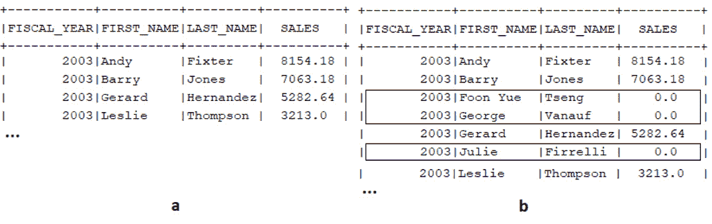

# *第六章*：处理不同类型的 JOIN

SQL 的 `JOIN` 子句代表了最常用的 SQL 功能之一。从众所周知的 `INNER` 和 `OUTER JOIN` 子句，到虚构的半和反 JOIN，再到花哨的 `LATERAL` JOIN，本章提供了一套全面的示例，旨在帮助您通过 jOOQ DSL API 练习各种 `JOIN` 子句。

本章的主题包括以下内容：

+   练习最流行的 JOIN 类型（`CROSS`、`INNER` 和 `OUTER`）

+   SQL 的 `USING` 和 jOOQ 的 `onKey()` 快捷方式

+   练习更多类型的 `JOINs`（隐式、自身、`NATURAL`、`STRAIGHT`、半、反和 `LATERAL`）

让我们开始吧！

# 技术要求

本章的代码可以在 GitHub 上找到：[`github.com/PacktPublishing/jOOQ-Masterclass/tree/master/Chapter06`](https://github.com/PacktPublishing/jOOQ-Masterclass/tree/master/Chapter06)。

# 练习最流行的 JOIN 类型

通过最流行的 `JOIN` 语句类型，我们指的是 `CROSS JOIN`、`INNER JOIN`、`LEFT JOIN`、`RIGHT JOIN` 和 `FULL JOIN`。让我们通过 jOOQ DSL API 来解决每个问题，从最基本的 `JOIN` 类型开始。

## CROSS JOIN

`CROSS JOIN` 是最基本的 `JOIN` 类型，它在笛卡尔积中实现。有两个表 `A` 和 `B`，它们之间的 `CROSS JOIN` 操作表示为 `A x B`，实际上，这意味着 `A` 表的每一行与 `B` 表的每一行的组合。

在 jOOQ 中，`CROSS JOIN` 可以通过在 `FROM` 子句中列出表（非 `-ANSI JOIN` 语法）或通过 `crossJoin()` 方法来渲染，该方法渲染 `CROSS JOIN` 关键字（`ANSI JOIN` 语法）。以下是第一种情况——让我们将 `OFFICE` 和 `DEPARTMENT` 表进行 `CROSS JOIN`：

```java
ctx.select().from(OFFICE, DEPARTMENT).fetch();
```

由于此查询没有明确或清晰地表达其使用 `CROSS JOIN` 的意图，因此它不如以下使用 jOOQ `crossJoin()` 方法的查询友好：

```java
ctx.select().from(OFFICE).crossJoin(DEPARTMENT).fetch();
```

使用 `crossJoin()` 方法渲染 `CROSS JOIN` 关键字（`ANSI JOIN` 语法），这清楚地传达了我们的意图，并消除了任何潜在的混淆：

```java
SELECT `classicmodels`.`office`.`office_code`,
```

```java
       `classicmodels`.`office`.`city`,
```

```java
       ...
```

```java
       `classicmodels`.`department`.`department_id`,
```

```java
       `classicmodels`.`department`.`name`,
```

```java
       ...
```

```java
FROM `classicmodels`.`office`
```

```java
CROSS JOIN `classicmodels`.`department`
```

由于一些办公室的 `CITY` 和/或 `COUNTRY` 列具有 `NULL` 值，我们可以通过谓词轻松排除它们从 `OFFICE x DEPARTMENT` 中。此外，仅为了好玩，我们可能更喜欢将结果连接为 *城市，国家：部门*（例如，*旧金山，美国：广告*）：

```java
 ctx.select(concat(OFFICE.CITY, inline(", "), OFFICE.COUNTRY,
```

```java
            inline(": "), DEPARTMENT.NAME).as("offices"))
```

```java
    .from(OFFICE).crossJoin(DEPARTMENT)
```

```java
    .where(row(OFFICE.CITY, OFFICE.COUNTRY).isNotNull())
```

```java
    .fetch();
```

基本上，一旦我们添加了一个谓词，这就会变成 `INNER JOIN`，正如以下章节所讨论的。更多示例可以在捆绑的代码中的 *CrossJoin* 中找到。

## INNER JOIN

`INNER JOIN`（或简称 `JOIN`）表示通过某些谓词进行筛选的笛卡尔积，这些谓词通常放在 `ON` 子句中。因此，对于 `A` 和 `B` 表，`INNER JOIN` 返回满足指定谓词的 `A x B` 的行。

在 jOOQ 中，我们通过`innerJoin()`（如果您的数据库供应商支持省略`INNER`，则可以简单地使用`join()`）和`on()`方法渲染`INNER JOIN`。以下是一个在`EMPLOYEE`和`OFFICE`之间应用`INNER JOIN`以获取员工姓名及其办公室城市的示例：

```java
ctx.select(EMPLOYEE.FIRST_NAME, 
```

```java
           EMPLOYEE.LAST_NAME, OFFICE.CITY)
```

```java
   .from(EMPLOYEE)
```

```java
   .innerJoin(OFFICE)
```

```java
   .on(EMPLOYEE.OFFICE_CODE.eq(OFFICE.OFFICE_CODE))
```

```java
   .fetch();
```

对于 MySQL 方言的渲染 SQL 如下：

```java
SELECT `classicmodels`.`employee`.`first_name`,
```

```java
       `classicmodels`.`employee`.`last_name`,
```

```java
       `classicmodels`.`office`.`city`
```

```java
FROM `classicmodels`.`employee`
```

```java
JOIN `classicmodels`.`office` ON  
```

```java
   `classicmodels`.`employee`.'office_code' 
```

```java
      = `classicmodels`.`office`.`office_code`
```

默认情况下，jOOQ 不会渲染可选的`INNER`关键字。但是，您可以通过`withRenderOptionalInnerKeyword()`设置和`RenderOptionalKeyword.ON`参数来更改此默认设置。

在 jOOQ 中，链式调用多个`JOIN`操作相当简单。例如，获取经理及其办公室需要两个`INNER JOIN`子句，因为`MANAGER`和`OFFICE`之间有一个多对多关系，由`MANAGER_HAS_OFFICE`连接表映射：

```java
ctx.select()
```

```java
   .from(MANAGER)
```

```java
   .innerJoin(OFFICE_HAS_MANAGER)
```

```java
      .on(MANAGER.MANAGER_ID
```

```java
         .eq(OFFICE_HAS_MANAGER.MANAGERS_MANAGER_ID))
```

```java
   .innerJoin(OFFICE)
```

```java
      .on(OFFICE.OFFICE_CODE
```

```java
         .eq(OFFICE_HAS_MANAGER.OFFICES_OFFICE_CODE))
```

```java
   .fetch();
```

在这些示例中，我们在`org.jooq.SelectFromStep`上调用 jOOQ 的连接方法，对于 PostgreSQL 方言的渲染 SQL 如下：

```java
…
```

```java
FROM 
```

```java
   "public"."manager" 
```

```java
JOIN "public"."office_has_manager" 
```

```java
ON "public"."manager"."manager_id" = 
```

```java
   "public"."office_has_manager"."managers_manager_id" 
```

```java
JOIN "public"."office" 
```

```java
ON "public"."office"."office_code" =  
```

```java
   "public"."office_has_manager"."offices_office_code"
```

但是，为了方便起见，我们可以在`org.jooq.Table`的`FROM`子句之后直接调用连接方法。在这种情况下，我们得到以下嵌套流畅代码（请随意使用您认为最方便的方法）：

```java
ctx.select()
```

```java
   .from(MANAGER
```

```java
      .innerJoin(OFFICE_HAS_MANAGER
```

```java
      .innerJoin(OFFICE)
```

```java
         .on(OFFICE.OFFICE_CODE.eq(
```

```java
             OFFICE_HAS_MANAGER.OFFICES_OFFICE_CODE)))
```

```java
      .on(MANAGER.MANAGER_ID.eq(
```

```java
          OFFICE_HAS_MANAGER.MANAGERS_MANAGER_ID)))
```

```java
   .fetch();
```

对于 PostgreSQL 方言的渲染 SQL 如下：

```java
…
```

```java
FROM 
```

```java
   "public"."manager" 
```

```java
JOIN 
```

```java
(
```

```java
   "public"."office_has_manager" 
```

```java
    JOIN "public"."office" 
```

```java
    ON "public"."office"."office_code" = 
```

```java
         "public"."office_has_manager"."offices_office_code"
```

```java
) ON "public"."manager"."manager_id" = 
```

```java
     "public"."office_has_manager"."managers_manager_id"
```

接下来，让我们谈谈`OUTER JOIN`。

## 外连接

虽然`INNER JOIN`只返回通过`ON`谓词的组合，但`OUTER JOIN`还会获取在连接操作的左侧（`LEFT`【外】`JOIN`）或右侧（`RIGHT`【外】`JOIN`）没有匹配的行。当然，我们还要提到`FULL`【外】`JOIN`。这会获取连接操作两边的所有行。

jOOQ API 通过`leftOuterJoin()`、`rightOuterJoin()`和`fullOuterJoin()`渲染`OUTER JOIN`。由于`OUTER`关键字是可选的，我们可以通过类似的方法省略它，即`leftJoin()`、`rightJoin()`和`fullJoin()`。

例如，让我们获取所有员工（左侧）及其销售（右侧）。通过使用`LEFT`【外】`JOIN`，我们可以保留所有员工，即使他们没有销售：

```java
ctx.select(EMPLOYEE.FIRST_NAME, 
```

```java
           EMPLOYEE.LAST_NAME, SALE.SALE_)
```

```java
   .from(EMPLOYEE)
```

```java
   .leftOuterJoin(SALE)
```

```java
   .on(EMPLOYEE.EMPLOYEE_NUMBER.eq(SALE.EMPLOYEE_NUMBER))
```

```java
   .fetch();
```

如果我们只想保留没有销售的员工，则可以通过添加一个排除所有匹配项的`WHERE`子句来依赖一个专用的`LEFT`【外】`JOIN`：

```java
ctx.select(EMPLOYEE.FIRST_NAME, 
```

```java
           EMPLOYEE.LAST_NAME, SALE.SALE_)
```

```java
   .from(EMPLOYEE)
```

```java
   .leftOuterJoin(SALE)
```

```java
   .on(EMPLOYEE.EMPLOYEE_NUMBER.eq(SALE.EMPLOYEE_NUMBER))
```

```java
   .where(SALE.EMPLOYEE_NUMBER.isNull())
```

```java
   .fetch();
```

对于 SQL Server 方言的渲染 SQL 如下：

```java
SELECT
```

```java
  [classicmodels].[dbo].[employee].[first_name],
```

```java
  [classicmodels].[dbo].[employee].[last_name],
```

```java
  [classicmodels].[dbo].[sale].[sale] 
```

```java
FROM
```

```java
  [classicmodels].[dbo].[employee] 
```

```java
LEFT OUTER JOIN
```

```java
  [classicmodels].[dbo].[sale] 
```

```java
ON [classicmodels].[dbo].[employee].[employee_number] =     
```

```java
   [classicmodels].[dbo].[sale].[employee_number] 
```

```java
WHERE [classicmodels].[dbo].[sale].[employee_number] IS NULL
```

如果您更喜欢使用 Oracle 的`+`符号简写来执行`OUTER JOIN`，请查看以下`LEFT [OUTER] JOIN`的示例：

```java
ctx.select(EMPLOYEE.FIRST_NAME, 
```

```java
           EMPLOYEE.LAST_NAME, SALE.SALE_)
```

```java
   .from(EMPLOYEE, SALE)
```

```java
   .where(SALE.EMPLOYEE_NUMBER.plus()
```

```java
       .eq(EMPLOYEE.EMPLOYEE_NUMBER))
```

```java
   .fetch();
```

并且，Oracle SQL 如下：

```java
SELECT 
```

```java
  "CLASSICMODELS"."EMPLOYEE"."FIRST_NAME", 
```

```java
  "CLASSICMODELS"."EMPLOYEE"."LAST_NAME", 
```

```java
  "CLASSICMODELS"."SALE"."SALE" 
```

```java
FROM 
```

```java
  "CLASSICMODELS"."EMPLOYEE", 
```

```java
  "CLASSICMODELS"."SALE" 
```

```java
WHERE 
```

```java
  "CLASSICMODELS"."SALE"."EMPLOYEE_NUMBER"(+) =  
```

```java
     "CLASSICMODELS"."EMPLOYEE"."EMPLOYEE_NUMBER"
```

默认情况下，jOOQ 为`leftOuterJoin()`和`leftJoin()`都渲染可选的`OUTER`关键字。通过`withRenderOptionalOuterKeyword()`设置和`RenderOptionalKeyword.ON`参数来更改此默认设置。

在捆绑的代码中，您可以练习更多示例，包括`RIGHT`/`FULL`【外】`JOIN`。对于不支持`FULL`【外】`JOIN`的 MySQL，我们基于`UNION`子句编写了一些模拟代码。

重要提示

`OUTER JOIN`的一个特殊情况是 Oracle 的分区`OUTER JOIN`。

## 分区外连接

Oracle 的分区外部连接是`OUTER JOIN`的一个特殊情况。这种连接代表了对经典`OUTER JOIN`语法的扩展，并应用于通过`PARTITION BY`子句中的表达式定义的每个逻辑分区。分区外部连接返回分区表（逻辑分区）中每个分区的外部连接与连接另一侧的表的`UNION`。

分区外部连接是 Oracle 特有的，它们允许我们使用相当方便的语法和高效的执行计划来执行相同的“密集化”（填充稀疏数据）操作。

Oracle 分区外部连接可以使用的经典场景听起来是这样的：编写一个查询，返回每个员工（*销售代表*）在每个财政年度的销售情况，同时考虑到一些员工在某些年份没有销售——用 0 填充稀疏数据中的空白。例如，如果我们尝试通过简单的`JOIN`查看所有员工（*销售代表*）按财政年度分组的销售情况，那么我们会在以下图中获得一些数据空白：



图 6.1 – 填充稀疏数据中的空白

在图(a)中是我们容易从简单的`JOIN`中得到的，而在图(b)中是我们计划得到的。因此，我们希望看到所有的*销售代表*，即使他们在某些年份没有销售。这是 Oracle 分区外部连接的工作，其中逻辑分区是`FISCAL_YEAR`：

```java
ctx.select(SALE.FISCAL_YEAR, 
```

```java
           EMPLOYEE.FIRST_NAME, EMPLOYEE.LAST_NAME, 
```

```java
           sum(nvl(SALE.SALE_, 0.0d)).as("SALES")) 
```

```java
   .from(EMPLOYEE) 
```

```java
   .leftOuterJoin(SALE).partitionBy(SALE.FISCAL_YEAR) 
```

```java
   .on(EMPLOYEE.EMPLOYEE_NUMBER.eq(SALE.EMPLOYEE_NUMBER)) 
```

```java
   .where(EMPLOYEE.JOB_TITLE.eq("Sales Rep")) 
```

```java
   .groupBy(SALE.FISCAL_YEAR, 
```

```java
            EMPLOYEE.FIRST_NAME, EMPLOYEE.LAST_NAME) 
```

```java
   .orderBy(1, 2) 
```

```java
   .fetch(); 
```

当然，你可以不使用分区的外部连接来表示/模拟这个查询，但为此你必须查看*PartitionedOuterJoin*应用程序。

# SQL 的 USING 和 jOOQ onKey()快捷方式

到目前为止，我们已经涵盖了在日常工作中最常用的典型`JOIN`。在我们继续介绍更多类型的`JOIN`之前，让我们介绍两个方便的快捷方式，这些快捷方式对于表达更简洁的`JOIN`非常有用。

## SQL JOIN … USING

在某些情况下，SQL 的`JOIN … USING`子句可以是一个方便的替代经典`JOIN … ON`子句的选择。我们不需要在`JOIN … ON`子句中指定条件，而是将`JOIN … USING`子句列入一组字段（列）中，这些字段的名称是两个表共有的——`JOIN`操作的左侧表和右侧表。在 jOOQ 中，`USING`子句通过`using()`方法实现，如下面的示例所示。`using()`中提到的`EMPLOYEE_NUMBER`列是`EMPLOYEE`表的主键，也是`SALE`表的外键：

```java
ctx.select(EMPLOYEE.FIRST_NAME, EMPLOYEE.LAST_NAME,    
```

```java
           SALE.SALE_)
```

```java
   .from(EMPLOYEE)
```

```java
   .innerJoin(SALE)
```

```java
   .using(EMPLOYEE.EMPLOYEE_NUMBER)
```

```java
   .fetch();
```

因此，`using(EMPLOYEE.EMPLOYEE_NUMBER)`是`on(EMPLOYEE.EMPLOYEE_NUMBER.eq(SALE.EMPLOYEE_NUMBER))`的一个更简洁的表达，MySQL 方言的渲染 SQL 如下：

```java
SELECT `classicmodels`.`employee`.`first_name`,
```

```java
       `classicmodels`.`employee`.`last_name`,
```

```java
       `classicmodels`.`sale`.`sale`
```

```java
FROM `classicmodels`.`employee`
```

```java
JOIN `classicmodels`.`sale` USING (`employee_number`)
```

但我们可以使用任何其他字段。以下是用于组合主键的`USING`子句：

```java
...using(PRODUCTLINE.PRODUCT_LINE, PRODUCTLINE.CODE)
```

或者，这是一个用于两个非主键/外键字段的`USING`子句：

```java
.using(OFFICE.CITY, OFFICE.COUNTRY)
```

注意，没有参数的 `using()` 会渲染 `ON TRUE`，因此不会对连接操作应用任何过滤器。通过捆绑的 *JoinUsing* 应用程序练习完整的示例。接下来，让我们介绍 jOOQ 中的一个非常有用的工具，名为 `onKey()`。

然而，正如我所说的，`USING` 只适用于某些情况。Lukas Eder 强调了这一点：“*`USING` 子句在查询变得复杂时会导致维护查询变得更加困难，因此通常不推荐使用。它在类型安全性方面较差（在 jOOQ 中）。当你重命名一个列时，你的 jOOQ 代码可能仍然可以编译。如果你使用的是 `ON`，则不会这样。当你添加一个意外匹配 `USING` 中引用的列的新列时，你可能会在不相关的查询中得到意外的后果。例如，*`A JOIN B USING (X) JOIN C USING (Y)`*。这假设了*`A(X)`*、*`B(X, Y)`*、*`C(Y)`*。那么，如果你添加*`A(Y)`*会发生什么？会抛出一个运行时异常，因为*`Y`*现在变得模糊不清。或者，更糟糕的是：如果你添加*`A(Y)`*但移除*`B(Y)`*会发生什么？不会抛出运行时异常，但可能（并且悄无声息地）得到错误的查询。此外，在 Oracle 中，从 `USING` 引用的列不能再在查询中进行限定。总之，`USING` 可以用于快速且简单的即席查询，就像 `NATURAL` 一样。但我不建议在生产查询中使用它。特别是，因为隐式连接在 jOOQ 中工作得更好。”

“这里的本质始终是事实（这一点经常被误解），连接是两个表之间的 *二元* 操作符。例如，*`A JOIN B USING (X) JOIN C USING (Y)`* 简短地等同于 *`(A JOIN B USING (X)) JOIN C USING (Y)`*，因此 *`C`* 是连接到 *`(A JOIN B USING (X))`* 而不是单独连接到 *`B`*。这也适用于 *`onKey()`*。”

## jOOQ onKey()

每当我们连接一个已知的 foreign key 关系时，我们都可以依赖 jOOQ 的 `onKey()` 方法。由于这对于简单的 foreign key 来说很容易理解，让我们选择一个包含两个字段的复合 foreign key。查看以下 `ON` 子句：

```java
ctx.select(...)
```

```java
   .from(PAYMENT)
```

```java
   .innerJoin(BANK_TRANSACTION)
```

```java
   .on(PAYMENT.CUSTOMER_NUMBER.eq(
```

```java
       BANK_TRANSACTION.CUSTOMER_NUMBER)               
```

```java
   .and(PAYMENT.CHECK_NUMBER.eq(
```

```java
       BANK_TRANSACTION.CHECK_NUMBER)))
```

(`CUSTOMER_NUMBER`, `CHECK_NUMBER`) 代表 `BANK_TRANSACTION` 表中的一个复合外键。jOOQ 允许我们使用不带参数的 `onKey()` 方法替换这个冗长的 `ON` 子句，如下所示：

```java
ctx.select(...)
```

```java
   .from(PAYMENT)
```

```java
   .innerJoin(BANK_TRANSACTION)
```

```java
   .onKey()
```

```java
   .fetch();
```

真的很酷，不是吗？jOOQ 代表我们推断 `ON` 条件，渲染的 MySQL SQL 如下所示：

```java
SELECT ...
```

```java
FROM `classicmodels`.`payment`
```

```java
JOIN `classicmodels`.`bank_transaction` 
```

```java
ON (`classicmodels`.`bank_transaction`.`customer_number` 
```

```java
  = `classicmodels`.`payment`.`customer_number`
```

```java
AND `classicmodels`.`bank_transaction`.`check_number` 
```

```java
  = `classicmodels`.`payment`.`check_number`)
```

在多个键的潜在匹配引起的歧义情况下，我们也可以通过 `onKey(TableField<?,?>... tfs)` 使用外键的字段引用，或者通过生成的外键引用 `onKey(ForeignKey<?,?> fk)`。例如，为了避免在通过 `onKey()` 连接表 X 和表 Y 时出现的 `DataAccessException`：*“X 和 Y 表之间的键模糊”* 异常，我们可以明确指出应使用的外键如下（在这里，通过 SQL Server 生成的外键引用 `jooq.generated.Keys.PRODUCTLINEDETAIL_PRODUCTLINE_FK`）：

```java
ctx.select(…)
```

```java
   .from(PRODUCTLINE)
```

```java
   .innerJoin(PRODUCTLINEDETAIL)
```

```java
   .onKey(PRODUCTLINEDETAIL_PRODUCTLINE_FK)
```

```java
   .fetch();
```

这次，渲染的 SQL 如下所示：

```java
SELECT ... 
```

```java
FROM [classicmodels].[dbo].[productline] 
```

```java
JOIN 
```

```java
     [classicmodels].[dbo].[productlinedetail] 
```

```java
  ON 
```

```java
   ([classicmodels].[dbo].[productlinedetail].[product_line] = 
```

```java
    [classicmodels].[dbo].[productline].[product_line] 
```

```java
  AND 
```

```java
    [classicmodels].[dbo].[productlinedetail].[code] = 
```

```java
    [classicmodels].[dbo].[productline].[code]) 
```

但尽管这种方法很有吸引力，它可能会导致问题。正如卢卡斯·埃德尔在这里分享的：“*`onKey()` 方法不是类型安全的，当表被修改时，可能会以微妙的方式出错。*”

在名为 *JoinOnKey* 的应用程序中提供了更多示例。现在，让我们继续探讨更多类型的 `JOIN`。

# 练习更多类型的 JOIN

接下来，让我们探讨更多 `JOIN` 类型，例如隐式/自连接、`NATURAL JOIN`、`STRAIGHT JOIN`、半/反连接和 `LATERAL` 连接。让我们继续探讨隐式/自连接。

## 隐式和自连接

通过 jOOQ 生成器在镜像数据库表的类中产生的类型安全导航方法，隐式连接和自连接可以很容易地在 jOOQ 中表达。让我们分析隐式连接的这一方面。

### 隐式连接

例如，一个显式连接，它从给定的子表中检索父表的列，可以表示为一个隐式连接。以下是显式连接：

```java
SELECT o.office_code, e.first_name, e.last_name
```

```java
FROM employee AS e
```

```java
JOIN office AS o ON e.office_code = o.office_code
```

这里是更简洁的隐式连接版本：

```java
SELECT e.office.office_code, e.first_name, e.last_name
```

```java
FROM employee AS e
```

如果我们检查生成的基于 Java 的模式，那么我们会注意到镜像 `EMPLOYEE` 表的 `jooq.generated.tables.Employee` 类包含一个名为 `office()` 的方法，专门用于表达这种语法。以下是之前的隐式连接，通过 jOOQ DSL API 编写：

```java
ctx.select(EMPLOYEE.office().OFFICE_CODE, 
```

```java
           EMPLOYEE.FIRST_NAME, EMPLOYEE.LAST_NAME)
```

```java
   .from(EMPLOYEE)
```

```java
   .fetch();
```

这里是另一个示例，它通过链式调用几个导航方法来表达隐式连接，从 `ORDERDETAIL` 表开始：

```java
ctx.select(                      
```

```java
      ORDERDETAIL.order().customer().employee().OFFICE_CODE,
```

```java
      ORDERDETAIL.order().customer().CUSTOMER_NAME,
```

```java
      ORDERDETAIL.order().SHIPPED_DATE,       
```

```java
      ORDERDETAIL.order().STATUS,
```

```java
      ORDERDETAIL.QUANTITY_ORDERED, ORDERDETAIL.PRICE_EACH)
```

```java
   .from(ORDERDETAIL)
```

```java
   .orderBy(ORDERDETAIL.order().customer().CUSTOMER_NAME)
```

```java
   .fetch();
```

这些导航方法的名称与父表名称相对应。以下是一个在多对多关系（m:n）中编写隐式连接的另一个示例。如果我们从关系表考虑 m:n 关系，那么我们会看到两个一对一关系，我们可以如下利用它们（在 `MANAGER` 和 `OFFICE` 之间存在多对多关系）：

```java
ctx.select(OFFICE_HAS_MANAGER.manager().fields())
```

```java
   .from(OFFICE_HAS_MANAGER)
```

```java
   .where(OFFICE_HAS_MANAGER.office().OFFICE_CODE.eq("6"))
```

```java
   .fetch();
```

注意，本节中介绍的隐式连接是基于 *外键路径* 的。很可能你也熟悉隐式连接，其中你在 `FROM` 子句中列出所有想要从中获取数据的表，然后是 `WHERE` 子句，它基于主键/外键值的条件来过滤结果。以下是一个此类隐式连接的 jOOQ 代码示例：

```java
ctx.select(OFFICE.OFFICE_CODE, 
```

```java
           EMPLOYEE.FIRST_NAME, EMPLOYEE.LAST_NAME)
```

```java
   .from(OFFICE, EMPLOYEE)
```

```java
   .where(OFFICE.OFFICE_CODE.eq(EMPLOYEE.OFFICE_CODE))
```

```java
   .orderBy(OFFICE.OFFICE_CODE)
```

```java
   .fetch();
```

注意

然而，请注意，这类隐式连接很容易出错，最好通过显式使用 `JOIN` 关键字依赖 ANSI JOIN 语法。让我利用这个上下文来说明，无论何时你有应该更新为 ANSI JOIN 的旧代码，你都可以依赖 jOOQ。除了 jOOQ DSL API 之外，你可以查看 [`www.jooq.org/translate`](https://www.jooq.org/translate)，并且为了快速而简洁的指南，阅读这篇文章：[`blog.jooq.org/2020/11/17/automatically-transform-oracle-style-implicit-joins-to-ansi-join-using-jooq/`](https://blog.jooq.org/2020/11/17/automatically-transform-oracle-style-implicit-joins-to-ansi-join-using-jooq/)。

在没有在模式中明确的外键（包括表实际上是视图的任何原因）的情况下，商业版用户可以像在*第十一章*中看到的那样，将合成外键指定给代码生成器，即*jOOQ 键*。

请考虑 jOOQ 手册和[`github.com/jOOQ/jOOQ/issues/12037`](https://github.com/jOOQ/jOOQ/issues/12037)以了解隐式连接支持的局限性。离开隐式连接的上下文，jOOQ 的导航方法也适用于表达自连接。

### 自连接

当一个表与自身连接时，我们可以依赖自连接。通过具有与表本身相同名称的导航方法来编写自连接。例如，以下是一个自连接，它检索包含每个员工及其老板名称（`EMPLOYEE.REPORTS_TO`）的结果集：

```java
ctx.select(concat(EMPLOYEE.FIRST_NAME, inline(" "), 
```

```java
           EMPLOYEE.LAST_NAME).as("employee"),
```

```java
           concat(EMPLOYEE.employee().FIRST_NAME, inline(" "), 
```

```java
           EMPLOYEE.employee().LAST_NAME).as("reports_to"))
```

```java
   .from(EMPLOYEE)
```

```java
   .fetch();
```

在捆绑的代码*ImplicitAndSelfJoin*中，您可以练习更多关于隐式和自连接的示例。

## NATURAL JOIN

之前，我们通过列出两个表（连接操作的左表和右表）中名称相同的字段（`JOIN … USING`语法）来使用`JOIN … USING`语法，这些字段应该在`ON`子句的条件中呈现。或者，我们可以依赖`NATURAL JOIN`，它不需要任何`JOIN`条件。这导致了一种极简的语法，但也使得我们的查询具有双刃剑的特点。

基本上，`NATURAL JOIN`自动识别两个连接表中共享名称的所有列，并使用它们来定义`JOIN`条件。当主键/外键列具有相同的名称时，这非常有用，如下例所示：

```java
ctx.select().from(EMPLOYEE)
```

```java
   .naturalJoin(SALE)
```

```java
   .fetch();
```

jOOQ API 中的`NATURAL JOIN`依赖于`naturalJoin()`方法。除了这个方法之外，我们还有对应于`LEFT`/`RIGHT`/`FULL NATURAL OUTER JOIN`的`naturalLeftOuterJoin()`、`naturalRightOuterJoin()`和`naturalFullOuterJoin()`方法。此外，您可能还想阅读关于使用`NATURAL FULL JOIN`比较两个表的[`blog.jooq.org/2020/08/05/use-natural-full-join-to-compare-two-tables-in-sql/`](https://blog.jooq.org/2020/08/05/use-natural-full-join-to-compare-two-tables-in-sql/)文章。您可以在捆绑的代码中看到所有这些方法的应用。

对于我们的示例，PostgreSQL 方言的渲染 SQL 如下：

```java
SELECT "public"."employee"."employee_number", ...
```

```java
       "public"."sale"."sale_id", ...
```

```java
FROM "public"."employee"
```

```java
NATURAL JOIN "public"."sale"
```

`EMPLOYEE`和`SALE`表共享一个单列名称，`EMPLOYEE_NUMBER`——在`EMPLOYEE`中是主键，在`SALE`中是外键。这个列在幕后被`NATURAL JOIN`用于过滤结果，这是预期的行为。

但是，记住`NATURAL JOIN`会选取所有具有相同名称的列，而不仅仅是主键/外键列，因此这种`JOIN`可能会产生不希望的结果。例如，如果我们连接`PAYMENT`和`BANK_TRANSACTION`表，那么`NATURAL JOIN`将使用共同的复合键（`CUSTOMER_NUMBER`，`CHECK_NUMBER`），但也会使用`CACHING_DATE`列。如果这不是我们的意图，那么`NATURAL JOIN`就不是合适的选择。期望只使用（`CUSTOMER_NUMBER`，`CHECK_NUMBER`）是错误的假设，建议依赖于`ON`子句或 jOOQ 的`onKey()`方法：

```java
ctx.select()
```

```java
   .from(PAYMENT.innerJoin(BANK_TRANSACTION).onKey())
```

```java
   .fetch();
```

另一方面，如果我们期望只使用`CACHING_DATE`列（这很难相信），那么`USING`子句可以是一个好的替代方案：

```java
ctx.select()
```

```java
   .from(PAYMENT.innerJoin(BANK_TRANSACTION)
```

```java
   .using(PAYMENT.CACHING_DATE))                       
```

```java
   .fetch();
```

如果我们需要任何具有相同名称的列的任何自定义组合，`USING`子句是有用的。另一方面，`NATURAL JOIN`更容易出现问题，因为任何导致新匹配列名称的架构更改都会使`NATURAL JOIN`将新列也组合进去。

还值得记住的是，Oracle 不接受用于`NATURAL JOIN`过滤结果的列具有限定符（*ORA-25155 – NATURAL join 中使用的列不能有限定符*）。在这种情况下，使用默认设置的 jOOQ Java 模式会带来一些问题。例如，表达式`ctx.select().from(EMPLOYEE).naturalJoin(SALE)…`会导致 ORA-25155，因为默认情况下，jOOQ 会对`SELECT`中渲染的列进行限定，包括用于`NATURAL JOIN`的公共`EMPLOYEE_NUMBER`列。一个快速的解决方案是显式地通过`asterisk()`渲染`*`而不是列列表：

```java
ctx.select(asterisk())
```

```java
   .from(PRODUCT)
```

```java
   .naturalJoin(TOP3PRODUCT)
```

```java
   .fetch();
```

或者，我们可以避免使用基于 Java 的模式，并编写如下：

```java
ctx.select()
```

```java
   .from(table("EMPLOYEE"))
```

```java
   .naturalJoin(table("SALE"))
```

```java
   .fetch()
```

如果连接是`INNER`/`LEFT OUTER JOIN`，则未指定对公共列的引用被认为属于左侧表；如果是`RIGHT OUTER JOIN`，则属于右侧表。

或者，Oracle 的`NATURAL JOIN`与 Oracle 专有的具有连接条件的等值连接（等值连接依赖于包含等性运算符的连接条件）相同。

如同往常，你可以在捆绑的代码中练习所有这些示例以及更多。应用程序名为*NaturalJoin*。接下来，让我们来处理`STRAIGHT JOIN`。

## STRAIGHT JOIN

从一开始，我们必须提到`STRAIGHT JOIN`是 MySQL 特有的。

基本上，`STRAIGHT JOIN`指示 MySQL 始终在`JOIN`的右侧表之前读取左侧表。在这种情况下，`STRAIGHT JOIN`可能有助于影响 MySQL 为某个`JOIN`选择的执行计划。每当我们认为查询优化器将`JOIN`表放置了错误的顺序时，我们都可以通过`STRAIGHT JOIN`来影响这个顺序。

例如，假设`PRODUCT`表有 5,000 行，`ORDERDETAIL`表有 20,000,000 行，`ORDER`表有 3,000 行，并且我们有一个如下所示的连接：

```java
ctx.select(PRODUCT.PRODUCT_ID, ORDER.ORDER_ID)
```

```java
   .from(PRODUCT)
```

```java
   .innerJoin(ORDERDETAIL).on(
```

```java
       ORDERDETAIL.PRODUCT_ID.eq(PRODUCT.PRODUCT_ID))
```

```java
   .innerJoin(ORDER).on(
```

```java
       ORDER.ORDER_ID.eq(ORDERDETAIL.ORDER_ID))
```

```java
   .fetch();
```

现在，MySQL 可能会或不会考虑 `ORDER.ORDER_ID` 和 `ORDERDETAIL.ORDER_ID` 与 `PRODUCT.PRODUCT_ID` 和 `ORDERDETAIL.PRODUCT_ID` 之间的交集大小。如果 `ORDERDETAIL` 和 `ORDER` 之间的连接返回与 `ORDERDETAIL` 相同数量的行，那么这并不是一个最佳选择。如果从 `PRODUCT` 开始连接可以将 `ORDERDETAIL` 过滤到与 `PRODUCT` 相同数量的行，那么这将是一个最佳选择。这种行为可以通过 jOOQ 的 `straightJoin()` 方法强制执行，该方法生成一个 `STRAIGHT JOIN` 语句，如下所示：

```java
ctx.select(PRODUCT.PRODUCT_ID, ORDER.ORDER_ID)
```

```java
   .from(PRODUCT)
```

```java
   .straightJoin(ORDERDETAIL).on(
```

```java
       ORDERDETAIL.PRODUCT_ID.eq(PRODUCT.PRODUCT_ID))
```

```java
   .innerJoin(ORDER).on(
```

```java
       ORDER.ORDER_ID.eq(ORDERDETAIL.ORDER_ID))
```

```java
   .fetch();
```

在 Oracle 中，可以通过 `/*+LEADING(a, b)*/` 提示来更改 `JOINs` 的顺序。在 jOOQ 中，这种提示可以通过 `hint()` 方法传递：

```java
ctx.select(PRODUCT.PRODUCT_ID, ORDER.ORDER_ID) 
```

```java
   .hint("/*+LEADING(CLASSICMODELS.ORDERDETAIL 
```

```java
                     CLASSICMODELS.PRODUCT)*/") 
```

```java
   … // joins come here 
```

在 SQL Server 中，这可以通过 `OPTION (FORCE ORDER)` 实现：

```java
ctx.select(PRODUCT.PRODUCT_ID, ORDER.ORDER_ID) 
```

```java
   … // joins come here 
```

```java
   .option("OPTION (FORCE ORDER)") 
```

```java
   .fetch(); 
```

尽管如此，正如 Lukas Eder 在这里分享的：“*MySQL 的问题应该由于他们添加了哈希连接支持而大大减轻。无论如何，我认为应该添加一个关于使用提示进行过早优化的免责声明。在有合理优化器的系统中，提示几乎不再需要了。*”

你可以通过运行可用的 *StraightJoin* 应用程序来查看生成的 SQL。接下来，让我们介绍半连接和反连接。

## 半连接和反连接

半连接和反连接是关系代数运算符，在 SQL 语法中没有直接对应项。除了使用 Cloudera Impala 的情况，它为半/反连接提供了原生语法，我们不得不依赖解决方案。在这种情况下，半连接可以通过 `EXISTS`/`IN` 和反连接通过 `NOT EXISTS`/`NOT IN` 谓词来模拟。

由于半/反连接可以通过 (`NOT`) `EXISTS`/(`NOT`) `IN` 谓词来模拟，这意味着我们实际上并没有连接右侧。在半连接的情况下，我们只从第一个表（左侧表）中获取在第二个表（右侧表）中找到匹配的行，而在反连接的情况下，我们正好与半连接相反；我们只从第一个表（左侧表）中获取在第二个表（右侧表）中没有找到匹配的行。

例如，让我们获取所有具有 `CUSTOMER` 的 `EMPLOYEE` 的名称。通过通过 `EXISTS` 谓词模拟的半连接来完成此操作，在 SQL 中可以这样进行：

```java
SELECT employee.first_name, employee.last_name FROM employee
```

```java
WHERE EXISTS
```

```java
    (SELECT 1 FROM customer 
```

```java
     WHERE employee.employee_number 
```

```java
              = customer.sales_rep_employee_number);
```

在捆绑的代码中，你可以看到如何通过 jOOQ DSL API 表达这种 SQL。此外，你可以通过 `IN` 谓词模拟这种用例进行练习。现在，让我们使用 jOOQ 方法，它填补了表达能力的空白，并通过 `leftSemiJoin()` 方法强制执行使用半连接的明确意图。这个 jOOQ 方法为我们节省了很多麻烦——整洁的代码总是能够在不同的 SQL 方言中正确模拟，而且处理复杂情况（如嵌套 `EXISTS`/`IN` 谓词）时不会让人头疼，这会让你爱上这个方法：

```java
ctx.select(EMPLOYEE.FIRST_NAME, EMPLOYEE.LAST_NAME)
```

```java
   .from(EMPLOYEE)
```

```java
   .leftSemiJoin(CUSTOMER)
```

```java
   .on(EMPLOYEE.EMPLOYEE_NUMBER.eq(
```

```java
       CUSTOMER.SALES_REP_EMPLOYEE_NUMBER))
```

```java
   .fetch();
```

这真是太棒了！查看捆绑的代码，*SemiAndAntiJoin*，以查看更多关于通过 jOOQ DSL API 链接和/或嵌套半连接的示例。每次，查看生成的 SQL 并对 jOOQ 表示衷心的感谢！

接下来，让我们专注于反连接。反连接是半连接的相反，通过 `NOT EXISTS`/`NOT IN` 谓词来模拟。例如，让我们编写一个表示反连接的 SQL，通过 `NOT EXISTS` 检索所有没有 `CUSTOMER` 的 `EMPLOYEE` 的名称：

```java
SELECT employee.first_name, employee.last_name FROM employee
```

```java
WHERE NOT (EXISTS
```

```java
       (SELECT 1
```

```java
       FROM customer
```

```java
       WHERE employee.employee_number 
```

```java
               = customer.sales_rep_employee_number))
```

在捆绑的代码中，你可以看到如何通过 jOOQ DSL API 表达这个 SQL，以及基于 `NOT IN` 谓词的相同示例。然而，我强烈建议你避免使用 `NOT IN` 并选择 `NOT EXISTS`。

重要提示

很可能，你已经知道了这一点，但只是为了快速提醒，让我们提一下，`EXISTS` 和 `IN` 谓词是等价的，但 `NOT EXISTS` 和 `NOT IN` 谓词则不是，因为（如果有）`NULL` 值会导致不希望的结果。有关更多详细信息，请阅读这篇简短但至关重要的文章：[`blog.jooq.org/2012/01/27/sql-incompatibilities-not-in-and-null-values/`](https://blog.jooq.org/2012/01/27/sql-incompatibilities-not-in-and-null-values/)。

或者，甚至更好，使用由 `leftAntiJoin()` 方法表示的 jOOQ 反连接：

```java
ctx.select(EMPLOYEE.FIRST_NAME, EMPLOYEE.LAST_NAME)
```

```java
   .from(EMPLOYEE)
```

```java
   .leftAntiJoin(CUSTOMER)
```

```java
   .on(EMPLOYEE.EMPLOYEE_NUMBER.eq(
```

```java
       CUSTOMER.SALES_REP_EMPLOYEE_NUMBER))
```

```java
   .fetch();
```

查看名为 *SemiAndAntiJoin* 的应用程序中的生成的 SQL 和更多示例。

反连接通常解决的问题是指关系除法或简单地除法。这是关系代数中的一个运算符，在 SQL 语法中没有直接对应物。简而言之，除法是 `CROSS JOIN` 操作的逆。

例如，让我们考虑 `ORDERDETAIL` 和 `TOP3PRODUCT` 表。虽然 `CROSS JOIN` 给我们的是笛卡尔积 `ORDERDETAIL x TOP3PRODUCT`，但除法给出的是 `ORDERDETAIL ÷ TOP3PRODUCT` 或 `TOP3PRODUCT ÷ ORDERDETAIL`。假设我们想要包含在 `TOP3PRODUCT` 中的至少三个产品的所有订单的 ID。这类任务是一种除法，通常通过两个嵌套的反连接来解决。解决此问题的 jOOQ 代码如下：

```java
ctx.select()
```

```java
   .from(ctx.selectDistinct(ORDERDETAIL.ORDER_ID.as("OID"))
```

```java
   .from(ORDERDETAIL).asTable("T1")
```

```java
   .leftAntiJoin(TOP3PRODUCT    
```

```java
     .leftAntiJoin(ORDERDETAIL)
```

```java
     .on(field("T", "OID")).eq(ORDERDETAIL.ORDER_ID)
```

```java
       .and(TOP3PRODUCT.PRODUCT_ID
```

```java
         .eq(ORDERDETAIL.PRODUCT_ID))))
```

```java
   .on(trueCondition()))
```

```java
  .fetch();
```

这很酷，比通过 `NOT EXISTS` 写同样的事情要简洁得多。但这还不是全部！jOOQ 提供了一个更优雅的解决方案，可以用来表达除法。这个解决方案使用 `divideBy()` 和 `returning()` 方法以简洁、表达性强且非常直观的方式表达除法。查看以下可以替换先前代码的代码：

```java
ctx.select().from(ORDERDETAIL
```

```java
   .divideBy(TOP3PRODUCT)
```

```java
   .on(field(TOP3PRODUCT.PRODUCT_ID).eq(
```

```java
             ORDERDETAIL.PRODUCT_ID))                      
```

```java
   .returning(ORDERDETAIL.ORDER_ID))
```

```java
   .fetch();
```

查看这个示例以及另一个关于在 *BootAntiJoinDivision* 应用程序中查找包含至少给定订单产品订单的示例。

正如卢卡斯·埃德尔在这里指出的：“*如果你想看到 x 是 ÷ 的逆，你可以选择两个不同的表，例如 A x B = C 和 C ÷ B = A*”。

接下来，让我们来探讨 `LATERAL`/`APPLY` 连接。

## LATERAL/APPLY 连接

本章最后讨论的是`LATERAL`/`APPLY`连接。这是标准 SQL 的一部分，与关联子查询非常相似，允许我们返回多行和多/或列，或者与 Java 的`Stream.flatMap()`类似。主要的是，横向内部子查询位于`JOIN`（`INNER`、`OUTER`等）的右侧，它可以被物化为经典子查询、派生表、函数调用、数组展开等。它的力量在于它可以引用（或*横向访问*）左侧的表/列来确定要保留哪些行。`LATERAL`连接会遍历左侧的每一行，为每一行评估内部子查询（右侧），就像典型的 for-each 循环一样。内部子查询返回的行保留到与外部查询的连接结果中。`LATERAL`关键字是必不可少的，因为没有它，每个子查询都会单独（独立）评估，无法访问左侧的列（`FROM`子句中的列）。

例如，选择所有具有`DEPARTMENT`的`OFFICE`可以通过`LATERAL`连接来完成：

```java
ctx.select()
```

```java
   .from(OFFICE, lateral(select().from(DEPARTMENT)
```

```java
   .where(OFFICE.OFFICE_CODE.eq(
```

```java
          DEPARTMENT.OFFICE_CODE))).as("t"))
```

```java
   .fetch()
```

如您所见，jOOQ DSL API 提供了`lateral()`方法来塑造`LATERAL`连接。为 MySQL 方言渲染的 SQL 如下所示：

```java
SELECT `classicmodels`.`office`.`office_code`,...
```

```java
       `t`.`department_id`,
```

```java
       ...
```

```java
FROM `classicmodels`.`office`,
```

```java
  LATERAL
```

```java
   (SELECT `classicmodels`.`department`.`department_id`,...
```

```java
    FROM `classicmodels`.`department`
```

```java
    WHERE `classicmodels`.`office`.`office_code` 
```

```java
        = `classicmodels`.`department`.`office_code`) AS `t`
```

没有显式的`JOIN`，你会期望`CROSS JOIN`（`INNER JOIN ON true / INNER JOIN IN 1=1`）会自动推断。通过`LEFT OUTER JOIN LATERAL`编写前面的查询需要一个虚拟的`ON true / ON 1=1`子句，如下所示：

```java
ctx.select()
```

```java
   .from(OFFICE)
```

```java
   .leftOuterJoin(lateral(select().from(DEPARTMENT)
```

```java
      .where(OFFICE.OFFICE_CODE
```

```java
          .eq(DEPARTMENT.OFFICE_CODE))).as("t"))
```

```java
      .on(trueCondition())
```

```java
   .fetch();
```

`LATERAL`连接有几个用例，它非常适合。例如，它可以用于数组的横向展开，用于查找每个*Foo*的 TOP-N（将 TOP-N 查询与普通表连接），并且与所谓的表值函数结合得很好。

### 展开数组列

如果你是一个 Oracle 或 PostgreSQL 的粉丝，那么你应该知道它们对嵌套数组（或嵌套集合）的支持。在 PostgreSQL 中，我们可以声明一个类型为数组的列，就像声明任何其他类型一样，但以方括号`[]`（例如，`text[]`）结尾。由于 Oracle 只识别名义数组类型，我们必须首先通过`CREATE TYPE`来创建它们。我不会坚持这个纯 SQL 方面，因为我们的目标是跳入 jOOQ DSL API 的使用。

因此，让我们考虑具有名为`TOPIC`的数组列的`DEPARTMENT`表。对于每个部门，我们有一个主题列表（活动领域），并且可能有更多部门有交错的主题。例如，对于`Sale`部门，我们有四个主题——`'commerce'`、`'trade'`、`'sellout'`和`'transaction'`。

现在，假设我们想要获取具有共同主题`'commerce'`和`'business'`的部门。为此，我们可以通过 jOOQ DSL API 使用`lateral()`方法编写一个`LATERAL`连接，并通过`unnest()`方法展开数组（将数组转换为可用的/可查询的表），如下所示：

```java
ctx.select()
```

```java
   .from(DEPARTMENT, lateral(select(field(name("t", "topic")))
```

```java
      .from(unnest(DEPARTMENT.TOPIC).as("t", "topic"))
```

```java
      .where(field(name("t", "topic"))
```

```java
         .in("commerce", "business"))).as("r"))
```

```java
   .fetch();
```

对于 PostgreSQL 方言，渲染 SQL 如下所示：

```java
SELECT
```

```java
  "public"."department"."department_id",
```

```java
  ...
```

```java
  "public"."department"."accrued_liabilities",
```

```java
  "r"."topic" 
```

```java
FROM
```

```java
  "public"."department",
```

```java
 LATERAL (SELECT
```

```java
            "t"."topic" 
```

```java
           FROM
```

```java
            unnest("public"."department"."topic") 
```

```java
               AS "t" ("topic") 
```

```java
           WHERE
```

```java
            "t"."topic" IN (?, ?)) AS "r"
```

注意，MySQL 和 SQL Server 不支持数组（集合）列，但我们可以仍然声明匿名类型的数组，这些数组可以通过相同的 jOOQ `unnest()` 方法展开。接下来，让我们谈谈解决每个 *Foo* 的 TOP-N 任务。

### 解决每个 Foo 的 TOP-N 问题

虽然在整个数据集上解决 TOP-N 问题可能相当具有挑战性，但解决每个 *Foo* 的 TOP-N 问题可能真的很难理解。幸运的是，`LATERAL` 连接非常适合这类问题。例如，获取每个员工的 TOP-3 销售额可以用 jOOQ 表达如下：

```java
ctx.select(EMPLOYEE.EMPLOYEE_NUMBER, EMPLOYEE.FIRST_NAME,
```

```java
           EMPLOYEE.LAST_NAME, field(name("t", "sales")))
```

```java
   .from(EMPLOYEE, 
```

```java
         lateral(select(SALE.SALE_.as("sales"))
```

```java
                    .from(SALE)
```

```java
                    .where(EMPLOYEE.EMPLOYEE_NUMBER
```

```java
                       .eq(SALE.EMPLOYEE_NUMBER))
```

```java
                    .orderBy(SALE.SALE_.desc())
```

```java
                    .limit(3).asTable("t")))
```

```java
   .orderBy(EMPLOYEE.EMPLOYEE_NUMBER)
```

```java
   .fetch();
```

`LATERAL` 连接允许我们访问 `EMPLOYEE.EMPLOYEE_NUMBER` 字段/列，这就是所有魔法所在！MySQL 方言的渲染 SQL 如下所示：

```java
SELECT
```

```java
  `classicmodels`.`employee`.`employee_number`,
```

```java
  `classicmodels`.`employee`.`first_name`,
```

```java
  `classicmodels`.`employee`.`last_name`,
```

```java
  `t`.`sales` 
```

```java
FROM `classicmodels`.`employee`,
```

```java
LATERAL (SELECT `classicmodels`.`sale`.`sale` as `sales` 
```

```java
         FROM `classicmodels`.`sale` 
```

```java
         WHERE `classicmodels`.`employee`.`employee_number` 
```

```java
             = `classicmodels`.`sale`.`employee_number` 
```

```java
        ORDER BY `classicmodels`.`sale`.`sale` desc limit ?) 
```

```java
   as `t` 
```

```java
ORDER BY `classicmodels`.`employee`.`employee_number`
```

如果我们将通过内部 `SELECT` 获得的派生表视为一个具有员工编号作为参数的表值函数，那么在 Oracle 中，我们可以这样写：

```java
CREATE TYPE "TABLE_RES_OBJ" AS OBJECT (SALES FLOAT); 
```

```java
CREATE TYPE "TABLE_RES" AS TABLE OF TABLE_RES_OBJ;
```

```java
CREATE OR REPLACE NONEDITIONABLE FUNCTION    
```

```java
 "TOP_THREE_SALES_PER_EMPLOYEE" ("employee_nr" IN NUMBER) 
```

```java
  RETURN TABLE_RES IS
```

```java
    "table_result" TABLE_RES;
```

```java
  BEGIN
```

```java
    SELECT
```

```java
        TABLE_RES_OBJ("SALE"."SALE") "sales"
```

```java
    BULK COLLECT
```

```java
    INTO "table_result"
```

```java
    FROM
```

```java
        "SALE"
```

```java
    WHERE
```

```java
        "employee_nr" = "SALE"."EMPLOYEE_NUMBER"
```

```java
    ORDER BY
```

```java
        "SALE"."SALE" DESC
```

```java
    FETCH NEXT 3 ROWS ONLY;
```

```java
    RETURN "table_result";
```

```java
  END;
```

接下来，我们可以使用 `LATERAL` 连接来调用此函数。jOOQ 代码如下：

```java
ctx.select(EMPLOYEE.EMPLOYEE_NUMBER, EMPLOYEE.FIRST_NAME,
```

```java
           EMPLOYEE.LAST_NAME, field(name("T", "SALES")))
```

```java
   .from(EMPLOYEE, lateral(select().from(
```

```java
         TOP_THREE_SALES_PER_EMPLOYEE
```

```java
            .call(EMPLOYEE.EMPLOYEE_NUMBER)).asTable("T")))
```

```java
   .orderBy(EMPLOYEE.EMPLOYEE_NUMBER)
```

```java
   .fetch();
```

Oracle 的渲染 SQL 如下所示：

```java
SELECT
```

```java
  "CLASSICMODELS"."EMPLOYEE"."EMPLOYEE_NUMBER",
```

```java
  "CLASSICMODELS"."EMPLOYEE"."FIRST_NAME",
```

```java
  "CLASSICMODELS"."EMPLOYEE"."LAST_NAME",
```

```java
  "T"."SALES" 
```

```java
FROM "CLASSICMODELS"."EMPLOYEE",
```

```java
     LATERAL (SELECT 
```

```java
       "TOP_THREE_SALES_PER_EMPLOYEE"."SALES" 
```

```java
     FROM
```

```java
       table("CLASSICMODELS"."TOP_THREE_SALES_PER_EMPLOYEE"
```

```java
            ("CLASSICMODELS"."EMPLOYEE"."EMPLOYEE_NUMBER"))    
```

```java
             "TOP_THREE_SALES_PER_EMPLOYEE") "T" 
```

```java
ORDER BY "CLASSICMODELS"."EMPLOYEE"."EMPLOYEE_NUMBER"
```

`TOP_THREE_SALES_PER_EMPLOYEE` 静态字段是由 jOOQ 生成器生成的，基本上是一个普通的表，位于 `jooq.generated.tables` 包下的 `TopThreeSalesPerEmployee` 名称下。它可以在 `SELECT` 的 `FROM` 子句中像任何其他表一样使用。然而，请注意，我们有一个名为 `call()` 的方法，用于调用（带有参数）此表值函数。然而，尽管大多数数据库将表值函数视为普通表，但在 Oracle 中，将它们视为独立例程的情况相当普遍。在这种情况下，jOOQ 有一个标志设置，允许我们指示是否将表值函数视为普通表（`true`）或作为普通例程（`false`）。根据此设置，jOOQ 将生成的代码放置在表部分或例程部分。此设置在所有支持的数据库中除 Oracle 外都设置为 `true`。要启用此设置，我们必须设置以下内容：

```java
Maven: <tableValuedFunctions>true</tableValuedFunctions>
```

```java
Gradle: database { tableValuedFunctions = true }
```

或者，以编程方式：

```java
...withDatabase(new Database()
```

```java
     .withTableValuedFunctions(true)
```

虽然 `LATERAL` 关键字（顺便说一下，这是一个相当令人困惑的词）可以在 MySQL、PostgreSQL 和 Oracle 中使用，但不能在 SQL Server 中使用。实际上，SQL Server 和 Oracle 通过 `APPLY` 关键字支持 `CROSS APPLY` 和 `OUTER APPLY`。

### CROSS APPLY 和 OUTER APPLY

专门针对 T-SQL，`CROSS APPLY` 和 `OUTER APPLY` 使用更具说明性的 `APPLY` 关键字，这表明我们将函数应用于每一行表。主要来说，`CROSS APPLY` 与 `CROSS JOIN LATERAL` 相同，而 `OUTER APPLY` 与 `LEFT OUTER JOIN LATERAL` 相同。这正是 jOOQ 在不支持（例如，在 PostgreSQL 中）`CROSS`/`OUTER APPLY` 时如何模拟 `CROSS`/`OUTER APPLY` 的方式。

我猜每个人都同意卢卡斯·埃德（Lukas Eder）的说法：“*我发现 APPLY 更加直观，尤其是在跨应用表值函数时。T CROSS APPLY F (T.X)意味着我们将 F 应用于 T 中的每一行，并在 T 和 F 的结果之间创建交叉积。另一方面，LATERAL 在语法上非常奇怪，尤其是总是需要写 ON TRUE 的这个愚蠢要求。*”

在本节的开头，我们编写了一个`LATERAL`连接来选择所有有`DEPARTMENT`的`OFFICE`。通过使用`CROSS APPLY`并通过 jOOQ 的`crossApply()`方法来完成相同的事情，如下所示：

```java
ctx.select()
```

```java
   .from(OFFICE).crossApply(select()
```

```java
                 .from(DEPARTMENT)
```

```java
                 .where(OFFICE.OFFICE_CODE
```

```java
                   .eq(DEPARTMENT.OFFICE_CODE)).asTable("t"))
```

```java
   .fetch();
```

SQL Server 的渲染 SQL 如下：

```java
SELECT [classicmodels].[dbo].[office].[office_code], ...     
```

```java
       [t].[department_id], ...
```

```java
FROM [classicmodels].[dbo].[office] CROSS APPLY
```

```java
  (SELECT [classicmodels].[dbo].[department].[department_id],  
```

```java
          ...
```

```java
   FROM [classicmodels].[dbo].[department]
```

```java
   WHERE [classicmodels].[dbo].[office].[office_code] 
```

```java
       = [classicmodels].[dbo].[department].[office_code] ) [t]
```

通过`LEFT OUTER JOIN LATERAL`编写前面的查询需要使用一个虚拟的`ON true/1=1`子句，但通过 jOOQ 的`outerApply()`方法使用`OUTER APPLY`可以消除这个小不便之处：

```java
ctx.select()
```

```java
   .from(OFFICE)
```

```java
   .outerApply(select()
```

```java
                 .from(DEPARTMENT)
```

```java
                 .where(OFFICE.OFFICE_CODE
```

```java
                    .eq(DEPARTMENT.OFFICE_CODE)).asTable("t"))
```

```java
   .fetch();
```

SQL Server 方言渲染的 SQL 如下：

```java
SELECT [classicmodels].[dbo].[office].[office_code], ...
```

```java
       [t].[department_id], ...
```

```java
FROM [classicmodels].[dbo].[office] OUTER APPLY
```

```java
  (SELECT [classicmodels].[dbo].[department].[department_id], 
```

```java
   ...
```

```java
   FROM [classicmodels].[dbo].[department]
```

```java
   WHERE [classicmodels].[dbo].[office].[office_code] 
```

```java
     = [classicmodels].[dbo].[department].[office_code] ) [t]
```

完成！在捆绑的代码中，你可以练习`cross`/`outerApply()`和表值函数的示例。

重要提示

在本章的示例中，我们使用了`fooJoin(TableLike<?> table)`和`cross`/`outerApply(TableLike<?> table)`，但 jOOQ API 还包含其他变体，例如`fooJoin(String sql)`、`cross`/`outerApply(String sql)`、`fooJoin(SQL sql)`、`cross`/`outerApply(SQL sql)`、`fooJoin(String sql, Object... bindings)`、`cross`/`outerApply(String sql, Object... bindings)`、`fooJoin(String sql, QueryPart... parts)`和`cross`/`outerApply(String sql, QueryPart... parts)`。所有这些都在 jOOQ 文档中，并标记为`@PlainSQL`。这个注解指出允许我们产生在 AST 内部渲染“纯 SQL”的`QueryPart`的方法/类型，这些内容在*第十六章*中介绍，即处理别名和 SQL 模板。

本章的所有示例（以及更多）都可以在*LateralJoin*应用程序中找到。请花时间练习每个示例。

# 摘要

在本章中，我们介绍了一系列 SQL `JOIN`操作及其如何通过 jOOQ DSL API 表达。我们从众所周知的`INNER`/`OUTER`/`CROSS JOIN`开始，接着是隐式连接、自连接、`NATURAL`和`STRAIGHT JOIN`，最后是半/反连接、`CROSS APPLY`、`OUTER APPLY`和`LATERAL`连接。此外，我们还涵盖了`USING`子句和令人惊叹的 jOOQ `onKey()`方法。

在下一章中，我们将探讨 jOOQ 的类型、转换器和绑定。
