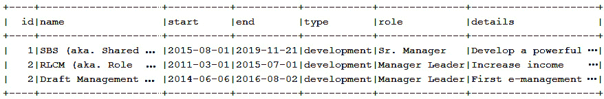
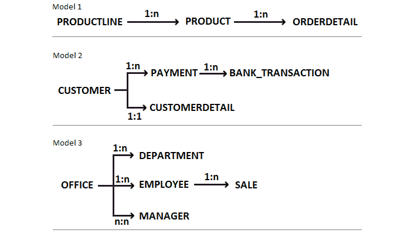
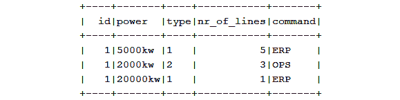
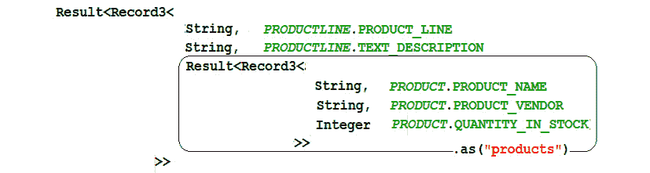
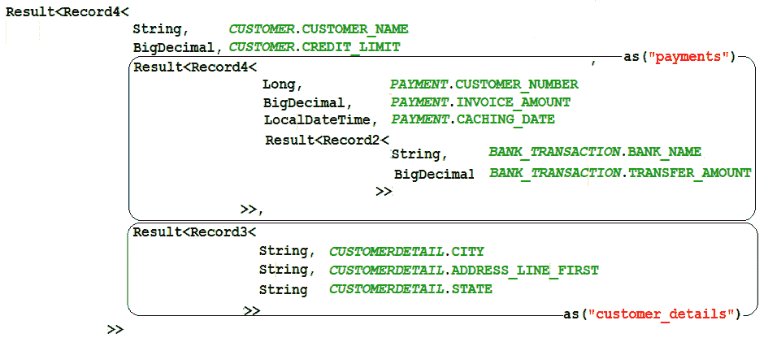

# 第八章：获取和映射

获取结果集并将它们映射成客户端期望的形状和格式是查询数据库时最重要的任务之一。jOOQ 在这一领域表现出色，并提供了一个全面的 API 来获取数据并将其映射到标量、数组、列表、集合、映射、POJO、Java 16 记录、JSON、XML、嵌套集合等。像往常一样，jOOQ API 隐藏了由不同的数据库方言引起的摩擦和挑战，以及将结果集映射到不同数据结构所需的样板代码。在此背景下，我们的议程包括以下主题：

+   简单获取/映射

+   获取单个记录、单个记录或任何记录

+   获取数组、列表、集合和映射

+   获取组

+   通过 JDBC `ResultSet`获取

+   获取多个结果集

+   获取关系

+   将 POJO 连接起来

+   jOOQ 记录映射器

+   强大的 SQL/JSON 和 SQL/XML 支持

+   通过惊人的`MULTISET`进行嵌套集合

+   懒加载获取

+   异步获取

+   反应式获取

让我们开始吧！

# 技术要求

本章的代码可以在 GitHub 上找到：[`github.com/PacktPublishing/jOOQ-Masterclass/tree/master/Chapter08`](https://github.com/PacktPublishing/jOOQ-Masterclass/tree/master/Chapter08)。

# 简单获取/映射

通过*简单*的获取/映射，我们指的是你在本书中较早前学到的 jOOQ 获取技术（例如无处不在的`into()`方法），同时也指新的 jOOQ 实用工具`org.jooq.Records`。这个实用工具从 jOOQ 3.15 版本开始可用，并包含两种类型的实用方法，正如我们接下来将要讨论的。

## 收集器方法

收集器方法被命名为`intoFoo()`，其目标是创建一个收集器（`java.util.stream.Collector`），用于将记录（`org.jooq.Record[N]`）收集到数组、列表、映射、组等中。这些收集器可以在`ResultQuery.collect()`中使用，就像任何其他收集器一样。`ResultQuery<R>`实现了`Iterable<R>`，并提供了如`collect()`等便利方法。除了`collect()`内部处理资源（无需使用 try-with-resources）的事实之外，你还可以使用它进行任何收集器，如标准 JDK 收集器、jOOλ收集器、`Records`收集器或你自己的收集器。例如，以下是将数据收集到`List<String>`的示例：

```java
List<String> result = ctx.select(CUSTOMER.CUSTOMER_NAME)
```

```java
   .from(CUSTOMER)
```

```java
   .collect(intoList()); // or, Java's Collectors.toList()
```

以下是将数据收集到`Map<Long, String>`的示例：

```java
Map<Long, String> result = ctx.select(
```

```java
           CUSTOMER.CUSTOMER_NUMBER, CUSTOMER.PHONE)
```

```java
   .from(CUSTOMER)
```

```java
   .collect(intoMap());
```

注意，虽然无处不在的`into()`方法使用反射，但这些实用工具是纯声明式映射 jOOQ 结果/记录，而不使用反射。

## 映射方法

映射方法实际上是映射（`Function[N]`）方法的多种风味。映射方法创建一个`RecordMapper`参数，可以以类型安全的方式将`Record[N]`映射到另一种类型（例如 POJO 和 Java 16 记录）。例如，你可以按如下方式映射到 Java 记录：

```java
public record PhoneCreditLimit(
```

```java
   String phone, BigDecimal creditLimit) {}
```

```java
List<PhoneCreditLimit> result = ctx.select(
```

```java
     CUSTOMER.PHONE, CUSTOMER.CREDIT_LIMIT)
```

```java
   .from(CUSTOMER)
```

```java
   .fetch(mapping(PhoneCreditLimit::new));
```

当映射嵌套行（例如，`LEFT JOIN`）时，你可以通过将`mapping()`与`Functions.nullOnAllNull(Function1)`或`Functions.nullOnAnyNull(Function1)`结合使用来实现`null`安全性。以下是一个示例：

```java
List<SalarySale> result = ctx.select(
```

```java
       EMPLOYEE.SALARY, SALE.SALE_)
```

```java
   .from(EMPLOYEE)
```

```java
   .leftJoin(SALE)
```

```java
   .on(EMPLOYEE.EMPLOYEE_NUMBER.eq(SALE.EMPLOYEE_NUMBER))
```

```java
   .fetch(mapping(nullOnAnyNull(SalarySale::new)));
```

那么，这是如何工作的呢？例如，当一个员工没有销售（或者你有一个孤儿销售）时，你会得到一个`null`值，而不是一个`SalarySale`实例，其中销售为`null`，`SalarySale[salary=120000, sale=null]`。

在捆绑代码的*Records*中，还有许多 MySQL/PostgreSQL 的示例。

## 简单的获取/映射继续

接下来，让我们看看其他一些可以非常直观和轻松使用的获取/映射数据的技术。由于 jOOQ 手册充满了示例，让我们在本节中尝试突出一些内容。例如，简单的获取可以通过`DSLContext.resultQuery()`和纯 SQL 完成，如下所示：

```java
Result<Record> result = ctx.resultQuery(
```

```java
   "SELECT customer_name FROM customer").fetch();
```

```java
List<String> result = ctx.resultQuery(
```

```java
   "SELECT customer_name FROM customer")
```

```java
      .fetchInto(String.class);
```

```java
List<String> result = ctx.resultQuery(
```

```java
   "SELECT customer_name FROM customer")
```

```java
      .collect(intoList(r -> r.get(0, String.class)));
```

另一种方法可能依赖于`DSLContext.fetch()`和纯 SQL，如下所示：

```java
Result<Record> result = ctx.fetch(
```

```java
   "SELECT customer_name FROM customer");
```

```java
List<String> result = ctx.fetch(
```

```java
   "SELECT customer_name FROM customer").into(String.class);
```

```java
List<String> result = ctx.fetch(
```

```java
   "SELECT customer_name FROM customer")
```

```java
      .collect(intoList(r -> r.get(0, String.class)));
```

因此，这个想法非常简单。每次你需要执行一个无法（或不想）通过 jOOQ 生成的基于 Java 的架构表达的纯 SQL 时，只需简单地依靠`ResultQuery.collect(collector)`或`resultQuery() ... fetch()`/`fetchInto()`组合。或者，简单地将其传递给`fetch()`方法，并调用适当的`into()`方法或`intoFoo()`方法，将结果集映射到必要的数据结构。有大量这样的方法可以将结果集映射到标量、数组、列表、集合、映射、POJO、XML 等等。

另一方面，使用基于 Java 的架构（当然，这是推荐的方式）会导致以下不太受欢迎但实用的查询：

```java
List<String> result = ctx.fetchValues(CUSTOMER.CUSTOMER_NAME);
```

这是一个获取单个字段并获取映射结果（值）的快捷方式，而不需要显式调用`into()`方法或`intoFoo()`方法。本质上，当基于 Java 的架构由 jOOQ 生成器生成时，jOOQ 会自动将获取的字段映射到与之关联的 Java 类型。

每次你需要获取单个值时，你可以依靠`fetchValue()`：

```java
Timestamp ts = ctx.fetchValue(currentTimestamp());
```

`<T> T fetchValue(Field<T> field)`和`<T> List<T> fetchValues(TableField<?,T> tf)`方法只是众多可用方法中的一种。查看 jOOQ 文档以了解其余的方法。

然而，既然你已经阅读到这本书的这一部分，我敢肯定你认为这个查询是以下四种更受欢迎的方法的快捷方式：

```java
List<String> result = ctx.select(CUSTOMER.CUSTOMER_NAME)
```

```java
   .from(CUSTOMER).fetch(CUSTOMER.CUSTOMER_NAME);
```

```java
List<String> result = ctx.select(CUSTOMER.CUSTOMER_NAME)
```

```java
   .from(CUSTOMER).fetchInto(String.class)
```

```java
List<String> result = ctx.select(CUSTOMER.CUSTOMER_NAME)
```

```java
   .from(CUSTOMER).collect(intoList());
```

```java
// or, mapping to Result<Record1<String>> 
```

```java
var result = ctx.select(CUSTOMER.CUSTOMER_NAME)          
```

```java
   .from(CUSTOMER).fetch();
```

你是对的，只要你也不考虑以下内容：

```java
List<String> result = ctx.select().from(CUSTOMER)
```

```java
   .fetch(CUSTOMER.CUSTOMER_NAME);
```

```java
List<String> result = ctx.selectFrom(CUSTOMER)
```

```java
   .fetch(CUSTOMER.CUSTOMER_NAME);
```

这六个查询都投影了相同的结果，但它们并不相同。作为一个 jOOQ 新手，你可能会做出错误的选择，选择最后两个查询。因此，让我们通过查看生成的 SQL 来澄清这个疑虑。前四个查询生成以下 SQL：

```java
SELECT `classicmodels`.`customer`.`customer_name`
```

```java
FROM `classicmodels`.`customer`
```

相比之下，最后两个查询生成以下 SQL：

```java
SELECT `classicmodels`.`customer`.`customer_number`,
```

```java
       `classicmodels`.`customer`.`customer_name`,
```

```java
       ...
```

```java
       `classicmodels`.`customer`.`first_buy_date`
```

```java
FROM `classicmodels`.`customer`
```

现在，很明显，最后两个查询执行了不必要的操作。我们只需要`CUSTOMER_NAME`字段，但这些查询会检索所有字段，这是毫无意义的工作，会负面影响性能。在这种情况下，不要责怪 jOOQ 或数据库，因为它们都正好做了你要求的事情！

重要提示

作为一条经验法则，当你不需要检索所有字段时，依赖于前面提到的四种方法，并在`SELECT`语句中列出必要的字段。在这个背景下，让我再次强调*第五章*中的*SelectOnlyNeededData*应用程序，*处理不同类型的 SELECT、INSERT、UPDATE、DELETE 和 MERGE 语句*。

当您检索多个字段，但不是所有字段时，您应该编写如下代码：

```java
// Result<Record2<String, BigDecimal>>
```

```java
var result = ctx.select(
```

```java
       CUSTOMER.CUSTOMER_NAME, CUSTOMER.CREDIT_LIMIT)
```

```java
   .from(CUSTOMER).fetch();
```

```java
ExpectedType result = ctx.select(
```

```java
       CUSTOMER.CUSTOMER_NAME, CUSTOMER.CREDIT_LIMIT)
```

```java
   .from(CUSTOMER)
```

```java
   .fetchInto(…) // or, collect(), fetch(mapping(…)), ...
```

现在，让我们考虑另一个基于以下两个 POJOs 的简单检索方法：

```java
class NamePhone {String customerName; String phone;}
```

```java
class PhoneCreditLimit {String phone; BigDecimal creditLimit;}
```

通过两个`SELECT`语句填充这些 POJOs，如下所示：

```java
List<NamePhone> result1 = ctx.select(
```

```java
      CUSTOMER.CUSTOMER_NAME, CUSTOMER.PHONE)
```

```java
   .from(CUSTOMER).fetchInto(NamePhone.class);
```

```java
List<PhoneCreditLimit> result2 = ctx.select(
```

```java
      CUSTOMER.PHONE, CUSTOMER.CREDIT_LIMIT)
```

```java
   .from(CUSTOMER).fetchInto(PhoneCreditLimit.class);
```

然而，在这里，jOOQ 允许我们将`Result<Record>`映射到多个结果。换句话说，我们可以获得相同的结果并触发单个`SELECT`语句，如下所示：

```java
// Result<Record3<String, String, BigDecimal>>
```

```java
var result = ctx.select(CUSTOMER.CUSTOMER_NAME,    
```

```java
                        CUSTOMER.PHONE, CUSTOMER.CREDIT_LIMIT)
```

```java
   .from(CUSTOMER).fetch();
```

```java
List<NamePhone> r1=result.into(NamePhone.class);
```

```java
List<PhoneCreditLimit> r2=result.into(PhoneCreditLimit.class);
```

太好了！当然，这不仅仅适用于将结果集映射到 POJOs 的情况。在这本书的代码包中，*SimpleFetch*（适用于 MySQL），您可以看到一个由单个`SELECT`语句生成的结果集，格式完全为 JSON，其中一部分映射到 Java `Set`。接下来，让我们深入了解`fetchOne()`、`fetchSingle()`和`fetchAny()`方法。

# 检索一个记录、单个记录或任何记录

jOOQ 提供了三个方便的方法，名为`fetchOne()`、`fetchSingle()`和`fetchAny()`。这三个方法都能返回一个结果记录，但每个方法都会在特定的坐标下执行此操作。所以，让我们详细地了解每个方法。

## 使用 fetchOne()

例如，`fetchOne()`方法最多返回一个结果记录。换句话说，如果检索到的结果集有多条记录，则`fetchOne()`会抛出 jOOQ 特定的`TooManyRowsException`异常。但如果结果集没有记录，则`fetchOne()`返回`null`。在这种情况下，`fetchOne()`可以用于通过主键、其他唯一键或保证唯一性的谓词检索记录，同时您准备处理可能为`null`的结果。以下是一个使用`fetchOne()`的示例：

```java
EmployeeRecord result = ctx.selectFrom(EMPLOYEE) 
```

```java
   .where(EMPLOYEE.EMPLOYEE_NUMBER.eq(1370L))
```

```java
   .fetchOne();
```

或者，您可以通过`fetchOneInto()`直接将数据检索到`Employee` POJO 中：

```java
Employee result = ctx.selectFrom(EMPLOYEE) 
```

```java
   .where(EMPLOYEE.EMPLOYEE_NUMBER.eq(1370L))                    
```

```java
   .fetchOneInto(Employee.class);
```

然而，请注意。记住`fetchOneInto(Employee.class)`与`fetchOne().into(Employee.class)`并不相同，因为后者容易抛出`NullPointerException`异常。因此，最好避免编写如下代码：

```java
Employee result = ctx.selectFrom(EMPLOYEE) 
```

```java
   .where(EMPLOYEE.EMPLOYEE_NUMBER.eq(1370L))                    
```

```java
   .fetchOne().into(Employee.class);
```

如果没有具有主键*1370*的`EMPLOYEE` POJO，则此代码会抛出 NPE 异常。

此外，避免链式调用`component`[`N`]`()`和`value`[`N`]`()`方法，如下所示（此代码也容易抛出`NullPointerException`）：

```java
String result = ctx.select(EMPLOYEE.EMAIL).from(EMPLOYEE)
```

```java
   .where(EMPLOYEE.EMPLOYEE_NUMBER.eq(1370L))
```

```java
   .fetchOne().value1();
```

此外，建议将数据检索到适当的数据类型中（在这里，它是`String`类型）：

```java
String result = ctx.select(EMPLOYEE.EMAIL).from(EMPLOYEE)
```

```java
   .where(EMPLOYEE.EMPLOYEE_NUMBER.eq(1370L)) 
```

```java
   .fetchOneInto(String.class);
```

当然，在使用`result`之前，仍然需要进行 NPE 检查，但你可以通过`Objects.requireNonNullElseGet()`来包装这个检查，如下所示：

```java
String result = Objects.requireNonNullElseGet(
```

```java
   ctx.select(EMPLOYEE.EMAIL).from(EMPLOYEE)
```

```java
      .where(EMPLOYEE.EMPLOYEE_NUMBER.eq(1370L)) 
```

```java
      .fetchOneInto(String.class), () -> "");
```

或者，你可以通过 jOOQ 的`fetchOptional()`方法将其包装成`Optional`类型：

```java
Optional<EmployeeRecord> result = ctx.selectFrom(EMPLOYEE)
```

```java
   .where(EMPLOYEE.EMPLOYEE_NUMBER.eq(1370L)) 
```

```java
   .fetchOptional();
```

或者，你可能更喜欢`fetchOptionalInto()`：

```java
Optional<Employee> result = ctx.selectFrom(EMPLOYEE)
```

```java
   .where(EMPLOYEE.EMPLOYEE_NUMBER.eq(1370L))
```

```java
   .fetchOptionalInto(Employee.class);
```

如往常一样，`fetchOne()`有多种形式，所有这些都在文档中提供。例如，你可以使用`DSLContext.fetchOne()`如下所示：

```java
EmployeeRecord result = ctx.fetchOne(EMPLOYEE,  
```

```java
   EMPLOYEE.EMPLOYEE_NUMBER.eq(1370L));
```

或者，你可以根据用户定义的转换器检索记录并进行转换（此转换器在*第七章*，*类型、转换器和绑定*）中介绍）：

```java
YearMonth result = ctx.select(CUSTOMER.FIRST_BUY_DATE)
```

```java
   .from(CUSTOMER)
```

```java
   .where(CUSTOMER.CUSTOMER_NUMBER.eq(112L))
```

```java
   .fetchOne(CUSTOMER.FIRST_BUY_DATE, 
```

```java
             INTEGER_YEARMONTH_CONVERTER);
```

MySQL 捆绑代码中的*FetchOneAnySingle*提供了许多其他示例。

## 使用`fetchSingle()`

`fetchSingle()`方法返回确切的一个结果记录。换句话说，如果检索到的结果集包含多个记录，则`fetchSingle()`会抛出 jOOQ 特定的`TooManyRowsException`错误。如果没有记录，则抛出 jOOQ 特定的`NoDataFoundException`错误。

实际上，`fetchSingle()`与`fetchOne()`类似，只是在检索到的结果集不包含任何记录时抛出异常而不是返回`null`。这意味着`fetchSingle()`在你不期望`null`结果时，用于通过主键、其他唯一键或保证唯一性的谓词检索记录是有用的。例如，请参阅以下代码块：

```java
Employee result = ctx.selectFrom(EMPLOYEE)
```

```java
   .where(EMPLOYEE.EMPLOYEE_NUMBER.eq(1370L)) 
```

```java
   .fetchSingleInto(Employee.class);
```

或者，你可能只想检索这个员工的电子邮件，如下所示：

```java
String result = ctx.select(EMPLOYEE.EMAIL).from(EMPLOYEE)
```

```java
   .where(EMPLOYEE.EMPLOYEE_NUMBER.eq(1370L)) 
```

```java
   .fetchSingle().value1(); // fetchSingleInto(String.class)
```

捆绑代码中还提供了许多其他示例。

## 使用`fetchAny()`

`fetchAny()`方法返回第一个结果记录。换句话说，如果检索到的结果集包含多个记录，则`fetchAny()`返回第一个。如果没有记录，则返回`null`。这与`…limit(1).fetchOne();`类似。因此，请注意避免任何可能导致抛出`NullPointerException`异常的使用。以下是一个示例：

```java
SaleRecord result = ctx.selectFrom(SALE)
```

```java
   .where(SALE.EMPLOYEE_NUMBER.eq(1370L)) 
```

```java
   .fetchAny();
```

让我们看看另一个示例：

```java
String result = ctx.select(SALE.TREND).from(SALE)
```

```java
   .where(SALE.EMPLOYEE_NUMBER.eq(1370L)) 
```

```java
   .fetchAnyInto(String.class);
```

在*FetchOneAnySingle*中，MySQL 提供了许多其他示例。

# 检索数组、列表、集合和映射

jOOQ 将检索`Result<Record>`作为数组、列表、集合或映射所需的代码简化为对其惊人的 API 的简单调用。

## 检索数组

通过一组全面的 jOOQ 方法可以检索数组，包括`fetchArray()`（及其变体）、`fetchOneArray()`、`fetchSingleArray()`、`fetchAnyArray()`、`fetchArrays()`和`intoArray()`。例如，将所有`DEPARTMENT`字段作为一个`Record`数组检索可以如下进行：

```java
Record[] result = ctx.select().from(DEPARTMENT).fetchArray();
```

与此相比，你可以直接将`DEPARTMENT.NAME`作为一个`String[]`来检索，如下所示：

```java
String[] result = ctx.select(DEPARTMENT.NAME).from(DEPARTMENT)
```

```java
   .fetchArray(DEPARTMENT.NAME);
```

```java
String[] result = ctx.select(DEPARTMENT.NAME).from(DEPARTMENT)
```

```java
   .collect(intoArray(new String[0]));
```

或者，可以通过 `fetchArray(Field<T> field, Converter<? super T,? extends U> cnvrtr)` 方法将所有 `CUSTOMER.FIRST_BUY_DATE` 字段作为 `YearMonth` 类型的数组检索，如下所示（注意，`INTEGER_YEARMONTH_CONVERTER` 转换器是在 *第七章*，*类型、转换器和绑定*）中引入的）：

```java
YearMonth[] result = ctx.select(CUSTOMER.FIRST_BUY_DATE)
```

```java
   .from(CUSTOMER)
```

```java
   .fetchArray(CUSTOMER.FIRST_BUY_DATE, 
```

```java
               INTEGER_YEARMONTH_CONVERTER);
```

你认为将数据库数组检索到 Java 数组中会怎样，比如我们 PostgreSQL 架构中定义的 `DEPARTMENT.TOPIC` 字段？在这种情况下，结果是 `String[][]`：

```java
String[][] result = ctx.select(DEPARTMENT.TOPIC)
```

```java
   .from(DEPARTMENT).fetchArray(DEPARTMENT.TOPIC);
```

如果我们从 Spring Boot REST 控制器返回这个 `String[][]`，结果将是一个 JSON 数组：

```java
[
```

```java
  ["publicity", "promotion"],
```

```java
  ["commerce","trade","sellout","transaction"],
```

```java
  ...
```

```java
]
```

那么将一个 UDT 类型检索到 Java 数组中会怎样呢？在我们的 PostgreSQL 架构中，我们有一个 `MANAGER.MANAGER_EVALUATION` UDT 类型，所以让我们试一试，将它作为数组与 `MANAGER_NAME` 类型一起检索：

```java
// Record2<String, EvaluationCriteriaRecord>[]
```

```java
var result = ctx.select(MANAGER.MANAGER_NAME, 
```

```java
                        MANAGER.MANAGER_EVALUATION)
```

```java
   .from(MANAGER).fetchArray();
```

让我们打印出第一个经理的姓名及其评估：

```java
System.out.println(result[0].value1()+"\n"
```

```java
        + result[0].value2().format());
```

这里是输出（`format()` 方法将 `EvaluationCriteriaRecord` 格式化为表格文本）：


图 8.1– 打印第一个经理及其评估

最后，让我们尝试将一个可嵌入的类型作为数组检索：

```java
OfficeFullAddressRecord[] result = ctx.select(
```

```java
      OFFICE.OFFICE_FULL_ADDRESS).from(OFFICE)
```

```java
   .fetchArray(OFFICE.OFFICE_FULL_ADDRESS);
```

```java
OfficeFullAddressRecord[] result = ctx.select(
```

```java
      OFFICE.OFFICE_FULL_ADDRESS).from(OFFICE)
```

```java
   .collect(intoArray(new OfficeFullAddressRecord[0]));
```

本节中的最后一个示例依赖于 `fetchArrays()`：

```java
Object[][] result = ctx.select(DEPARTMENT.DEPARTMENT_ID, 
```

```java
         DEPARTMENT.OFFICE_CODE, DEPARTMENT.NAME)
```

```java
   .from(DEPARTMENT).fetchArrays();
```

如果我们从 Spring Boot REST 控制器返回这个 `Object[][]`，那么结果将是一个 JSON 数组：

```java
[
```

```java
  [1, "1", "Advertising"],
```

```java
  [2, "1", "Sales"],
```

```java
  [3, "2", "Accounting"],
```

```java
  [4, "3", "Finance"]
```

```java
]
```

在捆绑的代码中，你可以找到超过 15 个将 jOOQ 结果作为数组检索的示例。

## 检索列表和集合

到目前为止，大多数示例都是将结果集检索为 `java.util.List` 或 `org.jooq.Result`（即 `List` 的 jOOQ 包装器），所以关于以下示例如何工作并没有什么神秘之处：

```java
List<String> result = ctx.select(DEPARTMENT.NAME)
```

```java
   .from(DEPARTMENT).fetch(DEPARTMENT.NAME);
```

```java
List<String> result = ctx.select(DEPARTMENT.NAME)
```

```java
   .from(DEPARTMENT).collect(intoList());
```

```java
List<Department> result = ctx.select(DEPARTMENT.DEPARTMENT_ID,    
```

```java
       DEPARTMENT.OFFICE_CODE, DEPARTMENT.NAME)
```

```java
   .from(DEPARTMENT).fetchInto(Department.class);
```

那么，让我们关注一些更有趣的案例，比如如何检索我们 PostgreSQL 架构中定义的 `DEPARTMENT.TOPIC` 数组字段：

```java
List<String[]> result = ctx.select(DEPARTMENT.TOPIC)
```

```java
   .from(DEPARTMENT)
```

```java
   .fetch(DEPARTMENT.TOPIC, String[].class);
```

我们更倾向于调用 `fetch()`，它将返回 `Result<Record1<String[]>>`，而不是调用 `fetch(Field<?> field, Class<? extends U> type)`。这允许我们返回 `List<String[]>`。

尝试将 `DEPARTMENT.TOPIC` 作为 `Set<String[]>` 检索可以通过 jOOQ 的 `fetchSet()` 方法完成（查看文档以了解此方法的全部功能）：

```java
Set<String[]> result = ctx.select(DEPARTMENT.TOPIC)
```

```java
   .from(DEPARTMENT).fetchSet(DEPARTMENT.TOPIC);
```

考虑捆绑的代码，其中包含更多检索列表和集合的示例，包括检索 UDT 和可嵌入类型。

## 检索映射

jOOQ 提供了一套 `fetchMap()`/`intoMap()` 方法，允许我们将结果集拆分为 `java.util.Map` 包装器的键值对。这类方法超过 20 种，但我们主要可以区分 `fetchMap(key)`/`intoMap(Function keyMapper)` 方法。这些方法允许我们指定代表键的字段，而值则从 `SELECT` 结果中推断出来，以及 `fetchMap(key, value)`/`intoMap(Function keyMapper, Function valueMapper)` 方法，其中我们分别指定代表键和值的字段。不带任何参数的 `Records.intoMap()` 方法仅在你有一个两列的 `ResultQuery`，并且你想将第一列作为键、第二列作为值进行映射时才有用。

例如，让我们获取一个以 `DEPARTMENT_ID` 作为键（因此是 `DEPARTMENT` 主键）和 `DepartmentRecord` 作为值的 `Map`：

```java
Map<Integer, DepartmentRecord> 
```

```java
       result = ctx.selectFrom(DEPARTMENT)
```

```java
   .fetchMap(DEPARTMENT.DEPARTMENT_ID);
```

```java
Map<Integer, DepartmentRecord> 
```

```java
       result = ctx.selectFrom(DEPARTMENT)
```

```java
   .collect(intoMap(r -> r.get(DEPARTMENT.DEPARTMENT_ID)));
```

或者，让我们指示 jOOQ 将映射值指定为 `Department` POJO（由 jOOQ 生成）而不是 `DepartmentRecord`：

```java
Map<Integer, Department> result = ctx.selectFrom(DEPARTMENT)
```

```java
   .fetchMap(DEPARTMENT.DEPARTMENT_ID, Department.class);
```

你觉得这很令人印象深刻吗？那么，如何映射 `CUSTOMER` 表和 `CUSTOMERDETAIL` 表之间的一对一关系？以下是神奇的代码：

```java
Map<Customer, Customerdetail> result = ctx.select()
```

```java
   .from(CUSTOMER)
```

```java
   .join(CUSTOMERDETAIL)
```

```java
   .on(CUSTOMER.CUSTOMER_NUMBER
```

```java
       .eq(CUSTOMERDETAIL.CUSTOMER_NUMBER))
```

```java
   .fetchMap(Customer.class, Customerdetail.class);
```

为了获得正确的映射，你必须为涉及的 POJO 提供显式的 `equals()` 和 `hashCode()` 方法。

仅从 REST 控制器返回这个 `Map` 将导致以下 JSON 代码：

```java
{
```

```java
   "Customer (99, Australian Home, Paoule, Sart, 
```

```java
    40.11.2555, 1370, 21000.00, 20210)":
```

```java
      {
```

```java
      "customerNumber": 99, "addressLineFirst": "43 Rue 2",
```

```java
      "addressLineSecond": null, "city": "Paris", "state":    
```

```java
       null, "postalCode": "25017", "country": "France"
```

```java
      },
```

```java
   ...
```

或者，你可能只想使用字段子集来获取这个一对一关系：

```java
Map<Record, Record> result = ctx.select(
```

```java
      CUSTOMER.CONTACT_FIRST_NAME, CUSTOMER.CONTACT_LAST_NAME,   
```

```java
      CUSTOMERDETAIL.CITY, CUSTOMERDETAIL.COUNTRY)
```

```java
   .from(CUSTOMER)
```

```java
   .join(CUSTOMERDETAIL)
```

```java
   .on(CUSTOMER.CUSTOMER_NUMBER
```

```java
      .eq(CUSTOMERDETAIL.CUSTOMER_NUMBER))
```

```java
   .fetchMap(new Field[]{CUSTOMER.CONTACT_FIRST_NAME,  
```

```java
                         CUSTOMER.CONTACT_LAST_NAME},
```

```java
             new Field[]{CUSTOMERDETAIL.CITY, 
```

```java
                         CUSTOMERDETAIL.COUNTRY});
```

在捆绑的代码中，*ArrListMap*（适用于 PostgreSQL）可以查看更多示例，包括映射扁平化的多对一关系、映射数组、UDTs 和可嵌入类型，以及使用 `fetchMaps()`、`fetchSingleMap()`、`fetchOneMap()` 和 `fetchAnyMap()`。接下来，让我们谈谈获取组。

# 获取组

jOOQ 的获取组功能与获取映射类似，但它允许我们将记录列表作为每个键值对的值。`fetchGroups()`、`intoGroups()` 和 `intoResultGroup()` 方法有超过 40 种变体；因此，请花时间练习（或者至少阅读关于）它们中的每一个。

我们可以区分 `fetchGroups(key)` 和 `intoGroups(Function keyMapper)` 方法，允许我们指定表示键的字段，而值从 `SELECT` 结果推断为 `Result<Record>`/`List<Record>`，以及 `fetchGroups(key, value)`/`intoGroups(Function keyMapper, Function valueMapper)` 方法，在这些方法中我们指定表示键和值的字段，这些字段可以是 `Result<Record>`、`List<POJO>`、`List<scalar>` 等。没有参数的 `Records.intoGroups()` 方法仅在你有一个两列的 `ResultQuery`，并且你想将第一列映射为键，第二列映射为值时才有用。此外，`intoResultGroup()` 方法返回一个收集器，它收集一个 jOOQ `Record`，该 `Record` 来自 `ResultQuery`，在 `Map` 中使用 `RecordMapper` 参数的结果作为键来收集记录本身到一个 jOOQ `Result`。

例如，你可以获取所有 `OrderRecord` 的值，并按客户（`CUSTOMER_NUMBER`）进行分组，如下所示：

```java
Map<Long, Result<OrderRecord>> result = ctx.selectFrom(ORDER)
```

```java
   .fetchGroups(ORDER.CUSTOMER_NUMBER);
```

```java
Map<Long, List<OrderRecord>> result = ctx.selectFrom(ORDER)
```

```java
   .collect(intoGroups(r -> r.get(ORDER.CUSTOMER_NUMBER)));
```

或者，你可以按客户（`BANK_TRANSACTION.CUSTOMER_NUMBER`）将所有银行转账（`BANK_TRANSACTION.TRANSFER_AMOUNT`）分组到 `Map<Long, List<BigDecimal>>` 中：

```java
Map<Long, List<BigDecimal>> result = ctx.select(
```

```java
      BANK_TRANSACTION.CUSTOMER_NUMBER,    
```

```java
      BANK_TRANSACTION.TRANSFER_AMOUNT)
```

```java
   .from(BANK_TRANSACTION)
```

```java
   .fetchGroups(BANK_TRANSACTION.CUSTOMER_NUMBER, 
```

```java
                BANK_TRANSACTION.TRANSFER_AMOUNT);
```

```java
Map<Long, List<BigDecimal>> result = ctx.select(
```

```java
      BANK_TRANSACTION.CUSTOMER_NUMBER,   
```

```java
      BANK_TRANSACTION.TRANSFER_AMOUNT)
```

```java
    .from(BANK_TRANSACTION)
```

```java
    .collect(intoGroups());
```

```java
    // or, …
```

```java
    .collect(intoGroups(
```

```java
        r -> r.get(BANK_TRANSACTION.CUSTOMER_NUMBER),
```

```java
        r -> r.get(BANK_TRANSACTION.TRANSFER_AMOUNT)));
```

你可以将它们分组到 `Map<Long, List<Record2<Long, BigDecimal>>>` 或 `Map<Long, Result<Record2<Long, BigDecimal>>>` 中，分别：

```java
Map<Long, List<Record2<Long, BigDecimal>>> result 
```

```java
   = ctx.select(BANK_TRANSACTION.CUSTOMER_NUMBER,    
```

```java
                BANK_TRANSACTION.TRANSFER_AMOUNT)
```

```java
        .from(BANK_TRANSACTION)
```

```java
        .collect(intoGroups(r -> 
```

```java
            r.get(BANK_TRANSACTION.CUSTOMER_NUMBER)));
```

```java
Map<Long, Result<Record2<Long, BigDecimal>>> result 
```

```java
   = ctx.select(BANK_TRANSACTION.CUSTOMER_NUMBER,    
```

```java
                BANK_TRANSACTION.TRANSFER_AMOUNT)
```

```java
        .from(BANK_TRANSACTION)
```

```java
        .collect(intoResultGroups(r -> 
```

```java
            r.get(BANK_TRANSACTION.CUSTOMER_NUMBER)));
```

如你可能已经直觉到的，`fetchGroups()` 对于获取和映射一对多关系非常有用。例如，每个产品线（`PRODUCTLINE`）有多个产品（`PRODUCT`），我们可以如下获取这些数据：

```java
Map<Productline, List<Product>> result = ctx.select()
```

```java
    .from(PRODUCTLINE)
```

```java
    .innerJoin(PRODUCT)
```

```java
    .on(PRODUCTLINE.PRODUCT_LINE.eq(PRODUCT.PRODUCT_LINE))
```

```java
    .fetchGroups(Productline.class, Product.class);
```

从 REST 控制器返回此映射将产生以下 JSON：

```java
{
```

```java
  "Productline (Motorcycles, 599302, Our motorcycles ...)": [
```

```java
    {
```

```java
      "productId": 1,
```

```java
      "productName": "1969 Harley Davidson Ultimate Chopper",
```

```java
      ...
```

```java
    },
```

```java
    {
```

```java
      "productId": 3,
```

```java
      "productName": "1996 Moto Guzzi 1100i",
```

```java
      ...
```

```java
    },
```

```java
    ...
```

```java
  ],
```

```java
  "Productline (Classic Cars, 599302 ... )": [
```

```java
  ...
```

```java
  ]
```

```java
}
```

当然，依赖用户定义的 POJOs/Java 记录也是可能的。例如，假设你只需要每个产品线的代码和名称，以及每个产品的产品 ID 和购买价格。拥有名为 `SimpleProductline` 和 `SimpleProduct` 的适当 POJO，我们可以映射以下一对多关系：

```java
Map<SimpleProductline, List<SimpleProduct>> result = 
```

```java
  ctx.select(PRODUCTLINE.PRODUCT_LINE, PRODUCTLINE.CODE,
```

```java
             PRODUCT.PRODUCT_ID, PRODUCT.BUY_PRICE)
```

```java
  .from(PRODUCTLINE)
```

```java
  .innerJoin(PRODUCT)
```

```java
  .on(PRODUCTLINE.PRODUCT_LINE.eq(PRODUCT.PRODUCT_LINE))
```

```java
  .fetchGroups(SimpleProductline.class, SimpleProduct.class);
```

为了获得正确的映射，你必须为涉及的 POJO 提供显式的 `equals()` 和 `hashCode()` 方法。对于 jOOQ 生成的 POJO，这是一个可以通过 `<pojosEqualsAndHashCode/>` 完成的配置步骤，如下所示：

```java
<generate>   
```

```java
   <pojosEqualsAndHashCode>true</pojosEqualsAndHashCode>     
```

```java
</generate>                                                   
```

注意，使用 `fetchGroups()` 对于 `INNER JOIN` 是按预期工作的，但对于 `LEFT JOIN` 则不是。如果获取的父项没有子项，那么你将得到一个包含单个 `NULL` 项的列表。所以，如果你想使用 `LEFT JOIN`（至少直到 [`github.com/jOOQ/jOOQ/issues/11888`](https://github.com/jOOQ/jOOQ/issues/11888) 被解决），你可以依赖强大的 `ResultQuery.collect()` 收集器，如下所示：

```java
Map<Productline, List<Product>> result = ctx.select()
```

```java
   .from(PRODUCTLINE)
```

```java
   .leftOuterJoin(PRODUCT)
```

```java
   .on(PRODUCTLINE.PRODUCT_LINE.eq(PRODUCT.PRODUCT_LINE))
```

```java
   .collect(groupingBy(
```

```java
       r -> r.into(Productline.class),
```

```java
          filtering(
```

```java
             r -> r.get(PRODUCT.PRODUCT_ID) != null,
```

```java
             mapping(
```

```java
                 r -> r.into(Product.class),
```

```java
                 toList()
```

```java
             )
```

```java
          )
```

```java
   ));
```

这次，没有子项的父项将产生一个空列表。

获取和映射多对多关系也是可能的。我们可以通过 `CROSS APPLY`（有关更多详细信息，请参阅 *第六章*，*处理不同类型的 JOIN 语句*）优雅地完成它。例如，我们通过 `OFFICE_HAS_MANAGER` 连接表在 `OFFICE` 和 `MANAGER` 之间存在多对多关系，并且我们可以通过 `fetchGroups()` 来映射它，如下所示：

```java
Map<Manager, List<Office>> result = ctx.select().from(MANAGER)
```

```java
    .crossApply(select().from(OFFICE).join(OFFICE_HAS_MANAGER)
```

```java
      .on(OFFICE.OFFICE_CODE
```

```java
         .eq(OFFICE_HAS_MANAGER.OFFICES_OFFICE_CODE))
```

```java
   .where(MANAGER.MANAGER_ID
```

```java
      .eq(OFFICE_HAS_MANAGER.MANAGERS_MANAGER_ID)))
```

```java
   .fetchGroups(Manager.class, Office.class);
```

将此映射通过 REST 控制器产生必要的 JSON。当然，根据之前的示例，使用连接表映射一对一关系是非常明显的。

然而，请考虑 Lukas Eder 的注意事项：

*"在谈论* *fetchGroups() 时，我认为总是值得指出，RDBMS 通常也可以使用 ARRAY_AGG()、JSON_ARRAYAGG() 或 XMLAGG() 本地执行此操作。可能性（需要验证）是，这可能会更快，因为需要通过网络传输的数据更少。"*

在捆绑代码中，你可以练习更多关于如何使用 `fetchGroups()` 的示例。该应用程序名为 *FetchGroups*（适用于 PostgreSQL）。

# 通过 JDBC `ResultSet` 获取数据

jOOQ 是一个极其灵活且透明的工具。例如，jOOQ 充当 JDBC `ResultSet` 的包装器，但也允许我们直接访问它，甚至提供支持以平滑且无痛苦地完成此操作。实际上，我们可以做以下事情：

+   使用 jOOQ 执行 `ResultQuery`，但返回一个 JDBC `ResultSet`（这依赖于 `fetchResultSet()` 方法）。

+   将 jOOQ `Result` 对象转换为 JDBC `ResultSet`（这依赖于 `intoResultSet()` 方法）。

+   使用 jOOQ 从遗留 `ResultSet` 中获取数据。

所有这三个项目都在捆绑代码中得到了示例。然而，在这里，让我们考虑以下 jOOQ 查询开始的第二个项目：

```java
// Result<Record2<String, BigDecimal>>
```

```java
var result = ctx.select(CUSTOMER.CUSTOMER_NAME,  
```

```java
   CUSTOMER.CREDIT_LIMIT).from(CUSTOMER).fetch();
```

我们理解返回的结果是一个由底层 `ResultSet` 自动构建的 jOOQ 特定 `Result`。那么，我们能否反转这个操作，从 jOOQ `Result` 中获取 `ResultSet`？是的，我们可以！我们可以通过 `intoResultSet()` 来做，如下所示：

```java
ResultSet rsInMem = result.intoResultSet();
```

重要的是要注意，这个魔法在没有数据库活动连接的情况下发生。默认情况下，jOOQ 在获取 jOOQ `Result` 后关闭数据库连接。这意味着，当我们调用 `intoResultSet()` 来获取这个内存中的 `ResultSet` 时，没有数据库的活动连接。jOOQ 将 `Result` 对象镜像回 `ResultSet` 而不与数据库交互。接下来，处理这个 `ResultSet` 是直接的：

```java
while (rsInMem.next()) {
```

```java
   ...
```

```java
}
```

这很重要，因为通常情况下，只要保持与数据库的开放连接，就可以在 JDBC `ResultSet`上操作。查看名为 *ResultSetFetch* 的捆绑应用程序中其他两个项目旁边的完整代码（该应用程序适用于 MySQL）。

# 获取多个结果集

一些 RDBMS（例如，在 JDBC URL 后附加 `allowMultiQueries=true` 属性的 SQL Server 和 MySQL）可以返回多个结果集。以下是一个针对 MySQL 的 jOOQ 查询：

```java
ctx.resultQuery(
```

```java
  "SELECT * FROM employee LIMIT 10; 
```

```java
   SELECT * FROM sale LIMIT 5");
```

要在 jOOQ 中获取多个结果集，请调用 `fetchMany()`。此方法返回 `org.jooq.Results` 类型的对象，如下面的代码片段所示（注意复数形式以避免与 `org.jooq.Result` 产生混淆）：

```java
Results results = ctx.resultQuery(
```

```java
   "SELECT * FROM employee LIMIT 10; 
```

```java
    SELECT * FROM sale LIMIT 5")
```

```java
 .fetchMany();    
```

接下来，你可以将每个结果集映射到其 POJO：

```java
List<Employee> employees =results.get(0).into(Employee.class);
```

```java
List<Sale> sales = results.get(1).into(Sale.class);
```

Lukas Eder 表示：

*"也许超出了范围，但 Results 类型还允许访问交错更新的计数和异常，这在 T-SQL 数据库（如 SQL Server 或 Sybase）中经常这样做。"*

完成！在 *FetchMany* 应用程序（适用于 MySQL 和 SQL Server）中，你可以查看这个示例，它旁边还有一个示例，该示例从一个结合 `DELETE` 和 `SELECT` 的查询中返回两个结果集。

# 获取关系

我很确信你已经熟悉一对一、一对多和多对多关系。单向一对多的典型映射大致如下：

```java
public class SimpleProductLine implements Serializable {
```

```java
   ... 
```

```java
   private List<SimpleProduct> products = new ArrayList<>();  
```

```java
}
```

```java
public class SimpleProduct implements Serializable { ... }
```

此外，当 `SimpleProduct` 包含对 `SimpleProductLine` 的引用时，这被视为一个双向的一对多关系：

```java
public class SimpleProduct implements Serializable {
```

```java
   ...
```

```java
   private SimpleProductLine productLine;
```

```java
}
```

如果我们有这个 POJO 模型，能否通过 jOOQ API 将相应的结果集映射到它？答案是肯定的，并且可以通过几种方式完成。从你已看到的 `fetchInto()`、`fetchMap()` 和 `fetchGroups()` 方法，到强大的 SQL JSON/XML 映射，以及惊人的 MULTISET 值构造器运算符，jOOQ 提供了如此多的获取模式，几乎不可能找不到解决方案。

无论如何，我们不要偏离主题太远。让我们考虑以下查询：

```java
// Map<Record, Result<Record>>
```

```java
var map = ctx.select(PRODUCTLINE.PRODUCT_LINE, 
```

```java
     PRODUCTLINE.TEXT_DESCRIPTION,PRODUCT.PRODUCT_NAME,      
```

```java
     PRODUCT.PRODUCT_VENDOR, PRODUCT.QUANTITY_IN_STOCK)
```

```java
   .from(PRODUCTLINE)
```

```java
   .join(PRODUCT)
```

```java
   .on(PRODUCTLINE.PRODUCT_LINE
```

```java
      .eq(PRODUCT.PRODUCT_LINE))                
```

```java
   .orderBy(PRODUCTLINE.PRODUCT_LINE).limit(3)
```

```java
   .fetchGroups(new Field[]{PRODUCTLINE.PRODUCT_LINE,
```

```java
          PRODUCTLINE.TEXT_DESCRIPTION},
```

```java
                new Field[]{PRODUCT.PRODUCT_NAME,  
```

```java
          PRODUCT.PRODUCT_VENDOR, PRODUCT.QUANTITY_IN_STOCK});
```

使用 `Map<Record, Result<Record>>`（这通常是所有你需要的东西），我们可以填充我们的双向领域模型，如下所示：

```java
List<SimpleProductLine> result = map.entrySet()
```

```java
   .stream()
```

```java
   .map((e) -> {
```

```java
      SimpleProductLine productLine 
```

```java
         = e.getKey().into(SimpleProductLine.class);
```

```java
      List<SimpleProduct> products 
```

```java
         = e.getValue().into(SimpleProduct.class);
```

```java
      productLine.setProducts(products);
```

```java
      products.forEach(p -> 
```

```java
        ((SimpleProduct) p).setProductLine(productLine));
```

```java
      return productLine;
```

```java
   }).collect(Collectors.toList());
```

如果你想要避免通过 `fetchGroups()` 传递，那么你可以依赖 `ResultQuery.collect()` 和 `Collectors.groupingBy()`。这在你想运行 `LEFT JOIN` 语句时特别有用，因为 `fetchGroups()` 有以下问题：[`github.com/jOOQ/jOOQ/issues/11888`](https://github.com/jOOQ/jOOQ/issues/11888)。另一种方法是来自 `ResultSet` 的映射。你可以在 *OneToOne*、*OneToMany* 和 *ManyToMany* 应用程序（适用于 MySQL）捆绑的代码中看到这些方法以及其他用于单向/双向一对一和多对多关系的其他方法。

# 连接 POJO

你已经知道 jOOQ 可以代表我们生成 POJO，它也可以处理用户定义的 POJO。此外，你看到了许多将 jOOQ 结果映射到 POJO 的示例（通常是通过 `fetchInto()`）；因此，这不是一个全新的话题。然而，在本节中，让我们更进一步，真正关注 jOOQ 支持的不同类型的 POJO。

如果我们配置的是 `<pojos>true</pojos>`（此处为 Maven），那么 jOOQ 会生成具有 `private` 字段、空构造函数、带有参数的构造函数、getter 和 setter 以及 `toString()` 的 POJO。然而，jOOQ 也可以处理一个非常简单的用户定义 POJO，如下所示：

```java
public class SimplestCustomer { 
```

```java
   public String customerName; 
```

```java
   public String customerPhone; 
```

```java
}
```

这里有一个填充此 POJO 的查询：

```java
List<SimplestCustomer> result = ctx.select(
```

```java
   CUSTOMER.CUSTOMER_NAME, CUSTOMER.PHONE.as("customerPhone"))
```

```java
   .from(CUSTOMER).fetchInto(SimplestCustomer.class);
```

请注意 `as("customerPhone")` 别名。这是将 `CUSTOMER.PHONE` 映射到 POJO 的 `customerPhone` 字段所必需的；否则，此 POJO 字段将保留为 `null`，因为 jOOQ 找不到合适的匹配项。另一种方法是添加一个带有参数的构造函数，如下面的 POJO 所示：

```java
public class SimpleDepartment {
```

```java
   private String depName;
```

```java
   private Short depCode;
```

```java
   private String[] depTopic;
```

```java
   public SimpleDepartment(String depName, 
```

```java
          Short depCode, String[] depTopic) {
```

```java
      this.depName = depName;
```

```java
      this.depCode = depCode;
```

```java
      this.depTopic = depTopic;
```

```java
   }
```

```java
   ...
```

```java
}
```

即使 POJO 的字段名称与获取的字段名称不匹配，jOOQ 也会根据此带有参数的构造函数正确填充 POJO：

```java
List<SimpleDepartment> result = ctx.select(
```

```java
      DEPARTMENT.NAME, DEPARTMENT.CODE, DEPARTMENT.TOPIC)
```

```java
   .from(DEPARTMENT).fetchInto(SimpleDepartment.class);
```

```java
List<SimpleDepartment> result = ctx.select(
```

```java
      DEPARTMENT.NAME, DEPARTMENT.CODE, DEPARTMENT.TOPIC)
```

```java
   .from(DEPARTMENT)
```

```java
   .fetch(mapping(SimpleDepartment::new));
```

用户定义的 POJO 对于映射包含来自多个表的字段的 jOOQ 结果非常有用。例如，可以使用 POJO 来扁平化一对一关系，如下所示：

```java
public class FlatProductline {
```

```java
    private String productLine;
```

```java
    private Long code;
```

```java
    private String productName;    
```

```java
    private String productVendor;    
```

```java
    private Integer quantityInStock;
```

```java
    // constructors, getters, setters, toString()
```

```java
}
```

此外，这里有一个 jOOQ 查询：

```java
List<FlatProductline> result = ctx.select(
```

```java
      PRODUCTLINE.PRODUCT_LINE, PRODUCTLINE.CODE,
```

```java
      PRODUCT.PRODUCT_NAME, PRODUCT.PRODUCT_VENDOR, 
```

```java
      PRODUCT.QUANTITY_IN_STOCK)
```

```java
   .from(PRODUCTLINE)
```

```java
   .join(PRODUCT)
```

```java
   .on(PRODUCTLINE.PRODUCT_LINE.eq(PRODUCT.PRODUCT_LINE))
```

```java
   .fetchInto(FlatProductline.class);
```

```java
// .fetch(mapping(FlatProductline::new));
```

或者，您可以映射 UDTs 和/或可嵌入类型。例如，这里是一个用户定义的 POJO，它获取一个 String 和一个包含 UDT 的可嵌入类型。对于可嵌入类型，我们依赖于 jOOQ 生成的 POJO：

```java
import jooq.generated.embeddables.pojos.ManagerStatus;
```

```java
public class SimpleManagerStatus {    
```

```java
   private Long managerId;
```

```java
   private ManagerStatus ms;
```

```java
   // constructors, getters, setters, toString()
```

```java
}
```

此外，jOOQ 查询如下：

```java
List<SimpleManagerStatus> result =   
```

```java
       ctx.select(MANAGER.MANAGER_ID, MANAGER.MANAGER_STATUS)
```

```java
   .from(MANAGER).fetchInto(SimpleManagerStatus.class);
```

在捆绑的代码（即 *PojoTypes* 应用程序，适用于 PostgreSQL）中还有更多示例。接下来，让我们谈谈 jOOQ 支持的不同类型的 POJO。

## POJO 的类型

除了上一节中的典型 POJO 之外，jOOQ 还支持几种其他类型的 POJO。例如，它支持不可变 POJO。

### 不可变 POJO

用户定义的不可变 POJO 可以编写如下：

```java
public final class ImmutableCustomer {
```

```java
    private final String customerName;
```

```java
    private final YearMonth ym;
```

```java
    // constructor and only getters
```

```java
}
```

接下来是一个映射到此 POJO 的 jOOQ 查询：

```java
List<ImmutableCustomer> result = ctx.select(
```

```java
      CUSTOMER.CUSTOMER_NAME,   
```

```java
      CUSTOMER.FIRST_BUY_DATE.coerce(YEARMONTH))
```

```java
   .from(CUSTOMER)
```

```java
   .fetchInto(ImmutableCustomer.class);
```

```java
// .fetch(mapping(ImmutableCustomer::new));
```

为了按预期工作，不可变 POJO 需要获取的字段与 POJO 的字段（构造函数参数）之间完全匹配。但是，您可以通过 `@ConstructorProperties` (`java.beans.ConstructorProperties`) 显式放宽此匹配。请检查捆绑代码（*示例 2.2*）中的有意义的示例。

jOOQ 可以通过 `<generate/>` 标签中的以下配置为我们生成不可变 POJO：

```java
<immutablePojos>true</immutablePojos>
```

此外，它还可以通过以下方式生成 `@ConstructorProperties`：

```java
<constructorPropertiesAnnotationOnPojos>
```

```java
   true
```

```java
</constructorPropertiesAnnotationOnPojos>
```

在捆绑的代码中，与其他示例相邻，您还可以通过用户定义的不可变 POJO 练习映射 UDTs 和可嵌入类型。

### 装饰有 @Column 的 POJO（jakarta.persistence.Column）

jOOQ 可以将 `Result` 对象映射到 POJO，如下所示：

```java
public class JpaCustomer {
```

```java
   @Column(name = "customer_name") 
```

```java
   public String cn;
```

```java
   @Column(name = "first_buy_date") 
```

```java
   public YearMonth ym;      
```

```java
}
```

如您所见，jOOQ 识别 `@Column` 注解，并将其用作映射元信息的首选来源：

```java
List<JpaCustomer> result = ctx.select(CUSTOMER.CUSTOMER_NAME, 
```

```java
       CUSTOMER.FIRST_BUY_DATE.coerce(YEARMONTH))
```

```java
   .from(CUSTOMER).fetchInto(JpaCustomer.class);
```

jOOQ 可以通过 `<generate/>` 中的以下配置生成此类 POJO：

```java
<jpaAnnotations>true</jpaAnnotations>
```

在捆绑的代码中查看更多示例。

### JDK 16 记录

考虑以下 JDK 16 记录：

```java
public record RecordDepartment(
```

```java
   String name, Integer code, String[] topic) {}
```

jOOQ 查询如下：

```java
List<RecordDepartment> result = ctx.select(
```

```java
        DEPARTMENT.NAME, DEPARTMENT.CODE, DEPARTMENT.TOPIC)
```

```java
              .from(DEPARTMENT)
```

```java
              .fetchInto(RecordDepartment.class);
```

```java
           // .fetch(mapping(RecordDepartment::new));
```

或者，这里有一个用户定义的 JDK 16 记录以及一个 UDT 类型：

```java
public record RecordEvaluationCriteria(
```

```java
   Integer communicationAbility, Integer ethics, 
```

```java
   Integer performance, Integer employeeInput) {}
```

```java
public record RecordManager(
```

```java
   String managerName, RecordEvaluationCriteria rec) {}
```

jOOQ 查询如下：

```java
List<RecordManager> result = ctx.select(
```

```java
       MANAGER.MANAGER_NAME, MANAGER.MANAGER_EVALUATION)
```

```java
   .from(MANAGER).fetchInto(RecordManager.class);
```

或者，你可以使用用户定义的 JDK 16 记录，其中包含可嵌入的类型（在这里，我们使用 jOOQ 生成的 POJO 作为可嵌入的类型）：

```java
import jooq.generated.embeddables.pojos.OfficeFullAddress;
```

```java
public record RecordOffice(
```

```java
   String officecode, OfficeFullAddress ofa) {}
```

以下是 jOOQ 查询：

```java
List<RecordOffice> result = ctx.select(
```

```java
         OFFICE.OFFICE_CODE, OFFICE.OFFICE_FULL_ADDRESS)
```

```java
   .from(OFFICE).fetchInto(RecordOffice.class);
```

jOOQ 可以通过以下`<generate/>`中的配置为我们生成 JDK 16 记录：

```java
<pojosAsJavaRecordClasses>true</pojosAsJavaRecordClasses>
```

在捆绑的代码中，你可以练习 JDK 16 记录用于 UDT、可嵌入类型等。

### 接口和抽象类

最后，jOOQ 可以将结果映射到称为“可代理”类型的接口（抽象类）。你可以在捆绑代码和 jOOQ 手册[`www.jooq.org/doc/latest/manual/sql-execution/fetching/pojos/`](https://www.jooq.org/doc/latest/manual/sql-execution/fetching/pojos/)中找到示例。

此外，jOOQ 可以通过`<generate/>`标签中的此配置为我们生成接口：

```java
<interfaces>true</interfaces>
```

如果也生成了 POJO，那么它们将实现这些接口。

### POJO 的有用配置

在 POJO 的配置中，我们可以通过`<pojosToString/>`标志让 jOOQ 不要为 POJO 生成`toString()`方法，通过`<serializablePojos/>`标志不要生成可序列化的 POJO（即不实现`Serializable`），以及通过`<fluentSetters/>`标志生成流畅的 setter 方法。此外，除了为 Java 生成 POJO，我们还可以通过`<pojosAsKotlinDataClasses/>`标志让 jOOQ 为 Kotlin 生成 POJO，或者通过`<pojosAsScalaCaseClasses/>`标志为 Scala 生成 POJO。

此外，在`<database/>`标签下，我们可以通过`<dateAsTimestamp/>`强制将`LocalDateTime`放入 POJO 中，并通过`<unsignedTypes/>`使用无符号类型。

完整的代码命名为*PojoTypes*（适用于 PostgreSQL（Maven/Gradle））。在下一节中，让我们讨论记录映射器。

# jOOQ 记录映射器

有时，我们需要一个自定义映射，这个映射无法通过`fetchInto()`方法、`fetchMap()`方法、`fetchGroups()`方法或`Records`实用工具来实现。一个简单的方法是使用`Iterable.forEach(Consumer)`，如下面的映射所示：

```java
ctx.select(EMPLOYEE.FIRST_NAME, 
```

```java
           EMPLOYEE.LAST_NAME, EMPLOYEE.EMAIL)
```

```java
   .from(EMPLOYEE)
```

```java
   .forEach((Record3<String, String, String> record) -> {
```

```java
      System.out.println("\n\nTo: " 
```

```java
       + record.getValue(EMPLOYEE.EMAIL));
```

```java
      System.out.println("From: " 
```

```java
       + "hrdepartment@classicmodelcars.com");
```

```java
      System.out.println("Body: \n   Dear, "
```

```java
       + record.getValue(EMPLOYEE.FIRST_NAME)
```

```java
       + " " + record.getValue(EMPLOYEE.LAST_NAME) + " ...");
```

```java
});
```

你可以在*ForEachConsumer*中查看这个 MySQL 示例。

然而，特别是对于这类情况，jOOQ 提供了一个功能接口，允许我们表达 jOOQ 结果的自定义映射。在这个上下文中，我们有`org.jooq.RecordMapper`，它返回在将自定义映射应用于 jOOQ 结果后产生的结果。例如，让我们考虑一个通过`Builder`模式实现的遗留 POJO，其名称为`LegacyCustomer`：

```java
public final class LegacyCustomer {
```

```java
   private final String customerName;
```

```java
   private final String customerPhone;
```

```java
   private final BigDecimal creditLimit;
```

```java
   …
```

```java
   public static CustomerBuilder getBuilder(
```

```java
                             String customerName) {
```

```java
      return new LegacyCustomer.CustomerBuilder(customerName);
```

```java
   }
```

```java
   public static final class CustomerBuilder {
```

```java
      …
```

```java
      public LegacyCustomer build() {
```

```java
         return new LegacyCustomer(this);
```

```java
      }      
```

```java
   }
```

```java
   …
```

```java
}
```

通过`RecordMapper`参数将 jOOQ 结果映射到`LegacyCustomer`可以通过以下方式完成：

```java
List<LegacyCustomer> result 
```

```java
        = ctx.select(CUSTOMER.CUSTOMER_NAME, CUSTOMER.PHONE,   
```

```java
                     CUSTOMER.CREDIT_LIMIT)
```

```java
   .from(CUSTOMER)
```

```java
   .fetch((Record3<String, String, BigDecimal> record) -> {
```

```java
      LegacyCustomer customer = LegacyCustomer.getBuilder(
```

```java
         record.getValue(CUSTOMER.CUSTOMER_NAME))
```

```java
         .customerPhone(record.getValue(CUSTOMER.PHONE))
```

```java
         .creditLimit(record.getValue(CUSTOMER.CREDIT_LIMIT))
```

```java
         .build();
```

```java
      return customer;
```

```java
});
```

此示例在捆绑代码中的*RecordMapper*（适用于 PostgreSQL）中可用，旁边还有其他示例，例如使用`RecordMapper`参数将 jOOQ 结果映射到最大堆。此外，在*第十八章* *jOOQ SPI（提供者和监听器）*中，你将看到如何通过`RecordMapperProvider`配置记录映射器，以便 jOOQ 可以自动获取它们。

然而，如果你需要更通用的映射算法，那么我们必须检查一些与 jOOQ 一起工作的第三方库。在排名前三的此类库中，我们有 ModelMapper、SimpleFlatMapper 和 Orika Mapper。

本书范围之外，无法深入探讨所有这些库。因此，我决定选择 SimpleFlatMapper 库 ([`simpleflatmapper.org/`](https://simpleflatmapper.org/))。让我们假设以下一对多映射：

```java
public class SimpleProductLine {
```

```java
   private String productLine;
```

```java
   private String textDescription;   
```

```java
   private List<SimpleProduct> products;
```

```java
   …
```

```java
}
```

```java
public class SimpleProduct {
```

```java
   private String productName;
```

```java
   private String productVendor;
```

```java
   private Short quantityInStock;
```

```java
   …
```

```java
}
```

实际上，SimpleFlatMapper 可以通过 `SelectQueryMapper` 映射 jOOQ 结果，如下面的自解释示例所示：

```java
private final SelectQueryMapper<SimpleProductLine> sqMapper;
```

```java
private final DSLContext ctx;
```

```java
public ClassicModelsRepository(DSLContext ctx) {
```

```java
   this.ctx = ctx;
```

```java
   this.sqMapper = SelectQueryMapperFactory
```

```java
      .newInstance().newMapper(SimpleProductLine.class);
```

```java
}
```

```java
public List<SimpleProductLine> findProductLineWithProducts() {
```

```java
   List<SimpleProductLine> result = sqMapper.asList(
```

```java
     ctx.select(PRODUCTLINE.PRODUCT_LINE,  
```

```java
         PRODUCTLINE.TEXT_DESCRIPTION,
```

```java
         PRODUCT.PRODUCT_NAME, PRODUCT.PRODUCT_VENDOR, 
```

```java
         PRODUCT.QUANTITY_IN_STOCK)
```

```java
        .from(PRODUCTLINE)
```

```java
        .innerJoin(PRODUCT)
```

```java
        .on(PRODUCTLINE.PRODUCT_LINE
```

```java
           .eq(PRODUCT.PRODUCT_LINE))
```

```java
        .orderBy(PRODUCTLINE.PRODUCT_LINE));
```

```java
   return result;
```

```java
}
```

在此代码中，SimpleFlatMapper 映射 jOOQ 结果，因此它直接作用于 jOOQ 记录。此代码位于 *SFMOneToManySQM* 应用程序中（适用于 MySQL）。然而，正如你在 *SFMOneToManyJM* 应用程序中所见，这个库也可以利用 jOOQ 允许我们操作 `ResultSet` 对象本身的事实，因此它可以通过名为 `JdbcMapper` 的 API 直接作用于 `ResultSet` 对象。这样，SimpleFlatMapper 就绕过了对 `Record` 的 jOOQ 映射。

此外，捆绑的代码包括与 *SFMOneToManyTupleJM* 一起映射一对一和多对多关系的应用程序，这是一个结合 SimpleFlatMapper 和 jOOL `Tuple2` API 来映射一对多关系而不使用 POJOs 的应用程序。为了简洁，我们无法在书中列出此代码，因此你需要留出一些时间自己探索。

从另一个角度来看，通过相同的 `SelectQueryMapper` 和 `JdbcMapper` API，SimpleFlatMapper 库可以与 jOOQ 协同工作，以映射链式和/或嵌套的 `JOIN` 语句。例如，考虑以下模型：

```java
public class SimpleEmployee {
```

```java
   private Long employeeNumber;
```

```java
   private String firstName;
```

```java
   private String lastName;
```

```java
   private Set<SimpleCustomer> customers;
```

```java
   private Set<SimpleSale> sales;
```

```java
   ...
```

```java
}
```

```java
public class SimpleCustomer { private String customerName; … }
```

```java
public class SimpleSale { private Float sale; … }
```

使用 SimpleFlatMapper 和 jOOQ 的组合，我们可以如下填充此模型：

```java
this.sqMapper = …;
```

```java
List<SimpleEmployee> result = sqMapper.asList(
```

```java
   ctx.select(EMPLOYEE.EMPLOYEE_NUMBER, EMPLOYEE.FIRST_NAME,
```

```java
       EMPLOYEE.LAST_NAME, CUSTOMER.CUSTOMER_NAME, SALE.SALE_)
```

```java
      .from(EMPLOYEE)
```

```java
      .leftOuterJoin(CUSTOMER)
```

```java
      .on(CUSTOMER.SALES_REP_EMPLOYEE_NUMBER
```

```java
        .eq(EMPLOYEE.EMPLOYEE_NUMBER))
```

```java
      .leftOuterJoin(SALE)
```

```java
      .on(EMPLOYEE.EMPLOYEE_NUMBER
```

```java
        .eq(SALE.EMPLOYEE_NUMBER))
```

```java
      .where(EMPLOYEE.OFFICE_CODE.eq(officeCode))
```

```java
      .orderBy(EMPLOYEE.EMPLOYEE_NUMBER));
```

完整的代码命名为 *SFMMultipleJoinsSQM*。使用 `JdbcMapper` 的此代码版本命名为 *SFMMultipleJoinsJM*。此外，在捆绑的代码中，你可以找到一个映射深层次 JOIN 的示例，该 JOIN 类型为 (`EMPLOYEE` has `CUSTOMER` has `ORDER` has `ORDERDETAIL` has `PRODUCT`)。此 JOIN 还在 *SFMMultipleJoinsInnerLevelsTupleJM* 中使用 jOOL `Tuple2` 和没有 POJOs 进行映射。无论如何，即使这些事情可行，我也不建议你在实际应用程序中这样做。你最好依靠 SQL/JSON/XML 操作符或 MULTISET，就像你稍后将要做的那样。

同样，为了简洁，我们无法在书中列出此代码，因此你需要留出一些时间自己探索。到目前为止，我们已经达到了本章的高潮。现在是时候敲锣打鼓了，因为下一节将涵盖 jOOQ SQL/JSON 和 SQL/XML 的出色映射支持。

# 强大的 SQL/JSON 和 SQL/XML 支持

从 jOOQ 3.14 版本开始，我们支持将结果集映射到任何可以通过 JSON 或 XML 塑造的层次/嵌套结构。例如，如果您开发 REST API，您可以在不映射任何内容到您的领域模型的情况下返回所需形状的 JSON/XML 数据。

如您所知，大多数 RDBMS 支持 SQL/JSON（标准或供应商特定），其中一些还支持 SQL/XML。

## 处理 SQL/JSON 支持

简而言之，对于 SQL/JSON，我们可以讨论以下在 `org.jooq.impl.DSL` 类中有 jOOQ 实现的操作符：

+   `JSON_OBJECT` (`DSL.jsonObject()`、`DSL.jsonEntry()`), `JSON_ARRAY` (`DSL.jsonArray()`), 和 `JSON_VALUE` (`DSL.jsonValue()`) 用于从值构建 JSON 数据

+   `JSON_ARRAYAGG` (`DSL.jsonArrayAgg()`) 和 `JSON_OBJECTAGG` (`DSL.jsonObjectAgg()`) 用于将数据聚合到嵌套的 JSON 文档中

+   `JSON_EXISTS` (`DSL.jsonExists()`) 用于通过 JSON 路径查询文档

+   `JSON_TABLE` (`DSL.jsonTable()`) 用于将 JSON 值转换为 SQL 表

+   SQL Server 的 `FOR JSON` 语法（包括 `ROOT`、`PATH`、`AUTO` 和 `WITHOUT_ARRAY_WRAPPER`）；jOOQ 商业版模拟了不支持该语法的数据库的 `FOR JSON` 语法（在本章中，您可以查看 SQL Server 和 Oracle 的示例）

让我们通过 jOOQ DSL API 看一些这些操作符的入门示例。

### 从值构建和聚合 JSON 数据

通过 `JSON_OBJECT` 操作符可以从值构建 JSON 数据。这在 jOOQ 中通过 `DSL.jsonObject()` 方法的不同变体实现。例如，您可以将 `CUSTOMER.CUSTOMER_NAME` 和 `CUSTOMER.CREDIT_LIMIT` 字段映射到 `org.jooq.JSON` 对象，如下所示：

```java
Result<Record1<JSON>> result = ctx.select(jsonObject(
```

```java
   key("customerName").value(CUSTOMER.CUSTOMER_NAME),
```

```java
   key("creditLimit").value(CUSTOMER.CREDIT_LIMIT))
```

```java
      .as("json_result"))
```

```java
   .from(CUSTOMER).fetch();
```

与 `key().value()` 构造相比，我们可以使用 `jsonObject(JSON Entry<?>... entries)`，如下所示：

```java
Result<Record1<JSON>> result = ctx.select(jsonObject(
```

```java
   jsonEntry("customerName", CUSTOMER.CUSTOMER_NAME),
```

```java
   jsonEntry("creditLimit", CUSTOMER.CREDIT_LIMIT))
```

```java
      .as("json_result"))
```

```java
   .from(CUSTOMER).fetch();
```

返回的 `Result` 对象（请记住，这是一个 `java.util.List` 的包装器）的大小等于获取的客户的数量。每个 `Record1` 对象包装了一个 `org.jooq.JSON` 实例，代表客户名称和信用额度。如果我们只想将此 `Result` 对象格式化为 JSON，我们可以调用 `formatJSON()` 方法（这将在下一章中介绍）。这将返回一个简单的格式化表示，如下所示：

```java
System.out.println(result.formatJSON());
```

```java
{
```

```java
 "fields": [{"name": "json_result", "type": "JSON"}],
```

```java
 "records": 
```

```java
 [
```

```java
  [{"creditLimit": 21000, "customerName": "Australian Home"}],
```

```java
  [{"creditLimit": 21000, "customerName": "Joliyon"}],
```

```java
  [{"creditLimit": 21000, "customerName": "Marquez Xioa"}]
```

```java
  …
```

```java
 ]
```

```java
}
```

然而，这个响应太冗长了，不适合发送给客户端。例如，您可能只需要 `"records"` 键。在这种情况下，我们可以依赖 `formatJSON(JSONFormat)` 变体，如下所示：

```java
System.out.println(          
```

```java
   result.formatJSON(JSONFormat.DEFAULT_FOR_RECORDS));
```

```java
[
```

```java
 [{"creditLimit": 50000.00, "customerName":"GOLD"}],
```

```java
 [{"creditLimit": null, "customerName": "Australian Home"}],
```

```java
 [{"creditLimit": null, "customerName": "Joliyon"}],
```

```java
 ...
```

```java
]
```

假设您只想发送第一个 JSON 数组，您可以从 `Result` 对象中提取它作为 `result.get(0).value1().data()`：

```java
result.get(0) // 0-first JSON, 1-second JSON, 2-third JSON …
```

```java
.value1()     // this is the value from Record1, a JSON
```

```java
.data()       // this is the data of the first JSON as String
```

```java
{"creditLimit": 21000.00, "customerName": "Australian Home"}
```

然而，也许您计划将所有这些 JSON 作为 `List<String>` 发送到客户端。那么，依赖 `fetchInto(String.class)`，它将返回所有 JSON 作为 `List<String>`。请注意，每个 `String` 都是一个 JSON：

```java
List<String> result = ctx.select(jsonObject(
```

```java
      jsonEntry("customerName", CUSTOMER.CUSTOMER_NAME),
```

```java
      jsonEntry("creditLimit", CUSTOMER.CREDIT_LIMIT))
```

```java
         .as("json_result"))
```

```java
   .from(CUSTOMER).fetchInto(String.class);
```

此外，您还可以将响应作为 JSON 数组的列表发送。只需通过 `jsonArray()` 将每个 JSON 对象包装到数组中，如下所示：

```java
List<String> result = ctx.select(jsonArray(jsonObject(
```

```java
   jsonEntry("customerName", CUSTOMER.CUSTOMER_NAME),
```

```java
   jsonEntry("creditLimit", CUSTOMER.CREDIT_LIMIT)))
```

```java
      .as("json_result"))
```

```java
   .from(CUSTOMER).fetchInto(String.class);
```

这次，第一个 JSON 数组（在列表中的索引 0）是 *[{"creditLimit": 21000.00, "customerName": "Australian Home"}]*，第二个（在列表中的索引 1）是 *[{"creditLimit": 21000, "customerName": "Joliyon"}]*，依此类推。

然而，将这些 JSON 聚合到一个单独的数组中更为实用。这可以通过 `jsonArrayAgg()` 实现，它将返回一个包含所有获取数据的单个 JSON 数组：

```java
String result = ctx.select(jsonArrayAgg(jsonObject(
```

```java
      jsonEntry("customerName", CUSTOMER.CUSTOMER_NAME),
```

```java
      jsonEntry("creditLimit", CUSTOMER.CREDIT_LIMIT)))
```

```java
         .as("json_result"))
```

```java
   .from(CUSTOMER).fetchSingleInto(String.class);
```

聚合的 JSON 数组如下所示：

```java
[
```

```java
  {"creditLimit": 21000,"customerName": "Australian Home"},
```

```java
  {"creditLimit": 21000,"customerName": "Joliyon"},
```

```java
  ...
```

```java
]
```

然而，我们也可以将获取的数据聚合为一个单独的 JSON 对象，其中 `CUSTOMER_NAME` 作为键，`CREDIT_LIMIT` 作为值。这可以通过 `jsonObjectAgg()` 方法完成，如下所示：

```java
String result = ctx.select(jsonObjectAgg(
```

```java
      CUSTOMER.CUSTOMER_NAME, CUSTOMER.CREDIT_LIMIT)
```

```java
         .as("json_result"))
```

```java
   .from(CUSTOMER).fetchSingleInto(String.class);
```

这次，生成的 JSON 结果如下：

```java
{
```

```java
  "Joliyon": 21000,
```

```java
  "Falafel 3": 21000,
```

```java
  "Petit Auto": 79900,
```

```java
…
```

```java
}
```

如果您是 SQL Server 的粉丝，那么您知道可以通过非标准的 `FOR JSON` 语法将数据作为 JSON 获取。jOOQ 通过 `forJson()` API 支持这种语法。它还支持 `ROOT` 通过 `root()`，`PATH` 通过 `path()`，`AUTO` 通过 `auto()`，以及 `WITHOUT_ARRAY_WRAPPER` 通过 `withoutArrayWrapper()` 等子句。以下是一个通过 `PATH` 使用点分隔的列名生成嵌套结果的示例：

```java
Result<Record1<JSON>> result = ctx.select(
```

```java
      CUSTOMER.CONTACT_FIRST_NAME, CUSTOMER.CREDIT_LIMIT,
```

```java
      PAYMENT.INVOICE_AMOUNT.as("Payment.Amount"),
```

```java
      PAYMENT.CACHING_DATE.as("Payment.CachingDate"))
```

```java
   .from(CUSTOMER)
```

```java
   .join(PAYMENT)
```

```java
   .on(CUSTOMER.CUSTOMER_NUMBER.eq(PAYMENT.CUSTOMER_NUMBER))
```

```java
   .orderBy(CUSTOMER.CREDIT_LIMIT).limit(5)
```

```java
   .forJSON().path().root("customers")
```

```java
   .fetch();
```

以下是一个使用 `AUTO` 的示例，它将自动根据 `SELECT` 语句的结构生成输出：

```java
Result<Record1<JSON>> result = ctx.select(
```

```java
      CUSTOMER.CONTACT_FIRST_NAME, CUSTOMER.CREDIT_LIMIT,
```

```java
      PAYMENT.INVOICE_AMOUNT, PAYMENT.CACHING_DATE)
```

```java
  .from(CUSTOMER)
```

```java
  .join(PAYMENT)
```

```java
  .on(CUSTOMER.CUSTOMER_NUMBER.eq(PAYMENT.CUSTOMER_NUMBER))
```

```java
  .orderBy(CUSTOMER.CREDIT_LIMIT).limit(5)
```

```java
  .forJSON().auto().withoutArrayWrapper().fetch();
```

您可以在 *SimpleJson* 的捆绑代码中查看这些示例，并熟悉生成的 JSON。现在，让我们谈谈使用 SQL 标准的 JSON 运算符（对于 SQL Server 的 `FOR JSON` 语法，请考虑前两个示例）对结果 JSON 的内容进行排序和限制。

### 使用 ORDER BY 和 LIMIT

当我们不使用聚合运算符时，排序和限制与常规查询非常相似。例如，您可以按 `CUSTOMER_NAME` 排序，并将结果限制为三个 JSON，如下所示：

```java
List<String> result = ctx.select(jsonObject(
```

```java
      key("customerName").value(CUSTOMER.CUSTOMER_NAME),
```

```java
      key("creditLimit").value(CUSTOMER.CREDIT_LIMIT))
```

```java
         .as("json_result"))
```

```java
         .from(CUSTOMER)
```

```java
   .orderBy(CUSTOMER.CUSTOMER_NAME).limit(3)
```

```java
   .fetchInto(String.class);
```

另一方面，当涉及聚合运算符（`jsonArrayAgg()` 和 `jsonObjectAgg()`）时，应该在聚合之前进行限制（例如，在子查询、`JOIN` 等）。否则，此操作将应用于结果聚合本身，而不是聚合数据。在聚合过程中，排序可以在限制之前进行。例如，在以下示例中，子查询按 `CUSTOMER_NAME` 对客户进行排序，并将返回的结果限制为 3，而聚合则按 `CREDIT_LIMIT` 对此结果进行排序：

```java
String result = ctx.select(jsonArrayAgg(jsonObject(
```

```java
      jsonEntry("customerName", field("customer_name")),
```

```java
      jsonEntry("creditLimit", field("credit_limit"))))
```

```java
        .orderBy(field("credit_limit")).as("json_result"))
```

```java
   .from(select(CUSTOMER.CUSTOMER_NAME, CUSTOMER.CREDIT_LIMIT)
```

```java
     .from(CUSTOMER).orderBy(CUSTOMER.CUSTOMER_NAME).limit(3))
```

```java
   .fetchSingleInto(String.class); 
```

聚合结果按 `CREDIT_LIMIT` 排序：

```java
[
```

```java
  {"creditLimit": 0,"customerName": "American Souvenirs Inc"},
```

```java
  {"creditLimit": 61100,"customerName": "Alpha Cognac"},
```

```java
  {"creditLimit": 113000,"customerName": "Amica Models & Co."}
```

```java
]
```

更多示例可以在 *SimpleJson* 的捆绑代码中找到。请注意，在使用 PostgreSQL 和 Oracle 的应用程序中，您可以看到 SQL 标准的 `NULL ON NULL` (`nonOnNull()`) 和 `ABSENT ON NULL` (`absentOnNull()`) 语法在起作用。现在，让我们使用 JSON 路径查询文档。

### 使用 JSON 路径查询 JSON 文档

通过`JSON_EXISTS`和`JSON_VALUE`，我们可以查询和构建依赖于 JSON 路径的 JSON 文档。为了练习 jOOQ 的`jsonExists()`和`jsonValue()`查询，让我们考虑存储在 JSON 格式的`MANAGER.MANAGER_DETAIL`字段，以便您熟悉其结构和内容。

现在，选择既是经理又是股东（在 JSON 中有`"shareholder"`键）的经理的`MANAGER.MANAGER_ID`和`MANAGER.MANAGER_NAME`字段可以通过`jsonExists()`和 JSON 路径完成，如下所示：

```java
Result<Record2<Long, String>> result = ctx.select(
```

```java
        MANAGER.MANAGER_ID, MANAGER.MANAGER_NAME)
```

```java
   .from(MANAGER)
```

```java
   .where(jsonExists(MANAGER.MANAGER_DETAIL, "$.shareholder"))
```

```java
   .fetch();
```

如果获取的 JSON 是由 JSON 值构建的，那么我们应该依赖于`jsonValue()`和 JSON 路径。例如，获取所有经理的城市可以通过以下方式完成：

```java
Result<Record1<JSON>> result = ctx.select(
```

```java
     jsonValue(MANAGER.MANAGER_DETAIL, "$.address.city")
```

```java
        .as("city"))
```

```java
  .from(MANAGER).fetch();
```

通过结合`jsonExists()`和`jsonValue()`，我们可以从 JSON 文档中查询和构建 JSON 结果。例如，在 PostgreSQL 和 Oracle 中，我们可以通过利用 JSON 路径选择担任*Principal Manager*角色的经理的电子邮件：

```java
Result<Record1<JSON>> result = ctx.select(
```

```java
     jsonValue(MANAGER.MANAGER_DETAIL, "$.email").as("email"))
```

```java
   .from(MANAGER)
```

```java
   .where(jsonExists(MANAGER.MANAGER_DETAIL, 
```

```java
     "$[*] ? (@.projects[*].role == \"Principal Manager\")"))
```

```java
   .fetch();
```

更多示例可以在附带代码*SimpleJson*中找到。接下来，让我们处理`JSON_TABLE`。

### 将 JSON 值转换为 SQL 表

通过`JSON_TABLE`运算符可以将 JSON 值转换为 SQL 表，在 jOOQ 中，这相当于`jsonTable()`方法。例如，让我们通过`jsonTable(Field<JSON> json, Field<String> path)`方式构建一个包含所有开发类型项目的 SQL 表：

```java
Result<Record> result = ctx.select(table("t").asterisk())
```

```java
   .from(MANAGER, jsonTable(MANAGER.MANAGER_DETAIL, 
```

```java
                            val("$.projects[*]"))
```

```java
   .column("id").forOrdinality()
```

```java
   .column("name", VARCHAR).column("start", DATE)
```

```java
   .column("end", DATE).column("type", VARCHAR)
```

```java
   .column("role", VARCHAR).column("details", VARCHAR).as("t"))
```

```java
   .where(field("type").eq("development")).fetch();
```

此查询将生成一个表，如下所示：



图 8.2 – 上一个查询的结果

一旦您获取了一个 SQL 表，您就可以像处理任何其他数据库表一样思考和行动。为了简洁，我简单地使用了`VARCHAR`，但最好指定一个大小，以避免默认为`VARCHAR(max)`。

包含如何使用`JSON_TABLE`进行聚合、`ORDER BY`、`LIMIT`以及如何从 SQL 表转换回 JSON 的更多示例可以在附带代码*SimpleJson*中找到。

### 通过 SQL/JSON 处理关系

通过 SQL/JSON 支持，可以轻松地构建已知的单一到单一、单一到多和多变多的关系。

#### 映射关系到 JSON

因此，如果您有任何关于 jOOQ 在映射关系方面存在不足的感觉，那么您将非常高兴地看到一对一关系可以轻松地直接转换为 JSON，如下所示（在这种情况下，我们正在查看`PRODUCTLINE`和`PRODUCT`之间的关系）：

```java
Result<Record1<JSON>> result = ctx.select(jsonObject(
```

```java
  key("productLine").value(PRODUCTLINE.PRODUCT_LINE),
```

```java
  key("textDescription").value(PRODUCTLINE.TEXT_DESCRIPTION),
```

```java
  key("products").value(select(jsonArrayAgg(
```

```java
    jsonObject(key("productName").value(PRODUCT.PRODUCT_NAME),
```

```java
     key("productVendor").value(PRODUCT.PRODUCT_VENDOR),
```

```java
     key("quantityInStock").value(PRODUCT.QUANTITY_IN_STOCK)))   
```

```java
    .orderBy(PRODUCT.QUANTITY_IN_STOCK))
```

```java
    .from(PRODUCT)
```

```java
    .where(PRODUCTLINE.PRODUCT_LINE
```

```java
      .eq(PRODUCT.PRODUCT_LINE)))))
```

```java
      .from(PRODUCTLINE).orderBy(PRODUCTLINE.PRODUCT_LINE)
```

```java
      .fetch();
```

如您从前面的代码中可以推断出，表达一对一和多对多关系只是简单地使用 SQL/JSON 运算符的问题。您可以在*JsonRelationships*的附带代码中找到这些示例，包括如何使用`JOIN`代替`SELECT`子查询。

如果你认为 `Result<Record1<JSON>>` 还没有准备好发送到客户端（例如，通过 REST 控制器），那么通过聚合所有产品行到一个 JSON 数组并依赖 `fetchSingleInto()` 来稍微装饰一下：

```java
String result = ctx.select(
```

```java
   jsonArrayAgg(jsonObject(…))
```

```java
   …  
```

```java
   .orderBy(PRODUCTLINE.PRODUCT_LINE))
```

```java
   .from(PRODUCTLINE).fetchSingleInto(String.class);
```

在 SQL Server 中，我们可以通过 `forJson()` 获取类似的结果：

```java
Result<Record1<JSON>> result = ctx.select( 
```

```java
 PRODUCTLINE.PRODUCT_LINE.as("productLine"),  
```

```java
 PRODUCTLINE.TEXT_DESCRIPTION.as("textDescription"),
```

```java
 select(PRODUCT.PRODUCT_NAME.as("productName"), 
```

```java
  PRODUCT.PRODUCT_VENDOR.as("productVendor"), 
```

```java
  PRODUCT.QUANTITY_IN_STOCK.as("quantityInStock"))
```

```java
 .from(PRODUCT)
```

```java
 .where(PRODUCT.PRODUCT_LINE.eq(PRODUCTLINE.PRODUCT_LINE))
```

```java
 .orderBy(PRODUCT.QUANTITY_IN_STOCK)                        
```

```java
 .forJSON().path().asField("products"))
```

```java
  .from(PRODUCTLINE)
```

```java
  .orderBy(PRODUCTLINE.PRODUCT_LINE).forJSON().path().fetch();
```

或者我们可以通过 `formatJSON(JSONformat)` 获取一个 `String`：

```java
String result = ctx.select(
```

```java
  PRODUCTLINE.PRODUCT_LINE.as("productLine"),
```

```java
  ...
```

```java
  .forJSON().path()
```

```java
  .fetch()
```

```java
  .formatJSON(JSONFormat.DEFAULT_FOR_RECORDS);    
```

这两个示例都将生成一个 JSON，如下所示（如你所见，可以通过 `as("alias")` 使用别名来更改从字段名推断出的默认 JSON 键）：

```java
[
```

```java
  {
```

```java
    "productLine": "Classic Cars",
```

```java
    "textDescription": "Attention car enthusiasts...",
```

```java
    "products": [
```

```java
      {
```

```java
        "productName": "1968 Ford Mustang",
```

```java
        "productVendor": "Autoart Studio Design",
```

```java
        "quantityInStock": 68
```

```java
      },
```

```java
      {
```

```java
        "productName": "1970 Chevy Chevelle SS 454",
```

```java
        "productVendor": "Unimax Art Galleries",
```

```java
        "quantityInStock": 1005
```

```java
      }
```

```java
      ...
```

```java
    ]
```

```java
  },
```

```java
  {
```

```java
    "productLine": "Motorcycles", ...
```

```java
  }
```

```java
]
```

在 *JsonRelationships* 的捆绑代码中，你可以找到很多关于一对一、一对多和多对多关系的示例。此外，你还可以查看如何将数组和 UDT 映射到 JSON 的几个示例。

#### 将 JSON 关系映射到 POJOs

正如你所看到的，jOOQ 可以直接将关系提取并映射到 JSON。然而，这还不是全部！jOOQ 可以更进一步，将生成的 JSON 映射到领域模型（POJOs）。是的，你没听错；只要我们在类路径上有 Gson、Jackson（Spring Boot 默认包含）或 JAXB，jOOQ 就可以自动将查询结果映射到我们的嵌套数据结构。这在实际上不需要 JSON 本身时非常有用——你只需依赖 JSON 来促进嵌套数据结构的构建，并将它们映射回 Java。例如，假设以下领域模型：

```java
public class SimpleProductLine {
```

```java
    private String productLine;
```

```java
    private String textDescription;   
```

```java
    private List<SimpleProduct> products;    
```

```java
}
```

```java
public class SimpleProduct {
```

```java
    private String productName;
```

```java
    private String productVendor;
```

```java
    private Short quantityInStock;
```

```java
}
```

我们能否仅使用 jOOQ 从 `Result` 中填充这个模型？是的，我们可以通过 SQL/JSON 支持来实现，如下所示：

```java
List<SimpleProductLine> result = ctx.select(jsonObject(
```

```java
   key("productLine").value(PRODUCTLINE.PRODUCT_LINE),
```

```java
   key("textDescription").value(PRODUCTLINE.TEXT_DESCRIPTION),
```

```java
   key("products").value(select(jsonArrayAgg(jsonObject(
```

```java
     key("productName").value(PRODUCT.PRODUCT_NAME),        
```

```java
     key("productVendor").value(PRODUCT.PRODUCT_VENDOR),
```

```java
     key("quantityInStock").value(PRODUCT.QUANTITY_IN_STOCK)))
```

```java
       .orderBy(PRODUCT.QUANTITY_IN_STOCK)).from(PRODUCT)
```

```java
       .where(PRODUCTLINE.PRODUCT_LINE
```

```java
          .eq(PRODUCT.PRODUCT_LINE)))))
```

```java
   .from(PRODUCTLINE)
```

```java
   .orderBy(PRODUCTLINE.PRODUCT_LINE)
```

```java
   .fetchInto(SimpleProductLine.class);
```

这真是太酷了，对吧？！对于一对一和多对多关系，你也可以在捆绑代码中看到同样的效果。所有示例都可在 *JsonRelationshipsInto* 中找到。

#### 映射任意模型

如果你认为你刚刚看到的是令人印象深刻的，那么准备好更多，因为 jOOQ 可以获取并映射几乎任何类型的任意模型，而不仅仅是众所周知的 1:1、1:n 和 n:n 关系。让我们考虑以下三个任意模型：



图 8.3 – 任意领域模型

你会选择哪一个在书中作为示例？第二个（`jsonObject()` 和 `jsonArrayAgg()`，如下所示）：

```java
Result<Record1<JSON>> result = ctx.select(jsonObject(
```

```java
 jsonEntry("customerName", CUSTOMER.CUSTOMER_NAME),
```

```java
 jsonEntry("creditLimit", CUSTOMER.CREDIT_LIMIT),
```

```java
 jsonEntry("payments", select(jsonArrayAgg(jsonObject(
```

```java
  jsonEntry("customerNumber", PAYMENT.CUSTOMER_NUMBER),
```

```java
  jsonEntry("invoiceAmount", PAYMENT.INVOICE_AMOUNT),
```

```java
  jsonEntry("cachingDate", PAYMENT.CACHING_DATE),
```

```java
  jsonEntry("transactions", select(jsonArrayAgg(jsonObject(
```

```java
    jsonEntry("bankName", BANK_TRANSACTION.BANK_NAME),
```

```java
    jsonEntry("transferAmount", 
```

```java
              BANK_TRANSACTION.TRANSFER_AMOUNT)))
```

```java
    .orderBy(BANK_TRANSACTION.TRANSFER_AMOUNT))
```

```java
    .from(BANK_TRANSACTION)
```

```java
    .where(BANK_TRANSACTION.CUSTOMER_NUMBER
```

```java
      .eq(PAYMENT.CUSTOMER_NUMBER)
```

```java
       .and(BANK_TRANSACTION.CHECK_NUMBER
```

```java
         .eq(PAYMENT.CHECK_NUMBER))))))
```

```java
    .orderBy(PAYMENT.CACHING_DATE))
```

```java
    .from(PAYMENT)
```

```java
    .where(PAYMENT.CUSTOMER_NUMBER
```

```java
      .eq(CUSTOMER.CUSTOMER_NUMBER))),
```

```java
  jsonEntry("details", select(
```

```java
   jsonObject(jsonEntry("city", CUSTOMERDETAIL.CITY),
```

```java
    jsonEntry("addressLineFirst",
```

```java
          CUSTOMERDETAIL.ADDRESS_LINE_FIRST),
```

```java
    jsonEntry("state", CUSTOMERDETAIL.STATE)))
```

```java
   .from(CUSTOMERDETAIL)
```

```java
   .where(CUSTOMERDETAIL.CUSTOMER_NUMBER
```

```java
    .eq(CUSTOMER.CUSTOMER_NUMBER)))))
```

```java
   .from(CUSTOMER).orderBy(CUSTOMER.CREDIT_LIMIT).fetch();
```

Lukas Eder 表示：

*"关于这一点，我总是喜欢提到的是，没有偶然的笛卡尔积或昂贵的去重操作（如 JPA），因为所有数据已经正确嵌套在 SQL 中，并且以最佳方式传输。这种方法应该是使用 SQL 嵌套集合或为某些前端生成 JSON/XML 的首选方法。永远不要使用普通的连接，这些连接应该仅用于扁平结果或聚合。"*

仔细分析这个查询，并查看捆绑代码以查看输出。此外，在捆绑代码中，你还可以练习 **模型 1** 和 **模型 3**。对于这些模型中的每一个，你都有 JSON 结果和相应的 POJO 映射。应用程序名为 *NestedJson*。

我相信，作为一个 SQL Server 粉丝，您迫不及待地想看到通过 `forJson()` 表达的先前查询版本，所以这就是它：

```java
Result<Record1<JSON>> result = ctx.select(
```

```java
 CUSTOMER.CUSTOMER_NAME, CUSTOMER.CREDIT_LIMIT,
```

```java
 select(PAYMENT.CUSTOMER_NUMBER, PAYMENT.INVOICE_AMOUNT, 
```

```java
  PAYMENT.CACHING_DATE,
```

```java
   select(BANK_TRANSACTION.BANK_NAME,   
```

```java
          BANK_TRANSACTION.TRANSFER_AMOUNT)
```

```java
   .from(BANK_TRANSACTION)
```

```java
   .where(BANK_TRANSACTION.CUSTOMER_NUMBER
```

```java
     .eq(PAYMENT.CUSTOMER_NUMBER)
```

```java
     .and(BANK_TRANSACTION.CHECK_NUMBER
```

```java
       .eq(PAYMENT.CHECK_NUMBER)))
```

```java
   .orderBy(BANK_TRANSACTION.TRANSFER_AMOUNT)                 
```

```java
   .forJSON().path().asField("transactions")).from(PAYMENT)
```

```java
 .where(PAYMENT.CUSTOMER_NUMBER
```

```java
   .eq(CUSTOMER.CUSTOMER_NUMBER))
```

```java
 .orderBy(PAYMENT.CACHING_DATE)                       
```

```java
 .forJSON().path().asField("payments"),
```

```java
 select(CUSTOMERDETAIL.CITY,   
```

```java
  CUSTOMERDETAIL.ADDRESS_LINE_FIRST,CUSTOMERDETAIL.STATE)
```

```java
 .from(CUSTOMERDETAIL)
```

```java
  .where(CUSTOMERDETAIL.CUSTOMER_NUMBER
```

```java
   .eq(CUSTOMER.CUSTOMER_NUMBER))
```

```java
 .forJSON().path().asField("details")).from(CUSTOMER)
```

```java
 .orderBy(CUSTOMER.CREDIT_LIMIT).forJSON().path().fetch();
```

当然，您可以在与 **模型 1** 和 **模型 3** 的示例并排的捆绑代码中查看这些示例。

重要提示

除了 SQL/JSON 支持，jOOQ 还提供了 SQL/JSONB 支持。您可以通过 `org.jooq.JSONB` 和如 `jsonbObject()`、`jsonbArrayAgg()` 和 `jsonbTable()` 等运算符显式使用 JSONB。

现在，是时候讨论 SQL/XML 支持了。

## 处理 SQL/XML 支持

简而言之，对于 SQL/XML，我们可以讨论以下在 `org.jooq.impl.DSL` 类中有 jOOQ 实现的运算符：

+   `XMLELEMENT` (`DSL.xmlelement()`), `XMLATTRIBUTES` (`DSL.xmlattributes()`), `XMLFOREST` (`DSL.xmlforest()`), `XMLCONCAT` (`DSL.xmlconcat()`), 和 `XMLCOMMENT` (`DSL.xmlcomment()`) 用于构建 XML 数据

+   `XMLAGG` (`DSL.xmlagg()`) 用于将数据聚合到嵌套的 XML 文档中

+   `XMLEXISTS` (`DSL.xmlexists()`) 和 `XMLQUERY` (`DSL.xmlquery()`) 用于使用 `XPath` 查询 XML 文档

+   `XMLPARSE` (`DSL.xmlparseContent()` 和 `DSL.xmlparseDocument()`) 用于解析 XML 内容和文档

+   `XMLPI` (`DSL.xmlpi()`) 用于生成 XML 处理指令

+   `XMLTABLE` (`DSL.xmltable()`) 用于将 XML 值转换为 SQL 表

SQL Server 的 `FOR XML` 语法（包括 `ROOT`、`PATH`、`ELEMENTS`、`RAW`、`AUTO` 和 `EXPLICIT (jOOQ 3.17.x +)`）—— jOOQ 的商业版本模拟了不支持 `FOR XML` 语法的数据库的语法（在这本书中，您可以为此 SQL Server 和 Oracle 练习）。

让我们通过 jOOQ DSL API 看一些这些运算符的入门示例。

### 从值构建和聚合 XML 数据

从值构建 XML 数据的良好起点依赖于 `XMLELEMENT` 运算符。在 jOOQ 中，`XMLELEMENT` 通过 `xmlelement()` 方法呈现。例如，以下代码片段检索每个客户的 `CUSTOMER_NAME` 字段，并将其用作名为 `<name/>` 的 XML 元素的文本：

```java
Result<Record1<XML>> result = ctx.select(
```

```java
      xmlelement("name", CUSTOMER.CUSTOMER_NAME))
```

```java
   .from(CUSTOMER).fetch();
```

返回的 `Result` 的大小等于检索到的客户数量。每个 `Record1` 包裹一个代表 `<name/>` 元素的 `org.jooq.XML` 实例。如果我们只想将此 `Result` 格式化为 XML，我们可以调用 `formatXML()` 方法（这将在下一章中介绍）。这将返回一个简单的格式化表示，如下所示：

```java
<result xmlns="http:…">
```

```java
<fields>
```

```java
  <field name="xmlconcat" type="XML"/>
```

```java
</fields>
```

```java
<records>
```

```java
  <record xmlns="http:…">
```

```java
    <value field="xmlconcat">
```

```java
      <name>Australian Home</name>
```

```java
    </value>
```

```java
  </record>
```

```java
  <record xmlns="http:…">
```

```java
    <value field="xmlconcat">
```

```java
      <name>Joliyon</name>
```

```java
    </value>
```

```java
  </record>
```

```java
…
```

然而，这个响应太冗长了，不适合发送到客户端。例如，您可能只需要 `"records"` 元素。在这种情况下，我们可以依靠 `formatXML(XMLFormat)` 风味，正如您将在捆绑代码中看到的那样。假设您只想发送第一个 `<name/>` 元素，您可以从 `Result` 对象中提取它作为 `result.get(0).value1().data()`：

```java
result.get(0) // 0-first <name/>, 1-second <name/> …
```

```java
.value1()     // this is the value from Record1, a XML
```

```java
.data()       // this is the data of the first XML as String
```

```java
<name>Australian Home</name>
```

然而，也许您计划将这些 `<name/>` 标签作为 `List<String>` 发送到客户端。然后，依靠 `fetchInto(String.class)` 返回所有 `<name/>` 元素作为 `List<String>`。请注意，每个 `String` 都是一个 `<name/>`：

```java
List<String> result = ctx.select(
```

```java
    xmlelement("name", CUSTOMER.CUSTOMER_NAME))
```

```java
  .from(CUSTOMER).fetchInto(String.class);
```

或者，将所有这些 `<name/>` 元素聚合为一个单一的 `String` 会更实用。这可以通过 `xmlagg()` 实现，它返回一个包含所有获取数据的单个 XML（为了方便，让我们将所有内容聚合在 `<names/>` 标签下）：

```java
String result = ctx.select(xmlelement("names", xmlagg(
```

```java
      xmlelement("name", CUSTOMER.CUSTOMER_NAME))))
```

```java
  .from(CUSTOMER).fetchSingleInto(String.class);     
```

聚合的 XML 如此显示：

```java
<names>
```

```java
  <name>Australian Home</name>
```

```java
  <name>Joliyon</name>
```

```java
  ...
```

```java
</names>
```

那么给 XML 元素添加属性怎么办？这可以通过 `xmlattributes()` 实现，如下面的直观示例所示：

```java
Result<Record1<XML>> result = ctx.select(xmlelement("contact",
```

```java
   xmlattributes(CUSTOMER.CONTACT_FIRST_NAME.as("firstName"),
```

```java
   CUSTOMER.CONTACT_LAST_NAME.as("lastName"), CUSTOMER.PHONE)))
```

```java
 .from(CUSTOMER).fetch();
```

预期的 XML 将看起来像这样：

```java
<contact firstName="Sart" 
```

```java
         lastName="Paoule" phone="40.11.2555"/>
```

一个相对有用的 XML 操作符是 `xmlforest()`。这个操作符将其参数转换为 XML，并返回通过这些转换参数的连接获得的 XML 片段。以下是一个示例：

```java
Result<Record1<XML>> result = ctx.select( 
```

```java
  xmlelement("allContacts", xmlagg(xmlelement("contact",
```

```java
   xmlforest(CUSTOMER.CONTACT_FIRST_NAME.as("firstName"),
```

```java
             CUSTOMER.CONTACT_LAST_NAME.as("lastName"),
```

```java
             CUSTOMER.PHONE)))))
```

```java
 .from(CUSTOMER).fetch();
```

`xmlforest()` 的效果可以在生成的 XML 中看到：

```java
<allContacts>
```

```java
      <contact>
```

```java
           <firstName>Sart</firstName>
```

```java
           <lastName>Paoule</lastName>
```

```java
           <phone>40.11.2555</phone>
```

```java
      </contact>
```

```java
…
```

```java
</allContacts>
```

如果你是一个 SQL Server 粉丝，那么你知道可以通过非标准的 `FOR XML` 语法来以 XML 格式获取数据。jOOQ 通过 `forXml()` API 支持这种语法。它还支持诸如 `ROOT` 通过 `root()`，`PATH` 通过 `path()`，`AUTO` 通过 `auto()`，`RAW` 通过 `raw()`，以及 `ELEMENTS` 通过 `elements()` 等子句，如下面的示例所示：

```java
Result<Record1<XML>> result = ctx.select(
```

```java
         OFFICE.OFFICE_CODE, OFFICE.CITY, OFFICE.COUNTRY)
```

```java
   .from(OFFICE)
```

```java
   .forXML().path("office").elements().root("offices")
```

```java
   .fetch();
```

生成的 XML 看起来像这样：

```java
<offices>
```

```java
     <office>
```

```java
           <office_code>1</office_code>
```

```java
           <city>San Francisco</city>
```

```java
           <country>USA</country>
```

```java
     </office>
```

```java
     <office>
```

```java
           <office_code>10</office_code>
```

```java
     </office>
```

```java
     <office>
```

```java
           <office_code>11</office_code>
```

```java
           <city>Paris</city>
```

```java
           <country>France</country>
```

```java
     </office>
```

```java
...
```

```java
</offices>
```

注意，缺失的标签（检查第二个 `<office/>` 实例，它没有 `<city/>` 或 `<country/>`）表示缺失的数据。

作为旁注，让我提一下，jOOQ 还可以通过在 `Record1<XML>` 上调用 `intoXML()` 的某个版本将 XML 转换为 `org.w3c.dom.Document`。此外，你还会喜欢 jOOX，或面向对象的 XML ([`github.com/jOOQ/jOOX`](https://github.com/jOOQ/jOOX))，它可以用来进行 XSL 转换或以 jQuery 风格导航生成的 XML 文档。

我完全同意（分享他的热情），Lukas Eder 表示：

*"我不知道你，但当我看到这些示例时，我只想写一个使用 jOOQ 的巨大应用程序 :) 我的意思是，除了查询数据库并生成 JSON 或 XML 文档，还有其他什么人会有这样的需求？？"*

你可以在 *SimpleXml* 的捆绑代码中看到这些示例（以及许多其他示例），并熟悉生成的 XML。现在，让我们谈谈如何对生成的 XML 内容进行排序和限制。

### 使用 ORDER BY 和 LIMIT

当我们不使用 `xmlagg()` 聚合操作符时，排序和限制与常规查询相同。例如，你可以按 `CUSTOMER_NAME` 排序，并将结果限制为三个 XML，如下所示：

```java
Result<Record1<XML>> result = ctx.select(
```

```java
    xmlelement("name", CUSTOMER.CUSTOMER_NAME))
```

```java
 .from(CUSTOMER)
```

```java
 .orderBy(CUSTOMER.CUSTOMER_NAME).limit(3).fetch();
```

另一方面，当使用 `xmlagg()` 聚合操作符时，限制应该在聚合之前进行（例如，在子查询、`JOIN` 等）。否则，此操作将应用于生成的聚合本身。在聚合过程中，排序可以在限制之前进行。例如，在以下示例中，子查询按 `CONTACT_LAST_NAME` 排序客户，并将返回的结果限制为 3，而聚合按 `CONTACT_FIRST_NAME` 排序这个结果：

```java
String result = ctx.select(xmlelement("allContacts",  
```

```java
 xmlagg(xmlelement("contact",
```

```java
   xmlforest(field("contact_first_name").as("firstName"),
```

```java
    field("contact_last_name").as("lastName"),field("phone"))))
```

```java
 .orderBy(field("contact_first_name"))))
```

```java
 .from(select(CUSTOMER.CONTACT_FIRST_NAME, 
```

```java
              CUSTOMER.CONTACT_LAST_NAME, CUSTOMER.PHONE)
```

```java
 .from(CUSTOMER).orderBy(CUSTOMER.CONTACT_LAST_NAME).limit(3))
```

```java
 .fetchSingleInto(String.class);
```

结果聚合按 `CUSTOMER_FIRST_NAME` 排序：

```java
<allContacts>
```

```java
     <contact>
```

```java
           <firstName>Mel</firstName>
```

```java
           <lastName>Andersen</lastName>
```

```java
           <phone>030-0074555</phone>
```

```java
     </contact>
```

```java
     <contact>
```

```java
           <firstName>Paolo</firstName>
```

```java
           <lastName>Accorti</lastName>
```

```java
           <phone>011-4988555</phone>
```

```java
     </contact>
```

```java
     <contact>
```

```java
           <firstName>Raanan</firstName>
```

```java
           <lastName>Altagar,G M</lastName>
```

```java
           <phone>+ 972 9 959 8555</phone>
```

```java
     </contact>
```

```java
</allContacts>
```

更多关于 *SimpleXml* 的示例可以在捆绑代码中找到。现在，让我们学习如何使用 XPath 查询 XML 文档。

### 使用 XPath 查询 XML 文档

可以通过 XPath 表达式来查询 XML 文档，我们可以区分通过 `XMLEXISTS` (`xmlexists()`) 检查元素/属性存在性的查询和通过 `XMLQUERY` (`xmlquery()`) 从 XML 文档中获取特定数据的查询。例如，在 `PRODUCTLINE` 中，有一个名为 `HTML_DESCRIPTION` 的字段，它以 XML 格式保存产品线的描述。如果一个产品线有描述，那么这个描述以 `<productline/>` 标签开始。因此，可以通过 `xmlexists()` 获取所有有描述的产品线，如下所示：

```java
Result<Record1<String>> result = 
```

```java
   ctx.select(PRODUCTLINE.PRODUCT_LINE)
```

```java
      .from(PRODUCTLINE)
```

```java
      .where(xmlexists("/productline")
```

```java
      .passing(PRODUCTLINE.HTML_DESCRIPTION)).fetch();
```

在 `xmlexists("/productline").passing(…)` 中，`/productline` 代表要搜索的 XPath，而 `passing()` 方法的参数代表搜索此 XPath 的 XML 文档（或片段）。

另一方面，以下代码片段依赖于 `xmlquery()` 从 `HTML_DESCRIPTION` 中获取包含某些数据的 XML：

```java
String result = ctx.select(xmlagg(
```

```java
   xmlquery("productline/capacity/c[position()=last()]")
```

```java
     .passing(PRODUCTLINE.HTML_DESCRIPTION)))
```

```java
     .from(PRODUCTLINE).fetchSingleInto(String.class);
```

当然，`passing()` 的参数也可以是从某些字段构建的 XML：

```java
Result<Record1<XML>> result = ctx.select(
```

```java
    xmlquery("//contact/phone").passing(
```

```java
    xmlelement("allContacts", xmlagg(xmlelement("contact",
```

```java
    xmlforest(CUSTOMER.CONTACT_FIRST_NAME.as("firstName"),
```

```java
              CUSTOMER.CONTACT_LAST_NAME.as("lastName"),
```

```java
              CUSTOMER.PHONE))))))
```

```java
  .from(CUSTOMER).fetch();
```

这个查询从给定的 XML 中获取所有 `<phone/>` 标签（例如，`<phone>(26) 642-7555</phone>`）。更多示例可以在 *SimpleXml* 中找到。接下来，让我们处理 `XMLTABLE`。

### 将 XML 值转换为 SQL 表

将 XML 值转换为 SQL 表可以通过 `XMLTABLE` 操作符来完成，在 jOOQ 中，它等同于 `xmltable()`。例如，让我们构建一个包含从 `HTML_DESCRIPTION` 中提取的每个产品线详细信息的 SQL 表：

```java
Result<Record> result = ctx.select(table("t").asterisk())
```

```java
   .from(PRODUCTLINE, xmltable("//productline/details")
```

```java
     .passing(PRODUCTLINE.HTML_DESCRIPTION)
```

```java
     .column("id").forOrdinality()
```

```java
     .column("power", VARCHAR)
```

```java
     .column("type", VARCHAR)
```

```java
     .column("nr_of_lines", INTEGER).path("type/@nr_of_lines")
```

```java
     .column("command", VARCHAR).path("type/@command")
```

```java
     .as("t")).fetch();
```

这个查询将生成以下表格：



图 8.4 – 上一个查询的结果

一旦获取了 SQL 表，你就可以像处理任何其他数据库表一样思考和操作它。为了简洁，我简单地使用了 `VARCHAR`，但最好指定一个大小，以避免默认为 `VARCHAR(max)`。

更多示例，包括如何使用 `XMLTABLE` 与聚合、`ORDER BY`、`LIMIT` 以及如何将 SQL 表转换回 XML，可以在 *SimpleXml* 中找到。

### 通过 SQL/XML 处理关系

通过 jOOQ SQL/XML 支持处理典型的 1:1、1:n 和 n:n 关系。让我们快速了解一下。

#### 将关系映射到 XML

大多数情况下，这些关系可以通过 `xmlelement()`、`xmlagg()` 和 `xmlforest()` 的深思熟虑的组合来实体化为 XML。由于你已经熟悉 `PRODUCTLINE` 和 `PRODUCT` 之间的一对多关系，让我们通过 SQL/XML 支持将其塑造成 XML：

```java
Result<Record1<XML>> result = ctx.select(
```

```java
  xmlelement("productLine",
```

```java
  xmlelement("productLine", PRODUCTLINE.PRODUCT_LINE),
```

```java
  xmlelement("textDescription", PRODUCTLINE.TEXT_DESCRIPTION),
```

```java
  xmlelement("products", field(select(xmlagg(
```

```java
  xmlelement("product", xmlforest(
```

```java
   PRODUCT.PRODUCT_NAME.as("productName"),
```

```java
   PRODUCT.PRODUCT_VENDOR.as("productVendor"),
```

```java
   PRODUCT.QUANTITY_IN_STOCK.as("quantityInStock")))))
```

```java
 .from(PRODUCT)
```

```java
 .where(PRODUCTLINE.PRODUCT_LINE.eq(PRODUCT.PRODUCT_LINE))))))
```

```java
 .from(PRODUCTLINE)
```

```java
 .orderBy(PRODUCTLINE.PRODUCT_LINE).fetch();  
```

从前面的代码中，你可以推断出表达一对一和多对多关系只是通过 SQL/XML 操作符进行操作的问题。你可以在 *XmlRelationships* 的捆绑代码中找到这些示例，包括如何使用 `JOIN` 而不是 `SELECT` 子查询。

如果你认为 `Result<Record1<XML>>` 还没有准备好发送给客户端（例如，通过 REST 控制器），那么可以通过将所有产品行聚合到一个 XML 元素（根元素）下并依赖 `fetchSingleInto()` 来稍微装饰一下，如下所示：

```java
String result = ctx.select(
```

```java
  xmlelement("productlines", xmlagg(
```

```java
  xmlelement("productLine",
```

```java
  ...
```

```java
 .from(PRODUCTLINE).fetchSingleInto(String.class);
```

在 SQL Server 中，我们可以通过 `forXml()` 获取类似的结果：

```java
Result<Record1<XML>> result = ctx.select( 
```

```java
  PRODUCTLINE.PRODUCT_LINE.as("productLine"),
```

```java
  PRODUCTLINE.TEXT_DESCRIPTION.as("textDescription"),
```

```java
  select(PRODUCT.PRODUCT_NAME.as("productName"),
```

```java
    PRODUCT.PRODUCT_VENDOR.as("productVendor"),
```

```java
    PRODUCT.QUANTITY_IN_STOCK.as("quantityInStock"))     
```

```java
     .from(PRODUCT)
```

```java
     .where(PRODUCT.PRODUCT_LINE.eq(PRODUCTLINE.PRODUCT_LINE))
```

```java
     .forXML().path().asField("products"))
```

```java
  .from(PRODUCTLINE)
```

```java
  .forXML().path("productline").root("productlines")
```

```java
  .fetch(); 
```

或者，我们可以通过 `formatXML(XMLformat)` 获取一个 `String`：

```java
String result = ctx.select(
```

```java
       PRODUCTLINE.PRODUCT_LINE.as("productLine"), 
```

```java
  ...
```

```java
  .forXML().path("productline").root("productlines")
```

```java
  .fetch()
```

```java
  .formatXML(XMLFormat.DEFAULT_FOR_RECORDS);
```

这两个示例将产生几乎相同的 XML，如下所示（正如你所见，可以通过别名 `as("alias")` 来更改从字段名推断出的默认 XML 标签）：

```java
<productlines>
```

```java
  <productline>
```

```java
    <productLine>Classic Cars</productLine>
```

```java
    <textDescription>Attention ...</textDescription>
```

```java
    <products>
```

```java
      <product>
```

```java
        <productName>1952 Alpine Renault 1300</productName>
```

```java
        <productVendor>Classic Metal Creations</productVendor>
```

```java
        <quantityInStock>7305</quantityInStock>
```

```java
      </product>
```

```java
      <product>
```

```java
        <productName>1972 Alfa Romeo GTA</productName>
```

```java
        <productVendor>Motor City Art Classics</productVendor>
```

```java
        <quantityInStock>3252</quantityInStock>
```

```java
      </product>
```

```java
      ...
```

```java
    </products>
```

```java
  </productline>
```

```java
  <productline>
```

```java
    <productLine>Motorcycles</productLine>
```

```java
    ...
```

你可以在 *XmlRelationships* 应用程序中查看这些示例。

#### 映射任意嵌套模型

jOOQ 允许我们通过 SQL/XML 支持，将任意嵌套的模型映射，而不仅仅是众所周知的 1:1、1:n 和 n:n 关系。还记得 **模型 2**（见 *图 8.3*）吗？好吧，你已经知道如何通过 SQL/JSON 支持来获取和映射该模型，所以这次，让我们看看它是如何通过 SQL/XML 来实现的：

```java
Result<Record1<XML>> result = ctx.select(
```

```java
 xmlelement("customer",
```

```java
  xmlelement("customerName", CUSTOMER.CUSTOMER_NAME),
```

```java
  xmlelement("creditLimit", CUSTOMER.CREDIT_LIMIT),
```

```java
  xmlelement("payments", field(select(xmlagg(
```

```java
  xmlelement("payment", // optional
```

```java
   xmlforest(PAYMENT.CUSTOMER_NUMBER.as("customerNumber"),
```

```java
    PAYMENT.INVOICE_AMOUNT.as("invoiceAmount"),
```

```java
    PAYMENT.CACHING_DATE.as("cachingDate"),
```

```java
    field(select(xmlagg(xmlelement("transaction", // optional
```

```java
     xmlforest(BANK_TRANSACTION.BANK_NAME.as("bankName"),
```

```java
     BANK_TRANSACTION.TRANSFER_AMOUNT.as("transferAmount")))))
```

```java
 .from(BANK_TRANSACTION)
```

```java
 .where(BANK_TRANSACTION.CUSTOMER_NUMBER
```

```java
   .eq(PAYMENT.CUSTOMER_NUMBER)
```

```java
     .and(BANK_TRANSACTION.CHECK_NUMBER
```

```java
       .eq(PAYMENT.CHECK_NUMBER)))).as("transactions")))))
```

```java
 .from(PAYMENT).where(PAYMENT.CUSTOMER_NUMBER
```

```java
   .eq(CUSTOMER.CUSTOMER_NUMBER)))),
```

```java
  xmlelement("details", field(select(xmlagg(
```

```java
   xmlforest(CUSTOMERDETAIL.ADDRESS_LINE_FIRST
```

```java
    .as("addressLineFirst"),
```

```java
    CUSTOMERDETAIL.STATE.as("state"))))
```

```java
  .from(CUSTOMERDETAIL)
```

```java
  .where(CUSTOMERDETAIL.CUSTOMER_NUMBER
```

```java
    .eq(CUSTOMER.CUSTOMER_NUMBER))))))
```

```java
  .from(CUSTOMER).orderBy(CUSTOMER.CREDIT_LIMIT).fetch();
```

这就是示例的力量；没有太多其他可说的。花点时间剖析这个查询，并查看捆绑的代码以查看输出。此外，在捆绑的代码中，你还可以看到 **模型 1** 和 **模型 3**。应用程序名为 *NestedXml*。

作为 SQL Server 的粉丝，你可能对通过 `forXML()` 表达的先前查询更感兴趣，所以这里就是：

```java
Result<Record1<XML>> result = ctx.select(
```

```java
 CUSTOMER.CUSTOMER_NAME, CUSTOMER.CREDIT_LIMIT,
```

```java
 select(PAYMENT.CUSTOMER_NUMBER, PAYMENT.INVOICE_AMOUNT,  
```

```java
  PAYMENT.CACHING_DATE, select(BANK_TRANSACTION.BANK_NAME,    
```

```java
   BANK_TRANSACTION.TRANSFER_AMOUNT).from(BANK_TRANSACTION)
```

```java
   .where(BANK_TRANSACTION.CUSTOMER_NUMBER
```

```java
    .eq(PAYMENT.CUSTOMER_NUMBER)
```

```java
     .and(BANK_TRANSACTION.CHECK_NUMBER
```

```java
       .eq(PAYMENT.CHECK_NUMBER)))
```

```java
   .orderBy(BANK_TRANSACTION.TRANSFER_AMOUNT)
```

```java
   .forXML().path().asField("transactions")).from(PAYMENT)
```

```java
   .where(PAYMENT.CUSTOMER_NUMBER
```

```java
     .eq(CUSTOMER.CUSTOMER_NUMBER))
```

```java
   .orderBy(PAYMENT.CACHING_DATE)
```

```java
   .forXML().path().asField("payments"),
```

```java
  select(CUSTOMERDETAIL.CITY,
```

```java
   CUSTOMERDETAIL.ADDRESS_LINE_FIRST, CUSTOMERDETAIL.STATE)
```

```java
   .from(CUSTOMERDETAIL)
```

```java
   .where(CUSTOMERDETAIL.CUSTOMER_NUMBER
```

```java
     .eq(CUSTOMER.CUSTOMER_NUMBER))
```

```java
   .forXML().path().asField("details"))
```

```java
   .from(CUSTOMER).orderBy(CUSTOMER.CREDIT_LIMIT)
```

```java
   .forXML().path().fetch();
```

在捆绑的代码 *NestedXml* 中，你可以练习更多示例，由于篇幅原因，这里没有列出。记住，特别是对于这一章，我已经敲响了鼓。现在，是时候引入一个完整的乐团，向 jOOQ 映射的最酷特性致敬了。女士们，先生们，请允许我介绍 MULTISET！

# 通过惊人的 MULTISET 实现嵌套集合

MULTISET 值构造器（或简称 MULTISET）是 SQL 标准的未来，它将嵌套子查询（除了标量子查询）塑造成单个嵌套集合值。jOOQ 3.15+ 提供了令人惊叹和辉煌的 MULTISET 支持。它之所以令人惊叹，是因为尽管它拥有巨大的力量，但通过 jOOQ 使用它却非常简单（轻松）且直观；它之所以辉煌，是因为它可以以完全类型安全的方式，无需反射、无 N+1 风险、无重复地产生 jOOQ `Record` 或 DTO（POJO/Java 记录）的任何嵌套集合值。这允许数据库执行嵌套并优化查询执行计划。

考虑一下`PRODUCTLINE`和`PRODUCT`之间众所周知的一对多关系。我们可以通过 jOOQ 的`<R extends Record> Field<Result<R>> multiset(Select<R> select)`在 jOOQ 3.17.x 之前获取和映射这个关系，以及从 jOOQ 3.17.x 开始的`Field<Result<R>> multiset(TableLike<R> table)`，如下所示（稍后我们将把这个示例称为*展示 A*）：

```java
var result = ctx.select(
```

```java
       PRODUCTLINE.PRODUCT_LINE, PRODUCTLINE.TEXT_DESCRIPTION,
```

```java
    multiset(
```

```java
       select(PRODUCT.PRODUCT_NAME, PRODUCT.PRODUCT_VENDOR, 
```

```java
              PRODUCT.QUANTITY_IN_STOCK)
```

```java
          .from(PRODUCT)
```

```java
          .where(PRODUCTLINE.PRODUCT_LINE
```

```java
             .eq(PRODUCT.PRODUCT_LINE))
```

```java
    ).as("products")) // MULTISET ends here
```

```java
   .from(PRODUCTLINE)
```

```java
   .orderBy(PRODUCTLINE.PRODUCT_LINE)
```

```java
   .fetch();
```

因此，使用方法非常简单！jOOQ 的`multiset()`构造函数接受一个`SELECT`语句作为参数（或者，从 jOOQ 3.17.x 开始，一个类似表的对象）。从形式上来说，这个`SELECT`语句的结果集代表一个将在外部集合（由外部`SELECT`语句产生的结果集）中嵌套的集合。通过嵌套/混合`multiset()`和`select()`（或`selectDistinct()`），我们可以实现任何级别或形状/层次结构的嵌套集合。之前，我们使用了 Java 10 的`var`关键字作为结果类型的类型，但实际类型是`Result<Record3<String, String, Result<Record3<String, String, Integer>>>>`。当然，更多的嵌套会产生一个真正难以理解的`Result`对象，所以使用`var`是推荐的做法。如您所直觉到的，`Result<Record3<String, String, Integer>>`是由`multiset()`中的`SELECT`语句产生的，而`Result<Record3<String, String, nested_result>>`是由外部`SELECT`语句产生的。以下图表将帮助您更好地理解这个类型：




图 8.5 – 上一个查询返回的类型

由于数据库中 MULTISET 的原生支持相当差，jOOQ 必须通过 SQL/JSON 或 SQL/XML 运算符来模拟它。例如，前面的查询在 MySQL 中渲染出以下 SQL（查看 jOOQ 如何使用`json_merge_preserve()`和`json_array()`）：

```java
SET @t = @@group_concat_max_len;
```

```java
SET @@group_concat_max_len = 4294967295;
```

```java
SELECT `classicmodels`.`productline`.`product_line`,
```

```java
       `classicmodels`.`productline`.`text_description`,
```

```java
  (SELECT coalesce(json_merge_preserve('[]', concat('[', 
```

```java
          group_concat(json_array(`v0`, `v1`, `v2`) separator 
```

```java
          ','), ']')), json_array())
```

```java
   FROM
```

```java
     (SELECT `classicmodels`.`product`.`product_name` AS `v0`,
```

```java
         `classicmodels`.`product`.`product_vendor` AS `v1`,
```

```java
         `classicmodels`.`product`.`quantity_in_stock` AS `v2`
```

```java
      FROM `classicmodels`.`product`
```

```java
      WHERE `classicmodels`.`productline`.`product_line` =     
```

```java
            `classicmodels`.`product`.`product_line`) 
```

```java
                AS `t`) AS `products`
```

```java
FROM `classicmodels`.`productline`
```

```java
ORDER BY `classicmodels`.`productline`.`product_line`;
```

```java
SET @@group_concat_max_len = @t;
```

在任何时刻，您都可以通过`formatJSON()`/`formatXML()`将这个`Record`集合转换成普通的 JSON 或 XML 格式。然而，请允许我借此机会强调，如果您只想获取 JSON/XML（因为这是您的客户端需要的），那么直接使用 SQL/JSON 和 SQL/XML 运算符（如前文所述）比通过 MULTISET 传递更好。您可以在捆绑的代码中找到示例，例如在`MultisetRelationships`中，以及如何使用 MULTISET 进行一对一和多对多关系的示例。在多对多关系的示例中，您可以看到 jOOQ 类型安全的隐式（一对一）连接功能与 MULTISET 配合得多么好。

记得**模型 2**（见*图 8.3*）吗？好吧，您已经知道如何通过 SQL/JSON 和 SQL/XML 支持获取和映射该模型，那么让我们看看如何通过 MULTISET 来做这件事（稍后我们将把这个示例称为*展示 B*）：

```java
var result = ctx.select(
```

```java
 CUSTOMER.CUSTOMER_NAME, CUSTOMER.CREDIT_LIMIT,
```

```java
 multiset(select(PAYMENT.CUSTOMER_NUMBER,    
```

```java
                 PAYMENT.INVOICE_AMOUNT, PAYMENT.CACHING_DATE,
```

```java
         multiset(select(BANK_TRANSACTION.BANK_NAME, 
```

```java
                         BANK_TRANSACTION.TRANSFER_AMOUNT)
```

```java
                 .from(BANK_TRANSACTION)
```

```java
                 .where(BANK_TRANSACTION.CUSTOMER_NUMBER
```

```java
                  .eq(PAYMENT.CUSTOMER_NUMBER)
```

```java
                  .and(BANK_TRANSACTION.CHECK_NUMBER
```

```java
                   .eq(PAYMENT.CHECK_NUMBER)))
```

```java
                 .orderBy(BANK_TRANSACTION.TRANSFER_AMOUNT)))
```

```java
         .from(PAYMENT)
```

```java
         .where(PAYMENT.CUSTOMER_NUMBER
```

```java
          .eq(CUSTOMER.CUSTOMER_NUMBER))).as("payments"),
```

```java
 multiset(select(CUSTOMERDETAIL.CITY, 
```

```java
                 CUSTOMERDETAIL.ADDRESS_LINE_FIRST,  
```

```java
                 CUSTOMERDETAIL.STATE)
```

```java
         .from(CUSTOMERDETAIL)
```

```java
         .where(CUSTOMERDETAIL.CUSTOMER_NUMBER
```

```java
          .eq(CUSTOMER.CUSTOMER_NUMBER)))
```

```java
           .as("customer_details"))
```

```java
 .from(CUSTOMER)
```

```java
 .orderBy(CUSTOMER.CREDIT_LIMIT.desc())
```

```java
 .fetch();
```

这次，返回的类型相当冗长：`Result<Record4<String, BigDecimal, Result<Record4<Long, BigDecimal, LocalDateTime, Result<Record2<String, BigDecimal>>>>, Result<Record3<String, String, String>>>>`。以下图表解释了这一点：



图 8.6 – 上一个查询返回的类型

你可以在名为 *NestedMultiset* 的应用程序中找到这个例子，与模型 1 和模型 3 一起。接下来，让我们看看如何将 MULTISET 映射到 DTO（例如，POJO 和 Java 16 记录）。

## 将 MULTISET 映射到 DTO

将 MULTISET 的结果作为通用结构类型是很有趣的，但很可能是你更喜欢有一个 POJO/Java 记录的 `List`。例如，如果我们考虑 *展示 A*，那么你可能会编写以下 Java 记录作为映射模型：

```java
public record RecordProduct(String productName, 
```

```java
  String productVendor, Integer quantityInStock) {}
```

```java
public record RecordProductLine(String productLine, 
```

```java
  String textDescription, List<RecordProduct> products) {}
```

因此，你期望 `Result<Record3<String, String, Integer>>` 将通过 MULTISET 获取并映射到 `List<RecordProduct>`，整个查询结果到 `List<RecordProductLine>`。第一部分可以通过新引入的 ad hoc `Field.convertFrom()` 转换器完成，该转换器在 *第七章* 中介绍，*类型、转换器和绑定*。使用 `Field.convertFrom()`，我们将给定的 `Field<T>`（在这里，`Field<Result<Record3<String, String, Integer>>>` 由 `multiset()` 返回）转换为只读 `Field<U>`（在这里，`Field<List<RecordProduct>>`），用于 ad hoc 使用：

```java
Field<List<RecordProduct>> result = multiset(
```

```java
  select(PRODUCT.PRODUCT_NAME, PRODUCT.PRODUCT_VENDOR, 
```

```java
         PRODUCT.QUANTITY_IN_STOCK)
```

```java
 .from(PRODUCT)
```

```java
 .where(PRODUCTLINE.PRODUCT_LINE.eq(PRODUCT.PRODUCT_LINE)))
```

```java
  .as("products").convertFrom(r -> 
```

```java
                    r.map(mapping(RecordProduct::new)));
```

`r -> r.map(mapping(RecordProduct::new))` 中的 `r` 参数是 `Result<Record3<String, String, Integer>>`，因此这个 lambda 可以看作是 `Result<Record3<String, String, Integer>> -> RecordProduct`。`r.map(…)` 部分是 `Result.map(RecordMapper<R, E>)` 方法。最后，本章前面介绍的 `Records.mapping()` 方法将 `Function3<String, String, Integer, RecordProduct>` 类型的构造器引用转换为 `RecordMapper` 参数，该参数进一步用于将 `Result<Record3<String, String, Integer>>` 转换为 `List<RecordProduct>`。结果 `Field<List<SimpleProduct>>`（类似于任何其他 jOOQ `Field`）现在是外层 `SELECT` 中 `PRODUCTLINE.PRODUCT_LINE`（它是一个 `String`）和 `PRODUCTLINE.TEXT_DESCRIPTION`（它也是一个 `String`）的一部分。

因此，我们最后的任务是转换最外层的 `Result3<String, String, List<RecordProduct>>` 到 `List<RecordProductLine>`。为此，我们仅依赖于 `mapping()`，如下所示：

```java
List<RecordProductLine> resultRecord = ctx.select(
```

```java
  PRODUCTLINE.PRODUCT_LINE, PRODUCTLINE.TEXT_DESCRIPTION,
```

```java
  multiset(
```

```java
    select(PRODUCT.PRODUCT_NAME, PRODUCT.PRODUCT_VENDOR, 
```

```java
           PRODUCT.QUANTITY_IN_STOCK)
```

```java
    .from(PRODUCT)
```

```java
    .where(PRODUCTLINE.PRODUCT_LINE.eq(PRODUCT.PRODUCT_LINE)))
```

```java
      .as("products").convertFrom(r ->    
```

```java
         r.map(Records.mapping(RecordProduct::new))))
```

```java
    .from(PRODUCTLINE)
```

```java
    .orderBy(PRODUCTLINE.PRODUCT_LINE)
```

```java
    .fetch(mapping(RecordProductLine::new));
```

完成！现在，我们可以操作 `List<RecordProductLine>`。你可以在 *MultisetRelationshipsInto* 中找到这个例子。通过将我们在这里学到的知识应用到更复杂的 *展示 B* 中，我们得到以下模型：

```java
public record RecordBank (
```

```java
 String bankName, BigDecimal transferAmount) {}
```

```java
public record RecordCustomerDetail(
```

```java
 String city, String addressLineFirst, String state) {}
```

```java
public record RecordPayment(
```

```java
 Long customerNumber, BigDecimal invoiceAmount, 
```

```java
 LocalDateTime cachingDate, List<RecordBank> transactions) {}
```

```java
public record RecordCustomer(String customerName, 
```

```java
 BigDecimal creditLimit, List<RecordPayment> payments,  
```

```java
 List<RecordCustomerDetail> details) {}
```

而 *展示 B* 查询如下：

```java
List<RecordCustomer> resultRecord = ctx.select(
```

```java
 CUSTOMER.CUSTOMER_NAME, CUSTOMER.CREDIT_LIMIT,
```

```java
 multiset(select(PAYMENT.CUSTOMER_NUMBER, 
```

```java
                 PAYMENT.INVOICE_AMOUNT, PAYMENT.CACHING_DATE,
```

```java
  multiset(select(BANK_TRANSACTION.BANK_NAME, 
```

```java
                  BANK_TRANSACTION.TRANSFER_AMOUNT)
```

```java
           .from(BANK_TRANSACTION)
```

```java
           .where(BANK_TRANSACTION.CUSTOMER_NUMBER
```

```java
            .eq(PAYMENT.CUSTOMER_NUMBER)
```

```java
             .and(BANK_TRANSACTION.CHECK_NUMBER
```

```java
              .eq(PAYMENT.CHECK_NUMBER)))
```

```java
           .orderBy(BANK_TRANSACTION.TRANSFER_AMOUNT))
```

```java
           .convertFrom(r -> r.map(mapping(RecordBank::new))))
```

```java
  .from(PAYMENT)           
```

```java
  .where(PAYMENT.CUSTOMER_NUMBER
```

```java
   .eq(CUSTOMER.CUSTOMER_NUMBER))).as("payments")
```

```java
  .convertFrom(r -> r.map(mapping(RecordPayment::new))),
```

```java
 multiset(select(CUSTOMERDETAIL.CITY, 
```

```java
                 CUSTOMERDETAIL.ADDRESS_LINE_FIRST, 
```

```java
                 CUSTOMERDETAIL.STATE)
```

```java
         .from(CUSTOMERDETAIL)
```

```java
         .where(CUSTOMERDETAIL.CUSTOMER_NUMBER          
```

```java
          .eq(CUSTOMER.CUSTOMER_NUMBER)))
```

```java
         .as("customer_details")
```

```java
         .convertFrom(r -> 
```

```java
           r.map(mapping(RecordCustomerDetail::new))))
```

```java
 .from(CUSTOMER)
```

```java
 .orderBy(CUSTOMER.CREDIT_LIMIT.desc())
```

```java
 .fetch(mapping(RecordCustomer::new));
```

这个例子，与 *图 8.3* 中的模型 1 和模型 3 的例子一起，可以在 *NestedMultiset* 中找到。接下来，让我们解决 `MULTISET_AGG()` 函数。

## MULTISET_AGG() 函数

jOOQ 的 `MULTISET_AGG()` 函数是一个合成聚合函数，可以用作 MULTISET 的替代品。其目标是以类型安全的方式将数据聚合到一个表示为 jOOQ `Result` 的嵌套集合中。当我们需要按某些聚合值排序或基于非深层嵌套集合的结果创建 `WHERE` 语句时，`MULTISET_AGG()` 函数是一个方便的解决方案。例如，众所周知的一对多 `PRODUCTLINE`:`PRODUCT` 关系可以如下聚合为一个嵌套集合（结果类型为 `Result<Record3<String, String, Result<Record3<String, String, Integer>>>>`）：

从 jOOQ 3.17.x 版本开始，我们可以通过 `DSL.asMultiset()` 方法将类型为 `String`、`Name`、`Field` 等的表达式转换为多重集。查看 jOOQ 文档以获取更多详细信息。

```java
var result = ctx.select(
```

```java
  PRODUCTLINE.PRODUCT_LINE, PRODUCTLINE.TEXT_DESCRIPTION,
```

```java
  multisetAgg(PRODUCT.PRODUCT_NAME, PRODUCT.PRODUCT_VENDOR,
```

```java
              PRODUCT.QUANTITY_IN_STOCK).as("products"))
```

```java
  .from(PRODUCTLINE)
```

```java
  .join(PRODUCT)
```

```java
  .on(PRODUCTLINE.PRODUCT_LINE.eq(PRODUCT.PRODUCT_LINE))
```

```java
  .groupBy(PRODUCTLINE.PRODUCT_LINE, 
```

```java
           PRODUCTLINE.TEXT_DESCRIPTION)
```

```java
  .orderBy(PRODUCTLINE.PRODUCT_LINE)
```

```java
  .fetch();
```

此示例与其他更多示例一起在 *MultisetAggRelationships* 中提供。

将 `Result` 对象映射到 DTO（例如，POJO 和 Java 16 记录）是通过遵循与 MULTISET 相同的原则来完成的：

```java
List<RecordProductLine> resultRecord = ctx.select(
```

```java
  PRODUCTLINE.PRODUCT_LINE, PRODUCTLINE.TEXT_DESCRIPTION,
```

```java
  multisetAgg(PRODUCT.PRODUCT_NAME, PRODUCT.PRODUCT_VENDOR,
```

```java
              PRODUCT.QUANTITY_IN_STOCK).as("products")
```

```java
    .convertFrom(r -> r.map(mapping(RecordProduct::new))))
```

```java
  .from(PRODUCTLINE)
```

```java
  .join(PRODUCT)
```

```java
  .on(PRODUCTLINE.PRODUCT_LINE.eq(PRODUCT.PRODUCT_LINE))
```

```java
  .groupBy(PRODUCTLINE.PRODUCT_LINE,  
```

```java
           PRODUCTLINE.TEXT_DESCRIPTION)
```

```java
  .orderBy(PRODUCTLINE.PRODUCT_LINE)
```

```java
  .fetch(mapping(RecordProductLine::new));
```

此示例与其他示例一起在 *MultisetAggRelationshipsInto* 中提供。接下来，让我们尝试比较多重集。

## 比较多重集（MULTISETs）

多重集也可以用于谓词中。查看以下示例：

```java
ctx.select(count().as("equal_count"))
```

```java
   .from(EMPLOYEE)
```

```java
   .where(multiset(selectDistinct(SALE.FISCAL_YEAR)
```

```java
                   .from(SALE)
```

```java
                   .where(EMPLOYEE.EMPLOYEE_NUMBER
```

```java
                      .eq(SALE.EMPLOYEE_NUMBER)))
```

```java
         .eq(multiset(select(val(2003).union(select(val(2004))
```

```java
                     .union(select(val(2007)))))))
```

```java
   .fetch();
```

但我们何时可以说两个多重集是相等的？查看以下旨在阐明此点的示例：

```java
// A
```

```java
ctx.selectCount()
```

```java
   .where(multiset(select(val("a"), val("b"), val("c")))
```

```java
   .eq(multiset(select(val("a"), val("b"), val("c")))))
```

```java
   .fetch();
```

```java
// B
```

```java
ctx.selectCount()
```

```java
   .where(multiset(select(val("a"), val("b"), val("c")))
```

```java
   .eq(multiset(select(val("a"), val("c"), val("b")))))
```

```java
   .fetch();
```

```java
// C
```

```java
ctx.selectCount()
```

```java
   .where(multiset(select(val("a")).union(select(val("b"))
```

```java
                   .union(select(val("c")))))
```

```java
   .eq(multiset(select(val("a")).union(select(val("b"))
```

```java
                   .union(select(val("c")))))))
```

```java
   .fetch();
```

```java
// D
```

```java
ctx.selectCount()
```

```java
   .where(multiset(select(val("a")).union(select(val("b"))
```

```java
                   .union(select(val("c")))))
```

```java
   .eq(multiset(select(val("a")).union(select(val("b"))))))
```

```java
   .fetch();
```

那么，A、B、C 和 D 中哪一个会返回 1？正确答案是 A 和 C。这意味着如果两个多重集具有相同顺序的相同元素数量，则这两个多重集是相等的。该应用程序名为 *MultisetComparing*。请随意确定当多重集 X 大于/小于/包含…多重集 Y 的时间。

此外，别忘了阅读 [`blog.jooq.org/jooq-3-15s-new-multiset-operator-will-change-how-you-think-about-sql/`](https://blog.jooq.org/jooq-3-15s-new-multiset-operator-will-change-how-you-think-about-sql/) 和 [`blog.jooq.org/the-performance-of-various-to-many-nesting-algorithms/`](https://blog.jooq.org/the-performance-of-various-to-many-nesting-algorithms/)。看起来 jOOQ 3.17 将通过更多酷炫的功能丰富 MULTISET 支持，[`twitter.com/JavaOOQ/status/1493261571103105030`](https://twitter.com/JavaOOQ/status/1493261571103105030)，所以请保持关注！

此外，由于 `MULTISET` 和 `MULTISET_AGG()` 是如此热门的话题，你应该从 [`stackoverflow.com/search?q=%5Bjooq%5D+multiset`](https://stackoverflow.com/search?q=%5Bjooq%5D+multiset) 中公开的实际场景不断更新你的技能。

接下来，让我们谈谈延迟加载。

# 延迟加载

Hibernate JPA 人员：那么，你是如何处理 jOOQ 中的大量结果集的？

jOOQ 人员（我）：jOOQ 支持延迟加载。

Hibernate JPA 人员：那么你是如何管理 `LazyInitializationException` 的？

jOOQ 的人（就是我）：对于刚刚加入 Hibernate JPA 的新用户，我想从一开始就强调这一点——不要假设 jOOQ 懒加载与 Hibernate JPA 懒加载相关或类似。jOOQ 没有也不需要 Persistence Context，也不依赖于 `Session` 对象和代理对象。你的代码不会受到任何类型的懒加载异常的影响！

那么，jOOQ 懒加载是什么？

好吧，大多数情况下，将整个结果集加载到内存中是充分利用 RDBMS 的最佳方式（尤其是在通过优化小结果集和短事务来应对高流量的 Web 应用程序中）。然而，在某些情况下（例如，你可能有一个巨大的结果集），你可能希望分小块（例如，逐个）获取和处理结果集。对于此类场景，jOOQ 提供了 `org.jooq.Cursor` API。实际上，jOOQ 持有一个打开的结果集的引用，并允许你通过 `fetchNext()`、`fetchNextOptional()`、`fetchNextInto()` 和 `fetchNextOptionalInto()` 等多种方法迭代（即加载并处理到内存中）结果集。然而，要获取一个打开的结果集的引用，我们必须调用 `fetchLazy()` 方法，如下面的示例所示：

```java
try (Cursor<CustomerRecord> cursor 
```

```java
    = ctx.selectFrom(CUSTOMER).fetchLazy()) {
```

```java
   while (cursor.hasNext()) {
```

```java
      CustomerRecord customer = cursor.fetchNext();
```

```java
      System.out.println("Customer:\n" + customer);
```

```java
   }
```

```java
}
```

注意，我们依赖于 try-with-resources 包装来确保在迭代过程结束时关闭底层的结果集。在这个代码片段中，jOOQ 通过 `fetchNext()` 方法逐个将记录从底层结果集提取到内存中，但这并不意味着 JDBC 驱动程序会做同样的事情。不同的数据库供应商以及同一数据库的不同版本之间，JDBC 驱动程序的行为可能不同。例如，MySQL 和 PostgreSQL 在单个数据库往返中预取所有记录，SQL Server 使用自适应缓冲（在 JDBC URL 中，我们有 `selectMethod = direct; responseBuffering = adaptive;`）和默认的 fetch size 为 128 以避免内存溢出错误，而 Oracle JDBC 从数据库游标中每次获取 10 行结果集（在 JDBC URL 级别，这可以通过 `defaultRowPrefetch` 属性来更改）。

重要提示

请记住，fetch size 只是一个 JDBC 提示，旨在指导驱动程序从数据库一次性获取的行数。然而，JDBC 驱动程序可以自由忽略这个提示。

在 jOOQ 中，可以通过 `ResultQuery.fetchSize(int size)` 或 `Settings.withFetchSize(int size)` 来配置 fetch size。jOOQ 使用此配置来设置底层的 `Statement.setFetchSize(int size)` JDBC。大多数 JDBC 驱动程序仅在特定上下文中应用此设置。例如，MySQL 应该只在以下情况下应用此设置：

+   设置单向结果集（这可以通过 jOOQ 的 `resultSetType()` 来设置）。

+   设置并发只读结果集（通过 jOOQ 的 `resultSetConcurrency()`）。

获取大小设置为`Integer.MIN_VALUE`以逐条获取记录，或者设置为所需的大小，同时在 JDBC URL 中添加`useCursorFetch=true`以依赖基于游标的流式传输。

这里是一个利用这些设置的 MySQL 代码片段：

```java
try (Cursor<CustomerRecord> cursor = ctx.selectFrom(CUSTOMER)
```

```java
   .resultSetType(ResultSet.TYPE_FORWARD_ONLY)
```

```java
   .resultSetConcurrency(ResultSet.CONCUR_READ_ONLY)
```

```java
   .fetchSize(Integer.MIN_VALUE).fetchLazy()) {
```

```java
   while (cursor.hasNext()) {
```

```java
      CustomerRecord customer = cursor.fetchNext();
```

```java
      System.out.println("Customer:\n" + customer);
```

```java
  }
```

```java
}
```

完整的示例命名为*LazyFetching*。

另一方面，如果我们这样做，PostgreSQL 将使用 fetch size：

+   设置单向结果集（可以通过 jOOQ 的`resultSetType()`设置）

+   禁用*自动提交*模式（在 Spring Boot 中使用默认的 Hikari CP 连接池，这可以通过`application.properties`中的以下标志属性完成，`spring.datasource.hikari.auto-commit=false`，或者在 jOOQ 中通过配置中的`<jdbc/>`标签的`<autoCommit>false</autoCommit>`实现）

因此，PostgreSQL 的代码可以如下所示：

```java
try ( Cursor<CustomerRecord> cursor = ctx.selectFrom(CUSTOMER)
```

```java
  .resultSetType(ResultSet.TYPE_FORWARD_ONLY) // default
```

```java
  .fetchSize(1).fetchLazy()) {
```

```java
  while (cursor.hasNext()) {
```

```java
    CustomerRecord customer = cursor.fetchNext();
```

```java
    System.out.println("Customer:\n" + customer);
```

```java
  }
```

```java
}
```

此外，在 PostgreSQL 中，可以通过`defaultRowFetchSize`更改 fetch size 并将其添加到 JDBC URL。完整的示例也命名为*LazyFetching*。

对于 SQL Server 和 Oracle，我们可以依赖默认的 fetch size，因为它们都防止内存溢出错误。然而，在使用 Microsoft JDBC 驱动程序（如本书中所述）时，在 SQL Server 中启用 fetch size 相当具有挑战性。如果你依赖 jTDS 驱动程序，这会简单得多。

我们为 SQL Server 和 Oracle 的示例（*LazyFetching*）依赖于默认的获取大小；因此，SQL Server 为 128，Oracle 为 10。

最后，你可以如下组合`ResultSet`和 Cursor API：

```java
ResultSet rs = ctx.selectFrom(CUSTOMER)
```

```java
  .fetchLazy().resultSet();
```

```java
Cursor<Record> cursor = ctx.fetchLazy(rs);
```

此外，你可以这样做：

```java
Cursor<Record> result = ctx.fetchLazy(
```

```java
   rs, CUSTOMER.CUSTOMER_NAME, CUSTOMER.CREDIT_LIMIT);
```

```java
Cursor<Record> result = ctx.fetchLazy(
```

```java
   rs, VARCHAR, DECIMAL);
```

```java
Cursor<Record> result = ctx.fetchLazy(
```

```java
   rs, String.class, BigDecimal.class);
```

接下来，让我们谈谈通过流式传输的延迟获取。

## 通过 fetchStream()/fetchStreamInto()进行延迟获取

在 jOOQ 中，延迟获取也可以通过`fetchStream()`/`fetchStreamInto()`实现。此方法在内部保持一个打开的 JDBC 结果集，并允许我们流式传输其内容（即延迟将结果集加载到内存中）。例如，纯 SQL 可以利用`DSLContext.fetchStream()`，如下所示：

```java
try ( Stream<Record> stream 
```

```java
       = ctx.fetchStream("SELECT sale FROM sale")) {
```

```java
 stream.filter(rs -> rs.getValue("sale", Double.class) > 5000)
```

```java
       .forEach(System.out::println);
```

```java
}
```

或者我们可以使用生成的基于 Java 的架构，如下所示：

```java
try ( Stream<SaleRecord> stream 
```

```java
       = ctx.selectFrom(SALE).fetchStream()) {
```

```java
 stream.filter(rs -> rs.getValue(SALE.SALE_) > 5000)
```

```java
       .forEach(System.out::println);
```

```java
}
```

此代码与下一个使用`stream()`而不是`fetchStream()`的代码以相同的方式工作：

```java
try ( Stream<SaleRecord> stream 
```

```java
       = ctx.selectFrom(SALE).stream()) {
```

```java
 stream.filter(rs -> rs.getValue(SALE.SALE_) > 5000)
```

```java
       .forEach(System.out::println);
```

```java
}
```

然而，请注意，此代码与下一个代码不同（前一个示例使用`org.jooq.ResultQuery.stream()`，而下一个示例使用`java.util.Collection.stream()`）：

```java
ctx.selectFrom(SALE)
```

```java
 .fetch()  // jOOQ fetches the whole result set into memory 
```

```java
           // and closes the database connection
```

```java
 .stream() // stream over the in-memory result set 
```

```java
           // (no database connection is active)
```

```java
 .filter(rs -> rs.getValue(SALE.SALE_) > 5000)
```

```java
 .forEach(System.out::println);
```

在这里，`fetch()`方法将整个结果集加载到内存中并关闭数据库连接——这次，我们不需要 try-with-resources 包装，因为我们本质上是在流式传输记录列表。接下来，`stream()`方法在内存结果集上打开一个流，并且不会保持数据库连接打开。因此，请注意如何编写这样的代码片段，因为你很容易犯错误——例如，你可能需要延迟获取，但意外地添加了`fetch()`，或者你可能想要立即获取，但意外地忘记了添加`fetch()`。

### 使用 org.jooq.ResultQuery.collect()

有时候，我们需要流管道来应用特定的操作（例如，`filter()`），并收集结果，如下面的例子所示：

```java
try ( Stream<Record1<Double>> stream = ctx.select(SALE.SALE_)
```

```java
      .from(SALE).fetchStream()) {  // jOOQ API ends here    
```

```java
 SimpleSale result = stream.filter( // Stream API starts here
```

```java
   rs -> rs.getValue(SALE.SALE_) > 5000)                    
```

```java
      .collect(Collectors.teeing(
```

```java
        summingDouble(rs -> rs.getValue(SALE.SALE_)),
```

```java
        mapping(rs -> rs.getValue(SALE.SALE_), toList()),
```

```java
        SimpleSale::new));
```

```java
}
```

然而，如果我们实际上不需要流管道（例如，我们不需要`filter()`调用或任何其他操作），而我们只想懒加载地收集结果集，那么调用`fetchStream()`是没有意义的。但如果我们移除了`fetchStream()`，我们如何还能以懒加载的方式收集呢？答案是 jOOQ 的`collect()`方法，它在`org.jooq.ResultQuery`中可用。这个方法非常方便，因为它可以内部处理资源并绕过中间的`Result`数据结构。正如你所看到的，在移除`fetchStream()`调用后，没有必要使用 try-with-resources：

```java
SimpleSale result = ctx.select(SALE.SALE_).from(SALE)
```

```java
 .collect(Collectors.teeing( // org.jooq.ResultQuery.collect()
```

```java
   summingDouble(rs -> rs.getValue(SALE.SALE_)),
```

```java
   mapping(rs -> rs.getValue(SALE.SALE_), toList()),
```

```java
   SimpleSale::new));
```

然而，请注意以下注意事项。

重要提示

确保流操作确实需要，总是一个好的实践。如果你的流操作有 SQL 对应项（例如，`filter()`可以用`WHERE`子句替换，`summingDouble()`可以用 SQL 的`SUM()`聚合函数替换），那么就使用 SQL。这将由于显著降低的数据传输而更快。所以，总是问问自己：“*我能将这个流操作转换成我的 SQL 吗？*”如果可以，那么就去做！如果不能，那么就使用流，就像我们在下面的例子中所做的那样。

这里还有一个例子，展示了懒加载地获取分组。由于`collect()`，jOOQ 不会在内存中获取所有内容，因为我们还设置了获取大小，JDBC 驱动程序会以小块（这里，一个块有五条记录）的形式获取结果集。PostgreSQL 版本如下：

```java
Map<Productline, List<Product>> result = ctx.select()
```

```java
 .from(PRODUCTLINE).leftOuterJoin(PRODUCT)
```

```java
 .on(PRODUCTLINE.PRODUCT_LINE.eq(PRODUCT.PRODUCT_LINE))
```

```java
 .fetchSize(5) // Set the fetch size for JDBC driver           
```

```java
 .collect(Collectors.groupingBy(
```

```java
    rs -> rs.into(Productline.class),
```

```java
          Collectors.mapping(
```

```java
    rs -> rs.into(Product.class), toList())));
```

完整的应用程序名为*LazyFetchingWithStreams*。接下来，让我们谈谈异步获取。

# 异步获取

无论何时你考虑需要异步获取（例如，一个查询需要太长时间等待或者多个查询可以独立运行（非原子性）），你都可以依赖 jOOQ + `CompletableFuture`的组合。例如，以下异步操作使用`CompletableFuture` API 和从默认的`ForkJoinPool` API 获取的线程链式连接了一个`INSERT`语句、一个`UPDATE`语句和一个`DELETE`语句（如果你不熟悉这个 API，那么你可以考虑购买 Packt 出版的*Java Coding Problems*这本书，它深入探讨了这一主题）：

```java
@Async
```

```java
public CompletableFuture<Void> insertUpdateDeleteOrder() {
```

```java
 return CompletableFuture.supplyAsync(() -> {
```

```java
  return ctx.insertInto(ORDER)
```

```java
   .values(null, LocalDate.of(2003, 2, 12), 
```

```java
    LocalDate.of(2003, 3, 1), LocalDate.of(2003, 2, 27),    
```

```java
    "Shipped", "New order inserted...", 363L, BigDecimal.ZERO)
```

```java
   .returning().fetchOne();
```

```java
  }).thenApply(order -> {
```

```java
    order.setStatus("ON HOLD");
```

```java
    order.setComments("Reverted to on hold ...");
```

```java
    ctx.executeUpdate(order);
```

```java
    return order.getOrderId();            
```

```java
  }).thenAccept(id -> ctx.deleteFrom(ORDER)
```

```java
    .where(ORDER.ORDER_ID.eq(id)).execute());
```

```java
}
```

这个例子在名为*SimpleAsync*的应用程序旁边，可供 MySQL 使用。

你可以利用 `CompletableFuture` 和 jOOQ，如前一个示例所示。然而，你也可以依赖两个 jOOQ 快捷方式，`fetchAsync()` 和 `executeAsync()`。例如，假设我们想要获取经理（`MANAGER`）、办公室（`OFFICE`）和员工（`EMPLOYEE`），并以 HTML 格式将它们提供给客户端。由于这三个查询之间没有相互依赖，因此获取经理、办公室和员工可以异步进行。在这种情况下，jOOQ 的 `fetchAsync()` 方法允许我们编写以下三个方法：

```java
@Async
```

```java
public CompletableFuture<String> fetchManagersAsync() {   
```

```java
   return ctx.select(MANAGER.MANAGER_ID, MANAGER.MANAGER_NAME)
```

```java
   .from(MANAGER).fetchAsync()
```

```java
   .thenApply(rs -> rs.formatHTML()).toCompletableFuture();
```

```java
}
```

```java
@Async
```

```java
public CompletableFuture<String> fetchOfficesAsync() {
```

```java
 return ctx.selectFrom(OFFICE).fetchAsync()
```

```java
   .thenApply(rs -> rs.formatHTML()).toCompletableFuture();
```

```java
}
```

```java
@Async
```

```java
public CompletableFuture<String> fetchEmployeesAsync() {
```

```java
  return ctx.select(EMPLOYEE.OFFICE_CODE, 
```

```java
                    EMPLOYEE.JOB_TITLE, EMPLOYEE.SALARY)  
```

```java
 .from(EMPLOYEE).fetchAsync()
```

```java
 .thenApply(rs -> rs.formatHTML()).toCompletableFuture();
```

```java
}
```

接下来，我们通过 `CompletableFuture.allOf()` 方法等待这三个异步方法完成：

```java
public String fetchCompanyAsync() {
```

```java
 CompletableFuture<String>[] fetchedCf 
```

```java
                         = new CompletableFuture[]{
```

```java
  classicModelsRepository.fetchManagersAsync(),
```

```java
  classicModelsRepository.fetchOfficesAsync(),
```

```java
  classicModelsRepository.fetchEmployeesAsync()};
```

```java
  // Wait until they are all done
```

```java
  CompletableFuture<Void> allFetchedCf 
```

```java
                         = CompletableFuture.allOf(fetchedCf);
```

```java
  allFetchedCf.join();
```

```java
  // collect the final result
```

```java
  return allFetchedCf.thenApply(r -> {
```

```java
   StringBuilder result = new StringBuilder();
```

```java
   for (CompletableFuture<String> cf : fetchedCf) {
```

```java
    result.append(cf.join());
```

```java
   }
```

```java
   return result.toString();
```

```java
   }).join();
```

```java
}
```

该方法返回的 `String`（例如，来自 REST 控制器）代表 jOOQ 通过 `formatHTML()` 方法生成的 HTML 片段。好奇这个 HTML 的样子吗？那么，只需在 MySQL 下运行 *FetchAsync* 应用程序，并使用提供的控制器在浏览器中获取数据。你可能还喜欢练习 *ExecuteAsync*（适用于 MySQL）应用程序，该应用程序使用 jOOQ 的 `executeAsync()` 方法作为示例。

Lukas Eder 提到：

*"也许值得提一下，有一个 ExecutorProvider SPI 允许在默认的 ForkJoinPool 不是正确的地方时将这些异步执行路由到其他地方？jOOQ 自身的 CompletionStage 实现也确保一切总是在 ExecutorProvider 提供的 Executor 上执行，与 JDK API 不同，JDK API 总是默认回到 ForkJoinPool（除非最近有所改变）。"*

接下来，让我们解决反应式获取。

# 反应式获取

反应式获取是指结合使用反应式 API 和 jOOQ。由于你正在使用 Spring Boot，你很可能已经熟悉 Project Reactor 反应式库（[`projectreactor.io/`](https://projectreactor.io/)）或 `Mono` 和 `Flux` API。所以，不深入细节，让我们举一个在控制器中结合 `Flux` 和 jOOQ 的例子：

```java
@GetMapping(value = "/employees", 
```

```java
            produces = MediaType.TEXT_EVENT_STREAM_VALUE)
```

```java
public Flux<String> fetchEmployees() {
```

```java
 return Flux.from(
```

```java
   ctx.select(EMPLOYEE.FIRST_NAME, EMPLOYEE.LAST_NAME, 
```

```java
              EMPLOYEE.JOB_TITLE, EMPLOYEE.SALARY)
```

```java
      .from(EMPLOYEE))
```

```java
      .map(e -> e.formatHTML())
```

```java
        .delayElements(Duration.ofSeconds(2))
```

```java
        .share();
```

```java
}
```

因此，jOOQ 负责从 `EMPLOYEE` 获取一些数据，而 `Flux` 负责发布获取到的数据。你可以在 *SimpleReactive*（适用于 MySQL）中练习这个示例。

那更复杂的例子呢？可以应用于减轻流式管道中数据丢失的重要架构之一是**混合消息记录**（**HML**）。想象一下一个用于 Meetup RSVP 的流式管道。为了确保我们不丢失任何 RSVP，我们可以依赖**基于接收器的消息记录**（**RBML**）在对其进行任何操作之前将其写入稳定的存储（例如，PostgreSQL）。此外，我们可以依赖**基于发送器的消息记录**（**SBML**）在将 RSVP 发送到管道的下一部分之前将其写入稳定的存储（例如，到消息队列）。这是由应用程序业务逻辑处理过的 RSVP，所以它可能和接收到的 RSVP 不同。以下图表示了通过 HML 实现的数据流：

![图 8.7 – 通过 HML 的数据流

![img/B16833_Figure_8.7.jpg]

图 8.7 – 通过 HML 的数据流

基于前面的图，我们可以异步地实现数据的处理和恢复。例如，RBML 部分可以用 jOOQ 表示如下：

```java
public void insertRsvps(String message) {
```

```java
 Flux<RsvpDocument> fluxInsertRsvp =    
```

```java
  Flux.from(ctx.insertInto(RSVP_DOCUMENT)
```

```java
   .columns(RSVP_DOCUMENT.ID, RSVP_DOCUMENT.RSVP, 
```

```java
                 RSVP_DOCUMENT.STATUS)
```

```java
   .values((long) Instant.now().getNano(), message, "PENDING")
```

```java
   .returningResult(RSVP_DOCUMENT.ID, RSVP_DOCUMENT.RSVP, 
```

```java
                    RSVP_DOCUMENT.STATUS))
```

```java
   .map(rsvp -> new RsvpDocument(rsvp.value1(), rsvp.value2(), 
```

```java
              rsvp.value3()));
```

```java
   processRsvp(fluxInsertRsvp);
```

```java
}
```

另一方面，SBML 部分可以表示如下：

```java
private void recoverRsvps() {
```

```java
 Flux<RsvpDocument> fluxFindAllRsvps = Flux.from(
```

```java
  ctx.select(RSVP_DOCUMENT.ID, RSVP_DOCUMENT.RSVP, 
```

```java
             RSVP_DOCUMENT.STATUS)
```

```java
     .from(RSVP_DOCUMENT))
```

```java
     .map(rsvp -> new RsvpDocument(rsvp.value1(), 
```

```java
            rsvp.value2(), rsvp.value3()));
```

```java
 processRsvp(fluxFindAllRsvps);
```

```java
}
```

那删除或更新一个 RSVP 呢？对于完整的代码，请查看*HML*应用程序，该应用程序适用于 PostgreSQL。

# 摘要

这是一章大章节，涵盖了 jOOQ 最强大的功能之一，即获取和映射数据。正如你所学的，jOOQ 支持广泛的获取和映射数据的方法，从简单的获取到记录映射器，再到花哨的 SQL/JSON 和 SQL/XML，再到令人惊叹的多集支持，最后到懒加载、异步和响应式获取。在下一章中，我们将讨论如何批量处理和批量数据。
