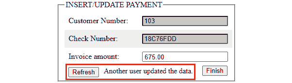

# *第九章*：CRUD、事务和锁定

在本章中，我们将介绍关于 CRUD 操作、事务和锁定的基本概念，这些概念在几乎任何数据库应用中都被广泛使用。在常见场景中，应用程序有大量的 CRUD 操作，这些操作在显式界定的逻辑事务中执行，并且在某些情况下，它们还需要显式控制对数据的并发访问，以防止**竞态条件**、**丢失更新**和其他**SQL 现象**（或 SQL 异常）。

在本章中，我们将介绍以下主题：

+   CRUD

+   导航（可更新）记录

+   事务

+   锁定

让我们开始吧！

# 技术要求

本章的代码可以在 GitHub 上找到：[`github.com/PacktPublishing/jOOQ-Masterclass/tree/master/Chapter09`](https://github.com/PacktPublishing/jOOQ-Masterclass/tree/master/Chapter09)。

# CRUD

除了用于表达复杂 SQL 的出色的 DSL 流畅 API 之外，jOOQ 还可以用于表达**日常**SQL 操作。这些被称为`INSERT`（插入）、`SELECT`（选择）、`UPDATE`（更新）和`DELETE`（删除），jOOQ 通过一个涉及`UpdatableRecord`类型的专用 API 来简化它们。换句话说，jOOQ 代码生成器为每个具有主键的表生成一个`UpdatableRecord`（可以再次从数据库中检索和存储的记录），而不仅仅是简单唯一键的表！没有主键的表（`org.jooq.TableRecord`）被 jOOQ 正确地认为是不可更新的。你可以很容易地识别一个 jOOQ `UpdatableRecord`，因为它必须扩展`UpdatableRecordImpl`类（只需检查你从`jooq.generated.tables.records`生成的记录）。接下来，jOOQ 公开了一个 CRUD API，允许你直接在这些可更新记录上操作，而不是编写 DSL 流畅查询（这对于涉及多个表的复杂查询更适合）。

如果你需要关于 jOOQ 记录的快速提醒，请查看*第三章*，*jOOQ 核心概念*。

重要提示

jOOQ CRUD API 非常适合**规范化**的数据库，因此对于具有主键（简单或复合）或唯一生命周期的表，主键只插入一次到表中。一旦插入，它就不能更改或删除后重新插入。

然而，正如你所知，jOOQ 试图在任何情况下都向你打招呼，所以如果你需要可更新的主键，那么请依赖`Settings.updatablePrimaryKeys()`。

jOOQ CRUD API 简化了多个操作，包括插入（`insert()`）、更新（`update()`）、删除（`delete()`）、合并（`merge()`）以及方便的存储（`store()`）。除了这些操作之外，我们还有众所周知的`selectFrom()`，它对于直接从单个表读取到可更新记录的`Result`非常有用。

然而，在我们查看几个 CRUD 示例之前，了解一组可以影响可更新记录和 CRUD 操作行为的方法是很重要的。这些方法是 `attach()`、`detach()`、`original()`、`changed()`、`reset()` 和 `refresh()`。

## 附加/解除可更新记录

大概来说，jOOQ 的可更新记录只是可以独立于数据库存在的 Java 对象，并且可以在内存中进行操作。只要可更新记录不需要与数据库交互，它就可以保持在 `Configuration` 中，`Configuration` 中包含连接到该可更新记录将要交互的数据库的坐标。一旦可更新记录被附加，它将保持这种状态，直到相应的 `Configuration` 存活或被显式调用 `detach()` 解除。

当我们从数据库中检索可更新记录时，jOOQ 将自动将它们附加到当前使用的 `Configuration`，并隐式地附加到涉及的数据库连接。此连接可以用于内部后续与检索的可更新记录的数据库交互。

重要提示

严格来说，jOOQ 并不持有 JDBC `Connection` 的引用，而是持有来自 `Configuration` 的 `ConnectionProvider`。在事务或连接池方面，这可能是相关的。例如，如果我们使用 Spring 的 `TransactionAwareDataSourceProxy`，一个附加的记录可以在一个事务中检索并在另一个事务中透明地存储。

考虑以下读取操作：

```java
SaleRecord sr = ctx.selectFrom(SALE)
```

```java
   .where(SALE.SALE_ID.eq(1L)).fetchSingle();
```

`sr` 记录被 jOOQ 自动附加到 `ctx` 的 `Configuration` 部分。接下来，我们可以成功执行其他与数据库交互的操作，例如 `sr.update()`、`sr.delete()` 等。

现在，让我们考虑一个由客户端创建的新记录，如下所示：

```java
SaleRecord srNew = new SaleRecord(...);
```

这样的记录不会自动附加到任何现有的 `Configuration`。它们尚未从数据库中检索，因此 jOOQ 有理由期望你将在必要时（例如，在调用 `sr.insert()` 之前）明确/手动将它们附加到 `Configuration`。这可以通过明确调用 `DSLContext.attach()` 或 `UpdatableRecord.attach()` 方法来完成，如下所示：

```java
ctx.attach(srNew);
```

```java
srNew.attach(ctx.configuration());
```

然而，为了避免显式调用 `attach()`，我们可以依赖 `DSLContext.newRecord()` 选项。由于 `DSLContext` 包含 `Configuration` 部分，jOOQ 将自动执行附加。因此，这里你应该使用以下代码片段（如果你想从 POJO 中填充记录，则使用 `newRecord(Table<R> table, Object o)` 风味）：

```java
SaleRecord srNew = ctx.newRecord(SALE);
```

```java
srNew.setFiscalYear(…);
```

```java
…
```

一旦 `srNew` 被附加，我们就可以执行与数据库交互的操作。尝试在解除附加的可更新记录上执行此类操作将导致一个异常，该异常声明 `org.jooq.exception.DetachedException`：*无法执行查询。未配置连接*。

可更新记录可以通过 `UpdatableRecord.detach()` 显式解除：

```java
srNew.detach(); // equivalent to srNew.attach(null);
```

虽然可更新的记录是可序列化的，但`Configuration`的底层`Connection`（或`DataSource`）是不可序列化的。尽管如此，在序列化之前不需要分离记录。`DefaultConfiguration`的内部确保任何不是`Serializable`的（例如，`DefaultConnectionProvider`）都不会被序列化。尽管如此，在反序列化之后仍然需要重新附加。jOOQ 雷达上的序列化支持最终将被弃用：[`github.com/jOOQ/jOOQ/issues/2359`](https://github.com/jOOQ/jOOQ/issues/2359)。

从这一点，不要得出序列化/反序列化记录是日常任务的结论。大多数时候，记录用于填充视图（例如，通过 Thymeleaf）或通过 jOOQ 支持导出为 CSV、JSON、HTML 等，正如您将在下一章中看到的那样。这些操作都不需要显式分离。

## 什么是原始（可更新）记录？

每个（可更新）记录都持有对其*当前*值和*原始*值的引用。

如果记录是从数据库中检索的，那么检索到的值同时代表*原始*和*当前*值。接下来，可以在内存中修改*当前*值，而*原始*值保持不变。例如，假设以下查询检索了`SALE.FISCAL_YEAR`字段，其值为*2005*，并且在检索后将其设置为*2002*：

```java
SaleRecord sr = ctx.selectFrom(SALE)
```

```java
   .where(SALE.SALE_ID.eq(1L)).fetchSingle();
```

```java
// or, a little bit more concise
```

```java
SaleRecord sr = ctx.fetchSingle(SALE, SALE.SALE_ID.eq(1L));
```

```java
sr.setFiscalYear(2002);
```

在这一点上，财政年度的*原始*值是*2005*，而*当前*值是*2002*。在插入/更新记录后，已插入/更新的*当前*值成为*原始*值。例如，在更新`sr`后，财政年度的*原始*值变为*2002*，就像*当前*值一样。这样，`sr`反映了数据库的最新状态。因此，在更新后，*原始*值仅反映默认发送到数据库的内容。默认情况下，触发生成的值不会被检索回来。为了实现这一点，需要`Settings.returnAllOnUpdatableRecord()`。

在新记录的情况下，*原始*值始终为`null`，并且直到记录被插入或更新之前保持这种状态。

每当我们需要*原始*值时，我们可以调用`Record.original()`。如果没有参数，`original()`方法返回一个全新的记录，该记录已填充了*原始*值。如果在调用`original()`时附加了`sr`，则`srOriginal`也会附加；否则，它会被分离：

```java
SaleRecord srOriginal = sr.original();
```

通过指定一个`Field`、`Name`、`String`或整数（索引）作为参数，我们可以提取某个字段的*原始*值。以下是一个类型安全和类型不安全的示例：

```java
int fiscalYear = sr.original(SALE.FISCAL_YEAR);
```

```java
int fiscalYear = (int) sr.original("fiscal_year");
```

拥有记录的*当前值*和*原始值*在手，可以在比较这些值之间或与其他值进行比较后做出决策，创建原始数据和当前数据的并排视图，等等。在捆绑的代码中，称为*OriginalRecords*（适用于 MySQL），你可以看到一个通过 Thymeleaf 渲染`PRODUCT`并排视图的示例。相关的 Thymeleaf 代码如下：

```java
<tr>
```

```java
  <td> Product Buy Price:</td>
```

```java
  <td th:text = "${product.original('buy_price')}"/></td>     
```

```java
</tr>
```

```java
<tr>
```

```java
  <td> Product MSRP:</td> 
```

```java
  <td th:text = "${product.original('msrp')}"/></td>      
```

```java
</tr>
```

你会看到以下类似的内容：

![图 9.1 – 并排视图![图 9.1 – 并排视图图 9.1 – 并排视图接下来，让我们专注于标记（可更新的）记录为已更改/未更改。## 标记（可更新的）记录为已更改/未更改一个*原始值*与*当前值*完全相同的记录被认为是*未更改*的。通过调用`Record.changed()`标志方法，我们可以找出 jOOQ 认为记录是*已更改*还是*未更改*。例如，一个从数据库中获取且从未修改过的记录是*未更改*的：```javaSaleRecord sr = ctx.selectFrom(SALE)``````java   .where(SALE.SALE_ID.eq(1L)).fetchSingle();  ``````javasr.changed(); // false``````javasr.setFiscalYear(2005);``````javasr.changed(); // true```即使我们将从数据库中获取的相同财政年度（*2005*）设置，这条记录也被标记为*已更改*。另一方面，一个全新的记录也被认为是*已更改*：```javaSaleRecord sr = new SaleRecord(null, 2021, 453.2, 1504L, ...);``````javasr.changed(); // true``````javaSaleRecord sr = new SaleRecord();``````javasr.setFiscalYear(2021);``````javasr.setSale(4500.25);``````java...``````javasr.changed(); // true```注意，`changed()`在字段级别操作，因为它是一个与记录字段数量相同的`BitSet`。换句话说，记录的每个字段都有一个`changed()`标志方法。我们只需要将字段作为`changed()`的参数传递，作为`Field`、`Name`、`String`或`int`（表示索引）：```javaboolean changed = sr.changed(SALE.FISCAL_YEAR);``````javaboolean changed = sr.changed("fiscal_year");```每当我们尝试插入或更新一个记录时，jOOQ 会检查*已更改*标志以确定哪些字段应包含在生成的查询中。这很好，因为通过仅渲染*已更改*的字段，jOOQ 允许为省略的字段设置*默认值*（通过`CREATE TABLE` DDL 语句指定）。如果没有字段被*更改*，那么 jOOQ 可以防止执行插入/更新操作（我们将在本章后面更详细地介绍这一点）。然而，我们可以通过显式地打开（或关闭）*已更改*标志来强制/抑制此类语句的执行。我们可以通过将所有字段标记为*已更改*/*未更改*来实现：```javasr.changed(true/false); ```我们也可以通过仅标记某些字段来完成同样的操作：```javasr.changed(SALE.FISCAL_YEAR, true/false);``````javasr.changed("fiscal_year", true/false);```注意如何处理这些标志，因为很容易搞砸事情并生成一些不幸的 DML 语句。接下来，让我们谈谈重置记录。## 重置一个（可更新的）记录通过重置记录，我们`false`。这可以在不与数据库交互的情况下完成。我们可以通过使用`Record.reset()`来重置所有字段：```javasr.reset();```我们可以通过使用`reset(Field`/`Name`/`String`/`int)`来仅重置某些字段：```javasr.reset(SALE.FISCAL_YEAR);``````javasr.reset("fiscal_year");```你将在接下来的章节中看到这个方法的应用。最后，让我们谈谈如何刷新记录。## 刷新一个可更新的记录通过刷新可更新记录，我们将记录的原始值与数据库的最新状态同步，并在它们已被设置的情况下撤销当前值。实际上，`UpdatableRecord.refresh()` 在一个 `SELECT` 往返中实现，该往返加载记录的原始值并设置所有更改标志为 `false`。刷新记录的所有字段可以按以下方式完成：```javasr.refresh();```你可以使用 `refresh``(Field<?>... fields)` 或 `refresh``(Collection<? extends Field<?>> fields)` 部分刷新可更新记录：```javasr.refresh(SALE.FISCAL_YEAR, SALE.SALE_);```在这种情况下，`SELECT` 被渲染以仅获取指定的字段。正如你很快就会看到的，这个 `refresh()` 方法与乐观锁定结合使用时非常有用。你可以在 *SimpleCRUDRecords* 中找到这些示例（适用于 MySQL 和 PostgreSQL）。接下来，让我们谈谈插入可更新记录。## 插入可更新记录顺便一提，为了确保本节不被误解：`insert()` 可以在任意 `TableRecord` 上调用，而不仅仅是 `UpdatableRecord`；对于 `insert()`，不需要主键。现在，可以通过 `UpdatableRecord.insert()` 和其重载方法插入可更新记录。通常，我们插入全新的记录或从 POJOs（例如，通过 `from(POJO)` 或 `newRecord(Table<R> table, Object o)` 方法）加载的记录，这些记录被 jOOQ 视为新记录。以下是一个创建和插入可更新记录的简单且经典的示例：```javaSaleRecord sr = ctx.newRecord(SALE);``````javasr.setFiscalYear(2021);``````java...``````javasr.insert();```然而，如果你这样创建它，那么你需要显式调用 `attach()`：```javaSaleRecord sr = new SaleRecord();``````javasr.setFiscalYear(2021);``````java...        ``````javactx.attach(sr);``````javasr.insert();   ```jOOQ 生成并执行 `INSERT` 语句。此外，默认情况下，jOOQ 尝试从数据库中加载任何生成的键（`IDENTITY`/`SEQUENCE` 值，大多数数据库都支持）并将它们转换回符合以下说明的记录。重要提示 JDBC 的 `getGeneratedKeys()` 方法仅在没有更好的方法时使用。在 Db2、Firebird、MariaDB、Oracle、PostgreSQL 以及不久的将来 H2 中，存在本地的 `RETURNING` 或 `<data change delta table>` 支持，这有利于单次往返。有时，如果 `getGeneratedKeys()` 不受支持，或者支持得不好，那么可能需要额外的往返，并使用额外的 `SELECT` 语句。这在 `Settings.returnAllOnUpdatableRecord()` 激活时尤其如此。因此，在 `INSERT` 之后调用 `sr.getSaleId()` 将返回数据库生成的主键。有时，你可能只需要重新插入一个可更新记录中包含的数据。默认情况下，由于记录在插入后没有改变（`changed()` 返回 `false`），执行另一个 `insert()` 将导致默认值的 `INSERT`（`INSERT INTO sale VALUES (default, default, ...)`）。如果 `CREATE TABLE` DDL 没有为所有渲染的默认值提供默认值，那么这将导致错误；即 *字段 'foo' 没有默认值*。但是，正如你在捆绑的代码中所看到的，这种行为可以通过 `withInsertUnchangedRecords(false)` 来控制。将此标志设置为 `false` 将抑制执行默认值 `INSERT` 的任何尝试。要插入相同的数据而不创建新的记录，你可以手动将记录字段标记为已更改（注意，我们将主键标记为 *未更改*，因此它被省略在生成的 `INSERT` 中以避免重复键错误）：```javasr.changed(true); ``````javasr.changed(SALE.SALE_ID, false); ``````javasr.insert();```当然，如果你想重新插入仅某些字段，那么只标记那些字段为 *已更改*。另一方面，如果你想重新插入数据并创建一个新的记录，那么依赖于 `UpdatableRecord.copy()` 方法。`copy()` 方法非常方便，因为它在内存中复制这个记录，将所有字段标记为 *已更改*，并且不复制主键或任何其他主要唯一键：```javaSaleRecord srCopy = sr.copy();        ``````javasrCopy.insert();  ``````java// or, shortly``````javasr.copy().insert();```更多示例，包括不返回生成的主键的插入和插入并返回所有字段，可以在捆绑的代码 *SimpleCRUDRecords* 中找到（适用于 MySQL 和 PostgreSQL）。接下来，让我们专注于更新记录。## 更新可更新记录（这听起来很滑稽）通常，一个可更新记录是从数据库中检索出来的，并在内存中进行更改。随后，通过调用 `UpdatableRecord.update()` 或其变体将这些更改传播到数据库，这允许我们指定应该更新的字段。让我们检索一个记录并更改它：```javaSaleRecord sr = ctx.selectFrom(SALE)``````java   .where(SALE.SALE_ID.eq(1L)).fetchSingle();                ``````javasr.setFiscalYear(2000);``````javasr.setSale(1111.25);```如果我们在控制台上打印 `sr`，那么结果将类似于以下内容：

图 9.2 – 在控制台上显示修改后的记录

注意，jOOQ 将 `fiscal_year` 和 `sale` 用星号 (`*`) 标记。这个星号突出了将参与以下 `UPDATE` 的已更改字段：

```java
sr.update();
```

在 MySQL 方言中渲染的 SQL 如下（渲染的 `UPDATE` 依赖于主键）：

```java
UPDATE `classicmodels`.`sale`
```

```java
SET `classicmodels`.`sale`.`fiscal_year` = 2000,
```

```java
    `classicmodels`.`sale`.`sale` = 1111.25
```

```java
WHERE `classicmodels`.`sale`.`sale_id` = 1
```

默认情况下，更新一个已经是最新的记录没有任何效果。当然，如果你依赖 `changed()` 来标记所有/某些字段为 *已更改*，那么你将强制 jOOQ 执行相应的 `UPDATE`。你可以在捆绑的代码中通过 `Settings.withUpdateUnchangedRecords(UpdateUnchangedRecords)` 来练习强制更新。

## 删除可更新记录

可以通过 `UpdatableRecord.delete()` 删除检索的可更新记录：

```java
SaleRecord sr = ctx.selectFrom(SALE)
```

```java
   .where(SALE.SALE_ID.eq(5L)).fetchSingle();                
```

```java
sr.delete();
```

```java
// MySQL rendered SQL
```

```java
DELETE FROM `classicmodels`.`sale` WHERE `classicmodels`
```

```java
  .`sale`.`sale_id` = 5
```

如您所见，渲染的 `DELETE` 依赖于主键（或主要唯一键）。删除后，被删除记录的所有字段都会自动标记为 *已更改*，因此您可以轻松地通过调用 `insert()` 再次插入它。

## 合并可更新的记录

每当我们想要对一个可更新的记录（全新或从数据库中检索到的）执行 `MERGE` 语句时，我们可以调用 `UpdatableRecord.merge()`。在这种情况下，jOOQ 会渲染一个 `INSERT ... ON DUPLICATE KEY UPDATE`（这取决于使用的方言，是模拟的），因此它将选择在 `INSERT` 和 `UPDATE` 之间的任务委托给数据库。以下是一个示例：

```java
SaleRecord srNew = ctx.newRecord(SALE);
```

```java
srNew.setFiscalYear(2000);
```

```java
...
```

```java
srNew.merge();
```

在这种情况下，`srNew` 将被插入。以下是一个另一个示例：

```java
SaleRecord srFetched = ctx.selectFrom(SALE)
```

```java
   .where(SALE.SALE_ID.eq(1L)).fetchSingle();                
```

```java
srFetched.setFiscalYear(2005);
```

```java
...
```

```java
srFetched.merge();
```

在这里，`srFetched` 将根据主键进行更新。实际上，jOOQ 将渲染一个更新行的 SQL 语句，无论哪个（唯一）键值已经存在。

## 存储可更新的记录

存储可更新的记录可以通过调用 `UpdatableRecord.store()` 方法来完成。此方法根据主键的状态导致 `INSERT` 或 `UPDATE`。渲染 `INSERT` 或 `UPDATE` 的决定由 jOOQ 而不是数据库做出，就像在 `MERGE` 的情况下一样。

通常，为新可更新的记录调用 `store()` 会导致一个 `INSERT`：

```java
SaleRecord srNew = ctx.newRecord(SALE);
```

```java
srNew.setFiscalYear(2000);
```

```java
...
```

```java
srNew.store(); // jOOQ render an INSERT
```

如果可更新的记录是从数据库中检索的，并且其主键没有更改，那么 jOOQ 将渲染一个 `UPDATE`：

```java
SaleRecord srFetched = ctx.selectFrom(SALE)
```

```java
   .where(SALE.SALE_ID.eq(5L)).fetchSingle();                
```

```java
srFetched.setFiscalYear(2005);
```

```java
srFetched.changed(SALE.SALE_, true);
```

```java
...
```

```java
srFetched.store(); // jOOQ render an UPDATE
```

如果可更新的记录是从数据库中检索的，并且其主键已更改，那么 jOOQ 将渲染一个 `INSERT`：

```java
srFetched.setSaleId(…);
```

```java
srFetched.store(); // jOOQ render an INSERT
```

然而，我们仍然可以通过 `withUpdatablePrimaryKeys(true)` 强制主键的 `UPDATE`：

```java
DSLContext derivedCtx = ctx.configuration().derive(
```

```java
  new Settings().withUpdatablePrimaryKeys(true)).dsl();
```

```java
SaleRecord sr = derivedCtx.selectFrom(SALE)
```

```java
   .where(SALE.SALE_ID.eq(7L)).fetchSingle(); 
```

```java
sr.setSaleId(...);
```

```java
sr.store(); // jOOQ render an UPDATE of primary key        
```

然而，正如 Lukas Eder 分享的那样：“我认为值得指出的是，更新主键与所有规范化原则背道而驰。它是为了那些有很好的理由这样做的情况而引入的，而这些理由非常罕见（通常是数据迁移或修复损坏的数据，但即使在这种情况下，他们可能更倾向于使用 SQL 语句而不是可更新的记录）。”

您可以在 *SimpleCRUDRecords*（适用于 MySQL 和 PostgreSQL）中看到这些示例。

另一方面，如果您更喜欢使用 POJO 和 jOOQ 的 DAO，那么您会想查看 *SimpleDaoCRUDRecords*（适用于 MySQL 和 PostgreSQL）中的示例。这些示例依赖于 DAO 的 `insert()`、`update()`、`delete()` 和 `merge()`。此外，您将看到 `withReturnRecordToPojo()` 设置在起作用。接下来，让我们专注于在 Web 应用程序中使用可更新的记录。

## 在 HTTP 会话中使用可更新的记录

jOOQ 的可更新记录可用于 Web 应用程序，换句话说，在跨越无状态 HTTP 协议请求的会话中使用。接下来，我们将开发几个 Spring Boot 示例，旨在强调我们迄今为止所学的内容。

### 使用 insert()、update() 和 delete()

让我们尝试构建一个使用可更新记录和`insert()`、`update()`和`delete()`的 Spring Boot 示例应用程序。在依赖 Spring MVC 设计模式的同时，让我们考虑以下场景：我们的主要目标是提供一个属于特定客户相同付款（`PAYMENT`）的所有银行交易（`BANK_TRANSACTION`）的列表。用户应该能够插入一个新的银行交易，并删除或修改现有的交易。

#### 列出所有银行交易

显示银行交易的页面应如下所示（`transactions.html`）：


图 9.3 – 某个付款的所有银行交易

让我们从控制器端点开始，该端点应被访问以生成前面截图所示的输出：

```java
@GetMapping("/transactions")
```

```java
public String loadAllBankTransactionOfCertainPayment(
```

```java
             SessionStatus sessionStatus, Model model) {
```

```java
  sessionStatus.setComplete();
```

```java
  model.addAttribute(ALL_BANK_TRANSACTION_ATTR,
```

```java
    classicModelsService
```

```java
      .loadAllBankTransactionOfCertainPayment());
```

```java
  return "transactions";
```

```java
}
```

在高亮显示的代码中，我们调用负责访问执行查询以获取特定付款的所有交易的存储库的服务。这个查询相当简单（当然，在现实中，你不会硬编码`CUSTOMER_NUMBER`和`CHECK_NUMBER`的值——这些可以代表诸如登录付款凭证之类的信息）：

```java
public Result<BankTransactionRecord> 
```

```java
      fetchAllBankTransactionOfCertainPayment() {
```

```java
   return ctx.selectFrom(BANK_TRANSACTION)
```

```java
      .where(BANK_TRANSACTION.CUSTOMER_NUMBER.eq(333L)
```

```java
      .and(BANK_TRANSACTION.CHECK_NUMBER.eq("NF959653")))
```

```java
      .fetch();
```

```java
}
```

下一步，从前面列出的控制器端点返回的`Result<BankTransactionRecord>`被存储在模型中（Spring Boot 的`Model`）作为名为`all`的请求属性（`ALL_BANK_TRANSACTION_ATTR = "all"`）。要渲染从该控制器端点返回的页面（`transactions.html`），我们可以依赖流行的 Thymeleaf 模板引擎（当然，你可以使用任何其他模板引擎）：

```java
<tr th:each="t : ${all}">
```

```java
 <td><span th:text="${t.transactionId}">ID</span></td> 
```

```java
 <td><span th:text="${t.bankName}">Bank Name</span></td>
```

```java
 ...
```

```java
 <td><span th:text="${t.status}">Status</span></td>   
```

```java
</tr>
```

从返回的页面（`transactions.html`），我们可以选择插入一个新的交易或修改现有的交易。

#### 插入一个新的银行交易

插入一个新的银行交易可以通过以下方式渲染链接：

```java
<a href="/newbanktransaction">Insert new bank transaction</a>
```

此链接到达一个控制器端点，其外观如下：

```java
@GetMapping("/newbanktransaction")
```

```java
public String newBankTransaction(Model model) {
```

```java
model.addAttribute(NEW_BANK_TRANSACTION_ATTR, 
```

```java
                        new BankTransactionRecord());
```

```java
  return "newtransaction";
```

```java
}
```

因此，此控制器端点创建了一个新的`BankTransactionRecord`，通过`NEW_BANK_TRANSACTION_ATTR`请求属性存储在模型中。返回的页面`newtransaction.html`被渲染如下：


图 9.4 – 创建一个新的银行交易

点击*保存*按钮会触发一个`POST`请求，该请求到达以下控制器端点（`/new`）：

```java
@PostMapping("/new")
```

```java
public String newBankTransaction(
```

```java
  @ModelAttribute BankTransactionRecord btr,
```

```java
  RedirectAttributes redirectAttributes) {
```

```java
  classicModelsService.newBankTransaction(btr);
```

```java
  redirectAttributes.addFlashAttribute(
```

```java
    INSERT_DELETE_OR_UPDATE_BANK_TRANSACTION_ATTR, btr);
```

```java
  return "redirect:success";
```

```java
}
```

因此，Spring Boot 使用提交的数据填充`btr`记录，并将其插入到数据库中（在插入之前，在服务方法（此处未列出）中，我们通过`btr.setCustomerNumber()`和`btr.setCheckNumber()`将这个新交易与相应的付款关联起来）：

```java
@Transactional
```

```java
public int newBankTransaction(BankTransactionRecord btr) {
```

```java
  ctx.attach(btr);
```

```java
  return btr.insert();
```

```java
}
```

由于这是一个新的银行交易，我们必须在插入之前将其附加。

#### 更新银行交易

让我们考虑更新银行交易意味着一个四步向导。对于简单向导，我们可以在向导的最后一步提交一个单独的 `<form/>`。然而，对于动态向导，我们必须为每个面板使用一个 `<form/>`，因为我们必须在每个步骤提交数据以决定下一个面板以及它将包含什么。因此，在这种情况下，我们必须实现一个能够存储用户数据并在面板之间来回导航的长 HTTP 会话。通常，这是通过通过客户端的 HTTP 会话存储数据来完成的。

让我们尽可能保持简单，并假设四步向导看起来如下：


图 9.5 – 四步向导

在进入此向导之前，我们必须点击与我们要编辑的银行交易对应的 *修改* 链接。这将发送交易 ID 并达到以下控制器端点：

```java
@GetMapping("/editbankname/{id}")
```

```java
public String loadBankTransaction(
```

```java
       @PathVariable(name = "id") Long id, Model model) {
```

```java
model.addAttribute(BANK_TRANSACTION_ATTR, 
```

```java
    classicModelsService.loadBankTransaction(id));
```

```java
  return "redirect:/editbankname";
```

```java
}
```

可以通过以下存储库方法获取 `BankTransactionRecord`：

```java
public BankTransactionRecord fetchBankTransaction(Long id) {
```

```java
  return ctx.selectFrom(BANK_TRANSACTION)
```

```java
     .where(BANK_TRANSACTION.TRANSACTION_ID.eq(id))
```

```java
     .fetchSingle();
```

```java
}
```

由于这是一个应该在向导面板之间持续存在的交易，我们必须通过会话属性 `BANK_TRANSACTION_ATTR = "bt"` 在模型中存储它。接下来，我们必须返回向导的第一个面板。

### 编辑银行名称

一旦我们编辑了银行名称，我们必须点击 *下一步* 提交数据。这将达到以下控制器端点：

```java
@PostMapping("/name")
```

```java
public String editBankName(
```

```java
@ModelAttribute(BANK_TRANSACTION_ATTR) 
```

```java
                  BankTransactionRecord btr) {
```

```java
   return "redirect:editbankiban";
```

```java
}
```

在这里，我们只是允许 Spring Boot 同步 `btr` 会话记录与提交的数据。接下来，我们必须返回第二个面板。

### 编辑 IBAN

一旦我们编辑了银行名称，我们必须编辑 IBAN 并点击 *下一步*（我们也可以点击 *上一步* 再次编辑银行名称）。 在编辑 IBAN 后，提交的数据达到控制器端点：

```java
@PostMapping("/iban")
```

```java
public String editBankIban(
```

```java
   @ModelAttribute(BANK_TRANSACTION_ATTR)  
```

```java
      BankTransactionRecord btr) {
```

```java
   return "redirect:editcardtype";
```

```java
}
```

再次，我们允许 Spring Boot 同步 `btr` 会话记录与提交的数据。接下来，我们必须返回第三个面板。

### 编辑卡片类型

一旦我们编辑了银行的 IBAN，我们必须选择卡片类型并点击 *下一步*（我们也可以点击 *上一步* 再次编辑银行 IBAN）。 在选择卡片类型后，提交的数据达到控制器端点：

```java
@PostMapping("/cardtype")
```

```java
public String editCardType(
```

```java
@ModelAttribute(BANK_TRANSACTION_ATTR) 
```

```java
      BankTransactionRecord btr) {
```

```java
   return "redirect:editbanktransfer";
```

```java
}
```

再次，我们允许 Spring Boot 同步 `btr` 会话记录与提交的数据。接下来，我们必须返回最后一个面板。

### 编辑转账金额

最后，我们必须编辑转账金额并将其提交到控制器端点：

```java
@PostMapping("/transfer")
```

```java
public String updateBankTransfer(
```

```java
@ModelAttribute(BANK_TRANSACTION_ATTR) 
```

```java
    BankTransactionRecord btr, SessionStatus sessionStatus,
```

```java
    RedirectAttributes redirectAttributes) {
```

```java
  classicModelsService.updateBankTransaction(btr);
```

```java
  redirectAttributes.addFlashAttribute(
```

```java
    INSERT_DELETE_OR_UPDATE_BANK_TRANSACTION_ATTR, btr);
```

```java
  sessionStatus.setComplete();
```

```java
  return "redirect:success";
```

```java
}
```

在存储库方法中使用了 `UPDATE` 方法，如下所示：

```java
@Transactional
```

```java
public int updateBankTransaction(BankTransactionRecord btr) {
```

```java
  return btr.update();
```

```java
}
```

最后，我们必须清理 HTTP 会话以删除可更新的记录。

#### 重置向导数据

任何向导的常见功能是提供一个 *重置* 按钮来将当前面板或整个向导的数据重置为最新保存的数据。我们的 *重置* 按钮依赖于 jOOQ 的 `reset()` 方法来重置向导（所有三个面板）：

```java
@GetMapping("/reset/{page}")
```

```java
    public String reset(
```

```java
    @PathVariable(name = "page") String page, Model model) {
```

```java
  if (model.containsAttribute(BANK_TRANSACTION_ATTR)) {
```

```java
   ((BankTransactionRecord) model.getAttribute(
```

```java
     BANK_TRANSACTION_ATTR)).reset();
```

```java
  }
```

```java
  return "redirect:/" + page;
```

```java
}
```

当然，您可以使用 `reset(Field`/`Name`/`String`/`int)` 来实现按面板重置功能。最后，让我们删除一个银行交易。

#### 删除银行交易

如*图 9.5*所示，我们的向导中的每个面板都包含一个*删除*按钮，它允许我们删除这笔银行交易。其控制器端点的代码如下：

```java
@GetMapping("/delete")
```

```java
public String deleteBankTransaction(
```

```java
  SessionStatus sessionStatus, Model model,
```

```java
          RedirectAttributes redirectAttributes) {
```

```java
  ...
```

```java
BankTransactionRecord btr = (BankTransactionRecord) 
```

```java
    model.getAttribute(BANK_TRANSACTION_ATTR);
```

```java
  classicModelsService.deleteBankTransaction(btr);
```

```java
  sessionStatus.setComplete();
```

```java
  ...
```

```java
}
```

在以下存储库方法中，`DELETE`是通过调用`delete()`来实现的：

```java
@Transactional
```

```java
public int deleteBankTransaction(BankTransactionRecord btr) {
```

```java
  return btr.delete();
```

```java
}
```

完整的代码称为*CRUDRecords*。如果您更喜欢使用 POJOs 和 jOOQ 的 DAO，请查看*DaoCRUDRecords*和 REST 版本（用于 Postman、ARC 等），该版本称为*DaoCRUDRESTRecords*。这三个应用程序都适用于 MySQL。为了简洁，我们省略了任何验证和错误处理代码。

### 使用 merge()与 store()的比较

让我们考虑以下场景：我们已经加载并显示了某个客户（例如，`PAYMENT.CUSTOMER_NUMBER.eq(103L)`）的付款（`PAYMENT`）。用户应该能够为此客户插入新的付款或更新现有付款的金额。为了解决这个问题，我们有两种几乎相同的方法。这些方法在下面的屏幕截图中显示：


图 9.6 – 插入/更新付款

关于左侧的设计，要插入一个新的付款，我们可以简单地输入一个新的（唯一的）*支票号码*（例如，通过短信接收）和相应的*发票金额*。要更新现有付款的*发票金额*，我们必须从底部表格中输入其当前的*支票号码*（例如，要更新表格中的第二个付款，我们必须输入*支票号码* *JM555205*）。

关于右侧设计，要插入一个新的付款，我们只需输入*发票金额*；*支票号码*由应用程序自动生成并预先填写。然而，要更新现有付款的*发票金额*，我们必须首先通过底部表格中的相应*加载*链接加载付款。这将从数据库中检索相应的付款，以便我们可以输入新的金额值并更新它。

#### 通过 merge()实现左侧设计

让我们专注于左侧设计。在用户提交付款表单后，Spring Boot 创建一个新的`PaymentRecord`并用提交的数据填充它。接下来，根据提交的*支票号码*，我们必须确定这是一笔新付款还是对现有付款的更新，以执行`INSERT`或`UPDATE`。因此，现在是`merge()`发挥作用并生成一个将选择`INSERT`或`UPDATE`的任务委托给数据库的 SQL 的时候了：

```java
@PostMapping("/merge")
```

```java
public String mergePayment(PaymentRecord pr) {
```

```java
  classicModelsService.mergePayment(pr);
```

```java
  return "redirect:payments";
```

```java
}
```

```java
@Transactional
```

```java
public int mergePayment(PaymentRecord pr) {
```

```java
   ctx.attach(pr);               
```

```java
   return pr.merge();
```

```java
}
```

那就是所有重要的代码！请注意，在合并之前，我们需要附加相关的`PaymentRecord`。请记住，Spring Boot 已经创建了此记录，因此它没有附加到任何`Configuration`。

查看此代码的完整应用程序，该应用程序称为*MergeRecords*。如果您更喜欢使用 POJOs 和 jOOQ 的 DAO，请查看*DaoMergeRecords*。这两个应用程序都适用于 MySQL。

#### 通过 store()实现右侧设计

如果我们希望实现右侧设计，那么我们必须首先准备一个新的 `PaymentRecord`（例如，我们必须生成 *Check Number*）并通过 HTTP 会话属性（`PAYMENT_ATTR`）存储它。这个 `PaymentRecord` 将返回给用户。然而，如果用户想要更新现有付款的 *Invoice Amount*，那么他们可以选择点击底部表格中的相应 *Load* 链接。以下查询可以用来获取相关的 `RecordPayment`：

```java
public PaymentRecord fetchPayment(Long nr, String ch) {
```

```java
  return ctx.selectFrom(PAYMENT)
```

```java
    .where(row(PAYMENT.CUSTOMER_NUMBER, PAYMENT.CHECK_NUMBER)
```

```java
    .eq(row(nr, ch)))
```

```java
    .fetchSingle();
```

```java
}
```

获取的 `PaymentRecord` 覆盖了来自 HTTP 会话的记录，并将其返回给用户。当用户提交数据时，Spring Boot 会将存储在 `PAYMENT_ATTR`（可以是新的 `PaymentRecord` 或获取的 `PaymentRecord`）中的 `PaymentRecord` 值与提交的数据同步。这次，我们可以让 jOOQ 通过 `store()` 方法在 `INSERT` 和 `UPDATE` 之间进行选择，因为此方法区分了新的 `PaymentRecord` 和获取的 `PaymentRecord` 并相应地执行：

```java
@PostMapping("/store")
```

```java
public String storePayment(SessionStatus sessionStatus,
```

```java
            @ModelAttribute(PAYMENT_ATTR) PaymentRecord pr) {
```

```java
   pr.setCachingDate(LocalDateTime.now());
```

```java
   classicModelsService.storePayment(pr);
```

```java
   sessionStatus.setComplete();
```

```java
   return "redirect:payments";
```

```java
}
```

```java
@Transactional
```

```java
public int storePayment(PaymentRecord pr) {
```

```java
  ctx.attach(pr);
```

```java
  return pr.store();
```

```java
}
```

使用 `store()` 的应用程序名为 *StoreRecords*（适用于 MySQL）。现在，让我们继续讨论如何导航（可更新的）记录。

# 导航（可更新的）记录

jOOQ 提供了几个仅适用于附加（可更新的）记录的导航方法（`TableRecord` 和 `UpdatableRecord`）。要使用这些方法，请考虑以下注意事项。

重要提示

虽然这些方法非常方便/吸引人，但它们也带来了很大的 N+1 风险。`UpdatableRecord` 对于 CRUD 非常好，但如果您不使用 CRUD，那么您不应该使用 `UpdatableRecord`。最好只投影所需的列，并尝试使用连接或其他 SQL 工具从多个表中获取数据。

这些方法基于外键引用进行导航。例如，附上 `DepartmentRecord` 后，我们可以通过 `fetchParent(ForeignKey<R, O> key)` 导航其父级（`OFFICE`），如下所示：

```java
public OfficeRecord fetchOfficeOfDepartment(
```

```java
     DepartmentRecord dr) {
```

```java
  return dr.fetchParent(Keys.DEPARTMENT_OFFICE_FK);
```

```java
  // or, Keys.DEPARTMENT_OFFICE_FK.fetchParent(dr);
```

```java
}
```

`Keys.DEPARTMENT_OFFICE_FK` 外键是由 jOOQ 代码生成器根据我们的 `CREATE TABLE` DDL 生成的。在 MySQL 方言中，jOOQ 生成的 SQL 如下所示：

```java
SELECT 
```

```java
  `classicmodels`.`office`.`office_code`, 
```

```java
  ...
```

```java
  `classicmodels`.`office`.`location` 
```

```java
FROM 
```

```java
  `classicmodels`.`office` 
```

```java
WHERE 
```

```java
  `classicmodels`.`office`.`office_code` in (?)
```

您也可以通过 `parent()` 方法获取 `Table<OfficeRecord>`：

```java
Table<OfficeRecord> tor = 
```

```java
   dr.parent(Keys.DEPARTMENT_OFFICE_FK);
```

```java
Table<OfficeRecord> tor = 
```

```java
   Keys.DEPARTMENT_OFFICE_FK.parent(dr);
```

接下来，附上 `OfficeRecord` 后，我们可以通过 `fetchChildren(ForeignKey<O,R> key)` 获取员工（`EMPLOYEE`），如下所示：

```java
public Result<EmployeeRecord>
```

```java
         fetchEmployeesOfOffice(OfficeRecord or) {
```

```java
  return or.fetchChildren(Keys.EMPLOYEE_OFFICE_FK);
```

```java
  // or, Keys.EMPLOYEE_OFFICE_FK.fetchChildren(or);
```

```java
}
```

这次，为 MySQL 方言生成的 SQL 如下所示：

```java
SELECT 
```

```java
  `classicmodels`.`employee`.`employee_number`, 
```

```java
  ...
```

```java
  `classicmodels`.`employee`.`monthly_bonus` 
```

```java
FROM 
```

```java
  `classicmodels`.`employee` 
```

```java
WHERE
```

```java
  `classicmodels`.`employee`.`office_code` in (?)
```

您也可以通过 `children()` 方法获取 `Table<OfficeRecord>`（使用 `children()` 通常比 `fetchChildren()` 更可取，因为它鼓励编写查询而不是直接导航 `UpdatableRecord`）：

```java
Table<EmployeeRecord> ter = 
```

```java
   or.children(Keys.EMPLOYEE_OFFICE_FK);
```

```java
Table<EmployeeRecord> ter = 
```

```java
   Keys.EMPLOYEE_OFFICE_FK.children(or);
```

接下来，我们可以重用 `fetchChildren()` 来获取特定员工（`EmployeeRecord`）的客户（`CUSTOMER`）。这将导致获取该 `EmployeeRecord` 的所有 `CustomerRecord`。最后，附上 `CustomerRecord` 后，我们可以通过 `fetchChild(ForeignKey<O, R> key)` 获取其详细信息（`CUSTOMERDETAIL`），如下所示：

```java
public CustomerdetailRecord    
```

```java
      fetchCustomerdetailOfCustomer(CustomerRecord cr) {
```

```java
  return cr.fetchChild(Keys.CUSTOMERDETAIL_CUSTOMER_FK);
```

```java
}
```

为 MySQL 方言生成的 SQL 如下所示：

```java
SELECT 
```

```java
  `classicmodels`.`customerdetail`.`customer_number`, 
```

```java
  ...
```

```java
  `classicmodels`.`customerdetail`.`country` 
```

```java
FROM 
```

```java
  `classicmodels`.`customerdetail` 
```

```java
WHERE 
```

```java
  `classicmodels`.`customerdetail`.`customer_number` in (?)
```

在捆绑的代码（*NavigationRecords*，适用于 MySQL）中，你可以看到所有这些方法协同工作以获得类似以下的内容：

![Figure 9.7 – 在记录之间导航]

![img/B16833_Figure_9.7.jpg]

图 9.7 – 在记录之间导航

这些方法对于循环处理记录的父/子关系并执行某些操作也非常方便。以下是一个使用 `fetchParent()` 来获取每个销售额少于 *2,000* 的 `SaleRecord` 的 `EmployeeRecord` 详细信息的示例：

```java
for (SaleRecord sale : ctx.fetch(SALE, SALE.SALE_.lt(2000d))){
```

```java
  if ("Sales Rep".equals(sale.fetchParent(
```

```java
            Keys.SALE_EMPLOYEE_FK).getJobTitle())) {
```

```java
      sale.delete();
```

```java
  }
```

```java
}
```

在前面的示例中，每次调用 `fetchParent()` 都会执行一个单独的 `SELECT`，这远远不是一个好的选择。然而，一个在这个情况下有帮助的有趣方法是 `fetchParents()`，它可以一次性获取记录列表的所有父记录。这意味着我们可以将之前的查询重写如下：

```java
List<SaleRecord> sales 
```

```java
    = ctx.fetch(SALE, SALE.SALE_.lt(2000d));
```

```java
List<EmployeeRecord> employees 
```

```java
    = Keys.SALE_EMPLOYEE_FK.fetchParents(sales);
```

```java
for (SaleRecord sale : sales) {
```

```java
  for (EmployeeRecord employee : employees) {
```

```java
    if (Objects.equals(sale.getEmployeeNumber(), 
```

```java
       employee.getEmployeeNumber()) && "Sales Rep".equals(
```

```java
         employee.getJobTitle())) {
```

```java
       sale.delete();
```

```java
       break;
```

```java
    }
```

```java
  }
```

```java
}
```

如果你需要 `Table<EmployeeRecord>`，则使用 `parents()`：

```java
Table<EmployeeRecord> employeesTable 
```

```java
   = Keys.SALE_EMPLOYEE_FK.parents(sales);
```

重要提示

注意，从性能角度来看，这类循环真的很糟糕！

如果客户端没有业务逻辑，它应该是一个带有半连接（例如，一个 `IN` 谓词）的单个 `DELETE` 语句。因此，不要将这些循环示例当作字面意思来理解。我知道这种方法感觉更容易，但我强烈建议避免使用它。不要在应用程序中到处实现这样的循环，然后抱怨 jOOQ 很慢，就像人们抱怨 Hibernate 很慢时这些导航循环只是错误的。

任何人都应该逐行处理数据的唯一原因是每一行都需要非常复杂的业务逻辑，这些逻辑无法用 SQL 表达或以其他方式推入数据库。人们在所有语言中都会犯这个错误，包括 PL/SQL。他们循环遍历行是因为这样做方便，他们更喜欢 3GL 而不是 SQL-4GL，然后他们逐行运行查询，因为他们可以这样做。因此，为了证明之前的循环是合理的，我们至少需要添加一些 `businessLogicHere(saleRecord)` 方法调用，以暗示在这个特定情况下逐行方法是有必要的。

你可以在 *NavigationParentsRecords*（适用于 MySQL）中找到这些示例。接下来，让我们专注于使用显式事务和 jOOQ 查询。

# 事务

在其他好处中，事务为我们提供了 ACID 属性。我们可以区分 *只读* 和 *读写* 事务，不同的隔离级别，不同的传播策略等等。虽然 Spring Boot 支持一个全面的交易 API（Spring TX），通常通过 `@Transactional` 和 `TransactionTemplate` 使用，但 jOOQ 提供了一个简单的交易 API（以及一个 `org.jooq.TransactionProvider` SPI），它非常适合流畅风格的上下文。

以下图表突出了此 SPI 的主要实现：

![Figure 9.8 – jOOQ transaction providers]

![img/B16833_Figure_9.8.jpg]

图 9.8 – jOOQ 事务提供者

从 jOOQ 3.17 开始，我们支持 R2DBC 中的事务。因此，jOOQ 3.17 带来了对反应式事务的支持。

主要地，jOOQ API 用于阻塞事务的使用方式如下：

```java
ctx.transaction(configuration -> {
```

```java
  DSL.using(configuration)...
```

```java
  // or, configuration.dsl()...
```

```java
}
```

```java
var result = ctx.transactionResult(configuration -> {
```

```java
  return DSL.using(configuration)...
```

```java
  // or, return configuration.dsl()...
```

```java
}
```

在这里，我们有`transaction(TransactionalRunnable)`，它返回`void`，以及`transactionResult(TransactionalCallable)`用于返回结果。前者将事务性代码包装在 jOOQ 的`org.jooq.TransactionalRunnable`函数式接口中，而后者将事务性代码包装在 jOOQ 的`org.jooq.TransactionalCallable`函数式接口中。

重要提示

注意，在 jOOQ 事务内部，您必须使用从给定（`configuration`，而不是`ctx`（注入的`DSLContext`））获得的`DSLContext`。

## SpringTransactionProvider

在 Spring Boot 的上下文中，jOOQ 将处理事务（*开始*、*提交*和*回滚*）的任务委托给`SpringTransactionProvider`，这是`org.jooq.TransactionProvider` SPI 的一个实现，旨在允许 Spring 事务与 JOOQ 一起使用。默认情况下，您将获得一个没有名称（`null`）的*读写*事务，其传播行为设置为`PROPAGATION_NESTED`，隔离级别设置为底层数据库的默认隔离级别；即`ISOLATION_DEFAULT`。

如果您想解耦`SpringTransactionProvider`（例如，为了避免 Spring Boot 和 JOOQ 之间的潜在不兼容性），则可以使用以下代码：

```java
// affects ctx
```

```java
ctx.configuration().set((TransactionProvider) null); 
```

```java
// create derived DSLContext
```

```java
ctx.configuration().derive((TransactionProvider) null).dsl();
```

一旦解耦了`SpringTransactionProvider`，jOOQ 将通过 jOOQ 的`DefaultTransactionProvider`和`DefaultConnectionProvider`执行事务，并将*自动提交*模式设置为`false`（如果事务之前是`true`，则 jOOQ 将在事务后恢复它）。`DefaultTransactionProvider`支持通过 JDBC 的`java.sql.Savepoint`实现的嵌套事务。在*第十八章* *jOOQ SPI（提供者和监听器）*中，您将学习如何实现`TransactionProvider`，但现在，让我们看看一些 jOOQ 事务的例子。让我们从一个简单的、突出提交/回滚的事务开始：

```java
ctx.transaction(configuration -> {
```

```java
  DSL.using(configuration).delete(SALE) 
```

```java
    .where(SALE.SALE_ID.eq(1L)).execute();
```

```java
  DSL.using(configuration).insertInto(TOKEN) 
```

```java
    .set(TOKEN.SALE_ID, 1L).set(TOKEN.AMOUNT, 1000d)
```

```java
    .execute();
```

```java
  // at this point transaction should commit, but the error  
```

```java
  // caused by the previous INSERT will lead to rollback
```

```java
});
```

如果您想处理/防止回滚，则可以将事务性代码包装在`try-catch`块中，并根据您的考虑行事；如果您想做一些工作（例如，做一些清理工作）然后回滚，那么只需在`catch`块的末尾抛出异常。否则，通过捕获`RuntimeException`，我们可以在执行 jOOQ 的 SQL 语句时发生错误时防止回滚：

```java
ctx.transaction(configuration -> {
```

```java
  try {
```

```java
      // same DMLs as in the previous example
```

```java
  } catch (RuntimeException e) {
```

```java
    System.out.println("I've decided that this error 
```

```java
                       doesn't require rollback ...");
```

```java
  }
```

```java
});
```

jOOQ 嵌套事务看起来像套娃。我们通过嵌套调用`transaction()`/`transactionResult()`来嵌套事务性代码。在这里，事务将由 jOOQ 自动使用保存点来界定。当然，没有人阻止将这些 lambda 表达式提取到方法中，并将它们作为高阶函数组合起来，就像您可以将 Spring 注解的事务性方法组合起来一样。

下面是一个嵌套两个 jOOQ 事务的示例：

```java
public void nestedJOOQTransaction() {
```

```java
  ctx.transaction(outer -> { 
```

```java
    DSL.using(outer).delete(SALE) // or, outer.dsl()
```

```java
       .where(SALE.SALE_ID.eq(2L)).execute();
```

```java
    // savepoint created
```

```java
    DSL.using(outer).transaction(inner -> {
```

```java
      DSL.using(inner).insertInto(TOKEN) // or, inner.dsl()
```

```java
        .set(TOKEN.SALE_ID, 1L)                                
```

```java
        .set(TOKEN.AMOUNT, 1000d).execute();
```

```java
    });
```

```java
  });
```

```java
}
```

默认情况下，如果在事务中发生错误，则后续事务（内部事务）将不会执行，所有外部事务都将回滚。但有时，我们可能只想回滚当前事务，而不影响外部事务，如下例所示：

```java
ctx.transaction(outer -> {
```

```java
  try {
```

```java
    DSL.using(outer).delete(SALE)
```

```java
       .where(SALE.SALE_ID.eq(1L)).execute();
```

```java
        // savepoint created
```

```java
        try {
```

```java
          DSL.using(outer)
```

```java
             .transaction(inner -> {
```

```java
               DSL.using(inner).insertInto(TOKEN)
```

```java
                  .set(TOKEN.SALE_ID, 1L)         
```

```java
                  .set(TOKEN.AMOUNT, 1000d).execute();
```

```java
               });
```

```java
         } catch (RuntimeException e) { throw e; }
```

```java
  } catch (RuntimeException e) {
```

```java
    System.out.println("I've decided that this error doesn't 
```

```java
         require rollback of the outer transaction ...");
```

```java
    // throw e; // rollback
```

```java
  }
```

```java
});
```

您可以在*JOOQTransaction*（适用于 MySQL）中查看这些示例。

## ThreadLocalTransactionProvider

另一个 jOOQ 内置事务提供者是`ThreadLocalTransactionProvider`。此提供者实现了线程绑定的事务语义。换句话说，事务及其关联的`Connection`永远不会离开启动事务的线程。

`ThreadLocalTransactionProvider`的一个重要要求是我们必须直接将自定义的`ConnectionProvider`实现传递给此提供者，而不是将其传递给`Configuration`。我们可以编写自己的`CustomProvider`或依赖于 jOOQ 提供的内置实现，如`MockConnectionProvider`（用于测试）、`DefaultConnectionProvider`、`DataSourceConnectionProvider`或`NoConnectionProvider`。

例如，如果我们选择`DataSourceConnectionProvider`，那么在一个 Spring Boot 应用程序中，我们可以使用 Spring Boot 已经准备好的`DataSource`（例如，`HikariDataSource`），如下所示：

```java
@Configuration
```

```java
public class JooqConfig {
```

```java
  @Bean
```

```java
  @ConditionalOnMissingBean(org.jooq.Configuration.class)
```

```java
  public DefaultConfiguration jooqConfiguration(
```

```java
          JooqProperties properties, DataSource ds) {
```

```java
    final DefaultConfiguration defaultConfig = 
```

```java
      new DefaultConfiguration();
```

```java
    final ConnectionProvider cp = 
```

```java
      new DataSourceConnectionProvider(ds);
```

```java
    defaultConfig
```

```java
     .set(properties.determineSqlDialect(ds))
```

```java
     .set(new ThreadLocalTransactionProvider(cp, true));
```

```java
    /* or, as a derived configuration
```

```java
    final org.jooq.Configuration derivedConfig = defaultConfig
```

```java
      .derive(properties.determineSqlDialect(ds))
```

```java
      .derive(new ThreadLocalTransactionProvider(cp, true));
```

```java
    */
```

```java
    return defaultConfig;
```

```java
  }
```

```java
}
```

或者，如果您正在使用 Spring Boot 2.5.0+，那么您可以利用`DefaultConfigurationCustomizer`功能接口。此接口定义了一个名为`customize(DefaultConfiguration configuration)`的方法，这是一种自定义 jOOQ 的`DefaultConfiguration`的便捷方式：

```java
@Configuration
```

```java
public class JooqConfig 
```

```java
  implements DefaultConfigurationCustomizer {
```

```java
  private final DataSource ds;
```

```java
  public JooqConfig(DataSource ds) {
```

```java
    this.ds = ds;
```

```java
  }
```

```java
  @Override
```

```java
  public void customize(DefaultConfiguration configuration) {
```

```java
    configuration.set(new ThreadLocalTransactionProvider(
```

```java
            new DataSourceConnectionProvider(ds), true));
```

```java
  }
```

```java
}
```

完成！现在，我们可以注入由 Spring Boot 根据我们的`Configuration`构建的`DSLContext`信息，并利用线程绑定的事务语义，这通常是 Spring 所使用的。您可以通过查看*ThreadLocalTransactionProvider{1,2}*来查看示例，该示例适用于 MySQL。

接下来，让我们来谈谈 jOOQ 的异步事务。

## jOOQ 异步事务

虽然`transaction()`和`transactionResult()`是同步的，但 jOOQ 也有`transactionAsync()`和`transactionResultAsync()`，可以用来构建异步事务。这里有两组独立的异步事务——它们在并发线程中运行。第一个事务提交，而第二个事务回滚：

```java
// this transaction commits
```

```java
@Async
```

```java
public CompletableFuture<Integer> 
```

```java
             executeFirstJOOQTransaction() {
```

```java
  return ctx.transactionResultAsync(configuration -> {
```

```java
    int result = 0;
```

```java
    result += DSL.using(configuration).insertInto(TOKEN)
```

```java
      .set(TOKEN.SALE_ID, 1L).set(TOKEN.AMOUNT, 500d)
```

```java
      .execute();
```

```java
    result += DSL.using(configuration).insertInto(TOKEN)
```

```java
      .set(TOKEN.SALE_ID, 1L).set(TOKEN.AMOUNT, 1000d)
```

```java
      .execute();
```

```java
    return result;
```

```java
  }).toCompletableFuture();
```

```java
}
```

```java
// this transaction is roll backed
```

```java
@Async
```

```java
public CompletableFuture<Integer> 
```

```java
          executeSecondJOOQTransaction() {
```

```java
  return ctx.transactionResultAsync(configuration -> {
```

```java
    int result = 0;
```

```java
    result += DSL.using(configuration).delete(SALE)
```

```java
      .where(SALE.SALE_ID.eq(2L)).execute();
```

```java
    result += DSL.using(configuration).insertInto(TOKEN)
```

```java
      .set(TOKEN.SALE_ID, 2L).set(TOKEN.AMOUNT, 1000d)
```

```java
      .execute();
```

```java
    return result;
```

```java
  }).toCompletableFuture();
```

```java
}
```

如果您不想依赖于默认的`Executor`（`ForkJoinPool.commonPool()`），那么请分别使用`transactionAsync(Executor exctr, TransactionalRunnable tr)`或`transactionResultAsync(Executor exctr, TransactionalCallable<T> tc)`。但与`CompletableFuture`不同，jOOQ 会在其`CompletionStage`实现中记住`Executor`，这样就不需要在每个随后的异步调用中提供它。

然而，异步事务与 Spring 配合得非常糟糕，因为 Spring 通常假设线程绑定事务。前往[`github.com/spring-projects/spring-boot/issues/24049`](https://github.com/spring-projects/spring-boot/issues/24049)查看关于此问题的讨论。

查看*JOOQTransactionAsync*中的完整代码（适用于 MySQL）。接下来，让我们看看使用/选择`@Transactional`或 jOOQ 事务 API 的一些示例。

## `@Transactional`与 jOOQ 事务 API 的比较

一开始，我希望强调一个重要的注意事项（你们中的大多数人可能已经知道并尊重这些声明，但快速提醒总是受欢迎的）。

重要注意事项

非事务上下文指的是没有显式事务边界的上下文，*并不是*指没有物理数据库事务的上下文。所有数据库语句都在物理数据库事务的上下文中执行。

如果没有指定事务的显式边界（通过`@Transactional`、`TransactionTemplate`、jOOQ 事务 API 等），jOOQ*可能*为每个语句使用不同的数据库连接。jOOQ 是否为每个语句使用不同的连接由`ConnectionProvider`定义。这个声明对`DataSourceConnectionProvider`（即使在那时，也取决于`DataSource`）是正确的，但对`DefaultConnectionProvider`是错误的。在最坏的情况下，这意味着定义*逻辑事务*的语句无法受益于 ACID，并且容易导致*竞争条件*错误和 SQL *现象*。每个语句都在单独的事务中执行（*自动提交*模式），这可能会导致数据库连接获取请求率很高，这并不好！在中等/大型应用程序中，通过缩短事务来减少数据库连接获取请求率可以维持性能，因为您的应用程序将准备好应对高流量（大量并发请求）。

永远不要将`@Transactional`/`TransactionTemplate`和 jOOQ 事务 API 组合起来解决共同的任务（当然，这也适用于 Java/Jakarta EE 事务）。这可能会导致意外的行为。只要 Spring 事务和 jOOQ 事务没有交错，就可以在同一个应用程序中使用它们。

使用 Spring 事务的最佳方式*仅*包括在您的仓库/服务类上使用`@Transactional(readOnly=true)`注解，并且仅在允许执行写语句的方法上显式设置`@Transactional`。然而，如果相同的仓库/服务也使用 jOOQ 事务，那么您应该显式注解每个方法，而不是类本身。这样，您就可以避免在显式使用 jOOQ 事务的方法中继承`@Transactional(readOnly=true)`。

现在，让我们考虑几个旨在揭示使用事务最佳实践的示例。让我们从以下代码片段开始：

```java
public void fetchWithNoTransaction() {
```

```java
   ctx.selectFrom(SALE).fetchAny();
```

```java
   ctx.selectFrom(TOKEN).fetchAny();          
```

```java
}
```

此方法在非事务性上下文中运行，并执行两个读取语句。每个读取操作都由数据库在单独的物理事务中执行，这需要单独的数据库连接。请注意，这可能并不总是正确的，这取决于`ConnectionProvider`。依赖`@Transactional(readOnly=true)`要更好：

```java
@Transactional(readOnly=true)
```

```java
public void fetchWithTransaction() {
```

```java
   ctx.selectFrom(SALE).fetchAny();
```

```java
   ctx.selectFrom(TOKEN).fetchAny();          
```

```java
}
```

这次，使用单个数据库连接和单个事务。`readOnly`带来了许多优势，包括你的团队成员不会意外地添加写语句（这种尝试会导致错误），只读事务可以在数据库级别进行优化（这是数据库供应商特定的），你必须显式设置预期的事务隔离级别，等等。

此外，没有事务并将自动提交设置为`true`只有在执行单个只读 SQL 语句时才有意义，但这不会带来任何显著的好处。因此，即使在这样的情况下，也最好依赖显式（声明性）事务。

然而，如果你认为不需要`readOnly=true`标志，那么以下代码也可以在 jOOQ 事务中执行（默认情况下，这是一个读写事务）：

```java
public void fetchWithTransaction() {
```

```java
  ctx.transaction(configuration -> {
```

```java
    DSL.using(configuration).selectFrom(SALE).fetchAny();
```

```java
    DSL.using(configuration).selectFrom(TOKEN).fetchAny();
```

```java
    // Implicit commit executed here
```

```java
  });
```

```java
}
```

注意，与 Spring 的`TransactionTemplate`（也可以使用）一样，jOOQ 事务可以严格界定事务性代码。换句话说，`@Transactional`注解在进入方法时立即获取数据库连接并开始事务。然后，它在方法结束时提交事务。这意味着`@Transactional`方法中可能的事务性代码（不需要在事务中运行的业务逻辑代码）仍然在当前事务中运行，这可能导致长时间运行的事务。另一方面，jOOQ 事务（就像`TransactionTemplate`）允许我们将事务性代码隔离和编排，以便在事务中运行，而其余代码在事务外运行。让我们看看使用 jOOQ 事务（或`TransactionTemplate`）比使用`@Transactional`更好的场景：

```java
@Transactional
```

```java
public void fetchAndStreamWithTransactional() {
```

```java
  ctx.update(EMPLOYEE).set(EMPLOYEE.SALARY, 
```

```java
    EMPLOYEE.SALARY.plus(1000)).execute();   
```

```java
  ctx.selectFrom(EMPLOYEE)
```

```java
     .fetch() // jOOQ fetches the whole result set into memory 
```

```java
              // via the connection opened by @Transactional
```

```java
     .stream()// stream over the in-memory result set 
```

```java
              // (database connection is active)     
```

```java
     .map()   // ... more time-consuming pipeline operations 
```

```java
              // holds the transaction open
```

```java
     .forEach(System.out::println);
```

```java
}
```

在这种情况下，jOOQ 通过`@Transactional`打开的连接将整个结果集检索到内存中。这意味着流操作（例如，`map()`）不需要事务，但 Spring 将在方法结束时关闭此事务。这可能导致长时间运行的事务。虽然我们可以通过将代码拆分为单独的方法来避免这个问题，但我们也可以依赖 jOOQ 事务（或`TransactionTemplate`）：

```java
public void fetchAndStreamWithJOOQTransaction() {
```

```java
  Result<EmployeeRecord> result =   
```

```java
    ctx.transactionResult(configuration -> {
```

```java
      DSL.using(configuration).update(EMPLOYEE)
```

```java
         .set(EMPLOYEE.SALARY, EMPLOYEE.SALARY.plus(1000))
```

```java
         .execute();   
```

```java
      return DSL.using(configuration).selectFrom(EMPLOYEE)
```

```java
                .fetch();
```

```java
  });
```

```java
  result.stream() // stream over the in-memory result set 
```

```java
                  // (database connection is closed)
```

```java
        .map()    // ... more time-consuming pipeline 
```

```java
                  // operations, but the transaction is closed
```

```java
        .forEach(System.out::println);
```

```java
}
```

这更好，因为我们已经从事务中移除了流操作。

在方法中执行一个或多个 DML 操作时，应使用 `@Transactional` 注解，显式使用 jOOQ 事务 API，或使用 `TransactionTemplate` 来标记事务代码。否则，Spring Boot 将报告 `SQLException`：*连接为只读。不允许导致数据修改的查询*。您可以在 *SpringBootTransactional*（适用于 MySQL）中的前一个示例旁边看到这样的示例。

Spring 事务的一个众所周知的问题是，如果 `@Transactional` 被添加到 `private`、`protected` 或包保护的类中，或者添加到与调用它的类定义相同的类的方法中，则会被忽略。默认情况下，`@Transactional` 仅在 `public` 方法上起作用，这些方法应添加到类中，并且与调用它们的类不同。然而，通过使用 jOOQ 事务 API 或 `TransactionTemplate`，可以轻松避免这些问题，因为它们不受这些问题的影响。您可以通过查看 *JOOQTransactionNotIgnored* 应用程序（适用于 MySQL）来探索一些示例。

选择 Spring 事务为我们 jOOQ 查询的一个强有力的论点是，我们可以从 Spring 事务的隔离级别和传播策略中受益。在捆绑的代码中，您可以找到一个包含七个应用程序的套件——每个应用程序对应于 Spring 事务支持的七个传播级别之一——这些应用程序展示了 jOOQ 查询和 Spring 事务传播的使用。这些应用程序被称为 *Propagation{Foo}*，适用于 MySQL。

总结来说，jOOQ 查询可以在以下情况下使用：

+   只有在 Spring 事务中（您可以充分利用 Spring 事务的特性）

+   只有在 jOOQ 事务（在 Spring Boot 的上下文中，您将获得依赖数据库隔离级别的读写、嵌套事务）中

+   通过将它们结合使用，而不将 Spring 与 jOOQ 事务交织在一起以完成常见任务（换句话说，一旦打开 Spring 事务，确保任何后续的内层事务也是 Spring 事务。如果您打开 jOOQ 事务，那么确保任何后续的内层事务也是 jOOQ 事务。）

# 钩子式响应式事务

如前所述，从 jOOQ 3.17 版本开始，我们可以利用响应式事务或 R2DBC 中的事务。响应式事务可以通过 `Publisher` 容易地使用，因为它们与 JDBC 的阻塞 API 具有相同的语义。以下是一个编写嵌套响应式事务的示例：

```java
Flux<?> flux = Flux.from(
```

```java
 ctx.transactionPublisher(outer -> Flux.from(
```

```java
  DSL.using(outer).delete(SALE) // or, outer.dsl()
```

```java
                 .where(SALE.SALE_ID.eq(2L)))
```

```java
     .thenMany(Flux.from(
```

```java
     DSL.using(outer).transactionPublisher( // or, outer.dsl()
```

```java
      inner -> Flux.from(
```

```java
      DSL.using(inner).insertInto(TOKEN) // or, inner.dsl()
```

```java
                      .set(TOKEN.SALE_ID, 1L)
```

```java
                      .set(TOKEN.AMOUNT, 1000d)
```

```java
      )))
```

```java
  )));
```

```java
flux.subscribe();
```

由于在 Spring Boot 中，此示例依赖于 Project Reactor ([`projectreactor.io/`](https://projectreactor.io/))，但您可以使用任何其他响应式库。更多示例可以在捆绑的 MySQL 代码中的 *jOOQReactiveTransaction* 中找到。

# 锁定

**锁定**用于协调对数据的并发访问，以防止 *竞争条件* 线程、死锁、*丢失更新* 和其他 SQL *现象*。

在最流行的锁定机制中，我们有**乐观**和**悲观***锁定*。正如你很快就会看到的，jOOQ 支持它们在 CRUD 操作中。所以，让我们从*乐观锁定*开始。

## 乐观锁定概述

*乐观锁定*通常与**丢失更新**SQL 现象相关，所以让我们快速概述这个异常。

*丢失更新*是一种常见的异常，可能会严重影响数据完整性。一个事务读取一条记录并使用这些信息做出业务决策（例如，可能导致该记录被修改的决策）而没有意识到，在此期间，一个并发事务已经修改了该记录并提交了它。当第一个事务提交时，它没有意识到丢失更新。这可能会导致数据完整性问题（例如，库存可能报告负值，某些付款可能丢失，等等）。

考虑以下图中所示的场景：

![Figure 9.9 – Lost update phenomena]

![img/B16833_Figure_9.9.jpg]

图 9.9 – 丢失更新现象

如果我们逐步分析这个场景，那么以下情况会发生：

1.  约翰和玛丽获取相同付款的发票金额（*2,300*）。

1.  玛丽认为当前的发票金额太高，因此将金额从*2,300*更新为*2,000*。

1.  约翰的交易没有意识到玛丽的更新。

1.  约翰认为当前的发票金额不足，因此将金额更新为*2,800*，而没有意识到玛丽的决定。

这种异常会影响**可重复读**隔离级别，可以通过设置**可重复读**或**串行化**隔离级别来避免。对于没有**多版本并发控制**（**MVCC**）的**可重复读**隔离级别，数据库使用共享锁来拒绝其他事务尝试修改已检索的记录。

然而，在存在 MVCC 数据库的情况下，没有必要使用锁，因为我们可以使用应用级别的乐观锁定机制。通常，应用级别的乐观锁定是通过向相应的表（s）添加一个整数字段（通常命名为`version`）开始的。默认情况下，此字段为 0，每次`UPDATE`尝试将其增加 1，如图所示（这也称为*版本化*乐观锁定）：

![Figure 9.10 – Versioned optimistic locking (via numeric field)]

![img/B16833_Figure_9.10.jpg]

图 9.10 – 基于数值字段的版本化乐观锁定

这次，约翰知道玛丽的决定，因此他可以根据这个信息做出进一步的决策。在应用级别的乐观锁定中，应用程序负责处理`版本`字段。应用程序应设置`版本`值，并将适当的`WHERE`子句附加到执行的`UPDATE`/`DELETE`中，以检查数据库中的`版本`值。此外，如果没有发生`UPDATE`/`DELETE`操作，因为`WHERE version=?`失败，那么应用程序负责发出此行为信号，这意味着相应的事务包含*过时*的数据。通常，它会通过抛出一个有意义的异常来完成。正如您接下来将看到的，jOOQ 与此行为保持一致。

对于跨越多个（HTTP）请求的长对话，除了应用级别的乐观锁定机制之外，您还必须保留旧数据快照（例如，jOOQ 可更新记录）。在 Web 应用程序中，它们可以存储在 HTTP 会话中。

## jOOQ 乐观锁定

默认情况下，jOOQ 的 CRUD 操作的乐观锁定机制是禁用的。可以通过`withExecuteWithOptimisticLocking()`设置来启用，如下所示：

```java
@Configuration
```

```java
public class JooqSetting {
```

```java
  @Bean
```

```java
  public Settings jooqSettings() {
```

```java
    return new Settings()
```

```java
      .withExecuteWithOptimisticLocking(true);             
```

```java
  }
```

```java
}
```

当然，您也可以通过使用`配置`来在本地切换此设置。

### 通过 SELECT … FOR UPDATE 进行 jOOQ 乐观锁定

在这一点上，如果没有进一步的设置，jOOQ 将拦截任何 CRUD `UPDATE`/`DELETE`（通过`update()`/`delete()`显式执行或通过`merge()`/`store()`生成），并尝试确定记录是否包含*过时*数据。为此，jOOQ 通过`SELECT … FOR UPDATE`获取涉及数据的数据库独占读写锁，这实际上是通过悲观锁定完成的。接下来，jOOQ 将获取的数据与要更新/删除的数据进行比较。实际上，获取的数据与要更新/删除的记录的*原始*值进行比较。如果记录数据不是*过时*的，那么 jOOQ 将对数据库执行`UPDATE`/`DELETE`；否则，它将抛出一个特定的`org.jooq.exception.DataChangedException`。

例如，在更新支付金额（`PAYMENT.INVOICE_AMOUNT`）之前，jOOQ 将执行以下`SELECT`（MySQL 方言）：

```java
SELECT 
```

```java
  `classicmodels`.`payment`.`customer_number`, 
```

```java
  ... 
```

```java
FROM `classicmodels`.`payment` WHERE 
```

```java
  (`classicmodels`.`payment`.`customer_number` = ? AND 
```

```java
  `classicmodels`.`payment`.`check_number` = ?) FOR UPDATE
```

启用这种类型的乐观锁定相当简单，但它有两个主要缺点：它使用独占锁，并且应用于所有 CRUD `DELETE`/`UPDATE`，这意味着它也应用于所有表。

然而，jOOQ 还支持通过 TIMESTAMP 或 VERSION 字段进行乐观锁定。这种实现更为流行，所以让我们接下来看看这个。

### 通过 TIMESTAMP/VERSION 字段进行 jOOQ 乐观锁定

我们已经从上一节中了解到，jOOQ 乐观锁定是通过`withExecuteWithOptimisticLocking(true)`标志启用的。接下来，我们必须为相应的表添加一个`TIMESTAMP`类型字段（用于 TIMESTAMP 乐观锁定）或`INT`类型字段（用于 VERSION 乐观锁定）。例如，让我们添加`PAYMENT`表（针对 MySQL 方言）：

```java
CREATE TABLE `payment` (
```

```java
  `customer_number` Bigint NOT NULL,
```

```java
  `check_number` Varchar(50) NOT NULL,
```

```java
  ...
```

```java
  `version` INT NOT NULL DEFAULT 0, 
```

```java
  `modified` TIMESTAMP NOT NULL DEFAULT NOW(),
```

```java
  CONSTRAINT `payment_pk` 
```

```java
    PRIMARY KEY (`customer_number`,`check_number`),
```

```java
  ...
```

```java
) ENGINE=InnoDB DEFAULT CHARSET=latin1;
```

当然，您不必添加两者！决定您需要哪种类型的乐观锁，并添加相应的字段。接下来，我们必须通知 jOOQ 代码生成器这些字段应该用于乐观锁。我们可以通过编程或声明性方式做到这一点。对于 Maven 应用程序，您可以通过 `<recordVersionFields/>` 或 `recordTimestampFields/>` 分别完成此操作：

```java
<database>
```

```java
  <!-- numeric column for versioned optimistic locking -->
```

```java
  <recordVersionFields>version</recordVersionFields>
```

```java
  <!-- timestamp column for versioned optimistic locking -->
```

```java
  <recordTimestampFields>modified</recordTimestampFields>
```

```java
</database>
```

对于 Gradle，请查看捆绑的代码。

在这个阶段，基于 TIMESTAMP/VERSION 字段的 jOOQ 乐观锁已经准备好使用。有两个 jOOQ 标志对于控制（启用/禁用）基于 TIMESTAMP/VERSION 字段的乐观锁非常有用。这两个标志默认设置为 `true`（`withUpdateRecordVersion()` 和 `withUpdateRecordTimestamp()`），因此您不需要显式启用它们。然而，您可以使用它们来禁用这种类型的乐观锁。

然而，在这个阶段，有一个重要的方面您应该注意。到目前为止，jOOQ 使用基于 TIMESTAMP/VERSION 字段的乐观锁来处理任何 `PaymentRecord` 类型的记录，即更新/删除的记录，但它仍然使用 `SELECT … FOR UPDATE` 来处理执行 CRUD `UPDATE`/`DELETE` 语句的其他记录。如果您不需要这样做，那么您可以显式启用 jOOQ 标志设置（默认禁用）；即，`withExecuteWithOptimisticLockingExcludeUnversioned()`。例如，您可以指示 jOOQ 只使用基于 TIMESTAMP/VERSION 字段的乐观锁，如下所示：

```java
@Bean // VERSION field (numeric)
```

```java
public Settings jooqSettings() {
```

```java
  return new Settings()       
```

```java
   .withUpdateRecordVersion(true) // it can be omitted
```

```java
   .withExecuteWithOptimisticLocking(true)
```

```java
   .withExecuteWithOptimisticLockingExcludeUnversioned(true);
```

```java
}
```

```java
@Bean // TIMESTAMP field (timestamp)
```

```java
public Settings jooqSettings() {
```

```java
  return new Settings()       
```

```java
   .withUpdateRecordTimestamp(true) // it can be omitted 
```

```java
   .withExecuteWithOptimisticLocking(true)
```

```java
   .withExecuteWithOptimisticLockingExcludeUnversioned(true); 
```

```java
}
```

因此，如果我们将这些设置组合成一个逻辑图，我们可以得到以下内容：


图 9.11 – jOOQ 乐观锁设置

如果您可以在版本和时间戳之间选择，那么选择版本。如果遗留系统使用它们，或者为了快速胜利，jOOQ 也必须支持时间戳，但使用时间戳始终存在精度不足的风险。例如，当两个更新在非常短的时间内发生时，时间戳可能仍然是相同的。这种情况不会发生在版本上。

接下来，让我们尝试将基于 VERSION 字段的 jOOQ 乐观锁应用到 *StoreRecords* 应用程序（在 *Using merge() versus store()* 部分创建的、适用于 MySQL 且使用 `store()` 的应用程序）。

### 让我们看看一些代码

我假设您已经熟悉 *StoreRecords* 代码，它构成了以下场景：我们必须加载并显示特定客户的付款（例如，`PAYMENT.CUSTOMER_NUMBER.eq(103L)`）。用户应该能够通过用户界面插入该客户的新付款或更新现有付款的金额，如下面的截图所示：


图 9.12 – 插入/更新付款

在幕后，我们使用 `store()`：

```java
@Transactional
```

```java
public int storePayment(PaymentRecord pr) {
```

```java
  ctx.attach(pr);       
```

```java
  return pr.store();
```

```java
}
```

在这里，如果有两个并发事务更新相同的付款，那么我们的代码容易受到*丢失更新*异常的影响，因此我们必须进行乐观锁定。

到目前为止，我们已经在`PAYMENT`中添加了`version`字段：

```java
CREATE TABLE `payment` (
```

```java
   ...
```

```java
   `version` INT NOT NULL DEFAULT 0, 
```

```java
   ...
```

```java
}
```

我们还添加了基于 VERSION 字段启用 jOOQ 乐观锁定的设置，因此我们设置了以下内容：

```java
<database> 
```

```java
  <recordVersionFields>version</recordVersionFields>
```

```java
</database>
```

我们还设置了以下内容：

```java
@Bean
```

```java
public Settings jooqSettings() {
```

```java
 return new Settings()                     
```

```java
  .withExecuteWithOptimisticLocking(true)
```

```java
  .withExecuteWithOptimisticLockingExcludeUnversioned(true); 
```

```java
}
```

到目前为止，一切顺利！从乐观锁定的角度来看，有趣的部分开始于我们调用`store()`方法时。如果我们尝试存储一个新的`PaymentRecord`，那么`store()`将生成一个不受乐观锁定影响的`INSERT`语句。然而，如果这个`PaymentRecord`需要更新，那么乐观锁定将丰富生成的`UPDATE`（同样适用于`DELETE`）的`WHERE`子句，以显式检查`version`号，如下面的 MySQL `UPDATE`所示：

```java
UPDATE 
```

```java
  `classicmodels`.`payment` 
```

```java
SET 
```

```java
  `classicmodels`.`payment`.`invoice_amount` = ?, 
```

```java
  `classicmodels`.`payment`.`version` = ? 
```

```java
WHERE 
```

```java
  (
```

```java
    `classicmodels`.`payment`.`customer_number` = ? 
```

```java
    and `classicmodels`.`payment`.`check_number` = ? 
```

```java
    and `classicmodels`.`payment`.`version` = ?
```

```java
  )
```

如果数据库中的`version`号与`WHERE`子句中的版本号不匹配，那么这个记录包含*过时*的数据（另一个事务已修改此数据）。这将导致 jOOQ `DataChangedException`，可以在我们的控制器端点中处理，如下所示：

```java
@PostMapping("/store")
```

```java
public String storePayment(SessionStatus sessionStatus,    
```

```java
  RedirectAttributes redirectAttributes,
```

```java
  @ModelAttribute(PAYMENT_ATTR) PaymentRecord pr, 
```

```java
  BindingResult bindingResult) {
```

```java
  if (!bindingResult.hasErrors()) {
```

```java
    try {
```

```java
        classicModelsService.storePayment(pr);
```

```java
        sessionStatus.setComplete();
```

```java
    } catch (org.jooq.exception.DataChangedException e) {
```

```java
        bindingResult.reject("", 
```

```java
          "Another user updated the data.");
```

```java
    }
```

```java
  }
```

```java
  if (bindingResult.hasErrors()) {
```

```java
      redirectAttributes.addFlashAttribute(
```

```java
        BINDING_RESULT, bindingResult);            
```

```java
  }
```

```java
  return "redirect:payments";
```

```java
}
```

因此，如果发生`DataChangedException`，那么我们必须在`BindingResult`中添加一个全局错误，包含消息*另一个用户更新了数据*。这个消息将通过 Thymeleaf 渲染在标签为*刷新*的按钮旁边，如下面的截图所示：




图 9.13 – 向用户发出过时数据的信号

记得 jOOQ 的`refresh()`方法吗？这是突出其可用性的完美地方，因为用户应该看到记录的最新状态。这正是`refresh()`的工作。在这种情况下，`reset()`方法没有帮助，因为`reset()`会将记录恢复到内存中的原始值，这是另一回事。所以，让我们使用`refresh()`来执行一个`SELECT`，这将获取这个`PaymentRecord`的最新状态：

```java
@GetMapping(value = "/refresh")
```

```java
public String refreshPayment(Model model) {
```

```java
  if (model.containsAttribute(PAYMENT_ATTR)) {
```

```java
         classicModelsService.refreshPayment(
```

```java
     (PaymentRecord) model.getAttribute(PAYMENT_ATTR));
```

```java
  } 
```

```java
  return "redirect:payments";
```

```java
}
```

```java
public void refreshPayment(PaymentRecord pr) {
```

```java
  pr.refresh();
```

```java
}
```

刷新后，用户会看到由并发事务提前更新的数据，并可以决定是否继续他们的更新。要重现此场景，请按照以下步骤操作：

1.  启动两个浏览器（主要是两个用户或 HTTP 会话）。

1.  在两者中，使用*Load*链接获取相同的付款。

1.  对于用户 A，更新发票金额并点击*完成*。这应该会成功更新付款。

1.  对于用户 B，更新发票金额并点击*完成*。由于用户 A 已经更新了这笔付款，你应该会看到前面截图中的消息。

1.  点击*刷新*。现在，你应该会看到用户 A 设置的发票金额。

1.  对于用户 B，再次尝试更新。这次，它将按预期工作。

总结来说，如果调用`store()`产生了显式的`UPDATE`/`DELETE`或`UPDATE`，jOOQ 版本/时间戳乐观锁定将丰富生成的`UPDATE`/`DELETE`的`WHERE`子句，以显式检查时间戳字段的数值。在调用`merge()`的情况下，将根据记录中是否存在数值/时间戳值生成显式的`INSERT`或`UPDATE`。

这个示例的完整代码可以在*OLVersionStoreRecords*中找到。使用 TIMESTAMP 字段的替代方案可以在*OLTimestampStoreRecords*中找到。最后，`SELECT … FOR UPDATE`解决方案可以在*OLPLStoreRecords*中找到。所有这些都在 MySQL 中可用。

### 重试失败的事务

让我们考虑我们的场景被更新。如果一个事务没有使用比当前金额更大的发票金额更新付款，那么这个事务应该在没有用户交互的情况下重试（因此，在这种情况下，我们不在乎丢失的更新）。否则，用户应该看到当前金额并从界面执行更新（由于刷新应该自动完成，所以将没有*刷新*按钮）。

但我们如何在应用程序中重试一个失败的事务？在 Spring Boot 中，这相当于再次执行失败的`@Transactional storePayment(PaymentRecord pr)`方法，这可以通过 Spring Retry 来完成。一旦你添加了 Spring Retry（请参阅捆绑的代码），你必须调整`storePayment(PaymentRecord pr)`方法，如下所示：

```java
@Transactional
```

```java
@Retryable(
```

```java
  value = org.jooq.exception.DataChangedException.class,
```

```java
  maxAttempts = 2, backoff = @Backoff(delay = 100))
```

```java
public int storePayment(PaymentRecord pr) {
```

```java
  int stored = 0;
```

```java
  try {
```

```java
      ctx.attach(pr);
```

```java
      stored = pr.store();
```

```java
  } catch (org.jooq.exception.DataChangedException e) {
```

```java
    BigDecimal invoiceAmount = pr.getInvoiceAmount();
```

```java
    pr.refresh();
```

```java
    if (invoiceAmount.doubleValue() > 
```

```java
           pr.getInvoiceAmount().doubleValue()) {
```

```java
      pr.setInvoiceAmount(invoiceAmount);
```

```java
      throw e;
```

```java
    }
```

```java
    throw new OptimisticLockingRetryFailed(e.getMessage());
```

```java
  }
```

```java
  return stored;
```

```java
}
```

因此，这次，我们捕获`DataChangedException`并分析发票金额的*当前*值与刷新的记录（数据库的最新状态）进行比较。如果当前金额大于获取的金额，则我们将它设置为获取金额的替代，并抛出捕获的`DataChangedException`。这将触发 Spring Retry 机制，应该重试这个事务。否则，我们必须抛出一个自定义的`OptimisticLockingRetryFailed`异常，这将导致用户看到显式消息。你可以在*OLRetryVersionStoreRecords*（适用于 MySQL）中练习这个示例。

## 悲观锁定概述

悲观锁定是通过排他性/共享锁锁定行（或单元格）直到获取这些锁的事务完成其任务。根据锁的强度，其他事务可能只能部分地与这些行/单元格交互，或者它们将不得不中止或等待资源可用（无锁）。从众所周知的`SELECT … FOR UPDATE`（针对行的排他性读写锁（记录锁））和`SELECT … FOR UPDATE OF`（针对 Oracle 特定单元格的排他性读写锁）到`SELECT … FOR UPDATE NOWAIT`和`SELECT … FOR UPDATE WAIT n`（也特定于 Oracle），再到更宽松的`SELECT ... FOR UPDATE SKIP LOCKED`、`SELECT … FOR SHARE`以及 PostgreSQL 特定的`SELECT … FOR NO KEY UPDATE`和`SELECT … FOR KEY SHARE`，jOOQ 都支持它们。

## jOOQ 悲观锁定

正如我们在*悲观锁定概述*部分中提到的，jOOQ 支持大量的`SELECT … FOR FOO`类型的锁。例如，我们可以通过`forUpdate()`显式调用`SELECT … FOR UPDATE`：

```java
ctx.selectFrom(PRODUCTLINE)
```

```java
   .where(PRODUCTLINE.PRODUCT_LINE.eq("Classic Cars"))
```

```java
   .forUpdate()
```

```java
   .fetchSingle();
```

如果事务 A 执行此语句，则锁定相应的行。其他事务，事务 B，必须在事务 A 释放此排他锁之前，才能在相同资源上执行其任务。查看*ForUpdate*应用程序中的此场景（适用于 MySQL）- 注意，此应用程序会导致异常：`MySQLTransactionRollbackException`：*锁等待超时；尝试重新启动事务*。另外，查看*ForUpdateForeignKey*（适用于 PostgreSQL）- 此示例突出了`FOR UPDATE`对外键的影响，这是由于此锁不仅影响当前表的行，还影响其他表的引用行。

因此，继续在同一上下文中，`SELECT … FOR UPDATE`锁定所有涉及表（在`FROM`子句中列出，连接等）中选定的行。如果表 X 和表 Y 在这种情况下涉及，则`SELECT … FOR UPDATE`锁定两个表的行，即使事务 A 仅影响表 X 的行。另一方面，事务 B 需要从表 Y 获取锁，但它不能这样做，直到事务 A 释放对表 X 和 Y 的锁。

对于此类场景，Oracle 有`SELECT … FOR UPDATE OF`，这允许我们指定应该被锁定的列。在这种情况下，Oracle 仅锁定具有列名列在`FOR UPDATE OF`中的表（的）行。例如，以下语句仅锁定`PRODUCTLINE`的行，即使`PRODUCT`表也涉及在内：

```java
ctx.select(PRODUCTLINE.PRODUCT_LINE, PRODUCTLINE.CODE, 
```

```java
     PRODUCT.PRODUCT_LINE, PRODUCT.PRODUCT_NAME, 
```

```java
     PRODUCT.PRODUCT_SCALE)
```

```java
   .from(PRODUCTLINE).join(PRODUCT).onKey()
```

```java
   // lock only rows from PRODUCTLINE
```

```java
   .forUpdate().of(PRODUCTLINE.PRODUCT_LINE, PRODUCTLINE.CODE)
```

```java
   .fetch();
```

由于`PRODUCT`表未锁定，另一个语句可以锁定其行：

```java
ctx.select(PRODUCTLINE.PRODUCT_LINE, PRODUCTLINE.CODE, 
```

```java
           PRODUCT.PRODUCT_LINE, PRODUCT.PRODUCT_NAME, 
```

```java
           PRODUCT.PRODUCT_SCALE)
```

```java
   .from(PRODUCTLINE).join(PRODUCT).onKey()
```

```java
   // lock only rows from PRODUCT
```

```java
   .forUpdate().of(PRODUCT.PRODUCT_NAME)
```

```java
   .fetch();
```

如果我们移除`.of(PRODUCT.PRODUCT_NAME)`，则此语句将尝试锁定`PRODUCTLINE`的行，因此它将不得不等待该表的锁释放。您可以通过访问*ForUpdateOf*应用程序（适用于 Oracle）来查看此示例。

如果事务要获取锁或立即失败，则应使用`SELECT … FOR UPDATE NOWAIT`：

```java
ctx.selectFrom(PRODUCT)
```

```java
   .forUpdate() 
```

```java
   .noWait() // acquire the lock or fails immediately
```

```java
   .fetch();
```

然而，如果事务需要等待固定的时间，那么我们必须依赖于`SELECT … FOR UPDATE WAIT n`锁（Oracle），其中`n`是等待时间，以秒为单位：

```java
ctx.selectFrom(PRODUCT)
```

```java
   .forUpdate()                           
```

```java
   .wait(15) 
```

```java
   .fetch();
```

您可以在*ForUpdateWait*（适用于 Oracle）中查看一个示例。您将看到，事务 A 立即获取锁，而事务 B 在获取相同资源的锁之前等待一段时间。如果在事务 A 释放锁之前此时间已过期，则您将收到一个错误，表明*ORA-30006：资源忙；超时等待获取*。

让我们考虑以下场景：为了提供高质量的产品描述，我们有审查员分析每个产品并编写适当的描述。由于这是`PRODUCT`表上的并发过程，挑战在于协调审查员，以确保他们不会同时审查相同的产品。为了选择一个产品进行审查，审查员应该跳过已经审查过的产品（`PRODUCT.PRODUCT_DESCRIPTION.eq("PENDING")`）和当前正在审查的产品。这就是我们所说的基于并发表的队列（也称为作业队列或批量队列）。

这是一个`SKIP LOCKED`的工作。这个 SQL 选项在许多数据库中可用（Oracle、MySQL 8、PostgreSQL 9.5 等），并指示数据库跳过已锁定的行，并锁定之前未锁定的行：

```java
Result<ProductRecord> products = ctx.selectFrom(PRODUCT)
```

```java
  .where(PRODUCT.PRODUCT_DESCRIPTION.eq("PENDING"))
```

```java
  .orderBy(PRODUCT.PRODUCT_ID).limit(3)
```

```java
  .forUpdate()
```

```java
  .skipLocked()
```

```java
  .fetch();
```

如果事务 A 执行这个语句，那么它可能会锁定 ID 为*1*、*2*和*3*的`PENDING`产品。当事务 A 持有这个锁时，事务 B 执行相同的语句并将锁定 ID 为*4*、*5*和*6*的`PENDING`产品。你可以在*ForUpdateSkipLocked*（适用于 MySQL）中看到这个场景。

`SELECT … FOR UPDATE`的一种较弱的形式是`SELECT … FOR SHARE`查询。这确保在插入父记录的子记录时保持引用完整性。例如，事务 A 执行以下操作：

```java
SaleRecord sr = ctx.selectFrom(SALE)
```

```java
   .where(SALE.SALE_ID.eq(2L))
```

```java
   .forShare() 
```

```java
   .fetchSingle();
```

```java
ctx.insertInto(TOKEN)
```

```java
   .set(TOKEN.SALE_ID, sr.getSaleId())
```

```java
   .set(TOKEN.AMOUNT, 1200.5)                            
```

```java
   .execute();
```

然而，如果事务 A 持有`SHARE`锁，事务 B 不能`UPDATE`：

```java
ctx.update(SALE)
```

```java
   .set(SALE.SALE_, SALE.SALE_.plus(1000))
```

```java
   .where(SALE.SALE_ID.eq(2L))
```

```java
   .execute();
```

此外，事务 C 不能`DELETE`：

```java
ctx.delete(SALE)
```

```java
   .where(SALE.SALE_ID.eq(2L))
```

```java
   .execute();
```

你可以在*ForShare*（适用于 PostgreSQL）中查看这个示例。

从版本 9.3 开始，PostgreSQL 支持两个额外的锁定子句：`SELECT … FOR NO KEY UPDATE`和`SELECT … FOR KEY SHARE`。前者与`FOR UPDATE`锁定子句的作用类似，但它不会阻塞`SELECT … FOR KEY SHARE`。例如，事务 A 使用`SELECT … FOR NO KEY UPDATE`：

```java
SaleRecord sr = ctx.selectFrom(SALE)
```

```java
   .where(SALE.SALE_ID.eq(2L))
```

```java
   .forNoKeyUpdate()
```

```java
   .fetchSingle();
```

```java
ctx.insertInto(TOKEN)
```

```java
   .set(TOKEN.SALE_ID, sr.getSaleId())
```

```java
   .set(TOKEN.AMOUNT, 1200.5)
```

```java
   .execute();
```

即使事务 A 持有这个资源的锁，事务 B 也可以获取`SELECT … FOR KEY SHARE`：

```java
ctx.selectFrom(SALE)
```

```java
   .where(SALE.SALE_ID.eq(2L))
```

```java
   .forKeyShare()
```

```java
   .fetchSingle();
```

然而，如果事务 A 没有释放其锁，事务 C 不能在这个资源上获取`SELECT … FOR SHARE`：

```java
ctx.selectFrom(SALE)
```

```java
   .where(SALE.SALE_ID.eq(2L))
```

```java
   .forShare()
```

```java
   .fetchSingle();
```

你可以在*ForNoKeyUpdate*（适用于 PostgreSQL）中查看这个示例。

最后，`SELECT … FOR KEY SHARE`是最弱的锁。例如，事务 A 获取以下类型的锁：

```java
SaleRecord sr = ctx.selectFrom(SALE)
```

```java
                   .where(SALE.SALE_ID.eq(2L))
```

```java
                   .forKeyShare()
```

```java
                   .fetchSingle();
```

```java
ctx.insertInto(TOKEN)
```

```java
   .set(TOKEN.SALE_ID, sr.getSaleId())
```

```java
   .set(TOKEN.AMOUNT, 1200.5)                            
```

```java
   .execute();
```

当事务 A 持有这个锁时，如果事务 B 不尝试更新`SALE_ID`，它可以执行更新操作：

```java
ctx.update(SALE)
```

```java
   .set(SALE.SALE_, SALE.SALE_.plus(1000))
```

```java
   .where(SALE.SALE_ID.eq(2L))
```

```java
   .execute();
```

事务 B 将不得不等待事务 A 释放锁，因为它试图更新`SALE_ID`：

```java
ctx.update(SALE)
```

```java
   .set(SALE.SALE_ID, SALE.SALE_ID.plus(50))
```

```java
   .where(SALE.SALE_ID.eq(2L))
```

```java
   .execute(); 
```

最后，如果事务 A 持有`KEY SHARE`锁，事务 C 不能`DELETE`：

```java
ctx.delete(SALE)
```

```java
   .where(SALE.SALE_ID.eq(2L))
```

```java
   .execute();
```

你可以在*ForNoKeyUpdate*（适用于 PostgreSQL）中查看这个示例。

## 死锁

死锁不仅限于数据库 – 它可以发生在任何涉及并发环境（并发控制）的场景中，并且它们主要定义了两个进程无法前进的情况，因为它们正在等待对方完成（释放锁）。在数据库的情况下，一个经典的死锁可以表示如下：


图 9.14 – 死锁的经典案例

在这里，我们有两个不使用显式锁的事务（数据库本身依赖于锁，因为它会检测事务是否尝试修改数据）。事务 A 已经获取了`SALE`资源的锁，并且它不会释放它，直到它设法获取`ORDER`资源的另一个锁，而该锁目前被事务 B 锁定。同时，事务 B 持有`ORDER`资源的锁，并且它不会释放它，直到它设法获取被事务 A 锁定的`SALE`资源的锁。你可以在这个场景中看到*Deadlock*（适用于 MySQL）的示例。

然而，使用显式锁并不意味着死锁就不会发生。例如，在*DeadlockShare*（适用于 MySQL）中，你可以看到显式使用`SELECT … FOR SHARE`导致死锁的情况。理解每种类型的锁做什么以及当存在某种锁时允许的其他锁（如果有的话）非常重要。以下表格涵盖了常见的锁：


图 9.15 – 锁定获取权限

数据库会自动扫描事务以发现死锁（或所谓的锁等待循环）。当发生死锁时，数据库会尝试通过终止其中一个事务来修复它。这会释放锁，并允许其他事务继续进行。在这种情况下，始终依赖`NOWAIT`或显式的短超时来避免死锁。虽然数据库可以在死锁后恢复，但它只能在超时（如果有的话）之后才能这样做。因此，长超时意味着数据库连接长时间忙碌，这会带来性能惩罚。此外，锁定过多数据可能会影响可伸缩性。

# 摘要

我很高兴你走到了这一步，并且我们已经成功覆盖了本章的三个主要主题 – CRUD、事务和锁定。到这一点，你应该熟悉 jOOQ 的可更新记录以及它们在 CRUD 操作中的工作方式。除此之外，我们还学习了诸如必须知道的`attach()`/`detach()`、方便的`original()`和`reset()`，以及花哨的`store()`和`refresh()`操作。在那之后，我们学习了如何在 Spring Boot 和 jOOQ API 的上下文中处理事务，然后解决了 jOOQ 中的乐观锁和悲观锁。

在下一章中，我们将学习如何通过 jOOQ 将批处理、批量加载数据文件到数据库。我们还将进行单线程和多线程批处理。
