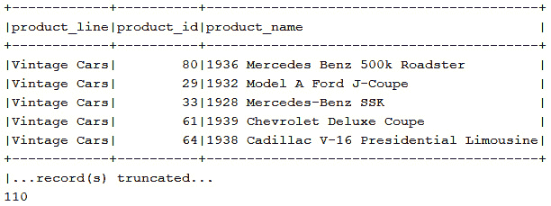
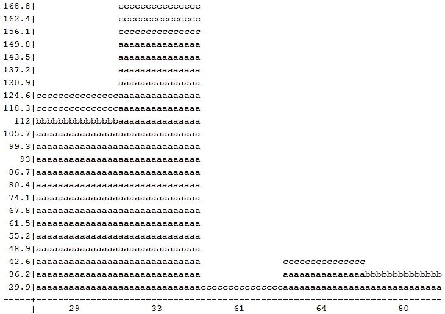
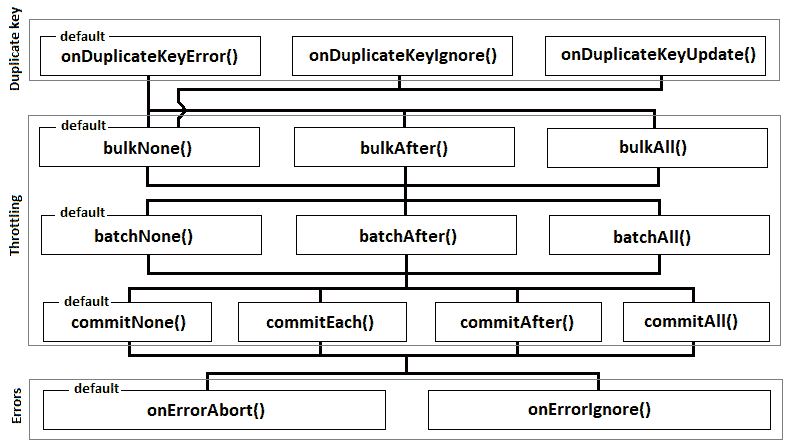

# *第十章*：导出、分批、批量加载数据

处理大量数据需要具备在导出、分批、批量加载数据方面的专业技能（知识和技术以及编程技能）。这些领域中的每一个都需要大量的代码和大量时间来实现和测试。幸运的是，jOOQ 提供了涵盖所有这些操作的全面 API，并以流畅的风格公开它们，同时隐藏了实现细节。在这种情况下，我们的议程包括以下内容：

+   以文本、JSON、XML、CSV、图表和`INSERT`语句导出数据

+   分批`INSERT`、`UPDATE`、`DELETE`、`MERGE`和`Record`

+   批量查询

+   加载 JSON、CSV、数组以及`Record`

让我们开始吧！

# 技术要求

本章的代码可以在 GitHub 上找到：[`github.com/PacktPublishing/jOOQ-Masterclass/tree/master/Chapter10`](https://github.com/PacktPublishing/jOOQ-Masterclass/tree/master/Chapter10)。

# 导出数据

通过`org.jooq.Formattable` API 可以导出（或格式化）数据。jOOQ 公开了一系列`format()`和`formatFoo()`方法，可用于将`Result`和`Cursor`（记住来自*第八章*，*获取和映射*中的`fetchLazy()`）格式化为文本、JSON、XML、CSV、XML、图表和`INSERT`语句。正如您在文档中所见，所有这些方法都有不同的变体，可以将数据导出到字符串或文件中，通过 Java 的`OutputStream`或`Writer` API。

## 以文本格式导出

我相信您已经在控制台输出中看到了类似以下内容：



图 10.1 – 表格文本数据

这种文本表格表示可以通过`format()`方法实现。此方法的一种变体接受一个整数参数，表示要包含在格式化结果中的最大记录数（默认情况下，jOOQ 仅记录通过 jOOQ 文本导出格式化的结果的前五条记录，但我们可以轻松地格式化和记录所有`fetch`记录，如`result.format(result.size())`）。但是，如果您需要调整此输出，那么 jOOQ 有一个名为`TXTFormat`的专用不可变类，在文档中提供了许多直观的选项。使用此类并结合通过`format`(Writer writer, TXTFormat format)`将结果文本导出到名为`result.txt`的文件中，可以像以下示例所示进行：

```java
try (BufferedWriter bw = Files.newBufferedWriter(
```

```java
  Paths.get("result.txt"), StandardCharsets.UTF_8,
```

```java
  StandardOpenOption.CREATE_NEW, StandardOpenOption.WRITE)) {
```

```java
 ctx.select(PRODUCTLINE.PRODUCT_LINE, PRODUCT.PRODUCT_ID,  
```

```java
            PRODUCT.PRODUCT_NAME)
```

```java
    .from(PRODUCTLINE)
```

```java
    .join(PRODUCT).onKey()
```

```java
    .fetch()
```

```java
    .format(bw, new TXTFormat().maxRows(25).minColWidth(20)); 
```

```java
} catch (IOException ex) { // handle exception }
```

您可以在捆绑的代码中看到此示例，`Format`（适用于 MySQL 和 PostgreSQL），在其它示例旁边。

## 导出 JSON

通过`formatJSON()`及其重载可以将`Result`/`Cursor`导出为 JSON。如果没有参数，`formatJSON()`生成包含两个主要数组的 JSON：一个名为`"fields"`的数组，表示标题（如您稍后所见，这可以用于将 JSON 导入数据库），以及一个名为`"records"`的数组，它包装了获取的数据。以下是一个这样的输出：

```java
{
```

```java
 "fields": [
```

```java
  {"schema": "public", "table": "productline", "name": 
```

```java
   "product_line", "type": "VARCHAR"},
```

```java
  {"schema": "public", "table": "product", "name": 
```

```java
   "product_id", "type": "BIGINT"},
```

```java
  {"schema": "public", "table": "product", "name": 
```

```java
   "product_name", "type": "VARCHAR"}
```

```java
 ],
```

```java
 "records": [
```

```java
  ["Vintage Cars", 80, "1936 Mercedes Benz 500k Roadster"],
```

```java
  ["Vintage Cars", 29, "1932 Model A Ford J-Coupe"],
```

```java
  ...  
```

```java
 ]
```

```java
}
```

因此，可以通过不带参数的 `formatJSON()` 方法或通过 `formatJSON(JSONFormat.DEFAULT_FOR_RESULTS)` 获取此 JSON。如果我们只想渲染 `"records"` 数组并避免渲染由 `"fields"` 数组表示的标题，则可以依赖 `formatJSON(JSONFormat.DEFAULT_FOR_RECORDS)`。这会产生如下所示的内容（您稍后会发现，这也可以导入回数据库）：

```java
[
```

```java
  ["Vintage Cars", 80, "1936 Mercedes Benz 500k Roadster"],
```

```java
  ["Vintage Cars", 29, "1932 Model A Ford J-Coupe"],
```

```java
  ...
```

```java
]
```

`DEFAULT_FOR_RESULTS` 和 `DEFAULT_FOR_RECORDS` 是不可变的 `org.jooq.JSONFormat` 的两个静态，用于微调 JSON 的导入/导出。当这些静态不足以满足需求时，我们可以实例化 `JSONFormat` 并流畅地添加一系列直观的选项，例如本示例中的选项（请参阅 jOOQ 文档中的所有可用选项）：

```java
JSONFormat jsonFormat = new JSONFormat()
```

```java
   .indent(4)      // defaults to 2
```

```java
   .header(false)  // default to true
```

```java
   .newline("\r")  // "\n" is default
```

```java
   .recordFormat(
```

```java
      JSONFormat.RecordFormat.OBJECT); // defaults to ARRAY    
```

此外，让我们在将 JSON 导出到文件时使用 `formatJSON(Writer writer, JSONFormat format)` 的上下文中使用 `jsonFormat`：

```java
try ( BufferedWriter bw = Files.newBufferedWriter(
```

```java
  Paths.get("resultObject.json"), StandardCharsets.UTF_8,
```

```java
  StandardOpenOption.CREATE_NEW, StandardOpenOption.WRITE)) {
```

```java
  ctx.select(PRODUCTLINE.PRODUCT_LINE, PRODUCT.PRODUCT_ID, 
```

```java
             PRODUCT.PRODUCT_NAME)
```

```java
     .from(PRODUCTLINE)
```

```java
     .join(PRODUCT).onKey()                    
```

```java
     .fetch()
```

```java
     .formatJSON(bw, jsonFormat);
```

```java
} catch (IOException ex) { // handle exception }
```

生成的 JSON 看起来如下（也可以导入到数据库中）：

```java
[
```

```java
  {
```

```java
    "product_line": "Vintage Cars",
```

```java
    "product_id": 80,
```

```java
    "product_name": "1936 Mercedes Benz 500k Roadster"
```

```java
  },  
```

```java
…
```

```java
]
```

如果我们获取单个 `Record`（因此，不是 `Result`/`Cursor`，例如通过 `fetchAny()`），那么 `formatJSON()` 将返回一个只包含数据的数组，如下是获取 `Record3<String, Long, String>` 的示例：

```java
["Classic Cars",2,"1952 Alpine Renault 1300"]
```

但是，如果我们明确指出 `JSONFormat.RecordFormat.OBJECT`，则它变为以下内容：

```java
{"product_line":"Classic Cars","product_id":2,
```

```java
 "product_name":"1952 Alpine Renault 1300"}
```

您可以在捆绑的代码中的 *Format* 示例中查看此示例（适用于 MySQL 和 PostgreSQL），包括格式化 UDT、数组类型和可嵌入类型作为 JSON 的其他示例。

## 导出 XML

将 `Result`/`Cursor` 作为 XML 导出可以通过 `formatXML()` 和其重载方法完成。不带参数时，`formatXML()` 生成包含两个主要元素的 XML：一个名为 `<fields/>` 的元素，表示标题，以及一个名为 `<records/>` 的元素，它包装了获取的数据。以下是一个输出示例：

```java
<result xmlns="http:...">
```

```java
<fields>
```

```java
  <field schema="public" table="productline" 
```

```java
           name="product_line" type="VARCHAR"/>
```

```java
  <field schema="public" table="product" 
```

```java
           name="product_id" type="BIGINT"/>
```

```java
  <field schema="public" table="product" 
```

```java
           name="product_name" type="VARCHAR"/>
```

```java
</fields>
```

```java
<records>
```

```java
  <record xmlns="http:...">
```

```java
    <value field="product_line">Vintage Cars</value>
```

```java
    <value field="product_id">80</value>
```

```java
    <value field="product_name">1936 Mercedes Benz ...</value>
```

```java
  </record>
```

```java
  ...
```

```java
</records>
```

```java
</result>
```

生成此输出的 jOOQ 代码如下：

```java
ctx.select(PRODUCTLINE.PRODUCT_LINE, 
```

```java
           PRODUCT.PRODUCT_ID, PRODUCT.PRODUCT_NAME)
```

```java
   .from(PRODUCTLINE)
```

```java
   .join(PRODUCT).onKey()
```

```java
   .fetch()
```

```java
   .formatXML();
```

因此，可以通过不带参数的 `formatXML()` 方法或通过 `formatXML(XMLFormat.DEFAULT_FOR_RESULTS)` 获取此 XML。如果我们只想保留 `<records/>` 元素并避免渲染 `<fields/>` 元素，则使用 `formatJXML(XMLFormat.DEFAULT_FOR_RECORDS)`。这是一个输出示例：

```java
<result>
```

```java
 <record>
```

```java
  <value field="product_line">Vintage Cars</value>
```

```java
  <value field="product_id">80</value>
```

```java
  <value field="product_name">1936 Mercedes Benz ...</value>
```

```java
 </record>
```

```java
...
```

```java
</result>
```

`DEFAULT_FOR_RESULTS` 和 `DEFAULT_FOR_RECORDS` 是不可变的 `org.jooq.XMLFormat` 的两个静态，用于微调 XML 的导入/导出。除了这些之外，我们还可以实例化 `XMLFormat` 并流畅地添加一系列直观的选项。例如，前面的 XML 片段是基于默认记录格式 `XMLFormat.RecordFormat.VALUE_ELEMENTS_WITH_FIELD_ATTRIBUTE` 生成的，请注意 `<value/>` 元素和 `field` 属性。但是，使用 `XMLFormat`，我们可以选择两种其他选项：`VALUE_ELEMENTS` 和 `COLUMN_NAME_ELEMENTS`。前者使用 `<value/>` 元素格式化记录，如下所示：

```java
<record xmlns="http:...">
```

```java
  <value>Vintage Cars</value>
```

```java
  <value>29</value>
```

```java
  <value>1932 Model A Ford J-Coupe</value>
```

```java
</record>
```

`COLUMN_NAME_ELEMENTS` 使用列名作为元素。让我们使用此设置与 `header(false)` 一起格式化 `MANAGER.MANAGER_EVALUATION` UDT（在 PostgreSQL 模式中可用）：

```java
ctx.select(MANAGER.MANAGER_ID, MANAGER.MANAGER_EVALUATION)
```

```java
   .from(MANAGER)
```

```java
   .fetch()
```

```java
   .formatXML(new XMLFormat()
```

```java
    .header(false)
```

```java
    .recordFormat(XMLFormat.RecordFormat.COLUMN_NAME_ELEMENTS))
```

生成的 XML 如下：

```java
<record xmlns="http...">
```

```java
 <manager_id>1</manager_id>
```

```java
 <manager_evaluation>
```

```java
  <record xmlns="http...">
```

```java
    <communication_ability>67</communication_ability>
```

```java
    <ethics>34</ethics>
```

```java
    <performance>33</performance>
```

```java
    <employee_input>66</employee_input>
```

```java
  </record>
```

```java
 </manager_evaluation>
```

```java
</record>
```

如果我们获取单个`Record`（因此，没有通过`fetchAny()`等获取`Result`/`Cursor`），那么`formatXML()`将返回只包含数据的 XML，如下面这个获取`Record3<String, Long, String>`的示例：

```java
<record>
```

```java
  <value field="product_line">Classic Cars</value>
```

```java
  <value field="product_id">2</value>
```

```java
  <value field="product_name">1952 Alpine Renault 1300</value>
```

```java
</record>
```

当然，您可以通过`XMLFormat`来更改此默认输出。例如，让我们考虑我们有一个这样的记录：

```java
<Record3<String, Long, String> oneResult = …;
```

然后，让我们应用`RecordFormat.COLUMN_NAME_ELEMENTS`：

```java
String xml = oneResult.formatXML(new XMLFormat().recordFormat(
```

```java
             XMLFormat.RecordFormat.COLUMN_NAME_ELEMENTS));
```

生成的 XML 如下：

```java
<record xmlns="http://...">
```

```java
  <product_line>Classic Cars</product_line>
```

```java
  <product_id>2</product_id>
```

```java
  <product_name>1952 Alpine Renault 1300</product_name>
```

```java
</record>
```

在捆绑的代码中，`Format`（适用于 MySQL 和 PostgreSQL）的其他示例中，考虑此示例（包括将 XML 导出到文件）。

## 导出 HTML

将`Result`/`Cursor`导出为 HTML 可以通过`formatHTML()`及其重载来实现。默认情况下，jOOQ 尝试将获取的数据包装在一个简单的 HTML 表中，因此，在生成的 HTML 中，您可能会看到`<table/>`，`<th/>`和`<td/>`等标签。例如，格式化`MANAGER.MANAGER_EVALUATION` UDT（在 PostgreSQL 模式中可用）可以如下进行：

```java
ctx.select(MANAGER.MANAGER_NAME, MANAGER.MANAGER_EVALUATION)
```

```java
   .from(MANAGER)
```

```java
   .fetch()
```

```java
   .formatHTML();
```

生成的 HTML 如下：

```java
<table>
```

```java
 <thead>
```

```java
  <tr>
```

```java
   <th>manager_name</th>
```

```java
   <th>manager_evaluation</th>
```

```java
  </tr>
```

```java
 </thead>
```

```java
 <tbody>
```

```java
  <tr>
```

```java
   <td>Joana Nimar</td>
```

```java
   <td>(67, 34, 33, 66)</td>
```

```java
  </tr>
```

```java
  ...
```

注意到`MANAGER_EVALUATION`的值（*67, 34, 33, 66*）被包裹在一个`<td/>`标签中。但也许您想要得到如下这样的结果：

```java
<h1>Joana Nimar</h1>
```

```java
<table>
```

```java
 <thead>
```

```java
  <tr>
```

```java
   <th>communication_ability</th>
```

```java
   <th>ethics</th>
```

```java
   <th>performance</th>
```

```java
   <th>employee_input</th>
```

```java
  </tr>
```

```java
 </thead>
```

```java
 <tbody>
```

```java
  <tr>
```

```java
   <td>67</td>
```

```java
   <td>34</td>
```

```java
   <td>33</td>
```

```java
   <td>66</td>
```

```java
  </tr>
```

```java
 </tbody>
```

```java
</table>
```

我们可以通过以下方式装饰我们的查询来获取此 HTML：

```java
ctx.select(MANAGER.MANAGER_NAME, MANAGER.MANAGER_EVALUATION)
```

```java
   .from(MANAGER)
```

```java
   .fetch()
```

```java
   .stream()
```

```java
   .map(e -> "<h1>".concat(e.value1().concat("</h1>"))
```

```java
                   .concat(e.value2().formatHTML()))
```

```java
   .collect(joining("<br />"))
```

在捆绑的代码中查看更多示例，*格式*（适用于 MySQL 和 PostgreSQL）。

## 导出 CSV

将`Result`/`Cursor`导出为 CSV 可以通过`formatCSV()`及其重载来实现。默认情况下，jOOQ 将 CSV 文件渲染成如下所示：

```java
city,country,dep_id,dep_name
```

```java
Bucharest,"","",""
```

```java
Campina,Romania,3,Accounting
```

```java
Campina,Romania,14,IT
```

```java
…
```

在便捷的重载方法中，我们有`formatCSV`(布尔头部，字符分隔符，字符串 nullString)。通过此方法，我们可以指定是否渲染 CSV 头部（默认为`true`），记录的分隔符（默认为一个*逗号*），以及表示`NULL`值的字符串（默认为`""`）。紧邻此方法，我们还有一系列这些参数的组合，例如`formatCSV(char delimiter, String nullString)`，`formatCSV(char delimiter)`，和`formatCSV(boolean header, char delimiter)`。以下是一个示例，它渲染了头部（默认）并使用`TAB`作为分隔符，以及`"N/A"`来表示`NULL`值：

```java
ctx.select(OFFICE.CITY, OFFICE.COUNTRY,   
```

```java
           DEPARTMENT.DEPARTMENT_ID.as("dep_id"),  
```

```java
           DEPARTMENT.NAME.as("dep_name"))
```

```java
   .from(OFFICE).leftJoin(DEPARTMENT).onKey().fetch()
```

```java
   .formatCSV('\t', "N/A");
```

生成的 CSV 看起来如下：

```java
City       country    dep_id     dep_name
```

```java
Bucharest  N/A        N/A        N/A
```

```java
Campina    Romania    3          Accounting
```

```java
…
```

```java
Hamburg    Germany    N/A        N/A
```

```java
London     UK         N/A        N/A
```

```java
NYC        USA        4          Finance
```

```java
...
```

```java
Paris      France     2          Sales
```

当我们需要更多选项时，我们可以依赖不可变的`CSVFormat`。以下是一个使用`CSVFormat`并导出结果的文件示例：

```java
try (BufferedWriter bw = Files.newBufferedWriter(
```

```java
  Paths.get("result.csv"), StandardCharsets.UTF_8,
```

```java
  StandardOpenOption.CREATE_NEW, StandardOpenOption.WRITE)) {
```

```java
  ctx.select(OFFICE.CITY, OFFICE.COUNTRY,
```

```java
             DEPARTMENT.DEPARTMENT_ID, DEPARTMENT.NAME)
```

```java
    .from(OFFICE).leftJoin(DEPARTMENT).onKey()
```

```java
    .fetch()
```

```java
     .formatCSV(bw, new CSVFormat()
```

```java
        .delimiter("|").nullString("{null}"));
```

```java
} catch (IOException ex) { // handle exception }
```

完整的代码在其他示例旁边可用，在捆绑的代码中，*格式*（适用于 MySQL 和 PostgreSQL）。

## 导出图表

将`Result`/`Cursor`导出为图表可能会导致如图所示的观察结果：



图 10.2 – jOOQ 图表示例

这是一个包含三个图表的区域图表：*a*，*b*和*c*。图表`a`表示`PRODUCT.BUY_PRICE`，图表*b*表示`PRODUCT.MSRP`，图表*c*表示`avg(ORDERDETAIL.PRICE_EACH)`。虽然此图表可以在控制台上显示，但它可以像下面这样导出到文件：

```java
try (BufferedWriter bw = Files.newBufferedWriter(
```

```java
 Paths.get("result2Chart.txt"), StandardCharsets.UTF_8,
```

```java
 StandardOpenOption.CREATE_NEW, StandardOpenOption.WRITE)) {
```

```java
 ctx.select(PRODUCT.PRODUCT_ID, PRODUCT.BUY_PRICE, 
```

```java
            field("avg_price"), PRODUCT.MSRP)
```

```java
  .from(PRODUCT, lateral(select(
```

```java
        avg(ORDERDETAIL.PRICE_EACH).as("avg_price"))  
```

```java
       .from(ORDERDETAIL)
```

```java
       .where(PRODUCT.PRODUCT_ID.eq(ORDERDETAIL.PRODUCT_ID))))
```

```java
    .limit(5).fetch()
```

```java
    .formatChart(bw, cf);
```

```java
} catch (IOException ex) { // handle exception }
```

显然，图表是通过 `formatChart()` 方法获得的。更确切地说，在这个示例中，通过 `formatChart``(Writer writer, ChartFormat format)`。`ChartFormat` 类是不可变的，并包含一系列用于自定义图表的选项。虽然您可以在 jOOQ 文档中检查它们的所有内容，但以下是在本例中使用的 `cf`：

```java
DecimalFormat decimalFormat = new DecimalFormat("#.#");
```

```java
ChartFormat cf = new ChartFormat()
```

```java
 .showLegends(true, true)      // show legends  
```

```java
 .display(ChartFormat.Display.DEFAULT) // or,
```

```java
                               // HUNDRED_PERCENT_STACKED
```

```java
 .categoryAsText(true)         // category as text
```

```java
 .type(ChartFormat.Type.AREA)  // area chart type
```

```java
 .shades('a', 'b', 'c')        // shades of PRODUCT.BUY_PRICE, 
```

```java
                               // PRODUCT.MSRP, 
```

```java
                               // avg(ORDERDETAIL.PRICE_EACH)
```

```java
 .values(1, 2, 3)              // value source column numbers
```

```java
 .numericFormat(decimalFormat);// numeric format
```

在其他示例旁边的完整代码可在名为 *Format* 的应用程序捆绑的代码中找到（适用于 MySQL 和 PostgreSQL）。

## 导出 INSERT 语句

jOOQ 可以通过 `formatInsert()` 方法及其重载将 `Result`/`Cursor` 导出为 `INSERT` 语句。默认情况下，如果第一条记录是 `TableRecord`，则 `formatInsert()` 使用第一条记录的 `TableRecord.getTable()` 方法生成此表的 `INSERT` 语句；否则，它将生成 `UNKNOWN_TABLE` 的 `INSERT` 语句。在两种情况下，jOOQ 都调用 `Result.fields()` 方法来确定列名。

以下是一个示例，将生成的 `INSERT` 语句导出到磁盘上的文件。`INSERT` 语句生成到名为 `product_stats` 的数据库表中，该表通过 `formatInsert(Writer writer, Table<?> table, Field<?>… fields)` 指定：

```java
try (BufferedWriter bw = Files.newBufferedWriter(
```

```java
  Paths.get("resultInserts.txt"), StandardCharsets.UTF_8,
```

```java
  StandardOpenOption.CREATE_NEW, StandardOpenOption.WRITE)) {
```

```java
  ctx.select(PRODUCT.PRODUCT_ID, PRODUCT.BUY_PRICE, 
```

```java
             field("avg_price"), PRODUCT.MSRP)
```

```java
     .from(PRODUCT, lateral(select(
```

```java
       avg(ORDERDETAIL.PRICE_EACH).as("avg_price")) 
```

```java
       .from(ORDERDETAIL)
```

```java
       .where(PRODUCT.PRODUCT_ID.eq(ORDERDETAIL
```

```java
         .PRODUCT_ID))))
```

```java
     .limit(5)
```

```java
     .fetch()
```

```java
     .formatInsert(bw, table("product_stats"));
```

```java
} catch (IOException ex) { // handle exception }
```

生成的 `INSERT` 语句看起来如下所示：

```java
INSERT INTO product_stats VALUES (29, 108.06, 114.23, 127.13);
```

在其他示例旁边完整的代码，包括导出 UDT、JSON、数组和可嵌入类型的 `INSERT` 语句，可在捆绑的代码 `Format` 中找到（适用于 MySQL 和 PostgreSQL）。接下来，让我们谈谈批处理。

# 批处理

批处理可以是避免由大量单独的数据库/网络往返（表示插入、删除、更新、合并等）引起的性能惩罚的完美解决方案。例如，如果没有批处理，1000 个插入需要 1000 个单独的往返，而使用批处理大小为 30 的批处理将导致 34 个单独的往返。我们拥有的插入（语句）越多，批处理就越有用。

## 通过 DSLContext.batch() 批处理

`DSLContext` 类公开了一系列 `batch()` 方法，允许我们在批处理模式下执行一组查询。因此，我们有以下 `batch()` 方法：

```java
BatchBindStep batch(String sql)
```

```java
BatchBindStep batch(Query query)
```

```java
Batch batch(String... queries)
```

```java
Batch batch(Query... queries)
```

```java
Batch batch(Queries queries)
```

```java
Batch batch(Collection<? extends Query> queries)
```

```java
Batch batch(String sql, Object[]... bindings)
```

```java
Batch batch(Query query, Object[]... bindings)
```

在幕后，jOOQ 通过 JDBC 的 `addBatch()` 实现这些方法。每个查询通过 `addBatch()` 累积到批处理中，最后它调用 JDBC 的 `executeBatch()` 方法将批处理发送到数据库。

例如，假设我们需要将一组 `INSERT` 语句批处理到 `SALE` 表中。如果您有 Hibernate（JPA）背景，那么您知道这种批处理将不起作用，因为 `SALE` 表有一个自动增长的键，Hibernate 将自动禁用/阻止插入批处理。但是，jOOQ 没有这样的问题，因此可以通过 `batch(Query... queries)` 将一组插入批处理到具有自动增长键的表中，如下所示：

```java
int[] result = ctx.batch(
```

```java
  ctx.insertInto(SALE, SALE.FISCAL_YEAR, SALE.EMPLOYEE_NUMBER, 
```

```java
         SALE.SALE_, SALE.FISCAL_MONTH, SALE.REVENUE_GROWTH)
```

```java
     .values(2005, 1370L, 1282.64, 1, 0.0),
```

```java
  ctx.insertInto(SALE, SALE.FISCAL_YEAR, SALE.EMPLOYEE_NUMBER,
```

```java
           SALE.SALE_, SALE.FISCAL_MONTH, SALE.REVENUE_GROWTH)
```

```java
     .values(2004, 1370L, 3938.24, 1, 0.0),
```

```java
  ...
```

```java
 ).execute();
```

返回的数组包含每个`INSERT`语句影响的行数（在这种情况下，`[1, 1, 1, …]`）。虽然可以像您刚才看到的那样执行不带绑定值的多个查询，但 jOOQ 允许我们多次执行一个查询，并带有绑定值，如下所示：

```java
int[] result = ctx.batch(
```

```java
  ctx.insertInto(SALE, SALE.FISCAL_YEAR,SALE.EMPLOYEE_NUMBER,  
```

```java
        SALE.SALE_, SALE.FISCAL_MONTH, SALE.REVENUE_GROWTH)
```

```java
     .values((Integer) null, null, null, null, null))
```

```java
     .bind(2005, 1370L, 1282.64, 1, 0.0)
```

```java
     .bind(2004, 1370L, 3938.24, 1, 0.0)
```

```java
     ...
```

```java
 .execute();
```

注意，您将不得不为原始查询提供**虚拟**的绑定值，这通常通过`null`值来实现，如本例所示。jOOQ 生成一个单独的查询（`PreparedStatement`），其中包含占位符（`?`），并将循环绑定值以填充批次。每当您看到`int[]`包含负值（例如，`-2`）时，这意味着受影响的行数值无法由 JDBC 确定。

在大多数情况下，JDBC 预编译语句更好，因此，只要可能，jOOQ 就依赖于`PreparedStatement`（[www.jooq.org/doc/latest/manual/sql-execution/statement-type/](http://www.jooq.org/doc/latest/manual/sql-execution/statement-type/)）。但是，我们可以通过`setStatementType()`或`withStatementType()`轻松切换到静态语句（`java.sql.Statement`），如下例所示（您也可以通过`@Bean`全局应用此方法）：

```java
int[] result = ctx.configuration().derive(new  
```

```java
 Settings().withStatementType(StatementType.STATIC_STATEMENT))
```

```java
 .dsl().batch(
```

```java
    ctx.insertInto(SALE, SALE.FISCAL_YEAR,   
```

```java
          SALE.EMPLOYEE_NUMBER, SALE.SALE_, SALE.FISCAL_MONTH,  
```

```java
          SALE.REVENUE_GROWTH)
```

```java
       .values((Integer) null, null, null, null, null))
```

```java
       .bind(2005, 1370L, 1282.64, 1, 0.0)
```

```java
       .bind(2004, 1370L, 3938.24, 1, 0.0)
```

```java
   ...
```

```java
   .execute();
```

这次，绑定值将自动内联到静态批量查询中。这与本节第一例中的`batch(Query... queries)`使用相同。

显然，使用绑定值对于插入（更新、删除等）对象集合也是很有用的。例如，考虑以下`SimpleSale`（POJO）列表：

```java
List<SimpleSale> sales = List.of(
```

```java
   new SimpleSale(2005, 1370L, 1282.64, 1, 0.0),
```

```java
   new SimpleSale(2004, 1370L, 3938.24, 1, 0.0),
```

```java
   new SimpleSale(2004, 1370L, 4676.14, 1, 0.0));
```

首先，我们定义适当的`BatchBindStep`，包含一个`INSERT`（它也可以是`UPDATE`、`DELETE`等）：

```java
BatchBindStep batch = ctx.batch(ctx.insertInto(SALE, 
```

```java
      SALE.FISCAL_YEAR, SALE.EMPLOYEE_NUMBER, SALE.SALE_,    
```

```java
      SALE.FISCAL_MONTH, SALE.REVENUE_GROWTH)
```

```java
   .values((Integer) null, null, null, null, null));
```

第二步，绑定值并执行批次：

```java
sales.forEach(s -> batch.bind(s.getFiscalYear(), 
```

```java
    s.getEmployeeNumber(), s.getSale(), 
```

```java
    s.getFiscalMonth(),s.getRevenueGrowth()));
```

```java
batch.execute();
```

您可以在捆绑的代码中找到这些示例，`BatchInserts`旁边还有批量更新示例`BatchUpdates`和删除示例`BatchDeletes`。但是，我们也可以将这些类型的所有语句组合在一个单独的`batch()`方法中，如下所示：

```java
int[] result = ctx.batch(
```

```java
 ctx.insertInto(SALE, SALE.FISCAL_YEAR,SALE.EMPLOYEE_NUMBER, 
```

```java
      SALE.SALE_, SALE.FISCAL_MONTH, SALE.REVENUE_GROWTH)
```

```java
    .values(2005, 1370L, 1282.64, 1, 0.0),
```

```java
 ctx.insertInto(SALE, SALE.FISCAL_YEAR, SALE.EMPLOYEE_NUMBER,
```

```java
  SALE.SALE_, SALE.FISCAL_MONTH, SALE.REVENUE_GROWTH)
```

```java
   .values(2004, 1370L, 3938.24, 1, 0.0),                    
```

```java
 ...
```

```java
 ctx.update(EMPLOYEE).set(EMPLOYEE.SALARY,   
```

```java
   EMPLOYEE.SALARY.plus(1_000))
```

```java
    .where(EMPLOYEE.SALARY.between(100_000, 120_000)),
```

```java
 ctx.update(EMPLOYEE).set(EMPLOYEE.SALARY, 
```

```java
   EMPLOYEE.SALARY.plus(5_000))
```

```java
    .where(EMPLOYEE.SALARY.between(65_000, 80_000)),
```

```java
 ...
```

```java
 ctx.deleteFrom(BANK_TRANSACTION)
```

```java
    .where(BANK_TRANSACTION.TRANSACTION_ID.eq(1)),
```

```java
 ctx.deleteFrom(BANK_TRANSACTION)
```

```java
    .where(BANK_TRANSACTION.TRANSACTION_ID.eq(2)),
```

```java
 ...   
```

```java
 ).execute();
```

在使用`batch()`方法时，jOOQ 将始终保留您的语句顺序，并将所有这些语句作为一个单独的批次（往返）发送到数据库。此示例在名为*CombineBatchStatements*的应用程序中可用。

在批量准备过程中，语句被累积在内存中，因此您必须注意避免内存问题，如 OOMs。您可以通过在`for`循环中调用 jOOQ 批量来轻松模拟批量大小，该循环限制语句的数量为某个值。您可以在单个事务中执行所有批次（如果出现问题，则回滚所有批次）或在每个单独的事务中执行每个批次（如果出现问题，则仅回滚最后一个批次）。您可以在捆绑的代码中看到这些方法，例如`EmulateBatchSize`。

同步批量最终会以`execute()`调用结束，而异步批量最终会以`executeAsync()`调用结束。例如，考虑名为*AsyncBatch*的应用程序。接下来，让我们谈谈批量记录。

## 批量记录

批量处理记录是另一回事。jOOQ API 为批量处理记录依赖于每个语句类型的一组专用方法，如下所示：

+   `INSERT`: `batchInsert()` 遵循 `TableRecord.insert()` 语义

+   `UPDATE`: `batchUpdate()` 遵循 `UpdatableRecord.update()` 语义

+   `DELETE`: `batchDelete()` 遵循 `UpdatableRecord.delete()` 语义

+   `MERGE`: `batchMerge()` 遵循 `UpdatableRecord.merge()` 语义

+   `INSERT`/`UPDATE`: `batchStore()` 遵循 `UpdatableRecord.store()` 语义

接下来，我们将逐一介绍这些语句，但在那之前，让我们指出一个重要方面。默认情况下，所有这些方法都会为执行特定类型的查询并绑定值创建批量操作。jOOQ 只要记录生成相同的 SQL 并带有绑定变量，就会保留记录的顺序；否则，顺序会改变，将具有相同 SQL 并带有绑定变量的记录分组在一起。因此，在最佳情况下，当所有记录都生成相同的 SQL 并带有绑定变量时，将只有一个批量操作，而在最坏情况下，记录的数量将与批量操作的数量相等。简而言之，将要执行的批量操作数量等于生成的不同 SQL 语句的数量。

如果我们从默认的 `PreparedStatement` 切换到静态 `Statement` (`StatementType.STATIC_STATEMENT`)，那么记录值将被内联。这次，将只有一个批量操作，并且记录的顺序将完全保留。显然，当必须保留记录的顺序并且/或者批量非常大，重新排列记录可能耗时且导致大量批量操作时，这是首选的。

### 批量记录插入、更新和删除

让我们考虑以下 `Record` 集合：

```java
SaleRecord sr1 = new SaleRecord(…, 2005, 1223.23, 1370L, …);
```

```java
SaleRecord sr2 = new SaleRecord(…, 2004, 5483.33, 1166L, …);
```

```java
SaleRecord sr3 = new SaleRecord(…, 2005, 9022.21, 1370L, …);
```

批量插入这些记录可以这样做：

```java
int[] result = ctx.batchInsert(sr3, sr1, sr2).execute();
```

在这种情况下，这些记录在一个批量操作中插入，因为为 `sr1` 到 `sr3` 生成的 SQL 并带有绑定变量是相同的。此外，批量操作保留了记录的顺序（即 `sr3`, `sr1`, 和 `sr2`）。如果我们想更新这些记录，并分别删除这些记录，那么我们将 `batchInsert()` 替换为 `batchUpdate()`，并分别替换为 `batchDelete()`。您也可以将这些记录放在一个集合中，并将该集合传递给 `batchInsert()`，如下例所示：

```java
List<SaleRecord> sales = List.of(sr3, sr1, sr2);
```

```java
int[] result = ctx.batchInsert(sales).execute();
```

接下来，让我们考虑记录的混合：

```java
SaleRecord sr1 = new SaleRecord(…);
```

```java
SaleRecord sr2 = new SaleRecord(…);
```

```java
BankTransactionRecord bt1 = new BankTransactionRecord(…);
```

```java
SaleRecord sr3 = new SaleRecord(…);
```

```java
SaleRecord sr4 = new SaleRecord(…);
```

```java
BankTransactionRecord bt2 = new BankTransactionRecord(…);
```

调用 `batchInsert(bt1, sr1, sr2, bt2, sr4, sr3)` 将执行两个批量操作，一个用于 `SaleRecord`，另一个用于 `BankTransactionRecord`。jOOQ 会将 `SaleRecord` (`sr1`, `sr2`, `sr3`, 和 `sr4`) 分组在一个批量操作中，并将 `BankTransactionRecord` (`bt1` 和 `bt2`) 分组在另一个批量操作中，因此记录的顺序不会保留（或者部分保留），因为 (`bt1`, `sr1`, `sr2`, `bt2`, `sr4`, 和 `sr3`) 可能会变成 ((`bt1` 和 `bt2`), (`sr1`, `sr2`, `sr4`, 和 `sr3`)).

最后，让我们考虑这些记录：

```java
SaleRecord sr1 = new SaleRecord();
```

```java
sr1.setFiscalYear(2005);
```

```java
sr1.setSale(1223.23);
```

```java
sr1.setEmployeeNumber(1370L);
```

```java
sr1.setTre"d("UP");
```

```java
sr1.setFiscalMonth(1);
```

```java
sr1.setRevenueGrowth(0.0);
```

```java
SaleRecord sr2 = new SaleRecord();
```

```java
sr2.setFiscalYear(2005);
```

```java
sr2.setSale(9022.21);
```

```java
sr2.setFiscalMonth(1);
```

```java
sr2.setRevenueGrowth(0.0);
```

```java
SaleRecord sr3 = new SaleRecord();
```

```java
sr3.setFiscalYear(2003);
```

```java
sr3.setSale(8002.22);
```

```java
sr3.setEmployeeNumber(1504L);
```

```java
sr3.setFiscalMonth(1);
```

```java
sr3.setRevenueGrowth(0.0);
```

如果我们执行 `batchInsert(sr3, sr2, sr1)`，那么将有三个批处理操作，因为 `sr1`、`sr2` 和 `sr3` 产生了三个不同的 SQL，它们将具有不同的绑定变量。记录的顺序保持为 `sr3`、`sr2` 和 `sr1`。对于 `batchUpdate()` 和 `batchDelete()` 也适用相同的流程。

这些示例中的任何一个都可以通过简单地添加 `STATIC_STATEMENT` 设置来利用 JDBC 静态语句，如下所示：

```java
int[] result = ctx.configuration().derive(new Settings()
```

```java
  .withStatementType(StatementType.STATIC_STATEMENT))
```

```java
  .dsl().batchInsert/Update/…(…).execute();
```

你可以在 *BatchInserts*、*BatchUpdates* 和 *BatchDeletes* 中练习这些示例。

### 批处理合并

如您从 *批处理记录* 部分的要点列表中已经知道，`batchMerge()` 对于执行批处理 `MERGE` 语句非常有用。主要来说，`batchMerge()` 符合在 *第九章* 中提到的 `UpdatableRecord.merge()` 语义，*CRUD、事务和锁定*。

换句话说，`batchMerge()` 根据方言生成模拟的 `INSERT ... ON DUPLICATE KEY UPDATE` 语句；在 MySQL 中，通过 `INSERT ... ON DUPLICATE KEY UPDATE`，在 PostgreSQL 中，通过 `INSERT ... ON CONFLICT`，在 SQL Server 和 Oracle 中，通过 `MERGE INTO`。实际上，`batchMerge()` 生成的 `INSERT ... ON DUPLICATE KEY UPDATE` 语句与记录是否已经从数据库中检索出来或现在创建无关。生成的不同 SQL 语句的数量给出了批次的数量。因此，默认情况下（这意味着默认设置、默认更改标志和没有乐观锁定），jOOQ 生成的查询将委托给数据库根据主键的唯一性来决定是插入还是更新。让我们考虑以下记录：

```java
SaleRecord sr1 = new SaleRecord(1L, 2005, 1223.23, ...);
```

```java
SaleRecord sr2 = new SaleRecord(2L, 2004, 543.33, ...);
```

```java
SaleRecord sr3 = new SaleRecord(9999L, 2003, 8002.22, ...);
```

我们按照以下方式执行批处理合并：

```java
int[] result = ctx.batchMerge(sr1, sr2, sr3).execute();
```

例如，在 PostgreSQL 中，生成的 SQL 如下所示：

```java
INSERT INTO "public"."sale" ("sale_id", 
```

```java
                             "fiscal_year", ..., "trend")
```

```java
  VALUES (?, ?, ..., ?) ON CONFLICT ("sale_id") DO
```

```java
  UPDATE SET "sale_id" = ?, 
```

```java
             "fiscal_year" = ?, ..., "trend" = ?
```

```java
  WHERE "public"."sale"."sale_id" = ?
```

因为 `sr1`（主键为 *1*）和 `sr2`（主键为 *2*）已经存在于 `SALE` 表中，数据库将决定更新它们，而 `sr3`（主键为 *9999*）将被插入，因为它在数据库中不存在。由于所有 `SaleRecord` 生成的带有绑定变量的 SQL 是相同的，所以将只有一个批次。记录的顺序被保留。更多示例可以在 `BatchMerges` 中找到。

### 批处理存储

`batchStore()` 对于执行批处理中的 `INSERT` 或 `UPDATE` 语句非常有用。主要来说，`batchStore()` 符合上一章中提到的 `UpdatableRecord.store()`。因此，与 `batchMerge()` 不同，后者将选择更新或插入的决定委托给数据库，`batchStore()` 允许 jOOQ 通过分析主键值的当前状态来决定是否生成 INSERT 或 UPDATE。

例如，如果我们依赖默认设置（这意味着默认设置、默认更改标志和没有乐观锁定），以下两个记录将用于批处理存储执行：

```java
SaleRecord sr1 = new SaleRecord(9999L,
```

```java
                                2005, 1223.23, 1370L, ...);
```

```java
SaleRecord sr2 = ctx.selectFrom(SALE)
```

```java
   .where(SALE.SALE_ID.eq(1L)).fetchOne();
```

```java
sr2.setFiscalYear(2006);
```

```java
int[] result = ctx.batchStore(sr1, sr2).execute();
```

由于 `sr1` 是一个全新的 `SaleRecord`，它将导致 `INSERT`。另一方面，`sr2` 从数据库中获取并更新了，所以它将导致 `UPDATE`。显然，生成的 SQL 语句不相同，因此，将有两个批处理操作，并且顺序将保留为 `sr1` 和 `sr2`。

这里还有一个更新 `SaleRecord` 并添加更多内容的示例：

```java
Result<SaleRecord> sales = ctx.selectFrom(SALE).fetch();
```

```java
 // update all sales
```

```java
 sales.forEach(sale -> { sale.setTrend("UP"); });
```

```java
 // add more new sales
```

```java
 sales.add(new SaleRecord(...));
```

```java
 sales.add(new SaleRecord(...));
```

```java
 ...
```

```java
 int[] result = ctx.batchStore(sales)
```

```java
  .execute();
```

我们有两种批处理操作：一个包含所有更新所需更新获取的 `SaleRecord` 的批处理，以及一个包含所有插入所需插入新 `SaleRecord` 的批处理。

在捆绑的代码中，你可以找到更多无法在此列出因为它们很大的示例，所以请花时间练习 `BatchStores` 中的示例。这是本节最后一个主题。接下来，让我们谈谈 *批处理连接* API。

## 批处理连接

除了前面提到的批处理功能外，jOOQ 还提供了一个名为 `org.jooq.tools.jdbc.BatchedConnection` 的 API。其主要目的是缓冲现有的 jOOQ/JDBC 语句，并在不要求我们更改 SQL 字符串或执行顺序的情况下批量执行它们。我们可以显式或间接地通过 `DSLContext.batched`(`BatchedRunnable runnable`) 或 `DSLContext.batchedResult`(`BatchedCallable<T> callable`) 来使用 `BatchedConnection`。它们之间的区别在于前者返回 `void`，而后者返回 `T`。

例如，假设我们有一个（服务）方法，它会产生大量的 `INSERT` 和 `UPDATE` 语句：

```java
void insertsAndUpdates(Configuration c) {
```

```java
   DSLContext ctxLocal = c.dsl();
```

```java
   ctxLocal.insertInto(…).execute();
```

```java
   …
```

```java
   ctxLocal.update(…).execute();
```

```java
   …
```

```java
}
```

为了提高此方法的速度，我们只需通过 `DSLContext.batched()` 添加批收集代码，如下所示：

```java
public void batchedInsertsAndUpdates() {
```

```java
   ctx.batched(this::insertsAndUpdates);
```

```java
}
```

当然，如果 `INSERT` 语句由 `inserts(Configuration c)` 方法生成，而 `UPDATE` 语句由另一个方法 `updates(Configuration c)` 生成，那么两者都应该被收集：

```java
public void batchedInsertsAndUpdates() {
```

```java
   ctx.batched((Configuration c) -> {
```

```java
      inserts(c);
```

```java
      updates(c);
```

```java
   });
```

```java
}
```

此外，此 API 还可以用于批处理 jOOQ 记录。以下是一个示例：

```java
ctx.batched(c -> {
```

```java
  Result<SaleRecord> records = c.dsl().selectFrom(SALE)
```

```java
     .limit(5).fetch();
```

```java
  records.forEach(record -> {
```

```java
    record.setTrend("CONSTANT");
```

```java
    ...
```

```java
    record.store();
```

```java
  });
```

```java
});
```

或者，这里还有一个例子：

```java
List<SaleRecord> sales = List.of(
```

```java
  new SaleRecord(...), new SaleRecord(...), ...
```

```java
);
```

```java
ctx.batched(c -> {
```

```java
  for (SaleRecord sale : sales) {
```

```java
    c.dsl().insertInto(SALE)
```

```java
           .set(sale)
```

```java
           .onDuplicateKeyUpdate()
```

```java
           .set(SALE.SALE_, sale.getSale())
```

```java
           .execute();
```

```java
  }
```

```java
}); // batching is happening here
```

注意，jOOQ 将保留你的语句顺序，这个顺序可能会影响批处理操作的数量。仔细阅读以下说明，因为它在工作与此 API 时非常重要。

重要提示

jOOQ 每次检测到以下情况时，都会自动创建一个新的批处理：

- SQL 字符串发生变化（甚至空白也被视为变化）。

- 一个查询产生结果（例如，`SELECT`）；此类查询不是批处理的一部分。

- 一个静态语句出现在预处理语句之后（或反之亦然）。

- 调用了一个 JDBC 交互（事务提交，连接关闭等）。

批处理大小阈值已达到。

作为一项重要限制，请注意，受影响的行数值始终由 JDBC `PreparedStatement.executeUpdate()` 报告为 0。

注意，上一条说明中的最后一个项目指的是批处理大小阈值。嗯，这个 API 可以利用 `Settings.batchSize()`，它设置最大批处理语句大小如下：

```java
@Bean
```

```java
public Settings jooqSettings() {
```

```java
   return new Settings().withBatchSize(30);
```

```java
}
```

此外，如果我们显式地依赖于 `BatchedConnection`，那么我们可以包装 JDBC 连接，并通过 `BatchedConnection(Connection delegate, int batchSize)` 构造函数将批大小作为参数指定，如下所示（这里批大小设置为 2；请考虑阅读注释）：

```java
try ( BatchedConnection conn = new BatchedConnection(
```

```java
 DriverManager.getConnection(
```

```java
     "jdbc:mysql://localhost:3306/classicmodels", 
```

```java
     "root", "root"), 2)) {
```

```java
  try ( PreparedStatement stmt = conn.prepareStatement(
```

```java
    "insert into `classicmodels`.`sale` (`fiscal_year`, 
```

```java
    `employee_number`, `sale`, `fiscal_month`, 
```

```java
    `revenue_growth`) " + "values (?, ?, ?, ?, ?);")) {
```

```java
   // the next 2 statements will become the first batch    
```

```java
   stmt.setInt(1, 2004);
```

```java
   stmt.setLong(2, 1166L);
```

```java
   stmt.setDouble(3, 543.33);
```

```java
   stmt.setInt(4, 1);
```

```java
   stmt.setDouble(5, 0.0);
```

```java
   stmt.executeUpdate();
```

```java
   stmt.setInt(1, 2005);
```

```java
   stmt.setLong(2, 1370L);
```

```java
   stmt.setDouble(3, 9022.20);
```

```java
   stmt.setInt(4, 1);
```

```java
   stmt.setDouble(5, 0.0);
```

```java
   stmt.executeUpdate();
```

```java
   // reached batch limit so this is the second batch
```

```java
   stmt.setInt(1, 2003);
```

```java
   stmt.setLong(2, 1166L);
```

```java
   stmt.setDouble(3, 3213.0);
```

```java
   stmt.setInt(4, 1);
```

```java
   stmt.setDouble(5, 0.0);
```

```java
   stmt.executeUpdate();
```

```java
  }
```

```java
  // since the following SQL string is different, 
```

```java
  // next statements represents the third batch
```

```java
  try ( PreparedStatement stmt = conn.prepareStatement(
```

```java
   "insert into `classicmodels`.`sale` (`fiscal_year`, 
```

```java
    `employee_number`, `sale`, `fiscal_month`, 
```

```java
      `revenue_growth`,`trend`) " 
```

```java
      + "values (?, ?, ?, ?, ?, ?);")) {
```

```java
     stmt.setInt(1, 2004);
```

```java
     stmt.setLong(2, 1166L);
```

```java
     stmt.setDouble(3, 4541.35);
```

```java
     stmt.setInt(4, 1);
```

```java
     stmt.setDouble(5, 0.0);
```

```java
     stmt.setString(6, "UP");
```

```java
     stmt.executeUpdate();
```

```java
     stmt.setInt(1, 2005);
```

```java
     stmt.setLong(2, 1370L);
```

```java
     stmt.setDouble(3, 1282.64);
```

```java
     stmt.setInt(4, 1);
```

```java
     stmt.setDouble(5, 0.0);
```

```java
     stmt.setString(6, "DOWN");
```

```java
     stmt.executeUpdate();
```

```java
  }
```

```java
} catch (SQLException ex) { … } 
```

此外，`BatchedConnection` 实现了 `java.sql.Connection`，因此你可以使用 `Connection` 的所有方法，包括用于塑造事务行为的方法。更多示例可以在 `Batched` 中找到。

接下来，让我们解决在 PostgreSQL 和 SQL Server 中遇到的两个特殊情况。

### PostgreSQL/Oracle 中的批处理和获取序列

如你所知，PostgreSQL/Oracle 可以依赖序列来提供主键（和其他唯一值）。例如，我们的 PostgreSQL `employee` 表使用以下序列来生成 `employee_number` 的序列值：

```java
CREATE TABLE "employee" (
```

```java
  "employee_number" BIGINT NOT NULL,
```

```java
  ...
```

```java
  CONSTRAINT "employee_pk" PRIMARY KEY ("employee_number"),
```

```java
  ...
```

```java
);
```

```java
CREATE SEQUENCE "employee_seq" START 100000 INCREMENT 10   
```

```java
        MINVALUE 100000 MAXVALUE 10000000 
```

```java
        OWNED BY "employee"."employee_number";
```

但是，在批处理的情况下，从应用程序中获取 `employee` 主键需要为每个主键进行一次数据库往返（`SELECT`）。显然，有 *n* 个 `INSERT` 语句的批次并执行 *n* 次往返（`SELECT` 语句）只是为了获取它们的主键，这是一个性能损失。幸运的是，jOOQ 至少提供了两种解决方案。其中之一是在 SQL 语句中内联序列引用（`EMPLOYEE_SEQ.nextval()` 调用）：

```java
int[] result = ctx.batch(
```

```java
  ctx.insertInto(EMPLOYEE, EMPLOYEE.EMPLOYEE_NUMBER, 
```

```java
                 EMPLOYEE.LAST_NAME, ...)
```

```java
     .values(EMPLOYEE_SEQ.nextval(), val("Lionel"), ...),
```

```java
  ctx.insertInto(EMPLOYEE, EMPLOYEE.EMPLOYEE_NUMBER, 
```

```java
                 EMPLOYEE.LAST_NAME...)
```

```java
     .values(EMPLOYEE_SEQ.nextval(), val("Ion"), ...),
```

```java
  ...
```

```java
 ).execute();
```

另一种方法是预先通过 `SELECT` 查询获取多个 *n* 个主键：

```java
var ids = ctx.fetch(EMPLOYEE_SEQ.nextvals(n));
```

然后，使用这些主键进行批量操作（注意 `ids.get(n).value1()` 调用）：

```java
int[] result = ctx.batch(
```

```java
  ctx.insertInto(EMPLOYEE, EMPLOYEE.EMPLOYEE_NUMBER,  
```

```java
                 EMPLOYEE.LAST_NAME, ...)
```

```java
     .values(ids.get(0).value1(), "Lionel", ...),
```

```java
  ctx.insertInto(EMPLOYEE, EMPLOYEE.EMPLOYEE_NUMBER, 
```

```java
                 EMPLOYEE.LAST_NAME, ...)
```

```java
     .values(ids.get(1).value1(), "Ion", ...),
```

```java
  ...
```

```java
).execute();
```

这两个示例都依赖于 `public static final EMPLOYEE_SEQ` 字段，或者更确切地说，依赖于 `jooq.generated.Sequences.EMPLOYEE_SEQ`。主要来说，jOOQ 代码生成器将为每个数据库序列生成一个序列对象，并且每个这样的对象都可以访问 `nextval()`、`currval()`、`nextvals(int n)` 等方法，这些方法将在 *第十一章*，*jOOQ 键* 中介绍。

当然，如果你依赖于从 (`BIG`)`SERIAL` 自动生成的序列，或者依赖于作为默认值关联的序列（例如，在 `sale` 表中，我们有一个与 `sale_id` 关联的序列 `DEFAULT NEXTVAL ('sale_seq')`），那么批量操作最简单的方法就是在语句中省略主键字段，数据库将完成剩余的工作。之前的示例以及更多示例可以在 PostgreSQL 的 `BatchInserts` 中找到。

### SQL Server 的 IDENTITY 列和显式值

为 SQL Server 的 `IDENTITY` 列插入显式值会导致错误 *当 `IDENTITY_INSERT` 设置为 *`OFF`* 时，无法在表 'table_name' 中为标识列插入显式值*。绕过此错误可以通过在 `INSERT` 之前将 `IDENTITY_INSERT` 设置为 `ON` 来完成。在批处理的情况下，这可以像下面这样完成：

```java
int[] result = ctx.batch(
```

```java
  ctx.query("SET IDENTITY_INSERT [sale] ON"),
```

```java
  ctx.insertInto(SALE, SALE.SALE_ID, SALE.FISCAL_YEAR, …)
```

```java
     .values(1L, 2005, …),
```

```java
  ctx.insertInto(SALE, SALE.SALE_ID, SALE.FISCAL_YEAR, …)
```

```java
     .values(2L, 2004, …),
```

```java
   ...
```

```java
  ctx.query("SET IDENTITY_INSERT [sale] OFF")
```

```java
).execute();
```

你可以在 SQL Server 的 `BatchInserts` 中找到这个示例。接下来，让我们谈谈批量操作。

# 批量操作

在 jOOQ 中编写批量查询只是使用 jOOQ DSL API 的问题。例如，一个批量插入 SQL 看起来像这样：

```java
INSERT IGNORE INTO `classicmodels`.`order` (
```

```java
  `order_date`, `required_date`, `shipped_date`, 
```

```java
  `status`, `comments`, `customer_number`, `amount`) 
```

```java
VALUES (?, ?, ?, ?, ?, ?, ?), (?, ?, ?, ?, ?, ?, ?), 
```

```java
       (?, ?, ?, ?, ?, ?, ?)
```

这可以在 jOOQ 中通过链式调用`values()`方法表示：

```java
ctx.insertInto(ORDER)
```

```java
   .columns(ORDER.ORDER_DATE, ORDER.REQUIRED_DATE,
```

```java
            ORDER.SHIPPED_DATE, ORDER.STATUS, 
```

```java
            ORDER.COMMENTS,ORDER.CUSTOMER_NUMBER, 
```

```java
            ORDER.AMOUNT)
```

```java
    .values(LocalDate.of(2004,10,22), LocalDate.of(2004,10,23),
```

```java
     LocalDate.of(2004,10,23", "Shipped",
```

```java
     "New order inserted...", 363L, BigDecimal.valueOf(322.59))
```

```java
    .values(LocalDate.of(2003,12,2), LocalDate.of(2003,1,3),
```

```java
     LocalDate.of(2003,2,26), "Resolved",
```

```java
     "Important order ...", 128L, BigDecimal.valueOf(455.33))
```

```java
    ...
```

```java
    .onDuplicateKeyIgnore() // onDuplicateKeyUpdate().set(...)
```

```java
   .execute()
```

或者，你可以使用以下批量更新 SQL：

```java
update `classicmodels`.`sale` 
```

```java
set 
```

```java
  `classicmodels`.`sale`.`sale` = case when  
```

```java
  `classicmodels`.`sale`.`employee_number` = ? then (
```

```java
    `classicmodels`.`sale`.`sale` + ?
```

```java
  ) when `classicmodels`.`sale`.`employee_number` = ? then (
```

```java
    `classicmodels`.`sale`.`sale` + ?
```

```java
  ) when `classicmodels`.`sale`.`employee_number` = ? then (
```

```java
    `classicmodels`.`sale`.`sale` + ?
```

```java
  ) end 
```

```java
where 
```

```java
  `classicmodels`.`sale`.`employee_number` in (?, ?, ?)
```

这可以在 jOOQ 中表示如下：

```java
ctx.update(SALE).set(SALE.SALE_,
```

```java
case_()
```

```java
 .when(SALE.EMPLOYEE_NUMBER.eq(1370L), SALE.SALE_.plus(100))
```

```java
 .when(SALE.EMPLOYEE_NUMBER.eq(1504L), SALE.SALE_.plus(500))
```

```java
 .when(SALE.EMPLOYEE_NUMBER.eq(1166L), SALE.SALE_.plus(1000)))
```

```java
.where(SALE.EMPLOYEE_NUMBER.in(1370L, 1504L, 1166L))
```

```java
.execute();
```

更多示例可以在 MySQL 的`Bulk`中找到。接下来，让我们谈谈*Loader* API，它具有内置的批量支持。

# 加载（加载器 API）

每当我们需要将来自不同来源（CSV、JSON 等）的数据加载（导入）到我们的数据库表中时，我们可以依赖 jOOQ 加载器 API（`org.jooq.Loader`）。这是一个流畅的 API，它允许我们轻松应对最重要的挑战，例如处理重复键、批量处理、分批处理、提交和错误处理。

## 加载器 API 语法

通常，我们有一个包含要导入数据的文件，这些数据以 CSV 或 JSON 等常见格式存储，我们自定义加载器 API 的一般语法以适应我们的需求：

```java
ctx.loadInto(TARGET_TABLE)
```

```java
   .[options]
```

```java
   .[source and source to target mapping]
```

```java
   .[listeners]
```

```java
   .[execution and error handling]
```

虽然`TARGET_TABLE`显然是应该导入数据的那张表，但让我们看看我们有哪些选项。

### 选项

我们可以主要区分三种用于自定义导入过程的选项类型：处理重复键的选项、限制选项和处理失败（错误）的选项。以下图表突出了每个选项类别以及可以用于流畅链式调用这些选项的有效路径：



图 10.3 – 加载器 API 选项

让我们探索这些类别中的每一个，从处理重复键的类别开始。

#### 重复键选项

当表中存在唯一键并且我们尝试导入具有相同键的记录时，会发生重复键。通过唯一键，jOOQ 指的是任何唯一键，而不仅仅是主键。

因此，处理重复键可以通过`onDuplicateKeyError()`来完成，这是默认行为，或者通过`onDuplicateKeyIgnore()`或`onDuplicateKeyUpdate()`。默认行为是在存在任何重复键时抛出异常。

通过显式使用`onDuplicateKeyIgnore()`，我们指示 jOOQ 跳过任何重复键而不会抛出异常（这是合成的`ON DUPLICATE KEY IGNORE`子句，jOOQ 可以根据方言进行模拟）。我们可以通过`onDuplicateKeyUpdate()`指示 jOOQ 执行`UPDATE`而不是`INSERT`（这是合成的`ON DUPLICATE KEY UPDATE`子句，jOOQ 可以根据方言进行模拟）。

#### 限制选项

有三种限制选项可以用来微调导入过程。这些选项涉及批量处理、分批处理和提交。jOOQ 允许我们显式使用这些选项的任何组合，或者依赖以下默认设置：无批量处理、分批处理和提交。

批量可以通过 `bulkNone()`（这是默认设置，表示不使用批量）设置，`bulkAfter(int rows)`（允许我们通过多行 `INSERT`（例如，`insert into ... (...) values (?, ?, ?,...), (?, ?, ?,...), (?, ?, ?,...), ...`）指定每个批量将插入多少行），以及 `bulkAll()`（尝试从整个数据源创建一个批量）。

如 *图 10.3* 所示，`bulkNone()` 是唯一一个可以在处理重复值的所有选项之后链式调用的。`bulkAfter()` 和 `bulkAll()` 方法只能在 `onDuplicateKeyError()` 之后链式调用。此外，`bulkNone()`、`bulkAfter()` 和 `bulkAll()` 是互斥的。

可以通过默认的 `batchNone()` 避免批处理，或者可以通过 `batchAfter(int bulk)` 或 `batchAll()` 明确设置。通过 `batchAfter(int bulk)` 明确指定应作为单个 JDBC 批处理语句发送到服务器的批量语句数量。另一方面，可以通过 `batchAll()` 发送包含所有批量的单个批量。如果没有使用批量（`bulkNone()`），那么每行就像是一个批量，因此，例如，`batchAfter(3)` 表示创建每批包含三行的批次。

如 *图 10.3* 所示，`batchNone()`、`batchAfter()` 和 `batchAll()` 是互斥的。

最后，将数据提交到数据库可以通过四种专用方法进行控制。默认情况下，`commitNone()` 将提交和回滚操作留给客户端代码（例如，通过 `commitNone()`，我们可以允许 Spring Boot 处理提交和回滚）。但是，如果我们想在一定数量的批次之后提交，那么我们必须使用 `commitAfter(int batches)` 或便捷的 `commitEach()` 方法，它等同于 `commitAfter(1)`。而且，如果我们决定一次性提交所有批次，那么我们需要 `commitAll()`。如果没有使用批处理（依赖于 `batchNone()`），那么每个批次就像是一个批量，例如，`commitAfter(3)` 表示每三个批量后提交。如果没有使用批量（依赖于 `bulkNone()`），那么每个批量就像是一行，例如，`commitAfter(3)` 表示每三行后提交。

如 *图 10.3* 所示，`commitNone()`、`commitAfter()`、`commitEach()` 和 `commitAll()` 是互斥的。

#### 错误选项

尝试操作（导入）大量数据是一个很容易出错的流程。其中一些错误是致命的，应该停止导入过程，而其他错误可以安全地忽略或推迟到导入后解决。在致命错误的情况下，Loader API 依赖于名为 `onErrorAbort()` 的方法。如果发生错误，则 Loader API 停止导入过程。另一方面，我们有 `onErrorIgnore()`，它指示 Loader API 跳过任何导致错误的插入操作，并尝试执行下一个操作。

#### 特殊情况

虽然找到这些选项的最佳组合是一个基准测试的问题，但以下是一些你应该知道的事情：

+   如果我们的表中没有唯一键，那么 `onDuplicateKeyUpdate()` 的行为与 `onDuplicateKeyIgnore()` 完全相同。

+   如果使用 `bulkAll()` + `commitEach()` 或 `bulkAll()` + `commitAfter()`，那么 jOOQ 强制使用 `commitAll()`。

+   如果使用 `batchAll()` + `commitEach()` 或 `batchAll()` + `commitAfter()`，那么 jOOQ 强制使用 `commitAll()`。

接下来，让我们快速概述一下支持的数据源。

### 导入数据源

通过特定于支持的不同数据类型的专用方法提供数据源可以完成。例如，如果数据源是 CSV 文件，那么我们依赖于 `loadCSV()` 方法；如果是 JSON 文件，那么我们依赖于 `loadJSON()` 方法；如果是 XML 文件，那么我们依赖于 `loadXML()` 方法。此外，我们可以通过 `loadArrays()` 导入数组，通过 `loadRecords()` 导入 jOOQ `Record`。

`loadCSV()`、`loadJSON()` 和 `loadXML()` 方法有 10+ 种风味，允许我们从 `String`、`File`、`InputStream` 和 `Reader` 加载数据。另一方面，`loadArrays()` 和 `loadRecords()` 允许我们从数组、`Iterable`、`Iterator` 或 `Stream` 加载数据。

### 监听器

Loader API 附带导入监听器，可以串联起来以跟踪导入进度。我们主要有 `onRowStart(LoaderRowListener listener)` 和 `onRowEnd(LoaderRowListener listener)`。前者指定在处理当前行之前调用的监听器，而后者指定在处理当前行之后调用的监听器。`LoaderRowListener` 是一个函数式接口。

### 执行和错误处理

Loader API 执行后，我们可以通过返回的 `org.jooq.Loader` 获取有意义的反馈。例如，我们可以通过 `executed()` 方法找到已执行的批处理/批次的数量，通过 `processed()` 方法找到已处理的行数，通过 `stored()` 方法找到存储的行数（`INSERT`/`UPDATE`），通过 `ignored()` 方法找到被忽略的行数（由错误或重复键引起），以及通过 `errors()` 方法作为 `List<LoaderError>` 的潜在错误。正如你将在下一节的示例中看到的那样，`LoaderError` 包含有关错误（如果有）的详细信息。

## 使用 Loader API 的示例

在所有这些理论之后，现在是时候看看加载 CSV、JSON、`Record` 和数组的示例了。所有这些示例都是在 Spring Boot `@Transactional` 的上下文中执行和剖析的。请随意在 jOOQ 事务性上下文中练习它们，只需简单地删除 `@Transactional` 并将代码包装如下：

```java
ctx.transaction(configuration -> {
```

```java
   // Loader API code
```

```java
   configuration.dsl()…
```

```java
});
```

因此，让我们先加载一些 CSV 文件。

### 加载 CSV

加载 CSV 通过 `loadCSV()` 方法完成。让我们从一个基于以下典型 CSV 文件（`in.csv`）的简单示例开始：

```java
sale_id,fiscal_year,sale,employee_number,…,trend
```

```java
1,2003,5282.64,1370,0,…,UP
```

```java
2,2004,1938.24,1370,0,…,UP
```

```java
3,2004,1676.14,1370,0,…,DOWN
```

```java
…
```

显然，这些数据应该导入到`sale`表中，所以应该传递给`loadInto()`的`TARGET_TABLE`（`Table<R>`）是`SALE`。通过`loadCSV()`方法指向此文件，如下所示：

```java
ctx.loadInto(SALE)
```

```java
   .loadCSV(Paths.get("data", "csv", "in.csv").toFile(), 
```

```java
            StandardCharsets.UTF_8)
```

```java
   .fieldsCorresponding()
```

```java
   .execute();
```

此代码依赖于默认选项。注意对`fieldsCorresponding()`方法的调用。此方法向 jOOQ 发出信号，表示所有在`SALE`（具有相同名称）中对应输入字段的字段都应该被加载。实际上，在这种情况下，CSV 文件中的所有字段都在`SALE`表中有一个对应项，因此所有这些字段都将被导入。

但，显然，情况并不总是如此。也许我们只想加载散列字段的一个子集。在这种情况下，只需为不应加载的字段索引（位置）传递*虚拟*空值（这是一个基于索引/位置的字段映射）。这次，让我们通过`processed()`收集处理行的数量：

```java
int processed = ctx.loadInto(SALE)
```

```java
 .loadCSV(Paths.get("data", "csv", "in.csv").toFile(), 
```

```java
         StandardCharsets.UTF_8)
```

```java
 .fields(null, SALE.FISCAL_YEAR, SALE.SALE_, 
```

```java
         null, null, null, null, SALE.FISCAL_MONTH, 
```

```java
         SALE.REVENUE_GROWTH,SALE.TREND)
```

```java
 .execute()
```

```java
 .processed();
```

此代码仅从 CSV 加载`SALE.FISCAL_YEAR`、`SALE.SALE_`、`SALE.FISCAL_MONTH`、`SALE.REVENUE_GROWTH`和`SALE.TREND`。注意，我们使用了`fields()`方法而不是`fieldsCorresponding()`，因为`fields()`允许我们只保留所需的字段并跳过其余部分。一个 MySQL 方言的`INSERT`（结果）示例如下：

```java
INSERT INTO `classicmodels`.`sale` (`fiscal_year`, `sale`, 
```

```java
               `fiscal_month`, `revenue_growth`, `trend`) 
```

```java
VALUES (2005, 5243.1, 1, 0.0, 'DOWN')
```

虽然此 CSV 文件是一个典型的文件（第一行是标题，数据由逗号分隔等），但有时我们必须处理相当定制的 CSV 文件，如下所示：

```java
1|2003|5282.64|1370|0|{null}|{null}|1|0.0|*UP*
```

```java
2|2004|1938.24|1370|0|{null}|{null}|1|0.0|*UP*
```

```java
3|2004|1676.14|1370|0|{null}|{null}|1|0.0|*DOWN*
```

```java
…
```

此 CSV 文件包含与上一个相同的数据，只是没有标题行，数据分隔符是`|`，引号标记是`*`，而`null`值表示为`{null}`。将此 CSV 文件加载到`SALE`中需要以下代码：

```java
List<LoaderError> errors = ctx.loadInto(SALE)
```

```java
 .loadCSV(Paths.get("data", "csv", "in.csv").toFile(), 
```

```java
       StandardCharsets.UTF_8)
```

```java
 .fields(SALE.SALE_ID, SALE.FISCAL_YEAR, SALE.SALE_, 
```

```java
         SALE.EMPLOYEE_NUMBER, SALE.HOT, SALE.RATE, SALE.VAT, 
```

```java
         SALE.FISCAL_MONTH, SALE.REVENUE_GROWTH, SALE.TREND)
```

```java
 .ignoreRows(0) 
```

```java
 .separator('|').nullString("{null}").quote('*') 
```

```java
 .execute()
```

```java
 .errors();
```

首先，由于没有标题，我们依赖于`fields()`来显式指定字段列表（`SALE_ID`在 CSV 中映射到索引`1`，`FISCAL_YEAR`映射到索引`2`等）。接下来，我们调用`ignoreRows(0)`；默认情况下，jOOQ 会跳过第一行，这被认为是 CSV 文件的标题行，但由于在这种情况下没有标题，我们必须指示 jOOQ 将第一行视为包含数据的一行。显然，此方法也适用于跳过*n*行。更进一步，我们调用`separator()`、`nullString()`和`quote()`来覆盖默认值。最后，我们调用`errors()`并收集`List<LoaderError>`中的潜在错误。这是一个可选步骤，与这个特定示例无关。在捆绑的代码（*LoadCSV* for MySQL）中，你可以看到如何遍历此列表并提取有关加载过程中发生的事情的宝贵信息。此外，你还将看到更多加载 CSV 文件的示例。接下来，让我们探索更多加载 JSON 文件的示例。

### 加载 JSON

通过`loadJSON()`方法进行 JSON 加载。让我们从一个 JSON 文件开始：

```java
{
```

```java
  "fields": [
```

```java
    {
```

```java
      "schema": "classicmodels",
```

```java
      "table": "sale",
```

```java
      "name": "sale_id",
```

```java
      "type": "BIGINT"
```

```java
    },
```

```java
    ...
```

```java
  ],
```

```java
  "records": [
```

```java
    [1, 2003, 5282.64, 1370, 0, null, null, 1, 0.0, "UP"],
```

```java
    [2, 2004, 1938.24, 1370, 0, null, null, 1, 0.0, "UP"],
```

```java
    ...
```

```java
  ]
```

```java
}
```

这个 JSON 文件之前是通过`formatJSON()`导出的。注意`"fields"`标题，这对于通过`fieldsCorresponding()`方法将此文件加载到`SALE`表中非常有用。如果没有标题，`fieldsCorresponding()`方法无法产生预期的结果，因为输入字段缺失。但是，如果我们依赖于`fields()`方法，那么我们可以列出所需的字段（所有或其中一部分）并依赖于基于索引的映射，无需担心`"fields"`标题的存在或缺失。此外，这次，让我们添加一个`onRowEnd()`监听器：

```java
ctx.loadInto(SALE)
```

```java
   .loadJSON(Paths.get("data", "json", "in.json").toFile(), 
```

```java
       StandardCharsets.UTF_8)
```

```java
   .fields(null, SALE.FISCAL_YEAR, SALE.SALE_, null, null, 
```

```java
        null, null, SALE.FISCAL_MONTH, SALE.REVENUE_GROWTH,
```

```java
        SALE.TREND)
```

```java
   .onRowEnd(ll -> {
```

```java
     System.out.println("Processed row: " 
```

```java
        + Arrays.toString(ll.row()));
```

```java
     System.out.format("Executed: %d, ignored: %d, processed: 
```

```java
        %d, stored: %d\n", ll.executed(), ll.ignored(), 
```

```java
        ll.processed(), ll.stored());
```

```java
     })
```

```java
   .execute();
```

每处理完一行，你将在日志中看到一个输出，如下所示：

```java
Processed row: [28, 2005, 5243.1, 1504, …, DOWN]
```

```java
Executed: 28, ignored: 0, processed: 28, stored: 28
```

但是，让我们看看一个没有`"fields"`标题的 JSON 文件，如下所示：

```java
[
```

```java
    {
```

```java
      "fiscal_month": 1,
```

```java
      "revenue_growth": 0.0,
```

```java
      "hot": 0,
```

```java
      "vat": null,
```

```java
      "rate": null,
```

```java
      "sale": 5282.64013671875,
```

```java
      "trend": "UP",
```

```java
      "sale_id": 1,
```

```java
      "fiscal_year": 2003,
```

```java
      "employee_number": 1370
```

```java
    },
```

```java
    {
```

```java
     …
```

```java
    },
```

```java
…
```

这种类型的 JSON 可以通过`fieldsCorresponding()`或通过`fields()`加载。由于字段名称作为 JSON 键可用，`fieldsCorresponding()`方法可以正确映射它们。使用`fields()`时，应记住这个 JSON 中键的顺序。因此，`"fiscal_month"`位于索引`1`，`"revenue_growth"`位于索引`2`，依此类推。以下是一个只加载`"fiscal_month"`，`"revenue_growth"`，`"sale"`，`"fiscal_year"`和`"employee_number"`的示例：

```java
int processed = ctx.loadInto(SALE)
```

```java
  .loadJSON(Paths.get("data", "json", "in.json").toFile(), 
```

```java
        StandardCharsets.UTF_8)
```

```java
  .fields(SALE.FISCAL_MONTH, SALE.REVENUE_GROWTH, 
```

```java
          null, null, null, SALE.SALE_, null, null, 
```

```java
          SALE.FISCAL_YEAR, SALE.EMPLOYEE_NUMBER)
```

```java
  .execute()
```

```java
  .processed();
```

但是，有时缺失的数据就在 JSON 本身中，如下所示：

```java
[
```

```java
    {
```

```java
      "sale_id": 1,
```

```java
      "fiscal_year": 2003,
```

```java
      "sale": 5282.64 
```

```java
      "fiscal_month": 1,
```

```java
      "revenue_growth": 0.0
```

```java
    },
```

```java
…
```

这里是另一个示例：

```java
[
```

```java
  [
```

```java
    1,
```

```java
    2003,
```

```java
    5282.64,
```

```java
    1,
```

```java
    0.0
```

```java
  ],
```

```java
…
```

这次，在两种情况下，我们都必须依赖于`fields()`，如下所示：

```java
ctx.loadInto(SALE)
```

```java
   .loadJSON(Paths.get("data", "json", "in.json").toFile(), 
```

```java
      StandardCharsets.UTF_8)
```

```java
   .fields(SALE.SALE_ID, SALE.FISCAL_YEAR, SALE.SALE_, 
```

```java
     SALE.FISCAL_MONTH, SALE.REVENUE_GROWTH)      
```

```java
   .execute();
```

接下来，假设我们有一个 JSON 文件，应该以每批`2`（行）的大小导入到数据库中，因此我们需要`batchAfter(2)`。提交（如所有之前的示例）将通过 Spring Boot 的`@Transactional`来完成：

```java
@Transactional
```

```java
public void loadJSON () {
```

```java
 int executed = ctx.loadInto(SALE)
```

```java
  .batchAfter(2)// each *batch* has 2 rows
```

```java
  .commitNone() // this is default, so it can be omitted
```

```java
  .loadJSON(Paths.get("data", "json", "in.json").toFile(), 
```

```java
     StandardCharsets.UTF_8)
```

```java
  .fieldsCorresponding()
```

```java
  .execute()
```

```java
  .executed();
```

```java
}
```

由于`commitNone()`是默认行为，它可以省略。本质上，`commitNone()`允许`@Transactional`处理提交/回滚操作。默认情况下，`@Transactional`在注解方法结束时提交事务。如果出现问题，整个有效负载（所有批次）将回滚。但是，如果你移除`@Transactional`，则`auto-commit` `=true`生效。这将在每个批次（每两行）之后提交。如果出现问题，则没有回滚操作，但由于我们依赖于默认设置`onDuplicateKeyError()`和`onErrorAbort()`，加载过程将立即中止。如果我们移除`@Transactional`并将`auto-commit`设置为`false`（`spring.datasource.hikari.auto-commit=false`），则不会提交任何内容。

这个示例通过`executed()`返回已执行的批次数。例如，如果有 36 行通过`batchAfter(2)`处理，那么`executed()`返回 18。

接下来，让我们考虑一个包含重复键的 JSON 文件。每次发现重复键时，Loader API 应跳过它，并在最后报告忽略的行数。此外，Loader API 应在每批三行后提交：

```java
int ignored = ctx.loadInto(SALE)
```

```java
 .onDuplicateKeyIgnore()
```

```java
 .batchAfter(3) // each *batch* has 3 rows
```

```java
 .commitEach()  // commit each batch
```

```java
 .loadJSON(Paths.get("data", "json", "in.json").toFile(), 
```

```java
     StandardCharsets.UTF_8)
```

```java
 .fieldsCorresponding()
```

```java
 .execute()
```

```java
 .ignored();
```

如果你想执行`UPDATE`而不是忽略重复键，只需将`onDuplicateKeyIgnore()`替换为`onDuplicateKeyUpdate()`。

最后，让我们使用 `bulkAfter(2)`、`batchAfter(3)` 和 `commitAfter(3)` 导入 JSON。换句话说，每个批量有两行，每个批次有三个批量。因此，在三个批次之后，九个批量提交，即在 18 行之后，您将得到以下内容：

```java
int inserted = ctx.loadInto(SALE)
```

```java
 .bulkAfter(2)   // each *bulk* has 2 rows
```

```java
 .batchAfter(3)  // each *batch* has 3 *bulks*, so 6 rows
```

```java
 .commitAfter(3) // commit after 3 *batches*, so after 9 
```

```java
                 // *bulks*, so after 18 rows
```

```java
 .loadJSON(Paths.get("data", "json", "in.json").toFile(),  
```

```java
      StandardCharsets.UTF_8)
```

```java
 .fieldsCorresponding()
```

```java
 .execute()
```

```java
 .stored();
```

如果出现问题，最后未提交的批次将被回滚，而不会影响已提交的批次。更多示例可以在捆绑的代码 `LoadJSON` 中找到，适用于 MySQL。

### 加载记录

通过 Loader API 加载 jOOQ `Record` 是一个简单的过程，通过 `loadRecords()` 方法实现。让我们考虑以下记录集：

```java
Result<SaleRecord> result1 = …;
```

```java
Result<Record3<Integer, Double, String>> result2 = …;
```

```java
Record3<Integer, Double, String>[] result3 = …;
```

```java
SaleRecord r1 = new SaleRecord(1L, …);
```

```java
SaleRecord r2 = new SaleRecord(2L, …);
```

```java
SaleRecord r3 = new SaleRecord(3L, …);
```

加载它们可以这样做：

```java
ctx.loadInto(SALE)
```

```java
   .loadRecords(result1)
```

```java
   .fields(null, SALE.FISCAL_YEAR, SALE.SALE_,    
```

```java
           SALE.EMPLOYEE_NUMBER, SALE.HOT, SALE.RATE, SALE.VAT, 
```

```java
           SALE.FISCAL_MONTH, SALE.REVENUE_GROWTH, SALE.TREND)
```

```java
   .execute();
```

```java
ctx.loadInto(SALE).loadRecords(result2/result3) 
```

```java
   .fieldsCorresponding()                    
```

```java
   .execute();
```

```java
ctx.loadInto(SALE).loadRecords(r1, r2, r3) 
```

```java
   .fieldsCorresponding()                    
```

```java
   .execute();
```

让我们看看如何加载以下 `Record` 映射：

```java
Map<CustomerRecord, CustomerdetailRecord> result = …;
```

因此，`CustomerRecord` 应该加载到 `CUSTOMER` 中，而 `CustomerdetailRecord` 应该加载到 `CUSTOMERDETAIL` 中。为此，我们可以使用 `Map.keySet()` 和 `Map.values()` 如下：

```java
ctx.loadInto(CUSTOMER)
```

```java
   .onDuplicateKeyIgnore()
```

```java
   .loadRecords(result.keySet())
```

```java
   .fieldsCorresponding()                    
```

```java
   .execute();
```

```java
ctx.loadInto(CUSTOMERDETAIL)  
```

```java
   .onDuplicateKeyIgnore()
```

```java
   .loadRecords(result.values())
```

```java
   .fieldsCorresponding()                    
```

```java
   .execute();
```

更多示例可以在捆绑的代码 `LoadRecords` 中找到，适用于 MySQL。

### 加载数组

加载数组是通过 `loadArrays()` 方法实现的。让我们考虑以下包含应加载到 `SALE` 表中的数据的数组：

```java
Object[][] result = ctx.selectFrom(…).fetchArrays();
```

加载这个数组可以这样做：

```java
ctx.loadInto(SALE)                    
```

```java
   .loadArrays(Arrays.stream(result)) // Arrays.asList(result)
```

```java
   .fields(null, SALE.FISCAL_YEAR, SALE.SALE_, 
```

```java
           SALE.EMPLOYEE_NUMBER, SALE.HOT, SALE.RATE, SALE.VAT, 
```

```java
           SALE.FISCAL_MONTH, SALE.REVENUE_GROWTH, SALE.TREND)
```

```java
   .execute();
```

这里是另一个依赖于 `loadArrays(Object[]... os)` 的例子：

```java
int executed = ctx.loadInto(SALE)
```

```java
   .onDuplicateKeyIgnore()
```

```java
   .batchAfter(2)
```

```java
   .commitEach()  
```

```java
   .loadArrays(
```

```java
     new Object[]{1, 2005, 582.64, 1370, 0,… , "UP"},
```

```java
     new Object[]{2, 2005, 138.24, 1370, 0,… , "DOWN"},
```

```java
     new Object[]{3, 2005, 176.14, 1370, 0,… , "DOWN"})
```

```java
   .fields(SALE.SALE_ID, SALE.FISCAL_YEAR, SALE.SALE_, 
```

```java
           SALE.EMPLOYEE_NUMBER, SALE.HOT, SALE.RATE, 
```

```java
           SALE.VAT, SALE.FISCAL_MONTH, SALE.REVENUE_GROWTH,  
```

```java
           SALE.TREND)
```

```java
   .execute()
```

```java
   .ignored();
```

您可以在捆绑的代码 `LoadArrays` 中查看这些示例，这些示例未在此列出，适用于 MySQL。现在是总结本章内容的时候了。

# 概述

在本章中，我们涵盖了四个重要主题：导出、分批、批量处理和加载。如您所见，jOOQ 提供了专门的 API 来完成这些任务，这些任务在底层需要大量复杂的代码。通常，jOOQ 简化了复杂性，并允许我们专注于我们必须做的事情，而不是如何去做。例如，看到将 CSV 或 JSON 文件加载到数据库中的代码片段只需几秒钟就完成，同时具有流畅和顺畅的错误处理控制、诊断输出、批量处理、分批和提交控制的支持，这真是太令人惊讶了。

在下一章中，我们将介绍 jOOQ 键。
