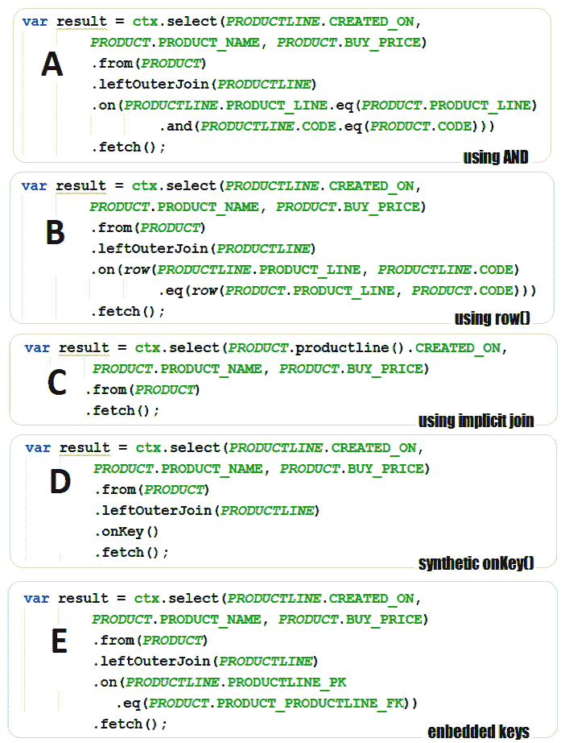

# *第十一章*：jOOQ 键

为我们的表选择合适的键类型对我们的查询有显著的好处。jOOQ 通过支持广泛范围的键来维持这一说法，从众所周知的唯一键和主键到复杂的内嵌键和合成/代理键。最常用的合成标识符（或代理标识符）是数字或 UUID。与自然键相比，代理标识符在现实世界中没有意义或对应物。代理标识符可以通过数值序列生成器（例如，一个身份或序列）或伪随机数生成器（例如，GUID 或 UUID）生成。此外，让我利用这个上下文来回忆一下，在集群环境中，大多数关系型数据库依赖于 *数值序列* 和每个节点的不同偏移量来避免冲突的风险。使用 *数值序列* 而不是 UUID，因为它们比 UUID 占用更少的内存（一个 UUID 需要 16 字节，而 `BIGINT` 需要 8 字节，`INTEGER` 需要 4 字节），并且索引的使用性能更优。此外，由于 UUID 不是顺序的，它们在集群索引级别引入了性能惩罚。更确切地说，我们将讨论一个被称为 *索引碎片化* 的问题，这是由于 UUID 是随机的。一些数据库（例如，MySQL 8.0）在缓解 UUID 性能惩罚方面有显著的改进（有三个新函数 – `UUID_TO_BIN`、`BIN_TO_UUID` 和 `IS_UUID`），而其他数据库仍然容易受到这些问题的影响。正如 Rick James 所强调的，“如果你不能避免使用 UUID（这将是我首先推荐的做法），那么...”建议阅读他的文章([`mysql.rjweb.org/doc.php/uuid`](http://mysql.rjweb.org/doc.php/uuid))，以深入了解主要问题和潜在解决方案。

现在，让我们回到我们的章节，它将涵盖以下主题：

+   获取数据库生成的主键

+   在可更新记录上抑制主键返回

+   更新可更新记录的主键

+   使用数据库序列

+   插入 SQL Server IDENTITY

+   获取 Oracle ROWID 伪列

+   比较复合主键

+   使用内嵌键工作

+   使用 jOOQ 合成对象

+   覆盖主键

让我们开始吧！

# 技术要求

本章的代码可以在 GitHub 上找到：[`github.com/PacktPublishing/jOOQ-Masterclass/tree/master/Chapter11`](https://github.com/PacktPublishing/jOOQ-Masterclass/tree/master/Chapter11)。

# 获取数据库生成的主键

一个典型的场景是在通过`insertInto()`方法或可更新记录的`insert()`方法执行`INSERT`操作后获取数据库生成的（标识）主键。如果你使用`insertInto()`（`DSL.insertInto()`或`DSLContext.insertInto()`），可以通过`returningResult()`/`returning()`方法获取数据库生成的主键。例如，`SALE`的标识主键在 MySQL 中通过`AUTO_INCREMENT`，在 SQL Server 中通过`IDENTITY`，由于历史原因（因为现在两者都支持标准 SQL `IDENTITY`列），在 PostgreSQL 和 Oracle 中通过数据库序列。在这些所有情况下，`SALE`生成的标识主键可以像这样获取（`SALE.SALE_ID`）：

```java
long insertedId = ctx.insertInto(SALE, SALE.FISCAL_YEAR, 
```

```java
    SALE.SALE_, SALE.EMPLOYEE_NUMBER, SALE.FISCAL_MONTH, 
```

```java
    SALE.REVENUE_GROWTH)
```

```java
 .values(2004, 2311.42, 1370L, 1, 0.0)
```

```java
 .returningResult(SALE.SALE_ID)
```

```java
 .fetchOneInto(long.class);
```

```java
 // .fetchOne(); to fetch Record1<Long>
```

或者，一种方便的方法依赖于`getIdentity()`方法，如下所示：

```java
.returningResult(SALE.getIdentity().getField())
```

然而，当你的表只有一个标识列时，这种方法是有用的；否则，最好明确列出应该返回的标识。但是，请别误解我——即使某些数据库（例如，PostgreSQL）支持多个标识，这仍然是一种相当不寻常的方法，我个人不喜欢使用，但我会在本章中介绍它。此外，查看这条推文以获取更多详细信息：[`twitter.com/lukaseder/status/1205046981833482240`](https://twitter.com/lukaseder/status/1205046981833482240)。

现在，`insertedId`变量持有数据库生成的标识主键作为`Record1<Long>`。可以通过`fetchOne().value1()`或直接通过`.fetchOneInto(long.class)`获取`long`值。对于批量插入（多记录插入）也是如此。这次，生成的标识主键存储在`Result<Record1<Long>>`或`List<Long>`中：

```java
List<Long> insertedIds = ctx.insertInto(SALE, 
```

```java
    SALE.FISCAL_YEAR,SALE.SALE_, SALE.EMPLOYEE_NUMBER, 
```

```java
    SALE.FISCAL_MONTH, SALE.REVENUE_GROWTH)
```

```java
 .values(2004, 2311.42, 1370L, 1, 0.0)
```

```java
 .values(2003, 900.21, 1504L, 1, 0.0)
```

```java
 .values(2005, 1232.2, 1166L, 1, 0.0)
```

```java
 .returningResult(SALE.getIdentity().getField())
```

```java
 // or, .returningResult(SALE.SALE_ID)
```

```java
 .collect(intoList());
```

```java
 // or, .fetchInto(Long.class);
```

对于不能提供标识的特殊情况，jOOQ 允许我们使用方便的`lastID()`方法：

```java
ctx.insertInto(SALE, SALE.FISCAL_YEAR, SALE.SALE_, 
```

```java
               SALE.EMPLOYEE_NUMBER, SALE.FISCAL_MONTH, 
```

```java
               SALE.REVENUE_GROWTH)
```

```java
   .values(2002, 5411.42, 1504L, 1, 0.0)
```

```java
   .execute();
```

```java
//meanwhile, a concurrent transaction can sneak a INSERT
```

```java
var lastId = ctx.lastID();
```

然而，`lastID()`方法至少有两个缺点值得我们关注。在一个并发事务环境中（例如，一个 Web 应用），没有保证返回的值属于之前的`INSERT`语句，因为并发事务可以在我们的`INSERT`和`lastID()`调用之间偷偷执行另一个`INSERT`。在这种情况下，返回的值属于并发事务执行的`INSERT`语句。此外，在批量插入的情况下，`lastID()`并不十分有用，因为它只返回最后一个生成的主键（但也许这正是你所需要的）。

如果你正在插入一个可更新的记录，jOOQ 将自动返回生成的标识主键并填充可更新记录的字段，如下所示：

```java
SaleRecord sr = ctx.newRecord(SALE);
```

```java
sr.setFiscalYear(2021);
```

```java
...
```

```java
sr.insert();
```

```java
// here you can call sr.getSaleId()
```

在插入后，调用`sr.getSaleId()`将返回数据库为该记录生成的主键。同样的事情可以通过 jOOQ 的 DAO 在插入 POJO 时完成：

```java
private final SaleRepository saleRepository; // injected DAO
```

```java
Sale s = new Sale(); // jooq.generated.tables.pojos.Sale
```

```java
s.setFiscalYear(2020);
```

```java
...
```

```java
saleRepository.insert(s);
```

```java
// here you can call s.getSaleId()
```

这次，jOOQ 将生成的标识主键设置在插入的 POJO 中。你可以在捆绑的*Keys*代码示例中找到这些示例。

# 在可更新记录上抑制主键返回

在前面的章节中，你看到 jOOQ 自动获取并设置可更新记录生成的主键。通过设置 `withReturnIdentityOnUpdatableRecord()` 标志来抑制此操作。在某些方言中，可以防止数据库往返（`lastID()` 风格），所以这主要是一个性能特性。默认情况下，此标志为 `true`，但如果我们显式将其设置为 `false`，那么 jOOQ 将不再尝试获取生成的主键：

```java
DSLContext derivedCtx = ctx.configuration().derive(
```

```java
 new Settings().withReturnIdentityOnUpdatableRecord(false))
```

```java
               .dsl();
```

```java
 SaleRecord sr = derivedCtx.newRecord(SALE);
```

```java
 sr.setFiscalYear(2021);
```

```java
 ...
```

```java
 sr.insert();
```

这次，调用 `sr.getSaleId()` 返回 `null`。

# 更新可更新记录的主键

作为一种良好的实践，主键无论如何都不应该被更新。但是，我又能怎样评判呢？！

默认情况下，在通过 jOOQ 加载的可更新记录中更改（到非空值）主键后调用 `store()` 方法会导致执行 `INSERT` 语句。然而，我们可以通过设置 `withUpdatablePrimaryKeys()` 标志来强制 jOOQ 生成并执行主键的 `UPDATE`：

```java
DSLContext derivedCtx = ctx.configuration().derive(
```

```java
  new Settings().withUpdatablePrimaryKeys(true)).dsl();
```

```java
 SaleRecord sr = derivedCtx.selectFrom(SALE)
```

```java
    .where(SALE.SALE_ID.eq(2L))
```

```java
    .fetchSingle();
```

```java
 sr.setSaleId(new_primary_key);
```

```java
 sr.store(); // UPDATE primary key
```

当然，我们也可以通过显式的 `UPDATE` 来更新主键，如果你真的必须这样做，那么就选择这种方法而不是 jOOQ 标志：

```java
ctx.update(SALE)
```

```java
   .set(SALE.SALE_ID, sr.getSaleId() + 1)
```

```java
   .where(SALE.SALE_ID.eq(sr.getSaleId()))
```

```java
   .execute();
```

你可以在捆绑的 *Keys* 代码中找到这些示例。

# 使用数据库序列

为了生成序列号，数据库如 PostgreSQL、SQL Server 和 Oracle 依赖于序列。数据库序列独立于表存在 – 它可以与主键和非主键列相关联，它可以自动生成（如 PostgreSQL 的 (`BIG`)`SERIAL`），它可以在多个表中使用，它可以有独立的权限，它可以有循环，它可以在自己的事务中增加值以保证使用它的跨事务的唯一性，我们可以通过设置最小值、最大值、增量值和当前值来显式地更改其值，等等。

例如，让我们考虑以下序列（`employee_seq`），它在我们的 PostgreSQL 架构中定义，用于 `employee.employee_number` 主键：

```java
CREATE SEQUENCE "employee_seq" START 100000 INCREMENT 10 
```

```java
       MINVALUE 100000 MAXVALUE 10000000 
```

```java
       OWNED BY "employee"."employee_number";
```

```java
CREATE TABLE "employee" (
```

```java
  "employee_number" BIGINT NOT NULL,
```

```java
  ...
```

```java
);
```

`employee_seq` 序列在插入时不会自动生成序列值，因此应用程序必须显式地操作它。另一方面，`sale_seq` 序列在插入时会自动生成序列值，其代码块如下（当省略 `INSERT` 语句中的 `SALE_ID` 列或使用 `DEFAULT` 或 `DEFAULT VALUES` 时，你会得到一个自动值；当用户显式地将 `SALE_ID` 设置为 `NULL` 时，将会出现约束违反错误）：

```java
CREATE SEQUENCE "sale_seq" START 1000000; 
```

```java
CREATE TABLE "sale" (
```

```java
  "sale_id" BIGINT NOT NULL DEFAULT NEXTVAL ('"sale_seq"'),  
```

```java
  ...
```

```java
);
```

对于每个这样的序列，jOOQ 代码生成器在 `Sequences` 中生成一个 `org.jooq.Sequence` 实例（花点时间检查 `jooq.generated.Sequences` 类）。对于 `employee_seq`，我们得到以下内容：

```java
public static final Sequence<Long> EMPLOYEE_SEQ = 
```

```java
  Internal.createSequence("employee_seq", Public.PUBLIC, 
```

```java
   SQLDataType.BIGINT.nullable(false), 100000, 10, 100000, 
```

```java
    10000000, false, null);
```

jOOQ API 提供了几个用于获取序列信息的方法。其中，我们有以下建议方法（你可以在 jOOQ 文档中找到更多信息）：

```java
String name = EMPLOYEE_SEQ.getName();
```

```java
Field<Long> start = EMPLOYEE_SEQ.getStartWith();
```

```java
Field<Long> min = EMPLOYEE_SEQ.getMinvalue();
```

```java
Field<Long> max = EMPLOYEE_SEQ.getMaxvalue();
```

```java
Field<Long> inc = EMPLOYEE_SEQ.getIncrementBy();
```

除了这些方法之外，我们还有三个在日常生活中非常有用的方法——`currval()`、`nextval()`和`nextvals()`。第一个方法（`currval()`）试图返回序列中的*当前*值。这可以在一个`SELECT`语句中获取：

```java
long cr = ctx.fetchValue(EMPLOYEE_SEQ.currval());
```

```java
long cr = ctx.select(EMPLOYEE_SEQ.currval())
```

```java
  .fetchSingle().value1();
```

```java
long cr = ctx.select(EMPLOYEE_SEQ.currval())
```

```java
  .fetchSingleInto(Long.class); // or, fetchOneInto()
```

第二个方法，`nextval()`，试图返回序列中的*下一个*值。它可以如下使用：

```java
long nv = ctx.fetchValue(EMPLOYEE_SEQ.nextval());
```

```java
long nv = ctx.select(EMPLOYEE_SEQ.nextval())
```

```java
  .fetchSingle().value1();
```

```java
long nv = ctx.select(EMPLOYEE_SEQ.nextval())
```

```java
  .fetchSingleInto(Long.class); // or, fetchOneInto()
```

以下是一个同时获取当前值和下一个值的`SELECT`语句：

```java
Record2<Long, Long> vals = ctx.fetchSingle(
```

```java
           EMPLOYEE_SEQ.nextval(), EMPLOYEE_SEQ.currval());
```

```java
Record2<Long, Long> vals = ctx.select(EMPLOYEE_SEQ.nextval(), 
```

```java
           EMPLOYEE_SEQ.currval()) .fetchSingle();
```

使用序列的一个潜在问题是，在会话中通过选择`nextval()`对其进行初始化之前，从序列中选择`currval()`。通常，当你处于这种场景时，你会得到一个明确的错误，指出在这个会话中`currval()`尚未定义（例如，在 Oracle 中，这是 ORA-08002）。通过执行`INSERT`或调用`nextval()`（例如，在之前的`SELECT`中），你也会初始化`currval()`。

如果序列可以自动生成值，那么插入新记录的最佳方式是简单地省略主键字段。由于`sale_seq`可以自动生成值，一个`INSERT`可以像这样：

```java
ctx.insertInto(SALE, SALE.FISCAL_YEAR, SALE.SALE_, 
```

```java
               SALE.EMPLOYEE_NUMBER, SALE.FISCAL_MONTH, 
```

```java
               SALE.REVENUE_GROWTH)
```

```java
   .values(2005, 1370L, 1282.641, 1, 0.0)
```

```java
   .execute();
```

数据库将使用`sale_seq`为`SALE_ID`字段（`SALE`的主键）分配一个值。这就像使用与主键关联的任何其他类型的标识符一样。

重要提示

只要你没有特定的情况需要从一个自动生成的序列（例如，从（大）`SERIAL`）或设置为默认值（例如，`NOT NULL DEFAULT NEXTVAL ("'sale_seq'")`）中获取特定的序列值，就没有必要显式调用`currval()`或`nextval()`方法。只需省略主键字段（或使用序列的任何字段）并让数据库生成它。

然而，如果序列不能自动生成值（例如，`employee_seq`），那么`INSERT`语句必须依赖于显式调用`nextval()`方法：

```java
ctx.insertInto(EMPLOYEE, EMPLOYEE.EMPLOYEE_NUMBER,    
```

```java
               EMPLOYEE.LAST_NAME, EMPLOYEE.FIRST_NAME, ...)
```

```java
   .values(EMPLOYEE_SEQ.nextval(),
```

```java
      val("Lionel"), val("Andre"), ...)
```

```java
   .execute();
```

注意你如何解释和使用`currval()`和`nextval()`方法。一旦你通过`nextval()`（例如，通过`SELECT`）获取到一个序列值，你就可以在后续的查询（`INSERT`）中安全地使用它，因为数据库不会将这个值给其他（并发）事务。所以，`nextval()`可以安全地被多个并发事务使用。另一方面，在`currval()`的情况下，你必须注意一些方面。查看以下代码：

```java
ctx.insertInto(SALE, SALE.FISCAL_YEAR, SALE.SALE_,  
```

```java
               SALE.EMPLOYEE_NUMBER, SALE.FISCAL_MONTH, 
```

```java
               SALE.REVENUE_GROWTH)
```

```java
   .values(2020, 900.25, 1611L, 1, 0.0)
```

```java
   .execute();
```

```java
// another transaction can INSERT and currval() is modified
```

```java
long cr = ctx.fetchValue(SALE_SEQ.currval());
```

因此，在之前的`INSERT`和获取当前值的`SELECT`操作之间，另一个事务可以执行`INSERT`，并且`currval()`会被修改/增加（一般来说，另一个事务执行的操作会更新当前值）。这意味着没有保证`cr`包含我们`INSERT`的`SALE_ID`值（`SALE_ID`和`cr`可能不同）。如果我们只需要获取我们`INSERT`的`SALE_ID`，那么最好的方法就是依赖于`returningResult(SALE.SALE_ID)`，正如你在*获取数据库生成的主键*部分所看到的。

显然，尝试在随后的 `UPDATE`、`DELETE` 等语句中使用获取的 `currval()` 落在相同的语句之下。例如，不能保证下面的 `UPDATE` 会更新我们之前的 `INSERT`：

```java
ctx.update(SALE)
```

```java
   .set(SALE.FISCAL_YEAR, 2005)
```

```java
   .where(SALE.SALE_ID.eq(cr))
```

```java
   .execute();
```

在并发事务环境中应避免的另一种方法是以下：

```java
ctx.deleteFrom(SALE)
```

```java
   .where(SALE.SALE_ID.eq(ctx.fetchValue(SALE_SEQ.currval())))
```

```java
   .execute();
```

即使这看起来像是一个单独的查询语句，它也不是。这体现在一个 `SELECT` 当前值之后的 `DELETE`。在这两个语句之间，并发事务仍然可以执行一个 `INSERT`，该 `INSERT` 会改变当前值（或者，一般而言，任何修改/推进序列并返回新值的操作）。此外，请注意这些类型的查询：

```java
ctx.deleteFrom(SALE)
```

```java
   .where(SALE.SALE_ID.eq(SALE_SEQ.currval()))
```

```java
   .execute();
```

这使得单个 `DELETE` 变得可行，如下所示（这是 PostgreSQL 语法）：

```java
DELETE FROM "public"."sale" WHERE 
```

```java
  "public"."sale"."sale_id" = currval('"public"."sale_seq"')
```

这次，你肯定是指最新的当前值，无论它是什么。例如，这可能导致删除最新的插入记录（不一定是我们插入的），或者它可能遇到尚未与任何记录关联的当前值。

此外，执行多行插入或批量插入可以利用内联的 `nextval()` 引用或通过 `nextvals()` 预取一定数量的值：

```java
List<Long> ids1 = ctx.fetchValues(EMPLOYEE_SEQ.nextvals(10));
```

```java
List<Long> ids2 = ctx.fetch(EMPLOYEE_SEQ
```

```java
   .nextvals(10)).into(Long.class);
```

```java
List<Record1<Long>> ids3 = ctx.fetch(
```

```java
   EMPLOYEE_SEQ.nextvals(10));
```

到目前为止，`ids1`、`ids2` 和 `ids3` 在内存中保存了 10 个可以用于后续查询的值。在我们耗尽这些值之前，没有必要去获取其他值。这样，我们减少了数据库往返的次数。以下是一个多行插入的示例：

```java
for (int i = 0; i < ids.size(); i++) {
```

```java
 ctx.insertInto(EMPLOYEE, EMPLOYEE.EMPLOYEE_NUMBER, 
```

```java
                EMPLOYEE.LAST_NAME...)
```

```java
   .values(ids1.get(i), "Lionel", ...)
```

```java
   .execute();
```

```java
}
```

预取的值可以用来预先设置 `Record` 的 ID：

```java
EmployeeRecord er = new EmployeeRecord(ids1.get(0),
```

```java
  // or, ids2.get(0).value1(), 
```

```java
  "Lionel", ...);  
```

你可以在捆绑的 *Keys* 代码中找到这些示例。

# 插入 SQL Server IDENTITY

在这本书中，我们不是第一次讨论插入 SQL Server `IDENTITY` 值，但让我们将这一节视为本章的必备内容。问题在于 SQL Server 不允许我们为 `PRODUCT` 主键的 `IDENTITY` 字段指定一个显式值：

```java
CREATE TABLE [product] (
```

```java
  [product_id] BIGINT NOT NULL IDENTITY,
```

```java
  ...
```

```java
);
```

换句话说，以下 `INSERT` 语句将导致以下错误 – *当 `IDENTITY_INSERT` 设置为 OFF 时，无法向表 'product' 的标识列插入显式值*：

```java
ctx.insertInto(PRODUCT, PRODUCT.PRODUCT_ID, 
```

```java
               PRODUCT.PRODUCT_LINE, PRODUCT.CODE, 
```

```java
               PRODUCT.PRODUCT_NAME)
```

```java
   .values(5555L, "Classic Cars", 599302L, "Super TX Audi")
```

```java
   .onDuplicateKeyIgnore();
```

因此，这个错误的解决方案包含在消息中。我们必须将 `IDENTITY_INSERT` 设置为 `ON`。然而，这应该在 SQL Server *当前会话上下文* 中完成。换句话说，我们必须在同一批中发出 `IDENTITY_INSERT` 的设置和实际的 `INSERT` 语句，如下所示：

```java
Query q1 = ctx.query("SET IDENTITY_INSERT [product] ON");
```

```java
Query q2 = ctx.insertInto(PRODUCT, PRODUCT.PRODUCT_ID, 
```

```java
    PRODUCT.PRODUCT_LINE, PRODUCT.CODE, PRODUCT.PRODUCT_NAME)
```

```java
  .values(5555L, "Classic Cars", 599302L, "Super TX Audi")
```

```java
  .onDuplicateKeyIgnore(); // this will lead to a MERGE
```

```java
Query q3 = ctx.query("SET IDENTITY_INSERT [product] OFF");
```

```java
ctx.batch(q1, q2, q3).execute();
```

这次，将值插入 `IDENTITY` 列没有问题。你可以在捆绑的 *Keys*（针对 SQL Server）代码中找到这些示例。

# 获取 Oracle ROWID 伪列

如果你是一个 Oracle 数据库的粉丝，那么不可能没有听说过 ROWID 伪列。然而，作为一个快速提醒，ROWID 伪列与 Oracle 中的每一行相关联，其主要目标是返回行的地址。ROWID 包含的信息可以用来定位特定的行。在 jOOQ 中，我们可以通过`rowid()`方法引用 ROWID。

例如，以下语句插入一个新的`SALE`并获取生成的主键和 ROWID：

```java
ctx.insertInto(SALE, SALE.FISCAL_YEAR, SALE.SALE_, 
```

```java
               SALE.EMPLOYEE_NUMBER, SALE.FISCAL_MONTH, 
```

```java
               SALE.REVENUE_GROWTH)
```

```java
   .values(2004, 2311.42, 1370L, 1, 0.0)
```

```java
   .returningResult(SALE.SALE_ID, rowid())
```

```java
   .fetchOne();  
```

`rowid()`方法返回一个`String`，表示 ROWID 的值（例如，*AAAVO3AABAAAZzBABE*）。我们可以使用 ROWID 进行后续查询，例如定位一条记录：

```java
String rowid = ...;
```

```java
var result = ctx.selectFrom(SALE)
```

```java
   .where(rowid().eq(rowid))
```

```java
   .fetch();
```

然而，正如 Lukas Eder 所分享的：*"ROWIDs 不保证保持稳定，因此客户端永远不应该长时间保留它们（例如，在事务之外）。但它们可以用来在没有主键的表中标识一行（例如，日志表）。"*

在捆绑的代码中，*Keys*（针对 Oracle），你还可以看到在`SELECT`、`UPDATE`和`DELETE`语句中使用`rowid()`的示例。

# 比较复合主键

根据定义，复合主键涉及两个或多个列，这些列应唯一标识一条记录。复合主键通常是自然键（即使它由代理键的引用组成），在关系表中通常比代理键更可取：[`blog.jooq.org/2019/03/26/the-cost-of-useless-surrogate-keys-in-relationship-tables/`](https://blog.jooq.org/2019/03/26/the-cost-of-useless-surrogate-keys-in-relationship-tables/)。这意味着基于复合键的谓词必须包含所有涉及的列。例如，`PRODUCTLINE`表有一个复合键为（`PRODUCT_LINE`，`CODE`），我们可以通过`and()`方法链式连接复合键的字段来编写一个用于获取特定记录的谓词，如下所示：

```java
var result = ctx.selectFrom(PRODUCTLINE)
```

```java
 .where(PRODUCTLINE.PRODUCT_LINE.eq("Classic Cars")
```

```java
   .and(PRODUCTLINE.CODE.eq(599302L)))
```

```java
 .fetchSingle();
```

或者，我们可以使用`row()`（`eq()`方法不需要显式`row()`构造函数，所以可以随意使用）来将字段与值分开：

```java
var result = ctx.selectFrom(PRODUCTLINE)
```

```java
  .where(row(PRODUCTLINE.PRODUCT_LINE, PRODUCTLINE.CODE)
```

```java
    .eq(row("Classic Cars", 599302L)))
```

```java
  .fetchSingle();
```

使用`row()`与`in()`、`notIn()`等一起使用也是很有用的：

```java
result = ctx.selectFrom(PRODUCTLINE)
```

```java
  .where(row(PRODUCTLINE.PRODUCT_LINE, PRODUCTLINE.CODE)    
```

```java
  .in(row("Classic Cars", 599302L),
```

```java
      row("Trains", 123333L),
```

```java
      row("Motorcycles", 599302L)))
```

实际上，在这些示例（在*Keys*中可用）中，你必须确保不要忘记复合键的任何列。对于包含两个以上字段和/或谓词涉及更多相关条件的复合键，这可能会变得很困难，并且难以从视觉上隔离复合键字段。

一个更好的方法是使用嵌入式键。

# 与嵌入式键一起工作

作为在*第七章*“类型、转换器和绑定”中引入的嵌入类型的一部分，我们有 jOOQ 嵌入键。嵌入键由 jOOQ 代码生成器实现为 jOOQ `org.jooq.EmbeddableRecord`接口的实现和一个方便的 POJO 类。嵌入键扩展了`org.jooq.EmbeddableRecord`接口的默认实现，即`org.jooq.impl.EmbeddableRecordImpl`。

我们可以为主键和唯一键定义嵌入键。实际上，我们向 jOOQ 指示哪些主键/唯一键应该成为嵌入键，然后 jOOQ 将为每个主键/唯一键以及每个引用这些主键/唯一键的外键生成相应的工件。大致上，嵌入键反映了 Java 类中的主键/唯一键以及对应的外键。

然而，为了使用嵌入键，我们需要以下配置：

```java
// Maven and standalone
```

```java
<database>
```

```java
  ...
```

```java
  <embeddablePrimaryKeys>.*</embeddablePrimaryKeys>
```

```java
  <embeddableUniqueKeys>.*</embeddableUniqueKeys>
```

```java
</database>
```

```java
// Gradle
```

```java
database {
```

```java
  ...
```

```java
  embeddablePrimaryKeys = '.*'
```

```java
  embeddableUniqueKeys = '.*'
```

```java
}
```

```java
// programmatic
```

```java
.withEmbeddablePrimaryKeys(".*")
```

```java
.withEmbeddableUniqueKeys(".*")
```

很可能，您不会依赖于`.*`正则表达式，因为您不会希望将所有主键/唯一键转换为嵌入键。例如，您可能只想为组合键使用嵌入键，因此您必须为您的特定情况使用正确的正则表达式。说到组合键，为什么不创建一个嵌入键用于`PRODUCTLINE`（在上一节中介绍）的组合键呢？

```java
CREATE TABLE [productline] (
```

```java
  [product_line] VARCHAR(50) NOT NULL,
```

```java
  [code] BIGINT NOT NULL,
```

```java
  ...
```

```java
  CONSTRAINT [productline_pk]
```

```java
    PRIMARY KEY ([product_line],[code])
```

```java
);
```

通过`<embeddablePrimaryKeys>productline_pk</embeddablePrimaryKeys>`指示 jOOQ 我们感兴趣的（`product_line`，`code`）主键，其中`productline_pk`代表定义我们的组合主键的约束名称（如果您想列出多个约束/主键，则使用`|`作为分隔符）。

重要提示

作为一条经验法则，始终明确命名您的约束是一个好主意。这样，您就永远不必担心处理供应商特定的生成名称和潜在问题。如果您不确定是否应该始终命名您的约束，那么我建议您阅读这篇有意义的文章：[`blog.jooq.org/how-to-quickly-rename-all-primary-keys-in-oracle/`](https://blog.jooq.org/how-to-quickly-rename-all-primary-keys-in-oracle/)。

然而，请注意，MySQL 忽略了主键上的约束名称，并将所有默认设置为`PRIMARY`。在这种情况下，您不能通过约束名称引用组合主键，而必须作为`KEY_tablename_PRIMARY`来引用。例如，不要使用`productline_pk`，而应使用`KEY_productline_PRIMARY`。

到目前为止，jOOQ 已经准备好为这个内嵌键生成类，但让我们再采取一个动作，并自定义这些类的名称。在这个阶段，jOOQ 依赖于默认的匹配策略，所以名称将是`ProductlinePkRecord.java`和`ProductlinePk.java`。但是，我们更喜欢`EmbeddedProductlinePkRecord.java`和`EmbeddedProductlinePk.java`。正如您已经知道的，每当我们要谈论重命名 jOOQ 相关的内容时，我们可以依赖于配置/程序匹配策略和正则表达式（注意，`(?i:...)`指令是一个使表达式不区分大小写的指令）。在这种情况下，我们有以下内容：

```java
<strategy>
```

```java
 <matchers>
```

```java
  <embeddables>
```

```java
   <embeddable>
```

```java
    <expression>.*_pk</expression>
```

```java
    <recordClass>
```

```java
     <expression>Embedded_$0_Record</expression>
```

```java
     <transform>PASCAL</transform>
```

```java
    </recordClass>
```

```java
    <pojoClass>
```

```java
     <expression>Embedded_$0</expression>
```

```java
     <transform>PASCAL</transform>
```

```java
    </pojoClass>
```

```java
   </embeddable>
```

```java
  </embeddables>
```

```java
 </matchers>
```

```java
</strategy>
```

好的，到目前为止一切顺利！在这个阶段，jOOQ 代码生成器已经准备好在我们的`EmbeddedProductlinePkRecord.java`和`EmbeddedProductlinePk.java`中实现内嵌键。此外，jOOQ 在`Productline`类中生成`PRODUCTLINE_PK`字段（见`jooq.generated.tables.Productline`），代表内嵌的主键。

此外，jOOQ 代码生成器搜索引用我们的复合键的外键，并且应该找到以下两个：

```java
CREATE TABLE [product] (
```

```java
  [product_line] VARCHAR(50) DEFAULT NULL,
```

```java
  [code] BIGINT NOT NULL,
```

```java
  ...
```

```java
  CONSTRAINT [product_productline_fk]
```

```java
    FOREIGN KEY ([product_line],[code]) 
```

```java
    REFERENCES [productline] ([product_line],[code])
```

```java
);
```

```java
CREATE TABLE [productlinedetail] (
```

```java
  [product_line] VARCHAR(50) NOT NULL,
```

```java
  [code] BIGINT NOT NULL,
```

```java
  ...
```

```java
  CONSTRAINT [productlinedetail_productline_fk]
```

```java
    FOREIGN KEY ([product_line],[code]) 
```

```java
    REFERENCES [productline] ([product_line],[code])  
```

```java
);
```

对于`product_productline_fk`和`productlinedetail_productline_fk`约束（我们的外键），jOOQ 在`Product`类中生成`PRODUCT_PRODUCTLINE_FK`字段（见`jooq.generated.tables.Product`）和`PRODUCTLINEDETAIL_PRODUCTLINE_FK`字段在`Productlinedetail`类中（见`jooq.generated.tables.Productlinedetail`）。

现在，让我们来练习一下！例如，假设我们想要获取`PRODUCTLINE`的复合主键和创建日期。很可能会这样，如果我们不使用内嵌键，我们的`SELECT`语句可能如下所示：

```java
var result = ctx.select(PRODUCTLINE.PRODUCT_LINE, 
```

```java
           PRODUCTLINE.CODE, PRODUCTLINE.CREATED_ON) ...
```

我们知道`PRODUCT_LINE`和`CODE`构成了我们的复合键。然而，对于不太熟悉我们模式的人来说，依赖`PRODUCTLINE_PK`内嵌键并编写如下内容会更方便、更安全：

```java
// Result<Record2<EmbeddedProductlinePkRecord, LocalDate>>
```

```java
var result = ctx.select(PRODUCTLINE.PRODUCTLINE_PK, 
```

```java
                        PRODUCTLINE.CREATED_ON)...
```

显然，这更简洁，更具表达力。没有忘记复合键字段或混淆复合键字段与其他字段（这只会增加混淆）的风险，并且我们可以在不修改此代码的情况下添加/删除复合键的列。一旦我们重新运行代码生成器，jOOQ 将相应地调整`PRODUCTLINE_PK`。

我们可以通过 getter 来访问数据，如下所示：

```java
// '.get(0)' returns the first 
```

```java
// Record2<EmbeddedProductlinePkRecord, LocalDate>,
```

```java
// while '.value1()' returns the EmbeddedProductlinePkRecord
```

```java
result.get(0).value1().getProductLine()
```

```java
result.get(0).value1().getCode()
```

此外，由于内嵌键还利用了生成的 POJO，我们可以在 POJO 中直接获取复合键。看看这是多么酷：

```java
List<EmbeddedProductlinePk> result =    
```

```java
   ctx.select(PRODUCTLINE.PRODUCTLINE_PK)
```

```java
      .from(PRODUCTLINE)
```

```java
      .where(PRODUCTLINE.IMAGE.isNull())
```

```java
      .fetchInto(EmbeddedProductlinePk.class);
```

`EmbeddedProductlinePk` POJO 公开 getter 和 setter 来访问内嵌复合键的各个部分。

重要提示

内嵌键是易于发生重叠的内嵌类型。默认情况下，jOOQ 试图优雅地解决每个重叠情况以对我们有利，但当歧义无法澄清时，jOOQ 将记录这些情况，而您需要相应地采取行动。

让我们更进一步，看看其他例子。例如，在某个复合键集合中搜索复合键，可以像下面这样完成：

```java
var result = ctx.selectFrom(PRODUCTLINE)
```

```java
  .where(PRODUCTLINE.PRODUCTLINE_PK.in(
```

```java
    new EmbeddedProductlinePkRecord("Classic Cars", 599302L),
```

```java
    new EmbeddedProductlinePkRecord("Vintage Cars", 223113L)))
```

```java
  .fetch();
```

或者，可以像下面这样连接`PRODUCTLINE`和`PRODUCT`（主键和外键都生成主键记录）：

```java
var result = ctx.select(PRODUCTLINE.PRODUCTLINE_PK,
```

```java
              PRODUCT.PRODUCT_ID, PRODUCT.PRODUCT_NAME)
```

```java
   .from(PRODUCTLINE)
```

```java
   .join(PRODUCT)
```

```java
   .on(PRODUCTLINE.PRODUCTLINE_PK.eq(
```

```java
          PRODUCT.PRODUCT_PRODUCTLINE_FK))
```

```java
   .fetch();
```

再次强调，代码更加简洁且更具表现力。然而，更重要的是，没有忘记在连接谓词中复合键列的风险。此外，由于主键和外键都生成主键记录，因此谓词只有在依赖于匹配的主键/外键列时才是有效的。这超出了类型检查的范围，因为没有比较错误字段的风险（例如，不属于复合键但与复合键字段类型相同的字段）。

正如 Lukas Eder 所说：“对于单列键类型，类型检查方面也很有趣。对于可嵌入的类型，列类型变得“语义化”，原本兼容的两个 Field<Long>列不再兼容。所以，具体到 JOIN 谓词的情况，在 on()中就不再可能意外比较错误的列。这甚至可以帮助检测遗忘的外键约束。”([`twitter.com/anghelleonard/status/1499751304532533251`](https://twitter.com/anghelleonard/status/1499751304532533251))

这是一个反思你最喜欢的在 jOOQ 中表达复合键 JOIN 谓词方式的好机会。以下图总结了几个方法，包括简单的`and()`，使用`row()`，隐式连接，合成的`onKey()`和嵌入键：



图 11.1 – 使用复合键的 JOIN 谓词

如何更新/删除/插入一个嵌入键？嗯，这些例子已经说明了一切：

```java
EmbeddedProductlinePkRecord pk = new 
```

```java
    EmbeddedProductlinePkRecord("Turbo Jets", 908844L);
```

```java
ctx.update(PRODUCTLINE)
```

```java
   .set(PRODUCTLINE.TEXT_DESCRIPTION, "Not available")
```

```java
   .where(PRODUCTLINE.PRODUCTLINE_PK.eq(pk))
```

```java
   .execute();
```

```java
ctx.deleteFrom(PRODUCTLINE)
```

```java
   .where(PRODUCTLINE.PRODUCTLINE_PK.eq(pk))
```

```java
   .execute();
```

```java
ctx.insertInto(PRODUCTLINE, PRODUCTLINE.PRODUCTLINE_PK, 
```

```java
               PRODUCTLINE.TEXT_DESCRIPTION)
```

```java
   .values(pk, "Some cool turbo engines")
```

```java
   .execute();
```

在*EmbeddedCompositeKeys*（适用于 SQL Server 和 Oracle）中练习这些例子。或者，如果你更喜欢从嵌入键开始，用于简单的主键，那么你可以查看*EmbeddedSimpleKeys*应用程序（适用于 SQL Server 和 Oracle）。接下来，让我们谈谈 jOOQ 合成对象。

# 使用 jOOQ 合成对象

jOOQ *合成对象*是 3.14 版本中引入的一个强大而令人兴奋的功能，它通过数据库（可更新）视图、你不得不想要更改的数据库以及一些*缺失部分*的遗留数据库完全展示了其可用性。通过*缺失部分*，我们指的是不存在或存在但未启用或由数据库（以及不在数据库元数据中）报告的标识、主键、唯一键和外键。jOOQ 代码生成器可以通过生成模拟这些*缺失部分*的合成对象来处理这一方面。让我们采用示例学习技术来看看合成对象是如何工作的。

## 合成主键/外键

让我们考虑以下两个数据库视图（在 PostgreSQL 中）：

```java
CREATE OR REPLACE VIEW "customer_master" AS
```

```java
SELECT "customerdetail"."city",
```

```java
       "customerdetail"."country",       
```

```java
       "customerdetail"."state",
```

```java
       "customerdetail"."postal_code",
```

```java
       ...
```

```java
FROM "customer"
```

```java
JOIN "customerdetail" 
```

```java
  ON "customerdetail"."customer_number" =      
```

```java
     "customer"."customer_number"
```

```java
WHERE "customer"."first_buy_date" IS NOT NULL;
```

```java
CREATE OR REPLACE VIEW "office_master" AS
```

```java
SELECT "office"."city",
```

```java
       "office"."country",
```

```java
       "office"."state",
```

```java
       "office"."postal_code",
```

```java
       ... 
```

```java
FROM "office"
```

```java
WHERE "office"."city" IS NOT NULL;
```

正如常规表的情况一样，jOOQ 为这些视图生成相应的记录、表和 POJOs，因此你将在`jooq.generated.tables.records`中拥有`CustomerMasterRecord`（一个不可更新的记录，因为视图是不可更新的）和`OfficeMasterRecord`（一个可更新的记录，因为视图是可更新的），分别在`jooq.generated.tables`和`jooq.generated.tables.pojos`中拥有`CustomerMaster`和`OfficeMaster`。

接下来，让我们宽容地假设一个三元组（`country`、`state`和`city`）唯一地标识了一个客户和一个办公室，并且我们想要找到与办公室在同一地区的客户。为此，我们可以编写`LEFT JOIN`，如下所示：

```java
ctx.select(CUSTOMER_MASTER.CUSTOMER_NAME, 
```

```java
           CUSTOMER_MASTER.CREDIT_LIMIT,  
```

```java
           CUSTOMER_MASTER.CITY.as("customer_city"), 
```

```java
           OFFICE_MASTER.CITY.as("office_city"), 
```

```java
           OFFICE_MASTER.PHONE)
```

```java
   .from(CUSTOMER_MASTER)
```

```java
   .leftOuterJoin(OFFICE_MASTER)
```

```java
   .on(row(CUSTOMER_MASTER.COUNTRY, CUSTOMER_MASTER.STATE, 
```

```java
           CUSTOMER_MASTER.CITY)
```

```java
     .eq(row(OFFICE_MASTER.COUNTRY, OFFICE_MASTER.STATE,   
```

```java
             OFFICE_MASTER.CITY)))
```

```java
   .orderBy(CUSTOMER_MASTER.CUSTOMER_NAME)
```

```java
   .fetch();
```

看看`JOIN`语句的谓词！它很冗长且容易出错。此外，如果我们修改（例如，重命名或删除）涉及此谓词的任何列，那么我们还得调整这个谓词。然而，我们无能为力，因为数据库视图不支持主键/外键，对吧？实际上，这正是合成键登场的地方。如果 jOOQ 能够为我们提供`OFFICE_MASTER`的合成复合主键和引用`OFFICE_MASTER`合成主键的合成外键，那么我们就可以简化并减少`JOIN`中的错误风险。实际上，我们可以将`JOIN`表达为隐式`JOIN`或通过`onKey()`，就像常规表的情况一样。

然而，请记住我们所说的**宽容地假设唯一性**。请注意，我们甚至不需要对自然键（`country`、`state`和`city`）假设唯一性。合成**主键/唯一键**（**PK/UK**）甚至可以用来为实际上不是候选键或甚至唯一的事物启用一些酷炫的功能。例如，可能有数百份基于这种“位置关系”的计算报告，而标准化是不可能的，因为这是一个数据仓库，等等。

进一步来说，jOOQ 的合成键在配置级别上形成。对于 Maven 和独立配置，我们需要以下直观的代码片段，它定义了`office_master_pk`合成复合主键和`office_master_fk`合成外键（你应该可以通过简单地跟随标签的名称及其在先前数据库视图中的内容来理解这段代码）：

```java
<database>
```

```java
 ...
```

```java
 <syntheticObjects>
```

```java
  <primaryKeys>
```

```java
   <primaryKey>
```

```java
    <name>office_master_pk</name>
```

```java
    <tables>office_master</tables>
```

```java
    <fields>
```

```java
     <field>country</field>
```

```java
     <field>state</field>
```

```java
     <field>city</field>
```

```java
    </fields>
```

```java
   </primaryKey>
```

```java
  </primaryKeys>
```

```java
  <foreignKeys>
```

```java
   <foreignKey>
```

```java
    <name>office_master_fk</name>
```

```java
    <tables>customer_master</tables>
```

```java
    <fields>
```

```java
     <field>country</field>
```

```java
     <field>state</field>
```

```java
     <field>city</field>
```

```java
    </fields>
```

```java
    <referencedTable>office_master</referencedTable>
```

```java
    <referencedFields>
```

```java
     <field>country</field>
```

```java
     <field>state</field>
```

```java
     <field>city</field>
```

```java
    </referencedFields>
```

```java
   </foreignKey>
```

```java
  </foreignKeys>
```

```java
 </syntheticObjects>
```

```java
</database>
```

你可以在 jOOQ 手册中找到关于 Gradle 和编程方法的指导（在 jOOQ 风格中，这种方法同样直观）。

现在，在运行 jOOQ 代码生成器之后，我们的`JOIN`可以利用生成的合成键，并通过在*第六章*中引入的合成`onKey()`来简化，该章节是*处理不同类型的 JOIN 语句*。因此，现在我们可以这样写：

```java
ctx.select(CUSTOMER_MASTER.CUSTOMER_NAME, 
```

```java
           CUSTOMER_MASTER.CREDIT_LIMIT, 
```

```java
           CUSTOMER_MASTER.CITY.as("customer_city"),
```

```java
           OFFICE_MASTER.CITY.as("office_city"), 
```

```java
           OFFICE_MASTER.PHONE)
```

```java
   .from(CUSTOMER_MASTER)
```

```java
   .leftOuterJoin(OFFICE_MASTER)
```

```java
   .onKey()
```

```java
   .orderBy(CUSTOMER_MASTER.CUSTOMER_NAME)
```

```java
   .fetch();
```

与之前的方法相比，这更简洁，更不容易出错，并且对合成键涉及的列的后续修改具有鲁棒性。当然，你可以使用`onKey()`来编写`INNER JOIN`和`RIGHT JOIN`语句等。然而，没有合成键，使用`onKey()`会导致`DataAccessException` - *在表["classicmodels"."customer_master"]和["classicmodels"."office_master"]之间没有找到匹配的键*。

即使`onKey()`工作得很好，你很可能会发现合成`onKey()`，这可能导致复杂`JOIN`图（甚至简单图）中的歧义。隐式连接总是无歧义的。

所以，坚持使用`LEFT JOIN`，之前的`JOIN`可以通过采用隐式`JOIN`来简化并进一步增强：

```java
ctx.select(CUSTOMER_MASTER.CUSTOMER_NAME, 
```

```java
        CUSTOMER_MASTER.CREDIT_LIMIT, 
```

```java
        CUSTOMER_MASTER.CITY.as("customer_city"),
```

```java
        CUSTOMER_MASTER.officeMaster().CITY.as("office_city"), 
```

```java
        CUSTOMER_MASTER.officeMaster().PHONE)
```

```java
   .from(CUSTOMER_MASTER)
```

```java
   .orderBy(CUSTOMER_MASTER.CUSTOMER_NAME)
```

```java
   .fetch();
```

太酷了！连接谓词中没有显式列，我们可以修改复合键而没有任何风险！一旦我们运行 jOOQ 代码生成器来反映这些更改，这段代码就会自动工作。

然而，这里隐式连接的示例可能会导致一些奇怪的现象。由于这是一个合成外键，而合成主键实际上并不真正唯一（我们只是宽容地假设了唯一性），投影隐式连接路径意味着我们可能仅仅从投影中就得到笛卡尔积，这在 SQL 中是非常令人惊讶的。投影不应该影响结果集的基数，但在这里我们就是这样...或许这是一个探索`UNIQUE()`谓词的好机会，以检查它们的“候选”键是否真正唯一：[`www.jooq.org/doc/latest/manual/sql-building/conditional-expressions/unique-predicate/`](https://www.jooq.org/doc/latest/manual/sql-building/conditional-expressions/unique-predicate/)。

你可以在*SyntheticPkKeysImplicitJoin*中练习这个示例。

### 合成键的嵌入键

接下来，让我们假设我们想要根据给定的`country`、`state`和`city`三元组从`OFFICE_MASTER`表中获取一些数据。在这个阶段，我们可以这样写：

```java
ctx.select(OFFICE_MASTER.OFFICE_CODE, OFFICE_MASTER.PHONE)
```

```java
   .from(OFFICE_MASTER)
```

```java
   .where(row(OFFICE_MASTER.COUNTRY, OFFICE_MASTER.STATE, 
```

```java
          OFFICE_MASTER.CITY).in(
```

```java
      row("USA", "MA", "Boston"),
```

```java
      row("USA", "CA", "San Francisco")))
```

```java
   .fetch();
```

然而，我们知道（`country`、`state`、`city`）实际上是我们的合成键。这意味着如果我们为这个合成键定义一个嵌入键，那么我们应该像在*Working with embedded keys*部分中看到的那样利用嵌入键。由于合成键的名称是`office_master_pk`，嵌入键恢复到这个：

```java
<embeddablePrimaryKeys>
```

```java
 office_master_pk
```

```java
</embeddablePrimaryKeys>
```

重新运行 jOOQ 代码生成器以生成与这个嵌入键`OfficeMasterPkRecord`和`OfficeMasterPk` POJO 对应的 jOOQ 工件。这次，我们可以重写我们的查询，如下所示：

```java
ctx.select(OFFICE_MASTER.OFFICE_CODE, OFFICE_MASTER.PHONE)
```

```java
   .from(OFFICE_MASTER)
```

```java
   .where(OFFICE_MASTER.OFFICE_MASTER_PK.in(
```

```java
     new OfficeMasterPkRecord("USA", "MA", "Boston"),
```

```java
     new OfficeMasterPkRecord("USA", "CA", "San Francisco")))
```

```java
   .fetch();
```

或者，也许我们想要获取`OfficeMasterPk` POJO 中嵌入的键值：

```java
List<OfficeMasterPk> result = 
```

```java
   ctx.select(OFFICE_MASTER.OFFICE_MASTER_PK)
```

```java
      .from(OFFICE_MASTER)
```

```java
      .where(OFFICE_MASTER.OFFICE_CODE.eq("1"))
```

```java
      .fetchInto(OfficeMasterPk.class);
```

那么使用显式`OFFICE_MASTER_PK`和`OFFICE_MASTER_FK`的`JOIN`怎么样？

```java
ctx.select(CUSTOMER_MASTER.CUSTOMER_NAME, ...)
```

```java
   .from(CUSTOMER_MASTER)
```

```java
   .innerJoin(OFFICE_MASTER)
```

```java
     .on(OFFICE_MASTER.OFFICE_MASTER_PK
```

```java
       .eq(CUSTOMER_MASTER.OFFICE_MASTER_FK))
```

```java
   .orderBy(CUSTOMER_MASTER.CUSTOMER_NAME)
```

```java
   .fetch();
```

或者，也许是一个基于嵌入键的更新操作：

```java
ctx.update(OFFICE_MASTER)
```

```java
   .set(OFFICE_MASTER.PHONE, "+16179821809")
```

```java
   .where(OFFICE_MASTER.OFFICE_MASTER_PK.eq(
```

```java
       new OfficeMasterPkRecord("USA", "MA", "Boston")))
```

```java
   .execute();
```

你可以在*EmbeddedSyntheticKeys* for PostgreSQL 中练习这些示例。

### 使用导航方法

此外，如果我们检查生成的 `jooq.generated.Keys`，我们会注意到为 `OFFICE_MASTER` 和 `CUSTOMER_MASTER` 生成的以下键：

```java
UniqueKey<OfficeMasterRecord> OFFICE_MASTER_PK = ...
```

```java
ForeignKey<CustomerMasterRecord, OfficeMasterRecord>
```

```java
             CUSTOMER_MASTER__OFFICE_MASTER_FK = ...
```

这些键与 jOOQ 导航方法（`fetchParent()`、`fetchChildren()`、`fetchChild()` 等）结合使用非常有用。这些方法在 *第九章* 中介绍，*CRUD、事务和锁定*，以下是使用它们导航我们的视图的两个示例：

```java
CustomerMasterRecord cmr = ctx.selectFrom(CUSTOMER_MASTER)
```

```java
 .where(CUSTOMER_MASTER.CUSTOMER_NAME
```

```java
  .eq("Classic Legends Inc.")).fetchSingle();      
```

```java
OfficeMasterRecord parent = cmr.fetchParent(
```

```java
 Keys.CUSTOMER_MASTER__OFFICE_MASTER_FK);
```

```java
List<CustomerMasterRecord> children =  
```

```java
 parent.fetchChildren(Keys.CUSTOMER_MASTER__OFFICE_MASTER_FK);
```

您可以在 *SyntheticPkKeysNavigation* 中练习这些示例，这是 PostgreSQL 的。

## 合成唯一键

在上一节中，我们使用了一个基于三元组 `country`、`state` 和 `city` 的合成合成主键。然而，如果我们仔细观察，我们会注意到这两个视图都选择了 `postal_code`。由于我们没有在同一城市中的两个办事处，我们可以考虑 `postal_code`（在 `office` 表中具有 `CONSTRAINT "office_postal_code_uk" UNIQUE ("postal_code")`）是 `office_master` 的唯一键（当然，在现实中，你必须注意这样的假设；也许最好的表示地址的方式是通过 `BLOB`，但让我们继续使用我们已有的）。这意味着我们也可以使用合成唯一键。只需简单地将 `<primaryKeys/>` 标签替换为 `<uniqueKeys/>` 标签，就像这里所示，我们就可以将 `postal_code` 设置为合成唯一键：

```java
<syntheticObjects>
```

```java
 <uniqueKeys>
```

```java
  <uniqueKey>
```

```java
   <name>office_master_uk</name>
```

```java
   <tables>office_master</tables>
```

```java
   <fields>
```

```java
    <field>postal_code</field>
```

```java
   </fields>
```

```java
  </uniqueKey>
```

```java
 </uniqueKeys>
```

```java
 <foreignKeys>
```

```java
  <foreignKey>
```

```java
   <name>customer_office_master_fk</name>
```

```java
   <tables>customer_master</tables>
```

```java
   <fields>
```

```java
    <field>postal_code</field>
```

```java
   </fields>
```

```java
   <referencedTable>office_master</referencedTable>
```

```java
   <referencedFields>
```

```java
    <field>postal_code</field>
```

```java
   </referencedFields>
```

```java
  </foreignKey>
```

```java
 </foreignKeys>
```

```java
</syntheticObjects>
```

好消息是，依赖于合成键的我们的 `JOIN` 语句将直接工作，即使我们从复合合成主键切换到简单合成唯一键。为 PostgreSQL 提供的捆绑代码是 *SyntheticUniqueKeysImplicitJoin*。

## 合成标识符

如您之前所见，jOOQ 在执行插入操作后可以检索标识符主键（通过 `insertInto()…returningResult(pk)` 或插入可更新的记录）。但是，并非所有标识符列都必须是主键。例如，我们的 PostgreSQL 中的 `PRODUCT` 表有两个标识符列——一个是主键（`PRODUCT_ID`），而另一个只是一个简单的标识符列（`PRODUCT_UID`）：

```java
CREATE TABLE "product" (
```

```java
  "product_id" BIGINT
```

```java
               NOT NULL DEFAULT NEXTVAL ('"product_seq"'),
```

```java
  …
```

```java
  "product_id" BIGINT GENERATED BY DEFAULT AS IDENTITY 
```

```java
                     (START WITH 10 INCREMENT BY 10),
```

```java
  CONSTRAINT "product"pk" PRIMARY KEY ("product_id"),
```

```java
  ...
```

```java
) ;
```

通过 `insertInto() … returningResult(pk)` 同时检索两个标识符非常简单：

```java
var result = ctx.insertInto(PRODUCT)
```

```java
  .set(PRODUCT.PRODUCT_LIN", "Vintage Cars")
```

```java
  .set(PRODUCT.CODE, 223113L)
```

```java
  .set(PRODUCT.PRODUCT_NAME, "Rolls-Royce Dawn Drophead")
```

```java
  .returningResult(PRODUCT.PRODUCT_ID, PRODUCT.PRODUCT_UID)
```

```java
  .fetch();
```

```java
result.get(0).value1(); // valid primary key (PRODUCT_ID)
```

```java
result.get(0).value2(); // valid identity key (PRODUCT_UID)
```

这并不令人惊讶，因为 `returningResult()` 指示 jOOQ 返回所有列出的列。然而，插入记录代表了一个更有趣的情况：

```java
ProductRecord pr = ctx.newRecord(PRODUCT);
```

```java
pr.setProductLine("Classic Cars");
```

```java
pr.setCode(599302L);
```

```java
pr.setProductName("1967 Chevrolet Camaro RS");
```

```java
pr.insert();
```

```java
pr.getProductId();  // valid primary key (PRODUCT_ID)
```

```java
pr.getProductUid(); // valid identity key (PRODUCT_UID) WOW!
```

真是酷！除了标识符主键之外，jOOQ 还已将数据库生成的 `PRODUCT_UID` 填充到记录中。因此，只要数据库报告某一列是标识符，jOOQ 就可以检测到它并相应地处理。

好的，接下来让我们关注我们的 Oracle 架构，它定义了 `PRODUCT` 表，如下所示：

```java
CREATE TABLE product (
```

```java
  product_id NUMBER(10) DEFAULT product_seq.nextval 
```

```java
                        NOT NULL,
```

```java
  ...
```

```java
  product_uid NUMBER(10) DEFAULT product_uid_seq.nextval 
```

```java
                        NOT NULL,
```

```java
  CONSTRAINT product_pk PRIMARY KEY (product_id),
```

```java
  ...
```

```java
);
```

```java
CREATE SEQUENCE product_seq START WITH 1000000 INCREMENT BY 1;
```

```java
CREATE SEQUENCE product_uid_seq START WITH 10 INCREMENT BY 10;
```

在这个场景中，`insertInto() … returningResult()` 的工作方式符合预期，但在插入一个 `ProductRecord` 之后，我们只得到了标识主键（`PRODUCT_ID`），而调用 `getProductUid()` 将返回 `null`。换句话说，jOOQ 只检测到 `PRODUCT_ID` 是主键列，而 `PRODUCT_UID` 并没有被数据库报告为标识列。然而，正是在这里，jOOQ 的合成标识符发挥了救星的作用。合成标识符允许我们配置 jOOQ 将那些没有被数据库报告为标识列的列视为正式标识符。在这个特定的情况下，`PRODUCT_UID` 就属于这一范畴，因此以下是针对 Maven（以及独立版本）的 jOOQ 预期配置：

```java
<syntheticObjects>
```

```java
 <identities>
```

```java
  <identity>
```

```java
   <tables>product</tables>
```

```java
   <fields>product_uid</fields>
```

```java
  </identity>
```

```java
 </identities>
```

```java
</syntheticObjects>
```

如果你有多张表/标识符，那么列出它们，用 `|` 作为正则表达式分隔。这次，在运行代码生成器并插入一个新的 `ProductRecord` 之后，jOOQ 会获取 `PRODUCT_ID`（通过 `getProductId()` 检查）和 `PRODUCT_UID`（通过 `getProductUid()` 检查，它应该返回一个有效的整数）。此外，这对于使用序列和触发器模拟正式标识符的 Oracle 版本也适用（在 Oracle 12c 之前）。因此，jOOQ 的另一个酷炫特性已经被揭示。

包含的代码示例是 *DetectIdentity*（用于 PostgreSQL）和 *SyntheticIdentity*（用于 Oracle）。

## 钩子计算列

一个 *计算列* 是一个不能写入的列。它的值是从一个给定的 *表达式* 计算得出的。当一个列在读取时进行计算（例如，在 `SELECT` 语句中）时，它被称为 `VIRTUAL` 列（在 DDL 中，这样的列大致表示为 `… GENERATED ALWAYS AS <expression> VIRTUAL`）。通常，`VIRTUAL` 列在数据库模式中不存在/出现。另一方面，一个在写入时进行计算的列（例如，在 `INSERT`、`UPDATE`、`MERGE` 语句中）被称为 `STORED` 列（在 DDL 中，一些常见的语法是 `... GENERATED ALWAYS AS <expression> STORED`）。这样的列存在于/出现在你的数据库模式中。

### 服务器端计算列

在这个上下文中，jOOQ 3.16 增加了 *服务器端计算列* 的支持。jOOQ 的代码生成器能够检测服务器端计算列并将它们标记为 *只读*（[`www.jooq.org/doc/latest/manual/co[de-generation/codegen-advanced/codegen-config-database/codegen-database-readonly-columns/`](http://de-generation/codegen-advanced/codegen-config-database/codegen-database-readonly-columns/))).换句话说，为了方便起见，这些列自动排除在 DML 语句之外，只出现在 `SELECT` 语句中。然而，jOOQ 允许我们通过在 [`www.jooq.org/doc/latest/manual/sql-building/column-expressions/readonly-columns/`](https://www.jooq.org/doc/latest/manual/sql-building/column-expressions/readonly-columns/) 可用的设置中微调只读列。此外，jOOQ 支持 *合成只读列*，如果通过 `<readonlyColumns/>`、`<readonlyColumn/>` 标签（Maven）进行配置，jOOQ 会识别它们。你可以在 jOOQ 文档中探索这个非常有趣的主题，[`www.jooq.org/doc/latest/manual/code-generation/codegen-advanced/codegen-config-database/codegen-database-synthetic-objects/codegen-database-synthetic-readonly-columns/`](https://www.jooq.org/doc/latest/manual/code-generation/codegen-advanced/codegen-config-database/codegen-database-synthetic-objects/codegen-database-synthetic-readonly-columns/)，但现在，让我们回到计算列的主题。

因此，并非所有方言都支持服务器端计算列或基于标量子查询（即使是关联子查询）的表达式，或者隐式连接。jOOQ 3.17 带来一个强大的功能，覆盖了这些限制，这个功能被称为 *客户端计算列*。

### 客户端计算列

查看以下客户端计算列（类似于 `VIRTUAL`）的配置：

```java
<database>
```

```java
 …
```

```java
 <!-- Prepare the synthetic keys -->
```

```java
 <syntheticObjects>                                
```

```java
  <columns>
```

```java
   <column>
```

```java
    <name>REFUND_AMOUNT</name>                                        
```

```java
    <tables>BANK_TRANSACTION</tables>
```

```java
    <type>DECIMAL(10,2)</type>
```

```java
   </column>                                     
```

```java
  </columns>
```

```java
 </syntheticObjects> 
```

```java
 <!-- Now tell the code generator 
```

```java
      how to compute the values -->
```

```java
 <forcedTypes>
```

```java
  <forcedType>
```

```java
   <generator>
```

```java
    ctx -> payment().INVOICE_AMOUNT.minus(
```

```java
           DSL.sum(TRANSFER_AMOUNT))
```

```java
   </generator>
```

```java
   <includeExpression>REFUND_AMOUNT</includeExpression>
```

```java
  </forcedType>                                        
```

```java
 </forcedTypes>  
```

```java
</database>
```

因为强制类型匹配一个合成列（`REFUND_AMOUNT`），jOOQ 语义表示一个 `VIRTUAL` 计算列。因此，该列在数据库模式中不存在，但计算（这里是一个隐式连接，但关联子查询也是一个支持选项）将自动出现在包含此列的所有 `SELECT` 语句中。在为 SQL Server 提供的捆绑代码中，`SyntheticComputedColumns`，你可以看到一个使用虚拟列 `BANK_TRANSACTION.REFUND_AMOUNT` 的查询示例。

现在，看看这个：

```java
<database>
```

```java
 <!-- Tell the code generator how to 
```

```java
      compute the values for an existing column -->
```

```java
 <forcedTypes>
```

```java
  <forcedType>
```

```java
   <generator>
```

```java
     ctx -> DSL.concat(OFFICE.COUNTRY, DSL.inline(“, “), 
```

```java
            OFFICE.STATE, DSL.inline(“, “), OFFICE.CITY)
```

```java
   </generator>
```

```java
   <includeExpression>
```

```java
    OFFICE.ADDRESS_LINE_FIRST
```

```java
   </includeExpression>
```

```java
  </forcedType>                                                          
```

```java
 </forcedTypes>  
```

```java
</database>
```

这次，强制类型与实际列（`OFFICE.ADDRESS_LINE_FIRST`）匹配，因此 jOOQ 应用了 `STORED` 计算列的语义。换句话说，DML 语句将被转换以反映值的正确计算，该值将被写入您的模式。您可以在捆绑的代码中查看一个示例，`StoredComputedColumns`，适用于 SQL Server。此外，如果您能抽出时间，请阅读这篇优秀的文章：[`blog.jooq.org/create-dynamic-views-with-jooq-3-17s-new-virtual-client-side-computed-columns/`](https://blog.jooq.org/create-dynamic-views-with-jooq-3-17s-new-virtual-client-side-computed-columns/)。

# 覆盖主键

让我们考虑以下模式片段（来自 PostgreSQL）：

```java
CREATE TABLE "customer" (
```

```java
  "customer_number" BIGINT NOT NULL 
```

```java
                         DEFAULT NEXTVAL ('"customer_seq"'),
```

```java
  "customer_name" VARCHAR(50) NOT NULL, 
```

```java
  ... 
```

```java
  CONSTRAINT "customer_pk" PRIMARY KEY ("customer_number"), 
```

```java
  CONSTRAINT "customer_name_uk" UNIQUE ("customer_name") 
```

```java
  ... 
```

```java
); 
```

```java
CREATE TABLE "department" ( 
```

```java
  "department_id" SERIAL NOT NULL, 
```

```java
  "code" INT NOT NULL, 
```

```java
  ... 
```

```java
  CONSTRAINT "department_pk" PRIMARY KEY ("department_id"), 
```

```java
  CONSTRAINT "department_code_uk" UNIQUE ("code") 
```

```java
  ... 
```

```java
);
```

以下是一个更新 `CUSTOMER` 的示例：

```java
CustomerRecord cr = ctx.selectFrom(CUSTOMER)
```

```java
  .where(CUSTOMER.CUSTOMER_NAME.eq("Mini Gifts ..."))
```

```java
  .fetchSingle();
```

```java
cr.setPhone("4159009544");
```

```java
cr.store();   
```

这里是更新 `DEPARTMENT` 的一个示例：

```java
DepartmentRecord dr = ctx.selectFrom(DEPARTMENT)
```

```java
  .where(DEPARTMENT.DEPARTMENT_ID.eq(1))
```

```java
  .fetchSingle();
```

```java
dr.setTopic(new String[] {"promotion", "market", "research"});
```

```java
dr.store();
```

从 *第九章*，*CRUD、事务和锁定*，我们知道 `store()` 的工作原理；因此，我们知道生成的 SQL 依赖于 `CUSTOMER` 主键和 `DEPARTMENT` 主键（`update()`、`merge()`、`delete()` 和 `refresh()` 的行为相同）。例如，`cr.store()` 执行以下 `UPDATE`：

```java
UPDATE "public"."customer" SET "phone" = ?
```

```java
WHERE "public"."customer"."customer_number" = ?
```

由于 `CUSTOMER_NUMBER` 是 `CUSTOMER` 的主键，jOOQ 使用它来为这个 `UPDATE` 添加谓词。

另一方面，`dr.store()` 执行以下 `UPDATE`：

```java
UPDATE "public"."department" SET "topic" = ?::text[]
```

```java
WHERE ("public"."department"."name" = ?
```

```java
       AND "public"."department"."phone" = ?)
```

这里看起来有些不对劲，因为我们的模式显示 `DEPARTMENT` 的主键是 `DEPARTMENT_ID`，那么为什么 jOOQ 在这里使用包含 `DEPARTMENT_NAME` 和 `DEPARTMENT_PHONE` 的组合谓词呢？这可能会让人困惑，但答案相当简单。我们实际上定义了一个合成主键（`department_name` 和 `department_phone`），我们在这里揭示它：

```java
<syntheticObjects>
```

```java
 <primaryKeys>
```

```java
  <primaryKey>
```

```java
   <name>synthetic_department_pk</name>
```

```java
   <tables>department</tables>
```

```java
   <fields>
```

```java
    <field>name</field>
```

```java
    <field>phone</field>
```

```java
   </fields>
```

```java
  </primaryKey>
```

```java
 </primaryKeys>
```

```java
</syntheticObjects>
```

太酷了！所以，jOOQ 使用了合成键来代替模式主键。我们可以这样说，我们用合成键覆盖了模式的主键。

让我们再来一次！例如，假设我们想指示 jOOQ 使用 `customer_name` 唯一键为 `cr.store()` 和 `code` 唯一键为 `dr.store()`。这意味着我们需要以下配置：

```java
<syntheticObjects>
```

```java
 <primaryKeys>
```

```java
  <primaryKey>
```

```java
   <name>synthetic_customer_name</name>
```

```java
   <tables>customer</tables>
```

```java
   <fields>
```

```java
    <field>customer_name</field>
```

```java
   </fields>
```

```java
  </primaryKey>
```

```java
  <primaryKey>
```

```java
   <name>synthetic_department_code</name>
```

```java
   <tables>department</tables>
```

```java
   <fields>
```

```java
    <field>code</field>
```

```java
   </fields>
```

```java
  </primaryKey>
```

```java
 </primaryKeys>
```

```java
</syntheticObjects>
```

此配置覆盖了模式默认值，生成的 SQL 变为以下内容：

```java
UPDATE "public"."customer" SET "phone" = ?
```

```java
WHERE "public"."customer"."customer_name" = ?
```

```java
UPDATE "public"."department" SET "topic" = ?::text[]
```

```java
WHERE "public"."department"."code" = ?
```

太棒了，不是吗？！完整的示例命名为 *OverridePkKeys*，适用于 PostgreSQL。

# 摘要

希望您喜欢这个关于 jOOQ 键的简短但全面的章节。本章的示例涵盖了处理不同类型键的流行方面，从唯一/主键到 jOOQ 内嵌和合成键。我真心希望您不要止步于这些示例，而是对深入了解这些惊人的 jOOQ 功能感到好奇——例如，一个值得您关注的有趣主题是只读列：[`www.jooq.org/doc/dev/manual/sql-building/column-expressions/readonly-columns/`](https://www.jooq.org/doc/dev/manual/sql-building/column-expressions/readonly-columns/)。

在下一章，我们将探讨分页和动态查询。
