# 第十三章：利用 SQL 函数

从数学和统计计算到字符串和日期时间的操作，再到不同类型的聚合、排名和分组，SQL 内置函数在许多场景下都非常实用。根据它们的目标和用途，有不同的函数类别，正如你将看到的，jOOQ 对这些支持给予了主要关注。基于这些类别，本章的议程遵循以下要点：

+   常规函数

+   聚合函数

+   窗口函数

+   聚合作为窗口函数

+   聚合函数和`ORDER BY`

+   有序集聚合函数（`WITHIN GROUP`）

+   分组、过滤、唯一性和函数

+   分组集

让我们开始吧！

# 技术要求

本章的代码可以在 GitHub 上找到，地址为[`github.com/PacktPublishing/jOOQ-Masterclass/tree/master/Chapter13`](https://github.com/PacktPublishing/jOOQ-Masterclass/tree/master/Chapter13)。

# 常规函数

作为 SQL 用户，你可能已经使用过很多常规或常见的 SQL 函数，例如处理`NULL`值的函数、数值函数、字符串函数、日期时间函数等等。虽然 jOOQ 手册代表了一个结构化的信息源，列出了所有支持的 SQL 内置函数的命名法，但我们正在尝试完成一系列示例，旨在让你熟悉在不同场景下的 jOOQ 语法。让我们先从处理`NULL`值的 SQL 函数开始讨论。

如果你需要快速了解一些简单和常见的`NULL`相关内容，那么可以快速查看捆绑代码中可用的`someNullsStuffGoodToKnow()`方法。

## 处理`NULL`值的 SQL 函数

SQL 为我们查询中处理`NULL`值提供了几个函数。接下来，让我们介绍`COALESCE()`、`DECODE()`、`IIF()`、`NULLIF()`、`NVL()`和`NVL2()`函数。让我们从`COALESCE()`开始。

### COALESCE()

处理`NULL`值最受欢迎的函数之一是`COALESCE()`。这个函数从其*n*个参数列表中返回第一个非空值。

例如，假设我们想要为每个`DEPARTMENT`计算从`CASH`、`ACCOUNTS_RECEIVABLE`或`INVENTORIES`中扣除 25%，以及从`ACCRUED_LIABILITIES`、`ACCOUNTS_PAYABLE`或`ST_BORROWING`中扣除 25%。由于这个顺序是严格的，如果其中一个是`NULL`值，我们就选择下一个，依此类推。如果所有都是`NULL`，那么我们将`NULL`替换为 0。依靠 jOOQ 的`coalesce()`方法，我们可以将查询编写如下：

```java
ctx.select(DEPARTMENT.NAME, DEPARTMENT.OFFICE_CODE,
```

```java
      DEPARTMENT.CASH, ..., 
```

```java
     round(coalesce(DEPARTMENT.CASH,   
```

```java
      DEPARTMENT.ACCOUNTS_RECEIVABLE, 
```

```java
          DEPARTMENT.INVENTORIES,inline(0)).mul(0.25), 
```

```java
              2).as("income_deduction"),
```

```java
     round(coalesce(DEPARTMENT.ACCRUED_LIABILITIES, 
```

```java
      DEPARTMENT.ACCOUNTS_PAYABLE, DEPARTMENT.ST_BORROWING, 
```

```java
       inline(0)).mul(0.25), 2).as("expenses_deduction"))
```

```java
   .from(DEPARTMENT).fetch();
```

注意显式使用`inline()`来内联整数 0。只要你知道这个整数是一个常数，就没有必要依赖`val()`来渲染绑定变量（占位符）。使用`inline()`非常适合 SQL 函数，这些函数通常依赖于常数参数或具有可以轻松内联的常数项的数学公式。如果你需要快速回顾`inline()`与`val()`的区别，那么请快速回顾*第三章*，*jOOQ 核心概念*。

除了这里使用的`coalesce(Field<T> field, Field<?>... fields)`之外，jOOQ 还提供了两种其他风味：`coalesce(Field<T> field, T value)`和`coalesce(T value, T... values)`。

这里是另一个例子，它依赖于`coalesce()`方法来填补`DEPARTMENT.FORECAST_PROFIT`列中的空白。每个`FORECAST_PROFIT`值为`NULL`的值由以下查询填充：

```java
ctx.select(DEPARTMENT.NAME, DEPARTMENT.OFFICE_CODE, …  
```

```java
 coalesce(DEPARTMENT.FORECAST_PROFIT,
```

```java
     select(
```

```java
       avg(field(name("t", "forecast_profit"), Double.class)))
```

```java
      .from(DEPARTMENT.as("t"))
```

```java
      .where(coalesce(field(name("t", "profit")), 0)
```

```java
      .gt(coalesce(DEPARTMENT.PROFIT, 0))
```

```java
       .and(field(name("t", "forecast_profit")).isNotNull())))
```

```java
        .as("fill_forecast_profit"))
```

```java
   .from(DEPARTMENT)
```

```java
   .orderBy(DEPARTMENT.DEPARTMENT_ID).fetch();
```

因此，对于每个`FORECAST_PROFIT`等于`NULL`的行，我们使用一个自定义插值公式，该公式表示所有非空`FORECAST_PROFIT`值的平均值，其中利润(`PROFIT`)大于当前行的利润。

接下来，让我们谈谈`DECODE()`。

### DECODE()

在某些方言（例如，在 Oracle 中），我们有`DECODE()`函数，它在查询中充当 if-then-else 逻辑。`DECODE(x, a, r`1`, r`2`)`等同于以下代码：

```java
IF x = a THEN
```

```java
    RETURN r1;
```

```java
ELSE
```

```java
    RETURN r2;
```

```java
END IF;
```

或者，由于`DECODE`使`NULL`安全比较，它更像是`IF x IS NOT DISTINCT FROM a THEN …`。

让我们尝试计算一个财务指数，公式为((`DEPARTMENT.LOCAL_BUDGET` * 0.25) * 2) / 100。由于`DEPARTMENT.LOCAL_BUDGET`可能为`NULL`，我们更愿意用 0 来替换这种出现。依靠 jOOQ 的`decode()`方法，我们有以下代码：

```java
ctx.select(DEPARTMENT.NAME, DEPARTMENT.OFFICE_CODE, 
```

```java
   DEPARTMENT.LOCAL_BUDGET, decode(DEPARTMENT.LOCAL_BUDGET,
```

```java
   castNull(Double.class), 0, DEPARTMENT.LOCAL_BUDGET.mul(0.25))
```

```java
  .mul(2).divide(100).as("financial_index"))
```

```java
  .from(DEPARTMENT)
```

```java
  .fetch();
```

`DECODE()`部分可以这样理解：

```java
IF DEPARTMENT.LOCAL_BUDGET = NULL THEN
```

```java
    RETURN 0;
```

```java
ELSE
```

```java
    RETURN DEPARTMENT.LOCAL_BUDGET * 0.25;
```

```java
END IF;
```

但不要从这里得出结论，认为`DECODE()`只接受这种简单的逻辑。实际上，`DECODE()`的语法更复杂，看起来像这样：

```java
DECODE (x, a1, r1[, a2, r2], ...,[, an, rn] [, d]);
```

在这种语法中，以下规则适用：

+   `x`与另一个参数`a`1`, `a`2`, …, `a`n 进行比较。

+   `a`1`, `a`2`, …, `a`n 依次与第一个参数进行比较；如果任何比较`x = a`1`, `x = a`2`, …, `x = a`n 返回`true`，则`DECODE()`函数通过返回结果终止。

+   `r`1`, `r`2`, …, `r`n 是对应于`x`i `= a`i`，i = (1…n)`的结果。

+   `d`是一个表达式，如果未找到`x`i`=a`i`，i = (1…n)`的匹配项，则应返回该表达式。

由于 jOOQ 使用`CASE`表达式来模拟`DECODE()`，因此可以在 jOOQ 支持的所有方言中使用它，所以这里再看一个例子：

```java
ctx.select(DEPARTMENT.NAME, DEPARTMENT.OFFICE_CODE,…, 
```

```java
    decode(DEPARTMENT.NAME,
```

```java
           "Advertising", "Publicity and promotion",
```

```java
           "Accounting", "Monetary and business",
```

```java
           "Logistics", "Facilities and supplies",
```

```java
           DEPARTMENT.NAME).concat("department")
```

```java
              .as("description"))
```

```java
   .from(DEPARTMENT)
```

```java
   .fetch();
```

因此，在这种情况下，如果部门名称是*广告*，*会计*或*物流*，则将其替换为有意义的描述；否则，我们简单地返回当前名称。

此外，`DECODE()` 可以与 `ORDER BY`、`GROUP BY` 或聚合函数一起使用。虽然更多示例可以在捆绑的代码中看到，但这里还有一个使用 `DECODE()` 与 `GROUP BY` 来计算 `BUY_PRICE` 大于/等于/小于 `MSRP` 一半的示例：

```java
ctx.select(field(name("t", "d")), count())
```

```java
   .from(select(decode(sign(
```

```java
     PRODUCT.BUY_PRICE.minus(PRODUCT.MSRP.divide(2))),
```

```java
       1, "Buy price larger than half of MSRP",
```

```java
       0, "Buy price equal to half of MSRP",
```

```java
      -1, "Buy price smaller than half of MSRP").as("d"))
```

```java
       .from(PRODUCT)
```

```java
       .groupBy(PRODUCT.BUY_PRICE, PRODUCT.MSRP).asTable("t"))
```

```java
   .groupBy(field(name("t", "d")))
```

```java
   .fetch();
```

这里是使用嵌套 `DECODE()` 的另一个示例：

```java
ctx.select(DEPARTMENT.NAME, DEPARTMENT.OFFICE_CODE,
```

```java
     DEPARTMENT.LOCAL_BUDGET, DEPARTMENT.PROFIT,
```

```java
     decode(DEPARTMENT.LOCAL_BUDGET, 
```

```java
     castNull(Double.class), DEPARTMENT.PROFIT,
```

```java
      decode(sign(DEPARTMENT.PROFIT.minus(
```

```java
       DEPARTMENT.LOCAL_BUDGET)), 
```

```java
        1, DEPARTMENT.PROFIT.minus(DEPARTMENT.LOCAL_BUDGET),
```

```java
        0, DEPARTMENT.LOCAL_BUDGET.divide(2).mul(-1),
```

```java
       -1, DEPARTMENT.LOCAL_BUDGET.mul(-1)))
```

```java
           .as("profit_balance"))
```

```java
   .from(DEPARTMENT)
```

```java
   .fetch();
```

对于给定的 `sign(a, b)`，如果 `a` > `b` 则返回 1，如果 `a` = `b` 则返回 0，如果 `a` < `b` 则返回 -1。因此，根据以下输出，此代码可以很容易地解释：

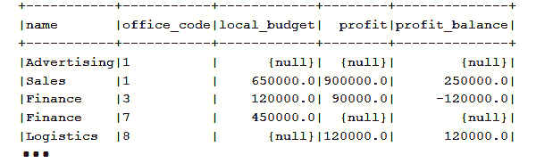


图 13.1 – 输出

更多示例可以在 *函数* 捆绑代码中找到。

### IIF()

`IIF()` 函数通过三个参数实现 if-then-else 逻辑，如下所示（这类似于稍后介绍的 `NVL2()` 函数）：

```java
IIF(boolean_expr, value_for_true_case, value_for_false_case)
```

它评估第一个参数（`boolean_expr`），并分别返回第二个参数（`value_for_true_case`）和第三个参数（`value_for_false_case`）。

例如，以下 jOOQ `iif()` 函数的使用评估了 `DEPARTMENT.LOCAL_BUDGET.isNull()` 表达式，并输出文本 *没有预算* 或 *有预算*：

```java
ctx.select(DEPARTMENT.DEPARTMENT_ID, DEPARTMENT.NAME,
```

```java
      iif(DEPARTMENT.LOCAL_BUDGET.isNull(), 
```

```java
        "NO BUDGET", "HAS BUDGET").as("budget"))
```

```java
   .from(DEPARTMENT).fetch();
```

包含嵌套 `IIF()` 使用在内的更多示例可以在捆绑的代码中找到。

### NULLIF()

`NULLIF(expr1, expr2)` 函数如果参数相等则返回 `NULL`。否则，它返回第一个参数（`expr1`）。

例如，在传统数据库中，混合使用 `NULL` 和空字符串作为缺失值是一种常见做法。我们故意在 `OFFICE` 表的 `OFFICE.COUNTRY` 上创建了这样的案例。

由于空字符串不是 `NULL` 值，即使对我们来说 `NULL` 值和空字符串可能有相同的挖掘，使用 `ISNULL()` 也不会返回它们。使用 jOOQ 的 `nullif()` 方法是查找所有缺失数据（`NULL` 值和空字符串）的便捷方法，如下所示：

```java
ctx.select(OFFICE.OFFICE_CODE, nullif(OFFICE.COUNTRY, ""))
```

```java
    .from(OFFICE).fetch();
```

```java
ctx.selectFrom(OFFICE)
```

```java
    .where(nullif(OFFICE.COUNTRY, "").isNull()).fetch();
```

这些示例可以在 *函数* 捆绑代码中找到。

### IFNULL() 和 ISNULL()

`IFNULL(expr1, expr2)` 和 `ISNULL(expr1, expr2)` 函数接受两个参数，如果第一个参数不是 `NULL` 则返回第一个参数。否则，它们返回第二个参数。前者类似于稍后介绍的 Oracle 的 `NVL()` 函数，而后者是 SQL Server 的特定函数。这两个函数都通过 `CASE` 表达式由 jOOQ 在所有原生不支持它们的方言中进行了模拟。

例如，以下代码片段通过 jOOQ 的 `ifnull()` 和 `isnull()` 方法为 `DEPARTMENT.LOCAL_BUDGET` 的每个 `NULL` 值生成 0：

```java
ctx.select(DEPARTMENT.DEPARTMENT_ID, DEPARTMENT.NAME,
```

```java
      ifnull(DEPARTMENT.LOCAL_BUDGET, 0).as("budget_if"),
```

```java
      isnull(DEPARTMENT.LOCAL_BUDGET, 0).as("budget_is"))
```

```java
   .from(DEPARTMENT)
```

```java
   .fetch();
```

这里是另一个获取客户邮政编码或地址的示例：

```java
ctx.select(
```

```java
     ifnull(CUSTOMERDETAIL.POSTAL_CODE,  
```

```java
       CUSTOMERDETAIL.ADDRESS_LINE_FIRST).as("address_if"),
```

```java
     isnull(CUSTOMERDETAIL.POSTAL_CODE, 
```

```java
       CUSTOMERDETAIL.ADDRESS_LINE_FIRST).as("address_is"))
```

```java
  .from(CUSTOMERDETAIL).fetch();
```

更多示例可以在 *函数* 捆绑代码中找到。

### NVL() 和 NVL2()

一些方言（例如，Oracle）支持名为 `NVL()` 和 `NVL2()` 的两个函数。jOOQ 为所有原生不支持它们的方言进行了模拟。前者类似于稍后介绍的 Oracle 的 `NVL()` 函数，而后者类似于 `IIF()`。因此，`NVL(expr1, expr2)` 如果第一个参数不是 `NULL` 则产生第一个参数；否则，它产生第二个参数。

例如，让我们使用 jOOQ 的`nvl()`方法来应用在金融中使用的方差公式，以计算`DEPARTMENT.FORECAST_PROFIT`和`DEPARTMENT.PROFIT`之间的预测与实际结果差异，如下所示：

```java
ctx.select(DEPARTMENT.NAME, ...,                
```

```java
       round((nvl(DEPARTMENT.PROFIT, 0d).divide(
```

```java
       nvl(DEPARTMENT.FORECAST_PROFIT, 10000d)))
```

```java
       .minus(1d).mul(100), 2).concat("%").as("nvl"))
```

```java
   .from(DEPARTMENT)
```

```java
   .fetch();
```

如果`PROFIT`是`NULL`，则我们将其替换为 0，如果`FORECAST_PROFIT`是`NULL`，则我们将其替换为默认利润 10,000。挑战自己通过`ISNULL()`编写这个查询。

另一方面，`NVL2(expr1, expr2, expr3)`评估第一个参数（`expr1`）。如果`expr1`不是`NULL`，则返回第二个参数（`expr2`）；否则，返回第三个参数（`expr3`）。

例如，每个`EMPLOYEE`都有一个工资和一个可选的`COMMISSION`（缺失的佣金是`NULL`）。让我们通过 jOOQ 的`nvl2()`和`iif()`来获取工资+佣金，如下所示：

```java
ctx.select(EMPLOYEE.FIRST_NAME, EMPLOYEE.LAST_NAME,
```

```java
 iif(EMPLOYEE.COMMISSION.isNull(),EMPLOYEE.SALARY,  
```

```java
  EMPLOYEE.SALARY.plus(EMPLOYEE.COMMISSION))
```

```java
    .as("iif1"),
```

```java
 iif(EMPLOYEE.COMMISSION.isNotNull(),
```

```java
  EMPLOYEE.SALARY.plus(EMPLOYEE.COMMISSION), EMPLOYEE.SALARY)
```

```java
   .as("iif2"),
```

```java
 nvl2(EMPLOYEE.COMMISSION,
```

```java
  EMPLOYEE.SALARY.plus(EMPLOYEE.COMMISSION), EMPLOYEE.SALARY)
```

```java
   .as("nvl2"))
```

```java
 .from(EMPLOYEE)
```

```java
 .fetch();
```

所有这三列—`iif1`、`iif2`和`nvl2`—应包含相同的数据。遗憾的是，在某些 Oracle 情况下，`NVL`可能比`COALESCE`表现得更好。更多详情，请考虑阅读这篇文章：[`connor-mcdonald.com/2018/02/13/nvl-vs-coalesce/`](https://connor-mcdonald.com/2018/02/13/nvl-vs-coalesce/). 你可以检查本节中*函数*捆绑代码的所有示例。接下来，让我们谈谈数值函数。

## 数值函数

jOOQ 支持一系列全面的数值函数，包括`ABS()`、`SIN()`、`COS()`、`EXP()`、`FLOOR()`、`GREATEST()`、`LEAST()`、`LN()`、`POWER()`、`SIGN()`、`SQRT()`等等。主要的是，jOOQ 公开了一组方法，这些方法的名称与这些 SQL 函数相匹配，并支持适当的参数数量和类型。

由于你可以在 jOOQ 手册中找到并举例说明所有这些函数，让我们在这里尝试两个结合几个函数以实现共同目标的例子。例如，计算斐波那契数的著名公式是 Binet 公式（注意不需要递归！）：

```java
Fib(n) = (1.6180339^n – (–0.6180339)^n) / 2.236067977
```

在 jOOQ/SQL 中编写这个公式需要我们使用`power()`数值函数，如下所示（`n`是要计算的数字）：

```java
ctx.fetchValue(round((power(1.6180339, n).minus(
```

```java
      power(-0.6180339, n))).divide(2.236067977), 0));
```

那么计算表示为`(latitude1, longitude1)`和`(latitude2, longitude2)`的两个点之间的距离呢？当然，就像计算斐波那契数的情况一样，这样的计算通常在数据库外部（直接在 Java 中）或 UDF 或存储过程中完成，但尝试在`SELECT`语句中解决它们是快速练习一些数值函数并熟悉 jOOQ 语法的良好机会。所以，我们开始所需的数学计算：

```java
a = POWER(SIN((latitude2 − latitude1) / 2.0)), 2)
```

```java
  + COS(latitude1) * COS(latitude2) 
```

```java
      * POWER (SIN((longitude2 − longitude1) / 2.0), 2);
```

```java
result = (6371.0 * (2.0 * ATN2(SQRT(a),SQRT(1.0 − a))));
```

这次，我们需要 jOOQ 的`power()`、`sin()`、`cos()`、`atn2()`和`sqrt()`数值方法，如下所示：

```java
double pi180 = Math.PI / 180;
```

```java
Field<BigDecimal> a = (power(sin(val((latitude2 - latitude1) 
```

```java
 * pi180).divide(2d)), 2d).plus(cos(latitude1 * pi180)
```

```java
   .mul(cos(latitude2 * pi180)).mul(power(sin(val((
```

```java
     longitude2 - longitude1) * pi180).divide(2d)), 2d))));
```

```java
ctx.fetchValue(inline(6371d).mul(inline(2d)
```

```java
   .mul(atan2(sqrt(a), sqrt(inline(1d).minus(a))))));
```

你可以在*函数*捆绑代码中练习这些示例。

## 字符串函数

正如 SQL 数值函数的情况一样，jOOQ 支持一组令人印象深刻的 SQL 字符串函数，包括`ASCII()`、`CONCAT()`、`OVERLAY()`、`LOWER()`、`UPPER()`、`LTRIM()`、`RTRIM()`等。你可以在 jOOQ 手册中找到每个函数的示例，所以在这里，让我们尝试使用几个字符串函数来获取输出，如图所示：

![图 13.2 – 应用多个 SQL 字符串函数]

![图 13.2]

![图 13.2 – 应用多个 SQL 字符串函数]

将我们拥有的东西转换为想要的东西可以通过 jOOQ 的几种方法表达，包括`concat()`、`upper()`、`space()`、`substring()`、`lower()`和`rpad()`——当然，你可以以不同的方式优化或编写以下查询：

```java
ctx.select(concat(upper(EMPLOYEE.FIRST_NAME), space(1),
```

```java
         substring(EMPLOYEE.LAST_NAME, 1, 1).concat(". ("),
```

```java
           lower(EMPLOYEE.JOB_TITLE),
```

```java
              rpad(val(")"), 4, '.')).as("employee"))
```

```java
   .from(EMPLOYEE)
```

```java
   .fetch();
```

你可以在*函数*捆绑代码旁边查看几个通过分隔符拆分字符串的示例。

### 日期时间函数

本节最后讨论的函数类别包括日期时间函数。主要的是，jOOQ 公开了一系列日期时间函数，可以大致分为操作`java.sql.Date`、`java.sql.Time`和`java.sql.Timestamp`的函数，以及操作 Java 8 日期时间的函数，`java.time.LocalDate`、`java.time.LocalDateTime`和`java.time.OffsetTime`。尽管如此，jOOQ 不能使用`java.time.Duration`或`Period`类，因为它们与标准 SQL 间隔的工作方式不同。

此外，jOOQ 提供了一个替代 JDBC 缺少的`java.sql.Interval`数据类型，名为`org.jooq.types.Interval`，有三个实现：`DayToSecond`、`YearToMonth`和`YearToSecond`。

这里有一些相当简单直观的示例。第一个示例通过`java.sql.Date`和`java.time.LocalDate`获取当前日期：

```java
Date r = ctx.fetchValue(currentDate());
```

```java
LocalDate r = ctx.fetchValue(currentLocalDate());
```

下一个示例将 ISO *8601* `DATE`字符串字面值转换为`java.sql.Date`数据类型：

```java
Date r = ctx.fetchValue(date("2024-01-29"));
```

向`Date`和`LocalDate`添加 10 天的间隔可以这样操作：

```java
var r = ctx.fetchValue(
```

```java
 dateAdd(Date.valueOf("2022-02-03"), 10).as("after_10_days"));
```

```java
var r = ctx.fetchValue(localDateAdd(
```

```java
 LocalDate.parse("2022-02-03"), 10).as("after_10_days"));
```

或者，添加 3 个月的间隔可以这样操作：

```java
var r = ctx.fetchValue(dateAdd(Date.valueOf("2022-02-03"), 
```

```java
  new YearToMonth(0, 3)).as("after_3_month"));
```

通过 SQL 的`EXTRACT()`和 jOOQ 的`dayOfWeek()`函数提取星期几（1 = 星期日，2 = 星期一，...，7 = 星期六）可以这样操作：

```java
int r = ctx.fetchValue(dayOfWeek(Date.valueOf("2021-05-06")));
```

```java
int r = ctx.fetchValue(extract(
```

```java
  Date.valueOf("2021-05-06"), DatePart.DAY_OF_WEEK));
```

你可以在*函数*捆绑代码中查看更多示例。在下一节中，我们将讨论聚合函数。

# 聚合函数

最常见的聚合函数（按任意顺序）是`AVG()`、`COUNT()`、`MAX()`、`MIN()`和`SUM()`，包括它们的`DISTINCT`变体。我非常确信你对这些聚合函数非常熟悉，并且你在许多查询中已经使用过它们。例如，这里有两个计算按财政年度分组的销售流行调和几何平均值的`SELECT`语句。在这里，我们使用了 jOOQ 的`sum()`和`avg()`函数：

```java
// Harmonic mean: n / SUM(1/xi), i=1…n
```

```java
ctx.select(SALE.FISCAL_YEAR, count().divide(
```

```java
     sum(inline(1d).divide(SALE.SALE_))).as("harmonic_mean"))
```

```java
   .from(SALE).groupBy(SALE.FISCAL_YEAR).fetch();
```

而在这里，我们计算几何平均值：

```java
// Geometric mean: EXP(AVG(LN(n)))
```

```java
ctx.select(SALE.FISCAL_YEAR, exp(avg(ln(SALE.SALE_)))
```

```java
            .as("geometric_mean"))
```

```java
   .from(SALE).groupBy(SALE.FISCAL_YEAR).fetch();
```

但正如你所知（或者你很快就会了解到），还有许多其他汇总具有相同的目标，即对一组行执行某些计算并返回单个输出行。同样，jOOQ 公开了具有与汇总名称相同名称或表示建议快捷方式的方法。

接下来，让我们看看一些不太流行但在统计学、金融、科学和其他领域常用的汇总函数。其中之一是用于计算标准差的，([`en.wikipedia.org/wiki/Standard_deviation`](https://en.wikipedia.org/wiki/Standard_deviation))。在 jOOQ 中，我们有`stddevSamp()`用于样本和`stddevPop()`用于总体。以下是一个计算 SSD、PSD 以及通过总体方差（接下来将介绍）对按财政年度分组的销售进行 PSD 仿真的示例：

```java
ctx.select(SALE.FISCAL_YEAR,
```

```java
    stddevSamp(SALE.SALE_).as("samp"),   // SSD 
```

```java
    stddevPop(SALE.SALE_).as("pop1"),    // PSD
```

```java
    sqrt(varPop(SALE.SALE_)).as("pop2")) // PSD emulation
```

```java
 .from(SALE).groupBy(SALE.FISCAL_YEAR).fetch();
```

SSD 和 PSD 在 MySQL、PostgreSQL、SQL Server、Oracle 以及许多其他方言中都得到支持，并在各种问题中非常有用，从金融、统计学、预测等等。例如，在统计学中，我们有标准分数（或所谓的 z 分数），它表示某个观察值相对于总体平均值的 SD 数，其公式为 z = (x - µ) / σ（z 是 z 分数，x 是观察值，µ是平均值，σ是 SD）。您可以在这里了解更多信息：[`en.wikipedia.org/wiki/Standard_score`](https://en.wikipedia.org/wiki/Standard_score)。

现在，考虑到我们在`DAILY_ACTIVITY`中存储了销售数量（`DAILY_ACTIVITY.SALES`）和访客数量（`DAILY_ACTIVITY.VISITORS`），并且我们想要获取有关这些数据的一些信息，由于销售和访客之间没有直接比较，我们必须提出一些有意义的表示，而这可以通过 z 分数来实现。通过依赖公用表表达式（**CTEs**）和 SD，我们可以在 jOOQ 中表达以下查询（当然，在生产环境中，使用存储过程可能是此类查询的更好选择）：

```java
ctx.with("sales_stats").as(
```

```java
      select(avg(DAILY_ACTIVITY.SALES).as("mean"),
```

```java
        stddevSamp(DAILY_ACTIVITY.SALES).as("sd"))
```

```java
      .from(DAILY_ACTIVITY))
```

```java
   .with("visitors_stats").as(
```

```java
      select(avg(DAILY_ACTIVITY.VISITORS).as("mean"),
```

```java
        stddevSamp(DAILY_ACTIVITY.VISITORS).as("sd"))
```

```java
      .from(DAILY_ACTIVITY))
```

```java
   .select(DAILY_ACTIVITY.DAY_DATE,
```

```java
     abs(DAILY_ACTIVITY.SALES
```

```java
     .minus(field(name("sales_stats", "mean"))))
```

```java
     .divide(field(name("sales_stats", "sd"), Float.class))
```

```java
     .as("z_score_sales"),
```

```java
      abs(DAILY_ACTIVITY.VISITORS
```

```java
     .minus(field(name("visitors_stats", "mean"))))
```

```java
     .divide(field(name("visitors_stats", "sd"), Float.class))
```

```java
        .as("z_score_visitors"))
```

```java
   .from(table("sales_stats"), 
```

```java
     table("visitors_stats"), DAILY_ACTIVITY).fetch();
```

在此查询产生的结果中，我们注意到 2004-01-06 的销售 z 分数为 2.00。在 z 分数分析的情况下，这个输出肯定值得深入调查（通常，z 分数大于 1.96 或小于-1.96 被视为需要进一步调查的异常值）。当然，这并不是我们的目标，所以让我们跳到另一个汇总。

通过对统计汇总的进一步分析，我们得到了方差，它被定义为平均的平方差（即与平均值的平方差的平均值）或平均平方偏差（[`en.wikipedia.org/wiki/Variance`](https://en.wikipedia.org/wiki/Variance)）。在 jOOQ 中，我们通过`varSamp()`方法获得样本方差，通过`varPop()`方法获得总体方差，如以下代码示例所示：

```java
Field<BigDecimal> x = PRODUCT.BUY_PRICE;
```

```java
ctx.select(varSamp(x)) // Sample Variance
```

```java
    .from(PRODUCT).fetch();
```

```java
ctx.select(varPop(x)) // Population Variance
```

```java
    .from(PRODUCT).fetch();
```

它们都在 MySQL、PostgreSQL、SQL Server、Oracle 以及许多其他方言中得到支持，但为了好玩，你可以通过以下代码片段中的 `COUNT()` 和 `SUM()` 聚合来模拟样本方差——这又是一个练习这些聚合的机会：

```java
ctx.select((count().mul(sum(x.mul(x)))
```

```java
      .minus(sum(x).mul(sum(x)))).divide(count()
```

```java
      .mul(count().minus(1))).as("VAR_SAMP"))
```

```java
   .from(PRODUCT).fetch();
```

接下来，我们有线性回归（或相关）函数，用于确定因变量（表示为 Y）和自变量（表示为 X）表达式之间的回归关系([`en.wikipedia.org/wiki/Regression_analysis`](https://en.wikipedia.org/wiki/Regression_analysis))。在 jOOQ 中，我们有 `regrSXX()`、`regrSXY()`、`regrSYY()`、`regrAvgX()`、`regrAvgXY()`、`regrCount()`、`regrIntercept()`、`regrR2()` 和 `regrSlope()`。

例如，在 `regrSXY(y, x)` 的情况下，`y` 是因变量表达式，而 `x` 是自变量表达式。如果 `y` 是 `PRODUCT.BUY_PRICE` 而 `x` 是 `PRODUCT.MSRP`，那么按 `PRODUCT_LINE` 进行的线性回归看起来是这样的：

```java
ctx.select(PRODUCT.PRODUCT_LINE,
```

```java
    (regrSXY(PRODUCT.BUY_PRICE, PRODUCT.MSRP)).as("regr_sxy"))
```

```java
    .from(PRODUCT).groupBy(PRODUCT.PRODUCT_LINE).fetch();
```

列出的函数（包括 `regrSXY()`）在所有方言中都得到支持，但也可以很容易地模拟。例如，`regrSXY()` 可以模拟为 `(SUM(X*Y)-SUM(X) * SUM(Y)/COUNT(*))`，如这里所示：

```java
ctx.select(PRODUCT.PRODUCT_LINE,
```

```java
     sum(PRODUCT.BUY_PRICE.mul(PRODUCT.MSRP))
```

```java
      .minus(sum(PRODUCT.BUY_PRICE).mul(sum(PRODUCT.MSRP)
```

```java
      .divide(count()))).as("regr_sxy"))
```

```java
   .from(PRODUCT).groupBy(PRODUCT.PRODUCT_LINE).fetch();
```

此外，`regrSXY()` 还可以模拟为 `SUM(1) * COVAR_POP(expr1, expr2)`，其中 `COVAR_POP()` 代表总体协方差，而 `SUM(1)` 实际上是 `REGR_COUNT(expr1, expr2)`。你可以在包含许多其他 `REGR_FOO()` 函数模拟和通过 `regrSlope()` 和 `regrIntercept()` 计算的 `y = slope * x – intercept` 示例旁边的捆绑代码中看到这个例子，线性回归系数，也可以通过 `sum()`、`avg()` 和 `max()`。

在人口协方差([`en.wikipedia.org/wiki/Covariance`](https://en.wikipedia.org/wiki/Covariance))之后，我们有样本协方差，`COVAR_SAMP()`，它可以这样调用：

```java
ctx.select(PRODUCT.PRODUCT_LINE,
```

```java
  covarSamp(PRODUCT.BUY_PRICE, PRODUCT.MSRP).as("covar_samp"),     
```

```java
  covarPop(PRODUCT.BUY_PRICE, PRODUCT.MSRP).as("covar_pop")) 
```

```java
   .from(PRODUCT)
```

```java
   .groupBy(PRODUCT.PRODUCT_LINE)
```

```java
   .fetch();
```

如果你的数据库不支持协方差函数（例如，MySQL 或 SQL Server），那么你可以通过常见的聚合来模拟它们——`COVAR_SAMP()` 作为 `(SUM(x*y) - SUM(x) * SUM(y) / COUNT(*)) / (COUNT(*) - 1)`，而 `COVAR_POP()` 作为 `(SUM(x*y) - SUM(x) * SUM(y) / COUNT(*)) / COUNT(*)`。你可以在 `AggregateFunctions` 包含的代码中找到示例。

一个大多数数据库（Exasol 是其中之一）不支持但由 jOOQ 提供的有趣函数是合成的 `product()` 函数。此函数表示通过 `exp(sum(log(arg)))` 对正数进行乘法聚合，并为零和负数执行一些额外的工作。例如，在金融领域，有一个名为复合月增长率（CMGR）的指数，它是基于月收入增长率计算的，正如我们在 `SALE.REVENUE_GROWTH` 中所做的那样。公式是 `(PRODUCT (1 + SALE.REVENUE_GROWTH))) ^ (1 / COUNT())`，并且我们在这里为每年的数据应用了它：

```java
ctx.select(SALE.FISCAL_YEAR,
```

```java
      round((product(one().plus(
```

```java
         SALE.REVENUE_GROWTH.divide(100)))
```

```java
            .power(one().divide(count()))).mul(100) ,2)
```

```java
               .concat("%").as("CMGR"))
```

```java
   .from(SALE).groupBy(SALE.FISCAL_YEAR).fetch();
```

我们还把所有东西乘以 100，以获得作为百分比的输出。您可以在 *AggregateFunctions* 打包代码中找到此示例，它位于其他聚合函数旁边，如 `BOOL_AND()`、`EVERY()`、`BOOL_OR()` 和位运算函数。

当您必须使用 jOOQ 部分支持或不支持的聚合函数时，您可以使用 `aggregate()`/ `aggregateDistinct()` 方法。当然，您的数据库必须支持所调用的聚合函数。例如，jOOQ 不支持 Oracle 的 `APPROX_COUNT_DISTINCT()` 聚合函数，它是 `COUNT (DISTINCT expr)` 函数的替代品。这在处理大量数据时非常有用，可以显著快于传统的 `COUNT` 函数，且与精确数值的偏差可以忽略不计。以下是一个使用 `(String name, Class<T> type, Field<?>... arguments)` 聚合的示例，这仅仅是提供的一种风味（请参阅文档以获取更多信息）：

```java
ctx.select(ORDERDETAIL.PRODUCT_ID, 
```

```java
     aggregate("approx_count_distinct", Long.class,  
```

```java
       ORDERDETAIL.ORDER_LINE_NUMBER).as("approx_count"))  
```

```java
   .from(ORDERDETAIL)
```

```java
   .groupBy(ORDERDETAIL.PRODUCT_ID)
```

```java
   .fetch();   
```

您可以在 Oracle 的 *AggregateFunctions* 打包代码中找到此示例。

# 窗口函数

窗口函数非常实用且强大；因此，它们是每个通过 SQL 与数据库交互的开发者必须了解的主题。简而言之，快速概述窗口函数的最好方法是从一个著名的图表开始，该图表展示了聚合函数与窗口函数之间的比较，突出了它们之间的主要区别，如图所示：

![Figure 13.3 – 聚合函数与窗口函数的比较]

![img/B16833_Figure_13.3.jpg]

图 13.3 – 聚合函数与窗口函数的比较

如您所见，聚合函数和窗口函数都在一组行上计算某些内容，但窗口函数不会将这些行聚合或分组成一个单一的输出行。窗口函数依赖于以下语法：

```java
window_function_name (expression) OVER (
```

```java
    Partition Order Frame
```

```java
)
```

这个语法可以这样解释：

显然，`window_function_name` 代表窗口函数的名称，例如 `ROW_NUMBER()`、`RANK()` 等等。

`expression` 用来标识这个窗口函数将要操作的列（或目标表达式）。

`OVER` 子句表示这是一个窗口函数，它由三个子句组成：`Partition`、`Order` 和 `Frame`。通过向任何聚合函数添加 `OVER` 子句，您将其转换为窗口函数。

`Partition` 子句是可选的，其目的是将行划分为分区。接下来，窗口函数将对每个分区进行操作。它的语法如下：`PARTITION BY expr1, expr2, ...`。如果省略 `PARTITION BY`，则整个结果集代表一个单一的分区。为了完全准确，如果省略 `PARTITION BY`，则 `FROM`/`WHERE`/`GROUP BY`/`HAVING` 产生的所有数据代表一个单一的分区。

`Order` 子句也是可选的，它处理分区中行的顺序。其语法是 `ORDER BY 表达式 [ASC | DESC] [NULLS {FIRST| LAST}] ,...`。

`Frame` 子句定义了当前分区的子集。常见的语法是 `mode BETWEEN start_of_frame AND end_of_frame [frame_exclusion]`。

`mode` 指示数据库如何处理输入行。三个可能的值表示框架行与当前行之间的关系类型：`ROWS`、`GROUPS` 和 `RANGE`。

## ROWS

`ROWS` 模式指定框架行和当前行的偏移量是行号（数据库将每个输入行视为一个独立的工作单元）。在此上下文中，`start_of_frame` 和 `end_of_frame` 确定窗口框架开始和结束的行。

在此上下文中，`start_of_frame` 可以是 `N PRECEDING`，这意味着框架从当前评估行的第 n 行之前开始（在 jOOQ 中，`rowsPreceding(n)`），`UNBOUNDED PRECEDING`，这意味着框架从当前分区的第一行开始（在 jOOQ 中，`rowsUnboundedPreceding()`），以及 `CURRENT ROW`（jOOQ `rowsCurrentRow()`）。

`end_of_frame` 的值可以是 `CURRENT ROW`（之前描述过），`N FOLLOWING`，这意味着框架在当前评估行的第 n 行之后结束（在 jOOQ 中，`rowsFollowing(n)`），以及 `UNBOUNDED FOLLOWING`，这意味着框架在当前分区的最后一行结束（在 jOOQ 中，`rowsUnboundedFollowing()`）。

查看以下包含一些示例的图：

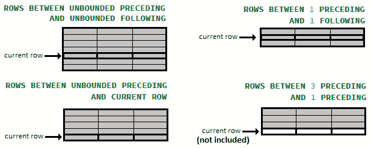

图 13.4 – ROWS 模式示例

灰色部分表示包含的行。

## GROUPS

`GROUPS` 模式指示数据库将具有重复排序值的行分组在一起。因此，当存在重复值时，`GROUPS` 是有用的。

在此上下文中，`start_of_frame` 和 `end_of_frame` 接受与 `ROWS` 相同的值。但是，在 `start_of_frame` 的情况下，`CURRENT_ROW` 指向包含当前行的组中的第一行，而在 `end_of_frame` 的情况下，它指向包含当前行的组中的最后一行。此外，`N PRECEDING`/`FOLLOWING` 指的是应考虑为当前组之前、之后组的数量。另一方面，`UNBOUNDED PRECEDING`/`FOLLOWING` 与 `ROWS` 的情况具有相同的意义。

查看以下包含一些示例的图：

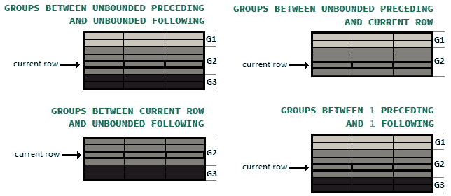

图 13.5 – GROUPS 模式示例

有三个组（G1、G2 和 G3）以不同的灰色阴影表示。

## RANGE

`RANGE`模式不将行绑定为`ROWS`/`GROUPS`。此模式在排序列的给定值范围内工作。这次，对于`start_of_frame`和`end_of_frame`，我们不指定行/组的数量；相反，我们指定窗口框架应包含的值的最大差异。这两个值必须以与排序列相同的单位（或意义）表示。

在此上下文中，对于`start_of_frame`，我们有以下内容：（这次，`N`是排序列的相同单位中的值）`N PRECEDING`（在 jOOQ 中，`rangePreceding(n)`），`UNBOUNDED PRECEDING`（在 jOOQ 中，`rangeUnboundedPreceding()`），和`CURRENT ROW`（在 jOOQ 中，`rangeCurrentRow()`）。对于`end_of_frame`，我们有`CURRENT ROW`，`UNBOUNDED FOLLOWING`（在 jOOQ 中，`rangeUnboundedFollowing()`），`N FOLLOWING`（在 jOOQ 中，`rangeFollowing(n)`）。

查看以下包含一些示例的图表：

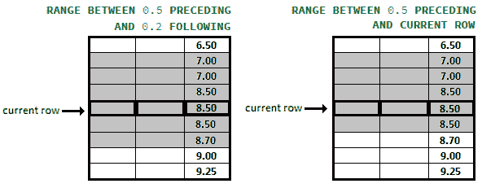

图 13.6 – RANGE 模式示例

灰色部分表示包含的行。

## BETWEEN start_of_frame AND end_of_frame

尤其是对于`BETWEEN start_of_frame AND end_of_frame`结构，jOOQ 提供了`fooBetweenCurrentRow()`，`fooBetweenFollowing(n)`，`fooBetweenPreceding(n)`，`fooBetweenUnboundedFollowing()`，和`fooBetweenUnboundedPreceding()`。在这些方法中，`foo`可以用`rows`，`groups`或`range`替换。

此外，为了创建复合框架，jOOQ 提供了`andCurrentRow()`，`andFollowing(n)`，`andPreceding(n)`，`andUnboundedFollowing()`，和`andUnboundedPreceding()`。

## frame_exclusion

通过`frame_exclusion`可选部分，我们可以排除窗口框架中的某些行。`frame_exclusion`在所有三种模式下工作方式完全相同。可能的值在此列出：

+   `EXCLUDE CURRENT ROW`—排除当前行（在 jOOQ 中，`excludeCurrentRow()`）。

+   `EXCLUDE GROUP`—排除当前行，同时也排除所有同等级的行（例如，排除所有在排序列中具有相同值的行）。在 jOOQ 中，我们有`excludeGroup()`方法。

+   `EXCLUDE TIES`—排除所有同等级的行，但不排除当前行（在 jOOQ 中，`excludeTies()`）。

+   `EXCLUDE NO OTHERS`—这是默认设置，意味着不排除任何内容（在 jOOQ 中，`excludeNoOthers()`）。

为了更好地可视化这些选项，请查看以下图表：

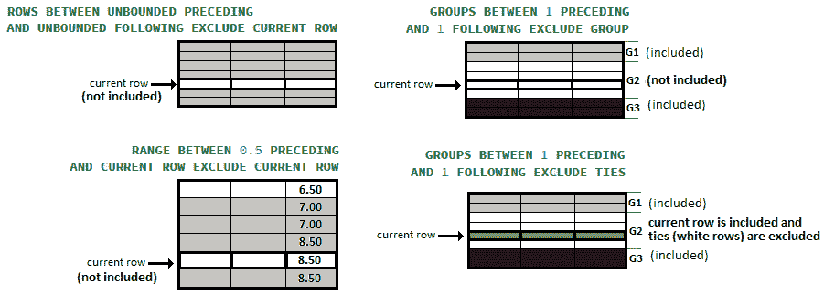

图 13.7 – 排除行示例

谈到 SQL 中的操作逻辑顺序，我们注意到这里窗口函数位于`HAVING`和`SELECT`之间：


图 13.8 – SQL 中的操作逻辑顺序

此外，我认为解释窗口函数可以作用于所有前一步骤生成的数据 *1-5*，并且可以在所有后续步骤 *7-12* 中声明（实际上只在 7 和 10 中有效）是有用的。在深入探讨一些窗口函数示例之前，让我们快速了解一下一个不太为人所知但相当有用的 SQL 子句。

## `QUALIFY` 子句

一些数据库（例如，Snowflake）支持一个名为 `QUALIFY` 的子句。通过这个子句，我们可以过滤（应用谓词）窗口函数的结果。主要的是，`SELECT … QUALIFY` 子句在窗口函数计算后评估，所以 `QUALIFY` 后面是 `<predicate>`，在下面的屏幕截图中，你可以看到它如何产生差异（这个查询通过 `ROW_NUMBER()` 窗口函数返回 `PRODUCT` 表的每 10 个产品）：

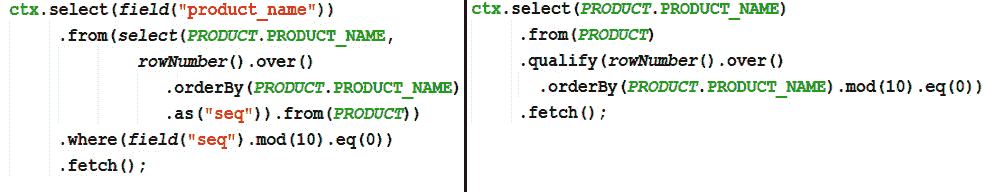

图 13.9 – SQL 中的操作顺序

通过使用 `QUALIFY` 子句，我们消除了子查询，代码也更简洁。即使这个子句在数据库供应商中具有较差的原生支持，jOOQ 仍然为所有支持的方言模拟它。酷吧？！在本章中，你将看到更多使用 `QUALIFY` 子句的示例。

## 使用 ROW_NUMBER()

`ROW_NUMBER()` 是一个排名窗口函数，它为每一行分配一个顺序号（它从 1 开始）。这里有一个简单的示例：


图 13.10 – ROW_NUMBER() 的简单示例

你已经在 *第十二章* 的 *分页和动态查询* 中看到了通过 `ROW_NUMBER()` 分页数据库视图的示例，所以你应该没有问题理解接下来的两个示例。

假设我们想要计算 `PRODUCT.QUANTITY_IN_STOCK` 的中位数 ([`zh.wikipedia.org/wiki/中位数`](https://zh.wikipedia.org/wiki/中位数))。在 Oracle 和 PostgreSQL 中，这可以通过内置的 `median()` 聚合函数完成，但在 MySQL 和 SQL Server 中，我们必须以某种方式模拟它，而一种好的方法就是使用 `ROW_NUMBER()`，如下所示：

```java
Field<Integer> x = PRODUCT.QUANTITY_IN_STOCK.as("x");
```

```java
Field<Double> y = inline(2.0d).mul(rowNumber().over()
```

```java
   .orderBy(PRODUCT.QUANTITY_IN_STOCK))
```

```java
   .minus(count().over()).as("y");
```

```java
ctx.select(avg(x).as("median")).from(select(x, y)
```

```java
   .from(PRODUCT))
```

```java
   .where(y.between(0d, 2d))
```

```java
   .fetch();
```

这很简单！接下来，让我们尝试解决不同类型的问题，并关注 `ORDER` 表。每个订单都有一个 `REQUIRED_DATE` 和 `STATUS` 值，如 `Shipped`、`Cancelled` 等。假设我们想看到由连续时间段表示的集群（也称为岛屿），其中分数（在这种情况下为 `STATUS`）保持不变。一个输出样本如下所示：

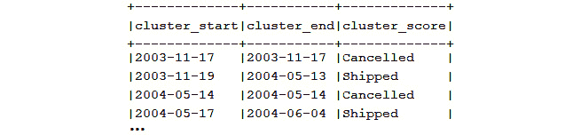

图 13.11 – 集群

如果我们需要通过 `ROW_NUMBER()` 解决这个问题并在 jOOQ 中表达它，那么我们可能会提出这个查询：

```java
Table<?> t = select(
```

```java
  ORDER.REQUIRED_DATE.as("rdate"), ORDER.STATUS.as("status"),
```

```java
  (rowNumber().over().orderBy(ORDER.REQUIRED_DATE)
```

```java
    .minus(rowNumber().over().partitionBy(ORDER.STATUS)
```

```java
  .orderBy(ORDER.REQUIRED_DATE))).as("cluster_nr"))
```

```java
  .from(ORDER).asTable("t");
```

```java
ctx.select(min(t.field("rdate")).as("cluster_start"),
```

```java
           max(t.field("rdate")).as("cluster_end"),
```

```java
           min(t.field("status")).as("cluster_score"))
```

```java
   .from(t)
```

```java
   .groupBy(t.field("cluster_nr"))
```

```java
   .orderBy(1)
```

```java
   .fetch();
```

你可以在捆绑的 *RowNumber* 代码中练习这些示例。

## 使用 RANK()

`RANK()`是一个排名窗口函数，它为结果集分区内的每一行分配一个排名。行的排名计算为*1 + 它之前的排名数量*。具有相同值的列获得相同的排名；因此，如果有多个行具有相同的排名，则下一行的排名不是连续的。想象一下一场比赛中两位运动员共享第一名（或金牌）而没有第二名（因此没有银牌）的情况。这里提供了一个简单的示例：

![图 13.12 – RANK()的简单示例![图 13.12 – 图 13.12.jpg 图 13.12 – RANK()的简单示例这里还有一个按年份和`ORDER.ORDER_DATE`的月份对`ORDER`进行排名的示例：```javactx.select(ORDER.ORDER_ID, ORDER.CUSTOMER_NUMBER, ``````java      ORDER.ORDER_DATE, rank().over().orderBy(``````java        year(ORDER.ORDER_DATE), month(ORDER.ORDER_DATE))) ``````java   .from(ORDER).fetch();````year()`和`month()`快捷方式由 jOOQ 提供，以避免使用 SQL `EXTRACT()`函数。例如，`year(ORDER.ORDER_DATE)`可以写成`extract(ORDER.ORDER_DATE, DatePart.YEAR)`。那么，将`YEAR`作为分区如何？这可以用 jOOQ 表示如下：```javactx.select(SALE.EMPLOYEE_NUMBER, SALE.FISCAL_YEAR,  ``````java  sum(SALE.SALE_), rank().over().partitionBy(SALE.FISCAL_YEAR)``````java     .orderBy(sum(SALE.SALE_).desc()).as("sale_rank"))``````java   .from(SALE)``````java   .groupBy(SALE.EMPLOYEE_NUMBER, SALE.FISCAL_YEAR)``````java   .fetch();```最后，让我们看看一个对产品进行排名的示例。由于可以通过多个列定义分区，我们可以轻松地按`PRODUCT_VENDOR`和`PRODUCT_SCALE`对产品进行排名，如下所示：```javactx.select(PRODUCT.PRODUCT_NAME, PRODUCT.PRODUCT_VENDOR, ``````java    PRODUCT.PRODUCT_SCALE, rank().over().partitionBy(``````java      PRODUCT.PRODUCT_VENDOR, PRODUCT.PRODUCT_SCALE)``````java   .orderBy(PRODUCT.PRODUCT_NAME))``````java   .from(PRODUCT)``````java   .fetch();```您可以在*Rank*中练习这些示例和更多内容。## 使用 DENSE_RANK()`DENSE_RANK()`是一个窗口函数，它为分区或结果集中的每一行分配一个排名，排名值之间没有间隔。这里提供了一个简单的示例：![图 13.13 – DENSE_RANK()的简单示例![图 13.13 – 图 13.13.jpg 图 13.13 – DENSE_RANK()的简单示例在*第十二章*，*分页和动态查询*中，您已经看到了使用`DENSE_RANK()`进行分页`JOIN`语句的示例。接下来，让我们看看另一个按办公室（`EMPLOYEE`）的薪水（`EMPLOYEE.SALARY`）对员工进行排名的情况，如下所示：```javactx.select(EMPLOYEE.FIRST_NAME, EMPLOYEE.LAST_NAME, ``````java  EMPLOYEE.SALARY, OFFICE.CITY, OFFICE.COUNTRY,       ``````java  OFFICE.OFFICE_CODE, denseRank().over().partitionBy(``````java    OFFICE.OFFICE_CODE).orderBy(EMPLOYEE.SALARY.desc())``````java      .as("salary_rank"))``````java   .from(EMPLOYEE)``````java   .innerJoin(OFFICE)``````java   .on(OFFICE.OFFICE_CODE.eq(EMPLOYEE.OFFICE_CODE)).fetch();```输出片段看起来像这样（注意具有相同薪水的员工具有相同的排名）：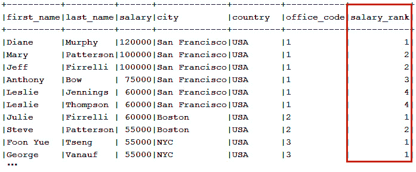

图 13.14 – 输出

最后，让我们使用`DENSE_RANK()`来选择每个办公室的最高薪水，包括重复项。这次，让我们也使用`QUALIFY`子句。代码如下所示：

```java
select(EMPLOYEE.FIRST_NAME, EMPLOYEE.LAST_NAME, 
```

```java
    EMPLOYEE.SALARY, OFFICE.CITY, OFFICE.COUNTRY,   
```

```java
    OFFICE.OFFICE_CODE)
```

```java
 .from(EMPLOYEE)
```

```java
 .innerJoin(OFFICE)
```

```java
  .on(OFFICE.OFFICE_CODE.eq(EMPLOYEE.OFFICE_CODE))
```

```java
 .qualify(denseRank().over().partitionBy(OFFICE.OFFICE_CODE)
```

```java
   .orderBy(EMPLOYEE.SALARY.desc()).eq(1))
```

```java
 .fetch();
```

在继续之前，这里有一篇不错的阅读材料：[`blog.jooq.org/2014/08/12/the-difference-between-row_number-rank-and-dense_rank/`](https://blog.jooq.org/2014/08/12/the-difference-between-row_number-rank-and-dense_rank/)。您可以在*DenseRank*捆绑代码中查看这些示例。

## 使用 PERCENT_RANK()

`PERCENT_RANK()`窗口函数计算结果集中行的百分位数排名`((rank - 1) / (total_rows - 1))`，并返回介于 0（不包括）和 1（包括）之间的值。结果集中的第一行始终具有等于 0 的百分排名。此函数不计`NULL`值，并且是非确定的。通常，最终结果乘以 100 以表示为百分比。

通过示例了解此函数的最佳方式。假设我们想要计算每个办公室员工的薪资百分位排名。用 jOOQ 表达的查询将如下所示：

```java
ctx.select(EMPLOYEE.FIRST_NAME, EMPLOYEE.LAST_NAME, 
```

```java
   EMPLOYEE.SALARY, OFFICE.OFFICE_CODE, OFFICE.CITY,    
```

```java
   OFFICE.COUNTRY, round(percentRank().over()
```

```java
      .partitionBy(OFFICE.OFFICE_CODE)
```

```java
      .orderBy(EMPLOYEE.SALARY).mul(100), 2)
```

```java
      .concat("%").as("PERCENTILE_RANK"))
```

```java
   .from(EMPLOYEE)
```

```java
   .innerJoin(OFFICE)
```

```java
   .on(EMPLOYEE.OFFICE_CODE.eq(OFFICE.OFFICE_CODE))
```

```java
   .fetch();
```

以下截图表示结果的一个片段：

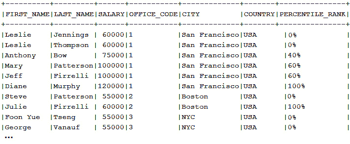

图 13.15 – 百分位排名输出

那么，我们如何解释这个输出？百分位排名通常定义为在分布中，某个结果（或分数）大于或等于（有时仅大于）的结果（或分数）的比例。例如，如果你在某个测试中得到了 90 分，而这个分数大于（或等于）参加测试的 75% 的参与者的分数，那么你的百分位排名是 75。你将处于第 75 个百分位。

换句话说，在办公室 1 中，我们可以说 40% 的员工薪资低于 *Anthony Bow*（查看第三行），因此 *Anthony Bow* 处于第 40 个百分位。同样，在办公室 1 中，*Diane Murphy* 的薪资最高，因为 100% 的员工薪资低于她的薪资（查看第六行）。当当前行是分区中的第一行时，没有先前数据需要考虑，因此百分位排名为 0。一个有趣的案例是 *George Vanauf*（最后一行），其百分位排名为 0%。因为他的薪资（*$55,000*）与 *Foon Yue Tseng* 的薪资相同，我们可以这样说，没有人有比他更低的薪资。

`PERCENT_RANK()` 函数的一个常见用途是将数据分类到自定义组（也称为自定义分箱）。例如，让我们考虑我们想要计算利润低（低于第 20 个百分位数）、中等（介于第 20 个和第 80 个百分位数之间）和高（高于第 80 个百分位数）的部门。以下是计算此数据的代码：

```java
ctx.select(count().filterWhere(field("p").lt(0.2))
```

```java
     .as("low_profit"),
```

```java
  count().filterWhere(field("p").between(0.2, 0.8))
```

```java
     .as("good_profit"),
```

```java
  count().filterWhere(field("p").gt(0.8))
```

```java
     .as("high_profit"))
```

```java
 .from(select(percentRank().over()
```

```java
        .orderBy(DEPARTMENT.PROFIT).as("p"))
```

```java
        .from(DEPARTMENT)
```

```java
        .where(DEPARTMENT.PROFIT.isNotNull()))     
```

```java
 .fetch();
```

你可以在 *PercentRank* 包含的代码中练习这些示例——以及更多。

## 使用 `CUME_DIST()`

`CUME_DIST()` 是一个窗口函数，它计算值在值集中的累积分布。换句话说，`CUME_DIST()` 将具有值的行数除以当前行值的总行数。返回的值大于零且小于或等于一（0 < `CUME_DIST()` <= 1）。具有重复值的列将获得相同的 `CUME_DIST()` 值。这里提供了一个简单的示例：


图 13.16 – `CUME_DIST()` 的简单示例

因此，我们有一个包含 23 行的结果集。对于第一行（标记为 A），`CUME_DIST()` 函数找到值小于或等于 *50000* 的行数。结果是 4。然后，该函数将 4 除以总行数，即 23：4/23。结果是 0.17 或 17%。相同的逻辑应用于下一行。

如何获取 2003 年和 2004 年销售的前 25%？这可以通过`CUME_DIST()`和方便的`QUALIFY`子句来解决，如下所示：

```java
ctx.select(concat(EMPLOYEE.FIRST_NAME, inline(" "), 
```

```java
 EMPLOYEE.LAST_NAME).as("name"), SALE.SALE_, SALE.FISCAL_YEAR)
```

```java
   .from(EMPLOYEE)
```

```java
   .join(SALE)
```

```java
   .on(EMPLOYEE.EMPLOYEE_NUMBER.eq(SALE.EMPLOYEE_NUMBER)
```

```java
    .and(SALE.FISCAL_YEAR.in(2003, 2004)))
```

```java
   .qualify(cumeDist().over().partitionBy(SALE.FISCAL_YEAR)
```

```java
   .orderBy(SALE.SALE_.desc()).lt(BigDecimal.valueOf(0.25)))
```

```java
   .fetch();
```

你可以在捆绑的*CumeDist*代码中练习这些示例。

## 使用 LEAD()/LAG()

`LEAD()`是一个窗口函数，它向前查看指定数量的行（默认为 1）并从当前行访问该行。`LAG()`与`LEAD()`的工作方式相同，但它向后查看。对于这两个函数，我们可以选择指定一个默认值，当没有后续行（`LEAD()`）或没有前导行（`LAG()`）时返回该默认值而不是返回`NULL`。这里提供了一个简单的示例：

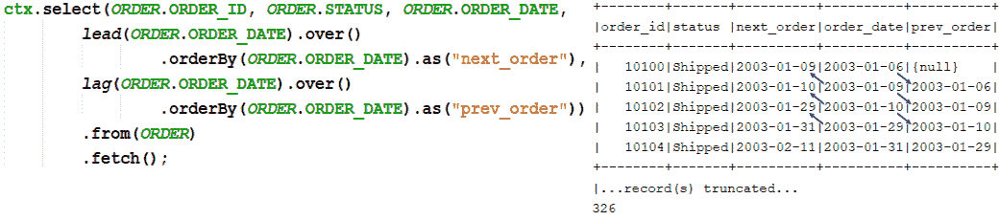

图 13.17 – LEAD()和 LAG()的简单示例

除了在这个示例中使用的`lead`/`lag`(Field<T> field)`语法外，jOOQ 还公开了`lead`/`lag(Field<T> field, int offset)`、`lead`/`lag(Field<T> field, int offset, Field<T> defaultValue)`和`lead/lag`(Field<T> field, int offset, T defaultValue)`。在这个示例中，`lead`/`lag(ORDER.ORDER_DATE)`使用偏移量 1，所以与`lead`/`lag(ORDER.ORDER_DATE, 1)`是同一件事。

这里有一个示例，对于每个员工，使用办公室作为`LEAD()`的分区来显示工资和下一份工资。当`LEAD()`达到分区的末尾时，我们使用 0 而不是`NULL`：

```java
ctx.select(OFFICE.OFFICE_CODE, OFFICE.CITY, OFFICE.COUNTRY,
```

```java
 EMPLOYEE.FIRST_NAME, EMPLOYEE.LAST_NAME, EMPLOYEE.SALARY,
```

```java
 lead(EMPLOYEE.SALARY, 1, 0).over()
```

```java
    .partitionBy(OFFICE.OFFICE_CODE)
```

```java
      .orderBy(EMPLOYEE.SALARY).as("next_salary"))
```

```java
   .from(OFFICE)
```

```java
   .innerJoin(EMPLOYEE)
```

```java
   .on(OFFICE.OFFICE_CODE.eq(EMPLOYEE.OFFICE_CODE))
```

```java
   .fetch();
```

接下来，让我们解决一个计算月度（MOM）增长率的示例。这个财务指标对于基准测试业务非常有用，我们已经在`SALE.REVENUE_GROWTH`列中有了它。但这里是通过`LAG()`函数计算 2004 年*的查询：

```java
ctx.select(SALE.FISCAL_MONTH,
```

```java
  inline(100).mul((SALE.SALE_.minus(lag(SALE.SALE_, 1)
```

```java
    .over().orderBy(SALE.FISCAL_MONTH)))
```

```java
    .divide(lag(SALE.SALE_, 1).over()
```

```java
     .orderBy(SALE.FISCAL_MONTH))).concat("%").as("MOM"))
```

```java
   .from(SALE)
```

```java
   .where(SALE.FISCAL_YEAR.eq(2004))
```

```java
   .orderBy(SALE.FISCAL_MONTH)
```

```java
   .fetch();
```

对于更多示例，包括关于漏斗流失指标和时间序列分析的示例，请查看捆绑的*LeadLag*代码。

## 使用 NTILE()

`NTILE(n)`是一个窗口函数，通常用于将指定`n`个组或桶中的行数进行分配。每个桶都有一个数字（从 1 开始），表示该行属于哪个桶。这里提供了一个简单的示例：

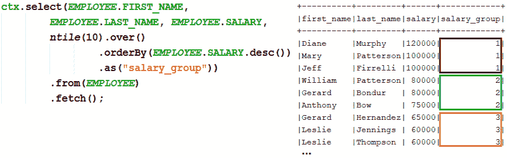

图 13.18 – NTILE()的简单示例

因此，在这个示例中，我们将`EMPLOYEE.SALARY`分布在 10 个桶中。`NTILE()`努力确定每个桶应该有多少行，以便提供桶的数量并使它们大致相等。

在其用例中，`NTILE()`对于计算最近度、频率和货币（RFM）指数非常有用（[`en.wikipedia.org/wiki/RFM_(market_research)`](https://en.wikipedia.org/wiki/RFM_(market_research))). 简而言之，RFM 分析基本上是一种索引技术，它依赖于过去的购买行为来确定不同的客户细分市场。

在我们的案例中，每个客户的过去购买行为（`ORDER.CUSTOMER_NUMBER`）存储在`ORDER`表中，特别是在`ORDER.ORDER_ID`、`ORDER.ORDER_DATE`和`ORDER.AMOUNT`中。

根据这些信息，我们尝试根据 R、F 和 M 的值分布将客户分为四个相等的组。RFM 变量上的四个相等组产生 43=64 个潜在细分市场。结果是一个表格，其中每个分位数（R、F 和 M）都有一个介于 1 和 4 之间的分数。查询本身就可以说明一切，如下所示：

```java
ctx.select(field("customer_number"),
```

```java
    ntile(4).over().orderBy(field("last_order_date"))
```

```java
     .as("rfm_recency"),
```

```java
    ntile(4).over().orderBy(field("count_order"))
```

```java
     .as("rfm_frequency"),
```

```java
    ntile(4).over().orderBy(field("avg_amount"))
```

```java
     .as("rfm_monetary")).from(
```

```java
     select(ORDER.CUSTOMER_NUMBER.as("customer_number"),
```

```java
      max(ORDER.ORDER_DATE).as("last_order_date"),
```

```java
      count().as("count_order"),
```

```java
      avg(ORDER.AMOUNT).as("avg_amount"))
```

```java
        .from(ORDER)
```

```java
        .groupBy(ORDER.CUSTOMER_NUMBER))
```

```java
  .fetch();
```

这里提供了一个示例输出：

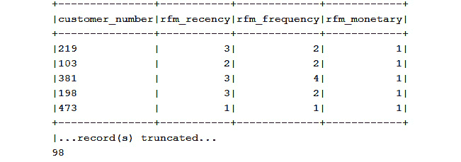

图 13.19 – RFM 示例

通过将 RFM 结果组合为 R*100+F*10+M，我们可以获得一个综合评分。这在*Ntile*捆绑代码中的更多示例旁边可用。

## 使用 FIRST_VALUE()和 LAST_VALUE()

`FIRST_VALUE(expr)`返回相对于窗口帧中第一行的指定表达式(`expr`)的值。

`NTH_VALUE(expr, offset)`返回相对于窗口帧中偏移行指定的表达式(`expr`)的值。

`LAST_VALUE(expr)`返回相对于窗口帧中最后一行的指定表达式(`expr`)的值。

假设我们的目标是获取每个产品线的最便宜和最贵的产品，如下面的截图所示：

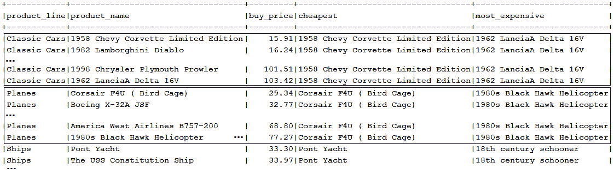

图 13.20 – 每个产品线的最便宜和最贵的产品

通过`FIRST_VALUE()`和`LAST_VALUE()`完成此任务可以这样做：

```java
ctx.select(PRODUCT.PRODUCT_LINE, 
```

```java
  PRODUCT.PRODUCT_NAME, PRODUCT.BUY_PRICE,
```

```java
  firstValue(PRODUCT.PRODUCT_NAME).over()
```

```java
   .partitionBy(PRODUCT.PRODUCT_LINE)
```

```java
     .orderBy(PRODUCT.BUY_PRICE).as("cheapest"),
```

```java
  lastValue(PRODUCT.PRODUCT_NAME).over()
```

```java
   .partitionBy(PRODUCT.PRODUCT_LINE)
```

```java
     .orderBy(PRODUCT.BUY_PRICE)
```

```java
       .rangeBetweenUnboundedPreceding()
```

```java
       .andUnboundedFollowing().as("most_expensive"))
```

```java
  .from(PRODUCT)
```

```java
  .fetch(); 
```

如果未指定窗口帧，则默认窗口帧取决于`ORDER BY`的存在。如果存在`ORDER BY`，则窗口帧为`RANGE BETWEEN UNBOUNDED PRECEDING AND CURRENT ROW`。如果不存在`ORDER BY`，则窗口帧为`RANGE BETWEEN UNBOUNDED PRECEDING AND UNBOUNDED FOLLOWING`。

考虑到这一点，在我们的情况下，`FIRST_VALUE()`可以依赖于默认的窗口帧来返回分区中的第一行，即最低价格。另一方面，`LAST_VALUE()`必须明确定义窗口帧为`RANGE BETWEEN UNBOUNDED PRECEDING AND UNBOUNDED FOLLOWING`以返回最高价格。

这里是另一个通过`NTH_VALUE()`获取每个产品线的第二贵产品的示例：

```java
ctx.select(PRODUCT.PRODUCT_LINE, 
```

```java
  PRODUCT.PRODUCT_NAME, PRODUCT.BUY_PRICE,
```

```java
  nthValue(PRODUCT.PRODUCT_NAME, 2).over()
```

```java
   .partitionBy(PRODUCT.PRODUCT_LINE)
```

```java
    .orderBy(PRODUCT.BUY_PRICE.desc())
```

```java
     .rangeBetweenUnboundedPreceding()
```

```java
     .andUnboundedFollowing().as("second_most_expensive"))
```

```java
   .from(PRODUCT)
```

```java
   .fetch();
```

前面的查询按降序对`BUY_PRICE`进行排序，以获取每个产品线的第二贵产品。但这主要是从底部开始的第二行，因此我们可以依赖于`FROM LAST`子句（在 jOOQ 中为`fromLast()`)来表达它，如下所示：

```java
ctx.select(PRODUCT.PRODUCT_LINE, 
```

```java
   PRODUCT.PRODUCT_NAME, PRODUCT.BUY_PRICE,
```

```java
   nthValue(PRODUCT.PRODUCT_NAME, 2).fromLast().over()
```

```java
   .partitionBy(PRODUCT.PRODUCT_LINE)
```

```java
    .orderBy(PRODUCT.BUY_PRICE)
```

```java
     .rangeBetweenUnboundedPreceding()
```

```java
     .andUnboundedFollowing().as("second_most_expensive"))
```

```java
   .from(PRODUCT)
```

```java
   .fetch();
```

此查询在 Oracle 中运行良好，Oracle 支持`FROM FIRST` (`fromFirst()`), `FROM LAST` (`fromLast()`), `IGNORE NULLS` (`ignoreNulls()`), 和 `RESPECT NULLS` (`respectNulls()`).

你可以在*FirstLastNth*捆绑代码中练习这些示例。

## 使用 RATIO_TO_REPORT()

`RATIO_TO_REPORT(expr)`计算指定值与集合中值的总和的比率。如果给定的`expr`值评估为`null`，则此函数返回`null`。这里提供了一个简单的示例：

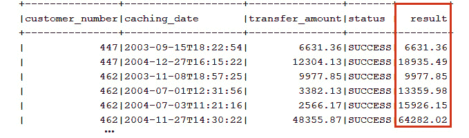

](img/B16833_Figure_13.21.jpg)

图 13.21 – RATIO_TO_REPORT()的简单示例

例如，对于第一行，比率为 51241.54 / 369418.38，其中 369418.38 是所有销售额的总和。在应用`round()`函数后，结果为 0.14 或 14%，但如果我们想计算当前财年销售额的比率，可以通过`PARTITION BY`来实现，如下所示：

```java
ctx.select(SALE.EMPLOYEE_NUMBER, SALE.FISCAL_YEAR, SALE.SALE_,
```

```java
  round(ratioToReport(SALE.SALE_).over()
```

```java
          .partitionBy(SALE.FISCAL_YEAR), 2)
```

```java
          .as("ratio_to_report_sale"))
```

```java
  .from(SALE).fetch();
```

让我们计算每个员工当前工资总和的比率，并以百分比的形式表示，如下所示：

```java
ctx.select(OFFICE.OFFICE_CODE, 
```

```java
     sum(EMPLOYEE.SALARY).as("salaries"),
```

```java
       ratioToReport(sum(EMPLOYEE.SALARY)).over()
```

```java
        .mul(100).concat("%").as("ratio_to_report"))
```

```java
   .from(OFFICE)
```

```java
   .join(EMPLOYEE)
```

```java
   .on(OFFICE.OFFICE_CODE.eq(EMPLOYEE.OFFICE_CODE))
```

```java
   .groupBy(OFFICE.OFFICE_CODE)
```

```java
   .orderBy(OFFICE.OFFICE_CODE)
```

```java
   .fetch();
```

您可以在捆绑的*RatioToReport*代码中查看这些示例。

# 聚合函数作为窗口函数

聚合函数也可以用作窗口函数。例如，让我们使用`SUM()`聚合函数作为窗口函数来计算每个客户在每个缓存日期成功转移的金额总和，如下面的截图所示：


图 13.22 – 到每个缓存日期为止转移金额的总和

jOOQ 查询可以表达如下：

```java
ctx.select(BANK_TRANSACTION.CUSTOMER_NUMBER,   
```

```java
  BANK_TRANSACTION.CACHING_DATE,
```

```java
  BANK_TRANSACTION.TRANSFER_AMOUNT, BANK_TRANSACTION.STATUS,
```

```java
  sum(BANK_TRANSACTION.TRANSFER_AMOUNT).over()
```

```java
   .partitionBy(BANK_TRANSACTION.CUSTOMER_NUMBER)
```

```java
   .orderBy(BANK_TRANSACTION.CACHING_DATE)
```

```java
   .rowsBetweenUnboundedPreceding().andCurrentRow().as("result"))
```

```java
  .from(BANK_TRANSACTION)
```

```java
  .where(BANK_TRANSACTION.STATUS.eq("SUCCESS")).fetch();
```

或者，让我们使用`AVG()`聚合函数作为窗口函数来计算每个订单前三个排序产品的平均价格，如下面的截图所示：

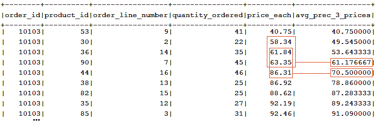

图 13.23 – 每个订单前三个排序产品的平均价格

查询看起来是这样的：

```java
ctx.select(ORDERDETAIL.ORDER_ID, ORDERDETAIL.PRODUCT_ID, ...,
```

```java
       avg(ORDERDETAIL.PRICE_EACH).over()
```

```java
        .partitionBy(ORDERDETAIL.ORDER_ID)
```

```java
        .orderBy(ORDERDETAIL.PRICE_EACH)
```

```java
        .rowsPreceding(2).as("avg_prec_3_prices"))
```

```java
   .from(ORDERDETAIL).fetch();
```

关于计算运行平均口味的事情——换句话说，创建一个报告，显示 2005 年 3 月*Visa Electron*卡上的每笔交易？此外，此报告显示基于 3 天移动平均的每日平均交易金额。完成此操作的代码如下所示：

```java
ctx.select(
```

```java
  BANK_TRANSACTION.CACHING_DATE, BANK_TRANSACTION.CARD_TYPE,
```

```java
  sum(BANK_TRANSACTION.TRANSFER_AMOUNT).as("daily_sum"),
```

```java
  avg(sum(BANK_TRANSACTION.TRANSFER_AMOUNT)).over()
```

```java
    .orderBy(BANK_TRANSACTION.CACHING_DATE)
```

```java
      .rowsBetweenPreceding(2).andCurrentRow()
```

```java
         .as("transaction_running_average"))
```

```java
   .from(BANK_TRANSACTION)
```

```java
   .where(BANK_TRANSACTION.CACHING_DATE
```

```java
   .between(LocalDateTime.of(2005, 3, 1, 0, 0, 0),
```

```java
            LocalDateTime.of(2005, 3, 31, 0, 0, 0))
```

```java
   .and(BANK_TRANSACTION.CARD_TYPE.eq("VisaElectron")))   
```

```java
   .groupBy(BANK_TRANSACTION.CACHING_DATE, 
```

```java
            BANK_TRANSACTION.CARD_TYPE)
```

```java
   .orderBy(BANK_TRANSACTION.CACHING_DATE).fetch();
```

如卢卡斯·埃德（Lukas Eder）所说：“*关于聚合窗口函数最令人震惊的是，甚至用户定义的聚合函数也可以用作窗口函数!*”

您可以在捆绑的*PostgreSQL*代码中查看更多示例（例如，您可以找到关于*有多少其他员工的薪水与我相同？*和*有多少销售额比 5000 或更少？*的查询），在*AggregateWindowFunctions*捆绑代码中。

# 聚合函数和 ORDER BY

某些聚合函数根据它们的输入顺序输出显著不同的结果。默认情况下，这种排序没有指定，但可以通过可选的`ORDER BY`子句作为参数来控制。因此，在这些聚合函数调用中存在`ORDER BY`时，我们可以获取排序后的聚合结果。让我们看看如何在 jOOQ 中使用这些函数，并从以`AGG`结尾的函数类别开始，例如`ARRAY_AGG()`、`JSON_ARRAYAGG()`、`XML_AGG()`、`MULTISET_AGG()`（在*第八章*，*获取和映射*）等。

## FOO_AGG()

例如，`ARRAY_AGG()` 是一个将数据聚合到数组中的函数，在存在 `ORDER BY` 的情况下，它将数据聚合到符合指定顺序的数组中。以下是一个使用 `ARRAY_AGG()` 按降序聚合 `EMPLOYEE.FIRST_NAME` 和 `EMPLOYEE.LAST_NAME` 的示例：

```java
ctx.select(arrayAgg(EMPLOYEE.FIRST_NAME).orderBy(
```

```java
      EMPLOYEE.FIRST_NAME.desc(),               EMPLOYEE.LAST_NAME.desc()))
```

```java
   .from(EMPLOYEE).fetch();
```

对于 PostgreSQL，jOOQ 生成的 SQL 如下：

```java
SELECT ARRAY_AGG(
```

```java
    "public"."employee"."first_name" 
```

```java
    ORDER BY
```

```java
      "public"."employee"."first_name" DESC, 
```

```java
      "public"."employee"."last_name" DESC
```

```java
  ) FROM "public"."employee"
```

结果是一个数组，如 [*Yoshimi*，*William*，*Tom*，*Steve*，*Peter*，…]，被包装为 `Result<Record1<String[]>>`（通过 `get(0).value1()` 提取 `String[]`）。不要将 `ARRAY_AGG()` 与 jOOQ 的 `fetchArray()` 混淆。在 `ARRAY_AGG()` 的情况下，数组是由数据库构建的，而在 `fetchArray()` 的情况下，数组是在获取结果集后由 jOOQ 构建的。

另外两个接受 `ORDER BY` 的聚合函数是 `JSON_ARRAYAGG()` 和 `XML_AGG()`。你应该熟悉这些函数来自 *第八章*，*获取和映射*，但你也可以在本节附带代码中看到几个简单的示例。

## COLLECT()

一个接受 `ORDER BY` 的有趣方法是 Oracle 的 `COLLECT()` 方法。虽然 `ARRAY_AGG()` 代表了将数据聚合到数组中的标准 SQL 函数，但 `COLLECT()` 函数是 Oracle 特有的，并生成一个结构化类型的数组。让我们假设以下 Oracle 用户定义的类型：

```java
CREATE TYPE "SALARY_ARR" AS TABLE OF NUMBER(7); 
```

jOOQ 代码生成器将为这个用户定义的类型生成 `SalaryArrRecord` 类，位于 `jooq.generated.udt.records` 中。通过这个 UDT 记录，我们可以按薪资降序和按职位升序收集员工的薪资，如下所示：

```java
var result = ctx.select(
```

```java
      collect(EMPLOYEE.SALARY, SalaryArrRecord.class)
```

```java
  .orderBy(EMPLOYEE.SALARY.asc(),            EMPLOYEE.JOB_TITLE.desc()))
```

```java
  .from(EMPLOYEE).fetch();
```

jOOQ 通过以下 SQL 获取 `Result<Record1<SalaryArrRecord>>`：

```java
SELECT CAST(COLLECT(
```

```java
    "CLASSICMODELS"."EMPLOYEE"."SALARY" 
```

```java
ORDER BY 
```

```java
    "CLASSICMODELS"."EMPLOYEE"."SALARY" ASC, 
```

```java
    "CLASSICMODELS"."EMPLOYEE"."JOB_TITLE" DESC) 
```

```java
     AS "CLASSICMODELS"."SALARY_ARR") 
```

```java
FROM "CLASSICMODELS"."EMPLOYEE"
```

通过调用 `get(0).value1().toArray(Integer[]::new)`，你可以访问薪资数组。或者，通过调用 `get(0).value1().get(5)`，你可以访问第五个薪资。依赖 `fetchOneInto()`/`fetchSingleInto()` 也是一种选择，如下所示：

```java
SalaryArrRecord result = ctx.select(
```

```java
  collect(EMPLOYEE.SALARY, SalaryArrRecord.class)
```

```java
  .orderBy(EMPLOYEE.SALARY.asc(), EMPLOYEE.JOB_TITLE.desc()))
```

```java
  .from(EMPLOYEE)
```

```java
  .fetchOneInto(SalaryArrRecord.class);
```

现在，你可以通过 `result.toArray(Integer[]::new)` 访问薪资数组，并通过 `result.get(5)` 访问第五个薪资。

## GROUP_CONCAT()

另一个接受 `ORDER BY` 子句的酷炫聚合函数是 `GROUP_CONCAT()` 函数（在 MySQL 中非常流行），用于获取字段的聚合拼接结果。jOOQ 在 Oracle、PostgreSQL、SQL Server 以及其他不支持原生此功能的方言中模拟了这个函数。

例如，让我们使用 `GROUP_CONCAT()` 来获取按薪资降序排列的员工姓名的字符串，如下所示：

```java
ctx.select(groupConcat(concat(EMPLOYEE.FIRST_NAME, 
```

```java
      inline(" "), EMPLOYEE.LAST_NAME))
```

```java
   .orderBy(EMPLOYEE.SALARY.desc()).separator(";")
```

```java
     .as("names_of_employees"))
```

```java
   .from(EMPLOYEE).fetch();
```

输出将类似于这样：*Diane Murphy*；*Mary Patterson*；*Jeff Firrelli*；…。

## Oracle 的 KEEP() 子句

这是一点快速提示——你在查询中看到过这样的聚合函数吗：`SUM(some_value) KEEP (DENSE_RANK FIRST ORDER BY some_date)`？或者这个分析变体：`SUM(some_value) KEEP (DENSE_RANK LAST ORDER BY some_date) OVER (PARTITION BY some_partition)`？

如果你做到了，那么你知道你所看到的是 Oracle 的 `KEEP()` 子句在起作用，或者换句话说，是 SQL 的 `FIRST()` 和 `LAST()` 函数，由 `KEEP()` 子句前缀以增加语义清晰度，以及 `DENSE_RANK()` 以指示 Oracle 应该仅对奥运排名（那些具有最大（`LAST()`）或最小（`FIRST()`）密集排名的行）进行聚合，分别后缀 `ORDER BY()` 和可选的 `OVER(PARTITION BY())`。`LAST()` 和 `FIRST()` 都可以被视为聚合函数（如果你省略了 `OVER()` 子句）或作为分析函数。

但让我们基于 `CUSTOMER` 和 `ORDER` 表来设定一个场景。每个客户 (`CUSTOMER.CUSTOMER_NUMBER`) 都有一个或多个订单，假设我们想要为每个 `CUSTOMER` 类型获取最接近 2004 年 6 月 6 日（或任何其他日期，包括当前日期）的 `ORDER.ORDER_DATE` 值。这可以通过查询轻松实现，如下所示：

```java
ctx.select(ORDER.CUSTOMER_NUMBER, max(ORDER.ORDER_DATE))
```

```java
   .from(ORDER)
```

```java
   .where(ORDER.ORDER_DATE.lt(LocalDate.of(2004, 6, 6)))
```

```java
   .groupBy(ORDER.CUSTOMER_NUMBER)
```

```java
   .fetch();
```

顺便选择 `ORDER.SHIPPED_DATE` 和 `ORDER.STATUS` 好吗？一种方法可能是依赖 `ROW_NUMBER()` 窗口函数和 `QUALIFY()` 子句，如下所示：

```java
ctx.select(ORDER.CUSTOMER_NUMBER, ORDER.ORDER_DATE, 
```

```java
      ORDER.SHIPPED_DATE, ORDER.STATUS)
```

```java
   .from(ORDER)
```

```java
   .where(ORDER.ORDER_DATE.lt(LocalDate.of(2004, 6, 6)))
```

```java
   .qualify(rowNumber().over()
```

```java
     .partitionBy(ORDER.CUSTOMER_NUMBER)
```

```java
       .orderBy(ORDER.ORDER_DATE.desc()).eq(1))
```

```java
   .fetch();
```

如你在捆绑的代码中所见，另一种方法可能是依赖 `SELECT DISTINCT ON`（如 Twitter 上的 *@dmitrygusev* 建议的）或反连接，但如果我们为 Oracle 编写查询，那么你很可能会选择 `KEEP()` 子句，如下所示：

```java
ctx.select(ORDER.CUSTOMER_NUMBER,
```

```java
           max(ORDER.ORDER_DATE).as("ORDER_DATE"),
```

```java
           max(ORDER.SHIPPED_DATE).keepDenseRankLastOrderBy(
```

```java
               ORDER.SHIPPED_DATE).as("SHIPPED_DATE"),
```

```java
           max(ORDER.STATUS).keepDenseRankLastOrderBy(
```

```java
               ORDER.SHIPPED_DATE).as("STATUS"))
```

```java
   .from(ORDER)
```

```java
   .where(ORDER.ORDER_DATE.lt(LocalDate.of(2004, 6, 6)))
```

```java
   .groupBy(ORDER.CUSTOMER_NUMBER).fetch();
```

或者，你也可以通过利用 Oracle 的 `ROWID` 伪列来实现，如下所示：

```java
ctx.select(ORDER.CUSTOMER_NUMBER, ORDER.ORDER_DATE, 
```

```java
      ORDER.SHIPPED_DATE, ORDER.STATUS)
```

```java
   .from(ORDER)
```

```java
   .where((rowid().in(select(max((rowid()))
```

```java
      .keepDenseRankLastOrderBy(ORDER.SHIPPED_DATE))
```

```java
      .from(ORDER)
```

```java
      .where(ORDER.ORDER_DATE.lt(LocalDate.of(2004, 6, 6)))
```

```java
      .groupBy(ORDER.CUSTOMER_NUMBER)))).fetch();
```

你可以在捆绑的代码 *AggregateFunctionsOrderBy* 中练习这些示例。

# 有序集聚合函数（WITHIN GROUP）

*有序集聚合函数* 允许通过 `WITHIN GROUP` 子句对排序后的行集进行操作。通常，这些函数用于执行依赖于特定行排序的计算。在这里，我们可以快速提及 *假设集* 函数，如 `RANK()`、`DENSE_RANK()`、`PERCENT_RANK()` 或 `CUME_DIST()`，以及 *逆分布函数*，如 `PERCENTILE_CONT()`、`PERCENTILE_DISC()` 或 `MODE()`。一个特殊情况由 `LISTAGG()` 表示，它在本节的末尾进行介绍。

## 假设集函数

假设集函数为假设值（让我们用 `hv` 表示）计算某些内容。在这个上下文中，`DENSE_RANK()` 计算没有间隔的 `hv` 排名，而 `RANK()` 做同样的事情但带有间隔。`CUME_DIST()` 计算累积分布（`hv` 的相对排名从 1/n 到 1），而 `PERCENT_RANK()` 计算百分比排名（`hv` 的相对排名从 0 到 1）。

例如，假设我们想要计算假设值（*2004*，*10000*）的排名，其中*2004*是`SALE.FISCAL_YEAR`，*10000*是`SALE.SALE_`。接下来，对于现有数据，我们想要获得所有小于这个假设值排名的无间隙排名。对于问题的第一部分，我们依赖于`DENSE_RANK()`假设集函数，而对于第二部分，依赖于`DENSE_RANK()`窗口函数，如下所示：

```java
ctx.select(SALE.EMPLOYEE_NUMBER, SALE.FISCAL_YEAR, SALE.SALE_)
```

```java
   .from(SALE)
```

```java
   .qualify(denseRank().over()
```

```java
    .orderBy(SALE.FISCAL_YEAR.desc(), SALE.SALE_)
```

```java
    .le(select(denseRank(val(2004), val(10000))
```

```java
     .withinGroupOrderBy(SALE.FISCAL_YEAR.desc(), SALE.SALE_))
```

```java
    .from(SALE))).fetch();   
```

现在，让我们考虑另一个使用`PERCENT_RANK()`假设集函数的例子。这次，假设我们计划为新销售代表提供*$61,000*的薪水，但在做这件事之前，我们想知道有多少比例的当前销售代表的薪水高于*$61,000*。这可以这样完成：

```java
ctx.select(count().as("nr_of_salaries"),
```

```java
   percentRank(val(61000d)).withinGroupOrderBy(
```

```java
        EMPLOYEE.SALARY.desc()).mul(100).concat("%")
```

```java
           .as("salary_percentile_rank"))
```

```java
   .from(EMPLOYEE)
```

```java
   .where(EMPLOYEE.JOB_TITLE.eq("Sales Rep")).fetch();
```

此外，我们还想了解薪水高于*$61,000*的销售代表的百分比。为此，我们需要不同的薪水，如下所示：

```java
ctx.select(count().as("nr_of_salaries"),
```

```java
    percentRank(val(61000d)).withinGroupOrderBy(
```

```java
    field(name("t", "salary")).desc()).mul(100).concat("%")
```

```java
          .as("salary_percentile_rank"))
```

```java
   .from(selectDistinct(EMPLOYEE.SALARY.as("salary"))
```

```java
   .from(EMPLOYEE)
```

```java
   .where(EMPLOYEE.JOB_TITLE.eq("Sales Rep"))     
```

```java
   .asTable("t"))
```

```java
   .fetch();
```

你可以在`OrderedSetAggregateFunctions`捆绑代码旁边练习这些例子，以及其他`RANK()`和`CUME_DIST()`假设集函数。

## 逆分布函数

简而言之，逆分布函数计算*百分位数*。有两种分布模型：一种离散模型（通过`PERCENTILE_DISC()`计算）和一种连续模型（通过`PERCENTILE_CONT()`计算）。

### `PERCENTILE_DISC()`和`PERCENTILE_CONT()`

但计算*百分位数*实际上意味着什么呢？粗略地说，考虑一个特定的百分比，`P`（这个百分比是一个介于 0（包含）和 1（包含）之间的浮点值），以及一个排序字段，`F`。在这种情况下，百分位数的计算表示低于`F`值百分比的值。

例如，让我们考虑`SALES`表，并希望找到第 25 百分位的销售额。在这种情况下，`P` = 0.25，排序字段是`SALE.SALE_`。应用`PERCENTILE_DISC()`和`PERCENTILE_CONT()`函数的结果如下：

```java
ctx.select(
```

```java
    percentileDisc(0.25)
```

```java
      .withinGroupOrderBy(SALE.SALE_).as("pd - 0.25"),
```

```java
    percentileCont(0.25)
```

```java
      .withinGroupOrderBy(SALE.SALE_).as("pc - 0.25"))
```

```java
   .from(SALE)
```

```java
   .fetch();
```

在捆绑的代码中，你可以看到这个查询扩展到了 50th、75th 和 100th 百分位数。得到的值（例如，2974.43）表示低于该值的销售额占销售额的 25%。在这种情况下，`PERCENTILE_DISC()`和`PERCENTILE_CONT()`返回相同的值（2974.43），但这并不总是如此。记住，`PERCENTILE_DISC()`在离散模型上工作，而`PERCENTILE_CONT()`在连续模型上工作。换句话说，如果销售（也称为总体）中没有值（销售额）正好落在指定的百分位数，`PERCENTILE_CONT()`必须假设连续分布进行插值。基本上，`PERCENTILE_CONT()`从两个紧接在所需值之后和之前的值（销售额）中插值所需的值（销售额）。例如，如果我们重复之前的例子来计算 11th 百分位数，那么`PERCENTILE_DISC()`返回 1676.14，这是一个存在的销售额，而`PERCENTILE_CONT()`返回 1843.88，这是一个插值值，该值在数据库中不存在。

虽然 Oracle 支持 `PERCENTILE_DISC()` 和 `PERCENTILE_CONT()` 作为排序集聚合函数和窗口函数变体，但 PostgreSQL 只支持它们作为排序集聚合函数，SQL Server 只支持窗口函数变体，MySQL 完全不支持它们。模拟它们并不简单，但 Lukas Eder 的这篇优秀文章是这方面的必读之作：[`blog.jooq.org/2019/01/28/how-to-emulate-percentile_disc-in-mysql-and-other-rdbms/`](https://blog.jooq.org/2019/01/28/how-to-emulate-percentile_disc-in-mysql-and-other-rdbms/)。

现在，让我们看看使用 `PERCENTILE_DISC()` 作为窗口函数变体和 `PERCENTILE_CONT()` 作为排序集聚合函数的示例。这次，重点是 `EMPLOYEE.SALARY`。首先，我们想通过 `PERCENTILE_DISC()` 计算每个办公室的薪资的 50 分位数。其次，我们只想保留那些小于通过 `PERCENTILE_CONT()` 计算的总体 50 分位数的 50 分位数。代码如下所示：

```java
ctx.select().from(
```

```java
  select(OFFICE.OFFICE_CODE, OFFICE.CITY, OFFICE.COUNTRY,
```

```java
    EMPLOYEE.FIRST_NAME, EMPLOYEE.LAST_NAME, EMPLOYEE.SALARY,
```

```java
    percentileDisc(0.5).withinGroupOrderBy(EMPLOYEE.SALARY)
```

```java
    .over().partitionBy(OFFICE.OFFICE_CODE)
```

```java
    .as("percentile_disc"))
```

```java
  .from(OFFICE)
```

```java
  .join(EMPLOYEE)
```

```java
   .on(OFFICE.OFFICE_CODE.eq(EMPLOYEE.OFFICE_CODE)).asTable("t"))
```

```java
   .where(field(name("t", "percentile_disc"))
```

```java
     .le(select(percentileCont(0.5)
```

```java
       .withinGroupOrderBy(EMPLOYEE.SALARY))
```

```java
       .from(EMPLOYEE))).fetch();
```

你可以在捆绑的 *OrderedSetAggregateFunctions* 代码中练习这些示例。

### `MODE()` 函数

主要来说，`MODE()` 函数作用于一系列值以产生一个结果（称为 *众数*），表示出现频率最高的值。`MODE()` 函数有两种形式，如下所述：

+   `MODE(field)` 聚合函数

+   `MODE WITHIN GROUP (ORDER BY [order clause])` 排序集聚合函数

如果有多个结果（众数）可用，那么 `MODE()` 只返回一个值。如果有给定的排序，那么将选择第一个值。

`MODE()` 聚合函数在 PostgreSQL 和 Oracle 中由 jOOQ 模拟，但在 MySQL 和 SQL Server 中不支持。例如，假设我们想找出一年中销售量最多的月份，为此，我们可能会提出以下查询（注意，不允许为 `MODE()` 明确使用 `ORDER BY` 子句）：

```java
ctx.select(mode(SALE.FISCAL_MONTH).as("fiscal_month"))
```

```java
   .from(SALE).fetch();
```

在 PostgreSQL 中运行此查询会显示 jOOQ 通过排序集聚合函数模拟了 `MODE()` 聚合函数，该函数由 PostgreSQL 支持：

```java
SELECT MODE() WITHIN GROUP (ORDER BY 
```

```java
 "public"."sale"."fiscal_month") AS "fiscal_month" 
```

```java
FROM "public"."sale"
```

在这种情况下，如果有多个众数可用，那么将返回第一个，按照升序排列。另一方面，对于 Oracle 的情况，jOOQ 使用 `STATS_MODE()` 函数，如下所示：

```java
SELECT 
```

```java
  STATS_MODE("CLASSICMODELS"."SALE"."FISCAL_MONTH")   
```

```java
        "fiscal_month" FROM "CLASSICMODELS"."SALE"
```

在以下情况下，生成的 SQL 中没有排序，如果有多个众数可用，那么只返回一个。另一方面，`MODE()` 排序集聚合函数只由 PostgreSQL 支持：

```java
ctx.select(mode().withinGroupOrderBy(
```

```java
       SALE.FISCAL_MONTH.desc()).as("fiscal_month"))
```

```java
   .from(SALE).fetch();
```

如果有多个结果（众数）可用，那么 `MODE()` 只返回一个值，表示最高值（在这个特定情况下，最接近十二月（包括十二月）的月份）因为我们使用了降序排列。

尽管如此，如果存在多个模式（如果有更多的话），如何返回所有模式？通常，统计学家在存在两个模式时称之为双峰分布，存在三个模式时称之为三峰分布，依此类推。模拟`MODE()`以返回所有模式可以通过几种方式实现。这里有一种方式（在捆绑的代码中，你可以看到另一种）：

```java
ctx.select(SALE.FISCAL_MONTH)
```

```java
   .from(SALE)
```

```java
   .groupBy(SALE.FISCAL_MONTH)
```

```java
   .having(count().ge(all(select(count())
```

```java
     .from(SALE)
```

```java
     .groupBy(SALE.FISCAL_MONTH))))
```

```java
   .fetch();
```

但是，当`X`的值为`'foo'`时有 1,000 个案例，而当值为`'buzz'`时有 999 个案例时，`MODE()`是`'foo'`。通过添加两个`'buzz'`的实例，`MODE()`切换到`'buzz'`。也许允许值有一些百分比的变化是个好主意。换句话说，使用总出现次数的百分比来模拟`MODE()`可以这样进行（这里为 75%）：

```java
ctx.select(avg(ORDERDETAIL.QUANTITY_ORDERED))
```

```java
   .from(ORDERDETAIL)
```

```java
   .groupBy(ORDERDETAIL.QUANTITY_ORDERED)
```

```java
   .having(count().ge(all(select(count().mul(0.75))
```

```java
      .from(ORDERDETAIL)
```

```java
      .groupBy(ORDERDETAIL.QUANTITY_ORDERED))))
```

```java
   .fetch();
```

你可以在*OrderedSetAggregateFunctions*捆绑代码中练习这些示例。

## `LISTAGG()`

本节最后讨论的有序集聚合函数是`LISTAGG()`。此函数用于将给定值列表聚合为一个通过分隔符分隔的字符串（例如，对于生成 CSV 文件很有用）。SQL 标准要求存在分隔符和`WITHIN GROUP`子句。尽管如此，一些数据库将这些标准视为可选的，并应用某些默认值或在省略`WITHIN GROUP`子句时表现出未定义的行为。jOOQ 提供了`listAgg(Field<?> field)`，它没有显式分隔符，以及`listAgg(Field<?> field, String separator)`。`WITHIN GROUP`子句不能省略。jOOQ 为不支持此功能的方言（如 MySQL（通过`GROUP_CONCAT()`模拟，因此逗号是默认分隔符）、PostgreSQL（通过`STRING_AGG()`模拟，因此没有默认分隔符）和 SQL Server（与 PostgreSQL 相同））提供了此函数，通过专有语法提供类似的功能。Oracle 支持`LISTAGG()`，没有默认分隔符。

这里有两个简单的示例，一个带有显式分隔符，一个没有，它们按薪资升序生成员工姓名列表作为`Result<Record1<String>>`：

```java
ctx.select(listAgg(EMPLOYEE.FIRST_NAME)
```

```java
   .withinGroupOrderBy(EMPLOYEE.SALARY).as("listagg"))
```

```java
   .from(EMPLOYEE).fetch();
```

```java
ctx.select(listAgg(EMPLOYEE.FIRST_NAME, ";")
```

```java
   .withinGroupOrderBy(EMPLOYEE.SALARY).as("listagg"))
```

```java
   .from(EMPLOYEE).fetch();
```

直接获取，可以通过`fetchOneInto(String.class)`获取`String`。

`LISTAGG()`可以与`GROUP BY`和`ORDER BY`结合使用，如下面的示例所示，它获取按职位标题的员工列表：

```java
ctx.select(EMPLOYEE.JOB_TITLE, 
```

```java
      listAgg(EMPLOYEE.FIRST_NAME, ",")
```

```java
   .withinGroupOrderBy(EMPLOYEE.FIRST_NAME).as("employees"))
```

```java
   .from(EMPLOYEE)
```

```java
   .groupBy(EMPLOYEE.JOB_TITLE)
```

```java
   .orderBy(EMPLOYEE.JOB_TITLE).fetch();
```

此外，`LISTAGG()`还支持一个窗口函数变体，如下所示：

```java
ctx.select(EMPLOYEE.JOB_TITLE,       listAgg(EMPLOYEE.SALARY, ",")
```

```java
   .withinGroupOrderBy(EMPLOYEE.SALARY)
```

```java
      .over().partitionBy(EMPLOYEE.JOB_TITLE))
```

```java
   .from(EMPLOYEE).fetch();
```

下面是一个来自卢卡斯·埃德（Lukas Eder）的有趣事实：“`LISTAGG()`不是一个真正的有序集聚合函数。它应该使用与`ARRAY_AGG`相同的*`ORDER BY`*语法。”参见这里的讨论：[`twitter.com/lukaseder/status/1237662156553883648`](https://twitter.com/lukaseder/status/1237662156553883648)。

你可以在*OrderedSetAggregateFunctions*中练习这些示例和其他示例。

# 分组、过滤、唯一性和函数

在本节中，*分组*指的是使用带有函数的`GROUP BY`，*过滤*指的是使用带有函数的`FILTER`子句，而*唯一性*指的是对唯一值上的聚合函数。

## 分组

如您所知，`GROUP BY` 是一个 SQL 子句，用于通过一个（或多个）作为参数给出的列对行进行分组。落在组中的行在给定列/表达式中具有匹配的值。典型的用例是在 `GROUP BY` 产生的数据组上应用聚合函数。

重要提示

尤其是在处理多个方言时，正确做法是在 `GROUP BY` 子句中列出 `SELECT` 子句中的所有非聚合列。这样，您可以避免在不同方言中可能的不确定/随机行为和错误（其中一些不会要求您这样做，例如 MySQL），而另一些则会（例如 Oracle）。

jOOQ 在所有方言中都支持 `GROUP BY`，因此以下是一个获取员工少于三个的办公室（`OFFICE`）的例子：

```java
ctx.select(OFFICE.OFFICE_CODE, OFFICE.CITY, 
```

```java
      nvl(groupConcat(EMPLOYEE.FIRST_NAME), "N/A").as("name"))
```

```java
   .from(OFFICE)
```

```java
   .leftJoin(EMPLOYEE)
```

```java
      .on(OFFICE.OFFICE_CODE.eq(EMPLOYEE.OFFICE_CODE))
```

```java
   .groupBy(OFFICE.OFFICE_CODE, OFFICE.CITY)
```

```java
   .having(count().lt(3)).fetch();
```

这里是另一个例子，它计算每位员工每年的销售额总和，然后计算这些总和的平均值：

```java
ctx.select(field(name("t", "en")), 
```

```java
       avg(field(name("t", "ss"), Double.class))
```

```java
         .as("sale_avg"))
```

```java
   .from(ctx.select(SALE.EMPLOYEE_NUMBER, 
```

```java
      SALE.FISCAL_YEAR, sum(SALE.SALE_))
```

```java
       .from(SALE)
```

```java
       .groupBy(SALE.EMPLOYEE_NUMBER, SALE.FISCAL_YEAR)
```

```java
       .asTable("t", "en", "fy", "ss"))
```

```java
    .groupBy(field(name("t", "en"))).fetch();
```

您可以在 *GroupByDistinctFilter* 中找到更多使用 `GROUP BY` 的例子。

## 过滤

如果我们想要通过针对列中有限值的集合应用聚合来细化查询，那么我们可以使用 `CASE` 表达式，如下例所示，它计算销售代表和其他员工的工资总和：

```java
ctx.select(EMPLOYEE.SALARY,
```

```java
 (sum(case_().when(EMPLOYEE.JOB_TITLE.eq("Sales Rep"), 1)
```

```java
    .else_(0))).as("Sales Rep"),
```

```java
 (sum(case_().when(EMPLOYEE.JOB_TITLE.ne("Sales Rep"), 1)
```

```java
    .else_(0))).as("Others"))
```

```java
   .from(EMPLOYEE).groupBy(EMPLOYEE.SALARY).fetch();
```

如您所见，`CASE` 很灵活，但有点繁琐。一个更直接的方法是通过 `FILTER` 子句，这是 jOOQ 通过 `filterWhere()` 方法公开的，并且为不支持它的每个方言模拟（通常通过 `CASE` 表达式）。之前的查询可以通过 `FILTER` 表达如下：

```java
ctx.select(EMPLOYEE.SALARY,
```

```java
 (count().filterWhere(EMPLOYEE.JOB_TITLE
```

```java
     .eq("Sales Rep"))).as("Sales Rep"),
```

```java
 (count().filterWhere(EMPLOYEE.JOB_TITLE
```

```java
     .ne("Sales Rep"))).as("Others"))
```

```java
  .from(EMPLOYEE)
```

```java
  .groupBy(EMPLOYEE.SALARY).fetch();
```

或者，以下是一个移除 `ARRAY_AGG()` 中的 `NULL` 值的例子：

```java
ctx.select(arrayAgg(DEPARTMENT.ACCOUNTS_RECEIVABLE)
```

```java
   .filterWhere(DEPARTMENT.ACCOUNTS_RECEIVABLE.isNotNull()))
```

```java
   .from(DEPARTMENT).fetch();
```

`FILTER` 的另一个用途与将行转换为列的转置相关。例如，查看以下查询，它生成了每月和每年的销售额：

```java
ctx.select(SALE.FISCAL_YEAR, SALE.FISCAL_MONTH,   
```

```java
      sum(SALE.SALE_))
```

```java
   .from(SALE)
```

```java
   .groupBy(SALE.FISCAL_YEAR, SALE.FISCAL_MONTH).fetch();
```

查询返回了正确的结果，但形式出人意料。其垂直形式每行一个值，对于用户来说不太易读。很可能是用户更熟悉每年一行且每月有专用列的形式。因此，将一年的行转换为列应该能解决问题，这可以通过多种方式实现，包括 `FILTER` 子句，如下所示：

```java
ctx.select(SALE.FISCAL_YEAR,
```

```java
     sum(SALE.SALE_).filterWhere(SALE.FISCAL_MONTH.eq(1))
```

```java
          .as("Jan_sales"),
```

```java
     sum(SALE.SALE_).filterWhere(SALE.FISCAL_MONTH.eq(2))
```

```java
          .as("Feb_sales"),
```

```java
     ...
```

```java
     sum(SALE.SALE_).filterWhere(SALE.FISCAL_MONTH.eq(12))
```

```java
          .as("Dec_sales"))
```

```java
   .from(SALE).groupBy(SALE.FISCAL_YEAR).fetch();        
```

`FILTER` 子句也可以与用作窗口函数的聚合函数一起考虑。在这种情况下，`filterWhere()` 位于聚合函数和 `OVER()` 子句之间。例如，以下查询仅对没有获得佣金员工的工资进行求和：

```java
ctx.select(EMPLOYEE.FIRST_NAME, EMPLOYEE.LAST_NAME, 
```

```java
       EMPLOYEE.SALARY, OFFICE.OFFICE_CODE, OFFICE.CITY,   
```

```java
       OFFICE.COUNTRY, sum(EMPLOYEE.SALARY)
```

```java
   .filterWhere(EMPLOYEE.COMMISSION.isNull())
```

```java
    .over().partitionBy(OFFICE.OFFICE_CODE))
```

```java
   .from(EMPLOYEE)
```

```java
   .join(OFFICE)
```

```java
    .on(EMPLOYEE.OFFICE_CODE.eq(OFFICE.OFFICE_CODE)).fetch();
```

此外，`FILTER` 子句还可以与有序集聚合函数一起使用。这样，我们可以在聚合之前移除未通过过滤器的行。以下是一个过滤工资高于 *$80,000* 的员工的例子，并通过 `LISTAGG()` 收集结果：

```java
ctx.select(listAgg(EMPLOYEE.FIRST_NAME)
```

```java
   .withinGroupOrderBy(EMPLOYEE.SALARY)
```

```java
   .filterWhere(EMPLOYEE.SALARY.gt(80000)).as("listagg"))
```

```java
   .from(EMPLOYEE).fetch();
```

由于你在这里，我确信你会喜欢 Lukas Eder 关于在单个查询中计算多个聚合函数的文章：[`blog.jooq.org/2017/04/20/how-to-calculate-multiple-aggregate-functions-in-a-single-query/`](https://blog.jooq.org/2017/04/20/how-to-calculate-multiple-aggregate-functions-in-a-single-query/)。

你可以在捆绑的*GroupByDistinctFilter*代码中练习这些示例和更多内容。

## 独特性

大多数聚合函数都有一个变体，用于将它们应用于一组不同的值。虽然你可以在 jOOQ 文档中找到所有这些函数，但让我们在这里快速列出`countDistinct()`、`sumDistinct()`、`avgDistinct()`、`productDistinct()`、`groupConcatDistinct()`、`arrayAggDistinct()`和`collectDistinct()`。为了完整性，我们还有`minDistinct()`和`maxDistinct()`。当一个函数不支持 jOOQ 时，我们仍然可以通过通用的`aggregateDistinct()`函数来调用它。

这里有一个使用`countDistinct()`来检索至少在 3 个不同年份有销售额的员工的示例：

```java
ctx.select(SALE.EMPLOYEE_NUMBER)
```

```java
   .from(SALE)
```

```java
   .groupBy(SALE.EMPLOYEE_NUMBER)
```

```java
   .having(countDistinct(SALE.FISCAL_YEAR).gt(3)).fetch();
```

更多示例可以在捆绑的*GroupByDistinctFilter*代码中找到。

# 分组集

对于那些不熟悉*分组集*的人来说，让我们简要地跟随一个场景，旨在快速介绍并涵盖这个概念。考虑以下屏幕截图：

![Figure 13.24 – 使用分组集的每个查询]

![img/B16833_Figure_13.24.jpg]

图 13.24 – 使用分组集的每个查询

左侧的`groupBy(SALE.EMPLOYEE_NUMBER)`构造（分别，右侧的`groupBy(SALE.FISCAL_YEAR)`）被称为*分组集*。分组集可以包含零个（空分组集）、一个或多个列。在我们的例子中，两个分组集都包含一个列。

通过`UNION ALL`运算符获取这两个包含两个分组集聚合数据的统一结果集，如图所示：

![Figure 13.25 – Union grouping sets]

![img/B16833_Figure_13.25.jpg]

图 13.25 – Union grouping sets

但是，正如你所看到的，即使对于只有两个分组集，这个查询也相当长。此外，它需要在将结果合并到单个结果集之前解决两个`SELECT`语句。这就是`GROUP BY`的`GROUPING SETS(column_list)`子句登场的地方。这个子句代表了一系列`UNION`查询的便捷简写，并且可以在以下示例中用来重写之前的查询：

```java
ctx.select(SALE.EMPLOYEE_NUMBER, 
```

```java
           SALE.FISCAL_YEAR, sum(SALE.SALE_))
```

```java
   .from(SALE)
```

```java
   .groupBy(groupingSets(
```

```java
            SALE.EMPLOYEE_NUMBER, SALE.FISCAL_YEAR))
```

```java
   .fetch();
```

太酷了，对吧？！然而，有一个问题应该被考虑。`GROUPING SETS()`将为每个维度在子总计级别生成`NULL`值。换句话说，很难区分一个真实的`NULL`值（存在于原始数据中）和一个生成的`NULL`值。但这项工作是`GROUPING()`函数的责任，它对于原始数据中的`NULL`值返回 0，而对于表示子总计的生成`NULL`值返回 1。

例如，如果我们在一个`groupBy(groupingSets(OFFICE.CITY, OFFICE.COUNTRY))`子句中编写查询，那么我们需要区分生成的`NULL`值和`OFFICE.CITY`以及`OFFICE.COUNTRY`的`NULL`值。通过使用`GROUPING()`来形成`CASE`表达式的条件，我们可以实现这一点，如下所示：

```java
ctx.select(
```

```java
  case_().when(grouping(OFFICE.CITY).eq(1), "{generated}")
```

```java
    .else_(OFFICE.CITY).as("city"),
```

```java
  case_().when(grouping(OFFICE.COUNTRY).eq(1), "{generated}")
```

```java
    .else_(OFFICE.COUNTRY).as("country"),
```

```java
  sum(OFFICE.INTERNAL_BUDGET))
```

```java
   .from(OFFICE)
```

```java
   .groupBy(groupingSets(OFFICE.CITY, OFFICE.COUNTRY))
```

```java
   .fetch();
```

在这个查询中，我们将每个生成的`NULL`值替换为文本`{generated}`，而原始数据上的`NULL`值将被检索为`NULL`值。因此，我们现在对`NULL`值的来源有了清晰的了解，如图所示：

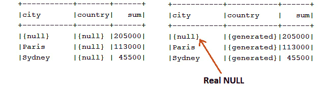

图 13.26 – 无分组（左侧）与分组（右侧）

很可能，`{null}`和`{generated}`对我们的客户来说不会很有吸引力，因此我们可以稍微调整这个查询，使其更加友好，将`{null}`替换为`"未指定"`，将`{generated}`替换为`"-"`，如下所示：

```java
ctx.select(case_().when(grouping(OFFICE.CITY).eq(1), "-")
```

```java
  .else_(isnull(OFFICE.CITY, "Unspecified")).as("city"),
```

```java
 case_().when(grouping(OFFICE.COUNTRY).eq(1), "-")
```

```java
  .else_(isnull(OFFICE.COUNTRY, "Unspecified")).as("country"),
```

```java
  sum(OFFICE.INTERNAL_BUDGET))
```

```java
   .from(OFFICE)
```

```java
   .groupBy(groupingSets(OFFICE.CITY, OFFICE.COUNTRY))
```

```java
  .fetch();
```

在`GROUPING SETS()`旁边，我们有`ROLLUP`和`CUBE`。这两个`GROUP BY`子句的扩展是`GROUPING SETS()`的语法糖。

`ROLLUP`分组是一系列分组集。例如，`GROUP BY ROLLUP (x, y, z)`等价于`GROUP BY GROUPING SETS ((x, y, z), (x, y), (x), ())`。`ROLLUP`通常用于层次数据的聚合，例如按年份 > 季度 > 月份 > 周的销售，或按地区 > 州 > 国家 > 城市的内部预算，如下所示：

```java
ctx.select(
```

```java
   case_().when(grouping(OFFICE.TERRITORY).eq(1), "{generated}")
```

```java
     .else_(OFFICE.TERRITORY).as("territory"),
```

```java
   case_().when(grouping(OFFICE.STATE).eq(1), "{generated}")
```

```java
     .else_(OFFICE.STATE).as("state"),
```

```java
   case_().when(grouping(OFFICE.COUNTRY).eq(1), "{generated}")
```

```java
     .else_(OFFICE.COUNTRY).as("country"),
```

```java
   case_().when(grouping(OFFICE.CITY).eq(1), "{generated}")
```

```java
     .else_(OFFICE.CITY).as("city"),
```

```java
   sum(OFFICE.INTERNAL_BUDGET))
```

```java
   .from(OFFICE)
```

```java
   .where(OFFICE.COUNTRY.eq("USA"))
```

```java
   .groupBy(rollup(OFFICE.TERRITORY, OFFICE.STATE, 
```

```java
                   OFFICE.COUNTRY, OFFICE.CITY)).fetch();
```

输出如下所示：

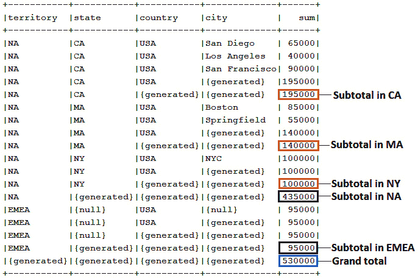

图 13.27 – ROLLUP 输出

与`ROLLUP`类似，`CUBE`分组也可以被视为一系列分组集。然而，`CUBE`计算立方分组表达式的所有排列以及总和。因此，对于*n*个元素，`CUBE`产生 2^n 个分组集。例如，`GROUP BY CUBE (x, y, x)`等价于`GROUP BY GROUPING SETS ((x, y, z), (x, y), (x, z), (y, z), (x), (y), (z), ())`。

让我们应用`CUBE`来计算按州、国家和城市计算办公室内部预算的总和。查询如下所示：

```java
ctx.select(
```

```java
 case_().when(grouping(OFFICE.STATE).eq(1), "{generated}")
```

```java
  .else_(OFFICE.STATE).as("state"),
```

```java
 case_().when(grouping(OFFICE.COUNTRY).eq(1), "{generated}")
```

```java
  .else_(OFFICE.COUNTRY).as("country"),
```

```java
 case_().when(grouping(OFFICE.CITY).eq(1), "{generated}")
```

```java
  .else_(OFFICE.CITY).as("city"),
```

```java
 sum(OFFICE.INTERNAL_BUDGET))
```

```java
  .from(OFFICE)
```

```java
  .where(OFFICE.COUNTRY.eq("USA"))
```

```java
  .groupBy(cube(OFFICE.STATE, OFFICE.COUNTRY, OFFICE.CITY))
```

```java
  .fetch();
```

最后，让我们来谈谈`GROUPING_ID()`函数。这个函数计算通过连接应用于`GROUP BY`子句中所有列的`GROUPING()`函数返回的值的二进制值的十进制等价物。以下是通过 jOOQ 的`groupingId()`使用`GROUPING_ID()`的示例：

```java
ctx.select(
```

```java
 case_().when(grouping(OFFICE.TERRITORY).eq(1), "{generated}")
```

```java
  .else_(OFFICE.TERRITORY).as("territory"),
```

```java
 ...
```

```java
 case_().when(grouping(OFFICE.CITY).eq(1), "{generated}")
```

```java
  .else_(OFFICE.CITY).as("city"),
```

```java
 groupingId(OFFICE.TERRITORY, OFFICE.STATE, OFFICE.COUNTRY, 
```

```java
            OFFICE.CITY).as("grouping_id"),
```

```java
 sum(OFFICE.INTERNAL_BUDGET))
```

```java
   .from(OFFICE)
```

```java
   .where(OFFICE.COUNTRY.eq("USA"))
```

```java
   .groupBy(rollup(OFFICE.TERRITORY, OFFICE.STATE, 
```

```java
                   OFFICE.COUNTRY, OFFICE.CITY))
```

```java
   .fetch();
```

下面的屏幕截图显示了示例输出：

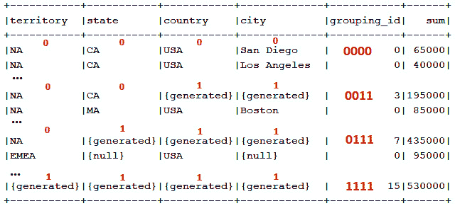

图 13.28 – GROUPING_ID()输出

`GROUPING_ID()`也可以用于`HAVING`来创建条件，如下所示：

```java
… .having(groupingId(OFFICE.TERRITORY, 
```

```java
    OFFICE.STATE, OFFICE.COUNTRY, OFFICE.CITY).eq(3))…
```

完整的查询可以在`GroupingRollupCube`捆绑代码中找到。

# 摘要

与 SQL 函数一起工作真是太有趣了！它们真正提升了 SQL 世界，并允许我们在数据处理过程中解决许多问题。正如你在本章中看到的，jOOQ 提供了对 SQL 函数的全面支持，涵盖了常规函数和聚合函数，到强大的窗口函数，有序集聚合函数（`WITHIN GROUP`）等等。当我们谈论这个话题时，请允许我推荐以下文章作为一篇极佳的阅读材料：[`blog.jooq.org/how-to-find-the-closest-subset-sum-with-sql/`](https://blog.jooq.org/how-to-find-the-closest-subset-sum-with-sql/). 在下一章中，我们将探讨虚拟表（vtables）。
