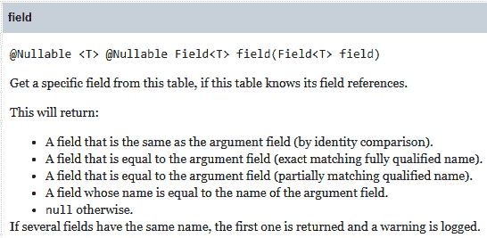
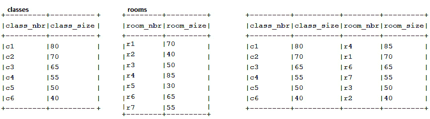

# 第十四章：派生表、CTE 和视图

派生表、**CTE**和视图是 SQL 环境中的重要角色。它们有助于组织和优化长而复杂的查询的重用——通常是基查询和/或昂贵的查询（在性能方面），并通过将代码分解成单独的步骤来提高可读性。主要来说，它们将某个查询与一个名称链接起来，该名称可能存储在模式中。换句话说，它们持有查询文本，当需要时可以通过关联的名称引用和执行这些文本。如果结果具体化，那么数据库引擎可以重用这些缓存的查询结果，否则，每次调用时都必须重新计算。

派生表、CTE 和视图具有特定的特性（包括数据库供应商特定的选项），选择它们取决于用例、涉及的数据和查询、数据库供应商和优化器等。像往常一样，我们从 jOOQ 的角度处理这个话题，因此我们的议程包括以下内容：

+   派生表

+   CTE

+   视图

让我们开始吧！

# 技术要求

本章的代码可以在 GitHub 上找到，链接为[`github.com/PacktPublishing/jOOQ-Masterclass/tree/master/Chapter14`](https://github.com/PacktPublishing/jOOQ-Masterclass/tree/master/Chapter14)。

# 派生表

你是否曾经使用过嵌套的 `SELECT`（在表表达式中的 `SELECT`）？当然，你已经使用了！那么，你已经使用了所谓的*派生表*，其作用域是创建它的语句。大致来说，派生表应该像基表一样处理。换句话说，建议通过 `AS` 操作符给它及其列赋予有意义的名称。这样，你可以无歧义地引用派生表，并且你会尊重这样一个事实：大多数数据库不支持未命名的（未别名的）派生表。

jOOQ 允许我们通过`asTable()`或其同义词`table()`将派生表中的任何`SELECT`转换为表。让我们从一个简单的`SELECT`开始：

```java
select(inline(1).as("one"));
```

这不是一个派生表，但它可以按照以下方式成为派生表（这两个是同义词）：

```java
Table<?> t = select(inline(1).as("one")).asTable();
```

```java
Table<?> t = table(select(inline(1).as("one")));
```

在 jOOQ 中，我们可以通过局部变量`t`进一步引用这个派生表。将`t`声明为`Table<?>`或简单地使用`var`是很方便的。但当然，你也可以显式指定数据类型。这里，`Table<Record1<Integer>>`。

重要提示

`org.jooq.Table`类型可以引用派生表。

现在，结果`t`是一个未命名的派生表，因为它没有与它关联的显式别名。让我们看看当我们从`t`中选择某些内容时会发生什么：

```java
ctx.selectFrom(t).fetch();
```

jOOQ 生成了以下 SQL（我们任意选择了 PostgreSQL 方言）：

```java
SELECT "alias_30260683"."one" 
```

```java
  FROM (SELECT 1 AS "one") AS "alias_30260683"
```

jOOQ 检测到派生表缺少别名，因此它代表我们生成了一个别名（`alias_30260683`）。

重要提示

我们之前提到，大多数数据库供应商要求每个派生表都有一个显式别名。但是，正如你所看到的，jOOQ 允许我们省略这样的别名，并且当我们这样做时，jOOQ 会代表我们生成一个以确保生成的 SQL 在语法上是正确的。生成的别名是一个以`alias_`后缀的随机数字。这个别名不应被显式引用。jOOQ 将内部使用它来生成正确/有效的 SQL。

当然，如果我们明确指定了一个别名，那么 jOOQ 将会使用它：

```java
Table<?> t = select(inline(1).as("one")).asTable("t");
```

```java
Table<?> t = table(select(inline(1).as("one"))).as("t");
```

对应 PostgreSQL 的 SQL 如下所示：

```java
SELECT "t"."one" FROM (SELECT 1 AS "one") AS "t"
```

这里是使用`values()`构造函数的另一个示例：

```java
Table<?> t = values(row(1, "John"), row(2, "Mary"), 
```

```java
                    row(3, "Kelly"))
```

```java
  .as("t", "id", "name"); // or, .asTable("t", "id", "name");
```

通常，当我们明确引用它时，我们会明确指定一个别名，但每次都这样做也没有什么不妥。例如，jOOQ 对于以下内联派生表不需要显式别名，但添加它也没有什么问题：

```java
ctx.select()
```

```java
   .from(EMPLOYEE)
```

```java
   .crossApply(select(count().as("sales_count")).from(SALE)
```

```java
     .where(SALE.EMPLOYEE_NUMBER
```

```java
        .eq(EMPLOYEE.EMPLOYEE_NUMBER)).asTable("t"))
```

```java
   .fetch();
```

jOOQ 依赖于`t`别名而不是生成一个。

## 在局部变量中提取/声明派生表

jOOQ 允许我们在使用它的语句之外提取/声明派生表，在这种情况下，它的存在和角色比在表表达式中嵌套它时更加清晰。

如果我们需要在多个语句中引用派生表，或者需要将其作为动态查询的一部分，或者我们只是想减轻复杂查询的负担，那么在局部变量中提取/声明派生表可能很有用。

例如，考虑以下查询：

```java
ctx.select().from(
```

```java
    select(ORDERDETAIL.PRODUCT_ID, ORDERDETAIL.PRICE_EACH)
```

```java
     .from(ORDERDETAIL)
```

```java
     .where(ORDERDETAIL.QUANTITY_ORDERED.gt(50)))
```

```java
   .innerJoin(PRODUCT)
```

```java
   .on(field(name("price_each")).eq(PRODUCT.BUY_PRICE))
```

```java
   .fetch();
```

突出的子查询代表一个内联派生表。jOOQ 会自动为其关联一个别名，并使用该别名在外层`SELECT`中引用`product_id`和`price_each`列。当然，我们也可以提供显式别名，但这不是必需的：

```java
ctx.select().from(
```

```java
    select(ORDERDETAIL.PRODUCT_ID, ORDERDETAIL.PRICE_EACH)
```

```java
     .from(ORDERDETAIL)
```

```java
.where(ORDERDETAIL.QUANTITY_ORDERED.gt(50))
```

```java
       .asTable("t"))
```

```java
   .innerJoin(PRODUCT)
```

```java
   .on(field(name("t", "price_each")).eq(PRODUCT.BUY_PRICE))
```

```java
   .fetch();
```

这次，jOOQ 依赖于`t`别名而不是生成一个。接下来，让我们将这个子查询添加到另一个查询中，如下所示：

```java
ctx.select(PRODUCT.PRODUCT_LINE, 
```

```java
           PRODUCT.PRODUCT_NAME, field(name("price_each")))
```

```java
   .from(select(ORDERDETAIL.PRODUCT_ID,  
```

```java
           ORDERDETAIL.PRICE_EACH).from(ORDERDETAIL)
```

```java
           .where(ORDERDETAIL.QUANTITY_ORDERED.gt(50)))
```

```java
   .innerJoin(PRODUCT)
```

```java
   .on(field(name("product_id")).eq(PRODUCT.PRODUCT_ID))
```

```java
   .fetch();
```

这个查询在编译时失败，因为`on(field(name("product_id")).eq(PRODUCT.PRODUCT_ID))`中对`product_id`列的引用是模糊的。jOOQ 会自动将生成的别名关联到内联派生表，但它无法确定`product_id`列来自派生表还是来自`PRODUCT`表。可以通过显式添加和使用派生表的别名来解决这个问题：

```java
ctx.select(PRODUCT.PRODUCT_LINE, PRODUCT.PRODUCT_NAME, 
```

```java
           field(name("t", "price_each")))
```

```java
   .from(select(ORDERDETAIL.PRODUCT_ID, 
```

```java
          ORDERDETAIL.PRICE_EACH).from(ORDERDETAIL)
```

```java
          .where(ORDERDETAIL.QUANTITY_ORDERED.gt(50))
```

```java
            .asTable("t"))
```

```java
   .innerJoin(PRODUCT)
```

```java
   .on(field(name("t", "product_id"))
```

```java
     .eq(PRODUCT.PRODUCT_ID))
```

```java
   .fetch();
```

现在，jOOQ 依赖于`t`别名，歧义问题已经解决。或者，我们可以仅将唯一的别名`ORDERDETAIL.PRODUCT_ID`字段显式关联为`select(ORDERDETAIL.PRODUCT_ID.as("pid")…`，并通过这个别名引用它作为`field(name("pid"))…`。

到目前为止，我们有两个具有相同内联派生表的查询。我们可以通过在两个语句中使用它之前在 Java 局部变量中提取这个派生表来避免代码重复。换句话说，我们在 Java 局部变量中声明派生表，并通过这个局部变量在语句中引用它：

```java
Table<?> t = select(
```

```java
     ORDERDETAIL.PRODUCT_ID, ORDERDETAIL.PRICE_EACH)
```

```java
  .from(ORDERDETAIL)
```

```java
  .where(ORDERDETAIL.QUANTITY_ORDERED.gt(50)).asTable("t");
```

因此，`t` 是我们的派生表。运行这段代码没有影响，也不会产生任何 SQL。jOOQ 只有在我们引用 `t` 时才会评估 `t`，但为了评估，`t` 必须在使用它的查询之前声明。这仅仅是 Java；我们只能使用已经声明的变量。当一个查询使用 `t`（例如，通过 `t.field()`）时，jOOQ 会评估 `t` 并生成正确的 SQL。

例如，我们可以使用 `t` 重新编写我们的查询，如下所示：

```java
ctx.select()
```

```java
   .from(t)
```

```java
   .innerJoin(PRODUCT)
```

```java
   .on(t.field(name("price_each"), BigDecimal.class)
```

```java
        .eq(PRODUCT.BUY_PRICE))
```

```java
   .fetch();
```

```java
ctx.select(PRODUCT.PRODUCT_LINE, 
```

```java
           PRODUCT.PRODUCT_NAME, t.field(name("price_each")))
```

```java
   .from(t)
```

```java
   .innerJoin(PRODUCT)
```

```java
   .on(t.field(name("product_id"), Long.class)
```

```java
        .eq(PRODUCT.PRODUCT_ID))
```

```java
   .fetch();
```

但是，为什么这次我们需要在 `on(t.field(name("price_each"), BigDecimal.class)` 和 `.on(t.field(name("product_id"), Long.class)` 中显式指定类型？答案是，字段不能从 `t` 中以类型安全的方式解引用。因此，我们必须指定适当的数据类型。这是一个纯 Java 问题，与 SQL 无关！

但是，有一个技巧可以帮助我们保持类型安全并减少冗余，这个技巧就是使用 `<T> Field<T> field(Field<T> field)` 方法。对这个方法的最佳解释来自 jOOQ 文档本身。以下图是 jOOQ 官方文档的截图：



图 14.1 – <T> Field<T> field(Field<T> field) 方法文档

表达式 `t.field(name("price_each"), …)` 间接引用了字段 `ORDERDETAIL.PRICE_EACH`，而 `t.field(name("product_id"), …)` 间接引用了字段 `ORDERDETAIL.PRODUCT_ID`。因此，根据前面的图示，我们可以以类型安全的方式重新编写我们的查询，如下所示：

```java
ctx.select(PRODUCT.PRODUCT_LINE, PRODUCT.PRODUCT_NAME, 
```

```java
           t.field(ORDERDETAIL.PRICE_EACH))
```

```java
   .from(t)
```

```java
   .innerJoin(PRODUCT)
```

```java
   .on(t.field(ORDERDETAIL.PRODUCT_ID)
```

```java
     .eq(PRODUCT.PRODUCT_ID))
```

```java
   .fetch();
```

```java
ctx.select()
```

```java
   .from(t)
```

```java
   .innerJoin(PRODUCT)
```

```java
   .on(t.field(ORDERDETAIL.PRICE_EACH)
```

```java
     .eq(PRODUCT.BUY_PRICE))
```

```java
   .fetch();
```

太棒了！现在，我们可以以“类型安全”的方式重用 `t`！然而，请注意，<T> Field<T> field(Field<T> field) 看起来是类型安全的。实际上，它和 Java 中的不安全转换一样好，因为查找只考虑标识符，而不是类型。它也不会强制转换表达式。这就是为什么我们在类型安全周围加上引号的原因。

这里是另一个例子，它使用了在派生表中提取的两个 `Field` 以及查询本身：

```java
// fields
```

```java
Field<BigDecimal> avg = avg(ORDERDETAIL.PRICE_EACH).as("avg");
```

```java
Field<Long> ord = ORDERDETAIL.ORDER_ID.as("ord");
```

```java
// derived table
```

```java
Table<?> t = select(avg, ord).from(ORDERDETAIL)
```

```java
    .groupBy(ORDERDETAIL.ORDER_ID).asTable("t");
```

```java
// query
```

```java
ctx.select(ORDERDETAIL.ORDER_ID, ORDERDETAIL
```

```java
          .ORDERDETAIL_ID,ORDERDETAIL.PRODUCT_ID,
```

```java
           ORDERDETAIL.PRICE_EACH)
```

```java
   .from(ORDERDETAIL, t)
```

```java
   .where(ORDERDETAIL.ORDER_ID.eq(ord)
```

```java
     .and(ORDERDETAIL.PRICE_EACH.lt(avg)))
```

```java
   .orderBy(ORDERDETAIL.ORDER_ID)
```

```java
   .fetch();
```

在这里，`ord` 和 `avg` 被表示为非限定形式（没有使用派生表别名作为前缀）。但是，由于 `<T> Field<T> field(Field<T> field)` 方法，我们可以获得限定版本：

```java
...where(ORDERDETAIL.ORDER_ID.eq(t.field(ord))        
```

```java
   .and(ORDERDETAIL.PRICE_EACH.lt(t.field(avg))))  
```

```java
...
```

接下来，让我们看看一个使用 `fields()` 和 `asterisk()` 来引用在局部变量中提取的派生表所有列的示例：

```java
Table<?> t = ctx.select(SALE.EMPLOYEE_NUMBER, 
```

```java
                 count(SALE.SALE_).as("sales_count"))
```

```java
   .from(SALE).groupBy(SALE.EMPLOYEE_NUMBER).asTable("t");
```

```java
ctx.select(t.fields()).from(t)
```

```java
   .orderBy(t.field(name("sales_count"))).fetch();
```

```java
ctx.select(t.asterisk(), 
```

```java
           EMPLOYEE.FIRST_NAME, EMPLOYEE.LAST_NAME)
```

```java
   .from(EMPLOYEE, t)
```

```java
   .where(EMPLOYEE.EMPLOYEE_NUMBER.eq(
```

```java
          t.field(name("employee_number"), Long.class)))
```

```java
   .orderBy(t.field(name("sales_count"))).fetch();
```

注意，提取子查询并不是将其转换为 `Table` 的强制要求。有些情况下，将其提取为简单的 `SELECT` 就足够了。例如，当子查询不是一个派生表时，我们可以这样做：

```java
ctx.selectFrom(PRODUCT)
```

```java
   .where(row(PRODUCT.PRODUCT_ID, PRODUCT.BUY_PRICE).in(
```

```java
     select(ORDERDETAIL.PRODUCT_ID, ORDERDETAIL.PRICE_EACH)
```

```java
       .from(ORDERDETAIL)
```

```java
       .where(ORDERDETAIL.QUANTITY_ORDERED.gt(50))))
```

```java
   .fetch();
```

这个子查询（它不是一个派生表）可以局部提取并像这样使用：

```java
// SelectConditionStep<Record2<Long, BigDecimal>>
```

```java
var s = select(
```

```java
      ORDERDETAIL.PRODUCT_ID, ORDERDETAIL.PRICE_EACH)
```

```java
   .from(ORDERDETAIL)
```

```java
   .where(ORDERDETAIL.QUANTITY_ORDERED.gt(50));
```

```java
ctx.selectFrom(PRODUCT)
```

```java
   .where(row(PRODUCT.PRODUCT_ID, PRODUCT.BUY_PRICE).in(s))
```

```java
   .fetch();
```

不需要别名（jOOQ 知道这不是一个派生表，不需要别名，因此它不会生成一个）也不需要将其转换为 `Table`。实际上，jOOQ 非常灵活，甚至允许我们这样做：

```java
var t = select(ORDERDETAIL.PRODUCT_ID, ORDERDETAIL.PRICE_EACH)
```

```java
   .from(ORDERDETAIL)
```

```java
   .where(ORDERDETAIL.QUANTITY_ORDERED.gt(50));
```

```java
ctx.select(PRODUCT.PRODUCT_LINE, PRODUCT.PRODUCT_NAME,  
```

```java
           t.field(ORDERDETAIL.PRICE_EACH))
```

```java
   .from(t)
```

```java
   .innerJoin(PRODUCT)
```

```java
   .on(t.field(ORDERDETAIL.PRODUCT_ID)
```

```java
   .eq(PRODUCT.PRODUCT_ID))
```

```java
   .fetch();
```

```java
ctx.select()
```

```java
   .from(t)
```

```java
   .innerJoin(PRODUCT)
```

```java
   .on(t.field(ORDERDETAIL.PRICE_EACH)
```

```java
   .eq(PRODUCT.BUY_PRICE))
```

```java
   .fetch();
```

请放心，jOOQ 不会要求您将 `t` 转换为 `Table`。jOOQ 推断这是一个派生表，并按照预期在渲染的 SQL 中关联和引用一个生成的别名。因此，只要您不想将显式别名关联到派生表，并且 jOOQ 在您的查询中不特别要求 `Table` 实例，就没有必要将提取的 `SELECT` 转换为 `Table` 实例。当您需要一个 `Table` 实例但不需要为其指定别名时，只需使用不带参数的 `asTable()` 方法：

```java
Table<?> t = select(
```

```java
       ORDERDETAIL.PRODUCT_ID, ORDERDETAIL.PRICE_EACH)
```

```java
   .from(ORDERDETAIL)
```

```java
   .where(ORDERDETAIL.QUANTITY_ORDERED.gt(50)).asTable();
```

您可以查看这些示例以及其他在 *DerivedTable* 中的示例。

# 探索 jOOQ 中的常见表表达式 (CTEs)

CTEs 通过 SQL-99 的 `WITH` 子句来表示。您已经在之前的章节中看到了几个 CTE 的例子，例如，在 *第十三章* *利用 SQL 函数* 中，您看到了一个用于计算 z 分数的 CTE。

大致来说，通过 CTEs，我们将本应作为派生表重复的代码提取出来。通常，一个 CTE 包含一系列派生表，这些表按照一定顺序放置在 `SELECT` 语句之前。顺序很重要，因为这些派生表是按照这个顺序创建的，并且一个 CTE 元素只能引用之前的 CTE 元素。

基本上，我们区分常规（非递归）CTEs 和递归 CTEs。

## 常规 CTEs

常规 CTE 将名称与具有类似于 `SELECT`、`INSERT`、`UPDATE`、`DELETE` 或 `MERGE`（DML 语句的 CTE 是非常有用的特定供应商扩展）语句作用域的临时结果集相关联。但是，派生表或其他类型的子查询也可以有自己的 CTE，例如 `SELECT x.a FROM (WITH t (a) AS (SELECT 1) SELECT a FROM t) x`。

CTE 的基本语法如下（有关特定数据库供应商的确切语法，请参阅文档）：

```java
WITH CTE_name [(column_name [, ...])]
```

```java
AS
```

```java
 (CTE_definition) [, ...]
```

```java
SQL_statement_using_CTE;
```

在 jOOQ 中，CTE 由 `org.jooq.CommonTableExpression` 类表示，并扩展了常用的 `org.jooq.Table`，因此 CTE 可以在任何可以使用 `Table` 的地方使用。`CTE_name` 表示在查询中稍后用于引用 CTE 的名称，在 jOOQ 中，可以作为 `name()` 或 `with()` 方法的参数指定。

`column_name` 标记了 `CTE_name` 后跟的逗号分隔的列列表的位置。这里指定的列数必须与 `CTE_definition` 中定义的列数相等。在 jOOQ 中，当使用 `name()` 方法为 `CTE_name` 时，此列表可以通过 `fields()` 方法指定。否则，它可以作为 `with()` 参数的一部分在 `CTE_name` 之后指定。

`AS` 关键字通过 `as(Select<?> select)` 方法在 jOOQ 中表示。因此，`as()` 的参数是 `CTE_definition`。从 jOOQ 3.15 版本开始，`as(ResultQuery<?>)` 方法接受一个 `ResultQuery<?>`，允许在 PostgreSQL 中将 `INSERT ... RETURNING` 和其他 `DML ... RETURNING` 语句作为 CTE 使用。

最后，我们有使用 CTE 并通过`CTE_name`引用它的 SQL。

例如，以下名为`cte_sales`的 CTE 计算每个员工的销售额总和：

```java
CommonTableExpression<Record2<Long, BigDecimal>> t 
```

```java
   = name("cte_sales").fields("employee_nr", "sales")
```

```java
       .as(select(SALE.EMPLOYEE_NUMBER, sum(SALE.SALE_))
```

```java
       .from(SALE).groupBy(SALE.EMPLOYEE_NUMBER));
```

这是可以通过 jOOQ 中的局部变量`t`引用的 CTE 声明。现在运行此代码片段不会执行`SELECT`也不会产生任何效果。一旦我们在 SQL 查询中使用`t`，jOOQ 将评估它以渲染预期的 CTE。该 CTE 将由数据库执行。

正如在局部变量中声明派生表的情况下一样，在 CTE 的情况下，字段不能以类型安全的方式从`t`中解引用，因此我们需要在使用 CTE 的查询中指定适当的数据类型。再次强调，这是一个纯 Java 问题，与 SQL 无关！

Lukas Eder 分享了以下内容：*关于在解引用 CTE 或派生表字段时缺乏类型安全：这通常是重新编写 SQL 语句的机会，使其不再使用 CTE。在 Stack Overflow 上，我看到了许多案例，其中人们试图将*所有内容*放入多层令人困惑的 CTE 中，而实际分解的查询可能要简单得多（例如，如果他们知道窗口函数，或正确的操作逻辑顺序等）。仅仅因为你可以使用 CTE，并不意味着你必须在*每个地方*都使用它们。

因此，这里是一个使用我们的 CTE（公用表表达式），`t`，来获取销售额最高的员工的例子：

```java
ctx.with(t)
```

```java
   .select() // or, .select(t.field("employee_nr"),  
```

```java
             //             t.field("sales"))
```

```java
   .from(t)
```

```java
   .where(t.field("sales", Double.class)
```

```java
      .eq(select(max(t.field("sales" ,Double.class)))
```

```java
           .from(t))).fetch();
```

通过将 CTE 字段提取为局部变量，我们可以将我们的 CTE 声明重写如下：

```java
Field<Long> e = SALE.EMPLOYEE_NUMBER;
```

```java
Field<BigDecimal> s = sum(SALE.SALE_);
```

```java
CommonTableExpression<Record2<Long, BigDecimal>> t 
```

```java
 = name("cte_sales").fields(e.getName(), s.getName())
```

```java
    .as(select(e, s).from(SALE).groupBy(e));
```

使用此 CTE 的 SQL 如下：

```java
ctx.with(t)
```

```java
   .select() // or, .select(t.field(e.getName()), 
```

```java
             //             t.field(s.getName()))
```

```java
   .from(t)
```

```java
   .where(t.field(s.getName(), s.getType())
```

```java
      .eq(select(max(t.field(s.getName(), s.getType())))
```

```java
           .from(t))).fetch();
```

当然，依靠上一节中引入的`<T> Field<T> field`，我们可以编写如下类型安全的 CTE：

```java
ctx.with(t)
```

```java
   .select() // or, .select(t.field(e), t.field(s))
```

```java
   .from(t)
```

```java
   .where(t.field(s)
```

```java
           .eq(select(max(t.field(s))).from(t))).fetch();
```

作为之前显式 CTE 的替代，我们可以编写如下内联 CTE：

```java
ctx.with("cte_sales", "employee_nr", "sales")
```

```java
   .as(select(SALE.EMPLOYEE_NUMBER, sum(SALE.SALE_))
```

```java
   .from(SALE)
```

```java
   .groupBy(SALE.EMPLOYEE_NUMBER))
```

```java
   .select() // or, field(name("employee_nr")),  
```

```java
             //     field(name("sales"))
```

```java
   .from(name("cte_sales"))
```

```java
   .where(field(name("sales"))
```

```java
      .eq(select(max(field(name("sales"))))
```

```java
   .from(name("cte_sales")))).fetch();
```

通过任意选择 PostgreSQL 方言，我们为所有之前的 CTE 渲染了以下 SQL：

```java
WITH "cte_sales"("employee_nr", "sales") AS
```

```java
  (SELECT "public"."sale"."employee_number",
```

```java
          sum("public"."sale"."sale")
```

```java
   FROM "public"."sale"
```

```java
   GROUP BY "public"."sale"."employee_number")
```

```java
SELECT * FROM "cte_sales"
```

```java
WHERE "sales" = (SELECT max("sales") FROM "cte_sales")
```

你可以在名为*CteSimple*的捆绑代码中检查这些示例。到目前为止，我们的 CTE 仅用于`SELECT`语句。但是，CTE 也可以用于 DML 语句，如`INSERT`、`UPDATE`、`DELETE`和`MERGE`。

### 作为 SELECT 和 DML 的 CTE

jOOQ 支持在`INSERT`、`UPDATE`、`DELETE`和`MERGE`中使用 CTE。例如，以下代码片段将随机部分从`SALE`表插入到一个全新的表中：

```java
ctx.createTableIfNotExists("sale_training").as(
```

```java
      selectFrom(SALE)).withNoData().execute();
```

```java
ctx.with("training_sale_ids", "sale_id")
```

```java
   .as(select(SALE.SALE_ID).from(SALE)
```

```java
       .orderBy(rand()).limit(10))
```

```java
   .insertInto(table(name("sale_training")))
```

```java
     .select(select().from(SALE).where(SALE.SALE_ID.notIn(
```

```java
      select(field(name("sale_id"), Long.class))
```

```java
        .from(name("training_sale_ids")))))
```

```java
   .execute();
```

这里还有一个例子，它通过在`UPDATE`中使用 CTE 将产品的价格（`PRODUCT.BUY_PRICE`）更新为最大订单价格（`max(ORDERDETAIL.PRICE_EACH)`）：

```java
ctx.with("product_cte", "product_id", "max_buy_price")
```

```java
   .as(select(ORDERDETAIL.PRODUCT_ID, 
```

```java
              max(ORDERDETAIL.PRICE_EACH))
```

```java
         .from(ORDERDETAIL)
```

```java
         .groupBy(ORDERDETAIL.PRODUCT_ID))
```

```java
   .update(PRODUCT)
```

```java
     .set(PRODUCT.BUY_PRICE, coalesce(field(
```

```java
     select(field(name("max_buy_price"), BigDecimal.class))
```

```java
       .from(name("product_cte"))
```

```java
       .where(PRODUCT.PRODUCT_ID.eq(
```

```java
          field(name("product_id"), Long.class)))),  
```

```java
          PRODUCT.BUY_PRICE)).execute();
```

你可以练习这些示例，包括在*CteSelectDml*中使用 CTE 在`DELETE`和`MERGE`，以及其他示例。接下来，让我们看看如何在 PostgreSQL 中将 CTE 作为 DML 来表示。

### 作为 DML 的 CTE

从 jOOQ 3.15 版本开始，CTE `as(ResultQuery<?>)` 方法接受一个 `ResultQuery<?>`，以便在 PostgreSQL 中使用 `INSERT ... RETURNING` 和其他 `DML … RETURNING` 语句作为 CTE。以下是一个简单的 CTE，用于存储返回的 `SALE_ID`：

```java
ctx.with("cte", "sale_id")
```

```java
   .as(insertInto(SALE, SALE.FISCAL_YEAR, SALE.SALE_, 
```

```java
                  SALE.EMPLOYEE_NUMBER, SALE.FISCAL_MONTH, 
```

```java
                  SALE.REVENUE_GROWTH)
```

```java
   .values(2005, 1250.55, 1504L, 1, 0.0)
```

```java
   .returningResult(SALE.SALE_ID))
```

```java
   .selectFrom(name("cte"))
```

```java
   .fetch();
```

让我们编写一个 CTE 来更新所有具有 null `EMPLOYEE.COMMISSION`的员工的 `SALE.REVENUE_GROWTH`。所有更新的 `SALE.EMPLOYEE_NUMBER` 都存储在 CTE 中，并进一步用于插入 `EMPLOYEE_STATUS`，如下所示：

```java
ctx.with("cte", "employee_number")
```

```java
 .as(update(SALE).set(SALE.REVENUE_GROWTH, 0.0)
```

```java
   .where(SALE.EMPLOYEE_NUMBER.in(
```

```java
     select(EMPLOYEE.EMPLOYEE_NUMBER).from(EMPLOYEE)
```

```java
      .where(EMPLOYEE.COMMISSION.isNull())))
```

```java
   .returningResult(SALE.EMPLOYEE_NUMBER))
```

```java
 .insertInto(EMPLOYEE_STATUS, EMPLOYEE_STATUS
```

```java
             .EMPLOYEE_NUMBER,EMPLOYEE_STATUS.STATUS, 
```

```java
              EMPLOYEE_STATUS.ACQUIRED_DATE)
```

```java
 .select(select(field(name("employee_number"), Long.class), 
```

```java
    val("REGULAR"), val(LocalDate.now())).from(name("cte")))
```

```java
 .execute();
```

你可以在名为 *CteDml* 的捆绑代码中查看更多示例，用于 PostgreSQL。接下来，让我们看看如何在 CTE 中嵌入普通 SQL。

### CTE 和普通 SQL

在 CTE 中使用普通 SQL 很简单，如下例所示：

```java
CommonTableExpression<Record2<Long, String>>cte = name("cte")
```

```java
 .fields("pid", "ppl").as(resultQuery(
```

```java
    // Put any plain SQL statement here
```

```java
    """
```

```java
    select "public"."product"."product_id", 
```

```java
           "public"."product"."product_line" 
```

```java
    from "public"."product" 
```

```java
    where "public"."product"."quantity_in_stock" > 0
```

```java
    """
```

```java
  ).coerce(field("pid", BIGINT), field("ppl", VARCHAR)));
```

```java
Result<Record2<Long, String>> result = 
```

```java
   ctx.with(cte).selectFrom(cte).fetch();
```

你可以在名为 *CtePlainSql* 的捆绑代码中测试此示例。接下来，让我们解决一些常见的 CTE 类型，并继续使用两个或更多 CTE 的查询。

### 连接 CTE

有时，一个查询必须利用多个 CTE。例如，让我们考虑 `PRODUCTLINE`、`PRODUCT` 和 `ORDERDETAIL` 表。我们的目标是获取每个产品线的一些信息（例如，描述），产品总数和总销售额。为此，我们可以编写一个 CTE，将 `PRODUCTLINE` 与 `PRODUCT` 连接起来，并计算每个产品线的总产品数，另一个 CTE 将 `PRODUCT` 与 `ORDERDETAIL` 连接起来，并计算每个产品线的总销售额。然后，这两个 CTE 在 `SELECT` 中使用，以获取以下内联 CTE 中的最终结果：

```java
ctx.with("cte_productline_counts")
```

```java
     .as(select(PRODUCT.PRODUCT_LINE, PRODUCT.CODE,
```

```java
          count(PRODUCT.PRODUCT_ID).as("product_count"),
```

```java
          PRODUCTLINE.TEXT_DESCRIPTION.as("description"))
```

```java
         .from(PRODUCTLINE).join(PRODUCT).onKey()
```

```java
         .groupBy(PRODUCT.PRODUCT_LINE, PRODUCT.CODE, 
```

```java
                  PRODUCTLINE.TEXT_DESCRIPTION))
```

```java
     .with("cte_productline_sales")
```

```java
       .as(select(PRODUCT.PRODUCT_LINE,
```

```java
             sum(ORDERDETAIL.QUANTITY_ORDERED
```

```java
               .mul(ORDERDETAIL.PRICE_EACH)).as("sales"))
```

```java
             .from(PRODUCT).join(ORDERDETAIL).onKey()
```

```java
       .groupBy(PRODUCT.PRODUCT_LINE))
```

```java
     .select(field(name("cte_productline_counts", 
```

```java
        "product_line")), field(name("code")),
```

```java
        field(name("product_count")),
```

```java
        field(name("description")),
```

```java
        field(name("sales")))
```

```java
     .from(name("cte_productline_counts"))
```

```java
     .join(name("cte_productline_sales"))
```

```java
     .on(field(name("cte_productline_counts", 
```

```java
               "product_line"))
```

```java
       .eq(field(name("cte_productline_sales", 
```

```java
                      "product_line"))))
```

```java
     .orderBy(field(name("cte_productline_counts", 
```

```java
                         "product_line")))
```

```java
     .fetch();
```

在捆绑的代码（*CteSimple*）中，你可以看到显式的 CTE 版本。

### 嵌套 CTE

CTE 也可以嵌套。例如，这里我们有一个“基础”CTE，计算每个办公室的员工平均工资。接下来的两个 CTE 分别从“基础”CTE 中获取最小和最大平均值。最后，我们的查询交叉连接这些 CTE：

```java
ctx.with("avg_per_office")
```

```java
   .as(select(EMPLOYEE.OFFICE_CODE.as("office"),
```

```java
          avg(EMPLOYEE.SALARY).as("avg_salary_per_office"))
```

```java
        .from(EMPLOYEE)
```

```java
        .groupBy(EMPLOYEE.OFFICE_CODE))
```

```java
   .with("min_salary_office")
```

```java
   .as(select(min(field(name("avg_salary_per_office")))
```

```java
          .as("min_avg_salary_per_office"))
```

```java
        .from(name("avg_per_office")))
```

```java
   .with("max_salary_office")
```

```java
   .as(select(max(field(name("avg_salary_per_office")))
```

```java
          .as("max_avg_salary_per_office"))
```

```java
        .from(name("avg_per_office")))
```

```java
   .select()
```

```java
        .from(name("avg_per_office"))
```

```java
        .crossJoin(name("min_salary_office"))
```

```java
        .crossJoin(name("max_salary_office"))
```

```java
   .fetch();
```

潜在的输出显示在下图中：

![Figure 14.2 – 嵌套 CTE 示例的输出]

![img/B16833_Figure_14.2.jpg]

Figure 14.2 – 嵌套 CTE 示例的输出

在捆绑的代码（*CteSimple*）中，你可以看到显式的 CTE 版本。

一些数据库（例如，MySQL 和 PostgreSQL）允许你通过 `FROM` 子句嵌套 CTE。以下是一个示例：

```java
ctx.with("t2")
```

```java
   .as(select(avg(field("sum_min_sal", Float.class))
```

```java
           .as("avg_sum_min_sal")).from(
```

```java
        with("t1")
```

```java
           .as(select(min(EMPLOYEE.SALARY).as("min_sal"))
```

```java
                .from(EMPLOYEE)
```

```java
                .groupBy(EMPLOYEE.OFFICE_CODE)).select(
```

```java
                   sum(field("min_sal", Float.class))
```

```java
                       .as("sum_min_sal"))
```

```java
                     .from(name("t1"))
```

```java
                     .groupBy(field("min_sal"))))
```

```java
   .select()
```

```java
   .from(name("t2"))
```

```java
   .fetch(); 
```

因此，这是一个三步查询：首先，我们计算每个办公室的最低工资；其次，我们计算每个最低工资的工资总和；最后，我们计算这些总和的平均值。

### 物化 CTE

你有一个昂贵的 CTE，它检索一个相对较小的结果集，并且被使用两次或更多次？那么，你很可能有一个你可能想要物化的 CTE。然后，物化 CTE 可以被父查询多次引用，而无需重新计算结果。

在 jOOQ 中，可以通过 `asMaterialized()` 方法物化一个 CTE。根据数据库的不同，jOOQ 将渲染适当的 SQL。例如，考虑以下物化 CTE：

```java
ctx.with("cte", "customer_number", 
```

```java
         "order_line_number", "sum_price", "sum_quantity") 
```

```java
   .asMaterialized(
```

```java
           select(ORDER.CUSTOMER_NUMBER, 
```

```java
                  ORDERDETAIL.ORDER_LINE_NUMBER,
```

```java
                  sum(ORDERDETAIL.PRICE_EACH),
```

```java
                  sum(ORDERDETAIL.QUANTITY_ORDERED))
```

```java
               .from(ORDER)
```

```java
               .join(ORDERDETAIL)
```

```java
               .on(ORDER.ORDER_ID.eq(ORDERDETAIL.ORDER_ID))
```

```java
               .groupBy(ORDERDETAIL.ORDER_LINE_NUMBER, 
```

```java
                        ORDER.CUSTOMER_NUMBER))
```

```java
   .select(field(name("customer_number")), 
```

```java
      inline("Order Line Number").as("metric"),
```

```java
      field(name("order_line_number"))).from(name("cte")) // 1
```

```java
   .unionAll(select(field(name("customer_number")), 
```

```java
      inline("Sum Price").as("metric"),
```

```java
      field(name("sum_price"))).from(name("cte")))        // 2 
```

```java
   .unionAll(select(field(name("customer_number")),  
```

```java
      inline("Sum Quantity").as("metric"),
```

```java
      field(name("sum_quantity"))).from(name("cte")))     // 3 
```

```java
   .fetch();
```

这个 CTE 应该被评估三次（在代码中用 //1、//2 和 //3 表示）。希望借助 `asMaterialized()`，CTE 的结果应该被物化并重用，而不是重新计算。

一些数据库会检测到一个 CTE 被多次使用（外层查询中多次引用 `WITH` 子句）并自动尝试将结果集物化为一个优化屏障。例如，即使我们没有使用 `asMaterialized()`，仅仅使用 `as()`，PostgreSQL 也会物化上述 CTE，因为 `WITH` 查询被调用了三次。

但是，PostgreSQL 允许我们控制 CTE 的物化并改变默认行为。如果我们想强制内联 CTE 而不是物化它，那么我们就在 CTE 中添加 `NOT MATERIALIZED` 提示。在 jOOQ 中，这是通过 `asNotMaterialized()` 实现的：

```java
ctx.with("cte", "customer_number", 
```

```java
         "order_line_number", "sum_price", "sum_quantity") 
```

```java
   .asNotMaterialized(select(ORDER.CUSTOMER_NUMBER, 
```

```java
                      ORDERDETAIL.ORDER_LINE_NUMBER, ...
```

另一方面，在 Oracle 中，我们可以通过 `/*+ materialize */` 和 `/*+ inline */` 提示来控制物化。使用 jOOQ 的 `asMaterialized()` 生成 `/*+ materialize */` 提示，而 `asNotMaterialized()` 生成 `/*+ inline */` 提示。使用 jOOQ 的 `as()` 不会生成任何提示，因此 Oracle 的优化器可以自由地按照默认行为操作。

然而，Lukas Eder 说：*请注意，Oracle 的提示信息并未文档化，因此它们可能会改变（尽管所有可能的 Oracle 大师博客都记录了它们的实际功能，因此了解 Oracle，它们不会轻易改变）。如果没有明确记录，任何 *物化技巧* 的 *保证* 都是不存在的。*

其他数据库根本不支持物化，或者只将其用作优化器的内部机制（例如，MySQL）。使用 jOOQ 的 `as()`、`asMaterialized()` 和 `asNotMaterialized()` 在 MySQL 中生成相同的 SQL，因此我们无法依赖于显式的物化。在这种情况下，我们可以尝试重写我们的 CTE 以避免重复调用。例如，之前的 CTE 可以通过 `LATERAL` 优化，在 MySQL 中无需物化：

```java
ctx.with("cte")
```

```java
 .as(
```

```java
   select(ORDER.CUSTOMER_NUMBER, 
```

```java
          ORDERDETAIL.ORDER_LINE_NUMBER,
```

```java
          sum(ORDERDETAIL.PRICE_EACH).as("sum_price"),
```

```java
          sum(ORDERDETAIL.QUANTITY_ORDERED)
```

```java
              .as("sum_quantity"))
```

```java
    .from(ORDER)
```

```java
    .join(ORDERDETAIL)
```

```java
      .on(ORDER.ORDER_ID.eq(ORDERDETAIL.ORDER_ID))
```

```java
    .groupBy(ORDERDETAIL.ORDER_LINE_NUMBER, 
```

```java
             ORDER.CUSTOMER_NUMBER))
```

```java
 .select(field(name("customer_number")),
```

```java
   field(name("t", "metric")), field(name("t", "value")))
```

```java
    .from(table(name("cte")), lateral(
```

```java
      select(inline("Order Line Number").as("metric"),
```

```java
       field(name("order_line_number")).as("value"))
```

```java
      .unionAll(select(inline("Sum Price").as("metric"),
```

```java
        field(name("sum_price")).as("value")))
```

```java
      .unionAll(select(inline("Sum Quantity").as("metric"),
```

```java
        field(name("sum_quantity")).as("value"))))
```

```java
 .as("t")).fetch();
```

这里是 SQL Server 的替代方案（类似于 MySQL，SQL Server 不公开任何对显式物化的支持；然而，有一个提案建议微软添加一个类似于 Oracle 的专用提示），使用 `CROSS APPLY` 和 `VALUES` 构造函数：

```java
ctx.with("cte")
```

```java
 .as(select(ORDER.CUSTOMER_NUMBER, 
```

```java
            ORDERDETAIL.ORDER_LINE_NUMBER,
```

```java
            sum(ORDERDETAIL.PRICE_EACH).as("sum_price"),
```

```java
            sum(ORDERDETAIL.QUANTITY_ORDERED)
```

```java
                .as("sum_quantity"))
```

```java
 .from(ORDER)
```

```java
 .join(ORDERDETAIL)
```

```java
   .on(ORDER.ORDER_ID.eq(ORDERDETAIL.ORDER_ID))
```

```java
 .groupBy(ORDERDETAIL.ORDER_LINE_NUMBER, 
```

```java
          ORDER.CUSTOMER_NUMBER))
```

```java
 .select(field(name("customer_number")),
```

```java
    field(name("t", "metric")), field(name("t", "value")))
```

```java
 .from(name("cte")).crossApply(
```

```java
   values(row("Order Line Number",
```

```java
          field(name("cte", "order_line_number"))),
```

```java
     row("Sum Price", field(name("cte", "sum_price"))),
```

```java
     row("Sum Quantity", field(name("cte", "sum_quantity"))))
```

```java
      .as("t", "metric", "value")).fetch();
```

一个优秀的基于成本的优化器应该始终将所有 SQL 语句重写为最优执行计划，因此今天可能有效的方法，明天可能就不适用了——例如这个 `LATERAL`/`CROSS APPLY` 的小技巧。如果优化器足够聪明，能够检测到 `LATERAL`/`CROSS APPLY` 是不必要的（例如，由于缺乏相关性），那么它可能（应该是）被消除。

您可以在*CteSimple*中查看所有这些示例。此外，在*CteAggRem*应用程序中，您可以练习一个 CTE，用于计算前 N 项并汇总（求和）剩余项到单独的行中。基本上，虽然数据库中排名项以计算前 N 项或后 N 项是一个常见问题，但与此相关的一个常见要求是获取所有其他行（不包含在前 N 项或后 N 项中的行）到单独的行中。这在呈现数据时提供完整上下文很有帮助。

在*CteWMAvg*代码中，您可以查看一个以突出显示最近点为主要目标的统计问题。这个问题被称为**加权移动平均**（**WMA**）。这是移动平均家族的一部分([`en.wikipedia.org/wiki/Moving_average`](https://en.wikipedia.org/wiki/Moving_average))，简而言之，WMA 是一种移动平均，其中滑动窗口中的先前值（点）具有不同的（分数）权重。

## 递归 CTE

除了常规 CTE 之外，我们还有递归 CTE。

简而言之，递归 CTE 重现了编程中 for 循环的概念。递归 CTE 可以通过引用自身来处理和探索层次数据。在递归 CTE 背后，有两个主要成员：

+   *锚定*成员 – 其目标是选择涉及递归步骤的起始行。

+   *递归*成员 – 其目标是生成 CTE 的行。第一次迭代步骤针对锚定行，而第二次迭代步骤针对递归步骤中先前创建的行。此成员出现在 CTE 定义部分的`UNION ALL`之后。更准确地说，`UNION ALL`是某些方言所必需的，但其他方言也可以使用`UNION`进行递归，语义略有不同。

在 jOOQ 中，递归 CTE 可以通过`withRecursive()`方法表达。

这是一个简单的递归 CTE，用于计算著名的斐波那契数。*锚定*成员等于 1，*递归*成员应用斐波那契公式直到数字 20：

```java
ctx.withRecursive("fibonacci", "n", "f", "f1")
```

```java
   .as(select(inline(1L), inline(0L), inline(1L))
```

```java
   .unionAll(select(field(name("n"), Long.class).plus(1),
```

```java
     field(name("f"), Long.class).plus(field(name("f1"))),
```

```java
     field(name("f"), Long.class))
```

```java
   .from(name("fibonacci"))
```

```java
   .where(field(name("n")).lt(20))))
```

```java
   .select(field(name("n")), field(name("f")).as("f_nbr"))
```

```java
   .from(name("fibonacci"))
```

```java
   .fetch();
```

嗯，这很简单，不是吗？接下来，让我们解决一个可以通过递归 CTE 解决的问题，即著名的旅行商问题。更多详细信息请参阅：[`en.wikipedia.org/wiki/Travelling_salesman_problem`](https://en.wikipedia.org/wiki/Travelling_salesman_problem)。简而言之，我们将这个问题解释为通过代表我们办公室位置的几个城市找到最短私人航班。基本上，在`OFFICE_FLIGHTS`中，我们有我们办公室之间的路线，作为`OFFICE_FLIGHTS.DEPART_TOWN`、`OFFICE_FLIGHTS.ARRIVAL_TOWN`和`OFFICE_FLIGHTS.DISTANCE_KM`。例如，我们的 CTE 将使用*洛杉矶*作为其锚定城市，然后递归遍历每个其他城市以到达*东京*：

```java
String from = "Los Angeles";
```

```java
String to = "Tokyo";
```

```java
ctx.withRecursive("flights", 
```

```java
      "arrival_town", "steps", "total_distance_km", "path")
```

```java
 .as(selectDistinct(OFFICE_FLIGHTS.DEPART_TOWN
```

```java
   .as("arrival_town"), inline(0).as("steps"), inline(0)
```

```java
   .as("total_distance_km"), cast(from, SQLDataType.VARCHAR)
```

```java
   .as("path"))
```

```java
 .from(OFFICE_FLIGHTS)
```

```java
 .where(OFFICE_FLIGHTS.DEPART_TOWN.eq(from))
```

```java
 .unionAll(select(field(name("arrivals", "arrival_town"), 
```

```java
            String.class), field(name("flights", "steps"), 
```

```java
            Integer.class).plus(1), field(name("flights", 
```

```java
            "total_distance_km"), Integer.class).plus(
```

```java
            field(name("arrivals", "distance_km"))),
```

```java
            concat(field(name("flights", "path")),inline(","), 
```

```java
            field(name("arrivals", "arrival_town"))))
```

```java
          .from(OFFICE_FLIGHTS.as("arrivals"),  
```

```java
            table(name("flights")))
```

```java
          .where(field(name("flights", "arrival_town"))
```

```java
           .eq(field(name("arrivals", "depart_town")))
```

```java
            .and(field(name("flights", "path"))
```

```java
             .notLike(concat(inline("%"),
```

```java
              field(name("arrivals", "arrival_town")),
```

```java
               inline("%")))))))
```

```java
          .select()
```

```java
            .from(name("flights"))
```

```java
            .where(field(name("arrival_town")).eq(to))
```

```java
            .orderBy(field(name("total_distance_km")))
```

```java
 .fetch();
```

下一个图中显示了一些可能的输出：


图 14.3 – 从洛杉矶到东京的最短私人航班，18,983 公里

你可以在*CteRecursive*中练习这些示例。

## CTE 和窗口函数

在本节中，让我们看看两个结合 CTE 和窗口函数的示例，让我们从一个计算 ID 间隔的示例开始。例如，每个`EMPLOYEE`都有一个相关的`EMPLOYEE_NUMBER`，我们想知道数据值中缺失了多少个值（缺失的`EMPLOYEE_NUMBER`），以及有多少现有值是连续的。这是`ROW_NUMBER()`窗口和以下 CTE 的工作：

```java
ctx.with("t", "data_val", "data_seq", "absent_data_grp")
```

```java
   .as(select(EMPLOYEE.EMPLOYEE_NUMBER,
```

```java
       rowNumber().over()
```

```java
         .orderBy(EMPLOYEE.EMPLOYEE_NUMBER)))
```

```java
       EMPLOYEE.EMPLOYEE_NUMBER.minus(
```

```java
       rowNumber().over()
```

```java
          .orderBy(EMPLOYEE.EMPLOYEE_NUMBER)))
```

```java
       .from(EMPLOYEE))
```

```java
   .select(field(name("absent_data_grp")), count(),
```

```java
       min(field(name("data_val"))).as("start_data_val"))
```

```java
   .from(name("t"))
```

```java
   .groupBy(field(name("absent_data_grp")))
```

```java
   .orderBy(field(name("absent_data_grp")))
```

```java
   .fetch();
```

虽然你可以在捆绑的代码中看到这个示例，但让我们看看另一个通过订单值找到每个产品线百分位排名的示例：

```java
ctx.with("t", "product_line", "sum_price_each")
```

```java
   .as(select(PRODUCT.PRODUCT_LINE, 
```

```java
          sum(ORDERDETAIL.PRICE_EACH))
```

```java
        .from(PRODUCT)
```

```java
        .join(ORDERDETAIL)
```

```java
          .on(PRODUCT.PRODUCT_ID.eq(ORDERDETAIL.PRODUCT_ID))
```

```java
        .groupBy(PRODUCT.PRODUCT_LINE))
```

```java
   .select(field(name("product_line")),  
```

```java
           field(name("sum_price_each")),
```

```java
           round(percentRank().over()
```

```java
           .orderBy(field(name("sum_price_each"))).mul(100), 2)
```

```java
           .concat("%").as("percentile_rank"))
```

```java
   .from(name("t"))
```

```java
   .fetch();
```

你可以在*CteWf*中找到这些示例，以及另一个每年找到价值最高的三个订单的示例。

## 使用 CTE 生成数据

CTE 在生成数据方面非常方便——它们作为使用 CTE 的 SQL 语句的数据源。例如，使用 CTE 和`VALUES`构造函数可以这样做：

```java
ctx.with("dt")
```

```java
   .as(select()
```

```java
   .from(values(row(1, "John"), row(2, "Mary"), row(3, "Kelly"))
```

```java
            .as("t", "id", "name")))
```

```java
   .select()
```

```java
   .from(name("dt"))
```

```java
   .fetch();
```

或者，使用 CTE 来解包数组可以这样做：

```java
ctx.with("dt")
```

```java
   .as(select().from(unnest(new String[]
```

```java
       {"John", "Mary", "Kelly"}).as("n")))
```

```java
   .select()
```

```java
   .from(name("dt"))
```

```java
   .fetch();
```

或者，这里有一个解包数组以获取随机值的示例：

```java
ctx.with("dt")
```

```java
   .as(select().from(unnest(new String[]
```

```java
        {"John", "Mary", "Kelly"}).as("n")))
```

```java
   .select()
```

```java
   .from(name("dt"))
```

```java
   .orderBy(rand())
```

```java
   .limit(1)
```

```java
   .fetch();
```

或者，你可能需要一个数据库的随机样本（这里，10 个随机产品）：

```java
ctx.with("dt")
```

```java
   .as(selectFrom(PRODUCT).orderBy(rand()).limit(10))
```

```java
   .select()
```

```java
   .from(name("dt"))
```

```java
   .fetch();
```

然而，请注意，对于大型表，应避免使用`ORDER BY RAND()`，因为`ORDER BY`的执行效率为 O(N log N)。

如果你需要更复杂的数据来源，那么你可能会对生成一个序列感兴趣。以下是一个生成 1 到 10 之间奇数的示例：

```java
ctx.with("dt")
```

```java
   .as(select().from(generateSeries(1, 10, 2).as("t", "s")))
```

```java
   .select()
```

```java
   .from(name("dt"))
```

```java
   .fetch();
```

这里有一个示例，将 1 到 100 之间的成绩与字母 A 到 F 相关联，并对其进行计数——换句话说，自定义成绩分箱：

```java
ctx.with("grades")
```

```java
   .as(select(round(inline(70).plus(sin(
```

```java
         field(name("serie", "sample"), Integer.class))
```

```java
           .mul(30))).as("grade"))
```

```java
   .from(generateSeries(1, 100).as("serie", "sample")))
```

```java
   .select(
```

```java
     case_().when(field(name("grade")).lt(60), "F")
```

```java
            .when(field(name("grade")).lt(70), "D")
```

```java
            .when(field(name("grade")).lt(80), "C")
```

```java
            .when(field(name("grade")).lt(90), "B")
```

```java
            .else_("A").as("letter_grade"),count())
```

```java
   .from(name("grades"))
```

```java
   .groupBy(field(name("letter_grade")))
```

```java
   .orderBy(field(name("letter_grade")))
```

```java
   .fetch();
```

在捆绑的代码中，你可以看到更多分箱示例，包括通过`PERCENT_RANK()`进行自定义分箱、等高分箱、等宽分箱、PostgreSQL 的`width_bucket()`函数以及带有图表的分箱。

在所有这些片段之后，让我们解决以下著名问题：考虑`p`个学生班级的特定大小，以及`q`个房间的大小，其中`q`>= `p`。为适当大小的房间分配尽可能多的班级，编写一个 CTE。假设给定的数据在左侧图中，预期结果在右侧图中：



图 14.4 – 输入和预期输出

为了解决这个问题，我们可以按以下方式生成输入数据：

```java
ctx.with("classes")
```

```java
 .as(select()
```

```java
 .from(values(row("c1", 80), row("c2", 70), row("c3", 65),
```

```java
              row("c4", 55), row("c5", 50), row("c6", 40))
```

```java
              .as("t", "class_nbr", "class_size")))
```

```java
 .with("rooms")
```

```java
 .as(select()
```

```java
 .from(values(row("r1", 70), row("r2", 40), row("r3", 50),
```

```java
   row("r4", 85), row("r5", 30), row("r6", 65), row("r7", 55))
```

```java
 .as("t", "room_nbr", "room_size")))
```

```java
…
```

完整的查询太长了，无法在这里列出，但你可以在本节所有示例旁边的*CteGenData*应用程序中找到它。

## 动态 CTE

通常，当我们需要动态创建一个 CTE 时，我们计划动态地调整其名称、派生表和外层查询。例如，以下方法允许我们将这些组件作为参数传递，并返回查询的执行结果：

```java
public Result<Record> cte(String cteName, Select select, 
```

```java
          SelectField<?>[] fields, Condition condition, 
```

```java
          GroupField[] groupBy, SortField<?>[] orderBy) {
```

```java
  var cte = ctx.with(cteName).as(select);
```

```java
  var cteSelect = fields == null 
```

```java
    ? cte.select() : cte.select(fields)
```

```java
        .from(table(name(cteName)));
```

```java
  if (condition != null) {
```

```java
     cteSelect.where(condition);
```

```java
  }
```

```java
  if (groupBy != null) {
```

```java
     cteSelect.groupBy(groupBy);
```

```java
  }
```

```java
  if (orderBy != null) {
```

```java
     cteSelect.orderBy(orderBy);
```

```java
  }
```

```java
  return cteSelect.fetch();
```

```java
}
```

这里是解决前面提出的问题的调用示例，在*CTEs 和窗口函数*部分：

```java
Result<Record> result = cte("t",
```

```java
 select(EMPLOYEE.EMPLOYEE_NUMBER.as("data_val"),
```

```java
   rowNumber().over().orderBy(EMPLOYEE.EMPLOYEE_NUMBER)
```

```java
   .as("data_seq"), EMPLOYEE.EMPLOYEE_NUMBER.minus(
```

```java
   rowNumber().over().orderBy(EMPLOYEE.EMPLOYEE_NUMBER))
```

```java
   .as("absent_data_grp"))
```

```java
   .from(EMPLOYEE),
```

```java
   new Field[]{field(name("absent_data_grp")), count(),
```

```java
        min(field(name("data_val"))).as("start_data_val")},
```

```java
   null, new GroupField[]{field(name("absent_data_grp"))},
```

```java
   null);
```

每次您尝试实现一个 CTE，就像这里一样，考虑以下 Lukas Eder 的笔记：*这个示例使用 DSL 的可变方式，虽然可行但被不推荐。未来的 jOOQ 版本可能会转向不可变的 DSL API，而这段代码将不再工作。由于巨大的向后不兼容性，这不太可能很快发生，但现在的确是不推荐的。在 IntelliJ 中，您应该已经因为 API 的`@CheckReturnValue`注解的使用而收到警告，至少在 jOOQ 3.15 版本中是这样*。

另一方面，如果您只需要将可变数量的 CTE 传递给外部查询，那么您可以这样做：

```java
public void CTE(List<CommonTableExpression<?>> CTE) {
```

```java
  ctx.with(CTE)
```

```java
     ...
```

```java
}
```

或者，您可以这样做：

```java
public void CTE(CommonTableExpression<?> cte1, 
```

```java
  CommonTableExpression<?>cte2, 
```

```java
  CommonTableExpression<?>cte3, ...) {
```

```java
 ctx.with(cte1, cte2, cte3)
```

```java
    ...
```

```java
}
```

您可以在*CteDynamic*中练习这些示例。

## 通过派生表、临时表和公用表表达式（CTE）表达查询

有时，我们更喜欢用几种不同的方式来表达一个查询，以便比较它们的执行计划。例如，我们可能有一个查询，并通过派生表、临时表和 CTE 来表达它，以查看哪种方法最适合。由于 jOOQ 支持这些方法，让我们从派生表方法开始尝试表达一个查询：

```java
ctx.select(EMPLOYEE.FIRST_NAME, EMPLOYEE.LAST_NAME,
```

```java
   sum(SALE.SALE_), field(select(sum(SALE.SALE_)).from(SALE))
```

```java
     .divide(field(select(countDistinct(SALE.EMPLOYEE_NUMBER))
```

```java
    .from(SALE))).as("avg_sales"))
```

```java
   .from(EMPLOYEE)
```

```java
   .innerJoin(SALE)
```

```java
   .on(EMPLOYEE.EMPLOYEE_NUMBER.eq(SALE.EMPLOYEE_NUMBER))
```

```java
   .groupBy(EMPLOYEE.FIRST_NAME, EMPLOYEE.LAST_NAME)
```

```java
   .having(sum(SALE.SALE_).gt(field(select(sum(SALE.SALE_))
```

```java
    .from(SALE))
```

```java
   .divide(field(select(countDistinct(SALE.EMPLOYEE_NUMBER))
```

```java
    .from(SALE))))).fetch();
```

因此，这个查询返回所有销售业绩高于平均水平的员工。对于每位员工，我们比较他们的平均销售业绩与所有员工的总平均销售业绩。本质上，这个查询是在`EMPLOYEE`和`SALE`表上工作的，我们必须知道所有员工的总销售业绩、员工数量以及每位员工的销售业绩总和。

如果我们将必须知道的信息提取到三个临时表中，那么我们得到如下结果：

```java
ctx.createTemporaryTable("t1").as(
```

```java
  select(sum(SALE.SALE_).as("sum_all_sales"))
```

```java
   .from(SALE)).execute();
```

```java
ctx.createTemporaryTable("t2").as(
```

```java
  select(countDistinct(SALE.EMPLOYEE_NUMBER)
```

```java
    .as("nbr_employee")).from(SALE)).execute();
```

```java
ctx.createTemporaryTable("t3").as(
```

```java
  select(EMPLOYEE.FIRST_NAME, EMPLOYEE.LAST_NAME, 
```

```java
       sum(SALE.SALE_).as("employee_sale"))
```

```java
   .from(EMPLOYEE)
```

```java
   .innerJoin(SALE)
```

```java
   .on(EMPLOYEE.EMPLOYEE_NUMBER.eq(SALE.EMPLOYEE_NUMBER))
```

```java
   .groupBy(EMPLOYEE.FIRST_NAME, EMPLOYEE.LAST_NAME))
```

```java
   .execute();
```

拥有这三个临时表后，我们可以将我们的查询重写如下：

```java
ctx.select(field(name("first_name")),field(name("last_name")),
```

```java
    field(name("employee_sale")), field(name("sum_all_sales"))
```

```java
 .divide(field(name("nbr_employee"), Integer.class))
```

```java
   .as("avg_sales"))
```

```java
 .from(table(name("t1")),table(name("t2")), table(name("t3")))
```

```java
 .where(field(name("employee_sale")).gt(
```

```java
   field(name("sum_all_sales")).divide(
```

```java
     field(name("nbr_employee"), Integer.class))))
```

```java
 .fetch();
```

最后，相同的查询可以通过 CTE（通过将`as()`替换为`asMaterialized()`，您可以练习这个 CTE 的物化）来表达：

```java
ctx.with("cte1", "sum_all_sales")
```

```java
 .as(select(sum(SALE.SALE_)).from(SALE)) 
```

```java
 .with("cte2", "nbr_employee")
```

```java
 .as(select(countDistinct(SALE.EMPLOYEE_NUMBER)).from(SALE))
```

```java
 .with("cte3", "first_name", "last_name", "employee_sale")
```

```java
 .as(select(EMPLOYEE.FIRST_NAME, EMPLOYEE.LAST_NAME, 
```

```java
    sum(SALE.SALE_).as("employee_sale"))
```

```java
     .from(EMPLOYEE)
```

```java
     .innerJoin(SALE)
```

```java
     .on(EMPLOYEE.EMPLOYEE_NUMBER.eq(SALE.EMPLOYEE_NUMBER))
```

```java
     .groupBy(EMPLOYEE.FIRST_NAME, EMPLOYEE.LAST_NAME))
```

```java
     .select(field(name("first_name")), 
```

```java
      field(name("last_name")), field(name("employee_sale")),    
```

```java
      field(name("sum_all_sales"))
```

```java
       .divide(field(name("nbr_employee"), Integer.class))
```

```java
         .as("avg_sales"))
```

```java
       .from(table(name("cte1")), table(name("cte2")), 
```

```java
             table(name("cte3")))
```

```java
       .where(field(name("employee_sale")).gt(
```

```java
         field(name("sum_all_sales")).divide(
```

```java
         field(name("nbr_employee"), Integer.class))))
```

```java
 .fetch();
```

现在您只需运行这些查询到您的数据库中，并比较它们的性能和执行计划。捆绑的代码包含一个额外的示例，并作为*ToCte*提供。

# 在 jOOQ 中处理视图

本章的最后部分留给了数据库视图。

视图充当一个实际的物理表，可以通过名称来调用。它们非常适合报告任务或与需要引导查询 API 的第三方工具集成。默认情况下，数据库供应商决定将视图的结果物化，或者依赖其他机制来达到相同的效果。大多数供应商（希望）不会默认物化视图！视图应该表现得就像 CTE 或派生表一样，并且应该对优化器透明。在大多数情况下（在 Oracle 中），我们期望视图被内联，即使被多次选择，因为每次都可能将不同的谓词推入视图。实际物化视图只由少数供应商支持，而优化器可以在视图被多次查询时决定物化视图内容。视图的定义存储在模式表中，因此可以在任何可以使用常规/基本表的地方通过名称调用。如果视图是可更新的，那么一些额外的规则将用来支持它。

视图在几个基本方面与基础、临时或派生表不同。基础和临时表可以接受约束，而视图则不能（在大多数数据库中）。视图在数据库中不存在，直到被调用，而临时表是持久的。最后，派生表的范围与创建它的查询相同。视图定义不能包含对自身的引用，因为它还不存在，但它可以包含对其他视图的引用。

视图的基本语法如下（对于特定数据库供应商的确切语法，应查阅文档）：

```java
CREATE VIEW <table name> [(<view column list>)]
```

```java
   AS <query expression>
```

```java
    [WITH [<levels clause>] CHECK OPTION]
```

```java
       <levels clause>::= CASCADED | LOCAL
```

一些关系型数据库管理系统（RDBMS）支持对视图的约束（例如，Oracle），尽管存在限制：[`docs.oracle.com/en/database/oracle/oracle-database/19/sqlrf/constraint.html`](https://docs.oracle.com/en/database/oracle/oracle-database/19/sqlrf/constraint.html)。文档中提到的 `WITH CHECK OPTION` 实际上是一个约束。

接下来，让我们看看通过 jOOQ 表达的一些视图示例。

## 可更新和只读视图

视图可以是可更新的或只读的，但不能同时是两者。在 jOOQ 中，可以通过 `createView()` 和 `createViewIfNotExists()` 方法创建视图。删除视图可以通过 `dropView()` 或 `dropViewIfExists()` 来实现。以下是一个创建只读视图的示例：

```java
ctx.createView("sales_1504_1370")
```

```java
   .as(select().from(SALE).where(
```

```java
       SALE.EMPLOYEE_NUMBER.eq(1504L))
```

```java
   .unionAll(select().from(SALE)
```

```java
   .where(SALE.EMPLOYEE_NUMBER.eq(1370L))))
```

```java
   .execute();
```

大概来说，在标准 SQL 中，可更新的视图仅基于一个表；它不能包含 `GROUP BY`、`HAVING`、`INTERSECT`、`EXCEPT`、`SELECT DISTINCT` 或 `UNION`（然而，至少在理论上，两个不相交表之间的 `UNION`，其中任何一个表都没有重复行，应该是可更新的），聚合函数、计算列，以及任何排除在视图之外的列必须在基础表中具有 `DEFAULT` 或是可空的。然而，根据标准 SQL T111 可选功能，连接和联合本身并不是不可更新的障碍，因此可更新的视图不必仅基于一个表。另外（为了避免任何疑问），可更新的视图的所有列不必都是可更新的，但当然，只有可更新的列才能被更新。

当视图被修改时，修改会通过视图传递到相应的底层基础表。换句话说，一个可更新的视图与其底层基础表的行之间有一个 1:1 的匹配，因此之前的视图是不可更新的。但我们可以通过去掉 `UNION ALL` 来重写它，使其成为一个有效的可更新视图：

```java
ctx.createView("sales_1504_1370_u")
```

```java
   .as(select().from(SALE)
```

```java
   .where(SALE.EMPLOYEE_NUMBER.in(1504L, 1370L)))
```

```java
   .execute();  
```

一些视图是“部分”可更新的。例如，包含如下 `JOIN` 语句的视图：

```java
ctx.createView("employees_and_sales", "first_name", 
```

```java
      "last_name", "sale_id", "sale")
```

```java
   .as(select(EMPLOYEE.FIRST_NAME, EMPLOYEE.LAST_NAME, 
```

```java
              SALE.SALE_ID, SALE.SALE_)
```

```java
   .from(EMPLOYEE)
```

```java
   .join(SALE)
```

```java
   .on(EMPLOYEE.EMPLOYEE_NUMBER.eq(SALE.EMPLOYEE_NUMBER)))
```

```java
   .execute();
```

虽然在 PostgreSQL 中这个视图根本不可更新，但在 MySQL、SQL Server 和 Oracle 中，这个视图是“部分”可更新的。换句话说，只要修改只影响两个涉及的基础表中的一个，视图就是可更新的，否则则不可更新。如果涉及更多基础表进行更新，则会发生错误。例如，在 SQL Server 中，我们会得到一个错误“视图或函数 'employees_and_sales' 不可更新，因为修改影响了多个基础表”，而在 Oracle 中，我们会得到 *ORA-01776*。

你可以在 *DbViews* 中查看这些示例。

## 视图的类型（非官方分类）

在本节中，让我们根据它们的用途定义几种常见的视图类型，并从单表投影和限制类型的视图开始。

### 单表投影和限制

有时，出于安全考虑，我们依赖于单个基础表的投影/限制来删除某些不应被特定用户组看到的行和/或列。例如，以下视图表示对 `BANK_TRANSACTION` 基础表的投影，以限制/隐藏涉及银行的详细信息：

```java
ctx.createView("transactions", 
```

```java
               "customer_number", "check_number",
```

```java
               "caching_date", "transfer_amount", "status")
```

```java
   .as(select(BANK_TRANSACTION.CUSTOMER_NUMBER, 
```

```java
              BANK_TRANSACTION.CHECK_NUMBER,
```

```java
              BANK_TRANSACTION.CACHING_DATE, 
```

```java
              BANK_TRANSACTION.TRANSFER_AMOUNT,
```

```java
              BANK_TRANSACTION.STATUS)
```

```java
   .from(BANK_TRANSACTION))
```

```java
   .execute();
```

另一种类型的视图处理计算列。

### 计算列

提供汇总数据是视图的另一个用例。例如，我们更喜欢尽可能有意义的计算列，并将它们作为视图暴露给客户端。以下是一个计算每个员工的工资加佣金的示例：

```java
ctx.createView("payroll", "employee_number", "paycheck_amt")
```

```java
   .as(select(EMPLOYEE.EMPLOYEE_NUMBER, EMPLOYEE.SALARY
```

```java
     .plus(coalesce(EMPLOYEE.COMMISSION, 0.00)))
```

```java
   .from(EMPLOYEE))
```

```java
   .execute();
```

另一种类型的视图处理翻译列。

### 翻译列

视图还可以用于将代码转换为文本，以增加检索结果集的可读性。一个常见的例子是通过一个或多个外键在几个表之间通过一系列 `JOIN` 语句。例如，在以下视图中，我们通过转换 `CUSTOMER_NUMBER`、`ORDER_ID` 和 `PRODUCT_ID` 代码（外键）来获得客户、订单和产品的详细报告：

```java
ctx.createView("customer_orders")
```

```java
   .as(select(CUSTOMER.CUSTOMER_NAME, 
```

```java
      CUSTOMER.CONTACT_FIRST_NAME, CUSTOMER.CONTACT_LAST_NAME,
```

```java
      ORDER.SHIPPED_DATE, ORDERDETAIL.QUANTITY_ORDERED, 
```

```java
      ORDERDETAIL.PRICE_EACH, PRODUCT.PRODUCT_NAME, 
```

```java
      PRODUCT.PRODUCT_LINE)
```

```java
   .from(CUSTOMER)
```

```java
   .innerJoin(ORDER)
```

```java
   .on(CUSTOMER.CUSTOMER_NUMBER.eq(ORDER.CUSTOMER_NUMBER))
```

```java
   .innerJoin(ORDERDETAIL)
```

```java
   .on(ORDER.ORDER_ID.eq(ORDERDETAIL.ORDER_ID))
```

```java
   .innerJoin(PRODUCT)
```

```java
   .on(ORDERDETAIL.PRODUCT_ID.eq(PRODUCT.PRODUCT_ID)))
```

```java
   .execute();
```

接下来，让我们处理分组视图。

### 分组视图

分组视图依赖于包含 `GROUP BY` 子句的查询。通常，这些只读视图包含一个或多个聚合函数，并且对于创建不同类型的报告非常有用。以下是一个创建分组视图的示例，该视图检索每个员工的销售额：

```java
ctx.createView("big_sales", "employee_number", "big_sale")
```

```java
   .as(select(SALE.EMPLOYEE_NUMBER, max(SALE.SALE_))
```

```java
   .from(SALE)                        
```

```java
   .groupBy(SALE.EMPLOYEE_NUMBER))                
```

```java
   .execute();
```

这里是另一个示例，它依赖于一个分组视图来“扁平化”一对多关系：

```java
ctx.createView("employee_sales", 
```

```java
               "employee_number", "sales_count")
```

```java
   .as(select(SALE.EMPLOYEE_NUMBER, count())
```

```java
   .from(SALE)
```

```java
   .groupBy(SALE.EMPLOYEE_NUMBER))
```

```java
   .execute();
```

```java
var result = ctx.select(
```

```java
        EMPLOYEE.FIRST_NAME, EMPLOYEE.LAST_NAME,
```

```java
        coalesce(field(name("sales_count")), 0) 
```

```java
         .as("sales_count"))
```

```java
   .from(EMPLOYEE)
```

```java
   .leftOuterJoin(table(name("employee_sales")))
```

```java
   .on(EMPLOYEE.EMPLOYEE_NUMBER
```

```java
    .eq(field(name("employee_sales", "employee_number"),   
```

```java
        Long.class))).fetch();
```

接下来，让我们处理 `UNION` 合并的视图。

### `UNION` 合并的视图

在视图中使用 `UNION`/`UNION ALL` 也是一种常见的视图用法。以下是通过 `UNION` 重写的先前查询，用于扁平化一对多关系：

```java
ctx.createView("employee_sales_u", 
```

```java
      "employee_number", "sales_count")
```

```java
   .as(select(SALE.EMPLOYEE_NUMBER, count())
```

```java
   .from(SALE)
```

```java
   .groupBy(SALE.EMPLOYEE_NUMBER)
```

```java
   .union(select(EMPLOYEE.EMPLOYEE_NUMBER, inline(0))
```

```java
   .from(EMPLOYEE)
```

```java
   .whereNotExists(select().from(SALE)
```

```java
   .where(SALE.EMPLOYEE_NUMBER
```

```java
     .eq(EMPLOYEE.EMPLOYEE_NUMBER))))).execute();
```

```java
var result = ctx.select(EMPLOYEE.FIRST_NAME,  
```

```java
            EMPLOYEE.LAST_NAME, field(name("sales_count")))
```

```java
   .from(EMPLOYEE)
```

```java
   .innerJoin(table(name("employee_sales_u")))
```

```java
   .on(EMPLOYEE.EMPLOYEE_NUMBER
```

```java
    .eq(field(name("employee_sales_u", "employee_number"), 
```

```java
        Long.class)))
```

```java
   .fetch();
```

最后，让我们看看嵌套视图的示例。

### 嵌套视图

视图可以建立在另一个视图之上。请注意，在视图的查询表达式中避免循环引用，并且不要忘记视图最终必须建立在基础表上。此外，如果你同时有多个可更新的视图引用相同的基表，请注意。在其他视图中使用此类视图可能会导致歧义问题，因为很难推断如果最高级视图被修改会发生什么。

这里是一个使用嵌套视图的示例：

```java
ctx.createView("customer_orders_1", 
```

```java
               "customer_number", "orders_count")
```

```java
   .as(select(ORDER.CUSTOMER_NUMBER, count())
```

```java
   .from(ORDER)
```

```java
   .groupBy(ORDER.CUSTOMER_NUMBER)).execute();
```

```java
ctx.createView("customer_orders_2", "first_name", 
```

```java
               "last_name", "orders_count")  
```

```java
   .as(select(CUSTOMER.CONTACT_FIRST_NAME, 
```

```java
              CUSTOMER.CONTACT_LAST_NAME,
```

```java
              coalesce(field(name("orders_count")), 0))
```

```java
   .from(CUSTOMER)
```

```java
   .leftOuterJoin(table(name("customer_orders_1")))
```

```java
   .on(CUSTOMER.CUSTOMER_NUMBER
```

```java
     .eq(field(name("customer_orders_1", 
```

```java
         "customer_number"), Long.class)))).execute();
```

第一个视图 `customer_orders_1` 统计每个客户的总订单数，第二个视图 `customer_orders_2` 检索这些客户的名称。

你可以在 *DbTypesOfViews* 中看到这些示例。

## 视图的一些示例

在本节中，我们依靠视图来解决几个问题。例如，以下视图用于通过每个办公室的员工人数计算累积分布值：

```java
ctx.createView("office_headcounts", 
```

```java
               "office_code", "headcount")
```

```java
   .as(select(OFFICE.OFFICE_CODE, 
```

```java
              count(EMPLOYEE.EMPLOYEE_NUMBER))
```

```java
   .from(OFFICE)
```

```java
   .innerJoin(EMPLOYEE)
```

```java
   .on(OFFICE.OFFICE_CODE.eq(EMPLOYEE.OFFICE_CODE))
```

```java
   .groupBy(OFFICE.OFFICE_CODE))
```

```java
   .execute();
```

接下来，使用此视图计算累积分布的查询如下：

```java
ctx.select(field(name("office_code")),  
```

```java
           field(name("headcount")),
```

```java
           round(cumeDist().over().orderBy(
```

```java
              field(name("headcount"))).mul(100), 2)
```

```java
                 .concat("%").as("cume_dist_val"))
```

```java
   .from(name("office_headcounts"))
```

```java
   .fetch();
```

视图可以与公用表表达式（CTE）结合使用。以下是一个示例，它创建了一个视图，用于在 CTE 上检测 ID 中的差距——这是在 *CTE 和窗口函数* 部分中解决的问题：

```java
ctx.createView("absent_values",
```

```java
          "data_val", "data_seq", "absent_data_grp")
```

```java
   .as(with("t", "data_val", "data_seq", "absent_data_grp")
```

```java
     .as(select(EMPLOYEE.EMPLOYEE_NUMBER,
```

```java
      rowNumber().over().orderBy(EMPLOYEE.EMPLOYEE_NUMBER),
```

```java
      EMPLOYEE.EMPLOYEE_NUMBER.minus(rowNumber().over()
```

```java
           .orderBy(EMPLOYEE.EMPLOYEE_NUMBER)))
```

```java
           .from(EMPLOYEE))
```

```java
     .select(field(name("absent_data_grp")), count(),
```

```java
        min(field(name("data_val"))).as("start_data_val"))
```

```java
        .from(name("t"))
```

```java
        .groupBy(field(name("absent_data_grp"))))
```

```java
   .execute();
```

查询很简单：

```java
ctx.select().from(name("absent_values")).fetch();
```

```java
ctx.selectFrom(name("absent_values")).fetch();
```

最后，让我们看看一个尝试根据 *2003* 年的历史数据优化未来运输成本的示例。假设我们与一家可以按需提供每年卡车可用期列表的专门公司运输订单：

```java
Table truck = select().from(values(
```

```java
 row("Truck1",LocalDate.of(2003,1,1),LocalDate.of(2003,1,12)),
```

```java
 row("Truck2",LocalDate.of(2003,1,8),LocalDate.of(2003,1,27)),
```

```java
 ...
```

```java
)).asTable("truck", "truck_id", "free_from", "free_to");
```

提前为特定时间段预订卡车可以利用某些折扣，因此，基于 2003 年的订单，我们可以分析一些查询，这些查询可以告诉我们此操作是否可以优化运输成本。

我们从一个名为 `order_truck` 的视图开始，它告诉我们每个订单可用的卡车：

```java
ctx.createView("order_truck", "truck_id", "order_id")
```

```java
   .as(select(field(name("truck_id")), ORDER.ORDER_ID)
```

```java
   .from(truck, ORDER)
```

```java
   .where(not(field(name("free_to")).lt(ORDER.ORDER_DATE)
```

```java
   .or(field(name("free_from")).gt(ORDER.REQUIRED_DATE)))))
```

```java
   .execute();
```

基于这个视图，我们可以运行几个提供重要信息的查询。例如，每辆卡车可以运送多少订单？

```java
ctx.select(field(name("truck_id")), count().as("order_count"))
```

```java
   .from(name("order_truck"))
```

```java
   .groupBy(field(name("truck_id")))
```

```java
   .fetch();
```

或者，有多少卡车可以运送相同的订单？

```java
ctx.select(field(name("order_id")), count()
```

```java
   .as("truck_count"))
```

```java
   .from(name("order_truck"))
```

```java
   .groupBy(field(name("order_id")))
```

```java
   .fetch();
```

此外，基于这个视图，我们可以创建另一个名为`order_truck_all`的视图，它可以告诉我们两个区间中的最早和最晚时间点：

```java
ctx.createView("order_truck_all", "truck_id", 
```

```java
               "order_id", "entry_date", "exit_date")
```

```java
   .as(select(field(name("t", "truck_id")), 
```

```java
              field(name("t", "order_id")),
```

```java
              ORDER.ORDER_DATE, ORDER.REQUIRED_DATE)
```

```java
   .from(table(name("order_truck")).as("t"), ORDER)
```

```java
   .where(ORDER.ORDER_ID.eq(field(name("t", "order_id"), 
```

```java
     Long.class)))
```

```java
   .union(select(field(name("t", "truck_id")), 
```

```java
                 field(name("t", "order_id")),
```

```java
                 truck.field(name("free_from")),  
```

```java
                 truck.field(name("free_to")))
```

```java
           .from(table(name("order_truck")).as("t"), truck)
```

```java
           .where(truck.field(name("truck_id"))
```

```java
             .eq(field(name("t", "truck_id"))))))
```

```java
   .execute();
```

根据前面的视图，我们可以确定两个区间中的确切时间点如下：

```java
ctx.createView("order_truck_exact", "truck_id", 
```

```java
               "order_id", "entry_date", "exit_date")
```

```java
   .as(select(field(name("truck_id")), 
```

```java
              field(name("order_id")),
```

```java
              max(field(name("entry_date"))), 
```

```java
              min(field(name("exit_date"))))
```

```java
         .from(name("order_truck_all"))
```

```java
         .groupBy(field(name("truck_id")), 
```

```java
                  field(name("order_id"))))
```

```java
   .execute();
```

根据我们想要分析数据的深度，我们可以继续添加更多查询和视图，但我认为你已经明白了这个概念。你可以在捆绑的代码中查看这些示例，这些代码名为*DbViewsEx*。

对于那些期望在这里涵盖表值函数（也称为“参数化视图”）的人来说，请考虑下一章内容。

另一方面，在本章中，你看到了几个用于触发 DDL 语句的 jOOQ 方法，例如`createView()`、`createTemporaryTable()`等等。实际上，jOOQ 提供了一个全面的 API，用于以编程方式生成 DDL，这些示例在捆绑的代码中名为*DynamicSchema*。请花时间练习这些示例，并熟悉它们。

# 摘要

在本章中，你已经学会了如何在 jOOQ 中表达派生表、CTE 和视图。由于这些是强大的 SQL 工具，因此熟悉它们非常重要。因此，除了本章中的示例之外，建议你自己挑战自己，尝试通过 jOOQ 的 DSL 解决更多问题。

在下一章中，我们将处理存储函数/过程。
