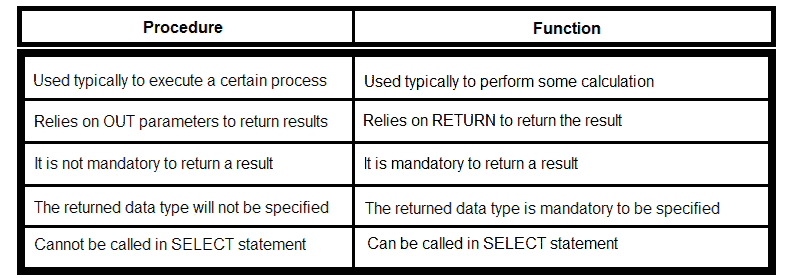
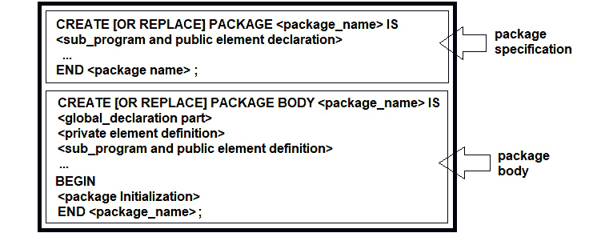
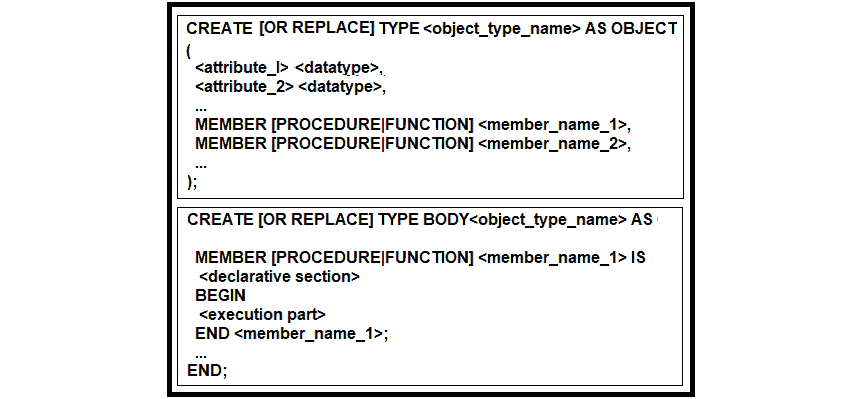

# *第十五章*：调用和创建存储函数和过程

SQL 是一种声明性语言，但它也具有存储函数/过程、触发器和游标等程序性功能，这意味着 SQL 被认为是**第四代编程语言**（**4GL**）。在本章中，我们将看到如何调用和创建存储函数/过程，换句话说，如何调用和创建 MySQL、PostgreSQL、SQL Server 和 Oracle 的持久化存储模块（SQL/PSM）。

如果你需要快速回顾存储过程和函数之间的关键区别，请查看以下对头对头的表格（以下差异根据数据库的不同，有些是完全或部分正确的）：



]

图 15.1 – 程序和函数的关键区别

如您从前面的比较中可以推断出的，主要区别在于程序（可能）会产生副作用，而函数（通常）预期不会。

因此，我们的议程包括以下主题：

+   从 jOOQ 调用存储函数/过程

+   存储过程

+   通过 jOOQ 创建存储函数/过程

在开始之前，让我们从 Lukas Eder 那里得到一些见解，他分享说：“*这可能会稍后出现，但可能值得早点提一下：有一些用户只使用 jOOQ 的存储过程代码生成功能。当你有很多存储过程时，没有代码生成几乎不可能将它们绑定起来，而 jOOQ 开箱即用，有点像当你有一个 WSDL 文件（或类似的东西），然后使用 Axis 或 Metro 等生成所有存根，等等。”*

好的，现在让我们开始吧！

# 技术要求

本章的代码可以在 GitHub 上找到：[`github.com/PacktPublishing/jOOQ-Masterclass/tree/master/Chapter15`](https://github.com/PacktPublishing/jOOQ-Masterclass/tree/master/Chapter15)。

# 从 jOOQ 调用存储函数/过程

一旦你开始处理不同数据库供应商的存储函数/过程，你将面临标准化的缺乏。例如，用于表示函数/过程的供应商特定语法、供应商特定函数/过程类型的广泛多样性，以及支持和处理输出参数的不同方式，只是存储函数/过程的几个非标准化方面。

通过纯 JDBC 代码调用存储函数/过程也不容易，尤其是当涉及到高级数据类型时（例如，数组或 UDTs）。但是，正如你所知道的那样，使用 jOOQ DSL 可以让我们避免直接与 JDBC API 交互，因此它节省了我们做出关于 JDBC 解决方案的尖端决策。

jOOQ DSL 通过`org.jooq.Routine` API 表示存储函数/过程，因此有一个共同的 API。每当 jOOQ 生成器检测到一个存储函数/过程时，它会在适当的包中生成一个专用类（在我们的例子中，是`jooq.generated.routines`），该类反映了其名称（例如，默认情况下，名为`get_emps_in_office()`的存储函数会产生名为`GetEmpsInOffice`的类）并扩展了 jOOQ 的`AbstractRoutine`类。生成的类公开了通过 jOOQ DSL 调用此存储函数/过程的 API。此外，正如您很快就会看到的，调用存储函数/过程也可以通过`DSLContext.begin()`和直接通过`DSLContext.call()`在匿名过程块中完成。但是，理论就到这里，接下来让我们从 jOOQ 的角度探讨一些不同类型的存储函数/过程，让我们从存储函数开始。

## 存储函数

存储函数返回一个结果（例如，计算的输出）。它们可以在 SQL 语句中调用，并且通常不支持输出（`OUT`）参数。然而，在 Oracle 和 PostgreSQL 中，存储函数可能有输出参数，这些参数可以解释为返回结果。此外，直到版本 11，PostgreSQL 只支持结合存储函数和过程特征的存储函数。另一方面，PostgreSQL 11 及以后，Oracle、MySQL 和 SQL Server 在存储函数和过程之间进行了区分。

接下来，让我们看看我们如何从 jOOQ 调用用这四种方言之一表达的不同类型的存储函数，让我们先调用一些标量函数。

### 标量函数

一个接受零个、一个或多个参数并返回单个值的存储函数通常被称为标量函数。作为一种常见做法，标量函数封装了出现在许多查询中的复杂计算。您不必在每次查询中都表达这个计算，而是可以编写一个封装此计算的标量函数，并在每次查询中使用它。大致来说，标量函数的语法是这个骨架的变体：

```java
CREATE FUNCTION name (parameters)
```

```java
RETURNS data_type AS
```

```java
BEGIN
```

```java
    statements/computations
```

```java
    RETURN value
```

```java
END
```

例如，一个简单的标量函数在 MySQL 中可能看起来如下所示：

```java
DELIMITER $$
```

```java
CREATE FUNCTION `sale_price`(
```

```java
  `quantity` INT, `list_price` REAL, `fraction_of_price` REAL)
```

```java
  RETURNS REAL
```

```java
  DETERMINISTIC
```

```java
  BEGIN
```

```java
    RETURN (`list_price` - 
```

```java
      (`list_price` * `fraction_of_price`)) * `quantity`;    
```

```java
  END $$
```

```java
DELIMITER ;
```

对于这个标量函数，jOOQ 代码生成器生成一个名为`jooq.generated.routines.SalePrice`的专用类。在其方法中，这个类公开了允许我们提供函数输入参数的设置器。在我们的例子中，我们将有`setQuantity(Integer value)`、`setQuantity(Field<Integer> field)`、`setListPrice(Double value)`、`setListPrice(Field<Double> field)`、`setFractionOfPrice(Double value)`和`setFractionOfPrice(Field<Double> field)`。函数可以通过 jOOQ 的知名`execute()`方法执行。如果函数已经附加了`Configuration`，则可以依赖`execute()`不带参数，否则使用`execute(Configuration c)`方法，如下所示：

```java
SalePrice sp = new SalePrice();
```

```java
sp.setQuantity(25);
```

```java
sp.setListPrice(15.5);
```

```java
sp.setFractionOfPrice(0.75);
```

```java
sp.execute(ctx.configuration());
```

通过 `getReturnValue()` 方法获取返回的标量结果。在这种情况下，你可以这样使用它：

```java
double result = sp.getReturnValue();
```

正如你所看到的，每个设置器都有一个获取 `Field` 作为参数的风味。这意味着我们可以写点这样的东西（检查前两个设置器）：

```java
sp.setQuantity(field(select(PRODUCT.QUANTITY_IN_STOCK)
```

```java
  .from(PRODUCT).where(PRODUCT.PRODUCT_ID.eq(1L))));
```

```java
sp.setListPrice(field(select(PRODUCT.MSRP.coerce(Double.class))
```

```java
  .from(PRODUCT).where(PRODUCT.PRODUCT_ID.eq(1L))));
```

```java
sp.setFractionOfPrice(0.75);
```

```java
sp.execute(ctx.configuration());
```

```java
double result = sp.getReturnValue();
```

如果例程有超过 254 个参数（Java 中不允许），或者有默认参数，用户不想设置，或者参数需要动态设置，那么前面的示例将很有用。否则，你很可能更愿意使用静态便利 API。

通过 `Routines.salePrice()` 静态方法以更方便/紧凑的方式编写这两个示例。`jooq.generated.Routines` 类提供了方便的静态方法来访问 jOOQ 在你的数据库中找到的所有存储函数/过程。在这种情况下，以下两个示例紧凑了前面的示例（当然，你可以通过导入 `jooq.generated.Routines.salePrice` 静态进一步缩短这个示例）：

```java
double sp = Routines.salePrice(
```

```java
    ctx.configuration(), 25, 15.5, 0.75);
```

```java
Field<Float> sp = Routines.salePrice(
```

```java
  field(select(PRODUCT.QUANTITY_IN_STOCK)
```

```java
         .from(PRODUCT).where(PRODUCT.PRODUCT_ID.eq(1L))),
```

```java
  field(select(PRODUCT.MSRP.coerce(Double.class))
```

```java
         .from(PRODUCT).where(PRODUCT.PRODUCT_ID.eq(1L))),
```

```java
  val(0.75));
```

```java
double sp = ctx.fetchValue(salePrice(
```

```java
 field(select(PRODUCT.QUANTITY_IN_STOCK)
```

```java
  .from(PRODUCT).where(PRODUCT.PRODUCT_ID.eq(1L))),
```

```java
 field(select(PRODUCT.MSRP.coerce(Double.class))
```

```java
  .from(PRODUCT).where(PRODUCT.PRODUCT_ID.eq(1L))),
```

```java
 val(0.75)));
```

标量函数也可以用在查询中。这里是一个通过 `Routines.salePrice()` 的另一种风味示例：

```java
ctx.select(ORDERDETAIL.ORDER_ID,
```

```java
    sum(salePrice(ORDERDETAIL.QUANTITY_ORDERED,
```

```java
        ORDERDETAIL.PRICE_EACH.coerce(Double.class), 
```

```java
        val(0.75))).as("sum_sale_price"))
```

```java
   .from(ORDERDETAIL)
```

```java
   .groupBy(ORDERDETAIL.ORDER_ID)
```

```java
   .orderBy(field(name("sum_sale_price")).desc())
```

```java
   .fetch();
```

对于 MySQL，jOOQ 生成的以下 SQL 是这样的：

```java
SELECT `classicmodels`.`orderdetail`.`order_id`,
```

```java
   sum(`classicmodels`.`sale_price`(
```

```java
       `classicmodels`.`orderdetail`.`quantity_ordered`, 
```

```java
       `classicmodels`.`orderdetail`.`price_each`, 7.5E-1)) 
```

```java
          AS `sum_sale_price`
```

```java
   FROM `classicmodels`.`orderdetail`
```

```java
   GROUP BY `classicmodels`.`orderdetail`.`order_id`
```

```java
   ORDER BY `sum_sale_price` DESC
```

你可以在 *ScalarFunction* 中练习这个示例。

在这个上下文中，这里还有一个为 PostgreSQL 编写的函数，它更新 `PRODUCT.MSRP` 并通过 `UPDATE … RETURNING` 返回（不要与 `RETURN` 语句混淆）：

```java
CREATE OR REPLACE FUNCTION "update_msrp" (
```

```java
    "id" BIGINT, "debit" INTEGER) RETURNS REAL AS $$
```

```java
    UPDATE "public"."product"
```

```java
        SET "msrp" = "public"."product"."msrp" - "debit"
```

```java
        WHERE "public"."product"."product_id" = "id"
```

```java
        RETURNING "public"."product"."msrp";
```

```java
$$ LANGUAGE SQL;
```

jOOQ 可以像上一个示例中看到的那样调用这样的函数。例如，这里是在一个 `SELECT` 中调用的：

```java
ctx.select(PRODUCT.PRODUCT_ID, PRODUCT.PRODUCT_NAME, 
```

```java
           PRODUCT.MSRP.as("obsolete_msrp"), 
```

```java
           updateMsrp(PRODUCT.PRODUCT_ID, inline(50)))
```

```java
   .from(PRODUCT).fetch();
```

生成的 SQL 如下所示：

```java
SELECT "public"."product"."product_id",
```

```java
       "public"."product"."product_name",
```

```java
       "public"."product"."msrp" AS "obsolete_msrp",
```

```java
               "public"."update_msrp"("id" := "public"
```

```java
                   ."product"."product_id", "debit" := 50)
```

```java
FROM "public"."product"
```

你可以在 *UpdateFunction* 中为 PostgreSQL 练习这个示例。

如果你的标量函数在 Oracle 上，那么你可以利用一个称为 *标量子查询缓存* 的很好的 Oracle 功能。基本上，这个功能将存储函数的调用封装在 SQL 语句中，作为标量子查询。这个功能避免了在 PL/SQL 和 SQL 上下文之间切换，这可能会导致更好的性能。

考虑以下标量函数：

```java
CREATE OR REPLACE NONEDITIONABLE FUNCTION 
```

```java
     "card_commission"("card_type" IN VARCHAR2)
```

```java
RETURN NUMBER IS
```

```java
 "commission" NUMBER := 0;
```

```java
 BEGIN
```

```java
   RETURN CASE "card_type"
```

```java
     WHEN 'VisaElectron' THEN .15
```

```java
     WHEN 'Mastercard' THEN .22
```

```java
     ELSE .25
```

```java
   END;
```

```java
END;
```

在查询中调用这个标量函数可以在这里完成：

```java
ctx.select(cardCommission(BANK_TRANSACTION.CARD_TYPE))
```

```java
   .from(BANK_TRANSACTION)
```

```java
   .fetch();
```

```java
List<BigDecimal> commission = ctx.fetchValues(
```

```java
  select(cardCommission(BANK_TRANSACTION.CARD_TYPE))
```

```java
    .from(BANK_TRANSACTION));
```

但请记住卢卡斯·埃德（Lukas Eder）的笔记：“据我所知，标量子查询缓存在 Oracle 中没有文档。上下文切换并没有完全避免，但它只发生在每个标量子查询输入值、每个函数参数值和每个查询上。因此，我们现在每个函数输入值只有一个切换，而不是每行有一个切换。”

每次我们执行这段代码时，jOOQ 都会生成一个查询，该查询需要在 PL/SQL 和 SQL 上下文之间切换以执行标量函数：

```java
SELECT "CLASSICMODELS"."card_commission"(
```

```java
       "CLASSICMODELS"."BANK_TRANSACTION"."CARD_TYPE")
```

```java
FROM "CLASSICMODELS"."BANK_TRANSACTION"
```

但 jOOQ 有一个 `withRenderScalarSubqueriesForStoredFunctions()` 标志设置，默认设置为 `false`。一旦我们将它设置为 `true`，jOOQ 就会开启 Oracle 的 *标量子查询缓存* 功能。在下面的示例中，我们只为当前的 SQL 开启这个功能：

```java
ctx.configuration().derive(new Settings()
```

```java
   .withRenderScalarSubqueriesForStoredFunctions(true))
```

```java
   .dsl()
```

```java
   .select(cardCommission(BANK_TRANSACTION.CARD_TYPE))
```

```java
   .from(BANK_TRANSACTION)
```

```java
   .fetch();
```

这次，`cardCommission()` 存储函数的调用被渲染为一个标量子查询：

```java
SELECT
```

```java
  (SELECT "CLASSICMODELS"."card_commission"(
```

```java
    "CLASSICMODELS"."BANK_TRANSACTION"."CARD_TYPE")
```

```java
      FROM DUAL)
```

```java
FROM "CLASSICMODELS"."BANK_TRANSACTION"
```

你可以在*ScalarSubqueryCaching*（针对 Oracle）中练习这个示例。

### 返回数组的函数

PostgreSQL 是编写返回数组的函数的便捷方式。例如，这里是一个返回`DEPARTMENT.TOPIC`的函数，它在我们的模式中声明为一个`TEXT[]`类型的数组：

```java
CREATE OR REPLACE FUNCTION "department_topic_arr" 
```

```java
   (IN "id" BIGINT)
```

```java
RETURNS TEXT[] 
```

```java
AS $$
```

```java
  SELECT "public"."department"."topic"
```

```java
      FROM "public"."department" WHERE 
```

```java
           "public"."department"."department_id" = "id"
```

```java
$$ LANGUAGE SQL; 
```

通过 jOOQ 在`Routines`中生成的专用方法`departmentTopicArr()`在`SELECT`中调用此函数，可以通过以下示例中的展开返回的数组来完成：

```java
ctx.select().from(unnest(departmentTopicArr(2L))
```

```java
   .as("t")).fetch();
```

```java
ctx.fetch(unnest(departmentTopicArr(2L)).as("t"));
```

接下来，让我们考虑一个具有匿名参数（没有显式名称）的函数，该函数构建并返回一个数组：

```java
CREATE OR REPLACE FUNCTION "employee_office_arr"(VARCHAR(10))
```

```java
  RETURNS BIGINT[] 
```

```java
AS $$
```

```java
  SELECT ARRAY(SELECT "public"."employee"."employee_number"
```

```java
    FROM "public"."employee" WHERE "public"."employee"
```

```java
         ."office_code" = $1)
```

```java
$$ LANGUAGE sql;
```

这次，让我们实例化`EmployeeOfficeArr`，并通过设置器传递所需的参数：

```java
EmployeeOfficeArr eoa = new EmployeeOfficeArr();
```

```java
eoa.set__1("1");
```

```java
eoa.execute(ctx.configuration());
```

```java
Long[] result = eoa.getReturnValue();
```

由于函数的参数没有名称，jOOQ 使用了其默认实现并生成了一个`set__1()`设置器。如果你有两个无名称的参数，那么 jOOQ 将生成`set__1()`和`set__2()`，依此类推。换句话说，jOOQ 根据参数位置从 1 开始生成设置器。

另一方面，在`SELECT`查询中使用生成的`Routines.employeeOfficeArr()`可以如下进行：

```java
ctx.select(field(name("t", "en")), sum(SALE.SALE_))
```

```java
   .from(SALE)
```

```java
   .rightJoin(unnest(employeeOfficeArr("1")).as("t", "en"))
```

```java
     .on(field(name("t", "en")).eq(SALE.EMPLOYEE_NUMBER))
```

```java
   .groupBy(field(name("t", "en"))).fetch();        
```

对于 PostgreSQL，jOOQ 生成的 SQL 如下：

```java
SELECT "t"."en",sum("public"."sale"."sale")
```

```java
FROM "public"."sale"
```

```java
RIGHT OUTER JOIN unnest("public"."employee_office_arr"('1')) 
```

```java
AS "t" ("en") 
```

```java
ON "t"."en" = "public"."sale"."employee_number"
```

```java
GROUP BY "t"."en"
```

你可以在*ArrayFunction*（针对 PostgreSQL）中练习这些示例。

### 带有输出参数的函数

正如我们之前所说的，PostgreSQL 和 Oracle 允许函数中有输出参数。以下是一个 PostgreSQL 中的示例：

```java
CREATE OR REPLACE FUNCTION "get_salary_stat"(
```

```java
    OUT "min_sal" INT, OUT "max_sal" INT, OUT "avg_sal" NUMERIC) 
```

```java
  LANGUAGE plpgsql
```

```java
  AS $$
```

```java
  BEGIN  
```

```java
    SELECT MIN("public"."employee"."salary"),
```

```java
           MAX("public"."employee"."salary"),
```

```java
           AVG("public"."employee"."salary")::NUMERIC(7,2)
```

```java
      INTO "min_sal", "max_sal", "avg_sal"
```

```java
      FROM "public"."employee";
```

```java
  END;
```

```java
$$;
```

这个函数没有`RETURN`，但它有三个`OUT`参数，帮助我们获得执行结果。对于每个这样的参数，jOOQ 生成一个 getter，因此我们可以通过生成的`jooq.generated.routines.GetSalaryStat`来调用它，如下所示：

```java
GetSalaryStat salStat = new GetSalaryStat();
```

```java
salStat.execute(ctx.configuration());
```

```java
Integer minSal = salStat.getMinSal();
```

```java
Integer maxSal = salStat.getMaxSal();
```

```java
BigDecimal avgSal = salStat.getAvgSal();
```

这段代码（更确切地说，是`execute()`调用）导致以下`SELECT`（或者在 Oracle 中是`CALL`）：

```java
SELECT "min_sal", "max_sal", "avg_sal" 
```

```java
FROM "public"."get_salary_stat"()
```

通过`Routines.getSalaryStat(Configuration c)`也可以得到相同的结果：

```java
GetSalaryStat salStat = getSalaryStat(ctx.configuration());
```

```java
// call the getters
```

这里还有两个更多示例：

```java
Integer minSal = ctx.fetchValue(val(getSalaryStat(
```

```java
      ctx.configuration()).getMinSal()));
```

```java
ctx.select(EMPLOYEE.FIRST_NAME, EMPLOYEE.LAST_NAME,   
```

```java
           EMPLOYEE.SALARY)
```

```java
   .from(EMPLOYEE)
```

```java
   .where(EMPLOYEE.SALARY.coerce(BigDecimal.class)
```

```java
      .gt(getSalaryStat(ctx.configuration()).getAvgSal()))
```

```java
   .fetch();
```

但请注意，这两个示例都会导致两个`SELECT`语句（或者在 Oracle 中是一个`CALL`和一个`SELECT`语句），因为带有输出参数的函数不能从纯 SQL 中调用。换句话说，jOOQ 调用例程并检索您接下来可以看到的`OUT`参数：

```java
SELECT "min_sal","max_sal","avg_sal"
```

```java
FROM "public"."get_salary_stat"()
```

然后，它执行使用从输出参数中提取的结果的`SELECT`。以下`SELECT`符合我们的第二个示例（65652.17 是通过`getSalaryStat(Configuration c)`计算出的平均工资）：

```java
SELECT "public"."employee"."first_name",
```

```java
       "public"."employee"."last_name",
```

```java
       "public"."employee"."salary"
```

```java
FROM "public"."employee"
```

```java
WHERE "public"."employee"."salary" > 65652.17
```

Lukas Eder 分享说：“在 Oracle 中，带有 OUT 参数的函数并不是“SQL 可调用的”，尽管如此...在 PostgreSQL 中，它们只是函数返回记录的“语法糖”（或者根据口味，是“去糖”）。”

你可以在*InOutFunction*（针对 PostgreSQL）中练习这些示例（在这里，你还可以找到一个`IN OUT`示例）。

因此，在函数中使用 `OUT`（或 `IN OUT`）参数并不是一个好主意，必须避免。正如 Oracle 所说，除了防止函数在 SQL 查询中使用（更多细节请参阅[这里](https://oracle-base.com/articles/12c/with-clause-enhancements-12cr1)）之外，函数中输出参数的存在还防止了函数被标记为 `DETERMINISTIC` 函数或用作结果缓存的函数。与 PostgreSQL 不同，具有输出参数的 Oracle 函数必须有一个显式的 `RETURN`。在 jOOQ 专门用于输出参数的获取器旁边，你可以调用 `getReturnValue()` 来获取通过 `RETURN` 语句显式返回的结果。当这本书编写时，具有 `OUT` 参数的函数不能在 jOOQ 中从纯 SQL 调用。在此功能请求中查看：[`github.com/jOOQ/jOOQ/issues/3426`](https://github.com/jOOQ/jOOQ/issues/3426)。

你可以在 *InOutFunction* 的 Oracle 示例中进行练习（在这里，你还可以找到一个 `IN OUT` 示例）。

### 多态函数

一些数据库支持所谓的多态函数，这些函数可以接受和返回多态类型。例如，PostgreSQL 支持以下多态类型：`anyelement`、`anyarray`、`anynonarray`、`anyenum` 和 `anyrange`。以下是一个从两个传递的任意数据类型元素构建数组的示例：

```java
CREATE FUNCTION "make_array"(anyelement, anyelement) 
```

```java
RETURNS anyarray 
```

```java
AS $$
```

```java
  SELECT ARRAY[$1, $2];
```

```java
$$ LANGUAGE SQL;
```

通过 jOOQ 调用此函数可以这样进行（注意位置设置器再次起作用）：

```java
MakeArray ma = new MakeArray();
```

```java
ma.set__1(1);
```

```java
ma.set__2(2);
```

```java
ma.execute(ctx.configuration());
```

返回的结果是 `org.postgresql.jdbc.PgArray`：

```java
PgArray arr = (PgArray) ma.getReturnValue();
```

在捆绑的代码中，你可以看到对这个数组的进一步处理。现在，让我们从 `SELECT` 中调用 `make_array()` 来构建一个整数数组和字符串数组：

```java
ctx.select(makeArray(1, 2).as("ia"),
```

```java
           makeArray("a", "b").as("ta")).fetch();
```

那么一个结合多态类型和输出参数的函数呢？这里有一个示例：

```java
CREATE FUNCTION "dup"(IN "f1" anyelement, 
```

```java
   OUT "f2" anyelement, OUT "f3" anyarray)
```

```java
AS 'select $1, array[$1,$1]' LANGUAGE sql;
```

通过 jOOQ 调用它：

```java
Dup dup = new Dup();
```

```java
dup.setF1(10);
```

```java
dup.execute(ctx.configuration());
```

```java
// call here getF2() and/or getF3()
```

或者，在 `SELECT` 中使用它（记住，从上一节中提到的，这将导致对数据库的两个语句）：

```java
ctx.select(val(dup(ctx.configuration(), 10).getF2())).fetch();
```

```java
ctx.fetchValue(val(dup(ctx.configuration(), 10).getF2()));
```

你可以在 *PolymorphicFunction* 的 PostgreSQL 中练习这些示例。

### 返回显式游标的函数

函数还可以返回一个显式游标（一个指向查询结果的显式指针）。你很可能熟悉 PostgreSQL 的 `REFCURSOR` 和 Oracle 的 `SYS_REFCURSOR`。以下是一个 Oracle 的示例：

```java
CREATE OR REPLACE NONEDITIONABLE FUNCTION
```

```java
   "GET_CUSTOMER" ("cl" IN NUMBER)
```

```java
  RETURN SYS_REFCURSOR
```

```java
       AS  "cur"  SYS_REFCURSOR;
```

```java
  BEGIN
```

```java
      OPEN "cur" FOR
```

```java
           SELECT *
```

```java
           FROM "CUSTOMER"
```

```java
                       WHERE "CUSTOMER"."CREDIT_LIMIT" > "cl"
```

```java
           ORDER BY "CUSTOMER"."CUSTOMER_NAME";
```

```java
      RETURN "cur";
```

```java
  END;
```

通过生成的 `jooq.generated.routines.GetCustomer` 函数调用可以这样进行：

```java
GetCustomer customers = new GetCustomer();
```

```java
customers.setCl(120000);
```

```java
customers.execute(ctx.configuration());
```

```java
Result<Record> result = customers.getReturnValue();
```

结果被 jOOQ 映射为 `Result<Record>`，因此记录列表完全适合内存。为了更好地适应大数据集，jOOQ 有一些待处理的功能请求以流式传输游标，因此你可以检查 jOOQ 仓库中的问题 #4503 和 #4472。或者，你可以将返回的游标包装在一个表值函数中，并通过 jOOQ 的 `ResultQuery.fetchLazy()` 方法使用 `SELECT` 语句获取结果，就像你在 *第八章* 的 *获取和映射* 中看到的那样。

现在，更进一步，你可以循环 `Result<Record>` 并处理每条记录，但要访问某一行（例如，第一行）的某个列（例如，客户名称），那么你可以使用 `getValue()` 或 `get()`，就像这里一样：

```java
String name = (String) result.getValue(0, "CUSTOMER_NAME");
```

```java
String name = result.get(0).get("CUSTOMER_NAME", String.class);
```

要获取多个名称（或其他列），请依赖于 `getValues()`，它有多种风味，你可以在官方文档中找到。

通过生成的静态 `Routines.getCustomer()` 可以更紧凑地获取相同的 `Result<Record>`：

```java
Result<Record> result = getCustomer(
```

```java
   ctx.configuration(), 120000);
```

如果你需要一个 `Table` 而不是这个 `Result<Record>`，那么简单地依赖于 `org.jooq.impl.DSL.table`，就像以下两个示例中那样：

```java
Table<?> t = table(result);
```

```java
Table<CustomerRecord> t = table(result.into(CUSTOMER));
```

接下来，你可以在查询中使用 `t`，就像使用任何常规的 `Table` 一样：

```java
ctx.select(CUSTOMERDETAIL.ADDRESS_LINE_FIRST, 
```

```java
           CUSTOMERDETAIL.POSTAL_CODE,
```

```java
           t.field(name("CUSTOMER_NAME")))
```

```java
   .from(t)
```

```java
   .join(CUSTOMERDETAIL)
```

```java
    .on(CUSTOMERDETAIL.CUSTOMER_NUMBER.eq(
```

```java
        t.field(name("CUSTOMER_NUMBER"), Long.class)))
```

```java
   .fetch();
```

另一方面，`Routines.getCustomer()` 的另一种风味返回的结果被一个 `Field` 包装，作为 `Field<Result<Record>>`。这允许我们使用这个结果作为 `Field`。例如，这里有一个 `SELECT`：

```java
ctx.select(getCustomer(field(
```

```java
     select(avg(CUSTOMER.CREDIT_LIMIT))
```

```java
        .from(CUSTOMER)))).fetch();    
```

你可以在 Oracle 的 *CursorFunction* 中练习这些示例。

那么一个返回多个游标的函数呢？这里是一个为 PostgreSQL 编写的示例：

```java
CREATE OR REPLACE FUNCTION "get_offices_multiple"() 
```

```java
  RETURNS SETOF REFCURSOR 
```

```java
AS $$
```

```java
 DECLARE
```

```java
  "ref1" REFCURSOR;           
```

```java
  "ref2" REFCURSOR;           
```

```java
 BEGIN
```

```java
 OPEN "ref1" FOR 
```

```java
  SELECT "public"."office"."city", "public"."office"."country" 
```

```java
  FROM "public"."office" 
```

```java
  WHERE "public"."office"."internal_budget" < 100000;  
```

```java
  RETURN NEXT "ref1"; 
```

```java
 OPEN "ref2" FOR 
```

```java
  SELECT "public"."office"."city", "public"."office"."country"
```

```java
  FROM "public"."office" 
```

```java
  WHERE "public"."office"."internal_budget" > 100000;  
```

```java
 RETURN NEXT "ref2";    
```

```java
END;
```

```java
$$ LANGUAGE plpgsql;
```

在这种情况下，每个游标产生一个 `Result<Record>`，被一个生成的 `Record` 类包装。这里，我们有两个游标，因此有两个 `Result<Record>` 被两个生成的 `GetOfficesMultipleRecord` 实例包装。当我们调用 `Routines.getOfficesMultiple(Configuration c)` 时，我们得到一个 `Result<GetOfficesMultipleRecord>`，它可以如下展开：

```java
Result<GetOfficesMultipleRecord> results = 
```

```java
        getOfficesMultiple(ctx.configuration());
```

```java
for (GetOfficesMultipleRecord result : results) {
```

```java
  Result<Record> records = result.getGetOfficesMultiple();
```

```java
  System.out.println("-------------------------");
```

```java
  for (Record r : records) {
```

```java
    System.out.println(r.get("city") + ", " + r.get("country"));
```

```java
  }
```

```java
}
```

你可以在 PostgreSQL 的 *CursorFunction* 中练习这些示例。

### 表值函数

除了数据库视图之外，SQL 中被低估的功能之一是表值函数。这本书中我们已经讨论过这个特性不止一次了，但这次，让我们添加一些更多细节。所以，表值函数是一个返回一组数据作为表数据类型的函数。返回的表可以像常规表一样使用。

表值函数在 MySQL 中不受支持，但在 PostgreSQL、Oracle 和 SQL Server 中受支持。下面是一个 PostgreSQL 表值函数的代码片段（注意 `RETURNS TABLE` 语法，它表示函数的 `SELECT` 查询返回的数据作为表给调用函数的任何东西）：

```java
CREATE OR REPLACE FUNCTION "product_of_product_line"(
```

```java
  IN "p_line_in" VARCHAR)
```

```java
RETURNS TABLE("p_id" BIGINT, "p_name" VARCHAR, 
```

```java
              "p_line" VARCHAR) LANGUAGE plpgsql 
```

```java
AS $$ 
```

```java
BEGIN
```

```java
  RETURN QUERY
```

```java
  SELECT ...;     
```

```java
  END; 
```

```java
$$;
```

默认情况下，jOOQ 代码生成器将为该函数生成一个名为`ProductOfProductLine`的类，位于`jooq.generated.tables`包中，而不是`jooq.generated.routines`包中。解释很简单；jOOQ（像大多数数据库一样）将表值函数视为普通表，可以在`SELECT`语句的`FROM`子句中使用，就像任何其他表一样。Oracle 是一个例外，在那里将它们视为独立的程序——在这个上下文中，jOOQ 有一个标志设置，允许我们指示表值函数应该被视为普通表（在`jooq.generated.tables`中生成）还是作为普通程序（在`jooq.generated.routines`中生成）。这详细说明在*第六章*，*处理不同类型的 JOIN 语句*。

通过`call()`方法调用表值函数（带有参数）：

```java
ProductOfProductLine popl = new ProductOfProductLine();
```

```java
Table<ProductOfProductLineRecord> t = popl.call("Trains");
```

```java
Result<ProductOfProductLineRecord> r = 
```

```java
   ctx.fetch(popl.call("Trains"));
```

```java
Result<ProductOfProductLineRecord> r = 
```

```java
   ctx.selectFrom(popl.call("Trains")).fetch();
```

在查询中，我们可能更喜欢使用 jOOQ 生成器在`ProductOfProductLine`中生成的`PRODUCT_OF_PRODUCT_LINE`静态字段。以下两个示例生成相同的 SQL：

```java
ctx.selectFrom(PRODUCT_OF_PRODUCT_LINE.call("Trains"))
```

```java
   .fetch();
```

```java
ctx.selectFrom(PRODUCT_OF_PRODUCT_LINE(val("Trains")))
```

```java
   .fetch();
```

这里有两个在`FROM`子句中调用此表值函数的示例：

```java
ctx.selectFrom(PRODUCT_OF_PRODUCT_LINE.call("Trains"))
```

```java
   .where(PRODUCT_OF_PRODUCT_LINE.P_NAME.like("1962%"))
```

```java
   .fetch();
```

```java
ctx.select(PRODUCT_OF_PRODUCT_LINE.P_ID, 
```

```java
           PRODUCT_OF_PRODUCT_LINE.P_NAME)
```

```java
   .from(PRODUCT_OF_PRODUCT_LINE.call("Classic Cars"))
```

```java
   .where(PRODUCT_OF_PRODUCT_LINE.P_ID.gt(100L))
```

```java
   .fetch();
```

由于表值函数返回一个表，我们应该能够在连接中使用它们。但是常规的`JOIN`功能不允许我们将表值函数与表连接，因此我们需要另一种方法。这就是`CROSS APPLY`和`OUTER APPLY`（或`LATERAL`）出现的地方。在*第六章*，*处理不同类型的 JOIN 语句*中，你看到了使用`CROSS`/`OUTER APPLY`来解决基于 TOP-N 查询结果连接两个表的流行任务的示例。因此，`CROSS`/`OUTER APPLY`允许我们在查询中结合表值函数返回的结果与其他表的结果，简而言之，就是将表值函数与其他表连接。

例如，让我们使用`CROSS`/`OUTER APPLY`（你可以将其视为 Java 中的`Stream.flatMap()`）将`PRODUCTLINE`表与我们的表值函数连接起来。假设我们已经添加了一个没有产品的名为*直升机*的新`PRODUCTLINE`，让我们看看`CROSS APPLY`是如何工作的：

```java
ctx.select(PRODUCTLINE.PRODUCT_LINE, PRODUCTLINE
```

```java
   .TEXT_DESCRIPTION, PRODUCT_OF_PRODUCT_LINE.asterisk())
```

```java
   .from(PRODUCTLINE)
```

```java
   .crossApply(PRODUCT_OF_PRODUCT_LINE(
```

```java
               PRODUCTLINE.PRODUCT_LINE))
```

```java
   .fetch();
```

由于*直升机*产品线没有产品，`CROSS APPLY`不会检索它，因为`CROSS APPLY`的作用类似于`CROSS JOIN LATERAL`。那么`OUTER APPLY`呢？

```java
ctx.select(PRODUCTLINE.PRODUCT_LINE, PRODUCTLINE
```

```java
     .TEXT_DESCRIPTION, PRODUCT_OF_PRODUCT_LINE.asterisk())
```

```java
   .from(PRODUCTLINE)
```

```java
   .outerApply(PRODUCT_OF_PRODUCT_LINE(
```

```java
               PRODUCTLINE.PRODUCT_LINE))
```

```java
   .fetch();
```

另一方面，`OUTER APPLY`的作用类似于`LEFT OUTER JOIN LATERAL`，因此*直升机*产品线也会被返回。

Lukas Eder 在这里分享了一个观点：“实际上，出于历史原因，在 Db2、Oracle 和 PostgreSQL 中，在某些条件下，APPLY 或 LATERAL 是可选的。SQL Server 长期以来都有 APPLY，但其他数据库最近才引入 LATERAL。我个人不明白明确 LATERAL 的价值。隐式 LATERAL 的含义总是很清楚...”

你可以在捆绑的代码中查看这些示例，*TableValuedFunction*适用于 PostgreSQL、Oracle 和 SQL Server。

### Oracle 的包

Oracle 允许我们将逻辑上常见相关的函数/过程组合成一个包。包有两个部分：第一部分包含公共项，称为 *包规范*，而第二部分，称为 *包主体*，提供了在包规范中声明的游标或子程序的代码。如果在包规范中没有声明游标/子程序，则可以跳过包主体。如果您不是 Oracle 的粉丝，那么以下语法可能有助于您更容易地消化这个主题：



图 15.2 – Oracle 包的语法

卢卡斯·埃德分享了一个有助于更好地理解这个主题的类比："如果有助于理解，包规范就像接口，而主体就像单例实例，有点像。在某种程度上，就像这样：" [`twitter.com/lukaseder/status/1443855980693962755`](https://twitter.com/lukaseder/status/1443855980693962755)。

包通过隐藏包体内的实现细节来维持模块化，促进清晰的设计，并提高代码的可维护性。此外，包在第一次调用函数/过程时作为一个整体加载到内存中，因此从该包中后续调用函数/过程不需要磁盘 I/O。虽然有关使用 Oracle 包的更多信息可在官方文档中找到，但让我们举一个例子：

```java
CREATE OR REPLACE PACKAGE "DEPARTMENT_PKG" AS
```

```java
 TYPE "BGT" IS RECORD ("LOCAL_BUDGET" FLOAT, "CASH" FLOAT);
```

```java
  FUNCTION "GET_BGT"("p_profit" IN FLOAT)
```

```java
    RETURN "BGT";
```

```java
  FUNCTION "GET_MAX_CASH"
```

```java
    RETURN FLOAT; 
```

```java
END "DEPARTMENT_PKG";
```

```java
/
```

```java
CREATE OR REPLACE PACKAGE BODY "DEPARTMENT_PKG"
```

```java
-- check bundled code for this skipped part
```

```java
END"DEPARTMENT_PKG";
```

```java
/
```

卢卡斯·埃德（Lukas Eder）的一个辛辣的小贴士：*"`/*` 是 SQL*Plus 的 'spool' 令牌（也由 SQL Developer 支持），而不是实际的 PL/SQL 语法元素。例如，它在 DBeaver 中不起作用。)*

另外，关于引号标识符的一个小贴士：*可能是一个很好的提醒，为了与非 jOOQ 代码更好地互操作，可能不使用引号标识符会更好。如果所有调用者都必须始终引用该标识符，而不是使用 jOOQ，那将会很麻烦：)*

因此，我们有一个名为 `DEPARTMENT_PKG` 的包，其中包含一个名为 `BGT` 的用户定义类型和两个函数，`GET_BGT()` 和 `GET_MAX_CASH()`。在源代码生成阶段，jOOQ 将通过以下 Java 子包反映此包及其内容：

+   `jooq.generated.packages` – 包含代表包并公开 `DEPARTMENT_PKG` 静态的 `DepartmentPkg` 类，可以用来调用函数，如 `DEPARTMENT_PKG.getMaxCash()` 和 `DEPARTMENT_PKG.getBgt()`，并将结果作为 `Field` 获取。

+   `jooq.generated.packages.department_pkg` – 包含代表包中两个函数的 `GetBgt` 和 `GetMaxCash` 类。此外，它还包含一个 `UDTs` 类，其中包含静态 `BGT`，用于 `CLASSICMODELS.DEPARTMENT_PKG.BGT` (`jooq.generated.packages.department_pkg.udt.Bgt.BGT`)。

+   `jooq.generated.packages.department_pkg.udt` – 包含将 `BGT` UDT 类型映射为 `UDTImpl` 扩展的 `Bgt` 类。

+   `jooq.generated.packages.department_pkg.udt.records` – 包含代表 `BGT` UDT 类型作为 `UDTRecordImpl` 扩展的 `BgtRecord` 类。

调用这两个函数（`GET_BGT()` 和 `GET_MAX_CASH()`）可以通过实例化 `GetMaxCash` 类，分别 `GetBgt` 类，并按如下方式调用 `execute()`：

```java
GetMaxCash gmc = new GetMaxCash();
```

```java
gmc.execute(ctx.configuration());
```

```java
double resultGmc = gmc.getReturnValue();
```

```java
GetBgt bgt = new GetBgt();
```

```java
bgt.setPProfit(50000.0);
```

```java
bgt.execute(ctx.configuration());
```

```java
BgtRecord resultBgt = bgt.getReturnValue();
```

我们也可以通过静态方法 `DepartmentPkg.getBgt()` 和 `DepartmentPkg.getMaxCash()` 来压缩这些示例，如下所示：

```java
double resultGmc = getMaxCash(ctx.configuration());
```

```java
BgtRecord resultBgt = getBgt(ctx.configuration(), 50000.0);
```

从查询中调用这些函数也是可能的。例如，以下是在 `SELECT` 中调用它们的两个简单示例：

```java
ctx.select(getMaxCash()).fetch();
```

```java
double mc = ctx.fetchValue(getMaxCash());
```

```java
The rendered SQL:
```

```java
SELECT "CLASSICMODELS"."department_pkg"."get_max_cash"() 
```

```java
FROM DUAL
```

这里还有一个示例，它使用了同一个查询中的两个函数：

```java
ctx.select(OFFICE.OFFICE_CODE, OFFICE.CITY, OFFICE.COUNTRY,
```

```java
           DEPARTMENT.NAME, DEPARTMENT.LOCAL_BUDGET)
```

```java
   .from(OFFICE)
```

```java
   .join(DEPARTMENT)
```

```java
   .on(OFFICE.OFFICE_CODE.eq(DEPARTMENT.OFFICE_CODE)
```

```java
     .and(DEPARTMENT.LOCAL_BUDGET
```

```java
       .in(getBgt(ctx.configuration(),
```

```java
          getMaxCash(ctx.configuration()))
```

```java
            .getLocalBudget())))
```

```java
   .fetch();
```

查看以下示例，这些示例位于 *Package* for Oracle 的旁边，而这里没有展示的其他几个示例。

### Oracle 的成员函数/过程

主要来说，Oracle PL/SQL 对象类型包含属性和成员（或方法）。属性或字段具有数据类型，它们用于存储数据，而成员是定义在对象类型中的子程序（函数/过程），用于操作属性以实现某些功能。这样，Oracle UDTs 是实现对象关系数据库管理系统（ORDBMS）的全面尝试。PostgreSQL 并没有像 Oracle 那样走得更远。

如果你不是 Oracle 的粉丝，那么以下语法应该能对这个主题有所帮助：




图 15.3 – Oracle 成员语法

基于这个语法，让我们举一个例子。我们的 `MANAGER` 表有一个名为 `MANAGER_EVALUATION` 的字段，其类型为 `EVALUATION_CRITERIA`（在 jOOQ 中为 `TableField<ManagerRecord, EvaluationCriteriaRecord>` 类型），定义如下：

```java
CREATE OR REPLACE TYPE "EVALUATION_CRITERIA" AS OBJECT (
```

```java
  "communication_ability" NUMBER(7), 
```

```java
  "ethics" NUMBER(7), 
```

```java
  "performance" NUMBER(7), 
```

```java
  "employee_input" NUMBER(7),
```

```java
  MEMBER FUNCTION "IMPROVE"("k" NUMBER) 
```

```java
      RETURN "EVALUATION_CRITERIA",
```

```java
  MAP MEMBER FUNCTION "SCORE" RETURN NUMBER
```

```java
);
```

```java
CREATE OR REPLACE TYPE BODY "EVALUATION_CRITERIA" AS
```

```java
-- check bundled code for this skipped part
```

```java
END;
```

在这里，我们有一个包含四个属性（`communication_ability`、`ethics`、`performance` 和 `employee_input`）、两个成员函数（`IMPROVE()` 和 `SCORE()`）以及没有成员过程的对象类型。

jOOQ 代码生成器生成以下工件：

+   `jooq.generated.udt` – 在这个包中，我们有一个名为 `EvaluationCriteria` 的 UDT 类型，代表 jOOQ 的 `UDTImpl<EvaluationCriteriaRecord>` 的扩展。它包含静态 `EVALUATION_CRITERIA`、`COMMUNICATION_ABILITY`、`ETHICS`、`PERFORMANCE` 和 `EMPLOYEE_INPUT`，用于引用这些 UDT 属性，以及几种 `improve()` 和 `score()` 成员函数的变体，这些函数返回纯结果或包装在 `Field` 中。

+   `jooq.generated.udt.records` – 包含代表 UDT 记录作为 jOOQ 的 `UDTRecordImpl<EvaluationCriteriaRecord>` 扩展的 `EvaluationCriteriaRecord`。`EvaluationCriteriaRecord` 包含对象类型属性的获取器/设置器，并包含 `improve()` 和 `score()` 方法。这些方法封装了调用实际的 `improve()` 和 `score()` 成员函数所需的代码。

+   `jooq.generated.udt.evaluation_criteria` – 包含 `Improve` 和 `Score` 类（例程），因此每个成员函数都有一个类。`EvaluationCriteria` 和 `EvaluationCriteriaRecord` 都在内部使用这些类。

因此，我们可以区分从空记录或现有记录（例如，从数据库中检索的记录）开始调用成员函数。从空记录开始的传统方法依赖于 `DSLContext.newRecord()`：

```java
EvaluationCriteriaRecord ecr = 
```

```java
   ctx.newRecord(EVALUATION_CRITERIA);        
```

创建的记录已经附加。或者，我们可以实例化 `EvaluationCriteriaRecord` 或使用 `EVALUATION_CRITERIA.newRecord()`，但生成的记录不会附加到配置（数据库）上，因此您必须显式调用 `attach()` 来附加它。

接下来，我们设置属性的值并调用成员函数。在这里，我们调用 `score()` 方法，它返回一个 `BigDecimal`：

```java
ecr.setCommunicationAbility(58);
```

```java
ecr.setEthics(30);
```

```java
ecr.setPerformance(26);
```

```java
ecr.setEmployeeInput(59);
```

```java
BigDecimal result = ecr.score();
```

另一方面，`improve()` 方法通过给定的值增加评估属性，并返回一个新的 `EvaluationCriteriaRecord`：

```java
EvaluationCriteriaRecord newEcr = ecr.improve(10);        
```

`newEcr` 记录的 `communication_ability` 为 *68* 而不是 *58*，`ethics` 为 *40* 而不是 *30*，`performance` 为 *36* 而不是 *26*。只有 `employee_input` 保持不变。

我们也可以在查询中使用 `ecr`/`newEcr`。以下是一个使用 `newEcr` 的示例，它从一个空的记录开始，紧邻 `MANAGER.MANAGER_EVALUATION`，该记录是从数据库中检索到的（请记住，`MANAGER.MANAGER_EVALUATION` 是一个 `TableField<ManagerRecord, EvaluationCriteriaRecord>`）：

```java
ctx.select(MANAGER.MANAGER_ID, MANAGER.MANAGER_NAME)
```

```java
   .from(MANAGER)
```

```java
   .where(score(MANAGER.MANAGER_EVALUATION)
```

```java
     .lt(newEcr.score()))
```

```java
   .fetch();        
```

这里还有一个结合 `improve()` 和 `score()` 调用的示例：

```java
ctx.select(MANAGER.MANAGER_ID, MANAGER.MANAGER_NAME)
```

```java
   .from(MANAGER)
```

```java
   .where(score(improve(
```

```java
      MANAGER.MANAGER_EVALUATION, inline(10)))
```

```java
        .gt(BigDecimal.valueOf(57)))
```

```java
   .fetch();
```

检查这里与省略的 *MemberFunction* 中的其他示例。

### 用户定义的聚合存储函数

Oracle 和 SQL Server 允许我们定义聚合存储函数（如果您不熟悉这个主题，请在 Google 上搜索：*Oracle 用户定义聚合函数接口* 和 *SQL Server 用户定义聚合函数*）。

此外，这些函数的代码相当长，无法在此列出，请检查捆绑的代码。对于 Oracle，请检查应用程序 *UserDefinedAggFunction*，它调用一个名为 `secondMax()` 的用户定义聚合函数，该函数找到第二个最大值：

```java
ctx.select(secondMax(ORDERDETAIL.QUANTITY_ORDERED), 
```

```java
                     ORDERDETAIL.PRODUCT_ID)
```

```java
   .from(ORDERDETAIL)
```

```java
   .groupBy(ORDERDETAIL.PRODUCT_ID)
```

```java
   .having(secondMax(ORDERDETAIL.QUANTITY_ORDERED)
```

```java
     .gt(BigDecimal.valueOf(55)))
```

```java
   .fetch();
```

对于 SQL Server，请检查也命名为 *UserDefinedAggFunction* 的应用程序。在这里，我们调用一个名为 `concatenate()` 的聚合存储函数，该函数简单地连接给定的字符串：

```java
ctx.select(concatenate(EMPLOYEE.FIRST_NAME))
```

```java
   .from(EMPLOYEE)
```

```java
   .where(EMPLOYEE.FIRST_NAME.like("M%"))
```

```java
   .fetch();
```

为了工作，请注意您需要将 `StringUtilities.dll` DLL 文件（在捆绑的代码中可用）放置在函数代码中指定的路径上。

# 存储过程

jOOQ 允许您通过相同的 `Routines` API 调用存储过程。接下来，让我们看看调用不同类型存储过程的几个示例。

## 存储过程和输出参数

例如，让我们考虑以下用 Oracle 表达的存储过程，它有一个 `OUT` 参数：

```java
CREATE OR REPLACE NONEDITIONABLE PROCEDURE 
```

```java
   "GET_AVG_PRICE_BY_PRODUCT_LINE" (
```

```java
    "pl" IN VARCHAR2, "average" OUT DECIMAL) AS 
```

```java
BEGIN
```

```java
   SELECT AVG("PRODUCT"."BUY_PRICE")
```

```java
      INTO "average"
```

```java
      FROM "PRODUCT"
```

```java
      WHERE "PRODUCT"."PRODUCT_LINE" = "pl";
```

```java
END;
```

jOOQ 将此存储过程的 Java 版本生成为一个名为`GetAvgPriceByProductLine`的类，位于`jooq.generated.routines`包中。这个类的各种方法允许我们准备参数（每个输入参数都有一个 setter，每个输出参数都有一个 getter），并按如下方式调用我们的存储过程：

```java
GetAvgPriceByProductLine avg = new GetAvgPriceByProductLine();
```

```java
avg.setPl("Classic Cars");
```

```java
avg.execute(ctx.configuration());
```

```java
BigInteger result = avg.getAverage();
```

我们可以通过生成的`jooq.generated.Routines.getAvgPriceByProductLine()`静态方法更简洁地表达如下：

```java
BigInteger result = getAvgPriceByProductLine(
```

```java
   ctx.configuration(), "Classic Cars");
```

通过`getAvgPriceByProductLine(Configuration configuration, String pl)`风味在 jOOQ 查询中调用存储过程，如下例所示：

```java
ctx.select(PRODUCT.PRODUCT_ID, PRODUCT.PRODUCT_NAME,   
```

```java
           PRODUCT.BUY_PRICE)
```

```java
   .from(PRODUCT)
```

```java
   .where(PRODUCT.BUY_PRICE.coerce(BigInteger.class)
```

```java
     .gt(getAvgPriceByProductLine(
```

```java
         ctx.configuration(), "Classic Cars"))
```

```java
     .and(PRODUCT.PRODUCT_LINE.eq("Classic Cars")))
```

```java
   .fetch();
```

jOOQ 首先渲染存储过程的调用并获取`OUT`参数的值：

```java
call "CLASSICMODELS"."get_avg_price_by_product_line" (
```

```java
  'Classic Cars', ?)
```

接下来，获取的值（在本例中为*64*）用于渲染`SELECT`：

```java
SELECT "CLASSICMODELS"."PRODUCT"."PRODUCT_ID",
```

```java
       "CLASSICMODELS"."PRODUCT"."PRODUCT_NAME",
```

```java
       "CLASSICMODELS"."PRODUCT"."BUY_PRICE"
```

```java
FROM "CLASSICMODELS"."PRODUCT"
```

```java
WHERE ("CLASSICMODELS"."PRODUCT"."BUY_PRICE" > 64
```

```java
  AND "CLASSICMODELS"."PRODUCT"."PRODUCT_LINE" 
```

```java
    = 'Classic Cars')
```

接下来，让我们调用一个不带输出参数的存储过程，该存储过程通过`SELECT`语句获取单个结果集。

## 获取单个结果集的存储过程

下面是一个 MySQL 示例，展示了不包含输出参数的存储过程，通过`SELECT`语句获取单个结果集：

```java
DELIMITER $$
```

```java
CREATE PROCEDURE `get_product`(IN `pid` BIGINT)
```

```java
  BEGIN
```

```java
   SELECT * FROM `product` WHERE `product`.`product_id` = `pid`;
```

```java
  END $$
```

```java
DELIMITER
```

通过生成的`GetProduct`类从 jOOQ 调用此存储过程：

```java
GetProduct gp = new GetProduct();
```

```java
gp.setPid(1L);
```

```java
gp.execute(ctx.configuration());
```

```java
Result<Record> result = gp.getResults().get(0);
```

结果通过`gp.getResults()`获得。由于只有一个结果（由`SELECT`产生的结果集），我们必须调用`get(0)`。如果有两个结果（例如，如果存储过程中有两个`SELECT`语句），那么我们将调用`get(0)`以获取第一个结果，调用`get(1)`以获取第二个结果。或者，在更多结果的情况下，简单地循环结果。请注意，在存储过程中，`getReturnValue()`方法返回`void`，因为存储过程不作为存储函数返回结果（它们不包含`RETURN`语句）。实际上，SQL Server 的存储过程可以返回一个错误代码，这是一个`int`。您可以在为存储过程生成的 SQL Server 代码中看到这一点。

通过`Routines.getProduct()`调用之前的存储过程也返回`void`：

```java
getProduct(ctx.configuration(), 1L);
```

通过`getResults()`获得的结果类型为`Result<Record>`。可以很容易地将其转换为常规的`Table`，如下所示：

```java
Table<?> t = table(gp.getResults().get(0));
```

```java
Table<ProductRecord> t = table(gp.getResults()
```

```java
  .get(0).into(PRODUCT));
```

接下来，让我们将`get_product()`存储过程用 Oracle 表达，并添加一个类型为`SYS_REFCURSOR`的`OUT`参数。

## 带有一个游标的存储过程

以下存储过程获取与之前的`get_product()`相同的结果集，但它通过游标返回：

```java
CREATE OR REPLACE NONEDITIONABLE PROCEDURE "GET_PRODUCT"(
```

```java
    "pid" IN NUMBER, "cursor_result" OUT SYS_REFCURSOR) AS 
```

```java
BEGIN
```

```java
  OPEN "cursor_result" FOR
```

```java
    SELECT * FROM "PRODUCT" 
```

```java
    WHERE "PRODUCT"."PRODUCT_ID" = "pid";
```

```java
END;
```

这次，在`GetProduct`中，jOOQ 为名为`getCursorResult()`的`OUT`参数生成了一个 getter，这使得我们能够以`Result<Record>`的形式获取结果：

```java
GetProduct gp = new GetProduct();
```

```java
gp.setPid(1L);
```

```java
gp.execute(ctx.configuration());
```

```java
Result<Record> result = gp.getCursorResult();
```

或者，您可以通过`Routines.getProduct(Configuration configuration, Number pid)`更简洁地获取它：

```java
Result<Record> result = getProduct(ctx.configuration(), 1L);
```

如同往常，这个`Result<Record>`可以很容易地转换为常规的`Table`：

```java
Table<?> t = table(gp.getResults().get(0));
```

```java
Table<?> t = table(getProduct(ctx.configuration(), 1L));
```

```java
Table<ProductRecord> t = 
```

```java
    table(gp.getCursorResult().into(PRODUCT)); 
```

```java
Table<ProductRecord> t = 
```

```java
    table(getProduct(ctx.configuration(), 1L)
```

```java
        .into(PRODUCT));
```

接下来，您可以在查询中使用这个`Table`。

## 获取多个结果集的存储过程

进一步，让我们处理一个返回多个结果集的存储过程。这里以 MySQL 为例：

```java
DELIMITER $$
```

```java
CREATE PROCEDURE `get_emps_in_office`(
```

```java
                           IN `in_office_code` VARCHAR(10))
```

```java
  BEGIN
```

```java
    SELECT `office`.`city`, `office`.`country`, 
```

```java
                   `office`.`internal_budget`
```

```java
      FROM `office`
```

```java
      WHERE `office`.`office_code`=`in_office_code`;
```

```java
     SELECT `employee`.`employee_number`,
```

```java
            `employee`.`first_name`, `employee`.`last_name`
```

```java
      FROM `employee`
```

```java
      WHERE `employee`.`office_code`=`in_office_code`;
```

```java
  END $$
```

```java
DELIMITER ;
```

正如你所知，jOOQ 会生成 `GetEmpsInOffice` 类，并且结果集可以通过 `getResults()` 获取：

```java
GetEmpsInOffice geio = new GetEmpsInOffice();
```

```java
geio.setInOfficeCode("1");
```

```java
geio.execute(ctx.configuration());
```

```java
Results results = geio.getResults();
```

```java
for (Result<Record> result : results) {
```

```java
  System.out.println("Result set:\n");
```

```java
  for (Record record : result) {
```

```java
    System.out.println(record);
```

```java
  }
```

```java
}
```

`Routines.getEmpsInOffice(Configuration c, String inOfficeCode)` 返回 `void`。

## 多游标存储过程

接下来，让我们以 `get_emps_in_office()` 存储过程为例，并在 Oracle 中通过添加两个类型为 `SYS_REFCURSOR` 的 `OUT` 参数来表示它：

```java
CREATE OR REPLACE NONEDITIONABLE PROCEDURE 
```

```java
  "GET_EMPS_IN_OFFICE"("in_office_code" IN VARCHAR,
```

```java
    "cursor_office" OUT SYS_REFCURSOR, 
```

```java
    "cursor_employee" OUT SYS_REFCURSOR) AS 
```

```java
BEGIN
```

```java
  OPEN "cursor_office" FOR
```

```java
    SELECT "OFFICE"."CITY", "OFFICE"."COUNTRY", 
```

```java
        "OFFICE"."INTERNAL_BUDGET"
```

```java
    FROM "OFFICE"
```

```java
    WHERE "OFFICE"."OFFICE_CODE" = "in_office_code";
```

```java
  OPEN "cursor_employee" FOR
```

```java
    SELECT "EMPLOYEE"."EMPLOYEE_NUMBER", 
```

```java
           "EMPLOYEE"."FIRST_NAME", "EMPLOYEE"."LAST_NAME"
```

```java
    FROM "EMPLOYEE"
```

```java
    WHERE "EMPLOYEE"."OFFICE_CODE" = "in_office_code";
```

```java
END;
```

这次，除了你已熟悉的 `getResults()` 之外，我们还可以利用 jOOQ 为 `OUT` 参数生成的获取器，如下所示：

```java
GetEmpsInOffice geio = new GetEmpsInOffice();
```

```java
geio.setInOfficeCode("1");
```

```java
geio.execute(ctx.configuration());
```

```java
Result<Record> co = geio.getCursorOffice();
```

```java
Result<Record> ce = geio.getCursorEmployee();
```

此外，依赖 `Routines.getEmpsInOffice(Configuration c, String inOfficeCode)` 非常方便：

```java
GetEmpsInOffice results = 
```

```java
   getEmpsInOffice(ctx.configuration(), "1");        
```

接下来，你可以分别依赖 `results.getCursorInfo()`、`results.getCursorEmployee()` 或通过以下方式循环结果：

```java
for (Result<Record> result : results.getResults()) {
```

```java
  …
```

```java
}
```

接下来，循环每个 `Result<Record>` 作为 `for (Record record : result) …`。

不确定是否值得提及，但至少 Oracle 也知道有类型的 `REF CURSORS`（而不是仅仅 `SYS_REFCURSOR`），jOOQ 也将很快支持这些功能（当你阅读这本书时，这些功能应该已经可用）：[`github.com/jOOQ/jOOQ/issues/11708`](https://github.com/jOOQ/jOOQ/issues/11708)。

## 通过 `CALL` 语句调用存储过程

最后，让我们解决通过匿名过程块中的 `CALL` 语句和直接 `CALL` 调用存储过程的 API。考虑以下用 Oracle 表达的存储过程（完整的代码可在捆绑的代码中找到）：

```java
CREATE OR REPLACE NONEDITIONABLE PROCEDURE 
```

```java
    "REFRESH_TOP3_PRODUCT"("p_line_in" IN VARCHAR2) AS 
```

```java
BEGIN
```

```java
  DELETE FROM "TOP3PRODUCT"; 
```

```java
  INSERT INTO ...
```

```java
      FETCH NEXT 3 ROWS ONLY;         
```

```java
END;
```

通过在匿名过程块中通过 `DSLContext.begin()` 调用 `CALL` 语句来调用此存储过程可以这样做：

```java
ctx.begin(call(name("REFRESH_TOP3_PRODUCT"))
```

```java
   .args(val("Trains")))
```

```java
   .execute();
```

或者，直接通过 `DSLContext.call()` 调用：

```java
ctx.call(name("REFRESH_TOP3_PRODUCT"))
```

```java
   .args(val("Trains"))
```

```java
   .execute();
```

你可以在 *CallProcedure* 中练习所有这些示例。

# jOOQ 和创建存储函数/过程

从版本 3.15 开始，jOOQ 开始添加用于创建存储函数、过程和触发器的 API。其中包括对 `CREATE FUNCTION`、`CREATE OR REPLACE FUNCTION`、`CREATE PROCEDURE`、`CREATE OR REPLACE PROCEDURE`、`DROP FUNCTION` 和 `DROP PROCEDURE` 的支持。

## 创建存储函数

例如，创建 MySQL 的标量函数可以这样做：

```java
Parameter<Integer> quantity = in("quantity", INTEGER);
```

```java
Parameter<Double> listPrice = in("list_price", DOUBLE);
```

```java
Parameter<Double> fractionOfPrice = 
```

```java
  in("fraction_of_price", DOUBLE);
```

```java
ctx.createOrReplaceFunction("sale_price_jooq")
```

```java
   .parameters(quantity, listPrice, fractionOfPrice)
```

```java
   .returns(DECIMAL(10, 2))
```

```java
   .deterministic()
```

```java
   .as(return_(listPrice.minus(listPrice
```

```java
     .mul(fractionOfPrice)).mul(quantity)))
```

```java
   .execute();
```

在这里，我们创建了一个具有三个输入参数的标量函数，这些参数通过直观的 `Parameter` API 创建，指定了它们的名称和类型。对于 MySQL，jOOQ 生成以下代码：

```java
DROP FUNCTION IF EXISTS `sale_price_jooq`;
```

```java
CREATE FUNCTION `sale_price_jooq`(`quantity` INT, 
```

```java
         `list_price` DOUBLE, `fraction_of_price` DOUBLE) 
```

```java
RETURNS DECIMAL(10, 2) 
```

```java
DETERMINISTIC 
```

```java
BEGIN 
```

```java
RETURN ((`list_price` - (`list_price` * 
```

```java
         `fraction_of_price`)) * `quantity`); 
```

```java
END;
```

注意，为了使其工作，你应该注意以下注意事项。

重要注意事项

在 MySQL 中，如果我们打开 `allowMultiQueries` 标志（默认为 `false`），就可以执行语句批处理；否则，我们会得到一个错误。之前生成的 SQL 链接了两个语句，因此需要打开此标志——我们可以通过 JDBC URL 作为 `jdbc:mysql:…/classicmodels?allowMultiQueries=true` 来实现。或者，在这种情况下，我们可以依靠 `dropFunctionIfExists()` 和 `createFunction()` 组合而不是 `createOrReplaceFunction()`。我强烈建议你花几分钟时间阅读 Lukas Eder 的这篇文章，它详细解释了此标志在 jOOQ 上下文中的含义：[`blog.jooq.org/mysqls-allowmultiqueries-flag-with-jdbc-and-jooq/`](https://blog.jooq.org/mysqls-allowmultiqueries-flag-with-jdbc-and-jooq/)。

你已经知道如何通过生成的代码从 jOOQ 调用此函数。这意味着你必须运行此代码来在数据库中创建存储函数，然后运行 jOOQ 代码生成器以获取预期的 jOOQ 元数据。另一方面，你可以通过 DSL 的 `function()` 以普通 SQL 的方式调用它，如下例所示：

```java
float result = ctx.select(function(name("sale_price_jooq"),
```

```java
  DECIMAL(10, 2), inline(10), inline(20.45), inline(0.33)))
```

```java
  .fetchOneInto(Float.class);
```

你可以在 *CreateFunction* 中练习这个示例。

关于创建以下具有输出参数的 PostgreSQL 函数呢？

```java
CREATE OR REPLACE FUNCTION "swap_jooq"(
```

```java
       INOUT "x" INT, INOUT "y" INT) 
```

```java
  RETURNS RECORD LANGUAGE PLPGSQL AS $$ 
```

```java
BEGIN
```

```java
  SELECT "x", "y" INTO "y", "x"; 
```

```java
END; $$
```

从 jOOQ，此函数可以创建如下：

```java
Parameter<Integer> x = inOut("x", INTEGER);
```

```java
Parameter<Integer> y = inOut("y", INTEGER);
```

```java
ctx.createOrReplaceFunction("swap_jooq")
```

```java
   .parameters(x, y)                 
```

```java
   .returns(RECORD)                
```

```java
   .as(begin(select(x, y).into(y, x)))
```

```java
   .execute();
```

可以通过如下示例中的普通 SQL 调用此函数：

```java
Record1<Record> result = ctx.select(
```

```java
  function(name("swap_jooq"),
```

```java
    RECORD, inline(1), inline(2))).fetchOne();
```

你可以在 *CreateFunction* for PostgreSQL 中练习这个示例旁边另一个使用 `OUT` 参数的示例。为了更详细地探索此 API 的更多示例，请考虑捆绑的代码和 jOOQ 手册。

## 创建存储过程

让我们从用 SQL Server 方言表示的存储过程开始：

```java
CREATE OR ALTER PROCEDURE [update_msrp_jooq] 
```

```java
   @product_id BIGINT, @debit INT AS 
```

```java
BEGIN
```

```java
  UPDATE [classicmodels].[dbo].[product]
```

```java
  SET [classicmodels].[dbo].[product].[msrp] = 
```

```java
      ([classicmodels].[dbo].[product].[msrp] - @debit)
```

```java
WHERE [classicmodels].[dbo].[product].[product_id] = 
```

```java
      @product_id; 
```

```java
END;
```

这个有两个输入参数并更新 `PRODUCT.MSRP` 字段的存储过程可以通过 jOOQ API 如下创建：

```java
Parameter<Long> id = in("id", BIGINT);
```

```java
Parameter<Integer> debit = in("debit", INTEGER);        
```

```java
ctx.createOrReplaceProcedure("update_msrp_jooq")
```

```java
   .parameters(id, debit)
```

```java
   .as(update(PRODUCT)
```

```java
        .set(PRODUCT.MSRP, PRODUCT.MSRP.minus(debit))
```

```java
        .where(PRODUCT.PRODUCT_ID.eq(id)))
```

```java
   .execute();
```

你已经知道如何通过生成的代码从 jOOQ 调用此过程，所以这次，让我们通过 `CALL` 语句来调用它：

```java
// CALL statement in an anonymous procedural block
```

```java
var result = ctx.begin(call(name("update_msrp_jooq"))
```

```java
       .args(inline(1L), inline(100)))
```

```java
       .execute();
```

```java
// CALL statement directly
```

```java
var result = ctx.call(name("update_msrp_jooq"))
```

```java
       .args(inline(1L), inline(100))
```

```java
       .execute();
```

返回的结果表示此 `UPDATE` 影响的行数。此示例在 *CreateProcedure* for SQL Server 和 PostgreSQL 中可用。

接下来，让我们选择一个用 Oracle 方言表示的示例：

```java
CREATE OR REPLACE NONEDITIONABLE PROCEDURE 
```

```java
   "get_avg_price_by_product_line_jooq" (
```

```java
      "pl" IN VARCHAR2,"average" OUT DECIMAL) AS 
```

```java
BEGIN
```

```java
   SELECT AVG("CLASSICMODELS"."PRODUCT"."BUY_PRICE")
```

```java
   INTO "average" FROM "CLASSICMODELS"."PRODUCT"
```

```java
   WHERE "CLASSICMODELS"."PRODUCT"."PRODUCT_LINE" = "pl";
```

```java
END;
```

这次，创建此过程的 jOOQ 代码如下：

```java
Parameter<String> pl = in("pl", VARCHAR);
```

```java
Parameter<BigDecimal> average = out("average", DECIMAL);
```

```java
ctx.createOrReplaceProcedure(
```

```java
    "get_avg_price_by_product_line_jooq")
```

```java
   .parameters(pl, average)
```

```java
   .as(select(avg(PRODUCT.BUY_PRICE)).into(average)
```

```java
   .from(PRODUCT)
```

```java
   .where(PRODUCT.PRODUCT_LINE.eq(pl)))
```

```java
   .execute();
```

由于你已经从上一节“存储过程和输出参数”熟悉了这个存储过程，因此调用它应该没有问题。示例在 *CreateProcedure* for Oracle 中可用。

最后，让我们解决一个通过 `SELECT` 获取结果集的 MySQL 存储过程：

```java
CREATE PROCEDURE `get_office_gt_budget_jooq`(`budget` INT) 
```

```java
  BEGIN
```

```java
    SELECT `classicmodels`.`office`.`city`,
```

```java
           `classicmodels`.`office`.`country`,
```

```java
           `classicmodels`.`office`.`state`
```

```java
    FROM `classicmodels`.`office`
```

```java
    WHERE `classicmodels`.`office`.`internal_budget` > `budget`; 
```

```java
  END;
```

创建存储过程的 jOOQ 代码如下：

```java
Parameter<Integer> budget = in("budget", INTEGER);
```

```java
ctx.createOrReplaceProcedure("get_office_gt_budget_jooq")
```

```java
   .parameters(budget)
```

```java
   .as(select(OFFICE.CITY, OFFICE.COUNTRY, OFFICE.STATE)
```

```java
   .from(OFFICE)
```

```java
   .where(OFFICE.INTERNAL_BUDGET.gt(budget)))
```

```java
   .execute();
```

为了使此代码正常工作，我们需要打开 `allowMultiQueries` 标志，正如上一节“创建存储函数”中所述。

你可以在名为 *CreateProcedure* for MySQL 的应用程序中找到这个示例旁边另一个获取两个结果集的示例。

# 摘要

在本章中，你已经学会了如何调用和创建一些典型的存储函数和过程。由于这些是强大的 SQL 工具，jOOQ 致力于提供一个全面的 API，以涵盖在不同方言中表达这些工具的各种可能性。很可能会在你阅读这本书的时候，jOOQ 已经进一步丰富了这一 API，并且捆绑代码中将提供更多示例。

在下一章中，我们将探讨别名和 SQL 模板。
