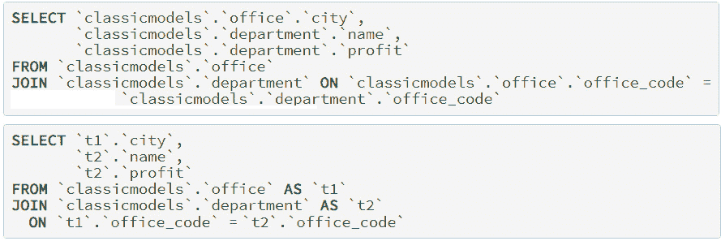
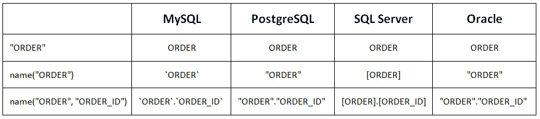

# *第十六章*：处理别名和 SQL 模板化

本章涵盖了两个重要的主题，这些主题将帮助您成为 jOOQ 高级用户：别名和 SQL 模板化。

本章的第一部分探讨了通过 jOOQ DSL 对表和列进行别名的几种实践。这部分的目标是在您需要通过 jOOQ 表达 SQL 别名时让您感到舒适，并为您提供一份全面的示例列表，涵盖最常见的用例。

本章的第二部分全部关于 SQL 模板化，或者说是当 jOOQ DSL 无法帮助我们时如何表达 SQL。在极少数情况下，您将不得不编写纯 SQL 或结合 DSL 和纯 SQL 来获取一些边缘情况或特定供应商的功能。

在本章中，我们将涵盖以下主要内容：

+   在 jOOQ 中表达 SQL 别名

+   SQL 模板化

让我们开始吧！

# 技术要求

本章的代码可以在 GitHub 上找到：[`github.com/PacktPublishing/jOOQ-Masterclass/tree/master/Chapter16`](https://github.com/PacktPublishing/jOOQ-Masterclass/tree/master/Chapter16)。

# 在 jOOQ 中表达 SQL 别名

SQL 别名化是一个简单的任务。毕竟，这仅仅是给你的列和表起一些昵称，并通过这些昵称来引用它们，而不是使用它们的真实名称。但尽管这看起来可能很简单，这实际上是一个相当有争议的话题。您可能会遇到的一些开放性问题可能听起来像这样：我只有在必要时才使用别名吗（例如，当我需要两次引用同一张表时）？我应该使用有意义的名称，还是单个字母就能行得通（如`p`、`q`、`t1`、`t2`等）？它们是否会提高可读性并减少输入时间？最可能的正确答案是这取决于……上下文、查询、谁在编写查询（开发者、DBA、生成器）等等！

如您很快就会看到的，通过 DSL 进行别名化需要我们遵守一些规则，并准备好应对一些冗长，因为宿主语言（在这里是 Java）存在一些 DSL 必须尽可能优雅地解决的缺点。别名化与派生表、算术表达式和类型转换并列，是 DSL 面临的主要挑战之一，因此让我们看看我们究竟需要了解哪些内容。

下面的部分中的示例可以通过*SimpleAliases*和*AliasesSamples*获取。

## 表达简单的别名表和列

无论您喜欢如何使用 SQL 别名，当您想在 jOOQ 中表达它们时，您必须了解几个方法，包括`as()`和`asTable()`，它们有多种风味，如`as(String alias)`、`as(Name alias)`、`as(Name as, Name... fieldAliases)`、`asTable()`、`asTable(String alias)`、`asTable(Name alias)`、`asTable(Table<?> alias)`等等。通常，我们必须处理别名表和字段。以下是一个使用 jOOQ 中别名表的快速示例：

```java
ctx.select(field(name("t", "first_name")), 
```

```java
           field(name("t", "last_name")))
```

```java
   .from(EMPLOYEE.as("t"))
```

```java
   .fetch();
```

```java
ctx.select(field(name("t", "product_id")), 
```

```java
           field(name("t", "product_name")),
```

```java
           field(selectCount()
```

```java
                  .from(PRODUCT)
```

```java
                  .where(PRODUCT.PRODUCT_ID.eq(
```

```java
                     field(name("t", "product_id"), 
```

```java
                       Long.class)))).as("count"))
```

```java
   .from(PRODUCT.as("t"))
```

```java
   .fetch();
```

以下是一些使用别名字段的示例（在这里用于完全控制 SQL 中生成的列名）：

```java
ctx.select(EMPLOYEE.FIRST_NAME.as("fn"), 
```

```java
           EMPLOYEE.LAST_NAME.as("ln"))
```

```java
   .from(EMPLOYEE).fetch();
```

```java
ctx.select(concat(EMPLOYEE.FIRST_NAME, 
```

```java
           inline(" "), EMPLOYEE.LAST_NAME).as("name"),
```

```java
           EMPLOYEE.EMAIL.as("contact"), 
```

```java
           EMPLOYEE.REPORTS_TO.as("boss_id"))
```

```java
   .from(EMPLOYEE).fetch();
```

接下来，我们将探讨一些使用别名的更复杂示例。

## 别名与 JOIN

我们看到 SQL 别名在`JOIN`语句中工作的一个常见情况是在`JOIN`语句中。人们宁愿将别名与连接的表关联起来，并通过这些别名来引用它们。例如，在下面的屏幕截图中，我们有一个没有使用别名的`JOIN`（顶部）和带有别名的`JOIN`（底部）的两个 MySQL 表（`OFFICE`和`DEPARTMENT`）：



图 16.1 – 带与不带别名的 JOIN

如果我们在 jOOQ 中表达第一个 SQL（不使用别名），那么我们会得到这个结果——在 jOOQ 中，每当你可以省略别名的使用时，就去做吧！这样，你就有更好的机会获得干净的表达式，就像这里所示：

```java
ctx.select(OFFICE.CITY, DEPARTMENT.NAME, DEPARTMENT.PROFIT)
```

```java
   .from(OFFICE)
```

```java
   .join(DEPARTMENT)
```

```java
   .on(OFFICE.OFFICE_CODE.eq(DEPARTMENT.OFFICE_CODE))
```

```java
   .fetch();
```

这是一个干净且可读的 jOOQ 代码片段。由于 jOOQ 代表我们生成 SQL，我们不需要添加一些别名来提高可读性或减少输入时间。

然而，接下来，让我们添加适当的别名以获得第二个 SQL。作为我们的第一次尝试，我们可能写了这个：

```java
ctx.select(field("t1.city"), 
```

```java
           field("t2.name"), field("t2.profit"))
```

```java
   .from(OFFICE.as("t1"))
```

```java
   .join(DEPARTMENT.as("t2"))
```

```java
   .on(field("t1.office_code").eq(field("t2.office_code")))
```

```java
   .fetch();
```

因此，我们通过`OFFICE.as("t1")`将`t1`别名与`OFFICE`表关联起来，通过`DEPARTMENT.as("t2")`将`t2`别名与`DEPARTMENT`表关联起来。此外，我们通过`field()`方法分别使用别名`t1`和`t2`。除了在 jOOQ 代码中失去一些可读性之外，你在这段代码与不带别名的 jOOQ 代码相比是否发现了其他问题？当然发现了——它不是类型安全的，并且渲染了未引号的标识符。

当我们说`field("t1.city")`时，jOOQ 渲染为`t1.city`，而不是` `t1`.`city` ``（在 MySQL 中）。然而，努力追求有资格和引号的标识符以避免名称冲突和潜在错误是明智的（例如，使用像`ORDER`这样的关键字作为未引号的表名会导致错误）。一般来说，引号标识符允许我们使用保留名称作为对象名称（例如，`ORDER`），在对象名称中使用特殊字符（空格等），并指示（大多数数据库）我们将不区分大小写的标识符视为区分大小写的标识符（例如，`"address"`和`"ADDRESS"`是不同的标识符，而`address`和`ADDRESS`不是）。

然而，如果我们依赖于显式使用`DSL.name()`，jOOQ 可以渲染有资格和引号的标识符，这是一个非常方便的`static`方法，它有多种形式，并且对于构建用于纯 SQL 的 SQL 注入安全、语法安全的 SQL 标识符非常有用。它通常用于`table()`和`field()`方法——例如，`name(table_name, field_name)`——但你可以在文档中查看所有形式。以下表格表示 jOOQ 为`name()`方法的不同用法和不同数据库渲染的内容：



图 16.2 – 使用 jOOQ 的 name()

当一个标识符出现多次时，它可以作为一个`Name`提取到局部变量中，并在需要时在查询中重复使用，如下所示：

```java
Name orderId = name("ORDER", "ORDER_ID");
```

```java
Field orderId = field(name("ORDER", "ORDER_ID"));
```

```java
Table t = table(name("ORDER"));
```

当 jOOQ 评估`name("ORDER", "ORDER_ID")`（针对 MySQL）时，它渲染为`` `ORDER`.`ORDER_ID` ``。当然，`ORDER_ID`不一定需要反引号——只需要`ORDER`需要。通过`quotedName()`和`unquotedName()`方法来玩转标识符的引号，如下所示：

```java
// `ORDER`.ORDER_ID
```

```java
Name orderId = name(quotedName("ORDER"), 
```

```java
                    unquotedName("ORDER_ID"));
```

此外，jOOQ 允许我们通过`RenderQuotedNames`设置来控制（全局或查询级别）标识符的引号方式，以及通过`RenderNameCase`设置来控制大小写。例如，我们可以指示 jOOQ 在当前查询的上半部分引用所有标识符，如下所示：

```java
For MySQL, jOOQ render this SQL:
```

```java
select `T`.`FIRST_NAME` as `FN`, `T`.`LAST_NAME` as `LN` 
```

```java
from `CLASSICMODELS`.`EMPLOYEE` as `T`
```

```java
ctx.configuration().derive(new Settings()
```

```java
   .withRenderQuotedNames(RenderQuotedNames.ALWAYS)
```

```java
   .withRenderNameCase(RenderNameCase.UPPER))
```

```java
   .dsl()
```

```java
   .select(field(name("t", "first_name")).as("fn"), 
```

```java
           field(name("t", "last_name")).as("ln"))
```

```java
   .from(EMPLOYEE.as("t"))
```

```java
   .fetch();
```

虽然您可以在文档中找到有关这些设置的更多详细信息（[`www.jooq.org/doc/latest/manual/sql-building/dsl-context/custom-settings/settings-name-style/`](https://www.jooq.org/doc/latest/manual/sql-building/dsl-context/custom-settings/settings-name-style/)），但请记住，它们仅影响通过基于 Java 的模式或`name()`表达的标识符。换句话说，它们对`field("identifier")`和`table("identifier")`没有影响。这些将按照您提供的方式渲染。

jOOQ 不会以任何方式强迫我们在同一个查询或多个查询中一致地使用引号、限定符和大小写（因为 jOOQ 默认渲染）。然而，处理这些方面可能会导致问题，从结果不一致到 SQL 错误。这是因为，在某些数据库（例如，SQL Server）中，标识符始终是不区分大小写的。这意味着引号仅有助于允许在标识符中使用特殊字符或转义关键字。在其他数据库（例如，Oracle）中，如果标识符未引用，则它们是不区分大小写的，而引用的标识符是大小写敏感的。然而，也存在标识符始终是大小写敏感的数据库（例如，Sybase ASE），无论它们是否被引用。再次强调，引号仅有助于允许在标识符中使用特殊字符或转义关键字。而且，我们不要忘记那些混合上述规则的方言（例如，MySQL），这些规则取决于操作系统、对象类型、配置和其他事件。

因此，请注意您如何决定处理引号、限定符和大小写敏感性的方面。最好的/最安全的方法是通过基于 Java 的模式表达查询，仅在必要时使用别名，并且如果您必须将标识符作为纯字符串引用，则始终使用`name()`。从那时起，让 jOOQ 做剩下的工作。

话虽如此，如果您在我们的查询中应用`name()`，则会得到以下代码：

```java
ctx.select(field(name("t1", "city")), 
```

```java
      field(name("t2", "name")), field(name("t2", "profit")))
```

```java
   .from(OFFICE.as(name("t1")))
```

```java
   .join(DEPARTMENT.as(name("t2")))
```

```java
   .on(field(name("t1", "office_code"))
```

```java
        .eq(field(name("t2", "office_code"))))
```

```java
   .fetch();
```

这次，渲染的标识符符合我们的预期，但这个 jOOQ 代码片段仍然不是类型安全的。要将这个非类型安全的查询转换为类型安全的查询，我们必须在使用之前提取别名并在局部变量中定义它们，如下所示（注意没有必要显式使用 `name()`）：

```java
Office t1 = OFFICE.as("t1");
```

```java
Department t2 = DEPARTMENT.as("t2");
```

```java
ctx.select(t1.CITY, t2.NAME, t2.PROFIT)
```

```java
   .from(t1)
```

```java
   .join(t2)
```

```java
   .on(t1.OFFICE_CODE.eq(t2.OFFICE_CODE))
```

```java
   .fetch();
```

或者，你可能更喜欢以下这种最小化别名方法：

```java
Department t = DEPARTMENT.as("t"); 
```

```java
// or, Department t = DEPARTMENT;
```

```java
ctx.select(OFFICE.CITY, t.NAME, t.PROFIT)
```

```java
   .from(OFFICE)
```

```java
   .join(t)
```

```java
   .on(OFFICE.OFFICE_CODE.eq(t.OFFICE_CODE))
```

```java
   .fetch();
```

在生成的表上调用 `as()` 方法（在这里，在 `OFFICE` 和 `DEPARTMENT` 上）返回与表相同类型的对象（`jooq.generated.tables.Office` 和 `jooq.generated.tables.Department`）。这个结果对象可以用来以类型安全的方式从别名表中取消引用字段。因此，多亏了 `as()`，`Office` 和 `Department`，我们在使用所需的表别名时再次实现了类型安全。当然，标识符是隐式渲染、引号和限定的。

重要提示

作为一条经验法则，在 jOOQ 中，在使用查询之前，尽量在局部变量中提取和声明别名。特别是如果你的别名引用了生成的表，是应该在多个查询中重复使用的别名，你希望提高 jOOQ 表达式的可读性以及避免打字错误等。当然，如果你的 jOOQ 表达式只是将一些别名关联到列（以完全控制你 SQL 中生成的列名），那么将它们作为局部变量提取不会产生显著的改进。

让我们看看以下这样别名的表：

```java
Table<Record1<String>> t3 = 
```

```java
  ctx.select(t1.CITY).from(t1).asTable("t3");
```

在这种情况下，我们可以通过 `field(Name name)` 以非类型安全的方式引用字段，如下例所示：

```java
ctx.select(t3.field(name("city")), 
```

```java
      CUSTOMERDETAIL.CUSTOMER_NUMBER)
```

```java
   .from(t3)
```

```java
   .join(CUSTOMERDETAIL)
```

```java
   .on(t3.field(name("city"), String.class)
```

```java
     .eq(CUSTOMERDETAIL.CITY))
```

```java
   .fetch();
```

同样的 `field()` 方法可以应用于任何类型不安全的别名表，作为 `Table<?>` 返回 `Field<?>`。

在这种情况下，我们可以通过 `<T> Field<T> field(Field<T> field)` 方法（在*第十四章**，派生表、CTE 和视图*中介绍）使这些字段看起来是类型安全的。`t3.field(name("city"))` 表达式间接引用了 `t1.CITY` 字段，因此我们可以以类型安全的方式重写我们的查询，如下所示：

```java
ctx.select(t3.field(t1.CITY), CUSTOMERDETAIL.CUSTOMER_NUMBER)
```

```java
   .from(t3)
```

```java
   .join(CUSTOMERDETAIL)
```

```java
   .on(t3.field(t1.CITY).eq(CUSTOMERDETAIL.CITY))
```

```java
   .fetch();
```

然而，请记住，`Table.field(Field<T>):Field<T>` 只是看起来是类型安全的。它和 Java 中的不安全转换一样好，因为查找只考虑标识符，而不是类型。它也不会强制转换表达式。

到这里为止，一切顺利！你可以在 *AliasesSamples* 中练习这些示例。现在，让我们花一些时间来介绍 jOOQ 别名的几个基本方面，并练习一些简单但重要的练习。

## 别名和 GROUP BY/ORDER BY

让我们考虑以下在 SQL Server 中表达的 SQL：

```java
SELECT [classicmodels].[dbo].[product].[product_line] [pl]
```

```java
FROM [classicmodels].[dbo].[product]
```

```java
GROUP BY [classicmodels].[dbo].[product].[product_line]
```

```java
ORDER BY [pl]
```

这个查询使用了一个名为 `pl` 的别名来表示 `PRODUCT_LINE` 列。根据我们之前学到的知识，尝试通过 jOOQ 表达这个查询可能会得到如下结果：

```java
Field<String> pl = PRODUCT.PRODUCT_LINE.as("pl");     
```

```java
ctx.select(pl)
```

```java
   .from(PRODUCT)
```

```java
   .groupBy(pl)
```

```java
   .orderBy(pl)
```

```java
   .fetch();
```

但这并不正确！这里的问题与我们的期望有关。我们期望`PRODUCT.PRODUCT_LINE.as("pl")`在`ORDER BY`中产生`[pl]`，在`GROUP BY`中产生`[classicmodels].[dbo].[product].[product_line]`，在`SELECT`中产生`[classicmodels].[dbo].[product].[product_line] [pl]`。换句话说，我们期望局部变量`pl`的三种使用方式能够神奇地渲染出对我们更有意义的输出。但是，这不是真的！

考虑 jOOQ DSL 更像是表达式树。因此，我们可以将`PRODUCT.PRODUCT_LINE`和`PRODUCT.PRODUCT_LINE.as("pl")`存储在单独的局部变量中，并明确重用那个最有意义的：

```java
Field<String> pl1 = PRODUCT.PRODUCT_LINE.as("pl");     
```

```java
Field<String> pl2 = PRODUCT.PRODUCT_LINE;   
```

```java
ctx.select(pl1)
```

```java
   .from(PRODUCT)
```

```java
   .groupBy(pl2)
```

```java
   .orderBy(pl1)
```

```java
   .fetch();
```

这次，这是正确的！

重要提示

在查询中重复使用`x.as("y")`表达式，并认为它“神奇地”产生`x`或`y`，无论哪个更有意义，这是对 jOOQ 别名的真正错误理解。认为`x.as("y")`在`GROUP BY`中生成`x`，在`ORDER BY`中生成`y`，在`SELECT`中生成`x.as("y")`是危险的逻辑，这会让你头疼。别名的表达式`x.as("y")`在`SELECT`之外“到处”产生`y`，并在`SELECT`中产生别名的声明（但只在`SELECT`中立即产生）。它“永远不会”只产生`x`。

你可以在*AliasesSamples*中练习这些示例。

## 别名和错误的假设

接下来，让我们考虑以下截图所示的示例：

![图 16.3 – 别名使用案例

![图片/B16833_Figure_16.3.jpg]

图 16.3 – 别名使用案例

你对（A）和（B）有什么看法？如果你说（A）是正确的，而（B）是错误的，那么你是正确的。恭喜！关于（B），由于我们给`[office]`表分配了一个别名，`[office].[city]`列就变得未知了。渲染的 SQL 突出了以下方面：

```java
SELECT [classicmodels].[dbo].[office].[city]
```

```java
FROM [classicmodels].[dbo].[office] [t]
```

因此，一个简单直接的方法就是简单地移除别名。现在，让我们考察几个错误的选项。首先，让我们探索这个：

```java
// SELECT t FROM [classicmodels].[dbo].[office] [t]        
```

```java
ctx.select(field("t", "city"))
```

```java
   .from(OFFICE.as("t"))
```

```java
   .fetch();
```

这种构建基于这样的假设，即 jOOQ 公开了一个方法`field(String table_name, String field_name)`，但实际上没有这样的方法！那么为什么前面的代码可以编译呢？因为 DSL 公开了一个`field(String sql, Object... bindings)`，它用于 SQL 模板，它被用在了错误的环境中。注意这样的愚蠢错误！谁没有觉得幸运并试图在不阅读文档的情况下使用 API 呢？!

那么，这个怎么样？

```java
// SELECT [t].[office_code], [t].[city], ..., [t].[location] 
```

```java
// FROM [classicmodels].[dbo].[office] [t]
```

```java
ctx.select(table("t").field("city"))
```

```java
   .from(OFFICE.as("t"))
```

```java
   .fetch();
```

这只是基于错误假设的另一个例子。虽然 jOOQ 公开了一个`table(String sql)`，这对于返回一个包装给定普通 SQL 的表很有用，但这个例子假设存在一个`table(String alias)`，它返回一个包装别名的表，并且知道其字段。

进一步来说，让我们尝试这种方法：

```java
// SELECT [city] FROM [classicmodels].[dbo].[office] [t]
```

```java
ctx.select(field(name("city")))
```

```java
   .from(OFFICE.as("t"))
```

```java
   .fetch();
```

这种方法可以正常工作，但你必须意识到，未限定的`[city]`容易产生歧义。例如，假设我们按照以下方式丰富这个查询：

```java
ctx.select(field(name("city")))                   
```

```java
   .from(OFFICE.as("t1"), CUSTOMERDETAIL.as("t2"))
```

```java
   .fetch();
```

这导致了一个模糊的列，`[city]`，因为它不清楚我们是引用`OFFICE.CITY`还是`CUSTOMERDETAIL.CITY`。在这种情况下，表别名可以帮助我们清楚地表达这一点：

```java
ctx.select(field(name("t1", "city")).as("city_office"),     
```

```java
           field(name("t2", "city")).as("city_customer"))
```

```java
   .from(OFFICE.as("t1"), CUSTOMERDETAIL.as("t2"))
```

```java
   .fetch();
```

在使用之前声明别名要好得多：

```java
Office t1 = OFFICE.as("t1");
```

```java
Customerdetail t2 = CUSTOMERDETAIL.as("t2");
```

```java
ctx.select(t1.CITY, t2.CITY)
```

```java
   .from(t1, t2)
```

```java
   .fetch();
```

```java
Field<String> c1 = t1.CITY.as("city_office");
```

```java
Field<String> c2 = t2.CITY.as("city_customer");
```

```java
ctx.select(c1, c2)
```

```java
   .from(t1, t2)
```

```java
   .fetch();
```

现在，让我们看看另一个案例，并从以下代码片段开始。那么，这里有什么问题？

```java
ctx.select()
```

```java
   .from(OFFICE
```

```java
   .leftOuterJoin(DEPARTMENT)
```

```java
     .on(OFFICE.OFFICE_CODE.eq(DEPARTMENT.OFFICE_CODE)))
```

```java
   .innerJoin(EMPLOYEE)
```

```java
     .on(EMPLOYEE.OFFICE_CODE.eq(
```

```java
        field(name("office_code"), String.class)))
```

```java
   .fetch();
```

在将`OFFICE`和`DEPARTMENT`连接后，结果包含两个名为`office_code`的列——一个来自`OFFICE`，另一个来自`DEPARTMENT`。将此结果与`EMPLOYEE`连接显示，`ON`子句中的`office_code`列是模糊的。为了消除这种模糊性，我们可以使用别名的表：

```java
ctx.select()
```

```java
   .from(OFFICE.as("o")
```

```java
   .leftOuterJoin(DEPARTMENT.as("d"))
```

```java
     .on(field(name("o","office_code"))
```

```java
       .eq(field(name("d","office_code")))))
```

```java
   .innerJoin(EMPLOYEE)
```

```java
     .on(EMPLOYEE.OFFICE_CODE.eq(OFFICE.OFFICE_CODE))
```

```java
   .fetch();
```

这正确吗？这次，我们已经将别名与我们的`OFFICE.as("o")`和`DEPARTMENT.as("d")`表相关联。在将`OFFICE`与`DEPARTMENT`连接时，我们正确地使用了别名，但当我们将结果连接到`EMPLOYEE`时，我们没有使用`OFFICE`别名——我们使用了未别名的`OFFICE.OFFICE_CODE`。这在 MySQL 中表示为`` `classicmodels`.`office`.`office_code` ``，它代表`ON`子句中的一个未知列。因此，正确的表达式如下：

```java
ctx.select()
```

```java
   .from(OFFICE.as("o")
```

```java
   .leftOuterJoin(DEPARTMENT.as("d"))
```

```java
     .on(field(name("o","office_code"))
```

```java
       .eq(field(name("d","office_code")))))
```

```java
   .innerJoin(EMPLOYEE)
```

```java
     .on(EMPLOYEE.OFFICE_CODE
```

```java
       .eq(field(name("o","office_code"), String.class)))
```

```java
   .fetch();
```

我们能否将其写得更紧凑且类型安全？当然可以——通过局部变量：

```java
Office o = OFFICE.as("o");
```

```java
Department d = DEPARTMENT.as("d");
```

```java
ctx.select()
```

```java
   .from(o.leftOuterJoin(d)
```

```java
   .on(o.OFFICE_CODE.eq(d.OFFICE_CODE)))
```

```java
   .innerJoin(EMPLOYEE)
```

```java
     .on(EMPLOYEE.OFFICE_CODE.eq(o.OFFICE_CODE))
```

```java
   .fetch();
```

再次，局部变量帮助我们表达别名并获得优雅的代码。

## 别名和打字错误

接下来，让我们看看另一种在局部变量中提取别名的办法。查看以下代码：

```java
ctx.select(field("s1.msrp"), field("s2.msrp"))
```

```java
   .from(PRODUCT.as("s1"), PRODUCT.as("s2"))
```

```java
   .where(field("s1.msrp").lt(field("s2.msrp"))
```

```java
      .and(field("s1.product_line").eq("s2.product_line")))
```

```java
   .groupBy(field("s1.msrp"), field("s2.msrp"))
```

```java
   .having(count().eq(selectCount().from(PRODUCT.as("s3"))
```

```java
   .where(field("s3.msrp").eq(field("s1.msrp"))))
```

```java
      .and(count().eq(selectCount().from(PRODUCT.as("s4"))
```

```java
      .where(field("s4.msrp").eq(field("s2.msrp"))))))
```

```java
   .fetch();
```

这个表达式中有一个错误（一个打字错误）。你能找到它吗？（这并不容易！）如果不能，你将得到一个有效的 SQL 语句，但它返回不准确的结果。这个打字错误悄悄地进入了代码的`.and(field("s1.product_line").eq("s2.product_line")))`部分，它应该是`.and(field("s1.product_line").eq(field("s2.product_line"))))`。但如果我们在局部变量中提取别名，那么代码就消除了打字错误的风险，并提高了表达式的可读性（注意`s1`、`s2`、`s3`和`s4`不是相等对象，它们不能互换使用）：

```java
Product s1 = PRODUCT.as("s1");
```

```java
Product s2 = PRODUCT.as("s2");
```

```java
Product s3 = PRODUCT.as("s3");
```

```java
Product s4 = PRODUCT.as("s4");
```

```java
ctx.select(s1.MSRP, s2.MSRP)
```

```java
   .from(s1, s2)
```

```java
   .where(s1.MSRP.lt(s2.MSRP)
```

```java
   .and(s1.PRODUCT_LINE.eq(s2.PRODUCT_LINE)))
```

```java
   .groupBy(s1.MSRP, s2.MSRP)
```

```java
   .having(count().eq(selectCount().from(s3)
```

```java
     .where(s3.MSRP.eq(s1.MSRP)))
```

```java
     .and(count().eq(selectCount().from(s4)
```

```java
     .where(s4.MSRP.eq(s2.MSRP)))))
```

```java
   .fetch();
```

你可以在*AliasesSamples*中练习这些例子。

## 别名和派生表

让我们看看另一个例子，它从以下代码片段开始：

```java
ctx.select().from(
```

```java
 select(CUSTOMER.CUSTOMER_NUMBER, 
```

```java
        CUSTOMER.CUSTOMER_NAME, field("t.invoice_amount"))
```

```java
 .from(CUSTOMER)
```

```java
 .join(select(PAYMENT.CUSTOMER_NUMBER, 
```

```java
              PAYMENT.INVOICE_AMOUNT)
```

```java
        .from(PAYMENT).asTable("t"))
```

```java
  .on(field("t.customer_number")
```

```java
    .eq(CUSTOMER.CUSTOMER_NUMBER))) 
```

```java
 .fetch();
```

那么，这里有什么问题？！让我们检查生成的 SQL（这是针对 MySQL 的）：

```java
SELECT `alias_84938429`.`customer_number`,
```

```java
       `alias_84938429`.`customer_name`,
```

```java
       `alias_84938429`.t.invoice_amount
```

```java
FROM
```

```java
  (SELECT `classicmodels`.`customer`.`customer_number`,
```

```java
          `classicmodels`.`customer`.`customer_name`,
```

```java
          t.invoice_amount
```

```java
   FROM `classicmodels`.`customer`
```

```java
   JOIN
```

```java
     (SELECT `classicmodels`.`payment`.`customer_number`,
```

```java
             `classicmodels`.`payment`.`invoice_amount`
```

```java
      FROM `classicmodels`.`payment`) AS `t` ON 
```

```java
       t.customer_number = 
```

```java
        `classicmodels`.`customer`.`customer_number`) 
```

```java
      AS `alias_84938429
```

如您所见，jOOQ 已自动将一个别名与从`JOIN`获得的派生表（`alias_84938429`）相关联，并使用此别名来引用`customer_number`、`customer_name`和`invoice_amount`。虽然`customer_number`和`customer_name`被正确地限定和引用，但`invoice_amount`被错误地表示为`t.invoice_amount`。问题在于`field("t.invoice_amount")`，它指示 jOOQ 列名是`t.invoice_amount`，而不是`invoice_amount`，因此结果`` `alias_84938429`.t.invoice_amount ``是一个未知列。

有几种解决方案可以解决这个问题，其中之一是使用`name()`来进行适当的引号和限定：

```java
ctx.select().from(select(CUSTOMER.CUSTOMER_NUMBER,   
```

```java
CUSTOMER.CUSTOMER_NAME, field(name("t", "invoice_amount")))
```

```java
   .from(CUSTOMER)
```

```java
   .join(
```

```java
     select(PAYMENT.CUSTOMER_NUMBER, 
```

```java
            PAYMENT.INVOICE_AMOUNT)
```

```java
      .from(PAYMENT).asTable("t"))
```

```java
   .on(field(name("t", "customer_number"))
```

```java
     .eq(CUSTOMER.CUSTOMER_NUMBER)))
```

```java
   .fetch();    
```

这次，jOOQ 渲染了` `alias_10104609`.`invoice_amount` ``。在捆绑的代码中，您可以看到针对此问题的四个更多解决方案。

为了理解这个上下文，让我们看看以下示例：

```java
ctx.select()
```

```java
   .from(select(EMPLOYEE.EMPLOYEE_NUMBER.as("en"), 
```

```java
                EMPLOYEE.SALARY.as("sal"))
```

```java
             .from(EMPLOYEE)
```

```java
             .where(EMPLOYEE.MONTHLY_BONUS.isNull()))
```

```java
             .innerJoin(SALE)
```

```java
             .on(field(name("en"))
```

```java
             .eq(SALE.EMPLOYEE_NUMBER))
```

```java
   .fetch();
```

在这里，我们明确地将列别名与内部`SELECT`关联起来，但没有将别名与由`JOIN`产生的派生表关联起来。这些别名进一步用于引用此`SELECT`（外部`SELECT`）之外的列。请注意，我们让 jOOQ 将这些别名限定为生成的分割表的别名：

```java
SELECT `alias_41049514`.`en`,
```

```java
       `alias_41049514`.`sal`,
```

```java
       `classicmodels`.`sale`.`sale_id`,
```

```java
       ...
```

```java
FROM
```

```java
  (SELECT `classicmodels`.`employee`.`employee_number` 
```

```java
       AS `en`, `classicmodels`.`employee`.`salary` AS `sal`
```

```java
   FROM `classicmodels`.`employee`
```

```java
   WHERE `classicmodels`.`employee`.`monthly_bonus` IS NULL 
```

```java
         ) AS `alias_41049514`
```

```java
JOIN `classicmodels`.`sale` ON `en` = 
```

```java
     `classicmodels`.`sale`.`employee_number`
```

如果我们想要控制派生表的别名，则可以这样做：

```java
ctx.select(SALE.SALE_, SALE.FISCAL_YEAR, 
```

```java
           field(name("t", "sal")))
```

```java
   .from(select(EMPLOYEE.EMPLOYEE_NUMBER.as("en"), 
```

```java
                EMPLOYEE.SALARY.as("sal"))
```

```java
         .from(EMPLOYEE)
```

```java
         .where(EMPLOYEE.MONTHLY_BONUS.isNull())
```

```java
                .asTable("t"))
```

```java
         .innerJoin(SALE)
```

```java
          .on(field(name("t", "en"))
```

```java
          .eq(SALE.EMPLOYEE_NUMBER))
```

```java
   .fetch();
```

这次，渲染的 SQL 使用了我们的表别名：

```java
SELECT `classicmodels`.`sale`.`sale`,
```

```java
       `classicmodels`.`sale`.`fiscal_year`,
```

```java
       `t`.`sal`
```

```java
FROM
```

```java
  (SELECT `classicmodels`.`employee`.`employee_number` 
```

```java
    AS `en`, `classicmodels`.`employee`.`salary` AS `sal`
```

```java
   FROM `classicmodels`.`employee`
```

```java
   WHERE `classicmodels`.`employee`.`monthly_bonus`  
```

```java
      IS NULL) AS `t`
```

```java
JOIN `classicmodels`.`sale` ON `t`.`en` = 
```

```java
     `classicmodels`.`sale`.`employee_number`
```

最后，这里是一个使用别名的更详细示例：

```java
ctx.select(field(name("t2", "s")).as("c1"), 
```

```java
           field(name("t2", "y")).as("c2"), 
```

```java
           field(name("t2", "i")).as("c3"))
```

```java
   .from(select(SALE.SALE_.as("s"), SALE.FISCAL_YEAR.as("y"), 
```

```java
                field(name("t1", "emp_sal")).as("i"))
```

```java
          .from(select(EMPLOYEE.EMPLOYEE_NUMBER.as("emp_nr"), 
```

```java
               EMPLOYEE.SALARY.as("emp_sal"))
```

```java
                 .from(EMPLOYEE)
```

```java
                 .where(EMPLOYEE.MONTHLY_BONUS.isNull())
```

```java
                 .asTable("t1"))
```

```java
   .innerJoin(SALE)
```

```java
   .on(field(name("t1","emp_nr"))
```

```java
     .eq(SALE.EMPLOYEE_NUMBER)).asTable("t2"))
```

```java
   .fetch();
```

请花时间分析这个表达式和生成的 SQL：

```java
SELECT `t2`.`s` AS `c1`,
```

```java
       `t2`.`y` AS `c2`,
```

```java
       `t2`.`i` AS `c3`
```

```java
FROM
```

```java
  (SELECT `classicmodels`.`sale`.`sale` AS `s`,
```

```java
          `classicmodels`.`sale`.`fiscal_year` AS `y`,
```

```java
          `t1`.`emp_sal` AS `i`
```

```java
   FROM
```

```java
     (SELECT `classicmodels`.`employee`.`employee_number` 
```

```java
                 AS `emp_nr`, 
```

```java
             `classicmodels`.`employee`.`salary`  
```

```java
                 AS `emp_sal`
```

```java
      FROM `classicmodels`.`employee`
```

```java
      WHERE `classicmodels`.`employee`.`monthly_bonus` 
```

```java
        IS NULL) AS `t1`
```

```java
   JOIN `classicmodels`.`sale` ON `t1`.`emp_nr` = 
```

```java
        `classicmodels`.`sale`.`employee_number`) AS `t2`
```

现在，让我们看看更多使用别名的例子。

## 派生列列表

当列名事先未知（但表度已知！）时，我们可以使用所谓的*派生列列表*。您已经看到了许多使用此功能与未嵌套表的例子，所以这里再提供两个关于`VALUES()`表构造器和常规表的例子：

```java
ctx.select().from(values(row("A", "John", 4333, false))
```

```java
  .as("T", "A", "B", "C", "D")).fetch();
```

以下代码是针对常规表的：

```java
ctx.select(min(field(name("t", "rdate"))).as("cluster_start"),
```

```java
         max(field(name("t", "rdate"))).as("cluster_end"),
```

```java
         min(field(name("t", "status"))).as("cluster_status"))
```

```java
    .from(select(ORDER.REQUIRED_DATE, ORDER.STATUS,
```

```java
           rowNumber().over().orderBy(ORDER.REQUIRED_DATE)
```

```java
           .minus(rowNumber().over().partitionBy(ORDER.STATUS)
```

```java
            .orderBy(ORDER.REQUIRED_DATE)))
```

```java
            .from(ORDER)
```

```java
            .asTable("t", "rdate", "status", "cluster"))
```

```java
    .groupBy(field(name("t", "cluster")))
```

```java
    .orderBy(1)
```

```java
    .fetch(); 
```

如果您不熟悉这类别名，请花时间检查渲染的 SQL 并阅读一些文档。

## 别名和 CASE 表达式

别名也可以与`CASE`表达式一起使用。以下是一个示例：

```java
ctx.select(EMPLOYEE.SALARY,
```

```java
  count(case_().when(EMPLOYEE.SALARY
```

```java
   .gt(0).and(EMPLOYEE.SALARY.lt(50000)), 1)).as("< 50000"),
```

```java
  count(case_().when(EMPLOYEE.SALARY.gt(50000)
```

```java
   .and(EMPLOYEE.SALARY.lt(100000)), 1)).as("50000 - 100000"),
```

```java
  count(case_().when(EMPLOYEE.SALARY
```

```java
   .gt(100000), 1)).as("> 100000"))
```

```java
 .from(EMPLOYEE)
```

```java
 .groupBy(EMPLOYEE.SALARY)
```

```java
 .fetch();
```

它们也可以用于`FILTER WHERE`表达式：

```java
ctx.select(EMPLOYEE.SALARY,
```

```java
  count().filterWhere(EMPLOYEE.SALARY
```

```java
   .gt(0).and(EMPLOYEE.SALARY.lt(50000))).as("< 50000"),
```

```java
  count().filterWhere(EMPLOYEE.SALARY.gt(50000)
```

```java
   .and(EMPLOYEE.SALARY.lt(100000))).as("50000 - 100000"),
```

```java
  count().filterWhere(EMPLOYEE.SALARY
```

```java
   .gt(100000)).as("> 100000"))               
```

```java
 .from(EMPLOYEE)
```

```java
 .groupBy(EMPLOYEE.SALARY)
```

```java
 .fetch();
```

如您所见，在`CASE`/`FILTER`表达式中使用别名非常方便，因为它允许我们更好地表达每个案例的含义。

## 别名和 IS NOT NULL

如果我们将`Condition`包裹在`field()`中，以获得`Field<Boolean>`，则可以使用别名与`IS NOT NULL`（及其相关项）一起使用：

```java
ctx.select(EMPLOYEE.FIRST_NAME, 
```

```java
           EMPLOYEE.LAST_NAME, EMPLOYEE.COMMISSION,
```

```java
           field(EMPLOYEE.COMMISSION.isNotNull()).as("C"))
```

```java
   .from(EMPLOYEE)
```

```java
   .fetch();
```

最后，让我们快速看一下别名和 CTE。

## 别名和 CTE（公用表表达式）

在*第十四章*“派生表、CTE 和视图”中，我们探讨了在 CTE 和派生表中使用别名的许多示例，所以如果您想熟悉这个主题，请考虑这一章。接下来，让我们谈谈 SQL 模板。

# SQL 模板

当我们谈论 SQL 模板或纯 SQL 模板语言时，我们是在谈论那些 DSL 无法帮助我们表达 SQL 的情况。jOOQ DSL 通过不断添加更多功能，力求尽可能覆盖 SQL，但仍然可能会发现一些角落案例语法或供应商特定的功能不会被 DSL 覆盖。在这种情况下，jOOQ 允许我们通过纯 SQL 字符串或查询部分（{0}，{1}，……）使用 Plain SQL API 来表示 SQL。

纯 SQL API 在一系列重载方法中实现，可以在 DSL 无法提供帮助的地方使用。以下是一些示例：

```java
field/table(String sql)
```

```java
field(String sql, Class<T> type)
```

```java
field(String sql, Class<T> type, Object... bindings)
```

```java
field(String sql, Class<T> type, QueryPart... parts)
```

```java
field/table(String sql, Object... bindings)
```

```java
field(String sql, DataType<T> type)
```

```java
field(String sql, DataType<T> type, Object... bindings)
```

```java
field(String sql, DataType<T> type, QueryPart... parts)
```

```java
field/table(String sql, QueryPart... parts)
```

```java
from/where/join …(String string)
```

```java
from/where/join …(String string, Object... os)
```

```java
from/where/join …(String string, QueryPart... qps)
```

因此，我们可以按以下方式传递 SQL：

+   纯 SQL 字符串

+   纯 SQL 字符串和绑定(?)

+   纯 SQL 字符串和`QueryPart`

绑定和查询部分重载使用所谓的纯 SQL 模板语言。

这里有一些使用纯 SQL 和绑定值的示例（这些示例在 *SQLTemplating* 中可用）：

```java
ctx.fetch("""
```

```java
          SELECT first_name, last_name
```

```java
          FROM employee WHERE salary > ? AND job_title = ?
```

```java
          """, 5000, "Sales Rep");
```

```java
ctx.resultQuery("""
```

```java
           SELECT first_name, last_name
```

```java
           FROM employee WHERE salary > ? AND job_title = ?
```

```java
           """, 5000, "Sales Rep")
```

```java
   .fetch();
```

```java
ctx.query("""
```

```java
          UPDATE product SET product.quantity_in_stock = ? 
```

```java
          WHERE product.product_id = ?
```

```java
          """, 0, 2)
```

```java
   .execute();
```

```java
ctx.queries(query(""), query(""), query(""))
```

```java
           .executeBatch();
```

现在，让我们看看一些示例，帮助你熟悉将纯 SQL 与通过 DSL 表达的 SQL 混合的技术。让我们考虑以下 MySQL 查询：

```java
SELECT `classicmodels`.`office`.`office_code`,
```

```java
       ...
```

```java
       `classicmodels`.`customerdetail`.`customer_number`,
```

```java
       ...
```

```java
FROM `classicmodels`.`office`
```

```java
JOIN `classicmodels`.`customerdetail` 
```

```java
ON `classicmodels`.`office`.`postal_code` =   
```

```java
   `classicmodels`.`customerdetail`.`postal_code`
```

```java
WHERE not((
```

```java
  `classicmodels`.`office`.`city`,   
```

```java
`classicmodels`.`office`.`country`) 
```

```java
   <=> (`classicmodels`.`customerdetail`.`city`,   
```

```java
        `classicmodels`.`customerdetail`.`country`))
```

如果你是一个 jOOQ 新手，并且试图通过 jOOQ DSL 表达此查询，那么你可能会在突出显示的代码中遇到一些问题。我们能否通过 DSL 表达这部分？答案是肯定的，但如果找不到适当的解决方案，我们也可以将其嵌入为纯 SQL。以下是代码：

```java
ctx.select() 
```

```java
   .from(OFFICE) 
```

```java
   .innerJoin(CUSTOMERDETAIL) 
```

```java
   .on(OFFICE.POSTAL_CODE.eq(CUSTOMERDETAIL.POSTAL_CODE)) 
```

```java
   .where("""
```

```java
            not(
```

```java
                 (
```

```java
                   `classicmodels`.`office`.`city`, 
```

```java
                   `classicmodels`.`office`.`country`
```

```java
                 ) <=> (
```

```java
                   `classicmodels`.`customerdetail`.`city`, 
```

```java
                   `classicmodels`.`customerdetail`.`country`
```

```java
                 )
```

```java
               )
```

```java
          """) 
```

```java
   .fetch();
```

完成！当然，一旦你更熟悉 jOOQ DSL，你将能够通过 DSL 100% 表达此查询，并让 jOOQ 适当模拟（更好！）：

```java
ctx.select() 
```

```java
   .from(OFFICE) 
```

```java
   .innerJoin(CUSTOMERDETAIL) 
```

```java
   .on(OFFICE.POSTAL_CODE.eq(CUSTOMERDETAIL.POSTAL_CODE)) 
```

```java
   .where(row(OFFICE.CITY, OFFICE.COUNTRY)
```

```java
   .isDistinctFrom(row(
```

```java
      CUSTOMERDETAIL.CITY, CUSTOMERDETAIL.COUNTRY))) 
```

```java
   .fetch();
```

但有时，你需要 SQL 模板。例如，MySQL 定义了一个函数，`CONCAT_WS(separator, exp1, exp2, exp3,...)`，该函数使用给定的分隔符将两个或多个表达式组合在一起。此函数没有 jOOQ 对应项，因此我们可以通过 SQL 模板（这里为纯 SQL 和查询部分）使用它，如下所示：

```java
ctx.select(PRODUCT.PRODUCT_NAME,
```

```java
           field("CONCAT_WS({0}, {1}, {2})", 
```

```java
                 String.class, val("-"), 
```

```java
                 PRODUCT.BUY_PRICE, PRODUCT.MSRP))
```

```java
   .from(PRODUCT)
```

```java
   .fetch();
```

由于要连接的部分数量可能不同，因此依赖方便的 `DSL.list(QueryPart...)` 会更实用，它允许我们在单个模板参数中定义逗号分隔的查询部分列表：

```java
ctx.select(PRODUCT.PRODUCT_NAME,
```

```java
           field("CONCAT_WS({0}, {1})", 
```

```java
                 String.class, val("-"), 
```

```java
                 list(PRODUCT.BUY_PRICE, PRODUCT.MSRP)))
```

```java
   .from(PRODUCT)
```

```java
   .fetch();
```

这次，模板参数 `{1}` 已被替换为应连接的字符串列表。现在，你可以简单地传递那个列表。

jOOQ DSL 也不支持 MySQL 变量 (`@variable`)。例如，你将如何表达以下使用 `@type` 和 `@num` 变量的 MySQL 查询？

```java
SELECT `classicmodels`.`employee`.`job_title`,
```

```java
   `classicmodels`.`employee`.`salary`, 
```

```java
   @num := if(@type = `classicmodels`.`employee`.
```

```java
              `job_title`, @num + 1, 1) AS `rn`, 
```

```java
   @type := `classicmodels`.`employee`.`job_title` AS `dummy`
```

```java
FROM `classicmodels`.`employee`
```

```java
ORDER BY `classicmodels`.`employee`.`job_title`,
```

```java
         `classicmodels`.`employee`.`salary`   
```

这里的 SQL 模板可以救命：

```java
ctx.select(EMPLOYEE.JOB_TITLE, EMPLOYEE.SALARY,
```

```java
        field("@num := if(@type = {0}, @num + 1, 1)", 
```

```java
        EMPLOYEE.JOB_TITLE).as("rn"),
```

```java
        field("@type := {0}", EMPLOYEE.JOB_TITLE).as("dummy"))
```

```java
   .from(EMPLOYEE)
```

```java
   .orderBy(EMPLOYEE.JOB_TITLE, EMPLOYEE.SALARY)
```

```java
   .fetch();
```

你可以在 *SQLTemplating* 中练习这些示例以及其他示例。

当我们需要处理某些数据类型时，SQL 模板也非常有用，例如 PostgreSQL 的 `HSTORE` 数据类型。我们知道 jOOQ 允许我们定义转换器和绑定，特别是用于处理此类类型。在 *第七章*，*类型、转换器和绑定* 中，我们为 `HSTORE` 数据类型编写了一个 `org.jooq.Converter` 和一个 `org.jooq.Binding`。此外，`jooq-postgres-extensions` 模块也支持 `HSTORE`。

然而，使用 SQL 模板也可以是一个快速解决方案——例如，你可能只需要编写几个查询，而没有时间编写转换器/绑定。我们可以通过 SQL 模板将此插入到我们的 `HSTORE` (`PRODUCT.SPECS`) 中，如下所示：

```java
ctx.insertInto(PRODUCT, PRODUCT.PRODUCT_NAME,   
```

```java
         PRODUCT.PRODUCT_LINE, PRODUCT.CODE, PRODUCT.SPECS)
```

```java
   .values("2002 Masserati Levante", "Classic Cars", 
```

```java
           599302L, field("?::hstore", String.class,
```

```java
           HStoreConverter.toString(Map.of("Length (in)",
```

```java
            "197", "Width (in)", "77.5", "Height (in)",
```

```java
            "66.1", "Engine", "Twin Turbo Premium Unleaded 
```

```java
             V-6"))))
```

```java
   .execute();
```

我们可以像这样从 `HSTORE` 中选择所有内容：

```java
List<Map<String, String>> specs = 
```

```java
 ctx.select(PRODUCT.SPECS.coerce(String.class))
```

```java
    .from(PRODUCT)
```

```java
    .where(PRODUCT.PRODUCT_NAME.eq("2002 Masserati Levante"))
```

```java
    .fetch(rs -> {
```

```java
      return HStoreConverter.fromString(
```

```java
        rs.getValue(PRODUCT.SPECS).toString());
```

```java
    });
```

注意，这两个示例都依赖于 `org.postgresql.util.HStoreConverter`。

对 `HSTORE` 执行的其他操作依赖于特定供应商的运算符。使用此类运算符是 SQL 模板的一个完美工作。例如，可以通过尊重 PostgreSQL 语法来获取 `HSTORE` 的条目，如下所示：

```java
ctx.select(PRODUCT.PRODUCT_ID, PRODUCT.PRODUCT_NAME,
```

```java
           field("{0} -> {1}", String.class, PRODUCT.SPECS, 
```

```java
           val("Engine")).as("engine"))
```

```java
   .from(PRODUCT)
```

```java
   .where(field("{0} -> {1}", String.class, PRODUCT.SPECS, 
```

```java
           val("Length (in)")).eq("197"))
```

```java
   .fetch();
```

或者，我们可以按键删除条目，如下所示：

```java
ctx.update(PRODUCT)
```

```java
   .set(PRODUCT.SPECS, (field("delete({0}, {1})",
```

```java
     Record.class, PRODUCT.SPECS, val("Engine"))))
```

```java
   .execute();
```

我们还可以将 `HSTORE` 转换为 JSON：

```java
ctx.select(PRODUCT.PRODUCT_NAME,
```

```java
         field("hstore_to_json ({0}) json", PRODUCT.SPECS))
```

```java
   .from(PRODUCT)
```

```java
   .fetch();
```

更多示例可在捆绑的代码中找到——*SQLTemplating* for PostgreSQL。如果你需要这些运算符更频繁，那么你应该在静态/实用方法中检索它们的 SQL 模板代码，并简单地调用这些方法。例如，一个按键获取的方法可以表示如下：

```java
public static Field<String> getByKey(
```

```java
         Field<Map<String, String>> hstore, String key) {
```

```java
  return field("{0} -> {1}", String.class, hstore, val(key));
```

```java
}
```

我们还可以通过 SQL 模板定义 CTE。以下是通过 `ResultQuery` 和 SQL 模板定义 CTE 的示例：

```java
Result<Record1<BigDecimal>> msrps = ctx.resultQuery(
```

```java
  "with \"updatedMsrp\" as ({0}) {1}",
```

```java
    update(PRODUCT).set(PRODUCT.MSRP,     
```

```java
      PRODUCT.MSRP.plus(PRODUCT.MSRP.mul(0.25)))
```

```java
      .returning(PRODUCT.MSRP),
```

```java
    select().from(name("updatedMsrp")))
```

```java
   .coerce(PRODUCT.MSRP)
```

```java
   .fetch();
```

这段代码仍然使用 `ResultQuery` 和 SQL 模板，但这次，原始 SQL 看起来如下：

```java
Result<Record1<BigDecimal>> msrps = ctx.resultQuery(
```

```java
    "with \"updatedMsrp\" as ({0}) {1}",
```

```java
     resultQuery("""
```

```java
                 update 
```

```java
                     "public"."product" 
```

```java
                 set 
```

```java
                     "msrp" = (
```

```java
                       "public"."product"."msrp" + (
```

```java
                       "public"."product"."msrp" * 0.25
```

```java
                      )
```

```java
                 ) returning "public"."product"."msrp"
```

```java
                 """),
```

```java
     resultQuery("""
```

```java
                 select * 
```

```java
                 from "updatedMsrp"
```

```java
                 """))
```

```java
    .coerce(PRODUCT.MSRP)
```

```java
    .fetch();
```

更多示例可在 *SQLTemplating* for PostgreSQL 中找到。

我们是否可以调用一些 SQL Server 函数？让我们尝试调用一个返回整数的函数，该整数衡量两个不同字符表达式的 `SOUNDEX()` 值之间的差异。是的——`DIFFERENCE()` 函数：

```java
ctx.select(field("DIFFERENCE({0}, {1})", 
```

```java
           SQLDataType.INTEGER, "Juice", "Jucy"))
```

```java
   .fetch();
```

我们是否可以调用 `FORMAT()` 函数？

```java
ctx.select(field("FORMAT({0}, {1})", 
```

```java
      123456789, "##-##-#####"))
```

```java
   .fetch();
```

现在，让我们尝试以下使用 SQL Server 本地变量的 SQL Server 批处理：

```java
DECLARE @var1 VARCHAR(70)
```

```java
select @var1=(select   
```

```java
  [classicmodels].[dbo].[product].[product_name] 
```

```java
from [classicmodels].[dbo].[product] 
```

```java
where [classicmodels].[dbo].[product].[product_id] = 1)
```

```java
update [classicmodels].[dbo].[product] 
```

```java
set [classicmodels].[dbo].[product].[quantity_in_stock] = 0 
```

```java
where [classicmodels].[dbo].[product].[product_name] = @var1
```

再次，结合 SQL 和 SQL 模板可以解决问题：

```java
ctx.batch(
```

```java
  query("DECLARE @var1 VARCHAR(70)"),
```

```java
  select(field("@var1=({0})", select(PRODUCT.PRODUCT_NAME)
```

```java
   .from(PRODUCT).where(PRODUCT.PRODUCT_ID.eq(1L)))),
```

```java
  update(PRODUCT).set(PRODUCT.QUANTITY_IN_STOCK, 0)
```

```java
   .where(PRODUCT.PRODUCT_NAME
```

```java
      .eq(field("@var1", String.class)))
```

```java
).execute();
```

你可以在 *SQLTemplating* for SQL Server 中练习这些示例。

到目前为止，我们已经看到了针对 MySQL、PostgreSQL 和 SQL Server 的特定示例。最后，让我们为 Oracle 添加一个示例。例如，如果你计划更新/删除由 `SELECT FOR UPDATE` 语句引用的记录，你可以使用 `WHERE CURRENT OF` 语句。以下示例使用 SQL 模板构建这样一个 SQL 示例：

```java
String sql = ctx.resultQuery("{0} WHERE CURRENT OF cur", 
```

```java
   deleteFrom(PRODUCT)).getSQL();
```

SQL 代码如下：

```java
delete from "CLASSICMODELS"."PRODUCT" WHERE CURRENT OF cur
```

你可以在 *SQLTemplating* for Oracle 中练习这些示例。

此外，特别是对于需要复杂 SQL 子句的边缘情况，jOOQ 提供了一组在官方文档中得到了很好例证的类：[`www.jooq.org/doc/latest/manual/sql-building/queryparts/custom-queryparts/`](https://www.jooq.org/doc/latest/manual/sql-building/queryparts/custom-queryparts/)。

# 摘要

这是一章简短但全面的关于 jOOQ 别名和 SQL 模板的内容。在 jOOQ 中，大多数时候，你可以在不成为这些功能的强大用户的情况下过上平静的生活，但当他们发挥作用时，了解它们的基础并利用它们是件好事。

在下一章中，我们将处理多租户。
