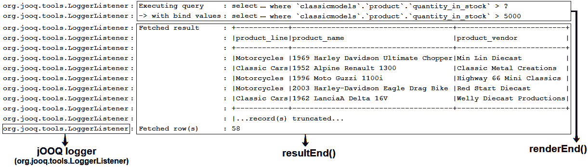
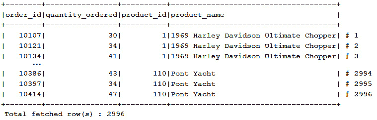
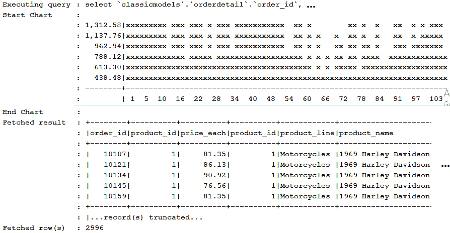
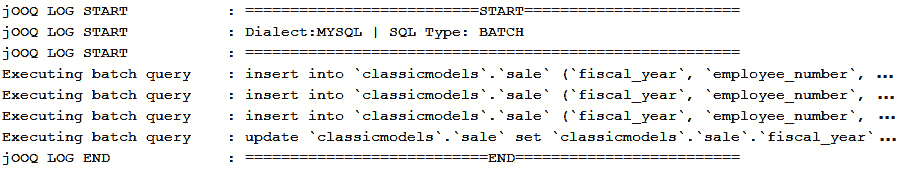

# *第十九章*：日志记录和测试

在本章中，我们将从 jOOQ 的角度介绍日志记录和测试。鉴于这些是常识性的概念，我不会解释日志记录和测试是什么，也不会强调它们显而易见的重要性。话虽如此，让我们直接进入本章的议程：

+   jOOQ 日志记录

+   jOOQ 测试

让我们开始吧！

# 技术要求

本章的代码可以在 GitHub 上找到：[`github.com/PacktPublishing/jOOQ-Masterclass/tree/master/Chapter19`](https://github.com/PacktPublishing/jOOQ-Masterclass/tree/master/Chapter19)。

# jOOQ 日志记录

默认情况下，你会在代码生成和查询/过程执行期间看到 jOOQ 的`DEBUG`级别日志。例如，在常规`SELECT`执行期间，jOOQ 记录查询 SQL 字符串（带有和没有绑定值），获取结果集的前 5 条记录作为格式良好的表格，以及结果集的大小设置，如图下所示：



图 19.1 – 默认 jOOQ SELECT 执行日志

此图揭示了 jOOQ 日志记录的一些重要方面。首先，jOOQ 记录器命名为`org.jooq.tools.LoggerListener`，代表在*第十八章*，*jOOQ SPI（提供者和监听器）*中介绍的`ExecuteListener` SPI 的实现。在底层，`LoggerListener`使用一个内部抽象（`org.jooq.tools.JooqLogger`），尝试与任何著名的记录器，sl4j，log4j，或 Java 日志 API（`java.util.logging`）交互。因此，如果你的应用程序使用这些记录器中的任何一个，jOOQ 会将其挂钩并使用它。

如图中所示，当调用`renderEnd()`回调时，jOOQ 记录查询 SQL 字符串，当调用`resultEnd()`回调时，记录获取的结果集。然而，依赖于对底层 JDBC `ResultSet`的懒（顺序）访问的 jOOQ 方法（即使用`Cursor`的`Iterator`的方法 – 例如，`ResultQuery.fetchStream()`和`ResultQuery.collect()`）不会通过`resultStart()`和`resultEnd()`。在这种情况下，只有`ResultSet`的前五条记录被 jOOQ 缓冲，并且可以通过`fetchEnd()`中的`ExecuteContext.data("org.jooq.tools.LoggerListener.BUFFER")`进行日志记录。其余的记录要么丢失，要么被跳过。

如果我们执行一个常规过程或查询是 DML，那么还会涉及其他回调。你好奇想了解更多吗？！那么，你自己研究`LoggerListener`源代码会很有趣。

## jOOQ 在 Spring Boot 中的日志记录 – 默认零配置日志

在 Spring Boot 2.x 中，不提供任何明确的日志配置，我们在控制台看到的是`INFO`级别的日志。这是因为 Spring Boot 默认的日志功能使用流行的 Logback 日志框架。

主要来说，Spring Boot 日志记录器由 `spring-boot-starter-logging` 依赖项确定，该依赖项（基于提供的配置或自动配置）激活了支持的任何日志提供程序（`java.util.logging`、log4j2 和 Logback`）。此依赖项可以显式或间接地导入（例如，作为 `spring-boot-starter-web` 的依赖项）。

在此上下文中，如果你有一个没有明确日志配置的 Spring Boot 应用程序，则不会记录 jOOQ 消息。然而，如果我们简单地启用 `DEBUG` 级别（或 `TRACE` 以实现更详细的日志记录），我们可以利用 jOOQ 日志记录。例如，我们可以在 `application.properties` 中这样做：

```java
// set DEBUG level globally
```

```java
logging.level.root=DEBUG 
```

```java
// or, set DEBUG level only for jOOQ
```

```java
logging.level.org.jooq.tools.LoggerListener=DEBUG
```

你可以在 *SimpleLogging*（MySQL）中练习这个示例。

## jOOQ 与 Logback/log4j2 的日志记录

如果你已经配置了 Logback（例如，通过 `logback-spring.xml`），那么你需要添加 jOOQ 日志记录器，如下所示：

```java
…
```

```java
<!-- SQL execution logging is logged to the 
```

```java
     LoggerListener logger at DEBUG level -->
```

```java
<logger name="org.jooq.tools.LoggerListener" 
```

```java
        level="debug" additivity="false">
```

```java
  <appender-ref ref="ConsoleAppender"/>
```

```java
</logger>
```

```java
<!-- Other jOOQ related debug log output -->
```

```java
<logger name="org.jooq" level="debug" additivity="false">
```

```java
  <appender-ref ref="ConsoleAppender"/>
```

```java
</logger>
```

```java
…
```

你可以在 *Logback*（MySQL）中练习这个示例。如果你更喜欢 log4j2，那么可以考虑 *Log4j2* 应用程序（MySQL）。jOOQ 日志记录器在 `log4j2.xml` 中配置。

## 关闭 jOOQ 日志记录

通过 `set`/`withExecuteLogging()` 设置可以开启/关闭 jOOQ 日志记录。例如，以下查询将不会被记录：

```java
ctx.configuration().derive(
```

```java
       new Settings().withExecuteLogging(Boolean.FALSE))
```

```java
   .dsl()
```

```java
   .select(PRODUCT.PRODUCT_NAME, PRODUCT.PRODUCT_VENDOR)
```

```java
   .from(PRODUCT).fetch();
```

你可以在 *TurnOffLogging*（MySQL）中练习这个示例。请注意，此设置不会影响 jOOQ 代码生成器的日志记录。该日志记录是通过 `<logging>LEVEL</logging>`（Maven）、`logging = 'LEVEL'`（Gradle）或 `.withLogging(Logging.LEVEL)`（程序化）配置的。`LEVEL` 可以是 `TRACE`、`DEBUG`、`INFO`、`WARN`、`ERROR` 和 `FATAL` 中的任何一个。以下是通过 Maven 设置 `WARN` 级别的示例——记录所有大于或等于 `WARN` 级别的日志：

```java
<configuration xmlns="...">
```

```java
  <logging>WARN</logging>
```

```java
</configuration>
```

你可以在 *GenCodeLogging*（MySQL）中练习这个示例。

在本节的第二部分，我们将处理一系列示例，这些示例应该帮助你熟悉自定义 jOOQ 日志记录的不同技术。基于这些示例，你应该能够解决你的场景。由于这些只是示例，它们不会涵盖所有可能的案例，这在你的实际场景中值得记住。

## 自定义结果集日志记录

默认情况下，jOOQ 会截断记录的日志结果集为五条记录。然而，我们可以通过 `format(int size)` 容易地记录整个结果集，如下所示：

```java
private static final Logger log = 
```

```java
        LoggerFactory.getLogger(...);
```

```java
var result = ctx.select(...)...
```

```java
                   .fetch();
```

```java
log.debug("Result set:\n" + result.format
```

```java
    (result.size()));      
```

对于每个查询（不包括依赖于对底层 JDBC `ResultSet` 的懒加载、顺序访问的查询），是否考虑记录整个结果集呢？此外，假设我们计划记录行号，如下图所示：



图 19.2 – 自定义结果集日志记录

实现这一目标的一种方法是在 `ExecuteListener` 中编写自定义日志记录器，并重写 `resultEnd()` 方法：

```java
public class MyLoggerListener extends DefaultExecuteListener {
```

```java
 private static final JooqLogger log = 
```

```java
    JooqLogger.getLogger(LoggerListener.class);
```

```java
 @Override
```

```java
 public void resultEnd(ExecuteContext ctx) {
```

```java
  Result<?> result = ctx.result();
```

```java
  if (result != null) {
```

```java
    logMultiline("Total Fetched result", 
```

```java
                  result.format(), Level.FINE, result.size());
```

```java
    log.debug("Total fetched row(s)", result.size());
```

```java
  }
```

```java
 }
```

```java
 // inspired from jOOQ source code 
```

```java
 private void logMultiline(String comment,  
```

```java
           String message, Level level, int size) {
```

```java
   // check the bundled code
```

```java
 }
```

```java
}
```

你可以在 *LogAllRS*（MySQL）中练习这个示例。

## 自定义绑定参数日志记录

如果我们将日志级别切换到 `TRACE` (`logging.level.root=TRACE`)，那么我们将得到更详细的 jOOQ 日志。例如，绑定参数作为单独的列表进行记录，如下例所示：

```java
Binding variable 1 : 5000 (integer /* java.lang.Integer */)
```

```java
Binding variable 2 : 223113 (bigint /* java.lang.Long */)
```

```java
...
```

挑战自己将此列表定制以呈现不同的外观，并记录在 `DEBUG` 级别。你可以在 *LogBind* for MySQL 中找到一些灵感，它记录了如下绑定：

```java
... : [1] as integer /* java.lang.Integer */ - [5000]
```

```java
... : [vintageCars] as bigint /* java.lang.Long */ - [223113]
```

```java
...
```

将日志绑定作为一个格式良好的表格如何？我期待看到你的代码。

## 自定义日志调用顺序

假设我们计划丰富 jOOQ 日志以记录图表，如下所示：



图 19.3 – 记录图表

此图表仅记录包含 `PRODUCT.PRODUCT_ID`（在图表的 X 轴上表示 – 类别）和 `PRODUCT.BUY_PRICE`（在图表的 Y 轴上表示 – 值）的 `SELECT` 语句。此外，我们不考虑依赖于底层 JDBC `ResultSet` 的懒加载顺序访问的查询，例如 `ctx.selectFrom(PRODUCT).collect(Collectors.toList());`。在这种情况下，jOOQ 仅缓冲记录前五条记录以进行日志记录，因此，在大多数情况下，图表将是不相关的。

第一步是编写一个自定义的 `ExecuteListener`（我们的日志记录器）并重写 `resultEnd()` 方法——在从 `ResultSet` 获取一组记录之后调用。在这个方法中，我们搜索 `PRODUCT.PRODUCT_ID` 和 `PRODUCT.BUY_PRICE`，如果我们找到它们，那么我们使用 jOOQ 的 `ChartFormat` API，如下所示：

```java
@Override
```

```java
public void resultEnd(ExecuteContext ecx) {
```

```java
 if (ecx.query() != null && ecx.query() instanceof Select) {
```

```java
  Result<?> result = ecx.result();
```

```java
  if (result != null && !result.isEmpty()) {
```

```java
   final int x = result.indexOf(PRODUCT.PRODUCT_ID);
```

```java
   final int y = result.indexOf(PRODUCT.BUY_PRICE);
```

```java
   if (x != -1 && y != -1) {
```

```java
    ChartFormat cf = new ChartFormat()
```

```java
     .category(x)
```

```java
     .values(y)
```

```java
     .shades('x');
```

```java
    String[] chart = result.formatChart(cf).split("\n");
```

```java
    log.debug("Start Chart", "");
```

```java
    for (int i = 0; i < chart.length; i++) {
```

```java
     log.debug("", chart[i]);
```

```java
    }
```

```java
    log.debug("End Chart", "");
```

```java
   } else {
```

```java
     log.debug("Chart", "The chart cannot be 
```

```java
                         constructed (missing data)");
```

```java
   }
```

```java
  }
```

```java
 }
```

```java
}
```

我们还需要另一件事。目前，我们的 `resultEnd()` 在 jOOQ 的 `LoggerListener.resultEnd()` 被调用之后被调用，这意味着我们的图表是在结果集之后被记录的。然而，如果你看之前的图，你可以看到我们的图表是在结果集之前被记录的。这可以通过反转 `fooEnd()` 方法的调用顺序来实现：

```java
configuration.settings()
```

```java
 .withExecuteListenerEndInvocationOrder(
```

```java
    InvocationOrder.REVERSE);
```

因此，默认情况下，只要 jOOQ 日志记录器被启用，我们的日志记录器（重写的 `fooStart()` 和 `fooEnd()` 方法）将在默认日志记录器的对应方法之后被调用（`LoggingLogger`）。但是，我们可以通过两个设置来反转默认顺序：`withExecuteListenerStartInvocationOrder()` 用于 `fooStart()` 方法，`withExecuteListenerEndInvocationOrder()` 用于 `fooEnd()` 方法。在我们的情况下，在反转之后，我们的 `resultEnd()` 在 `LoggingLogger.resultEnd()` 被调用之前被调用，这就是我们如何将图表插入正确位置的方法。你可以在 *ReverseLog* for MySQL 中练习这个示例。

## 将 jOOQ 日志包装到自定义文本中

假设我们计划将每个查询/例程的默认日志记录包装到一些自定义文本中，如下图所示：



图 19.4 – 将 jOOQ 日志包装到自定义文本中

在检查 *WrapLog* for MySQL 中的潜在解决方案之前，考虑挑战自己解决这个问题。

## 过滤 jOOQ 日志

有时，我们希望对记录的内容非常挑剔。例如，假设只有`INSERT`和`DELETE`语句的 SQL 字符串应该被记录。因此，在我们关闭 jOOQ 默认记录器后，我们设置我们的记录器，它应该能够隔离`INSERT`和`DELETE`语句与其他查询。一个简单的方法是应用一个简单的检查，例如（`query instanceof Insert || query instanceof Delete`），其中`query`由`ExecuteContext.query()`提供。然而，在纯 SQL 或包含`INSERT`和`DELETE`语句的批处理的情况下，这不会起作用。具体到这些情况，我们可以对通过`ExecuteContext`传递给`renderEnd()`的 SQL 字符串应用正则表达式，例如"`^(?i:(INSERT|DELETE).*)$`"。虽然你可以在*FilterLog*的 MySQL 代码行中找到这些词的具体实现，但让我们关注另一个场景。

假设我们计划只记录包含一组给定表的常规`SELECT`、`INSERT`、`UPDATE`和`DELETE`语句（纯 SQL、批处理和例程完全不记录）。例如，我们可以方便地通过`data()`传递所需的表，如下所示：

```java
ctx.data().put(EMPLOYEE.getQualifiedName(), "");
```

```java
ctx.data().put(SALE.getQualifiedName(), "");
```

因此，如果一个查询引用了`EMPLOYEE`和`SALE`表，那么只有在这种情况下，它才应该被记录。这次，依赖于正则表达式可能会有些复杂和冒险。更合适的是依赖于一个`VisitListener`，它允许我们以稳健的方式检查 AST 并提取当前查询的引用表。每个`QueryPart`都会通过`VisitListener`，因此我们可以检查其类型并相应地收集：

```java
private static class TablesExtractor 
```

```java
      extends DefaultVisitListener {
```

```java
 @Override
```

```java
 public void visitEnd(VisitContext vcx) {
```

```java
  if (vcx.renderContext() != null) {
```

```java
    if (vcx.queryPart() instanceof Table) {
```

```java
     Table<?> t = (Table<?>) vcx.queryPart();
```

```java
     vcx.configuration().data()
```

```java
            .putIfAbsent(t.getQualifiedName(), "");
```

```java
    }
```

```java
  }
```

```java
 }
```

```java
}
```

当`VisitListener`完成其执行时，我们已遍历所有`QueryPart`，并且收集了当前查询中涉及的所有表，因此我们可以将这些表与给定的表进行比较，并决定是否记录当前查询。请注意，我们的`VisitListener`已被声明为`private static class`，因为我们将其内部用于我们的`ExecuteListener`（我们的记录器），它负责协调记录过程。更确切地说，在适当的时刻，我们将这个`VisitListener`添加到从`ExecuteContext`配置派生出来的配置中，该配置传递给我们的`ExecuteListener`。因此，这个`VisitListener`并没有添加到用于执行查询的`DSLContext`配置中。

我们记录器（`ExecuteListener`）的相关部分如下所示：

```java
public class MyLoggerListener extends DefaultExecuteListener {
```

```java
 ...
```

```java
 @Override
```

```java
 public void renderEnd(ExecuteContext ecx) {
```

```java
  if (ecx.query() != null &&
```

```java
      !ecx.configuration().data().isEmpty()) {
```

```java
   ...
```

```java
   Configuration configuration = ecx.configuration()
```

```java
             .deriveAppending(new TablesExtractor());
```

```java
   ...
```

```java
   if (configuration.data().keySet().containsAll(tables)) {
```

```java
    ...
```

```java
   }
```

```java
   ...
```

```java
}
```

查看高亮代码。`deriveAppending()`方法从这个配置（通过“这个配置”，我们理解是当前`ExecuteContext`的配置，它是自动从`DSLContext`的配置派生出来的）创建一个派生`Configuration`，并附加了访问监听器。实际上，这个`VisitListener`是通过`VisitListenerProvider`插入到`Configuration`中的，`VisitListenerProvider`负责为每个渲染生命周期创建一个新的监听器实例。

然而，这有什么意义呢？简而言之，这全部关乎性能和作用域（`org.jooq.Scope`）。`VisitListener`被频繁调用；因此，它可能会对渲染性能产生影响。所以，为了最小化其使用，我们确保它只在我们日志记录器的适当条件下使用。此外，`VisitListener`应将正在渲染的表列表存储在日志记录器可访问的地方。由于我们选择依赖于`data()`映射，我们必须确保日志记录器和`VisitListener`可以访问它。通过通过`deriveAppending()`将`VisitListener`附加到日志记录器，我们也附加了它的`Scope`，这样`data()`映射就可以从两个地方访问。这样，我们可以在作用域的整个生命周期内，在日志记录器和`VisitContext`之间共享自定义数据。

你可以在*FilterVisitLog*（用于 MySQL）中练习这个示例。好吧，这就是关于日志的全部内容。接下来，让我们谈谈测试。

# jOOQ 测试

完成 jOOQ 测试可以通过几种方式，但我们可以立即强调，不那么吸引人的选项依赖于模拟 jOOQ API，而最佳选项依赖于编写针对生产数据库（或至少是内存数据库）的集成测试。让我们从仅适用于简单情况的选项开始，即模拟 jOOQ API。

## 模拟 jOOQ API

虽然模拟 JDBC API 可能非常困难，但 jOOQ 解决了这个难题，并通过`org.jooq.tools.jdbc`暴露了一个简单的模拟 API。这个 API 的巅峰代表是`MockConnection`（用于模拟数据库连接）和`MockDataProvider`（用于模拟查询执行）。假设使用 jUnit 5，我们可以这样模拟一个连接：

```java
public class ClassicmodelsTest {
```

```java
 public static DSLContext ctx;
```

```java
 @BeforeAll
```

```java
 public static void setup() {
```

```java
  // Initialise your data provider
```

```java
  MockDataProvider provider = new ClassicmodelsMockProvider();
```

```java
  MockConnection connection = new MockConnection(provider);
```

```java
  // Pass the mock connection to a jOOQ DSLContext
```

```java
  ClassicmodelsTest.ctx = DSL.using(
```

```java
                    connection, SQLDialect.MYSQL);
```

```java
  // Optionally, you may want to disable jOOQ logging
```

```java
  ClassicmodelsTest.ctx.configuration().settings()
```

```java
          .withExecuteLogging(Boolean.FALSE);
```

```java
 }
```

```java
 // add tests here
```

```java
}
```

在编写测试之前，我们必须将`ClassicmodelsMockProvider`准备为`MockDataProvider`的实现，它覆盖了`execute()`方法。此方法返回一个`MockResult`数组（每个`MockResult`代表一个模拟结果）。一个可能的实现可能如下所示：

```java
public class ClassicmodelsMockProvider 
```

```java
                  implements MockDataProvider {
```

```java
 private static final String ACCEPTED_SQL =  
```

```java
    "(SELECT|UPDATE|INSERT|DELETE).*";
```

```java
 ...
```

```java
 @Override
```

```java
 public MockResult[] execute(MockExecuteContext mex) 
```

```java
   throws SQLException {
```

```java
  // The DSLContext can be used to create 
```

```java
  // org.jooq.Result and org.jooq.Record objects
```

```java
  DSLContext ctx = DSL.using(SQLDialect.MYSQL);
```

```java
  // So, here we can have maximum 3 results
```

```java
  MockResult[] mock = new MockResult[3];
```

```java
  // The execute context contains SQL string(s), 
```

```java
  // bind values, and other meta-data
```

```java
  String sql = mex.sql();
```

```java
  // Exceptions are propagated through the JDBC and jOOQ APIs
```

```java
  if (!sql.toUpperCase().matches(ACCEPTED_SQL)) {
```

```java
   throw new SQLException("Statement not supported: " + sql);
```

```java
  } 
```

```java
  // From this point forward, you decide, whether any given 
```

```java
  // statement returns results, and how many
```

```java
  ...
```

```java
}
```

现在，我们准备出发！首先，我们可以编写一个测试。以下是一个示例：

```java
@Test
```

```java
public void sampleTest() {
```

```java
 Result<Record2<Long, String>> result = 
```

```java
   ctx.select(PRODUCT.PRODUCT_ID, PRODUCT.PRODUCT_NAME)
```

```java
      .from(PRODUCT)
```

```java
      .where(PRODUCT.PRODUCT_ID.eq(1L))
```

```java
      .fetch();
```

```java
 assertThat(result, hasSize(equalTo(1)));
```

```java
 assertThat(result.getValue(0, PRODUCT.PRODUCT_ID), 
```

```java
   is(equalTo(1L)));
```

```java
 assertThat(result.getValue(0, PRODUCT.PRODUCT_NAME), 
```

```java
   is(equalTo("2002 Suzuki XREO")));
```

```java
}
```

模拟此行为的代码添加在`ClassicmodelsMockProvider`中：

```java
private static final String SELECT_ONE_RESULT_ONE_RECORD =  
```

```java
 "select ... where `classicmodels`.`product`.`product_id`=?";
```

```java
...
```

```java
} else if (sql.equals(SELECT_ONE_RESULT_ONE_RECORD)) {
```

```java
  Result<Record2<Long, String>> result
```

```java
    = ctx.newResult(PRODUCT.PRODUCT_ID, PRODUCT.PRODUCT_NAME);
```

```java
  result.add(
```

```java
    ctx.newRecord(PRODUCT.PRODUCT_ID, PRODUCT.PRODUCT_NAME)
```

```java
       .values(1L, "2002 Suzuki XREO"));
```

```java
   mock[0] = new MockResult(-1, result);
```

```java
}
```

`MockResult`构造函数的第一个参数代表受影响的行数，其中`-1`表示行数不适用。在捆绑的代码（*Mock* 用于 MySQL）中，你可以看到更多示例，包括测试批处理、获取多个结果以及根据绑定决定结果。然而，不要忘记 jOOQ 测试等同于测试数据库交互，因此模拟仅适用于简单情况。不要用它来测试事务、锁定或测试整个数据库！

如果您不相信我，那么请遵循 Lukas Eder 的声明：“仅在某些情况下，模拟方法才适用，这一点不容忽视。人们仍然会尝试使用这个 SPI，因为它看起来很容易实现，而没有考虑到他们即将以最糟糕的方式实现一个完整的 DBMS。我向许多用户解释过这一点 3-4 次：‘你即将实现一个完整的 DBMS’而他们不断问我：‘为什么 jOOQ ‘只是’ 在模拟时执行这个查询？’ – ‘嗯，jOOQ ‘不是’ 一个 DBMS，但它允许你假装你可以使用模拟 SPI 来编写一个。’ *他们一次又一次地继续问。很难想象这有什么棘手的地方，但尽管它有助于 SEO（人们想要解决这个问题，然后发现 jOOQ），我仍然为一些开发者走上了这条道路……尽管如此，在 jOOQ 中测试一些转换和映射集成是非常好的。”*

## 编写集成测试

为 jOOQ 编写集成测试的快速方法就是简单地为生产数据库创建 `DSLContext`。以下是一个示例：

```java
public class ClassicmodelsIT {
```

```java
 private static DSLContext ctx;
```

```java
 @BeforeAll
```

```java
 public static void setup() {
```

```java
  ctx = DSL.using("jdbc:mysql://localhost:3306/
```

```java
    classicmodels" + "?allowMultiQueries=true", "root", "root");
```

```java
 }
```

```java
 @Test
```

```java
 ...
```

```java
}
```

然而，这种方法（以 MySQL 的 *SimpleTest* 为例）非常适合简单场景，这些场景不需要处理事务管理（开始、提交和回滚）。例如，如果您只需要测试您的 `SELECT` 语句，那么这种方法可能就是您所需要的全部。

### 使用 SpringBoot @JooqTest

另一方面，在 Spring Boot 中测试 jOOQ 时，通常需要在单独的事务中运行每个集成测试，并在最后回滚，要实现这一点，您可以使用 `@JooqTest` 注解，如下所示：

```java
@JooqTest
```

```java
@ActiveProfiles("test") // profile is optional
```

```java
public class ClassicmodelsIT {
```

```java
 @Autowired
```

```java
 private DSLContext ctx;
```

```java
 // optional, if you need more control of Spring transactions
```

```java
 @Autowired
```

```java
 private TransactionTemplate template;
```

```java
 @Test
```

```java
 ...
```

```java
}
```

这次，Spring Boot 自动为当前配置文件（当然，使用显式配置文件是可选的，但我在这里添加了它，因为这是 Spring Boot 应用程序中的常见做法）创建 `DSLContext`，并且自动将每个测试包裹在一个单独的 Spring 事务中，该事务在结束时回滚。在这种情况下，如果您希望某些测试使用 jOOQ 事务，那么请务必通过使用 `@Transactional(propagation=Propagation.NEVER)` 注解这些测试方法来禁用 Spring 事务。对于 `TransactionTemplate` 的使用也是如此。您可以在包含多个测试的 *JooqTest* MySQL 示例中练习这个例子，包括通过 `TransactionTemplate` 和 jOOQ 事务实现的 jOOQ 乐观锁定。

通过使用 Spring Boot 配置文件，您可以轻松地为测试配置一个与生产数据库（或不是）相同的单独数据库。在 *JooqTestDb* 中，您有用于生产的 MySQL `classicmodels` 数据库和用于测试的 MySQL `classicmodels_test` 数据库（它们都具有相同的模式和数据，并由 Flyway 管理）。

此外，如果你更喜欢在测试结束时被销毁的内存数据库，那么在 *JooqTestInMem*（MySQL）中，你有一个用于生产的磁盘上的 MySQL `classicmodels` 数据库和一个用于测试的内存 H2 `classicmodels_mem_test` 数据库（它们都具有相同的模式和数据，并由 Flyway 管理）。在这两个应用程序中，在你注入由 Spring Boot 准备的 `DSLContext` 之后，你必须将 jOOQ 指向测试模式 - 例如，对于内存数据库，如下所示：

```java
@JooqTest
```

```java
@ActiveProfiles("test")
```

```java
@TestInstance(Lifecycle.PER_CLASS)
```

```java
public class ClassicmodelsIT {
```

```java
 @Autowired
```

```java
 private DSLContext ctx;
```

```java
 // optional, if you need more control of Spring transactions
```

```java
 @Autowired
```

```java
 private TransactionTemplate template;
```

```java
 @BeforeAll
```

```java
 public void setup() {
```

```java
  ctx.settings()
```

```java
  // .withExecuteLogging(Boolean.FALSE) // optional
```

```java
     .withRenderNameCase(RenderNameCase.UPPER)
```

```java
     .withRenderMapping(new RenderMapping()
```

```java
     .withSchemata(
```

```java
       new MappedSchema().withInput("classicmodels")
```

```java
                         .withOutput("PUBLIC")));
```

```java
 }
```

```java
 @Test
```

```java
 ...
```

```java
}
```

你应该熟悉来自 *第十七章*，*jOOQ 中的多租户* 的这项技术。

### 使用 Testcontainers

Testcontainers ([`www.testcontainers.org/`](https://www.testcontainers.org/)) 是一个 Java 库，它允许我们在轻量级 Docker 容器中执行 JUnit 测试，这些容器会自动创建和销毁，用于最常见的数据库。因此，为了使用 Testcontainers，你必须安装 Docker。

一旦你安装了 Docker 并在你的 Spring Boot 应用程序中提供了预期的依赖项，你就可以启动一个容器并运行一些测试。这里，我已为 MySQL 执行了此操作：

```java
@JooqTest
```

```java
@Testcontainers
```

```java
@ActiveProfiles("test")
```

```java
public class ClassicmodelsIT {
```

```java
 private static DSLContext ctx;
```

```java
 // optional, if you need more control of Spring transactions
```

```java
 @Autowired
```

```java
 private TransactionTemplate template;
```

```java
 @Container
```

```java
 private static final MySQLContainer sqlContainer = 
```

```java
   new MySQLContainer<>("mysql:8.0")
```

```java
     .withDatabaseName("classicmodels")
```

```java
     .withStartupTimeoutSeconds(1800) 
```

```java
     .withCommand("--authentication-
```

```java
                     policy=mysql_native_password");
```

```java
 @BeforeAll
```

```java
 public static void setup() throws SQLException {
```

```java
  // load into the database the schema and data   
```

```java
  Flyway flyway = Flyway.configure()
```

```java
    .dataSource(sqlContainer.getJdbcUrl(), 
```

```java
      sqlContainer.getUsername(), sqlContainer.getPassword())
```

```java
    .baselineOnMigrate(true)     
```

```java
    .load();        
```

```java
  flyway.migrate();
```

```java
  // obtain a connection to MySQL
```

```java
  Connection conn = sqlContainer.createConnection("");
```

```java
  // intialize jOOQ DSLContext
```

```java
  ctx = DSL.using(conn, SQLDialect.MYSQL);
```

```java
 }
```

```java
 // this is optional since is done automatically anyway
```

```java
 @AfterAll
```

```java
 public static void tearDown() {
```

```java
  if (sqlContainer != null) {
```

```java
   if (sqlContainer.isRunning()) {
```

```java
     sqlContainer.stop();
```

```java
   }
```

```java
  }
```

```java
 }
```

```java
 @Test
```

```java
 ...
```

```java
}
```

注意，我们已经通过 Flyway 填充了测试数据库，但这不是强制性的。你可以使用任何其他专用工具，例如 Commons DbUtils。例如，你可以通过 `org.testcontainers.ext.ScriptUtils` 来实现，如下所示：

```java
...
```

```java
var containerDelegate = 
```

```java
  new JdbcDatabaseDelegate(sqlContainer, "");
```

```java
ScriptUtils.runInitScript(containerDelegate, 
```

```java
  "integration/migration/V1.1__CreateTest.sql");
```

```java
ScriptUtils.runInitScript(containerDelegate, 
```

```java
  "integration/migration/afterMigrate.sql");
```

```java
...
```

就这样！现在，你可以为测试数据库交互生成一个一次性容器。这很可能是测试生产中 jOOQ 应用程序的最受欢迎的方法。你可以在 *Testcontainers*（MySQL）中实践这个例子。

## 测试 R2DBC

最后，如果你正在使用 jOOQ R2DBC，那么编写测试相当直接。

在捆绑的代码中，你可以找到三个 MySQL 的示例，如下所示：

+   *TestR2DBC* 示例：`ConnectionFactory` 通过 `ConnectionFactories.get()` 创建，`DSLContext` 通过 `ctx = DSL.using(connectionFactory)` 创建。测试是在生产数据库上执行的。

+   *TestR2DBCDb* 示例：`ConnectionFactory` 由 Spring Boot 自动创建，`DSLContext` 作为 `@Bean` 创建。测试是在与生产类似（`classicmodels`）的 MySQL 测试数据库（`classicmodels_test`）上执行的。

+   *TestR2DBCInMem* 示例：`ConnectionFactory` 由 Spring Boot 自动创建，`DSLContext` 作为 `@Bean` 创建。测试是在 H2 内存测试数据库（`classicmodels_mem_test`）上执行的。

# 摘要

正如你所看到的，jOOQ 对日志记录和测试有坚实的支持，再次证明它是一个成熟的技术，能够满足生产环境中最苛刻的期望。凭借高生产率和低学习曲线，jOOQ 是我首先使用并推荐的项目。我强烈建议你也这样做！
