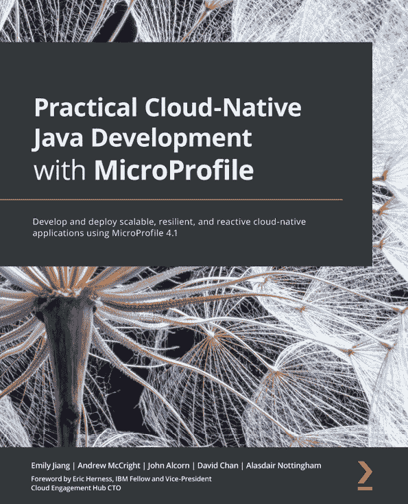

[Packt.com](http://Packt.com)

订阅我们的在线数字图书馆，全面访问超过 7,000 本书和视频，以及领先的工具来帮助你规划个人发展和职业发展。更多信息，请访问我们的网站。

# 为什么订阅？

+   使用来自超过 4,000 名行业专业人士的实用电子书和视频，节省学习时间，多花时间编码

+   通过为你量身定制的技能计划提高你的学习效果

+   每月免费获得一本电子书或视频

+   完全可搜索，便于快速访问关键信息

+   复制粘贴、打印和收藏内容

你知道 Packt 为每本书都提供电子书版本，包括 PDF 和 ePub 文件吗？你可以在 [packt.com](http://packt.com) 升级到电子书版本，并且作为印刷书客户，你有权获得电子书副本的折扣。如需了解更多详情，请联系我们 customercare@packtpub.com。

在 [www.packt.com](http://www.packt.com)，你还可以阅读一系列免费技术文章，订阅各种免费通讯，并享受 Packt 书籍和电子书的独家折扣和优惠。

# 你可能还会喜欢的其他书籍

如果你喜欢这本书，你可能对 Packt 出版的其他书籍也感兴趣：

](https://packt.link/9781801816489)

**使用 Java 设计六边形架构**

Davi Vieira

ISBN: 9781801816489

+   了解如何使用规范设计模式组装业务规则算法

+   将领域驱动设计技术与六边形原则相结合，以创建强大的领域模型

+   使用适配器使系统支持不同的协议，如 REST、gRPC 和 WebSocket

+   基于六边形原则创建模块和包结构

+   使用 Java 模块强制执行依赖反转并确保软件组件之间的隔离

+   实现 Quarkus DI 以管理输入和输出端口的生命周期

](https://packt.link/9781801078801)

**使用 MicroProfile 的实用云原生 Java 开发**

Emily Jiang, Andrew McCright, John Alcorn, David Chan, Alasdair Nottingham

ISBN: 9781801078801

+   在构建云原生应用程序时了解应用 12-Factor 方法论的最佳实践

+   使用 MicroProfile Rest Client 和 JAX-RS 创建客户端-服务器架构

+   使用 MicroProfile Config 配置你的云原生应用程序

+   使用 MicroProfile JWT 保护你的云原生应用程序

+   熟练掌握在 Open Liberty 中运行你的云原生应用程序

+   掌握 MicroProfile Open Tracing 并学习如何使用 Jaeger 查看跟踪跨度

+   将 Docker 容器部署到 Kubernetes 并了解如何使用 Kubernetes 的 ConfigMap 和 Secrets

# Packt 正在寻找像你这样的作者

如果您有兴趣成为 Packt 的作者，请访问[authors.packtpub.com](http://authors.packtpub.com)并今天申请。我们已与成千上万的开发者和技术专业人士合作，就像您一样，帮助他们将见解分享给全球科技社区。您可以提交一般申请，申请我们正在招募作者的特定热门话题，或者提交您自己的想法。

# 分享您的想法

现在您已经完成了 *jOOQ 大师班*，我们非常想听听您的想法！如果您在亚马逊购买了这本书，请[点击此处直接跳转到该书的亚马逊评论页面](https://packt.link/r/1800566891)并分享您的反馈或在该购买网站上留下评论。

您的评论对我们和科技社区都非常重要，它将帮助我们确保我们提供的是高质量的内容。
