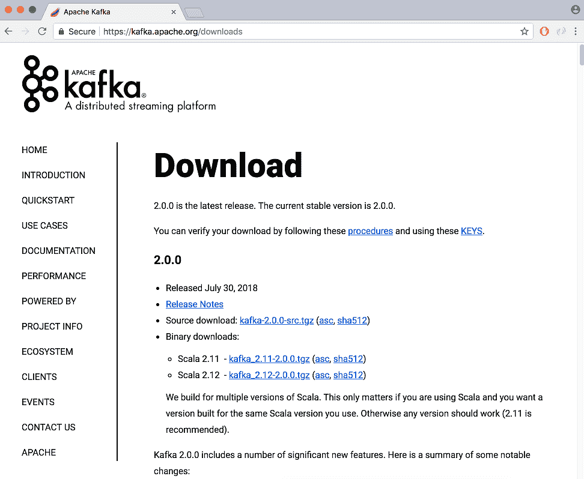
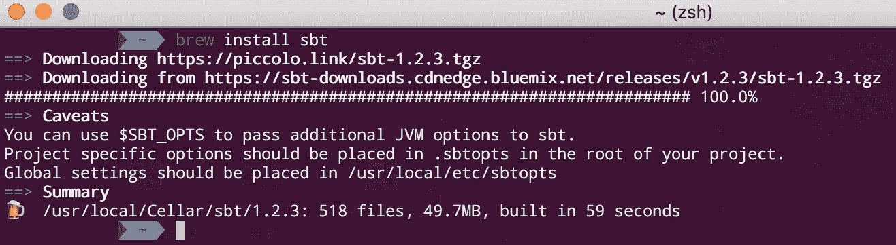
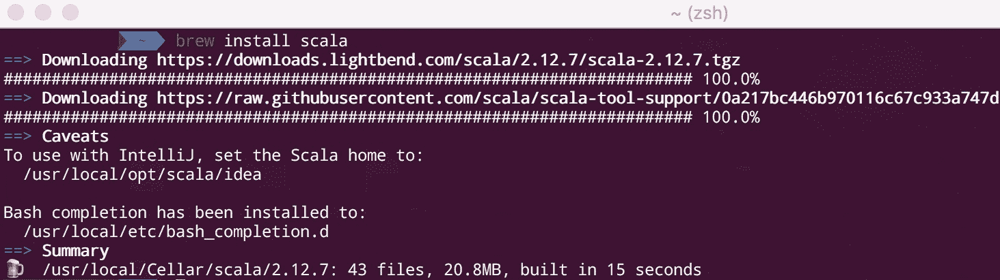
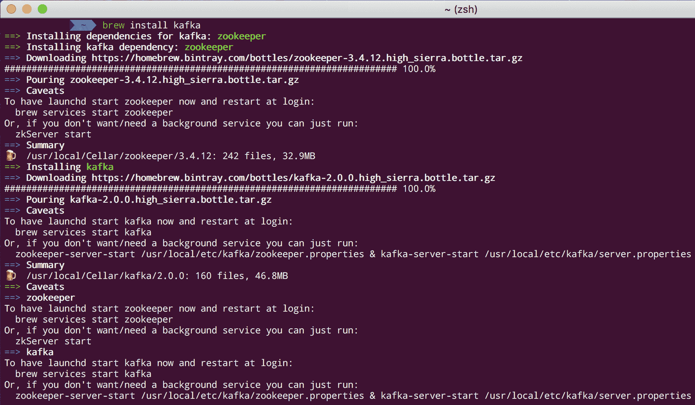
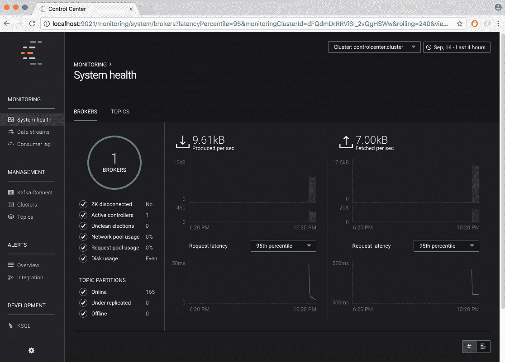

# 配置 Kafka

本章描述了 Kafka 是什么以及与该技术相关的概念：代理、主题、生产者和消费者。它还讨论了如何从命令行构建简单的生产者和消费者，以及如何安装 Confluent 平台。本章中的信息对于以下章节是基本的。

在本章中，我们将涵盖以下主题：

+   Kafka 简述

+   安装 Kafka（Linux 和 macOS）

+   安装 Confluent 平台

+   运行 Kafka

+   运行 Confluent 平台

+   运行 Kafka 代理

+   运行 Kafka 主题

+   命令行消息生产者

+   命令行消息消费者

+   使用 kafkacat

# Kafka 简述

Apache Kafka 是一个开源的流平台。如果你正在阅读这本书，也许你已经知道 Kafka 在横向扩展方面表现非常出色，而且不会牺牲速度和效率。

Kafka 的核心是用 Scala 编写的，Kafka Streams 和 KSQL 是用 Java 编写的。Kafka 服务器可以在多个操作系统上运行：Unix、Linux、macOS，甚至 Windows。由于它通常在生产环境中运行在 Linux 服务器上，本书中的示例是为 Linux 环境设计的。本书中的示例还考虑了 bash 环境的使用。

本章解释了如何安装、配置和运行 Kafka。由于这是一个快速入门指南，它不涵盖 Kafka 的理论细节。目前，提及以下三点是合适的：

+   **Kafka 是一个** **服务总线**: 为了连接异构应用程序，我们需要实现一个消息发布机制，以便在它们之间发送和接收消息。消息路由器被称为消息代理。Kafka 是一个消息代理，是一种快速处理客户端之间消息路由的解决方案。

+   **Kafka 架构有两个指令**: 第一个是不要阻塞生产者（为了处理背压）。第二个是隔离生产者和消费者。生产者不应该知道他们的消费者是谁，因此 Kafka 遵循愚笨代理和智能客户端模型。

+   **Kafka 是一个实时消息系统**: 此外，Kafka 是一个具有发布-订阅模型的软件解决方案：开源、分布式、分区、复制和基于提交日志。

Apache Kafka 中有一些概念和术语：

+   **集群**: 这是一组 Kafka 代理。

+   **Zookeeper**: 这是一个集群协调器——一个包含 Apache 生态系统不同服务的工具。

+   **代理**: 这是一个 Kafka 服务器，也是 Kafka 服务器进程本身。

+   **主题**: 这是一个队列（具有日志分区）；一个代理可以运行多个主题。

+   **偏移量**: 这是每个消息的标识符。

+   **分区**: 这是一个不可变且有序的记录序列，持续追加到一个结构化的提交日志中。

+   **生产者**: 这是一个将数据发布到主题的程序。

+   **消费者**: 这是一个从主题中处理数据的程序。

+   **保留期**: 这是保留消息以供消费的时间。

在 Kafka 中，有三种类型的集群：

+   单节点-单代理

+   单节点-多代理

+   多节点-多代理

在 Kafka 中，有三种（仅三种）发送消息的方式：

+   **永不重新投递**：消息可能会丢失，因为一旦投递，它们就不会再次发送。

+   **可能重新投递**：消息永远不会丢失，因为如果未收到，消息可以再次发送。

+   **单次投递**：消息正好投递一次。这是最困难的投递形式；由于消息只发送一次且不会重新投递，这意味着不会有任何消息丢失。

消息日志可以以两种方式压缩：

+   **粗粒度**：按时间压缩的日志

+   **细粒度**：按消息压缩的日志

# Kafka 安装

有三种方式可以安装 Kafka 环境：

+   下载可执行文件

+   使用 `brew`（在 macOS 上）或 `yum`（在 Linux 上）

+   安装 Confluent 平台

对于所有三种方式，第一步是安装 Java；我们需要 Java 8。从 Oracle 的网站下载并安装最新的 JDK 8：

[`www.oracle.com/technetwork/java/javase/downloads/index.html`](http://www.oracle.com/technetwork/java/javase/downloads/index.html)

在撰写本文时，最新的 Java 8 JDK 版本是 8u191。

对于 Linux 用户：

1.  按以下步骤更改文件模式为可执行：

```java
 > chmod +x jdk-8u191-linux-x64.rpm
```

1.  前往您想要安装 Java 的目录：

```java
 > cd <directory path>
```

1.  使用以下命令运行 `rpm` 安装程序：

```java
 > rpm -ivh jdk-8u191-linux-x64.rpm
```

1.  将 `JAVA_HOME` 变量添加到您的环境中。以下命令将 `JAVA_HOME` 环境变量写入 `/etc/profile` 文件：

```java
 > echo "export JAVA_HOME=/usr/java/jdk1.8.0_191" >> /etc/profile
```

1.  按以下方式验证 Java 安装：

```java
 > java -version
      java version "1.8.0_191"
      Java(TM) SE Runtime Environment (build 1.8.0_191-b12)
      Java HotSpot(TM) 64-Bit Server VM (build 25.191-b12, mixed mode)
```

在撰写本文时，最新的 Scala 版本是 2.12.6。要在 Linux 上安装 Scala，请执行以下步骤：

1.  从 [`www.scala-lang.org/download`](http://www.scala-lang.org/download) 下载最新的 Scala 二进制文件

1.  按以下方式提取下载的文件，`scala-2.12.6.tgz`：

```java
 > tar xzf scala-2.12.6.tgz
```

1.  按以下方式将 `SCALA_HOME` 变量添加到您的环境中：

```java
 > export SCALA_HOME=/opt/scala
```

1.  按以下方式将 Scala 的 bin 目录添加到您的 `PATH` 环境变量中：

```java
 > export PATH=$PATH:$SCALA_HOME/bin
```

1.  要验证 Scala 安装，请执行以下操作：

```java
 >  scala -version
      Scala code runner version 2.12.6 -- Copyright 2002-2018,
      LAMP/EPFL and Lightbend, Inc. 
```

要在您的机器上安装 Kafka，请确保您至少有 4 GB 的 RAM，并且安装目录对于 macOS 用户将是 `/usr/local/kafka/`，对于 Linux 用户将是 `/opt/kafka/`。根据您的操作系统创建这些目录。

# 在 Linux 上安装 Kafka

打开 Apache Kafka 下载页面，[`kafka.apache.org/downloads`](http://kafka.apache.org/downloads)，如图 *图 1.1* 所示：



图 1.1：Apache Kafka 下载页面

在撰写本文时，当前的 Apache Kafka 版本是 2.0.0 作为稳定版本。请记住，自 0.8.x 版本以来，Kafka 不向下兼容。因此，我们不能用低于 0.8 的版本替换此版本。一旦下载了最新可用的版本，让我们继续进行安装。

请记住，对于 macOS 用户，将目录 `/opt/` 替换为 `/usr/local`。

按照以下步骤在 Linux 上安装 Kafka：

1.  按照以下步骤在 `/opt/` 目录中解压下载的文件 `kafka_2.11-2.0.0.tgz`：

```java
 > tar xzf kafka_2.11-2.0.0.tgz
```

1.  按照以下步骤创建 `KAFKA_HOME` 环境变量：

```java
 > export KAFKA_HOME=/opt/kafka_2.11-2.0.0
```

1.  按照以下步骤将 Kafka 的 bin 目录添加到 `PATH` 变量中：

```java
 > export PATH=$PATH:$KAFKA_HOME/bin
```

现在 Java、Scala 和 Kafka 已安装。

要从命令行执行所有前面的步骤，macOS 用户有一个强大的工具叫做 `brew`（Linux 中的等效工具是 `yum`）。

# 在 macOS 上安装 Kafka

在 macOS 上从命令行安装（必须已安装 `brew`），执行以下步骤：

1.  要使用 `brew` 安装 `sbt`（Scala 构建工具），执行以下命令：

```java
 > brew install sbt
```

如果已经在环境中安装（之前已下载），运行以下命令进行升级：

```java
 > brew upgrade sbt
```

输出类似于 *图 1.2* 中所示：



图 1.2：Scala 构建工具安装输出

1.  要使用 `brew` 安装 Scala，执行以下命令：

```java
 > brew install scala
```

如果已经在环境中安装（之前已下载），要升级它，请运行以下命令：

```java
 > brew upgrade scala
```

输出类似于 *图 1.3* 中所示：



图 1.3：Scala 安装输出

1.  使用 `brew` 安装 Kafka（它也会安装 Zookeeper），请执行以下操作：

```java
 > brew install kafka
```

如果已经拥有它（以前已下载），按照以下方式升级：

```java
 > brew upgrade kafka
```

输出类似于 *图 1.4* 中所示：



图 1.4：Kafka 安装输出

访问 [`brew.sh/`](https://brew.sh/) 了解更多关于 `brew` 的信息。

# Confluent 平台安装

安装 Kafka 的第三种方式是通过 Confluent 平台。在本书的其余部分，我们将使用 Confluent 平台的开放源代码版本。

Confluent 平台是一个包含以下组件的集成平台：

+   Apache Kafka

+   REST 代理

+   Kafka Connect API

+   模式注册表

+   Kafka Streams API

+   预构建连接器

+   非 Java 客户端

+   KSQL

如果读者注意到，本书中几乎每个组件都有自己的章节。

商业授权的 Confluent 平台除了包含开源版本的所有组件外，还包括以下内容：

+   **Confluent 控制中心**（**CCC**）

+   Kafka 操作员（用于 Kubernetes）

+   JMS 客户端

+   复制器

+   MQTT 代理

+   自动数据平衡器

+   安全功能

重要的一点是，非开源版本组件的培训超出了本书的范围。

Confluent 平台也以 Docker 镜像的形式提供，但在这里我们将本地安装它。

打开 Confluent 平台下载页面：[`www.confluent.io/download/`](https://www.confluent.io/download/) 。

在撰写本文时，Confluent 平台的当前版本是 5.0.0，作为稳定版本。请记住，由于 Kafka 核心运行在 Scala 上，因此有两个版本：Scala 2.11 和 Scala 2.12。

我们可以从桌面目录运行 Confluent 平台，但根据本书的约定，让我们为 Linux 用户使用 `/opt/`，为 macOS 用户使用 `/usr/local`。

要安装 Confluent 平台，将下载的文件 `confluent-5.0.0-2.11.tar.gz` 解压到目录中，如下所示：

```java
> tar xzf confluent-5.0.0-2.11.tar.gz
```

# 运行 Kafka

根据我们是直接安装还是通过 Confluent 平台安装 Kafka，有两种运行 Kafka 的方法。

如果我们直接安装，运行 Kafka 的步骤如下。

对于 macOS 用户，如果您使用 `brew` 安装，您的路径可能不同。检查 `brew install kafka` 命令的输出，以获取可以启动 Zookeeper 和 Kafka 的确切命令。

前往 Kafka 安装目录（macOS 用户为 `/usr/local/kafka`，Linux 用户为 `/opt/kafka/`），例如：

```java
> cd /usr/local/kafka
```

首先，我们需要启动 Zookeeper（Kafka 与 Zookeeper 的依赖关系目前很强，并将保持不变）。请输入以下命令：

```java
> ./bin/zookeeper-server-start.sh ../config/zookeper.properties

ZooKeeper JMX enabled by default

Using config: /usr/local/etc/zookeeper/zoo.cfg

Starting zookeeper ... STARTED
```

要检查 Zookeeper 是否正在运行，使用以下命令在 `9093` 端口（默认端口）上运行 `lsof` 命令：

```java
> lsof -i :9093

COMMAND PID USER FD TYPE DEVICE SIZE/OFF NODE NAME

java 12529 admin 406u IPv6 0xc41a24baa4fedb11 0t0 TCP *:9093 (LISTEN)
```

现在，通过访问 `/usr/local/kafka/`（macOS 用户）和 `/opt/kafka/`（Linux 用户）来运行安装的 Kafka 服务器：

```java
> ./bin/kafka-server-start.sh ./config/server.properties
```

现在您的机器上正在运行一个 Apache Kafka 代理。

请记住，在启动 Kafka 之前，Zookeeper 必须在机器上运行。如果您不希望每次需要运行 Kafka 时都手动启动 Zookeeper，请将其安装为操作系统的自动启动服务。

# 运行 Confluent 平台

前往 Confluent 平台安装目录（macOS 用户为 `/usr/local/kafka/`，Linux 用户为 `/opt/kafka/`），并输入以下命令：

```java
> cd /usr/local/confluent-5.0.0
```

要启动 Confluent 平台，请运行以下命令：

```java
> bin/confluent start
```

此命令行界面仅适用于开发，不适用于生产：

[`docs.confluent.io/current/cli/index.html`](https://docs.confluent.io/current/cli/index.html)

输出类似于以下代码片段：

```java
Using CONFLUENT_CURRENT: /var/folders/nc/4jrpd1w5563crr_np997zp980000gn/T/confluent.q3uxpyAt

Starting zookeeper
zookeeper is [UP]
Starting kafka
kafka is [UP]
Starting schema-registry
schema-registry is [UP]
Starting kafka-rest
kafka-rest is [UP]
Starting connect
connect is [UP]
Starting ksql-server
ksql-server is [UP]
Starting control-center
control-center is [UP]
```

如命令输出所示，Confluent 平台会按以下顺序自动启动：Zookeeper、Kafka、Schema Registry、REST 代理、Kafka Connect、KSQL 和 Confluent 控制中心。

要访问您本地运行的 Confluent 控制中心，请访问 `http://localhost:9021`，如图 1.5 所示：



图 1.5：Confluent 控制中心主页面

Confluent 平台还有其他命令。

要检查所有服务或特定服务及其依赖项的状态，请输入以下命令：

```java
> bin/confluent status
```

要停止所有服务或停止特定服务及其依赖的服务，请输入以下命令：

```java
> bin/confluent stop
```

要删除当前 Confluent 平台的数据和日志，请输入以下命令：

```java
> bin/confluent destroy
```

# 运行 Kafka 代理

服务器背后的真正艺术在于其配置。在本节中，我们将探讨如何处理 Kafka 代理在独立模式下的基本配置。由于我们目前在学习，因此我们将不会回顾集群配置。

如我们所料，有两种类型的配置：独立和集群。当在集群模式下运行并具有复制功能时，Kafka 的真实力量才得以释放，并且所有主题都正确分区。

集群模式有两个主要优势：并行性和冗余性。并行性是指集群成员之间可以同时运行任务的能力。冗余性确保当 Kafka 节点故障时，集群仍然安全且可以从其他运行节点访问。

本节展示了如何在我们的本地机器上配置具有多个节点的集群，尽管在实践中，最好有多个机器，多个节点共享集群总是更好的选择。

进入 Confluent 平台安装目录，从现在起称为`<confluent-path>`。

如本章开头所述，代理是一个服务器实例。服务器（或代理）实际上是在操作系统上运行的一个进程，它根据其配置文件启动。

Confluent 的人们友好地为我们提供了一个标准代理配置的模板。这个文件名为`server.properties`，位于 Kafka 安装目录的`config`子目录中：

1.  在`<confluent-path>`内部，创建一个名为`mark`的目录。

1.  对于我们想要运行的每个 Kafka 代理（服务器），我们需要复制配置文件模板并相应地重命名它。在这个例子中，我们的集群将被命名为`mark`：

```java
> cp config/server.properties <confluent-path>/mark/mark-1.properties
```

```java
> cp config/server.properties <confluent-path>/mark/mark-2.properties
```

1.  根据需要修改每个属性文件。如果文件名为`mark-1`，则`broker.id`应为`1`。然后，指定服务器将运行的端口；对于`mark-1`推荐使用`9093`，对于`mark-2`推荐使用`9094`。请注意，端口号属性在模板中未设置，因此需要添加该行。最后，指定 Kafka 日志的位置（Kafka 日志是存储所有 Kafka 代理操作的特定存档）；在这种情况下，我们使用`/tmp`目录。在这里，常见的问题是写权限问题。不要忘记给在日志目录中执行这些进程的用户授予写和执行权限，如下例所示：

+   在`mark-1.properties`中设置以下内容：

```java
 broker.id=1
 port=9093
 log.dirs=/tmp/mark-1-logs
```

+   在`mark-2.properties`中设置以下内容：

```java
 broker.id=2
 port=9094
 log.dirs=/tmp/mark-2-logs
```

1.  使用`kafka-server-start`命令启动 Kafka 代理，并将相应的配置文件作为参数传递。不要忘记 Confluent 平台必须已经运行，并且端口不应被其他进程使用。以下是如何启动 Kafka 代理：

```java
 > <confluent-path>/bin/kafka-server-start <confluent-
      path>/mark/mark-1.properties &
```

在另一个命令行窗口中，运行以下命令：

```java
 > <confluent-path>/bin/kafka-server-start <confluent-
      path>/mark/mark-2.properties &
```

不要忘记，尾随的`&`是为了指定你想要命令行返回。如果你想查看代理输出，建议在每个自己的命令行窗口中单独运行每个命令。

记住属性文件包含服务器配置，而位于`config`目录中的`server.properties`文件只是一个模板。

现在有`mark-1`和`mark-2`两个代理在同一台机器上同一集群中运行。

记住，没有愚蠢的问题，如下面的例子所示：

**Q**：每个代理如何知道它属于哪个集群？

**A**：代理知道它们属于同一个集群，因为在配置中，它们都指向同一个 Zookeeper 集群。

**Q**：同一集群内的每个代理与其他代理有何不同？

**A**：每个代理在集群内部通过`broker.id`属性中指定的名称来标识。

**Q**：如果没有指定端口号会发生什么？

**A**：如果没有指定端口属性，Zookeeper 将分配相同的端口号，并将覆盖数据。

**Q**：如果没有指定日志目录会发生什么？

**A**：如果没有指定`log.dir`，所有代理都将写入相同的默认`log.dir`。如果计划在不同的机器上运行代理，则可能不会指定端口和`log.dir`属性（因为它们在相同的端口和日志文件上运行，但在不同的机器上）。

**Q**：我如何检查我想要启动代理的端口上是否没有正在运行进程？

**A**：如前一小节所示，有一个有用的命令可以查看在特定端口上运行什么进程，在这种情况下是`9093`端口：

```java
> lsof -i :9093
```

上一条命令的输出类似于以下内容：

```java
COMMAND PID USER FD TYPE DEVICE SIZE/OFF NODE NAME

java 12529 admin 406u IPv6 0xc41a24baa4fedb11 0t0 TCP *:9093 (LISTEN)
```

您的机会：在启动 Kafka 代理之前尝试运行此命令，并在启动后运行它以查看变化。此外，尝试在一个正在使用的端口上启动代理，以查看它如何失败。

好的，如果我想要我的集群在多台机器上运行怎么办？

要在不同的机器上运行 Kafka 节点但属于同一集群，请调整配置文件中的 Zookeeper 连接字符串；其默认值如下：

```java
zookeeper.connect=localhost:2181
```

记住，机器必须能够通过 DNS 找到彼此，并且它们之间没有网络安全限制。

Zookeeper 连接的默认值只有在你在同一台机器上运行 Kafka 代理时才是正确的。根据架构的不同，可能需要决定是否会在同一台 Zookeeper 机器上运行代理。

要指定 Zookeeper 可能在其他机器上运行，请执行以下操作：

```java
zookeeper.connect=localhost:2181, 192.168.0.2:2183, 192.168.0.3:2182
```

上一行指定 Zookeeper 在本地主机机器上的端口`2181`运行，在 IP 地址为`192.168.0.2`的机器上的端口`2183`运行，以及在 IP 地址为`192.168.0.3`的机器上的端口`2182`运行。Zookeeper 的默认端口是`2181`，所以通常它在那里运行。

您的机会：作为一个练习，尝试使用关于 Zookeeper 集群的错误信息启动代理。此外，使用`lsof`命令尝试在一个正在使用的端口上启动 Zookeeper。

如果您对配置有疑问，或者不清楚要更改哪些值，以下`server.properties`模板（以及 Kafka 项目的所有内容）都是开源的：

[`github.com/apache/kafka/blob/trunk/config/server.properties`](https://github.com/apache/kafka/blob/trunk/config/server.properties)

# 运行 Kafka 主题

代理内部的力量是主题，即其中的队列。现在我们有两个代理正在运行，让我们在它们上创建一个 Kafka 主题。

Kafka，就像几乎所有的现代基础设施项目一样，有三种构建事物的方式：通过命令行、通过编程和通过 Web 控制台（在这种情况下是 Confluent 控制中心）。Kafka 代理的管理（创建、修改和销毁）可以通过大多数现代编程语言编写的程序来完成。如果该语言不受支持，则可以通过 Kafka REST API 进行管理。上一节展示了如何使用命令行构建代理。在后面的章节中，我们将看到如何通过编程来完成这个过程。

是否可以通过编程仅管理（创建、修改或销毁）代理？不，我们也可以管理主题。主题也可以通过命令行创建。Kafka 有预构建的实用工具来管理代理，就像我们之前看到的，以及管理主题，就像我们接下来将要看到的。

要在我们的运行集群中创建名为`amazingTopic`的主题，请使用以下命令：

```java
> <confluent-path>/bin/kafka-topics --create --zookeeper localhost:2181 --replication-factor 1 --partitions 1 --topic amazingTopic
```

输出应该如下所示：

```java
Created topic amazingTopic
```

在这里，使用的是`kafka-topics`命令。通过`--create`参数指定我们想要创建一个新的主题。`--topic`参数设置主题的名称，在这种情况下，为`amazingTopic`。

你还记得并行性和冗余这两个术语吗？嗯，`--partitions`参数控制并行性，而`--replication-factor`参数控制冗余。

`--replication-factor`参数是基本的，因为它指定了主题将在集群中的多少个服务器上进行复制（例如，运行）。另一方面，一个代理可以只运行一个副本。

显然，如果指定的服务器数量大于集群中运行的服务器数量，将会导致错误（你不相信我？在你的环境中试一试）。错误将类似于以下内容：

```java
Error while executing topic command: replication factor: 3 larger than available brokers: 2

[2018-09-01 07:13:31,350] ERROR org.apache.kafka.common.errors.InvalidReplicationFactorException: replication factor: 3 larger than available brokers: 2

(kafka.admin.TopicCommand$)
```

要考虑的是，代理应该正在运行（不要害羞，在你的环境中测试所有这些理论）。

`--partitions`参数，正如其名称所暗示的，说明了主题将有多少个分区。这个数字决定了消费者侧可以实现的并行性。当进行集群微调时，此参数非常重要。

最后，正如预期的那样，`--zookeeper`参数指示 Zookeeper 集群正在运行的位置。

当创建一个主题时，代理日志中的输出类似于以下内容：

```java
[2018-09-01 07:05:53,910] INFO [ReplicaFetcherManager on broker 1] Removed fetcher for partitions amazingTopic-0 (kafka.server.ReplicaFetcherManager)

[2018-09-01 07:05:53,950] INFO Completed load of log amazingTopic-0 with 1 log segments and log end offset 0 in 21 ms (kafka.log.Log)
```

简而言之，这条消息看起来就像在我们的集群中诞生了一个新的主题。

我如何检查我的新而闪亮的主题？通过使用相同的命令：`kafka-topics`。

除了`--create`参数之外，还有更多的参数。要检查主题的状态，请使用带有`--list`参数的`kafka-topics`命令，如下所示：

```java
> <confluent-path>/bin/kafka-topics.sh --list --zookeeper localhost:2181
```

我们知道，输出是主题列表，如下所示：

```java
amazingTopic
```

此命令返回集群中所有运行主题的名称列表。

如何获取主题的详细信息？使用相同的命令：`kafka-topics`。

对于特定主题，使用`--describe`参数运行`kafka-topics`命令，如下所示：

```java
> <confluent-path>/bin/kafka-topics --describe --zookeeper localhost:2181 --topic amazingTopic
```

命令输出如下所示：

```java
Topic:amazingTopic PartitionCount:1 ReplicationFactor:1 Configs: Topic: amazingTopic Partition: 0 Leader: 1 Replicas: 1 Isr: 1
```

这里是输出简要说明：

+   `PartitionCount`：主题上的分区数量（并行性）

+   `ReplicationFactor`：主题上的副本数量（冗余）

+   `Leader`：负责读取和写入给定分区操作的节点

+   `Replicas`：复制此主题数据的代理列表；其中一些甚至可能是已死亡的

+   `Isr`：当前同步副本的节点列表

让我们创建一个具有多个副本的主题（例如，我们将在集群中运行更多代理）；我们输入以下内容：

```java
> <confluent-path>/bin/kafka-topics --create --zookeeper localhost:2181 --replication-factor 2 --partitions 1 --topic redundantTopic
```

输出如下所示：

```java
Created topic redundantTopic
```

现在，使用`--describe`参数调用`kafka-topics`命令来检查主题详情，如下所示：

```java
> <confluent-path>/bin/kafka-topics --describe --zookeeper localhost:2181 --topic redundantTopic

Topic:redundantTopic PartitionCount:1 ReplicationFactor:2 Configs:

Topic: redundantTopic Partition: 0 Leader: 1 Replicas: 1,2 Isr: 1,2
```

如您所见，`Replicas`和`Isr`是相同的列表；我们推断所有节点都是同步的。

轮到你了：使用`kafka-topics`命令进行实验，尝试在已死亡的代理上创建复制主题，并查看输出。然后，在运行的服务器上创建主题，然后杀死它们以查看结果。输出是否如您预期的那样？

如前所述，所有这些通过命令行执行的命令都可以通过编程执行或通过 Confluent Control Center 网络控制台执行。

# 命令行消息生产者

Kafka 还有一个通过命令行发送消息的命令；输入可以是文本文件或控制台标准输入。输入的每一行都作为单个消息发送到集群。

对于本节，需要执行前面的步骤。Kafka 代理必须处于运行状态，并且在其中创建了一个主题。

在一个新的命令行窗口中，运行以下命令，然后输入要发送到服务器的消息行：

```java
> <confluent-path>/bin/kafka-console-producer --broker-list localhost:9093 --topic amazingTopic 
Fool me once shame on you
Fool me twice shame on me
```

这些行将两条消息推送到运行在本机集群`9093`端口的`amazingTopic`。

此命令也是检查具有特定主题的代理是否按预期运行的最简单方式。

正如我们所见，`kafka-console-producer`命令接收以下参数：

+   `--broker-list`：此指定以逗号分隔的列表形式指定的 Zookeeper 服务器，格式为，hostname:port。

+   `--topic`：此参数后跟目标主题的名称。

+   `--sync`：此指定消息是否应同步发送。

+   `--compression-codec`：此指定用于生产消息的压缩编解码器。可能的选项是：`none`、`gzip`、`snappy`或`lz4`。如果未指定，则默认为 gzip。

+   `--batch-size`：如果消息不是同步发送，但消息大小以单个批次发送，则此值以字节为单位指定。

+   `--message-send-max-retries`: 由于代理可能会失败接收消息，此参数指定了生产者在放弃并丢弃消息之前重试的次数。此数字必须是一个正整数。

+   `--retry-backoff-ms`: 在失败的情况下，节点领导者选举可能需要一些时间。此参数是在生产者在选举后重试之前等待的时间。数字是毫秒数。

+   `--timeout`: 如果生产者在异步模式下运行且设置了此参数，则表示消息在队列中等待足够大的批次大小时的最大时间。此值以毫秒表示。

+   `--queue-size`: 如果生产者在异步模式下运行且设置了此参数，则它给出消息队列的最大容量，等待足够大的批次大小。

在服务器微调的情况下，`batch-size`、`message-send-max-retries`和`retry-backoff-ms`非常重要；考虑这些参数以实现所需的行为。

如果您不想输入消息，命令可以接收一个文件，其中每行被视为一条消息，如下例所示：

```java
<confluent-path>/bin/kafka-console-producer --broker-list localhost:9093 –topic amazingTopic < aLotOfWordsToTell.txt
```

# 命令行消息消费者

最后一步是如何读取生成的消息。Kafka 还有一个强大的命令，可以从命令行消费消息。请记住，所有这些命令行任务也可以通过编程方式完成。作为生产者，输入中的每一行都被视为生产者的一条消息。

对于本节，需要执行前面的步骤。Kafka 代理必须处于运行状态，并在其中创建一个主题。此外，需要使用消息控制台生产者生成一些消息，以便从控制台开始消费这些消息。

运行以下命令：

```java
> <confluent-path>/bin/kafka-console-consumer --topic amazingTopic --bootstrap-server localhost:9093 --from-beginning
```

输出应该是以下内容：

```java
Fool me once shame on you
Fool me twice shame on me
```

参数是主题的名称和代理生产者的名称。此外，`--from-beginning`参数表示应从日志的开始而不是最后一条消息消费消息（现在测试它，生成更多消息，不要指定此参数）。

此命令还有更多有用的参数，以下是一些重要的参数：

+   `--fetch-size`: 这是单个请求中要获取的数据量。字节数作为参数跟随。默认值是 1,024 x 1,024。

+   `--socket-buffer-size`: 这是 TCP RECV 的大小。字节数作为此参数跟随。默认值是 2 x 1024 x 1024。

+   `--formater`: 这是用于格式化消息以显示的类的名称。默认值是`NewlineMessageFormatter`。

+   `--autocommit.interval.ms`: 这是保存当前偏移量所用的时间间隔，单位为毫秒。毫秒数作为参数跟随。默认值是 10,000。

+   `--max-messages`: 这是退出前要消费的最大消息数。如果没有设置，则消费是连续的。消息数作为参数跟随。

+   `--skip-message-on-error`：如果在处理消息时出现错误，系统应跳过它而不是停止。

此命令最常用的形式如下：

+   要消费一条消息，请使用以下命令：

```java
 > <confluent-path>/bin/kafka-console-consumer --topic 
      amazingTopic --
      bootstrap-server localhost:9093 --max-messages 1
```

+   要从偏移量消费一条消息，请使用以下命令：

```java
 > <confluent-path>/bin/kafka-console-consumer --topic 
      amazingTopic --
      bootstrap-server localhost:9093 --max-messages 1 --formatter 
      'kafka.coordinator.GroupMetadataManager$OffsetsMessageFormatter'
```

+   要从特定的消费者组消费消息，请使用以下命令：

```java
 <confluent-path>/bin/kafka-console-consumer –topic amazingTopic -
      - bootstrap-server localhost:9093 --new-consumer --consumer-
      property 
      group.id=my-group
```

# 使用 kafkacat

kafkacat 是一个通用的命令行非 JVM 工具，用于测试和调试 Apache Kafka 部署。kafkacat 可以用于生产、消费和列出 Kafka 的主题和分区信息。kafkacat 是 Kafka 的 netcat，它是一个用于检查和创建 Kafka 中数据的工具。

kafkacat 类似于 Kafka 控制台生产者和 Kafka 控制台消费者，但功能更强大。

kafkacat 是一个开源实用程序，它不包括在 Confluent 平台中。它可在 [`github.com/edenhill/kafkacat`](https://github.com/edenhill/kafkacat) 获取。

要在现代 Linux 上安装 `kafkacat`，请输入以下命令：

```java
apt-get install kafkacat
```

要在 macOS 上使用 `brew` 安装 `kafkacat`，请输入以下命令：

```java
brew install kafkacat
```

要订阅 `amazingTopic` 和 `redundantTopic` 并打印到 `stdout`，请输入以下命令：

```java
kafkacat -b localhost:9093 –t amazingTopic redundantTopic
```

# 摘要

在本章中，我们学习了 Kafka 是什么，如何在 Linux 和 macOS 上安装和运行 Kafka，以及如何安装和运行 Confluent 平台。

此外，我们还回顾了如何运行 Kafka 代理和主题，如何运行命令行消息生产者和消费者，以及如何使用 kafkacat。

在第二章 *消息验证* 中，我们将分析如何从 Java 中构建生产者和消费者。
