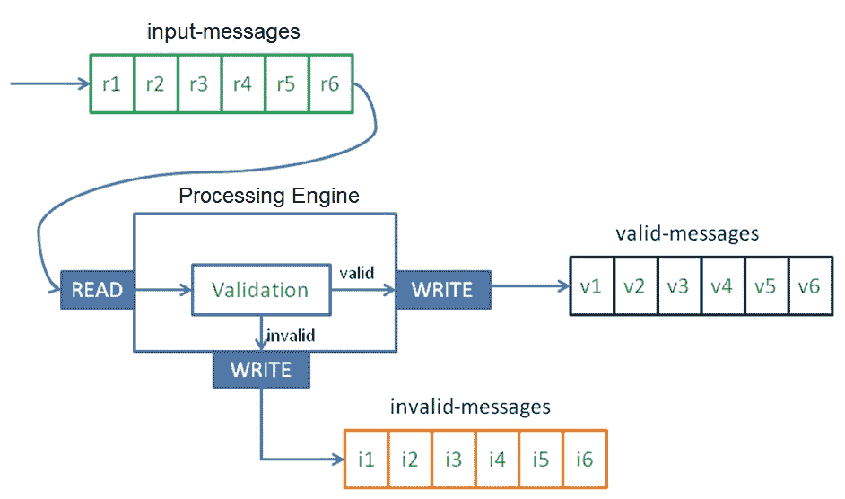
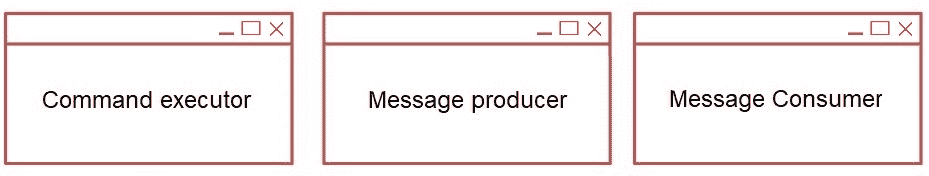
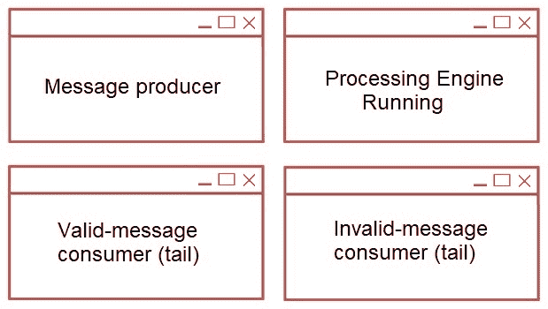

# 消息验证

第一章，*配置 Kafka*，专注于如何设置 Kafka 集群并运行命令行生产者和消费者。有了事件生产者，我们现在必须处理这些事件。

在详细说明之前，让我们先介绍我们的案例研究。我们需要对 Monedero 公司的系统进行建模，Monedero 是一家虚构的公司，其核心业务是加密货币交易。Monedero 希望将其 IT 基础设施建立在用 Apache Kafka 构建的**企业服务总线**（**ESB**）上。Monedero 的 IT 部门希望统一整个组织的服务骨干。Monedero 还有全球性的、基于网页的和基于移动应用的客户，因此实时响应是基本要求。

全球在线客户浏览 Monedero 网站以交换他们的加密货币。客户在 Monedero 可以执行很多用例，但这个例子专注于从 Web 应用程序的具体交换工作流程部分。

本章涵盖以下主题：

+   以 JSON 格式建模消息

+   使用 Gradle 设置 Kafka 项目

+   使用 Java 客户端从 Kafka 读取

+   使用 Java 客户端向 Kafka 写入

+   运行处理引擎管道

+   使用 Java 编写`Validator`

+   运行验证

# 企业服务总线概述

事件处理包括从一个事件流中取出一个或多个事件，并对这些事件应用动作。一般来说，在企业服务总线中，有商品服务；最常见的如下：

+   数据转换

+   事件处理

+   协议转换

+   数据映射

在大多数情况下，消息处理涉及以下内容：

+   根据消息架构对消息结构进行验证

+   给定一个事件流，从流中过滤消息

+   使用附加数据丰富消息

+   从两个或多个消息中聚合（组合）以生成新的消息

本章是关于事件验证的。接下来的章节将介绍组合和丰富。

# 事件建模

事件建模的第一步是将事件用以下形式的英语表达出来：

主语-动词-直接宾语

对于这个例子，我们正在建模事件*客户咨询 ETH 价格*：

+   这句话的主语是*customer*，一个名词，在主格。主语是执行动作的实体。

+   这句话中的动词是*consults*；它描述了主语执行的动作。

+   这句话的直接宾语是*ETH 价格*。宾语是动作被执行的实体。

我们可以用几种消息格式来表示我们的消息（本书的其他章节有所涉及）：

+   **JavaScript 对象表示法**（**JSON**）

+   Apache Avro

+   Apache Thrift

+   Protocol Buffers

JSON 易于被人类和机器读取和写入。例如，我们可以选择二进制作为表示方式，但它有一个严格的格式，并且它不是为人类阅读而设计的；作为平衡，二进制表示在处理上非常快速和轻量级。

*列表 2.1*显示了`CUSTOMER_CONSULTS_ETHPRICE`事件在 JSON 格式中的表示：

```java
{
  "event": "CUSTOMER_CONSULTS_ETHPRICE",
   "customer": {
         "id": "14862768",
         "name": "Snowden, Edward",
         "ipAddress": "95.31.18.111"
   },
   "currency": {
         "name": "ethereum",
         "price": "RUB"
   },
   "timestamp": "2018-09-28T09:09:09Z"
}
```

列表 2.1：customer_consults_ETHprice.json

对于这个例子，以太币（ETH）的价格是以俄罗斯卢布（RUB）表示的。这个 JSON 消息有四个部分：

+   `event`: 这是一个包含事件名称的字符串。

+   `customer`: 这代表咨询以太币价格的人（在这种情况下，其`id`为`14862768`）。在这个表示中，有一个唯一的客户 ID、姓名和浏览器的`ipAddress`，这是客户登录的计算机的 IP 地址。

+   `currency`: 这包含加密货币的名称以及价格所表示的货币。

+   `timestamp`: 客户请求时的戳记（UTC）。

从另一个角度来看，消息有两个部分：元数据——这是事件名称和戳记，以及两个业务实体，客户和货币。正如我们所见，这条消息可以被人类阅读和理解。

来自同一用例的其他消息，以 JSON 格式可能如下所示：

```java
{ "event": "CUSTOMER_CONSULTS_ETHPRICE",
   "customer": {
         "id": "13548310",
         "name": "Assange, Julian",
         "ipAddress": "185.86.151.11"
   },
   "currency": {
         "name": "ethereum",
         "price": "EUR"
   },
   "timestamp": "2018-09-28T08:08:14Z"
}
```

这又是一个例子：

```java
{ "event": "CUSTOMER_CONSULTS_ETHPRICE",
   "customer": {
         "id": "15887564",
         "name": "Mills, Lindsay",
         "ipAddress": "186.46.129.15"
   },
   "currency": {
         "name": "ethereum",
         "price": "USD"
   },
   "timestamp": "2018-09-28T19:51:35Z"
}
```

如果我们想在 Avro 模式中表示我们的消息会怎样呢？是的，我们的消息的 Avro 模式（注意，这不是消息，而是模式）在*列表 2.2*中：

```java
{ "name": "customer_consults_ethprice",
  "namespace": "monedero.avro",
  "type": "record",
  "fields": [
    { "name": "event", "type": "string" },
    { "name": "customer",
      "type": {
          "name": "id", "type": "long",
          "name": "name", "type": "string",
          "name": "ipAddress", "type": "string"
      }
    },
    { "name": "currency",
      "type": {
          "name": "name", "type": "string",
          "name": "price", "type": {
          "type": "enum", "namespace": "monedero.avro",
            "name": "priceEnum", "symbols": ["USD", "EUR", "RUB"]}
      }
    },
    { "name": "timestamp", "type": "long",
      "logicalType": "timestamp-millis"
    }
  ]
}
```

列表 2.2：customer_consults_ethprice.avsc

更多关于 Avro 模式的信息，请查看 Apache Avro 规范：

[`avro.apache.org/docs/1.8.2/spec.html`](https://avro.apache.org/docs/1.8.2/spec.html)

# 设置项目

这次，我们将使用 Gradle 构建我们的项目。第一步是下载并安装 Gradle，可以从[`www.gradle.org/downloads`](http://www.gradle.org/downloads)下载。

Gradle 只需要 Java JDK（版本 7 或更高）。

macOS 用户可以使用`brew`命令安装 Gradle，如下所示：

```java
$ brew update && brew install gradle
```

输出类似于以下内容：

```java
==> Downloading https://services.gradle.org/distributions/gradle-4.10.2-all.zip
==> Downloading from https://downloads.gradle.org/distributions/gradle-4.10.2-al
######################################################################## 100.0%
 /usr/local/Cellar/gradle/4.10.2: 203 files, 83.7MB, built in 59 seconds
```

Linux 用户可以使用`apt-get`命令安装 Gradle，如下所示：

```java
$ apt-get install gradle
```

Unix 用户可以使用 sdkman 安装，这是一个用于管理大多数基于 Unix 系统的并行版本的工具，如下所示：

```java
$ sdk install gradle 4.3
```

要检查 Gradle 是否正确安装，请输入以下内容：

```java
$ gradle -v
```

输出类似于以下内容：

```java
------------------------------------------------------------
Gradle 4.10.2
------------------------------------------------------------
```

第一步是创建一个名为`monedero`的目录，然后从这个目录执行以下操作：

```java
$ gradle init --type java-library
```

输出类似于以下内容：

```java
...
BUILD SUCCESSFUL
...
```

Gradle 在目录内生成一个骨架项目。该目录应类似于以下内容：

+   `- build.gradle`

+   `- gradle`

+   `-- wrapper`

+   `--- gradle-wrapper.jar`

+   `--- gradle-vreapper.properties`

+   `- gradlew`

+   `- gradle.bat`

+   `- settings.gradle`

+   `- src`

+   `-- main`

+   `--- java`

+   `----- Library.java`

+   `-- test`

+   `--- java`

+   `----- LibraryTest.java`

可以删除两个 Java 文件，`Library.java`和`LibraryTest.java`。

现在，修改名为`build.gradle`的 Gradle 构建文件，并用*列表 2.3*替换它：

```java
apply plugin: 'java'
apply plugin: 'application'
sourceCompatibility = '1.8'
mainClassName = 'monedero.ProcessingEngine'
repositories {
 mavenCentral()
}
version = '0.1.0'
dependencies {
 compile group: 'org.apache.kafka', name: 'kafka_2.12', version: '2.0.0'
 compile group: 'com.fasterxml.jackson.core', name: 'jackson-core', version: '2.9.7'
}
jar {
 manifest {
 attributes 'Main-Class': mainClassName
 } from {
 configurations.compile.collect {
 it.isDirectory() ? it : zipTree(it)
 }
 }
 exclude "META-INF/*.SF"
 exclude "META-INF/*.DSA"
 exclude "META-INF/*.RSA"
}
```

列表 2.3：ProcessingEngine Gradle 构建文件

此文件显示了引擎的库依赖项：

+   `kafka_2.12`是 Apache Kafka 的依赖项

+   `jackson-databind`是用于 JSON 解析和操作的库

要编译源代码并下载所需的库，请输入以下命令：

```java
$ gradle compileJava
```

输出类似于以下内容：

```java
...
BUILD SUCCESSFUL
...
```

项目可以用 Maven 或 SBT 创建，甚至可以从 IDE（IntelliJ、Eclipse、Netbeans）创建。但为了简单起见，这里使用 Gradle 创建。

更多关于构建工具的信息，请访问以下链接：

+   Gradle 的主页：[`www.gradle.org`](http://www.gradle.org)

+   Maven 的主页：[`maven.apache.org`](http://maven.apache.org)

+   SBT 的主页：[`www.scala-sbt.org/`](http://www.scala-sbt.org/)

# 从 Kafka 读取

既然我们已经有了我们的项目骨架，让我们回顾一下流处理引擎的项目要求。记住，我们的事件客户咨询 ETH 价格发生在 Monedero 之外，并且这些消息可能没有很好地形成，也就是说，它们可能有缺陷。我们管道的第一步是验证输入事件具有正确的数据和正确的结构。我们的项目将被称为`ProcessingEngine`。

`ProcessingEngine`规范应创建一个执行以下操作的管道应用程序：

+   从名为**input-messages**的 Kafka 主题读取每条消息

+   验证每条消息，将任何无效事件发送到名为**invalid-messages**的特定 Kafka 主题

+   将正确的消息写入名为**valid-messages**的 Kafka 主题

这些步骤在*图 2.1*中详细说明，这是管道处理引擎的第一个草图：



图 2.1：处理引擎从输入消息主题读取事件，验证消息，并将有缺陷的消息路由到无效消息主题，正确的消息路由到有效消息主题

处理引擎流构建有两个阶段：

+   创建一个简单的 Kafka 工作器，从 Kafka 的**input-messages**主题读取并写入另一个主题的事件

+   修改 Kafka 工作器以进行验证

因此，让我们进行第一步。构建一个 Kafka 工作器，从**input-messages**主题读取单个原始消息。我们在 Kafka 术语中说需要一个消费者。如果你还记得，在第一章中我们构建了一个命令行生产者将事件写入主题，以及一个命令行消费者从该主题读取事件。现在，我们将用 Java 编写相同的消费者。

对于我们的项目，消费者是一个 Java 接口，它包含所有实现消费者类的必要行为。

在`src/main/java/monedero/`目录下创建一个名为`Consumer.java`的文件，其内容为*列表 2.4*：

```java
package monedero;
import java.util.Properties;
public interface Consumer {
  static Properties createConfig(String servers, String groupId) {
    Properties config = new Properties();
    config.put("bootstrap.servers", servers);
    config.put("group.id", groupId);
    config.put("enable.auto.commit", "true");
    config.put("auto.commit.interval.ms", "1000");
    config.put("auto.offset.reset", "earliest");
    config.put("session.timeout.ms", "30000");
    config.put("key.deserializer",
        "org.apache.kafka.common.serialization.StringDeserializer");
    config.put("value.deserializer",
        "org.apache.kafka.common.serialization.StringDeserializer");
    return config;
  }
}
```

列表 2.4：Consumer.java

消费者接口封装了 Kafka 消费者的通用行为。消费者接口有一个 `createConfig` 方法，用于设置所有 Kafka 消费者所需的属性。请注意，反序列化器是 `StringDeserializer` 类型，因为 Kafka 消费者读取的 Kafka 键值记录中的值是字符串类型。

现在，在 `src/main/java/monedero/` 目录下创建一个名为 `Reader.java` 的文件，其内容为 *清单 2.5*：

```java
package monedero;
import org.apache.kafka.clients.consumer.ConsumerRecord;
import org.apache.kafka.clients.consumer.ConsumerRecords;
import org.apache.kafka.clients.consumer.KafkaConsumer;
import java.time.Duration;
import java.util.Collections;
class Reader implements Consumer {
  private final KafkaConsumer<String, String> consumer;//1
  private final String topic;
  Reader(String servers, String groupId, String topic) {
    this.consumer =
        new KafkaConsumer<>(Consumer.createConfig(servers, groupId));
    this.topic = topic;
  }
  void run(Producer producer) {
    this.consumer.subscribe(Collections.singletonList(this.topic));//2
 while (true) {//3
      ConsumerRecords<String, String> records = consumer.poll(Duration.ofMillis(100));  //4
      for (ConsumerRecord<String, String> record : records) {
producer.process(record.value());//5
      }
    }
  }
}
```

清单 2.5：Reader.java

`Reader` 类实现了消费者接口。因此，`Reader` 是一个 Kafka 消费者：

+   在行 `//1` 中，`<String, String>` 表示 `KafkaConsumer` 读取的 Kafka 记录中键和值都是字符串类型

+   在行 `//2` 中，消费者订阅了其构造函数中指定的 Kafka 主题

+   在行 `//3` 中，有一个用于演示目的的 `while(true)` 无限循环；在实际应用中，我们可能需要处理更健壮的代码，可能实现 `Runnable`

+   在行 `//4` 中，这个消费者将每隔 100 毫秒从指定的主题中收集数据

+   在行 `//5` 中，消费者将待处理的消息发送给生产者

此消费者从指定的 Kafka 主题读取所有消息，并将它们发送到指定生产者的 process 方法。所有配置属性都在消费者接口中指定，但具体来说，`groupId` 属性很重要，因为它将消费者与特定的消费者组关联起来。

当我们需要在所有组成员之间共享主题的事件时，消费者组非常有用。消费者组还用于将不同的实例分组或隔离。

要了解更多关于 Kafka 消费者 API 的信息，请点击此链接：[`kafka.apache.org/20/javadoc/org/apache/kafka/clients/consumer/KafkaConsumer.html/`](https://kafka.apache.org/20/javadoc/org/apache/kafka/clients/consumer/KafkaConsumer.html)

# 写入 Kafka

我们的 `Reader` 调用了 `process()` 方法；这个方法属于 `Producer` 类。与消费者接口一样，生产者接口封装了 Kafka 生产者的所有通用行为。本章中的两个生产者实现了这个生产者接口。

在 `src/main/java/monedero` 目录下，一个名为 `Producer.java` 的文件中，复制 *清单 2.6* 的内容：

```java
package monedero;
import java.util.Properties;
import org.apache.kafka.clients.producer.KafkaProducer;
import org.apache.kafka.clients.producer.ProducerRecord;
public interface Producer {
  void process(String message);                                 //1
  static void write(KafkaProducer<String, String> producer,
                    String topic, String message) {             //2
    ProducerRecord<String, String> pr = new ProducerRecord<>(topic, message);
    producer.send(pr);
  }
  static Properties createConfig(String servers) {              //3
    Properties config = new Properties();
    config.put("bootstrap.servers", servers);
    config.put("acks", "all");
    config.put("retries", 0);
    config.put("batch.size", 1000);
    config.put("linger.ms", 1);
    config.put("key.serializer",
"org.apache.kafka.common.serialization.StringSerializer");
config.put("value.serializer",
        "org.apache.kafka.common.serialization.StringSerializer"); 
         return config;
}
}
```

清单 2.6：Producer.java

生产者接口有以下观察结果：

+   在 `Reader` 类中调用的名为 process 的抽象方法

+   一个名为 write 的静态方法，它将消息发送到指定主题的生产者

+   一个名为 `createConfig` 的静态方法，其中设置了通用生产者所需的全部属性

与消费者接口一样，需要一个生产者接口的实现。在这个第一个版本中，我们只是将传入的消息传递到另一个主题，而不修改消息。实现代码在 *清单 2.7* 中，应保存为 `src/main/java/m` 目录下的 `Writer.java` 文件。

以下为*列表 2.7*，`Writer.java`的内容：

```java
package monedero;
import org.apache.kafka.clients.producer.KafkaProducer;
public class Writer implements Producer {
  private final KafkaProducer<String, String> producer;
  private final String topic;
  Writer(String servers, String topic) {
    this.producer = new KafkaProducer<>(
        Producer.createConfig(servers));//1
    this.topic = topic;
  }
  @Override
  public void process(String message) {
    Producer.write(this.producer, this.topic, message);//2
  }
}
```

列表 2.7：Writer.java

在`Producer`类的这个实现中，我们可以看到以下内容：

+   `createConfig`方法被调用，以从生产者接口设置必要的属性

+   `process`方法将每条传入的消息写入输出主题。随着消息从主题到达，它被发送到目标主题

这个生产者实现非常简单；它不修改、验证或丰富消息。它只是将它们写入输出主题。

要了解更多关于 Kafka 生产者 API 的信息，请点击以下链接：

[`kafka.apache.org/0110/javadoc/index.html?org/apache/kafka/clients/consumer/KafkaProducer.html`](https://kafka.apache.org/0110/javadoc/index.html?org/apache/kafka/clients/consumer/KafkaProducer.html)

# 运行处理引擎

`ProcessingEngine`类协调`Reader`和`Writer`类。它包含协调它们的主方法。在`src/main/java/monedero/`目录下创建一个名为`ProcessingEngine.java`的新文件，并将*列表 2.8*中的代码复制进去。

以下为*列表 2.8*，`ProcessingEngine.java`的内容：

```java
package monedero;
public class ProcessingEngine {
  public static void main(String[] args) {
    String servers = args[0];
    String groupId = args[1];
    String sourceTopic = args[2];
    String targetTopic = args[3];
    Reader reader = new Reader(servers, groupId, sourceTopic);
    Writer writer = new Writer(servers, targetTopic);
    reader.run(writer);
  }
}
```

列表 2.8：ProcessingEngine.java

`ProcessingEngine`从命令行接收四个参数：

+   `args[0]` `servers`，Kafka 代理的主机和端口

+   `args[1]` `groupId`，消费者的消费者组

+   `args[2]` `sourceTopic`，`inputTopic`，`Reader`从中读取

+   `args[3]` `targetTopic`，`outputTopic`，`Writer`写入到

要构建项目，从`monedero`目录运行以下命令：

```java
$ gradle jar
```

如果一切正常，输出将类似于以下内容：

```java
...
BUILD SUCCESSFUL
...
```

要运行项目，我们需要打开三个不同的命令行窗口。*图 2.2*显示了命令行窗口应该看起来是什么样子：



图 2.2：测试处理引擎的三个终端窗口，包括消息生产者、消息消费者以及应用程序本身

1.  在第一个命令行终端中，切换到`Confluent`目录并启动它，如下所示：

```java
$ bin/confluent start
```

1.  一旦控制中心（包括 Zookeeper 和 Kafka）在同一命令行终端中运行，按照以下方式生成两个必要的主题：

```java
$ bin/kafka-topics --create --zookeeper localhost:2181 --replication-factor 1 --partitions 1 --topic input-topic

$ bin/kafka-topics --create --zookeeper localhost:2181 --replication-factor 1 --partitions 1 --topic output-topic
```

回想一下，要显示我们集群中运行的主题，请使用以下命令：

```java
$ bin/kafka-topics --list --zookeeper localhost:2181
```

如果有误输入，要删除某些主题（以防万一），请输入以下命令：

```java
$ bin/kafka-topics --delete --zookeeper localhost:2181 --topic 
unWantedTopic
```

1.  在同一命令行终端中，启动运行`input-topic`主题的控制台生产者，如下所示：

```java
$ bin/kafka-console-producer --broker-list localhost:9092 --topic 
input-topic
```

这个窗口是输入消息的地方。

1.  在第二个命令行终端中，通过输入以下内容启动监听`output-topic`的控制台消费者：

```java
$ bin/kafka-console-consumer --bootstrap-server localhost:9092 --
from-beginning --topic output-topic
```

1.  在第三个命令行终端中，启动处理引擎。转到执行`gradle jar`命令的项目根目录并运行，如下所示：

```java
$ java -jar ./build/libs/monedero-0.1.0.jar localhost:9092 foo 
input-topic output-topic
```

现在，展示的内容包括从`input-topic`读取所有事件并将它们写入`output-topic`。

前往第一个命令行终端（消息生产者），发送以下三条消息（记得在消息之间按回车，并且每条消息只执行一行）：

```java
{"event": "CUSTOMER_CONSULTS_ETHPRICE", "customer": {"id": "14862768", "name": "Snowden, Edward", "ipAddress": "95.31.18.111"}, "currency": {"name": "ethereum", "price": "RUB"}, "timestamp": "2018-09-28T09:09:09Z"}

{"event": "CUSTOMER_CONSULTS_ETHPRICE", "customer": {"id": "13548310", "name": "Assange, Julian", "ipAddress": "185.86.151.11"}, "currency": {"name": "ethereum", "price": "EUR"}, "timestamp": "2018-09-28T08:08:14Z"}

{"event": "CUSTOMER_CONSULTS_ETHPRICE", "customer": {"id": "15887564", "name": "Mills, Lindsay", "ipAddress": "186.46.129.15"}, "currency": {"name": "ethereum", "price": "USD"}, "timestamp": "2018-09-28T19:51:35Z"}
```

如果一切正常，控制台生产者中输入的消息应该出现在控制台消费者窗口中，因为处理引擎正在从 `input-topic` 复制到 `output-topic`。

下一步是将更复杂的版本涉及消息验证（当前章节）、消息丰富(第三章，*消息丰富*)和消息转换(第四章，*序列化*)。

使用第一章中提出的相同建议，*配置 Kafka*，将复制因子和分区参数设置为 1；尝试设置不同的值，并观察停止一个服务器时会发生什么。

# 用 Java 编写验证器

`Writer` 类实现了生产者接口。想法是修改这个 `Writer` 并以最小的努力构建一个验证类。`Validator` 处理过程如下：

+   从**输入消息**主题读取 Kafka 消息

+   验证消息，将不合格的消息发送到**无效消息**主题

+   将格式良好的消息写入**有效消息**主题

目前，对于这个例子，有效消息的定义是一个满足以下条件的消息：

+   它是 JSON 格式

+   它包含四个必需的字段：事件、客户、货币和时间

如果这些条件不满足，将生成一个新的 JSON 格式错误消息，并将其发送到无效消息 Kafka 主题。这个错误消息的架构非常简单：

```java
{"error": "Failure description" }
```

第一步是在 `src/main/java/monedero/` 目录中创建一个新的 `Validator.java` 文件，并复制其中 *列表 2.9* 的内容。

以下为 *列表 2.9*，`Validator.java` 的内容：

```java
package monedero;
import com.fasterxml.jackson.databind.JsonNode;
import com.fasterxml.jackson.databind.ObjectMapper;
import org.apache.kafka.clients.producer.KafkaProducer;
import java.io.IOException;

public class Validator implements Producer {
  private final KafkaProducer<String, String> producer;
  private final String validMessages;
  private final String invalidMessages;
  private static final ObjectMapper MAPPER = new ObjectMapper();

  public Validator(String servers, String validMessages, String invalidMessages) { //1
    this.producer = new KafkaProducer<>(Producer.createConfig(servers));
    this.validMessages = validMessages;
    this.invalidMessages = invalidMessages;
  }

  @Override
  public void process(String message) {
    try {
      JsonNode root = MAPPER.readTree(message);
      String error = "";
      error = error.concat(validate(root, "event")); //2
      error = error.concat(validate(root, "customer"));
      error = error.concat(validate(root, "currency"));
      error = error.concat(validate(root, "timestamp"));
      if (error.length() > 0) {
        Producer.write(this.producer, this.invalidMessages, //3
        "{\"error\": \" " + error + "\"}");
      } else {
        Producer.write(this.producer, this.validMessages, //4
        MAPPER.writeValueAsString(root));
      }
    } catch (IOException e) {
      Producer.write(this.producer, this.invalidMessages, "{\"error\": \""
      + e.getClass().getSimpleName() + ": " + e.getMessage() + "\"}");//5 
    }
  }
  private String validate(JsonNode root, String path) {
    if (!root.has(path)) {
      return path.concat(" is missing. ");
    }
    JsonNode node = root.path(path);
    if (node.isMissingNode()) {
      return path.concat(" is missing. ");
    }
    return "";
  }
}
```

列表 2.9：Validator.java

与 `Writer` 类一样，`Validator` 类也实现了 `Producer` 类，但如下：

+   在第 `//1` 行，其构造函数接受两个主题：有效消息主题和无效消息主题

+   在第 `//2` 行，process 方法验证消息是否为 JSON 格式，以及字段：事件、客户、货币和时间的存在

+   在第 `//3` 行，如果消息没有任何必需的字段，则将错误消息发送到无效消息主题

+   在第 `//4` 行，如果消息有效，则将消息发送到有效消息主题

+   在第 `//5` 行，如果消息不是 JSON 格式，则将错误消息发送到无效消息主题

# 运行验证

目前，`ProcessingEngine` 类协调 `Reader` 和 `Writer` 类。它包含协调它们的主要方法。我们必须编辑位于 `src/main/java/monedero/` 目录中的 `ProcessingEngine` 类，并将 `Writer` 替换为 `Validator`，如*列表 2.10*所示。

以下为*列表 2.10*，`ProcessingEngine.java`的内容：

```java
package monedero;
public class ProcessingEngine {
  public static void main(String[] args) {
    String servers = args[0];
    String groupId = args[1];
    String inputTopic = args[2];
    String validTopic = args[3];
    String invalidTopic = args[4];
    Reader reader = new Reader(servers, groupId, inputTopic);
    Validator validator = new Validator(servers, validTopic, invalidTopic);
    reader.run(validator);
  }
}
```

列表 2.10：ProcessingEngine.java

`ProcessingEngine`从命令行接收五个参数：

+   `args[0]` `servers`，表示 Kafka 代理的主机和端口

+   `args[1]` `groupId`，表示消费者是这个 Kafka 消费者组的一部分

+   `args[2]` `inputTopic`，`Reader`读取的主题

+   `args[3]` `validTopic`，有效消息发送的主题

+   `args[4]` `invalidTopic`，无效消息发送的主题

要从`monedero`目录重新构建项目，运行以下命令：

```java
$ gradle jar
```

如果一切正常，输出应该类似于以下内容：

```java
...
BUILD SUCCESSFUL
...
```

要运行项目，我们需要四个不同的命令行窗口。*图 2.3*显示了命令行窗口的布局：



图 2.3：测试处理引擎的四个终端窗口，包括：消息生产者、有效消息消费者、无效消息消费者和处理引擎本身

1.  在第一个命令行终端中，进入 Kafka 安装目录并生成两个必要的主题：

```java
$ bin/kafka-topics --create --zookeeper localhost:2181 --
replication-factor 1 --partitions 1 --topic valid-messages

$ bin/kafka-topics --create --zookeeper localhost:2181 --
replication-factor 1 --partitions 1 --topic invalid-messages
```

然后，启动一个向`input-topic`主题的控制台生产者，如下所示：

```java
$ bin/kafka-console-producer --broker-list localhost:9092 --topic 
input-topic
```

这个窗口是输入消息被产生（输入）的地方。

1.  在第二个命令行窗口中，启动一个监听有效消息主题的命令行消费者，如下所示：

```java
$ bin/kafka-console-consumer --bootstrap-server localhost:9092 --
from-beginning --topic valid-messages
```

1.  在第三个命令行窗口中，启动一个监听无效消息主题的命令行消费者，如下所示：

```java
$ bin/kafka-console-consumer --bootstrap-server localhost:9092 --
from-beginning --topic invalid-messages
```

1.  在第四个命令行终端中，启动处理引擎。从项目根目录（执行`gradle jar`命令的地方），运行以下命令：

```java
$ java -jar ./build/libs/monedero-0.1.0.jar localhost:9092 foo 
input-topic valid-messages invalid-messages
```

从第一个命令行终端（控制台生产者），发送以下三条消息（记住在消息之间按回车，并且每条消息只执行一行）：

```java
{"event": "CUSTOMER_CONSULTS_ETHPRICE", "customer": {"id": "14862768", "name": "Snowden, Edward", "ipAddress": "95.31.18.111"}, "currency": {"name": "ethereum", "price": "RUB"}, "timestamp": "2018-09-28T09:09:09Z"}

{"event": "CUSTOMER_CONSULTS_ETHPRICE", "customer": {"id": "13548310", "name": "Assange, Julian", "ipAddress": "185.86.151.11"}, "currency": {"name": "ethereum", "price": "EUR"}, "timestamp": "2018-09-28T08:08:14Z"}

{"event": "CUSTOMER_CONSULTS_ETHPRICE", "customer": {"id": "15887564", "name": "Mills, Lindsay", "ipAddress": "186.46.129.15"}, "currency": {"name": "ethereum", "price": "USD"}, "timestamp": "2018-09-28T19:51:35Z"}
```

由于这些是有效消息，生产者控制台输入的消息应该出现在有效消息消费者控制台窗口中。

现在尝试发送有缺陷的消息；首先，尝试不是 JSON 格式的消息：

```java
I am not JSON, I am Freedy. [enter]
I am a Kafkeeter! [enter]
```

这条消息应该被接收在无效消息主题中（并在窗口中显示），如下所示：

```java
{"error": "JsonParseException: Unrecognized token ' I am not JSON, I am Freedy.': was expecting 'null','true', 'false' or NaN
at [Source: I am not JSON, I am Freedy.; line: 1, column: 4]"}
```

然后，让我们尝试更复杂的事情，第一条消息但没有时间戳，就像在示例中那样：

```java
{"event": "CUSTOMER_CONSULTS_ETHPRICE", "customer": {"id": "14862768", "name": "Snowden, Edward", "ipAddress": "95.31.18.111"}, "currency": {"name": "ethereum", "price": "RUB"}}
```

这条消息应该被接收在无效消息主题中，如下所示：

```java
{"error": "timestamp is missing."}
```

消息验证已完成，如您所见，还有更多验证要做，例如，验证 JSON 模式，但这将在第五章，“模式注册”中介绍。

本章中详细介绍的*图 2.1*的架构将在第三章，“消息丰富”中使用。

# 摘要

在本章中，我们学习了如何对 JSON 格式的消息进行建模，以及如何使用 Gradle 设置 Kafka 项目。

此外，我们还学习了如何使用 Java 客户端向 Kafka 写入和读取数据，如何运行处理引擎，如何用 Java 编写验证器，以及如何运行消息验证。

在第三章“消息增强”中，本章的架构将被重新设计以包含消息增强。
