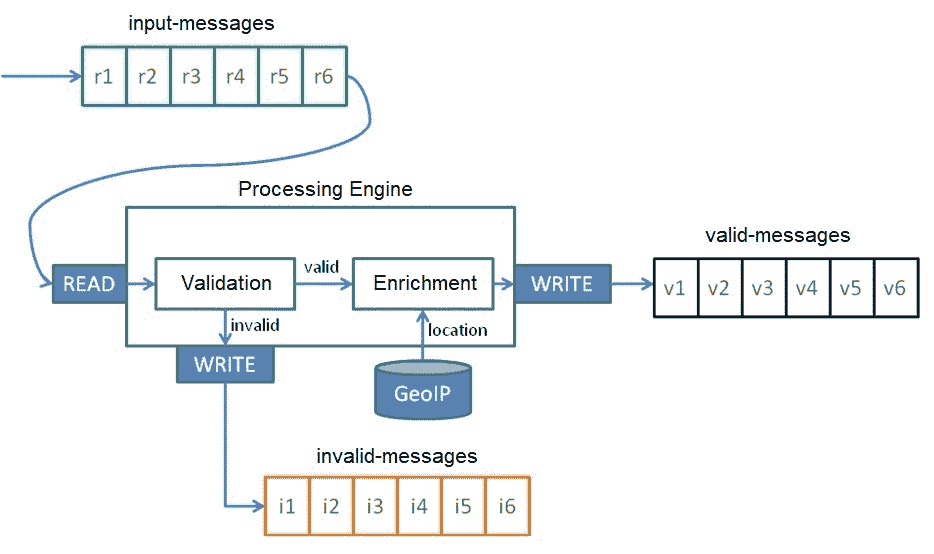
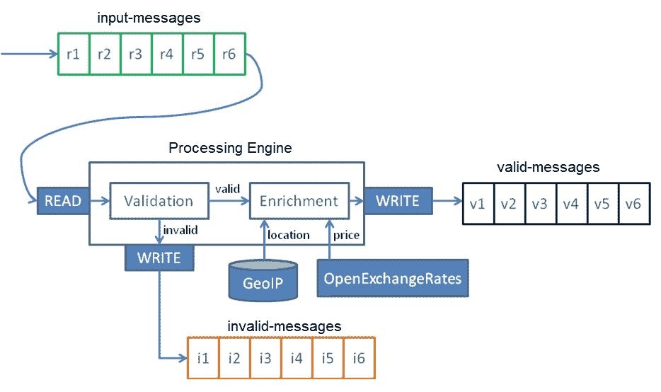
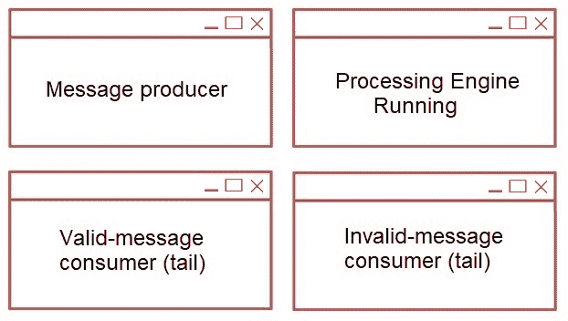

# 第三章：消息丰富

要完全理解本章内容，必须阅读上一章，该章重点介绍了如何验证事件。本章重点介绍如何丰富事件。

在本章中，我们将继续使用 Monedero 系统，这是我们虚构的公司，致力于加密货币的交换。如果我们回顾上一章，Monedero 的消息已被验证；在本章中，我们将继续使用相同的流程，但我们将增加一个额外的丰富步骤。

在这个背景下，我们将丰富理解为添加原始消息中不存在的数据。在本章中，我们将看到如何使用 MaxMind 数据库丰富消息的地理位置，以及如何使用 Open Exchange 数据提取当前汇率。如果我们还记得为 Monedero 建模的事件，每个事件都包括了客户电脑的 IP 地址。

在本章中，我们将使用 MaxMind 免费数据库，它为我们提供了一个包含 IP 地址与其地理位置映射的 API。

Monedero 系统在我们的客户请求系统时，会在 MaxMind 数据库中搜索客户的 IP 地址，以确定客户的位置。使用外部数据源将它们添加到我们的事件中，我们称之为消息丰富。

在加密货币的世界中，有一种称为 Bit License 的东西，其中一些地理区域根据法律限制进行与加密货币相关的活动。我们目前为 Monedero 提供了一种事件验证服务。

然而，法律部门要求我们有一个验证过滤器，以了解客户的地理位置，从而能够遵守 Bit License。Bit License 自 2014 年 7 月在新泽西地区运营，适用于居民。根据法律条款，被认为是居民的人包括所有居住、位于、有业务场所或在纽约州开展业务的人。

本章涵盖了以下主题：

+   提取工作原理

+   丰富工作原理

+   根据 IP 地址提取位置

+   根据货币提取货币价格

+   根据位置提取天气数据

+   使用地理位置丰富消息

+   使用货币价格丰富消息

+   运行处理引擎

# 提取地理位置

打开在第二章“消息验证”中创建的 Monedero 项目中的`build.gradle`文件，并添加*列表 3.1*中突出显示的行。

以下为*列表 3.1*的内容，即 Monedero 的`build.gradle`文件：

```java
apply plugin: 'java'
apply plugin: 'application'
sourceCompatibility = '1.8'
mainClassName = 'monedero.ProcessingEngine'
repositories {
  mavenCentral()
}
version = '0.2.0'
dependencies {
    compile group: 'org.apache.kafka', name: 'kafka_2.12', version:                                                                                                                                              
                                                            '2.0.0'
    compile group: 'com.maxmind.geoip', name: 'geoip-api', version:                                         
                                                            '1.3.1'
    compile group: 'com.fasterxml.jackson.core', name: 'jackson-core', version: '2.9.7'
}
jar {
  manifest {
    attributes 'Main-Class': mainClassName
  } from {
    configurations.compile.collect {
      it.isDirectory() ? it : zipTree(it)
    }
  }
  exclude "META-INF/*.SF"
  exclude "META-INF/*.DSA"
  exclude "META-INF/*.RSA"
}
```

列表 3.1：build.gradle

注意，第一个更改是从版本 0.1.0 切换到版本 0.2.0。

第二个更改是将 MaxMind 的 GeoIP 版本 1.3.1 添加到我们的项目中。

从项目根目录运行以下命令以重新构建应用程序：

```java
$ gradle jar
```

输出结果类似于以下内容：

```java
...BUILD SUCCESSFUL in 8s
2 actionable tasks: 2 executed
```

要下载 MaxMind GeoIP 免费数据库的副本，请执行此命令：

```java
$ wget "http://geolite.maxmind.com/download/geoip/database/GeoLiteCity.dat.gz"
```

运行以下命令来解压缩文件：

```java
$ gunzip GeoLiteCity.dat.gz
```

将 `GeoLiteCity.dat` 文件移动到程序可访问的路由中。

现在，在 `src/main/java/monedero/extractors` 目录中添加一个名为 `GeoIPService.java` 的文件，包含 *Listing 3.2* 的内容：

```java
package monedero.extractors;
import com.maxmind.geoip.Location;
import com.maxmind.geoip.LookupService;
import java.io.IOException;
import java.util.logging.Level;
import java.util.logging.Logger;
public final class GeoIPService {
  private static final String MAXMINDDB = "/path_to_your_GeoLiteCity.dat_file";
  public Location getLocation(String ipAddress) {
    try {
      final LookupService maxmind = 
        new LookupService(MAXMINDDB, LookupService.GEOIP_MEMORY_CACHE);
      return maxmind.getLocation(ipAddress);
    } catch (IOException ex) {
      Logger.getLogger(GeoIPService.class.getName()).log(Level.SEVERE, null, ex);
    }
    return null;
  }
}
```

列表 3.2：GeoIPService.java

`GeoIPService` 有一个公共方法 `getLocation`，它接收一个表示 IP 地址的字符串，并在 GeoIP 位置数据库中查找该 IP 地址。此方法返回一个包含该特定 IP 地址地理位置的 `location` 类对象。

有时会有一些要求严格的客户要求获取数据库的最新版本。在这种情况下，持续下载数据库不是一个选择。为此类情况，MaxMind 通过 API 提供其服务。要了解更多信息，请访问以下 URL：[`dev.maxmind.com/`](https://dev.maxmind.com/)。

要了解更多关于位许可证法规的信息，请访问以下链接：

[`www.dfs.ny.gov/legal/regulations/bitlicense_reg_framework.html`](http://www.dfs.ny.gov/legal/regulations/bitlicense_reg_framework.html)

# 丰富消息

现在，我们将回顾 Monedero 处理引擎的步骤。客户在客户端浏览器中咨询 ETH 价格，并通过一些 HTTP 事件收集器发送到 Kafka。

我们流程中的第一步是事件正确性验证；记得从上一章中，有缺陷的消息是从不良数据中派生出来的，这就是为什么它们被过滤掉。现在第二步是丰富我们的消息，添加地理信息。

这里是 Monedero 处理引擎的架构步骤：

1.  从名为 **input-messages** 的 Kafka 主题中读取单个事件

1.  验证消息，将任何有缺陷的事件发送到名为 **invalid-messages** 的专用 Kafka 主题

1.  丰富消息的地理信息

1.  在名为 **valid-messages** 的 Kafka 主题中写入增强的消息

所有这些步骤都详细地列在 *Figure 3.1* 中：



图 3.1：处理引擎从输入消息主题读取事件，验证消息，将错误发送到无效消息主题，丰富消息的地理信息，然后将它们写入有效消息主题。

现在，让我们在 `src/main/java/monedero/` 目录中创建一个名为 `Enricher.java` 的文件，包含 *Listing 3.**3* 的内容：

```java
package monedero;

import com.fasterxml.jackson.databind.JsonNode;
import com.fasterxml.jackson.databind.ObjectMapper;
import com.fasterxml.jackson.databind.node.ObjectNode;
import com.maxmind.geoip.Location;
import monedero.extractors.GeoIPService;
import org.apache.kafka.clients.producer.KafkaProducer;
import java.io.IOException;

public final class Enricher implements Producer {
  private final KafkaProducer<String, String> producer;
  private final String validMessages;
  private final String invalidMessages;
  private static final ObjectMapper MAPPER = new ObjectMapper();
  public Enricher(String servers, String validMessages, String 
    invalidMessages) {
    this.producer = new KafkaProducer<> 
    (Producer.createConfig(servers));
    this.validMessages = validMessages;
    this.invalidMessages = invalidMessages;
  }
  @Override
  public void process(String message) {
    try {
      // this method below is filled below  
    } catch (IOException e) {
      Producer.write(this.producer, this.invalidMessages, "{\"error\": \""
          + e.getClass().getSimpleName() + ": " + e.getMessage() + "\"}");
    }
  }
}
```

如预期，`Enricher` 类实现了生产者接口；因此，`Enricher` 是一个生产者。

让我们来填写 `process()` 方法的代码。

如果客户消息没有 IP 地址，该消息将自动发送到 `invalid-messages` 主题，如下所示：

```java
      final JsonNode root = MAPPER.readTree(message);
      final JsonNode ipAddressNode =   
        root.path("customer").path("ipAddress");
      if (ipAddressNode.isMissingNode()) {
        Producer.write(this.producer, this.invalidMessages,
            "{\"error\": \"customer.ipAddress is missing\"}");
      } else {
        final String ipAddress = ipAddressNode.textValue();
```

`Enricher` 类调用 `GeoIPService` 的 `getLocation` 方法，如下所示：

```java
final Location location = new GeoIPService().getLocation(ipAddress);
```

位置的国家和城市被添加到客户消息中，如下例所示：

```java
        ((ObjectNode) root).with("customer").put("country",  
             location.countryName); 
        ((ObjectNode) root).with("customer").put("city", 
             location.city);
```

丰富的消息被写入`valid-messages`队列，如下所示：

```java
        Producer.write(this.producer, this.validMessages, 
           MAPPER.writeValueAsString(root));
    }
```

注意，位置对象带来了更多有趣的数据；对于这个例子，只提取城市和国家。例如，MaxMind 数据库可以给我们比这个例子中使用的更精确的数据。实际上，在线 API 可以准确地显示 IP 的确切位置。

还要注意，这里我们有一个非常简单的验证。在下一章中，我们将看到如何验证模式正确性。目前，考虑其他缺失的验证，以使系统满足业务需求。

# 提取货币价格

目前，Monedero 有一个验证格式良好的消息的服务。该服务还通过客户的地理位置丰富消息。

回想一下，Monedero 的核心业务是加密货币交易。因此，现在业务要求我们提供一个在特定时间返回请求货币价格的在线服务。

为了实现这一点，我们将使用开放汇率交易所的汇率：

[`openexchangerates.org/`](https://openexchangerates.org/)

要获得一个免费的 API 密钥，您必须注册免费计划；密钥是访问免费 API 所需的。

现在，让我们在`src/main/java/monedero/extractors`目录下创建一个名为`OpenExchangeService.java`的文件，其内容为*清单 3.4*：

```java
package monedero.extractors;
import com.fasterxml.jackson.databind.JsonNode;
import com.fasterxml.jackson.databind.ObjectMapper;
import java.io.IOException;
import java.net.URL;
import java.util.logging.Level;
import java.util.logging.Logger;
public final class OpenExchangeService {
  private static final String API_KEY = "YOUR_API_KEY_VALUE_HERE";  //1
  private static final ObjectMapper MAPPER = new ObjectMapper();
  public double getPrice(String currency) {
    try {
      final URL url = new URL("https://openexchangerates.org/api/latest.json?app_id=" + API_KEY);  //2
      final JsonNode root = MAPPER.readTree(url);
      final JsonNode node = root.path("rates").path(currency);   //3
      return Double.parseDouble(node.toString());                //4
    } catch (IOException ex) {
   Logger.getLogger(OpenExchangeService.class.getName()).log(Level.SEVERE, null, ex);
    }
    return 0;
  }
}
```

可以如下分析`OpenExchangeService`类的一些行：

+   在行`//1`中，当你在开放汇率页面上注册时，分配`API_KEY`的值；免费计划每月最多提供 1,000 次请求。

+   在行`//2`中，我们的类调用开放交换 API URL，使用您的`API_KEY`。要检查当前的价格，您可以访问 URL（使用您的密钥进行请求）：[`openexchangerates.org/api/latest.json?app_id=YOUR_API_KEY`](https://openexchangerates.org/api/latest.json?app_id=YOUR_API_KEY)。

+   在行`//3`中，作为参数传递的货币字符串在返回网页的 JSON 树中进行搜索。

+   在行`//4`中，返回作为参数传递的货币的（美元）货币价格，作为一个双精度值。

解析 JSON 有几种方法，整本书都致力于这个主题。对于这个例子，我们使用了 Jackson 来解析 JSON。要获取更多信息，请访问以下 URL：

[`github.com/FasterXML`](https://github.com/FasterXML)

与 MaxMind 地理定位服务一样，开放汇率交易所也通过 API 公开他们的服务。要了解更多信息，请访问以下 URL：

[`docs.openexchangerates.org/`](https://docs.openexchangerates.org/)

这个例子使用了开放汇率交易所的免费计划；如果需要非限制 API，请检查他们的其他计划，URL 如下：

[`openexchangerates.org/signup`](https://openexchangerates.org/signup)

# 增加货币价格

客户咨询 ETH 价格事件，从客户端的网页浏览器开始，并通过一些 HTTP 事件收集器分发到 Kafka。第二步是从 MaxMind 数据库中获取地理信息来丰富消息。第三步是从公开汇率服务中获取货币价格来丰富消息。

总结来说，以下是 Monedero 处理引擎的架构步骤：

1.  从名为 **input-messages** 的 Kafka 主题中读取单个事件

1.  验证消息，将任何有缺陷的事件发送到名为 **invalid-messages** 的特定 Kafka 主题。

1.  使用 MaxMind 数据库中的地理信息丰富消息

1.  使用公开汇率服务丰富消息中的货币价格

1.  将丰富的消息写入名为 **valid-messages** 的 Kafka 主题。

流处理引擎的最终版本在 *图 3.2* 中详细说明：



图 3.2：处理引擎从输入消息主题读取消息，验证消息，将有缺陷的消息路由到 `invalid-messages` 队列，使用地理信息和价格丰富消息，并最终将它们写入 `valid-messages` 队列。

要将公开汇率服务添加到我们的引擎中，修改位于 `src/main/java/monedero/` 目录下的 `Enricher.java` 文件，并按照 *清单 3.5* 中高亮显示的更改进行：

```java
package monedero;
import com.fasterxml.jackson.databind.JsonNode;
import com.fasterxml.jackson.databind.ObjectMapper;
import com.fasterxml.jackson.databind.node.ObjectNode;
import com.maxmind.geoip.Location;
import monedero.extractors.GeoIPService;
import monedero.extractors.OpenExchangeService; //1
import org.apache.kafka.clients.producer.KafkaProducer;
import java.io.IOException;
public final class Enricher implements Producer {
  private final KafkaProducer<String, String> producer;
  private final String validMessages;
  private final String invalidMessages;
  private static final ObjectMapper MAPPER = new ObjectMapper();
  public Enricher(String servers, String validMessages, String invalidMessages) {
    this.producer = new KafkaProducer<>(Producer.createConfig(servers));
    this.validMessages = validMessages;
    this.invalidMessages = invalidMessages;
  }
  @Override
  public void process(String message) {
    try {
      final JsonNode root = MAPPER.readTree(message);
      final JsonNode ipAddressNode = root.path("customer").path("ipAddress");
      if (ipAddressNode.isMissingNode()) { //2
        Producer.write(this.producer, this.invalidMessages,
           "{\"error\": \"customer.ipAddress is missing\"}");
      } else {
        final String ipAddress = ipAddressNode.textValue();
        final Location location = new GeoIPService().getLocation(ipAddress);
        ((ObjectNode) root).with("customer").put("country", location.countryName);
        ((ObjectNode) root).with("customer").put("city", location.city);
        final OpenExchangeService oes = new OpenExchangeService(); //3
        ((ObjectNode) root).with("currency").put("rate", oes.getPrice("BTC"));//4
        Producer.write(this.producer, this.validMessages, MAPPER.writeValueAsString(root)); //5
      }
    } catch (IOException e) {
      Producer.write(this.producer, this.invalidMessages, "{\"error\": \""
          + e.getClass().getSimpleName() + ": " + e.getMessage() + "\"}");
    }
  }
}
```

如我们所知，`Enricher` 类是一个 Kafka 生产者，因此现在让我们分析新增的内容：

+   在行 `//1` 中，我们导入先前构建的 `OpenExchangeService`。

+   在行 `//2` 中，为了避免后续的空指针异常，如果消息在客户处没有有效的 IP 地址，则消息会自动发送到 `invalid-messages` 队列。

+   在行 `//3` 中，生成 `OpenExchangeService` 类的实例，该类是一个提取器。

+   在行 `//4` 中，调用 `OpenExchangeService` 类的 `getPrice()` 方法，并将此值添加到消息中：将货币价格添加到叶价格中的货币节点。

+   在行 `//5` 中，丰富的消息被写入 `valid-messages` 队列。

这是 Monedero 的 enricher 引擎的最终版本；正如我们所见，管道架构使用提取器作为 enricher 的输入。接下来，我们将看到如何运行我们的整个项目。

注意，JSON 响应包含大量更多信息，但在这个例子中，只使用了一个货币价格。有几个公开数据倡议是免费的，并提供大量免费存储库，包括在线和历史数据。

# 运行引擎

现在，`Enricher` 类的最终版本已经编码完成，我们必须编译并执行它。

如我们所知，`ProcessingEngine` 类包含协调读取器和写入器类的主要方法。现在，让我们修改位于 `src/main/java/monedero/` 目录下的 `ProcessingEngine.java` 文件，并将 `Validator` 替换为如 *清单 3.6* 中高亮显示的 `Enricher`：

```java
package monedero;
public class ProcessingEngine {
  public static void main(String[] args){
    String servers = args[0];
    String groupId = args[1];
    String sourceTopic = args[2];
    String validTopic = args[3];
    String invalidTopic = args[4];
    Reader reader = new Reader(servers, groupId, sourceTopic);
    Enricher enricher = new Enricher(servers, validTopic, invalidTopic);
    reader.run(enricher);
  }
}
```

列表 3.6：ProcessingEngine.java

处理引擎从命令行接收以下五个参数：

+   `args[0]` `servers` 表示 Kafka 代理的主机和端口

+   `args[1]` `groupId` 表示消费者是这个 Kafka 消费者组的一部分

+   `args[2]` `input topic` 表示读取者读取的主题

+   `args[3]` `validTopic` 表示发送有效消息的主题

+   `args[4]` `invalidTopic` 表示发送无效消息的主题

要从 `monedero` 目录重新构建项目，请运行以下命令：

```java
$ gradle jar
```

如果一切正常，输出应该类似于以下内容：

```java
...
BUILD SUCCESSFUL in 8s
2 actionable tasks: 2 executed
```

要运行项目，我们需要四个不同的命令行窗口。*图 3.3* 展示了命令行窗口的布局：



图 3.3：测试处理引擎的四个终端窗口，包括：消息生产者、有效消息消费者、无效消息消费者和处理引擎本身

1.  在第一个命令行终端，进入 Kafka 安装目录并生成两个必要的主题，如下所示：

```java
$ bin/kafka-topics --create --zookeeper localhost:2181 --
replication-factor 1 --
partitions 1 --topic valid-messages
```

```java
$ bin/kafka-topics --create --zookeeper localhost:2181 --
replication-factor 1 --
partitions 1 --topic invalid-messages
```

然后，启动一个指向 `input-topic` 主题的控制台生产者，如下所示：

```java
$ bin/kafka-console-producer --broker-list localhost:9092 --topic 
input-topic
```

这个窗口是输入消息被产生（输入）的地方。

1.  在第二个命令行窗口中，启动一个监听 `valid-messages` 主题的命令行消费者，如下所示：

```java
$ bin/kafka-console-consumer --bootstrap-server localhost:9092 --
from-beginning -
-topic valid-messages
```

1.  在第三个命令行窗口中，启动一个监听 `invalid-messages` 主题的命令行消费者，如下所示：

```java
$ bin/kafka-console-consumer --bootstrap-server localhost:9092 --
from-beginning -
-topic invalid-messages
```

1.  在第四个命令行终端中，启动处理引擎。从项目根目录（执行 `gradle jar` 命令的地方）运行此命令：

```java
$ java -jar ./build/libs/monedero-0.2.0.jar localhost:9092 foo 
input-topic valid-
messages invalid-messages
```

在第一个命令行终端（控制台生产者），发送以下三条消息（记得在消息之间按回车，并且每条消息只执行一行）：

```java
{"event": "CUSTOMER_CONSULTS_ETHPRICE", "customer": {"id": "14862768", "name": "Snowden, Edward", "ipAddress": "95.31.18.111"}, "currency": {"name": "ethereum", "price": "USD"}, "timestamp": "2018-09-28T09:09:09Z"}
{"event": "CUSTOMER_CONSULTS_ETHPRICE", "customer": {"id": "13548310", "name": "Assange, Julian", "ipAddress": "185.86.151.11"}, "currency": {"name": "ethereum", "price": "USD"}, "timestamp": "2018-09-28T08:08:14Z"}
{"event": "CUSTOMER_CONSULTS_ETHPRICE", "customer": {"id": "15887564", "name": "Mills, Lindsay", "ipAddress": "186.46.129.15"}, "currency": {"name": "ethereum", "price": "USD"}, "timestamp": "2018-09-28T19:51:35Z"}
```

由于这些是有效消息，生产者控制台输入的消息应该出现在有效消息消费者控制台窗口中，如下例所示：

```java
{"event": "CUSTOMER_CONSULTS_ETHPRICE", "customer": {"id": "14862768", "name": "Snowden, Edward", "ipAddress": "95.31.18.111", "country":"Russian Federation","city":"Moscow"}, "currency": {"name": "ethereum", "price": "USD", "rate":0.0049}, "timestamp": "2018-09-28T09:09:09Z"}
{"event": "CUSTOMER_CONSULTS_ETHPRICE", "customer": {"id": "13548310", "name": "Assange, Julian", "ipAddress": "185.86.151.11", "country":"United Kingdom","city":"London"}, "currency": {"name": "ethereum", "price": "USD", "rate":0.049}, "timestamp": "2018-09-28T08:08:14Z"}
{"event": "CUSTOMER_CONSULTS_ETHPRICE", "customer": {"id": "15887564", "name": "Mills, Lindsay", "ipAddress": "186.46.129.15", "country":"Ecuador","city":"Quito"}, "currency": {"name": "ethereum", "price": "USD", "rate":0.049}, "timestamp": "2018-09-28T19:51:35Z"}
```

# 提取天气数据

从 IP 地址获取地理位置的问题已经在本章中得到了解决。

在本节的最后，我们将构建另一个将在以下章节中使用的提取器。现在，假设我们想了解在特定时间给定地理位置的当前温度。为了实现这一点，我们使用 OpenWeatherService。

访问 Open Weather 页面：[`openweathermap.org/`](https://openweathermap.org/)。

要获得一个免费的 API 密钥，请注册一个免费计划；此密钥用于访问免费 API。

现在，在 `src/main/java/monedero/extractors` 目录中创建一个名为 `OpenWeatherService.java` 的文件，其内容为 *列表 3.7*：

```java
package monedero.extractors;
import com.fasterxml.jackson.databind.JsonNode;
import com.fasterxml.jackson.databind.ObjectMapper;
import java.io.IOException;
import java.net.URL;
import java.util.logging.Level;
import java.util.logging.Logger;
public class OpenWeatherService {
  private static final String API_KEY = "YOUR API_KEY_VALUE"; //1
  private static final ObjectMapper MAPPER = new ObjectMapper();
  public double getTemperature(String lat, String lon) {
    try {
      final URL url = new URL(
          "http://api.openweathermap.org/data/2.5/weather?lat=" + lat             + "&lon="+ lon +
          "&units=metric&appid=" + API_KEY); //2
      final JsonNode root = MAPPER.readTree(url);
      final JsonNode node = root.path("main").path("temp");/73
      return Double.parseDouble(node.toString());
    } catch (IOException ex) {
      Logger.getLogger(OpenWeatherService.class.getName()).log(Level.SEVERE, null, ex);
    }
    return 0;
  }
}
```

列表 3.7：OpenWeatherService.java

`OpenWeatherService` 类中的公共方法 `getTemperature()` 接收两个字符串值——地理纬度和经度，并返回这些位置的当前温度。如果指定了公制系统，则结果将以摄氏度为单位。

简而言之，该文件包括以下内容：

+   在第`//1`行，要使用 Open Weather API，需要一个 KEY，注册是免费的，每月提供 1,000 次请求

+   在第`//2`行，要检查特定位置的当前天气，请打开以下 URL：[`api.openweathermap.org/data/2.5/weather? lat=LAT&lon=LON&units=metric&appid=YOUR_API_KEY`](http://api.openweathermap.org/data/2.5/weather?%C2%A0lat=LAT&lon=LON&units=metric&appid=YOUR_API_KEY)

+   在第`//3`行，解析此 URL 返回的 JSON 以查找温度

Open Weather 还通过 API 公开他们的服务。要了解如何使用此 API，请访问以下链接：

[`openweathermap.org/api`](https://openweathermap.org/api)

# 摘要

在本章中，我们介绍了如何进行数据提取，消息丰富化是如何工作的，以及如何根据 IP 地址提取地理位置。此外，我们还演示了如何根据货币和运行处理引擎提取货币价格的一个示例。

第四章，*序列化*，讨论了模式注册表。本章中构建的提取器将在以下章节中使用。
