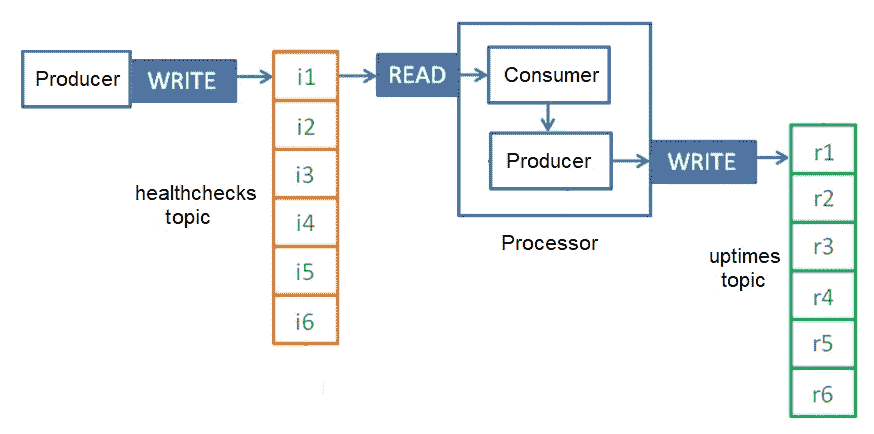

# 第四章：序列化

在现代（互联网）计算中，我们常常忘记实体必须从一台计算机传输到另一台计算机。为了能够传输实体，它们必须首先进行序列化。

序列化是将对象转换成字节流的过程，通常用于从一台计算机传输到另一台计算机。

如其名所示，反序列化是序列化的相反，即把字节流转换成对象（为了教学目的，我们可以说对象是被膨胀或再水化的），通常是从接收消息的一侧进行。Kafka 为原始数据类型（字节、整数、长整型、双精度浮点型、字符串等）提供了 **Serializer**/**Deserializer**（**SerDe**）。

在本章中，介绍了一家新公司：Kioto（代表 Kafka 物联网）。本章涵盖了以下主题：

+   如何构建 Java `PlainProducer`、消费者和处理器

+   如何运行 Java `PlainProducer` 和处理器

+   如何构建自定义序列化和反序列化器

+   如何构建 Java `CustomProducer`、消费者和处理器

+   如何运行 Java `CustomProducer` 和处理器

# Kioto，一家 Kafka 物联网公司

Kioto 是一家致力于能源生产和分配的虚构公司。为了运营，Kioto 有几个 **物联网**（**IoT**）设备。

Kioto 还想使用 Apache Kafka 构建一个企业服务总线。其目标是管理每分钟所有机器的物联网传感器接收到的所有消息。Kioto 在几个地点有数百台机器，每分钟向企业服务总线发送数千条不同的消息。

如前所述，Kioto 的机器上有大量的物联网设备，这些设备会持续向控制中心发送状态消息。这些机器产生电力，因此对于 Kioto 来说，确切知道机器的运行时间和它们的状态（运行、关闭、已关闭、启动等）非常重要。

京都也需要知道天气预报，因为一些机器在超过特定温度时不能运行。一些机器会根据环境温度表现出不同的行为。在冷环境中启动机器与在温暖环境中启动机器是不同的，因此在计算正常运行时间时，启动时间很重要。为了保证持续供电，信息必须精确。面对电力故障时，从温暖温度而不是从寒冷温度启动机器总是更好的。

*列表 4.1* 展示了以 JSON 格式的健康检查事件。

以下为 *列表 4.1* 的内容，`healthcheck.json`：

```java
{
   "event":"HEALTH_CHECK",
   "factory":"Duckburg",
   "serialNumber":"R2D2-C3P0",
   "type":"GEOTHERMAL",
   "status":"RUNNING",
   "lastStartedAt":"2017-09-04T17:27:28.747+0000",
   "temperature":31.5,
   "ipAddress":"192.166.197.213"}
}
```

列表 4.1: healthcheck.json

该消息在 JSON 中的提议表示具有以下属性：

+   `event`：消息类型的字符串（在这种情况下，`HEALTH_CHECK`）

+   `factory`：工厂实际所在城市的名称

+   `serialNumber`：机器的序列号

+   `type`: 表示机器的类型，可能是`GEOTHERMAL`、`HYDROELECTRIC`、`NUCLEAR`、`WIND`或`SOLAR`

+   `status`: 生命周期中的点：`RUNNING`, `SHUTTING-DOWN`, `SHUT-DOWN`, `STARTING`

+   `lastStartedAt`: 最后启动时间

+   `temperature`: 表示机器的温度，单位为摄氏度

+   `ipAddress`: 机器的 IP 地址

如我们所见，JSON 是一种人类可读的消息格式。

# 项目设置

第一步是创建 Kioto 项目。创建一个名为`kioto`的目录。进入该目录并执行以下命令：

```java
$ gradle init --type java-library
```

输出类似于以下内容：

```java
Starting a Gradle Daemon (subsequent builds will be faster)
BUILD SUCCESSFUL in 3s
2 actionable tasks: 2 execute BUILD SUCCESSFUL
```

Gradle 在目录中创建了一个默认项目，包括两个名为`Library.java`和`LibraryTest.java`的 Java 文件；删除这两个文件。

您的目录应类似于以下内容：

+   `- build.gradle`

+   `- gradle`

+   `-- wrapper`

+   `--- gradle-wrapper.jar`

+   `--- gradle-vreapper.properties`

+   `- gradlew`

+   `- gradle.bat`

+   `- settings.gradle`

+   `- src`

+   `-- main`

+   `--- java`

+   `----- Library.java`

+   `-- test`

+   `--- java`

+   `----- LibraryTest.java`

修改`build.gradle`文件，并用*Listing 4.2*替换它。

以下为*Listing 4.2*的内容，Kioto Gradle 构建文件：

```java
apply plugin: 'java'
apply plugin: 'application'
sourceCompatibility = '1.8'
mainClassName = 'kioto.ProcessingEngine'
repositories {
    mavenCentral()
    maven { url 'https://packages.confluent.io/maven/' }
}
version = '0.1.0'
dependencies {
    compile 'com.github.javafaker:javafaker:0.15'
    compile 'com.fasterxml.jackson.core:jackson-core:2.9.7'
    compile 'io.confluent:kafka-avro-serializer:5.0.0'
    compile 'org.apache.kafka:kafka_2.12:2.0.0'
}
jar {
    manifest {
        attributes 'Main-Class': mainClassName
    } from {
        configurations.compile.collect {
            it.isDirectory() ? it : zipTree(it)
        }
    }
    exclude "META-INF/*.SF"
    exclude "META-INF/*.DSA"
    exclude "META-INF/*.RSA"
}
```

添加到应用程序的一些库依赖如下：

+   `kafka_2.12`，Apache Kafka 所需的依赖项

+   `javafaker`，JavaFaker 所需的依赖项

+   `jackson-core`，用于 JSON 解析和处理

+   `kafka-avro-serializer`，用于使用 Apache Avro 在 Kafka 中进行序列化

注意，为了使用`kafka-avro-serializer`函数，我们在仓库部分添加了 Confluent 仓库。

要编译项目并下载所需的依赖项，请输入以下命令：

```java
$ gradle compileJava
```

输出应类似于以下内容：

```java
BUILD SUCCESSFUL in 3s
1 actionable task: 1 executed
```

项目也可以使用 Maven、SBT 或甚至从 IDE 创建。但为了简单起见，它使用 Gradle 创建。有关这些项目的更多信息，请访问以下链接：

+   Gradle 的主页：[`www.gradle.org`](http://www.gradle.org)

+   Maven 的主页：[`maven.apache.org`](http://maven.apache.org)

+   SBT 的主页：[`www.scala-sbt.org/`](http://www.scala-sbt.org/)

+   Jackson 的主页：[`github.com/FasterXML`](https://github.com/FasterXML)

+   JavaFaker 的主页：[`github.com/DiUS/java-faker`](https://github.com/DiUS/java-faker)

# 常量

第一步是编写我们的`Constants`类。这个类是一个静态类，包含我们项目中需要的所有`Constants`。

使用您喜欢的 IDE 打开项目，并在`src/main/java/kioto`目录下创建一个名为`Constants.java`的文件，其内容为*Listing 4.3*。

以下为*Listing 4.3*的内容，`Constants.java`：

```java
package kioto;
import com.fasterxml.jackson.databind.ObjectMapper;
import com.fasterxml.jackson.databind.SerializationFeature;
import com.fasterxml.jackson.databind.util.StdDateFormat;
public final class Constants {
  private static final ObjectMapper jsonMapper;
  static {
    ObjectMapper mapper = new ObjectMapper();
    mapper.disable(SerializationFeature.WRITE_DATES_AS_TIMESTAMPS);
    mapper.setDateFormat(new StdDateFormat());
    jsonMapper = mapper;
  }
  public static String getHealthChecksTopic() {
    return "healthchecks";
  }
  public static String getHealthChecksAvroTopic() {
    return "healthchecks-avro";
  }
  public static String getUptimesTopic() {
    return "uptimes";
  }
  public enum machineType {GEOTHERMAL, HYDROELECTRIC, NUCLEAR, WIND, SOLAR}
  public enum machineStatus {STARTING, RUNNING, SHUTTING_DOWN, SHUT_DOWN}
  public static ObjectMapper getJsonMapper() {
    return jsonMapper;
  }
}
```

在我们的`Constants`类中，有一些我们稍后会用到的方法。如下所示：

+   `getHealthChecksTopic`: 返回健康检查输入主题的名称

+   `getHealthChecksAvroTopic`: 返回包含健康检查的 Avro 主题的名称

+   `getUptimesTopic`：它返回 `uptimes` 主题的名称

+   `machineType`：这是一个 `enum`，包含 Kioto 产生能源机器的类型

+   `machineType`：这是一个 `enum`，包含 Kioto 机器可能的类型

+   `getJsonMapper`：它返回用于 JSON 序列化的对象映射器，并且我们设置了日期的序列化格式

这是一个 `Constants` 类；在 Kotlin 等语言中，常量不需要独立的类，但我们使用 Java。一些面向对象编程的纯粹主义者认为编写常量类是面向对象的反模式。然而，为了简单起见，我们需要在我们的系统中有一些常量。

# 健康检查消息

第二步是编写 `HealthCheck` 类。这个类是一个 **普通的 Java 对象**（**POJO**）。`model` 类是值对象的模板。

使用您最喜欢的 IDE 打开项目，在 `src/main/java/kioto` 目录下，创建一个名为 `HealthCheck.java` 的文件，其内容为 *列表 4.4*。

下面的内容是 *列表 4.4*，`HealthCheck.java` 的内容：

```java
package kioto;
import java.util.Date;
public final class HealthCheck {
  private String event;
  private String factory;
  private String serialNumber;
  private String type;
  private String status;
  private Date lastStartedAt;
  private float temperature;
  private String ipAddress;
}
```

列表 4.4：HealthCheck.java

使用您的 IDE，生成以下内容：

+   一个无参数构造函数

+   一个带有所有属性作为参数的构造函数

+   每个属性的获取器和设置器

这是一个数据类，Java 中的 POJO。在 Kotlin 等语言中，模型类需要的样板代码要少得多，但现在我们是在 Java 中。一些面向对象编程的纯粹主义者认为值对象是面向对象的反模式。然而，用于生成消息的序列化库需要这些类。

要使用 JavaFaker 生成假数据，我们的代码应如 *列表 4.5* 所示。

下面的内容是 *列表 4.5*，一个使用 JavaFaker 的健康检查模拟生成器：

```java
HealthCheck fakeHealthCheck =
   new HealthCheck(
        "HEALTH_CHECK",
        faker.address().city(),                    //1
        faker.bothify("??##-??##", true),    //2
              Constants.machineType.values()
                   [faker.number().numberBetween(0,4)].toString(), //3
        Constants.machineStatus.values()
                   [faker.number().numberBetween(0,3)].toString(), //4
        faker.date().past(100, TimeUnit.DAYS),           //5
        faker.number().numberBetween(100L, 0L),          //6
        faker.internet().ipV4Address());                 //7
```

下面的内容是对如何生成假健康检查数据的分析：

+   在第 `//1` 行，`address().city()` 生成一个虚构的城市名称

+   在第 `//2` 行，在表达式 `?` 用于字母，`#` 用于数字，如果字母是大写则为 `true`

+   在第 `//3` 行，我们使用 `Constants` 中的机器类型 `enum`，以及一个介于 `0` 和 `4` 之间的假数字

+   在第 `//4` 行，我们使用 `Constants` 中的机器状态 `enum`，以及一个介于 `0` 和 `3` 之间的假数字，包括 `3`

+   在第 `//5` 行，我们表示我们想要一个从今天起过去 `100` 天的假日期

+   在第 `//6` 行，我们构建一个假 IP 地址

这里，我们依赖于构造函数的属性顺序。其他语言，如 Kotlin，允许指定每个分配的属性名称。

现在，要将我们的 Java POJO 转换为 JSON 字符串，我们使用 `Constants` 类中的方法——类似于以下内容：

```java
String fakeHealthCheckJson fakeHealthCheckJson = Constants.getJsonMapper().writeValueAsString(fakeHealthCheck);
```

不要忘记这个方法会抛出一个 JSON 处理异常。

# Java 纯生产者

如我们所知，要构建一个 Kafka 消息生产者，我们使用 Java 客户端库，特别是生产者 API（在接下来的章节中，我们将看到如何使用 Kafka Streams 和 KSQL）。

我们首先需要的是一个数据源；为了简单起见，我们需要生成我们的模拟数据。每条消息都将是一条健康消息，包含所有其属性。第一步是构建一个生产者，以 JSON 格式将这些消息发送到主题，如下例所示：

```java
{"event":"HEALTH_CHECK","factory":"Port Roelborough","serialNumber":"QT89-TZ50","type":"GEOTHERMAL","status":"SHUTTING_DOWN","lastStartedAt":"2018-09-13T00:36:39.079+0000","temperature":28.0,"ipAddress":"235.180.238.3"}

{"event":"HEALTH_CHECK","factory":"Duckburg","serialNumber":"NB49-XL51","type":"NUCLEAR","status":"RUNNING","lastStartedAt":"2018-08-18T05:42:29.648+0000","temperature":49.0,"ipAddress":"42.181.105.188"}
...
```

让我们先创建一个 Kafka 生产者，我们将使用它来发送输入消息。

如我们所知，所有 Kafka 生产者都应该有两个必备条件：它们必须是`KafkaProducer`，并且设置了特定的属性，如*列表 4.6*所示。

以下为*列表 4.6*的内容，`PlainProducer`的构造方法：

```java
import org.apache.kafka.clients.producer.KafkaProducer;
import org.apache.kafka.clients.producer.Producer;
import org.apache.kafka.common.serialization.StringSerializer;
public final class PlainProducer {
  private final Producer<String, String> producer;
  public PlainProducer(String brokers) {
    Properties props = new Properties();
    props.put("bootstrap.servers", brokers);                //1
    props.put("key.serializer", StringSerializer.class);    //2
    props.put("value.serializer", StringSerializer.class);  //3
    producer = new KafkaProducer<>(props);                  //4
  }
  ...
}
```

对`PlainProducer`构造函数的分析包括以下内容：

+   在第`//1`行，我们的生产者将运行的代理列表

+   在第`//2`行，消息键的序列化类型（我们稍后会看到序列化器）

+   在第`//3`行，消息值的序列化类型（在这种情况下，值是字符串）

+   在第`//4`行，使用这些属性构建一个具有字符串键和字符串值的`KafkaProducer`，例如`<String, String>`

+   注意，属性的行为类似于 HashMap；在像 Kotlin 这样的语言中，可以使用`=`运算符而不是调用方法来执行属性赋值

我们使用字符串序列化器来序列化键和值：在这个第一个方法中，我们将手动使用 Jackson 将值序列化为 JSON。我们稍后会看到如何编写自定义序列化器。

现在，在`src/main/java/kioto/plain`目录下，创建一个名为`PlainProducer.java`的文件，内容为*列表 4.7*。

以下为*列表 4.7*的内容，`PlainProducer.java`：

```java
package kioto.plain;
import ...
public final class PlainProducer {
  /* here the Constructor code in Listing 4.6 */
  public void produce(int ratePerSecond) {
    long waitTimeBetweenIterationsMs = 1000L / (long)ratePerSecond; //1
    Faker faker = new Faker();
    while(true) { //2
      HealthCheck fakeHealthCheck /* here the code in Listing 4.5 */;
      String fakeHealthCheckJson = null;
      try {
        fakeHealthCheckJson = Constants.getJsonMapper().writeValueAsString(fakeHealthCheck); //3
      } catch (JsonProcessingException e) {
         // deal with the exception
      }
      Future futureResult = producer.send(new ProducerRecord<>
         (Constants.getHealthChecksTopic(), fakeHealthCheckJson)); //4
      try {
        Thread.sleep(waitTimeBetweenIterationsMs); //5
        futureResult.get(); //6
      } catch (InterruptedException | ExecutionException e) {
         // deal with the exception
      }
    }
  }
  public static void main(String[] args) {
    new PlainProducer("localhost:9092").produce(2); //7
  }
}
```

对`PlainProducer`类的分析包括以下内容：

+   在第`//1`行，`ratePerSecond`是在一秒内要发送的消息数量

+   在第`//2`行，为了模拟重复，我们使用无限循环（在生产环境中尽量避免这样做）

+   在第`//3`行，将 Java POJO 序列化为 JSON 的代码

+   在第`//4`行，我们使用 Java Future 将消息发送到`HealthChecksTopic`

+   在第`//5`行，这次我们等待再次发送消息

+   在第`//6`行，我们读取之前创建的 future 的结果

+   在第`//7`行，所有操作都在本地的`9092`端口上的代理上运行，每隔一秒发送两条消息

重要的是要注意，在这里我们发送没有键的记录；我们只指定了值（一个 JSON 字符串），因此键是`null`。我们还对结果调用了`get()`方法，以便等待写入确认：没有这个，消息可能会发送到 Kafka，但如果没有我们的程序注意到失败，消息可能会丢失。

# 运行 PlainProducer

要构建项目，从`kioto`目录运行以下命令：

```java
$ gradle jar
```

如果一切正常，输出如下：

```java
BUILD SUCCESSFUL in 3s
1 actionable task: 1 executed
```

1.  从命令行终端，移动到`confluent`目录，并按以下方式启动：

```java
$ ./bin/confluent start
```

1.  代理正在`9092`端口上运行。要创建`healthchecks`主题，执行以下命令：

```java
$ ./bin/kafka-topics --zookeeper localhost:2181 --create --topic             
healthchecks --replication-factor 1 --partitions 4
```

1.  通过键入以下内容运行`healthchecks`主题的控制台消费者：

```java
$ ./bin/kafka-console-consumer --bootstrap-server localhost:9092       
--topic healthchecks
```

1.  从我们的 IDE 中运行`PlainProducer`的`main`方法

1.  控制台消费者的输出应类似于以下内容：

```java
{"event":"HEALTH_CHECK","factory":"Lake Anyaport","serialNumber":"EW05-HV36","type":"WIND","status":"STARTING","lastStartedAt":"2018-09-17T11:05:26.094+0000","temperature":62.0,"ipAddress":"15.185.195.90"}

{"event":"HEALTH_CHECK","factory":"Candelariohaven","serialNumber":"BO58-SB28","type":"SOLAR","status":"STARTING","lastStartedAt":"2018-08-16T04:00:00.179+0000","temperature":75.0,"ipAddress":"151.157.164.162"}

{"event":"HEALTH_CHECK","factory":"Ramonaview","serialNumber":"DV03-ZT93","type":"SOLAR","status":"RUNNING","lastStartedAt":"2018-07-12T10:16:39.091+0000","temperature":70.0,"ipAddress":"173.141.90.85"}
...
```

记住，在产生数据时，我们可以实现几种写入保证。

例如，在出现网络故障或代理故障的情况下，我们的系统是否准备好丢失数据？

在三个因素之间存在着权衡：产生消息的可用性、生产中的延迟以及安全写入的保证。

在这个例子中，我们只有一个代理，我们使用默认的`acks`值为 1。当我们将来调用`get()`方法时，我们正在等待代理的确认，也就是说，我们在发送另一条消息之前确保消息已持久化。在这个配置中，我们不丢失消息，但我们的延迟比在 fire and forget 模式中更高。

# Java 普通消费者

正如我们已知的，要构建一个 Kafka 消息消费者，我们使用 Java 客户端库——特别是消费者 API（在接下来的章节中，我们将看到如何使用 Kafka Streams 和 KSQL）。

让我们创建一个 Kafka 消费者，我们将使用它来接收输入消息。

正如我们已知的，所有 Kafka 消费者都应该有两个必备条件：成为一个`KafkaConsumer`并设置特定的属性，例如*列表 4.8*中所示。

以下为*列表 4.8*的内容，普通消费者的构造函数：

```java
import org.apache.kafka.clients.consumer.KafkaConsumer;
import org.apache.kafka.clients.consumer.Consumer;
import org.apache.kafka.common.serialization.StringSerializer;
public final class PlainConsumer {
  private Consumer<String, String> consumer;
  public PlainConsumer(String brokers) {
    Properties props = new Properties();
    props.put("group.id", "healthcheck-processor");         //1
    props.put("bootstrap.servers", brokers);                   //2
    props.put("key.deserializer", StringDeserializer.class);   //3
    props.put("value.deserializer", StringDeserializer.class); //4
    consumer = new KafkaConsumer<>(props);                        //5
  }
  ...
}
```

对普通消费者构造函数的分析包括以下内容：

+   在行`//1`中，消费者的组 ID，在这种情况下，`healthcheck-processor`

+   在行`//2`中，消费者将运行的`brokers`列表

+   在行`//3`中，消息键的解序列化类型（我们将在后面看到解序列化器）

+   在行`//4`中，消息值的解序列化类型，在这种情况下，值是字符串

+   在行`//5`中，使用这些属性，我们构建了一个具有字符串键和字符串值的`KafkaConsumer`，例如`<String, String>`

对于客户来说，我们需要提供一个组 ID 来指定消费者将加入的消费者组。

在多个消费者并行启动的情况下，无论是通过不同的线程还是通过不同的进程，每个消费者都将被分配到主题分区的一个子集。在我们的例子中，我们创建了具有四个分区的主题，这意味着为了并行消费数据，我们可以创建多达四个消费者。

对于消费者，我们提供解序列化器而不是序列化器。尽管我们不使用键解序列化器（因为如果你记得，它是`null`），但键解序列化器是消费者指定的强制参数。另一方面，我们需要值的解序列化器，因为我们正在以 JSON 字符串的形式读取我们的数据，而在这里我们使用 Jackson 手动解序列化对象。

# Java 普通处理器

现在，在`src/main/java/kioto/plain`目录下，创建一个名为`PlainProcessor.java`的文件，内容为*列表 4.9*。

下面的内容是*列表 4.9*，`PlainProcessor.java`（第一部分）：

```java
package kioto.plain;
import ...
public final class PlainProcessor {
  private Consumer<String, String> consumer;
  private Producer<String, String> producer;
  public PlainProcessor(String brokers) {
    Properties consumerProps = new Properties();
    consumerProps.put("bootstrap.servers", brokers);
    consumerProps.put("group.id", "healthcheck-processor");
    consumerProps.put("key.deserializer", StringDeserializer.class);
    consumerProps.put("value.deserializer", StringDeserializer.class);
    consumer = new KafkaConsumer<>(consumerProps);
    Properties producerProps = new Properties();
    producerProps.put("bootstrap.servers", brokers);
    producerProps.put("key.serializer", StringSerializer.class);
    producerProps.put("value.serializer", StringSerializer.class);
    producer = new KafkaProducer<>(producerProps);
  }
```

对`PlainProcessor`类第一部分的解析包括以下内容：

+   在第一部分，我们声明了一个消费者，如*列表 4.8*所示

+   在第二部分，我们声明了一个生产者，如*列表 4.6*所示

在继续编写代码之前，让我们记住 Kioto 流处理引擎的项目需求。

将所有这些放在一起，规范是要创建一个流引擎，执行以下操作：

+   向名为**healthchecks**的 Kafka 主题生成消息

+   从名为**healthchecks**的 Kafka 主题读取消息

+   根据启动时间计算正常运行时间

+   将消息写入名为**uptimes**的 Kafka 主题

整个过程在*图 4.1*中有详细说明，即 Kioto 流处理应用程序：



图 4.1：消息被生成到 HealthChecksTopic，然后读取，最后将计算出的正常运行时间写入 uptimes 主题。

现在我们处于`src/main/java/kioto/plain`目录中，让我们用*列表 4.10*的内容完成`PlainProcessor.java`文件。

下面的内容是*列表 4.10*，`PlainProcessor.java`（第二部分）：

```java
 public final void process() {
    consumer.subscribe(Collections.singletonList(
               Constants.getHealthChecksTopic()));           //1
    while(true) {
      ConsumerRecords records = consumer.poll(Duration.ofSeconds(1L)); //2
      for(Object record : records) {                //3
        ConsumerRecord it = (ConsumerRecord) record;
        String healthCheckJson = (String) it.value();
        HealthCheck healthCheck = null;
        try {
          healthCheck = Constants.getJsonMapper()
           .readValue(healthCheckJson, HealthCheck.class);     // 4
        } catch (IOException e) {
            // deal with the exception
        }
        LocalDate startDateLocal =healthCheck.getLastStartedAt().toInstant()                   .atZone(ZoneId.systemDefault()).toLocalDate();        //5
        int uptime =
             Period.between(startDateLocal, LocalDate.now()).getDays();  //6
        Future future =
             producer.send(new ProducerRecord<>(
                              Constants.getUptimesTopic(),
                              healthCheck.getSerialNumber(),
                              String.valueOf(uptime)));                  //7
        try {
          future.get();
        } catch (InterruptedException | ExecutionException e) {
          // deal with the exception
        }
      }
    }
  }
  public static void main( String[] args) {
    (new PlainProcessor("localhost:9092")).process();
  }
}
```

列表 4.10：PlainProcessor.java（第二部分）

对`PlainProcessor`的分析包括以下内容：

+   在第`//1`行，创建了消费者并订阅了源主题。这是将分区动态分配给我们的客户并加入客户组的操作。

+   在第`//2`行，一个无限循环用于消费记录，将池持续时间作为参数传递给方法池。客户在返回前最多等待一秒钟。

+   在第`//3`行，我们遍历记录。

+   在第`//4`行，将 JSON 字符串反序列化以提取健康检查对象。

+   在第`//5`行，开始时间被转换并格式化为当前时区。

+   在第`//6`行，计算正常运行时间。

+   在第`//7`行，使用序列号作为键和正常运行时间作为值，将正常运行时间写入`uptimes`主题。两个值都作为普通字符串写入。

代理将记录返回给客户端的时刻也取决于`fetch.min.bytes`值；其默认值为 1，是等待代理对客户端可用之前的最小数据量。我们的代理在 1 字节数据可用时立即返回，同时最多等待一秒钟。

另一个配置属性是`fetch.max.bytes`，它定义了一次返回的数据量。根据我们的配置，代理将返回所有可用的记录（不超过 50 MB 的最大值）。

如果没有可用的记录，代理返回一个空列表。

注意，我们可以重用生成模拟数据的代理，但使用另一个代理来写入`uptimes`更清晰。

# 运行 PlainProcessor

要构建项目，从`kioto`目录运行以下命令：

```java
$ gradle jar
```

如果一切正确，输出将类似于以下内容：

```java
BUILD SUCCESSFUL in 3s
1 actionable task: 1 executed
```

1.  我们的代理正在端口`9092`上运行，因此要创建`uptimes`主题，执行以下命令：

```java
$ ./bin/kafka-topics --zookeeper localhost:2181 --create --topic 
uptimes --replication-factor 1 --partitions 4
```

1.  运行`uptimes`主题的控制台消费者，如下所示：

```java
$ ./bin/kafka-console-consumer --bootstrap-server localhost:9092 
--topic uptimes --property print.key=true
```

1.  从我们的 IDE 中运行`PlainProcessor`的 main 方法

1.  从我们的 IDE 中运行`PlainProducer`的 main 方法

1.  控制台消费者对于`uptimes`主题的输出应类似于以下内容：

```java
EW05-HV36   33
BO58-SB28   20
DV03-ZT93   46
...
```

我们已经说过，在产生数据时，有两个因素需要考虑；一个是交付保证，另一个是分区。

在消费数据时，我们必须考虑以下四个因素：

+   并行运行的消费者数量（并行线程和/或并行进程）

+   一次要消费的数据量（从内存的角度考虑）

+   等待接收消息的时间（吞吐量和延迟）

+   何时标记消息为已处理（提交偏移量）

如果`enable.auto.commit`设置为`true`（默认为`true`），消费者将在下一次调用 poll 方法时自动提交偏移量。

注意，整个批次记录都会被提交；如果处理了一些消息但未处理整个批次后应用程序崩溃，则事件不会被提交，它们将被其他消费者重新处理；这种处理数据的方式称为至少一次处理。

# 自定义序列化器

到目前为止，我们已经看到了如何使用纯 Java 和 Jackson 产生和消费 JSON 消息。在这里，我们将看到如何创建我们自己的序列化器和反序列化器。

我们已经看到了如何在生产者中使用`StringSerializer`，在消费者中使用`StringDeserializer`。现在，我们将看到如何构建我们自己的 SerDe，以将序列化/反序列化过程从应用程序的核心代码中抽象出来。

要构建自定义序列化器，我们需要创建一个实现`org.apache.kafka.common.serialization.Serializer`接口的类。这是一个泛型类型，因此我们可以指定要转换为字节数组的自定义类型（序列化）。

在`src/main/java/kioto/serde`目录下，创建一个名为`HealthCheckSerializer.java`的文件，其内容为*列表 4.11*。

以下为*列表 4.11*，`HealthCheckSerializer.java`的内容：

```java
package kioto.serde;
import com.fasterxml.jackson.core.JsonProcessingException;
import kioto.Constants;
import java.util.Map;
import org.apache.kafka.common.serialization.Serializer;
public final class HealthCheckSerializer implements Serializer {
  @Override
  public byte[] serialize(String topic, Object data) {
    if (data == null) {
      return null;
    }
    try {
      return Constants.getJsonMapper().writeValueAsBytes(data);
    } catch (JsonProcessingException e) {
      return null;
    }
  }

  @Override
  public void close() {}
  @Override
  public void configure(Map configs, boolean isKey) {}
}
```

列表 4.11：HealthCheckSerializer.java

注意，序列化器类位于名为**kafka-clients**的特殊模块中，位于`org.apache.kafka`路径。这里的目的是使用序列化器类而不是 Jackson（手动）。

还要注意，需要实现的重要方法是`serialize`方法。`close`和`configure`方法可以留空体。

我们导入 Jackson 的`JsonProcessingException`只是因为`writeValueAsBytes`方法会抛出这个异常，但我们不使用 Jackson 进行序列化。

# Java 自定义生产者

现在，为了将序列化器纳入我们的生产者，所有 Kafka 生产者都必须满足两个要求：成为一个`KafkaProducer`，并设置特定的属性，如*列表 4.12*。

以下为*列表 4.12*，`CustomProducer`的构造方法内容：

```java
import kioto.serde.HealthCheckSerializer;
import org.apache.kafka.clients.producer.KafkaProducer;
import org.apache.kafka.clients.producer.Producer;
import org.apache.kafka.common.serialization.StringSerializer;
public final class CustomProducer {
  private final Producer<String, HealthCheck> producer;
  public CustomProducer(String brokers) {
    Properties props = new Properties();
    props.put("bootstrap.servers", brokers);                    //1
    props.put("key.serializer", StringSerializer.class);        //2
    props.put("value.serializer", HealthCheckSerializer.class); //3
    producer = new KafkaProducer<>(props);                      //4
  }
```

对`CustomProducer`构造函数的分析包括以下内容：

+   在行`//1`中，这是我们的生产者将运行在的代理列表。

+   在行`//2`中，消息键的序列化器类型保持为字符串。在行`//3`中，这是消息值的序列化器类型，在这种情况下，值是`HealthCheck`。

+   在行`//4`中，我们使用这些属性构建了一个带有字符串键和`HealthCheck`值的`KafkaProducer`，例如，`<String, HealthCheck>`。

现在，在`src/main/java/kioto/custom`目录中，创建一个名为`CustomProducer.java`的文件，内容为*列表 4.13*。

以下为*列表 4.13*，`CustomProducer.java`的内容：

```java
package kioto.plain;
import ...
public final class CustomProducer {
  /* here the Constructor code in Listing 4.12 */
  public void produce(int ratePerSecond) {
    long waitTimeBetweenIterationsMs = 1000L / (long)ratePerSecond; //1
    Faker faker = new Faker();
    while(true) { //2
      HealthCheck fakeHealthCheck /* here the code in Listing 4.5 */;
      Future futureResult = producer.send( new ProducerRecord<>(
         Constants.getHealthChecksTopic(), fakeHealthCheck));       //3
      try {
        Thread.sleep(waitTimeBetweenIterationsMs); //4
        futureResult.get();      //5          
      } catch (InterruptedException | ExecutionException e) {
        // deal with the exception
      }
    }
  }
public static void main(String[] args) {
    new CustomProducer("localhost:9092").produce(2); //6
  }
}
```

列表 4.13: CustomProducer.java

对`CustomProducer`类的分析包括以下内容：

+   在行`//1`中，`ratePerSecond`是一秒内要发送的消息数量

+   在行`//2`中，为了模拟重复，我们使用了一个无限循环（在生产环境中尽量避免这样做）

+   在行`//3`中，我们使用 Java future 将消息发送到`HealthChecksTopic`

+   在行`//4`中，这次我们等待再次发送消息

+   在行`//5`中，我们读取之前创建的 future 的结果

+   在行`//6`中，所有操作都在本地的`9092`端口上的代理上运行，以一秒的间隔发送两条消息

# 运行 CustomProducer

要构建项目，请在`kioto`目录中运行以下命令：

```java
$ gradle jar
```

如果一切正常，输出将类似于以下内容：

```java
BUILD SUCCESSFUL in 3s
1 actionable task: 1 executed
```

1.  按如下方式运行`HealthChecksTopic`的控制台消费者：

```java
$ ./bin/kafka-console-consumer --bootstrap-server localhost:9092 
--topic healthchecks
```

1.  从我们的 IDE 中，运行`CustomProducer`的`main`方法

1.  控制台消费者的输出应类似于以下内容：

```java
{"event":"HEALTH_CHECK","factory":"Lake Anyaport","serialNumber":"EW05-HV36","type":"WIND","status":"STARTING","lastStartedAt":"2018-09-17T11:05:26.094+0000","temperature":62.0,"ipAddress":"15.185.195.90"}

{"event":"HEALTH_CHECK","factory":"Candelariohaven","serialNumber":"BO58-SB28","type":"SOLAR","status":"STARTING","lastStartedAt":"2018-08-16T04:00:00.179+0000","temperature":75.0,"ipAddress":"151.157.164.162"}

{"event":"HEALTH_CHECK","factory":"Ramonaview","serialNumber":"DV03-ZT93","type":"SOLAR","status":"RUNNING","lastStartedAt":"2018-07-12T10:16:39.091+0000","temperature":70.0,"ipAddress":"173.141.90.85"}

...
```

# 自定义反序列化器

以类似的方式，要构建自定义反序列化器，我们需要创建一个实现`org.apache.kafka.common.serialization.Deserializer`接口的类。我们必须指明如何将字节数组转换为自定义类型（反序列化）。

在`src/main/java/kioto/serde`目录中，创建一个名为`HealthCheckDeserializer.java`的文件，内容为*列表 4.14*。

以下为*列表 4.14*，`HealthCheckDeserializer.java`的内容：

```java
package kioto.serde;
import kioto.Constants;
import kioto.HealthCheck;
import java.io.IOException;
import java.util.Map;
import org.apache.kafka.common.serialization.Deserializer;
public final class HealthCheckDeserializer implements Deserializer {
  @Override
  public HealthCheck deserialize(String topic, byte[] data) {
    if (data == null) {
      return null;
    }
    try {
      return Constants.getJsonMapper().readValue(data, HealthCheck.class);
    } catch (IOException e) {
      return null;
    }
  }
  @Override
  public void close() {}
  @Override
  public void configure(Map configs, boolean isKey) {}
}
```

列表 4.14: HealthCheckDeserializer.java

注意，反序列化器类位于名为 kafka-clients 的模块中，位于`org.apache.kafka`路径下。这里的目的是使用反序列化器类而不是 Jackson（手动）。

还要注意，需要实现的重要方法是`deserialize`方法。`close`和`configure`方法可以留空。

我们导入`HealthCheck`类，因为`readValue`方法需要一个 POJO（具有公共构造函数和公共 getter 和 setter 的类）。注意，所有 POJO 属性都应该是可序列化的。

# Java 自定义消费者

让我们创建一个 Kafka 消费者，我们将使用它来接收自定义输入消息。

现在，为了在我们的消费者中包含反序列化器，所有 Kafka 消费者都应该满足两个要求：成为一个`KafkaConsumer`，并设置特定的属性，如*列表 4.15*中所示。

以下为*列表 4.15*的内容，`CustomConsumer`的构造方法：

```java
import kioto.HealthCheck;
import kioto.serde.HealthCheckDeserializer;
import org.apache.kafka.clients.consumer.KafkaConsumer;
import org.apache.kafka.clients.consumer.Consumer;
import org.apache.kafka.common.serialization.StringSerializer;
public final class CustomConsumer {
  private Consumer<String, HealthCheck> consumer;
  public CustomConsumer(String brokers) {
    Properties props = new Properties();
    props.put("group.id", "healthcheck-processor");//1
    props.put("bootstrap.servers", brokers);//2
    props.put("key.deserializer", StringDeserializer.class);//3
    props.put("value.deserializer", HealthCheckDeserializer.class); //4
    consumer = new KafkaConsumer<>(props);//5
  }
  ...
}
```

对`CustomConsumer`构造函数的以下分析：

+   在行`//1`中，我们消费者的组 ID，在这种情况下，`healthcheck-processor`

+   在行`//2`中，消费者将运行在其上的代理列表

+   在行`//3`中，消息键的反序列化类型；在这种情况下，键保持为字符串

+   在行`//4`中，消息值的反序列化类型；在这种情况下，值是`HealthChecks`

+   在行`//5`中，使用这些属性，我们构建了一个具有字符串键和`HealthChecks`值的`KafkaConsumer`，例如`<String, HealthCheck>`

对于消费者，我们提供反序列化器而不是序列化器。尽管我们不使用键反序列化器（因为如果你记得，它是`null`），但键反序列化器是消费者指定的强制参数。另一方面，我们需要值反序列化器，因为我们正在以 JSON 字符串的形式读取我们的数据；在这里，我们使用自定义反序列化器反序列化对象。

# Java 自定义处理器

现在，在`src/main/java/kioto/custom`目录下，创建一个名为`CustomProcessor.java`的文件，其内容为*列表 4.16*。

以下为*列表 4.16*的内容，`CustomProcessor.java`（第一部分）：

```java
package kioto.custom;
import ...

public final class CustomProcessor {

  private Consumer<String, HealthCheck> consumer;
  private Producer<String, String> producer;

  public CustomProcessor(String brokers) {
    Properties consumerProps = new Properties();
    consumerProps.put("bootstrap.servers", brokers);
    consumerProps.put("group.id", "healthcheck-processor");
    consumerProps.put("key.deserializer", StringDeserializer.class);
    consumerProps.put("value.deserializer",                        HealthCheckDeserializer.class);
    consumer = new KafkaConsumer<>(consumerProps);
    Properties producerProps = new Properties();
    producerProps.put("bootstrap.servers", brokers);
    producerProps.put("key.serializer", StringSerializer.class);
    producerProps.put("value.serializer", StringSerializer.class);
    producer = new KafkaProducer<>(producerProps);
  }
```

对自定义处理器类第一部分的分析如下：

+   在第一部分，我们声明了一个消费者，如*列表 4.15*所示

+   在第二部分，我们声明了一个生产者，如*列表 4.13*所示

现在，在`src/main/java/kioto/custom`目录下，让我们用*列表 4.17*的内容完成`CustomProcessor.java`文件。

以下为*列表 4.17*的内容，`CustomProcessor.java`（第二部分）：

```java
public final void process() {
    consumer.subscribe(Collections.singletonList(
             Constants.getHealthChecksTopic()));           //1
    while(true) {
      ConsumerRecords records = consumer.poll(Duration.ofSeconds(1L)); //2
      for(Object record : records) {                 //3
        ConsumerRecord it = (ConsumerRecord) record;
        HealthCheck healthCheck = (HealthCheck) it.value(); //4
        LocalDate startDateLocal =healthCheck.getLastStartedAt().toInstant()
                 .atZone(ZoneId.systemDefault()).toLocalDate();         //5
        int uptime =
             Period.between(startDateLocal, LocalDate.now()).getDays();  //6
        Future future =
             producer.send(new ProducerRecord<>(
                              Constants.getUptimesTopic(),
                              healthCheck.getSerialNumber(),
                             String.valueOf(uptime)));                  //7
        try {
          future.get();
        } catch (InterruptedException | ExecutionException e) {
          // deal with the exception
        }
      }
    }
  }
  public static void main( String[] args) {
    new CustomProcessor("localhost:9092").process();
  }
}
```

对`CustomProcessor`处理方法的以下分析：

+   在行`//1`中，这里创建了消费者并订阅了源主题。这是将分区动态分配给我们的客户并加入客户组的操作。

+   在行`//2`中，一个无限循环来消费记录，将池持续时间作为参数传递给方法池。客户在返回之前不会等待超过一秒钟。

+   在行`//3`中，我们遍历记录。

+   在行`//4`中，将 JSON 字符串反序列化以提取`HealthCheck`对象。

+   在行`//5`中，将开始时间转换为当前时区的格式。

+   在行`//6`中，计算了运行时间。

+   在行`//7`中，使用序列号作为键，将运行时间（uptime）写入`uptimes`主题，这两个值都作为普通字符串写入。

# 运行自定义处理器

要构建项目，请从`kioto`目录中运行以下命令：

```java
$ gradle jar
```

如果一切正常，输出将类似于以下内容：

```java
BUILD SUCCESSFUL in 3s
1 actionable task: 1 executed
```

1.  按照以下方式运行`uptimes`主题的控制台消费者：

```java
$ ./bin/kafka-console-consumer --bootstrap-server localhost:9092 
--topic uptimes --property print.key=true
```

1.  从我们的集成开发环境（IDE）中运行`CustomProcessor`的主方法

1.  从我们的 IDE 中运行`CustomProducer`的主方法

1.  控制台消费者对于`uptimes`主题的输出应类似于以下内容：

```java
EW05-HV36   33
BO58-SB28   20
DV03-ZT93   46
...
```

现在，我们已经看到了如何创建我们自己的 SerDe，以将序列化代码从应用程序的主要逻辑中抽象出来。现在你知道了 Kafka SerDe 是如何工作的。

# 摘要

在本章中，我们学习了如何构建 Java PlainProducer、消费者和处理器，并展示了如何构建自定义序列化和反序列化器。

此外，我们还学习了如何构建 Java CustomProducer、消费者和处理器，以及如何运行 Java CustomProducer 和处理器。

在本章中，我们看到了如何使用 JSON、纯文本和二进制格式通过 Kafka 进行序列化和反序列化。Avro 是 Kafka 的常见序列化类型。我们将在第五章 *模式注册表*中看到如何使用 Avro，以及如何使用 Kafka 模式注册表。
