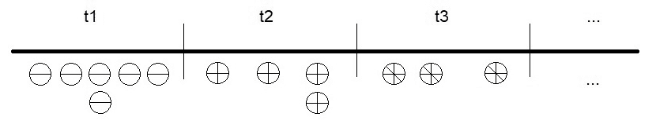
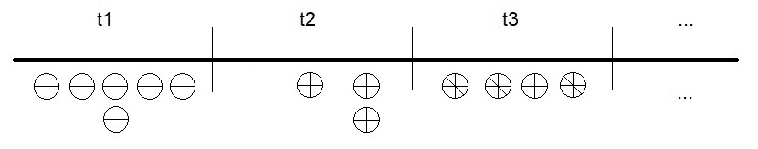

# Kafka Streams

在本章中，我们将不再像前几章那样使用 Kafka Java API 来处理生产者和消费者，而是将使用 Kafka Streams，这是 Kafka 用于流处理的模块。

本章涵盖了以下主题：

+   Kafka Streams 简而言之

+   Kafka Streams 项目设置

+   编码和运行 Java `PlainStreamsProcessor`

+   使用 Kafka Streams 进行扩展

+   编码和运行 Java `CustomStreamsProcessor`

+   编码和运行 Java `AvroStreamsProcessor`

+   编码和运行 Late `EventProducer`

+   编码和运行 Kafka Streams 处理器

# Kafka Streams 简而言之

Kafka Streams 是一个库，也是 Apache Kafka 的一部分，用于处理进入和离开 Kafka 的流。在函数式编程中，集合上有几个操作，如下所示：

+   `filter`

+   `map`

+   `flatMap`

+   `groupBy`

+   `join`

Apache Spark、Apache Flink、Apache Storm 和 Akka Streams 等流平台的成功在于将这些无状态函数纳入数据处理。Kafka Streams 提供了一个 DSL 来将这些函数纳入数据流操作。

Kafka Streams 还具有有状态的转换；这些是与聚合相关的操作，依赖于消息作为组的状态，例如，窗口函数和对迟到数据的支持。Kafka Streams 是一个库，这意味着 Kafka Streams 应用程序可以通过执行您的应用程序 jar 来部署。无需在服务器上部署应用程序，这意味着您可以使用任何应用程序来运行 Kafka Streams 应用程序：Docker、Kubernetes、本地服务器等。Kafka Streams 的美妙之处在于它允许水平扩展。也就是说，如果在同一 JVM 中运行，它将执行多个线程，但如果启动了多个应用程序实例，它可以在多个 JVM 中运行以进行扩展。

Apache Kafka 核心是用 Scala 编写的；然而，Kafka Streams 和 KSQL 是用 Java 8 编写的。Kafka Streams 包含在 Apache Kafka 的开源发行版中。

# 项目设置

第一步是修改 `kioto` 项目。我们必须在 `build.gradle` 中添加依赖项，如 *Listing 6.1* 所示：

```java
apply plugin: 'java'
apply plugin: 'application'

sourceCompatibility = '1.8'

mainClassName = 'kioto.ProcessingEngine'

repositories {
 mavenCentral()
 maven { url 'https://packages.confluent.io/maven/' }
}

version = '0.1.0'

dependencies {
  compile 'com.github.javafaker:javafaker:0.15'
  compile 'com.fasterxml.jackson.core:jackson-core:2.9.7'
  compile 'io.confluent:kafka-avro-serializer:5.0.0'
  compile 'org.apache.kafka:kafka_2.12:2.0.0'
  compile 'org.apache.kafka:kafka-streams:2.0.0'
  compile 'io.confluent:kafka-streams-avro-serde:5.0.0'
}

jar {
  manifest {
    attributes 'Main-Class': mainClassName
  } from {
    configurations.compile.collect {
       it.isDirectory() ? it : zipTree(it)
    }
  }
  exclude "META-INF/*.SF"
  exclude "META-INF/*.DSA"
  exclude "META-INF/*.RSA"
}
```

列表 6.1：Kioto Gradle 构建文件用于 Kafka Streams

对于本章的示例，我们还需要 Jackson 的依赖项。要使用 Kafka Streams，我们只需要一个依赖项，如下面的代码片段所示：

```java
compile 'org.apache.kafka:kafka-streams:2.0.0'
```

要在 Kafka Streams 中使用 Apache Avro，我们需要添加以下代码中给出的序列化和反序列化器：

```java
compile 'io.confluent:kafka-streams-avro-serde:5.0.0'
```

以下行是运行 Kafka Streams 应用程序作为 jar 所必需的。构建生成了一个胖 jar：

```java
configurations.compile.collect {
  it.isDirectory() ? it : zipTree(it)
}
```

项目的目录树结构应该是这样的：

```java
src
main
--java
----kioto
------avro
------custom
------events
------plain
------serde
--resources
test
```

# Java PlainStreamsProcessor

现在，在 `src/main/java/kioto/plain` 目录下，创建一个名为 `PlainStreamsProcessor.java` 的文件，其内容如 *Listing 6.2* 所示：

```java
import ...
public final class PlainStreamsProcessor {
  private final String brokers;
  public PlainStreamsProcessor(String brokers) {
    super();
    this.brokers = brokers;
  }
  public final void process() {
    // below we will see the contents of this method 
  }
  public static void main(String[] args) {
    (new PlainStreamsProcessor("localhost:9092")).process();
  }
}
```

列表 6.2：PlainStreamsProcessor.java

所有的魔法都在 `process()` 方法内部发生。在 Kafka Streams 应用程序中，第一步是获取一个 `StreamsBuilder` 实例，如下面的代码所示：

```java
StreamsBuilder streamsBuilder = new StreamsBuilder();
```

`StreamsBuilder` 是一个允许构建拓扑的对象。在 Kafka Streams 中，拓扑是数据管道的结构描述。拓扑是涉及流之间转换的一系列步骤。拓扑在流中是一个非常重要的概念；它也被用于其他技术，如 Apache Storm。

`StreamsBuilder` 用于从主题中消费数据。在 Kafka Streams 的上下文中，还有两个重要的概念：`KStream`，它是记录流的表示，以及 `KTable`，它是流中变化的日志（我们将在第七章 KSQL 中详细看到 KTables）。要从主题获取 `KStream`，我们使用 `StreamsBuilder` 的 `stream()` 方法，如下所示：

```java
KStream healthCheckJsonStream = 
  streamsBuilder.stream( Constants.getHealthChecksTopic(), 
    Consumed.with(Serdes.String(), Serdes.String()));
```

有一个 `stream()` 方法的实现，它只接收主题名称作为参数。但是，使用可以指定序列化器的实现是一个好的实践，就像在这个例子中，我们必须指定 `Consumed` 类的键和值的序列化器；在这种情况下，两者都是字符串。

不要让序列化器通过应用程序范围的属性来指定，因为同一个 Kafka Streams 应用程序可能需要从具有不同数据格式的多个数据源中读取。

我们已经获取了一个 JSON 流。拓扑中的下一步是获取 `HealthCheck` 对象流，我们通过构建以下流来实现：

```java
KStream healthCheckStream = healthCheckJsonStream.mapValues((v -> {
  try {
    return Constants.getJsonMapper().readValue(
      (String) v, HealthCheck.class);
  } catch (IOException e) {
    // deal with the Exception
  }
 }));
```

首先，请注意我们正在使用 `mapValues()` 方法，所以就像在 Java 8 中，该方法接收一个 lambda 表达式。`mapValues()` 方法还有其他实现，但在这里我们使用只有一个参数的 lambda (`v->`)。

这里的 `mapValues()` 可以这样理解：对于输入流中的每个元素，我们都在将 JSON 对象转换到 `HealthCheck` 对象，这种转换可能会抛出 `IOException`，因此我们捕获了它。

回顾到目前，在第一次转换中，我们从主题读取了一个带有 (`String, String`) 对的流。在第二次转换中，我们从 JSON 中的值转换到 `HealthCheck` 对象中的值。

在第三步，我们将计算 `uptime` 并将其发送到 `uptimeStream`，如下面的代码块所示：

```java
KStream uptimeStream = healthCheckStream.map(((KeyValueMapper)(k, v)-> {
  HealthCheck healthCheck = (HealthCheck) v;
  LocalDate startDateLocal = healthCheck.getLastStartedAt().toInstant()
              .atZone(ZoneId.systemDefault()).toLocalDate();
  int uptime = Period.between(startDateLocal, LocalDate.now()).getDays();
  return new KeyValue<>(
    healthCheck.getSerialNumber(), String.valueOf(uptime));
 }));
```

注意我们正在使用 `map()` 方法，同样地，就像在 Java 8 中，该方法接收一个 lambda 表达式。`map()` 方法还有其他实现；在这里，我们使用有两个参数的 lambda (`(k, v)->`)。

这里的`map()`可以读作如下：对于输入流中的每个元素，我们提取键值对（键，值）。我们只使用值（无论如何，键是`null`），将其转换为`HealthCheck`，提取两个属性（开始时间和`SerialNumber`），计算`uptime`，并返回一个新的键值对（`SerialNumber`，`uptime`）。

最后一步是将这些值写入`uptimes`主题，如下所示：

```java
uptimeStream.to( Constants.getUptimesTopic(), 
  Produced.with(Serdes.String(), Serdes.String()));
```

再次强调，直到我累为止：强烈建议声明我们 Stream 的数据类型。例如，在这种情况下，始终声明键值对是类型（`String, String`）。

这里是步骤的总结：

1.  从输入主题读取类型为（`String, String`）的键值对

1.  将每个 JSON 对象反序列化为`HealthCheck`

1.  计算`uptimes`

1.  将`uptimes`以键值对形式（`String, String`）写入输出主题

最后，是时候启动 Kafka Streams 引擎了。

在启动之前，我们需要指定拓扑和两个属性，即代理和应用程序 ID，如下所示：

```java
Topology topology = streamsBuilder.build();
Properties props = new Properties();
props.put("bootstrap.servers", this.brokers);
props.put("application.id", "kioto");
KafkaStreams streams = new KafkaStreams(topology, props);
streams.start();
```

注意，序列化和反序列化器只是在从和向主题读写时明确定义的。因此，我们与应用程序范围内的单一数据类型无关，我们可以使用不同的数据类型从和向主题读写，这在实践中是持续发生的。

同时，遵循这个良好的实践，在不同主题之间，关于使用哪个 Serde 没有歧义。

# 运行 PlainStreamsProcessor

要构建项目，从`kioto`目录运行以下命令：

```java
$ gradle build
```

如果一切正常，输出将类似于以下内容：

```java
BUILD SUCCESSFUL in 1s
6 actionable task: 6 up-to-date
```

1.  第一步是运行`uptimes`主题的控制台消费者，如下面的代码片段所示：

```java
$ ./bin/kafka-console-consumer --bootstrap-server localhost:9092 
--topic uptimes --property print.key=true
```

1.  从 IDE 中运行`PlainStreamsProcessor`的主方法

1.  从 IDE 中运行`PlainProducer`（在之前的章节中构建）的主方法

1.  `uptimes`主题的控制台消费者的输出应该类似于以下内容：

```java
EW05-HV36 33
BO58-SB28 20
DV03-ZT93 46
...
```

# 使用 Kafka Streams 进行扩展

为了按照承诺扩展架构，我们必须遵循以下步骤：

1.  运行`uptimes`主题的控制台消费者，如下所示：

```java
$ ./bin/kafka-console-consumer --bootstrap-server localhost:9092 
--topic uptimes --property print.key=true
```

1.  从命令行运行应用程序 jar，如下面的代码所示：

```java
$ java -cp ./build/libs/kioto-0.1.0.jar 
kioto.plain.PlainStreamsProcessor
```

这时我们验证我们的应用程序是否真的可以扩展。

1.  从一个新的命令行窗口，我们执行相同的命令，如下所示：

```java
$ java -cp ./build/libs/kioto-0.1.0.jar 
kioto.plain.PlainStreamsProcessor
```

输出应该类似于以下内容：

```java
2017/07/05 15:03:18.045 INFO ... Setting newly assigned 
partitions [healthchecks-2, healthchecks -3]
```

如果我们还记得第一章中关于配置 Kafka 的理论，当我们创建主题时，我们指定它有四个分区。这个来自 Kafka Streams 的好消息告诉我们，应用程序被分配到我们的主题的两个和三个分区。

看看下面的日志：

```java
...
2017/07/05 15:03:18.045 INFO ... Revoking previously assigned partitions [healthchecks -0, healthchecks -1, healthchecks -2, healthchecks -3]
2017/07/05 15:03:18.044 INFO ... State transition from RUNNING to PARTITIONS_REVOKED
2017/07/05 15:03:18.044 INFO ... State transition from RUNNING to REBALANCING
2017/07/05 15:03:18.044 INFO ... Setting newly assigned partitions [healthchecks-2, healthchecks -3]
...
```

我们可以读到第一个实例使用了四个分区，然后当我们运行第二个实例时，它进入了一个状态，其中分区被重新分配给消费者；第一个实例被分配了两个分区：`healthchecks-0`和`healthchecks-1`。

这就是 Kafka Streams 如何平滑扩展的方式。记住，这一切之所以能够工作，是因为消费者是同一个消费者组的成员，并且通过`application.id`属性由 Kafka Streams 进行控制。

我们还必须记住，可以通过设置`num.stream.threads`属性来修改分配给应用程序每个实例的线程数。这样，每个线程都将独立，拥有自己的生产者和消费者。这确保了我们的服务器资源被更有效地使用。

# Java CustomStreamsProcessor

总结到目前为止发生的事情，在之前的章节中，我们看到了如何在 Kafka 中创建生产者、消费者和简单的处理器。我们还看到了如何使用自定义 SerDe、使用 Avro 和 Schema Registry 来完成相同的事情。到目前为止，在本章中，我们看到了如何使用 Kafka Streams 创建一个简单的处理器。

在本节中，我们将利用到目前为止的所有知识，使用 Kafka Streams 构建一个`CustomStreamsProcessor`来使用我们自己的 SerDe。

现在，在`src/main/java/kioto/custom`目录中，创建一个名为`CustomStreamsProcessor.java`的文件，其内容如*列表 6.3*所示，如下所示：

```java
import ...
public final class CustomStreamsProcessor {
  private final String brokers;
  public CustomStreamsProcessor(String brokers) {
    super();
    this.brokers = brokers;
  }
  public final void process() {
    // below we will see the contents of this method
  }
  public static void main(String[] args) {
    (new CustomStreamsProcessor("localhost:9092")).process();
  }
}
```

列表 6.3: CustomStreamsProcessor.java

所有的魔法都在`process()`方法内部发生。

Kafka Streams 应用程序的第一步是获取一个`StreamsBuilder`实例，如下所示：

```java
StreamsBuilder streamsBuilder = new StreamsBuilder();
```

我们可以重用之前章节中构建的`Serdes`。以下代码创建了一个将消息值反序列化为`HealthCheck`对象的`KStream`。

```java
Serde customSerde = Serdes.serdeFrom(
  new HealthCheckSerializer(), new HealthCheckDeserializer());
```

`Serde`类的`serdeFrom()`方法动态地将我们的`HealthCheckSerializer`和`HealthCheckDeserializer`包装成一个单一的`HealthCheck Serde`。

我们可以重用之前章节中构建的`Serdes`。以下代码创建了一个将消息值反序列化为`HealthCheck`对象的`KStream`。

`StreamsBuilder`用于从主题中消费数据。与之前的章节相同，要从主题中获取`KStream`，我们使用`StreamsBuilder`的`stream()`方法，如下所示：

```java
KStream healthCheckStream =
  streamsBuilder.stream( Constants.getHealthChecksTopic(),
    Consumed.with(Serdes.String(), customSerde));
```

我们使用了一个实现，其中我们也可以指定序列化器，就像在这个例子中，我们必须指定`Consumed`类的序列化器，在这种情况下，键是一个字符串（总是`null`），而值的序列化器是我们的新`customSerde`。

这里的魔法在于`process()`方法的其余代码与上一节相同；它也如下所示：

```java
KStream uptimeStream = healthCheckStream.map(((KeyValueMapper)(k, v)-> {
  HealthCheck healthCheck = (HealthCheck) v;
  LocalDate startDateLocal = healthCheck.getLastStartedAt().toInstant()
               .atZone(ZoneId.systemDefault()).toLocalDate();
  int uptime =
      Period.between(startDateLocal, LocalDate.now()).getDays();
  return new KeyValue<>(
      healthCheck.getSerialNumber(), String.valueOf(uptime));
}));
uptimeStream.to( Constants.getUptimesTopic(),
      Produced.with(Serdes.String(), Serdes.String()));
Topology topology = streamsBuilder.build();
Properties props = new Properties();
props.put("bootstrap.servers", this.brokers);
props.put("application.id", "kioto");
KafkaStreams streams = new KafkaStreams(topology, props);
streams.start(); 
```

# 运行 CustomStreamsProcessor

要构建项目，请在`kioto`目录中运行以下命令：

```java
$ gradle build
```

如果一切正确，输出将类似于以下内容：

```java
BUILD SUCCESSFUL in 1s
6 actionable task: 6 up-to-date
```

1.  第一步是运行 `uptimes` 主题的控制台消费者，如下所示：

```java
$ ./bin/kafka-console-consumer --bootstrap-server localhost:9092 
--topic uptimes --property print.key=true
```

1.  从我们的 IDE 中运行 `CustomStreamsProcessor` 的主方法

1.  从我们的 IDE 中运行 `CustomProducer` 的主方法（在前面章节中构建）

1.  `uptimes` 主题的控制台消费者的输出应类似于以下内容：

```java
 EW05-HV36 33
 BO58-SB28 20
 DV03-ZT93 46
 ...
```

# Java AvroStreamsProcessor

在本节中，我们将看到如何使用汇集的所有这些功能：Apache Avro、Schema Registry 和 Kafka Streams。

现在，我们将使用与前面章节相同的 Avro 格式在我们的消息中。我们通过配置 Schema Registry URL 并使用 Kafka Avro 反序列化器来消费这些数据。对于 Kafka Streams，我们需要使用一个 Serde，因此我们在 Gradle 构建文件中添加了依赖项，如下所示：

```java
compile 'io.confluent:kafka-streams-avro-serde:5.0.0'
```

这个依赖关系包含了前面章节中解释的 `GenericAvroSerde` 和特定的 `avroSerde`。这两个 Serde 实现允许我们使用 Avro 记录。

现在，在 `src/main/java/kioto/avro` 目录下，创建一个名为 `AvroStreamsProcessor.java` 的文件，其中包含 *列表 6.4* 的内容，如下所示：

```java
import ...
public final class AvroStreamsProcessor {
  private final String brokers;
  private final String schemaRegistryUrl;
  public AvroStreamsProcessor(String brokers, String schemaRegistryUrl) {
    super();
    this.brokers = brokers;
    this.schemaRegistryUrl = schemaRegistryUrl;
  }
  public final void process() {
    // below we will see the contents of this method
  }
  public static void main(String[] args) {
    (new AvroStreamsProcessor("localhost:9092", 
        "http://localhost:8081")).process();
  }
}
```

列表 6.4：AvroStreamsProcessor.java

与前面的代码列表相比，一个主要的不同点是 Schema Registry URL 的指定。与之前一样，魔法发生在 `process()` 方法内部。

Kafka Streams 应用程序的第一步是获取一个 `StreamsBuilder` 实例，如下所示：

```java
StreamsBuilder streamsBuilder = new StreamsBuilder();
```

第二步是获取 `GenericAvroSerde` 对象的实例，如下所示：

```java
GenericAvroSerde avroSerde = new GenericAvroSerde();
```

由于我们使用的是 `GenericAvroSerde`，我们需要使用 Schema Registry URL（如前所述）对其进行配置；如下代码所示：

```java
avroSerde.configure(
  Collections.singletonMap("schema.registry.url", schemaRegistryUrl), false);
```

`GenericAvroSerde` 的 `configure()` 方法接收一个映射作为参数；因为我们只需要一个包含单个条目的映射，所以我们使用了单例映射方法。

现在，我们可以使用这个 Serde 创建一个 `KStream`。以下代码生成一个包含 `GenericRecord` 对象的 Avro 流：

```java
KStream avroStream =
  streamsBuilder.stream( Constants.getHealthChecksAvroTopic(),
    Consumed.with(Serdes.String(), avroSerde));
```

注意我们请求的 `AvroTopic` 的名称，以及我们必须指定 `Consumed` 类的键和值的序列化器；在这种情况下，键是一个 `String`（始终为 `null`），值的序列化器是我们的新 `avroSerde`。

要反序列化 `HealthCheck` 流的值，我们在 `mapValues()` 方法的 lambda 表达式中应用了前面章节中使用的相同方法，其中一个参数（`v->`），如下所示：

```java
KStream healthCheckStream = avroStream.mapValues((v -> {
  GenericRecord healthCheckAvro = (GenericRecord) v;
  HealthCheck healthCheck = new HealthCheck(
    healthCheckAvro.get("event").toString(),
    healthCheckAvro.get("factory").toString(),
    healthCheckAvro.get("serialNumber").toString(),
    healthCheckAvro.get("type").toString(),
    healthCheckAvro.get("status").toString(),
    new Date((Long) healthCheckAvro.get("lastStartedAt")),
    Float.parseFloat(healthCheckAvro.get("temperature").toString()),
    healthCheckAvro.get("ipAddress").toString());
  return healthCheck;
}));
```

再次，`process()` 方法的其余代码与前面章节相同，如下所示：

```java
KStream uptimeStream = healthCheckStream.map(((KeyValueMapper)(k, v)-> {
  HealthCheck healthCheck = (HealthCheck) v;
  LocalDate startDateLocal = healthCheck.getLastStartedAt().toInstant()
               .atZone(ZoneId.systemDefault()).toLocalDate();
  int uptime =
     Period.between(startDateLocal, LocalDate.now()).getDays();
  return new KeyValue<>(
     healthCheck.getSerialNumber(), String.valueOf(uptime));
}));

uptimeStream.to( Constants.getUptimesTopic(),
      Produced.with(Serdes.String(), Serdes.String()));

Topology topology = streamsBuilder.build();
Properties props = new Properties();
props.put("bootstrap.servers", this.brokers);
props.put("application.id", "kioto");
KafkaStreams streams = new KafkaStreams(topology, props);
streams.start();
```

注意代码可以更简洁：我们可以创建自己的 Serde，其中包含反序列化代码，这样我们就可以直接将 Avro 对象反序列化为 `HealthCheck` 对象。为了实现这一点，这个类必须扩展通用的 Avro 反序列化器。我们将这个作为练习留给您。

# 运行 AvroStreamsProcessor

要构建项目，请在 `kioto` 目录下运行以下命令：

```java
$ gradle build
```

如果一切正常，输出应类似于以下内容：

```java
BUILD SUCCESSFUL in 1s
 6 actionable task: 6 up-to-date
```

1.  第一步是运行 `uptimes` 主题的控制台消费者，如下所示：

```java
 $ ./bin/kafka-console-consumer --bootstrap-server localhost:9092 
      --topic uptimes --property print.key=true
```

1.  从我们的 IDE 中运行 `AvroStreamsProcessor` 的主方法

1.  从我们的 IDE 中运行 `AvroProducer` 的主方法（在之前的章节中构建）

1.  `uptimes` 主题的控制台消费者的输出应类似于以下内容：

```java
 EW05-HV36 33
 BO58-SB28 20
 DV03-ZT93 46
 ... 
```

# 迟到事件处理

之前我们讨论了消息处理，但现在我们将讨论事件。在这个上下文中，事件是在特定时间发生的事情。事件是在某个时间点发生的信息。

为了理解事件，我们必须了解时间戳语义。一个事件总是有两个时间戳，如下所示：

+   **事件时间**：事件在数据源发生的时间点

+   **处理时间**：事件在数据处理器中被处理的时间点

由于物理定律的限制，处理时间将始终在事件时间之后，并且必然与事件时间不同，原因如下：

+   **网络延迟总是存在**：从数据源到 Kafka 代理的传输时间不能为零。

+   **客户端可能有一个缓存**：如果客户端之前缓存了一些事件，将它们发送到数据处理器。例如，考虑一个不是总是连接到网络的移动设备，因为有些区域没有网络访问，设备在发送数据之前会保存一些数据。

+   **背压的存在**：有时，代理不会按到达顺序处理事件，因为它很忙，事件太多。

说到前面提到的几点，我们的消息带有时间戳始终很重要。自从 Kafka 的 0.10 版本以来，存储在 Kafka 中的消息总是有一个相关的时间戳。时间戳通常由生产者分配；如果生产者发送的消息没有时间戳，则代理会为其分配一个。

作为专业提示，在生成消息时，始终由生产者分配时间戳。

# 基本场景

为了解释迟到的事件，我们需要一个事件定期到达的系统，并且我们想知道每单位时间内产生了多少事件。在 *图 6.1* 中，我们展示了这个场景：



图 6.1：事件的生产情况

在前面的图中，每个弹珠代表一个事件。它们不应该有维度，因为它们是在特定的时间点。事件是瞬时的，但为了演示目的，我们用球体来表示它们。正如我们在 **t1** 和 **t2** 中所看到的，两个不同的事件可以同时发生。

在我们的图中，tn 代表第 n 个时间单位。每个弹珠代表一个单独的事件。为了区分它们，**t1** 上的事件有一条条纹，**t2** 上的事件有两条条纹，**t3** 上的事件有三条条纹。

我们想按单位时间计算事件，所以我们有以下：

+   **t1** 有六个事件

+   **t2** 有四个事件

+   **t3** 有三个事件

由于系统可能发生故障（例如网络延迟、服务器关闭、网络分区、电源故障、电压变化等），假设在 **t2** 发生的事件有一个延迟，并在 **t3** 时到达我们的系统，如下 *图 6.2* 所示：



图 6.2：事件的处理过程

如果我们使用**处理时间**来计数事件，我们得到以下结果：

+   **t1** 有六个事件

+   **t2** 有三个事件

+   **t3** 有四个事件

如果我们必须计算每个时间单位产生的事件数量，我们的结果将是错误的。

在 **t3** 而不是 **t2** 到达的事件被称为延迟事件。我们只有两个选择，如下所示：

+   当 **t2** 结束时，生成一个初步结果，即 **t2** 的计数为三个事件。然后，在处理过程中，当我们发现另一个时间的事件属于 **t2** 时，我们更新 **t2** 的结果：**t2** 有四个事件。

+   当每个窗口结束时，我们在生成结果之前会稍作等待。例如，我们可能再等待一个时间单位。在这种情况下，当 t(n+1) 结束时，我们获得 tn 的结果。记住，等待生成结果的时间可能并不与时间单位的大小相关。

如你所猜，这些场景在实践中相当常见，目前有许多有趣的提议。处理延迟事件最完整和先进的套件之一是 Apache Beam 提案。然而，Apache Spark、Apache Flink 和 Akka Streams 也非常强大和吸引人。

由于我们想看看如何使用 Kafka Streams 解决这个问题，让我们看看。

# 延迟事件生成

要测试 Kafka Streams 的延迟事件解决方案，我们首先需要一个延迟事件生成器。

为了简化问题，我们的生成器将以固定的速率不断发送事件。偶尔，它还会生成一个延迟事件。生成器按照以下过程生成事件：

+   每个窗口长度为 10 秒

+   它每秒产生一个事件

+   事件应该在每分钟的 54 秒生成，并将延迟 12 秒；也就是说，它将在下一分钟的第六秒到达（在下一个窗口）

当我们说窗口是 10 秒时，我们的意思是我们将每 10 秒进行一次聚合。记住，测试的目标是确保延迟事件被计入正确的窗口。

创建 `src/main/java/kioto/events` 目录，并在其中创建一个名为 `EventProducer.java` 的文件，其内容如 *列表 6.5* 所示，如下所示：

```java
package kioto.events;
import ...
public final class EventProducer {
  private final Producer<String, String> producer;
  private EventProducer(String brokers) {
    Properties props = new Properties();
    props.put("bootstrap.servers", brokers);
    props.put("key.serializer", StringSerializer.class);
    props.put("value.serializer", StringSerializer.class);
    producer = new KafkaProducer<>(props);
  }
  private void produce() {
    // ...
  }
  private void sendMessage(long id, long ts, String info) {
    // ...
  }
  public static void main(String[] args) {
    (new EventProducer("localhost:9092")).produce();
  }
}
```

列表 6.5：EventProducer.java

事件生成器是一个 Java `KafkaProducer`，因此需要声明与所有 Kafka Producers 相同的属性。

生成器代码非常简单，首先需要的是一个每秒生成一个事件的计时器。计时器在每秒后的 0.3 秒触发，以避免在 0.998 秒发送消息，例如。`produce()` 方法如下所示：

```java
private void produce() {
  long now = System.currentTimeMillis();
  long delay = 1300 - Math.floorMod(now, 1000);
  Timer timer = new Timer();
  timer.schedule(new TimerTask() {
    public void run() {
      long ts = System.currentTimeMillis();
      long second = Math.floorMod(ts / 1000, 60);
      if (second != 54) {
        EventProducer.this.sendMessage(second, ts, "on time");
      }
      if (second == 6) {
        EventProducer.this.sendMessage(54, ts - 12000, "late");
      }
    }
  }, delay, 1000);
}
```

当计时器触发时，执行 run 方法。我们每秒发送一个事件，除了第 54 秒，我们延迟这个事件 12 秒。然后，我们在下一分钟的第六秒发送这个延迟的事件，修改时间戳。

在`sendMessage()`方法中，我们只是分配事件的戳记，如下所示：

```java
private void sendMessage(long id, long ts, String info) {
  long window = ts / 10000 * 10000;
  String value = "" + window + ',' + id + ',' + info;
  Future futureResult = this.producer.send(
     new ProducerRecord<>(
          "events", null, ts, String.valueOf(id), value));
  try {
    futureResult.get();
  } catch (InterruptedException | ExecutionException e) {
    // deal with the exception
  }
}
```

# 运行 EventProducer

要运行`EventProducer`，我们遵循以下步骤：

1.  创建事件主题，如下所示：

```java
$. /bin/kafka-topics --zookeeper localhost:2181 --create --topic 
events --replication-factor 1 --partitions 4
```

1.  使用以下命令运行事件主题的控制台消费者：

```java
$ ./bin/kafka-console-consumer --bootstrap-server localhost:9092 
--topic events
```

1.  从 IDE 中运行`EventProducer`的 main 方法。

1.  事件主题的控制台消费者的输出应类似于以下内容：

```java
1532529060000,47, on time
1532529060000,48, on time
1532529060000,49, on time
1532529070000,50, on time
1532529070000,51, on time
1532529070000,52, on time
1532529070000,53, on time
1532529070000,55, on time
1532529070000,56, on time
1532529070000,57, on time
1532529070000,58, on time 
1532529070000,59, on time
1532529080000,0, on time
1532529080000,1, on time
1532529080000,2, on time
1532529080000,3, on time
1532529080000,4, on time
1532529080000,5, on time
1532529080000,6, on time
1532529070000,54, late
1532529080000,7, on time
...
```

注意，每个事件窗口每 10 秒变化一次。还要注意第 54 个事件在 53 个和 55 个事件之间没有发送。第 54 个事件属于前一个窗口，在下一分钟的第六秒和第七秒之间到达。

# Kafka Streams 处理器

现在，让我们解决如何计算每个窗口中有多少事件的问题。为此，我们将使用 Kafka Streams。当我们进行此类分析时，我们称之为**流聚合**。

在`src/main/java/kioto/events`目录下，创建一个名为`EventProcessor.java`的文件，包含*列表 6.6*的内容，如下所示：

```java
package kioto.events;
import ...
public final class EventProcessor {
  private final String brokers;
  private EventProcessor(String brokers) {
    this.brokers = brokers;
  }
  private void process() {
    // ...
  }
  public static void main(String[] args) {
    (new EventProcessor("localhost:9092")).process();
  }
}
```

列表 6.6：EventProcessor.java

所有的处理逻辑都包含在`process()`方法中。第一步是创建一个`StreamsBuilder`来创建`KStream`，如下所示：

```java
StreamsBuilder streamsBuilder = new StreamsBuilder();
KStream stream = streamsBuilder.stream(
  "events", Consumed.with(Serdes.String(), Serdes.String()));
```

如我们所知，我们指定从主题读取事件，在这种情况下称为**events**，然后我们总是指定`Serdes`，键和值都是`String`类型。

如果你记得，我们每个步骤都是一个从一条流到另一条流的转换。

下一步是构建一个`KTable`。要做到这一点，我们首先使用`groupBy()`函数，它接收一个键值对，我们分配一个名为`"foo"`的键，因为它并不重要，但我们需要指定一个。然后，我们应用`windowedBy()`函数，指定窗口长度为 10 秒。最后，我们使用`count()`函数，因此我们产生键值对，其中键是`String`类型，值是`long`类型。这个数字是每个窗口的事件计数（键是窗口开始时间）：

```java
KTable aggregates = stream
  .groupBy( (k, v) -> "foo", Serialized.with(Serdes.String(), Serdes.String()))
  .windowedBy( TimeWindows.of(10000L) )
  .count( Materialized.with( Serdes.String(), Serdes.Long() ) );
```

如果你遇到关于`KTable`的概念可视化问题，比如哪些键是`KTable<Windowed<String>>`类型，值是`long`类型，并且打印它（在 KSQL 章节中我们将看到如何做），可能会像下面这样：

```java
key | value
 ----------------- |-------
 1532529050000:foo | 10
 1532529060000:foo | 10
 1532529070000:foo | 9
 1532529080000:foo | 3
 ...
```

键包含窗口 ID 和具有值`"foo"`的实用聚合键。值是在特定时间点窗口中计数的元素数量。

接下来，由于我们需要将`KTable`输出到主题，我们需要将其转换为`KStream`，如下所示：

```java
aggregates
  .toStream()
  .map( (ws, i) -> new KeyValue( ""+((Windowed)ws).window().start(), ""+i))
  .to("aggregates", Produced.with(Serdes.String(), Serdes.String()));
```

`KTable`的`toStream()`方法返回一个`KStream`。我们使用一个`map()`函数，该函数接收两个值，窗口和计数，然后我们提取窗口开始时间作为键，计数作为值。`to()`方法指定我们想要输出到哪个主题（始终指定 serdes 作为良好实践）。

最后，正如前几节所述，我们需要启动拓扑和应用，如下所示：

```java
Topology topology = streamsBuilder.build();
Properties props = new Properties();
props.put("bootstrap.servers", this.brokers);
props.put("application.id", "kioto");
props.put("auto.offset.reset", "latest");
props.put("commit.interval.ms", 30000);
KafkaStreams streams = new KafkaStreams(topology, props);
streams.start();
```

记住，`commit.interval.ms`属性表示我们将等待多少毫秒将结果写入`aggregates`主题。

# 运行 Streams 处理器

运行`EventProcessor`，请按照以下步骤操作：

1.  按照以下方式创建`aggregates`主题：

```java
$. /bin/kafka-topics --zookeeper localhost:2181 --create --topic 
aggregates --replication-factor 1 --partitions 4
```

1.  按照以下方式运行`aggregates`主题的控制台消费者：

```java
$ ./bin/kafka-console-consumer --bootstrap-server localhost:9092 
--topic aggregates --property print.key=true
```

1.  从 IDE 中运行`EventProducer`的 main 方法。

1.  从 IDE 中运行`EventProcessor`的 main 方法。

1.  记住，它每 30 秒向主题写入一次。`aggregates`主题的控制台消费者的输出应类似于以下内容：

```java
1532529050000 10
1532529060000 10
1532529070000 9
1532529080000 3
```

在第二个窗口之后，我们可以看到`KTable`中的值使用新鲜（且正确）的数据进行了更新，如下所示：

```java
1532529050000 10
1532529060000 10
1532529070000 10
1532529080000 10
1532529090000 10
1532529100000 4
```

注意在第一次打印中，最后一个窗口的值为 3，窗口在`1532529070000`开始，其值为`9`。然后在第二次打印中，值是正确的。这种行为是因为在第一次打印中，延迟的事件尚未到达。当这个事件最终到达时，所有窗口的计数值都被更正。

# Streams 处理器分析

如果你在这里有很多问题，这是正常的。

首先要考虑的是，在流聚合和流处理中，Streams 是无界的。我们永远不清楚何时会得到最终结果，也就是说，作为程序员，我们必须决定何时将聚合的部分值视为最终结果。

回想一下，流的打印是某个时间点的`KTable`的瞬间快照。因此，`KTable`的结果仅在输出时有效。重要的是要记住，在未来，`KTable`的值可能会有所不同。现在，为了更频繁地看到结果，将提交间隔的值更改为零，如下所示：

```java
props.put("commit.interval.ms", 0);
```

这行说明当`KTable`被修改时，将打印其结果，也就是说，它将每秒打印新值。如果你运行程序，`KTable`的值将在每次更新（每秒）时打印，如下所示：

```java
1532529080000 6
1532529080000 7
1532529080000 8
1532529080000 9
1532529080000 10 <-- Window end
1532529090000 1  <-- Window beginning
1532529090000 2
1532529090000 3
1532529090000 5  <-- The 4th didn't arrive
1532529090000 6
1532529090000 7
1532529090000 8
1532529090000 9  <-- Window end
1532529100000 1
1532529100000 2
1532529100000 3
1532529100000 4
1532529100000 5
1532529100000 6
1532529090000 10 <-- The 4th arrived, so the count value is updated
1532529100000 7
1532529100000 8
...
```

注意以下两个效果：

+   当窗口结束时，窗口的聚合结果（计数）停止在 9，并且下一个窗口的事件开始到达

+   当延迟事件最终到达时，它会在窗口的计数中产生更新

是的，Kafka Streams 应用事件时间语义来进行聚合。重要的是要记住，为了可视化数据，我们必须修改提交间隔。将此值保留为零会对生产环境产生负面影响。

如你所猜，处理事件流比处理固定数据集要复杂得多。事件通常迟到，无序，实际上很难知道何时所有数据都已经到达。你如何知道有迟到的事件？如果有，我们应该期望它们有多少？何时应该丢弃一个迟到的事件？

程序员的质量取决于他们工具的质量。处理工具的能力在处理数据时会产生很大影响。在这种情况下，我们必须反思结果何时产生以及何时到达较晚。

丢弃事件的过程有一个特殊名称：水印。在 Kafka Streams 中，这是通过设置聚合窗口的保留期来实现的。

# 摘要

Kafka Streams 是一个强大的库，当使用 Apache Kafka 构建数据管道时，它是唯一的选择。Kafka Streams 移除了实现纯 Java 客户端时所需的大量样板工作。与 Apache Spark 或 Apache Flink 相比，Kafka Streams 应用程序构建和管理起来要简单得多。

我们也看到了如何改进 Kafka Streams 应用以反序列化 JSON 和 Avro 格式的数据。由于我们使用的是能够进行数据序列化和反序列化的 SerDes，因此序列化部分（写入主题）非常相似。

对于使用 Scala 的开发者来说，有一个名为 circe 的 Kafka Streams 库，它提供了 SerDes 来操作 JSON 数据。circe 库在 Scala 中相当于 Jackson 库。

如前所述，Apache Beam 拥有更复杂的工具集，但完全专注于流管理。其模型基于触发器和事件之间的语义。它还有一个强大的水印处理模型。

Kafka Streams 相比于 Apache Beam 的一个显著优势是其部署模型更为简单，这使得许多开发者倾向于采用它。然而，对于更复杂的问题，Apache Beam 可能是更好的工具。

在接下来的章节中，我们将讨论如何充分利用两个世界：Apache Spark 和 Kafka Streams。
