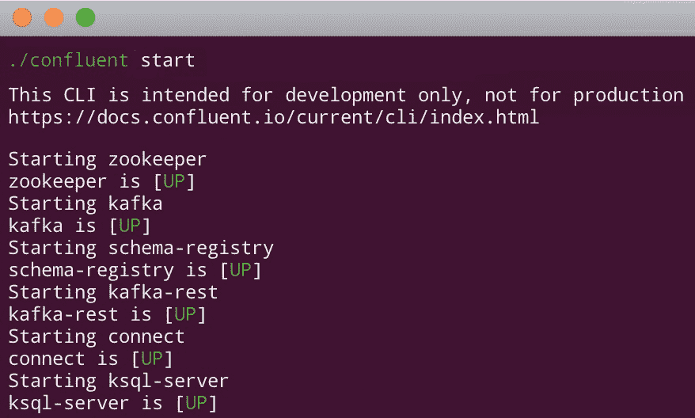
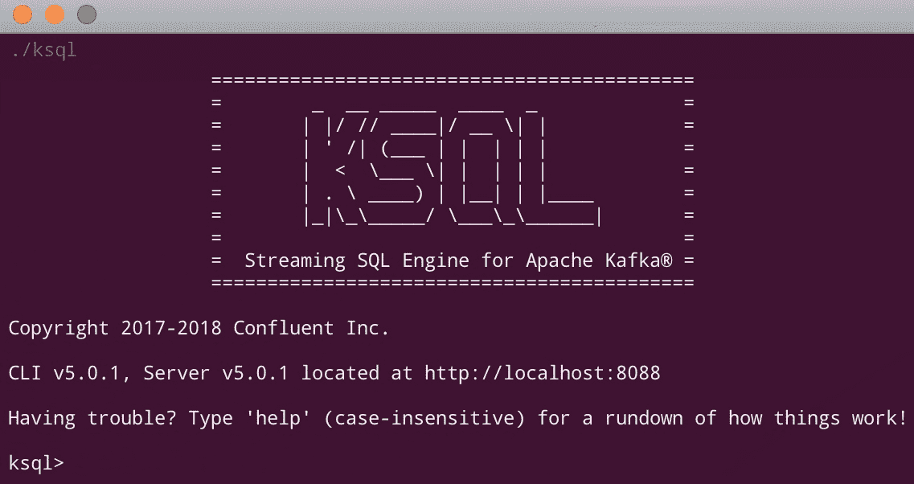

# 第七章：KSQL

在前面的章节中，我们编写了 Java 代码来使用 Kafka 操作数据流，我们还为 Kafka 和 Kafka Streams 构建了几个 Java 处理器。在本章中，我们将使用 KSQL 来实现相同的结果。

本章涵盖了以下主题：

+   简要介绍 KSQL

+   运行 KSQL

+   使用 KSQL CLI

+   使用 KSQL 处理数据

+   向主题写入

# 简要介绍 KSQL

使用 Kafka Connect，我们可以在多种编程语言中构建客户端：JVM（Java、Clojure、Scala）、C/C++、C#、Python、Go、Erlang、Ruby、Node.js、Perl、PHP、Rust 和 Swift。除此之外，如果你的编程语言不在列表中，你可以使用 Kafka REST 代理。但 Kafka 开发者意识到，所有程序员，尤其是数据工程师，都可以使用同一种语言：**结构化查询语言**（**SQL**）。因此，他们决定在 Kafka Streams 上创建一个抽象层，在这个抽象层中，他们可以使用 SQL 来操作和查询流。

KSQL 是 Apache Kafka 的 SQL 引擎。它允许编写 SQL 语句以实时分析数据流。请记住，流是一个无界的数据结构，所以我们不知道它从哪里开始，我们一直在接收新的数据。因此，KSQL 查询通常会持续生成结果，直到你停止它们。

KSQL 在 Kafka Streams 上运行。要在一个数据流上运行查询，查询会被解析、分析，然后构建并执行一个 Kafka Streams 拓扑，就像我们在运行 Kafka Streams 应用程序时在每个 `process()` 方法结束时所做的那样。KSQL 已经将 Kafka Streams 的概念一一映射，例如，表、连接、流、窗口函数等。

KSQL 在 KSQL 服务器上运行。因此，如果我们需要更多容量，我们可以运行一个或多个 KSQL 服务器实例。内部，所有 KSQL 实例协同工作，通过一个称为 `_confluent-ksql-default__command_topic` 的专用和私有主题发送和接收信息。

与所有 Kafka 技术一样，我们也可以通过 REST API 与 KSQL 交互。此外，KSQL 还拥有自己的精美 **命令行界面**（**CLI**）。如果您想了解更多关于 KSQL 的信息，请阅读以下 URL 上的在线文档：[`docs.confluent.io/current/ksql/docs/index.html`](https://docs.confluent.io/current/ksql/docs/index.html)。

# 运行 KSQL

如前所述，KSQL 随 Confluent 平台一起提供。当我们启动 Confluent 平台时，它会在结束时自动启动一个 KSQL 服务器，如图 *7.1* 所示：



图 7.1：Confluent 平台启动

要单独启动 KSQL 服务器（不推荐），我们可以使用 `ksql-server-start` 命令。只需从 bin 目录中输入 `./ksql`，如图 *7.2* 所示：



图 7.2：KSQL CLI 启动屏幕

# 使用 KSQL CLI

KSQL CLI 是一个用于与 KSQL 交互的命令提示符；它与 MariaDB 或 MySQL 等关系型数据库附带的命令提示符非常相似。要查看所有可能的命令，请输入 help，将显示一个带有选项的列表。

目前，我们还没有向 KSQL 通知任何内容。我们必须声明某个东西是一个表或一个流。我们将使用前面章节中生产者写入 JSON 信息到 `healthchecks` 主题产生的信息。

如果你还记得，数据看起来是这样的：

```java
{"event":"HEALTH_CHECK","factory":"Lake Anyaport","serialNumber":"EW05-HV36","type":"WIND","status":"STARTING","lastStartedAt":"2018-09-17T11:05:26.094+0000","temperature":62.0,"ipAddress":"15.185.195.90"}
{"event":"HEALTH_CHECK","factory":"Candelariohaven","serialNumber":"BO58-SB28","type":"SOLAR","status":"STARTING","lastStartedAt":"2018-08-16T04:00:00.179+0000","temperature":75.0,"ipAddress":"151.157.164.162"}
{"event":"HEALTH_CHECK","factory":"Ramonaview","serialNumber":"DV03-ZT93","type":"SOLAR","status":"RUNNING","lastStartedAt":"2018-07-12T10:16:39.091+0000","temperature":70.0,"ipAddress":"173.141.90.85"}
...
```

KSQL 可以读取 JSON 数据，也可以读取 Avro 格式的数据。要从 `healthchecks` 主题声明一个流，我们使用以下命令：

```java
ksql>  CREATE STREAM healthchecks (event string, factory string, serialNumber string, type string, status string, lastStartedAt string, temperature double, ipAddress string) WITH (kafka_topic='healthchecks', value_format='json');
```

输出类似于以下内容：

```java
Message
----------------------------
Stream created and running
----------------------------
```

要查看现有 `STREAM` 的结构，我们可以使用 `DESCRIBE` 命令，如下所示，它告诉我们数据类型及其结构：

```java
ksql> DESCRIBE healthchecks;
```

输出类似于以下内容：

```java
Name          : HEALTHCHECKS
Field         | Type
-------------------------------------------
ROWTIME       | BIGINT           (system)
ROWKEY        | VARCHAR(STRING)  (system)
EVENT         | VARCHAR(STRING)
FACTORY       | VARCHAR(STRING)
SERIALNUMBER  | VARCHAR(STRING)
TYPE          | VARCHAR(STRING)
STATUS        | VARCHAR(STRING)
LASTSTARTEDAT | VARCHAR(STRING)
TEMPERATURE   | DOUBLE
IPADDRESS     | VARCHAR(STRING)
```

注意，一开始会显示两个额外的字段：`ROWTIME`（消息时间戳）和`ROWKEY`（消息键）。

当我们创建流时，我们声明 Kafka 主题是 `healthchecks`。因此，如果我们执行 `SELECT` 命令，我们将获得一个列表，其中包含实时指向我们的流所在主题的事件（记得运行一个生产者以获取新鲜数据）。命令如下：

```java
ksql> select * from healthchecks;
```

输出类似于以下内容：

```java
1532598615943 | null | HEALTH_CHECK | Carliefort | FM41-RE80 | WIND | STARTING | 2017-08-13T09:37:21.681+0000 | 46.0 | 228.247.233.14
1532598616454 | null | HEALTH_CHECK | East Waldo | HN72-EB29 | WIND | RUNNING | 2017-10-31T14:20:13.929+0000 | 3.0 | 223.5.127.146
1532598616961 | null | HEALTH_CHECK | New Cooper | MM04-TZ21 | SOLAR | SHUTTING_DOWN | 2017-08-21T21:10:31.190+0000 | 23.0 | 233.143.140.46
1532598617463 | null | HEALTH_CHECK | Mannmouth | XM02-PQ43 | GEOTHERMAL | RUNNING | 2017-09-08T10:44:56.005+0000 | 73.0 | 221.96.17.237
1532598617968 | null | HEALTH_CHECK | Elvisfort | WP70-RY81 | NUCLEAR | RUNNING | 2017-09-07T02:40:18.917+0000 | 49.0 | 182.94.17.58
1532598618475 | null | HEALTH_CHECK | Larkinstad | XD75-FY56 | GEOTHERMAL | STARTING | 2017-09-06T08:48:14.139+0000 | 35.0 | 105.236.9.137
1532598618979 | null | HEALTH_CHECK | Nakiaton | BA85-FY32 | SOLAR | RUNNING | 2017-08-15T04:10:02.590+0000 | 32.0 | 185.210.26.215
1532598619483 | null | HEALTH_CHECK | North Brady | NO31-LM78 | HYDROELECTRIC | RUNNING | 2017-10-05T12:12:52.940+0000 | 5.0 | 17.48.190.21
1532598619989 | null | HEALTH_CHECK | North Josianemouth | GT17-TZ11 | SOLAR | SHUTTING_DOWN | 2017-08-29T16:57:23.000+0000 | 6.0 | 99.202.136.163
```

`SELECT` 命令显示了流中声明的 Kafka 主题的数据。查询永远不会停止，所以它会一直运行，直到你停止它。新记录以新行打印，因为主题中新的事件被产生。要停止查询，请输入 *Ctrl* + *C*。

# 使用 KSQL 处理数据

在前面的章节中，我们从 `healthchecks` 主题获取数据，计算机器的 `uptimes`，并将这些数据推送到一个名为 `uptimes` 的主题。现在，我们将使用 KSQL 来做这件事。

在编写本文时，KSQL 还没有比较两个日期的函数，所以我们有以下两种选择：

+   为 KSQL 编写一个**用户自定义函数**（**UDF**）的 Java 代码

+   使用现有的函数来进行我们的计算

由于现在创建新的 UDF 不在范围之内，让我们选择第二个选项：使用现有的函数来进行我们的计算。

第一步是使用 `STRINGTOTIMESTAMP` 函数解析启动时间，如下所示（记住我们以字符串格式声明了日期，因为 KSQL 还没有 `DATE` 类型）：

```java
ksql> SELECT event, factory, serialNumber, type, status, lastStartedAt, temperature, ipAddress, STRINGTOTIMESTAMP(lastStartedAt,'yyyy-MM-dd''T''HH:mm:ss.SSSZ') FROM healthchecks;
```

输出类似于以下内容：

```java
HEALTH_CHECK | Ezekielfurt | AW90-DQ16 | HYDROELECTRIC | RUNNING | 2017-09-28T21:00:45.683+0000 | 7.0 | 89.87.184.250 | 1532168445683
HEALTH_CHECK | Icieville | WB52-WC16 | WIND | SHUTTING_DOWN | 2017-10-31T22:38:26.783+0000 | 15.0 | 40.23.168.167 | 1532025506783
HEALTH_CHECK | McClurehaven | QP68-WX17 | GEOTHERMAL | RUNNING | 2017-11-12T23:16:27.105+0000 | 76.0 | 252.213.150.75 | 1532064587105
HEALTH_CHECK | East Maudshire | DO15-BB56 | NUCLEAR | STARTING | 2017-10-14T03:04:00.399+0000 | 51.0 | 93.202.28.134 | 1532486240399
HEALTH_CHECK | South Johnhaven | EE06-EX06 | HYDROELECTRIC | RUNNING | 2017-09-06T20:14:27.438+0000 | 91.0 | 244.254.181.218 | 1532264867438
```

下一步是将这些日期与当前日期进行比较。在 KSQL 中，目前还没有获取今天日期的函数，所以让我们使用 `STRINGTOTIMESTAMP` 函数来解析今天的日期，如下所示：

```java
ksql> SELECT serialNumber, STRINGTOTIMESTAMP(lastStartedAt,'yyyy-MM-dd''T''HH:mm:ss.SSSZ'), STRINGTOTIMESTAMP('2017-11-18','yyyy-MM-dd') FROM healthchecks;
```

输出类似于以下内容：

```java
FE79-DN10 | 1532050647607 | 1510984800000
XE79-WP47 | 1532971000830 | 1510984800000
MP03-XC09 | 1532260107928 | 1510984800000
SO48-QF28 | 1532223768121 | 1510984800000
OC25-AB61 | 1532541923073 | 1510984800000
AL60-XM70 | 1532932441768 | 1510984800000
```

现在，让我们比较这两个日期，并计算它们之间的天数，如下所示（1 天 = 86,400 秒 = 24 小时 x 60 分钟 x 60 秒，1 秒 = 1,000 毫秒）：

```java
ksql> SELECT serialNumber, (STRINGTOTIMESTAMP('2017-11-18','yyyy-MM-dd''T''HH:mm:ss.SSSZ')-STRINGTOTIMESTAMP(lastStartedAt,'yyyy-MM-dd'))/86400/1000 FROM healthchecks;
```

输出类似于以下内容：

```java
EH92-AQ09 | 39
BB09-XG98 | 42
LE94-BT50 | 21
GO25-IE91 | 97
WD93-HP20 | 22
JX48-KN03 | 12
EC84-DD11 | 73
SF06-UB22 | 47
IU77-VQ89 | 18
NM80-ZY31 | 5
TR64-TI21 | 51
ZQ13-GI11 | 80
II04-MB66 | 48
```

完美，现在我们已经为每台机器计算了运行时间。

# 向主题写入

到目前为止，我们已经处理了数据并在实时中打印了结果。要将这些结果发送到另一个主题，我们使用`CREATE`命令模式，其中指定来自`SELECT`。

让我们先以字符串形式编写 uptime，并以逗号分隔的格式写入数据，如下所示（记住 KSQL 支持逗号分隔、JSON 和 Avro 格式）。目前，这已经足够，因为我们只写入一个值：

```java
ksql> CREATE STREAM uptimes WITH (kafka_topic='uptimes', value_format='delimited') AS SELECT CAST((STRINGTOTIMESTAMP('2017-11-18','yyyy-MM-dd''T''HH:mm:ss.SSSZ')-STRINGTOTIMESTAMP(lastStartedAt,'yyyy-MM-dd'))/86400/1000 AS string) AS uptime FROM healthchecks;
```

输出类似于以下内容：

```java
Message
----------------------------
Stream created and running
----------------------------
```

我们的查询正在后台运行。要查看它是否在运行，我们可以使用`uptimes`主题的控制台消费者，如下所示：

```java
$ ./kafka-console-consumer --bootstrap-server localhost:9092 --topic uptimes --property print.key=true
```

输出类似于以下内容：

```java
null  39
null  42
null  21
```

结果是正确的；然而，我们忘记使用机器序列号作为消息键。为此，我们必须重建我们的查询和流。

第一步是使用`show queries`命令，如下所示：

```java
ksql> show queries;
```

输出类似于以下内容：

```java
 Query ID       | Kafka Topic | Query String
-------------------------------------------------------------------------------
CSAS_UPTIMES_0 | UPTIMES     | CREATE STREAM uptimes WITH (kafka_topic='uptimes', value_format='delimited') AS SELECT CAST((STRINGTOTIMESTAMP('2017-11-18','yyyy-MM-dd''T''HH:mm:ss.SSSZ')-STRINGTOTIMESTAMP(lastStartedAt,'yyyy-MM-dd'))/86400/1000 AS string) AS uptime FROM healthchecks;
-------------------------------------------------------------------------------
For detailed information on a Query run: EXPLAIN <Query ID>;
```

使用`查询 ID`，使用`terminate <ID>`命令，如下所示：

```java
ksql> terminate CSAS_UPTIMES_0;
```

输出类似于以下内容：

```java
Message
-------------------
Query terminated.
-------------------
```

要删除流，使用`DROP STREAM`命令，如下所示：

```java
ksql> DROP STREAM uptimes;
```

输出类似于以下内容：

```java
Message
------------------------------
Source UPTIMES was dropped.
------------------------------
```

要正确写入事件键，我们必须使用`PARTITION BY`子句。首先，我们使用部分计算重新生成我们的流，如下所示：

```java
ksql> CREATE STREAM healthchecks_processed AS SELECT serialNumber, CAST((STRINGTOTIMESTAMP('2017-11-18','yyyy-MM-dd''T''HH:mm:ss.SSSZ')-STRINGTOTIMESTAMP(lastStartedAt,'yyyy-MM-dd'))/86400/1000 AS string) AS uptime FROM healthchecks;
```

输出类似于以下内容：

```java
Message
----------------------------
Stream created and running
----------------------------
```

此流有两个字段（`serialNumber`和`uptime`）。要将这些计算值写入主题，我们使用`CREATE STREAM`，`AS SELECT`如下所示：

```java
ksql> CREATE STREAM uptimes WITH (kafka_topic='uptimes', value_format='delimited') AS SELECT * FROM healthchecks_processed;
```

输出类似于以下内容：

```java
Message
----------------------------
Stream created and running
----------------------------
```

最后，运行控制台消费者以显示结果，如下所示：

```java
$ ./bin/kafka-console-consumer --bootstrap-server localhost:9092 --topic uptimes --property print.key=true
```

输出类似于以下内容：

```java
EW05-HV36   33
BO58-SB28   20
DV03-ZT93   46
...
```

现在，关闭 KSQL CLI（*Ctrl* + *C* 并关闭命令窗口）。由于查询仍在 KSQL 中运行，你仍然可以在控制台消费者窗口中看到输出。

恭喜你，你已经使用几个 KSQL 命令构建了一个 Kafka Streams 应用程序。

要揭示 KSQL 的全部功能，重要的是要查看以下地址的官方文档：

[`docs.confluent.io/current/ksql/docs/tutorials/index.html`](https://docs.confluent.io/current/ksql/docs/tutorials/index.html)

# 摘要

KSQL 仍然非常新，但该产品已经在开发者中获得了采用。我们都希望它继续扩展以支持更多数据格式（如 Protobuffers、Thrift 等）和更多功能（如地理定位和物联网等非常有用的更多 UDFs）。

因此，再次恭喜！在本章中，我们与之前一样，但没有写一行 Java 代码。这使得 KSQL 成为非程序员但致力于数据分析的人们的首选工具。
