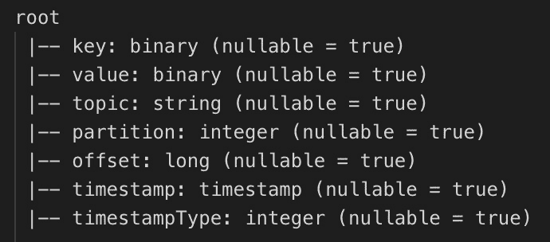
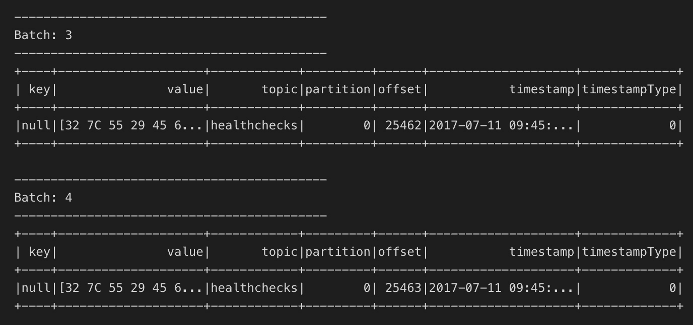

# Kafka Connect

在本章中，我们不是使用 Kafka Java API 进行生产者和消费者，也不是使用 Kafka Streams 或 KSQL（如前几章所述），我们将使用 Spark Structured Streaming 连接 Kafka，这是 Apache Spark 用于处理流数据的解决方案，它使用其 Datasets API。

本章涵盖了以下主题：

+   Spark Streaming 处理器

+   从 Spark 读取 Kafka

+   数据转换

+   数据处理

+   从 Spark 写入 Kafka

+   运行`SparkProcessor`

# Kafka Connect 概述

Kafka Connect 是一个开源框架，是 Apache Kafka 的一部分；它用于将 Kafka 与其他系统连接起来，例如结构化数据库、列存储、键值存储、文件系统和搜索引擎。

Kafka Connect 拥有广泛的内置连接器。如果我们从外部系统读取，它被称为**数据源**；如果我们向外部系统写入，它被称为**数据接收器**。

在前几章中，我们创建了一个 Java Kafka 生产者，它以如下三条消息的形式将 JSON 数据发送到名为`healthchecks`的主题。

```java
{"event":"HEALTH_CHECK","factory":"Lake Anyaport","serialNumber":"EW05-HV36","type":"WIND","status":"STARTING","lastStartedAt":"2018-09-17T11:05:26.094+0000","temperature":62.0,"ipAddress":"15.185.195.90"}
{"event":"HEALTH_CHECK","factory":"Candelariohaven","serialNumber":"BO58-SB28","type":"SOLAR","status":"STARTING","lastStartedAt":"2018-08-16T04:00:00.179+0000","temperature":75.0,"ipAddress":"151.157.164.162"}{"event":"HEALTH_CHECK","factory":"Ramonaview","serialNumber":"DV03-ZT93","type":"SOLAR","status":"RUNNING","lastStartedAt":"2018-07-12T10:16:39.091+0000","temperature":70.0,"ipAddress":"173.141.90.85"}
...
```

现在，我们将处理这些数据以计算机器的运行时间和获取包含如下三条消息的主题：

```java
EW05-HV36   33
BO58-SB28   20
DV03-ZT93   46
...
```

# 项目设置

第一步是修改我们的 Kioto 项目。我们必须在`build.gradle`中添加依赖项，如下所示：

```java
apply plugin: 'java'
apply plugin: 'application'
sourceCompatibility = '1.8'
mainClassName = 'kioto.ProcessingEngine'
repositories {
    mavenCentral()
    maven { url 'https://packages.confluent.io/maven/' }
}
version = '0.1.0'
dependencies {
    compile 'com.github.javafaker:javafaker:0.15'
    compile 'com.fasterxml.jackson.core:jackson-core:2.9.7'
    compile 'io.confluent:kafka-avro-serializer:5.0.0'
    compile 'org.apache.kafka:kafka_2.12:2.0.0'
    compile 'org.apache.kafka:kafka-streams:2.0.0'
    compile 'io.confluent:kafka-streams-avro-serde:5.0.0'
    compile 'org.apache.spark:spark-sql_2.11:2.2.2'
    compile 'org.apache.spark:spark-sql-kafka-0-10_2.11:2.2.2'
}
jar {
    manifest {
        attributes 'Main-Class': mainClassName
    } from {
        configurations.compile.collect {
            it.isDirectory() ? it : zipTree(it)
        }
    }
    exclude "META-INF/*.SF"
    exclude "META-INF/*.DSA"
    exclude "META-INF/*.RSA"
}
```

列表 8.1：Kioto gradle 构建文件用于 Spark

要使用 Apache Spark，我们需要以下依赖项：

```java
compile 'org.apache.spark:spark-sql_2.11:2.2.2'
```

要连接 Apache Spark 与 Kafka，我们需要以下依赖项：

```java
compile 'org.apache.spark:spark-sql-kafka-0-10_2.11:2.2.2'
```

我们使用旧版本的 Spark，2.2.2，以下两个原因：

+   当你阅读这段内容时，Spark 版本肯定已经更新了。我选择这个版本（而不是写作时的最后一个版本）的原因是，与 Kafka 的连接器在这个版本上工作得非常好（在性能和错误方面）。

+   与此版本一起工作的 Kafka 连接器比最现代的 Kafka 连接器版本落后几个版本。在升级生产环境时，你始终必须考虑这一点**。**

# Spark Streaming 处理器

现在，在`src/main/java/kioto/spark`目录中，创建一个名为`SparkProcessor.java`的文件，其内容如列表 8.2 所示，如下所示：

```java
package kioto.spark;
import kioto.Constants;
import org.apache.spark.sql.*;
import org.apache.spark.sql.streaming.*;
import org.apache.spark.sql.types.*;
import java.sql.Timestamp;
import java.time.LocalDate;
import java.time.Period;

public class SparkProcessor {
  private String brokers;
  public SparkProcessor(String brokers) {
    this.brokers = brokers;
  }
  public final void process() {
    //below is the content of this method
  }
  public static void main(String[] args) {
    (new SparkProcessor("localhost:9092")).process();
  }
}
```

列表 8.2：SparkProcessor.java

注意，与之前的示例一样，主方法使用 Kafka 代理的 IP 地址和端口号调用了`process()`方法。

现在，让我们填充`process()`方法。第一步是初始化 Spark，如下面的代码块所示：

```java
SparkSession spark = SparkSession.builder()
    .appName("kioto")
    .master("local[*]")
    .getOrCreate();
```

在 Spark 中，集群中每个成员的应用名称必须相同，因此这里我们称之为 Kioto（原始的，不是吗？）。

由于我们打算在本地运行应用程序，我们将 Spark master 设置为`local[*]`，这意味着我们正在创建与机器 CPU 核心数量相等的线程。

# 从 Spark 读取 Kafka

Apache Spark 有几个连接器。在这种情况下，我们使用 Databricks Inc.（Apache Spark 的负责公司）的 Kafka 连接器。

使用这个 Spark Kafka 连接器，我们可以从 Kafka 主题中读取数据，使用 Spark Structured Streaming：

```java
 Dataset<Row> inputDataset = spark
    .readStream()
    .format("kafka")
    .option("kafka.bootstrap.servers", brokers)
    .option("subscribe", Constants.getHealthChecksTopic())
    .load();
```

只需说 Kafka 格式，我们就可以从`subscribe`选项指定的主题中读取流，在指定的代理上运行。

在代码的这个位置，如果你在`inputDataSet`上调用`printSchema()`方法，结果将类似于*图 8.1*：



图 8.1：打印模式输出

我们可以这样理解：

+   键和值都是二进制数据。在这里，不幸的是，与 Kafka 不同，Spark 中无法指定我们的数据反序列化器。因此，有必要使用 Dataframe 操作来进行反序列化。

+   对于每条消息，我们可以知道主题、分区、偏移量和时间戳。

+   时间戳类型始终为零。

与 Kafka Streams 一样，在 Spark Streaming 中，在每一步我们都必须生成一个新的数据流，以便应用转换并获得新的数据流。

在每个步骤中，如果我们需要打印我们的数据流（用于调试应用程序），我们可以使用以下代码：

```java
StreamingQuery consoleOutput =
    streamToPrint.writeStream()
    .outputMode("append")
    .format("console")
    .start();
```

第一行是可选的，因为我们实际上不需要将结果分配给一个对象，只需要代码执行。

这个片段的输出类似于*图 8.2*。消息值肯定是二进制数据：



图 8.2：数据流控制台输出

# 数据转换

我们知道，当我们产生数据时，它是以 JSON 格式，尽管 Spark 以二进制格式读取它。为了将二进制消息转换为字符串，我们使用以下代码：

```java
Dataset<Row> healthCheckJsonDf =
    inputDataset.selectExpr("CAST(value AS STRING)");
```

`Dataset`控制台输出现在是可读的，如下所示：

```java
+--------------------------+
|                     value|
+--------------------------+
| {"event":"HEALTH_CHECK...|
+--------------------------+
```

下一步是提供字段列表以指定 JSON 消息的数据结构，如下所示：

```java
StructType struct = new StructType()
    .add("event", DataTypes.StringType)
    .add("factory", DataTypes.StringType)
    .add("serialNumber", DataTypes.StringType)
    .add("type", DataTypes.StringType)
    .add("status", DataTypes.StringType)
    .add("lastStartedAt", DataTypes.StringType)
    .add("temperature", DataTypes.FloatType)
    .add("ipAddress", DataTypes.StringType);
```

接下来，我们反序列化 JSON 格式的 String。最简单的方法是使用`org.apache.spark.sql.functions`包中预构建的`from_json()`函数，如下所示：

```java
Dataset<Row> healthCheckNestedDs =
    healthCheckJsonDf.select(
        functions.from_json(
            new Column("value"), struct).as("healthCheck"));
```

如果我们在这个时候打印`Dataset`，我们可以看到列嵌套正如我们在模式中指示的那样：

```java
root
 |-- healthcheck: struct (nullable = true)
 |    |-- event: string (nullable = true)
 |    |-- factory: string (nullable = true)
 |    |-- serialNumber: string (nullable = true)
 |    |-- type: string (nullable = true)
 |    |-- status: string (nullable = true)
 |    |-- lastStartedAt: string (nullable = true)
 |    |-- temperature: float (nullable = true)
 |    |-- ipAddress: string (nullable = true)
```

下一步是将这个`Dataset`展开，如下所示：

```java
Dataset<Row> healthCheckFlattenedDs = healthCheckNestedDs
   .selectExpr("healthCheck.serialNumber", "healthCheck.lastStartedAt");
```

为了可视化展开，如果我们打印`Dataset`，我们得到以下内容：

```java
root
 |-- serialNumber: string (nullable = true)
 |-- lastStartedAt: string (nullable = true)
```

注意，我们以字符串的形式读取启动时间。这是因为内部`from_json()`函数使用了 Jackson 库。不幸的是，没有方法可以指定要读取的日期格式。

幸运的是，为了这些目的，同一个函数包中有一个`to_timestamp()`函数。如果只需要读取日期，忽略时间指定，还有一个`to_date()`函数。在这里，我们正在重写`lastStartedAt`列，类似于以下内容：

```java
Dataset<Row> healthCheckDs = healthCheckFlattenedDs
    .withColumn("lastStartedAt", functions.to_timestamp(
        new Column ("lastStartedAt"), "yyyy-MM-dd'T'HH:mm:ss.SSSZ"));
```

# 数据处理

现在，我们要做的是计算`uptimes`。正如预期的那样，Spark 没有内置函数来计算两个日期之间的天数，因此我们将创建一个用户定义的函数。

如果我们记得 KSQL 章节，我们也可以在 KSQL 中构建和使用新的 UDFs。

要实现这一点，我们首先构建一个函数，该函数接收一个`java.sql.Timestamp`作为输入，如下所示（这是 Spark DataSets 中表示时间戳的方式）并返回一个表示从该日期起的天数的整数：

```java
private final int uptimeFunc(Timestamp date) {
    LocalDate localDate = date.toLocalDateTime().toLocalDate();
    return Period.between(localDate, LocalDate.now()).getDays();
}
```

下一步是生成一个 Spark UDF，如下所示：

```java
Dataset<Row> processedDs = healthCheckDs
    .withColumn( "lastStartedAt", new Column("uptime"));
```

最后，将该 UDF 应用到`lastStartedAt`列以在`Dataset`中创建一个名为`uptime`的新列。

# 从 Spark 写入 Kafka

由于我们已经处理了数据并计算了`uptime`，现在我们只需要将这些值写入名为`uptimes`的 Kafka 主题。

Kafka 的连接器允许我们将值写入 Kafka。要求是写入的`Dataset`必须有一个名为`key`的列和一个名为`value`的列；每个都可以是 String 或二进制类型。

由于我们希望机器序列号作为键，如果它已经是 String 类型就没有问题。现在，我们只需要将`uptime`列从二进制转换为 String。

我们使用`Dataset`类的`select()`方法来计算这两个列，并使用`as()`方法给它们赋予新的名称，如下所示（为此，我们也可以使用该类中的`alias()`方法）：

```java
Dataset<Row> resDf = processedDs.select(
    (new Column("serialNumber")).as("key"),
    processedDs.col("uptime").cast(DataTypes.StringType).as("value"));
```

我们的`Dataset`已经准备好了，并且它符合 Kafka 连接器预期的格式。以下代码是告诉 Spark 将这些值写入 Kafka：

```java
//StreamingQuery kafkaOutput =
resDf.writeStream()
   .format("kafka")
   .option("kafka.bootstrap.servers", brokers)
   .option("topic", "uptimes")
   .option("checkpointLocation", "/temp")
   .start();
```

注意我们在选项中添加了 checkpoint 位置。这是为了确保 Kafka 的高可用性。然而，这并不保证消息以精确一次模式传递。如今，Kafka 可以保证精确一次传递；而 Spark 目前只能保证至少一次传递模式。

最后，我们调用`awaitAnyTermination()`方法，如下所示：

```java
try {
  spark.streams().awaitAnyTermination();
} catch (StreamingQueryException e) {
  // deal with the Exception
}
```

重要的一点是提到，如果 Spark 在代码中留下控制台输出，这意味着所有查询必须在调用任何`awaitTermination()`方法之前调用其`start()`方法，如下所示：

```java
firstOutput = someDataSet.writeStream
...
    .start()
...
 secondOutput = anotherDataSet.writeStream
...
    .start()
firstOutput.awaitTermination()
anotherOutput.awaitTermination()
```

还要注意，我们可以将末尾的所有`awaitTermination()`调用替换为对`awaitAnyTermination()`的单次调用，就像我们在原始代码中所做的那样。

# 运行 SparkProcessor

要构建项目，请从`kioto`目录运行以下命令：

```java
$ gradle jar
```

如果一切正常，输出类似于以下内容：

```java
BUILD SUCCESSFUL in 3s
1 actionable task: 1 executed
```

1.  从命令行终端，移动到`Confluent`目录并按如下方式启动：

```java
 $ ./bin/confluent start
```

1.  运行`uptimes`主题的控制台消费者，如下所示：

```java
 $ ./bin/kafka-console-consumer --bootstrap-server localhost:9092 
      --topic uptimes
```

1.  从我们之前的章节中构建的`PlainProducer`的 IDE 中运行主方法

1.  生产者的控制台消费者输出应类似于以下内容：

```java
{"event":"HEALTH_CHECK","factory":"Lake Anyaport","serialNumber":"EW05-HV36","type":"WIND","status":"STARTING","lastStartedAt":"2017-09-17T11:05:26.094+0000","temperature":62.0,"ipAddress":"15.185.195.90"}
{"event":"HEALTH_CHECK","factory":"Candelariohaven","serialNumber":"BO58-SB28","type":"SOLAR","status":"STARTING","lastStartedAt":"2017-08-16T04:00:00.179+0000","temperature":75.0,"ipAddress":"151.157.164.162"}
{"event":"HEALTH_CHECK","factory":"Ramonaview","serialNumber":"DV03-ZT93","type":"SOLAR","status":"RUNNING","lastStartedAt":"2017-07-12T10:16:39.091+0000","temperature":70.0,"ipAddress":"173.141.90.85"}
...
```

1.  从我们的 IDE 中运行`SparkProcessor`的主方法

1.  `uptimes`主题的控制台消费者的输出应类似于以下内容：

```java
 EW05-HV36   33
 BO58-SB28   20
 DV03-ZT93   46
 ...
```

# 摘要

如果你是一个使用 Spark 进行批量处理的人，Spark Structured Streaming 是你应该尝试的工具，因为它的 API 与其批量处理对应工具类似。

现在，如果我们比较 Spark 和 Kafka 在流处理方面的表现，我们必须记住 Spark Streaming 是为了处理吞吐量而设计的，而不是延迟，处理低延迟的流变得非常复杂。

Spark Kafka 连接器一直是一个复杂的问题。例如，我们必须使用两者的旧版本，因为随着每个新版本的发布，两边都有太多的变化。

在 Spark 中，部署模型总是比 Kafka Streams 复杂得多。尽管 Spark、Flink 和 Beam 可以执行比 Kafka Streams 更复杂的任务，但学习和实现起来最简单的始终是 Kafka。
