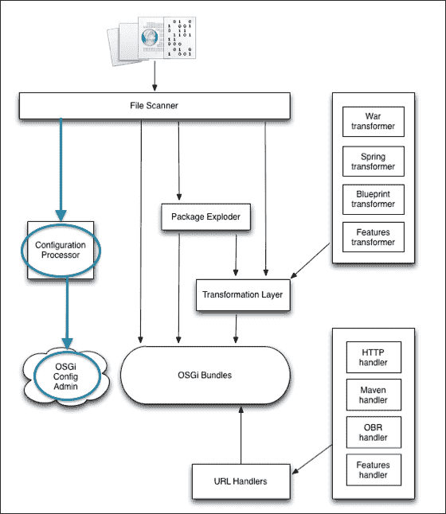
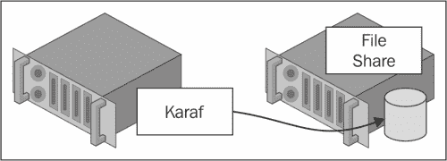
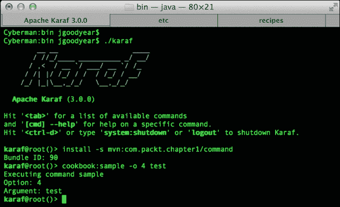
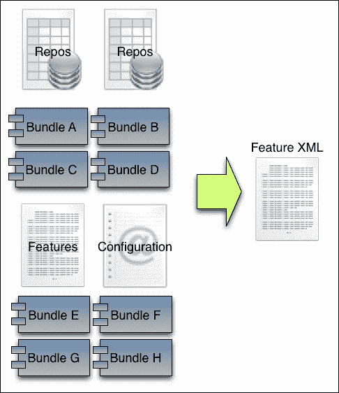
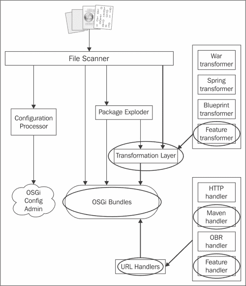
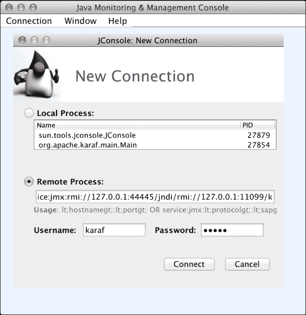
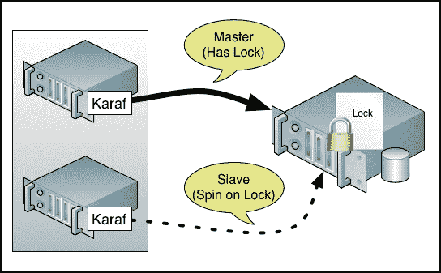

# 第一章。Apache Karaf 系统构建者指南

在本章中，我们将涵盖以下主题：

+   在 Apache Karaf 中配置生产就绪的日志记录

+   使用 Maven 存档创建我们自己的自定义 Karaf 命令

+   标记 Apache Karaf 控制台

+   将应用程序作为功能部署

+   使用 JMX 监控和管理 Apache Karaf

+   重新配置对 Apache Karaf 的 SSH 访问

+   将 Apache Karaf 作为服务安装

+   设置 Apache Karaf 以实现高可用性

# 简介

有经验的 Apache Karaf 用户会告诉你，开箱即用，Karaf 为你提供了部署应用程序所需的功能和工具。然而，为了构建一个生产就绪的环境，你可能需要调整一些设置。

本章中的食谱是为系统构建者准备的，这些人需要使他们的 Apache Karaf 实例达到生产就绪状态，并使其中的应用程序易于管理。

### 小贴士

**Apache Karaf 和 OSGi 新手？**

对 Apache Karaf 及其底层技术有深入了解兴趣的读者应参考 Packt Publishing 出版的《Instant OSGi Starter》，作者为 Jamie Goodyear 和 Johan Edstrom，以及《Learning Apache Karaf》，作者为 Jamie Goodyear、Johan Edstrom 和 Heath Kesler。

# 在 Apache Karaf 中配置生产就绪的日志记录

Apache Karaf 管理员首先要做的第一项任务之一是更改默认的日志配置，以更符合生产就绪的设置。

为了改进默认的日志配置，我们将执行以下任务：

+   更新日志文件位置，使其位于数据文件夹之外。这有助于管理员在删除运行时数据时避免意外删除日志文件。

+   增加日志文件大小。默认的 1 MB 大小对于大多数生产部署来说太小了。通常，我们会将其设置为 50 或 100 MB，具体取决于可用的磁盘空间。

+   增加我们保留的日志文件数量。没有保留日志文件的正确数量。然而，当磁盘空间便宜且可用时，保留大量文件是一种首选的配置。

## 如何做到这一点…

配置 Karaf 的日志机制需要你编辑`etc/org.ops4j.pax.logging.cfg`文件。使用你喜欢的编辑器打开文件，并更改以下突出显示的代码条目：

```java
# Root logger
log4j.rootLogger=INFO, out, osgi:*
log4j.throwableRenderer=org.apache.log4j.OsgiThrowableRenderer

# File appender
log4j.appender.out=org.apache.log4j.RollingFileAppender
log4j.appender.out.layout=org.apache.log4j.PatternLayout
log4j.appender.out.layout.ConversionPattern=%d{ISO8601} | %-5.5p | %-16.16t | %-32.32c{1} | %X{bundle.id} - %X{bundle.name} - %X{bundle.version} | %m%n
log4j.appender.out.file=${karaf.base}/log/karaf.log
log4j.appender.out.append=true
log4j.appender.out.maxFileSize=10MB
log4j.appender.out.maxBackupIndex=100
```

在前面的配置中，我们指示 Karaf 将日志写入基础安装目录中的日志文件夹，将日志文件大小增加到 10 MB，并将保留的日志文件数量增加到 100。

完成文件编辑后，保存更改。它们将很快生效。

### 小贴士

我们可以通过更改`log4j.rootLogger`条目从`INFO`到`DEBUG`、`WARN`、`ERROR`或`TRACE`来改变日志记录的详细程度。

## 它是如何工作的…

Karaf 的日志系统基于**OPS4J Pax Logging**，其中`log4j`库作为其后端。配置文件`etc/org.ops4j.pax.logging.cfg`用于定义附加器、日志级别等。让我们看看以下默认附加器配置以及我们将如何调整它以使其更符合生产就绪：

```java
# Root logger
log4j.rootLogger=INFO, out, osgi:*
log4j.throwableRenderer=org.apache.log4j.OsgiThrowableRenderer

# File appender
#log4j.appender.out=org.apache.log4j.RollingFileAppender
#log4j.appender.out.layout=org.apache.log4j.PatternLayout
#log4j.appender.out.layout.ConversionPattern=%d{ISO8601} | %-5.5p | %-16.16t | %-32.32c{1} | %X{bundle.id} - %X{bundle.name} - %X{bundle.version} | %m%n
#log4j.appender.out.file=${karaf.data}/log/karaf.log
#log4j.appender.out.append=true
#log4j.appender.out.maxFileSize=1MB
#log4j.appender.out.maxBackupIndex=10
```

在前面的代码中，`File appender` 配置设置了默认的 Karaf 日志行为。初始配置设置了 `RollingFileAppender` 并构建了一个日志条目模式。其余选项指定了日志文件的位置、大小和保留的日志文件数量。

Karaf 监控位于 `KARAF_HOME/etc` 文件夹中的配置文件。当读取配置文件的更新时，日志服务会更新为新值。允许此行为的机制由文件安装（可在 [`felix.apache.org/site/apache-felix-file-install.html`](http://felix.apache.org/site/apache-felix-file-install.html) 获取）和 OSGi 配置管理服务提供。请查看以下图示：



如前图所示，当 `KARAF_HOME/etc` 目录中的文件被创建、删除或修改时，文件扫描器会检测到该事件。给定一个配置文件更改（Java 属性文件格式的更改），配置处理器将处理条目并更新 OSGi 配置管理服务。

### 小贴士

**下载示例代码**

您可以从您在 [`www.packtpub.com`](http://www.packtpub.com) 的账户中下载您购买的所有 Packt 书籍的示例代码文件。如果您在其他地方购买了这本书，您可以访问 [`www.packtpub.com/support`](http://www.packtpub.com/support) 并注册，以便将文件直接通过电子邮件发送给您。

## 还有更多…

要进一步提高日志记录，您可以向 `log4j` 库提供一个外部日志位置，以牺牲增加的网络流量为代价，将日志记录的 I/O 需求与基本系统分离。以下图示显示了此架构：



要实现此日志架构，您需要在 Karaf 运行的服务器上挂载外部卷。

## 相关链接

+   *使用 Maven 架构创建我们自己的自定义 Karaf 命令* 的配方。

# 使用 Maven 架构创建我们自己的自定义 Karaf 命令

Karaf 控制台提供了许多有用的命令，用于与 OSGi 运行时交互和管理已部署的应用程序。作为系统构建者，您可能希望开发直接集成到 Karaf 中的自定义命令，以便您可以自动化任务或直接与应用程序交互。

自定义 Karaf 命令将作为控制台的一个完全集成的组件出现在您的容器中，如下截图所示：



前面的截图说明了我们的示例食谱命令接受一个选项标志和一个参数。让我们深入了解构建您自己的命令。

## 准备工作

此食谱的成分包括 Apache Karaf 分发套件、对 JDK、Maven 和源代码编辑器的访问。此食谱的示例代码可在 [`github.com/jgoodyear/ApacheKarafCookbook/tree/master/chapter1/chapter1-recipe2`](https://github.com/jgoodyear/ApacheKarafCookbook/tree/master/chapter1/chapter1-recipe2) 找到。

## 如何操作…

1.  第一步是生成模板命令项目。为了鼓励构建自定义命令，社区提供了以下 Maven 架构调用以生成 Karaf 命令项目：

    ```java
    mvn archetype:generate \
     -DarchetypeGroupId=org.apache.karaf.archetypes \
     -DarchetypeArtifactId=karaf-command-archetype \
     -DarchetypeVersion=3.0.0 \
     -DgroupId=com.packt.chapter1 \
     -DartifactId=command \
    -Dversion=1.0.0-SNAPSHOT \
    -Dpackage=com.packt

    ```

    在先前的架构调用中，我们提供了 Maven 项目组和工件名称。该过程将要求您提供命令名称。Maven 然后为您生成命令的项目模板。

1.  下一步是实施您自定义的代码。自定义命令模板项目将为您提供 Maven POM 文件、Blueprint 连接（在 `src/main/resources/OSGI-INF/blueprint` 目录中），以及自定义命令存根实现（在 `src/main/java/` 目录中）。根据需要编辑这些文件以添加您的自定义操作。

1.  最后一步是在 Karaf 中构建和部署自定义命令。我们通过 Maven 调用 `mvn install` 来构建我们的命令。在 Karaf 中部署它只需要发出一个格式良好的安装命令；为此，在 Karaf 控制台中调用 `install –s mvn:groupId/artifactId`。考虑以下调用：

    ```java
    karaf@root()> install –s mvn:com.packt.chapter1/command
     Bundle ID: 88
    karaf@root()>

    ```

    先前的调用中，`groupId` 值为 `com.packt.chapter1`，`artifactId` 值为 `command`。

## 它是如何工作的…

Maven 架构生成您的自定义命令的 POM 构建文件、Java 代码和 Blueprint 文件。让我们看看这些关键组件。

生成的 POM 文件包含 Karaf 命令所需的全部基本依赖项，并设置了一个基本的 Maven Bundle 插件配置。编辑此文件以引入您的命令所需的额外库。确保相应地更新您的包的构建参数。当此项目构建时，将生成一个可以直接安装到 Karaf 中的包。

我们的自定义命令逻辑位于生成的 Java 源代码文件中，该文件将根据您提供的命令名称命名。生成的命令扩展了 Karaf 的 `OSGICommandSupport` 类，这为我们提供了访问底层命令会话和 OSGi 环境的权限。`Command` 注解装饰了我们的代码。这为运行时提供了范围、名称和描述。Karaf 提供了 `Argument` 和 `Option` 注解来简化添加命令行参数和选项处理。

Blueprint 容器将我们的命令实现连接到 Karaf 控台中的可用命令。

### 小贴士

有关扩展 Karaf 控台的信息，请参阅 [`karaf.apache.org/manual/latest/developers-guide/extending.html`](http://karaf.apache.org/manual/latest/developers-guide/extending.html)。

## 还有更多…

感谢 Apache Karaf 的 SSHD 服务和远程客户端，您可以使用自定义命令来提供对应用程序的外部命令和控制。只需将您的命令及其参数传递给远程客户端，并监控返回的结果。

## 参见

+   *品牌化 Apache Karaf 控制台*配方

# 品牌化 Apache Karaf 控制台

Apache Karaf 被用作生产应用程序平台的运行环境。在这样的部署中，Karaf 通常会有自定义的品牌标识。

Karaf 社区已经将运行时的重命名简化为一项简单任务。让我们为这本书创建自己的版本。

## 准备工作

这个配方的原料包括 Apache Karaf 发行套件、对 JDK、Maven 和源代码编辑器的访问。这个配方的示例代码可在[`github.com/jgoodyear/ApacheKarafCookbook/tree/master/chapter1/chapter1-recipe3`](https://github.com/jgoodyear/ApacheKarafCookbook/tree/master/chapter1/chapter1-recipe3)找到。

## 如何操作…

1.  第一步是生成基于 Maven 的项目结构。对于这个配方，我们只需要创建 Maven POM 文件的基础版本，将其打包设置为`bundle`，并包含一个`build`部分。

1.  下一步是在我们的 POM 文件的构建部分添加一个资源指令。在我们的 POM 文件中，我们添加了一个资源指令到我们的构建部分，如下面的代码所示：

    ```java
    <resource>
      <directory>
        ${project.basedir}/src/main/resources
      </directory>
      <filtering>true</filtering>
      <includes>
        <include>**/*</include>
      </includes>
    </resource>
    ```

    我们在我们的构建部分添加一个资源指令，以指示 Maven 处理我们的`resources`文件夹的内容，过滤任何通配符，并将结果包含在生成的包中。

1.  接下来，我们按照以下代码配置 Maven Bundle 插件：

    ```java
    <configuration>
      <instructions>
        <Bundle-SymbolicName>
          ${project.artifactId}
        </Bundle-SymbolicName>
        <Import-Package>*</Import-Package>
        <Private-Package>!*</Private-Package>
        <Export-Package>
          org.apache.karaf.branding
        </Export-Package>
        <Spring-Context>
          *;publish-context:=false
        </Spring-Context>
      </instructions>
    </configuration>
    ```

    我们配置了 Maven Bundle 插件，将`Bundle-SymbolicName`导出为`artifactId`，并将`Export-Package`选项设置为`org.apache.karaf.branding`。将符号名称作为项目的`artifactId`变量是 Karaf 插件开发者中的一个常见约定。我们导出 Karaf 品牌包，以便 Karaf 运行时能够识别包含自定义品牌的包。

1.  下一步是创建我们的自定义品牌资源文件。回到我们的项目，我们将在`src/main/resource/org/apache/karaf/branding`目录中创建一个`branding.properties`文件。这个`.properties`文件将包含 ASCII 和 Jansi 文本字符，组织成你的自定义外观。使用 Maven 资源过滤，你可以使用`${variable}`格式的变量替换，如下面的代码所示：

    ```java
    ##
    welcome = \
    \u001B[33m\u001B[0m\n\
    \u001B[33m      _       ___  ____    ______  \u001B[0m\n\
    \u001B[33m     / \\    |_  ||_  _|  .' ___  | \u001B[0m\n\
    \u001B[33m    / _ \\     | |_/ /   / .'   \\_| \u001B[0m\n\
    \u001B[33m   / ___ \\    |  __'.   | |        \u001B[0m\n\
    \u001B[33m _/ /   \\ \\_ _| |  \\  \\_ \\ '.___.'\\ \u001B[0m\n\
    \u001B[33m|____| |____||____||____| '.____ .' \u001B[0m\n\
    \u001B[33m                                   \u001B[0m\n\
    \u001B[33m       Apache Karaf Cookbook       \u001B[0m\n\
    \u001B[33m Packt Publishing - http://www.packtpub.com\u001B[0m\n\
    \u001B[33m       (version ${project.version})\u001B[0m\n\
    \u001B[33m\u001B[0m\n\
    \u001B[33mHit '\u001B[1m<tab>\u001B[0m' for a list of available commands\u001B[0m\n\
    \u001B[33mand '\u001B[1m[cmd] --help\u001B0m' for help on a specific command.\u001B[0m\n\
    \u001B[33mHit '\u001B[1m<ctrl-d>\u001B[0m' or '\u001B[1mosgi:shutdown\u001B[0m' to shutdown\u001B[0m\n\
    \u001B[33m\u001B[0m\n\
    ```

    在前面的代码中，我们在`branding.properties`文件中使用 ASCII 字符和 Jansi 文本标记的组合来在 Karaf 中产生简单的文本效果，如下面的截图所示：

    。

# 将应用程序作为功能部署

管理仓库位置、包、配置和其他工件的总装和部署很快就会成为系统构建者的一个主要头痛问题。为了解决这个问题，Karaf 社区开发了 *功能* 的概念。以下图描述了功能的概念：



功能描述符是一个基于 XML 的文件，它描述了一组要一起安装到 Karaf 容器中的工件。在这个配方中，我们将学习如何创建一个功能，将其添加到 Karaf 中，然后使用它来安装包。

## 准备工作

这个配方的原料包括 Apache Karaf 分发套件、JDK 访问权限、Maven 和一个源代码编辑器。这个配方的示例代码可在 [`github.com/jgoodyear/ApacheKarafCookbook/tree/master/chapter1/chapter1-recipe4`](https://github.com/jgoodyear/ApacheKarafCookbook/tree/master/chapter1/chapter1-recipe4) 找到。

## 如何操作...

1.  第一步是生成一个基于 Maven 的项目。对于这个配方，我们需要创建一个 Maven POM 文件，将其打包设置为 `bundle`，并包含一个 `build` 部分。

1.  下一步是编辑 POM 文件的 `build` 指令。我们在 POM 文件的 `build` 部分添加一个 `resources` 指令，并将其插件列表中的 `maven-resources-plugin` 和 `build-helper-maven-plugin` 包括在内。考虑以下代码：

    ```java
    <resources>
        <resource>
            <directory>src/main/resources</directory>
            <filtering>true</filtering>
        </resource>
    </resources>
    ```

    在前面的代码中，`resources` 指令表示我们将创建用于处理的特征文件的存储位置。现在，考虑以下代码：

    ```java
    <plugin>
        <groupId>org.apache.maven.plugins</groupId>
        <artifactId>maven-resources-plugin</artifactId>
        <executions>
            <execution>
                <id>filter</id>
                <phase>generate-resources</phase>
                <goals>
                    <goal>resources</goal>
                </goals>
            </execution>
        </executions>
    </plugin>
    ```

    在前面的代码中，`maven-resources-plugin` 被配置为处理我们的资源。现在，考虑以下代码：

    ```java
    <plugin>
        <groupId>org.codehaus.mojo</groupId>
        <artifactId>build-helper-maven-plugin</artifactId>
        <executions>
            <execution>
                <id>attach-artifacts</id>
                <phase>package</phase>
                <goals>
                    <goal>attach-artifact</goal>
                </goals>
                <configuration>
                    <artifacts>
                        <artifact>
                            <file>${project.build.directory}/classes/${features.file}</file>
                            <type>xml</type>
                            <classifier>features</classifier>
                        </artifact>
                    </artifacts>
                </configuration>
            </execution>
        </executions>
    </plugin>
    ```

    最后，`build-helper-maven-plugin` 完成前面代码中描述的 `features.xml` 文件的构建。

1.  第三步是创建一个 `features.xml` 资源。在 `src/main/resources` 文件夹中，添加一个名为 `features.xml` 的文件，其中包含您包的详细信息，如下面的代码所示：

    ```java
    <?xml version="1.0" encoding="UTF-8"?>

    <features>

      <feature name='moduleA' version='${project.version}'>
        <bundle>
          mvn:com.packt/moduleA/${project.version}
        </bundle>
      </feature>

      <feature name='moduleB' version='${project.version}'>
        <bundle>
          mvn:com.packt/moduleB/${project.version}
        </bundle>
      </feature>

      <feature name='recipe4-all-modules' version='${project.version}'>
        <feature version='${project.version}'>moduleA</feature>
        <feature version='${project.version}'>moduleB</feature>
      </feature>

    </features>
    ```

    我们为每个功能提供了一个名称，Karaf 将使用该名称作为参考来安装配置中指定的每个元素。功能可以引用其他功能，从而提供对安装的精细控制。在前面的功能文件中，我们可以看到三个命名的功能：`moduleA`、`moduleB` 和 `recipe4-all-modules`。`recipe4-all-modules` 功能包括其他两个功能的全部内容。

    ### 小贴士

    如果您需要包含一个不作为捆绑包提供的 JAR 文件，请尝试使用`wrap`协议来自动提供带有 OSGi 清单头部的文件。更多信息，请参阅[`ops4j1.jira.com/wiki/display/paxurl/Wrap+Protocol`](https://ops4j1.jira.com/wiki/display/paxurl/Wrap+Protocol)。

1.  最后一步是构建和部署我们的功能。使用我们的示例配方项目，我们将通过执行`mvn install`来构建我们的功能。这执行了所有功能文件变量替换，并在您的本地`m2`仓库中安装处理后的副本。

    要使我们的功能对 Karaf 可用，我们将添加功能文件的 Maven 坐标，如下所示：

    ```java
    karaf@root()>feature:repo-add mvn:com.packt/features-file/1.0.0-  SNAPSHOT/xml/features

    ```

    现在，我们可以使用 Karaf 的`feature`命令安装`moduleA`和`moduleB`，如下面的命令行片段所示：

    ```java
    karaf@root()>feature:install recipe4-all-modules
    Apache Karaf starting moduleA bundle
    Apache Karaf starting moduleB bundle
    karaf@root()>

    ```

    使用这种方式在`feature:install`中可以帮助促进可重复部署并避免 OSGi 环境（如果没有缺少捆绑包依赖项）未捕获的组件安装（如果一切顺利，从容器角度来看）。我们可以通过调用以下命令来验证我们的功能是否已安装：

    ```java
    karaf@root()>feature:list | grep –i "recipe"

    ```

    我们可以观察我们的功能是否被列出。

## 它是如何工作的…

当 Karaf 将功能描述符作为捆绑包、热部署或通过系统启动属性处理时，将发生相同的处理和组装功能，如下面的图所示：



功能描述符调用被转换为一个要在 OSGi 容器中安装的工件列表。在最低级别，功能中的单个元素有一个处理程序来获取描述的工件（如捆绑包、JAR 文件或配置文件）。我们的示例功能使用 Maven 坐标来获取捆绑包，并将调用 Maven 处理程序来处理这些资源。如果指定了 HTTP URL，则调用 HTTP 处理程序。指定功能中的每个工件都将被安装，直到整个列表被处理。

## 还有更多…

本配方中的*如何做…*部分概述了一种通用方法，用于为您的项目生成功能文件并自动化资源版本的过滤。从 Apache Karaf 的角度来看，它只是处理一个格式良好的功能文件，以便您可以手动编写文件并将其直接部署到 Karaf。

功能文件有额外的属性，可以用来设置捆绑包启动级别，将捆绑包标记为依赖项，并设置配置属性。更多信息，请访问[`karaf.apache.org/manual/latest/users-guide/provisioning.html`](http://karaf.apache.org/manual/latest/users-guide/provisioning.html)。

Karaf 功能文件的先进用法之一是构建一个 **KAraf aRchive** （**KAR**）。KAR 文件是功能文件的加工形式，将所有必需的工件收集到一个可部署的单一形式中。当您的 Karaf 实例无法访问远程仓库时，此存档非常适合部署，因为所有必需的资源都打包在 KAR 文件中。

## 参见

+   我们将在本书的几个章节中使用 Apache Karaf 的功能概念来简化 Apache Camel、ActiveMQ 和 CXF 等其他项目的安装。

# 使用 JMX 监控和管理 Apache Karaf

默认情况下，Apache Karaf 可以通过 Java 管理扩展 (JMX) 进行管理。然而，系统构建者通常需要调整默认配置，以便将他们的部署集成到网络中。在这个菜谱中，我们将向您展示如何进行这些更改。

## 准备工作

此菜谱的配料包括 Apache Karaf 分发套件、对 JDK 的访问和源代码编辑器。此菜谱的示例配置可在 [`github.com/jgoodyear/ApacheKarafCookbook/tree/master/chapter1/chapter1-recipe5`](https://github.com/jgoodyear/ApacheKarafCookbook/tree/master/chapter1/chapter1-recipe5) 找到。

### 小贴士

管理员在向他们的 Karaf 实例公开 JMX 访问时应该小心谨慎。建议启用 SSL 和使用强密码。

## 如何操作…

1.  第一步是编辑管理配置。Apache Karaf 随带默认的管理配置。为了进行我们的修改，我们更新 `etc/org.apache.karaf.management.cfg` 文件。考虑以下代码：

    ```java
    #
    # Port number for RMI registry connection
    #
    rmiRegistryPort = 11099

    #
    # Port number for RMI server connection
    #
    rmiServerPort = 44445
    ```

    默认端口，1099 和 44444，通常适用于一般部署。只有在您的部署中遇到端口冲突时才更改这些端口。现在，考虑以下片段：

    ```java
    #
    # Role name used for JMX access authorization
    # If not set, this defaults to the ${karaf.admin.role} configured in etc/system.properties
    #
    jmxRole=admin
    ```

    在配置文件的底部附近，将有一个注释掉的 `jmxRole` 条目；通过删除井号字符来启用它。

1.  下一步是更新用户文件。我们现在必须使用以下代码更新 `etc/users.properties` 文件：

    ```java
    karaf = karaf,_g_:admingroup
    _g_\:admingroup = group,admin,manager,viewer,jmxRole

    ```

    `users.properties` 文件用于在 Karaf 中配置用户、组和角色。我们将 `jmxRole` 添加到管理员组中。此文件的语法遵循 `Username = password, groups` 格式。

1.  最后一步是测试我们的配置。在做出之前的配置更改后，我们需要重新启动我们的 Karaf 实例。现在，我们可以测试我们的 JMX 设置。请看以下截图：

    在重新启动 Karaf 后，使用您选择的基于 JMX 的管理工具（前面的截图显示了 JConsole）连接到容器。由于图像大小限制，完整的 URL 无法显示。完整的 URL 是 `service:jmx:rmi://127.0.0.1:44445/jndi/rmi://127.0.0.1:11099/karaf-root`。URL 的语法是 `service:jmx:rmi://host:${rmiServerPort}/jndi/rmi://host:${rmiRegistryPort}/${karaf-instance-name}`。

# 重新配置 Apache Karaf 的 SSH 访问

通过其本地控制台使用 Apache Karaf 为用户提供了对他们的 OSGi 容器的卓越命令和控制能力。Apache Karaf 的远程控制台扩展了这一体验，并将远程控制台呈现给系统构建者，从而为他们提供了进一步加固系统的机会。在本配方中，我们将更改 Karaf 的默认远程连接参数。

## 准备工作

本配方的配料包括 Apache Karaf 分发套件、JDK 访问权限和源代码编辑器。本配方的示例配置可在 [`github.com/jgoodyear/ApacheKarafCookbook/tree/master/chapter1/chapter1-recipe6`](https://github.com/jgoodyear/ApacheKarafCookbook/tree/master/chapter1/chapter1-recipe6) 找到。

## 如何操作...

1.  第一步是编辑 shell 配置。Apache Karaf 随附一个默认的 shell 配置文件。将 `etc/org.apache.karaf.shell.cfg` 文件中的条目编辑为指向非默认端口是一种安全预防措施。请考虑以下代码：

    ```java
    #
    # Via sshPort and sshHost you define the address you can login into Karaf.
    #
    sshPort = 8102
    sshHost = 192.168.1.110
    ```

    在前面的示例配置中，我们定义了 SSH 访问的端口为 `8102`，并将 `sshHost` 设置为主机机的 IP 地址（默认值 0.0.0.0 表示 SSHD 服务绑定到所有网络接口）。限制对特定网络接口的访问可以帮助减少未授权的访问。

1.  下一步是重启 Karaf。在编辑配置后，我们必须重启 Karaf。重启后，您可以使用以下 SSH 客户端命令连接到 Karaf：

    ```java
    ssh –p 8102 karaf@127.0.0.1

    ```

    连接后，您将被提示输入密码。

## 还有更多...

修改默认的远程访问配置是一个好的开始。然而，系统构建者还应考虑更改 `users.properties` 文件中找到的默认 `karafuser/password` 组合。

您也可能决定生成一个服务器 SSH 密钥文件以简化远程访问。有关此配置的信息可在 [`karaf.apache.org/manual/latest/users-guide/remote.html`](http://karaf.apache.org/manual/latest/users-guide/remote.html) 找到。

# 将 Apache Karaf 作为服务安装

当我们安装 Apache Karaf 时，我们希望它在我们的主机平台上作为系统服务运行（就像 Windows 或 Linux 一样）。在本配方中，我们将设置 Karaf 在系统启动时启动。

## 准备工作

本配方的配料包括 Apache Karaf 分发套件、JDK 访问权限和源代码编辑器。本配方的示例包装配置可在 [`github.com/jgoodyear/ApacheKarafCookbook/tree/master/chapter1/chapter1-recipe7`](https://github.com/jgoodyear/ApacheKarafCookbook/tree/master/chapter1/chapter1-recipe7) 找到。

## 如何操作...

1.  第一步是安装服务包装功能。Apache Karaf 利用服务包装功能来处理收集和部署主机操作环境所需资源。我们通过调用以下命令开始其安装：

    ```java
    karaf@root()>feature:install service-wrapper

    ```

    服务包装功能 URL 默认包含在 Karaf 中；因此，不需要额外的步骤来使其可用。

1.  下一步是安装包装服务。现在，我们必须指示包装服务为我们配置和安装适当的服务脚本和资源。考虑以下命令：

    ```java
    karaf@root()>wrapper:install –s AUTO_START –n Karaf3 –D "Apache Karaf Cookbook"

    ```

    前面的`wrapper:install`命令调用包括三个标志：`-s`用于启动类型，`-n`用于服务名称，`–D`用于服务描述。启动类型可以是两个选项之一：`AUTO_START`，在启动时自动启动服务，和`DEMAND_START`，仅在手动调用时启动。服务名称用作主机服务注册表中的标识符。描述为系统管理员提供了对您的 Karaf 安装的简要描述。执行`install`命令后，Karaf 控制台将显示包装服务生成的库、脚本和配置文件。您现在需要退出 Karaf 以继续服务安装。

1.  最后一步是将它集成到主机操作系统中。这一步将需要管理员级别的权限来执行生成的 Karaf 服务包装安装脚本。

    以下命令将服务原生于 Windows 中安装：

    ```java
    C:> C:\Path\To\apache-karaf-3.0.0\bin\Karaf3-service.bat install

    ```

    以下`net`命令允许管理员启动或停止 Karaf 服务：

    ```java
    C:> net start "Karaf3"
    C:> net stop "Karaf3"

    ```

    Linux 集成将根据发行版而有所不同。以下命令适用于基于 Debian 或 Ubuntu 的系统：

    ```java
    jgoodyear@ubuntu1204:~$ ln –s /Path/To/apache-karaf-3.0.0/bin/Karaf3-service /etc/init.d
    jgoodyear@ubuntu1204:~$ update-rc.d Karaf3-service defaults
    jgoodyear@ubuntu1204:~$ /etc/init.d/Karaf3-service start
    jgoodyear@ubuntu1204:~$ /etc/init.d/Karaf3-service stop

    ```

    第一个命令从 Karaf 的`bin`文件夹中的服务脚本创建到`init.d`目录的符号链接，然后更新启动脚本以包括 Karaf 服务，以便在启动时自动启动。其余两个命令可以用来手动启动或停止 Karaf 服务。

## 它是如何工作的...

包装服务功能将 Karaf 集成到主机操作系统的服务机制中。这意味着在基于 Windows 或 Linux 的系统上，Karaf 将利用可用的故障、崩溃、处理冻结、内存不足或类似事件检测，并自动尝试重新启动 Karaf。

## 参见

+   **设置 Apache Karaf 以实现高可用性**配方

# 设置 Apache Karaf 以实现高可用性

为了帮助提供更高的服务可用性，Karaf 提供了设置 Apache Karaf 的二级实例以在操作环境错误时进行故障转移的选项。在本配方中，我们将配置一个**主/从**故障转移部署，并简要讨论如何将配方扩展到多个主机。

## 准备工作

本配方的原料包括 Apache Karaf 发行版套件、JDK 访问权限和源代码编辑器。本配方的示例配置可在[`github.com/jgoodyear/ApacheKarafCookbook/tree/master/chapter1/chapter1-recipe8`](https://github.com/jgoodyear/ApacheKarafCookbook/tree/master/chapter1/chapter1-recipe8)找到。

## 如何做到这一点...

1.  第一步是编辑系统属性文件。为了启用 Master/Slave 故障转移，我们编辑两个或更多 Karaf 实例的 `etc/system.properties` 文件，包括以下 Karaf 锁定配置：

    ```java
    ##
    ## Sample lock configuration
    ##
    karaf.lock=true
    karaf.lock.class=org.apache.karaf.main.lock.SimpleFileLock
    # specify path to lock directory
    karaf.lock.dir=[PathToLockFileDirectory]
    karaf.lock.delay=10
    ```

    之前的配置示例包含基于文件锁定机制的必要条目，即两个或更多 Karaf 实例尝试在共享文件系统上获取对文件的独占所有权。

1.  下一步是提供锁定资源。如果使用共享锁定文件方法适合您的部署，那么您现在必须做的只是在每个将托管 Karaf 实例的 Master/Slave 部署机器上挂载文件系统。

    ### 小贴士

    如果您计划使用共享文件锁定，请考虑使用 NFSv4 文件系统，因为它正确实现了 flock。

    每个 Karaf 实例将在共享文件系统上包含相同的锁定目录位置，该文件系统对每个 Karaf 安装都是通用的。如果系统之间没有共享文件系统，则可以使用 JDBC 锁定机制。这将在以下代码中描述：

    ```java
    karaf.lock=true
    karaf.lock.class=org.apache.karaf.main.DefaultJDBCLock
    karaf.lock.delay=10
    karaf.lock.jdbc.url=jdbc:derby://dbserver:1527/sample
    karaf.lock.jdbc.driver=org.apache.derby.jdbc.ClientDriver
    karaf.lock.jdbc.user=user
    karaf.lock.jdbc.password=password
    karaf.lock.jdbc.table=KARAF_LOCK
    karaf.lock.jdbc.clustername=karaf
    karaf.lock.jdbc.timeout=30
    ```

    JDBC 配置与 SimpleFileLock 配置类似。但是，它已扩展以包含 JDBC `url`、`driver`、`timeout`、`user` 和 `password` 选项。还包括两个额外的 JDBC 选项，允许多个 Master/Slave Karaf 部署使用单个数据库。这些是 JDBC `table` 和 `clustername` 选项。JDBC `table` 属性设置用于锁定的数据库表，而 JDBC `clustername` 属性指定 Karaf 实例属于哪个配对组（例如，主机 A 和 B 属于 prod 集群组，主机 C 和 D 属于 dev 集群组）。

    当使用 JDBC 锁定机制时，您必须向 Karaf 的 `lib/ext` 文件夹提供相关的 JDBC 驱动程序 JAR 文件。对于特定的数据库配置，请参阅 Karaf 的用户手册 ([`karaf.apache.org/manual/latest/index.html`](http://karaf.apache.org/manual/latest/index.html))。

1.  最后一步是验证锁定行为。一旦您已配置每个 Karaf 实例成为 Master/Slave 部署的参与者，并确保所有锁定资源都已提供（挂载的文件系统或数据库驱动程序/连接性），您现在必须验证所有操作是否按预期进行。要执行的一般测试是启动一个 Karaf 实例，允许它获取锁定（您将在日志文件中看到这一记录），然后启动所有其他实例。只有第一个实例应该完全启动；其他实例应该正在尝试获取锁定。停止第一个实例应该导致另一个实例成为 Master。这一验证步骤至关重要。大多数 Master/Slave 部署故障都是由于配置错误或共享资源权限问题引起的。

## 如何工作…

Apache Karaf 的每个实例在其 `etc/system.properties` 文件中包含一份锁定配置的副本。这将在以下图中描述：



在 SimpleFileLock 配置的情况下，Karaf 尝试在文件上使用独占锁来管理哪个 Karaf 实例将作为活动（主）容器运行。该集合中的其他实例将尝试在`karaf.lock.delay`秒内获取锁文件访问权限。这可以在单个主机机器上通过两个都配置为使用相同锁定文件的 Karaf 安装轻松模拟。如果锁文件位于共享的 NFSv4 文件系统上，那么多个服务器可能能够使用此配置。然而，在多主机架构中，基于 JDBC 的锁是最常使用的。

## 还有更多……

Karaf 故障转移描述了一种高可用性的活动/被动方法。还有一个类似的概念，通过 Apache Karaf Cellar 提供活动/活动架构。
