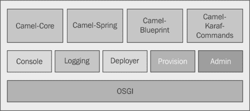
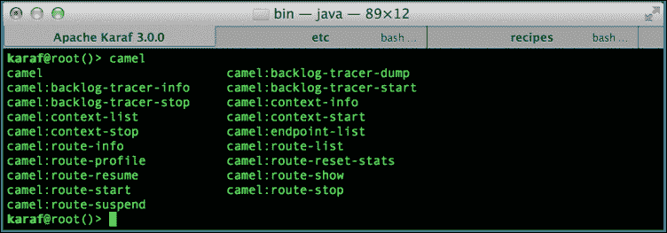
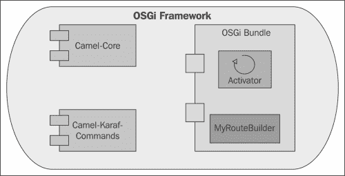
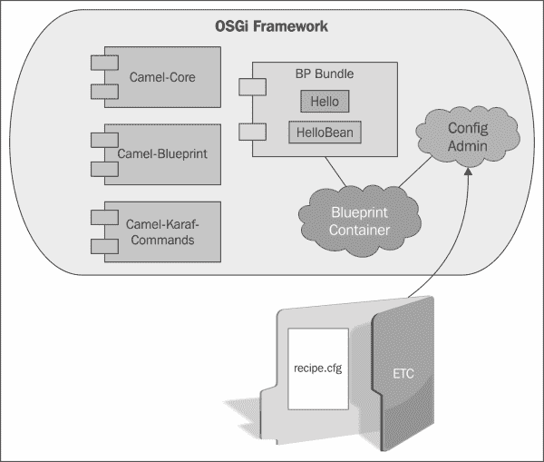
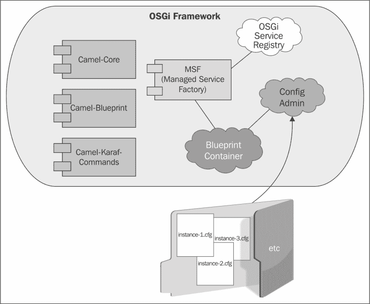
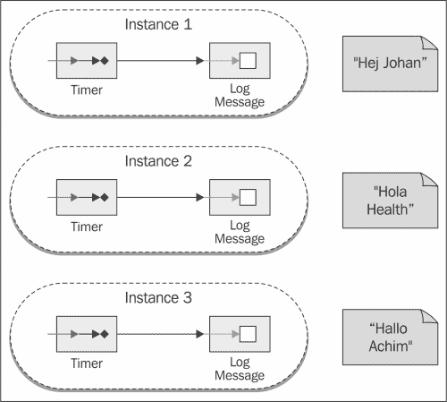

# 第二章：使用 Apache Camel 制作智能路由器

在本章中，我们将涵盖以下主题：

+   将 Apache Camel 模块安装到 Apache Karaf 中

+   在 Karaf 中列出 Camel 上下文

+   在 Karaf 中显示 Camel 上下文信息

+   在 Karaf 中启动和停止 Camel 上下文

+   在 Karaf 中列出路由

+   在 Karaf 中显示路由信息

+   在 Karaf 中启动、停止、挂起和恢复路由

+   在 Karaf 中列出端点

+   制作一个纯 Java 基于的 Camel 路由器以在 Karaf 中部署

+   创建基于 Blueprint 的 Camel 路由器以在 Karaf 中部署

+   将配置管理器添加到基于 Blueprint 的 Camel 路由器

+   创建 Camel 路由器的托管服务工厂实现

# 简介

Apache Karaf 提供了一个友好的基于 OSGi 的容器环境，用于部署、管理和最重要的是享受您的应用程序。在 Karaf 上托管的项目中，更常见的是基于 Apache Camel 的路由器。在本章中，我们将探讨一些食谱，帮助您快速、轻松、愉快地使用 Camel 在 Karaf 上。

在我们继续之前，让我们更仔细地看看 Apache Camel。

Apache Camel 提供了一个基于规则的 Java 路由和中介引擎，实现了*企业集成模式（EIPs*），如*企业集成模式：设计、构建和部署消息解决方案*，*Gregor Hohpe 和 Bobby Woolf*，*Addison Wesley*中所述。Camel 库的一个关键特性是其特定领域的语言，用于配置路由器和中介。这允许在集成开发环境中进行类型安全的规则完成，从而大大节省时间并减少复杂性。

### 小贴士

本章的目的是探索 Apache Camel-Apache Karaf 集成。要深入了解企业集成模式和 Camel，请阅读 Packt Publishing 出版的*Apache Camel 开发者食谱*、*Instant Apache Camel Messaging System*或*Instant Apache Camel Message Routing*。

# 将 Apache Camel 模块安装到 Apache Karaf 中

在我们开始探索如何构建 Camel-Karaf 智能路由器之前，我们必须首先将所有必需的 Camel 模块安装到 Karaf 容器中。

## 准备工作

本食谱的成分包括 Apache Karaf 发行套件、对 JDK 的访问和互联网连接。

## 如何操作…

1.  首先，我们使用以下命令将 Camel 功能 URL 添加到我们的 Karaf 安装功能仓库中：

    ```java
    karaf@root()> feature:repo-add mvn:org.apache.camel.karaf/apache-camel/2.12.2/xml/features
     Adding feature url mvn:org.apache.camel.karaf/apache-camel/2.12.2/xml/features
    karaf@root()>

    ```

    ### 小贴士

    或者，您可以使用`feature:repo-add camel 2.12.2`命令。

    在添加功能 URL 后，Karaf 将准备好安装所有 Apache Camel 依赖项。如果您想查看所有安装目标，请发出`feature:list | grep –i camel`命令。

1.  下一步是将基础 Camel 功能安装到 Karaf 中。我们通过执行`feature:install`命令和功能名称来安装功能，如下面的命令所示：

    ```java
    karaf@root()>  feature:install camel

    ```

    我们可以通过执行 `list –t 0 | grep camel` 命令来验证安装，该命令将列出 Karaf 中安装的所有 Camel 组件（camel-core、camel-karaf-commands、camel-spring 和 camel-blueprint）。

## 它是如何工作的…

Apache Camel 社区为每个项目版本维护一个 Apache Karaf 功能描述符。当描述符文件通过 `feature:repo-add` 命令添加到 Karaf 中时，容器会处理其内容，使每个功能的目标可安装。以下图示显示了各种 Camel 打包如何在基础 Karaf 系统之上部署：



当安装特定功能（在本例中为 Camel）时（使用 `feature:install` 命令），Karaf 将使用适当的 URL 处理程序来获取所需资源并将它们安装到容器中，然后尝试将它们带到 `Started` 状态。如果你在 Karaf 控制台中执行 `list –t 0`，你会看到部署到容器中的 Camel 和所有其他工件。我们可以通过展示关键 Camel 工件部署在标准 Karaf 安装之上来更简单地描述 Camel 组件集成到 Karaf 中的过程。

## 参见

+   第一章 中 *将应用程序作为功能部署* 的配方，*为系统构建者准备的 Apache Karaf*

# 在 Karaf 中列出 Camel 上下文

将 Apache Camel 安装到 Apache Karaf 中包括一组自定义 Camel 命令，作为 `camel-karaf-commands` 打包的一部分。Camel 社区已经开发和维护了这些命令，以供 Karaf 用户使用，并因此帮助将 Camel 完全集成到 Karaf 体验中。以下截图列出了这些命令：



截至 Apache Camel 2.12.2，有 18 个 Camel-Karaf 命令（如前一个截图所示），在以下配方中，我们将探讨最常用的命令。

Camel 用户想要执行的一个常见任务是列出部署到 Karaf 容器中的所有 Camel 上下文。

## 准备工作

此配方的成分包括 Apache Karaf 分发套件、对 JDK、Maven 和源代码编辑器的访问。

为此配方开发了一个 Camel 示例应用程序，可在 [`github.com/jgoodyear/ApacheKarafCookbook/tree/master/chapter2/chapter2-recipe2`](https://github.com/jgoodyear/ApacheKarafCookbook/tree/master/chapter2/chapter2-recipe2) 找到。构建应用程序需要执行 Maven 安装，然后将组装好的打包部署到 Karaf 中（使用 `install –s mvn:com.packt/sample` 命令）。

按照在 *将 Apache Camel 模块安装到 Apache Karaf 中* 的配方中的说明操作，以提供操作示例代码的基本要求。我们将多次重用此配方的资源。

## 如何操作…

要列出 Karaf 中部署的所有 Camel 上下文，请执行 `camel:context-list` 命令：

```java
karaf@root()> camel:context-list
 Context               Status         Uptime 
 -------               ------         ------ 
 CamelCommandContext   Started        1 hour 44 minutes 
karaf@root()>

```

在之前的命令调用中，我们观察到示例 Camel 路由器的上下文名称被显示（在这个例子中，上下文名称是在 Blueprint 中设置的——有关详细信息，请参阅本配方的源代码）。

## 工作原理…

当通过 Camel 功能将 `camel-karaf-commands` 包安装到 Karaf 中时，Camel 命令将自动在 Karaf 控制台中可用。在底层，Camel 命令蓝图描述符被实例化，并且各种 Camel-Karaf 命令被连接到容器中。

当执行 `context-list` 命令时，显示每个已部署 Camel 上下文的上下文 ID 以及它们当前的状态，如果有的话，还有它们的运行时间。

## 更多内容…

Apache Camel 社区维护着他们命令的最新信息，您可以在[`camel.apache.org/karaf.html`](http://camel.apache.org/karaf.html)找到这些信息。

## 参见

+   *在 Karaf 中显示 Camel 上下文信息* 的配方

# 在 Karaf 中显示 Camel 上下文信息

Karaf 可以通过 `camel:context-info` 命令显示容器中部署的个别 Camel 上下文的详细信息。使用此命令可以发现上下文范围内的统计信息、行为、包含的组件等。

## 准备工作

按照本配方下的 *在 Karaf 中列出 Camel 上下文* 配方的 *准备工作* 部分的说明进行操作。

## 如何操作…

使用以下 `camel:context-info` 命令在 Karaf 控制台中检索上下文信息——请注意，可能会有大量输出生成：

```java
karaf@root()> camel:context-info CamelCommandContext 

```

输出结果如下：

```java
Camel Context CamelCommandContext
 Name: CamelCommandContext
 ManagementName: 123-CamelCommandContext
 Version: 2.12.2
 Status: Started
 Uptime: 1 hour 50 minutes
Statistics
 Exchanges Total: 1321
 Exchanges Completed: 1321
 Exchanges Failed: 0
 Min Processing Time: 0ms
 Max Processing Time: 6ms
 Mean Processing Time: 0ms
 Total Processing Time: 1110ms
 Last Processing Time: 1ms
 Delta Processing Time: 0ms
 Load Avg: 0.00, 0.00, 0.00
 Reset Statistics Date: 2014-02-27 16:01:41
 First Exchange Date: 2014-02-27 16:01:42
 Last Exchange Completed Date: 2014-02-27 17:51:43
 Number of running routes: 1
 Number of not running routes: 0

Miscellaneous
 Auto Startup: true
 Starting Routes: false
 Suspended: false
 Shutdown timeout: 300 sec.
 Message History: true
 Tracing: false

Properties

Advanced
 ClassResolver: org.apache.camel.core.osgi.OsgiClassResolver@2ffd5a29
 PackageScanClassResolver: org.apache.camel.core.osgi.OsgiPackageScanClassResolver@222a525c
 ApplicationContextClassLoader: BundleDelegatingClassLoader(sample [123])
Components
 mock
 bean
 timer
 properties

Dataformats

Languages
 simple

Routes
 CamelRoute-timerToLog

```

前面的 `camel:context-info` 调用表明，每个上下文都有大量数据可用；用户捕获此输出进行分析并不罕见。

## 工作原理…

`context-info` 命令连接到 Camel 自身的设施以访问上下文信息。检索后，数据随后被格式化以在 Karaf 控制台上显示。

## 参见

+   *在 Karaf 中启动和停止 Camel 上下文* 的配方

# 在 Karaf 中启动和停止 Camel 上下文

启动和停止包含 Camel 上下文的包可能非常繁琐；您可以使用 `camel:context-start` 和 `camel:context-stop` 命令来管理特定上下文。

## 准备工作

按照本配方下的 *在 Karaf 中列出 Camel 上下文* 配方的 *准备工作* 部分的说明进行操作。

## 如何操作…

在 Karaf 中管理 Camel 上下文很容易，但需要您熟悉两个命令，如下所示：

+   `camel:context-start contextName`：此命令用于启动上下文

+   `camel:context-stop contextName`：此命令用于停止上下文

以下 Camel 命令调用演示了停止上下文的结果：

```java
karaf@root()> camel:context-list
 Context               Status         Uptime 
 -------               ------         ------ 
 CamelCommandContext   Started        3.139 seconds 
karaf@root()> camel:context-stop CamelCommandContext 
karaf@root()> camel:context-list
karaf@root()>

```

## 工作原理…

上下文命令在 Camel 框架上操作，并不代表 OSGi 生命周期。根据您的应用程序，停止的上下文可能需要重新启动其宿主包。

## 参见

+   *在 Karaf 中列出路由* 的配方

# 在 Karaf 中列出路由

在 Apache Karaf 容器中部署数十个 Camel 路由是很常见的。为了使管理这些路由更容易，Apache Camel 提供了一个命令，通过 ID 列出所有 Camel 部署的路由。

## 准备就绪

按照本食谱的 *在 Karaf 中列出 Camel 上下文* 食谱的 *准备就绪* 部分的说明进行操作。

## 如何操作…

使用 `camel:route-list` 命令列出 Karaf 中部署的所有路由，如下所示：

```java
karaf@root()> camel:route-list 
 Context               Route                   Status 
 -------               -----                   ------ 
 CamelCommandContext   CamelRoute-timerToLog   Started 

```

前面的调用收集并显示在 Karaf 控制台上部署的所有路由。

## 它是如何工作的…

当执行 `route-list` 命令时，每个 Camel 上下文中每个路由的路由 ID 以及它们当前的状态都会显示出来。

### 小贴士

在开发路由时，分配一个描述性的 ID 以帮助简化管理。

## 相关链接

+   *在 Karaf 中显示路由信息* 食谱

# 在 Karaf 中显示路由信息

Apache Camel 提供了收集 Camel 上下文中部署的路由周围信息的机制。`route-info` 命令已提供，用于在 Karaf 控制台显示路由属性、统计信息和定义。

## 准备就绪

按照本食谱的 *在 Karaf 中列出 Camel 上下文* 食谱的 *准备就绪* 部分的说明进行操作。

## 如何操作…

使用以下 `camel:route-info routeId` 命令在 Karaf 控制台显示 Camel 路由的信息；类似于 `camel:context-info` 命令，此命令可能会生成大量输出：

```java
karaf@root()> camel:route-info CamelRoute-timerToLog 
Camel Route CamelRoute-timerToLog
 Camel Context: CamelCommandContext

Properties
 id = CamelRoute-timerToLog
 parent = 20443040

Statistics
 Inflight Exchanges: 0
 Exchanges Total: 44
 Exchanges Completed: 44
 Exchanges Failed: 0
 Min Processing Time: 0 ms
 Max Processing Time: 2 ms
 Mean Processing Time: 0 ms
 Total Processing Time: 38 ms
 Last Processing Time: 1 ms
 Delta Processing Time: 0 ms
 Load Avg: 0.00, 0.00, 0.00
 Reset Statistics Date: 2014-02-27 17:59:46
 First Exchange Date: 2014-02-27 17:59:47
 Last Exchange Completed Date: 2014-02-27 18:03:22

Definition
<?xml version="1.0" encoding="UTF-8" standalone="yes"?>
<route customId="true" id="CamelRoute-timerToLog" >
 <from uri="timer:foo?period=5000"/>
 <setBody id="setBody8">
 <method ref="helloBean" method="hello"></method>
 </setBody>
 <log message="The message contains ${body}" id="log8"/>
 <to uri="mock:result" id="to8"/>
</route>

karaf@root()>

```

前面的调用显示了当我们的示例 Camel 应用程序的路由显示时生成的输出。

## 它是如何工作的…

Apache Camel 提供了跟踪路由统计信息的机制；`route-info` 命令连接到这些设施，向 Karaf 控制台提供路由信息。注意在路由定义中各种 ID 后附加的 `8`，这是 Camel 生成的，以帮助区分不同的组件并避免名称冲突。原始路由定义将不会携带此值。

## 相关链接

+   *在 Karaf 中启动、停止、挂起和恢复路由* 食谱

# 在 Karaf 中启动、停止、挂起和恢复路由

Apache Camel 为用户提供了对 Camel 上下文中部署的路由的精细控制，因此为 Karaf 提供了访问这些控制的功能。这些管理设施独立于 OSGi 的生命周期模型，允许用户选择当前正在执行的小部分 Camel 代码来启动、停止、挂起和恢复操作。

## 准备就绪

按照本食谱的 *在 Karaf 中列出 Camel 上下文* 食谱的 *准备就绪* 部分的说明进行操作。

## 如何操作…

在 Karaf 中管理 Camel 路由很简单，需要你熟悉以下四个命令：

+   `camel:route-start routeName`：此命令用于启动一个路由

+   `camel:route-stop routeName`：此命令用于停止一个路由

+   `camel:route-suspend routeName`：此命令用于挂起一个路由

+   `camel:route-resume routeName`：此命令用于恢复挂起的路由

为了使这些命令更清晰，让我们回顾如何使用*在 Karaf 中列出 Camel 上下文*食谱中提供的示例 Camel 应用程序来使用它们。

在以下调用中，我们列出 Karaf 中部署的所有 Camel 路由，然后对`CamelRoute-timerToLog`（我们的示例 Camel 应用程序）发出停止命令。我们可以观察到它将路由的状态从`Started`更改为`Stopped`。这可以通过以下命令完成：

```java
karaf@root()> camel:route-list
 Context               Route                   Status 
 -------               -----                   ------ 
 CamelCommandContext   CamelRoute-timerToLog   Started 
karaf@root()> camel:route-stop CamelRoute-timerToLog
karaf@root()> camel:route-list
 Context               Route                   Status 
 -------               -----                   ------ 
 CamelCommandContext   CamelRoute-timerToLog   Stopped 

```

然后，我们可以使用`route-start`命令将路由恢复到`Started`状态，如下面的命令片段所示：

```java
karaf@root()> camel:route-start CamelRoute-timerToLog 
karaf@root()> camel:route-list
 Context               Route                   Status 
 -------               -----                   ------ 
 CamelCommandContext   CamelRoute-timerToLog   Started 

```

我们现在可以通过`route-suspend`命令挂起路由，并确认命名路由进入`Suspended`状态，如下面的命令片段所示：

```java
karaf@root()> camel:route-suspend CamelRoute-timerToLog 
karaf@root()> camel:route-list
 Context               Route                   Status 
 -------               -----                   ------ 
 CamelCommandContext   CamelRoute-timerToLog   Suspended 

```

最后，我们可以使用`route-resume`命令将挂起的路由恢复到`Started`状态，如下面的命令片段所示：

```java
karaf@root()> camel:route-resume CamelRoute-timerToLog 
karaf@root()> camel:route-list
 Context               Route                   Status 
 -------               -----                   ------ 
 CamelCommandContext   CamelRoute-timerToLog   Started 
karaf@root()>

```

## 它是如何工作的…

Camel 路由管理命令是从 Camel 上下文的角度工作的，独立于 OSGi 生命周期。在执行命令期间，宿主包的 OSGi 状态不受影响。这为用户提供了一种细粒度的管理方法，允许宿主包及其上下文（s）保持运行，仅操作一个或多个路由。

## 参见

+   *在 Karaf 中启动和停止 Camel 上下文*的食谱

# 在 Karaf 中列出端点

Apache Camel 用户使用端点来表示事件和信息来自或去向的 URI。在 Karaf 中，`endpoint-list`命令已被提供，以帮助简化跟踪这些 URI。

## 准备工作

按照第*在 Karaf 中列出 Camel 上下文*食谱的*准备工作*部分的说明进行此食谱。

## 如何做…

使用`camel:endpoint-list`命令列出 Karaf 中的所有端点（如果您想限制输出到一个上下文的路由，请使用`camel:endpoint-list context-name`命令）。这如下面的命令所示：

```java
karaf@root()> camel:endpoint-list 
 Context               Uri                       Status 
 -------               ---                       ------ 
 CamelCommandContext   mock://result             Started 
 CamelCommandContext   timer://foo?period=5000   Started 

```

在前面的调用中，Karaf 中找到的所有端点都会显示（在这个例子中，端点是在 Blueprint 中设置的——有关详细信息，请参阅食谱的源代码）。

## 它是如何工作的…

当执行端点列表命令时，会扫描并列出每个 Camel 上下文中的所有路由到 Karaf 的控制台。

## 参见

+   *使用 Maven 存档创建我们自己的自定义 Karaf 命令*的第一章，*Apache Karaf for System Builders*

# 创建一个纯 Java 的 Camel Router 以在 Karaf 中部署

开发我们的第一个 Camel Router 以在 Karaf 中部署不一定需要使用大量的框架和库。在这个食谱中，我们将使用纯 Java 代码以及少量的 OSGi 和 Camel 库来创建 Camel 路由器。

## 准备工作

此食谱的成分包括 Apache Karaf 发行套件、对 JDK、Maven 和源代码编辑器的访问。此食谱的示例代码可在[`github.com/jgoodyear/ApacheKarafCookbook/tree/master/chapter2/chapter2-recipe3`](https://github.com/jgoodyear/ApacheKarafCookbook/tree/master/chapter2/chapter2-recipe3)找到。按照*将 Apache Camel 模块安装到 Apache Karaf*食谱中的说明，提供操作示例代码的基本要求。

## 如何做到这一点...

1.  第一步是创建一个基于 Maven 的项目。一个包含基本 Maven 坐标信息和包打包指令的`pom.xml`文件就足够了。

1.  下一步是将 Apache Camel 和 OSGi 依赖项添加到 POM 文件中。我们需要将`camel-core`和`org.osgi.core`工件依赖项添加到 POM 文件中。这将在以下代码中描述：

    ```java
    <dependencies>
        <dependency>
            <groupId>org.apache.camel</groupId>
            <artifactId>camel-core</artifactId>
            <version>${camel.version}</version>
        </dependency>
        <dependency>
            <groupId>org.osgi</groupId>
            <artifactId>org.osgi.core</artifactId>
            <version>${osgi.version}</version>
            <scope>provided</scope>
        </dependency>
    </dependencies>
    ```

    对于 Apache Karaf 3.0.0，我们使用 Camel 版本 2.12.2 和 OSGi 版本 5.0.0。

1.  接下来，我们添加我们的构建配置，如下所示：

    ```java
    <build>
        <plugins>
            <plugin>
                <groupId>org.apache.felix</groupId>
                <artifactId>maven-bundle-plugin</artifactId>
                <version>${maven-bundle-plugin.version}</version>
                <extensions>true</extensions>
                <configuration>
                    <instructions>
                        <Bundle-SymbolicName>
                        ${project.artifactId}
                        </Bundle-SymbolicName>
                        <Bundle-Version>
                        ${project.version}
                        </Bundle-Version>
     <Bundle-Activator>
     com.packt.Activator
     </Bundle-Activator>
                        <Export-Package>
                        com.packt*;version=${project.version}
                        </Export-Package>
                        <Import-Package>*</Import-Package>
                    </instructions>
                </configuration>
            </plugin>
        </plugins>
    </build>
    ```

    我们使用`maven-bundle-plugin`来构建我们的包，添加`Bundle-Activator`指令。当包部署到 Karaf 中时，OSGi 容器将调用`com.packt.Activator`类中包含的启动和停止方法。

1.  下一步是实现 OSGi BundleActivator。现在我们已经建立了一个基本的项目结构，我们可以实现我们的 Java 代码。我们首先在`src/main/java/com/packt`文件夹中创建`Activator.java`文件。

    我们编写的`Activator`类将实现`BundleActivator`接口。`BundleActivator`接口实现了 OSGi 容器在启动或停止包时调用的方法。我们将使用包的启动和停止方法来控制 Camel Context 的创建、Camel 路由的添加以及路由的实际启动和停止。有关 Apache Camel 的更多详细信息，请访问[`camel.apache.org`](http://camel.apache.org)。以下是一个示例代码：

    ```java
    public void start(BundleContext context) {
        System.out.println("Starting the bundle");
     camelContext = new DefaultCamelContext();
        try {
     camelContext.addRoutes(new MyRouteBuilder());
     camelContext.start();
        }
        catch (Exception ex) {
            // Use logging subsystem in non-sample code.
            System.out.println("Exception occured! " + ex.getMessage());
        }
    }
    ```

    当我们的激活器接口启动时，我们将创建一个新的`CamelContext`对象，然后尝试添加一个`MyRouteBuilder`函数（这创建了一个 Camel 路由），然后启动上下文及其包含的路由。以下是一个示例代码：

    ```java
    public void stop(BundleContext context) {
        System.out.println("Stopping the bundle");
        if (camelContext != null) {
            try { 
     camelContext.stop();
            }
            catch (Exception ex) {
                System.out.println("Exception occurred during stop context.");
            }
        }
    }
    ```

    当我们的激活器接口停止时，我们首先检查我们的`CamelContext`对象是否为 null，然后尝试调用其上的`stop`函数。当上下文停止时，其中包含的所有路由也会停止。

1.  接下来，我们实现我们的 Camel Router。我们的 Camel Router 定义在一个自定义路由构建器中，我们从这个 Camel 的`RouteBuilder`类扩展。以下是一个示例代码：

    ```java
    public class MyRouteBuilder extends RouteBuilder {

        public void configure() {

            from("file:src/data?noop=true")
                .choice()
                    .when(xpath("/recipe = 'cookie'"))
                        .log("Cookie  message")
                        .to("file:target/messages/cookies")
                    .otherwise()
                        .log("Other message")
                        .to("file:target/messages/others");
        }

    }
    ```

    `MyRouteBuilder`类扩展了 Camel 的`RouteBuilder`类，它提供了路由配置接口。我们使用基于 Java 的 DSL 在`configure`方法中添加一个 Camel 路由定义。

1.  下一步是构建和部署我们的 Camel 路由器到 Karaf。现在我们已经实现了我们的构建配置（POM 文件），将其与 OSGi 运行时（`Activator` 类）绑定，并实现了我们的 Camel 路由器（`MyRouteBuilder` 类），我们可以继续编译和部署代码到 Karaf。我们的第一步是调用 `mvn install`，然后在 Karaf 控制台中执行 `install –s mvn:com.packt/osgi` (`mvn:groupId/artifactId`)。

1.  作为最后一步，我们准备测试我们的 Camel 路由器！一旦我们的路由器包在 Karaf 中安装并激活，你将在 `KARAF_HOME` 文件夹中看到一个 `src/data` 文件夹。我们的示例路由器配置处理基于 XML 的食谱文件。当它看到饼干食谱（`<recipe>cookie</recipe>`）时，它将一个副本放在 `KARAF_HOME/target/messages/cookies` 文件夹中；否则，它将该副本放在 `KARAF_HOME/target/message/other` 文件夹中。

## 它是如何工作的…

我们基于纯 Java 的 Camel 路由器通过利用 OSGi 的 BundleActivator 启动和停止接口以及直接使用 Apache Camel 库来工作。当部署到 Karaf 中时，我们可以可视化以下图中显示的相关组件：



当一个包在一个 OSGi 容器中启动时，它将调用其 `Bundle-Activator` 类的 `start` 方法。我们的示例项目将其配置为 `com.packt.Activator` 类。我们重用 Activator 的启动和停止方法来控制 Camel 上下文，该上下文包含由我们的 `RouteBuilder` 类实现构建的 Camel 路由器。

## 参见

+   基于 Karaf 部署的“创建蓝图模式的 Camel 路由器”食谱

# 为 Karaf 部署创建基于蓝图模式的 Camel 路由器

蓝图为 OSGi 提供了一个依赖注入框架。许多用户会发现它与 Spring 框架有相似之处。然而，蓝图已被设计来处理 OSGi 的动态运行时，其中服务经常来来去去。

标准的 Apache Camel-Karaf 功能包含用户立即开始使用蓝图连接路由所需的 Camel-Blueprint 库。在本食谱中，我们将构建一个 Camel 路由器，利用蓝图控制反转框架的优势。

## 准备就绪

本食谱的成分包括 Apache Karaf 分发套件、对 JDK、Maven 和源代码编辑器的访问。本食谱的示例代码可在[`github.com/jgoodyear/ApacheKarafCookbook/tree/master/chapter2/chapter2-recipe4`](https://github.com/jgoodyear/ApacheKarafCookbook/tree/master/chapter2/chapter2-recipe4)找到。按照“将 Apache Camel 模块安装到 Apache Karaf”食谱中“准备就绪”部分的说明，提供操作示例代码的基本要求。

## 如何操作…

Apache Camel 社区为用户提供了一个 Maven 架构来生成基于蓝图的 OSGi Camel 路由器：

1.  第一步是使用 Maven 原型生成 Camel Blueprint 项目。我们可以通过调用以下命令片段中的原型来创建我们的项目：

    ```java
    mvn archetype:generate \
     -DarchetypeGroupId=org.apache.camel.archetypes \
     -DarchetypeArtifactId=camel-archetype-blueprint \
     -DarchetypeVersion=2.12.2 \
     -DarchetypeRepository=https://repository.apache.org/content/groups/snapshots-group

    ```

    在生成过程中，你将被要求提供`groupId`、`artifactId`和项目`version`值。

    此原型调用将生成一个 POM 文件、一个 Hello 接口的 Java 源代码以及实现 HelloBean 的 Blueprint 描述符 XML 文件，以及一个示例单元测试。接口和 bean 组件纯粹用于示例目的；在现实世界的开发场景中，你将删除这些工件。

1.  下一步是将项目构建并部署到 Karaf 中。要构建项目，我们调用`mvn install`命令。这将把我们的 bundle 填充到你的本地`m2`仓库中。要安装示例，请在 Karaf 控制台执行以下命令：

    ```java
    karaf@root()> bundle:install –s mvn:com.packt/bp/1.0.0-SNAPSHOT

    ```

    在前面的命令中，我们用格式`mvn:{groupId}/{artifactID}/{version}`替换你的 Maven 坐标。

1.  最后一步是验证路由功能。一旦安装并启动（使用`start BundleID`命令），你将在你的 Karaf 日志文件中观察到以下条目：

    ```java
    2014-02-06 10:00:49,074 | INFO  | Local user karaf | BlueprintCamelContext            | 85 - org.apache.camel.camel-core - 2.12.2 | Total 1 routes, of which 1 is started.
    2014-02-06 10:00:49,075 | INFO  | Local user karaf | BlueprintCamelContext            | 85 - org.apache.camel.camel-core - 2.12.2 | Apache Camel 2.12.2 (CamelContext: blueprintContext) started in 0.357 seconds
    2014-02-06 10:00:50,075 | INFO  | 12 - timer://foo | timerToLog       | 85 - org.apache.camel.camel-core - 2.12.2 | The message contains Hi from Camel at 2014-02-06 10:00:50
    ```

## 工作原理…

当我们的项目 bundle 部署到 Karaf 中时，项目的依赖关系被解决，在启动时，Blueprint 描述符文件被处理，对象被实例化并填充到 Blueprint 容器中。以下图表突出了在 Karaf 中部署的组件的高级视图：


给定在 Blueprint 容器中成功实例化的服务，容器内嵌入的`CamelContext`对象将自动启动。

## 更多内容…

Apache Camel 项目还提供了 Camel-Spring 库，作为其标准功能部署的一部分。Spring 框架可以在 Karaf 环境中工作，但通常更倾向于使用 Blueprint 或声明性服务。

## 参见

+   *将配置管理添加到基于 Blueprint 的 Camel 路由器*菜谱

# 将配置管理添加到基于 Blueprint 的 Camel 路由器

Blueprint 允许我们将一些配置元素从我们的代码中外部化；我们可以通过利用 OSGi 配置管理服务（通常称为配置管理）来将这一过程提升到下一个层次。

配置管理服务为 OSGi 容器中的服务提供配置属性。在 Apache Karaf 中，通过包括 Apache Felix File Install 目录管理代理来改进这一功能。File Install 监控一个目录，可以自动安装和启动一个 bundle 或对配置管理进行配置文件更新。

### 注意

Apache Felix File Install 提供了 Karaf 的`deploy`和`etc`文件夹背后的魔法，自动处理文件在添加、删除或更新时的操作。

在这个菜谱中，我们将集成配置管理服务到我们的基于 Blueprint 的 Camel 项目中。

## 准备工作

此配方所需的配料包括 Apache Karaf 发行套件、对 JDK、Maven 和源代码编辑器的访问。此配方的示例代码可在[`github.com/jgoodyear/ApacheKarafCookbook/tree/master/chapter2/chapter2-recipe5`](https://github.com/jgoodyear/ApacheKarafCookbook/tree/master/chapter2/chapter2-recipe5)找到。按照*将 Apache Camel 模块安装到 Apache Karaf*配方中的说明，提供操作示例代码的基本要求。

## 如何做到这一点...

Apache Camel 社区为其用户提供了一个 Maven 存档来生成基于蓝图的 OSGi Camel 路由器。我们将以此作为起点来构建我们的项目，并添加所需的支持配置管理员的功能：

1.  第一步是使用 Maven 存档生成 Camel 蓝图项目。我们可以通过以下方式调用存档来创建我们的项目：

    ```java
    mvn archetype:generate \
     -DarchetypeGroupId=org.apache.camel.archetypes \
     -DarchetypeArtifactId=camel-archetype-blueprint \
     -DarchetypeVersion=2.12.2 \ 
     -DarchetypeRepository=https://repository.apache.org/content/groups/snapshots-group

    ```

    在生成过程中，您将被要求提供`groupId`、`artifactId`和项目`version`值。

    这将生成一个 POM 文件、实现 Hello 接口的 Java 源代码以及实现 HelloBean 的蓝图描述符 XML 文件，以及一个示例单元测试。

1.  现在我们已经有一个基本的项目结构，让我们修改它以使用配置管理员。由于我们使用蓝图，我们只需要修改位于`src/main/resources/OSGI-INF/blueprint`文件夹中的描述符文件。

    我们的第一步是添加一个额外的命名空间用于配置管理员，如下面的代码所示：

    ```java
    <blueprint 

            xsi:schemaLocation="
            http://www.osgi.org/xmlns/blueprint/v1.0.0
            http://www.osgi.org/xmlns/blueprint/v1.0.0/blueprint.xsd
     http://aries.apache.org/blueprint/xmlns/blueprint-cm/v1.1.0
            http://camel.apache.org/schema/blueprint http://camel.apache.org/schema/blueprint/camel-blueprint.xsd">
    ```

    我们将使用`cm`命名空间来访问配置管理。

1.  下一步是修改蓝图文件中的 bean 连接，以使用配置管理员变量。我们更新提供的`HelloBean` bean 以接受一个配置变量，如下面的代码所示：

    ```java
    <bean id="helloBean" class="com.packt.HelloBean">
     <property name="say" value="${greeting}"/>
    </bean>
    ```

    变量使用语法`${variable-name}`。

1.  现在，我们可以添加我们的配置管理员引用，如下所示：

    ```java
    <!-- OSGI blueprint property placeholder -->
    <!-- etc/recipe.cfg -->
    <cm:property-placeholder persistent-id="recipe" update-strategy="reload">

        <!-- list some properties for this test -->
     <cm:default-properties>
     <cm:property name="greeting" 
     value="Hello World"/>
     <cm:property name="result" 
     value="mock:result"/>
        </cm:default-properties>
    </cm:property-placeholder>
    ```

    在这里，我们将配置管理行为设置为在配置更新时重新加载应用程序。然后，我们为在蓝图文件中使用的两个变量提供默认值。我们还设置了一个`persistent-id`占位符，我们可以与 Karaf 的`etc`文件夹结合使用，以提供动态外部配置。在前面提供的代码中，我们可以在`etc`文件夹中创建一个`recipe.cfg`文件，该文件包含`greeting`和`result`属性。

    ### 小贴士

    当编写 Apache Karaf 功能描述符时，您可以将配置文件添加到功能将安装的资源列表中。

1.  下一步是更新蓝图中的 Camel 上下文以使用配置管理员变量。这可以通过以下方式完成：

    ```java
    <camelContext id="blueprintContext" trace="false" >
        <route id="timerToLog">
            <from uri="timer:foo?period=5000"/>
            <setBody>
     <method ref="helloBean" method="hello"/>
            </setBody>
            <log message="The message contains ${body}"/>
     <to uri="{{result}}"/>
        </route>
    </camelContext>
    ```

    我们的 Camel 路由包含一个直接修改：引入一个`{{result}}`变量。Camel 使用双大括号语法来表示外部变量。`helloBean`引用保持不变。然而，它的运行时行为现在是使用蓝图描述符中的默认变量或配置管理员提供的值。

1.  下一步是构建和部署项目到 Karaf 中。要构建项目，我们调用 `mvn install` 命令。这将把我们的包填充到你的本地 `m2` 仓库中。要安装示例，请在 Karaf 控制台中执行以下命令：

    ```java
    karaf@root()> bundle:install –s mvn:com.packt/bp-configadmin/1.0.0-SNAPSHOT

    ```

    在前面的命令中，我们将你的 Maven 坐标替换为 `mvn:{groupId}/{artifactID}/{version}` 格式。

1.  最后一步是验证路由功能。一旦路由器安装并启动，你将在你的 Karaf 日志文件中观察到以下形式的条目：

    ```java
    2014-02-06 13:36:01,892 | INFO  | Local user karaf | BlueprintCamelContext | 85 - org.apache.camel.camel-core - 2.12.2 | Total 1 routes, of which 1 is started.
    2014-02-06 13:36:01,892 | INFO  | Local user karaf | BlueprintCamelContext | 85 - org.apache.camel.camel-core - 2.12.2 | Apache Camel 2.12.2 (CamelCon: blueprintContext) started in 0.272 seconds
    2014-02-06 13:36:02,891 text| INFO  | 15 - timer://foo | timerToLog | 85 - org.apache.camel.camel-core - 2.12.2 |   The message contains Hello World at2014-02-06 13:36:02 
    ```

    ### 小贴士

    更改变量值需要编辑 Blueprint 文件并在 Karaf 中刷新包。然而，对配置文件中值的更改几乎会立即被捕获。

## 如何工作…

这个脚本通过引入 Configuration Admin 到设计中扩展了 *在 Karaf 中部署的基于 Blueprint 的 Camel 路由* 脚本。以下图表突出了在 Karaf 中部署的组件的高级视图：



将 Configuration Admin 添加到 Blueprint 中，将 Camel 路由暴露给外部配置。这个外部配置在 Karaf 的 `etc` 文件夹中表现为 Java 属性文件。

那么，我们如何将属性文件关联到我们的 Blueprint 规范中的 Configuration Admin 引用呢？这是通过在 Configuration Admin 属性占位符的 Blueprint 定义中设置持久化 ID 来实现的。在我们的演示代码中，我们使用持久化 ID 脚本——在我们的 `etc` 文件夹中，我们会使用一个名为 `recipe.cfg` 的相应文件。

我们如何使用属性名值对？我们在 Blueprint 定义中包含默认的名值对。如果提供了值，这些值将被 Configuration Admin 自动覆盖。我们使用单大括号在 beans 中访问它们的值，在 Blueprint 定义的 Camel 上下文中使用双大括号。

## 参见

+   *创建 Camel 路由的托管服务工厂实现* 脚本

# 创建 Camel 路由的托管服务工厂实现

在这个脚本中，我们将介绍 OSGi 模式 ManagedServiceFactory 接口在 Apache Camel 智能路由器中的强大功能。这个模式将允许我们通过配置管理多个服务实例，或者在我们的情况下，Camel 路由。实际上，我们将为每个提供给服务工厂的配置生成一个新的路由器实例！

## 准备工作

这个脚本的配料包括 Apache Karaf 分发套件、对 JDK、Maven 和源代码编辑器的访问。这个脚本的示例代码可在 [`github.com/jgoodyear/ApacheKarafCookbook/tree/master/chapter2/chapter2-recipe6`](https://github.com/jgoodyear/ApacheKarafCookbook/tree/master/chapter2/chapter2-recipe6) 找到。按照 *将 Apache Camel 模块安装到 Apache Karaf* 脚本中的说明，提供操作示例代码的基本要求。

## 如何操作…

这个配方将比我们之前的配方稍微复杂一些。强烈建议您按照提供的示例代码进行操作：

1.  首先，使用我们在之前的配方中使用的便捷 Maven 存档创建一个基于 Blueprint 的 Camel 项目（参见*在 Karaf 中部署基于 Blueprint 的 Camel Router*配方）。我们将以此为基础构建项目，根据需要删除和/或修改资源。

1.  下一步是在 POM 文件中添加依赖项。我们将编辑 POM 文件，添加对 OSGi 核心和组合库的依赖，如下面的代码所示：

    ```java
    <dependency>
        <groupId>org.osgi</groupId>
        <artifactId>org.osgi.core</artifactId>
        <version>${osgi-core-version}</version>
    </dependency>
    <dependency>
        <groupId>org.osgi</groupId>
        <artifactId>org.osgi.compendium</artifactId>
        <version>${osgi-compendium-version}</version>
    </dependency>
    ```

    对于 Apache Karaf 3.0.0，我们使用 OSGi 核心和组合库版本 5.0.0。

1.  现在，我们将修剪生成的项目结构。我们将删除预先填充的`blueprint.xml`文件、`main`文件夹和`test`文件夹。

1.  现在，我们将在`src/main/java`文件夹中实现我们的 ManagedServiceFactory 接口。为此，我们将创建一个实现 ManagedServiceFactory 接口的工厂类，并将一个调度器插入到这个框架中，该框架将处理 Camel 路由的构建和执行。我们将在本配方的*工作原理*部分详细说明这些类的复杂性。

    ### 小贴士

    OSGi 组合库 rev 5 的 ManagedServiceFactory 接口可以在 OSGi 联盟网站上找到，网址为[`www.osgi.org/javadoc/r5/cmpn/org/osgi/service/cm/ManagedServiceFactory.html`](http://www.osgi.org/javadoc/r5/cmpn/org/osgi/service/cm/ManagedServiceFactory.html)。

1.  接下来，我们在`src/main/resources`文件夹中创建一个 Blueprint 文件，将配置管理器、Camel 上下文和我们的`Factory`类连接起来。

    ```java
    <blueprint 

        xsi:schemaLocation="
        http://www.osgi.org/xmlns/blueprint/v1.0.0
        http://www.osgi.org/xmlns/blueprint/v1.0.0/blueprint.xsd
        http://camel.apache.org/schema/blueprint 
        http://camel.apache.org/schema/blueprint/camel-blueprint.xsd">

      <!—- Setup process Id name for configuration file -->
      <cm:property-placeholder persistent-id="com.packt.hellofactory" update-strategy="reload">
        <cm:default-properties>
            <cm:property name="com.packt.hellofactory.pid" value="com.packt.hellofactory"/>
        </cm:default-properties>
      </cm:property-placeholder>

      <!—- Create Camel Context -->
      <camelContext id="helloContext"  autoStartup="true">
      </camelContext>

      <!—- Setup Bean, wiring in contexts, andconfiguration data  -->
      <bean id="apacheKarafCookbook" class="com.packt.HelloFactory" init-method="init" destroy-method="destroy">
        <property name="bundleContext" ref="blueprintBundleContext"/>
        <property name="configurationPid"       value="${com.packt.hellofactory.pid}"/>
        <property name="camelContext" ref="helloContext"/>
      </bean>

    </blueprint>
    ```

    上一段代码中的 Blueprint 文件包含所需的一般结构元素；我们将在本配方中的*工作原理*部分详细说明这些条目的细节。

1.  下一步是构建和部署路由到 Karaf。我们将把这个组装作为一个包构建并部署到 Karaf 中，并在`etc`文件夹中提供配置文件。配置文件的形式为`PID-name.cfg`，其内容为 Java 风格的属性。

    要构建我们的示例项目，请执行`mvn install`命令。部署将需要以下两个命令：

    ```java
    karaf@root()> install -s mvn:commons-lang/commons-lang/2.6
    karaf@root()> install -s mvn:com.packt/msf/1.0.0-SNAPSHOT

    ```

1.  我们对 Camel Router 的 ManagedServiceFactory 实现现在已准备好使用。最后一步是为我们的路由实例创建配置。考虑以下`etc/com.packt.hellofactory-test1.cfg`文件的示例配置：

    ```java
    HELLO_GREETING=hello 
    HELLO_NAME=Jamie
    ```

    还要考虑以下`etc/com.packt.hellofactory-test2.cfg`文件的条目：

    ```java
    HELLO_GREETING=hi 
    HELLO_NAME=Laura 
    ```

    在运行适当的命令后，这些示例配置将产生以下输出：

    ```java
    karaf@root()> camel:route-list 
     Context        Route          Status 
     -------        -----          ------ 
     helloContext   Hello Jamie    Started 
     helloContext   Hello Laura    Started 
    karaf@root()> log:display
    hello Jamie
    hi Laura

    ```

现在我们已经回顾了构建 Camel Router 的 ManagedServiceFactory 实现的高级流程，让我们深入探讨它是如何以及为什么能工作的。

## 工作原理…

实现了 ManagedServiceFactory 接口的包连接到配置管理器服务的构建和配置包实例的能力。在我们的示例项目中，我们使用此功能根据提供的配置创建新的路由实例。

每个服务（路由）实例由一个称为 PID 的工厂配置表示。当给定的 PID 更新时，配置管理器将调用工厂的更新方法。如果传入新的 PID，则创建新实例；如果 PID 存在，则更新其配置。以下图表突出了在 Karaf 中部署的组件的高级视图：



当我们将 Camel 组件和示例项目部署到 Karaf 中时，我们将通过 Blueprint 将 MSF 包和配置管理器连接起来。在底层，MSF 包由三个类组成：`HelloConstants`、`HelloDispatcher`和`HelloFactory`。

`HelloFactory`类实现了 ManagedServiceFactory 接口。在我们的示例项目中，我们重写了`getName()`、`updated(String pid, Dictionary dict)`和`deleted(String pid)`方法。然后，我们提供了初始化和销毁方法来清理我们的路由器。最后，我们提供了设置器来连接我们的 PID、`bundleContext`和`camelContext`对象。让我们更详细地看看`HelloFactory`类中的核心接口实现。考虑以下代码：

```java
@Override
public String getName() {
    return configurationPid;
}
```

我们重写了`getName()`方法，返回我们的配置 PID，如前述代码所示。考虑以下代码：

```java
@Override
public void updated(String pid, Dictionary dict) 
        throws ConfigurationException {
        log.info("updated " + pid + " with " + dict.toString());
        HelloDispatcher engine = null;

        if (dispatchEngines.containsKey(pid)) {
            engine = dispatchEngines.get(pid);

            if (engine != null) {
                destroyEngine(engine);
            }
            dispatchEngines.remove(pid);
        }
```

在前述代码中的`updated`方法中，我们首先设置我们的`HelloDispatcher`引擎。维护一个`<PID, HelloDispatcher>`映射，我们使用它来内部跟踪我们的 Camel 路由器。如果我们有分配给调度器的 PID 条目，那么我们安全地销毁现有的引擎，以便可以构建一个新的。现在，考虑以下代码：

```java
    //Verify dictionary contents before applying them to Hello
if (dict.get(HelloConstants.HELLO_GREETING) != null && !StringUtils.isEmpty(dict.get(HelloConstants.HELLO_GREETING).toString())) {
  log.info("HELLO_GREETING set to " + dict.get(HelloConstants.HELLO_GREETING));
} else {
  throw new IllegalArgumentException("Missing HELLO_GREETING");
}

if (dict.get(HelloConstants.HELLO_NAME) != null && !StringUtils.isEmpty(dict.get(HelloConstants.HELLO_NAME).toString())) {
  log.info("HELLO_NAME set to " + dict.get(HelloConstants.HELLO_NAME));
} else {
  throw new IllegalArgumentException("Missing HELLO_NAME");
}
```

然后，我们验证在配置管理器提供的属性字典中是否存在所需的配置条目。这些字典是在配置文件放置在 Karaf 的`etc`文件夹时构建的。请看以下代码：

```java
    //Configuration was verified above, now create engine.
engine = new HelloDispatcher();
engine.setCamelContext(camelContext);
engine.setGreeting(dict.get(HelloConstants.HELLO_GREETING).toString());
engine.setName(dict.get(HelloConstants.HELLO_NAME).toString());

dispatchEngines.put(pid, engine);
log.debug("Start the engine...");
if (engine == null) {
    log.debug("Engine was null, check configuration.");
}
 engine.start();
}
```

然后，`updated`方法创建并配置一个新的`HelloDispatcher`对象，并开始操作它。现在，考虑以下代码：

```java
@Override
public void deleted(String pid) {
    if (dispatchEngines.containsKey(pid)) {
        HelloDispatcher engine = dispatchEngines.get(pid);

        if (engine != null) {
            destroyEngine(engine);
    }
        dispatchEngines.remove(pid);
    }
    log.info("deleted " + pid);
}
```

当 PID 被移除时，`deleted`方法安全地清理所有当前正在执行的`HelloDispatcher`对象（我们的路由器）。

为了将`HelloFactory`对象集成到容器中，我们包含了`init`和`destroy`方法。`init`调用用于将 ManagedServiceFactory 接口与注册服务注册，并在 ManagedServiceFactory 接口包和 Configuration Admin 服务之间建立 ServiceTracker 连接（这是一个实用工具类，它简化了从服务注册表中处理服务引用的工作）。`destroy`调用的主要功能是通过从 registerService 安全注销包并关闭其`ServiceTracker`对象来清理。

`HelloDispatcher`对象实现了我们的 Camel 路由器。我们提供了启动和停止方法，用于将我们的 Camel 路由实例集成到现有的 Camel 上下文中。我们还提供了设置我们的参数和指定我们想要部署路由的 Camel 上下文的方法。最后，我们提供了一个机制，通过该机制我们的 Camel 路由将被构建。让我们更详细地看看`HelloDispatcher`对象中的路由构建器。如下代码所示：

```java
protected RouteBuilder buildHelloRouter() throws Exception {

    return new RouteBuilder() {

        @Override
        public void configure() throws Exception {

 from("timer://helloTimer?fixedRate=true&period=10000").
 routeId("Hello " + name).
 log(greeting + " " + name);
    }
};
```

上述路由使用计时器组件每 10 秒生成一个事件，然后将消息发送到日志中。配置元素基于名称参数提供`routeId`，日志消息包含`greeting`和`name`参数。

最后，`HelloConstants`是一个提供我们的配置参数名称常量的实用工具类。

ManagedServiceFactory 包到 Configuration Admin 的连接发生在我们的 Blueprint XML 文件内部。让我们更详细地看看这个描述符文件中的三个重要部分，如下所示：

```java
<cm:property-placeholder persistent-id="com.packt.hellofactory" update-strategy="reload">
  <cm:default-properties>
 <cm:property name="com.packt.hellofactory.pid" value="com.packt.hellofactory"/>
  </cm:default-properties>
</cm:property-placeholder>
```

`cm`命名空间用于设置配置管理。考虑以下代码：

```java
<camelContext id="helloContext"autoStartup="true">
</camelContext>
```

我们的 Camel 上下文作为我们的路由容器被创建。这个上下文将与我们引入系统的每个路由实例共享。考虑以下代码：

```java
<bean id="apacheKarafCookbook" class="com.packt.HelloFactory" init-method="init" destroy-method="destroy">
  <property name="bundleContext"
 ref="blueprintBundleContext"/>
  <property name="configurationPid"
 value="${com.packt.hellofactory.pid}"/>
  <property name="camelContext" ref="helloContext"/>
</bean>
```

最后，我们将`HelloFactory`对象连接到 Blueprint 上下文、Configuration Admin 服务和我们的共享 Camel 上下文中。我们还连接了我们的工厂的`init`和`destroy`方法。以下图表说明了三个 Camel 路由实例，每个实例根据其配置产生不同的消息：



一旦我们的 ManagedServiceFactory 包、Blueprint 文件和 Configuration Admin 服务连接在一起并启动，它现在将接受配置并实例化路由。在 Karaf 中，你可以将`pid-name.cfg`格式的配置文件添加到`etc`文件夹中。例如，在我们的示例项目中，我们的配置文件命名为`com.packt.hellofactory-test1.cfg`、`com.packt.hellofactory-test2.cfg`等等。

## 参见

+   关于 ActiveMQ 和 CXF 的更多信息，请参阅第三章，*使用 Apache ActiveMQ 部署消息代理*和第四章，*使用 Pax Web 托管 Web 服务器*
