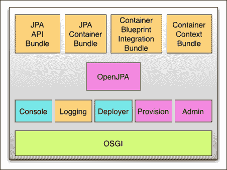
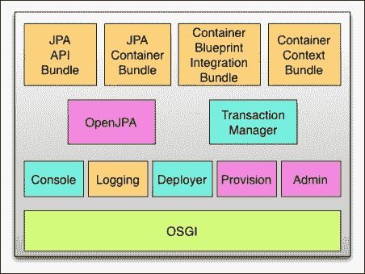
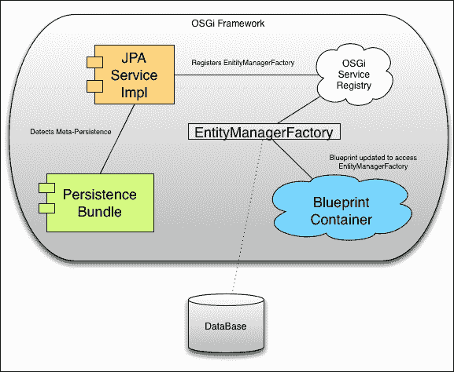
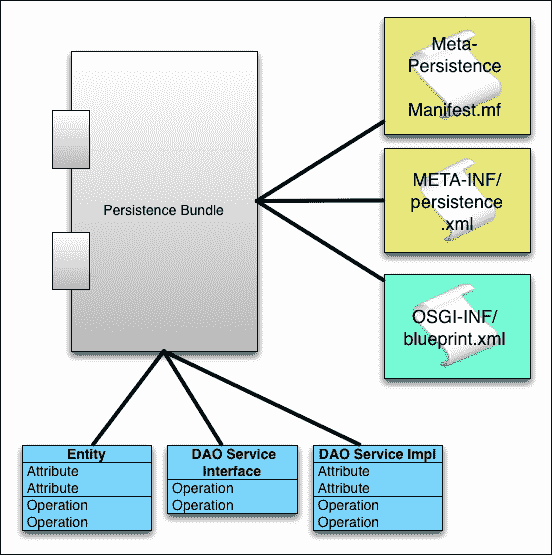

# 第七章. 使用 Apache Aries 和 OpenJPA 提供持久层

在本章中，我们将涵盖以下食谱：

+   在 Apache Karaf 中安装 OpenJPA 模块

+   在 Apache Karaf 中安装 Apache Aries JTA 模块

+   构建一个具有持久层以在 Karaf 中部署的项目

+   构建一个具有持久层和事务支持的项目以在 Karaf 中部署

# 简介

您的应用程序通常需要安全地持久化数据并利用事务行为。对于 Java 开发者来说，完成此任务的一个首选方法是使用**Java 持久化 API**（**JPA**）和**Java 事务 API**（**JTA**）。在 Apache Karaf 的上下文中，开发者将使用一个 OSGi 兼容的 JPA 实现，例如**Apache OpenJPA**、**EclipseLink**或**Hibernate**以及**Apache Aries JTA**。

本书将使用 OpenJPA 作为 JPA 规范的实现，以实现 Java 对象的透明持久化。与 OSGi 容器相关联时，它为 Blueprint 容器提供容器管理的持久化。

Apache Aries JTA 为容器提供事务管理服务。使用此服务，开发者可以构建需要以下事务流程的应用程序：

```java
getTransaction()
begin()  // demark beginning of transaction
doWork() // your business logic
if (rollback) then rollback() else commit()
```

之前的伪代码概述了事务的一般形式；开发者从容器中获取事务会话，标记事务的开始，执行他们的业务逻辑，然后必须决定他们是否可以提交事务或回滚资源。

本章中的食谱将帮助您将 JPA 和 JTA 资源部署到 Karaf 中，并通过示例指导您如何在您的捆绑包中使用这些 API。

# 在 Apache Karaf 中安装 OpenJPA 模块

在我们开始探索如何构建由 OpenJPA 支持的应用程序之前，我们必须首先将所有必需的 JPA 模块安装到 Karaf 容器中。

## 准备工作

本食谱的成分包括 Apache Karaf 发行套件、JDK 访问权限和互联网连接。

## 如何做到这一点...

多亏了 Apache Karaf 的功能系统，安装 OpenJPA 是一个非常简单的两步过程：在 Karaf 中安装 JPA 和 OpenJPA 功能。步骤如下：

### 注意

为什么我们不需要添加功能 URL？这是因为 Apache Karaf 的标准发行版默认包含 JPA 和 OpenJPA 功能 URL。

1.  我们可以通过执行带有功能名称的`feature:install`命令来安装一个功能，如下所示：

    ```java
    karaf@root()>  feature:install jpa

    ```

    我们可以通过执行`list –t 0 | grep -i JPA`命令来验证安装，该命令将在 Karaf 中列出所有安装的 OpenJPA 组件和依赖项（Geronimo-jta_1.1_spec、Geronimo-jpa_2.0_spec、Aries JPA API、Aries JPA Blueprint、Aries JPA Container 和 Aries JPA Container Context）。

1.  与 JPA 的安装类似，我们使用功能名称来安装 OpenJPA 引擎，如下所示。

    ```java
    karaf@root()>  feature:install openjpa/2.2.2

    ```

    我们可以通过执行 `list –t 0 | grep -i OpenJPA` 命令来验证安装，该命令将列出 Karaf 中所有已安装的 OpenJPA 组件和依赖项（其中核心是 OpenJPA 聚合 JAR）。

## 如何工作…

Apache Karaf 社区维护了一个用于 JPA 和 OpenJPA 的 Apache Karaf 功能描述符。这些功能描述符文件包含了安装这些 API 和提供者所需的全部基本包和依赖项，如下面的图示所示：



当安装 JPA 或 OpenJPA 功能（使用 `feature:install` 命令）时，Karaf 将使用适当的 URL 处理程序来获取所需资源并将它们安装到容器中。接下来，它尝试将它们启动。如果你在 Karaf 控制台中执行 `list –t 0` 命令，你将看到部署到容器中的 JPA 和所有其他工件。我们可以通过展示关键工件被部署在标准 Karaf 安装之上，更简单地描述 OpenJPA 组件与 Karaf 的集成。

## 参见

+   第一章中“将应用程序作为功能部署”的食谱，*Apache Karaf for System Builders*。

# 在 Apache Karaf 中安装 Apache Aries JTA 模块

应用程序通常需要与 JPA 一起进行事务管理。这是通过将 JTA 包含到 Karaf 容器中实现的。

## 准备工作

本食谱的成分包括 Apache Karaf 分发套件、对 JDK 的访问以及互联网连接。通常，你还需要执行“在 Apache Karaf 中安装 OpenJPA 模块”食谱中概述的步骤。

## 如何操作…

感谢 Apache Karaf 的功能系统，安装 JTA 是一个非常简单的单步过程。

### 注意

为什么我们不需要添加功能 URL？这是因为 Apache Karaf 的标准分发版默认包含了 JTA 功能 URL。

### 将 JTA 功能安装到 Karaf 中

我们通过执行以下命令来安装功能：`feature:install` 命令，其中包含功能的名称：

```java
karaf@root()>  feature:install transaction

```

我们可以通过执行 `list –t 0 | grep -i transaction` 命令来验证安装，该命令将列出 Karaf 中所有已安装的事务组件和依赖项（例如 Apache Aries 事务蓝图和 Apache Aries 事务管理器）。此外，我们还可以通过在 `jta` 上进行 grep 操作来验证 `geronimo_jta_1.1_spec` 是否已安装。

## 如何工作…

Apache Karaf 社区维护了一个用于 JTA 的 Apache Karaf 功能描述符。功能描述符文件包含了安装事务管理器所需的所有基本包和依赖项，如下面的图示所示：



当 JTA 功能被安装（使用`feature:install`命令）时，Karaf 将使用适当的 URL 处理程序来获取所需资源并将它们安装到容器中。接下来，它尝试将它们带到启动状态。如果您在 Karaf 控制台中执行`list –t 0`命令，您将看到部署到容器中的 JTA 和所有其他工件。我们可以通过展示关键工件被部署在标准 Karaf 安装之上来更简单地描述 JTA 组件与 Karaf 的集成。在这个部署中，我们看到事务管理器（JTA）被部署在“在 Apache Karaf 中安装 OpenJPA 模块”食谱中的各种 JPA 模块之间。

## 参见

+   “第一章”中关于将应用程序作为功能部署的食谱，*Apache Karaf for System Builders*

+   “在 Apache Karaf 中安装 OpenJPA 模块”食谱

# 在 Karaf 中构建具有持久层的项目

应用程序开发人员通常需要在他们的项目中使用持久层；在 Karaf 中执行此操作的一种首选方法是使用 Java 持久性 API 和 OpenJPA。

在“在 Apache Karaf 中安装 OpenJPA 模块”食谱中，我们学习了如何在 Karaf 中安装 OpenJPA；在本食谱中，我们将使用 JPA 和 OpenJPA 来构建一个简单的应用程序，该应用程序使用`RecipeBookService`类将食谱持久化到数据库中，这将隐藏数据存储和检索的复杂性，使其用户难以察觉。

## 准备工作

本食谱的成分包括 Apache Karaf 分发套件、对 JDK 的访问以及互联网连接。本食谱的示例代码可在[`github.com/jgoodyear/ApacheKarafCookbook/tree/master/chapter7/chapter7-recipe3`](https://github.com/jgoodyear/ApacheKarafCookbook/tree/master/chapter7/chapter7-recipe3)找到。通常，您还需要执行“在 Apache Karaf 中安装 OpenJPA 模块”食谱中概述的步骤。

### 小贴士

在尝试此食谱之前，请先卸载“在 Karaf 中构建具有持久层和事务支持的部署项目”食谱的内容，因为可能会发生冲突。本食谱在本章的后面部分。

## 如何操作...

在 Karaf 中构建具有 JPA 持久层的项目需要以下九个步骤：

1.  第一步是生成基于 Maven 的包项目。创建一个空的基于 Maven 的项目。一个包含基本 Maven 坐标信息和包打包指令的`pom.xml`文件就足够了。

1.  下一步是在 POM 文件中添加依赖项，如下面的代码所示：

    ```java
    <dependencies>
      <dependency>
        <groupId>org.apache.servicemix.bundles</groupId>
        <artifactId>
          org.apache.servicemix.bundles.commons-dbcp
        </artifactId>
        <version>1.4_3</version>
      </dependency>
      <dependency>
        <groupId>org.osgi</groupId>
        <artifactId>org.osgi.core</artifactId>
        <version>5.0.0</version>
      </dependency>
      <dependency>
        <groupId>org.osgi</groupId>
        <artifactId>org.osgi.compendium</artifactId>
        <version>5.0.0</version>
      </dependency>
      <dependency>
        <groupId>org.osgi</groupId>
        <artifactId>org.osgi.enterprise</artifactId>
        <version>5.0.0</version>
      </dependency>
      <dependency>
        <groupId>org.apache.geronimo.specs</groupId>
        <artifactId>geronimo-jpa_2.0_spec</artifactId>
        <version>1.1</version>
      </dependency>
      <dependency>
        <groupId>org.apache.openjpa</groupId>
        <artifactId>openjpa</artifactId>
        <version>2.2.2</version>
        <scope>test</scope>
      </dependency>
      <dependency>
        <groupId>org.apache.derby</groupId>
        <artifactId>derby</artifactId>
        <version>10.8.1.2</version>
        <scope>provided</scope>
      </dependency>
    <!-- custom felix gogo command -->
      <dependency>
        <groupId>org.apache.karaf.shell</groupId>
        <artifactId>
          org.apache.karaf.shell.console
        </artifactId>
        <version>3.0.0</version>
      </dependency>
    </dependencies>
    ```

    对于 Karaf 3.0.0，我们使用 OpenJPA 2.2.2 和 OSGi 版本 5.0.0。

1.  下一步是添加构建插件。我们的食谱需要配置两个构建插件：OpenJPA 和 bundle。

    1.  首先，我们配置`openjpa-maven-plugin`。`openjpa-maven-plugin`为基于 OpenJPA 的项目提供构建和维护的任务。我们在 POM 文件中添加以下插件配置：

        ```java
        <plugin>
          <groupId>org.codehaus.mojo</groupId>
          <artifactId>openjpa-maven-plugin</artifactId>
          <configuration>
            <addDefaultConstructor>
              true
            </addDefaultConstructor>
            <enforcePropertyRestriction>
              true
            </enforcePropertyRestriction>
          </configuration>
          <executions>
            <execution>
              <id>enhancer</id>
              <phase>process-classes</phase>
              <goals>
                <goal>enhance</goal>
              </goals>
            </execution>
          </executions>
          <dependencies>
            <dependency>
              <groupId>org.apache.openjpa</groupId>
              <artifactId>openjpa</artifactId>
              <version>2.2.2</version>
            </dependency>
            <dependency>
              <groupId>org.slf4j</groupId>
              <artifactId>slf4j-api</artifactId>
              <version>1.6.1</version>
            </dependency>
          </dependencies>
        </plugin>
        ```

        在前面的代码块中给出的 `openjpa-maven-plugin` 中，我们指示插件在实体类上执行增强过程以提供持久化功能。正如 OpenJPA 项目所述：“构建时增强是使用 OpenJPA 的推荐方法，因为它是最快且最可靠的方法”。

    1.  接下来，我们配置 `maven-bundle-plugin`。我们将 `maven-bundle-plugin` 配置为将我们的项目代码组装成一个 OSGi 包。我们向我们的 POM 文件中添加以下插件配置：

        ```java
        <plugin>
          <groupId>org.apache.felix</groupId>
          <artifactId>maven-bundle-plugin</artifactId>
          <version>2.4.0</version>
          <extensions>true</extensions>
          <configuration>
            <instructions>
              <Bundle-SymbolicName>
                ${project.artifactId}
              </Bundle-SymbolicName>
              <Meta-Persistence>
                META-INF/persistence.xml
              </Meta-Persistence>
              <Bundle-Activator>
                com.packt.jpa.demo.Activator
              </Bundle-Activator>
              <Export-Package>
                com.packt.jpa.demo.api.*
              </Export-Package>
              <Import-Package>
                org.osgi.service.blueprint;resolution:=optional,
                javax.persistence;version="[1.1,2)",
                javax.persistence.criteria;version="[1.1,2)",
                javax.sql,
                org.apache.commons.dbcp;version="[1.4,2)",
                org.apache.derby.jdbc,
                org.apache.felix.service.command,
                org.apache.felix.gogo.commands,
                org.apache.karaf.shell.console,
                *
              </Import-Package>
            </instructions>
          </configuration>
        </plugin>
        ```

        如前一个代码片段中突出显示的，`Meta-Persistence` 标签将向我们的包的清单文件中添加一个条目，指向我们的 `persistence.xml` 文件位置（我们将在下一步中创建此资源）。对于我们的示例项目，`javax.persistence`、`dbcp` 和 `derby` 包的导入语句至关重要。Felix 和 Karaf 的导入是可选的 Karaf 命令所必需的。

1.  下一步是创建持久化描述符文件。在你的项目中创建一个名为 `src/main/resources/META-INF` 的目录树。然后，我们将在这个文件夹中创建一个名为 `persistence.xml` 的文件。此文件如下代码片段所示：

    ```java
    <persistence 

                 version="1.0">

      <persistence-unit name="recipe" transaction-type="RESOURCE_LOCAL">
        <provider>
          org.apache.openjpa.persistence.PersistenceProviderImpl
        </provider>

        <non-jta-data-source>
          osgi:service/javax.sql.DataSource/ (osgi.jndi.service.name=jdbc/demo)
        </non-jta-data-source>

        <class>com.packt.jpa.demo.entity.Recipe</class>
        <exclude-unlisted-classes>
          true
        </exclude-unlisted-classes>

        <properties>

          <!-- OpenJPA Properties -->
          <property name="openjpa.ConnectionDriverName" value="org.apache.derby.jdbc.ClientDriver.class"/>
          <property name="openjpa.ConnectionURL" value="jdbc:derby://localhost:1527/demo;create=true"/>
          <property name="openjpa.Multithreaded" value="true"/>
          <property name="openjpa.TransactionMode" value="managed"/>
          <property name="openjpa.ConnectionFactoryMode" value="managed"/>
          <property name="openjpa.LockManager" value="pessimistic(VersionCheckOnReadLock=true,VersionUpdateOnWriteLock=true)"/>
          <property name="openjpa.LockTimeout" value="30000"/>
          <property name="openjpa.jdbc.MappingDefaults" value="ForeignKeyDeleteAction=restrict, JoinForeignKeyDeleteAction=restrict"/>
          <property name="openjpa.LockManager" value="pessimistic(VersionCheckOnReadLock=true,VersionUpdateOnWriteLock=true)"/>
          <property name="openjpa.Log" value="DefaultLevel=INFO, Runtime=INFO, Tool=INFO, SQL=INFO"/>
          <property name="openjpa.jdbc.SynchronizeMappings" value="buildSchema"/>
          <property name="openjpa.jdbc.DBDictionary" value="derby"/>
        </properties>
      </persistence-unit>
    </persistence>
    ```

    持久化描述符文件包含我们应用程序所需的大量配置条目。其中最重要的是 `persistence-unit` 和 `non-jta-data-source` 对象的定义；前者将数据持久化设置为 `RESOURCE_LOCAL`，后者设置使用 JDBC 服务进行非事务性数据存储。各种 OpenJPA 属性超出了本书的范围，但它们被包含在这里以提供示例配置。上一个示例中更有趣的部分是数据源的引用。由于 `persistence.xml` 文件只知道资源的 JNDI 查询语法，因此需要以 JNDI 方式引用数据源的 OSGi 服务。这导致 `osgi:service` 是一个提供 `javax.sql.DataSource` 接口的 OSGi 服务的 JNDI 查询，其中过滤器匹配 `osgi.jndi.service.name` 值，相当于 `jdbc/demo`。

1.  下一步是创建 Blueprint 描述符文件。在你的项目中，创建 `src/main/resources/OSGI-INF` 目录树。然后，我们将在这个文件夹中创建一个名为 `blueprint.xml` 的文件，如下所示：

    ```java
    <blueprint default-activation="eager"

          >

      <!-- Define RecipeBookService Services, and expose them. -->
      <bean id="recipeBookService" class="com.packt.jpa.demo.dao.RecipeBookServiceDAOImpl">
        <jpa:unit property="entityManagerFactory" unitname="recipe" />
      </bean>

      <service ref="recipeBookService" interface="com.packt.jpa.demo.api.RecipeBookService" />

      <bean id="dataSource" class="org.apache.derby.jdbc.ClientDataSource" >
        <property name="databaseName" value="demo"/>
        <property name="createDatabase" value="create"/>
      </bean>

      <service id="demoDataSource" ref="dataSource" interface="javax.sql.DataSource">
        <service-properties>
          <entry key="osgi.jndi.service.name" value="jdbc/demo"/>
          <entry key="transactional" value="false"/>
        </service-properties>
      </service>
    </blueprint>
    ```

    你应该注意在 `blueprint.xml` 文件中将 `DataSource` 服务作为 OSGi 服务包含在内。它包含服务属性 `osgi.jndi.service.name`，其值为 `jdbc/demo`。这是 `persistence.xml` 文件所引用的 `DataSource` 服务。

1.  下一步是开发具有 JPA 后端的 OSGi 服务。我们已经创建了基本的项目结构，并配置了持久化和 Blueprint 描述符的配置；现在我们将专注于我们 JPA 支持的应用程序的底层 Java 代码。我们将此过程分解为以下三个步骤：

    1.  第一步是定义服务接口。服务接口将定义我们项目的用户 API。在我们的示例代码中，我们实现了一个 `RecipeBookService` 类，它提供了与一系列食谱交互所需的方法。这在上面的代码中显示：

        ```java
        package com.packt.jpa.demo.api;

        import java.util.Collection;
        import com.packt.jpa.demo.entity.Recipe;

        public interface RecipeBookService {

          public Collection<Recipe> getRecipes();

          public void addRecipe(String title, String ingredients);

          public void deleteRecipe(String title);

        }
        ```

        接口的实现遵循标准的 Java 规范，不需要特殊的 OSGi 包。

    1.  下一步是实现服务 DAO。现在我们已经定义了服务接口，我们将提供一个作为 DAO 的实现。考虑以下代码：

        ```java
        public class RecipeBookServiceDAOImpl implements RecipeBookService {

          @PersistenceUnit(unitName="recipe")
          private EntityManagerFactory factory;

          public void setEntityManagerFactory(EntityManagerFactory factory) {
            this.factory = factory;
          }

          @Override
          public List<Recipe> getRecipes() {
            List<Recipe> result = new ArrayList<Recipe>();
            EntityManager entityManager = factory.createEntityManager();
            EntityTransaction entityTransaction = entityManager.getTransaction();
            entityTransaction.begin();
            result = entityManager.createQuery("select r from RECIPE r", Recipe.class).getResultList();
            entityTransaction.commit();
            return result;
          }

          @Override
          public void addRecipe(String title, String ingredients) {
            EntityManager entityManager = factory.createEntityManager();
            EntityTransaction entityTransaction = entityManager.getTransaction();
            entityTransaction.begin();
            entityManager.persist(new Recipe(title, ingredients));
            entityTransaction.commit();
        }

          @Override
          public void deleteRecipe(String title) {
            EntityManager entityManager = factory.createEntityManager();
            EntityTransaction entityTransaction = entityManager.getTransaction();
            entityTransaction.begin();
            entityManager.remove(entityManager.getReference(Recipe.class, title));
            entityTransaction.commit();
          }
        }
        ```

        `EntityManagerFactory` 函数将通过 Blueprint 连接到我们的 DAO。我们 DAO 服务实现中实现的每个服务方法都需要管理 JPA 风格的事务元素。

    1.  下一步是实现实体。最后，我们按照以下代码实现我们的实体：

        ```java
        package com.packt.jpa.demo.entity;

        import javax.persistence.Column;
        import javax.persistence.Entity;
        import javax.persistence.Id;
        import javax.persistence.Table;

        @Entity( name = "RECIPE" )
        @Table( name = "RECIPES" )
        public class Recipe {

          @Id
          @Column(nullable = false)
          private String title;

          @Column(length=10000)
          private String ingredients;

          public Recipe() {
          }

          public Recipe(String title, String ingredients) {
            super();
            this.title = title;
            this.ingredients = ingredients;
          }

          public String getTitle() {
            return title;
          }
          public void setTitle(String title) {
            this.title = title;
          }
          public String getIngredients() {
            return ingredients;
          }
          public void setIngredients(String ingredients) {
            this.ingredients = ingredients;
          }

          public String toString() {
            return "" + this.title + " " + this.ingredients;
          }
        }
        ```

        我们的 `Entity` 类是我们对象满足其持久化存储定义要求的地方。要将对象存储到数据库中，我们必须用表、列等术语描述其存储，并重写 `equals` 和 `hashCode` 方法。

1.  下一步是可选的创建 Karaf 命令以直接测试持久化服务。为了简化对 `RecipeBookService` 类的手动测试，我们可以创建一组自定义 Karaf 命令，这些命令将测试我们的基于 JPA 的数据存储和检索操作。这些命令的示例实现可在本书的网站上找到。特别值得注意的是，它们如何获取 `RecipeBookService` 类的引用并对服务进行调用。现在，我们必须通过 Blueprint 将命令实现连接到 Karaf，如下所示：

    ```java
    <!-- Apache Karaf Commands -->
    <command-bundle >
      <command>
        <action class="com.packt.jpa.demo.commands.AddRecipe">
          <property name="recipeBookService" ref="recipeBookService"/>
        </action>
      </command>
      <command>
        <action class="com.packt.jpa.demo.commands.RemoveRecipe">
          <property name="recipeBookService" ref="recipeBookService"/>
        </action>
      </command>
      <command>
        <action class="com.packt.jpa.demo.commands.ListRecipes">
          <property name="recipeBookService" ref="recipeBookService"/>
        </action>
      </command>
    </command-bundle>
    ```

    我们每个自定义命令的实现类都连接到我们的 `recipeBookService` 实例。

1.  下一步是将项目部署到 Karaf。在 Karaf 中部署我们的应用程序需要以下三个步骤：为后端数据库安装 JDBC 驱动程序、安装 JNDI 以及将我们的项目包添加到容器中。对于我们的示例项目，我们将使用 Apache Derby 作为我们的 JDBC 提供者。

    1.  我们可以使用以下命令安装 JDBC 驱动程序：

        ```java
        karaf@root()> install -s mvn:org.apache.derby/derbyclient/10.8.1.2

        ```

        安装完成后，您可以通过执行类命令并 grep `ClientDataSource` 实现来检查客户端驱动程序是否可用。

        ### 小贴士

        此演示需要一个正在运行的 Derby 数据库实例。请参阅 [`db.apache.org/derby/papers/DerbyTut/install_software.html`](http://db.apache.org/derby/papers/DerbyTut/install_software.html) 以获取安装 Apache Derby 的简短教程。

    1.  我们需要使用以下命令安装 `jndi` 功能：

        ```java
        karaf@root()> feature:install jndi

        ```

        在 Karaf 中安装 `jndi` 功能后，我们将能够使用 `jndi:names` 命令查看容器中配置的数据源。

    1.  我们通过在其 Maven 坐标上执行 `install` 命令来安装我们的项目包，如下所示：

        ```java
        karaf@root()> install –s mvn:com.packt/jpa-only/1.0.0-SNAPSHOT

        ```

        我们可以通过执行`list –t 0 | grep -i JPA-only`命令来验证安装，这将列出我们项目的捆绑包状态。

1.  最后一步是测试项目。我们现在已将大量捆绑包部署到 Karaf 容器中；我们可以使用提供的 Karaf 测试命令如下进行集成测试：

    ```java
    karaf@root()> test:addrecipe "Simple Chocolate Chip Cookies" "2/3 cup butter, 1 cup brown sugar, 2 eggs, 2 tbsp milk, 2 cups flour, 1 tsp baking powder, 1/4 tsp baking soda, 1/2 tsp vanilla, 1 cup chocolate chips. Whip the butter and sugar together, then add in the eggs and beat well. In a second bowl combine the dry ingredients. Make sure to thoroughly mix together the flour, baking soda and powder. Add the dry ingredients, milk, and vanilla into the butter , sugar, and egg mixture. Beat until dough is consistent. You may now preheat your oven to 375F. Drop teaspoon full amounts of dough onto greased or lined cookie sheets. Bake for 10 to 12 minutes. This recipe should yield between three to four dozen cookies."
    Executing command addrecipe
    Recipe added!
    karaf@root()>

    ```

    使用提供的自定义 Karaf 命令，我们可以将食谱条目添加到我们的数据库中。在先前的示例中，我们添加了一个巧克力曲奇饼干的食谱。考虑以下命令行片段：

    ```java
    karaf@root()> test:listrecipes
    Executing command list recipes
     Simple Chocolate Chip Cookies 2/3 cup butter, 1 cup brown sugar, 2 eggs, 2 tbsp milk, 2 cups flour, 1 tsp baking powder, 1/4 tsp baking soda, 1/2 tsp vanilla, 1 cup chocolate chips. Whip the butter and sugar together, then add in the eggs and beat well. In a second bowl combine the dry ingredients. Make sure to thoroughly mix together the flour, baking soda and powder. Add the dry ingredients, milk, and vanilla into the butter , sugar, and egg mixture. Beat until dough is consistent. You may now preheat your oven to 375F. Drop teaspoon full amounts of dough onto greased or lined cookie sheets. Bake for 10 to 12 minutes. This recipe should yield between three to four dozen cookies.
    karaf@root()>

    ```

    `listrecipes`自定义命令在我们的食谱数据存储上执行选择所有功能，在控制台上显示所有条目。或者，您可以使用您选择的任何 JDBC 工具来验证您的食谱条目是否已持久化到磁盘。

    ### 小贴士

    **使用 JDBC 功能简化数据源管理**

    Apache Karaf 3.0 包含一个 JDBC 功能，它提供了许多与数据源交互的有用命令。尝试安装`jdbc`功能，然后执行以下命令：

    +   `karaf@root()> feature:install jdbc`

    +   `karaf@root()> jdbc:datasources`

    +   `karaf@root()> jdbc:tables jdbc/demo`

    +   `karaf@root()> jdbc:query jdbc/demo "select * from RECIPES"`

        这些命令的输出未格式化为小控制台，因此您可能需要扩展您的终端以舒适地显示结果。

最后，即使在重启 Karaf 之后，您的所有食谱条目也将可用。

## 如何工作…

从一个高级的角度观察，我们的持久化层通过在 Karaf 容器中集成几个 Apache Aries 库和 OpenJPA 来工作。以下图表显示了这一高级视图：



此设计中的关键交互是持久化单元和 Blueprint 描述符的发现和连接，以及实体和数据访问对象的连接。这导致我们的持久化捆绑包与 JPA 服务实现（OpenJPA）交互，反过来，JPA 服务实现与持久化单元中连接到我们的 DAO 服务实现的 EntityManagerFactory 接口交互。以下图表展示了这些关键部署工件：



从我们的持久化功能捆绑包的架构角度来看，其操作取决于捆绑包清单、持久化配置和 Blueprint 连接的交互。

`Meta-Persistence`清单头触发捆绑包持久化配置的处理，反过来配置 JNDI 数据源声明、实体发现和 JDBC 集成。

Blueprint 描述符将我们的 DAO 服务接口和实现连接起来，并进一步定义数据源。此服务连接的关键特性是将持久化单元连接到 DAO 服务实现。DAO 服务使用持久化单元的`EntityManagerFactory`功能来启用实体访问、操作和事务。

## 参见

+   *在 Karaf 中构建具有持久化层和交易支持的部署项目* 菜谱

# 在 Karaf 中构建具有持久化层和交易支持的部署项目

通过引入 Apache Aries JTA 模块到您的项目中，可以简单地添加对您的 JPA 持久化数据的交易支持。JTA 组件提供了一个事务管理器，用于协调数据存储和检索。

在 *在 Karaf 中部署项目时使用持久化层的构建* 菜谱中，我们学习了如何使用 JPA 和 OpenJPA 通过`RecipeBookService`类构建一个简单的应用程序，将菜谱持久化到数据库。在这个菜谱中，我们将通过 JTA 添加基于容器的交易管理。

## 准备工作

此菜谱的成分包括 Apache Karaf 发行套件、对 JDK 的访问和互联网连接。此菜谱的示例代码可在[`github.com/jgoodyear/ApacheKarafCookbook/tree/master/chapter7/chapter7-recipe4`](https://github.com/jgoodyear/ApacheKarafCookbook/tree/master/chapter7/chapter7-recipe4)找到。通常，您还需要执行 *在 Karaf 中部署项目时使用持久化层的构建* 菜谱和 *在 Apache Karaf 中安装 Apache Aries JTA 模块* 菜谱中概述的步骤。

### 注意

在尝试此菜谱之前，请先卸载 *在 Karaf 中部署项目时使用持久化层的构建* 菜谱的内容，因为可能会发生冲突。

## 如何操作…

给定一个基于 JPA 的项目，如 *在 Karaf 中部署项目时使用持久化层的构建* 菜谱中概述的，我们可以通过以下五个步骤添加 Java 交易支持：

1.  第一步是更新持久化到 JTA。首先，我们将交易类型从`RESOURCE_LOCAL`更改为`JTA`；这将项目从自我管理持久化转换为容器管理。以下代码展示了这一点：

    ```java
    <persistence-unit name="recipe" transaction-type="JTA">

      <provider>org.apache.openjpa.persistence.PersistenceProviderImpl</provider>

      <jta-data-source>
        osgi:service/javax.sql.XADataSource/(osgi.jndi.service.name=jdbc/demoxa)
      </jta-data-source>
      <non-jta-data-source>
        osgi:service/javax.sql.DataSource/(transactional=false)
      </non-jta-data-source>

      <class>com.packt.jpa.demo.entity.Recipe</class>
      <exclude-unlisted-classes>true</exclude-unlisted-classes>
    ```

    在更改交易类型后，我们需要添加一个`jta-data-source`。上一个示例将`jdbc/demoxa`注册为 JNDI 上的服务。在先前的菜谱中使用的`non-jta-data-source`被保留，以帮助展示从基本设计到容器管理的交易的发展；在开发过程中可能被删除。

1.  下一步是更新 Blueprint 描述符。将我们的交易类型从`RESOURCE_LOCAL`更改为`JTA`，这将改变我们连接`RecipeBookService`类的方式。以下代码展示了这一点：

    ```java
    <!-- Define RecipeBookService Service, and expose them. -->
    <bean id="recipeBookService" class="com.packt.jpa.demo.dao.RecipeBookServiceDAOImpl">
      <tx:transaction method="*" value="Required" />
      <jpa:context property="entityManager" unitname="recipe" />
    </bean>
    ```

    我们将`jpa`属性更改为引用上下文而不是单元，并现在添加对容器提供的`entityManager`接口的引用。JTA 风格的交易的存在还意味着我们现在可以包括对 XA 数据源的定义。考虑以下代码：

    ```java
    <bean id="xaDataSource" class="org.apache.derby.jdbc.ClientXADataSource">
      <property name="databaseName" value="demo"/>
      <property name="createDatabase" value="create" />
    </bean>
    ```

    我们将数据源特定的 XA 驱动程序与`XADataSource`服务实例连接起来，如下所示：

    ```java
    <service ref="xaDataSource" 
             interface="javax.sql.XADataSource">
      <service-properties>
        <entry key="osgi.jndi.service.name" value="jdbc/demoxa"/>
        <entry key="transactional" value="true"/>
      </service-properties>
    </service>

    <!-- JTA Transaction Manager setup. -->
    <reference id="txManager" 
               interface="javax.transaction.TransactionManager" 
               availability="mandatory"/>
    ```

    最后，我们添加了对容器提供的`TransactionManager`接口的服务引用，并将其存在性设置为`mandatory`。

1.  下一步是更新服务 DAO。我们对持久性和蓝图配置进行 JTA 风格事务的更改，需要更改我们的 DAO 服务实现。我们的服务不需要创建和管理自己的事务，因为实体现在是通过容器提供的 `EntityManager` 函数访问的。考虑以下代码：

    ```java
    public class RecipeBookServiceDAOImpl implements RecipeBookService {

      private EntityManager em;

      public void setEntityManager(EntityManager em) {
        this.em = em;
      }

      @Override
      public List<Recipe> getRecipes() {
        List<Recipe> result = new ArrayList<Recipe>();
        result = em.createQuery("select r from RECIPE r", Recipe.class).getResultList();
        return result;
      }

      @Override
      public void addRecipe(String title, String ingredients) {
        em.persist(new Recipe(title, ingredients));
      }

      @Override
      public void deleteRecipe(String title) {
        em.remove(em.getReference(Recipe.class, title));
      }
    }
    ```

    这个微妙变化的后果是，我们的服务方法得到了简化。

1.  下一步是将项目部署到 Karaf。将我们的应用程序部署到 Karaf 需要两个步骤（除了在 *在 Karaf 中部署具有持久化层的项目* 配方中概述的步骤）：安装事务支持和将我们的项目包添加到容器中。JTA 需要基于容器的交易管理器；我们可以使用以下命令安装一个：

    ```java
    karaf@root()> feature:install transaction

    ```

    安装完成后，我们现在可以使用以下命令部署我们的项目包：

    ```java
    karaf@root()>  install –s mvn:com.packt/jpa-jta/1.0.0-SNAPSHOT

    ```

    我们可以通过执行 `list –t 0 | grep -i JPA-JTA` 命令来验证安装，这将列出我们项目的包状态。

1.  最后一步是测试项目。我们现在已经将大量包部署到 Karaf 容器中；我们可以使用提供的 Karaf 测试命令来测试我们的集成，如下所示：

    ```java
    karaf@root()> test:addrecipe "Recipe-Title" "Ingredients."
    Executing command addrecipe
    Recipe added!
    karaf@root()>

    ```

    在之前的代码中，我们已经在我们的配方数据存储中添加了一个简单的占位符条目。现在，考虑以下命令行片段：

    ```java
    karaf@root()> test:listrecipes
    Executing command list recipes
    Recipe-Title Ingredients.
    karaf@root()>

    ```

    发出 `listrecipes` 命令，我们可以检索到之前的条目。

    ### 小贴士

    在 *在 Karaf 中部署具有持久化层的项目* 配方的 JDBC 功能说明中查看，以验证数据源信息。

## 它是如何工作的...

这个启用持久性的包的操作与我们之前的配方非常相似。关键变化是引入了 JTA 事务管理器，将持久化单元更新为 JTA，添加 XA 数据源，然后将 `EntityManager` 函数连接到 DAO 服务实现，并要求事务管理器的可用性。

在操作上，事务是由容器的交易管理器协调的——这允许比标准 JPA 风格事务更复杂的事务，并涉及更多种类的资源。

## 参见

+   对于另一种持久化层方法，请参阅第八章，*使用 Apache Cassandra 提供大数据集成层*。
