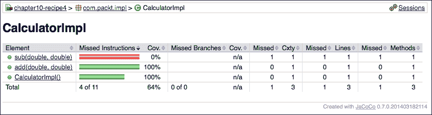

# 第十章 测试 Apache Karaf 与 Pax Exam

在本章中，我们将介绍以下食谱：

+   设置 Pax Exam 测试环境

+   测试 Apache Karaf 功能

+   使用 Apache Karaf 测试命令

+   使用 Apache Karaf Pax exam 测试的覆盖率

+   使用 Blueprint 和 Apache Karaf 测试 Apache Camel

# 简介

本章解释了如何为 Apache Karaf 设置测试环境。由于为 Apache Karaf 开发 OSGi 应用程序也需要彻底的测试，因此需要一个集成测试环境。Pax Exam 是一个强大的集成测试开发工具，可以与 Apache Karaf 结合使用。

### 提示

更多关于 Pax Exam 的详细信息可以在 OPS4j 社区网站上找到，网址为[`ops4j1.jira.com/wiki/display/PAXEXAM3/Pax+Exam`](https://ops4j1.jira.com/wiki/display/PAXEXAM3/Pax+Exam)。如果需要帮助，你可以在[`groups.google.com/forum/#!forum/ops4j`](https://groups.google.com/forum/#!forum/ops4j)找到一个活跃的社区。

# 设置 Pax Exam 测试环境

这个食谱将指导你使用 Felix 框架作为核心 OSGi 容器的基本设置 Pax Exam 测试环境。下一个食谱将介绍如何结合 Pax Exam 和 Apache Karaf。

## 准备工作

如往常一样，源代码可以在[`github.com/jgoodyear/ApacheKarafCookbook/tree/master/chapter10/chapter10-recipe1`](https://github.com/jgoodyear/ApacheKarafCookbook/tree/master/chapter10/chapter10-recipe1)找到。

## 如何做到这一点...

要使用 Pax Exam 执行集成测试，POM 配置是必不可少的，因为它已经是构建环境的一部分。例如，使用`pax-exam-container-native`构件，当然，将 JUnit 与 Pax Exam 连接是强制性的。这可以通过以下方式完成：

```java
…
<properties>
  <version.pax-exam>3.4.0</version.pax-exam>
  <junit.version>4.11</junit.version>
</properties>
…
<dependency>
  <groupId>org.ops4j.pax.exam</groupId>
  <artifactId>pax-exam-junit4</artifactId>
  <version>${version.pax-exam}</version>
  <scope>test</scope>
</dependency>

<dependency>
  <groupId>org.ops4j.pax.exam</groupId>
  <artifactId>pax-exam-invoker-junit</artifactId>
  <version>${version.pax-exam}</version>
  <scope>test</scope>
</dependency>

<dependency>
  <groupId>org.ops4j.pax.exam</groupId>
  <artifactId>pax-exam-container-native</artifactId>
  <version>${version.pax-exam}</version>
  <scope>test</scope>
</dependency>
…
```

除了这个，还需要定义运行此测试场景的 OSGi 框架。这可以是 Felix 框架、Equinox 或任何其他作为 Maven 依赖项可用的框架。

现在我们已经完成了 POM 配置的重要部分，让我们专注于 JUnit 集成测试。

这个测试类只包含两个主要方法：测试方法本身，其中我们有一个小的测试设置以确保容器正常工作，以及在这个阶段更为重要的方法——配置。考虑以下代码片段：

```java
@ExamReactorStrategy(PerClass.class)
@RunWith(PaxExam.class)
public class TestOsgiServices {

  @Inject
  protected BundleContext bundleContext;

  @Configuration
  public static Option[] configuration() throws Exception {
    return options(
      workingDirectory("target/paxexam/"),
      cleanCaches(true),
      junitBundles(),
      frameworkProperty("osgi.console").value("6666"),
      frameworkProperty("osgi.console.enable.builtin").value("true"),
      frameworkProperty("felix.bootdelegation.implicit").value("false"),
      systemProperty("org.ops4j.pax.logging.DefaultServiceLog.level").value("DEBUG"));
  }

  @Test
  public void test() {
    assertNotNull(bundleContext);
  }
}
```

单元测试类需要`@RunWith(PaxExam.class)`注解来明确它是一个 Pax Exam 测试。`@ExamReactorStrategy`注解允许你定义一个测试策略，可以是`PerClass`、`PerMethod`或`PerSuite`，其中你还需要定义要运行的测试类。在我们的测试中，使用`PerClass`策略就足够了，因为它只为每个类启动一次容器，而`PerMethod`策略则为每次方法调用启动测试及其设置。`PerSuite`策略为一系列测试启动和配置测试设置。

### 注意

有关测试策略的详细信息，请参阅 Pax Exam 文档，网址为 [`ops4j1.jira.com/wiki/display/PAXEXAM3/Pax+Exam`](https://ops4j1.jira.com/wiki/display/PAXEXAM3/Pax+Exam)。

Pax Exam 测试类总是需要一个带有 `@Configuration` 注解的 `configuration` 方法。这是为了让 Pax Exam 知道运行测试所需的配置。例如，最好提供一个 `workingDirectory` 方法，否则工作目录将放置在系统的临时目录中。通过 `junitBundles` 方法，包括 JUnit 包，使 Pax Exam 能够运行 JUnit 测试。要使用 TestNG 运行测试，需要在 `configuration` 方法中添加 TestNG 的依赖项，如下所示：

```java
mavenBundle("org.testng", "testng", "6.3.1")
```

使用 `frameworkProperty("osgi.console")` 属性，您可以为测试添加一个 OSGi 控制台；如果您以调试模式运行测试，您可以通过端口 `6666` 访问此控制台。这完成了 Pax Exam 测试的基本设置，其中我们已经有了一个测试方法，用于检查注入的（`@Inject`）bundle 上下文是否可用。

## 它是如何工作的...

由于 Pax Exam 通过 Maven 在类路径上找到自己的模块，它通过自己启动容器。这对于 Felix、Equinox 或任何其他由 POM 配置提供给 Pax Exam 的容器都是正确的。其他所有内容都需要使用 `configuration` 方法进行指定。如果您在测试场景中使用其他包，您还需要指定它们的 Maven 坐标。通常最好在您的 POM 配置中指定所涉及包的版本，并在配置中重用此版本。您将在即将到来的菜谱中了解更多信息。

那么 Pax Exam 与标准单元测试相比如何？在单元级别进行测试时，也许甚至使用模拟，测试仅关注单元本身。集成测试通常覆盖更广泛的范围或更大的范围，测试的单元更多。集成测试可能作为外部测试针对外部可用的 API 运行。如果您的 API 是容器内的服务，这将有点困难。Pax Exam 在容器内与容器一起工作。测试类将成为部署的工件的一部分。在 OSGi 环境中，Pax Exam 构建包含您的测试类的动态包，即使有包导入。这些包清单头也可以由测试进行操作；更多详细信息请参阅下一道菜谱。

## 还有更多...

集成测试通常测试已经构建的工件，但有时修改工件或测试在构建工件之后而不是在构建工件时是必要的。对于这种情况，可以通过配置 `streamBundle` 在线构建一个 *动态* 包。可以这样做：

```java
streamBundle(bundle().add(Calculator.class)
  .add(CalculatorImpl.class)
  .add(CalcActivator.class)
  .set(Constants.BUNDLE_SYMBOLICNAME,"com.packt.IntegrationTest")
  .set(Constants.DYNAMICIMPORT_PACKAGE, "*")
  .set(Constants.BUNDLE_ACTIVATOR, CalcActivator.class.getName())
  .set(Constants.EXPORT_PACKAGE, "com.packt")
  .build()).start());
```

此示例展示了如何构建一个包含激活器并导出正确包和其他清单头条目的动态包。注册的服务可以直接导入到测试中并使用。

### 注意

您可能还对使用 Pax Exam 与其他环境感兴趣；它还支持 Tomcat、Jetty 或 JEE 服务器作为运行时的后端。

# 测试 Apache Karaf 功能

在完成 *设置 Pax Exam 测试环境* 食谱后，您应该准备好测试 OSGi 应用程序。现在，让我们更详细地看看使用 Apache Karaf 作为容器运行测试所需的条件。

## 准备工作

如前几章所述，源代码可在 [`github.com/jgoodyear/ApacheKarafCookbook/tree/master/chapter10/chapter10-recipe2`](https://github.com/jgoodyear/ApacheKarafCookbook/tree/master/chapter10/chapter10-recipe2) 找到。为了完全理解这个食谱，最好已经完成了前面的食谱。

## 如何做到这一点...

在 *设置 Pax Exam 测试环境* 食谱中，我们定义了 Felix 框架作为运行时容器。现在，我们需要将其更改为 Apache Karaf，因此需要对 POM 配置进行第一次更改。Pax Exam 需要知道它需要以 Apache Karaf 作为容器运行；这是通过以下方式配置的：

1.  作为 Felix 框架替代依赖的 `pax-exam-container-karaf` 依赖项。

1.  作为运行时容器的 `apache-karaf` ZIP 艺术品。

1.  安装标准功能的标准功能文件。

考虑以下代码：

```java
…
<dependency>
  <groupId>org.ops4j.pax.exam</groupId>
 <artifactId>pax-exam-container-karaf</artifactId>
  <version>${version.pax-exam}</version>
  <scope>test</scope>
</dependency>
…
<!-- framework to test with -->
<dependency>
 <groupId>org.apache.karaf.features</groupId>
 <artifactId>standard</artifactId>
 <version>${karaf.version}</version>
 <type>xml</type>
 <classifier>features</classifier>
  <scope>test</scope>
</dependency>

<dependency>
  <groupId>org.apache.karaf.features</groupId>
  <artifactId>org.apache.karaf.features.core</artifactId>
  <version>${karaf.version}</version>
  <scope>test</scope>
</dependency>

<dependency>
  <groupId>org.apache.karaf.system</groupId>
  <artifactId>org.apache.karaf.system.core</artifactId>
  <version>${karaf.version}</version>
  <scope>test</scope>
</dependency>

<dependency>
  <groupId>org.apache.karaf</groupId>
 <artifactId>apache-karaf</artifactId>
  <version>${karaf.version}</version>
  <type>zip</type>
  <scope>test</scope>
  <exclusions>
    <exclusion>
      <groupId>org.apache.karaf.shell</groupId>
      <artifactId>org.apache.karaf.shell.dev</artifactId>
    </exclusion>
  </exclusions>
</dependency>
…
```

在对 POM 配置进行这些更改后，测试本身需要按照以下方式进行重新配置：

```java
@ExamReactorStrategy(PerClass.class)
@RunWith(PaxExam.class)
public class IntegrationTestKaraf {

  @Inject
  protected BundleContext bundleContext;

  @Inject
  protected FeaturesService featuresService;

  @Configuration
  public static Option[] configuration() throws Exception {
    return new Option[] {
      karafDistributionConfiguration().frameworkUrl(maven().groupId("org.apache.karaf").artifactId("apache-karaf").type("zip").versionAsInProject()).unpackDirectory(new File("target/paxexam/unpack/")).useDeployFolder(false),configureConsole().ignoreLocalConsole(),logLevel(LogLevel.INFO),keepRuntimeFolder(),features(maven().groupId("org.apache.karaf.features").artifactId("standard").type("xml").classifier("features").versionAsInProject(),"eventadmin")
    };
  }

  @Test
  public void test() {
    assertNotNull(bundleContext);
  }

  @Test
  public void featuresAvailable() throws Exception {
    assertTrue(featuresService.isInstalled(featuresService.getFeature("eventadmin")));
  }

}
```

第一个主要变化应该会立即跳入你的眼帘：Apache Karaf 配置，其中包含 `karafDistributionConfiguration` 函数和指向 Apache Karaf ZIP 文件的 Maven 坐标。由于它已经在 POM 配置中定义，因此可以使用 `versionAsInProject()` 配置。除此之外，一个功能可以从配置中立即安装，并在容器启动并运行后立即可用。测试确保安装了预期的功能。

## 它是如何工作的...

Pax Exam 使用 Karaf 作为容器而不是给定的 OSGi 框架。由于容器是以 ZIP 文件的形式组装的，需要先解包，因此需要一些额外的配置。完成此操作后，Apache Karaf 容器将在指定位置启动，并使用配置的约束，例如关闭 `Deploy` 文件夹。`versionAsInProject()` 配置需要一些额外的处理。为了使其工作，您需要确保生成一个 Maven 依赖文件。这可以通过从 ServiceMix 项目配置 `depends-maven-plugin` 来完成。这将生成一个包含 Pax Exam 可读的 POM 配置中所有依赖信息的文件。考虑以下代码：

```java
<plugin>
  <groupId>org.apache.servicemix.tooling</groupId>
  <artifactId>depends-maven-plugin</artifactId>
  <version>1.2</version>
  <executions>
    <execution>
      <id>generate-depends-file</id>
      <phase>generate-resources</phase>
      <goals>
        <goal>generate-depends-file</goal>
      </goals>
    </execution>
  </executions>
</plugin>
```

完成这些配置后，你的测试就设置好了。在给定的测试示例中，我们使用了内部功能描述符；如果你想测试任何其他类型的自定义功能，你只需将其添加到配置中，并告诉它应该部署哪个功能。在先前的示例中，是 `eventadmin` 功能。

除了已知的简单注入 `bundlecontext` 对象外，还可以将容器中可用的任何类型的服务注入到测试中。在先前的示例中，我们注入了 `featuresService`。

# 使用 Apache Karaf 测试命令

在完成前两个配方后，你应该已经准备好对 OSGi 包进行彻底测试，无论是独立测试还是 Apache Karaf 中的测试。当与 Apache Karaf 一起工作时，有时还需要有新的命令。本配方将介绍如何使用命令进行测试，并确保这些命令在 Apache Karaf 壳中执行。

## 准备工作

在开始本配方之前最好已经阅读过 *Testing Apache Karaf features* 配方，因为本配方是一个后续配方。源代码可以在 [`github.com/jgoodyear/ApacheKarafCookbook/tree/master/chapter10/chapter10-recipe3`](https://github.com/jgoodyear/ApacheKarafCookbook/tree/master/chapter10/chapter10-recipe3) 找到。

## 如何操作...

要测试 Apache Karaf 壳命令的执行，你需要调整测试类。首先，你需要改变测试的运行方式。为此，我们添加了探针构建器，它配置了测试包的构建方式。考虑以下代码：

```java
@ProbeBuilder
public TestProbeBuilder probeConfiguration(TestProbeBuilder probe) {
  //make sure the needed imports are there. 
  probe.setHeader(Constants.DYNAMICIMPORT_PACKAGE, "*,org.apache.felix.service.*;status=provisional");
  return probe;
}
```

以下代码行确保 `CommandProcessor` 接口的注入工作正常：

```java
@Inject
protected CommandProcessor commandProcessor;
```

对于实际测试命令，我们添加了一个方便的方法，该方法将命令发送到 Karaf 壳，并从中接收输出。这可以按以下方式完成：

```java
protected String executeCommand(final String command) {
  String response;
  final ByteArrayOutputStream byteArrayOutputStream = new ByteArrayOutputStream();
  final PrintStream printStream = new PrintStream(byteArrayOutputStream);
  final CommandSession commandSession = commandProcessor.createSession(System.in, printStream, System.err);
  FutureTask<String> commandFuture = new FutureTask<String>(
    new Callable<String>() {
      public String call() {
        try {
          System.err.println(command);
          commandSession.execute(command);
        } catch (Exception e) {
          e.printStackTrace(System.err);
        }
        printStream.flush();
        return byteArrayOutputStream.toString();
      }
    });

  try {
    executor.submit(commandFuture);
    response = commandFuture.get(10000L, TimeUnit.MILLISECONDS);
  } catch (Exception e) {
    e.printStackTrace(System.err);
    response = "SHELL COMMAND TIMED OUT: ";
  }

  return response;
}
```

包含响应的字符串可以测试预期的输出。

## 它是如何工作的…

本测试的关键部分是添加 `ProbeBuilder` 注解。`ProbeBuilder` 注解改变了包含测试类的包的构建方式。在我们的例子中，它改变了生成的包的 `Package-Import` 标头。不仅可能改变或添加清单头，还可以添加额外的类或测试类。

# 使用 Apache Karaf Pax Exam 测试覆盖率

除了测试应用程序外，通常还需要知道单元和集成测试实际上覆盖了代码的程度。对于代码覆盖率，有一些技术可用。本配方将介绍如何设置测试环境以找到测试的覆盖率。

## 准备工作

在开始此后续配方之前最好已经阅读过 *Testing Apache Karaf features* 配方。本配方的源代码可以在 [`github.com/jgoodyear/ApacheKarafCookbook/tree/master/chapter10/chapter10-recipe4`](https://github.com/jgoodyear/ApacheKarafCookbook/tree/master/chapter10/chapter10-recipe4) 找到。

## 如何操作...

要了解测试的覆盖率，需要一个代码覆盖率工具。我们将采用 Java 代码覆盖率库，因为它有一个用于自动化覆盖率分析的 Maven 插件。首先，将插件的 Maven 坐标添加到如下代码中：

```java
<groupId>org.jacoco</groupId>
<artifactId>jacoco-maven-plugin</artifactId>
<version>0.7.0.201403182114</version>
```

我们需要首先准备代码，以便代理可以按照以下方式覆盖它：

```java
<execution>
  <id>prepare-agent-integration</id>
  <goals>
 <goal>prepare-agent-integration</goal>
  </goals>
  <phase>pre-integration-test</phase>
  <configuration>
    <propertyName>jcoverage.command</propertyName>
    <includes>
      <include>com.packt.*</include>
    </includes>
    <append>true</append>
  </configuration>
</execution>
```

这将包括 `com.packt` 包，包括子包。在集成测试完成后，需要按照以下方式生成测试报告：

```java
<execution>
  <id>report</id>
  <goals>
    <goal>report-integration</goal>
  </goals>
</execution>
```

除了这些对 POM 配置的添加之外，你还需要将 VM 选项添加到 Apache Karaf 测试的配置中。如果不将这些选项设置到执行测试的虚拟机中，执行环境就不知道覆盖率，因此不会进行覆盖率测试。这可以按照以下方式完成：

```java
private static Option addCodeCoverageOption() {
  String coverageCommand = System.getProperty(COVERAGE_COMMAND);
  if (coverageCommand != null) {
    return CoreOptions.vmOption(coverageCommand);
  }
  return null;
}
```

此覆盖率的报告看起来如下截图所示。它显示了 `CalculatorImpl` 类及其方法的覆盖率。虽然 `add` 方法已被测试调用，但 `sub` 方法没有被调用。这导致该方法的覆盖率为零。



## 它是如何工作的…

首先，你需要为覆盖准备代理，这将插入到 `jcoverage.command` 属性中。此属性通过添加 `vmOption` 目录传递给测试。这样，覆盖率代理就被添加到 Java 虚拟机中，并跟踪测试执行的覆盖率。测试成功运行后，由 `jacoco-maven-plugin` 生成报告。所有这些都可以在单个 Maven 模块中正常工作。对于多模块项目设置，将需要额外的工作，特别是如果你想要结合单元和集成测试覆盖率。更多详细信息可以在 [`www.eclemma.org/jacoco/index.html`](http://www.eclemma.org/jacoco/index.html) 找到。

# 使用 Blueprint 和 Apache Karaf 测试 Apache Camel

此配方将介绍如何测试 Camel Blueprint 定义。本配方的重点是测试，以及它与 *Testing Apache Karaf features* 脚本的不同之处。

## 准备工作

在开始此后续配方之前，最好已经熟悉了 *Testing Apache Karaf features* 脚本和 *Creating a Blueprint-based Camel Router for deployment in Apache Karaf* 脚本。本章的源代码可在 [`github.com/jgoodyear/ApacheKarafCookbook/tree/master/chapter10/chapter10-recipe5`](https://github.com/jgoodyear/ApacheKarafCookbook/tree/master/chapter10/chapter10-recipe5) 找到。

## 如何做…

由于我们基于 *Testing Apache Karaf features* 脚本创建了此配方，因此我们已经有了一个包含 Apache Karaf 容器设置的初步设置。此外，我们还需要 Apache Camel 的功能。这样，所有用于测试 Camel 路由所需的包都齐备了。测试本身需要将 `blueprint.xml` 定义中的 Camel Context 连接到其模拟对象。这可以按照以下方式完成：

1.  测试类本身继承自`CamelTestSupport`类，以便更容易地对 Camel 进行测试：

    ```java
    …
    @RunWith(PaxExam.class)
    public class TestCamelInKaraf extends CamelTestSupport {

      @Inject
      protected FeaturesService featuresService;

      @Inject
      protected BundleContext bundleContext;

      @Inject
      @Filter(value="(camel.context.name=blueprintContext)", timeout=10000)
      protected CamelContext testContext;
    …
    ```

    为了访问 Camel 路由中包含的模拟对象，我们确保 Camel 上下文被注入。`@Filter`注解确保在给定的超时时间内只注入所需的 Camel 上下文。

1.  配置包含目标 Karaf 运行时，并安装所需的`camel-blueprint`和`camel-test`特性，如下所示：

    ```java
    @Configuration
    public static Option[] configure() throws Exception {
      return new Option[] {
      karafDistributionConfiguration().frameworkUrl(
      maven().groupId("org.apache.karaf")
    .artifactId("apache-karaf")
    .type("zip").versionAsInProject()).useDeployFolder(false)
    .karafVersion("3.0.1")
      .unpackDirectory(new File("target/paxexam/unpack/")),
      logLevel(LogLevel.WARN),
      features(
    maven().groupId("org.apache.camel.karaf")
    .artifactId("apache-camel").type("xml")
    .classifier("features")
    .versionAsInProject(), 
    "camel-blueprint", "camel-test"),keepRuntimeFolder(),
      streamBundle(
        bundle().add(HelloBean.class)
      .add("OSGI-INF/blueprint/blueprint.xml",
      new File("src/main/resources/OSGI-INF/blueprint/blueprint.xml")
      .toURL())
    .set(Constants.BUNDLE_SYMBOLICNAME, "com.packt.camel-test")
      .set(Constants.DYNAMICIMPORT_PACKAGE, "*").build())
      .start() };
    }
    ```

1.  此外，`HelloBean`类和`blueprint.xml`文件被封装在一个流式捆绑包中，以便测试可以在同一模块内运行。作为测试的最后一个特殊之处，我们确保每个类创建时 Camel 上下文只创建一次。这可以通过以下方式实现：

    ```java
    @Override
    public boolean isCreateCamelContextPerClass() {
      return true;
    }
    ```

    这就完成了在 Karaf 容器内使用 Pax Exam 测试 Camel 路由的设置。

1.  在`Test`方法中，我们确保所需的特性已安装，Camel 上下文已注入，并且模拟对象已满足。考虑以下代码：

    ```java
    @Test
    public void test() throws Exception {
      assertTrue(featuresService.isInstalled(featuresService.getFeature("camel-core")));
      assertTrue(featuresService.isInstalled(featuresService.getFeature("camel-blueprint")));

      assertNotNull(testContext);

      MockEndpoint mockEndpoint = (MockEndpoint) testContext.getEndpoint("mock:result");
      mockEndpoint.expectedMessageCount(1);

      assertMockEndpointsSatisfied(10000l, TimeUnit.MILLISECONDS);

    }
    ```

## 它是如何工作的…

如前所述的食谱，Pax Exam 确保 Apache Karaf 作为基本容器运行。在`@Configuration`方法内的特性配置中，我们安装了`camel-blueprint`和`camel-test`特性。测试确保这些特性确实已安装并正在运行。为了验证`HelloBean`类是否确实向模拟端点发送了消息，测试从注入的 Camel 上下文中获取模拟端点并期望至少有一个消息计数。Pax Exam 将`blueprint.xml`文件使用的 Camel 上下文注入到测试类中。为了确保它是实际需要的上下文，使用了带有 LDAP 过滤器语法的`@Filter`注解。当包含 Camel 上下文的`blueprint.xml`文件启动时，Camel 上下文本身在 OSGi 注册表中注册为服务，Camel 上下文 ID 注册为`camel.context.name`属性。

由于继承和重写的`isCreateCamelContextPerClass`方法，Camel 上下文在测试执行期间只创建一次。这对于使用 Pax Exam 运行 Camel 测试是必要的，因为容器在测试中只创建一次。否则，Camel 上下文会被创建几次，导致各种错误。

为了断言测试的成功执行并验证预期的消息计数，您需要在模拟对象上调用`assertIsSatisfied`方法，而不是调用`assertMockEndpointsSatisfied`方法。后者方法断言绑定到测试本身的 Camel 上下文的所有模拟端点，而前者方法断言由 Blueprint 处理器创建的 Camel 上下文中包含的模拟对象。
