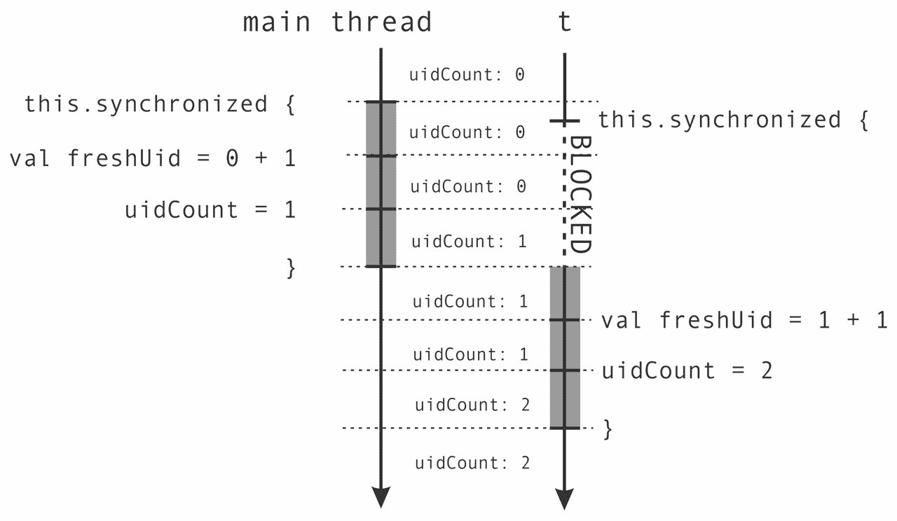

# 第二章：JVM 和 Java 内存模型上的并发

|    | *"所有非平凡的抽象，在某种程度上，都是泄漏的。" |    |
| --- | --- | --- |
|    | --*Jeff Atwood* |

自从诞生以来，Scala 主要在 JVM 上运行，这一事实推动了其许多并发库的设计。Scala 的内存模型、其多线程能力以及其线程间同步都继承自 JVM。大多数，如果不是所有，高级 Scala 并发结构都是通过本章中介绍的低级原语来实现的。这些原语是处理并发的最基本方式——从某种意义上说，本章中介绍的 API 和同步原语构成了在 JVM 上进行并发编程的汇编。

在大多数情况下，你应该避免使用后面介绍的高级结构中的低级并发，但我们认为了解线程是什么、保护块比忙等待更好，或者为什么内存模型有用是很重要的。我们相信，这对于更好地理解高级并发抽象是至关重要的。尽管普遍认为需要了解其实施知识的抽象是破绽百出的，但了解基础知识通常非常有用——在实践中，所有抽象在某种程度上都是泄漏的。

在接下来的内容中，我们不仅将解释 JVM 并发的基础知识，还将讨论它们如何与一些 Scala 特定功能交互。特别是，在本章中我们将涵盖以下主题：

+   创建和启动线程以及等待它们的完成

+   使用对象监视器和 `synchronized` 语句在线程之间进行通信

+   如何使用保护块避免忙等待

+   易变变量的语义

+   **Java 内存模型**（**JMM**）的具体细节以及为什么 JMM 很重要

在下一节中，我们将研究如何使用线程——表达并发计算的基本方式。

# 进程和线程

在现代的抢占式多任务操作系统中，程序员对程序将在哪个处理器上执行的选择几乎没有或没有控制权。实际上，同一个程序在执行过程中可能会运行在许多不同的处理器上，有时甚至在几个处理器上同时运行。通常，将程序的可执行部分分配给特定处理器的任务由**操作系统**（**OS**）来完成——这种机制称为**多任务处理**，对于计算机用户来说，这个过程是透明的。

从历史上看，多任务处理被引入操作系统是为了通过允许多个用户或程序同时使用同一台计算机的资源来改善用户体验。在协作多任务处理中，程序能够决定何时停止使用处理器并将控制权交给其他程序。然而，这需要程序员有很大的自律，程序很容易给人留下无响应的印象。例如，一个开始下载文件的下载管理器必须小心处理，以便将控制权交给其他程序。阻塞执行直到下载完成将完全破坏用户体验。大多数操作系统今天都依赖于抢占式多任务处理，其中每个程序在特定处理器上重复分配执行时间片。这些时间片被称为**时间片**。因此，多任务处理对应用程序程序员和用户来说都是透明的。

同一个计算机程序可以启动多次，甚至在同一操作系统内同时启动。**进程**是正在执行的计算机程序的一个实例。当一个进程启动时，操作系统会为其预留一部分内存和其他计算资源，并将它们与特定的计算机程序关联起来。然后操作系统将处理器与进程关联，进程在一段时间内执行。最终，操作系统将处理器的控制权交给其他进程。重要的是，一个进程的内存和其他计算资源与其他进程是隔离的：两个进程不能直接或同时读取彼此的内存或使用大部分资源。

大多数程序由单个进程组成，但有些程序在多个进程中运行。在这种情况下，程序中的不同任务被表示为不同的进程。由于不同的进程不能直接访问相同的内存区域，使用多个进程来表示多任务处理可能会很麻烦。

在多核计算机成为主流之前，多任务处理就已经很重要了。像网页浏览器这样的大型程序被划分为许多逻辑模块。浏览器的下载管理器在渲染网页或更新 HTML **文档对象模型**（**DOM**）时独立下载文件。当用户浏览社交网站时，文件下载在后台进行；但这两个独立的计算作为同一进程的一部分发生。在同一个进程中发生的这些独立计算被称为**线程**。在典型的操作系统中，线程的数量比处理器多得多。

每个线程描述了程序执行期间的当前程序**栈**和程序**计数器**的状态。程序栈包含当前正在执行的方法调用的序列，以及每个方法的局部变量和方法参数。程序计数器描述了当前方法中当前指令的位置。处理器可以通过操作其栈的状态或程序对象的状态，并执行当前程序计数器处的指令来在某些线程中推进计算。当我们说一个线程执行诸如写入内存位置之类的操作时，我们是指执行该线程的处理器执行该操作。在抢占式多任务处理中，线程执行由操作系统调度。程序员必须假设分配给他们的处理器时间对系统中的其他线程是公平的。

**操作系统线程**是操作系统提供的编程设施，通常通过特定的操作系统编程接口公开。与单独的进程不同，同一进程内的单独操作系统线程共享一个内存区域，并通过写入和读取该内存的部分来通信。另一种定义进程的方法是将其定义为包含这些线程共享的内存和资源的操作系统线程集合。

根据关于进程和线程之间关系的先前讨论，以下是一个典型的操作系统的简化示意图：


之前的图显示了同时执行多个进程的操作系统。图中只显示了前三个进程。每个进程都被分配了一个固定的计算机内存区域。实际上，操作系统的内存系统要复杂得多，但这种近似提供了一个简单的心理模型。

每个进程包含多个操作系统线程，每个进程中展示了其中两个。目前，**进程 2 的线程 1**正在**CPU 核心 1**上执行，而**进程 3 的线程 2**正在**CPU 核心 2**上执行。操作系统定期将不同的操作系统线程分配给每个 CPU 核心，以允许所有进程的计算进度。

在展示了操作系统线程和进程之间的关系后，我们将注意力转向了解这些概念如何与**Java 虚拟机**（**JVM**）相关联，Scala 程序就是在其上运行的运行时环境。

启动一个新的 JVM 实例总是只创建一个进程。在 JVM 进程中，可以同时运行多个线程。JVM 使用`java.lang.Thread`类来表示其线程。与 Python 等语言的运行时不同，JVM 没有实现其自定义线程。相反，每个 Java 线程直接映射到一个操作系统线程。这意味着 Java 线程的行为与操作系统线程非常相似，JVM 依赖于操作系统及其限制。

Scala 是一种默认编译为 JVM 字节码的编程语言，从 JVM 的角度来看，Scala 编译器的输出在很大程度上与 Java 相当。这允许 Scala 程序透明地调用 Java 库，在某些情况下甚至相反。Scala 重新使用 Java 的线程 API 有几个原因。首先，Scala 可以透明地与现有的 Java 线程模型交互，该模型已经足够全面。其次，为了兼容性原因，保留相同的线程 API 是有用的，并且 Scala 在 Java 线程 API 方面没有引入任何根本性的新内容。

本章的其余部分将展示如何使用 Scala 创建 JVM 线程，如何执行它们，以及它们如何进行通信。我们将展示和讨论几个具体的例子。已经对这一主题非常熟悉的 Java 爱好者可能会选择跳过本章的其余部分。

## 创建和启动线程

每次新的 JVM 进程启动时，它都会默认创建几个线程。其中最重要的线程是 **主线程**，它执行 Scala 程序的 `main` 方法。我们将在以下程序中展示这一点，该程序获取当前线程的名称并将其打印到标准输出：

```java
object ThreadsMain extends App { 
  val t: Thread = Thread.currentThread 
  val name = t.getName 
  println(s"I am the thread $name") 
} 

```

在 JVM 上，线程对象通过 `Thread` 类来表示。前面的程序使用静态的 `currentThread` 方法来获取当前线程对象的引用，并将其存储到名为 `t` 的局部变量中。然后它调用 `getName` 方法来获取线程的名称。如果你使用 **Simple Build Tool** (SBT) 中的 `run` 命令运行此程序，如 第一章 中所述，你应该看到以下输出：

```java
[info] I am the thread run-main-0

```

通常，主线程的名称只是 `main` 方法。我们看到不同的名称是因为 SBT 在 SBT 进程内部启动了我们的程序的一个单独的线程。为了确保程序在单独的 JVM 进程中运行，我们需要将 SBT 的 `fork` 设置设置为 `true`：

```java
> set fork := true

```

再次调用 SBT 的 `run` 命令应该给出以下输出：

```java
[info] I am the thread main

```

每个线程在其存在期间都会经历几个 **线程状态**。当创建 `Thread` 对象时，它最初处于 **新建** 状态。新创建的线程对象开始执行后，进入 **可运行** 状态。线程执行完毕后，线程对象进入 **终止状态**，不能再执行。

启动一个独立的计算线程包括两个步骤。首先，我们需要创建一个 `Thread` 对象来分配堆栈和线程状态所需的内存。为了开始计算，我们需要调用此对象上的 `start` 方法。我们将在以下示例应用程序 `ThreadsCreation` 中展示如何做到这一点：

```java
object ThreadsCreation extends App { 
  class MyThread extends Thread { 
    override def run(): Unit = { 
      println("New thread running.") 
    } 
  } 
  val t = new MyThread 
  t.start() 
  t.join() 
  println("New thread joined.") 
} 

```

当一个 JVM 应用程序启动时，它会创建一个特殊的线程，称为 **主线程**，该线程在指定的类中执行名为 `main` 的方法，在本例中是 `ThreadsCreation` 对象。当扩展 `App` 类时，`main` 方法会自动从对象体中生成。在这个例子中，主线程首先创建了一个 `MyThread` 类型的线程，并将其赋值给 `t`。

接下来，主线程通过调用 `start` 方法启动 `t`。调用 `start` 方法最终会导致新线程执行 `run` 方法。首先，操作系统被通知 `t` 必须开始执行。当操作系统决定将新线程分配给某个处理器时，这很大程度上超出了程序员的控制，但操作系统必须确保这最终发生。在主线程启动新线程 `t` 之后，它调用其 `join` 方法。此方法使主线程的执行暂停，直到 `t` 完成执行。我们说 `join` 操作将主线程置于 **等待状态**，直到 `t` 终止。重要的是，等待的线程放弃对处理器的控制，操作系统可以将该处理器分配给其他线程。

### 注意

等待的线程通知操作系统它们正在等待某个条件，并停止消耗 CPU 循环，而不是反复检查该条件。

同时，操作系统找到一个可用的处理器，并指示它运行子线程。线程必须执行的指令是通过覆盖其 `run` 方法来指定的。`MyThread` 类的 `t` 实例首先将 `"New thread running."` 文本打印到标准输出，然后终止。此时，操作系统被通知 `t` 已终止，最终允许主线程继续执行。然后操作系统将主线程放回运行状态，主线程打印 `"New thread joined."`。这在上面的图中显示：


需要注意的是，两个输出 `"New thread running."` 和 `"New thread joined."` 总是按照这个顺序打印。这是因为 `join` 调用确保了 `t` 线程的终止发生在 `join` 调用之后的指令执行之前。

当运行程序时，执行速度非常快，以至于两个`println`语句几乎同时发生。这能是`println`语句的顺序只是操作系统选择执行这些线程的方式的一个偶然现象吗？为了验证主线程确实在等待`t`，并且输出不是仅仅因为操作系统在这个特定例子中倾向于首先执行`t`，我们可以通过调整执行计划进行实验。在我们这样做之前，我们将引入一个简写来创建和启动一个新的线程；当前的语法太冗长了！新的`thread`方法简单地在一个新启动的线程中运行一个代码块。这次，我们将使用在实例化位置声明的匿名线程类来创建新的线程：

```java
def thread(body: =>Unit): Thread = { 
  val t = new Thread { 
    override def run() = body 
  } 
  t.start() 
  t 
} 

```

`thread`方法接受一个代码块体，创建一个新的线程，在该线程的`run`方法中执行此代码块，启动线程，并返回对新线程的引用，以便客户端可以调用`join`。

使用`thread`语句创建和启动线程比使用更简洁。为了使本章的示例更简洁，我们将从现在开始使用`thread`语句。然而，在使用`thread`语句之前，你应该三思而后行。谨慎地将语法负担与计算成本相关联；轻量级语法可能会被误认为是廉价操作，而创建一个新线程相对较贵。

我们现在可以通过确保所有处理器都可用来与操作系统进行实验。为此，我们将使用`Thread`类的静态`sleep`方法，该方法将当前正在执行的线程的执行推迟指定的毫秒数。此方法将线程置于**定时等待**状态。当调用`sleep`时，操作系统可以重新使用处理器为其他线程服务。尽管如此，我们仍然需要一个比典型操作系统上的时间片大得多的睡眠时间，时间片通常在 10 到 100 毫秒之间。以下代码展示了这一点：

```java
object ThreadsSleep extends App { 
  val t = thread { 
    Thread.sleep(1000) 
    log("New thread running.") 
    Thread.sleep(1000) 
    log("Still running.") 
    Thread.sleep(1000) 
    log("Completed.") 
  } 
  t.join() 
  log("New thread joined.") 
} 

```

`ThreadSleep`应用程序的主线程创建并启动一个新的`t`线程，该线程睡眠一秒钟，然后输出一些文本，然后重复两次或更多次，最后终止。主线程像以前一样调用`join`，然后打印`"New thread joined."`。

注意，我们现在正在使用第一章中描述的`log`方法，*介绍*。`log`方法打印指定的字符串值以及调用`log`方法的线程的名称。

无论你运行前面应用程序多少次，最后的输出总是`"New thread joined."`。这个程序是**确定性的**：给定特定的输入，它将始终产生相同的输出，无论操作系统选择的执行计划如何。

然而，并不是所有使用线程的应用程序在给定相同输入的情况下都会始终产生相同的输出。以下代码是一个**非确定性**应用的例子：

```java
object ThreadsNondeterminism extends App { 
  val t = thread { log("New thread running.") } 
  log("...") 
  log("...") 
  t.join() 
  log("New thread joined.") 
} 

```

没有保证主线程中的`log("...")`语句会在`t`线程中的`log`调用之前或之后发生。在多核处理器上多次运行应用程序会在`t`线程的输出之前、之后或与之交织地打印`"..."`。通过运行程序，我们得到以下输出：

```java
run-main-46: ...
Thread-80: New thread running.
run-main-46: ...
run-main-46: New thread joined.

```

再次运行程序会导致这些输出之间的顺序不同：

```java
Thread-81: New thread running.
run-main-47: ...
run-main-47: ...
run-main-47: New thread joined.

```

大多数多线程程序都是非确定性的，这也是多线程编程如此困难的原因。这有多种可能的原因。首先，程序可能太大，程序员无法推理其确定性属性，线程之间的交互可能过于复杂。但有些程序本质上是非确定性的。一个网络服务器不知道哪个客户端将是第一个发送网页请求的。它必须允许这些请求以任何可能的顺序到达，并尽快对它们做出响应。根据客户端为网络服务器准备输入的顺序，即使请求相同，它们的行为也可能不同。

## 原子执行

我们已经看到线程可以通信的一种基本方式：通过等待彼此终止。被连接的线程提供的信息是它已经终止。然而，在实践中，这个信息并不一定有用；例如，渲染网页浏览器中一个页面的线程必须通知其他线程已访问特定的 URL，以便以不同的颜色渲染已访问的 URL。

结果表明，线程上的`join`方法有一个额外的属性。被连接的线程执行的内存写入操作发生在`join`调用返回之前，并且对调用`join`方法的线程是可见的。以下示例说明了这一点：

```java
object ThreadsCommunicate extends App { 
  var result: String = null 
  val t = thread { result = "\nTitle\n" + "=" * 5 } 
  t.join() 
  log(result) 
} 

```

主线程永远不会打印`null`，因为`join`调用总是在`log`调用之前发生，并且`result`的赋值发生在`t`终止之前。这种模式是线程可以使用它们的结果以非常基本的方式相互通信的一种方式。

然而，这种模式只允许非常受限的单向通信，并且不允许线程在执行期间相互通信。有许多无限制双向通信的使用场景。一个例子是分配唯一标识符，其中一组线程并发选择数字，使得没有两个线程产生相同的数字。我们可能会倾向于按照以下不正确的示例进行操作。我们首先展示程序的前半部分：

```java
object ThreadsUnprotectedUid extends App { 
  var uidCount = 0L 
  def getUniqueId() = { 
    val freshUid = uidCount + 1 
    uidCount = freshUid 
    freshUid 
  } 

```

在前面的代码片段中，我们首先声明一个`uidCount`变量，该变量将保存任何线程选择的最后一个唯一标识符。线程将调用`getUniqueId`方法来计算第一个未使用的标识符，然后更新`uidCount`变量。在这个例子中，读取`uidCount`以初始化`freshUid`和将`freshUid`赋值回`uniqueUid`并不一定同时发生。我们说这两个语句不是原子地发生的，因为其他线程的语句可以任意交错。接下来，我们定义一个`printUniqueIds`方法，该方法接受一个数字`n`，该方法调用`getUniqueId`来生成`n`个唯一标识符，然后打印它们。我们使用 Scala 的 for-comprehensions 将范围`0 until n`映射到唯一标识符。最后，主线程启动一个新的`t`线程，该线程调用`printUniqueIds`方法，然后与`t`线程并发调用`printUniqueIds`如下：

```java
  def printUniqueIds(n: Int): Unit = { 
    val uids = for (i<- 0 until n) yield getUniqueId() 
    log(s"Generated uids: $uids") 
  } 
  val t = thread { printUniqueIds(5) } 
  printUniqueIds(5) 
  t.join() 
} 

```

运行此应用程序几次会揭示，两个线程生成的标识符不一定唯一；在某些运行中，应用程序打印`Vector(1, 2, 3, 4, 5)`和`Vector(1, 6, 7, 8, 9)`，但在其他运行中则不会！程序的输出取决于不同线程中语句执行的时机。

### 注意

**竞态条件**是一种现象，其中并发程序的结果取决于程序中语句的执行顺序。

竞态条件不一定是程序的不正确行为。然而，如果某些执行顺序导致程序输出不期望的结果，则认为竞态条件是程序错误。前一个示例中的竞态条件是程序错误，因为`getUniqueId`方法不是原子的。`t`线程和主线程有时会并发调用`getUniqueId`。在第一行，它们并发读取`uidCount`的值，该值最初为`0`，并得出结论，它们的`freshUid`变量应该是`1`。`freshUid`变量是一个局部变量，因此它是在线程栈上分配的；每个线程都看到该变量的一个单独实例。此时，线程决定以任何顺序将值`1`写回`uidCount`，并且两者都返回一个非唯一标识符`1`。这在下图中得到说明：


大多数程序员从顺序编程中继承的心理模型与`getUniqueId`方法在并发执行时的执行之间存在不匹配。这种不匹配源于对`getUniqueId`原子执行的假设。代码块的原子执行意味着在该块中由一个线程执行的各个语句不能与另一个线程执行的语句交织。在原子执行中，语句只能一次性执行，这正是`uidCount`字段应该更新的方式。`getUniqueId`函数内部的代码读取、修改和写入一个值，这在 JVM 上不是原子的。需要额外的语言结构来保证原子性。允许这种类型原子执行的 Scala 基本结构称为`synchronized`语句，并且可以在任何对象上调用。这允许我们将`getUniqueId`定义为以下内容：

```java
def getUniqueId() = this.synchronized { 
  val freshUid = uidCount + 1 
  uidCount = freshUid 
  freshUid 
} 

```

`synchronized`调用确保后续的代码块只有在没有其他线程同时执行此`synchronized`代码块或任何其他在相同`this`对象上调用的`synchronized`代码块时才能执行。在我们的例子中，`this`对象是封装的单例对象`ThreadsUnprotectedUid`，但在一般情况下，这可以是封装类的实例或特质。

下图展示了`getUniqueId`方法的两次并发调用：



我们也可以调用`synchronized`并省略`this`部分，在这种情况下，编译器将推断出周围的对象是什么，但我们强烈建议您不要这样做。在错误的对象上同步会导致不易识别的并发错误。

### 小贴士

总是明确声明`synchronized`语句的接收者，这样做可以保护您免受微妙且难以发现的程序错误的侵害。

JVM 确保在某个`x`对象上调用`synchronized`语句的线程是唯一执行该特定`x`对象上任何`synchronized`语句的线程。如果一个`T`线程在`x`上调用`synchronized`，而另一个`S`线程也在`x`上调用`synchronized`，那么`T`线程将被置于**阻塞**状态。一旦`S`线程完成其`synchronized`语句，JVM 可以选择`T`线程来执行其自己的`synchronized`语句。

在 JVM 内部创建的每个对象都有一个特殊的实体，称为**内在锁**或**监视器**，它用于确保只有一个线程在执行该对象上的某些`synchronized`块。当一个线程开始执行`synchronized`块时，我们说该线程**获得**了`x`监视器的所有权，或者换句话说，**获取**了它。当一个线程完成`synchronized`块时，我们说它**释放**了监视器。

`synchronized`语句是 Scala 和 JVM 中线程间通信的基本机制之一。每当存在多个线程可能访问和修改某个对象中的字段时，你应该使用`synchronized`语句。

## 重排序

`synchronized`语句并非没有代价：受`synchronized`语句保护的字段，如`uidCount`的写入通常比常规的无保护写入更昂贵。`synchronized`语句的性能惩罚取决于 JVM 实现，但通常并不大。当你认为程序语句没有不良交织时，可能会倾向于避免使用`synchronized`，就像我们在之前的唯一标识符示例中看到的那样。永远不要这样做！现在我们将向你展示一个最小示例，说明这会导致严重错误。

让我们考虑以下程序，其中两个线程`t1`和`t2`访问一对布尔变量`a`和`b`以及一对整数变量`x`和`y`。`t1`线程将变量`a`设置为`true`，然后读取`b`的值。如果`b`的值为`true`，则`t1`线程将`0`赋值给`y`，否则赋值`1`。`t2`线程执行相反的操作：它首先将`true`赋值给变量`b`，然后如果`a`为`true`，则将`0`赋值给`x`，否则赋值`1`。这在一个循环中重复`100000`次，如下面的代码片段所示：

```java
object ThreadSharedStateAccessReordering extends App { 
  for (i <- 0 until 100000) { 
    var a = false 
    var b = false 
    var x = -1 
    var y = -1 
    val t1 = thread { 
      a = true 
      y = if (b) 0 else 1 
    } 
    val t2 = thread { 
      b = true 
      x = if (a) 0 else 1 
    } 
    t1.join() 
    t2.join() 
    assert(!(x == 1 && y == 1), s"x = $x, y = $y") 
  } 
} 

```

这个程序有些微妙，因此我们需要仔细考虑几个可能的执行场景。通过分析`t1`和`t2`线程指令的可能交织，我们可以得出结论，如果两个线程同时向`a`和`b`赋值，那么它们都会将`0`赋值给`x`和`y`。

这个结果表明两个线程几乎同时开始，如下面的图中左侧所示：


或者，让我们假设`t2`线程执行得更快。在这种情况下，`t2`线程将变量`b`设置为`true`，然后读取`a`的值。这发生在`t1`线程进行赋值之前，因此`t2`线程读取到`false`，并将`1`赋值给`x`。当`t1`线程执行时，它看到`b`的值为`true`，并将`0`赋值给`y`。上述事件序列在前面图中的右侧显示。请注意，如果`t1`线程先开始，则会导致类似的赋值，其中`x = 0`和`y = 1`，所以它没有在图中显示。

结论是，无论我们如何重新排序`t1`和`t2`线程中的语句执行，程序的输出都不应该是`x = 1`和`y = 1`同时发生。因此，循环末尾的断言永远不会抛出异常。

然而，在运行程序几次之后，我们得到了以下输出，这表明`x`和`y`可以同时被赋予值`1`：

```java
[error] Exception in thread "main": assertion failed: x = 1, y = 1

```

这个结果令人恐惧，似乎违反了常识。我们为什么不能像以前那样推理程序的执行呢？答案是，根据 JMM 规范，只要不改变特定线程程序的序列语义，JVM 允许重新排序一个线程执行的一定程序语句。这是因为某些处理器并不总是按程序顺序执行指令。此外，线程不需要立即将所有更新写入主内存，而可以暂时将它们缓存处理器内部的寄存器中。这最大化了程序的效率，并允许更好的编译器优化。

那么，我们该如何推理多线程程序呢？我们在分析示例时犯的错误是假设一个线程的写入对其他所有线程都是立即可见的。我们始终需要应用适当的同步来确保一个线程的写入对另一个线程是可见的。

`synchronized`语句是实现适当同步的基本方法之一。任何在`x`对象上执行`synchronized`语句的线程的写入不仅具有原子性，而且对在`x`上执行`synchronized`的线程也是可见的。在`t1`和`t2`线程中将每个赋值语句包裹在`synchronized`语句中，可以使程序按预期运行。

### 小贴士

当访问（读取或修改）多个线程之间共享的状态时，在对象`x`上使用`synchronized`语句。这确保在任何时候，最多只有一个线程在执行`x`上的`synchronized`语句。它还确保`T`线程对内存的所有写入都对随后在相同对象`x`上执行`synchronized`的所有其他线程可见。

在本章的其余部分以及第三章中，我们将看到额外的同步机制，例如`volatile`和原子变量。在下一节中，我们将探讨`synchronized`语句的其他用例，并了解对象监视器。

# 监视器和同步

在本节中，我们将更详细地研究使用`synchronized`语句进行线程间通信。正如我们在前面的章节中看到的，`synchronized`语句既用于确保不同线程执行的写入的可见性，也用于限制对共享内存区域的并发访问。一般来说，对共享资源执行访问限制的同步机制被称为**锁**。锁还用于确保没有两个线程同时执行相同的代码；也就是说，它们实现了**互斥**。

如前所述，JVM 上的每个对象都有一个特殊的内置**监视器锁**，也称为**内在锁**。当一个线程在`x`对象上调用`synchronized`语句时，如果没有任何其他线程拥有监视器，它就获得了`x`对象的监视器锁。否则，线程将被阻塞，直到监视器被释放。一旦获得监视器所有权，线程就可以见证之前释放该监视器的所有线程的内存写入。

自然的结果是`同步`语句可以嵌套。一个线程可以同时拥有属于几个不同对象的监视器。当从简单的组件构建更大的系统时，这很有用。我们事先不知道独立软件组件使用哪些监视器集合。让我们假设我们正在设计一个在线银行系统，我们希望记录货币转账。我们可以在可增长的`ArrayBuffer`数组实现中维护所有货币转账的转账列表。银行应用程序不直接操作转账，而是通过调用`transfers`上的`synchronized`的`logTransfer`方法来追加新消息。`ArrayBuffer`实现是为单线程使用而设计的集合，因此我们需要保护它免受并发写入的影响。我们将首先定义`logTransfer`方法：

```java
object SynchronizedNesting extends App { 
  import scala.collection._ 
  private val transfers = mutable.ArrayBuffer[String]() 
  def logTransfer(name: String, n: Int) = transfers.synchronized { 
    transfers += s"transfer to account '$name' = $n" 
  } 

```

除了银行系统的日志模块之外，账户由`Account`类表示。`Account`对象持有关于其所有者和他们拥有的金额的信息。要向账户中添加一些钱，系统使用一个获取`Account`对象监视器并修改其`money`字段的`add`方法。银行的业务流程要求特别处理大额转账：如果货币转账超过 10 个货币单位，我们需要记录它。在以下代码中，我们将定义`Account`类和`add`方法，该方法向`Account`对象添加金额`n`：

```java
  class Account(val name: String, var money: Int) 
  def add(account: Account, n: Int) = account.synchronized { 
    account.money += n 
    if (n > 10) logTransfer(account.name, n) 
  } 

```

`add`方法在`synchronized`语句内部调用`logTransfer`，而`logTransfer`首先获取`transfers`监视器。重要的是，这发生时不会释放`account`监视器。如果`transfers`监视器当前被某个其他线程获取，当前线程将进入阻塞状态，而不会释放它之前获取的任何监视器。

在以下示例中，主应用程序创建了两个单独的账户和三个执行转账的线程。一旦所有线程完成转账，主线程将输出所有已记录的转账：

```java
  // Continuation of the bank account example. 
  val jane = new Account("Jane", 100) 
  val john = new Account("John", 200) 
  val t1 = thread { add(jane, 5) } 
  val t2 = thread { add(john, 50) } 
  val t3 = thread { add(jane, 70) } 
  t1.join(); t2.join(); t3.join() 
  log(s"--- transfers ---\n$transfers") 
} 

```

在这个示例中，使用`synchronized`语句防止了线程`t1`和`t3`通过并发修改 Jane 的账户来破坏其账户。`t2`和`t3`线程也访问`transfers`日志。这个简单的示例展示了嵌套的用途：我们不知道我们的银行系统中哪些其他组件可能使用了`transfers`日志。为了保持封装并防止代码重复，独立的软件组件不应显式同步以记录货币转移；相反，同步被隐藏在`logTransfer`方法中。

## 死锁

在银行系统示例中，对我们有利的一个因素是`logTransfer`方法永远不会尝试获取除`transfers`监视器之外的任何监视器。一旦获取了监视器，线程最终会修改`transfers`缓冲区并释放监视器；在嵌套监视器获取的堆栈中，`transfers`总是最后。鉴于`logTransfer`是唯一在`transfers`上同步的方法，它不能无限期地延迟其他在`transfers`上同步的线程。

**死锁**是一种通用情况，其中两个或多个执行在继续自己的操作之前等待对方完成操作。等待的原因是每个执行都获得了对其他执行需要的资源的独占访问权。以我们日常生活中的一个例子来说明，假设你和你的同事坐在自助餐厅里，准备开始吃午餐。然而，桌子上只有一个叉子和一把刀，你需要这两样餐具才能吃饭。你拿起叉子，但你的同事拿起刀。你们两个都在等待对方吃完饭，但都不愿意放下自己的餐具。你现在处于死锁状态，你将永远无法吃完午餐。好吧，至少直到你的老板到来看到发生了什么。

在并发编程中，当两个线程同时获取两个不同的监视器，然后尝试获取另一个线程的监视器时，会发生死锁。两个线程都会进入阻塞状态，直到另一个监视器被释放，但不会释放它们拥有的监视器。

`logTransfer`方法永远不会引起死锁，因为它只尝试获取最终会释放的单个监视器。现在让我们扩展我们的银行示例，允许在特定账户之间进行货币转移，如下所示：

```java
object SynchronizedDeadlock extends App { 
  import SynchronizedNesting.Account 
  def send(a: Account, b: Account, n: Int) = a.synchronized { 
    b.synchronized { 
      a.money -= n 
      b.money += n 
    } 
  } 

```

我们从上一个示例中导入`Account`类。`send`方法原子性地将给定金额`n`从账户`a`转移到另一个账户`b`。为此，它对两个账户都调用了`synchronized`语句，以确保没有其他线程正在同时修改任一账户，如下面的代码片段所示：

```java
  val a = new Account("Jack", 1000) 
  val b = new Account("Jill", 2000) 
  val t1 = thread { for (i<- 0 until 100) send(a, b, 1) } 
  val t2 = thread { for (i<- 0 until 100) send(b, a, 1) } 
  t1.join(); t2.join() 
  log(s"a = ${a.money}, b = ${b.money}") 
} 

```

现在，假设我们银行的新客户杰克和吉尔刚刚开设了账户，并对新的电子银行平台感到惊讶。他们登录并开始互相发送小额金钱以测试它，疯狂地按发送按钮 100 次。很快，发生了一件非常糟糕的事情。执行杰克和吉尔请求的`t1`和`t2`线程，以账户`a`和`b`的顺序相反的方式同时调用`send`。线程`t1`锁定`a`，而`t2`锁定`b`，但随后两者都无法锁定另一个账户。让杰克和吉尔惊讶的是，新的转账系统并不像看起来那么完美。如果你正在运行这个示例，你将想要在这个时候关闭终端会话并重新启动 SBT。

### 注意

当一组两个或更多线程获取资源后，然后循环尝试获取其他线程的资源而不释放自己的资源时，会发生死锁。

我们如何防止死锁的发生？回想一下，在最初的银行系统示例中，获取监视器的顺序是明确定义的。首先获取单个账户监视器，然后可能随后获取`transfers`监视器。你应该确信，无论何时以相同的顺序获取资源，都不会有死锁的危险。当线程`T`等待由某个其他线程`S`获取的资源`X`时，线程`S`永远不会尝试获取`T`已经持有的任何资源`Y`，因为`Y` < `X`，而`S`可能只尝试获取`Y` > `X`的资源。这种排序打破了循环，这是死锁的必要前提条件之一。

### 小贴士

在获取资源时建立资源的总顺序；这确保了没有一组线程会循环等待它们之前获取的资源。

在我们的例子中，我们需要在不同账户之间建立一种顺序。这样做的一种方法是在前面的章节中引入的`getUniqueId`方法：

```java
import SynchronizedProtectedUid.getUniqueId 
class Account(val name: String, var money: Int) { 
  val uid = getUniqueId() 
} 

```

新的`Account`类确保无论在哪个线程上创建，两个账户都不会共享相同的`uid`值。然后，无死锁的`send`方法需要按照账户的`uid`值顺序获取账户，如下所示：

```java
def send(a1: Account, a2: Account, n: Int) { 
  def adjust() { 
    a1.money -= n 
    a2.money += n 
  } 
  if (a1.uid < a2.uid) 
    a1.synchronized { a2.synchronized { adjust() } } 
  else a2.synchronized { a1.synchronized { adjust() } } 
} 

```

在银行软件工程师的快速响应后，杰克和吉尔又愉快地互相发送金钱。阻塞线程的循环链不再发生。

死锁是任何并发系统中固有的，其中线程无限期地等待资源而不释放它们之前获取的资源。然而，尽管应该避免死锁，但它们通常不像听起来那么致命。关于死锁的一个好事情是，根据其定义，死锁的系统不会进步。解决杰克和吉尔问题的开发者能够通过执行正在运行的 JVM 实例的堆转储并分析线程堆栈来迅速行动；死锁至少可以很容易地识别，即使它们发生在生产系统中。这与由于竞争条件引起的错误不同，这些错误只有在系统过渡到无效状态之后才会变得明显。

## 保护块

创建一个新的线程比创建一个新的轻量级对象，如`Account`，要昂贵得多。一个高性能的银行系统应该快速响应，当每秒有数千个请求时，为每个请求创建一个新的线程可能会太慢。应该重用相同的线程来处理许多请求；这样的一组可重用线程通常被称为**线程池**。

在下面的示例中，我们将定义一个特殊的线程，称为`worker`，当其他线程请求时，它将执行一个代码块。我们将使用 Scala 标准库集合包中的可变`Queue`类来存储计划执行的代码块：

```java
import scala.collection._ 
object SynchronizedBadPool extends App { 
  private val tasks = mutable.Queue[() => Unit]() 

```

我们使用`() => Unit`函数类型来表示代码块。`worker`线程会重复调用`poll`方法，该方法在`tasks`上同步，以检查队列是否非空。`poll`方法表明`synchronized`语句可以返回一个值。在这种情况下，如果有任务要做，它返回一个可选的`Some`值，否则返回`None`。`Some`对象包含要执行的代码块：

```java
  val worker = new Thread { 
    def poll(): Option[() => Unit] = tasks.synchronized { 
      if (tasks.nonEmpty) Some(tasks.dequeue()) else None 
    } 
    override def run() = while (true) poll() match { 
      case Some(task) => task() 
      case None => 
    } 
  } 
  worker.setName("Worker") 
  worker.setDaemon(true) 
  worker.start() 

```

在启动之前，我们将`worker`线程设置为**守护线程**。通常，当主线程终止时，JVM 进程不会停止。只有当所有非守护线程终止时，JVM 进程才会终止。我们希望`worker`是一个守护线程，因为我们使用`asynchronous`方法向它发送工作，该方法安排给定的代码块最终执行`worker`线程：

```java
  def asynchronous(body: =>Unit) = tasks.synchronized { 
    tasks.enqueue(() => body) 
  } 
  asynchronous { log("Hello") } 
  asynchronous { log(" world!")} 
  Thread.sleep(5000) 
} 

```

运行前面的示例，并观察`worker`线程打印`Hello`然后`world!`。现在听听你的笔记本电脑。风扇应该已经开始嗡嗡作响了。打开你的**任务管理器**，或者如果你在 Unix 系统上运行此程序，简单地在终端中输入`top`。你的 CPU 中有一个进程被`java`完全占用。你可以猜到原因。在`worker`完成其工作后，它会不断地检查队列中是否有任何任务。我们说`worker`线程正在**忙等待**。忙等待是不希望的，因为它无谓地使用了处理器功率。然而，一旦主线程终止，守护线程不应该停止吗？一般来说，是的，但我们是从 SBT 中运行这个示例的，SBT 本身也是在同一个 JVM 进程中运行的。SBT 有自己的非守护线程，所以我们的`worker`线程没有被停止。为了告诉 SBT 它应该在新的进程中执行`run`命令，请输入以下指令：

```java
set fork := true 

```

再次运行前面的示例应该会在主线程完成执行后立即停止`worker`线程。然而，我们的忙等待`worker`线程可能是更大应用的一部分，该应用不会那么快就终止。不断创建新线程可能会很昂贵，但忙等待线程的成本更高。几个这样的线程可以迅速降低系统性能。只有少数应用程序中忙等待才有意义。如果你仍然怀疑这是危险的，请在笔记本电脑上以电池供电运行此示例，然后去拿点零食。在这样做之前，请确保保存所有打开的文件；一旦 CPU 耗尽所有电池电量，你可能会丢失数据。

我们真正希望`worker`线程做到的是进入等待状态，类似于我们调用`join`时线程所做的那样。它应该在确保`tasks`队列中有额外的函数对象要执行后才能唤醒。

Scala 对象（以及一般而言的 JVM 对象）支持一对特殊方法，称为`wait`和`notify`，分别允许等待和唤醒等待的线程。只有在当前线程拥有对象`x`的监视器时，才可以在`x`对象上调用这些方法。换句话说，`wait`和`notify`只能从拥有该对象监视器的线程中调用。当一个线程`T`在对象上调用`wait`时，它会释放监视器并进入等待状态，直到另一个线程`S`在同一个对象上调用`notify`。线程`S`通常会为`T`准备一些数据，如下面的示例中，主线程为`greeter`线程设置了`Some`消息以便打印：

```java
object SynchronizedGuardedBlocks extends App { 
  val lock = new AnyRef 
  var message: Option[String] = None 
  val greeter = thread { 
    lock.synchronized { 
      while (message == None) lock.wait() 
      log(message.get) 
    } 
  } 
  lock.synchronized { 
    message = Some("Hello!") 
    lock.notify() 
  } 
  greeter.join() 
} 

```

线程使用从`AnyRef`类型的`lock`对象中获取的监视器，该对象映射到`java.lang.Object`类。`greeter`线程首先获取锁的监视器，并检查消息是否设置为`None`。如果是，目前还没有任何输出，`greeter`线程在`lock`上调用`wait`。在调用`wait`时，`lock`监视器被释放，之前在`synchronized`语句处阻塞的主线程现在获得了`lock`监视器的所有权，设置了消息，并调用了`notify`。当主线程离开`synchronized`块时，它释放了`lock`。这导致`greeter`唤醒，获取`lock`，再次检查是否有消息，然后输出。由于`greeter`获取了主线程之前释放的相同监视器，主线程对`message`的写入发生在`greeter`线程的检查之前。我们现在知道`greeter`线程将看到消息。在这个例子中，无论哪个线程首先运行`synchronized`，`greeter`线程都将输出`Hello!`。

`wait`方法的一个重要属性是它可以导致**虚假唤醒**。偶尔，JVM 允许唤醒一个调用了`wait`的线程，即使没有相应的`notify`调用。为了防止这种情况，我们必须始终像上一个例子中那样将`wait`与检查条件的`while`循环一起使用。使用`if`语句是不正确的，因为虚假唤醒可能会允许线程执行`message.get`，即使`message`没有被设置为不同于`None`的值。

### 注意

在检查条件的线程唤醒之后，监视器被该线程拥有，因此我们保证检查是原子性执行的。请注意，检查条件的线程必须获取监视器才能唤醒。如果它不能立即获取监视器，它将进入阻塞状态。

在调用`wait`之前反复检查某些条件的`synchronized`语句被称为**保护块**。我们现在可以使用我们对保护块的了解来避免在`worker`线程中提前忙等待。现在，我们将使用监视器展示完整的`worker`实现：

```java
object SynchronizedPool extends App { 
  private val tasks = mutable.Queue[() => Unit]() 
  object Worker extends Thread { 
    setDaemon(true) 
    def poll() = tasks.synchronized { 
      while (tasks.isEmpty) tasks.wait() 
      tasks.dequeue() 
    } 
    override def run() = while (true) { 
      val task = poll() 
      task() 
    } 
  } 
  Worker.start() 
  def asynchronous(body: =>Unit) = tasks.synchronized { 
    tasks.enqueue(() => body) 
    tasks.notify() 
  } 
  asynchronous { log("Hello ") } 
  asynchronous { log("World!") } 
  Thread.sleep(500) 
} 

```

在这个例子中，我们将`Worker`线程作为我们的应用程序中的一个单例对象声明，以使代码更简洁。这次，`poll`方法在`tasks`对象上调用`wait`，并等待主线程将代码块添加到`tasks`中并在异步方法中调用`notify`。启动示例并再次检查您的 CPU 使用情况。如果您从运行忙等待示例以来重新启动了 SBT（并且仍然有电池电量），您将看到`java`进程的 CPU 使用率为零。

## 中断线程和优雅关闭

在前面的例子中，`Worker`线程在其`run`方法中无限循环，永远不会终止。你可能对此感到满意；如果`Worker`没有工作要做，它不会使用 CPU，并且由于`Worker`是守护线程，当应用程序退出时它将被销毁。然而，其堆栈空间直到应用程序终止才被回收。如果我们有很多休眠的工作线程，我们可能会耗尽内存。停止休眠线程执行的一种方法是通过以下方式中断它：

```java
Worker.interrupt() 

```

在处于等待或定时等待状态的线程上调用`interrupt`方法会导致它抛出`InterruptedException`。这个异常可以被捕获和处理，但在这个情况下，它将终止`Worker`线程。然而，如果我们在这个线程正在运行时调用此方法，则不会抛出异常，并且线程的`interrupt`标志被设置。一个不阻塞的线程必须定期使用`isInterrupted`方法查询中断标志。

另一种方法是实现一个称为**优雅关闭**的惯用表达法。在优雅关闭中，一个线程设置终止条件，然后调用`notify`来唤醒工作线程。然后工作线程释放所有资源并自愿终止。我们首先引入一个名为`terminated`的变量，如果线程应该停止，则该变量为`true`。`poll`方法在等待`tasks`之前会检查这个变量，并且只有在`Worker`线程应该继续运行的情况下才可选地返回一个任务，如下面的代码所示：

```java
object Worker extends Thread { 
  var terminated = false 
  def poll(): Option[() => Unit] = tasks.synchronized { 
    while (tasks.isEmpty && !terminated) tasks.wait() 
    if (!terminated) Some(tasks.dequeue()) else None 
  } 

```

我们将`run`方法修改为在模式匹配中检查`poll`是否返回`Some(task)`。我们不再在`run`方法中使用`while`循环。相反，如果`poll`返回`Some(task)`，我们将尾递归地调用`run`：

```java
  import scala.annotation.tailrec 
  @tailrec override def run() = poll() match { 
    case Some(task) => task(); run() 
    case None => 
  } 
  def shutdown() = tasks.synchronized { 
    terminated = true 
    tasks.notify() 
  } 
} 

```

主线程现在可以调用`Worker`线程的同步`shutdown`方法来与终止请求进行通信。不再需要将`Worker`线程设置为守护线程。最终，`Worker`线程将自行终止。

### 小贴士

为了确保各种实用线程能够正确地终止，避免竞争条件，请使用优雅关闭的惯用表达法。

当我们无法使用`notify`唤醒线程时，调用`interrupt`比优雅关闭更可取的情况。一个例子是当线程在`InterruptibleChannel`对象上执行阻塞 I/O 时，在这种情况下，线程正在调用的`wait`方法的对象是隐藏的。

`Thread`类还定义了一个已过时的`stop`方法，该方法通过抛出`ThreadDeath`异常立即终止线程。你应该避免使用它，因为它可能在任意点停止线程的执行，这可能导致程序数据处于不一致的状态。

# 易失性变量

JVM 提供了一种比 `synchronized` 块更轻量级的同步形式，称为 **volatile 变量**。Volatile 变量可以原子地读取和修改，通常用作状态标志；例如，用于表示计算已完成或已取消。它们有两个优点。首先，对 volatile 变量的写入和读取不能在单个线程中重新排序。其次，写入 volatile 变量对其他所有线程都是立即可见的。

### 注意

标记为 volatile 的变量的读取和写入永远不会重新排序。如果另一个线程通过读取相同变量的读取 `R` 观察到对 volatile `v` 变量的写入 `W`，则保证在读取 `R` 之后观察到所有在写入 `W` 之前发生的写入。

在以下示例中，我们在文本的几个页面上搜索至少一个 `!` 字符。单独的线程开始扫描由特别喜爱某个流行虚构英雄的人编写的文本的单独页面 `p`。一旦一个线程找到感叹号，我们希望停止其他线程的搜索：

```java
class Page(val txt: String, var position: Int) 
object Volatile extends App { 
  val pages = for (i<- 1 to 5) yield 
    new Page("Na" * (100 - 20 * i) + " Batman!", -1) 
  @volatile var found = false 
  for (p <- pages) yield thread { 
    var i = 0 
    while (i < p.txt.length && !found) 
      if (p.txt(i) == '!') { 
        p.position = i 
        found = true 
      } else i += 1 
  } 
  while (!found) {} 
  log(s"results: ${pages.map(_.position)}") 
} 

```

文本的单独页面由 `Page` 类表示，该类有一个特殊的 `position` 字段用于存储感叹号搜索的结果。`found` 标志表示某个线程找到了一个感叹号。我们向 `found` 标志添加 `@volatile` 注解以声明其为 volatile。当某个线程在某个页面上找到感叹号字符时，将存储 `position` 值并将 `found` 标志设置为其他线程可以提前停止搜索。所有线程最终扫描整个文本是完全可能的，但更有可能的是，它们在看到 `found` 为 `true` 之前就看到了。因此，至少有一个线程存储了感叹号的位置。

在本例中，主线程忙等待直到读取到 `found`，其为 `true`。然后打印位置。请注意，在派生线程中，对 `position` 的写入发生在对 `found` 的写入之前，这又发生在主线程读取 `found` 之前。这意味着主线程总是看到设置 `found` 的线程的写入，因此至少打印一个除 `-1` 之外的位置。

早期部分中的 `ThreadSharedStateAccessReordering` 示例可以通过声明所有变量为 volatile 来修复。正如我们将在下一节中学习的，这确保了从 `a` 和 `b` 读取和写入之间的正确顺序。与 Java 不同，Scala 允许你声明局部字段为 volatile（在这种情况下，局部于包围的 `for` 循环的闭包）。为在某个闭包或嵌套类中使用的每个局部 volatile 变量创建一个具有 volatile 字段的堆对象。我们说变量被 **提升** 到一个对象中。

易失性读取通常非常便宜。然而，在大多数情况下，你应该求助于`synchronized`语句；易失性语义微妙且容易出错。特别是，没有额外同步的多重易失性读取和写入不是原子的；仅易失性本身不能帮助我们正确实现`getUniqueId`。

# Java 内存模型

尽管我们在这章中从未明确指出，但实际上我们已经定义了 JMM 的大部分内容。那么，内存模型究竟是什么呢？

语言内存模型是一种规范，它描述了在什么情况下对变量的写入对其他线程可见。你可能认为对变量`v`的写入在处理器执行后立即改变相应的内存位置，并且其他处理器会立即看到`v`的新值。这种内存一致性模型被称为**顺序一致性**。

正如我们在`ThreadSharedStateAccessReordering`示例中已经看到的，顺序一致性与处理器和编译器实际工作方式的关系很小。写入很少立即结束在主内存中；相反，处理器有层次化的缓存，以确保更好的性能并保证数据最终写入主内存。编译器允许使用寄存器来推迟或避免内存写入，并重新排序语句以实现最佳性能，只要它不改变序列语义。这样做是有意义的；虽然这本书中的简短示例中穿插着同步原语，但在实际程序中，不同线程之间的通信相对较少，与花费在有用工作上的时间相比。

### 注意

内存模型是在并发程序的预期行为和编译器执行优化的能力之间的一种权衡。并非每种语言或平台都有内存模型。一个典型的纯函数式编程语言，它不支持突变，根本不需要内存模型。

处理器架构之间的差异导致了不同的内存模型；如果没有`synchronized`语句或易失性读取和写入的精确语义，正确编写在每台计算机上都能以相同方式工作的 Scala 程序是非常困难，如果不是不可能的。Scala 从 JVM 继承了其内存模型，JVM 精确地指定了程序中不同操作之间的一系列**发生之前**的关系。

在 JMM 中，不同的操作包括（易失性）变量读取和写入、获取和释放对象监视器、启动线程以及等待其终止。如果一个操作 A 在操作 B 之前发生，那么操作 B 将看到 A 的内存写入。对于同一程序，无论它在哪个机器上运行，这一组发生之前的关系都是有效的；确保这一点是 JVM 的任务。我们之前已经总结了大部份这些规则，但现在我们将提供一个完整的概述：

+   **程序顺序**: 线程中的每个操作都发生在该线程程序顺序中的每个后续操作之前。

+   **监视器锁定**: 监视器解锁发生在对该监视器后续所有锁定之前。

+   **易变字段**: 对易变字段的写入操作发生在对该易变字段后续所有读取操作之前。

+   **线程启动**: 在线程上调用 `start()` 的操作发生在启动的线程中任何操作之前。

+   **线程终止**: 线程中的任何操作都发生在另一个线程完成对该线程的 `join()` 调用之前。

+   **传递性**: 如果操作 A 发生在操作 B 之前，且操作 B 发生在操作 C 之前，那么操作 A 发生在操作 C 之前。

尽管其名称有些误导，但 happens-before 关系的存在是为了确保线程可以看到彼此的内存写入。它不是为了在程序中的不同语句之间建立时间顺序。当我们说写入 A 发生在读取 B 之前时，我们保证写入 A 的效果对该特定读取 B 是可见的。写入 A 是否早于读取 B 取决于程序的执行。

### 注意

happens-before 关系描述了不同线程执行的写入的可视性。

此外，JMM 保证易变读取和写入以及监视器锁定和解锁永远不会重新排序。happens-before 关系确保非易变读取和写入也不能任意重新排序。特别是，这种关系确保以下事项：

+   非易变读取不能重新排序以出现在程序顺序中先于它的易变读取（或监视器锁定）之前。

+   非易变写入不能重新排序以出现在程序顺序中跟随其后的易变写入（或监视器解锁）之后。

高级构造通常在这些规则之上建立 happens-before 关系。例如，`interrupt` 调用发生在中断的线程检测到它之前；这是因为 `interrupt` 调用通常使用监视器唤醒线程。在后面的章节中描述的 Scala 并发 API 也建立了各种方法调用之间的 happens-before 关系，正如我们将看到的。在这些所有情况下，程序员的任务是确保每个变量的每个写入都与应该读取该写入值的每个读取操作建立 happens-before 关系。如果一个程序中这一点不成立，那么该程序被认为包含 **数据竞争**。

## 不可变对象和最终字段

我们说过程序必须建立 happens-before 关系以避免数据竞争，但这个规则有一个例外。如果一个对象只包含 **final 字段**，并且封装对象的引用在构造函数完成之前不会对另一个线程可见，那么该对象被认为是不可变的，并且可以在线程之间共享而不需要任何同步。

在 Java 中，final 字段用`final`关键字标记。在 Scala 中，将对象字段声明为`final`意味着该字段的 getter 不能在子类中重写。只要它是值声明，即`val`声明，该字段本身始终是 final。以下类展示了这一点：

```java
class Foo(final val a: Int, val b: Int) 

```

在 Scala 编译器将其转换后，前面的类对应以下 Java 类：

```java
class Foo { // Java code below 
  final private int a$; 
  final private int b$; 
  final public int a() { return a$; } 
  public int b() { return b$; } 
  public Foo(int a, int b) { 
    a$ = a; 
    b$ = b; 
  } 
} 

```

注意，在 JVM 级别，这两个字段都变为 final，并且可以在不进行同步的情况下共享。区别在于`a`的 getter 不能在`Foo`子类中重写。我们必须在重新分配和重写意义上消除 final 性的歧义。

由于 Scala 是函数式和面向对象范式的混合体，许多语言特性映射到不可变对象。一个 lambda 值可以捕获封装类的引用或提升的变量，如下例所示：

```java
var inc: () => Unit = null 
val t = thread { if (inc != null) inc() } 
private var number = 1 
inc = () => { number += 1 } 

```

本地`number`变量被 lambda 捕获，因此需要提升。最后一行的语句转换为匿名`Function0`类的实例化：

```java
number = new IntRef(1) // captured local variables become objects 
inc = new Function0 { 
  val $number = number // recall - vals are final! 
  def apply() = $number.elem += 1 
} 

```

`inc`的赋值和线程`t`读取`inc`之间没有 happens-before 关系。然而，如果`t`线程看到`inc`不是`null`，调用`inc`仍然可以正确工作，因为`$number`字段已经适当地初始化，因为它存储在不可变 lambda 对象中。Scala 编译器确保 lambda 值只包含 final、正确初始化的字段。匿名类、自动装箱的基本类型和值类遵循相同的哲学。

然而，在当前版本的 Scala 中，某些被认为是不可变的集合，如`List`和`Vector`，在未同步的情况下不能共享。尽管它们的公共 API 不允许您修改它们，但它们包含非 final 字段。

### 小贴士

即使一个对象看起来是不可变的，在线程之间共享任何对象时，始终使用适当的同步。

# 摘要

在本章中，我们展示了如何创建和启动线程，以及等待它们的终止。我们展示了如何通过修改共享内存和使用`synchronized`语句来实现线程间的通信，以及线程处于阻塞状态的含义。我们研究了通过在锁上施加排序来防止死锁的方法，并避免了在保护块中使用忙等待。我们看到了如何实现线程终止的优雅关闭，以及在何时使用 volatile 进行通信。我们见证了程序的正确性如何因未预期的交互（称为竞态条件）以及由于缺乏同步而导致的数据竞争而受损。最重要的是，我们了解到正确推理多线程程序语义的唯一方法是使用 JMM 定义的 happens-before 关系。

本节中介绍的语言原语和 API 是低级的；它们是 JVM 和 Scala 上并发的基本构建块，只有少数情况下你应该直接使用它们。其中之一是自行设计新的并发库；另一个是处理直接从这些原语构建的遗留 API。尽管你应该努力使用后续章节中介绍的并发框架来构建并发 Scala 应用程序，但本章的见解将有助于理解高级结构是如何工作的。你现在应该对底层发生的事情有一个宝贵的洞察。 

如果你想了解更多关于 JVM 和 JMM 上的并发知识，我们建议你阅读书籍 *Java Concurrency in Practice*，作者 *Brian Goetz, Tim Peierls, Joshua Bloch, Joseph Bowbeer, David Holmes, 和 Doug Lea*，*Addison-Wesley*。为了深入了解进程、线程和操作系统的内部结构，我们建议阅读书籍 *Operating System Concepts*，作者 *Abraham Silberschatz, Peter B. Galvin, 和 Greg Gagne*，*Wiley*。

在下一章中，我们将介绍并发程序的更多高级构建块。我们将学习如何使用执行器来避免直接创建线程，使用线程安全的并发集合进行数据访问，以及使用原子变量来实现无死锁的同步。这些高级抽象将减轻许多本章中介绍的并发基本原语固有的问题。

# 练习

在以下一系列练习中，你需要使用基本的 JVM 并发原语来实现高级并发抽象。其中一些练习引入了顺序编程抽象的并发对应物，并在这样做的同时，突出了顺序编程和并发编程之间的重要差异。练习没有特定的顺序，但其中一些依赖于早期练习或本章中的特定内容：

1.  实现一个 `parallel` 方法，该方法接受两个计算块 `a` 和 `b`，并在新线程中启动每个块。该方法必须返回一个包含两个计算结果值的元组。它应该具有以下签名：

    ```java
                def parallelA, B: (A, B) 

    ```

1.  实现一个 `periodically` 方法，该方法接受一个以毫秒为单位指定的时间间隔 `duration`，以及一个计算块 `b`。该方法启动一个线程，每 `duration` 毫秒执行一次计算块 `b`。它应该具有以下签名：

    ```java
                def periodically(duration: Long)(b: =>Unit): Unit 

    ```

1.  实现一个具有以下接口的 `SyncVar` 类：

    ```java
                    class SyncVar[T] { 
                      def get(): T = ??? 
                      def put(x: T): Unit = ??? 
                    } 

    ```

    `SyncVar` 对象用于在两个或多个线程之间交换值。当创建时，`SyncVar` 对象为空：

    +   调用 `get` 抛出异常

    +   调用 `put` 向 `SyncVar` 对象添加一个值

    在向 `SyncVar` 对象添加一个值之后，我们称它为非空：

    +   调用 `get` 返回当前值，并将状态更改为空

    +   调用 `put` 抛出异常

1.  由于`SyncVar`对象在无效状态下会抛出异常，因此之前的练习中的`SyncVar`对象可能难以使用。在`SyncVar`对象上实现一对方法，`isEmpty`和`nonEmpty`。然后，实现一个生产者线程，将范围数字`0`到`15`传输到打印它们的消费者线程。

1.  使用之前练习中的`isEmpty`和`nonEmpty`方法对需要忙等待。向`SyncVar`类添加以下方法：

    ```java
                def getWait(): T 
                def putWait(x: T): Unit 

    ```

    这些方法与之前具有相似的语义，但会进入等待状态而不是抛出异常，并在`SyncVar`对象为空或非空时分别返回。

1.  `SyncVar`对象一次最多只能保存一个值。实现一个`SyncQueue`类，它具有与`SyncVar`类相同的接口，但最多可以保存`n`个值。`n`参数在`SyncQueue`类的构造函数中指定。

1.  在*死锁*部分的`send`方法被用来在两个账户之间转账。`sendAll`方法接受一个银行账户集合`accounts`和一个目标银行账户`target`，并将`accounts`中每个账户的所有资金转账到目标银行账户。`sendAll`方法具有以下签名：

    ```java
                def sendAll(accounts: Set[Account], target: Account): Unit 

    ```

    实现`sendAll`方法并确保不会发生死锁。

1.  回想一下来自*守卫块*部分的`异步`方法。这种方法将任务存储在一个**先进先出**（**FIFO**）队列中；在执行提交的任务之前，需要先执行所有之前提交的任务。在某些情况下，我们希望给任务分配优先级，以便高优先级任务可以在提交到任务池后立即执行。实现一个具有以下签名的`PriorityTaskPool`类：

    ```java
                def asynchronous(priority: Int)(task: =>Unit): Unit 

    ```

    单个工作线程从池中选取提交的任务并执行它们。每当工作线程从池中选取一个新任务进行执行时，该任务必须在池中具有最高的优先级。

1.  扩展之前练习中的`PriorityTaskPool`类，使其支持任何数量的工作线程`p`。参数`p`在`PriorityTaskPool`类的构造函数中指定。

1.  扩展之前练习中的`PriorityTaskPool`类，使其支持`shutdown`方法：

    ```java
                def shutdown(): Unit 

    ```

    当调用`shutdown`方法时，所有优先级高于`important`的任务必须完成，其余任务必须被丢弃。`important`整数参数在`PriorityTaskPool`类的构造函数中指定。

1.  实现一个`ConcurrentBiMap`集合，它是一个并发双向映射。不变量是每个键恰好映射到一个值，反之亦然。操作必须是原子的。并发双向映射具有以下接口：

    ```java
                class ConcurrentBiMap[K, V] { 
                  def put(k: K, v: V): Option[(K, V) 
                  def removeKey(k: K): Option[V] 
                  def removeValue(v: V): Option[K] 
                  def getValue(k: K): Option[V] 
                  def getKey(v: V): Option[K] 
                  def size: Int 
                  def iterator: Iterator[(K, V)] 
                } 

    ```

    确保你的实现防止在映射中发生死锁。

1.  将一个`replace`方法添加到之前练习中的并发双向映射中。该方法应原子性地用一个键值对替换另一个键值对：

    ```java
                def replace(k1: K, v1: V, k2: K, v2: V): Unit 

    ```

1.  通过创建一个测试来测试之前练习中并发双向映射的实现，测试中多个线程并发地向映射中插入数百万个键值对。当所有线程完成时，另一批线程必须并发地反转映射中的条目 - 对于任何键值对`(k1, k2)`，线程应将其替换为键值对`(k2, k1)`。

1.  实现一个`cache`方法，该方法将任何函数转换为它的记忆化版本。当结果函数第一次被任何参数调用时，它以与原始函数相同的方式被调用。然而，结果被记忆化，并且随后以相同参数调用结果函数必须返回之前返回的值：

    ```java
                def cacheK, V: K => V 

    ```

确保当结果函数从多个线程同时调用时，你的实现能够正确工作。
