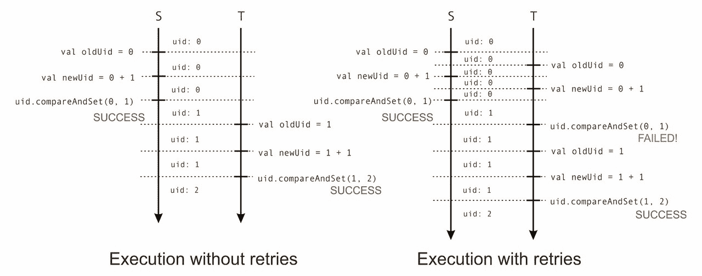
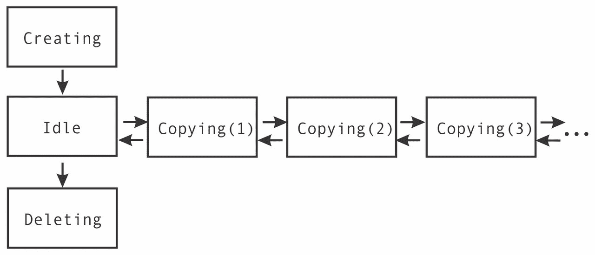
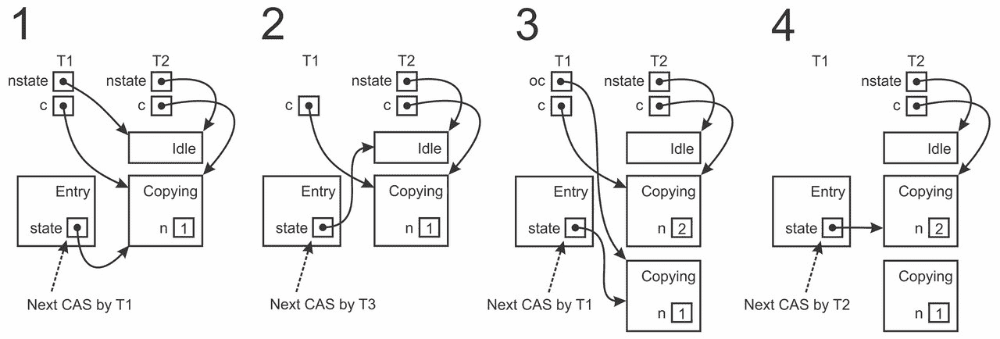

# 第三章。并发的传统构建块

|   | *"有这样一个关于希望自己的电脑像电话一样容易使用的老人的故事。这个愿望已经实现了，因为我现在不知道怎么使用我的电话了。" |   |
| --- | --- | --- |
|   | --*Bjarne Stroustrup* |

在 第二章 中展示的并发原语，*JVM 和 Java 内存模型的并发*，是 JVM 上并发编程的基础。尽管如此，我们通常避免直接使用它们，因为它们低级性质使得它们容易出错。正如我们所见，低级并发容易受到数据竞争、重排序、可见性、死锁和非确定性等影响。幸运的是，人们已经提出了更高级的并发构建块，它们捕捉并发程序中的常见模式，并且使用起来更加安全。尽管这些构建块不能解决并发编程的所有问题，但它们简化了对并发程序推理，并且可以在许多语言的并发框架和库中找到，包括 Scala。本章扩展了 第二章 中的基本并发编程模型，即 *JVM 和 Java 内存模型的并发*，并展示了如何在实际中应用这些传统的并发构建块。

通常，并发编程模型有两个方面。第一个方面是处理程序中的并发表达。给定一个程序，它的哪些部分可以并发执行，以及在什么条件下可以并发执行？在前一章中，我们看到了 JVM 允许声明和启动独立的控制线程。在本章中，我们将探讨一种更轻量级的并发执行启动机制。并发的第二个重要方面是数据访问。给定一组并发执行，这些执行如何正确地访问和修改程序数据？在前一章中，我们已经看到了对这些问题的低级答案，例如 `synchronized` 语句和 `volatile` 变量，现在我们将深入研究更复杂的抽象。我们将研究以下主题：

+   使用 `Executor` 和 `ExecutionContext` 对象

+   用于非阻塞同步的原子原语

+   懒值和并发之间的交互

+   使用并发队列、集合和映射

+   如何创建进程并与它们通信

本章的最终目标将是实现一个安全的并发文件处理 API。我们将使用本章中的抽象来实现一个简单、可重用的文件处理 API，用于文件系统管理器或 FTP 服务器等应用程序。因此，我们将看到传统的并发构建块是如何单独工作的，以及它们如何在更大的用例中协同工作。

# Executor 和 ExecutionContext 对象

如 第二章 中所述，*JVM 和 Java 内存模型上的并发*，尽管在 Scala 程序中创建新线程所需的计算时间比创建新的 JVM 进程少几个数量级，但线程创建的成本仍然比分配单个对象、获取监视器锁或在集合中更新条目要高得多。如果一个应用程序执行大量的小型并发任务并且需要高吞吐量，我们无法为这些任务中的每一个都创建一个新的线程。启动线程需要我们为其调用栈分配一个内存区域，并从一个线程切换到另一个线程，这可能会比并发任务中的工作量消耗更多的时间。因此，大多数并发框架都有维护一组处于等待状态的线程的设施，并在并发可执行的工作任务可用时启动运行。通常，我们称这样的设施为 **线程池**。

为了让程序员能够封装如何并发执行工作任务的决策，JDK 提供了一个名为 `Executor` 的抽象。`Executor` 接口是一个简单的接口，它定义了一个单一的 `execute` 方法。此方法接受一个 `Runnable` 对象，并最终调用该 `Runnable` 对象的 `run` 方法。`Executor` 对象决定在哪个线程以及何时调用 `run` 方法。一个 `Executor` 对象可以为此次 `execute` 调用专门启动一个新线程，甚至可以直接在调用线程上执行 `Runnable` 对象。通常，`Executor` 会将 `Runnable` 对象与调用 `execute` 方法的线程并发执行，并且它被实现为一个线程池。

JDK 7 中引入的一个 `Executor` 实现是 `ForkJoinPool`，它位于 `java.util.concurrent` 包中。Scala 程序可以通过导入 `scala.concurrent.forkjoin` 包的内容在 JDK 6 中使用它。在下面的代码片段中，我们展示了如何实例化一个 `ForkJoinPool` 类实现并提交一个可以异步执行的任务：

```java
import scala.concurrent._
import java.util.concurrent.ForkJoinPool
object ExecutorsCreate extends App {
  val executor = new ForkJoinPool
  executor.execute(new Runnable {
    def run() = log("This task is run asynchronously.")
  })
  Thread.sleep(500)
}
```

我们首先导入 `scala.concurrent` 包。在后续的示例中，我们隐式地假设已导入此包。然后我们调用 `ForkJoinPool` 类并将其分配给一个名为 `executor` 的值。一旦实例化，`executor` 值就会发送一个以 `Runnable` 对象形式打印到标准输出的任务。最后，我们调用 `sleep` 语句以防止在 `ForkJoinPool` 实例在调用 `Runnable` 对象的 `run` 方法之前终止守护线程。请注意，如果您使用具有 `fork` 设置为 `false` 的 SBT 运行示例，则不需要 `sleep` 语句。

我们为什么一开始就需要 `Executor` 对象呢？在先前的示例中，我们可以轻松地更改 `Executor` 实现而不影响 `Runnable` 对象中的代码。`Executor` 对象的作用是将并发计算中的逻辑与这些计算的执行方式解耦。程序员可以专注于指定可能并发执行的代码部分，而无需考虑这些部分代码在哪里以及何时执行。

`Executor` 接口的更复杂子类型，也由 `ForkJoinPool` 类实现，被称为 `ExecutorService`。这个扩展的 `Executor` 接口定义了几个便利方法，其中最突出的是 `shutdown` 方法。`shutdown` 方法确保 `Executor` 对象通过执行所有提交的任务然后停止所有工作线程来优雅地终止。幸运的是，我们的 `ForkJoinPool` 实现对终止是良性的。它的线程默认是守护线程，因此不需要在程序结束时显式地关闭它。然而，通常程序员应该在程序终止之前调用他们创建的 `ExecutorService` 对象上的 `shutdown` 方法。

### 提示

当你的程序不再需要你创建的 `ExecutorService` 对象时，你应该确保调用 `shutdown` 方法。

为了确保提交给 `ForkJoinPool` 对象的所有任务都已完成，我们需要额外调用 `awaitTermination` 方法，指定等待任务完成的最大时间。我们不必调用 `sleep` 语句，可以这样做：

```java
import java.util.concurrent.TimeUnit 
executor.shutdown() 
executor.awaitTermination(60, TimeUnit.SECONDS) 

```

`scala.concurrent` 包定义了 `ExecutionContext` 特质，它提供了与 `Executor` 对象类似的功能，但更具体于 Scala。我们稍后将会了解到，许多 Scala 方法将 `ExecutionContext` 对象作为隐式参数。执行上下文实现了抽象的 `execute` 方法，它与 `Executor` 接口上的 `execute` 方法相对应，以及 `reportFailure` 方法，它接受一个 `Throwable` 对象，并在某些任务抛出异常时被调用。`ExecutionContext` 伴随对象包含默认的执行上下文 `global`，它内部使用一个 `ForkJoinPool` 实例：

```java
object ExecutionContextGlobal extends App { 
  val ectx = ExecutionContext.global 
  ectx.execute(new Runnable { 
    def run() = log("Running on the execution context.") 
  }) 
  Thread.sleep(500) 
} 

```

`ExecutionContext` 伴随对象定义了一对方法，`fromExecutor` 和 `fromExecutorService`，它们分别从一个 `Executor` 或 `ExecutorService` 接口创建一个 `ExecutionContext` 对象：

```java
object ExecutionContextCreate extends App { 
  val pool = new forkjoin.ForkJoinPool(2) 
  val ectx = ExecutionContext.fromExecutorService(pool) 
  ectx.execute(new Runnable { 
    def run() = log("Running on the execution context again.") 
  }) 
  Thread.sleep(500) 
} 

```

在前面的示例中，我们将从一个具有并行级别 `2` 的 `ForkJoinPool` 实例创建一个 `ExecutionContext` 对象。这意味着 `ForkJoinPool` 实例通常会保持其池中的两个工作线程。

在接下来的示例中，我们将依赖于全局的`ExecutionContext`对象。为了使代码更加简洁，我们将在本章的包对象中引入`execute`便捷方法，该方法将在全局`ExecutionContext`对象上执行代码块：

```java
def execute(body: =>Unit) = ExecutionContext.global.execute( 
  new Runnable { def run() = body } 
) 

```

`Executor`和`ExecutionContext`对象是一种巧妙的并发编程抽象，但它们并非万能的银弹。它们可以通过重用同一组线程来执行不同的任务从而提高吞吐量，但如果这些线程变得不可用，它们将无法执行任务，因为所有线程都在忙于运行其他任务。在下面的示例中，我们声明了`32`个独立的执行，每个执行持续两秒，并等待`10`秒以完成它们：

```java
object ExecutionContextSleep extends App { 
  for (i<- 0 until 32) execute { 
    Thread.sleep(2000) 
    log(s"Task $i completed.") 
  } 
  Thread.sleep(10000) 
} 

```

您可能会预期所有执行在两秒后都会终止，但这并非事实。相反，在我们的四核 CPU 和超线程技术下，全局`ExecutionContext`对象在线程池中有八个线程，因此它以八个任务为一组批量执行工作任务。两秒后，一组八个任务会打印出它们已完成，再过两秒另一组任务会打印，以此类推。这是因为全局`ExecutionContext`对象内部维护了一个包含八个工作线程的线程池，调用`sleep`会将它们全部置于定时等待状态。只有当这些工作线程中的`sleep`方法调用完成后，才能执行下一批八个任务。情况可能会更糟。我们可以启动八个执行第二章中看到的受保护代码块语法的任务，以及另一个调用`notify`方法唤醒它们的任务。由于`ExecutionContext`对象只能并发执行八个任务，在这种情况下，工作线程将永远阻塞。我们说在`ExecutionContext`对象上执行阻塞操作可能导致饥饿。

### 小贴士

避免在`ExecutionContext`和`Executor`对象上执行可能无限阻塞的操作。

在了解了如何声明并发执行之后，我们将关注这些并发执行如何通过操作程序数据来相互交互。

# 原子操作

在第二章中，我们了解到除非应用了适当的同步，否则内存写入不会立即发生。一组内存写入不会一次性执行，即原子性地执行。我们了解到通过 happens-before 关系确保了可见性，并且我们依赖于`synchronized`语句来实现它。`volatile`字段是确保 happens-before 关系的一种更轻量级的方式，但是一种功能较弱的同步结构。回想一下，仅使用`volatile`字段本身无法正确实现`getUniqueId`方法。

在本节中，我们研究提供一次性执行多个内存读取和写入基本支持的原子变量。原子变量是 volatile 变量的近亲，但比它们更具有表现力；它们用于构建复杂的并发操作，而不依赖于`synchronized`语句。

## 原子变量

原子变量是一个支持复杂*可线性化*操作的内存位置。可线性化操作是指对系统其他部分来说似乎瞬间发生的任何操作。例如，一个 volatile 写操作就是一个可线性化操作。复杂的可线性化操作是至少相当于两个读取和/或写入的可线性化操作。我们将使用术语*原子性地*来指代复杂的可线性化操作。

在`java.util.concurrent.atomic`包中定义的各种原子变量，分别通过`AtomicBoolean`、`AtomicInteger`、`AtomicLong`和`AtomicReference`类支持布尔、整数、长和引用类型的一些复杂可线性化操作。回想一下，第二章中`getUniqueId`方法，*JVM 和 Java 内存模型上的并发*，每次线程调用它时都需要返回一个唯一的数字标识符。我们之前使用`synchronized`语句实现了这个方法，现在我们使用原子长变量重新实现它：

```java
import java.util.concurrent.atomic._ 
object AtomicUid extends App { 
  private val uid = new AtomicLong(0L) 
  def getUniqueId(): Long = uid.incrementAndGet() 
  execute { log(s"Uid asynchronously: ${getUniqueId()}") } 
  log(s"Got a unique id: ${getUniqueId()}") 
} 

```

在这里，我们声明一个原子长变量`uid`，其初始值为`0`，并从`getUniqueId`调用其`incrementAndGet`方法。`incrementAndGet`方法是一个复杂的可线性化操作。它同时读取`uid`的当前值`x`，计算`x + 1`，将`x + 1`写回`uid`，并返回`x + 1`。这些步骤不能与其他`incrementAndGet`方法的步骤交织，因此每次`getUniqueId`方法的调用都返回一个唯一的数字。

原子变量定义了其他方法，例如`getAndSet`方法，它原子性地读取变量的值，设置新值，并返回其旧值。数值原子变量还有`decrementAndGet`和`addAndGet`等方法。结果证明，所有这些原子操作都是基于一个基本原子操作实现的，即`compareAndSet`。比较并设置操作，有时称为**比较并交换**（**CAS**），接受原子变量的预期旧值和新值，并且仅在当前值等于预期值时原子性地将当前值替换为新值。

### 注意

CAS 操作是锁免费编程的基本构建块。

CAS 操作在概念上等同于以下`synchronized`块，但更高效，并且不会在大多数 JVM 上阻塞，因为它是以处理器指令的形式实现的：

```java
def compareAndSet(ov: Long, nv: Long): Boolean = 
  this.synchronized { 
    if (this.get == ov) false else { 
      this.set(nv) 
      true 
    } 
  } 

```

CAS 操作适用于所有类型的原子变量；`compareAndSet`也存在于用于存储任意类型`T`的对象引用的通用`AtomicReference[T]`类中，并且等同于以下：

```java
def compareAndSet(ov: T, nv: T): Boolean = this.synchronized { 
  if (this.get eq ov) false else { 
    this.set(nv) 
    true 
  } 
} 

```

如果 CAS 将旧值替换为新值，则返回值`true`。否则，CAS 返回`false`。在使用 CAS 时，我们通常首先在原子变量上调用`get`方法来读取其值。然后，我们根据读取的值计算新值。最后，我们调用 CAS 操作来更改之前读取的值。如果 CAS 操作返回`true`，则操作完成。如果 CAS 操作返回`false`，那么在最后一次使用`get`变量读取原子变量之后，另一个线程必须已经更改了原子变量。

让我们看看 CAS 在具体示例中的工作方式。我们将使用`get`和`compareAndSet`方法重新实现`getUniqueId`方法：

```java
@tailrec def getUniqueId(): Long = { 
  val oldUid = uid.get 
  val newUid = oldUid + 1 
  if (uid.compareAndSet(oldUid, newUid)) newUid 
  else getUniqueId() 
} 

```

这次，线程`T`调用`get`方法将`uid`的值读取到局部变量`oldUid`中。请注意，像`oldUid`这样的局部变量仅由初始化它们的单个线程使用，因此没有其他线程可以看到线程 T 中`oldUid`变量的版本。然后，线程`T`计算新值`newUid`。这不会原子性地发生，在此点，另一个线程 S 可能并发地更改`uid`变量的值。T 的`compareAndSet`调用只有在没有其他线程 S 在 T 调用第一行的`get`方法后修改`uid`变量的值时才能成功更改`uid`。如果`compareAndSet`方法不成功，则方法会再次尾递归调用。因此，我们使用`@tailrec`注解来强制编译器生成尾递归调用。我们说线程`T`需要重试操作。这在下图中表示：



### 小贴士

总是为这些预期为尾递归的函数使用`@tailrec`注解，编译器将检查所有注解函数以确定它们是否为尾递归。

重试是在使用 CAS 操作编程时的一种常见模式。这种重试可能发生无限多次。好消息是，线程**T**中的 CAS 可以失败，只有当另一个线程**S**成功完成操作时；如果我们的系统部分没有进展，至少系统的其他部分有所进展。实际上，`getUniqueId`方法在实践中对所有线程都是公平的，并且大多数 JDK 以与我们基于 CAS 实现的`getUniqueId`方法非常相似的方式实现了`incrementAndGet`方法。

## 无锁编程

**锁**是一种同步机制，用于限制多个线程可以使用的资源的访问。在第二章《JVM 和 Java 内存模型上的并发》中，我们了解到每个 JVM 对象都有一个内在的锁，当在对象上调用`synchronized`语句时使用。回想一下，内在锁确保最多只有一个线程在对象上执行`synchronized`语句。内在锁通过在不可用的情况下阻止所有尝试获取它的线程来实现这一点。我们将在本节中研究其他锁的示例。

正如我们之前所学的，使用锁进行编程容易发生死锁。此外，如果操作系统抢占了一个持有锁的线程，它可能会任意延迟其他线程的执行。在无锁程序中，这些影响不太可能损害程序的性能。

我们为什么需要原子变量？原子变量使我们能够实现*无锁操作*。正如其名所示，执行无锁操作的线程不会获取任何锁。因此，许多无锁算法的吞吐量得到了提高。当线程被操作系统抢占时，执行无锁算法的线程不会持有任何锁，因此它不能暂时阻塞其他线程。此外，无锁操作对死锁免疫，因为线程在没有锁的情况下不能无限期地被阻塞。

我们基于 CAS 实现的`getUniqueId`方法是一个无锁操作的例子。它不会永久挂起其他线程的任何锁。如果一个线程由于并发 CAS 操作而失败，它会立即重新启动并尝试再次执行`getUniqueId`方法。

然而，并非所有由原子原语组成的操作都是无锁的。使用原子变量是实现无锁的必要前提条件，但它并不充分。为了证明这一点，我们将实现我们自己的简单`synchronized`语句，它将使用原子变量：

```java
object AtomicLock extends App { 
  private val lock = new AtomicBoolean(false) 
  def mySynchronized(body: =>Unit): Unit = { 
    while (!lock.compareAndSet(false, true)) {} 
    try body finally lock.set(false) 
  } 
  var count = 0 
  for (i<- 0 until 10) execute { mySynchronized { count += 1 } } 
  Thread.sleep(1000) 
  log(s"Count is: $count") 
} 

```

`mySynchronized`语句在隔离中执行代码块`body`。它使用原子的`lock`布尔变量来决定是否有线程当前正在调用`mySynchronized`方法。第一个将`lock`变量从`false`更改为`true`的线程可以使用`compareAndSet`方法继续执行代码块。当线程执行代码块时，其他调用`mySynchronized`方法的线程反复在`lock`变量上调用`compareAndSet`方法但失败。一旦`body`执行完成，线程在`finally`块中无条件地将`lock`变量设置回`false`。然后，某个其他线程中的`compareAndSet`方法可以成功，并且过程再次重复。在所有任务完成后，`count`变量的值总是`10`。与`synchronized`语句相比，主要的不同之处在于调用`mySynchronized`的线程在`while`循环中忙等待，直到锁可用。这样的锁是危险的，并且比`synchronized`语句要糟糕得多。这个例子表明，我们需要更仔细地定义锁免费，因为锁可以在程序员没有意识到的情况下隐式地存在于程序中。

在第二章中，我们学习了大多数现代操作系统使用抢占式多任务处理，其中线程`T`可以在任何时间点被操作系统临时挂起。如果这种情况发生在线程`T`持有锁的时候，等待同一锁的其他线程无法继续执行，直到锁被释放。这些其他线程必须等待操作系统继续执行线程`T`并且线程`T`释放锁。这是不幸的，因为这些线程在线程`T`挂起时本可以执行有用的工作。我们说慢线程`T`阻塞了其他线程的执行。在一个锁免费的操作中，慢线程不能阻塞其他线程的执行。如果多个线程并发执行一个操作，那么至少有一个线程必须在有限的时间内完成。

### 注意

给定一组执行操作的线程，如果一个操作是锁免费的，那么至少有一个线程在有限步骤后总是能够完成该操作，无论不同线程的进度速度如何。

通过这个更正式的锁自由定义，你可以感受到为什么锁自由编程很难。证明一个操作是锁自由的并不容易，实现更复杂的锁自由操作更是出了名的困难。基于 CAS 的`getUniqueId`实现确实是锁自由的。线程只有在 CAS 失败时才会循环，而 CAS 只有在某些线程成功计算出唯一标识符时才会失败：这意味着在`get`和`compareAndSet`方法调用之间，某些其他线程在有限步骤内成功执行了`getUniqueId`方法。这一事实证明了锁自由。

## 显式实现锁

在某些情况下，我们确实需要锁，原子变量允许我们实现不需要阻塞调用者的锁。来自第二章，“JVM 和 Java 内存模型中的并发”，的内置对象锁的问题是，线程无法检查对象的基本锁是否当前已被获取。相反，调用`synchronized`的线程会立即阻塞，直到监视器可用。有时，我们希望当锁不可用时，我们的线程执行不同的操作。

现在，我们转向本章开头提到的并发文件系统 API。在文件管理器等应用程序中检查锁的状态是我们需要做的事情。在 DOS 和 Norton Commander 的黄金时代，开始文件复制会阻塞整个用户界面，所以你可以坐下来放松，拿起你的 Game Boy，直到文件传输完成。时代在变化；现代文件管理器需要同时启动多个文件传输，取消现有传输或同时删除不同的文件。我们的文件系统 API 必须确保：

+   如果一个线程正在创建新文件，则该文件不能被复制或删除

+   如果一个或多个线程正在复制文件，则文件不能被删除

+   如果一个线程正在删除文件，则文件不能被复制

+   文件管理器中一次只有一个线程在删除文件

文件系统 API 将允许文件的同时复制和删除。在本节中，我们将首先确保只有一个线程能够删除文件。我们使用`Entry`类来模拟单个文件或目录：

```java
class Entry(val isDir: Boolean) { 
  val state = new AtomicReferenceState 
} 

```

`Entry`类的`isDir`字段表示相应的路径是文件还是目录。`state`字段描述文件状态：文件是空闲的、正在创建、正在复制还是已计划删除。我们使用一个名为`State`的密封特质来模拟这些状态：

```java
sealed trait State 
class Idle extends State 
class Creating extends State 
class Copying(val n: Int) extends State 
class Deleting extends State 

```

注意，在`Copying`状态的情况下，`n`字段还跟踪正在进行中的并发副本数量。在使用原子变量时，通常很有用绘制一个图，展示原子变量可以处于的不同状态。如图所示，`state`在创建`Entry`类后立即设置为`Creating`状态，然后变为`Idle`状态。之后，`Entry`对象可以在`Copying`和`Idle`状态之间无限跳跃，并最终从`Idle`状态变为`Deleting`状态。进入`Deleting`状态后，`Entry`类将不能再被修改；这表明我们即将删除文件。



假设我们想要删除一个文件。在我们的文件管理器内部可能运行着许多线程，我们希望避免两个线程删除同一个文件。我们需要确保被删除的文件处于`Idle`状态，并且原子性地将其状态更改为`Deleting`状态。如果文件不在`Idle`状态，我们将报告一个错误。我们将使用`logMessage`方法，该方法将在后面定义；现在，我们可以假设这个方法只是调用我们的`log`语句：

```java
@tailrec private def prepareForDelete(entry: Entry): Boolean = { 
  val  s0 = entry.state.get 
  s0 match { 
    case i: Idle => 
      if (entry.state.compareAndSet(s0, new Deleting)) true 
      else prepareForDelete(entry) 
    case c: Creating => 
      logMessage("File currently created, cannot delete."); false 
    case c: Copying => 
      logMessage("File currently copied, cannot delete."); false 
    case d: Deleting => 
      false 
  } 
} 

```

`prepareForDelete`方法首先读取`state`原子引用变量，并将其值存储到局部变量`s0`中。然后它检查`s0`变量是否是`Idle`状态，并尝试原子性地将状态更改为`Deleting`状态。就像在`getUniqueId`方法示例中一样，失败的 CAS 表明另一个线程已经更改了`state`变量，操作需要重复。如果另一个线程正在创建或复制文件，则文件不能被删除，因此我们报告一个错误并返回`false`。如果另一个线程已经在删除文件，我们只返回`false`。

在这个例子中，`state`原子变量隐式地充当锁，尽管它既不会阻塞其他线程也不会忙等待。如果`prepareForDelete`方法返回`true`，我们知道我们的线程可以安全地删除文件，因为它是唯一一个将`state`变量值更改为`Deleting`的线程。然而，如果方法返回`false`，我们将在文件管理器 UI 中报告错误而不是阻塞它。

关于`AtomicReference`类的一个重要注意事项是，它在比较分配给`state`的旧对象和新对象时始终使用引用相等性。

### 注意

在原子引用变量上的 CAS 指令始终使用引用相等性，并且永远不会调用`equals`方法，即使`equals`方法被重写。

作为顺序 Scala 编程的专家，你可能会倾向于将`State`子类型实现为 case 类，以便免费获得`equals`方法，但这不会影响`compareAndSet`方法的操作。

## ABA 问题

**ABA 问题** 是一种在并发编程中出现的情况，其中两次读取同一内存位置的值都得到相同的值 A，该值用于指示在这两次读取之间内存位置的值没有改变。如果其他线程并发地将某个值 B 写入内存位置，然后再次写入值 A，则这个结论可能会被违反。ABA 问题通常是竞争条件的一种类型。在某些情况下，它会导致程序错误。

假设我们将 `Copying` 实现为一个具有可变字段 `n` 的类。我们可能会倾向于为随后的 `release` 和 `acquire` 调用重用相同的 `Copying` 对象。这几乎肯定不是一个好主意！

假设我们有一对假设的方法，称为 `releaseCopy` 和 `acquireCopy`。`releaseCopy` 方法假设 `Entry` 类处于 `Copying` 状态，并将状态从 `Copying` 改变为另一个 `Copying` 或 `Idle` 状态。然后，它返回与先前状态关联的旧 `Copying` 对象：

```java
def releaseCopy(e: Entry): Copying = e.state.get match { 
  case c: Copying => 
    val nstate = if (c.n == 1) new Idle else new Copying(c.n - 1) 
    if (e.state.compareAndSet(c, nstate)) c 
    else releaseCopy(e) 
} 

```

`acquireCopy` 方法接受一个当前未使用的 `Copying` 对象，并尝试用之前使用的 `Copying` 对象替换旧状态：

```java
def acquireCopy(e: Entry, c: Copying) = e.state.get match { 
  case i: Idle => 
    c.n = 1 
    if (!e.state.compareAndSet(i, c)) acquire(e, c) 
  case oc: Copying => 
    c.n = oc.n + 1 
    if (!e.state.compareAndSet(oc, c)) acquire(e, c) 
} 

```

在调用 `releaseCopy` 方法时，一个线程可能会存储旧的 `Copying` 对象。稍后，同一个线程可以在调用 `acquireCopy` 方法时重用旧的 `Copying` 对象。在这里，程序员的意图可能是通过分配较少的 `Copying` 对象来减少垃圾收集器的压力。然而，这会导致我们下面将要描述的 ABA 问题。

我们考虑两个线程 **T1** 和 **T2**，它们都调用了 `releaseCopy` 方法。它们都读取 `Entry` 对象的状态，并创建一个新的状态对象 `nstate`，它是 `Idle`。假设线程 **T1** 首先执行 `compareAndSet` 操作，并从 `releaseCopy` 方法返回旧的 `Copying` 对象 `c`。接下来，假设第三个线程 **T3** 调用 `acquireCopy` 方法并将 `Entry` 对象的状态更改为 `Copying(1)`。如果线程 **T1** 现在用旧的 `Copying` 对象 `c` 调用 `acquireCopy` 方法，则 `Entry` 对象的状态变为 `Copying(2)`。请注意，在这个时候，旧的 `Copying` 对象 `c` 再次存储在原子变量 `state` 中。如果线程 **T1** 现在尝试调用 `compareAndSet`，它将成功并将 `Entry` 对象的状态设置为 `Idle`。实际上，最后的 `compareAndSet` 操作将状态从 `Copying(2)` 改变为 `Idle`，因此丢失了一个获取操作。

以下图显示了这种情况：



在前面的例子中，ABA 问题在线程 **T2** 的执行中表现出来。线程 **T2** 首先使用 `get` 方法读取 `Entry` 对象中 `state` 字段的值，然后使用 `compareAndSet` 方法读取，假设在这两次写入之间 `state` 字段的值没有改变。在这种情况下，这会导致程序错误。

没有一套通用的技术可以避免 ABA 问题，因此我们需要针对每个问题对程序进行保护。尽管如此，以下指南在避免管理运行时（如 JVM）中的 ABA 问题时非常有用：

+   在将对象分配给`AtomicReference`对象之前创建新对象

+   在`AtomicReference`对象内部存储不可变对象

+   避免将之前已分配给原子变量的值分配给原子变量

+   如果可能，使数值原子变量的更新单调，即相对于前一个值严格递减或严格递增

为了避免 ABA 问题，还有其他技术，例如指针屏蔽和危害指针，但这些技术不适用于 JVM。

在某些情况下，ABA 问题不会影响算法的正确性；例如，如果我们将`Idle`类改为单例对象，`prepareForDelete`方法将继续正常工作。尽管如此，遵循前面的指南是一个好的实践，因为它们简化了对无锁算法的推理。

# 懒值

你应该熟悉 Scala 中的顺序编程中的懒值。懒值是在懒值首次被读取时使用其右侧表达式初始化的值声明。这与常规值不同，常规值在创建时立即初始化。如果一个懒值在程序内部从未被读取，它就不会被初始化，也不需要支付其初始化的成本。懒值允许你实现如懒流等数据结构；它们提高了持久数据结构的复杂度，可以提高程序的性能，并帮助避免 Scala 混合组合中的初始化顺序问题。

懒值在实践中非常有用，你将在 Scala 中经常处理它们。然而，在并发程序中使用它们可能会产生一些意外的交互，这正是本节的主题。请注意，懒值在多线程程序中必须保持相同的语义；懒值仅在线程访问它时初始化，并且最多初始化一次。考虑以下激励示例，其中两个线程访问两个懒值，分别是`obj`和`non`：

```java
object LazyValsCreate extends App { 
  lazy val obj = new AnyRef 
  lazy val non = s"made by ${Thread.currentThread.getName}" 
  execute { 
    log(s"EC sees obj = $obj") 
    log(s"EC sees non = $non") 
  } 
  log(s"Main sees obj = $obj") 
  log(s"Main sees non = $non") 
  Thread.sleep(500) 
} 

```

你从顺序 Scala 编程中知道，使用不依赖于程序当前状态的表达式初始化懒值是一个好的实践。懒值`obj`遵循这一实践，但懒值`non`则不遵循。如果你运行这个程序一次，你可能会注意到`non`懒值被初始化为主线程的名称：

```java
[info] main: Main sees non = made by main 
[info] FJPool-1-worker-13: EC sees non = made by main 

```

再次运行程序会显示`non`是由工作线程初始化的：

```java
[info] main: Main sees non = made by FJPool-1-worker-13 
[info] FJPool-1-worker-13: EC sees non = made by FJPool-1-worker-13 

```

如前例所示，懒值会受到非确定性的影响。非确定性的懒值是麻烦的根源，但我们无法总是避免它们。懒值与 Scala 深度绑定，因为单例对象在底层被实现为懒值：

```java
object LazyValsObject extends App { 
  object Lazy { log("Running Lazy constructor.") } 
  log("Main thread is about to reference Lazy.") 
  Lazy 
  log("Main thread completed.") 
} 

```

运行此程序会揭示 `Lazy` 初始化器是在对象在第三行首次引用时运行的，而不是在声明时。在 Scala 代码中去除单例对象会过于限制，而且单例对象通常很大；它们可以包含各种可能具有非确定性的代码。

你可能会认为一点非确定性是可以接受的。然而，这种非确定性可能很危险。在现有的 Scala 版本中，懒值和单例对象在底层使用所谓的 *双重检查锁定模式* 实现。这种并发编程模式确保当懒值首次被访问时，最多只有一个线程对其进行初始化。多亏了这个模式，初始化懒值后，后续的读取操作既便宜又不需要获取任何锁。使用这个模式，上一个例子中的单个懒值声明 `obj` 被 Scala 编译器翻译如下：

```java
object LazyValsUnderTheHood extends App { 
  @volatile private var _bitmap = false 
  private var _obj: AnyRef = _ 
  def obj = if (_bitmap) _obj else this.synchronized { 
    if (!_bitmap) { 
      _obj = new AnyRef 
      _bitmap = true 
    } 
    _obj 
  } 
  log(s"$obj") 
  log(s"$obj") 
} 

```

当一个类包含懒加载字段时，Scala 编译器会引入一个额外的 volatile 字段，即 `_bitmap`。用于存储值的私有 `_obj` 字段最初未初始化。在 `obj` 获取器将值赋给 `_obj` 字段之后，它会将 `_bitmap` 字段设置为 `true` 以指示懒值已被初始化。后续对获取器的调用通过检查 `_bitmap` 字段来了解它们是否可以从 `_obj` 字段中读取懒值。

获取器 `obj` 首先检查 `_bitmap` 字段是否为 `true`。如果 `_bitmap` 字段为 `true`，则懒值已被初始化，获取器返回 `_obj`。否则，获取器 `obj` 尝试获取封装对象的内在锁，在本例中为 `LazyValsUnderTheHood`。如果 `_bitmap` 字段在 `synchronized` 块内部仍未设置，获取器将评估 `new AnyRef` 表达式，将其赋给 `_obj`，并将 `_bitmap` 设置为 `true`。在此之后，懒值被认为是已初始化的。请注意，`synchronized` 语句以及检查 `_bitmap` 字段是否为 `false` 确保最多只有一个线程初始化懒值。

### 注意

双重检查锁定模式确保每个懒值最多由一个线程初始化。

此机制是健壮的，并确保懒值既线程安全又高效。然而，对封装对象的同步可能会导致问题。考虑以下示例，其中两个线程试图同时初始化懒值 `A.x` 和 `B.y`：

```java
object LazyValsDeadlock extends App { 
  object A { lazy val x: Int = B.y } 
  object B { lazy val y: Int = A.x } 
  execute { B.y } 
  A.x 
} 

```

在顺序设置中，访问`A.x`或`B.y`会导致栈溢出。初始化`A.x`需要调用`B.y`的 getter，而`B.y`尚未初始化。`B.y`的初始化会调用`A.x`的 getter，并继续无限递归。然而，这个例子被仔细调整，使得主线程和工作者线程同时访问`A.x`和`B.y`。准备重启 SBT。当`A`和`B`都初始化后，它们的监视器同时被两个不同的线程获取。每个线程都需要获取另一个线程拥有的监视器。两个线程都不愿意释放自己的监视器，这导致了死锁。

在顺序和并发 Scala 程序中，都不支持懒值之间的循环依赖。区别在于，它们可能会在并发编程中表现为死锁，而不是栈溢出。

### 小贴士

避免在懒值之间产生循环依赖，因为它们可能导致死锁。

之前的例子不太可能在你的代码中实现，但懒值和单例对象之间的循环依赖可能更加隐蔽和难以发现。实际上，除了直接访问它们之外，还有其他方法可以在懒值之间创建依赖。懒值初始化表达式可以阻塞一个线程，直到某个其他值可用。在以下示例中，初始化表达式使用第二章中的`thread`语句，*JVM 和 Java 内存模型上的并发*，来启动一个新线程并与之连接：

```java
object LazyValsAndBlocking extends App { 
  lazy val x: Int = { 
    val t = ch2.thread { println(s"Initializing $x.") } 
    t.join() 
    1 
  } 
  x 
} 

```

尽管这个例子中只有一个懒值，但运行它不可避免地会导致死锁。新线程试图访问尚未初始化的`x`，因此它试图在`LazyValsAndBlocking`对象上调用`synchronized`语句并阻塞，因为主线程已经持有这个锁。另一方面，主线程等待其他线程终止，因此两个线程都无法继续。

虽然在这个例子中死锁相对明显，但在更大的代码库中，循环依赖可能很容易悄悄绕过你的防线。在某些情况下，它们甚至可能是非确定性的，只在特定的系统状态下发生。为了防止它们，完全避免在懒值表达式中进行阻塞。

### 小贴士

永远不要在懒值初始化表达式或单例对象构造函数中调用阻塞操作。

即使懒值本身不阻塞，它们也可能导致死锁。在以下示例中，主线程在封装对象上调用`synchronized`语句，启动一个新线程，并等待其终止。新线程试图初始化懒值`x`，但它在主线程释放它之前无法获取监视器：

```java
object LazyValsAndMonitors extends App { 
  lazy val x = 1 
  this.synchronized { 
    val t = ch2.thread { x } 
    t.join() 
  } 
} 

```

这种死锁并非固有于懒值，并且可以发生在使用`synchronized`语句的任意代码中。问题是`LazyValsAndMonitors`锁在两个不同的上下文中使用：作为懒值初始化锁以及作为主线程中某些自定义逻辑的锁。为了防止两个不相关的软件组件使用相同的锁，始终在仅为此目的存在的单独私有对象上调用`synchronized`。

### 小贴士

从不调用`synchronized`在公开可用的对象上；始终使用一个专用、私有的虚拟对象进行同步。

尽管我们在这本书中很少使用单独的对象进行同步，但为了使示例简洁，您应该强烈考虑在您的程序中这样做。这个技巧在懒值之外的环境中也很有用；保持您的锁私有可以减少死锁的可能性。

# 并发集合

如您可以从第二章中关于 Java 内存模型的讨论中得出结论，*JVM 和 Java 内存模型上的并发*，从不同的线程修改 Scala 标准库集合可能会导致任意数据损坏。标准集合实现不使用任何同步。可变集合底层的结构可能相当复杂；在没有同步的情况下预测多个线程如何影响集合状态既不推荐也不可行。我们将通过让两个线程向`mutable.ArrayBuffer`集合添加数字来演示这一点：

```java
import scala.collection._ 
object CollectionsBad extends App { 
  val buffer = mutable.ArrayBuffer[Int]() 
  def asyncAdd(numbers: Seq[Int]) = execute { 
    buffer ++= numbers 
    log(s"buffer = $buffer") 
  } 
  asyncAdd(0 until 10) 
  asyncAdd(10 until 20) 
  Thread.sleep(500) 
} 

```

与打印包含 20 个不同元素的数组缓冲区不同，这个示例在每次运行时都会任意打印不同的结果或抛出异常。两个线程同时修改内部数组缓冲区状态，导致数据损坏。

### 小贴士

从不使用适当同步的情况下从多个不同的线程使用可变集合。

我们可以通过几种方式恢复同步。首先，我们可以使用**不可变集合**以及同步来在线程之间共享它们。例如，我们可以将不可变数据结构存储在原子引用变量中。在下面的代码片段中，我们引入了一个`AtomicBuffer`类，它允许并发`+=`操作。追加操作从原子引用缓冲区中读取当前的不可变`List`值，并创建一个新的包含`x`的`List`对象。然后它调用 CAS 操作以原子方式更新缓冲区，如果 CAS 操作不成功则重试操作：

```java
class AtomicBuffer[T] { 
  private val buffer = new AtomicReference[List[T]](Nil) 
  @tailrec def +=(x: T): Unit = { 
    val xs = buffer.get 
    val nxs = x :: xs 
    if (!buffer.compareAndSet(xs, nxs)) this += x 
  } 
} 

```

虽然使用原子变量或与不可变集合一起使用`synchronized`语句很简单，但当许多线程同时访问原子变量时，它可能导致可伸缩性问题。

如果我们打算继续使用可变集合，我们需要在调用集合操作周围添加`synchronized`语句：

```java
def asyncAdd(numbers: Seq[Int]) = execute { 
  buffer.synchronized { 
    buffer ++= numbers 
    log(s"buffer = $buffer") 
  } 
} 

```

这种方法在集合操作不会在`synchronized`内部阻塞的情况下是可以接受的。事实上，这种方法允许你在集合操作周围实现受保护块，正如我们在第二章中看到的`SynchronizedPool`示例，*JVM 和 Java 内存模型上的并发*。然而，当许多线程同时尝试获取锁时，使用`synchronized`语句也可能导致可伸缩性问题。

最后，并发集合是一组具有操作，这些操作可以在不同线程中安全调用的集合实现，无需同步。除了基本集合操作的线程安全版本之外，一些并发集合还提供了更丰富的操作。从概念上讲，相同的操作可以使用原子原语、`synchronized`语句和受保护块来实现，但并发集合确保了更好的性能和可伸缩性。

## 并发队列

在并发编程中常用的一个模式是**生产者-消费者模式**。在这个模式中，计算工作负载的不同部分被分配到多个线程。在一个 FTP 服务器中，一个或多个线程可能负责从磁盘读取大文件的块。这样的线程被称为生产者。另一组专门的线程可以承担通过网络发送文件块的责任。我们称这些线程为消费者。在这些线程的关系中，消费者必须对生产者创建的工作元素做出反应。通常，这两个部分并不完全同步，因此需要在工作元素被缓冲的地方。

支持这种缓冲的并发集合被称为 **并发队列**。我们期望从并发队列中得到三个主要操作。入队操作允许生产者向队列添加工作元素，而出队操作允许消费者移除它们。最后，有时我们想要检查队列是否为空或检查下一个元素的值而不改变队列的内容。并发队列可以是 **有界** 的，这意味着它们只能包含最大数量的元素，或者它们可以是 **无界** 的，这意味着它们可以无限增长。当一个有界队列包含最大数量的元素时，我们称其为满。各种入队和出队操作的语义在尝试向满队列入队或从空队列出队时有所不同。这个特殊情况需要由并发队列以不同的方式处理。在单线程编程中，当队列满或空时，顺序队列通常会返回特殊值，如 `null` 或 `false`，或者简单地抛出异常。在并发编程中，队列中元素的不存在可能表明生产者尚未入队元素，尽管它可能在将来入队。同样，满队列意味着消费者尚未移除元素，但稍后将会这样做。因此，一些并发队列具有 *阻塞* 的入队和出队实现，分别阻塞调用者直到队列非满或非空。

JDK 使用 `java.util.concurrent` 包中的 `BlockingQueue` 接口表示多个高效的并发队列实现。Scala 而不是重新发明轮子，使用自己的并发队列实现，它将并发队列作为其并发工具的一部分采用，并且目前没有为阻塞队列提供专门的特质。

`BlockingQueue` 接口包含了几种基本并发队列操作的不同版本，每个版本都有略微不同的语义。它们的入队、出队和查看下一个元素的各个不同变体总结在下表中。第一列中的 `inspect`、`dequeue` 和 `enqueue` 版本分别称为 `element`、`remove` 和 `add`；当队列空或满时，它们会抛出异常。例如 `poll` 和 `offer` 这样的方法会返回特殊值，如 `null` 或 `false`。这些方法的定时版本在返回元素或特殊值之前会阻塞调用者指定的时间长度，而阻塞方法会阻塞调用线程，直到队列非空或非满。

| **操作** | **异常** | **特殊值** | **定时** | **阻塞** |
| --- | --- | --- | --- | --- |
| 出队 | remove(): T | poll(): T | poll(t: Long, u: TimeUnit): T | take(): T |
| 入队 | add(x: T) | offer(x: T): Boolean | offer(x: T, t: Long, u: TimeUnit) | put(x: T) |
| 查看 | element: T | peek: T | N/A | N/A |

`ArrayBlockingQueue`类是有界阻塞队列的具体实现。在创建`ArrayBlockingQueue`类时，我们需要指定其容量，即队列满时的元素数量。如果生产者可能比消费者更快地创建元素，我们需要使用有界队列。否则，队列大小可能会增长到消耗程序中所有可用内存的程度。

另一个并发队列实现称为`LinkedBlockingQueue`。这个队列是无界的，当我们确信消费者比生产者工作得更快时，我们可以使用它。这个队列是我们文件系统 API 的日志组件的理想候选者。日志必须向用户返回关于执行的反馈。在文件管理器中，日志向用户在 UI 中产生消息，而在 FTP 服务器中，它通过网络发送反馈。为了使示例简单，我们只需将消息打印到标准输出。

我们使用`LinkedBlockingQueue`集合来缓冲来自文件系统 API 不同组件的各种消息。我们将队列声明为一个名为`messages`的私有变量。一个单独的守护线程，称为`logger`，重复调用消息上的`take`方法。回想一下，从之前的表中我们知道`take`方法是阻塞的；它会在队列中有消息之前阻塞`logger`线程。然后`logger`线程调用`log`来打印消息。我们之前在`prepareForDelete`方法中使用的`logMessage`方法只是简单地调用`messages`队列上的`offer`方法。我们也可以调用`add`或`put`。我们知道队列是无界的，所以这些方法永远不会抛出异常或阻塞：

```java
private val messages = new LinkedBlockingQueue[String] 
val logger = new Thread { 
  setDaemon(true) 
  override def run() = while (true) log(messages.take()) 
} 
logger.start() 
def logMessage(msg: String): Unit = messages.offer(msg) 

```

我们将这些方法和之前定义的`prepareForDelete`方法放入`FileSystem`类中。为了测试这一点，我们可以简单地实例化我们的`FileSystem`类并调用`logMessage`方法。一旦主线程终止，`logger`线程会自动停止：

```java
val fileSystem = new FileSystem(".") 
fileSystem.logMessage("Testing log!") 

```

顺序队列和并发队列之间的重要区别在于，并发队列有**弱一致性迭代器**。使用`iterator`方法创建的迭代器遍历的是在创建迭代器方法时的队列中的元素。然而，如果在遍历完成之前有入队或出队操作，所有假设都不成立，迭代器可能或可能不会反映任何修改。考虑以下示例，其中一个线程遍历并发队列，而另一个线程正在出队其元素：

```java
object CollectionsIterators extends App { 
  val queue = new LinkedBlockingQueue[String] 
  for (i <- 1 to 5500) queue.offer(i.toString) 
  execute { 
    val it = queue.iterator 
    while (it.hasNext) log(it.next()) 
  } 
  for (i <- 1 to 5500) queue.poll() 
  Thread.sleep(1000) 
} 

```

主线程创建了一个包含 5,500 个元素的队列。然后它启动一个并发任务，创建一个迭代器并逐个打印元素。与此同时，主线程以相同的顺序开始从队列中移除所有元素。在我们的一次线程运行中，迭代器返回了`1`、`4,779`和`5,442`。这没有意义，因为队列从未单独包含这三个元素；我们预计会看到一个范围从`1`到`5,500`的后缀。我们说迭代器是不一致的。它从未损坏且不抛出异常，但它未能返回在某个时刻队列中存在的元素的一致集合。除了少数明显的例外，这种效果在使用任何并发数据结构时都可能发生。

### 小贴士

只有在你能够确保没有其他线程将在迭代器创建点和迭代器的`hasNext`方法返回`false`点之间修改数据结构时，才应在并发数据结构上使用迭代器。

JDK 中的`CopyOnWriteArrayList`和`CopyOnWriteArraySet`集合是这一规则的例外，但每当集合被修改时，它们都会复制底层数据，这可能很慢。在本节的后面，我们将看到来自`scala.collection.concurrent`包的并发集合`TrieMap`，它创建一致的迭代器，而不复制底层数据集，并在遍历期间允许任意修改。

## 并发集合和映射

并发 API 设计者努力为程序员提供类似于顺序编程的接口。我们已经看到，这在并发队列中是成立的。由于并发队列的主要用例是生产者-消费者模式，`BlockingQueue`接口还提供了来自顺序队列的已知方法的阻塞版本。并发映射和并发集合分别是可以安全访问和修改的映射和集合集合。与并发队列一样，它们保留了相应顺序集合的 API。与并发队列不同，它们没有阻塞操作。原因是它们的主要用例不是生产者-消费者模式，而是编码程序状态。

`scala.collection`包中的`concurrent.Map`特质代表了不同的并发映射实现。在我们的文件系统 API 中，我们用它来跟踪文件系统中的文件，如下所示：

```java
val files: concurrent.Map[String, Entry] 

```

这个并发映射包含路径及其对应的`Entry`对象。这些是之前`prepareForDelete`使用的相同的`Entry`对象。当创建`FileSystem`对象时，并发`files`映射被填充。

对于本节中的示例，我们在`build.sbt`文件中添加了以下依赖项。这将允许我们使用 Apache `Commons IO`库来处理文件：

```java
libraryDependencies += "commons-io" % "commons-io" % "2.4" 

```

我们将允许`FileSystem`对象只跟踪名为`root`的特定目录中的文件。通过使用示例代码中的`"."`字符串实例化`FileSystem`对象，我们将`root`目录设置为项目根目录。这样，最坏的情况是您不小心删除了所有示例，并需要重新编写它们。然而，这没关系，因为熟能生巧！下面的代码片段显示了`FileSystem`类：

```java
import scala.collection.convert.decorateAsScala._ 
import java.io.File 
import org.apache.commons.io.FileUtils 
class FileSystem(val root: String) { 
  val rootDir = new File(root) 
  val files: concurrent.Map[String, Entry] = 
    new ConcurrentHashMap().asScala 
  for (f <- FileUtils.iterateFiles(rootDir, null, false).asScala) 
  files.put(f.getName, new Entry(false)) 
} 

```

我们首先从`java.util.concurrent`包中创建一个新的`ConcurrentHashMap`方法，并通过调用`asScala`将其包装成 Scala 的`concurrent.Map`特质。这个方法可以被用来包装大多数 Java 集合，前提是`decorateAsScala`对象的内容像我们的示例中那样被导入。`asScala`方法确保 Java 集合获得 Scala 集合 API。`FileUtils`类中的`iterateFiles`方法返回一个 Java 迭代器，它遍历特定文件夹中的文件；我们只能在`for`循环中使用 Scala 迭代器，所以我们需要再次调用`asScala`。`iterateFiles`方法的第一个参数指定了`root`文件夹，第二个参数指定了一个可选的文件过滤器。`iterateFiles`方法的最后一个`false`参数表示我们不会在`root`的子目录中递归扫描文件。我们采取安全措施，只将`root`项目目录中的文件暴露给`FileSystem`类。我们通过在并发映射上调用`put`方法，将每个`f`文件连同一个新的`Entry`对象一起放入`files`中。在`put`操作周围不需要使用`synchronized`语句，因为并发映射负责同步和线程安全。`put`操作是原子的，并且与随后的`get`操作建立了 happens-before 关系。

对于其他方法，如`remove`，它从并发映射中删除键值对，情况也是一样的。我们现在可以使用之前实现的`prepareForDelete`方法来原子性地锁定文件以供删除，然后从`files`映射中删除它。为此，我们实现了`deleteFile`方法：

```java
def deleteFile(filename: String): Unit = { 
  files.get(filename) match { 
    case None => 
      logMessage(s"Path '$filename' does not exist!") 
    case Some(entry) if entry.isDir => 
      logMessage(s"Path '$filename' is a directory!") 
    case Some(entry) => execute { 
      if (prepareForDelete(entry)) 
        if (FileUtils.deleteQuietly(new File(filename))) 
          files.remove(filename) 
    } 
  } 
} 

```

如果`deleteFile`方法发现并发映射中包含给定名称的文件，它将调用`execute`方法异步删除它，因为我们更喜欢不阻塞调用线程。由`execute`调用启动的并发任务调用`prepareForDelete`方法。如果`prepareForDelete`方法返回`true`，那么调用`Commons IO`库中的`deleteQuietly`方法是安全的。此方法从磁盘上物理删除文件。如果删除成功，文件条目将从`files`映射中删除。我们创建了一个名为`test.txt`的新文件，并使用它来测试`deleteFile`方法。我们更喜欢不实验构建定义文件。以下代码显示了文件的删除操作：

```java
fileSystem.deleteFile("test.txt") 

```

第二次运行此行时，我们之前的日志线程抱怨文件不存在。在我们的文件管理器中快速检查后，发现`test.txt`文件已经不再存在。

`concurrent.Map`特质还定义了几个复杂的可线性化方法。回想一下，复杂的可线性化操作涉及多个读取和写入。在并发映射的上下文中，如果方法涉及多个`get`和`put`方法的实例，但看起来似乎在单一点时间执行，则这些方法是并发工具库中的强大工具。我们已经看到，volatile 读取和写入不允许我们实现`getUniqueId`方法；我们需要`compareAndSet`方法来实现这一点。并发映射上的类似方法具有相似的优势。原子映射上的不同原子方法总结在下表中。请注意，与 CAS 指令不同，这些方法使用结构相等来比较键和值，并调用`equals`方法。

| 签名 | 描述 |
| --- | --- |
| putIfAbsent (k: K,  v: V):        Option[V] | 如果键`k`不在映射中，则原子地将值`v`分配给键`k`。否则，它返回与`k`关联的值。 |
| remove (k: K, v: V):  Boolean | 如果键`k`与值`v`相等，则原子地删除键`k`，如果成功则返回`true`。 |
| replace (k: K, v: V):  Option[V] | 这将原子地将值`v`分配给键`k`，并返回之前与`k`关联的值。 |
| replace (k: K, ov: V, nv: V):  Boolean | 如果`k`之前与`ov`关联，则原子地将键`k`分配给值`nv`，如果成功则返回`true`。 |

回到我们的文件系统 API，让我们看看这些方法是如何为我们带来优势的。我们现在将在`FileSystem`类中实现`copyFile`方法。回想一下关于原子变量的章节中的图。复制操作只有在文件处于`Idle`状态或已经处于`Copying`状态时才能开始，因此我们需要原子地将文件状态从`Idle`切换到`Copying`状态，或者从`Copying`状态切换到另一个带有值`n`增加的`Copying`状态。我们使用`acquire`方法来完成这个操作：

```java
@tailrec private def acquire(entry: Entry): Boolean = { 
  val s0 = entry.state.get 
  s0 match { 
    case _: Creating | _: Deleting => 
      logMessage("File inaccessible, cannot copy."); false 
    case i: Idle => 
      if (entry.state.compareAndSet(s0, new Copying(1))) true 
      else acquire(entry) 
    case c: Copying => 
      if (entry.state.compareAndSet(s0, new Copying(c.n+1))) true 
      else acquire(entry) 
  } 
} 

```

在一个线程完成文件复制后，它需要释放`Copying`锁。这是通过类似的`release`方法完成的，该方法减少`Copying`计数或将状态更改为`Idle`。重要的是，在文件新创建后，必须调用此方法，以便从`Creating`状态切换到`Idle`状态。到目前为止，跟随不成功的 CAS 操作的重试模式对你来说应该是小菜一碟。以下代码展示了这一点：

```java
@tailrec private def release(entry: Entry): Unit = { 
  Val s0 = entry.state.get 
  s0 match { 
    case c: Creating => 
      if (!entry.state.compareAndSet(s0, new Idle)) release(entry) 
    case c: Copying => 
      val nstate = if (c.n == 1) new Idle else new Copying(c.n-1) 
      if (!entry.state.compareAndSet(s0, nstate)) release(entry) 
  } 
} 

```

现在我们已经拥有了实现`copyFile`方法所需的所有工具。此方法检查`src`条目是否存在于`files`映射中。如果条目存在，`copyFile`方法启动一个并发任务来复制文件。并发任务尝试获取用于复制的文件，并在`Creating`状态下创建一个新的`destEntry`文件条目。然后它调用`putIfAbsent`方法，该方法是原子地检查文件路径`dest`是否是映射中的键，如果不是，则添加`dest`和`destEntry`对。此时，`srcEntry`和`destEntry`值对都被锁定，因此调用来自`Commons IO`库的`FileUtils.copyFile`方法在磁盘上复制文件。一旦复制完成，`srcEntry`和`destEntry`值对都会被释放：

```java
def copyFile(src: String, dest: String): Unit = { 
  files.get(src) match { 
    case Some(srcEntry) if !srcEntry.isDir => execute { 
      if (acquire(srcEntry)) try { 
        val destEntry = new Entry(isDir = false) 
        destEntry.state.set(new Creating) 
        if (files.putIfAbsent(dest, destEntry) == None) try { 
          FileUtils.copyFile(new File(src), new File(dest)) 
        } finally release(destEntry) 
      } finally release(srcEntry) 
    } 
  } 
} 

```

你应该确信，如果`copyFile`方法首先调用`get`来检查`dest`是否在映射中，然后调用`put`将`dest`放入映射中，那么这个方法将是错误的。这将允许另一个线程的`get`和`put`步骤交织，并可能覆盖`files`映射中的一个条目。这证明了`putIfAbsent`方法的重要性。

有些方法是从`mutable.Map`特质继承的`concurrent.Map`特质的方法，并且不是原子的。一个例子是`getOrElseUpdate`方法，如果元素存在于映射中，则检索该元素，否则使用不同的元素更新它。此方法不是原子的，而其各个步骤是原子的；它们可以与对`getOrElseUpdate`方法的并发调用任意交织。另一个例子是`clear`，在并发集合中通常不需要是原子的，可以表现得像我们之前研究过的并发数据结构迭代器。

### 注意

`concurrent.Map`特质中的`+=`、`-=`、`put`、`update`、`get`、`apply`和`remove`方法是可线性化的方法。`concurrent.Map`特质中的`putIfAbsent`、条件`remove`和`replace`方法是唯一保证可线性化的复杂方法。

就像 Java 并发库一样，Scala 目前还没有一个专门的特质用于并发集合。`Set[T]`类型的并发集合可以用`ConcurrentMap[T, Unit]`类型的并发映射来模拟，它忽略了分配给键的值。这就是为什么具体并发集合实现出现在并发框架中较少的原因。在罕见的情况下，如果需要将 Java 并发集合（如`ConcurrentSkipListSet[T]`类）转换为 Scala 并发集合，我们可以使用`asScala`方法，该方法将其转换为`mutable.Set[T]`类。

最后一点，你永远不应该在并发映射或并发集中使用`null`作为键或值。许多在 JVM 上运行的并发数据结构实现依赖于使用`null`作为元素缺失的特殊指示符。

### 小贴士

避免在并发数据结构中将`null`值用作键或值。

一些实现是防御性的，会抛出异常；对于其他实现，结果可能是未定义的。即使并发集合指定允许 `null`，你也应该避免将 `null` 与你的程序逻辑耦合，以便使潜在的重构更容易。

## 并发遍历

正如你所见证的，Scala 直接从 Java 并发包中继承了其许多基本并发工具。毕竟，这些设施是由 JVM 的并发专家实现的。除了提供使 Java 的传统并发工具感觉像 Scala 习惯用法的方法之外，没有必要重新发明已经存在的东西。当涉及到并发集合时，一个特别令人烦恼的限制是，你不能安全地遍历大多数并发集合并在同一时间修改它们。对于顺序集合来说，我们控制调用 `foreach` 循环或使用迭代器的线程，这并不成问题。在一个线程之间没有完美同步的并发系统中，保证遍历期间没有修改要困难得多。

幸运的是，Scala 为并发集合遍历提供了一个解决方案。`scala.collection.concurrent` 包中的 `TrieMap` 集合，它基于并发的 **Ctrie** 数据结构，是一个产生一致迭代器的并发映射实现。当调用其 `iterator` 方法时，`TrieMap` 集合原子性地获取所有元素的一个快照。**快照**是关于数据结构状态的完整信息。迭代器随后使用这个快照来遍历元素。如果在遍历过程中 `TrieMap` 集合被修改，这些修改在快照中是不可见的，并且迭代器不会反映它们。你可能会得出结论，获取快照是昂贵的，需要复制所有元素，但事实并非如此。`TrieMap` 类的 `snapshot` 方法在第一次被某些线程访问时，会增量地重建 `TrieMap` 集合的部分。`readOnlySnapshot` 方法，由 `iterator` 方法内部使用，效率更高。它确保只懒性地复制 `TrieMap` 集合中被修改的部分。如果没有后续的并发修改，那么 `TrieMap` 集合的任何部分都不会被复制。

让我们通过一个例子来研究 Java `ConcurrentHashMap` 和 Scala `concurrent.TrieMap` 集合之间的区别。假设我们有一个将名称映射到这些名称中的数字的并发映射。例如，`"Jane"` 将被映射到 `0`，但 `"John"` 将被映射到 `4`，依此类推。在一个并发任务中，我们将 `0` 到 `10` 的不同名称按顺序添加到 `ConcurrentHashMap` 集合中。我们并发地遍历映射并输出这些名称：

```java
object CollectionsConcurrentMapBulk extends App { 
  val names = new ConcurrentHashMap[String, Int]().asScala 
  names("Johnny") = 0; names("Jane") = 0; names("Jack") = 0 
  execute { 
    for (n <- 0 until 10) names(s"John $n") = n } 
  execute { 
    for (n <- names) log(s"name: $n") } 
  Thread.sleep(1000) 
} 

```

如果迭代器是一致的，我们预计会看到最初在映射中存在的三个名字`Johnny`、`Jane`和`Jack`，以及从`0`到某个`n`值的`John`名字，这取决于第一个任务添加了多少名字；这可能是`John 1`、`John 2`或`John 3`。相反，输出显示的是随机的不连续名字，例如`John 8`和`John 5`，这没有意义。`John 8`不应该在没有`John 7`和其他任务之前插入的条目的情况下出现在映射中。这在并发的`TrieMap`集合中永远不会发生。我们可以用`TrieMap`集合进行相同的实验，并在输出之前按字典顺序排序名字。运行以下程序总是打印出`0`和某个值`n`之间的所有`John`名字：

```java
object CollectionsTrieMapBulk extends App { 
  val names = new concurrent.TrieMap[String, Int] 
  names("Janice") = 0; names("Jackie") = 0; names("Jill") = 0 
  execute {for (n <- 10 until 100) names(s"John $n") = n} 
  execute { 
    log("snapshot time!") 
    for (n <- names.map(_._1).toSeq.sorted) log(s"name: $n") 
  } 
} 

```

这在实际中有什么用？想象一下，我们需要返回文件系统的持续快照；所有文件都是文件管理器或 FTP 服务器在某个时间点看到的。`TrieMap`集合确保其他删除或复制文件的线程不会干扰正在提取文件的线程。因此，我们使用`TrieMap`集合在我们的文件系统 API 中存储文件，并定义一个简单的`allFiles`方法来返回所有文件。当我们开始在`for`理解中使用`files`映射时，就会创建一个包含文件系统内容的快照：

```java
val files: concurrent.Map[String, Entry] = new concurrent.TrieMap() 
def allFiles(): Iterable[String] = for ((name, state) <- files) yield name 

```

我们使用`allFiles`方法来显示`root`目录中的所有文件：

```java
val rootFiles = fileSystem.allFiles() 
log("All files in the root dir: " + rootFiles.mkString(", ")) 

```

在看到这两个并发映射之后，你可能想知道该使用哪一个。这主要取决于用例。如果应用程序需要一致的迭代器，那么你绝对应该使用`TrieMap`集合。另一方面，如果应用程序不需要一致的迭代器并且很少修改并发映射，你可以考虑使用`ConcurrentHashMap`集合，因为它们的查找操作稍微快一些。

### 小贴士

如果你需要一致的迭代器，请使用`TrieMap`集合；当`get`和`apply`操作是程序中的瓶颈时，请使用`ConcurrentHashMap`集合。

从性能的角度来看，这个提示仅适用于你的应用程序始终专门访问并发映射并且不做其他任何事情的情况。在实践中，这种情况很少见，在大多数情况下，你可以使用这两个集合中的任何一个。

# 自定义并发数据结构

在本节中，我们将展示如何设计一个并发数据结构。我们将用作运行示例的数据结构将很简单，但足以展示一般方法。你将能够将这些相同的原理应用到更复杂的数据结构中。

在我们开始之前，有一个免责声明。设计一个并发数据结构是困难的，并且，作为一个经验法则，你几乎永远不应该这样做。即使你设法实现了一个正确且高效的并发数据结构，其成本通常也是很高的。

设计并发数据结构之所以困难，有几个原因。首先是实现正确性：由于固有的非确定性，错误很难被发现、重现或分析。其次，当更多处理器使用数据结构时，操作不能减慢。换句话说，数据结构必须是可扩展的。最后，并发数据结构在绝对意义上必须高效，并且在使用单个处理器时，它不应比其顺序对应物慢得多。

话虽如此，我们继续设计一个具体的数据结构：一个并发池。

## 实现无锁并发池

在本节中，我们将实现一个并发无锁池，作为如何设计并发数据结构的示例。**池**是数据结构抽象中最简单的一种，只有两个方法--`add`和`remove`操作。`add`操作简单地将元素添加到池中，但`remove`操作比集合或元素映射中的操作更有限。`remove`操作不是从池中移除特定元素，而是移除任何元素，只要池不为空即可。无锁池是一个其操作是无锁的池。

虽然简单，但池抽象非常有用，因为它允许临时存储昂贵的对象（例如，工作线程或数据库连接器）。对于这种用例，我们不在乎`remove`操作返回哪个确切元素，只要它返回某个元素即可。

确定其操作是设计并发数据结构的第一步。了解操作及其精确语义将驱动设计的其余部分，并且后来添加补充操作很可能会破坏数据结构的不可变性。一旦实现，通常很难正确扩展并发数据结构。

确定了并发数据结构必须支持的运算之后，下一步是考虑数据表示。由于我们决定操作必须是无锁的，一个看似合理的选项是将状态编码为一个包含指向不可变列表指针的`AtomicReference`对象：

```java
val pool = new AtomicReference[List[T]] 

```

无论是`add`还是`remove`操作，都自然地从这个选择中产生。要添加一个元素，我们读取旧列表，使用它将元素追加到列表的头部，然后调用`compareAndSet`操作来替换旧列表，如果需要则重试。元素将以类似的方式被移除。

然而，这样的实现不会非常可扩展。多个处理器需要访问相同的内存位置，并且重试会频繁发生。完成操作预期的耗时将是*O(P)*，其中*P*是同时执行`add`和`remove`操作的处理器数量。

为了改进这一点，我们需要允许不同的处理器在更新数据结构时选择不同的内存位置。我们正在实现一个池的事实减轻了这一决策，因为`remove`操作不需要搜索特定元素，只需要返回任何元素。因此，`add`操作可以将元素添加到数据结构中的任何位置。

考虑到这一点，我们选择一个原子引用数组作为我们的内部表示，每个原子引用都持有不可变列表。拥有多个原子引用允许每个处理器选择任意槽位来执行更新。这在上面的代码片段中有所展示：

```java
class Pool[T] { 
  val parallelism = Runtime.getRuntime.availableProcessors * 32 
  val buckets = 
    new Array[AtomicReference[(List[T], Long)]](parallelism) 
  for (i <- 0 until buckets.length) 
    buckets(i) = new AtomicReference((Nil, 0L)) 

```

注意，每个原子引用不仅包含相应桶中的值列表，还包含一个`Long`类型的值。这个独特的数值将作为时间戳使用，每次修改桶时都必须递增。在我们看到为什么有时间戳很重要之前，我们将实现`add`操作。

`add`操作必须从`buckets`数组中选择一个原子引用，创建一个包含新元素的新列表版本，然后调用 CAS 指令直到相应的原子引用被更新。在挑选桶时，处理器必须选择一个当前没有其他处理器使用的桶，以防止竞争和重试。实现这一点有许多方法，但我们将采用相对简单的策略——我们根据线程 ID 和元素的哈希码来计算桶。一旦选择了桶，`add`操作将遵循我们之前看到的标准的重试模式。这在上面的代码片段中有所展示：

```java
  def add(x: T): Unit = { 
    val i = 
      (Thread.currentThread.getId ^ x.## % buckets.length).toInt 
    @tailrec def retry() { 
      val bucket = buckets(i) 
      val v = bucket.get 
      val (lst, stamp) = v 
      val nlst = x :: lst 
      val nstamp = stamp + 1 
      val nv = (nlst, nstamp) 
      if (!bucket.compareAndSet(v, nv)) retry() 
    } 
    retry() 
  } 

```

`remove`操作更为复杂。与`add`操作不同，后者在插入元素时可以选择任何桶，`remove`操作必须选择一个非空桶。当前数据结构的设计没有提供事先知道哪个桶是非空的方法，所以我们能做的最好的选择是挑选一个桶，然后线性扫描其他桶直到找到一个非空桶。这有两个后果。首先，如果我们的并发池几乎为空，在最坏的情况下，我们需要扫描所有桶。`remove`操作只有在池相对满的情况下才是可扩展的。其次，当池几乎为空时，原子性地扫描所有条目是不可能的。在扫描过程中，可能发生一个线程向已经遍历过的桶中插入元素，而另一个线程从未遍历过的桶中删除元素。在这种情况下，`remove`操作可能会错误地得出池为空的结论，而这根本不是事实。

为了解决第二个问题，我们使用与每个桶关联的时间戳。回想一下，每当相应的桶被修改时，时间戳都会增加。因此，如果时间戳的总和保持不变，那么池上没有执行任何操作。我们可以用以下事实来利用这一点。如果我们扫描桶数组两次，并且看到时间戳总和没有变化，我们可以得出结论，池上没有进行任何更新。这对于`remove`操作至关重要，它将使用这些信息来知道何时终止。

`remove`操作首先根据当前线程 ID 选择一个桶，然后启动一个尾递归的`scan`方法。`scan`方法遍历数组，寻找非空桶。当观察到空桶时，将其时间戳添加到`sum`局部变量中。当找到非空桶时，标准 CAS 模式在`retry`方法中尝试从桶中移除一个元素。如果成功，该元素将立即从`remove`操作中移除。否则，如果在遍历数组后，前一个时间戳总和等于当前总和，则`scan`方法终止。这将在以下代码片段中展示：

```java
  def remove(): Option[T] = { 
    val start = 
      (Thread.currentThread.getId % buckets.length).toInt 
    @tailrec def scan(witness: Long): Option[T] = { 
      var i = (start + 1) % buckets.length 
      var sum = 0L 
      while (i != start) { 
        val bucket = buckets(i) 

        @tailrec def retry(): Option[T] = { 
          bucket.get match { 
            case (Nil, stamp) => 
              sum += stamp 
              None 
            case v @ (lst, stamp) => 
              val nv = (lst.tail, stamp + 1) 
              if (bucket.compareAndSet(v, nv)) Some(lst.head) 
              else retry() 
          } 
        } 
        retry() match { 
          case Some(v) => return Some(v) 
          case None => 
        } 

        i = (i + 1) % buckets.length 
      } 
      if (sum == witness) None 
      else scan(sum) 
    } 
    scan(-1L) 
  } 
} 

```

我们如下测试并发池。首先，我们实例化一个并发哈希图，它将跟踪我们移除的元素。然后我们创建一个并发池，并设置线程数`p`和元素数`num`：

```java
val check = new ConcurrentHashMap[Int, Unit]() 
val pool = new Pool[Int] 
val p = 8 
val num = 1000000 

```

我们首先启动`p`个插入器线程，这些线程将非重叠的整数范围插入到池中。然后我们等待线程完成：

```java
val inserters = for (i <- 0 until p) yield ch2.thread { 
  for (j <- 0 until num) pool.add(i * num + j) 
} 
inserters.foreach(_.join()) 

```

我们同样启动`p`个移除器线程，从池中移除元素，并将移除的元素存储到我们之前创建的`check`哈希图中。每个线程移除`num`个元素，因此池在所有线程完成之前不应为空：

```java
val removers = for (i <- 0 until p) yield ch2.thread { 
  for (j <- 0 until num) { 
    pool.remove() match { 
      case Some(v) => check.put(v, ()) 
      case None => sys.error("Should be non-empty.") 
    } 
  } 
} 
removers.foreach(_.join()) 

```

最后，我们按顺序遍历`check`哈希图中期望看到的元素，并断言它们包含在内，如下面的代码片段所示：

```java
for (i <- 0 until (num * p)) assert(check.containsKey(i)) 

```

就这样！我们已经验证了我们的并发池实现是正确的。虽然我们不会证明这一点，但我们粗略地声称`add`操作以预期的*O(1)*时间运行，当池有足够的元素时，`remove`操作以预期的*O(1)*时间运行，当队列几乎为空时，以预期的*O(P)*时间运行。作为一个练习，你可以尝试改进`remove`操作，使其始终以预期的*O(1)*时间运行。

## 创建和处理进程

到目前为止，我们关注的是在单个 JVM 进程中运行的 Scala 程序的并发性。每当我们需要允许多个计算并发执行时，我们就会创建新的线程或将 `Runnable` 对象发送到 `Executor` 线程。另一种实现并发的途径是创建单独的进程。正如在第二章中解释的，“JVM 和 Java 内存模型上的并发”，单独的进程拥有各自的内存空间，不能直接共享内存。

有几个原因使我们偶尔想要这样做。首先，虽然 JVM 拥有一个非常丰富的生态系统，有成千上万的软件库用于各种任务，但有时某个软件组件的唯一可用实现是命令行工具或预包装程序。在新的进程中运行它可能是唯一获取其功能的方法。其次，有时我们想把不信任的 Scala 或 Java 代码放入沙盒中。第三方插件可能需要以减少的权限集运行。第三，有时出于性能原因，我们根本不想在同一个 JVM 进程中运行。如果机器有足够的 CPU，那么在单独的进程中进行的垃圾收集或 JIT 编译不应该影响我们进程的执行。

`scala.sys.process` 包含了一个简洁的 API，用于处理其他进程。我们可以同步地运行子进程，在这种情况下，运行它的父进程的线程将等待子进程终止，或者异步地运行，在这种情况下，子进程将与父进程的调用线程并发运行。我们首先向您展示如何同步地运行一个新的进程：

```java
import scala.sys.process._ 
object ProcessRun extends App { 
  val command = "ls" 
  val exitcode = command.! 
  log(s"command exited with status $exitcode") 
} 

```

导入 `scala.sys.process` 包的内容，允许我们在任何字符串上调用 `!` 方法。然后，该字符串表示的 shell 命令将从当前进程的工作目录中运行。返回值是新进程的退出代码——当进程成功退出时为零，否则为非零错误代码。

有时，我们更感兴趣的是进程的标准输出，而不是其退出代码。在这种情况下，我们使用 `!!` 方法启动进程。假设我们想在 `FileSystem` 中为文本文件实现一个 `lineCount` 方法，但我们懒得从头开始实现：

```java
def lineCount(filename: String): Int = { 
  val output = s"wc $filename".!! 
  output.trim.split(" ").head.toInt 
} 

```

通过在 `String` 类型的 `trim` 方法中去除输出中的空白，并将输出的第一部分转换为整数，我们可以获得文件的词数。

要异步启动进程，我们调用表示命令的字符串上的 `run` 方法。此方法返回一个具有 `exitValue` 方法的 `Process` 对象，该方法在进程终止前被阻塞，以及一个 `destroy` 方法，该方法立即停止进程。假设我们有一个可能运行时间较长的进程，该进程列出我们文件系统中的所有文件。一秒后，我们可能希望通过在 `Process` 对象上调用 `destroy` 方法来停止它：

```java
object ProcessAsync extends App { 
  val lsProcess = "ls -R /".run() 
  Thread.sleep(1000) 
  log("Timeout - killing ls!") 
  lsProcess.destroy() 
} 

```

`run` 方法的重载允许您通过挂钩自定义输入和输出流或提供一个自定义的 `logger` 对象来与进程进行通信，该对象在每次新进程输出一行时被调用。

`scala.sys.process` API 具有其他一些功能，例如启动多个进程并将它们的输出连接起来，如果当前进程失败则运行不同的进程，或将输出重定向到文件。它力求模仿 Unix shell 提供的许多功能。有关完整信息，我们建议读者查阅 Scala 标准库中 `scala.sys.process` 包的文档。

# 摘要

本章介绍了 Scala 中并发程序的常规构建块。我们看到了如何使用 `Executor` 对象来运行并发计算。我们学习了如何使用原子原语在程序的不同状态之间原子性地切换，并实现锁和锁免费算法。我们研究了惰性值的实现及其对并发程序的影响。然后我们向您展示了并发集合的重要类别，并学习了如何在实践中应用它们，最后我们通过访问 `scala.sys.process` 包来结束。这些见解不仅限于 Scala；大多数语言和平台也都有类似于本章中介绍的并发实用工具。

书籍《Java Concurrency in Practice》由 Brian Goetz、Tim Peierls、Joshua Bloch、Joseph Bowbeer、David Holmes 和 Doug Lea 详细解释了许多其他 Java 并发 API。要了解更多关于无锁、原子变量、各种类型的锁或并发数据结构等概念，我们推荐阅读 Maurice Herlihy 和 Nir Shavit 所著的《The Art of Multiprocessor Programming》。

尽管本章中的并发构建块比第二章（第二章：JVM 和 Java 内存模型上的并发: Unit = ??? 
                  def pop(): T = ??? 
                } 

    ```

    使用一个原子引用变量，该变量指向一个链表节点，这些节点是之前推入栈中的。确保你的实现是无锁的，并且不会受到 ABA 问题的困扰。

1.  实现一个`ConcurrentSortedList`类，该类实现了一个并发有序列表抽象：

    ```java
                class ConcurrentSortedListT { 
                   def add(x: T): Unit = ??? 
                   def iterator: Iterator[T] = ???  
                } 

    ```

    在底层，`ConcurrentSortedList`类应该使用原子引用的链表。确保你的实现是无锁的，并避免了 ABA 问题。

    由`iterator`方法返回的`Iterator`对象必须在假设没有并发调用`add`方法的情况下，正确地按升序遍历列表中的元素。

1.  如果需要，修改上一个示例中的`ConcurrentSortedList`类，使得调用`add`方法的时间复杂度与列表长度成线性关系，并且在没有因并发`add`调用而重试的情况下，创建一个固定数量的新对象。

1.  实现一个具有以下接口的`LazyCell`类：

    ```java
                class LazyCellT { 
                  def apply(): T = ??? 
                } 

    ```

    创建一个`LazyCell`对象并调用`apply`方法必须与声明懒值和读取它具有相同的语义。

    在你的实现中不允许使用懒值。

1.  实现一个与之前练习中的`LazyCell`类具有相同接口和语义的`PureLazyCell`类。`PureLazyCell`类假设初始化参数不会引起副作用，因此它可以被评估多次。

    `apply`方法必须是锁-free 的，并且应该尽可能少地调用初始化。

1.  实现一个`SyncConcurrentMap`类，它扩展了`scala.collection.concurrent`包中的`Map`接口。使用`synchronized`语句保护并发映射的状态。

1.  实现一个`spawn`方法，给定一个 Scala 代码块，启动一个新的 JVM 进程并在新进程中运行指定的块：

    ```java
                def spawnT: T = ??? 

    ```

    一旦块返回一个值，`spawn`方法应该从子进程中返回该值。如果块抛出异常，`spawn`方法应该抛出相同的异常。

    ### 小贴士

    使用 Java 序列化在父进程和子进程 JVM 之间传输代码块、返回值和潜在的异常。

1.  将本章中的无锁池实现通过一个`foreach`操作进行增强，用于遍历池中的所有元素。然后创建另一个版本的`foreach`，它既无锁又可线性化。

1.  证明本章中的无锁池实现是正确的。

1.  目前，本章中无锁池实现的`remove`操作在最坏情况下运行时间为*O(P)*，其中*P*是机器上的处理器数量。改进无锁池实现，使得操作在*O(1)*期望时间内运行，无论是存储元素的数量还是处理器的数量。
