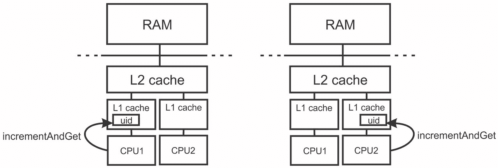
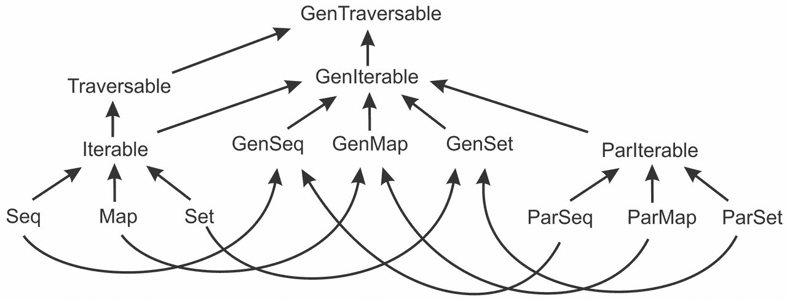

# 第五章 数据并行集合

|   | *"过早优化是万恶之源。"* |   |
| --- | --- | --- |
|   | --*唐纳德·克努特* |

到目前为止，我们一直在将多个计算线程组合成安全的并发程序。在这样做的时候，我们专注于确保它们的正确性。我们看到了如何避免在并发程序中阻塞，如何对异步计算的完成做出反应，以及如何使用并发数据结构在线程之间传递信息。所有这些工具使组织并发程序的结构变得更加容易。在本章中，我们将主要关注实现良好的性能。我们要求对现有程序的组织进行最小或没有更改，但我们将研究如何使用多个处理器来减少它们的运行时间。前一章中的 Futures 允许在一定程度上做到这一点，但它们在异步计算较短时相对较重且效率低下。

**数据并行**是一种计算形式，其中相同的计算在不同的数据元素上并行进行。在数据并行编程中，独立的计算产生值，这些值最终以某种方式合并在一起，而不是通过同步使用并发计算任务进行通信。数据并行操作的一个输入通常是一个数据集，如集合，输出可以是一个值或另一个数据集。

在本章中，我们将研究以下主题：

+   启动数据并行操作

+   配置数据并行集合的并行级别

+   性能测量及其重要性

+   使用顺序集合和并行集合之间的差异

+   将并行集合与并发集合一起使用

+   实现自定义并行集合，例如并行字符串

+   不同的数据并行框架

在 Scala 中，数据并行编程被应用于标准集合框架，以加速本质上声明性且非常适合数据并行的批量操作。在学习数据并行集合之前，我们将简要介绍 Scala 集合框架。

# Scala 集合概述

Scala 集合模块是 Scala 标准库中的一个包，其中包含各种通用集合类型。Scala 集合提供了一种通用且易于使用的方法，通过函数组合器声明性地操作数据。例如，在以下程序中，我们使用`filter`组合器对一系列数字进行操作，以返回 0 到 100,000 之间的回文数序列；即正向和反向读取方式相同的数字：

```java
(0 until 100000).filter(x => x.toString == x.toString.reverse) 

```

Scala 集合定义了三种基本的集合类型：**序列**、**映射**和**集合**。存储在序列中的元素是有序的，可以使用 `apply` 方法和整数索引来检索。映射存储键值对，可以用来检索与特定键关联的值。集合可以使用 `apply` 方法来测试元素成员资格。

Scala 集合库在不可变集合和可变集合之间做出了区分，不可变集合在创建后不能被修改，而可变集合在创建后可以被更新。常用的不可变序列有 `List` 和 `Vector`，而 `ArrayBuffer` 是大多数情况下选择的可变序列。可变的 `HashMap` 和 `HashSet` 集合是使用哈希表实现的映射和集合，而不可变的 `HashMap` 和 `HashSet` 集合基于不太为人所知的哈希 trie 数据结构。

Scala 集合可以通过调用 `par` 方法转换为它们的并行对应物。得到的集合被称为**并行集合**，其操作通过同时使用多个处理器来加速。前面的例子可以并行运行，如下所示：

```java
(0 until 100000).par.filter(x => x.toString == x.toString.reverse) 

```

在前面的代码行中，过滤器组合器是一个数据并行操作。在本章中，我们将更详细地研究并行集合。我们将看到何时以及如何创建并行集合，研究它们如何与顺序集合一起使用，并以实现一个自定义并行集合类作为结论。

# 使用并行集合

我们迄今为止研究的大多数并发编程工具都是为了使不同的计算线程能够交换信息。原子变量、`synchronized` 语句、并发队列、未来和承诺都专注于确保并发程序的正确性。另一方面，并行集合编程模型被设计成与顺序 Scala 集合在很大程度上相同；并行集合的存在只是为了提高程序的运行时间。在本章中，我们将测量使用并行集合的程序相对加速速度。为了使这项任务更容易，我们将向本章中用于示例的包对象引入 `timed` 方法。此方法接受一个代码块，并返回执行代码块 `body` 的运行时间。它首先使用 JDK `System` 类的 `nanoTime` 方法记录当前时间。然后运行代码块，记录代码块执行后的时间，并计算时间差：

```java
@volatile var dummy: Any = _ 
def timedT: Double = { 
  val start = System.nanoTime 
  dummy = body 
  val end = System.nanoTime 
  ((end - start) / 1000) / 1000.0 
} 

```

JVM 中的一些运行时优化，如死代码消除，可能会删除 `body` 块的调用，导致我们测量到不正确的运行时间。为了防止这种情况，我们将 `body` 块的返回值赋给一个名为 `dummy` 的易变字段。

程序性能受许多因素影响，在实践中很难预测。只要可能，你应该通过测量来验证你的性能假设。在以下示例中，我们使用 Scala 的`Vector`类创建一个包含五百万个数字的向量，然后使用`scala.util`包中的`Random`类来打乱该向量。然后我们比较顺序和并行`max`方法的运行时间，这两个方法都在`numbers`集合中找到最大的整数：

```java
import scala.collection._ 
import scala.util.Random 
object ParBasic extends App { 
  val numbers = Random.shuffle(Vector.tabulate(5000000)(i => i)) 
  val seqtime = timed { numbers.max } 
  log(s"Sequential time $seqtime ms") 
  val partime = timed { numbers.par.max } 
  log(s"Parallel time $partime ms") 
} 

```

在配备英特尔 i7-4900MQ 四核处理器和超线程技术以及 Oracle JVM 版本 1.7.0_51 的机器上运行此程序，我们发现顺序`max`方法需要 244 毫秒，而其并行版本只需要 35 毫秒。这主要是因为并行集合比它们的顺序版本优化得更好，部分原因是它们使用了多个处理器。然而，在不同的处理器和 JVM 实现中，结果可能会有所不同。

### 小贴士

总是通过测量执行时间来验证关于性能的假设。

`max`方法非常适合并行化。工作线程可以独立地扫描集合的子集，例如`numbers`。当一个工作线程在其子集中找到最大的整数时，它会通知其他处理器，并就最大结果达成一致。这一步比在集合子集中搜索最大整数所需的时间要少得多。我们说`max`方法是**易于并行化**的。

通常，数据并行操作比`max`方法需要更多的处理器间通信。考虑第三章中原子变量的`incrementAndGet`方法。我们可以再次使用此方法来计算唯一标识符。这次，我们将使用并行集合来计算大量唯一标识符：

```java
import java.util.concurrent.atomic._ 
object ParUid extends App { 
  private val uid = new AtomicLong(0L) 
  val seqtime = timed { 
    for (i <- 0 until 10000000) uid.incrementAndGet() 
  } 
  log(s"Sequential time $seqtime ms") 
  val partime = timed { 
    for (i <- (0 until 10000000).par) uid.incrementAndGet() 
  } 
  log(s"Parallel time $partime ms") 
} 

```

这次，我们在`for`循环中使用并行集合；回想一下，编译器会将每个`for`循环的出现转换为`foreach`调用。前面代码中的并行`for`循环等同于以下代码：

```java
(0 until 10000000).par.foreach(i => uid.incrementAndGet()) 

```

当在并行集合上调用`foreach`方法时，集合元素会并发处理。这意味着不同的工作线程会同时调用指定的函数，因此必须应用适当的同步。在我们的例子中，这种同步是通过原子变量来保证的，如第三章中所述，*并发传统的构建块*。

在我们的机器上运行此程序显示，速度没有增加。事实上，程序的并行版本甚至更慢；我们的程序为顺序`foreach`调用打印了 320 毫秒，为并行`foreach`调用打印了 1,041 毫秒。

你可能会感到惊讶看到这一点；程序在具有超线程的四核处理器上至少应该运行四倍快，对吧？正如前面的例子所示，这并不总是如此。并行`foreach`调用较慢，因为工作线程同时调用原子变量`uid`上的`incrementAndGet`方法，并一次性写入相同的内存位置。

在现代架构中，内存写入不会直接写入**随机存取存储器**（**RAM**），因为这会太慢。相反，现代计算机架构通过多级缓存将 CPU 与 RAM 分开：更小、更昂贵且速度更快的内存单元，这些单元保存了处理器当前正在使用的 RAM 部分。最接近 CPU 的缓存级别称为 L1 缓存。L1 缓存被划分为称为**缓存行**的短连续部分。通常，缓存行大小为 64 字节。尽管多个核心可以同时读取相同的缓存行，但在标准多核处理器中，当核心写入时，缓存行需要处于独占所有者状态。当另一个核心请求写入相同的缓存行时，需要将该缓存行复制到该核心的 L1 缓存。使这成为可能的缓存一致性协议称为**修改独占共享无效**（**MESI**），其具体内容超出了本书的范围。你需要知道的是，在处理器的时间尺度上，交换缓存行所有者可能相对昂贵。

由于`uid`变量是原子的，JVM 需要确保`uid`变量的写入和读取之间存在 happens-before 关系，正如我们从第二章，*JVM 和 Java 内存模型中的并发*中得知。为了确保 happens-before 关系，内存写入必须对其他处理器可见。确保这一点的唯一方法是写入之前以独占模式获取缓存行。在我们的例子中，不同的处理器核心反复交换`uid`变量分配的缓存行的所有权，导致程序比其顺序版本慢得多。这在下图中显示：



如果不同的处理器只读取共享内存位置，则不会出现减速。另一方面，写入相同的内存位置是可扩展性的障碍。

### 小贴士

使用适当的同步写入相同的内存位置会导致性能瓶颈和竞争；在数据并行操作中避免这种情况。

除了计算能力之外，并行程序还共享其他资源。当不同的并行计算请求的资源超过当前可用资源时，就会发生一种称为**资源竞争**的现象。在我们示例中发生的特定类型的资源竞争被称为**内存竞争**，即对写入特定内存部分的排他权的冲突。

我们可以预期，当使用多个线程并发地对同一对象上的`synchronized`语句进行重复修改，或在并发映射中同时修改相同的键，或在并发队列中同时入队元素时，会出现相同类型的性能下降；所有这些操作都需要写入相同的内存位置。尽管如此，这并不意味着线程永远不会写入相同的内存位置。在某些应用程序中，并发写入非常罕见；写入竞争内存位置所花费的时间与执行其他工作所花费的时间之间的比率决定了并行化是否有益。仅通过查看程序很难预测这个比率；`ParUid`示例旨在说明我们应该始终进行测量，以了解竞争的影响。

## 并行集合类层次结构

正如我们所看到的，并行集合操作是在不同的工作线程上同时执行的。在并行操作执行过程中的任何时刻，并行集合中的一个元素最多只能被一个执行该操作的工作线程处理。与并行操作相关的代码块是分别在每个元素上执行的；在`ParUid`示例中，`incrementAndGet`方法被并发多次调用。每当并行操作执行任何副作用时，它必须注意使用适当的同步；使用`var`来存储`uid`的简单方法会导致数据竞争，就像在第二章中发生的那样，*JVM 和 Java 内存模型上的并发*。这与顺序 Scala 集合的情况不同。

结果是，并行集合不能成为顺序集合的子类型。如果是这样，那么就会违反**Liskov 替换原则**。Liskov 替换原则指出，如果类型`S`是类型`T`的子类型，那么类型`T`的对象可以被类型`S`的对象替换，而不会影响程序的正确性。

在我们的情况下，如果并行集合是顺序集合的子类型，那么某些方法可以返回具有静态类型`Seq[Int]`的顺序序列集合，其中序列对象在运行时是并行序列集合。客户端可以在不知道`foreach`方法体需要同步的情况下调用集合上的方法，而他们的程序将无法正确运行。出于这些原因，并行集合形成了一个与顺序集合分开的层次结构，如下面的图所示：



Scala 集合层次结构

上述图显示了简化的 Scala 集合层次结构，其中顺序集合位于左侧。最一般的集合类型称为`Traversable`。不同的集合操作，如`find`、`map`、`filter`或`reduceLeft`，都是基于其抽象的`foreach`方法实现的。其`Iterable[T]`子类型提供了额外的操作，如`zip`、`grouped`、`sliding`和`sameElements`，这些操作使用其`iterator`方法实现。`Seq`、`Map`和`Set`特质是可迭代的集合，分别代表 Scala 的序列、映射和集合。这些特质用于编写针对具体 Scala 集合类型的通用代码。下面的`nonNull`方法从`xs`集合中复制与`null`不同的元素。在这里，`xs`集合可以是`Vector[T]`、`List[T]`或其他序列：

```java
def nonNull(xs: Seq[T]): Seq[T] = xs.filter(_ != null) 

```

并行集合形成了一个单独的层次结构。最一般的并行集合类型称为`ParIterable`。在`ParIterable`对象上执行的方法，如`foreach`、`map`或`reduce`，将并行执行。`ParSeq`、`ParMap`和`ParSet`集合是并行集合，对应于`Seq`、`Map`和`Set`，但不是它们的子类型。我们可以将`nonNull`方法重写为使用并行集合：

```java
def nonNull(xs: ParSeq[T]): ParSeq[T] = xs.filter(_ != null) 

```

虽然实现相同，但我们不能再将顺序集合传递给`nonNull`方法。我们可以在将集合传递给`nonNull`方法之前，对顺序的`xs`集合调用`.par`，但这样`filter`方法将并行执行。我们能否编写对集合类型无知的代码？存在用于此目的的通用集合类型：`GenTraversable`、`GenIterable`、`GenSeq`、`GenMap`和`GenSet`。每个都代表相应顺序或并行集合类型的超类型。例如，`GenSeq`通用序列类型允许我们将`nonNull`方法重写如下：

```java
def nonNull(xs: GenSeq[T]): GenSeq[T] = xs.filter(_ != null) 

```

当使用通用集合类型时，我们需要记住它们可能被实现为顺序集合或并行集合。因此，作为预防措施，如果在通用集合上执行的操作有任何副作用，您应该使用同步。

### 小贴士

将在通用集合类型上执行的操作视为并行操作。

## 配置并行级别

并行集合默认使用所有处理器；其底层执行器的工作者数量与处理器数量相同。我们可以通过更改并行集合的`TaskSupport`对象来改变这种默认行为。基本的`TaskSupport`实现是`ForkJoinTaskSupport`类。它接受一个`ForkJoinPool`集合，并使用它来调度并行操作。

因此，要改变并行集合的并行级别，我们需要实例化一个具有所需并行级别的`ForkJoinPool`集合：

```java
import scala.concurrent.forkjoin.ForkJoinPool 
object ParConfig extends App { 
  val fjpool = new ForkJoinPool(2) 
  val customTaskSupport = new parallel.ForkJoinTaskSupport(fjpool) 
  val numbers = Random.shuffle(Vector.tabulate(5000000)(i => i)) 
  val partime = timed { 
    val parnumbers = numbers.par 
    parnumbers.tasksupport = customTaskSupport 
    val n = parnumbers.max 
    println(s"largest number $n") 
  } 
  log(s"Parallel time $partime ms") 
} 

```

一旦创建了一个`TaskSupport`对象，我们就可以使用它与不同的并行集合一起使用。每个并行集合都有一个`tasksupport`字段，我们使用它将`TaskSupport`对象分配给它。

## 在 JVM 上测量性能

在 JVM 上正确测量运行时间不是一项容易的任务。在底层，JVM 做了很多超出我们视线的工作。Scala 编译器不会直接产生可在 CPU 上运行的机器码。相反，Scala 编译器产生一种特殊的中间指令代码，称为**Java 字节码**。当 Scala 编译器的字节码在 JVM 内部运行时，最初它以所谓的**解释模式**执行；JVM 解释每个字节码指令并模拟程序的执行。只有当 JVM 决定某个方法中的字节码已经运行足够频繁时，它才会将字节码编译成机器码，这可以直接在处理器上执行。这个过程称为**即时编译**。

JVM 需要标准化的字节码以实现跨平台；相同的字节码可以在支持 JVM 的任何处理器或操作系统上运行。然而，程序的全部字节码并不能在程序运行时立即转换为机器码；这将太慢。相反，JVM 会增量地将程序的某些部分，如特定方法，在短暂的编译运行中转换。此外，JVM 还可以决定额外优化程序中执行非常频繁的部分。因此，在 JVM 上运行的程序通常在启动后速度较慢，最终达到最佳性能。一旦发生这种情况，我们就说 JVM 达到了稳定状态。在评估 JVM 上的性能时，我们通常对**稳定状态**感兴趣；大多数程序运行足够长的时间以达到这一状态。

为了见证这种效果，假设你想找出 HTML 中的 `TEXTAREA` 标签代表什么。你编写了一个程序，下载 HTML 规范并搜索 `TEXTAREA` 字符串的第一个出现。在掌握了 第四章 中的异步编程后，*使用 Future 和 Promise 进行异步编程*，你可以实现 `getHtmlSpec` 方法，该方法启动一个异步计算以下载 HTML 规范，并返回一个包含 HTML 规范行的 future 值。然后你安装一个回调；一旦 HTML 规范可用，你就可以在行上调用 `indexWhere` 方法来找到匹配正则表达式 `.*TEXTAREA.*` 的行：

```java
object ParHtmlSearch extends App { 
  def getHtmlSpec() = Future { 
    val url = "http://www.w3.org/MarkUp/html-spec/html-spec.txt" 
    val specSrc = Source.fromURL(url) 
    try specSrc.getLines.toArray finally specSrc.close() 
  } 
  getHtmlSpec() foreach { case specDoc => 
    def search(d: GenSeq[String]): Double = 
      timed { d.indexWhere(line => line.matches(".*TEXTAREA.*")) } 
    val seqtime = search(specDoc) 
    log(s"Sequential time $seqtime ms") 
    val partime = search(specDoc.par) 
    log(s"Parallel time $partime ms") 
  } 
} 

```

从 SBT 运行此示例多次表明，运行时间会有所不同。最初，顺序版本和并行版本分别执行了 45 毫秒和 16 毫秒。下一次，它们分别需要 36 毫秒和 10 毫秒，随后是 10 毫秒和 4 毫秒。请注意，我们只有在将示例运行在与 SBT 本身相同的 JVM 进程内时才会观察到这种效果。

我们可能会得出一个错误的结论，认为此时已经达到了稳定状态。实际上，我们应该在 JVM 正确优化程序之前运行这个程序许多次。因此，我们将 `warmedTimed` 方法添加到我们的包对象中。此方法在测量运行时间之前运行代码块 `n` 次。我们将 `n` 变量的默认值设置为 `200`；尽管无法保证 JVM 在执行代码块 200 次后将达到稳定状态，但这是一个合理的默认值：

```java
def warmedTimedT(body: =>T): Double = { 
  for (_ <- 0 until n) body 
  timed(body) 
} 

```

现在我们可以调用 `ParHtmlSearch` 示例中的 `warmedTimed` 方法，而不是 `timed` 方法：

```java
def search(d: GenSeq[String]) = warmedTimed() { 
  d.indexWhere(line => line.matches(".*TEXTAREA.*")) 
} 

```

这样做将我们的机器上程序的顺序版本和并行版本的运行时间分别改变为 1.5 毫秒和 0.5 毫秒。

### 小贴士

在对程序运行时间做出任何过早的结论之前，请确保 JVM 处于稳定状态。

在 JVM 上测量性能之所以困难，还有其他原因。即使 JVM 达到了我们测量的程序部分的稳定状态，**即时编译器**（**JIT**）也可以在任何时候暂停执行并将程序的其他部分转换为机器码，从而有效地减慢我们的测量速度。然后，JVM 提供了自动内存管理。在 C++ 等语言中，用于分配对象的 `new` 关键字的调用必须伴随着释放对象占用的内存的相应 `delete` 调用，以便以后可以重用。然而，在 Scala 和 Java 等语言中，没有 `delete` 语句；对象最终在称为 **垃圾回收**（**GC**）的过程中自动释放。定期地，JVM 停止执行，扫描堆以查找程序中不再使用的所有对象，并释放它们占用的内存。如果我们测量频繁引起 GC 周期的代码的运行时间，GC 很可能会扭曲测量结果。在某些情况下，同一程序的性能可能会因 JVM 进程的不同而有所不同，因为对象的分配方式会导致特定的内存访问模式，从而影响程序的性能。

要获得真正可靠的运行时间值，我们需要多次运行代码，通过启动单独的 JVM 进程，确保 JVM 达到稳定状态，并取所有测量的平均值。例如，在 第九章 中介绍的 **ScalaMeter** 等框架，在 *实践中的并发* 中，大大简化了这一过程。

# 并行集合的注意事项

并行集合被设计成提供与顺序 Scala 集合类似的编程 API。每个顺序集合都有一个并行对应物，并且大多数操作在顺序和并行集合中都有相同的签名。尽管如此，在使用并行集合时仍有一些注意事项，我们将在本节中研究它们。

## 不可并行化的集合

并行集合使用 **拆分器**（**splitters**），用 `Splitter[T]` 类型表示，以提供并行操作。拆分器是迭代器的一种更高级形式；除了迭代器的 `next` 和 `hasNext` 方法外，拆分器还定义了 `split` 方法，该方法将拆分器 `S` 划分为一系列拆分器，这些拆分器遍历 `S` 拆分器的一部分：

```java
def split: Seq[Splitter[T]] 

```

此方法允许不同的处理器遍历输入集合的不同部分。`split`方法必须高效实现，因为此方法在并行操作的执行过程中会被多次调用。在计算复杂度理论的词汇中，`split`方法允许的渐近运行时间是**O**(log (*N*))，其中*N*是分割器中的元素数量。分割器可以用于扁平数据结构，如数组哈希表，以及树形数据结构，如不可变哈希图和向量。线性数据结构，如 Scala 的`List`和`Stream`集合，无法有效地实现`split`方法。将长链表节点分成两部分需要遍历这些节点，这需要的时间与集合的大小成比例。

Scala 集合上的操作，如`Array`、`ArrayBuffer`、可变的`HashMap`和`HashSet`、`Range`、`Vector`、不可变的`HashMap`和`HashSet`以及并发`TrieMap`可以并行化。我们称这些集合为*可并行化集合*。在这些集合上调用`par`方法会创建一个与原始集合具有相同底层数据集的并行集合。没有元素被复制，转换速度快。

其他 Scala 集合在调用`par`时需要转换为它们的并行对应物。我们可以将它们称为*不可并行化集合*。在不可并行化集合上调用`par`方法意味着将它们的元素复制到一个新的集合中。例如，当调用`par`方法时，`List`集合需要复制到`Vector`集合中，如下面的代码片段所示：

```java
object ParNonParallelizableCollections extends App { 
  val list = List.fill(1000000)("") 
  val vector = Vector.fill(1000000)("") 
  log(s"list conversion time: ${timed(list.par)} ms") 
  log(s"vector conversion time: ${timed(vector.par)} ms") 
} 

```

在我们的机器上，对`List`调用`par`需要 55 毫秒，而对`Vector`调用`par`只需要 0.025 毫秒。重要的是，从顺序集合到并行集合的转换本身并不是并行化的，并且可能是一个可能的顺序瓶颈。

### 提示

将不可并行化顺序集合转换为并行集合不是并行操作；它在调用线程上执行。

有时，将非并行化集合转换为并行集合的成本是可以接受的。如果并行操作中的工作量远超过转换集合的成本，那么我们可以咬紧牙关，承担转换的成本。否则，更谨慎的做法是将程序数据保持在可并行化集合中，并从快速转换中受益。如有疑问，请测量！

## 不可并行化操作

虽然大多数并行集合操作通过在多个处理器上执行而实现更优的性能，但某些操作本质上是顺序的，它们的语义不允许它们并行执行。考虑 Scala 集合 API 中的`foldLeft`方法：

```java
def foldLeftS(f: (S, T) => S): S 

```

此方法从左到右遍历集合的元素，并将它们添加到类型为`S`的累加器中。累加器最初等于零值`z`，并使用累加器和类型为`T`的集合元素来更新函数`f`，以产生一个新的累加器。例如，给定一个整数列表`List(1, 2, 3)`，我们可以使用以下表达式来计算其整数的总和：

```java
List(1, 2, 3).foldLeft(0)((acc, x) => acc + x) 

```

这个`foldLeft`方法首先将`acc`赋值为`0`。然后它取列表中的第一个元素`1`，并调用函数`f`来评估`0 + 1`。此时，累加器`acc`变为`1`。这个过程一直持续到访问完列表中的所有元素，`foldLeft`方法最终返回结果`6`。在这个例子中，累加器的`S`类型被设置为`Int`类型。一般来说，累加器可以有任何类型。当将元素列表转换为字符串时，零值是一个空字符串，函数`f`将字符串和数字连接起来。

`foldLeft`操作的关键属性是它从左到右遍历列表的元素。这反映在函数`f`的类型上；它接受类型为`S`的累加器和类型为`T`的列表值。函数`f`不能接受两个累加器类型的值并将它们合并成一个新的累加器类型`S`。因此，累加器的计算不能并行实现；`foldLeft`方法不能将来自两个不同处理器的两个累加器合并。我们可以通过运行以下程序来验证这一点：

```java
object ParNonParallelizableOperations extends App { 
  ParHtmlSearch.getHtmlSpec() foreach { case specDoc => 
    def allMatches(d: GenSeq[String]) = warmedTimed() { 
      val results = d.foldLeft("") { (acc, line) => 
        if (line.matches(".*TEXTAREA.*")) s"$acc\n$line" else acc 
      } 
    } 
    val seqtime = allMatches(specDoc) 
    log(s"Sequential time - $seqtime ms") 
    val partime = allMatches(specDoc.par) 
    log(s"Parallel time   - $partime ms") 
  } 
  Thread.sleep(2000) 
} 

```

在前面的程序中，我们使用之前引入的`getHtmlSpec`方法来获取 HTML 规范中的行。我们使用`foreach`调用安装一个回调，以便在 HTML 规范到达后进行处理；`allMatches`方法调用`foldLeft`操作来累加包含`TEXTAREA`字符串的规范行。运行程序显示，顺序和并行`foldLeft`操作都花费了 5.6 毫秒。

要指定不同处理器产生的累加器应该如何合并在一起，我们需要使用`aggregate`方法。`aggregate`方法与`foldLeft`操作类似，但它没有指定元素是从左到右遍历的。相反，它只指定了从左到右遍历的元素子集；每个子集都可以产生一个单独的累加器。`aggregate`方法接受一个额外的函数类型`(S, S) => S`，用于合并多个累加器：

```java
d.aggregate("")( 
  (acc, line) => 
  if (line.matches(".*TEXTAREA.*")) s"$acc\n$line" else acc, 
  (acc1, acc2) => acc1 + acc2 
) 

```

再次运行示例程序显示了程序顺序和并行版本之间的差异；在机器上，并行`aggregate`方法完成所需时间为 1.4 毫秒。

当在并行执行这些类型的归约操作时，我们可以使用`reduce`或`fold`方法作为替代，这些方法不保证从左到右执行。`aggregate`方法更具有表达性，因为它允许累加器的类型与集合中元素的类型不同。

### 小贴士

使用`aggregate`方法来执行并行归约操作。

其他固有的顺序操作包括`foldRight`、`reduceLeft`、`reduceRight`、`reduceLeftOption`、`reduceRightOption`、`scanLeft`、`scanRight`以及产生不可并行化集合的方法，如`toList`方法。

## 并行操作中的副作用

正如它们的名称所暗示的，并行集合会在多个线程上并发执行。我们已经在第二章中学习了，*JVM 和 Java 内存模型中的并发*，多个线程在没有同步的情况下无法正确修改共享内存位置。从并行集合操作中向可变变量赋值可能很有吸引力，但几乎肯定是不正确的。以下示例最好地说明了这一点，其中我们构建了两个集合，`a`和`b`，其中`b`是`a`中元素的子集，然后使用`total`可变变量来计算交集的大小：

```java
object ParSideEffectsIncorrect extends App { 
  def intersectionSize(a: GenSet[Int], b: GenSet[Int]): Int = { 
    var total = 0 
    for (x <- a) if (b contains x) total += 1 
    total 
  } 
  val a = (0 until 1000).toSet 
  val b = (0 until 1000 by 4).toSet 
  val seqres = intersectionSize(a, b) 
  val parres = intersectionSize(a.par, b.par) 
  log(s"Sequential result - $seqres") 
  log(s"Parallel result   - $parres") 
} 

```

与返回`250`不同，并行版本非确定性返回各种错误的结果。请注意，你可能需要更改集合`a`和`b`的大小才能观察到这一点：

```java
run-main-32: Sequential result - 250
run-main-32: Parallel result   - 244

```

为了确保并行版本返回正确的结果，我们可以使用原子变量及其`incrementAndGet`方法。然而，这会导致我们之前遇到的可伸缩性问题。更好的替代方案是使用并行`count`方法：

```java
a.count(x => b contains x) 

```

如果每个元素执行的工作量低且匹配频繁，并行`count`方法将比使用原子变量的`foreach`方法有更好的性能。

### 小贴士

为了避免同步的需要并确保更好的可伸缩性，优先使用声明式并行操作，而不是并行`for`循环中的副作用。

同样，我们必须确保并行操作读取的内存位置在并行操作执行期间受到并发写入的保护。在上一个示例中，当并行操作执行时，不应有某个线程并发修改`b`集合；这会导致与在并行操作中使用可变变量相同的不正确结果。

## 非确定性并行操作

在第二章中，*JVM 和 Java 内存模型上的并发*，我们看到了多线程程序可以是非确定性的；给定相同的输入，它们可以产生不同的输出，这取决于执行计划。`find`集合操作返回匹配给定谓词的元素。并行的`find`操作返回某个处理器首先找到的元素。在以下示例中，我们使用`find`来搜索 HTML 规范中`TEXTAREA`字符串的出现；运行示例几次会得到不同的结果，因为`TEXTAREA`字符串在 HTML 规范中出现的位置很多：

```java
object ParNonDeterministicOperation extends App { 
  ParHtmlSearch.getHtmlSpec() foreach { case specDoc => 
    val patt = ".*TEXTAREA.*" 
    val seqresult = specDoc.find(_.matches(patt)) 
    val parresult = specDoc.par.find(_.matches(patt)) 
    log(s"Sequential result - $seqresult") 
    log(s"Parallel result   - $parresult") 
  } 
  Thread.sleep(3000) 
} 

```

如果我们要检索`TEXTAREA`字符串的第一个出现，我们需要使用`indexWhere`：

```java
val index = specDoc.par.indexWhere(_.matches(patt)) 
val parresult = if (index != -1) Some(specDoc(index)) else None 

```

除了`find`之外的并行集合操作只要它们的运算符是**纯函数**就是确定性的。纯函数总是对相同的输入评估为相同的值，并且没有副作用。例如，函数`(x: Int) => x + 1`是一个纯函数。相比之下，以下函数`f`不是纯函数，因为它改变了`uid`值的状态：

```java
val uid = new AtomicInteger(0) 
val f = (x: Int) => (x, uid.incrementAndGet()) 

```

即使一个函数没有修改任何内存位置，如果它读取可能会改变的内存位置，它也不是纯函数。例如，以下`g`函数不是纯函数：

```java
val g = (x: Int) => (x, uid.get) 

```

当与非纯函数一起使用时，任何并行操作都可能变得非确定性。并行地将值范围映射到唯一标识符会产生非确定性结果，如下面的调用所示：

```java
val uids: GenSeq[(Int, Int)] = (0 until 10000).par.map(f) 

```

结果序列`uids`在不同的执行中是不同的。并行的`map`操作保留了从`0`到`10000`范围的元素相对顺序，因此`uids`中的元组按其第一个元素从`0`到`10,000`排序。另一方面，每个元组的第二个元素被非确定性地分配；在一个执行中，`uids`序列可以以`(0, 0), (1, 2), (2, 3), ...`开始，而在另一个执行中，以`(0, 0), (1, 4), (2, 9), ...`开始。

## 交换律和结合律运算符

类似于`reduce`、`fold`、`aggregate`和`scan`的并行集合操作将二元运算符作为其输入的一部分。二元运算符是一个函数`op`，它接受两个参数，`a`和`b`。我们可以说，如果改变其参数的顺序会返回相同的结果，即`op(a, b) == op(b, a)`，那么二元运算符`op`是**交换律**的。例如，两个数相加是一个交换律操作。两个字符串连接不是一个交换律操作；我们得到不同的字符串，这取决于连接的顺序。

并行 `reduce`、`fold`、`aggregate` 和 `scan` 操作的二元运算符永远不需要是交换的。当底层集合具有任何排序时，并行集合操作在应用二元运算符时始终尊重元素的相对顺序。例如，序列集合（如 `ArrayBuffer` 集合）中的元素始终是有序的。其他集合类型可以对其元素进行排序，但不是必须这样做。

在以下示例中，我们可以通过使用顺序的 `reduceLeft` 操作和并行 `reduce` 操作将 `ArrayBuffer` 集合内的字符串连接成一个长字符串。然后，我们将 `ArrayBuffer` 集合转换为集合，该集合没有排序：

```java
object ParNonCommutativeOperator extends App { 
  val doc = mutable.ArrayBuffer.tabulate(20)(i => s"Page $i, ") 
  def test(doc: GenIterable[String]) { 
    val seqtext = doc.seq.reduceLeft(_ + _) 
    val partext = doc.par.reduce(_ + _) 
    log(s"Sequential result - $seqtext\n") 
    log(s"Parallel result   - $partext\n") 
  } 
  test(doc) 
  test(doc.toSet) 
} 

```

我们可以看到，当在并行数组上调用并行 `reduce` 操作时，字符串可以正确地连接，但当在集合上调用 `reduceLeft` 和 `reduce` 操作时，页面的顺序会被打乱；默认的 Scala 集合实现不排序元素。

### 注意

在并行操作中使用的二元运算符不需要是交换的。

如果将二元运算符 `op` 连续应用于值序列 `a`、`b` 和 `c`，无论运算符应用的顺序如何，都得到相同的结果，则 `op` 二元运算符是 **结合的**，即 `op(a, op(b, c)) == op(op(a, b), c)`。将两个数字相加或计算两个数字中较大的一个是结合操作。减法不是结合的，因为 `1 - (2 - 3)` 与 `(1 - 2) - 3` 是不同的。

并行集合操作通常需要结合的二元运算符。虽然使用 `reduceLeft` 操作中的减法意味着集合中的所有数字都应该从第一个数字中减去，但在 `reduce`、`fold` 或 `scan` 方法中使用减法会给出非确定性和错误的结果，如下面的代码片段所示：

```java
object ParNonAssociativeOperator extends App { 
  def test(doc: GenIterable[Int]) { 
    val seqtext = doc.seq.reduceLeft(_ - _) 
    val partext = doc.par.reduce(_ - _) 
    log(s"Sequential result - $seqtext\n") 
    log(s"Parallel result   - $partext\n") 
  } 
  test(0 until 30) 
} 

```

虽然 `reduceLeft` 操作始终返回 `-435`，但 `reduce` 操作随机返回无意义的结果。

### 小贴士

确保在并行操作中使用的二元运算符是结合的。

需要 `sop` 和 `cop` 多个二元运算符的并行操作，如 `aggregate`：

```java
def aggregateS(sop: (S, T) => S, cop: (S, S) => S): S 

```

`sop` 运算符与 `reduceLeft` 操作所需的运算符类型相同。它接受一个累加器和集合元素。`sop` 运算符用于折叠分配给特定处理器的子集中的元素。`cop` 运算符用于合并子集，并且与 `reduce` 和 `fold` 的运算符类型相同。`aggregate` 操作要求 `cop` 是结合的，且 `z` 是累加器的 **零元素**，即 `cop(z, a) == a`。此外，`sop` 和 `cop` 运算符必须在不考虑元素子集分配给处理器的顺序的情况下给出相同的结果，即 `cop(sop(z, a), sop(z, b)) == cop(z, sop(sop(z, a), b))`。

# 结合使用并行和并发集合

我们已经看到，并行集合操作不允许在不使用同步的情况下访问可变状态。这包括在并行操作中修改顺序 Scala 集合。回想一下，我们在关于副作用的部分使用了一个可变变量来计算交集的大小。在下面的例子中，我们将下载 URL 和 HTML 规范，将它们转换为单词集合，并尝试找到它们的单词交集。在`intersection`方法中，我们使用`HashSet`集合并在并行中更新它。`scala.collection.mutable`包中的集合不是线程安全的。以下例子中，元素可能会非确定性地丢失，损坏缓冲区状态，或者抛出异常：

```java
object ConcurrentWrong extends App { 
  import ParHtmlSearch.getHtmlSpec 
  import ch4.FuturesCallbacks.getUrlSpec 
  def intersection(a: GenSet[String], b: GenSet[String]) = { 
    val result = new mutable.HashSet[String] 
    for (x <- a.par) if (b contains x) result.add(x) 
    result 
  } 
  val ifut = for { 
    htmlSpec <- getHtmlSpec() 
    urlSpec <- getUrlSpec() 
  } yield { 
    val htmlWords = htmlSpec.mkString.split("\\s+").toSet 
    val urlWords = urlSpec.mkString.split("\\s+").toSet 
    intersection(htmlWords, urlWords) 
  } 
  ifut onComplete { case t => log(s"Result: $t") } 
  Thread.sleep(3000) 
} 

```

我们在第三章*并发的基石*中了解到，并发集合可以在不风险数据损坏的情况下被多个线程安全地修改。我们使用 JDK 中的并发跳表集合来累积出现在两个规范中的单词。`decorateAsScala`对象被用来给 Java 集合添加`asScala`方法：

```java
import java.util.concurrent.ConcurrentSkipListSet 
import scala.collection.convert.decorateAsScala._ 
def intersection(a: GenSet[String], b: GenSet[String]) = { 
  val skiplist = new ConcurrentSkipListSet[String] 
  for (x <- a.par) if (b contains x) skiplist.add(x) 
  val result: Set[String] = skiplist.asScala 
  result 
} 

```

## 弱一致性迭代器

正如我们在第三章*并发的基石*中看到的，大多数并发集合的迭代器是弱一致的。这意味着如果某个线程在遍历期间并发更新集合，则不能保证它们能正确遍历数据结构。

当在并发集合上执行并行操作时，同样的限制也适用；遍历是弱一致的，可能不会反映操作开始时的数据结构状态。Scala 的`TrieMap`集合是这一规则的例外。在下面的例子中，我们将创建一个名为`cache`的`TrieMap`集合，包含从 0 到 100 的数字，映射到它们的字符串表示。然后我们将启动一个并行操作，遍历这些数字，并将它们的负值映射添加到映射中：

```java
object ConcurrentTrieMap extends App { 
  val cache = new concurrent.TrieMap[Int, String]() 
  for (i <- 0 until 100) cache(i) = i.toString 
  for ((number, string) <- cache.par) cache(-number) = s"-$string" 
  log(s"cache - ${cache.keys.toList.sorted}") 
} 

```

并行的`foreach`操作不会遍历在并行操作开始后添加的条目；只有正数会在遍历中反映出来。`TrieMap`集合使用 Ctrie 并发数据结构实现，当并行操作开始时，它会原子性地创建集合的快照。快照创建是高效的，并且不需要你复制元素；后续的更新操作会增量地重建`TrieMap`集合的部分。

### 小贴士

当程序数据需要同时并行修改和遍历时，请使用`TrieMap`集合。

# 实现自定义并行集合

Scala 标准库中的并行集合对于大多数任务来说已经足够了，但在某些情况下，我们希望向自己的集合中添加并行操作。Java 的`String`类在并行集合框架中没有直接的并行对应物。在本节中，我们将研究如何实现一个支持并行操作的定制`ParString`类。然后，我们将使用我们的定制并行集合类在几个示例程序中。

实现自定义并行集合的第一步是扩展正确的并行集合特质。并行字符串是一系列字符，因此我们需要使用`Char`类型参数扩展`ParSeq`特质。一旦字符串被创建，它就不再可以被修改；我们说字符串是一个不可变集合。因此，我们扩展了`scala.collection.parallel.ParSeq`特质的子类型，即来自`scala.collection.parallel.immutable`包的`ParSeq`特质：

```java
class ParString(val str: String) extends immutable.ParSeq[Char] { 
  def apply(i: Int) = str.charAt(i) 
  def length = str.length 
  def splitter = new ParStringSplitter(str, 0, str.length) 
  def seq = new collection.immutable.WrappedString(str) 
} 

```

当我们扩展并行集合时，我们需要实现其`apply`、`length`、`splitter`和`seq`方法。`apply`方法返回序列中的第`i`个位置的元素，而`length`方法返回序列中的元素总数。这些方法与顺序集合上的方法等效，因此我们使用`String`类的`charAt`和`length`方法来实现它们。在定义自定义常规序列需要实现其`iterator`方法时，自定义并行集合需要一个`splitter`方法。调用`splitter`返回一个`Splitter[T]`类型的对象，这是一个特殊的迭代器，可以被分割成子集。我们实现`splitter`方法以返回一个`ParStringSplitter`对象，我们将在稍后向您展示。最后，并行集合需要一个`seq`方法，它返回一个顺序 Scala 集合。由于`String`本身来自 Java，并且不是 Scala 集合，我们将使用 Scala 集合库中的`WrappedString`包装类。

我们的定制并行集合类几乎完成了；我们只需要提供`ParStringSplitter`对象的实现。我们将在下一节研究如何实现这一点。

## 分割器

分割器是一个可以高效分割成不相交子集的迭代器。在这里，高效意味着分割器的`split`方法必须具有**O**(*log*(*N*))的运行时间，其中*N*是分割器中的元素数量。非正式地说，分割器在分割时不允许复制集合的大部分；如果它这样做，分割的计算开销将超过并行化的任何好处，并成为串行瓶颈。

为 Scala 并行集合框架定义一个新的`Splitter`类最简单的方法是扩展`IterableSplitter[T]`特质，它具有以下简化接口：

```java
trait IterableSplitter[T] extends Iterator[T] { 
  def dup: IterableSplitter[T] 
  def remaining: Int 
  def split: Seq[IterableSplitter[T]] 
} 

```

分割器接口声明了`dup`方法，该方法复制当前的分割器。此方法简单地返回一个新的分割器，指向集合的相同子集。分割器还定义了`remaining`方法，该方法通过在`hasNext`方法返回`false`之前调用`next`方法，返回分割器可以遍历的元素数量。`remaining`方法不会改变分割器的状态，可以按需多次调用。

然而，`split`方法只能调用一次，并且会使分割器失效；在调用`split`方法之后，不应调用分割器的任何方法。`split`方法返回一个分割器序列，这些分割器遍历原始分割器的非重叠子集。如果原始分割器有两个或更多剩余元素，则结果分割器中不应有任何一个是空的，并且`split`方法应返回至少两个分割器。如果原始分割器只有一个元素或没有剩余元素，则允许`split`返回空分割器。重要的是，`split`方法返回的分割器大小应大致相等；这有助于并行集合调度器实现良好的性能。

为了允许特定的序列操作，如`zip`、`sameElements`和`corresponds`，并行序列集合使用`IterableSplitter`特质的更精细子类型，称为`SeqSplitter`特质：

```java
trait SeqSplitter[T] extends IterableSplitter[T] { 
  def psplit(sizes: Int*): Seq[SeqSplitter[T]] 
} 

```

序列分割器声明了一个额外的`psplit`方法，该方法接受分割器分区的大小列表，并返回由`sizes`参数指定的那么多分割器和元素。如果`sizes`指定的元素数量超过分割器中可用的元素数量，则结果序列的末尾将返回额外的空分割器。例如，对一个只有 15 个元素的分割器调用`s.psplit(10, 20, 15)`将产生三个大小分别为 10、5 和 0 的分割器。

类似地，如果`sizes`参数指定的元素数量少于分割器中的元素数量，则将在末尾附加一个包含剩余元素的额外分割器。

我们的并行字符串类是一个并行序列，因此我们需要实现一个序列分割器。我们可以通过扩展带有`Char`类型参数的`SeqSplitter`类来开始：

```java
class ParStringSplitter 
  (val s: String, var i: Int, val limit: Int) 
extends SeqSplitter[Char] { 

```

我们在`ParStringSplitter`构造函数中添加了一个指向底层`String`对象的`s`字段。并行字符串分割器必须表示字符串中元素的一个子集，因此我们添加了一个`i`字段来表示分割器将要遍历的下一个字符的位置。请注意，`i`不需要同步；分割器一次只被一个处理器使用。`limit`字段包含分割器中最后一个字符之后的位位置。这样，我们的分割器类表示原始字符串的子字符串。

实现 `Iterator` 特质继承的方法很简单。只要 `i` 小于 `limit`，`hasNext` 必须返回 `true`。`next` 方法使用 `i` 读取该位置的字符，增加 `i`，并返回该字符：

```java
  final def hasNext = i < limit 
  final def next = { 
    val r = s.charAt(i) 
    i += 1 
    r 
  } 

```

`dup` 和 `remaining` 方法很简单；`dup` 方法使用当前分割器的状态创建一个新的并行字符串分割器，而 `remaining` 方法使用 `limit` 和 `i` 来计算剩余元素的数量：

```java
  def dup = new ParStringSplitter(s, i, limit) 
  def remaining = limit - i 

```

分割器的主要部分是其 `split` 和 `psplit` 方法。幸运的是，`split` 可以通过 `psplit` 来实现。如果有多个元素剩余，我们调用 `psplit` 方法。如果没有元素要分割，我们返回 `this` 分割器：

```java
  def split = { 
    val rem = remaining 
    if (rem >= 2) psplit(rem / 2, rem - rem / 2) 
    else Seq(this) 
  } 

```

`psplit` 方法使用 `sizes` 来剥离原始分割器的一部分。它是通过增加 `i` 变量并为 `sizes` 参数中的每个大小 `sz` 创建一个新的分割器来实现的。回想一下，在调用 `split` 或 `psplit` 方法后，当前分割器被认为是无效的，因此我们可以修改其 `i` 字段：

```java
  def psplit(sizes: Int*): Seq[ParStringSplitter] = { 
    val ss = for (sz <- sizes) yield { 
      val nlimit = (i + sz) min limit 
      val ps = new ParStringSplitter(s, i, nlimit) 
      i = nlimit 
      ps 
    } 
    if (i == limit) ss 
    else ss :+ new ParStringSplitter(s, i, limit) 
  } 
} 

```

注意，我们从不复制分割器底层的字符串；相反，我们更新标记分割器开始和结束的索引。

我们现在已经完成了 `ParString` 类；我们可以用它来执行字符串上的并行操作。我们还可以用它来计算字符串中大写字母的数量，如下所示：

```java
object CustomCharCount extends App { 
  val txt = "A custom text " * 250000 
  val partxt = new ParString(txt) 
  val seqtime = warmedTimed(50) { 
    txt.foldLeft(0) { (n, c) => 
      if (Character.isUpperCase(c)) n + 1 else n 
    } 
  } 
  log(s"Sequential time - $seqtime ms") 
  val partime = warmedTimed(50) { 
    partxt.aggregate(0)( 
      (n, c) => if (Character.isUpperCase(c)) n + 1 else n, 
      _ + _) 
  } 
  log(s"Parallel time   - $partime ms") 
} 

```

在我们的机器上，顺序的 `foldLeft` 调用耗时 57 毫秒，而并行的 `aggregate` 调用耗时 19 毫秒。这表明我们高效地实现了并行字符串。

## 组合器

Scala 标准库中的集合方法分为两大类：**访问器**和**转换器**方法。访问器方法，如 `foldLeft`、`find` 或 `exists`，从集合中返回单个值。相比之下，转换器方法，如 `map`、`filter` 或 `groupBy`，创建新的集合并将它们作为结果返回。

为了通用地实现变压器操作，Scala 集合框架使用了一个名为 **builder** 的抽象，其接口大致如下：

```java
trait Builder[T, Repr] { // simplified interface 
  def +=(x: T): Builder[T, Repr] 
  def result: Repr 
  def clear(): Unit 
} 

```

在这里，`Repr` 类型是特定构建器可以生成的集合类型，而 `T` 是其元素的类型。构建器通过重复调用其 `+=` 方法来添加更多元素，并最终调用 `result` 方法来获取集合。在调用 `result` 方法之后，构建器的内容未定义。可以使用 `clear` 方法来重置构建器的状态。

每个集合都定义了一个用于各种变压器操作的定制构建器。例如，`filter` 操作在 `Traversable` 特质中定义，大致如下：

```java
def newBuilder: Builder[T, Traversable[T]] 
def filter(p: T => Boolean): Traversable[T] = { 
  val b = newBuilder 
  for (x <- this) if (p(x)) b += x 
  b.result 
} 

```

在前面的示例中，`filter` 实现依赖于抽象的 `newBuilder` 方法，该方法在 `Traversable` 特质的子类中实现。这种设计允许一次性定义所有集合方法，并在声明新的集合类型时仅提供 `foreach` 方法（或迭代器）和 `newBuilder` 方法。

**组合器**是标准构建器的并行对应物，用 `Combiner[T, Repr]` 类型表示，它是 `Builder[T, Repr]` 类型的子类型：

```java
trait Combiner[T, Repr] extends Builder[T, Repr] { 
  def size: Int 
  def combine[N <: T, NewRepr >: Repr] 
    (that: Combiner[N, NewRepr]): Combiner[N, NewRepr] 
} 

```

`size` 方法是自解释的。`combine` 方法接受另一个名为 `that` 的组合器，并生成一个包含 `this` 和 `that` 组合器元素的第三个组合器。在 `combine` 方法返回后，`this` 和 `that` 组合器的内容都是未定义的，不应再次使用。这个约束允许重用 `this` 或 `that` 组合器对象作为结果组合器。重要的是，如果 `that` 组合器与 `this` 组合器是相同的运行时对象，则 `combine` 方法应仅返回 `this` 组合器。

实现自定义组合器有三种方式，如下所示：

+   **合并**：一些数据结构具有高效的合并操作，可以用来实现 `combine` 方法。

+   **两阶段评估**：在这里，元素首先被部分排序到可以高效连接的桶中，并在分配最终数据结构后放入其中。

+   **并发数据结构**：`+=` 方法通过修改不同组合器之间共享的并发数据结构来实现，而 `combine` 方法不执行任何操作。

大多数数据结构没有高效的合并操作，因此我们通常必须在组合器实现中使用两阶段评估。在下面的示例中，我们使用两阶段评估来实现并行字符串的组合器。`ParStringCombiner` 类包含一个可调整大小的数组，称为 `chunks`，其中包含 `StringBuilder` 对象。调用 `+=` 方法将一个字符添加到该数组中右边的 `StringBuilder` 对象：

```java
class ParStringCombiner extends Combiner[Char, ParString] { 
  private val chunks = new ArrayBuffer += new StringBuilder 
  private var lastc = chunks.last 
  var size = 0 
  def +=(elem: Char) = { 
    lastc += elem 
    size += 1 
    this 
  } 

```

`combine` 方法接受 `that` 组合器的 `StringBuilder` 对象，并将它们添加到 `this` 组合器的 `chunks` 数组中。然后它返回对 `this` 组合器的引用：

```java
  def combine[N <: Char, NewRepr >: ParString] 
    (that: Combiner[U, NewTo]) = { 
    if (this eq that) this else that match { 
      case that: ParStringCombiner => 
        size += that.size 
        chunks ++= that.chunks 
        lastc = chunks.last 
        this 
  } 

```

最后，`result` 方法分配一个新的 `StringBuilder` 对象，并将所有块中的字符添加到结果字符串中：

```java
  def result: ParString = { 
    val rsb = new StringBuilder 
    for (sb <- chunks) rsb.append(sb) 
    new ParString(rsb.toString) 
  } 
} 

```

我们使用以下代码片段测试并行 `filter` 方法的性能：

```java
val txt = "A custom txt" * 25000 
val partxt = new ParString(txt) 
val seqtime = warmedTimed(250) { txt.filter(_ != ' ') } 
val partime = warmedTimed(250) { partxt.filter(_ != ' ') } 

```

在我们的机器上运行此代码片段，顺序版本需要 11 毫秒，而并行版本需要 6 毫秒。

# 概述

在本章中，我们学习了如何使用并行集合来提高程序性能。我们了解到，对大型集合的顺序操作可以轻松并行化，并学习了可并行化和不可并行化集合之间的区别。我们研究了可变性和副作用如何影响并行操作的正确性和确定性，并看到了使用关联运算符进行并行操作的重要性。最后，我们研究了如何实现自定义并行集合类。

然而，我们也发现，调整程序性能是棘手的。内存竞争、垃圾回收和动态编译等效果可能会以难以通过查看源代码预测的方式影响程序性能。在本节中，我们一直敦促您通过实验验证对程序性能的怀疑和主张。了解您程序的性能特征是优化程序的第一步。

即使您确信并行集合可以提高程序性能，在使用它们之前也应该三思。Donald Knuth 曾说过，“过早优化是万恶之源”。在可能的情况下使用并行集合既不理想也不必要。在某些情况下，并行集合可能只会带来微不足道的或没有速度上的提升。在其他情况下，它们可能会加快程序中不是真正瓶颈的部分。在使用并行集合之前，请确保调查程序中耗时最长的部分，以及它是否值得并行化。这样做唯一实际的方法是正确测量应用程序各部分的运行时间。在《实践并发》的第九章中，我们将介绍一个名为 ScalaMeter 的框架，它提供了一种比本章中看到的方法更稳健的方式来测量程序性能。

本章简要介绍了随机存取存储器、缓存行和 MESI 协议等概念。如果您想了解更多关于这方面的内容，应该阅读 Ulrich Drepper 撰写的文章《每个程序员都应该知道的关于内存的知识》。为了更深入地了解 Scala 集合层次结构，我们建议您搜索名为《Scala 集合架构》的文档，由 Martin Odersky 和 Lex Spoon 撰写，或者阅读 Martin Odersky 和 Adriaan Moors 撰写的论文《使用类型对抗位腐化》。为了了解数据并行框架在底层是如何工作的，可以考虑阅读 Aleksandar Prokopec 撰写的博士论文《在托管运行时中进行数据并行计算的数据结构和算法》。

到目前为止，我们假设在数据并行操作开始时所有集合元素都是可用的。在数据并行操作期间，集合不会改变其内容。这使得并行集合在已经拥有数据集且希望批量处理的情况下非常理想。在其他应用中，数据元素不是立即可用的，而是异步到达。在下一章中，我们将学习一个称为事件流的概念，当异步计算产生多个中间结果时使用。

# 练习

在以下练习中，你将使用数据并行集合在几个具体的并行集合用例中，并实现自定义并行集合。在所有示例中，特别强调测量并行化带来的性能提升。即使没有明确要求，你也应该确保你的程序不仅正确，而且比相应的顺序程序更快：

1.  测量在 JVM 上分配简单对象的平均运行时间。

1.  计算随机生成的字符串中空白字符的出现次数，其中每个位置出现空白字符的概率由 `p` 参数确定。使用并行的 `foreach` 方法。绘制一个与该操作的运行时间相关的 `p` 参数的图表。

1.  实现一个并行渲染曼德布罗集的程序。

1.  实现一个并行模拟细胞自动机的程序。

1.  实现一个并行 *Barnes-Hut N-body* 模拟算法。

1.  解释如何改进本章中 `ParStringCombiner` 类的 `result` 方法的性能。你能并行化这个方法吗？

1.  为二叉堆数据结构实现一个自定义拆分器。

1.  在 Chris Okasaki 的博士论文《纯函数式数据结构》中描述的二项堆，是一个不可变的数据结构，它有效地实现了具有四个基本操作的优先队列：插入元素、查找最小元素、移除最小元素和合并两个二项堆：

    ```java
                class BinomialHeap[T] extends Iterable[T] { 
                  def insert(x: T): BinomialHeap[T] 
                  def remove: (T, BinomialHeap[T]) 
                  def smallest: T 
                  def merge(that: BinomialHeap[T]): BinomialHeap[T] 
                } 

    ```

    实现 `BinomialHeap` 类。然后，为二项堆实现拆分器和合并器，并重写 `par` 操作。

1.  为 Scala 标准库中的红黑树实现 `Combiner` 特质。使用它来提供 `SortedSet` 特质的并行版本。

1.  实现一个 `parallelBalanceParentheses` 方法，如果字符串中的括号正确平衡则返回 `true`，否则返回 `false`。括号平衡是指，从左到右，左括号出现的次数始终大于或等于右括号出现的次数，并且左括号的总数等于右括号的总数。例如，字符串 `0(1)(2(3))4` 是平衡的，但字符串 `0)2(1(3)` 和 `0((1)2` 则不是。你应该使用 `aggregate` 方法。
