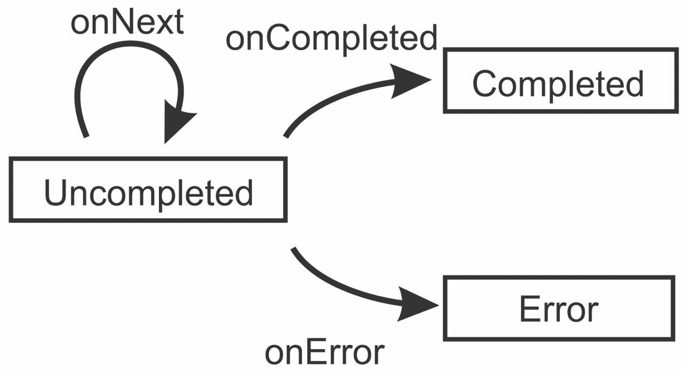
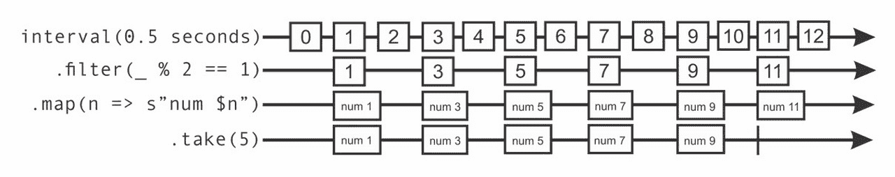
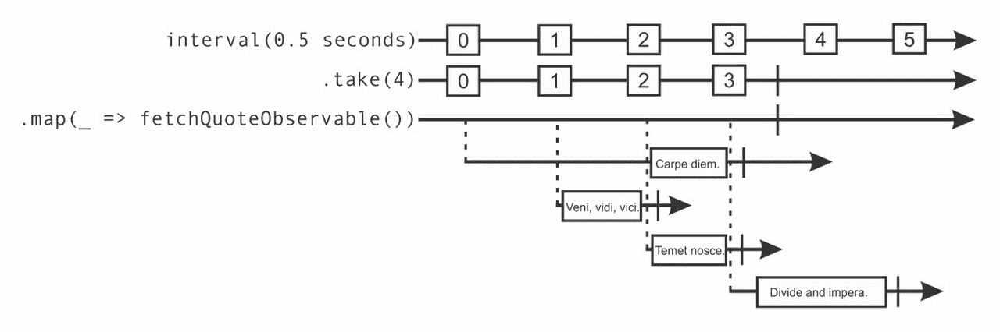
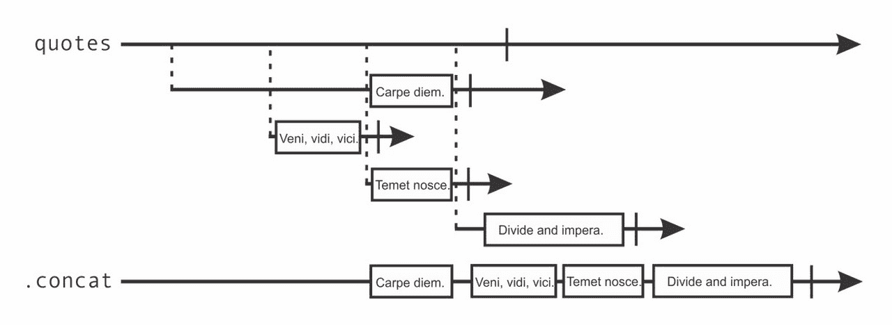
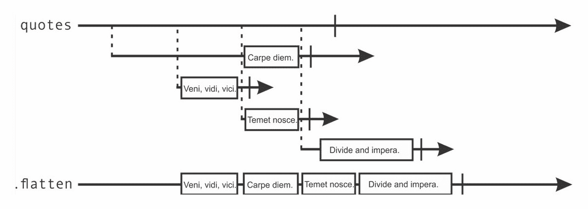
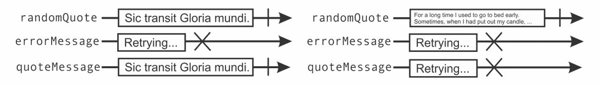
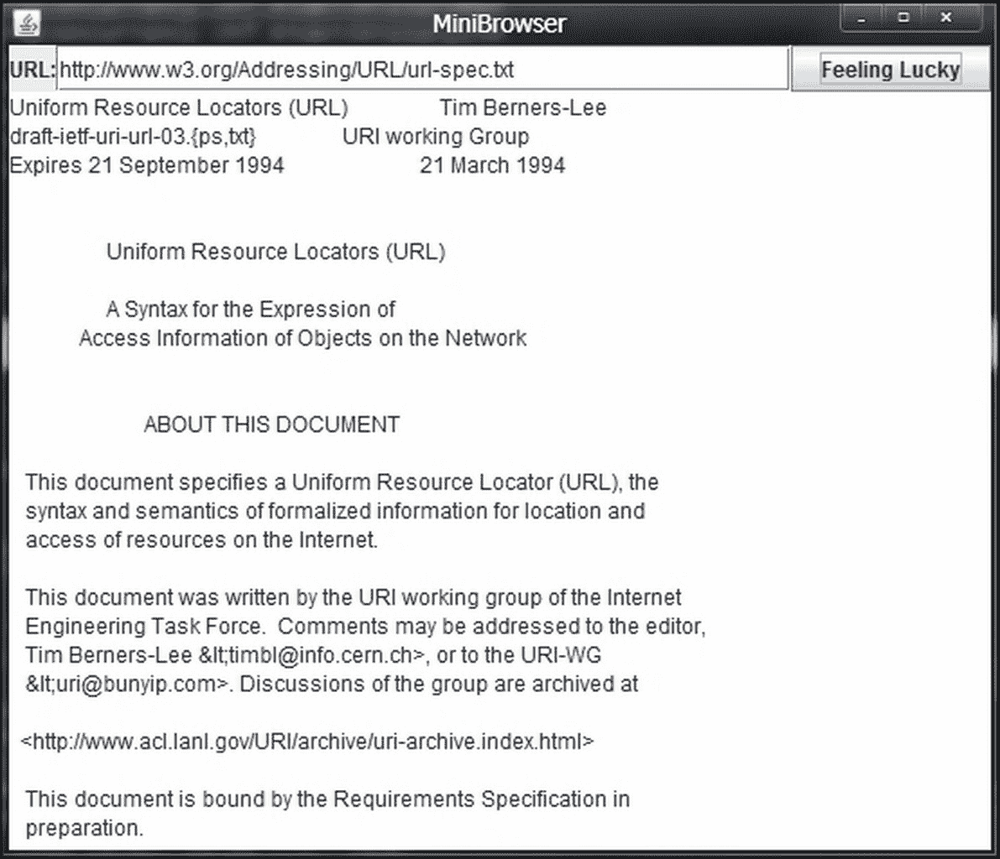
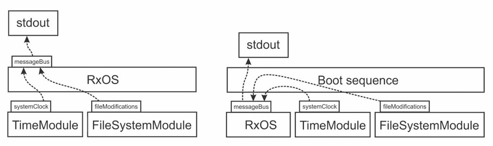

# 第六章. 使用反应式扩展的并发编程

|   | *"你的鼠标就是一个数据库。" |   |
| --- | --- | --- |
|   | --*埃里克·梅耶尔* |

来自第四章异步编程与未来和承诺的“异步编程与未来和承诺”，将并发编程提升到了一个新的水平。首先，它们在将计算结果从生产者传输到消费者时避免了阻塞。其次，它们允许你以惯用的方式将简单的未来对象组合成更复杂的对象，从而产生更简洁的程序。未来以清晰且易于理解的方式封装了异步通信的模式。

未来的一个缺点是它们只能处理单个结果。对于 HTTP 请求或计算单个值的异步操作，未来可能足够用，但有时我们需要对来自同一计算的不同事件做出反应。例如，使用未来跟踪文件下载的进度状态是相当繁琐的。事件流是处理此类用例的更好工具；与未来不同，它们可以产生任意数量的值，我们称之为事件。在本章中，我们将学习的一等事件流可以在表达式中像常规值一样使用。就像未来一样，一等事件流可以使用函数组合子进行组合和转换。

在计算机科学中，**事件驱动编程**是一种编程风格，其中程序的流程由事件（如外部输入、用户操作或其他计算的消息）决定。在这里，用户操作可能是一个鼠标点击，外部输入可以是网络接口。未来和事件流都可以归类为事件驱动编程抽象。

**响应式编程**，它处理程序中的变化传播和数据流，是一个与之密切相关的学科。传统上，响应式编程被定义为一种编程风格，允许你表达程序中数据值之间的各种约束。例如，当我们在一个命令式编程模型中说`a = b + 1`时，这意味着`a`被分配了`b`当前值加`1`的结果。如果`b`的值后来发生变化，`a`的值不会改变。相比之下，在响应式编程中，每当`b`的值发生变化时，`a`的值都会使用约束`a = b + 1`进行更新。随着对并发性的需求增加，对事件驱动和响应式编程的需求也更大。传统的基于回调和命令式的 API 已被证明不足以完成这项任务：它们模糊了程序流程，将并发问题与程序逻辑混合在一起，并依赖于可变状态。在大型应用程序中，大量的无结构回调声明会导致一种称为回调地狱的现象，程序员无法理解程序的流程控制。从某种意义上说，回调是响应式编程中的`GOTO`语句。**事件流组合**捕获回调声明的模式，允许程序员更容易地表达它们。这是一种构建基于事件的系统的更结构化的方法。

**响应式扩展**（**Rx**）是一个用于使用事件流来组合异步和事件驱动程序的编程框架。在 Rx 中，产生类型为`T`事件的流以`Observable[T]`类型表示。正如我们将在本章中学习的那样，Rx 框架结合了响应式和事件驱动编程中的原则。Rx 的基本概念是事件和数据可以以类似的方式进行操作。

在本章中，我们将研究`RxObservable`对象的语义，并学习如何使用它们来构建事件驱动和响应式应用程序。具体来说，我们将涵盖以下主题：

+   创建和订阅`Observable`对象

+   可观察合同以及如何实现自定义`Observable`对象

+   使用订阅来取消事件源

+   使用 Rx 组合子组合可观察对象

+   使用 Rx 调度器实例控制并发

+   使用 Rx 主题来设计更大的应用程序

我们将从简单的示例开始，向您展示如何创建和操作`Observable`对象，并说明它们如何传播事件。

# 创建可观察对象

在本节中，我们将研究创建`Observable`对象的多种方法。我们将学习如何订阅由`Observable`实例产生的不同类型的事件，以及如何正确创建自定义`Observable`对象。最后，我们将讨论冷可观察对象和热可观察对象之间的区别。

`Observable` 对象是一个具有名为 `subscribe` 的方法的对象，该方法接受一个名为观察者的对象作为参数。观察者是一个用户指定的对象，具有自定义的事件处理逻辑。当我们使用特定的观察者调用 `subscribe` 方法时，我们可以说观察者已经订阅了相应的 `Observable` 对象。每当 `Observable` 对象产生事件时，其已订阅的观察者都会收到通知。

Scala 的 Rx 实现**不是**Scala 标准库的一部分。要在 Scala 中使用 Rx，我们需要将以下依赖项添加到我们的 `build.sbt` 文件中：

```java
libraryDependencies += 
  "com.netflix.rxjava" % "rxjava-scala" % "0.19.1" 

```

现在，我们可以导入 `rx.lang.scala` 包的内容以开始使用 Rx。假设我们想要创建一个简单的 `Observable` 对象，该对象首先发出几个 `String` 事件，然后完成执行。我们使用 `Observable` 伴生对象的 `items` 工厂方法创建一个 `Observable` 对象 `o`。然后我们调用 `subscribe` 方法，这与在 第四章 中引入的 futures 的 `foreach` 方法类似，即 *使用 futures 和 promises 进行异步编程*。`subscribe` 方法接受一个回调函数，并指示 `Observable` 对象 `o` 为每个发出的事件调用回调函数。它通过在幕后创建一个 `Observer` 对象来实现。不同之处在于，与 futures 不同，`Observable` 对象可以发出多个事件。在我们的示例中，回调函数通过调用 `log` 语句将事件打印到屏幕上，如下所示：

```java
import rx.lang.scala._ 
object ObservablesItems extends App { 
  val o = Observable.items("Pascal", "Java", "Scala") 
  o.subscribe(name => log(s"learned the $name language")) 
  o.subscribe(name => log(s"forgot the $name language")) 
} 

```

运行此示例后，我们注意到两件事。首先，所有的 `log` 语句都是在主程序线程上执行的。其次，与第一个 `subscribe` 调关联的回调在为这三种编程语言调用与第二个 `subscribe` 调关联的回调之前，为这三种语言调用：

```java
run-main-0: learned the Pascal language 
run-main-0: learned the Java language 
run-main-0: learned the Scala language 
run-main-0: forgot the Pascal language 
run-main-0: forgot the Java language 
run-main-0: forgot the Scala language 

```

我们可以得出结论，`subscribe` 调用是同步执行的——它在返回之前调用事件流 `o` 发出的所有事件的回调。然而，这并不总是如此。`subscribe` 调用也可以立即将控制权返回给主线程，并异步调用回调函数。这种行为取决于 `Observable` 对象的实现。在这个 Rx 实现中，使用 `items` 方法创建的 `Observable` 对象在其创建时就有可用的事件，因此它们的 `subscribe` 方法是同步的。

在上一个示例中，`Observable` 对象几乎感觉就像是一个不可变的 Scala 集合，而 `subscribe` 方法就像是在集合上执行的 `foreach` 方法。然而，`Observable` 对象更为通用。我们将看到下一个异步发出事件的 `Observable` 对象。

假设我们想要一个在经过一定时间后发出事件的`Observable`对象。我们使用`timer`工厂方法创建这样的`Observable`对象，并将超时设置为 1 秒。然后我们使用两个不同的回调函数调用`subscribe`方法，如下面的代码片段所示：

```java
import scala.concurrent.duration._ 
object ObservablesTimer extends App { 
  val o = Observable.timer(1.second) 
  o.subscribe(_ => log("Timeout!")) 
  o.subscribe(_ => log("Another timeout!")) 
  Thread.sleep(2000) 
} 

```

这次，`subscribe`方法的调用是异步的；没有必要阻塞整个一秒的主线程，等待超时事件出现。运行示例显示，在回调函数被调用之前，主线程继续运行：

```java
RxComputationThreadPool-2: Another timeout! 
RxComputationThreadPool-1: Timeout! 

```

此外，`log`语句显示，回调函数是在 Rx 内部使用的线程池上以未指定的顺序调用的。

### 小贴士

`Observable`对象可以同步或异步地发出事件，具体取决于特定`Observable`对象的实现。

正如我们将看到的，在大多数情况下，在调用`subscribe`方法时事件是不可用的。这是 UI 事件、文件修改事件或 HTTP 响应的情况。为了避免阻塞调用`subscribe`方法的线程，`Observable`对象异步地发出此类事件。

## 可观察对象和异常

在第四章中，我们了解到异步计算有时会抛出异常。当这种情况发生时，与异常相关的`Future`对象失败；不是以计算的结果完成，而是以失败异步计算的异常完成`Future`对象。`Future`对象的客户端可以通过使用`failed.foreach`或`onComplete`方法注册回调来对异常做出反应。

在`Observable`对象中产生事件的计算也可能抛出异常。为了响应`Observable`对象产生的异常，我们可以使用接受两个回调参数的重载`subscribe`方法来创建观察者--事件的回调函数和异常的回调函数。

以下程序创建了一个发出数字`1`和`2`的`Observable`对象，然后产生一个`RuntimeException`。`items`工厂方法使用数字创建`Observable`对象，而`error`工厂方法创建另一个带有异常的`Observable`对象。然后我们使用`Observable`实例上的`++`运算符将这两个对象连接起来。第一个回调将数字记录到标准输出并忽略异常。相反，第二个回调记录`Throwable`对象并忽略数字。这在上面的代码片段中显示：

```java
object ObservablesExceptions extends App { 
  val exc = new RuntimeException 
  val o = Observable.items(1, 2) ++ Observable.error(exc) 
  o.subscribe( 
    x => log(s"number $x"), 
    t => log(s"an error occurred: $t") 
  ) 
} 

```

程序首先打印数字`1`和`2`，然后打印异常对象。如果没有将第二个回调函数传递给`subscribe`方法，异常将由`Observable`对象`o`发出，但不会传递给观察者。重要的是，在发出异常之后，`Observable`对象不允许再发出任何其他事件。我们可以如下重新定义`Observable`对象`o`：

```java
import Observable._ 
val o = items(1, 2) ++ error(exc) ++ items(3, 4) 

```

我们可能期望程序打印事件`3`和`4`，但它们并没有由`Observable`对象`o`发出。当一个`Observable`对象抛出异常时，我们说它处于错误状态。

### 小贴士

当一个`Observable`对象抛出异常时，它会进入错误状态，无法再发出更多事件。

无论`Observable`对象是使用工厂方法创建的，还是后续章节中描述的自定义`Observable`实现，一旦`Observable`对象抛出异常，它就不允许再发出事件。在下一节中，我们将更详细地探讨这个合约。

## 可观察者合约

现在我们已经看到了如何创建简单的`Observable`对象并对其事件做出反应，现在是时候更深入地了解`Observable`对象的生命周期了。每个`Observable`对象都可以处于三种状态之一：未完成、错误或完成。只要`Observable[T]`对象未完成，它就可以发出类型为`T`的事件。正如我们已经学到的，`Observable`对象可以抛出异常来指示它未能产生更多数据。当这种情况发生时，`Observable`对象进入错误状态，无法再发出任何其他事件。同样，当`Observable`对象决定它将不再产生任何数据时，它可能会进入完成状态。一旦`Observable`对象完成，它不允许再发出任何其他事件。

在 Rx 中，订阅来自`Observable`对象事件的对象被称为`Observer`对象。`Observer[T]`特质包含三个方法：`onNext`、`onError`和`onCompleted`，分别用于在`Observable`对象发出事件、产生错误或完成时被调用。这个特质在以下代码片段中显示：

```java
trait Observer[T] { 
  def onNext(event: T): Unit 
  def onError(error: Throwable): Unit 
  def onCompleted(): Unit 
} 

```

在之前的示例中，每次我们调用`subscribe`方法时，Rx 都会创建一个`Observer`对象并将其分配给`Observable`实例。或者，我们可以直接将`Observer`对象提供给`subscribe`方法的重载版本。以下程序使用`from`工厂方法，该方法将电影标题列表转换为`Observable`对象。然后它创建一个`Observer`对象并将其传递给`subscribe`方法：

```java
object ObservablesLifetime extends App { 
  val classics = List("Good, bad, ugly", "Titanic", "Die Hard") 
  val movies = Observable.from(classics) 
  movies.subscribe(new Observer[String] { 
    override def onNext(m: String) = log(s"Movies Watchlist - $m") 
    override def onError(e: Throwable) = log(s"Ooops - $e!") 
    override def onCompleted() = log(s"No more movies.") 
  }) 
} 

```

此程序首先打印出我们的最爱电影，并在调用`onCompleted`并打印出`"No more movies"`后终止。`movies``Observable`对象是从一个有限的字符串集合中创建的；在这些事件发出后，`movies`事件流会调用`onCompleted`方法。一般来说，`Observable`对象只能在确定不会有更多事件后调用`onCompleted`方法。

每个`Observable`对象都可以对其`Observer`对象调用`onNext`方法零次或多次。然后，`Observable`对象可以通过对其`Observer`对象调用`onCompleted`或`onError`方法进入完成或错误状态。这被称为`Observable`合约，并在以下状态图中以图形方式展示，其中不同的节点表示`Observable`状态，而链接表示对不同的`Observer`方法的调用：



注意，如果一个`Observable`对象知道它将不会发出更多事件，它可以调用`onCompleted`或`onError`方法，但它也可以不调用。一些`Observable`对象，如`items`，知道何时发出最后一个事件。另一方面，发出鼠标或键盘事件的`Observable`实例永远不会调用`onCompleted`方法。

### 注意

一个`Observable`对象可以在订阅的`Observer`对象上无限次地调用`onNext`方法。在可选地调用`onCompleted`或`onError`方法后，`Observable`对象不允许再调用任何`Observer`方法。

由 Rx API 产生的`Observable`对象实现了`Observable`合约。在实践中，我们不需要担心`Observable`合约，除非我们正在实现自己的自定义`Observable`对象。这是下一节的主题。

## 实现自定义的`Observable`对象

要创建一个自定义的`Observable`对象，我们可以使用以下`Observable.create`工厂方法：

```java
def create(f: Observer[T] => Subscription): Observable[T] 

```

上述方法从一个`Observer`对象到一个`Subscription`对象接收一个函数`f`，并返回一个新的`Observable`对象。每当调用`subscribe`方法时，就会在相应的`Observer`对象上调用函数`f`。函数`f`返回一个`Subscription`对象，可以用来从`Observable`实例中取消订阅`Observer`对象。`Subscription`特质定义了一个名为`unsubscribe`的单个方法：

```java
trait Subscription { 
  def unsubscribe(): Unit 
} 

```

我们将在后续章节中更详细地讨论`Subscription`对象。现在，我们只使用空的`Subscription`对象，它不会取消订阅`Observer`对象。

为了说明如何使用`Observable.create`方法，我们实现了一个名为`vms`的`Observable`对象，该对象会发出流行虚拟机实现的名字。在`Observable.create`中，我们首先确保使用所有虚拟机名称调用`onNext`，然后调用一次`onCompleted`。最后，我们返回一个空的`Subscription`对象。这在上面的程序中有所展示：

```java
object ObservablesCreate extends App { 
  val vms = Observable.apply[String] { obs => 
    obs.onNext("JVM") 
    obs.onNext("DartVM") 
    obs.onNext("V8") 
    obs.onCompleted() 
    Subscription() 
  } 
  vms.subscribe(log _, e => log(s"oops - $e"), () => log("Done!")) 
} 

```

`Observable` 对象 `vms` 有一个同步的 `subscribe` 方法。在将控制权返回到调用 `subscribe` 方法的线程之前，所有事件都会发送到一个 `obs` 观察者。一般来说，我们可以使用 `Observable.create` 方法来创建一个异步发送事件的 `Observable` 实例。我们将在下一节学习如何将 `Future` 对象转换为 `Observable` 对象。

## 从 `Future` 创建 Observables

`Future` 对象代表异步计算的结果。可以将 `Observable` 对象视为 `Future` 对象的泛化。与只发送一个成功或失败事件不同，`Observable` 对象在失败或成功完成之前会发送一系列事件。

处理异步计算的 Scala API 通常返回 `Future` 对象，而不是 `Observable` 实例。在某些情况下，能够将 `Future` 对象转换为 `Observable` 对象很有用。在这里，当 `Future` 对象成功完成时，相应的 `Observable` 对象必须发出一个包含未来值的事件，然后调用 `onCompleted` 方法。如果 `Future` 对象失败，相应的 `Observable` 对象应该调用 `onError` 方法。在我们开始之前，我们需要导入 `scala.concurrent` 包的内容和全局的 `ExecutionContext` 对象，如下面的代码片段所示：

```java
import scala.concurrent._ 
import ExecutionContext.Implicits.global 

```

然后，我们使用 `Observable.create` 方法创建一个 `Observable` 对象 `o`。我们不会直接在 `Observer` 对象上调用 `onNext`、`onError` 和 `onCompleted` 方法，而是在 `Future` 对象 `f` 上安装回调，如下面的程序所示：

```java
object ObservablesCreateFuture extends App { 
  val f = Future { "Back to the Future(s)" } 
  val o = Observable.create[String] { obs => 
    f foreach { case s => obs.onNext(s); obs.onCompleted() } 
    f.failed foreach { case t => obs.onError(t) } 
    Subscription() 
  } 
  o.subscribe(log _) 
} 

```

这次，`subscribe` 方法是异步的。在将回调安装到 `Future` 对象上后立即返回。实际上，这种模式非常常见，Rx 提供了 `Observable.from` 工厂方法，可以直接将 `Future` 对象转换为 `Observable` 对象，如下面的代码片段所示：

```java
val o = Observable.from(Future { "Back to the Future(s)" }) 

```

尽管如此，学习如何将 `Future` 对象转换为 `Observable` 对象仍然很有用。`Observable.create` 方法是将基于回调的 API 转换为 `Observable` 对象的首选方法，正如我们将在后续章节中看到的。

### 提示

使用 `Observable.create` 工厂方法从基于回调的 API 创建 `Observable` 对象。

在之前的示例中，我们总是返回一个空的 `Subscription` 对象。在这样一个 `Subscription` 对象上调用 `unsubscribe` 方法没有任何效果。有时，`Subscription` 对象需要释放与相应的 `Observable` 实例关联的资源。我们将在下一节学习如何实现和使用这样的 `Subscription` 对象。

## 订阅

回想一下在第四章中监控文件系统变化的例子，*使用 Futures 和 Promises 进行异步编程*，在那里我们使用了 Apache Commons IO 库中的文件监控包来完成一个`Future`对象，当创建新文件时。`Future`对象只能完成一次，因此使用创建的第一个文件的名称来完成这个未来。对于这种用例，使用`Observable`对象更为自然，因为文件系统中的文件可以创建和删除多次。在一个文件浏览器或 FTP 服务器等应用中，我们希望接收所有此类事件。

在程序稍后部分，我们可能想要从`Observable`对象的事件中取消订阅。现在我们将看到如何使用`Subscription`对象来实现这一点。我们首先导入**Apache Commons IO 文件监控**包的内容，如下所示：

```java
import org.apache.commons.io.monitor._ 

```

我们定义了一个`modified`方法，该方法返回一个包含指定目录中修改文件名的`Observable`对象。`Observable.create`方法在 Commons IO 回调 API 和 Rx 之间架起了一座桥梁。当调用`subscribe`方法时，我们创建一个`FileAlterationMonitor`对象，该对象使用单独的线程以每 1000 毫秒的频率扫描文件系统并发出文件系统事件；一个`FileAlterationObserver`对象，指定要监视的目录；以及一个`FileAlterationListener`对象，通过在 Rx 的`Observer`对象上调用`onNext`方法来响应文件事件。然后我们在`fileMonitor`对象上调用`start`方法。

最后，我们返回一个自定义的`Subscription`对象，该对象在`fileMonitor`对象上调用`stop`方法。`modified`方法在下面的代码片段中展示：

```java
def modified(directory: String): Observable[String] = { 
  Observable.create { observer => 
    val fileMonitor = new FileAlterationMonitor(1000) 
    val fileObs = new FileAlterationObserver(directory) 
    val fileLis = new FileAlterationListenerAdaptor { 
      override def onFileChange(file: java.io.File) { 
        observer.onNext(file.getName) 
      } 
    } 
    fileObs.addListener(fileLis) 
    fileMonitor.addObserver(fileObs) 
    fileMonitor.start() 
    Subscription { fileMonitor.stop() } 
  } 
} 

```

在前面的代码片段中，我们使用了`Subscription`伴生对象的`apply`工厂方法。当在生成的`Subscription`对象上调用`unsubscribe`方法时，将运行指定的代码块。重要的是，第二次调用`unsubscribe`方法时，不会再次运行指定的代码块。我们说`unsubscribe`方法是无操作的；多次调用它的效果与只调用一次相同。在我们的例子中，`unsubscribe`方法最多调用一次`fileMonitor`对象的`stop`方法。当子类化`Subscription`特质时，我们需要确保`unsubscribe`方法是无操作的，而`Subscription.apply`方法是一个方便的方法，可以自动确保无操作。

### 小贴士

在`Subscription`特质中实现`unsubscribe`方法需要是无操作的。使用`Subscription.apply`方法创建默认无操作的`Subscription`对象。

我们使用`modified`方法来跟踪项目中文件的变化。在调用由`modified`方法返回的`Observable`对象的`subscribe`方法后，主线程暂停 10 秒。如果我们在这段时间内编辑器中保存文件，程序将把文件修改事件记录到标准输出。这在上面的程序中有所体现：

```java
object ObservablesSubscriptions extends App { 
  log(s"starting to monitor files") 
  val sub = modified(".").subscribe(n => log(s"$n modified!")) 
  log(s"please modify and save a file") 
  Thread.sleep(10000) 
  sub.unsubscribe() 
  log(s"monitoring done") 
} 

```

注意，在这个例子中，只有当程序调用`subscribe`方法时，才会创建`FileAlterationMonitor`对象。`modified`方法返回的`Observable`实例在没有订阅的`Observer`对象时不会发出事件。在 Rx 中，只有在存在订阅时才发出事件的`Observable`对象被称为**冷可观察对象**。另一方面，一些`Observable`对象即使在没有相关订阅的情况下也会发出事件。这通常适用于处理用户输入的`Observable`实例，例如键盘或鼠标事件。不依赖于其订阅就发出事件的`Observable`对象被称为**热可观察对象**。我们现在重新实现一个将文件修改跟踪作为热可观察对象的`Observable`对象。我们首先实例化和启动`FileAlterationMonitor`对象，如下所示：

```java
val fileMonitor = new FileAlterationMonitor(1000) 
fileMonitor.start() 

```

`Observable`对象使用`fileMonitor`对象来指定目录以进行监控。缺点是，我们的`Observable`对象现在即使在没有订阅的情况下也会消耗计算资源。使用热可观察对象的优势在于，多个订阅不需要实例化多个相对较重的`FileAlterationMonitor`对象。我们在`hotModified`方法中实现了热`Observable`对象，如下面的代码所示：

```java
def hotModified(directory: String): Observable[String] = { 
  val fileObs = new FileAlterationObserver(directory) 
  fileMonitor.addObserver(fileObs) 
  Observable.create { observer => 
    val fileLis = new FileAlterationListenerAdaptor { 
      override def onFileChange(file: java.io.File) { 
        observer.onNext(file.getName) 
      } 
    } 
    fileObs.addListener(fileLis) 
    Subscription { fileObs.removeListener(fileLis) } 
  } 
} 

```

`hotModified`方法通过将指定的目录注册到`fileMonitor`对象，并仅在此时调用`Observable.create`方法来创建一个包含给定目录文件变化的`Observable`对象。当在结果`Observable`对象上调用`subscribe`方法时，我们实例化并添加一个新的`FileAlterationListener`对象。在`Subscription`对象中，我们移除`FileAlterationListener`对象以避免接收额外的文件修改事件，但我们不会在程序终止之前在`fileMonitor`对象上调用`stop`方法。

# 编写可观察对象

在看到创建各种类型的`Observable`对象的不同方法、订阅它们的事件以及使用`Subscription`对象之后，我们将注意力转向将`Observable`对象组合成更大的程序。到目前为止，使用`Observable`对象而不是基于回调的 API 的优势几乎不值得麻烦。

当我们开始使用各种组合器来组合 `Observable` 对象时，Rx 的真正威力才显现出来。我们可以将 `Observable` 对象视为与 Scala 序列集合类似的方式。在 Scala 序列中，由 `Seq[T]` 特质表示，类型 `T` 的元素根据它们的索引在内存中按顺序排列。在 `Observable[T]` 特质中，类型 `T` 的事件按时间顺序排列。

让我们使用 `Observable.interval` 工厂方法来创建一个 `Observable` 对象，该对象异步每 0.5 秒发出一个数字，然后输出前五个奇数。为此，我们首先在 `Observable` 对象上调用 `filter` 以获得一个中间 `Observable` 对象，该对象只发出奇数。请注意，在 `Observable` 对象上调用 `filter` 与在 Scala 集合上调用 `filter` 方法类似。同样，我们通过调用 `map` 方法获得另一个 `Observable` 对象，以将每个奇数转换为字符串。然后我们调用 `take` 来创建一个只包含前五个事件的 `Observable` 对象 `odds`。最后，我们订阅 `odds` 以打印它发出的事件。这如下面的程序所示：

```java
object CompositionMapAndFilter extends App { 
  val odds = Observable.interval(0.5.seconds) 
    .filter(_ % 2 == 1).map(n => s"num $n").take(5) 
  odds.subscribe( 
    log _, e => log(s"unexpected $e"), () => log("no more odds")) 
  Thread.sleep(4000) 
} 

```

为了简洁地解释不同 Rx 组合器的语义，我们通常依赖于宝石图。这些图以图形方式表示 `Observable` 对象中的事件以及不同 `Observable` 对象之间的转换。宝石图用包含其事件的时序表示每个 `Observable` 对象。前三个中间 `Observable` 对象永远不会对其观察者调用 `onCompleted` 方法。

`Observable` 对象 `odds` 包含最多五个事件，因此在发出它们之后调用 `onCompleted`。我们在宝石图中用竖线表示对 `onCompleted` 方法的调用，如下所示：



注意，前面的图是不同 `Observable` 对象之间关系的概述，但在执行过程中可以省略其中的一些事件。特定的 Rx 实现可以检测到事件 `11` 和 `12` 无法通过 `subscribe` 调用观察到，因此这些事件不会发出以节省计算资源。

作为 Scala 顺序编程的专家，你可能已经注意到我们可以使用 for-comprehensions 更简洁地重写前面的程序。例如，我们可以使用以下 for-comprehension 输出前五个偶数自然数：

```java
val evens = for (n <- Observable.from(0 until 9); if n % 2 == 0) 
yield s"even number $n" 
evens.subscribe(log _) 

```

在继续学习更复杂的 for-comprehensions 之前，我们将研究一种特殊的 `Observable` 对象，其事件是其他 `Observable` 对象。

## 嵌套的可观察对象

嵌套的`Observable`，也称为高阶事件流，是一个发出事件，这些事件本身也是`Observable`对象的`Observable`对象。像`foreach`语句这样的高阶函数被称为高阶函数，因为它在其`(T => Unit) => Unit`类型中有一个嵌套函数。同样，高阶事件流因其类型`Observable[T]`是其类型`Observable[Observable[T]]`的一部分而获得了这个花哨的名字。在本节中，我们将研究何时使用`nestedObservable`对象以及如何操作它们。

假设我们正在编写一本书，并想在每一章的开头添加一个著名的引文。为章节选择合适的引文是一项艰巨的工作，我们希望自动化它。我们编写了一个简短的程序，使用`Observable`对象每 0.5 秒从*I Heart Quotes*网站获取随机引文，并将它们打印到屏幕上。一旦我们看到一个不错的引文，我们必须迅速将其复制到我们的书章节中。

我们将首先定义一个`fetchQuote`方法，该方法返回一个包含引文文本的`Future`对象。幸运的是，*I Heart Quotes*网站的 HTTP API 返回纯文本，因此我们不需要解析任何 JSON 或 XML。我们使用`scala.io.Source`对象来获取正确 URL 的内容，如下所示：

```java
import scala.io.Source 
def fetchQuote(): Future[String] = Future { 
  blocking { 
    val url = "http://quotes.stormconsultancy.co.uk/random.json" + 
      "show_permalink=false&show_source=false" 
    Source.fromURL(url).getLines.mkString 
  } 
} 

```

回想一下，我们可以使用`from`工厂方法将`Future`对象转换为`Observable`对象：

```java
def fetchQuoteObservable(): Observable[String] = { 
  Observable.from(fetchQuote()) 
} 

```

现在，我们使用`Observable.interval`工厂方法来创建一个每 0.5 秒发出一个数字的`Observable`对象。为了我们的示例，我们只取前四个数字。然后，我们将这些数字映射到发出带有引文序号的引文的`Observable`对象。为此，我们调用`fetchQuoteObservable`方法，并使用嵌套的`map`调用映射引文，如下面的代码片段所示：

```java
def quotes: Observable[Observable[String]] = 
  Observable.interval(0.5 seconds).take(4).map { 
    n => fetchQuoteObservable().map(txt => s"$n) $txt") 
  } 

```

注意，内部的`map`调用将包含引文文本的`Observable[String]`实例转换为另一个包含带有编号的引文的`Observable[String]`实例。外部的`map`调用将包含前四个数字的`Observable[Long]`对象转换为包含单独引文`Observable`对象的`Observable[Observable[String]]`实例。由`quotes`方法创建的`Observable`对象在以下 marble 图中显示。嵌套的`Observable`对象中最后呈现的事件本身也是包含单个事件的`Observable`对象：在`Future`对象中返回的引文文本。注意，我们省略了嵌套的`map`调用以使图表更易于阅读：



画一个宝石图可以使这个 `Observable` 对象的内容更容易理解，但我们如何订阅 `Observable[Observable[String]]` 对象中的事件呢？在 `quotes` 上调用 `subscribe` 方法要求观察者处理 `Observable[String]` 对象，而不是直接处理 `String` 事件。

再次强调，与 Scala 序列集合的类比有助于理解如何解决这个问题。每当我们有嵌套序列，比如 `Seq[Seq[T]]`，我们都可以通过调用 `flatten` 方法将其展平到 `Seq[T]` 集合。当我们这样做时，嵌套序列的元素只是简单地连接在一起。Rx API 提供了类似的方法来展平 `Observable` 对象，但它们必须处理与事件时间相关的额外复杂性。根据事件到达的时间，有不同方式来展平 `Observable` 对象。

第一种方法被称为 `concat`，它通过将一个嵌套 `Observable` 对象中的所有事件按顺序排列在后续 `Observable` 对象的事件之前来连接 `nestedObservable` 对象。一个较早出现的 `Observable` 对象必须在后续 `Observable` 对象的事件被发射之前完成。`concat` 操作的宝石图如下所示。虽然引言 **Veni, vidi, vici.** 在引言 **Carpe diem** 之前出现，但引言 **Veni, vidi, vici.** 仅在关联引言 **Carpe diem.** 的 `Observable` 对象完成后才被发射。结果 `Observable` 对象仅在 `quotes` 和所有嵌套 `Observable` 对象完成后才完成：



第二种方法被称为 `flatten`，类似于 Scala 集合 API 中的类似方法。该方法按事件到达的时间顺序发射嵌套 `Observable` 对象的事件，而不管相应的嵌套 `Observable` 对象何时开始。较早出现的 `Observable` 对象不需要在后续 `Observable` 对象的事件被发射之前完成。

这在下面的宝石图中得到了说明。一旦引言出现在任何嵌套 `Observable` 对象上，就会将其发射到结果 `Observable` 对象中。一旦 `quotes` 和所有嵌套 `Observable` 对象完成，结果 `Observable` 对象也会完成。



为了测试 `concat` 和 `flatten` 方法之间的差异，我们使用这两种方法中的每一种订阅 `quotes` 中的事件。如果我们的网络不可靠或具有特别非确定性的延迟，第二个 `subscribe` 调打印 `quotes` 对象的顺序可能会混乱。我们可以将查询间隔从 0.5 秒减少到 0.01 秒来观察这种效果。使用 `flatten` 方法时，每个引言前的序号变得无序。这在下述程序中得到了说明：

```java
object CompositionConcatAndFlatten extends App { 
  log(s"Using concat") 
  quotes.concat.subscribe(log _) 
  Thread.sleep(6000) 
  log(s"Now using flatten") 
  quotes.flatten.subscribe(log _) 
  Thread.sleep(6000) 
} 

```

我们如何在 `concat` 和 `flatten` 方法之间做出选择？`concat` 方法的优势在于它保持了来自不同 `Observable` 对象的事件之间的相对顺序。如果我们按字典顺序获取和打印引文，那么 `concat` 方法将是展平嵌套 `Observable` 对象的正确方式。

### 提示

当需要保持不同嵌套 `Observable` 对象之间事件顺序时，请使用 `concat` 方法来展平嵌套的 `Observable` 对象。

`concat` 方法在当前 `Observable` 对象完成之前不会订阅后续的 `Observable` 对象。如果嵌套的 `Observable` 对象中有一个需要很长时间才能完成或根本不会完成，剩余的 `Observable` 对象的事件将被推迟或永远不会发出。`flatten` 方法在嵌套 `Observable` 对象发出时立即订阅它，并在事件到达时立即发出事件。

### 提示

如果至少有一个嵌套的 `Observable` 对象有无限数量的事件或永远不会完成，请使用 `flatten` 方法而不是 `concat` 方法。

我们还可以在 `for` 理解中遍历多个 `Observable` 对象的事件。`Observable` 对象自带 `flatMap` 方法，这允许你在 `for` 理解中使用它们。在 `Observable` 对象上调用 `flatMap` 方法相当于将其每个事件映射到一个嵌套的 `Observable` 对象中，然后调用 `flatten` 方法。因此，我们可以将 `quotes.flatten` 方法重写如下：

```java
Observable.interval(0.5 seconds).take(5).flatMap({ 
  n => fetchQuoteObservable().map(txt => s"$n) $txt") 
}).subscribe(log _) 

```

已经熟练掌握了 Scala 集合上的 `for` 理解和 futures 上的 `for` 理解，这种 `flatMap` 和 `map` 调用模式立刻让人想起，我们认出前面的表达式是以下 `for` 理解的形式：

```java
val qs = for { 
  n   <- Observable.interval(0.5 seconds).take(5) 
  txt <- fetchQuoteObservable() 
} yield s"$n) $txt" 
qs.subscribe(log _) 

```

这要简洁得多，也更容易理解，几乎感觉像是回到了集合的世界。然而，我们仍需小心，因为 `Observable` 对象上的 `for` 理解并不像集合上的 `for` 理解那样保持事件的相对顺序。在前面的例子中，一旦我们可以将一个 `n` 数字与某个引文 `txt` 配对，就会发出 `s"$n) $txt"` 事件，而不考虑与前面的 `n` 数字相关的事件。

### 注意

在 `for` 理解中调用 `flatMap` 方法或使用 `Observable` 对象会按照事件到达的顺序发出事件，并且不会保持来自不同 `Observable` 对象的事件之间的顺序。调用 `flatMap` 方法在语义上等同于调用 `map` 后跟 `flatten` 调用。

一个细心的读者会注意到我们没有考虑其中一个嵌套的 `Observable` 对象通过调用 `onError` 方法终止的情况。当这种情况发生时，`concat` 和 `flatten` 都会使用相同的异常调用 `onError` 方法。同样，如果输入 `Observable` 对象产生异常，`map` 和 `filter` 会使结果 `Observable` 对象失败，因此不清楚如何组合失败的 `Observable` 对象。这是下一节的重点。

## `Observable` 的错误处理

如果你亲自运行了前面的示例，你可能已经注意到其中一些引用很长，读起来很枯燥。我们不希望在章节的开头放置一个很长的引用。如果我们那样做，我们的读者可能会失去兴趣。最好的引用是简短且直接了当的。

我们下一个目标将是将超过 100 个字符的引用替换为字符串 `Retrying...` 并打印第一个小于 100 个字符的引用。这次，我们定义了一个名为 `randomQuote` 的 `Observable` 对象，每次我们订阅它时都会发出一个随机引用。我们使用 `Observable.create` 方法来获取一个随机引用，就像之前一样，并将引用发送给观察者。然后我们返回一个空的 `Subscription` 对象。这在上面的代码片段中显示：

```java
def randomQuote = Observable.create[String] { obs => 
  val url = "http://www.iheartquotes.com/api/v1/random?" + 
    "show_permalink=false&show_source=false" 
  obs.onNext(Source.fromURL(url).getLines.mkString) 
  obs.onCompleted() 
  Subscription() 
} 

```

在 `randomQuote` 方法返回的 `Observable` 对象和之前定义的 `fetchQuoteObservable` 方法返回的 `Observable` 对象之间存在一个细微的差别。`fetchQuoteObservable` 方法创建一个 `Future` 对象来获取一个引用，并将引用在该 `Future` 对象中发送给每个观察者。相比之下，`randomQuote` 方法每次调用 `subscribe` 方法时都会获取一个新的引用。在之前引入的术语中，`randomQuote` 方法创建冷 `Observable` 对象，只有在订阅时才会发出事件，而 `fetchQuoteObservable` 方法创建热 `Observable` 对象，将相同的引用发送给所有观察者。

要重新订阅一个失败的 `Observable` 对象，我们可以使用 `retry` 组合器。`retry` 组合器接收一个输入 `Observable`，并返回另一个 `Observable` 对象，该对象会从输入 `Observable` 对象中发出事件，直到它完成或失败。如果输入 `Observable` 对象失败，`retry` 组合器会再次订阅该输入 `Observable` 对象。

我们现在使用`retry`组合器与`randomQuote`方法一起使用，以获取一个小于 100 个字符的引语。我们首先将`randomQuote`方法中的长引语转换为失败的`Observable`对象，这样`retry`就可以再次订阅以获取另一个引语。为此，我们定义了一个新的`Observable`对象，称为`errorMessage`，它发出一个字符串`"Retrying..."`然后失败。然后我们使用`for`推导式遍历`randomQuote`中的`text`引语。如果`text`引语短于 100 个字符，我们遍历一个发出文本的`Observable`对象。否则，我们遍历`errorMessage`对象以输出`"Retrying..."`而不是`text`。这个`for`推导式定义了一个`Observable`对象`quoteMessage`，它要么发出一个短引语，要么发出`"Retrying..."`然后失败。称为`quoteMessage`的最终`Observable`对象的宝石图显示了这两种情况，其中`Observable`对象中的异常用交叉符号表示：



最后，我们在`quoteMessage`对象上调用`retry`方法并订阅它。我们指定我们想要重试最多五次，因为省略参数将无限重试。我们在以下程序中实现了`Observable`对象`quoteMessage`：

```java
object CompositionRetry extends App { 
  import Observable._ 
  def errorMessage = items("Retrying...") ++ error(new Exception) 
  def quoteMessage = for { 
    text    <- randomQuote 
    message <- if (text.size < 100) items(text) else errorMessage 
  } yield message 
  quoteMessage.retry(5).subscribe(log _) 
  Thread.sleep(2500) 
} 

```

运行这个程序几次。你会注意到，短引语要么立即打印出来，要么在几次重试之后，这取决于引语的随机分布。你可能想知道平均有多少引语比 100 个字符长。实际上，在 Rx 中做这个统计很容易。我们引入了两个新的组合器。第一个叫做`repeat`，它与`retry`非常相似。当`Observable`对象失败时，它不是重新订阅`Observable`对象，而是在`Observable`对象完成时重新订阅。第二个组合器叫做`scan`，它与集合上的`scanLeft`操作符类似。给定一个输入`Observable`对象和一个累加的起始值，它通过将指定的二元操作符应用于累加和事件来发出累加的值，随着事件的到达更新累加。`repeat`和`scan`组合器的用法在以下程序中得到了说明：

```java
object CompositionScan extends App { 
  CompositionRetry.quoteMessage.retry.repeat.take(100).scan(0) { 
    (n, q) => if (q == "Retrying...") n + 1 else n 
  } subscribe(n => log(s"$n / 100")) 
} 

```

在前面的例子中，我们使用之前定义的`Observable`对象`quoteMessage`来获取一个简短的引语或消息`"Retrying..."`后跟一个异常。我们重试因过长而失败的引语，并在引语足够短时重复。我们总共取了 100 个引语，并使用`scan`操作符来计数短引语。当我们运行这个程序时，结果显示 100 个引语中有 57 个过长，不适合我们的书籍。

### 注意

`retry`方法用于重复失败的`Observable`对象的事件。同样，`repeat`方法用于重复完成的`Observable`对象的事件。

在迄今为止显示的示例中，我们使用相同的`Observable`对象进行重新订阅，并在该`Observable`对象失败时发出额外的事件。在某些情况下，我们希望在遇到异常或回退到不同的`Observable`对象时发出特定的事件。回想一下，这是我们之前与`Future`对象所做的那样。用事件替换异常或从另一个`Observable`对象获取多个事件的 Rx 方法分别称为`onErrorReturn`和`onErrorResumeNext`。在下面的程序中，我们首先将`status`中的异常替换为字符串`"exception occurred."`。然后，我们将异常替换为另一个`Observable`对象中的字符串：

```java
object CompositionErrors extends App { 
  val status = items("ok", "still ok") ++ error(new Exception) 
  val fixedStatus = 
    status.onErrorReturn(e => "exception occurred.") 
  fixedStatus.subscribe(log _) 
  val continuedStatus = 
    status.onErrorResumeNext(e => items("better", "much better")) 
  continuedStatus.subscribe(log _) 
} 

```

在了解了多种组合`Observable`对象的方法之后，我们转向 Rx 的并发特性。到目前为止，我们没有密切关注`Observable`对象发出事件的线程。在下一节中，我们将研究如何在不同的线程上的`Observable`对象之间传递事件，并了解何时这会有用。

# Rx 调度器

在本章的开头，我们观察到不同的`Observable`对象在不同的线程上发出事件。一个同步的`Observable`对象在调用`subscribe`方法时在调用者线程上发出。`Observable.timer`对象在 Rx 内部使用的线程上异步发出事件。同样，从`Future`对象创建的`Observable`对象中的事件是在`ExecutionContext`线程上发出的。如果我们想使用现有的`Observable`对象创建另一个绑定到特定线程的`Observable`对象，该怎么办呢？

为了封装一个`Observable`对象应该在哪里发出事件的线程选择，Rx 定义了一个特殊类，称为`Scheduler`。`Scheduler`类类似于我们在第三章中看到的`Executor`和`ExecutionContext`接口，*并发的传统构建块*。`Observable`对象附带一个组合器`observeOn`。这个组合器返回一个新的`Observable`对象，该对象使用指定的`Scheduler`类发出事件。在下面的程序中，我们实例化了一个名为`ComputationScheduler`的`Scheduler`对象，该对象使用内部线程池发出事件。然后，我们使用和未调用`observeOn`组合器的方式发出事件：

```java
object SchedulersComputation extends App { 
  val scheduler = schedulers.ComputationScheduler() 
  val numbers = Observable.from(0 until 20) 
  numbers.subscribe(n => log(s"num $n")) 
  numbers.observeOn(scheduler).subscribe(n => log(s"num $n")) 
  Thread.sleep(2000) 
} 

```

从输出中，我们可以看到第二次`subscribe`调用使用了一个线程池：

```java
run-main-42: num 0 
... 
run-main-42: num 19 
RxComputationThreadPool-1: num 0 
... 
RxComputationThreadPool-1: num 19 

```

`ComputationScheduler`对象维护一个用于计算任务的线程池。如果处理事件阻塞或等待 I/O 操作，我们必须使用`IOScheduler`对象，该对象在必要时自动创建新线程。异常情况下，如果处理每个事件是一个非常粗粒度的任务，我们可以使用`NewThreadScheduler`对象，该对象为每个事件创建一个新线程。

## 在 UI 应用程序中使用自定义调度器

内置的 Rx 调度器对于大多数任务很有用，但在某些情况下我们需要更多的控制。大多数 UI 工具包只允许你从特殊线程读取和修改 UI 元素。这个线程被称为**事件分发**线程。这种方法简化了 UI 工具包的设计和实现，并保护客户端免受微妙的并发错误的影响。由于 UI 通常不通常代表计算瓶颈，这种方法已被广泛采用；Swing 工具包使用`EventDispatchThread`对象来传播事件。

`Observable`对象在应用于 UI 应用程序时特别有用；用户界面全部关于事件。在随后的示例中，我们将使用 Scala Swing 库来说明 Rx 在 UI 代码中的有用性。我们首先将以下依赖项添加到我们的项目中：

```java
libraryDependencies +=  
  "org.scala-lang.modules" %% "scala-swing" % "1.0.1" 

```

我们将首先创建一个带有单个按钮的简单 Swing 应用程序。点击此按钮将在标准输出中打印一条消息。此应用程序说明了如何将 Swing 事件转换为`Observable`对象。我们将首先按照以下方式导入相关的 Scala Swing 包：

```java
import scala.swing._ 
import scala.swing.event._ 

```

要创建一个 Swing 应用程序，我们需要扩展`SimpleSwingApplication`类。这个类有一个抽象方法`top`，它需要返回一个`Frame`对象。Swing 的抽象`Frame`类代表应用程序窗口。我们返回一个新的`MainFrame`对象，它是`Frame`对象的一个子类。在`MainFrame`构造函数中，我们将窗口标题栏文本设置为`Swing Observables`，并实例化一个新的带有`Click`文本的`Button`对象。然后我们将`MainFrame`构造函数的内容设置为该按钮。

关于 UI 元素及其布局已经讲得够多了；我们现在想给这个简单应用程序添加一些逻辑。传统上，我们会通过安装到各种 UI 元素的回调来使 Swing 应用程序交互式。使用 Rx，我们相反将回调转换为事件流；我们定义一个名为`buttonClicks`的`Observable`对象，每次按钮元素被点击时都会发出一个事件。我们使用`Observable.create`方法来注册一个`ButtonClicked`回调，该回调在观察者上调用`onNext`方法。为了将点击记录到标准输出，我们订阅`buttonClicks`。完整的 Swing 应用程序如下代码片段所示：

```java
object SchedulersSwing extends SimpleSwingApplication { 
  def top = new MainFrame { 
    title = "Swing Observables" 
    val button = new Button { 
      text = "Click" 
    } 
    contents = button 
    val buttonClicks = Observable.create[Button] { obs => 
      button.reactions += { 
        case ButtonClicked(_) => obs.onNext(button) 
      } 
      Subscription() 
    } 
    buttonClicks.subscribe(_ => log("button clicked")) 
  } 
} 

```

运行此应用程序将打开以下截图所示的窗口。点击**Click**按钮将在标准输出中打印一个字符串。我们可以看到事件是在名为`AWT-EventQueue-0`的线程上发出的，这是 Swing 中的事件分发线程：


单线程 UI 工具包的一个缺点是，在事件分发线程上执行长时间运行的计算会阻塞 UI 并损害用户体验。如果我们每次用户点击按钮时都发出一个阻塞的 HTTP 请求，我们将在每次点击后都会观察到明显的延迟。幸运的是，这很容易通过异步执行长时间运行的计算来解决。

通常，我们不仅仅满足于启动异步计算。一旦异步计算产生结果，我们希望将其显示在应用程序中。回想一下，我们不允许直接从计算线程这样做；我们需要将控制权返回到事件分发线程。Swing 定义了 `invokeLater` 方法，该方法在 Swing 的事件分发线程上安排任务。另一方面，Rx 有一个内置的 `Schedulers.from` 方法，它将 `Executor` 对象转换为 `Scheduler` 对象。为了在 Swing 的 `invokeLater` 方法与 Rx 调度程序之间架起桥梁，我们实现了一个自定义的 `Executor` 对象，该对象封装了对 `invokeLater` 的调用，并将此 `Executor` 对象传递给 `Schedulers.from`。自定义的 `swingScheduler` 对象实现如下：

```java
import java.util.concurrent.Executor 
import rx.schedulers.Schedulers.{from => fromExecutor} 
import javax.swing.SwingUtilities.invokeLater 
val swingScheduler = new Scheduler { 
  val asJavaScheduler = fromExecutor(new Executor { 
    def execute(r: Runnable) = invokeLater(r) 
  }) 
} 

```

我们可以使用新定义的 `swingScheduler` 对象来将事件发送回 Swing。为了说明这一点，让我们实现一个小型网络浏览器应用程序。我们的浏览器由一个 `urlfield` 地址栏和 **Feeling lucky** 按钮组成。在地址栏中输入会显示 URL 的建议，点击按钮会显示网页的原始 HTML。浏览器不是一个简单的应用程序，因此我们将 UI 布局的实现与 UI 逻辑分开。我们首先定义 `BrowserFrame` 类，它描述了 UI 元素的布局：

```java
abstract class BrowserFrame extends MainFrame { 
  title = "MiniBrowser" 
  val specUrl = "http://www.w3.org/Addressing/URL/url-spec.txt" 
  val urlfield = new TextField(specUrl) 
  val pagefield = new TextArea 
  val button = new Button { 
    text = "Feeling Lucky" 
  } 
  contents = new BorderPanel { 
    import BorderPanel.Position._ 
    layout(new BorderPanel { 
      layout(new Label("URL:")) = West 
      layout(urlfield) = Center 
      layout(button) = East 
    }) = North 
    layout(pagefield) = Center 
  } 
  size = new Dimension(1024, 768) 
} 

```

Scala Swing 在 Rx 介绍之前就已经实现了，因此它没有自带事件流。我们使用 Scala 的扩展方法模式，通过 `Observable` 对象丰富现有的 UI 元素类，并添加了带有 `clicks` 和 `texts` 方法的隐式类 `ButtonOps` 和 `TextFieldOps`。`clicks` 方法返回一个 `Observable` 对象，每次点击相应的按钮时都会发出一个事件。同样，`texts` 方法在文本框内容改变时发出事件：

```java
implicit class ButtonOps(val self: Button) { 
  def clicks = Observable.create[Unit] { obs => 
    self.reactions += { 
      case ButtonClicked(_) => obs.onNext(()) 
    } 
    Subscription() 
  } 
} 
implicit class TextFieldOps(val self: TextField) { 
  def texts = Observable.create[String] { obs => 
    self.reactions += { 
      case ValueChanged(_) => obs.onNext(self.text) 
    } 
    Subscription() 
  } 
} 

```

我们现在有了定义网络浏览器逻辑所需的必要工具。我们在一个名为 `BrowserLogic` 的特质中实现浏览器逻辑，并使用带有 `BrowserFrame` 对象的自类型注解。类型 `self` 允许你只将 `BrowserLogic` 特质混合到扩展 `BrowserFrame` 对象的类中。这很有意义；浏览器逻辑需要了解 UI 事件以对其做出反应。

网络浏览器支持两种主要功能。首先，当用户在地址栏中输入时，浏览器需要建议可能的 URL。为了便于实现这一点，我们定义了一个辅助方法`suggestRequest`，它接受地址栏中的一个术语，并返回一个包含可能完成项的`Observable`对象。该`Observable`对象使用 Google 的查询建议服务获取可能的 URL 列表。为了处理网络错误，如果服务器没有回复，则该`Observable`对象将在 0.5 秒后超时，并发出错误消息。

其次，当点击**感觉幸运**按钮时，我们的浏览器需要显示指定 URL 的内容。为了实现这一点，我们定义了一个名为`pageRequest`的另一个辅助方法，该方法返回一个包含网页原始 HTML 的`Observable`对象。如果在此之后页面仍未加载，则该`Observable`对象将在四秒后超时。

使用这些辅助方法和 UI 元素`Observable`对象，我们可以更轻松地编码浏览器逻辑。每个`urlField`文本修改事件都映射到一个嵌套的带有建议的`Observable`对象。然后，`concat`调用将嵌套的`Observable`对象扁平化。建议事件通过`observeOn`组合器返回到 Swing 事件分派线程。我们订阅 Swing 事件分派线程上的事件，以便修改`pagefield`文本区域的内文。我们以类似的方式订阅`button.clicks`：

```java
trait BrowserLogic { 
  self: BrowserFrame => 
  def suggestRequest(term: String): Observable[String] = { 
    val url = "http://suggestqueries.google.com/" + 
      s"complete/search?client=firefox&q=$term" 
    val request = Future { Source.fromURL(url).mkString } 
    Observable.from(request) 
              .timeout(0.5.seconds) 
              .onErrorReturn(e => "(no suggestion)") 
  } 
  def pageRequest(url: String): Observable[String] = { 
    val request = Future { Source.fromURL(url).mkString } 
    Observable.from(request) 
              .timeout(4.seconds) 
              .onErrorReturn(e => s"Could not load page: $e") 
  } 
  urlfield.texts.map(suggestRequest).concat 
                .observeOn(swingScheduler) 
                .subscribe(response => pagefield.text = response) 
  button.clicks.map(_ => pageRequest(urlfield.text)).concat 
               .observeOn(swingScheduler) 
               .subscribe(response => pagefield.text = response) 
} 

```

在定义了 UI 布局和 UI 逻辑之后，我们只需要在 Swing 应用程序中实例化浏览器框架：

```java
object SchedulersBrowser extends SimpleSwingApplication { 
  def top = new BrowserFrame with BrowserLogic 
} 

```

运行应用程序将打开浏览器框架，我们就可以在我们的基于 Rx 的 Web 浏览器中开始冲浪了。当 Mozilla 和 Google 的人看到下面的截图时，他们肯定会印象深刻：



尽管我们的网络浏览器非常简单，但我们设法将其功能分离为 UI 布局和浏览器逻辑层。UI 布局层将`Observable`对象如`urlfield.texts`和`button.clicks`作为其接口的一部分进行定义。浏览器逻辑层依赖于 UI 布局层的功能；例如，如果没有引用`Observable`对象`button.clicks`，我们就无法描述`pagefield` UI 元素的更新。

我们说浏览器逻辑依赖于 UI 布局，但反之则不然。对于 UI 应用程序，这可能是可以接受的，但其他应用程序需要更松散耦合的设计，其中不同层不直接相互引用。

# 主题和自上而下的响应式编程

组合`Observable`对象类似于组合函数、集合或未来。复杂的`Observable`对象是通过功能组合从更简单的部分形成的。这是一个非常 Scala 风格的模式，它导致程序简洁易懂。

函数式组合的一个不太明显的缺点是它倾向于**自下而上的编程风格**。没有对它所依赖的另一个`Observable`对象的引用，无法创建一个`Observable`对象。例如，如果没有一个输入`Observable`对象来调用`map`方法，我们无法使用`map`组合器创建一个`Observable`对象。在自下而上的编程风格中，我们通过首先实现最简单的部分来构建复杂的程序，然后逐步向上构建。相比之下，在**自顶向下的编程风格**中，我们首先定义系统的复杂部分，然后逐步将它们划分为越来越小的部分。自顶向下的编程风格允许首先声明一个`Observable`对象，然后定义其依赖关系。

为了允许以自顶向下的编程风格构建系统，Rx 定义了一个称为主题的抽象，由`Subject`特性表示。`Subject`特性同时是一个`Observable`对象和一个`Observer`对象。作为一个`Observable`对象，`Subject`特性可以向其订阅者发出事件。作为一个`Observer`对象，`Subject`特性可以订阅不同的输入`Observable`对象并将它们的事件转发给其自己的订阅者。

### 注意

`Subject`特性是一个`Observable`对象，其输入可以在创建后改变。

要了解如何在实践中使用主题特性，让我们假设我们正在构建自己的操作系统。在见证了 Rx 事件流的实用性之后，我们决定在整个操作系统中使用它们，我们将这个操作系统命名为**RxOS**。为了使 RxOS 可插拔，其功能被划分为称为内核模块的独立组件。每个内核模块可能定义一定数量的`Observable`对象。例如，一个`TimeModule`模块暴露了一个名为`systemClock`的`Observable`对象，它每秒输出一个表示系统运行时间的字符串：

```java
object TimeModule { 
  import Observable._ 
  val systemClock = interval(1.seconds).map(t => s"systime: $t") 
} 

```

系统输出是每个操作系统的基本组成部分。我们希望 RxOS 能够输出重要的系统事件，例如系统运行时间。我们已经知道如何通过在`TimeModule`模块中对`systemClock`对象调用`subscribe`方法来完成此操作，如下面的代码所示：

```java
object RxOS { 
  val messageBus = TimeModule.systemClock.subscribe(log _) 
} 

```

假设现在另一个团队独立开发了一个名为`FileSystemModule`的另一个内核模块，该模块暴露了一个名为`fileModifications`的`Observable`对象。每当文件被修改时，这个`Observable`对象都会发出一个文件名：

```java
object FileSystemModule { 
  val fileModifications = modified(".") 
} 

```

我们的核心开发团队现在决定`fileModifications`对象是重要的系统事件，并希望将这些事件作为`messageBus`订阅的一部分进行记录。我们现在需要重新定义单例对象`RxOS`，如下面的代码片段所示：

```java
object RxOS { 
  val messageBus = Observable.items( 
    TimeModule.systemClock, 
    FileSystemModule.fileModifications 
  ).flatten.subscribe(log _) 
} 

```

这个补丁解决了这种情况，但如果另一个内核模块引入另一组重要的系统事件呢？按照我们当前的方法，每次第三方开发者实现一个内核模块时，我们都必须重新编译 RxOS 内核。更糟糕的是，`RxOS`对象定义引用了内核模块，因此依赖于它们。现在，想要构建定制、简化版本的 RxOS 的开发者需要调整内核源代码。

这是自下而上编程风格的经典问题；我们无法在不声明其依赖项的情况下声明`messageBus`对象，声明它们会让我们绑定到特定的内核模块。

现在我们将`messageBus`对象重新定义为 Rx 主题。我们创建一个新的`Subject`实例，它发出字符串，然后我们订阅它，如下面的示例所示：

```java
object RxOS { 
  val messageBus = Subject[String]() 
  messageBus.subscribe(log _) 
} 

```

到目前为止，`messageBus`对象没有订阅任何`Observable`对象，也没有发出任何事件。现在我们可以将 RxOS 的引导序列单独定义，而不是模块和内核代码。引导序列指定了与`messageBus`对象订阅的内核模块，并将它们的订阅存储在`loadedModules`列表中：

```java
object SubjectsOS extends App { 
  log(s"RxOS boot sequence starting...") 
  val loadedModules = List( 
    TimeModule.systemClock, 
    FileSystemModule.fileModifications 
  ).map(_.subscribe(RxOS.messageBus)) 
  log(s"RxOS boot sequence finished!") 
  Thread.sleep(10000) 
  for (mod <- loadedModules) mod.unsubscribe() 
  log(s"RxOS going for shutdown") 
} 

```

引导序列首先将`messageBus`对象订阅到每个所需的模块。我们可以这样做，因为`messageBus`对象除了是一个`Observable`对象外，还是一个`Observer`对象。然后`RxOS`在调用模块的`unsubscribe`和关闭之前保持运行 10 秒钟。在这段时间内，系统时钟每秒向`messageBus`对象发出一个事件。同样，每当文件被修改时，`messageBus`对象都会输出被修改文件的名称，如下面的图所示：



两种方法之间的区别在先前的图中展示。在自下而上的方法中，我们首先需要定义所有内核模块，然后让 RxOS 依赖于它们。在自上而下的方法中，RxOS 不依赖于内核模块。相反，它通过引导序列模块与它们粘合在一起。如果 RxOS 客户端想要添加一个新的内核模块，他们不再需要调整或重新编译内核代码。实际上，新的设计甚至允许在引导序列完成后，热插拔内核模块到正在运行的 RxOS 实例中。

### 提示

当你需要创建一个输入不可用的`Observable`对象时，使用`Subject`实例。

在我们的例子中，设计一个网络浏览器就像订购一台 MacBook 一样。在指定首选处理器类型和硬盘大小后，MacBook 就会被组装，其组件不能轻易交换。类似地，在实现浏览器的 UI 布局后，描述 UI 组件之间交互的事件流只声明一次，如果 UI 组件被替换，则不能更改。另一方面，构建操作系统更像是用定制组件构建台式计算机。在将主板放入机箱后，我们可以独立地插入显卡或 RAID 控制器等组件。同样，在声明 `messageBus` 主题后，我们可以在程序执行期间任何时候插入任意数量的内核模块。

虽然与 `Observable` 接口相比，`Subject` 接口更灵活，但你不应总是使用 `Subject` 实例并完全依赖自上而下的编程风格。虽然在一个 `Observable` 对象创建点声明其依赖项会使应用程序更不灵活，但它也使其更具声明性和更容易理解。现代大型应用程序通常结合自下而上和自上而下的方法。

Rx 定义了其他几种主题类型。类型 `ReplaySubject` 是一个 `Subject` 实现，它将接收的事件作为 `Observer` 对象缓冲。当另一个 `Observer` 对象订阅 `ReplaySubject` 实例时，`ReplaySubject` 实例之前缓冲的所有事件都会重新播放。在下面的代码片段中，我们在 `RxOS` 中定义了一个名为 `messageLog` 的 `ReplaySubject` 实例：

```java
object RxOS { 
  val messageBus = Subject[String]() 
  val messageLog = subjects.ReplaySubject[String]() 
  messageBus.subscribe(log _) 
  messageBus.subscribe(messageLog) 
} 

```

`messageLog` 对象订阅了 `messageBus` 对象，以便缓冲所有系统消息。例如，如果我们现在想将所有消息转储到日志文件中，我们可以在应用程序结束前立即订阅 `messageLog` 对象，如下面的示例所示：

```java
log(s"RxOS dumping the complete system event log") 
RxOS.messageLog.subscribe(logToFile) 
log(s"RxOS going for shutdown") 

```

Rx 还定义了两个其他名为 `BehaviorSubject` 和 `AsyncSubject` 的主题。`BehaviorSubject` 类仅缓冲最新的事件，而 `AsyncSubject` 类仅立即在 `onComplete` 之前发出事件。我们在这里不会详细研究它们的精确语义和用例，但请参考在线文档以了解更多关于它们的信息。

# 摘要

一级事件流是建模具有时变值的动态、基于事件系统的极富表现力的工具。Rx `Observable` 对象是一种事件流实现，旨在构建可扩展的、并发的基于事件的应用程序。在本章中，我们学习了如何创建 Rx `Observable` 对象以及如何订阅它们的事件。我们研究了 `Observable` 协议，并学习了如何从简单的 `Observable` 对象组合出复杂的 `Observable` 对象。我们探讨了各种从失败中恢复的方法，并了解了如何使用 Rx 调度器在线程之间传递事件。最后，我们学习了如何使用 Rx subjects 设计松耦合的系统。这些强大的工具共同使我们能够构建各种不同的应用程序，从网络浏览器、FTP 服务器、音乐和视频播放器到实时游戏和交易平台，甚至操作系统。

由于反应式编程越来越受欢迎，近年来出现了一些类似于 Rx 的框架：REScala、Akka Streams 和 Reactive Collections 等。我们本章没有研究这些框架的语义，但留给读者自行探索。

我们已经看到 `Observable` 对象在本质上非常声明式，这使得 Rx 编程模型易于使用和理解。尽管如此，有时使用显式状态来建模系统是有用的。在下一章中，我们将研究软件事务内存，它允许在没有死锁和竞争条件风险的情况下访问共享程序状态，这些内容我们在第二章中学习过，即 *JVM 和 Java 内存模型上的并发*。

# 练习

在接下来的练习中，你需要实现不同的 `Observable` 对象。这些练习展示了 `Observable` 对象的不同用例，并对比了创建 `Observable` 对象的不同方法。此外，一些练习引入了新的反应式编程抽象，例如反应式映射和反应式优先队列。

1.  实现一个自定义的 `Observable[Thread]` 对象，当它检测到一个线程被启动时，它会发出一个事件。实现允许错过一些事件。

1.  实现一个 `Observable` 对象，每 5 秒和每 12 秒发出一个事件，但如果经过的时间是 30 秒的倍数则不发出。在 `Observable` 对象上使用函数组合子。

1.  使用本节中的 `randomQuote` 方法来创建一个具有报价长度移动平均值的 `Observable` 对象。每次有新的报价到达时，应发出一个新的平均值。

1.  实现反应式信号抽象，用 `Signal[T]` 类型表示。类型 `Signal[T]` 包含一个 `apply` 方法，用于查询此信号发出的最后一个事件，以及与相应的 `Observable` 方法具有相同语义的几个组合子：

    ```java
                class Signal[T] { 
                  def apply(): T = ??? 
                  def map(f: T => S): Signal[S] = ??? 
                  def zipS: Signal[(T, S)] = ??? 
                  def scanS(f: (S, T) => S) = ??? 
                } 

    ```

    然后，向类型`Observable[T]`添加`toSignal`方法，该方法将`Observable`对象转换为响应式信号：

    ```java
                def toSignal: Signal[T] = ??? 

    ```

    考虑使用 Rx subjects 来完成这个任务。

1.  实现表示为类型`RCell[T]`的响应式单元抽象：

    ```java
                class RCell[T] extends Signal[T] { 
                  def :=(x: T): Unit = ???  
                } 

    ```

    一个响应式单元同时是前一个练习中的响应式信号。调用`:=`方法将新值设置到响应式单元中，并发出一个事件。

1.  实现表示为`RMap`类的响应式映射集合：

    ```java
                class RMap[K, V] { 
                  def update(k: K, v: V): Unit 
                  def apply(k: K): Observable[V] 
                }  

    ```

    `update`方法的行为类似于常规`Map`集合的更新。在响应式映射上调用`apply`会返回一个包含特定键所有后续更新的`Observable`对象。

1.  实现表示为`RPriorityQueue`类的响应式优先队列：

    ```java
                class RPriorityQueue[T] { 
                  def add(x: T): Unit = ??? 
                  def pop(): T = ??? 
                  def popped: Observable[T] = ??? 
                } 

    ```

    响应式优先队列公开了`popped` `Observable`对象，每当优先队列中最小的元素被调用`pop`移除时，它会发出事件。

1.  实现名为`copyFile`的方法，该方法将`src`参数指定的文件复制到`dest`参数指定的目的地。该方法返回一个`Observable[Double]`对象，该对象每 100 毫秒发出一个带有文件传输进度的事件：

    ```java
                def copyFile(src: String, dest: String): Observable[Double] 

    ```

    生成的`Observable`对象必须在文件传输成功完成时完成，否则以异常失败。

1.  创建一个自定义的 Swing 组件，称为`RxCanvas`，该组件使用`Observable`对象公开鼠标事件：

    ```java
                class RxCanvas extends Component { 
                  def mouseMoves: Observable[(Int, Int)] 
                  def mousePresses: Observable[(Int, Int)] 
                  def mouseReleases: Observable[(Int, Int)] 
                } 

    ```

    使用`RxCanvas`组件来构建自己的绘图程序，在这个程序中，你可以使用画笔在画布上拖动线条，并将画布的内容保存到图像文件中。考虑使用嵌套的`Observable`对象来实现拖动功能。

1.  在`Observable`类型上实现一个名为`scatterGather`的方法，该方法将每个事件转发到工作线程之一，在这些线程上执行一些工作，并在新的`Observable`对象上发出计算结果。此方法的签名如下，其中类型`T`是原始`Observable`中事件的数据类型：

    ```java
                def scatterGatherS: Observable[S] 

    ```

1.  在`Observable`类型上实现`sorted`方法，该方法按排序顺序发出传入的事件。事件只能在原始`Observable`终止后发出。
