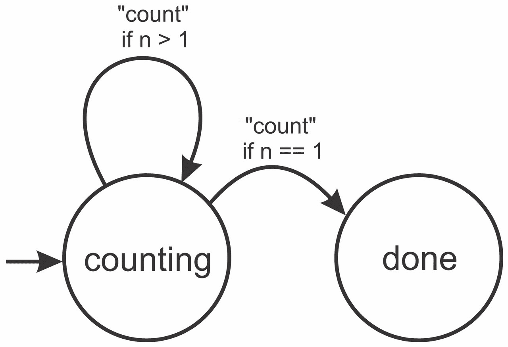
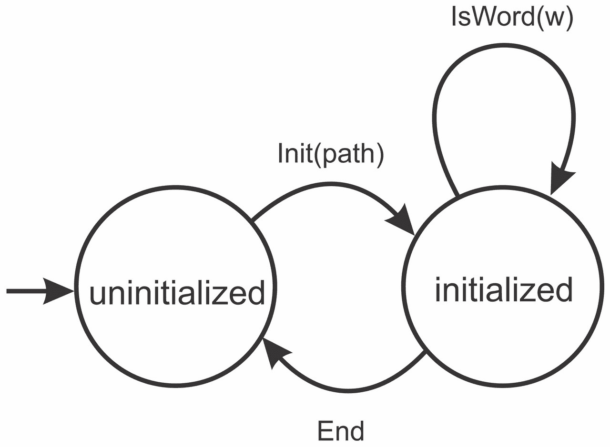
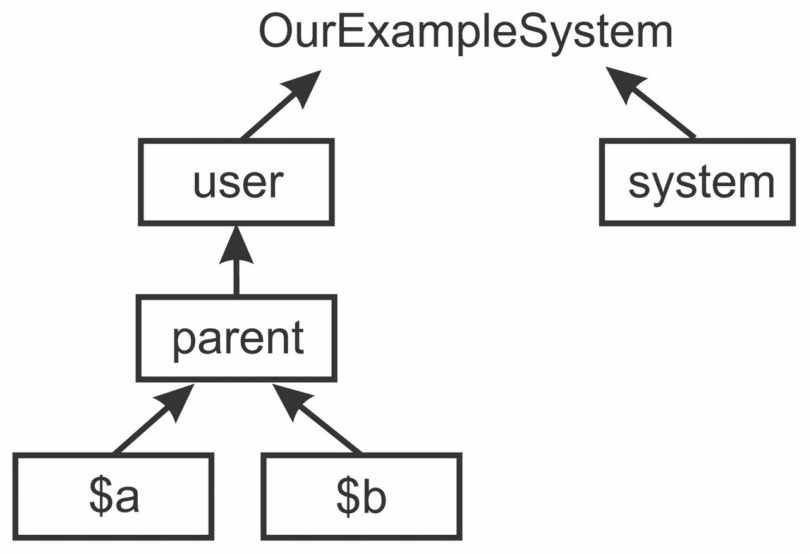
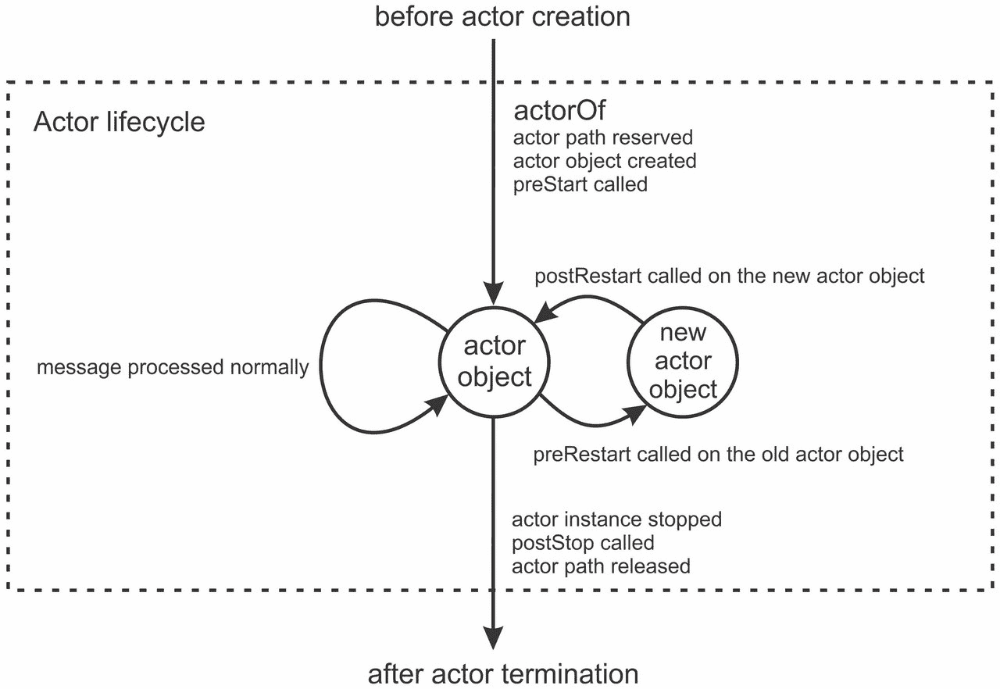
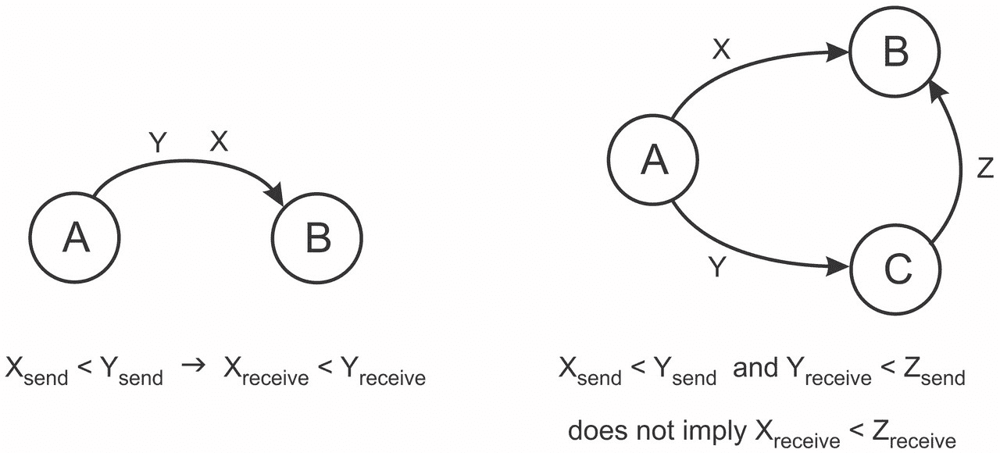
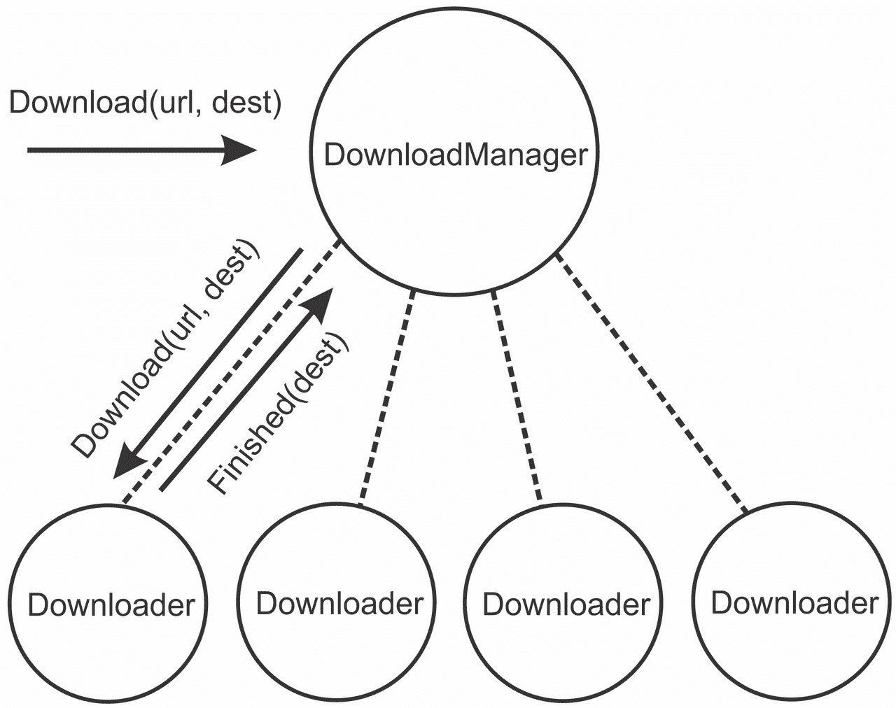

# 第八章。演员

|   | *"一个分布式系统是这样的，即使你不知道有一台计算机存在，它的故障也可能使你的计算机无法使用。" |   |
| --- | --- | --- |
|   | --*莱斯利·兰波特* |

在整本书中，我们集中讨论了许多并发编程的不同抽象。其中大部分抽象假设存在共享内存。未来和承诺、并发数据结构和软件事务内存，最适合共享内存系统。虽然共享内存假设确保了这些设施的高效性，但它也限制了它们只能应用于运行在单台计算机上的应用程序。在本章中，我们考虑了一种适用于共享内存机器或分布式系统的编程模型，即**演员模型**。在演员模型中，程序由大量独立执行计算并通过传递消息进行通信的实体表示。这些独立实体被称为**演员**。

演员模型旨在通过完全消除共享内存的需要来解决与使用共享内存相关的问题，例如数据竞争或同步。*可变*状态被限制在一个演员的边界内，并且当演员收到消息时可能会被修改。演员接收到的消息是按顺序处理的，一个接一个。这确保了演员内部的可变状态永远不会被并发访问。然而，不同的演员可以并发地处理接收到的消息。在一个典型的基于演员的程序中，演员的数量可以比处理器的数量多几个数量级。这类似于多线程程序中处理器和线程之间的关系。演员模型实现决定何时将处理器时间分配给特定的演员，以便他们处理消息。

当我们开始将应用程序分布到多台计算机上时，演员模型的真正优势才显现出来。实现跨越多台计算机和通过计算机网络通信的设备的程序被称为**分布式编程**。演员模型允许你编写在单个进程中运行的程序，在同一台机器上的多个进程中运行，或者在连接到计算机网络的多台机器上运行。创建演员和发送消息与演员的位置无关，并且是独立的。在分布式编程中，这被称为**位置透明性**。位置透明性允许你设计分布式系统，而无需了解计算机网络中的关系。

在本章中，我们将使用 Akka `actor` 框架来了解演员并发模型。具体来说，我们将涵盖以下主题：

+   声明演员类和创建演员实例

+   模拟演员状态和复杂的演员行为

+   操作演员层次结构和演员的生命周期

+   演员通信中使用的不同消息传递模式

+   使用内置的演员监督机制进行错误恢复

+   使用演员透明地构建并发和分布式程序

我们将首先研究演员模型中的重要概念和术语，并学习 Akka 中演员模型的基础知识。

# 与演员一起工作

在演员编程模型中，程序由一组并发执行的实体运行，这些实体被称为演员。演员系统类似于人类组织，例如公司、政府或其他大型机构。为了理解这种相似性，我们考虑一个大型软件公司的例子。

在像谷歌、微软、亚马逊或 Typesafe 这样的软件公司中，有许多需要同时实现的目标。数百或数千名员工致力于实现这些目标，通常组织成一种分层结构。不同的员工在不同的职位上工作。团队领导为特定项目做出重要的技术决策，软件工程师实现并维护软件产品的各个部分，系统管理员确保个人工作站、服务器和各种设备正常运行。许多员工，如团队领导，将他们的任务委托给比他们级别低的员工。为了能够高效地工作和做出决策，员工使用电子邮件进行沟通。

当员工早上来上班时，他会检查他的电子邮件客户端并回复重要的消息。有时，这些消息包含来自老板的工作任务或其他员工的要求。当一封电子邮件很重要时，员工必须立即撰写回复。当员工忙于回复一封电子邮件时，其他电子邮件可以到达，并且这些电子邮件会在他的电子邮件客户端中排队。只有当员工完成一封电子邮件后，他才能继续处理下一封。

在先前的场景中，公司的业务流程被划分为若干个功能组件。结果证明，这些组件与演员框架的不同部分紧密对应。现在，我们将通过定义演员系统的各个部分，并将它们与软件公司中的类比联系起来，来识别这些相似之处。

**演员系统**是一组具有共同配置选项的演员的分层组。演员系统负责创建新的演员、在演员系统中定位演员以及记录重要事件。演员系统是软件公司本身的类比。

**演员类**是一个模板，描述了演员内部的状态以及演员如何处理消息。可以从相同的演员类创建多个演员。演员类是公司中特定职位的类比，例如软件工程师、市场营销经理或招聘人员。

**演员实例**是在运行时存在并且能够接收消息的实体。演员实例可能包含可变状态，并且可以向其他演员实例发送消息。演员类与演员实例之间的区别直接对应于面向对象编程中类与该类对象实例之间的关系。在软件公司示例的上下文中，演员实例类似于特定员工。

**消息**是演员用来通信的单位。在 Akka 中，任何对象都可以是消息。消息类似于公司内部发送的电子邮件。当演员发送消息时，它不会等待其他演员接收消息。同样，当员工发送电子邮件时，他不会等待电子邮件被接收或被其他员工阅读。相反，他继续自己的工作；员工太忙了，不能等待。可能同时向同一个人发送多个电子邮件。

**邮箱**是内存的一部分，用于缓冲特定于每个演员实例的消息。这个缓冲区是必要的，因为演员实例一次只能处理一个消息。邮箱对应于员工使用的电子邮件客户端。在任何时候，电子邮件客户端中可能会有多个未读电子邮件被缓冲，但员工一次只能阅读和回复它们。

**演员引用**是一个对象，它允许你向特定的演员发送消息。此对象隐藏了演员位置的信息，不让程序员知道。演员可能运行在单独的进程或不同的计算机上。演员引用允许你向无论演员在哪里运行的演员发送消息。从软件公司的角度来看，演员引用对应于特定员工的电子邮件地址。电子邮件地址允许我们向员工发送电子邮件，而不必知道员工的物理位置。员工可能在他的办公室、出差或在度假，但无论他去哪里，电子邮件最终都会到达他那里。

**调度器**是一个组件，它决定何时允许演员处理消息，并为他们提供计算资源以进行处理。在 Akka 中，每个调度器同时也是一个执行上下文。调度器确保具有非空邮箱的演员最终由特定的线程运行，并且这些消息是按顺序处理的。调度器最好与软件公司的电子邮件回复策略相比较。一些员工，如技术支持专家，期望他们一收到电子邮件就立即回复。软件工程师有时有更多的自由——他们可以选择在检查电子邮件之前修复几个错误。清洁工整天在办公楼周围工作，只在早上查看他的电子邮件客户端。

为了使这些概念更加具体，我们首先创建一个简单的演员应用程序。这是下一节的主题，我们将学习如何创建演员系统和演员实例。

## 创建演员系统和演员

在面向对象的语言中创建对象实例时，我们首先声明一个类，该类可以被多个对象实例重用。然后，我们指定对象的构造函数参数。最后，我们使用`new`关键字实例化一个对象，并获取对该对象的引用。

在 Akka 中创建演员实例大致遵循创建对象实例相同的步骤。首先，我们需要定义一个演员类，该类定义了演员的行为。然后，我们需要指定特定演员实例的配置。最后，我们需要告诉演员系统使用给定的配置实例化演员。然后演员系统创建一个演员实例，并返回对该实例的演员引用。在本节中，我们将更详细地研究这些步骤。

演员类用于指定演员的行为。它描述了演员如何响应消息并与其他演员通信，封装演员状态，并定义演员的启动和关闭序列。我们通过扩展`akka.actor`包中的`Actor`特质来声明一个新的演员类。这个特质包含一个抽象方法`receive`。`receive`方法返回一个类型为`PartialFunction[Any, Unit]`的部分函数对象。当演员接收到`Any`类型的消息时，使用这个部分函数。如果部分函数未定义该消息，则该消息将被丢弃。

除了定义演员如何接收消息外，演员类还封装了演员使用的对象引用。这些对象构成了演员的状态。在本章中，我们使用 Akka 的`Logging`对象将输出打印到标准输出。在下面的代码中，我们声明了一个`HelloActor`演员类，该类对`hello`构造函数参数指定的`hello`消息做出反应。`HelloActor`类包含一个`Logging`对象`log`，作为其状态的一部分。`Logging`对象使用`context.system`对当前演员系统的引用和`this`对当前演员的引用来创建。`HelloActor`类在`receive`方法中定义了一个部分函数，该函数确定消息是否等于`hello`字符串参数，或者等于其他称为`msg`的对象。

当由`HelloActor`类定义的演员接收到`hello`字符串消息时，它使用`Logging`对象`log`打印该消息。否则，它打印出它接收到了一个意外的消息，并通过在表示当前演员的演员引用`self`上调用`context.stop`方法来停止，这如以下代码片段所示：

```java
import akka.actor._ 
import akka.event.Logging 
class HelloActor(val hello: String) extends Actor { 
  val log = Logging(context.system, this) 
  def receive = { 
    case `hello` => 
      log.info(s"Received a '$hello'... $hello!") 
    case msg     => 
      log.info(s"Unexpected message '$msg'") 
      context.stop(self) 
  } 
} 

```

声明一个演员类并不会创建一个正在运行的演员实例。相反，演员类作为创建演员实例的蓝图。相同的演员类可以被许多演员实例共享。要在 Akka 中创建一个演员实例，我们需要将有关演员类的信息传递给演员系统。然而，像 `HelloActor` 这样的演员类不足以创建一个演员实例；我们还需要指定 `hello` 参数。为了打包创建演员实例所需的信息，Akka 使用称为 **演员配置** 的对象。

演员配置包含有关演员类、其构造函数参数、邮箱和调度器实现的信息。在 Akka 中，演员配置用 `Props` 类表示。`Props` 对象封装了创建演员实例所需的所有信息，可以序列化或通过网络发送。

要创建 `Props` 对象，建议在演员类的伴生对象中声明工厂方法。在以下伴生对象中，我们声明了两个工厂方法，分别称为 `props` 和 `propsAlt`，它们根据 `hello` 参数返回 `HelloActor` 类的 `Props` 对象：

```java
object HelloActor { 
  def props(hello: String) = Props(new HelloActor(hello)) 
  def propsAlt(hello: String) = Props(classOf[HelloActor], hello) 
} 

```

`props` 方法使用 `Props.apply` 工厂方法的另一个重载，通过创建 `HelloActor` 类来获取代码块。每当演员系统需要创建一个演员实例时，都会调用此代码块。`propsAlt` 方法使用另一个 `Props.apply` 重载，它从演员类的 `Class` 对象和一个构造函数参数列表创建演员实例。这两个声明在语义上是等价的。

第一个 `Props.apply` 方法重载接受一个调用演员类构造函数的闭包。如果我们不小心，闭包可以轻易捕获封装作用域的引用。当这种情况发生时，这些引用成为 `Props` 对象的一部分。考虑以下实用类中的 `defaultProps` 方法：

```java
class HelloActorUtils { 
  val defaultHi = "Aloha!" 
  def defaultProps() = Props(new HelloActor(defaultHi)) 
} 

```

通过网络发送由 `defaultProps` 方法返回的 `Props` 对象需要发送由闭包捕获的封装 `HelloActorUtils` 对象，这会产生额外的网络成本。

此外，在演员类中声明 `Props` 对象尤其危险，因为它可以捕获封装的演员实例的 `this` 引用。按照 `propsAlt` 方法所示创建 `Props` 对象更安全。

### 小贴士

避免在演员类中创建 `Props` 对象，以防止意外捕获演员的 `this` 引用。 wherever possible，在顶级单例对象的工厂方法中声明 `Props`。

`Props.apply` 方法的第三次重载是一个便利方法，它可以与具有零参数构造函数的演员类一起使用。如果 `HelloActor` 没有定义构造函数参数，我们可以编写 `Props[HelloActor]` 来创建一个 `Props` 对象。

要实例化一个 Actor，我们将 Actor 配置传递给 Actor 系统的 `actorOf` 方法。在本章中，我们将使用我们自定义的名为 `ourSystem` 的 Actor 系统实例。我们使用 `ActorSystem.apply` 工厂方法定义 `ourSystem` 变量：

```java
lazy val ourSystem = ActorSystem("OurExampleSystem") 

```

现在，我们可以通过在 Actor 系统上调用 `actorOf` 方法来创建和运行 `HelloActor` 类。在创建一个新的 Actor 时，我们可以使用 `name` 参数为 Actor 实例指定一个唯一的名称。如果没有明确指定 `name` 参数，Actor 系统会自动为新 Actor 实例分配一个唯一的名称。`actorOf` 方法不返回 `HelloActor` 类的实例。相反，它返回一个 `ActorRef` 类型的 Actor 引用对象。

在创建了一个能够识别 `hi` 消息的 `HelloActor` 实例 `hiActor` 之后，我们向它发送了一个消息，`hi`。要向 Akka Actor 发送消息，我们使用 `!` 操作符（发音为 *tell* 或 *bang*）。为了清晰起见，我们随后通过调用 `sleep` 暂停执行一秒，给 Actor 一些时间来处理消息。然后我们发送另一个消息，`hola`，并再等待一秒。最后，我们通过调用其 `shutdown` 方法来终止 Actor 系统。这在上面的程序中有所展示：

```java
object ActorsCreate extends App { 
  val hiActor: ActorRef = 
    ourSystem.actorOf(HelloActor.props("hi"), name = "greeter") 
  hiActor ! "hi" 
  Thread.sleep(1000) 
  hiActor ! "hola" 
  Thread.sleep(1000) 
  ourSystem.shutdown() 
} 

```

运行此程序后，`hiActor` 实例首先打印出它接收到了一个 `hi` 消息。一秒后，它打印出它接收到了一个 `hola` 字符串作为消息，一个意外的消息，然后终止。

## 管理未处理的消息

在 `HelloActor` 示例中，`receive` 方法能够处理任何类型的消息。当消息与预先指定的 `hello` 参数不同时，例如之前使用的 `hi`，`HelloActor` Actor 会将此报告在默认情况下。或者，我们也可以不处理默认情况。当一个 Actor 收到其 `receive` 方法无法处理的消息时，该消息会被封装成一个 `UnhandledMessage` 对象，并转发到 Actor 系统的事件流中。通常，Actor 系统的事件流用于日志记录目的。

我们可以通过在 Actor 类中重写 `unhandled` 方法来覆盖这个默认行为。默认情况下，此方法会将未处理的消息发布到 Actor 系统的事件流中。在下面的代码中，我们声明了一个 `DeafActor` Actor 类，其 `receive` 方法返回一个空的偏函数。空的偏函数没有为任何类型的消息定义，所以所有发送给这个 Actor 的消息都会传递到 `unhandled` 方法。我们重写它以将 `String` 消息输出到标准输出。我们通过调用 `super.unhandled` 方法将所有其他类型的消息传递到 Actor 系统的事件流中。下面的代码片段展示了 `DeafActor` 的实现：

```java
class DeafActor extends Actor { 
  val log = Logging(context.system, this) 
  def receive = PartialFunction.empty 
  override def unhandled(msg: Any) = msg match { 
    case msg: String => log.info(s"I do not hear '$msg'") 
    case msg         => super.unhandled(msg) 
  } 
} 

```

让我们在一个例子中测试一个`DeafActor`类。以下程序创建了一个名为`deafy`的`DeafActor`实例，并将它的 actor 引用赋值给`deafActor`。然后它向`deafActor`发送两条消息，`deafy`和`1234`，然后关闭 actor 系统：

```java
object ActorsUnhandled extends App { 
  val deafActor: ActorRef = 
    ourSystem.actorOf(Props[DeafActor], name = "deafy") 
  deafActor ! "hi" 
  Thread.sleep(1000) 
  deafActor ! 1234 
  Thread.sleep(1000) 
  ourSystem.shutdown() 
} 

```

运行这个程序表明，第一条消息，即`deafy`字符串，被`unhandled`方法捕获并打印出来。`1234`消息被转发到 actor 系统的 event 流中，并且永远不会显示在标准输出上。

一个细心的读者可能会注意到，我们可以通过将 case 移动到`receive`方法中来避免`unhandled`调用，如下面的`receive`实现所示：

```java
def receive = { 
  case msg: String => log.info(s"I do not hear '$msg'") 
} 

```

这个`receive`方法的定义更加简洁，但对于更复杂的 actor 来说是不够的。在先前的例子中，我们将未处理消息的处理方式与 actor 处理常规消息的方式合并在一起。有状态 actor 通常会改变它们处理常规消息的方式，因此将未处理消息的处理与 actor 的正常行为分开是至关重要的。我们将在下一节研究如何改变 actor 的行为。

## Actor 行为和状态

当 actor 改变其状态时，通常需要改变它处理传入消息的方式。actor 处理常规消息的方式被称为 actor 的**行为**。在本节中，我们将研究如何操纵 actor 行为。

我们之前已经了解到，我们通过实现`receive`方法来定义 actor 的初始行为。请注意，`receive`方法必须始终返回相同的偏函数。从`receive`方法返回不同的偏函数，取决于 actor 的当前状态是不正确的。让我们假设我们想要定义一个`CountdownActor`actor 类，每次接收到`count`消息时，它都会减少其`n`整数字段，直到为零。在`CountdownActor`类达到零后，它应该忽略所有后续消息。以下`receive`方法的定义在 Akka 中是不允许的：

```java
class CountdownActor extends Actor { 
  var n = 10 
  def receive = if (n > 0) { // never do this 
    case "count" => 
      log(s"n = $n") 
      n -= 1 
  } else PartialFunction.empty 
} 

```

为了在`CountdownActor`类达到零后正确地改变其行为，我们使用 actor 的`context`对象上的`become`方法。在`CountdownActor`类的正确定义中，我们定义了两个方法，`counting`和`done`，它们返回两种不同的行为。`counting`行为对`count`消息做出反应，并在`n`字段为零时调用`become`以转换为`done`行为。`done`行为只是一个空的偏函数，它忽略所有消息。

这在以下`CountdownActor`类的实现中得到了展示：

```java
class CountdownActor extends Actor { 
  val log = Logging(context.system, this) 
  var n = 10 
  def counting: Actor.Receive = { 
    case "count" => 
      n -= 1 
      log.info(s"n = $n") 
      if (n == 0) context.become(done) 
  } 
  def done = PartialFunction.empty 
  def receive = counting 
} 

```

`receive`方法定义了 actor 的初始行为，这必须是`counting`行为。请注意，我们正在使用来自 Actor 伴随对象的类型别名`Receive`，它只是`PartialFunction[Any, Unit]`类型的简写。

在模拟复杂演员时，将其视为 **状态机** 是有帮助的。状态机是一个数学模型，它表示具有一些状态和这些状态之间转换的系统。在演员中，每种行为对应于状态机中的一个状态。如果演员在接收到特定消息时可能调用 `become` 方法，则存在两个状态之间的转换。在以下图中，我们展示了对应于 `CountdownActor` 类的状态机。两个圆圈代表对应于行为 `counting` 和 `done` 的状态。初始行为是 **counting**，所以我们画了一条指向相应状态的箭头。我们用指向状态的箭头来表示状态之间的转换。

当演员接收到 **count** 消息且 **n** 字段大于 **1** 时，行为不会改变。然而，当演员接收到 **count** 消息且 **n** 字段减少到 `0` 时，演员的行为将变为 **done**：



以下简短的程序测试了我们演员的正确性。我们使用演员系统创建一个新的 `countdown` 演员并发送 20 个 `count` 消息。演员只对前 10 个消息做出反应，然后切换到 `done` 行为：

```java
object ActorsCountdown extends App { 
  val countdown = ourSystem.actorOf(Props[CountdownActor]) 
  for (i <- 0 until 20) countdown ! "count" 
  Thread.sleep(1000) 
  ourSystem.shutdown() 
} 

```

当演员根据其当前状态对传入的消息做出不同的响应时，你应该将不同的状态分解为偏函数，并使用 `become` 方法在状态之间切换。这在演员变得更加复杂时尤为重要，并确保演员逻辑更容易理解和维护。

### 提示

当一个有状态的演员需要改变其行为时，为每种行为声明一个单独的偏函数。实现 `receive` 方法以返回对应初始行为的函数。

现在我们考虑一个更精细的例子，在这个例子中，我们定义了一个演员，该演员检查给定的单词是否存在于字典中，并将其打印到标准输出。我们希望在运行时能够更改演员使用的字典。为了设置字典，我们向演员发送一个包含字典路径的 `Init` 消息。之后，我们可以通过向演员发送 `IsWord` 消息来检查单词是否在字典中。一旦我们完成对字典的使用，我们可以通过向演员发送 `End` 消息来请求卸载字典。之后，我们可以用其他字典初始化演员。

以下状态机模型使用两种行为来表示这种逻辑，称为 `uninitialized` 和 `initialized`：



在演员类的伴随对象中为不同的消息定义数据类型是一种推荐的做法。在这种情况下，我们将案例类 `Init`、`IsWord` 和 `End` 添加到 `DictionaryActor` 类的伴随对象中：

```java
object DictionaryActor { 
  case class Init(path: String) 
  case class IsWord(w: String) 
  case object End 
} 

```

接下来，我们定义 `DictionaryActor` actor 类。这个类定义了一个私有的 `Logging` 对象 `log` 和一个 `dictionary` 可变集合，该集合最初为空，可以用来存储单词。`receive` 方法返回 `uninitialized` 行为，它只接受 `Init` 消息类型。当 `Init` 消息到达时，actor 使用其 `path` 字段从文件中获取字典，加载单词，并调用 `become` 切换到 `initialized` 行为。当 `IsWord` 消息到达时，actor 检查单词是否存在并将其打印到标准输出。如果到达 `End` 消息，actor 清除字典并切换回 `uninitialized` 行为。这在上面的代码片段中显示：

```java
class DictionaryActor extends Actor { 
  private val log = Logging(context.system, this) 
  private val dictionary = mutable.Set[String]() 
  def receive = uninitialized 
  def uninitialized: PartialFunction[Any, Unit] = { 
    case DictionaryActor.Init(path) => 
      val stream = getClass.getResourceAsStream(path) 
      val words = Source.fromInputStream(stream) 
      for (w <- words.getLines) dictionary += w 
      context.become(initialized) 
  } 
  def initialized: PartialFunction[Any, Unit] = { 
    case DictionaryActor.IsWord(w) => 
      log.info(s"word '$w' exists: ${dictionary(w)}") 
    case DictionaryActor.End => 
      dictionary.clear() 
      context.become(uninitialized) 
  } 
  override def unhandled(msg: Any) = { 
    log.info(s"cannot handle message $msg in this state.") 
  } 
} 

```

注意，我们在 `DictionaryActor` 类中重写了 `unhandled` 方法。在这种情况下，使用 `unhandled` 方法减少了代码重复，并使得 `DictionaryActor` 类更容易维护，因为不需要在 `initialized` 和 `uninitialized` 行为中都列出 `default` 情况两次。

如果你正在使用 Unix 系统，你可以从 `/usr/share/dict/words` 位置加载由换行符分隔的单词列表文件。或者，下载本书的源代码并找到 `words.txt` 文件，或者创建一个包含几个单词的虚拟文件，并将其保存到 `src/main/resources/org/learningconcurrency/` 目录。然后，你可以使用以下程序测试 `DictionaryActor` 类的正确性：

```java
val dict = ourSystem.actorOf(Props[DictionaryActor], "dictionary") 

dict ! DictionaryActor.IsWord("program") 
Thread.sleep(1000) 

dict ! DictionaryActor.Init("/org/learningconcurrency/words.txt") 
Thread.sleep(1000) 

```

发送到 actor 的第一条消息会导致错误消息。在初始化 actor 之前，我们不能发送 `IsWord` 消息。在发送 `Init` 消息后，我们可以检查字典中是否存在单词。最后，我们发送 `End` 消息并关闭 actor 系统，如以下代码片段所示：

```java
dict ! DictionaryActor.IsWord("program") 
Thread.sleep(1000) 

dict ! DictionaryActor.IsWord("balaban") 
Thread.sleep(1000) 

dict ! DictionaryActor.End 
Thread.sleep(1000) 

ourSystem.shutdown() 

```

在了解了 actor 行为之后，我们将在下一节研究 actor 如何组织成层次结构。

## Akka actor 层次结构

在大型组织中，人们被分配不同的任务角色和责任，以实现特定的目标。公司的 CEO 选择一个特定的目标，例如推出一个软件产品。然后，他将部分工作任务委托给公司内部的不同团队——市场营销团队调查新产品的潜在客户，设计团队开发产品的用户界面，软件工程团队实现软件产品的逻辑。根据公司的规模，每个团队都可以进一步分解为具有不同角色和责任的子团队。例如，软件工程团队可以组成两个开发者子团队，负责实现软件产品的后端，如服务器端代码，以及前端，如网站或桌面 UI。

类似地，演员的集合可以形成层次结构，其中靠近根部的演员处理更通用的任务，并将工作项委托给层次结构中较低级别的更专业化的演员。将系统的部分组织成层次结构是将复杂程序分解为其基本组件的自然和系统化方法。在演员的上下文中，正确选择的演员层次结构还可以根据演员之间工作平衡的情况保证应用程序更好的可伸缩性。重要的是，演员之间的层次结构允许隔离和替换系统中更容易失败的部件。

在 Akka 中，演员隐式地形成一个层次结构。每个演员都可以有一些子演员，并且可以使用`context`对象创建或停止子演员。为了测试这种关系，我们将定义两个演员类来表示父演员和子演员。我们首先定义`ChildActor`演员类，该类通过打印其父演员的引用来响应`sayhi`消息。父演员的引用是通过在`context`对象上调用`parent`方法获得的。此外，我们还将覆盖`Actor`类的`postStop`方法，该方法在演员停止后被调用。通过这样做，我们能够精确地看到子演员何时停止。`ChildActor`模板如下代码片段所示：

```java
class ChildActor extends Actor { 
  val log = Logging(context.system, this) 
  def receive = { 
    case "sayhi" => 
      val parent = context.parent 
      log.info(s"my parent $parent made me say hi!") 
  } 
  override def postStop() { 
    log.info("child stopped!") 
  } 
} 

```

现在我们定义一个名为`ParentActor`的演员类，它可以接受`create`、`sayhi`和`stop`消息。当`ParentActor`收到`create`消息时，它通过在`context`对象上调用`actorOf`来创建一个新的子演员。当`ParentActor`类收到`sayhi`消息时，它通过遍历`context.children`列表将消息转发给其子演员，并将消息重新发送给每个子演员。最后，当`ParentActor`类收到`stop`消息时，它停止自己：

```java
class ParentActor extends Actor { 
  val log = Logging(context.system, this) 
  def receive = { 
    case "create" => 
      context.actorOf(Props[ChildActor]) 
      log.info(s"created a kid; children = ${context.children}") 
    case "sayhi" => 
      log.info("Kids, say hi!") 
      for (c <- context.children) c ! "sayhi" 
    case "stop" => 
      log.info("parent stopping") 
      context.stop(self) 
  } 
} 

```

我们在以下程序中测试了`ParentActor`和`ChildActor`演员类。我们首先创建`ParentActor`实例`parent`，然后向`parent`发送两个`create`消息。`parent`演员打印出它创建了两个子演员。然后我们向`parent`发送一个`sayhi`消息，并观察子演员在父演员将`sayhi`消息转发给它们之后输出消息。最后，我们向`parent`发送`stop`消息来停止父演员。这如下面的程序所示：

```java
object ActorsHierarchy extends App { 
  val parent = ourSystem.actorOf(Props[ParentActor], "parent") 
  parent ! "create" 
  parent ! "create" 
  Thread.sleep(1000) 
  parent ! "sayhi" 
  Thread.sleep(1000) 
  parent ! "stop" 
  Thread.sleep(1000) 
  ourSystem.shutdown() 
} 

```

通过研究标准输出，我们发现两个子演员在父演员打印它即将停止的消息后立即输出一个`sayhi`消息。这是 Akka 演员的正常行为——子演员不能没有父演员而存在。一旦父演员停止，其子演员也会被演员系统停止。

### 注意

当一个演员停止时，其子演员也会自动停止。

如果你运行了前面的示例程序，你可能已经注意到打印演员引用反映了演员在演员层次结构中的位置。例如，打印子演员引用显示 `akka://OurExampleSystem/user/parent/$a` 字符串。这个字符串的前一部分，`akka://` 表示这个引用指向一个本地演员。`OurExampleSystem` 部分是我们在这个例子中使用的演员系统名称。`parent/$a` 部分反映了父演员的名称和子演员自动生成的名称 `$a`。出人意料的是，演员引用的字符串表示还包含对中间演员的引用，称为 `user`。

在 Akka 中，位于演员层次结构顶部的演员被称为**守护者演员**，它存在以执行各种内部任务，例如日志记录和重启用户演员。在应用程序中创建的每个顶级演员都被放置在预定义的 `user` 守护者演员之下。还有其他守护者演员。例如，由演员系统内部使用的演员被放置在 `system` 守护者演员之下。演员层次结构在以下图中显示，其中守护者演员 `user` 和 `system` 在名为 `OurExampleSystem` 的演员系统中形成两个独立的层次结构：



在本节中，我们了解到 Akka 演员形成一个层次结构，并了解了该层次结构中演员之间的关系。重要的是，我们学习了如何使用 `context` 对象的 `parent` 和 `children` 方法来引用演员的邻近演员。在下一节中，我们将看到如何引用同一演员系统内的任意演员。

## 识别演员

在上一节中，我们了解到演员被组织成一个层次树，其中每个演员都有一个父演员和一些子演员。因此，每个演员都位于从层次结构根节点到该演员的唯一路径上，并且可以在该路径上分配一个唯一的演员名称序列。`parent` 演员直接位于 `user` 守护者演员之下，因此其唯一的演员名称序列是 `/user/parent`。同样，`parent` 演员的子演员的唯一演员名称序列是 `$a` 是 `/user/parent/$a`。**演员路径**是协议、演员系统名称以及从顶级守护者演员到特定演员的路径上演员名称的连接。上一个例子中 `parent` 演员的演员路径是 `akka://OurExampleSystem/user/parent`。

演员路径与文件系统中的文件路径紧密对应。每个文件路径唯一指定了一个文件位置，就像演员路径唯一指定了演员在层次结构中的位置一样。就像文件系统中的文件路径并不意味着文件存在一样，演员路径也不意味着在演员系统中该文件路径上存在演员。相反，演员路径是一个标识符，用于在存在的情况下获取演员引用。此外，演员路径中的名称部分可以用通配符和 `..` 符号替换，类似于在 shell 中替换文件名部分。在这种情况下，我们获得一个**路径选择**。例如，路径选择 `..` 引用当前演员的父级。选择 `../*` 引用当前演员及其所有兄弟。

演员路径与演员引用不同；我们不能使用演员路径向演员发送消息。相反，我们必须首先使用演员路径在该路径上识别一个演员。如果我们成功找到演员路径后面的演员引用，我们就可以向其发送消息。

要获取与演员路径对应的演员引用，我们调用演员的上下文对象上的 `actorSelection` 方法。此方法接受一个演员路径或路径选择。调用 `actorSelection` 方法可能不会针对任何演员，如果没有演员与演员路径相对应。同样，如果使用路径选择，它可能针对多个演员。因此，而不是返回一个 `ActorRef` 对象，`actorSelection` 方法返回一个 `ActorSelection` 对象，该对象可能代表零、一个或多个演员。我们可以使用 `ActorSelection` 对象向这些演员发送消息。

### 小贴士

使用 `context` 对象上的 `actorSelection` 方法与演员系统中的任意演员进行通信。

如果我们将 `ActorRef` 对象与特定的电子邮件地址进行比较，那么 `ActorSelection` 对象可以与邮件列表地址进行比较。向有效的电子邮件地址发送电子邮件可以确保电子邮件到达特定的人。另一方面，当我们向邮件列表发送电子邮件时，电子邮件可能会到达零、一个或多个订阅者，具体取决于邮件列表订阅者的数量。

与邮件列表不告诉我们其订阅者信息的方式类似，`ActorSelection` 对象也不会告诉我们演员的具体路径。为此，Akka 定义了一种特殊类型的消息，称为 `Identify`。当一个 Akka 演员收到 `Identify` 消息时，它将自动回复，发送一个包含其 `ActorRef` 对象的 `ActorIdentity` 消息。如果没有演员在演员选择中，则 `ActorIdentity` 消息将不带 `ActorRef` 对象发送回 `Identify` 的发送者。

### 小贴士

向 `ActorSelection` 对象发送 `Identify` 消息以获取演员系统中任意演员的演员引用。

在下面的示例中，我们定义了一个 `CheckActor` 角色类，它描述了在接收到带有角色路径的消息时检查并打印角色引用的角色。当 `CheckActor` 类型的角色接收到一个带有角色路径的字符串或路径选择时，它获取一个 `ActorSelection` 对象并发送一个 `Identify` 消息。此消息被转发到选择中的所有角色，然后它们响应一个 `ActorIdentity` 消息。`Identify` 消息还带有一个 `messageId` 参数。如果一个角色发送多个 `Identify` 消息，`messageId` 参数允许区分不同的 `ActorIdentity` 响应。在我们的示例中，我们使用 `path` 字符串作为 `messageId` 参数。当 `CheckActor` 接收到一个 `ActorIdentity` 消息时，它会打印角色引用或者报告在指定路径上没有找到角色。`CheckActor` 类在下面的代码片段中显示：

```java
class CheckActor extends Actor { 
  val log = Logging(context.system, this) 
  def receive = { 
    case path: String => 
      log.info(s"checking path $path") 
      context.actorSelection(path) ! Identify(path) 
    case ActorIdentity(path, Some(ref)) => 
      log.info(s"found actor $ref at $path") 
    case ActorIdentity(path, None) => 
      log.info(s"could not find an actor at $path") 
  } 
} 

```

接下来，我们实例化了一个 `CheckActor` 类的 `checker` 角色并给它发送了路径选择，`../*`。这引用了 `checker` 父角色的所有子角色——`checker` 角色本身及其兄弟角色：

```java
val checker = ourSystem.actorOf(Props[CheckActor], "checker") 
checker ! "../*" 

```

除了 `checker` 角色之外，我们没有实例化任何顶级角色，所以 `checker` 只接收到一个 `ActorIdentity` 消息并打印出其自身的角色路径。接下来，我们尝试识别 `checker` 角色上方的所有角色。回想一下之前的图示。由于 `checker` 是一个顶级角色，这应该会识别出角色系统中的守护者角色：

```java
checker ! "../../*" 

```

如预期，`checker` 角色打印了 `user` 和 `system` 守护者角色的角色路径。我们很想知道从 `system` 守护者角色那里了解更多关于系统内部角色的信息。这次，我们向 `checker` 发送了一个绝对路径选择：

```java
checker ! "/system/*" 

```

`checker` 角色打印了内部角色 `log1-Logging` 和 `deadLetterListener` 的角色路径，分别用于日志记录和处理未处理的消息。接下来，我们尝试识别一个不存在的角色：

```java
checker ! "/user/checker2" 

```

没有名为 `checker2` 的角色，所以 `checker` 接收到一个 `ActorIdentity` 消息，其中 `ref` 字段设置为 `None`，并打印出它无法在该路径上找到角色。

使用 `actorSelection` 方法和 `Identify` 消息是发现同一角色系统中的未知角色的基本方法。请注意，我们总是会获得一个角色引用，而永远不会直接获得角色对象的指针。为了更好地理解这样做的原因，我们将在下一节研究角色的生命周期。

## 角色生命周期

回想一下，在上一节中，`ChildActor` 类覆盖了 `postStop` 方法，在角色停止时产生一些日志输出。在本节中，我们将研究 `postStop` 方法何时被调用，以及其他构成角色生命周期的其他重要事件。

为了理解演员生命周期的重要性，我们考虑如果演员在处理传入消息时抛出异常会发生什么。在 Akka 中，这样的异常被视为异常行为，因此默认情况下，抛出异常的顶级用户演员会被重启。重启创建了一个新的演员对象，实际上意味着演员状态被重新初始化。当演员重启时，其演员引用和演员路径保持不变。因此，同一个逻辑演员在存在期间可能对应多个不同的物理演员对象。这是演员永远不允许其`this`引用泄漏的原因之一。这样做允许程序的其它部分引用旧的演员对象，从而破坏演员引用的透明性。此外，泄露演员的`this`引用可能会暴露演员实现的内部细节，甚至导致数据损坏。

### 提示

永远不要将演员的`this`引用传递给其他演员，因为这会破坏演员封装。

让我们检查完整的演员生命周期。正如我们所学的，当我们调用`actorOf`方法时，会创建一个逻辑演员实例。`Props`对象用于实例化一个物理演员对象。该对象被分配一个邮箱，并可以开始接收输入消息。`actorOf`方法返回一个演员引用给调用者，演员可以并发执行。在演员开始处理消息之前，会调用其`preStart`方法。`preStart`方法用于初始化逻辑演员实例。

创建后，演员开始处理消息。在某个时刻，由于异常，演员可能需要重启。当这种情况发生时，首先调用`preRestart`方法。然后停止所有子演员。接着，之前用于通过`actorOf`方法创建演员的`Props`对象被重新使用来创建一个新的演员对象。在新创建的演员对象上调用`postRestart`方法。`postRestart`返回后，新的演员对象被分配与旧演员对象相同的邮箱，并继续处理重启前邮箱中的消息。

默认情况下，`postRestart`方法会调用`prestart`方法。在某些情况下，我们可能想要覆盖这种行为。例如，数据库连接可能需要在`preStart`期间只打开一次，并在逻辑演员实例终止时关闭。

一旦逻辑演员实例需要停止，就会调用`postStop`方法。与演员关联的演员路径被释放，并返回给演员系统。默认情况下，`preRestart`方法会调用`postStop`方法。完整的演员生命周期在以下图中展示：



注意，在 actor 的生命周期中，actor 系统的其余部分观察到的 actor 引用是相同的，无论 actor 重启多少次。actor 的失败和重启对系统的其余部分来说是透明的。

为了实验 actor 的生命周期，我们声明了两个 actor 类，`StringPrinter`和`LifecycleActor`。`StringPrinter`actor 为它接收到的每个消息打印一个日志语句。我们重写它的`preStart`和`postStop`方法，以精确跟踪 actor 何时启动和停止，如下面的代码片段所示：

```java
class StringPrinter extends Actor { 
  val log = Logging(context.system, this) 
  def receive = { 
    case msg => log.info(s"printer got message '$msg'") 
  } 
  override def preStart(): Unit = log.info(s"printer preStart.") 
  override def postStop(): Unit = log.info(s"printer postStop.") 
} 

```

`LifecycleActor`类维护一个指向`StringPrinter`actor 的`child`actor 引用。`LifecycleActor`类通过打印消息来响应`Double`和`Int`消息，并通过打印列表的第一个元素来响应`List`消息。当它接收到一个`String`消息时，`LifecycleActor`实例将其转发到`child`actor：

```java
class LifecycleActor extends Actor { 
  val log = Logging(context.system, this) 
  var child: ActorRef = _ 
  def receive = { 
    case num: Double  => log.info(s"got a double - $num") 
    case num: Int     => log.info(s"got an integer - $num") 
    case lst: List[_] => log.info(s"list - ${lst.head}, ...") 
    case txt: String  => child ! txt 
  } 
} 

```

现在，我们重写不同的生命周期钩子。我们首先从`preStart`方法开始，输出一个日志语句并实例化`child`actor。这确保了在 actor 开始处理任何消息之前，`child`引用已经被初始化：

```java
override def preStart(): Unit = { 
  log.info("about to start") 
  child = context.actorOf(Props[StringPrinter], "kiddo") 
} 

```

接下来，我们重写`preRestart`和`postRestart`方法。在`preRestart`和`postRestart`方法中，我们记录导致失败的异常。默认情况下，`postRestart`方法会调用`preStart`方法，因此重启后新的 actor 对象会初始化一个新的`child`actor：

```java
override def preRestart(t: Throwable, msg: Option[Any]): Unit = { 
  log.info(s"about to restart because of $t, during message $msg") 
  super.preRestart(t, msg) 
} 
override def postRestart(t: Throwable): Unit = { 
  log.info(s"just restarted due to $t") 
  super.postRestart(t) 
} 

```

最后，我们重写`postStop`方法以跟踪 actor 何时停止：

```java
override def postStop() = log.info("just stopped") 

```

现在，我们创建了一个名为`testy`的`LifecycleActor`类实例，并向它发送一个`math.Pi`消息。actor 在其`preStart`方法中打印出它即将启动，并创建一个新的`child`actor。然后它打印出它接收到了`math.Pi`的值。重要的是，在接收到`math.Pi`消息之后，打印出`child about to start`的日志语句。这表明 actor 的创建是一个异步操作——当我们调用`actorOf`时，创建 actor 的任务被委托给了 actor 系统，程序立即继续执行：

```java
val testy = ourSystem.actorOf(Props[LifecycleActor], "testy") 
testy ! math.Pi 

```

然后，我们向`testy`发送一个字符串消息。消息被转发到`child`actor，它打印出一个日志语句，表明它接收到了消息：

```java
testy ! "hi there!" 

```

最后，我们向`testy`发送一个`Nil`消息。`Nil`对象代表一个空列表，因此当尝试获取`head`元素时，`testy`会抛出一个异常。它报告说需要重启。之后，我们看到`child`actor 打印出它需要停止的消息；回想一下，当 actor 重启时，child actors 会被停止。最后，`testy`打印出它即将重启，并且一个新的`child`actor 被实例化。这些事件是由以下语句引起的：

```java
testy ! Nil 

```

测试演员生命周期揭示了`actorOf`方法的一个重要特性。当我们调用`actorOf`方法时，执行会继续进行，而无需等待演员完全初始化。同样，发送消息不会阻塞执行，直到消息被接收或由另一个演员处理；我们说消息发送是非同步的。在下一节中，我们将检查解决这种异步行为的各种通信模式。

# 演员之间的通信

我们已经了解到演员通过发送消息进行通信。虽然运行在同一台机器上的演员在适当的同步下可以访问共享的内存部分，但发送消息允许将演员从系统的其余部分隔离出来，并确保位置透明性。允许你向演员发送消息的基本操作是`!`操作符。

我们已经了解到`!`操作符是一个非阻塞操作——发送消息不会阻塞发送者的执行，直到消息被送达。这种发送消息的方式有时被称为**fire-and-forget**模式，因为它不会等待消息接收者的回复，也不确保消息被送达。

以这种方式发送消息可以提高使用演员构建的程序的性能，但在某些情况下可能会有限制。例如，我们可能想要发送消息并等待目标响应。在本节中，我们将了解用于演员通信的超越 fire-and-forget 模式的模式。

虽然 fire-and-forget 模式不能保证消息被送达，但它保证消息最多只被送达一次。目标演员永远不会收到重复的消息。此外，对于给定的发送者和接收者演员对，消息是有序的。如果一个演员**A**按照顺序发送消息**X**和**Y**，演员**B**将不会收到重复的消息，只会收到消息**X**，只有消息**Y**，或者消息**X**，随后是消息**Y**。

这在以下图中的左侧有所展示：



然而，对于三个或更多演员的组，不能保证交付顺序。例如，如图中右侧所示，演员**A**执行以下操作：

+   向演员**B**发送消息**X**

+   向另一个演员，**C**发送消息**Y**

+   演员**C**在收到**Y**后向演员**B**发送消息**Z**

在这种情况下，消息**X**和**Z**之间的交付顺序不能保证。演员**B**可能会以任何顺序收到消息**X**和**Z**。这一特性反映了大多数计算机网络的特点，并被采用以允许演员在可能远程的网络节点上透明地运行。

### 注意

actor **B** 从 actor **A** 接收消息的顺序与这些消息从 actor **A** 发送的顺序相同。

在我们研究 actor 通信的各种模式之前，请注意，`!`操作符并不是唯一的不阻塞操作。`actorOf`和`actorSelection`方法也是不阻塞的。这些方法通常在 actor 处理消息时被调用。在处理消息时阻塞 actor 会阻止 actor 处理邮箱中的后续消息，并严重降低系统的吞吐量。因此，大多数 actor API 都是非阻塞的。此外，我们绝不能在 actor 内部开始阻塞第三方库的操作。

### 小贴士

消息必须在非阻塞的情况下处理。永远不要启动无限循环，并避免在`receive`块、`unhandled`方法以及 actor 生命周期钩子中进行长时间运行的计算。

## ask 模式

无法在 actor 内部阻塞阻止了请求-响应通信模式。在这种模式中，对某些信息感兴趣的 actor 向另一个 actor 发送请求消息。然后它需要等待来自另一个 actor 的响应消息。在 Akka 中，这种通信模式也称为*ask 模式*。

`akka.pattern` 包定义了在 actor 通信中使用便利方法。导入其内容允许我们在 actor 引用上调用`?`操作符（发音为 ask）。此操作符向目标 actor 发送消息，例如 tell 操作符。此外，ask 操作符返回一个包含目标 actor 响应的未来对象。

为了说明 ask 模式的使用，我们将定义两个 actor，它们相互进行乒乓球游戏。一个`Pingy` actor 将向另一个 actor 发送`ping`请求消息，该 actor 的类型为`Pongy`。当`Pongy` actor 收到`ping`消息时，它向发送者发送`pong`响应消息。我们首先导入`akka.pattern`包：

```java
import akka.pattern._ 

```

我们首先定义`Pongy` actor 类。为了响应`ping`传入的消息，`Pongy` actor 需要一个发送者的 actor 引用。在处理消息时，每个 actor 都可以调用`Actor`类的`sender`方法来获取当前消息发送者的 actor 引用。`Pongy` actor 使用`sender`方法向`Pingy` actor 发送`ping`。`Pongy`的实现如下代码片段：

```java
class Pongy extends Actor { 
  val log = Logging(context.system, this) 
  def receive = { 
    case "ping" => 
      log.info("Got a ping -- ponging back!") 
      sender ! "pong" 
      context.stop(self) 
  } 
  override def postStop() = log.info("pongy going down") 
} 

```

接下来，我们定义 `Pingy` 角色类，它使用询问操作符向 `Pongy` 角色发送请求。当 `Pingy` 类接收到 `Pongy` 的 `pongyRef` 角色引用时，它创建一个设置为两秒的隐式 `Timeout` 对象。使用询问操作符需要一个作用域内的隐式 `Timeout` 对象；如果响应消息在给定时间内没有到达，未来将因 `AskTimeoutException` 异常而失败。一旦 `Pingy` 类发送了 `ping` 消息，它将留下一个 `f` 未来对象。`Pingy` 角色使用特殊的 `pipeTo` 组合子，将未来中的值发送到 `pongyRef` 角色引用的发送者，如下面的代码所示：

```java
import akka.util.Timeout 
import scala.concurrent.duration._ 
class Pingy extends Actor { 
  val log = Logging(context.system, this) 
  def receive = { 
    case pongyRef: ActorRef => 
      implicit val timeout = Timeout(2 seconds) 
      val f = pongyRef ? "ping" 
      f pipeTo sender 
  } 
} 

```

未来的对象中的消息可以使用在 第四章 中看到的标准未来组合子进行操作，*使用未来和承诺进行异步编程*。然而，以下对 `Pingy` 角色的定义是不正确的：

```java
class Pingy extends Actor { 
  val log = Logging(context.system, this) 
  def receive = { 
    case pongyRef: ActorRef => 
      implicit val timeout = Timeout(2 seconds) 
      val f = pongyRef ? "ping" 
      f onComplete { case v => log.info(s"Response: $v") } // bad! 
  } 
} 

```

虽然在 `f` 未来上调用 `onComplete` 是完全合法的，但后续的异步计算不应访问任何可变角色状态。回想一下，角色状态应该只对角色可见，所以并发访问它可能会打开数据竞争和竞争条件。`log` 对象应由拥有它的角色访问。同样，我们不应在 `onComplete` 处理程序中调用 `sender` 方法。当未来完成并带有响应消息时，角色可能正在处理来自不同发送者的不同消息，因此 `sender` 方法可以返回任意值。

### 小贴士

当在 `receive` 块内启动异步计算时，`unhandled` 方法或生命周期钩子永远不要让闭包捕获任何可变角色状态。

为了测试 `Pingy` 和 `Pongy` 的实际运行情况，我们定义了一个 `Master` 角色类来实例化它们。在接收到 `start` 消息后，`Master` 角色将 `pongy` 引用传递给 `pingy` 引用。一旦 `pingy` 角色从 `pongy` 返回一个 `pong` 消息，`Master` 角色就会停止。这可以通过以下 `Master` 角色模板展示：

```java
class Master extends Actor { 
  val pingy = ourSystem.actorOf(Props[Pingy], "pingy") 
  val pongy = ourSystem.actorOf(Props[Pongy], "pongy") 
  def receive = { 
    case "start" => 
      pingy ! pongy 
    case "pong" => 
      context.stop(self) 
  } 
  override def postStop() = log.info("master going down") 
} 
val masta = ourSystem.actorOf(Props[Master], "masta") 
masta ! "start" 

```

询问模式很有用，因为它允许你向多个角色发送请求并获取它们的响应的未来。多个未来的值可以在 `for` 推导式中组合，以从多个响应中计算出一个值。在与多个角色通信时使用“发射并遗忘”模式需要更改角色行为，并且比询问模式复杂得多。

## 前向模式

一些 actor 仅用于将消息转发到其他 actor。例如，一个 actor 可能负责在几个工作 actor 之间进行负载均衡请求消息，或者它可能将消息转发到其镜像 actor 以确保更好的可用性。在这种情况下，在不更改消息的 `sender` 字段的情况下转发消息是有用的。actor 引用上的 `forward` 方法就为此目的服务。

在下面的代码中，我们使用上一节中的 `StringPrinter` actor 来定义一个 `Router` actor 类。一个 `Router` actor 实例化了四个子 `StringPrinter` actor 并维护一个 `i` 字段，该字段表示它将消息转发到列表子项的索引。每当它收到一个消息时，它都会在增加 `i` 字段之前将消息转发到一个不同的 `StringPrinter` 子 actor：

```java
class Router extends Actor { 
  var i = 0 
  val children = for (_ <- 0 until 4) yield 
    context.actorOf(Props[StringPrinter]) 
  def receive = { 
    case msg => 
      children(i) forward msg 
      i = (i + 1) % 4 
  } 
} 

```

在下面的代码中，我们创建了一个 `Router` actor 并通过发送两个消息来测试它。我们可以观察到，消息被两个不同的 `StringPrinter` actor 打印到标准输出，这些 actor 在 actor 路径上分别表示为 `/user/router/$b` 和 `/user/router/$a`：

```java
val router = ourSystem.actorOf(Props[Router], "router") 
router ! "Hola" 
router ! "Hey!" 

```

前转模式通常用于路由 actor，这些 actor 使用特定的知识来决定消息的目的地；复制 actor，这些 actor 将消息发送到多个目的地；或者负载均衡器，这些确保工作负载在一系列工作 actor 之间均匀分布。

## 停止 actor

到目前为止，我们已经通过让它们调用 `context.stop` 来停止不同的 actor。在 `context` 对象上调用 `stop` 方法会在处理完当前消息后立即终止 actor。在某些情况下，我们可能希望对 actor 的终止有更多的控制。例如，我们可能希望允许 actor 处理其剩余的消息或等待其他 actor 的终止。在 Akka 中，有一些特殊的消息类型可以帮助我们做到这一点，我们将在本节中研究它们。

在许多情况下，我们不想终止 actor 实例，而只是重新启动它。我们之前已经了解到，当 actor 抛出异常时，actor 会自动重启。当 actor 接收到 `Kill` 消息时，actor 也会重启——当我们向 actor 发送 `Kill` 消息时，actor 会自动抛出 `ActorKilledException` 并失败。

### 小贴士

使用 `Kill` 消息来重新启动目标 actor，而不会丢失邮箱中的消息。

与 `stop` 方法不同，`Kill` 消息不会终止 actor，而只是重新启动它。在某些情况下，我们可能想要终止 actor 实例，但允许它处理其邮箱中的消息。向 actor 发送 `PoisonPill` 消息的效果与调用 `stop` 相同，但允许 actor 处理在 `PoisonPill` 消息到达之前邮箱中的消息。

### 小贴士

使用 `PoisonPill` 消息来停止 actor，但允许它在接收到 `PoisonPill` 消息之前处理收到的消息。

在某些情况下，仅允许演员使用`PoisonPill`来处理其消息是不够的。一个演员可能必须等待其他演员终止后才能终止自身。在某些情况下，有序关闭很重要，因为演员可能参与敏感操作，例如在磁盘上写入文件。我们不希望在结束应用程序时强制停止它们。允许演员跟踪其他演员终止的设施在 Akka 中被称为**DeathWatch**。

回想一下之前关于`Pingy`和`Pongy`演员的例子。假设我们想要终止`Pingy`演员，但只有在`Pongy`演员已经被终止之后。为此，我们定义了一个新的`GracefulPingy`演员类。当`GracefulPingy`演员被创建时，它会调用`context`对象的`watch`方法。这确保了在`Pongy`演员终止并完成其`postStop`方法之后，`GracefulPingy`演员会收到一个带有`Pongy`演员引用的`Terminated`消息。

接收到`Terminated`消息后，`GracefulPingy`演员会停止自身，如下面的`GracefulPingy`实现所示：

```java
class GracefulPingy extends Actor { 
  val pongy = context.actorOf(Props[Pongy], "pongy") 
  context.watch(pongy) 
  def receive = { 
    case "Die, Pingy!" => 
      context.stop(pongy) 
    case Terminated(`pongy`) => 
      context.stop(self) 
  } 
} 

```

每当我们想要在演员内部跟踪一个演员的终止时，我们使用 DeathWatch，就像之前的例子一样。当我们需要从演员外部等待一个演员的终止时，我们使用优雅的停止模式。`akka.pattern`包中的`gracefulStop`方法接受一个演员引用、一个超时时间和一个关闭消息。它返回一个 future，并异步地向演员发送关闭消息。如果演员在分配的超时时间内终止，future 将成功完成。否则，future 将失败。

在下面的代码中，我们创建了一个`GracefulPingy`演员实例并调用了`gracefulStop`方法：

```java
object CommunicatingGracefulStop extends App { 
  val grace = ourSystem.actorOf(Props[GracefulPingy], "grace") 
  val stopped = 
    gracefulStop(grace, 3.seconds, "Die, Pingy!") 
  stopped onComplete { 
    case Success(x) => 
      log("graceful shutdown successful") 
      ourSystem.shutdown() 
    case Failure(t) => 
      log("grace not stopped!") 
      ourSystem.shutdown() 
  } 
} 

```

我们通常在演员内部使用 DeathWatch，并在主应用程序线程中使用优雅的停止模式。只要我们小心确保`gracefulStop`方法返回的 future 上的回调没有捕获演员状态，优雅的停止模式也可以在演员内部使用。DeathWatch 和优雅的停止模式共同允许安全地关闭基于演员的程序。

# 演员监督

在研究演员生命周期时，我们提到当发生异常时，顶级用户演员默认会重启。我们现在更详细地看看这是如何工作的。在 Akka 中，每个演员都充当其子演员的监督者。当一个子演员失败时，它会暂停消息处理，并发送一个消息给其父演员以决定如何处理这个失败。决定子演员失败后父演员和子演员如何处理的策略被称为**监督策略**。父演员可能会决定以下操作：

+   用`Restart`消息重启演员

+   不重启恢复演员，用`Resume`消息表示

+   永久停止演员，用`Stop`消息表示

+   使用`Escalate`消息以相同的异常失败

默认情况下，`user`守护者演员带有重启失败子演员的监督策略。用户演员默认停止其子演员。两种监督策略都可以被覆盖。

要覆盖用户演员中的默认监督策略，我们覆盖了`Actor`类的`supervisorStrategy`字段。在下面的代码中，我们定义了一个特别麻烦的演员类，称为`Naughty`。当`Naughty`类接收到`String`类型的消息时，它会打印一条日志语句。对于所有其他消息类型，它会抛出`RuntimeException`，如下面的实现所示：

```java
class Naughty extends Actor { 
  val log = Logging(context.system, this) 
  def receive = { 
    case s: String => log.info(s) 
    case msg => throw new RuntimeException 
  } 
  override def postRestart(t: Throwable) = 
    log.info("naughty restarted") 
} 

```

接下来，我们声明一个`Supervisor`演员类，它创建了一个`Naughty`类型的子演员。`Supervisor`演员不处理任何消息，但覆盖了默认的监督策略。如果一个`Supervisor`演员的子演员因为抛出`ActorKilledException`而失败，它会被重启。然而，如果其子演员以任何其他异常类型失败，异常会被升级到`Supervisor`演员。我们使用值`OneForOneStrategy`覆盖`supervisorStrategy`字段，这是一个专门应用于失败演员的故障处理策略：

```java
class Supervisor extends Actor { 
  val child = context.actorOf(Props[StringPrinter], "naughty") 
  def receive = PartialFunction.empty 
  override val supervisorStrategy = 
    OneForOneStrategy() { 
      case ake: ActorKilledException => Restart 
      case _ => Escalate 
    } 
} 

```

我们通过创建`Supervisor`演员类的实例，`super`，来测试新的监督策略。然后我们为`super`的所有子演员创建一个演员选择，并发送一个`Kill`消息。这导致`Naughty`演员失败，但由于其监督策略，`super`重新启动了它。然后我们通过发送一个`String`消息向`Naughty`演员道歉。最后，我们将一个`String`消息转换为字符列表，并发送给`Naughty`演员，然后它抛出一个`RuntimeException`。这个异常被`super`升级，并且两个演员都被终止，如下面的代码片段所示：

```java
ourSystem.actorOf(Props[Supervisor], "super") 
ourSystem.actorSelection("/user/super/*") ! Kill 
ourSystem.actorSelection("/user/super/*") ! "sorry about that" 
ourSystem.actorSelection("/user/super/*") ! "kaboom".toList 

```

在这个例子中，我们看到了`OneForOneStrategy`是如何工作的。当一个演员失败时，根据导致它失败异常的具体情况，该演员会被恢复、重启或停止。另一种`AllForOneStrategy`将故障处理决策应用于所有子演员。当一个子演员停止时，所有其他子演员都会被恢复、重启或停止。

回想一下我们在第六章中实现的简约式网络浏览器，*使用反应式扩展进行并发编程*。一个更高级的网络浏览器需要一个单独的子系统来处理并发文件下载。通常，我们称这样的软件组件为下载管理器。现在我们考虑一个更大的例子，在这个例子中，我们应用我们对演员的知识来实现简单下载管理器的基础设施。

下载管理器将被实现为一个演员，由`DownloadManager`演员类表示。每个下载管理器的两个最重要的任务是下载请求的 URL 上的资源，以及跟踪正在进行的下载。为了能够对下载请求和下载完成事件做出反应，我们在`DownloadManager`伴随对象中定义了消息类型`Download`和`Finished`。`Download`消息封装了资源的 URL 和资源的目标文件，而`Finished`消息编码了资源保存的目标文件：

```java
object DownloadManager { 
  case class Download(url: String, dest: String) 
  case class Finished(dest: String) 
} 

```

`DownloadManager`演员将不会自己执行下载。这样做将阻止它在下载完成之前接收任何消息。此外，这将序列化不同的下载，并阻止它们并发执行。因此，`DownloadManager`演员必须将下载文件的任务委托给不同的演员。我们用`Downloader`演员类来表示这些演员。一个`DownloadManager`演员维护一组`Downloader`子演员，并跟踪哪些子演员正在下载资源。当一个`DownloadManager`演员接收到一个`Download`消息时，它会选择一个非忙碌的`Downloader`演员，并将`Download`消息转发给它。

下载完成后，`Downloader`演员向其父演员发送一个`Finished`消息。这如下面的图所示：



我们首先展示了`Downloader`演员类的实现。当一个`Downloader`演员接收到一个`Download`消息时，它会下载指定 URL 的内容并将它们写入目标文件。然后，它将`Finished`消息发送回`Download`消息的发送者，如下面的实现所示：

```java
class Downloader extends Actor { 
  def receive = { 
    case DownloadManager.Download(url, dest) => 
      val content = Source.fromURL(url) 
      FileUtils.write(new java.io.File(dest), content.mkString) 
      sender ! DownloadManager.Finished(dest) 
  } 
} 

```

`DownloadManager`演员类需要维护状态以跟踪其`Downloader`演员中哪个正在下载资源。如果有更多的下载请求，而没有足够的`Downloader`实例，`DownloadManager`演员需要将下载请求排队，直到一个`Downloader`演员变得可用。`DownloadManager`演员维护一个包含非忙碌`Downloader`演员引用的`downloaders`队列。它还维护另一个队列，即`pendingWork`队列，其中包含无法分配给任何`Downloader`实例的`Download`请求。

最后，它维护一个名为`workItems`的映射，将忙碌的`Downloader`实例的演员引用与它们的`Download`请求关联起来。这如下面的`DownloadManager`实现所示：

```java
class DownloadManager(val downloadSlots: Int) extends Actor { 
  import DownloadManager._ 
  val log = Logging(context.system, this) 
  val downloaders = mutable.Queue[ActorRef]() 
  val pendingWork = mutable.Queue[Download]() 
  val workItems = mutable.Map[ActorRef, Download]() 
  private def checkDownloads(): Unit = { 
    if (pendingWork.nonEmpty && downloaders.nonEmpty) { 
      val dl = downloaders.dequeue() 
      val item = pendingWork.dequeue() 
      log.info( 
        s"$item starts, ${downloaders.size} download slots left") 
      dl ! item 
      workItems(dl) = item 
    } 
  } 
  def receive = { 
    case msg @ DownloadManager.Download(url, dest) => 
      pendingWork.enqueue(msg) 
      checkDownloads() 
    case DownloadManager.Finished(dest) => 
      workItems.remove(sender) 
      downloaders.enqueue(sender) 
      log.info( 
        s"'$dest' done, ${downloaders.size} download slots left") 
      checkDownloads() 
  } 
} 

```

`checkDownloads`私有方法维护`DownloadManager` actor 的不变性质——`pendingWork`和`downloaders`队列不能同时为空。一旦两个队列都为空，就会从`downloaders`队列中出队一个`Downloader` actor 引用`dl`，并从`pendingWork`队列中出队一个`Download`请求项。然后，将`item`值作为消息发送给`dl` actor，并更新`workItems`映射。

无论何时`DownloadManager` actor 收到`Download`消息，它都会将其添加到`pendingWork`队列并调用`checkDownloads`方法。同样，当`Finished`消息到达时，`Downloader` actor 将从`workItems`队列中移除并排队到`downloaders`列表中。

为了确保`DownloadManager` actor 以指定的`Downloader`子 actor 数量创建，我们重写`preStart`方法来创建`Downloaders`列表并将它们的 actor 引用添加到`downloaders`队列中：

```java
override def preStart(): Unit = { 
  for (i <- 0 until downloadSlots) { 
    val dl = context.actorOf(Props[Downloader], s"dl$i") 
    downloaders.enqueue() 
  } 
} 

```

最后，我们必须重写`DownloadManager` actor 的`supervisorStrategy`字段。我们再次使用`OneForOneStrategy`字段，但指定 actor 只能在两秒内重启或恢复最多 20 次。

我们预计一些 URL 可能无效，在这种情况下，actor 会因`FileNotFoundException`而失败。我们需要将这样的 actor 从`workItems`集合中移除，并将其重新添加到`downloaders`队列中。重新启动`Downloader` actors 没有意义，因为它们不包含任何状态。而不是重新启动，我们简单地恢复一个无法解析 URL 的`Downloader` actor。如果`Downloader`实例由于其他任何消息而失败，我们将升级异常并使`DownloadManager` actor 失败，如下面的`supervisorStrategy`实现所示：

```java
override val supervisorStrategy = 
  OneForOneStrategy( 
    maxNrOfRetries = 20, withinTimeRange = 2 seconds 
  ) { 
    case fnf: java.io.FileNotFoundException => 
      log.info(s"Resource could not be found: $fnf") 
      workItems.remove(sender) 
      downloaders.enqueue(sender) 
      Resume // ignores the exception and resumes the actor 
    case _ => 
      Escalate 
  } 

```

为了测试下载管理器，我们创建了一个具有四个下载槽位的`DownloadManager` actor，并向它发送了几个`Download`消息：

```java
  val downloadManager = 
    ourSystem.actorOf(Props(classOf[DownloadManager], 4), "man") 
  downloadManager ! Download( 
    "http://www.w3.org/Addressing/URL/url-spec.txt", 
    "url-spec.txt")   

```

多一份 URL 规范副本不会造成伤害，所以我们将其下载到我们的电脑上。下载管理器记录说只剩下三个下载槽位。一旦下载完成，下载管理器再次记录说有四个剩余的下载槽位。然后我们决定我们想要为 Scala 编程语言做出贡献，所以我们从官方 Scala 仓库下载了`README`文件。不幸的是，我们输入了一个无效的 URL，并观察到下载管理器发出警告说找不到资源：

```java
downloadManager ! Download( 
  "https://github.com/scala/scala/blob/master/README.md", 
  "README.md") 

```

基于 actor 的基本下载管理器的简单实现说明了如何通过将工作委托给子 actors 来实现并发，以及如何处理子 actors 中的失败。委托工作对于将程序分解成更小、更独立的组件，以及实现更好的吞吐量和可伸缩性都至关重要。Actor 监督是处理在单独 actors 中实现的独立组件中的失败的基本机制。

# 远程 actors

到目前为止，在这本书中，我们主要关注在单台计算机上编写程序。并发程序在单台计算机的一个进程中执行，并且使用共享内存进行通信。表面上，本章中描述的演员通过传递消息进行通信。然而，本章中使用的消息传递是通过在底层读取和写入共享内存来实现的。

在本节中，我们研究演员模型如何通过将现有演员部署到分布式程序中来确保位置透明性。我们采用两个现有的演员实现，即 `Pingy` 和 `Pongy`，并将它们部署在不同的进程中。然后，我们将指示 `Pingy` 演员向 `Pongy` 演员发送消息，就像之前一样，并等待 `Pingy` 演员返回 `Pongy` 演员的消息。消息交换将透明进行，尽管 `Pingy` 和 `Pongy` 演员之前是在不知道它们可能存在于不同的进程，甚至不同的计算机中而实现。

Akka 演员框架组织成几个模块。为了使用允许与远程演员系统中的演员通信的 Akka 部分，我们需要在我们的构建定义文件中添加以下依赖项：

```java
libraryDependencies += "com.typesafe.akka" %% "akka-remote" % "2.3.2" 

```

在两个不同的进程中创建我们的乒乓演员之前，我们需要创建一个能够与远程演员通信的演员系统。为此，我们创建一个自定义的演员系统配置字符串。演员系统配置字符串可以用来配置一系列不同的演员系统属性；我们感兴趣的是使用一个名为 `RemoteActorRefProvider` 的自定义 `ActorRef` 工厂对象。`ActorRef` 工厂对象允许演员系统创建可以用于网络通信的演员引用。此外，我们配置演员系统使用 **Netty** 网络库，TCP 网络层和所需的 TCP 端口号。我们声明 `remotingConfig` 方法来完成这项任务：

```java
import com.typesafe.config._ 
def remotingConfig(port: Int) = ConfigFactory.parseString(s""" 
akka { 
  actor.provider = "akka.remote.RemoteActorRefProvider" 
  remote { 
    enabled-transports = ["akka.remote.netty.tcp"] 
    netty.tcp { 
      hostname = "127.0.0.1" 
      port = $port 
    } 
  } 
} 
""") 

```

我们定义了一个名为 `remotingSystem` 的远程系统工厂方法，该方法使用给定的名称和端口创建一个演员系统对象。我们使用之前定义的 `remotingConfig` 方法来生成指定网络端口的配置对象：

```java
def remotingSystem(name: String, port: Int): ActorSystem = 
  ActorSystem(name, remotingConfig(port)) 

```

现在，我们已准备好创建 `Pongy` 演员系统。我们声明一个名为 `RemotingPongySystem` 的应用程序，该程序使用网络端口 `24321` 实例化一个名为 `PongyDimension` 的演员系统。我们随意选择了一个在我们机器上空闲的网络端口。如果演员系统的创建失败，因为端口不可用，您可以在 `1024` 到 `65535` 的范围内选择不同的端口。确保您没有运行防火墙，因为它可能会阻止任意应用程序的网络流量。

以下示例展示了 `RemotingPongySystem` 应用程序：

```java
object RemotingPongySystem extends App { 
  val system = remotingSystem("PongyDimension", 24321) 
  val pongy = system.actorOf(Props[Pongy], "pongy") 
  Thread.sleep(15000) 
  system.shutdown() 
} 

```

`RemotingPongySystem`应用程序创建了一个`Pongy`演员，并在 15 秒后关闭。启动它后，我们将只有很短的时间来启动另一个运行`Pingy`演员的应用程序。我们将这个第二个应用程序称为`RemotingPingySystem`。在我们实现它之前，我们创建了一个名为`Runner`的另一个演员，它将实例化`Pingy`，获取`Pongy`演员的引用，并将其传递给`Pingy`演员；回想一下，从早先章节中的乒乓游戏开始，当`Pingy`演员获取到`Pongy`演员的引用时。

当`Runner`演员收到一个`start`消息时，它为`Pongy`演员构造演员路径。我们使用`akka.tcp`协议、远程演员系统的名称，以及它的 IP 地址和端口号。`Runner`演员向演员选择发送一个`Identify`消息，以获取远程`Pongy`实例的演员引用。完整的`Runner`实现如以下代码片段所示：

```java
class Runner extends Actor { 
  val log = Logging(context.system, this) 
  val pingy = context.actorOf(Props[Pingy], "pingy") 
  def receive = { 
    case "start" => 
      val pongySys = "akka.tcp://PongyDimension@127.0.0.1:24321" 
      val pongyPath = "/user/pongy" 
      val url = pongySys + pongyPath 
      val selection = context.actorSelection(url) 
      selection ! Identify(0) 
    case ActorIdentity(0, Some(ref)) => 
      pingy ! ref 
    case ActorIdentity(0, None) => 
      log.info("Something's wrong - ain't no pongy anywhere!") 
      context.stop(self) 
    case "pong" => 
      log.info("got a pong from another dimension.") 
      context.stop(self) 
  } 
} 

```

一旦`Runner`演员将`Pongy`演员引用发送给`Pingy`，远程乒乓游戏的比赛就可以开始了。为了测试它，我们声明了`RemotingPingySystem`应用程序，它启动了`Runner`演员并发送了一个`start`消息：

```java
object RemotingPingySystem extends App { 
  val system = remotingSystem("PingyDimension", 24567) 
  val runner = system.actorOf(Props[Runner], "runner") 
  runner ! "start" 
  Thread.sleep(5000) 
  system.shutdown() 
} 

```

现在，我们需要启动`RemotingPongySystem`应用程序，然后启动`RemotingPingySystem`应用程序；我们只有 15 秒钟的时间，`RemotingPongySystem`应用程序就会自行关闭。最简单的方法是在你的项目文件夹中启动两个 SBT 实例，并同时运行这两个应用程序。在`RemotingPongySystem`应用程序启动后，我们很快就会观察到来自另一个维度的`pong`消息。

在前面的例子中，演员系统配置和`Runner`演员负责设置网络通信，并且不是位置透明的。这通常是分布式程序的情况；程序的一部分负责初始化和发现远程演员系统中的演员，而应用程序特定的逻辑则局限于单独的演员中。

### 小贴士

在较大的演员程序中，将部署逻辑与应用程序逻辑分开。

总结来说，远程演员通信需要以下步骤：

+   声明具有适当远程配置的演员系统

+   在不同的进程或不同的机器上启动两个演员系统

+   使用演员路径选择来获取演员引用

+   使用演员引用透明地发送消息

虽然前三个步骤不是位置透明的，但应用程序逻辑通常局限于第四步，正如我们在本节中看到的。这很重要，因为它允许将部署逻辑与应用程序语义分离，并构建可以透明地部署到不同网络配置的分布式系统。

# 摘要

在本章中，我们学习了演员是什么以及如何使用它们来构建并发程序。使用 Akka 演员框架，我们研究了如何创建演员，将它们组织成层次结构，管理它们的生命周期，并在出错时恢复它们。我们检查了演员通信中的重要模式，并学习了如何模拟演员行为。最后，我们看到了演员模型如何确保位置透明性，并作为构建分布式系统的强大工具。

尽管如此，我们在这个章节中省略了许多 Akka 特性。Akka 提供了详细的在线文档，这是关于 Akka 信息来源的最好之一。为了深入理解分布式编程，我们推荐 Elsevier 出版的书籍*分布式算法*，作者 Nancy A. Lynch，以及 Springer 出版的*可靠和安全的分布式编程导论*，作者 Christian Cachin，Rachid Guerraoui，Luis Rodrigues。

在下一章中，我们将总结本书中我们学习到的不同并发库，检查每个库的典型用例，并看看它们如何在更大的应用程序中协同工作。

# 练习

以下练习测试你对演员编程模型以及分布式编程的一般理解。前几个练习比较直接，涉及 Akka 中演员 API 的基础。随后的练习更加复杂，深入到容错分布式编程的领域。首先假设没有机器失败，然后考虑在程序执行过程中如果某些机器失败会发生什么：

1.  使用`TimerActor`类实现计时器演员。在接收到包含`t`毫秒超时的`Register`消息后，计时器演员在`t`毫秒后发送一个`Timeout`消息。计时器必须接受多个`Register`消息。

1.  回想第二章中的银行账户示例，*JVM 和 Java 内存模型上的并发*。将不同的银行账户作为单独的演员实现，由`AccountActor`类表示。当`AccountActor`类接收到`Send`消息时，它必须将指定金额的钱转账给目标演员。如果在任何时刻，任何一个演员接收到`Kill`消息，会发生什么？

1.  实现控制其他演员访问的`SessionActor`类。

    ```java
            class SessionActor(password: String, r: ActorRef) 
            extends Actor { 
              def receive = ??? 
            } 

    ```

    在`SessionActor`实例接收到带有正确密码的`StartSession`消息后，它将所有消息转发到演员引用`r`，直到接收到`EndSession`消息。使用行为来模拟这个演员。

1.  使用演员来实现第三章中描述的`ExecutionContext`接口，*并发的传统构建块*。

1.  实现一个 `FailureDetector` 演员类，每隔 `interval` 秒向指定的演员发送 `Identify` 消息。如果一个演员在 `threshold` 秒内没有回复任何 `ActorIdentity` 消息，则 `FailureDetector` 演员向其父演员发送一个 `Failed` 消息，其中包含失败演员的演员引用。

1.  分布式哈希表是一个分布在不同计算机上的集合，每台计算机包含部分数据，称为 **shard**。当有 `2^n` 个 shard 时，键的哈希码的前 `n` 位用于决定键值对应该去哪个 shard。使用 `DistributedMap` 类实现分布式哈希表：

    ```java
            class DistributedMapK, V { 
              def update(key: K, value: V): Future[Unit] = ??? 
              def get(key: K): Future[Option[V]] = ??? 
            } 

    ```

    `DistributedMap` 类接受一个指向 `ShardActor` 实例的演员引用列表，你还需要实现其演员模板。你可能假设 `shards` 列表的长度是 2 的幂。`update` 和 `get` 方法是异步的，并返回一个未来对象的结果。

1.  实现一个抽象的 `BroadcastActor` 类，它定义了 `broadcast` 方法：

    ```java
            def broadcast(refs: ActorRef*)(msg: Any): Unit = ??? 

    ```

    `broadcast` 方法将 `msg` 消息发送到 `refs` 列表中指定的所有演员。调用 `broadcast` 方法的演员可能在执行 `broadcast` 方法的过程中因电源故障等原因失败。尽管如此，`broadcast` 方法必须具有 **可靠投递**：如果 `refs` 列表中的至少一个演员接收到了 `msg` 消息，那么 `refs` 列表中的所有演员最终都必须接收到 `msg`。

1.  实现一个 `FlowRateActor` 类，用于将传入的消息转发给目标演员。此演员必须确保每秒转发的消息数量不超过其构造函数中指定的速率。

1.  实现一个 `Sequencer` 演员类，它将消息转发给目标演员。如果消息是一个包含两个元素的元组，其中第一个元素是一个 `Long` 值，则该 `Long` 值被解释为序列号。所有这样的消息都必须按照正确的序列号顺序转发，从数字 `0` 开始。

1.  实现一个 `MasterWorker[T]` 演员类，给定一些工作参数，创建一组工作演员，并将类型为 `() => T` 的任务消息转发给这些工作演员。当工作演员完成任务时，它们将结果发送回 `MasterWorker` 演员类，该类将回复发送回最初发送任务的客户演员。
