# 第一章：Java 入门

欢迎来到 Java 的精彩世界！Java 是一种非常流行的编程语言。它是一种多用途、强大且流行的编程语言，被全球数百万开发者使用，以创建各种应用程序。是的，它确实是多用途的，因为它可以用来创建各种应用程序，从 Web 和移动应用，到游戏开发以及其他更多。

因此，您已经选择了一种（新）语言。我们将带您踏上（希望是）令人着迷的旅程，这将为您提供宝贵的技能，并在不断发展的技术领域中开辟新的机会。

我们在等待什么？在本章中，我们将涵盖以下主要主题：

+   Java 特性

+   安装 Java

+   编译和运行 Java 程序

+   使用**集成开发环境**（**IDE**）进行工作

+   使用 IDE 创建和运行程序

# 技术要求

在深入 Java 编程的神奇世界之前，让我们确保您拥有合适的硬件。如果您的硬件不符合这些要求，请不要担心；本章后面将讨论在线替代方案。如果您正在使用工作笔记本电脑，请确保您有下载权限。以下是要求的简要概述：

+   **操作系统**：Java 可以在包括 Windows、macOS 和 Linux 在内的各种操作系统上运行。请确保您在计算机上安装了这些操作系统的最新版本。

+   **Java 开发工具包**（**JDK**）：要编译和运行 Java 程序，您需要在您的系统上安装 JDK。JDK 包括**Java 运行环境**（**JRE**），其中包含运行 Java 应用程序所需的库和组件。我们将在稍后介绍如何安装它。

+   **系统资源**：越多越好，但 Java 的要求并不高。它不需要高端硬件，但仍然建议拥有一个资源充足的系统，以便获得流畅的开发体验。以下是最小和推荐的系统要求：

    +   **最低要求**：

        +   CPU：1 GHz 或更快的处理器

        +   RAM：2 GB

        +   磁盘空间：1 GB（用于 JDK 安装和附加文件）

    +   **推荐要求**：

        +   CPU：2 GHz 或更快的多核处理器

        +   RAM：4 GB 或更多

        +   磁盘空间：2 GB 或更多（用于 JDK 安装、附加文件和项目）

请记住，这些要求可能会随着 JDK 和相关工具的未来更新而改变。我们已经将这些文件放在 GitHub 仓库中。您可以使用 Git 克隆项目，并以此方式将它们导入到您的计算机上。这里不涉及如何使用 Git 的说明，但建议您独立研究。您可以通过以下链接访问本书中使用的文件和示例：[`github.com/PacktPublishing/Learn-Java-with-Projects`](https://github.com/PacktPublishing/Learn-Java-with-Projects)。

# 探索 Java 特性

Java 是由 James Gosling 在 20 世纪 90 年代中期在 Sun Microsystems 开发的。当 Java 被创造出来时，它最初被设计为一种用于消费电子产品的语言。它试图支持复杂的宿主架构，专注于可移植性，并支持安全网络。然而，Java 超出了自己的野心。它迅速成为一种多用途的语言，用于创建企业、Web 和移动应用程序。如今，Java 不再属于 Sun Microsystems。Oracle Corporation 在 2010 年收购了 Sun Microsystems。随着这次收购，Java 成为了 Oracle 软件生态系统的一个组成部分。

Java 在它被创造的时候非常独特。Java 的巨大成功可以归因于其一些核心特性。这些特性在当时是非常创新的，但现在在许多其他（竞争）语言中也能找到。其中一个核心特性是面向对象编程。OOP 允许我们以一种整洁的方式组织代码，这有助于代码的可重用性和可维护性。我们将通过查看**面向对象**的**编程**（**OOP**）来开始讨论这些核心特性。

## Java 中的 OOP

不可否认，Java 最重要的特性是其对 OOP 的支持。如果你问任何 Java 开发者 Java 是什么，答案通常是它是一种 OOP 语言。

可以肯定地说，OOP 是一个关键特性。*这个 OOP 是什么东西？*你可能想知道。OOP 是一种编程范式。它将应用程序结构化，以模拟现实世界对象及其交互和行为。让我们回顾一下 OOP 的主要概念：

+   **对象**：这可能是显而易见的，但在 OOP 中，**对象**是程序的主要构建块。对象是现实世界实体的表示，例如用户、电子邮件或银行账户。每个对象都有自己的**属性**（数据字段）和行为（**方法**）。

+   `Car`类可能定义了诸如颜色、制造商和型号等属性，以及启动、加速和制动等方法。

+   `Car`可以继承自`Vehicle`类。我们在这里不会详细介绍细节，但继承有助于更好地组织代码。代码更可重用，相关类的层次结构为我们使用类型打开了大门。

+   **封装**：封装是给予一个类对其自身数据的控制。这是通过捆绑数据（属性）和操作这些数据的方法来实现的。属性只能通过这些特殊方法从外部访问。封装有助于保护对象的内部状态，并允许你控制对象的数据如何被访问或修改。如果你觉得这听起来仍然很棘手，不要担心，我们将在稍后更详细地讨论这个问题。

+   **多态**和**抽象**：这些是 OOP 的两个关键概念，将在你准备好时进行解释。

## 使用 OOP

我可以想象现在这一切听起来可能非常抽象，但很快你就会自己创建类和实例化对象。面向对象编程有助于使代码更易于维护、结构更清晰、可重用。这些因素确实有助于在需要时能够对应用程序进行更改、解决问题和扩展。

面向对象编程（OOP）只是 Java 的一个关键特性。另一个关键特性是它是一种编译型语言。让我们确保你现在理解这个意思。

## 编译型语言

Java 是一种**编译型编程语言**，这意味着你编写的源代码必须在被解释之前转换为机器可读格式。这种机器可读格式称为字节码。这个过程与解释型语言不同，解释型语言是在运行时逐行读取、解释和执行的。当编译型语言运行时，计算机在运行时解释字节码。当我们准备编译自己的代码时，我们将在稍后深入了解编译过程。现在，让我们看看编译型语言的优点是什么。

### Java 作为编译型语言的优点

首先编译代码需要额外的一步，并且一开始会花费一些时间，但会带来优势。首先，编译型语言的性能通常比解释型语言更好。这是因为字节码被优化以在目标平台上高效执行。

编译的另一个优点是在代码执行之前可以提前检测到语法错误和某些其他类型的错误。这使得开发者能够在部署应用程序之前识别和修复问题，从而降低运行时错误的可能性。

Java 代码通过编译器转换为字节码——一种二进制代码的形式。这种字节码是平台无关的。这意味着它允许 Java 应用程序在不同的操作系统上运行而无需修改。平台无关性实际上是我们接下来将要讨论的关键特性。

## 编写一次，到处运行

Java 的**一次编写，到处运行**（**WORA**）原则是另一个关键特性。这曾经使 Java 与其他许多编程语言区分开来，但现在，这已经相当普遍，许多竞争语言也实现了这一特性。这个原则确保 Java 代码可以在不同的平台上运行，而无需为每个平台提供不同的 Java 代码版本。这意味着 Java 程序不会绑定到任何特定的操作系统或硬件架构。

当你为每个平台有不同的代码版本时，这意味着你必须维护所有这些代码版本。假设你有一个 Linux、macOS 和 Windows 的代码库。当需要新功能或变更时，你需要将其添加到三个地方！你可以想象，当 Java 出现时，WORA 是一个颠覆性的变化。它导致你的应用程序的覆盖范围增加——任何可以运行 Java 应用程序的设备都可以运行你的应用程序。

### 理解 WORA 元素

WORA（一次编写，到处运行）原则得以实现得益于字节码和**Java 虚拟机**（**JVM**）。字节码是编译后的 Java 程序。编译器将 Java 代码转换成这种字节码，而这种字节码是平台无关的。它可以在任何能够运行字节码执行器的设备上运行。

这个字节码执行器被称为 JVM。每个平台（Windows、macOS、Linux 等）都有自己的 JVM 实现，它是专门为将该平台的字节码转换为本地机器代码而设计的。由于字节码在平台之间保持不变，JVM 处理操作系统和硬件架构之间的差异。WORA 原则在*图 1.1*中解释。

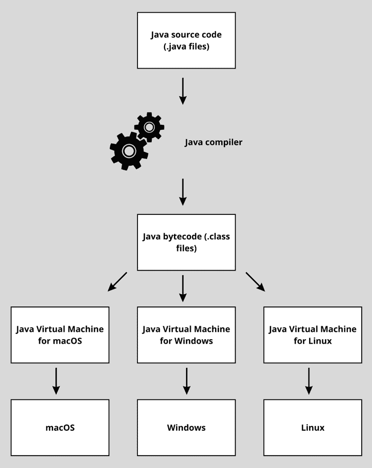

图 1.1 – 图解 WORA 原则

你可以看到编译器创建了字节码，并且这个字节码可以被 JVM 捕获。JVM 是平台特定的，并且将其翻译成它所在的平台。JVM 为我们做了更多的事情，那就是自动内存管理。让我们接下来探讨这一点。

## 自动内存管理

另一个使 Java 变得伟大的关键特性是其**自动内存管理**，它简化了开发并防止了常见的内存相关错误。Java 为你处理内存分配和垃圾回收。开发者不需要手动管理内存。

现在，这已经成为规则而不是例外。大多数其他现代语言也有自动内存管理。然而，了解自动内存管理意味着什么很重要。内存的分配和释放是自动完成的。这实际上简化了代码。没有只关注内存分配和释放的样板代码。这也导致内存相关错误更少。

让我们确保你理解内存分配和释放的含义。

### 内存分配

在代码中，你创建变量。有时，这些变量不是简单的值，而是具有许多数据字段的复杂对象。当你创建一个对象时，这个对象需要存储在运行它的设备内存中。这被称为 **内存分配**。在 Java 中，当你创建一个对象时，设备内存会自动分配以存储对象的属性和相关数据。这与 C 和 C++ 等语言不同，在这些语言中，开发者必须手动分配和释放内存。Java 的自动内存分配简化了开发过程，并减少了内存泄漏或悬挂指针的可能性，这些可能会导致意外的行为或崩溃。它还使代码更易于阅读，因为你不需要处理任何分配或释放代码。

### 垃圾回收

当内存块不再被应用程序使用时，它需要被释放。Java 用于此的过程称为 **垃圾回收**。垃圾回收是识别和回收程序不再使用的内存的过程。在 Java 中，当一个对象不再可访问或不再需要时，垃圾回收器会自动释放该对象占用的内存。这个过程确保内存得到有效利用，并防止内存泄漏及其相关问题。

JVM 定期运行垃圾回收器以识别和清理不可达的对象。Java 的垃圾回收机制使用许多不同的复杂算法来确定何时对象不再需要。

现在我们已经介绍了基础知识，接下来让我们继续学习如何安装 Java。

# 安装 Java

在你开始编写和运行 Java 程序之前，你需要在计算机上设置 JDK。JDK 包含 Java 开发所需的必需工具和库，例如 Java 编译器、JRE 以及其他有助于开发的实用工具。

我们将指导你如何在 Windows、macOS 和 Linux 上安装 Java，并为你提供一些在没有这些系统之一的情况下的一些建议。但在开始安装 Java 之前，检查系统是否已安装 Java 是一个好主意。

## 检查系统是否已安装 Java

Java 可能已经预装，或者你可能之前已经安装过，但没有意识到。要检查 Java 是否已安装，请按照以下简单步骤操作。第一步取决于你的操作系统。

### 第一步 – 打开终端

对于 Windows，按 *Windows* 键，输入 `cmd`，然后按 *Enter* 打开 **命令提示符**。

对于 macOS，按 *Command* + *Space* 打开 `终端`，然后按 *Enter* 打开 **终端**。

对于 Linux，打开终端窗口。打开终端窗口的方法取决于你的 Linux 发行版（例如，在 Ubuntu 中，按 *Ctrl* + *Alt* + *T*）。

### 第二步 – 检查 Java 版本

在命令提示符或终端窗口中，输入以下命令并按 *Enter*：

```java
java -version
```

### 步骤 3 – 解读响应

如果已安装 Java，您将看到显示的版本信息。如果没有安装，命令提示符将显示错误消息，指示 Java 不可识别或未找到。

如果您发现系统上已经安装了 Java，请确保它是 21 版本或更高版本，以确保与现代 Java 功能的兼容性。如果是较旧版本或未安装，请按照以下章节中描述的针对您特定平台的过程进行安装。如果已安装较旧版本，您可能希望首先卸载它，以避免设置过于复杂。您可以使用操作系统的常见程序卸载方式来安装它。

在 *图 1**.2* 和 *图 1**.6* 中，您将看到安装 Java 时可以预期的输出示例。

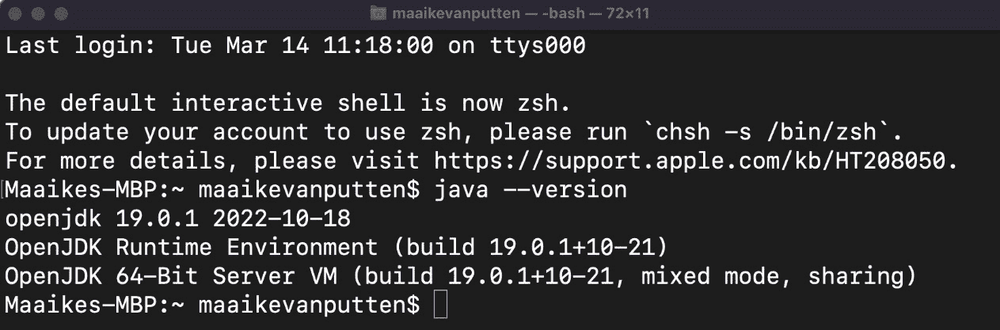

图 1.2 – 安装了 Java 19 的 macOS 终端输出

现在，让我们看看如何在每个操作系统上安装 Java。

## 在 Windows 上安装 Java

要在 Windows 操作系统上安装 Java，请按照以下步骤操作：

1.  访问 [`www.oracle.com/java/technologies/downloads/`](https://www.oracle.com/java/technologies/downloads/) 上的 **Oracle Java SE 下载** 页面。此软件可以免费用于教育目的，但在生产中需要许可证。您可以考虑切换到 **OpenJDK** 以在生产环境中运行程序而不需要许可证：[`openjdk.org/install/`](https://openjdk.org/install/)。

1.  选择适合您 Windows 操作系统的适当安装程序（例如，**Windows** **x64 安装程序**）。

1.  通过点击文件链接下载安装程序。

1.  运行下载的安装程序（`.exe` 文件）并按照屏幕上的说明完成安装。

1.  要将 Java 添加到系统的 `PATH` 环境变量中，在 **开始** 菜单中搜索 **环境变量** 并选择 **编辑系统环境变量**。您应该看到一个类似于 *图 1**.3* 的屏幕。

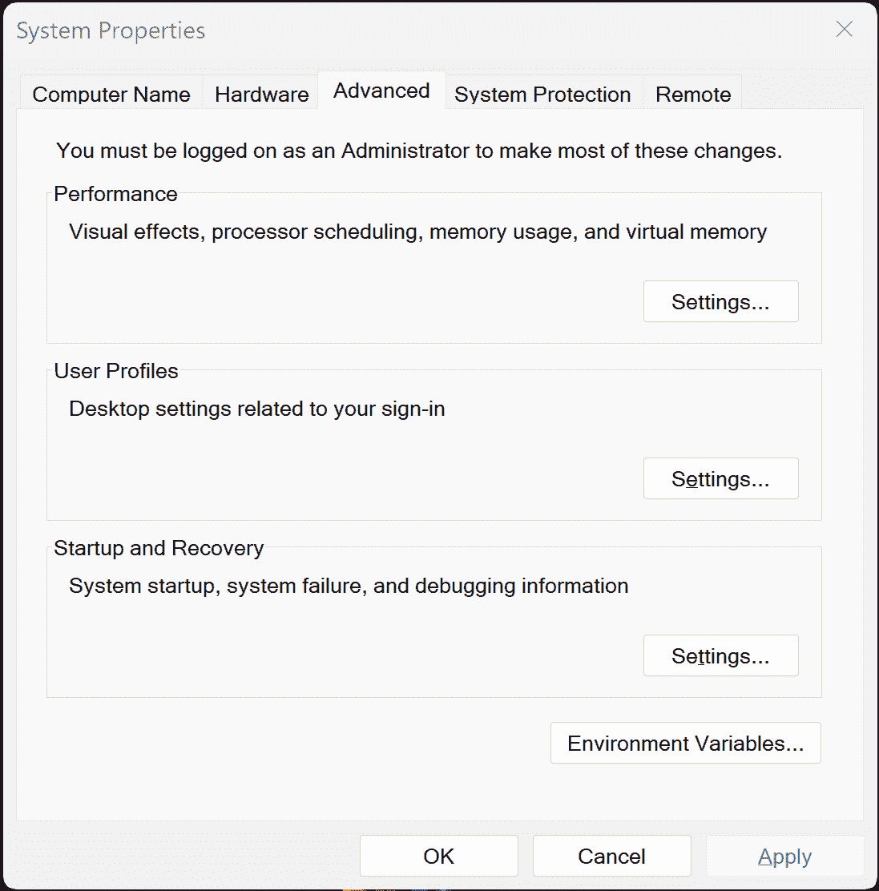

图 1.3 – 系统属性窗口

1.  在 **系统属性** 窗口中，点击 **环境变量…** 按钮。将弹出一个类似于 *图 1**.4* 的屏幕。

1.  在 **系统变量** 下，找到 **Path** 变量，选择它，然后点击 **编辑**。您可以在以下 *图 1**.4* 中看到一个选择示例：

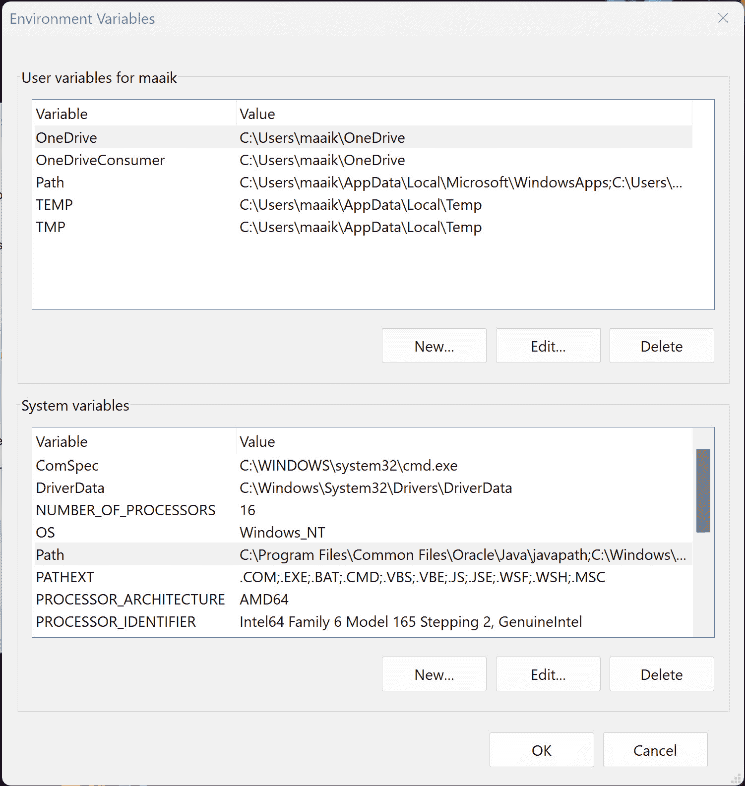

图 1.4 – 环境变量窗口

1.  点击 Java 安装目录下的 `bin` 文件夹（例如，`C:\Program Files\Java\jdk-21\bin`）。在 *图 1**.5* 中，这一步已经完成。

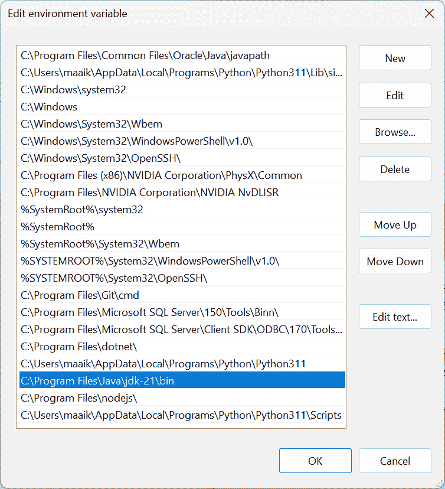

图 1.5 – 将 Java 路径添加到 Path 变量中

1.  点击 **确定** 保存更改并关闭 **环境变量** 窗口。

1.  通过打开命令提示符（如果已经打开，请重新打开）并输入以下内容来验证 Java 是否已安装：

    ```java
    java -version
    ```

1.  输出应该看起来像 *图 1**.6* 中所示的那样。然而，你的版本应该是 21 或更高，以跟上这本书中所有的代码片段！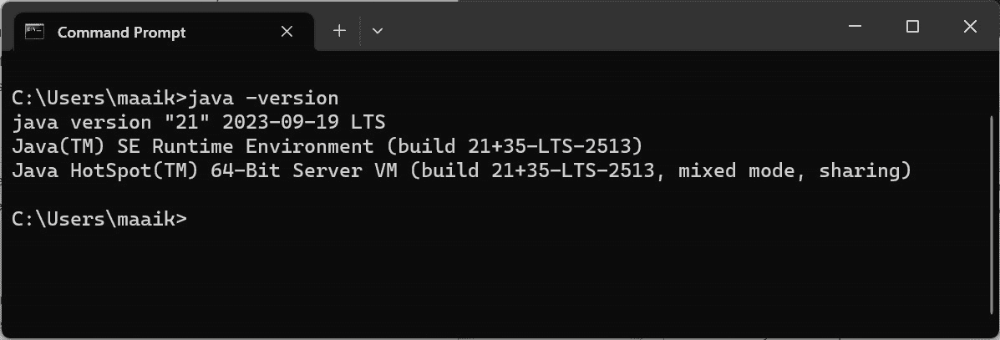

=

图 1.6 – 安装 Java 后检查 Java 版本后的命令提示符

## 在 macOS 上安装 Java

要在 macOS 操作系统上安装 Java，请按照以下步骤操作：

1.  访问 [`www.oracle.com/java/technologies/javase-jdk16-downloads.html`](https://www.oracle.com/java/technologies/javase-jdk16-downloads.html) 上的 **Oracle Java SE 下载** 页面。

1.  选择 macOS 安装程序（例如，**macOS** **x64 安装程序**）。

1.  通过点击文件链接下载安装程序。

1.  运行下载的安装程序（`.dmg` 文件）并按照屏幕上的说明完成安装。

1.  Java 应该自动添加到你的系统 `PATH` 环境变量中。为了验证安装，打开终端并运行以下命令：

    ```java
    java -version
    ```

1.  你应该能看到你刚刚安装的 Java 版本，类似于 *图 1**.2*。

## 在 Linux 上安装 Java

在 Linux 上安装可能需要几步才能解释清楚。不同的 Linux 发行版需要不同的安装步骤。在这里，我们将看看如何在 Linux Ubuntu 系统上安装 Java：

1.  打开 **终端** 并通过运行以下命令更新你的软件包仓库：

    ```java
    sudo apt-get update
    ```

1.  通过运行以下命令安装默认的 JDK 软件包：

    ```java
    sudo apt install default-jdk
    ```

1.  为了验证安装，运行 `java -version` 命令。你应该能看到你刚刚安装的 Java 版本。

1.  如果你需要设置 `JAVA_HOME` 环境变量（你不需要通过这本书的工作方式来完成，但你需要为更复杂的 Java 项目做这个），你首先需要通过运行以下命令确定安装路径：

    ```java
    sudo update-alternatives --config java
    ```

1.  记下显示的路径（例如，`/usr/lib/jvm/java-19-openjdk-amd64/bin/java`）。

1.  使用具有 root 权限的文本编辑器打开 `/etc/environment` 文件：

    ```java
    sudo nano /etc/environment
    ```

1.  在文件的末尾添加以下行，将路径替换为你在 *步骤 4* 中记录的路径（不包括 `/``bin/java` 部分）：

    ```java
    JAVA_HOME="/usr/lib/jvm/java-19-openjdk-amd64"
    ```

1.  保存并关闭文件。然后，运行以下命令以应用更改：

    ```java
    source /etc/environment
    ```

现在，Java 应该已经安装并配置在你的 Linux 操作系统上了。

## 在线运行 Java

如果你没有访问 macOS、Linux 或 Windows 计算机的权限，网上有一些解决方案。免费选项可能不是完美的，但例如，尝试在浏览器中运行 Java 的 **w3schools** 解决方案并不差。网上有很多这样的解决方案。

为了处理多个文件，可能有一些免费工具可用，但大多数都是付费的。我们目前推荐的一个免费工具是 [replit.com](http://replit.com)。你可以在这里找到它：[`replit.com/languages/java`](https://replit.com/languages/java)。

你需要注册，但你可以免费使用多个文件并将它们保存在你的账户上。如果你例如只有平板电脑来跟随这本书，这是一个很好的替代方案。

另一个选择是使用 GitHub Codespaces：[`github.com/codespaces`](https://github.com/codespaces)。他们有机会进入一个仓库（例如我们用于这本书的仓库）并直接尝试仓库中可用的示例，并调整它们来尝试新事物。

在导航完 Java 的安装后，现在是时候讨论编译和运行程序了。

# 编写我们的第一个程序

在深入编译和运行 Java 程序的过程之前，让我们使用基本的文本编辑器创建一个简单的 Java 程序。这将帮助你理解 Java 程序的结构以及如何编写和保存 Java 源代码文件。在这个例子中，我们将创建一个 **“Hello world！”程序**，用于演示编译和执行的过程。

## Hello world

你可能已经听说过向控制台输出 `"Hello world!"`。编写这个程序将帮助你获得对 Java 语法的基本理解，并且它将帮助你熟悉编写、编译和运行 Java 代码的过程。

## 创建程序的步骤

好的，让我们开始编码。以下是步骤：

1.  首先，在你的电脑上打开一个基本的文本编辑器。Windows 上的 **记事本**、macOS 上的 **文本编辑器** 或 Linux 上的 **Gedit** 都是合适的选择。

1.  在你的文本编辑器中写下以下 Java 代码：

    ```java
    public class HelloWorld {    public static void main(String[] args) {        System.out.println("Hello world!");    }}
    ```

1.  将文件保存为 `HelloWorld.java` 到你选择的目录中。保存文件时不要忘记 `.java` 扩展名。这表示文件包含 Java 源代码。代码不应该在 `.java` 后面有 `.txt`。在 Windows 中有时会发生这种情况，所以请确保不要在文件类型下拉菜单中选择文本文件。

TextEdit – 文件扩展名问题

macOS 的较新版本与 **TextEdit** 有点问题。默认情况下，你不能将其保存为 Java 文件。为了启用此功能，你需要转到 **格式** | **制作纯文本** 并选择 **UTF-8**。

在此之后，你可以将其保存为 `.java` 文件。你可能仍然会遇到编码错误；问题在于编码，修复它可能需要很多努力，但可能会错过这个练习的目标。可能更好的是，从我们的 GitHub 仓库下载 `HelloWorld.java` 文件。

## 理解程序

让我们看看我们刚刚使用的代码。首先，请注意，这是 *区分大小写的*。这意味着当你查看代码时，如果你混淆了大小写，大多数事情可能不会像你预期的那样工作。

首先，我们创建了一个名为`HelloWorld`的类，其中包含一个`main`方法。当然，我们还会更详细地介绍类和方法。但类是 Java 应用程序的基本构建块，它可以包含方法。方法可以被执行以执行某些操作——*操作*是指执行语句。

`main`方法是一个特殊的方法。它是我们的 Java 程序的入口点，包含当程序运行时将被执行的代码。带有`System.out.println("Hello world!");`的行将`Hello world!`消息写入控制台。请注意，`println`代表打印行，所以它使用小写的*L*，而不是大写的*i*。

在保存了`HelloWorld.java`文件之后，我们现在可以继续到下一节，我们将学习如何使用命令行和 IDE 编译和运行 Java 程序。

# 编译和运行 Java 程序

现在我们已经编写了第一个程序，让我们讨论如何编译和运行它。我们将涵盖编译过程的基础、JVM 的作用以及如何使用命令行和 IDE 编译和运行 Java 代码。

## 理解编译过程

源代码是用 Java 编程语言编写的可读格式。至少，我们希望在这本书之后，这也是你的观点。在代码可以执行之前，它必须转换成计算机可以理解的格式。你已经知道 Java 是一种编译型语言，这个过程被称为编译。

在编译过程中，`.java`文件被转换成字节码（`.class`文件）。一旦生成了字节码，它就可以由 JVM 执行。我们已经了解到 JVM 是字节码执行器，并且每个平台都有自己的定制 JVM，这实现了 Java 的 WORA 特性。

## 使用命令行上的 javac 编译代码

要使用命令行编译 Java 程序，请按照以下步骤操作：

1.  打开终端（Windows 上的命令提示符，macOS 或 Linux 上的终端）。

1.  导航到包含你的 Java 源代码文件的目录（例如，你之前创建的`HelloWorld.java`文件的目录）。如果你不知道如何操作，可以使用`cd`命令，它代表*更改目录*。例如，如果我在一个名为`documents`的目录中，我想进入名为`java programs`的子文件夹，我会运行`cd "java programs"`命令。引号只在目录名中有空格时需要。本书的范围不涉及解释如何在任何平台上更改目录。互联网上有许多关于如何使用命令行在各个平台上导航文件夹结构的优秀解释。

1.  一旦你进入了包含 Java 文件的文件夹，请输入以下命令来编译 Java 源代码：

    ```java
    javac HelloWorld.java
    ```

    如果编译成功，将在同一目录下创建一个具有相同名称但`.class`扩展名的新文件（例如，`HelloWorld.class`）。这个文件包含可以被 JVM 执行的字节码。

让我们看看如何运行这段编译后的代码。

## 在命令行上使用 Java 运行编译后的代码

要运行编译后的 Java 程序，请按照以下步骤操作：

1.  在终端中，确保你仍然位于包含`.class`文件的目录中。

1.  输入以下命令以执行字节码：

    ```java
    java HelloWorld
    ```

JVM 将加载并运行字节码，你应该能看到程序的输出。在这种情况下，输出如下：

```java
Hello world!
```

我们可以在记事本中编写 Java 代码并在命令行中运行它，这确实很酷，但现代 Java 开发者的生活要舒适得多。让我们把 IDE 加入进来，亲自看看。

# 使用 IDE 进行工作

在文本编辑器中创建文件有点过时了。当然，你仍然可以这样操作——这实际上是一个成为杰出程序员的极好方法，但也是一个非常令人沮丧的方法。有一些工具可以帮助我们完成大量繁重的工作，并在编写代码时提供协助。这些工具被称为集成开发环境（IDE）。

## 什么是 IDE？

集成开发环境（IDE）是一个软件应用程序，它包含了编写、编译、运行和测试代码所需的一切。使用 IDE 可以使开发各种程序变得更加容易。不仅如此，调试和管理代码也更加方便。相对而言，你可以将 IDE 比作我写这本书时使用的 Microsoft Office Word。虽然我可以用记事本写，但使用 Word 提供了显著的优势。它可以帮助检查拼写错误，并允许我轻松添加和可视化布局，以及其他有用的功能。这个类比描绘了 IDE 不仅仅提供了一个编写代码的平台，还提供了一套工具来简化和增强你的编码体验。

## 选择 IDE

在 Java 开发中，有几种 IDE 可供选择，每种都有其独特的功能和能力。在本节中，我们将讨论选择 IDE 时需要考虑的因素，并帮助你设置一些流行的 Java IDE。在整个书中，我们将使用**IntelliJ**。其他同样出色的选择包括**VS Code**和**Eclipse**。

### 选择 IDE 时需要考虑的因素

大多数现代 IDE 都具有代码补全、调试、版本控制集成以及支持第三方工具和框架等功能。其中一些在这方面比其他 IDE 做得更好。在选择或切换 IDE 时，比较和对比你偏好的功能。

一些 IDE 需要更强大的系统来运行，而其他 IDE 则较轻量。例如，VS Code 相对轻量，而 IntelliJ 则相对重量级。此外，VS Code 可以用于多种语言，包括 Java。使用 IntelliJ 进行非 Java 开发的其他事情相对较少。选择一个在功能和性能之间提供平衡的 IDE，尤其是如果您系统资源有限的话。

当然，您偏好的 IDE 可能不适合您所使用的平台。请确保它适用于您的系统，并且稳定可靠。

最后，非常重要的一点是，考虑成本。一些 IDE 是免费的，而其他 IDE 则需要付费许可证。幸运的是，许多需要付费许可证的 IDE 都提供了非商业用途的免费版。因此，在选择 IDE 时，请确保考虑您的预算和所需的许可证。

在接下来的子节中，我们将向您介绍设置当前（目前）最常用的三个 Java 开发 IDE 的步骤：

+   IntelliJ

+   Eclipse

+   Visual Studio Code

注意

在本书的剩余部分，我们将使用 IntelliJ。

### 设置 IntelliJ

那么，让我们从它开始。IntelliJ IDEA 是由 **JetBrains** 开发的一款流行的 Java 集成开发环境（IDE）。它提供免费 **社区版** 和付费 **专业版**。它提供了一系列功能，包括智能代码补全、调试工具、版本控制集成以及支持各种 Java 框架。

下面是安装 IntelliJ 的步骤：

1.  访问 IntelliJ IDEA 下载页面，请点击[`www.jetbrains.com/idea/download/`](https://www.jetbrains.com/idea/download/)。

1.  选择您偏好的版本：免费的 **社区版** 或付费的 **专业版**。对于初学者来说，社区版已经非常优秀了。

1.  下载适用于您操作系统的安装程序（Windows、macOS 或 Linux）。

1.  运行安装程序，并按照说明完成安装。

1.  启动 **IntelliJ IDEA**。如果您使用的是专业版，您可能需要输入您的 JetBrains 账户凭证或许可证密钥。

1.  在 **欢迎** 界面中，您可以创建一个新的 **项目**、导入现有的 **项目**，或探索可用的教程和文档。

### 设置 Eclipse

Eclipse 是一个免费的开源 Java 集成开发环境（IDE），在 Java 社区中广泛使用。它已经存在很长时间了，并且许多公司仍在使用它。它提供了各种功能，就像 IntelliJ 一样。Eclipse 可以根据您的需求进行定制，但其界面可能不如其他 IDE 直观。

要设置 Eclipse，请按照以下步骤操作：

1.  访问 Eclipse 下载页面，请点击[`www.eclipse.org/downloads/`](https://www.eclipse.org/downloads/)。

1.  下载适用于您操作系统的 Eclipse 安装程序（Windows、macOS 或 Linux）。

1.  运行安装程序，并从可用包列表中选择 **Eclipse IDE for Java Developers**。

1.  选择安装文件夹，并按照说明完成安装。

1.  启动 **Eclipse** 并选择工作区目录。你的项目和设置将存储在这里。

1.  在 **欢迎** 界面中，您可以创建一个新的 Java **项目**，导入现有的 **项目**，或探索可用的教程和文档。

### 设置 Visual Studio Code

Visual Studio Code，通常简称为 VS Code，是由微软开发的一个轻量级、免费且开源的代码编辑器。它因其支持广泛的编程语言而受到各种任务的欢迎。它是那些更喜欢更简约和快速性能环境的开发者的首选。可以通过扩展添加各种功能。

这里是安装 VS Code 并为其 Java 开发做准备的分步指南：

1.  访问 Visual Studio Code 下载页面 **https://code.visualstudio.com/download**。

1.  下载适用于您操作系统的安装程序（Windows、macOS 或 Linux）。

1.  运行安装程序，按照屏幕上的说明完成安装。

1.  启动 Visual Studio Code。

1.  通过点击窗口左侧的 *扩展* 图标（四个方块）打开 **扩展** 视图。

1.  在 *扩展市场* 中搜索 **Java 扩展包** 并点击 **安装** 按钮。此扩展包包括各种用于 Java 开发的扩展，例如 **Red Hat 提供的 Java (TM) 语言支持**、**Java 调试器** 和 **Java 的 Maven**。

1.  安装了 **Java 扩展包** 后，您现在可以创建或导入 Java 项目。如果它没有直接加载，您可能需要重新打开 VS Code。

现在您已经设置了一个 IDE，让我们用它来创建和运行一个程序。

# 使用 IDE 创建和运行程序

与使用纯文本编辑器相比，使用 IDE（如 IntelliJ）工作要容易得多。现在我们将指导您使用 IntelliJ 创建、运行和调试程序。我们将创建与使用文本编辑器时相同的程序。

## 在 IDE 中创建程序

当你使用 IDE 编写代码时，你会看到它不断地帮助你完成代码。大多数人认为这非常有帮助，我们希望您也会喜欢这个功能。

为了开始使用 IntelliJ，我们首先需要创建一个项目。以下是再次创建我们的 `Hello World` 程序的步骤：

1.  启动 IntelliJ IDEA 并从 **欢迎** 界面点击 **新建项目**，或转到 **文件** | **新建** | **项目**。

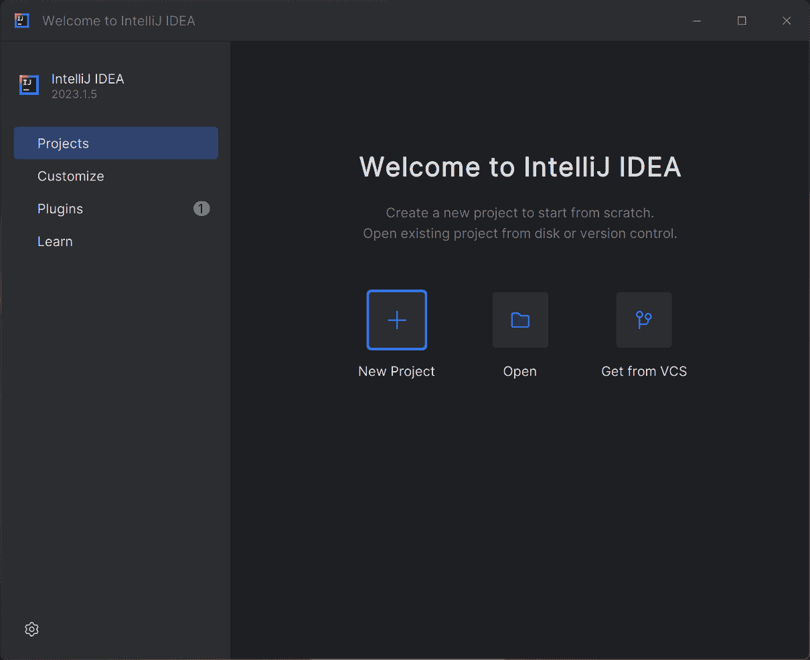

图 1.7 – IntelliJ 的初始屏幕

1.  将项目命名为 `HelloWorld`。

1.  选择**Java**作为语言，并确保已选择正确的项目 SDK。点击**下一步**。

1.  不要勾选**创建 Git 仓库**复选框，也不要勾选**添加示例** **代码**复选框。

1.  点击 **创建** 以创建项目。

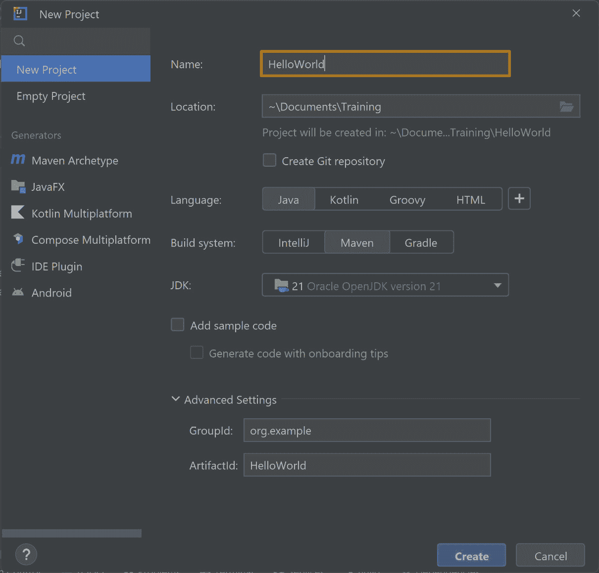

图 1.8 – 创建新项目的向导

1.  一旦创建了项目，展开 `src` 文件夹中的 `src` 文件夹，并选择 **新建** | **Java 类**。如果其下有另一个文件夹，那么可能有一个包含 Java 文件夹的主文件夹。右键单击 Java 文件夹并选择 **新建** | **Java 类**。如果名称不同，只需右键单击蓝色文件夹。

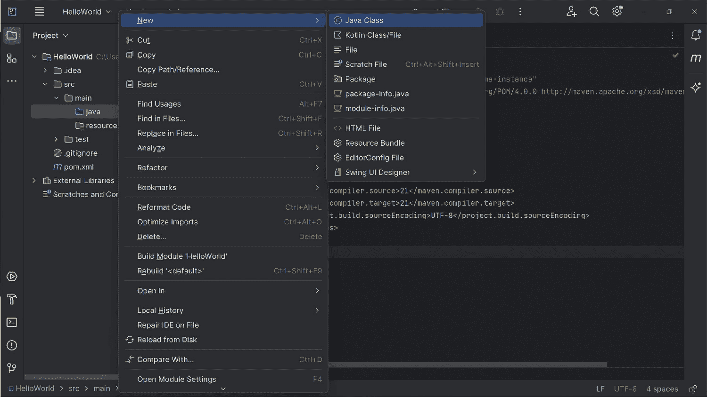

图 1.9 – 创建新的 Java 类

1.  将新类命名为 `HelloWorld` 并单击带有类定义的 `.java` 文件。

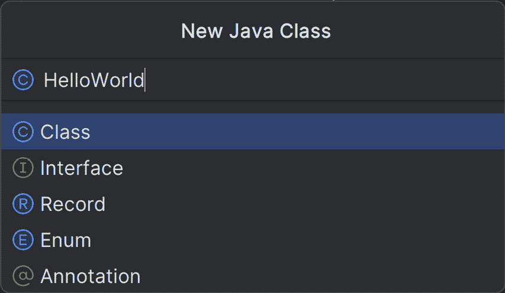

图 1.10 – 调用类 “HelloWorld”

1.  在 `HelloWorld` 类中编写我们的 `main` 方法：

    ```java
    public class HelloWorld {    public static void main(String[] args) {        System.out.println("Hello world!");    }}
    ```


图 1.11 – HelloWorld.java 中的代码

既然我们已经编写了第一个程序，请确保它已保存。默认情况下，IntelliJ 会自动保存我们的文件。让我们看看我们是否也能运行这个程序。

## 运行程序

虽然我们创建程序时不得不采取一些额外步骤，首先需要创建一个项目。好消息是，运行程序更容易！以下是操作方法：

1.  如果您还没有这样做，请通过按 *Ctrl* + *S*（Windows/Linux）或 *Cmd* + *S*（macOS）确保保存您的更改。默认情况下，自动保存已启用。

1.  要运行程序，请右键单击 `HelloWorld` 类中的任何位置，并选择 `Run 'HelloWorld.main()'`。或者，您也可以单击主方法旁边的绿色三角形图标，并选择 `Run 'HelloWorld.main()'`。IntelliJ 将编译并运行程序。

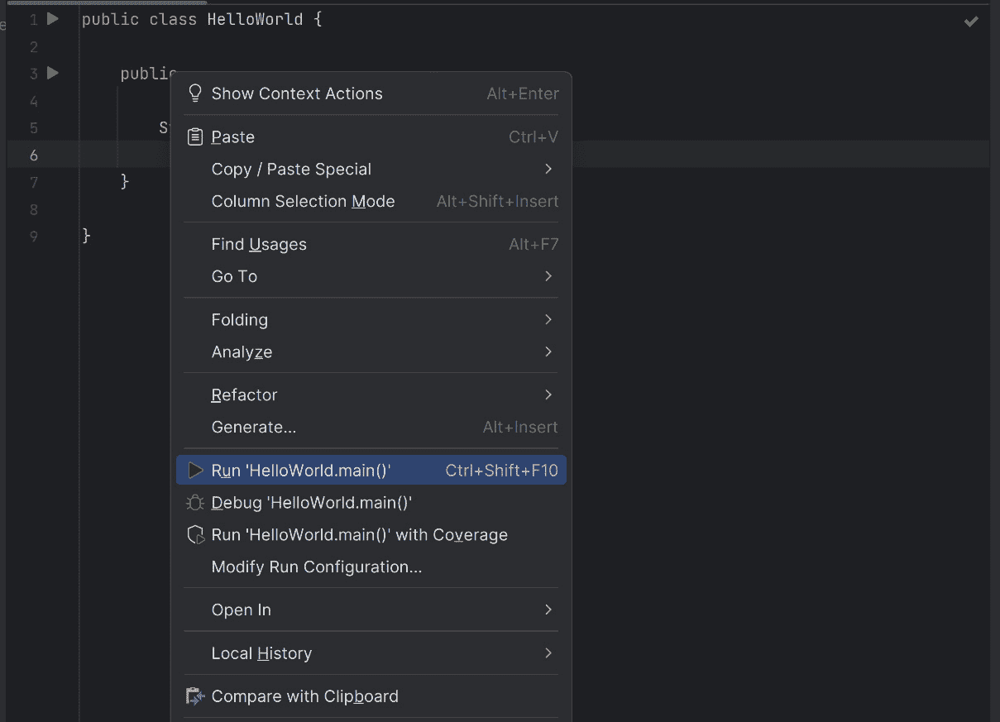

图 1.12 – 运行程序

1.  验证程序输出 `"Hello world!"` 是否显示在屏幕底部的 **运行工具** 窗口中。

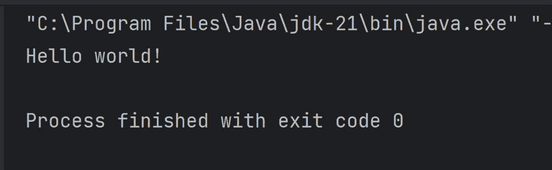

图 1.13 – 程序的输出

已保存和未保存的文件

在大多数集成开发环境（IDE）中，你可以通过查看打开文件的标签来了解文件是否已保存。如果文件未保存，其旁边会有一个点或星号。如果已保存，则点会缺失。

## 程序调试

我们现在的程序相当简单，但我们可能想逐行逐步执行程序。我们可以通过调试程序来实现这一点。让我们给我们的文件添加一些额外的调试内容。这样我们可以看到如何检查变量、理解执行流程，以及这样找到我们代码中的缺陷：

1.  使用以下代码更新 `HelloWorld.java` 文件：

    ```java
    public class HelloWorld {    public static void main(String[] args) {        String greeting = "Hello, World!";        System.out.println(greeting);        int number = 5;        int doubled = doubleNumber(number);        System.out.println("The doubled number is: " +          doubled);    }    public static int doubleNumber(int input) {        return input * 2;    }}
    ```

1.  在这个程序的更新版本中，我们添加了一个名为 `doubleNumber` 的新方法，它接受一个整数作为输入并返回其两倍。在 `main` 方法中，我们调用此方法并打印结果。如果您不完全理解这一点，请不要担心——我们只是想向您展示如何逐步执行您的代码。

1.  通过按 *Ctrl* + *S*（Windows/Linux）或 *Cmd* + *S*（macOS）保存您的更改。

    现在，让我们调试更新后的程序。

1.  通过在编辑器中行号旁边的空白区域单击来在你想暂停执行的行上设置断点。会出现一个红色圆点，表示断点。例如，在行`int doubled = doubleNumber(number);`上设置断点。例如，请参阅*图 1.7*。

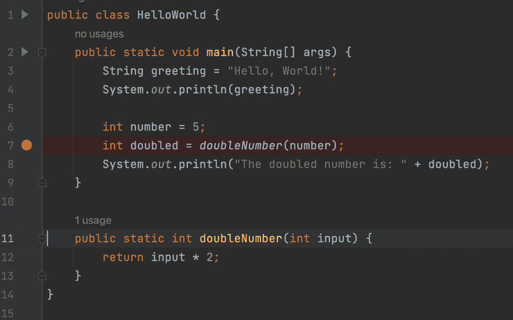

图 1.14 – 在第 7 行添加断点

1.  通过在`HelloWorld`类上右键单击并选择`Debug 'HelloWorld.main()'`或点击`main`方法旁边的绿色播放图标并选择**调试**选项来启动调试器。IntelliJ 将编译并以调试模式启动程序。

1.  当即将执行带有断点的行时，程序将暂停。在暂停期间，你可以使用位于屏幕底部的**调试**工具窗口。在这里，你可以查看程序的状态，包括局部变量和字段的值。例如，请参阅*图 1.8*。

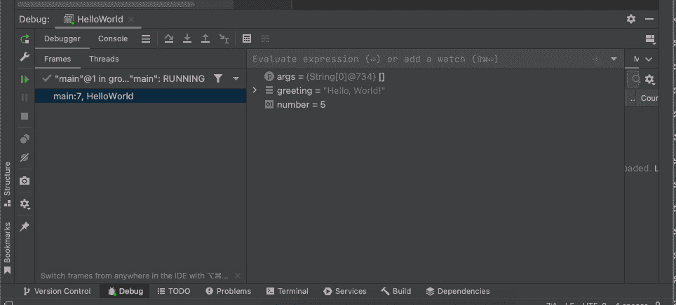

图 1.15 – IntelliJ 中的调试工具窗口。此截图的目的是显示布局，不需要考虑文本可读性。

1.  使用**调试**工具窗口中的步骤控件来逐步执行代码（*图 1.8*中的蓝色箭头带有角度），进入被调用的方法（蓝色箭头向下），或继续执行（*图 1.8*中左侧的绿色箭头）。

通过遵循这些步骤，你可以使用 IntelliJ IDEA 调试 Java 程序并逐步执行代码以查看正在发生的事情。这将在理解你的代码中派上用场。这个过程在其他 Java IDE 中也将类似，尽管具体的步骤和界面元素可能会有所不同。

# 练习

这就是本章的所有理论！所以，卷起袖子，让我们开始你的中生代伊甸园的第一天。欢迎加入！中生代伊甸园是一个著名的动物园，那里的恐龙是通过高端基因操控技术被带到这里生活的。以下是一些练习，以测试你到目前为止的知识：

1.  你的第一个任务涉及欢迎我们的客人。修改以下代码片段，使其输出`"Welcome to" "Mesozoic Eden"`：

    ```java
    public class Main {    public static void main(String[] args) {        System.out.println("Hello world");    }}
    ```

1.  通过填写空白处完成以下程序，以便打印出你希望在 5 年后的中生代伊甸园拥有的名字和职位：

    ```java
    public class Main {    public static void main(String[] args) {        __________________________;        String position = "Park Manager";        System.out.println("My name is " + name + "          and I want to be a " ______ " in Mesozoic            Eden.");    }}
    ```

1.  我们收到了一些关于开放时间的问题。完成以下程序，以便打印出公园的开放和关闭时间：

    ```java
    public class Main {    public static void main(String[] args) {        String openingHours = "08:00";        String closingHours = "20:00";    }}
    ```

1.  创建一个名为`dinosaur`的 Java 项目。你可以通过在`src/main/java`文件夹上右键单击，选择“新建”并选择“包”来创建一个包。

1.  修改练习 1 中的代码，使其打印出`"Welcome, [YourName] to Mesozoic Eden!"`，其中`[YourName]`将被惊喜惊喜地替换为你的名字。加分项：尝试创建一个单独的 String 变量，如第二和第三练习所示。

1.  一些游客报告说在霸王龙附近感到不安全。让我们通过在练习 5 的程序中添加另一个`System.out.println`来解决这一问题。它应在欢迎信息后打印短语`"Mesozoic Eden is safe and secure."`。

# 项目

创建一个程序，模拟 Mesozoic Eden 入口处的标志。这个标志通过向控制台打印输出进行模拟。标志应显示欢迎信息、营业时间和简短的安全信息。

# 摘要

你已经完成了第一章！我们已经做了很多。我们首先探索了 Java 的关键特性，例如它的 OOP 方法、（曾经独特的）WORA 原则、它的编译性质以及超级有用的自动内存管理。这些特性使 Java 成为一个极其灵活且强大的语言——是不同编程任务（如 Web 开发、桌面应用、移动应用等等）的一个很好的选择！

接下来，我们向您介绍了在 Windows、macOS 和 Linux 等平台上安装 Java 的过程。我们还讨论了如何检查 Java 是否已经安装在你的系统上。在这一部分之后，你可以确信你已经拥有了启动 Java 编程冒险的所有必需工具。

在你设置好 Java 之后，我们解密了编译过程，并介绍了 JVM，它是 Java 生态系统的一个关键组件，使得 Java 代码具有可移植性。然后我们演示了如何使用`javac`和`java`命令行工具编译和运行 Java 代码。这些工具为使用 Java 程序的核心工作奠定了基础。

当然，使用命令行来做这个很好。但如今，我们更经常使用 IDE，我们只需按一个按钮就可以完成所有这些。因此，我们提到了使用 IDE 的一些优点和良好特性，例如代码补全、调试和项目管理。我们讨论了在选择 IDE 时需要权衡的因素，并提供了设置流行的 IDE（如 IntelliJ IDEA、Eclipse 和 VS Code）的指导。在这本书中，我们将使用 IntelliJ 作为示例。

在介绍了 IDE 的基础知识之后，我们深入探讨了使用 IDE 创建和运行 Java 程序的过程。我们解释了典型 Java 程序的结构，并逐步引导你创建、运行和调试你的第一个 Java 程序。

在此之后，你准备好进行第一个实战项目了。现在你在这里！一切准备就绪，准备在 Java 之旅上迈出下一步。这一步将是处理变量和基本数据类型。祝你好运！
