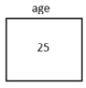
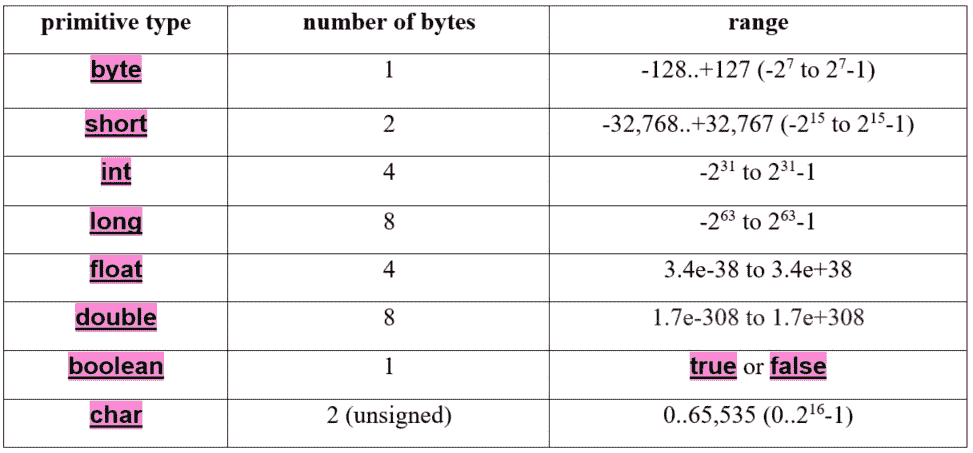

# 第二章：变量和原始数据类型

在*第一章*中，我们介绍了编译器和 JVM。当我们编写第一个 Java 程序*HelloWorld*时，我们学习了如何从命令行使用它们。我们还介绍了**IntelliJ**，一个强大且友好的 IDE，并且也从那里运行了*HelloWorld*。

所有编程语言都需要变量并提供内置的原始数据类型。它们是甚至最简单程序操作的基础。在本章结束时，你将能够使用 Java 的原始数据类型声明变量。此外，你将了解不同原始数据类型之间的区别以及在特定情况下应使用哪些类型。

在本章中，我们将涵盖以下主要主题：

+   理解和声明变量

+   探索 Java 的原始数据类型

# 技术要求

本章的代码可以在 GitHub 上找到，网址为[`github.com/PacktPublishing/Learn-Java-with-Projects/tree/main/ch2`](https://github.com/PacktPublishing/Learn-Java-with-Projects/tree/main/ch2)。

# 理解和声明变量

如果你想要存储一个用于以后使用的值，你需要一个变量。因此，每种编程语言都通过变量提供这个功能。在本节中，我们将学习什么是变量以及如何声明它。你可以在代码中使用的特定变量的区域称为变量的*作用域*。这是一个非常重要的概念，将在*第四章*中详细讨论。

## 什么是变量？

变量是内存中的位置，具有一个*名称*（称为标识符）和一个*类型*。它们类似于带名称的鸽巢或邮政信箱（参见*图 2.1*）。变量的名称是必需的，这样我们才能引用变量并将其与其他变量区分开来。

变量的*类型*指定它可以存储/保留的值的类型。例如，变量是用来存储像 4 这样的整数还是像 2.98 这样的十进制数？对这个问题的回答决定了变量的*类型*。

## 声明变量

假设我们想要将数字 25 存储在一个变量中。我们将假设这个数字代表一个人的年龄，因此我们将使用`age`标识符来引用它。第一次引入变量被称为“声明”变量。

一个整数（正数或负数）是一个整数，Java 提供了一个专门用于整数的内置原始类型，称为`int`。我们将在下一节中更详细地讨论原始数据类型。在 Java 中声明变量时，我们必须指定变量的类型。这是因为 Java 被称为*强类型*语言，这意味着你必须立即在声明变量时指定它的类型。

让我们声明一个变量，给它一个类型，并初始化它：

```java
int age;age = 25;
```

第一行将`age`声明为`int`，第二行将其赋值为`25`。

注意，行尾的分号（`;`）是分隔符，告诉编译器 Java 语句在哪里结束。等号（`=`）是赋值运算符，将在*第三章*中介绍。现在，只需明白`25`被“赋值给”`age`变量。

赋值运算符

Java 中的`=`符号与数学中的等于符号（=）不同。Java 使用`==`符号表示等于，这被称为等价。

我们可以将前面的两行代码写在一行中：

```java
int age = 25;
```

*图 2**.1*显示了这两个代码段的内存表示：



图 2.1 – 命名为 age 的整型变量，其值为 25

如*图 2**.1*所示，**age**是变量的名称，**25**是存储在变量*位置*中的整数值。

## 变量命名

标识符只是你给正在编写的 Java 结构起的名字；例如，命名变量、方法、类等都需要标识符（名称）。

标识符

标识符由字母、数字、下划线和货币符号组成。标识符不能以数字开头，也不能包含空白（空格、制表符和换行符）。在以下示例中，逗号分隔了不同的标识符。

一些不寻常但*有效*的标识符示例有 `a£€_23`, `_29`, `Z`, `thisIsAnExampleOfAVeryLongVariableName`, `€2_`, 和 `$``4 ;`.

*无效*的标识符示例有`9age`和`abc def;`.

仔细命名你的变量。这有助于使代码更易读，从而减少错误并便于维护。*驼峰式命名法*在这方面非常流行。关于变量名，驼峰式命名法意味着*所有*第一个单词都是小写。此外，变量名中每个后续单词的第一个字母都是大写字母。以下是一个例子：

```java
int ageOfCar;int numberOfChildren;
```

在这个代码段中，我们有两个整数变量，它们的名称/标识符遵循驼峰式命名法。

## 访问变量

要访问变量的值，只需输入变量的名称。当我们输入 Java 中的变量名称时，编译器将首先确保存在具有该名称的变量。假设存在，JVM 将在运行时返回该变量的*内部值*。因此，以下代码将在屏幕上输出`25`：

```java
int age = 25;System.out.println(age);
```

第一行声明了`age`变量并将其初始化为`25`。第二行访问变量的位置并输出其值。

System.out.println()

`System.out.println()`在屏幕上显示括号`()`内的任何内容。

## 访问未声明的变量

如前所述，Java 是一种*强类型*语言。这意味着你必须在声明变量时立即指定其类型。如果编译器遇到一个变量而不知道其类型，它将生成错误。例如，考虑以下代码行：

```java
age = 25;
```

假设没有其他代码声明 `age`，编译器将生成一个错误，指出 `cannot resolve symbol 'age'`。这是因为编译器正在寻找与 `age` 关联的 *类型*，但它找不到它（因为我们没有指定类型）。

这里有一个稍微不同的例子。在这个例子中，我们试图将 `age` 变量输出到屏幕上：

```java
        int length = 25;        System.out.println(age);
```

在这个例子中，我们声明了一个名为 `length` 的变量，因此没有声明 `age`。当我们尝试在 `System.out.println()` 中访问 `age` 变量时，编译器会寻找 `age`。编译器找不到 `age` 并生成一个错误，指出 `cannot resolve symbol 'age'`。实际上，编译器所说的是我们尝试使用编译器找不到的名为 `age` 的变量。这是因为我们甚至没有声明该变量，更不用说指定其类型了。

注释

注释非常有用，因为它们帮助我们解释代码中的内容。

`//` 是单行注释。当编译器看到 `//` 时，它会忽略该行剩余的部分。

.`/* some text */` 是多行注释。在 `/*` 开头和 `*/` 结尾之间的任何内容都被忽略。这种格式可以节省在每个行首插入 `//`。

这里有一些例子：

`int age; // from here to the rest of the line` `is ignored`

`// this whole line` `is ignored`

`/*` `all`

`of`

`these lines`

`are`

`ignored */`

由于 Java 作为一种强类型语言，要求所有变量都有数据类型，我们将现在讨论 Java 对原始数据类型的支持。

# 理解 Java 的原始数据类型

Java 提供了八个内置数据类型。内置意味着这些数据类型与语言一起提供。这些原始数据类型是本节的主题。

## Java 的原始数据类型

所有的原始数据类型都只使用小写字母命名；例如，`int` 和 `double`。当我们稍后创建自己的数据类型，即类、记录和接口时，我们将遵循不同的命名约定。例如，我们可能有一个名为 `Person` 或 `Cat` 的类。这只是一个广泛采用的编码约定，编译器不会区分命名约定。然而，很容易识别任何原始数据类型，因为它们总是只使用小写字母。在我们讨论原始数据类型本身之前，有一些重要的事项需要说明。

### 数字原始数据类型是有符号的

在 Java 中，所有数字原始数据类型都表示为一系列位。此外，它们也是有符号的。最高有效位（最左边的位）用于表示符号；1 表示负数，0 表示正数。

整数字面量

文字值是在键盘上键入的值（与计算值相对）。整数文字可以用不同的数制表示：十进制（基数 10）、十六进制（基数 16）、八进制（基数 8）和二进制（基数 2）。然而，十进制是使用最广泛的表示方式并不令人惊讶。为了信息目的，以下所有声明都表示十进制数字 10：

`int a = 10; // 十进制，默认`

`int b = 0b1010; // 二进制，以 0b 或 0B 开头`

`int c = 012; // 八进制，以 0 开头`

`int d = 0xa; // 十六进制，以 0x 或 0X 开头`

### 符号位影响范围

符号位的存在意味着 `byte` 的范围是 -27 到 27-1（-128 到 +127，包括 +127）。正数范围内的 -1 是为了允许在 Java 中 0 被视为正数的事实。在任何范围内都没有一个更少的正数。例如，对于 `byte`，你有 128 个负数（-1 到 -128）和 128 个正数（0 到 +127），结果有 256 种表示（2⁸）。为了通过一个简单的例子来强调这一点，-1 到 -8 是 8 个数字，0 到 7（包括 0）也是 8 个数字。

讨论了这些观点后，让我们来看看各种原始类型。*表 2.1* 列出了八个原始数据类型、它们的字节大小和它们的范围（所有这些都是包括在内的）：



表 2.1 – Java 的原始类型

下面是从前面表格中的一些有趣的观点：

+   `byte`、`short`、`char`、`int` 和 `long` 被称为 *整型* 类型，因为它们具有整数值（整数，正数或负数）。例如，-8、17 和 625 都是整数。

+   `char` 用于字符 – 例如 `a`，‘b’，‘？’ 和 ‘+’。注意字符被单引号包围。在代码中，`char c = 'a';` 表示变量 `c` 代表字母 `a`。由于计算机最终将所有字符（在键盘上）作为内部数字（二进制）存储，我们需要一个编码系统来将字符映射到数字，反之亦然。Java 使用 Unicode 编码标准，它确保每个字符都有一个唯一的数字，无论平台、语言、脚本等。这就是为什么 `char` 使用 2 个字节而不是 1 个。实际上，从计算机的角度来看，`char c = 'a'`; 与 `char c = 97;` 是相同的，其中 97 是 Unicode 中 `a` 的十进制值。显然，我们作为人类更喜欢字母表示法。

+   `short` 和 `char` 都需要 2 个字节，但范围不同。注意 `short` 可以表示负数，而 `char` 不能。相比之下，`char` 可以存储如 65,000 这样的数字，而 `short` 不能。

+   `float` 和 `double` 用于浮点数 – 换句话说，有小数位的数字，例如 23.78 和 -98.453。这些浮点数可以使用科学记数法 – 例如，130000.0 可以表示为 `double d1=1.3e+5;`，而 0.13 可以表示为 `double d2=1.3e-1;`。

### 各种类型的表示

从上一个调用中扩展，我们可以使用以下数制表示整数字面量：

+   `十进制`：基数为 10；数字 0..9。这是默认值。

+   `十六进制`：基数为 16；数字 0..9 和字母 a..f（或 A..F）。在字面量前加上 *0x* 或 *0X* 以指示这是一个十六进制字面量。

+   `二进制`：基数为 2；数字 0..1。在字面量前加上 *0b* 或 *0B* 以指示这是一个二进制字面量。

这里有一些示例代码片段，使用不同的数制初始化 `int` 变量为 30。首先使用十进制，然后是十六进制，最后是二进制：

```java
// decimalint dec = 30;
// hexadecimal = 16 + 14
int hex = 0x1E;
// binary = 16 + 8 + 4 + 2
int bin = 0b11110;
```

虽然有几种初始化 `int` 的方法，但使用十进制是最常见的。

默认情况下，字面量数字，如 22，被视为 `int`。如果你想让 22 被视为 `long`（而不是 `int`），必须在字面量后加上大写或小写 *L*。以下是一个示例：

```java
int x  = 10;long n = 10L;
```

根据 *表 2.1*，使用 `long` 而不是 `int`，可以访问更大和更小的数字。为了表示 `long`，建议使用大写 `L` 而不是小写 `l`，因为小写 `l` 与数字 1（one）相似。

浮点数的行为类似。默认情况下，十进制数字是 `double`。要将任何十进制数字视为 `float`（而不是 `double`），必须在字面量后加上大写或小写 `F`。假设范围不是问题，那么使用 `float` 而不是 `double` 的一个原因是为了节省内存（因为 `float` 需要 4 个字节，而 `double` 需要 8 个字节）。以下是一个示例：

```java
double d = 10.34;float f  = 10.34F;
```

`char` 类型的变量用单引号括起来的字面量初始化。以下是一个示例：

```java
char c = 'a';
```

`boolean` 类型的变量只能存储 `true` 或 `false`。这些 `boolean` 字面量仅使用小写，因为它们是 Java 中的保留字，Java 是区分大小写的：

```java
boolean b1 = true;boolean b2 = false;
```

这部分关于 Java 原始类型系统的内容到此结束，我们考察了各种类型、它们的尺寸/范围以及一些代码片段。

现在，让我们将变量和原始类型理论付诸实践！但在那之前，这里有一些作弊代码可以帮助你完成练习。

# 屏幕输出

如我们所知，`System.out.println()` 输出括号内的内容。为了进行练习，我们想要在此基础上进行扩展。首先，这里有一些代码：

```java
String name = "James";    // line 1int age = 23; // line 2
double salary = 50_000.0; // line 3
String out = "Details: "  +  name  +  ", "  +  age  +  ", "  +  salary;//line 4
System.out.println(out);  // line 5
```

第 1 行声明了一个字符串字面量 `"James"` 并用它初始化了 `name` 变量。字符串字面量是一系列字符（包括数字），用双引号括起来。我们将在 *第十二章* 中详细讨论 `String` 类。

第 2 行和第 3 行应该没问题。我们声明了一个名为 `age` 的 `int` 类型和一个名为 `salary` 的 `double` 类型，并使用字面量初始化它们。第 3 行中使用的下划线使我们能够使大数字更容易阅读。

第 4 行构建要输出的字符串，即 `out`。我们想要输出变量的值，以及一些有用的文本来解释输出。Java 从左到右构建字符串。

在这里，`+` 不是常规的数学加法。我们将在 *第三章* 中详细讨论这个问题，但暂时明白，当你有一个字符串变量或字面量位于 `+` 的左边或右边时，操作就变成了字符串连接（而不是数学加法）。

这个 append 属性与加法有一个共同点，即 `+` 的两边必须是同一类型。由于本例中并非所有变量都是字符串变量（或字面量），Java 在后台需要做一些工作（将它们都转换为同一类型）。Java 将数值变量的值复制到新的字符串位置，以便在构建字符串时使用。例如，内存中某个位置已经创建了一个字符串字面量“23”（除了 `int` 类型的 `age` 位置）。对于 `double` 类型的 `salary` 变量也是如此。现在，Java 准备构建字符串并将其分配给 `out`（第 4 行）。

在后台，Java 执行以下操作：

```java
"Details: " + "James" => "Details: James""Details: James" + ", " => "Details: James, "
"Details: James, " + "23" => "Details: James, 23"
"Details: James, 23" + ", " => "Details: James, 23,
"Details: James, 23, " + "50000.0" => "Details: James, 23,
  50000.0"
```

因此，`"Details: James, 23, 50000.0"` 用于初始化 `out`，这是执行第 5 行时屏幕上显示的内容。

# 练习

在我们可爱的恐龙公园里，一切都很顺利。然而，我们确实需要做一些行政工作：

1.  我们需要跟踪公园中的恐龙。在主方法中声明变量来表示一只恐龙的品种、身高、长度和体重。给这些变量赋值并打印它们。

1.  现在，我们想要做与练习 1 类似的事情，并打印恐龙的年龄、姓名以及它是否是肉食性动物。这需要在主方法中完成。给这些变量赋值并打印它们。

1.  我们的公园运营得很好！但有时会变得有点拥挤。消防部门建议我们引入在任何给定时间内允许的最大游客数量。声明一个变量来表示公园每天允许的最大游客数量。你可以为该变量选择一个合理的值。然后，在句子“Mesozoic Eden 允许的最大人数为 [x] 人。”中打印它。

1.  我们的团队是 Mesozoic Eden 不可或缺的一部分。让我们为一名员工创建一个档案。声明变量来表示 Mesozoic Eden 员工的姓名和年龄。赋值并打印它们。

1.  我们想知道在任何时候我们有多少只恐龙。声明一个变量来表示公园中的恐龙数量。给它赋值并打印它。

1.  安全是我们的首要任务。我们维护一个安全评级量表以确保我们的标准。声明一个变量来表示公园的安全评级，范围从 1 到 10。给它赋值并打印它。

1.  现在，让我们在一个语句中汇总一些恐龙信息。创建一个程序，使用字符串连接来打印出恐龙的名字、年龄和食性（值为`carnivore`或`herbivore`的字符串）。

1.  每种恐龙物种都有一个独特的名字。为了快速参考系统，我们使用恐龙物种的首字母。声明一个代表恐龙物种首字母的字符变量，赋值并打印它。

# 项目 – 恐龙档案生成器

作为你在中生代伊甸园责任的一部分，你被要求创建一个包含公园内所有恐龙的详尽数据库。目前，你只需要完成第一步：档案生成器。这些档案不仅有助于跟踪我们的史前居民，还为科学研究、医疗保健、饮食管理和游客互动提供了必要的数据。

在这个项目中，我们将专注于开发一个可以模拟单个恐龙档案的程序。

档案应包括以下特征：

+   名字

+   年龄

+   物种

+   食性（肉食性或草食性）

+   重量

每个特征都应该作为程序中的一个变量来存储。这是你发挥创意和思考你想要描述的恐龙类型的机会。是高耸的霸王龙，还是友好的甲龙？也许它是一只敏捷、可怕的迅猛龙，或者是一头强大的三角龙？

一旦你声明并给这些变量赋值，程序应该打印出恐龙的完整档案。输出可以是类似这样的内容："遇见[名字]，一只[年龄]岁的[物种]。作为一种[食性]，它拥有健壮的体重[重量]千克。"

# 摘要

在本章中，我们了解到变量只是一个带有名称和值的内存位置。为了利用变量，我们必须知道如何声明和访问它们。

声明变量时，我们指定变量的名称和类型——例如，`int countOfTitles=5;`。这一行代码声明了一个名为`countOfTitles`的`int`变量，其值为`5`。使用驼峰命名法正确命名它们，对于使代码更易于阅读和维护大有裨益。要访问变量，我们只需指定变量的名称——例如，`System.out.println(countOfTitles);`。

由于 Java 是一种强类型语言，我们在声明变量时必须指定其类型。Java 为我们提供了八个内置的基本数据类型供我们使用。它们由于使用小写字母而易于识别。在上面的代码行中，`int`是`countOfTitles`变量的基本数据类型。我们看到了原始数据类型的大小（以字节为单位），这决定了它们的值域。所有数值类型都是有符号的，最高位用于表示符号。`char`类型是无符号的，大小为 2 字节，这样 Java 就可以支持世界上任何语言的任何字符。通过使用代码片段，我们看到了不同类型变量在实际中的应用。

现在我们已经知道了如何声明和使用变量，接下来让我们继续学习那些能够让我们组合变量的运算符。
