# 3

# 运算符和类型转换

在*第二章*中，我们了解到变量只是命名的小鸽笼，并包含值。这些值是变化的，Java 相应地提供了八个原始数据类型。这些原始类型包括整数（`byte`、`char`、`short`、`int`和`long`）、小数（`float`和`double`）以及布尔字面量（`boolean`）。

我们还学习了如何声明一个变量。由于 Java 是一种强类型语言，这意味着你必须在声明变量时立即为其指定一个数据类型。这正是原始数据类型非常有用的地方。

现在我们已经知道了如何声明变量，让我们用它们做一些有趣的事情。到本章结束时，你将能够使用 Java 的各种运算符组合变量。此外，你将理解 Java 类型转换，包括它是什么，以及何时以及为什么发生。

在本章中，我们将涵盖以下主要内容：

+   学习 Java 运算符的协作方式

+   理解 Java 的运算符

+   解释 Java 类型转换

# 技术要求

本章的代码可以在 GitHub 上找到：[`github.com/PacktPublishing/Learn-Java-with-Projects/tree/main/ch3`](https://github.com/PacktPublishing/Learn-Java-with-Projects/tree/main/ch3)。

# 学习 Java 运算符的协作方式

Java 为我们提供了大量的运算符来使用。根据定义，如果我们有一个表达式 `3 + 4`，那么 `+` 是 *运算符*，而 `3` 和 `4` 是 *操作数*。由于 `+` 有 *两个* 操作数，它被称为 *二元* 运算符。

在我们讨论运算符本身之前，我们必须首先讨论与 Java 运算符相关的两个重要特性，即**优先级顺序**和**结合性**。

## 优先级顺序

优先级顺序指定了操作数如何与运算符组合。当你在复杂表达式中共享操作数时，这一点变得很重要。在下面的代码段中，我们有一个表达式 `2 + 3 * 4`，其中 `*` 代表乘法，`+` 代表加法：

```java
int a = 2 + 3 * 4;System.out.println(a);
```

在前面的代码中，`3` 同时被 `2` 和 `4` 使用。因此，问题出现了，我们是将 `3` 与 `2` 组合在一起，表达式为 `(2 + 3) * 4`，得到 `20`；还是将 `3` 与 `4` 组合在一起，表达式为 `2 + (3 * 4)`，得到 `14`？这就是优先级顺序发挥作用的地方。由于 `*` 的优先级高于 `+`，`3` 与 `4` 组合在一起，因此表达式计算为 `2 + (3 * 4)`。请注意，计算顺序仍然是左到右；只是 `3` 与 `4` 组合在一起，而不是与 `2` 组合在一起。

表达式中的括号

注意，括号可以改变运算符的默认优先级顺序。正如我们所见，默认的优先级顺序，其中 `*` 的优先级高于 `+`，意味着 `2 + 3 * 4` 的结果是 `14`。这等同于 `2 + (3 * 4)`。

然而，`(2 + 3) * 4` 的结果是 `20`。在这种情况下，括号将 `3` 与 `2` 组合在一起，因此表达式计算为 `5 * 4 = 20`。

这就引出了一个问题，如果你正在评估一个包含具有相同优先级的运算符的表达式，这时结合性就适用了。

## 结合性

当一个表达式包含两个具有相同优先级的运算符时，运算符的结合性决定了运算符和操作数的分组。例如，在以下代码段中，我们正在评估一个涉及两个除法（它们具有相同的优先级）的简单表达式：

```java
int x =  72 / 6 / 3;
```

由于除法运算符从左到右结合，`6` 将与 `72` 结合，而不是与 `3` 结合。因此，表达式等同于 `(72 / 6) / 3`，其结果为 `12 / 3 = 4`。括号也可以用来改变默认的结合顺序。例如，以下代码：

```java
int x =  72 / (6 / 3);
```

在这种情况下，`6` 现在将与 `3` 结合，表达式计算结果为 `72 / 2 =` `36`。

*表 3.1* 概述了优先级和结合性规则：

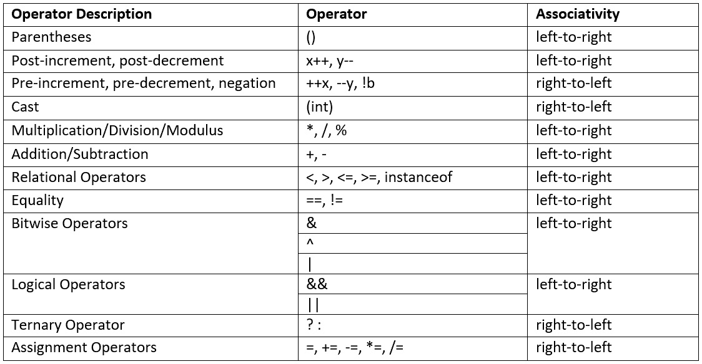

表 3.1 – 优先级和结合性规则顺序

注意，*表 3.1* 是简化的，因为它只提到了常用的运算符。例如，无符号右移运算符 `>>>` 被省略，因为它很少使用。另外，请注意，`instanceof` 运算符将在 *第八章* 中讨论。

有趣的是，赋值运算符，即 `=`，在优先级表中位于底部。这意味着无论赋值右侧的表达式是什么，赋值总是最后进行的。这是有道理的。此外，虽然大多数运算符的结合性是从左到右的，但赋值运算符的结合性是从右到左的。这在下述代码段中得到了演示：

```java
boolean b1 = false;boolean b2;
boolean b3;
b3 = b2 = b1;
System.out.println(b1);
System.out.println(b2);
System.out.println(b3);
```

上述代码段输出了 `false` 三次。关键行是 `b3 = b2 = b1;`。由于赋值运算符的结合性是从右到左的，所以 `b1` 中的值，即 `false`，被赋值给 `b2`；然后，`b2` 中的值，现在是 `false`，被赋值给 `b3`。

现在我们已经了解了这些属性，让我们来检查运算符本身。

# 理解 Java 的运算符

运算符可以分为以下几类：

+   一元运算符

+   算术运算符

+   关系运算符

+   逻辑运算符

+   三元运算符

+   复合赋值运算符

我们现在将依次讨论每一类。

## 一元运算符

一元运算符只有一个操作数，因此称为*一元*。让我们来检查它们。

### 前缀和后缀一元运算符

`++` 和 `--` 表示这些运算符，它们分别增加和减少 1。如果运算符出现在变量之前，它被称为*前缀*，而如果运算符出现在变量之后，它被称为*后缀*。例如，*++x* 是前缀递增，而 *y--* 是后缀递减。

根据 `++` 或 `--` 是出现在变量之前还是之后，在某些情况下可能会影响整个表达式的结果。这最好通过代码示例来解释，如 *图 3**.1* 所示：

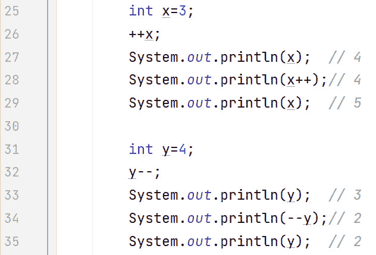

图 3.1 – 前缀和后缀递增和递减运算符

在图 3.1 中，第 25 行我们可以看到`x`被初始化为`3`。在第 26 行，`x`增加 1 变为`4`。第 26 行是一个简单语句，因此，无论是前缀还是后缀表示法，都没有关系。第 27 行输出`x`的值，以显示此时它的值是`4`。

第 28 行是事情变得有趣的地方。第 28 行的后缀表示法对屏幕输出有实际影响。因为它是在`System.out.println`命令中的后缀表示法，所以输出的是`x`的当前值，然后`x`增加 1。所以，屏幕上的输出是`4`，然后`x`增加到`5`。第 29 行演示了`x`是`5`。

在第 31 行，变量`y`被初始化为`4`。在第 32 行，`y`减去 1 变为`3`。再次强调，由于第 32 行是一个简单语句，前缀或后缀表示法没有区别。第 33 行输出`y`的值，以显示此时它的值是`3`。

第 34 行的前缀表示法对屏幕输出没有实际影响。因为它是在`System.out.println`命令中的前缀表示法，所以先递减`y`的值，然后输出到屏幕的值匹配（两者都是`2`）。最后，第 35 行演示了`y`的当前值是`2`。

### 一元加减运算符

现在我们已经讨论了前缀和后缀运算符，让我们来讨论其他一元运算符。图 3.2 中的代码将有所帮助：

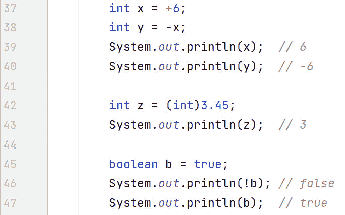

图 3.2 – 其他一元运算符

在图 3.2 中，第 37 行使用一元加号`+`将`x`初始化为`6`。在这里，`+`是默认的，因为不带符号的数字被认为是正数。第 38 行使用一元减号`-`将`y`初始化为`x`的相反数。第 39 和第 40 行演示了`x`和`y`分别是`6`和`-6`。

### 类型转换运算符

在图 3.2 中，第 42 行使用了类型转换运算符。我们将在本章后面更详细地讨论类型转换。现在，`3.45`是一个`double`字面量（8 字节），不能存储在大小为 4 字节的`int`变量`z`中。编译器会检测到这一点并生成错误。为了绕过这个错误，我们可以使用类型转换，其形式为`(cast type)`。这种转换使我们能够覆盖编译器错误。在这种情况下，我们将`3.45`转换为一个`int`变量，这意味着我们失去了小数位。因此，我们将`3`存储在`z`中，如第 43 行的输出所示。

### 逻辑非运算符

在图 3.2 中，第 45 行声明了一个布尔变量`b`并将其初始化为`true`。在第 46 行，我们通过使用逻辑非运算符输出`b`的相反值。请注意，我们并没有改变`b`的值，也就是说，`b`的值仍然是`true`。这可以通过第 47 行的输出得到证明。

现在，让我们来检查算术运算符。

## 算术运算符

有五种算术运算符，我们将在下面逐一考察。

### 加法/减法运算符

如同数学一样，`+` 运算符代表加法，`-` 运算符代表减法。两者都是二元运算符；换句话说，有两个操作数，一个在运算符的左侧，一个在右侧。以下代码示例展示了这一点：

```java
int res = 6 + 4 - 2;System.out.println(res); // 8
```

在此代码段中，`res` 被分配了 `6 + 4 – 2` 的值，即 `8`。

### 乘法/除法运算符

`*` 运算符代表乘法，`/` 运算符代表除法。两者都是二元运算符。请注意，*整数除法会截断*。以下代码段展示了这一点：

```java
System.out.println(10/3); // 3
```

此代码段输出 `3`，因为整数除法会截断。我们正在将一个整数 `10` 除以另一个整数 `3`，余数被简单地丢弃。

### 余数运算符

`%` 运算符用于计算余数（余数）。以下代码示例展示了余数运算符的作用：

```java
int mod1 = 10 % 3;System.out.println(mod1); // 1
int mod2 = 0 % 3;
System.out.println(mod2); // 0
```

第一行将 `mod1` 初始化为 `10` 除以 `3` 的余数，即 `1`。换句话说，`3` 可以整除 `10` 三次，剩下 `1`。因此，`1` 被分配给 `mod1`。

`mod2` 的初始化很有趣：`3` 不能整除 `0`，没有剩余。因此，`0` 被分配给 `mod2`。

### 算术运算符的优先级

根据 *表 3.1*，`*`、`/` 和 `%` 的优先级高于 `+` 和 `–` 运算符，赋值运算符的优先级最低。*图 3**.3* 展示了这如何影响代码中表达式的计算：

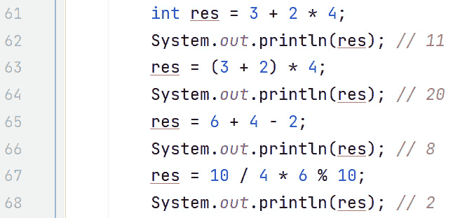

图 3.3 – 算术运算符优先级

第 61 行展示了 `*` 的优先级高于 `+`，因为表达式的计算结果是 `3 + (2 * 4) = 3 + 8 =` `11`。

第 63 行展示了括号会改变分组。现在，共享值 `2` 与 `3` 分组（而不是第 61 行的情况，那时是 `4`）。表达式现在计算结果为 `5 * 4 =` `20`。

第 65 行展示了 `+` 和 `-` 也是从左到右结合的。表达式的计算结果为

`10 - 2 =` `8`。

第 67 行展示了 `*`、`/` 和 `%` 也从左到右结合。表达式计算结果为 `2 * 6 % 10`，这又转换为 `12 % 10`，结果是 `2`。

涉及 `int` 变量或更小类型的数学运算结果为 `int`

有趣的是，任何涉及 `int` 类型或更小类型的数学运算都会得到 `int` 类型。以下代码段展示了这一点：

`byte` `b1=2, b2=3;`

`byte b3 = b1 + b2; //` `编译器错误`

`byte b4 = (byte)(b1 +` `b2);// 正确`

第一行声明了两个字节，即 `b1` 和 `b2`。请注意，尽管 `2` 和 `3` 是整数文字，但编译器知道这些值在 `byte` 的范围（-128 到 +127）内，因此允许这些声明。

然而，下一行是一个问题。编译器有一个规则，即所有涉及 `int` 类型或更小类型的数学运算的结果都是 `int`。因此，即使两个字节之和 5 在 `byte` 范围内，编译器也会报错，说“从 `int` 转换到 `byte` 可能会丢失数据”。

最后一行通过在赋值之前将加法的结果（`int` 类型）强制转换为 `byte` 来解决这个问题。这意味着 `int` 类型的额外 3 个字节（无法放入 `byte` 中）将被简单地丢弃。因此，`b1 + b2` 的和从 `int` 转换为 `byte`，结果 `byte` 被赋值给 `b4`。在后面的章节中会更详细地讨论强制转换。

我们将通过考察 `+` 在不同上下文中的用法来结束对算术运算符的讨论。

### 字符串连接

如我们所见，Java 使用 `+` 进行数学加法。然而，这仅在两个操作数都是数字时才会发生。例如，3 + 4 的结果是 7，因为两个操作数 3 和 4 都是数字。

然而，如果任一操作数（或两个都是）是字符串，Java 会执行 `String` 连接。字符串字面量用双引号括起来——例如，`"abc"`、`"123"`、`"Sean"` 和 `"Maaike"` 都是 `String` 字面量。所以，为了清楚地了解何时执行何种操作，让我们看看一些示例：

+   3 + 4 是数学加法。因此，结果是 7。

+   “3” + 4 是一个字符串连接操作，因为 `+` 的左边有一个字符串。结果是字符串 “34。”

+   3 + “4” 是一个字符串连接操作，因为 `+` 的右边有一个字符串。再次，结果是字符串 “34。”

+   “3” + “4” 是一个字符串连接操作，因为 `+` 的两边都有字符串。结果也是字符串 “34。”

那么，在字符串连接操作中到底发生了什么？*Java 当操作数类型不同时无法执行任何数学运算*。让我们通过一段示例代码来分析：

```java
String s = "3" + 4;System.out.println(s); // "34"
```

首先要注意的是，第一行代码之所以能编译，是因为 `"3" + 4` 的结果是字符串字面量。当 Java 遇到 `+` 的左边/右边/两边都有字符串时，它会执行字符串连接（追加）。本质上，由于 `+` 是从左到右结合的，Java 会将 `+` 右边的字符串追加到 `+` 左边的字符串的末尾。

在这个例子中，Java 看到了字符串字面量 `"3"` 和 `+` 操作符，并意识到它必须执行字符串连接。为此，在内存中，它创建了一个 4 的字符串版本——换句话说，`"4"`。整数字面量 `4` 没有被修改。因此，在底层创建了一个新的变量——它是一个 `String` 变量，其值为 `"4"`。现在表达式是 `"3" + "4"`。由于 `+` 的两边现在都是相同类型的操作数（都是字符串），Java 可以执行连接。新的字符串是 `"3" + "4"` 的结果，即 `"34"`。这就是被赋值给 `s` 的内容。第二行通过输出 `s` 的 `"34"` 来演示这一点。

在 *图 3**.4* 中，提供了一个更复杂的示例：

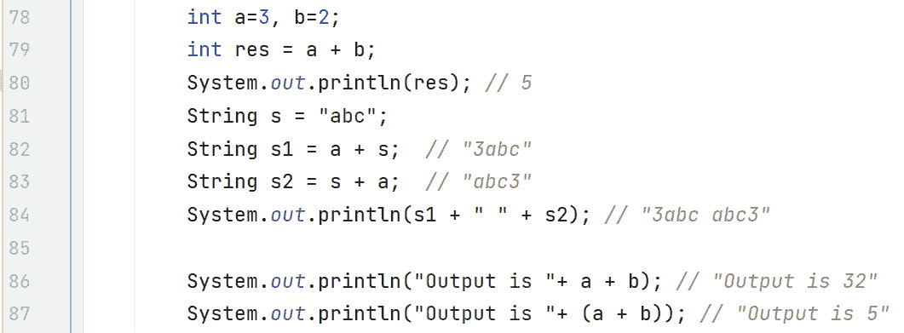

图 3.4 – 字符串连接操作

在第 79 行，由于两个操作数 `a` 和 `b` 都是整数，Java 将 `res` 初始化为 `5`（`3` 和 `2` 的和）。

第 82 行的评估方式如下：`3 + "abc" = "3" + "abc" = "3abc"`。换句话说，Java 认识到由于 `+` 的右侧存在 `"abc"`，它必须执行字符串连接。因此，在内存的某个地方，创建了一个包含 `a` 值的字符串版本。换句话说，创建了一个值为 `"3"` 的变量。请注意，`a` 仍然是一个值为 3 的 `int` 类型。现在，Java 可以继续执行，因为两个操作数都是同一类型（字符串）：`"3" + "abc"` 结果为 `"3abc"`。

第 83 行演示了字符串在 `+` 的哪一侧并不重要。此外，字符串是字面量还是字符串变量也不重要。第 83 行的表达式评估方式如下：`"abc" + 3 = "abc" + "3" = "abc3"`。这就是 `s2` 的初始化值。第 84 行输出 `s1` 和 `s2` 的值，它们之间有一个空格。请注意，`System.out.println` 期望一个字符串。第 84 行的字符串输出构造方式如下：`"3abc" + " " = "3abc " + "abc3" = "3abc abc3"`。

第 86 和 87 行需要特别说明。第 86 行的问题在于输出字符串的构造方式如下：`"Output is "+ 3 = "Output is " + "3" = "Output is 3" + 2 = "Output is 3" + "2" = "Output is 32"`。这不是我们想要的结果。

第 87 行通过使用括号来确保 `a + b` 被分组，从而纠正了这个问题。因此，字符串的构造方式如下：`"Output is "+ 5 = "Output is "+ "5" = "Output is 5"`。

这样就完成了算术运算符的介绍。接下来，我们将研究关系运算符。

## 关系运算符

Java 有六个关系运算符，它们都返回 `boolean` 类型的 `true` 或 `false` 值。具体如下：

+   `==` 是等价运算符

+   `!=` 是不等价运算符

+   `>` 是大于运算符

+   `>=` 是大于或等于运算符

+   `<` 是小于运算符

+   `<=` 是小于或等于运算符

*图 3**.5* 展示了关系运算符在代码中的实际应用：

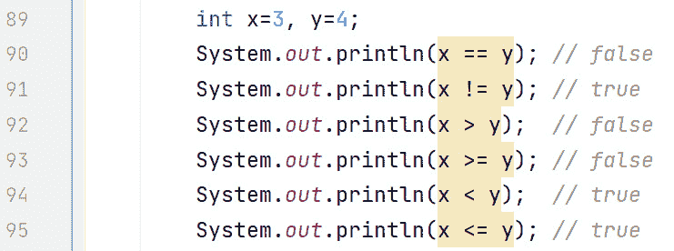

图 3.5 – 代码中的关系运算符

第 89 行声明了两个 `int` 类型的变量，分别是 `x` 和 `y`，并将它们分别初始化为 `3` 和 `4`。第 90 行使用 Java 的等价运算符 `==` 来检查 `x` 和 `y` 是否等价。由于它们不等价，第 90 行输出 `false`。第 91 行检查相反的情况。由于 `x` 不等价于 `y`，第 91 行输出 `true`。

第 92 行输出 `x` 是否大于 `y`。当然，这是 `false`，因为 `3` 不大于 `4`。同样，第 93 行输出 `x` 是否大于或等于 `y`。这同样是 `false`。

第 94 行输出 `x` 是否小于 `y`。这是 `true`，因为 `3` 小于 `4`。第 95 行输出 `x` 是否小于或等于 `y`。这同样是 `true`。

关系运算符及其布尔返回值在以后将非常有用，尤其是当我们查看*第四章*（B19793_04.xhtml#_idTextAnchor087）中的条件语句时。

隐式提升

虽然 Java 的运算符不需要操作数必须是完全相同的类型，但操作数必须是兼容的。考虑以下代码片段：

`System.out.println(3 + 4.0); //` `7.0`

`System.out.println(4 == 4.0); //` `true`

第一行尝试将一个`int`类型的`3`变量加到一个`double`类型的变量上。Java 意识到这两个类型并不相同。然而，Java 可以找出一个安全的解决方案而不打扰我们。这就是*隐式提升*的作用。`int`类型需要 4 个字节的存储空间，而`double`类型需要 8 个字节的存储空间。在后台，内存的某个地方，Java 声明了一个临时的`double`变量，并将`int 3`提升为`double 3.0`，然后将`3.0`存储在这个临时位置。现在，Java 可以将`3.0`加到`4.0`上（因为两者都是`double`类型），得到的结果是`7.0`。

第二行比较`int 4`和`double 4.0`。发生同样的过程。Java 隐式地将`4`提升为`4.0`（在新的临时位置），然后比较`4.0`和`4.0`。这导致输出`true`。

现在，我们将注意力转向逻辑运算符。

## 逻辑运算符

逻辑运算符使我们能够通过组合子表达式来构建复杂的`boolean`表达式。这些运算符如下：

+   `&&`是逻辑与

+   `||`是逻辑或

+   `&`是位与

+   `|`是位或

+   `^`是位异或（XOR）

我们将依次通过代码示例来检查这些运算符，但在这样做之前，回顾一下*表 3.2*中的真值表是有益的，如下所示：

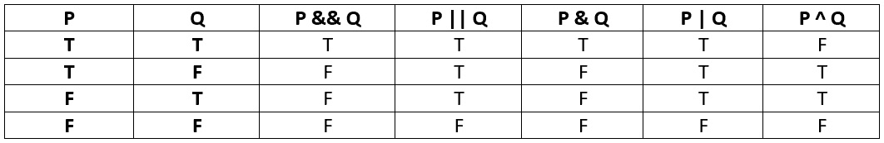

表 3.2 – 布尔真值表

在*表 3.2*中，前两列，**P**和**Q**，代表两个表达式，其中**T**表示真，**F**表示假。例如，逻辑与列（**P && Q**列）表示整体表达式**P && Q**的结果，这取决于**P**和**Q**的值。所以，如果**P**为真且**Q**为**T**，那么**P && Q**也为真。

在这个表格的指导下，我们依次检查运算符。

### 逻辑与（&&）

逻辑与运算符表示两个布尔操作数都必须为真，整个表达式才为真。这由*表 3.2*中的**P && Q**列表示。

注意，这个操作符被称为短路操作符。例如，在一个表达式 P && Q 中，如果 P 评估为假，那么 `&&` 将**不会**评估表达式 Q，因为整体表达式将评估为假。这是因为 F && F 是假，F && T 也是假。实际上，Java 知道一旦在 `&&` 表达式的左侧表达式 P 为假，整体表达式必须是假。因此，没有必要评估右侧的表达式 Q，所以它**短路**了。这最好用一个代码示例来解释：

```java
boolean b1 = false, b2 = true;boolean res = b1 && (b2=false); // F &&
System.out.println(b1 + " " + b2 + " " + res);// false true
  false
```

第一行初始化了两个布尔变量，`b1` 和 `b2`，分别设置为 `false` 和 `true`。第二行是重要的一行。请注意，在 `b2=false` 子表达式中需要括号来使代码能够编译（否则，你会得到一个语法错误）。因此，当我们为 `b1` 插入 `false` 时，表达式计算为 `F && (b2=false)`。由于评估顺序是从左到右，这将导致 `&&` 短路，因为无论表达式中剩下什么，整体表达式都无法评估为真。这意味着 `(b2=false)` 子表达式**不会**被执行。

最后一行输出了变量的值。输出分别是 `false`、`true` 和 `false`，对应于 `b1`、`b2` 和 `res`。关键的是，`b2` 是 `true`，这证明了 `&&` 短路了。

### 逻辑或（||）

逻辑或表示，只要有一个或两个布尔操作数是真，整体表达式就是真。这由 *表 3.2* 中的 **P || Q** 列表示。

这个操作符也是一个短路操作符。例如，在一个表达式 P || Q 中，如果 P 评估为真，那么 `||` 将**不会**评估表达式 Q，因为整体表达式将评估为真。这是因为 T || F 是真，T || T 也是真。实际上，Java 知道一旦在 `||` 表达式的左侧表达式 P 为真，整体表达式必须是真。因此，没有必要评估右侧的表达式 Q，所以它**短路**了。再次用一个代码示例来帮助说明：

```java
boolean b1=false, b2=true;boolean res = b2 || (b1=true);  // T ||
System.out.println(b1 + " "+ b2 + " "+res);// false true
  true
```

第一行初始化了两个布尔变量，`b1` 和 `b2`，分别设置为 `false` 和 `true`。第二行是重要的一行。再次请注意，在 `b1=true` 子表达式中需要括号来使代码能够编译。因此，当我们为 `b2` 插入 `true` 时，表达式计算为 `T || (b1=true)`。由于评估顺序是从左到右，这将导致 `||` 短路，因为无论表达式中剩下什么，整体表达式都无法评估为假。

最后一行输出了变量的值。输出分别是 `false`、`true` 和 `true`，对应于 `b1`、`b2` 和 `res`。关键的是，`b1` 是 `false`，这证明了 `||` 短路了。

评估顺序与优先级

这个主题经常引起混淆，最好通过一些示例代码来解释。让我们从一个看似简单的例子开始：

`int x=2, y=3, z=4;`

`int res = x + y * z; // x + (y * z)`

`System.out.println(res); // 14`

由于 `*` 的优先级高于 `+`，公共元素 `y` 与 `z` 而不是 `x` 组合在一起。因此，整个表达式是 `x + (y * z)` = 2 + 12 = 14。

这里要注意的重要一点是评估顺序是从左到右的，并且由于评估顺序高于优先级，`x` 在 `(y * z)` 子表达式之前被评估。虽然在这个例子中这没有区别，但让我们看看一个有区别的例子：

`boolean a=false, b=false, c=false;`

`// a || (b && c)`

`// 下行计算结果为 T ||`

`boolean bool = (a = true) || (b = true) && (c = true);`

`System.out.print(a + ", " + b + ", " + c); // true, false, false`

由于 `&&` 的优先级高于 `||`，表达式计算结果为 `(a = true) || ( (b = true) && (c = true) )`。

换句话说，常见的子表达式 `(b = true)` 与 `(c = true)` 而不是 `(a = true)` 组合在一起。现在来谈谈关键点：*评估顺序高于优先级*。因此，`(a = true)` 首先被评估，结果为 `T || ((b = true) && (c = true))`。

由于 `||` 是短路运算符，表达式右侧的其余部分（`||` 右侧）为 `true`、`false`、`false`，分别对应 `a`、`b` 和 `c`。这里要注意的关键点是 `b` 和 `c` 仍然是 `false`！

既然我们已经讨论了逻辑运算符，我们将继续讨论位运算符。

## 位运算符

虽然一些位运算符看起来与逻辑运算符非常相似，但它们的操作方式却截然不同。主要区别在于位运算符可以与布尔和整型（`byte`、`short`、`int`、`long` 和 `char`）操作数一起工作。此外，位运算符**不会**短路。

让我们先检查布尔位运算符。

### 位与（&）

比较位与（`&`）与逻辑与（`&&`），区别在于位与**不会**短路。这由 *表 3.2* 中的 **P & Q** 列表示。如果我们使用逻辑与的示例代码，但将其更改为使用位与运算符，你将看到输出结果的不同：

```java
boolean b1 = false, b2 = true;boolean res = b1 & (b2=false); // F & F
System.out.println(b1 + " " + b2 + " " + res);// false
  false false
```

在这种情况下，`(b2=false)` 子表达式被执行，因为 `&` 没有短路。因此，我们得到 `false & false`，结果是 `false`。因此，所有变量的输出都是 `false`。

### 位或（|）

比较位或（`|`）与逻辑或（`||`），区别在于位或**不会**短路。这由 *表 3.2* 中的 **P | Q** 列表示。如果我们使用逻辑或的示例代码，但将其更改为使用位或运算符，你将看到输出结果的不同：

```java
boolean b1=false, b2=true;boolean res = b2 | (b1=true);  // T | T
System.out.println(b1 + " "+ b2 + " "+res);// true true
  true
```

在这种情况下，`(b1=true)` 子表达式被执行，因为 `|` 没有短路。所以，我们有：`true` | `true`，结果是 `true`。因此，所有变量的输出都是 `true`。

### 按位异或 (^)

这是一个非短路运算符。按位异或运算符，用 `^` 表示，当且仅当其中一个操作数是 `true` 但 **不是** 两个都为 `true` 时，结果为 `true`。这由 *表 3.2* 中的 **P ^ Q** 列表示。让我们通过代码来看一些示例：

```java
boolean b1 = (5 > 1)  ^ (10 < 20);   // T ^ T == Fboolean b2 = (5 > 10) ^ (10 < 20);   // F ^ T == T
boolean b3 = (5 > 1)  ^ (10 < 2);    // T ^ F == T
boolean b4 = (5 > 10) ^ (10 < 2);    // F ^ F == F
// false true true false
System.out.println(b1 + " " + b2 + " " + b3 + " " + b4);
```

`boolean` 变量 `b1` 被初始化为 `false`，因为两个子表达式——`(5 > 1)` 和 `(10 < 20)`——都是 `true`。同样，`b4` 也被初始化为 `false`，因为 `(5 > 10)` 和 `(10 < 2)` 都是 `false`。

然而，`b2` 是 `true`，因为尽管 `(5 > 10)` 是 `false`，`(10 < 20)` 是 `true`，且 `F ^ T` 是 `true`。同样，`b3` 是 `true`，因为 `(5 > 1)` 是 `true`，`(10 < 2)` 是 `F`，且 `T ^ F` 是 `true`。

现在我们已经检查了按位运算符与 `boolean` 操作数一起使用的情况，我们现在将简要地检查当操作数是整数时，这些运算符是如何工作的。

### 按位运算符（整数操作数）

虽然不常用，但我们为了完整性而包括它们。一个代码示例在这里很有用：

```java
byte b1 = 6 & 8;       // both bits must be 1byte b2 = 7 | 9;       // one or the other or both
byte b3 = 5 ^ 4;       // one or the other but not both
System.out.println(b1 + ", " + b2 + ", "+b3); // 0, 15, 1
```

当操作数是整数（而不是布尔值）时，位模式在评估结果时变得重要。对于 `&` 运算符，结果中的该位必须两个位都为 1 才能是 1：

```java
6 & 8 (in binary) = 0110 & 1000 = 0000 = 0
```

对于 `|` 运算符，结果中的该位必须为 1，至少有一个位或两个位必须为 1：

```java
7 | 9 (in binary) = 0111 | 1001 = 1111 = 15
```

对于 `^` 运算符，结果中的该位必须至少有一个位为 1，但不能两个都为 1：

```java
5 ^ 4 (in binary) = 0101 ^ 0100 = 0001 = 1
```

这样就完成了按位运算符。现在，让我们来介绍三元运算符。

## 三元运算符

如其名所示，三元运算符是一个接受三个操作数的运算符。三元运算符用于评估布尔表达式，并根据结果相应地给变量赋值。换句话说，由于布尔表达式只评估为 `true` 或 `false`，三元运算符的目标是决定将哪个值赋给变量。

语法形式如下：

```java
variable = boolean expression ? value to assign if true :value to assign if false
```

让我们来看一个示例：

```java
int x = 4;String s = x % 2 == 0 ? " is an even number" : " is an odd
  number";
System.out.println(x + s); // 4 is an even number
```

在这个例子中，要评估的布尔表达式是 `x % 2==0`，由于 `x = 4`，它评估为 `true`。因此，`是偶数` 被分配给字符串 `s` 并输出。如果 `x` 是 5，那么布尔表达式将是 `false`，因此，`是奇数` 将被分配给 `s` 并输出。

我们将要检查的最后一批运算符是复合赋值运算符。

## 复合赋值运算符

这些运算符作为更冗长的表达式的简写而存在。例如，假设 `x` 和 `y` 都是整数，`x = x + y` 可以写成 `x += y`。所有数学运算符都有相应的复合赋值运算符：

+   `+=` 示例：`x += y` 等同于 `x = x + y`

+   `-=` 示例：`x -= y` 等同于 `x = x - y`

+   `*=` 示例：`x *= y` 等同于 `x = x * y`

+   `/=` 示例：`x /= y` 等同于 `x = x / y`

+   `%=` 示例：`x %= y` 等同于 `x = x % y`

的确，对于位运算符也有复合赋值运算符——例如，`x &= 3` 等同于 `x = x & 3`，但它们很少使用，所以我们只是提一下它们的存在。

有一些细微之处需要注意。如前所述，任何涉及 `int` 类型或更小类型的数学运算都会得到 `int` 类型。这可能会导致需要类型转换才能使代码编译。对于复合赋值运算符，类型转换是内置的，因此不需要显式转换。以下代码为例：

```java
byte b1 = 3, b2 = 4;//  b1 = b1 + b2;         // compiler error
b1 = (byte)(b1 + b2);     // ok
b1 += b2;         // ok, no cast required
```

第一行初始化了两个字节，`b1` 和 `b2`，分别设置为 `3` 和 `4`。第二行被注释掉，因为它会生成编译器错误。`b1` 和 `b2` 的相加结果是一个 `int` 类型，不能直接赋值给 `byte` 变量，除非你将其从 `int` 类型转换为 `byte` 类型。这就是第三行所做的工作——使用类型转换（`byte`）来覆盖编译器错误。我们很快就会介绍类型转换，但到目前为止，只需意识到，使用类型转换，你正在覆盖编译器错误，实际上是在说“我知道我在做什么，继续。”

最后一行很有趣，因为在幕后，它与第三行相同。换句话说，编译器将 `b1 += b2` 转换为 `b1 = (byte) (b1 + b2)`。

另一个需要注意的细微之处是，复合赋值运算符右侧的内容将被分组，无论其优先级如何。以下是一个例子。考虑以下内容：

```java
int x = 2;x *= 2 + 5;                   // x = x * (2 + 5) = 2 * 7 = 14
System.out.println(x); // 14
```

我们知道 `*` 的优先级高于 `+`，且评估顺序是从左到右。话虽如此，`*=` 右侧的内容被编译器通过将 `2 + 5` 括起来（在幕后）进行分组。因此，表达式变为 `2 * (2 + 5) = 2 * 7 = 14`。为了进一步说明这一点，如果编译器没有插入括号，表达式将被评估为 9。换句话说，由于运算符优先级，表达式将被评估为 (2 * 2) + 5 = 4 + 5 = 9。然而，正如我们所看到的，这**不是**情况。

让我们看看另一个更复杂的例子：

```java
int k=1;k += (k=4) * (k+2);
System.out.println(k); // 25
```

在这个例子中，右侧再次被括号包围：

```java
k += (right hand side) where the right hand side is (k=4) *  (k+2)
```

将 `+=` 转换为其较长的形式，我们得到以下输出：

```java
k = k + (right hand side)
```

评估顺序是从左到右，所以插入当前 `k` 的值，即 `1`，结果如下：

```java
k = 1 + (right hand side)
```

现在，通过插入右侧的表达式，我们得到以下结果：

```java
k = 1 + ( (k=4) * (k+2) )
```

由于评估顺序是从左到右，我们在加上 `2` 之前将 `k` 改为 `4`：

```java
k = 1 + ( 4 * 6 )k = 1 + 24
k = 25
```

这就结束了我们对 Java 运算符的处理。现在，让我们来探讨 Java 类型转换，这是我们已经在本章中提到过的主题。

# 解释 Java 类型转换

为了正确地讨论类型转换，我们需要解释 Java 原始数据类型的类型提升和类型缩小。考虑到这一点，记住原始数据类型的大小（以字节为单位）是有帮助的。*表 3.3* 表示了这些信息：

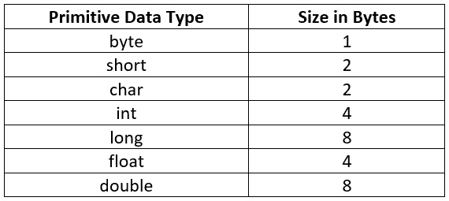

表 3.3 – Java 的原始数据类型大小

前面的表格展示了 Java 各种原始数据类型的大小（以字节为单位）。这将在我们讨论类型提升和类型缩小时有所帮助。

## 类型提升

类型提升是自动完成的；换句话说，不需要类型转换。由于提升是在后台完成的，因此类型提升也被称为 *隐式提升*。考虑到 *表 3.3*，类型提升的规则如下：

byte → short/char → int → long → float → double

根据表 3.3 中的大小，大多数这些规则应该是有意义的。例如，`byte` 可以自动适应 `short`，因为 1 个字节可以自动适应 2 个字节。唯一有趣的一个是 `long` → `float`，这是从 8 个字节到 4 个字节的类型提升。这是可能的，因为尽管 `long` 需要 8 个字节，而 `float` 只需要 4 个字节，但它们的范围不同 – 即 `float` 类型可以容纳任何 `long` 值，但反之则不行。这在下述代码片段中显示：

```java
System.out.println("Float: " + Float.MAX_VALUE);// Float:  3.4028235E38
System.out.println("Float: " + Float.MIN_VALUE);// Float:
  1.4E-45
System.out.println(Long.MAX_VALUE);  //   9223372036854775807
System.out.println(Long.MIN_VALUE);   //  -9223372036854775808
```

注意用于浮点数的科学记数法 `E`。`float` 占用的空间更少，但由于其表示方式，它可以容纳比 `long` 更大和更小的数字。

科学记数法

科学记数法是一种表示十进制数字的简写方式，可以用于表示非常大和/或非常小的数字。以下是一些示例：

`double d1 = .``00000000123;`

`double d2 =` `1.23e-9;`

`System.out.println(d1==d2); //` `true`

`double d3 =` `120_000_000;`

`double d4 =` `1.2e+8;`

`System.out.println(d3==d4); //` `true`

由于这两个比较都返回 `true`，这意味着 `d1` 是 `d2` 的内部表示。同样，`d3` 和 `d4` 也是等效的。

让我们通过代码来检查类型提升。*图 3**.6* 展示了这一点：

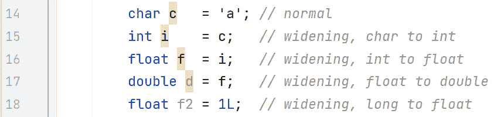

图 3.6 – 隐式类型提升示例

第 14 行是一个常规的 `char` 赋值 – 换句话说，没有类型提升。注意字符（由 `char` 表示）只是简单的数字（0..65,535）。为了表示一个字符，我们将字符放在单引号内。相比之下，`String`（字符序列）用双引号表示。因此，`"a"` 是一个 `String`，而 `'a'` 是一个字符。

第 15 行是从`char`（2 字节）到`int`（4 字节）的扩展。第 16 行是从`int`到`float`的扩展。尽管`int`和`float`都需要 4 字节，如前所述，与`long`一样，`float`有更大的范围，所以这里没有问题。第 17 行是从`float`到`double`的扩展。最后，第 18 行是从`long`到`float`的扩展。注意，任何地方都没有编译器错误，并且在这些赋值中不需要使用转换运算符。

现在，让我们讨论需要转换的窄化。

## 窄化

转换运算符是一个括号内的类型 – 例如，`(int)`和`(byte)`都是转换运算符，分别将值转换为`int`和`byte`。考虑到*表 3.3*，以下图，*图 3**.7*，展示了需要转换的赋值：

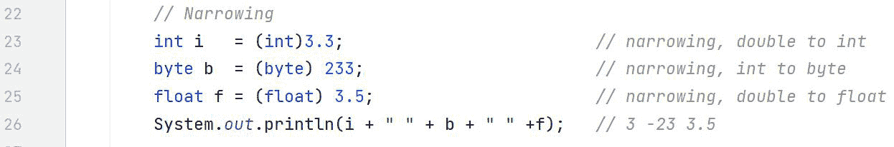

图 3.7 – 转换示例

在前面的图中，第 23 行试图将`3.3`，一个`double`类型（8 字节），赋值给一个`int`类型（4 字节）。没有转换，这将是一个编译器错误。有了转换，你将覆盖编译器错误。因此，在第 23 行，我们将`3.3`转换为`int`，并将这个`int`赋值给`i`变量。因此，赋值完成后，`i`的值为`3`。

第 24 行是将`int`类型的`233`转换为`byte`变量`b`。这个字面值超出了`byte`的范围（-128 到+127），因此需要转换。第 25 行是将`double`类型的`3.5`转换为`float`。记住，默认情况下，十进制数是`double`；要将其视为`float`而不是`double`，必须后缀`f`或`F`。例如，`3.3f`是`float`。

第 26 行的输出是`i`为 3，`b`为-23，`f`为 3.5。注意，在输出中，`float`变量没有`f`。

我们是如何得到`-23`的，将在以下说明中解释。

字节溢出

记住，`byte`的范围是-128（10000000）到+127（01111111）。最左边的位是符号位，其中 1 表示负数，0 表示正数。

在前面的例子中，我们做了以下操作：

`byte b = (byte) 233;`

`233`（一个整数）的值对于`byte`来说太大，但`b`是如何被赋予-23 的值的呢？将`233`映射为`int`类型会得到以下位模式：

`11101001 = 1 + 8 + 32 + 64 + 128 =` `233 (int)`

注意，由于`int`是 4 字节，`233`的位模式是 00000000000000000000000011101001。将该位模式映射为**byte**（高阶 3 字节被截断）会得到以下输出：

`11101001 = 1 + 8 + 32 + 64 + (-128) = -23 (byte)`

记住，最左边的位是符号位。这就是为什么计算中包含`-128`的原因。它是`-(2⁷) = -128`。

我们将通过查看一些需要/不需要转换的非常规示例来结束本节。

### 是要转换还是要不转换，这是一个问题

有一些情况下，由于编译器在后台应用规则，不需要进行类型转换。让我们通过代码示例来检查这些情况。*图 3.8*展示了代码：

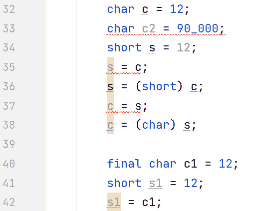

图 3.8 – 不总是需要类型转换的情况

第 32 行声明并初始化了一个名为`c`的`char`变量，将其赋值为`int`类型的`12`。记住，`char`变量本质上是很小的正数。尽管我们将一个`int`类型的值（4 字节）赋给了一个`char`变量（2 字节），但由于字面值在`char`的范围内（0 到 65,535），编译器允许这样做。如果字面值超出了`char`的范围，编译器将生成错误——这就是第 33 行发生的情况。

第 34 行声明并初始化了一个名为`s`的`short`变量，将其赋值为`int`类型的`12`。同样，尽管`short`只能存储 2 字节，但编译器意识到它可以存储字面值`12`，并允许这样做。

注意，从编译器的角度来看，将字面值赋给变量与将*变量*赋给变量是不同的。例如，第 32 和 37 行是相当不同的。当我们讨论图中的下一几行时，这一点将变得明显。

第 35 到 38 行展示了尽管`char`和`short`都需要 2 字节，但它们的范围不同：`char`（0 到 65,535）和`short`（-32,768 到+32,767）。这意味着`short`变量可以存储负值，例如-15，而`char`变量则不能。相反，`char`变量可以存储如 65,000 这样的值，但`short`变量则不能。因此，正如第 35 和 37 行所展示的，你不能直接将`char`变量赋给`short`变量，反之亦然。在这两种情况下，你需要进行类型转换。第 36 和 38 行展示了这一点。

#### 编译时常量

然而，第 40 到 42 行展示了绕过我们刚才概述的类型转换要求的方法。如果你将变量声明为*编译时常量*（并且假设值在范围内），编译器将允许变量到变量的赋值。第 40 行使用`final`关键字声明了一个编译时常量。我们将在*第九章*中详细讨论`final`，但在这个上下文中，它意味着`c1`将始终具有`12`的值。对于`c1`来说，值是固定的（或*常量*），这是在*编译时*完成的。如果你尝试更改`c1`的值，你将得到编译器错误。现在编译器知道`c1`将始终具有`12`作为其值，编译器可以应用与字面值相同的规则；换句话说，值是否在范围内？这就是为什么第 42 行不会生成编译器错误。

这就结束了我们对运算符的讨论。现在，让我们应用它们！

# 练习

侏罗纪乐园做得很好。恐龙很健康，客人也很高兴。现在你有一些新技能，让我们继续进行稍微复杂一些的任务！

1.  饲养员们希望能够跟踪恐龙的体重。你的任务是编写一个程序，计算两只恐龙的平均体重。这将帮助我们的营养师团队规划正确的食物分量。

1.  适当的营养对于我们恐龙的健康至关重要。饲养员们希望有一个大致的指导，了解应该给恐龙喂食多少食物。编写一个程序，根据恐龙的体重来确定所需的食物量。你可以根据恐龙每单位体重的食物需求量来计算。

1.  对于我们的公园，我们需要有一个闰年检查器。在我们对科学准确性的承诺中，使用取模运算符来确定当前年份是否是闰年。我们想确保我们的以日历为主题的展览总是最新的。

1.  创建一个程序，检查公园的最大容量是否已达到。程序只需在“最大容量达到：”之后打印出 true 或 false。这对于维护安全标准和确保良好的游客体验至关重要。

1.  有时游客想要比较恐龙的年龄。我们理解——这可能在教育目的上很有趣。编写一个程序，计算两只恐龙之间的年龄差异。

1.  在中生代伊甸园，我们有一个非常强的以安全为第一的政策。编写一个程序，检查公园的安全评级是否高于某个阈值。保持良好的安全评级是我们的首要任务。

# 项目 - 恐龙餐食规划器

作为中生代伊甸园的饲养员，关键任务包括为我们心爱的恐龙规划餐食。虽然我们还没有使用条件语句和循环，但我们仍然可以计算一些基本需求！

开发一个简单的程序，帮助饲养员为不同的恐龙规划餐食分量。该程序应使用恐龙的体重来计算每餐需要吃多少食物。

如果你需要更多指导，以下是你可以这样做的方法：

+   为恐龙的体重和它每天需要摄入的体重比例声明变量。例如，如果一个恐龙每天需要摄入其体重的 5%，而它重 2,000 公斤，那么它就需要摄入 100 公斤的食物。

+   现在，假设你每天给恐龙喂食两次。声明一个变量来表示喂食次数，并计算每次喂食需要提供多少食物。在这个例子中，每次喂食将是 50 公斤。

+   以有意义的方式打印出结果——例如，“我们的 2,000 公斤恐龙每天需要吃 100 公斤食物，这意味着我们每次喂食需要提供 50 公斤。”

# 摘要

在这一章中，我们学习了 Java 运算符的工作原理以及它们是如何协作的。此外，我们还学习了如何在 Java 中进行类型转换。

最初，我们讨论了与运算符相关的两个重要属性：优先级和结合性。我们了解到优先级决定了常见项是如何分组的。当运算符具有相同的优先级顺序时，结合性就会发挥作用。

然后，我们检查了运算符本身。我们首先查看一元运算符，它们有一个操作数，例如前缀/后缀增量/减量运算符`++`和`--`。

然后，我们转向算术运算符：`+`、`-`、`*`、`/`和`%`。我们指出，整数除法会截断。此外，我们还讨论了涉及`int`类型或更小类型的任何数学运算都会导致结果为`int`。最后，我们详细讨论了当其中一个或两个操作数是字符串时`+`运算符的工作方式。在这些情况下，执行字符串连接操作。

接下来，我们讨论了关系运算符。这些运算符的结果始终是布尔值，当我们在*第四章*中构建条件语句时将使用它们。

由于 Java 无法执行不同类型之间的操作，因此尽可能进行隐式提升。这就是 Java 在内存中的某个位置将较小的类型提升为较大的类型的方式。这是 Java 在操作中无意识地继续下去的方式。

然后，我们讨论了逻辑运算符：`&&`、`||`、`&`、`|`和`^`。为了帮助理解，我们展示了真值表。逻辑`&&`和逻辑`||`运算符都是短路运算符。理解这一点很重要，因为求值的顺序优于优先级。

位运算符，位与运算符（`&`）和位或运算符（`|`），与`&&`和`||`类似，但不同之处在于，与`&&`和`||`不同，`&`和`|`永远不会短路，并且也可以与整型操作数一起工作。

三元运算符有三个操作数。它评估一个布尔表达式，并根据布尔表达式是`true`还是`false`将两个值之一赋给一个变量。

关于运算符，我们最后讨论的是复合赋值运算符，每个数学运算符都有一个。

在我们讨论类型转换时，我们涵盖了宽化和狭义转换。宽化是在后台进行的，通常被称为*隐式提升*。这里没有风险，因为被提升的类型可以轻松地适应目标类型。

狭义转换需要使用类型转换。这是因为，既然你正在从一个需要更多存储空间的类型转换到一个需要较少存储空间的类型，那么可能会丢失数据。

现在我们知道了如何使用运算符，在下一章中，我们将转向条件语句，其中经常使用运算符。
