# 4

# 条件语句

在 *第三章* 中，我们学习了 Java 运算符。我们讨论了运算符的两个重要属性，即优先级和结合性。优先级有助于分组共享的操作数。当优先级级别相同时，结合性用于分组。

我们讨论了一元运算符——前缀和后缀增量/减量、类型转换和逻辑非。我们还涵盖了二元运算符——算术、关系、逻辑、位运算和复合赋值。我们学习了当操作数（或两者）为字符串时 `+` 符号的行为。我们讨论了逻辑与 (`&&`) 和逻辑或 (`||`) 以及它们的短路特性。最后，我们介绍了具有三个操作数的三元运算符。

我们还学习了 Java 的类型转换。这可以隐式地进行，称为**隐式提升**或**宽化**。另一种选择是显式转换，称为**窄化**。在窄化时，我们必须将类型转换为目标类型，以消除编译器错误。最后，我们讨论了编译时常量，由于它们的值永远不会改变，因此使编译器能够应用不同的规则。

现在我们已经了解了运算符，让我们用它们做一些有趣的事情。到本章结束时，你将能够使用 Java 的运算符来创建条件语句。条件语句使我们能够做出决策。此外，你将理解 Java 中的一个基本概念，即作用域。

本章我们将涵盖以下主要内容：

+   理解作用域

+   探索 `if` 语句

+   掌握 `switch` 语句和表达式

# 技术要求

本章的代码可以在 GitHub 上找到，链接为 [`github.com/PacktPublishing/Learn-Java-with-Projects/tree/main/ch4`](https://github.com/PacktPublishing/Learn-Java-with-Projects/tree/main/ch4)。

# 理解作用域

在编程中，作用域定义了变量在程序中的可用性。这通常被称为变量的可见性。换句话说，变量在代码中的“可见”位置在哪里。Java 使用**块作用域**。为了解释 Java 的作用域，我们首先必须了解什么是块。

## 什么是块？

大括号分隔代码块。换句话说，一个块从开括号 `{` 开始，以闭括号 `}` 结束。注意，大括号面对面，如 `{}`。一个变量从其声明的地方开始，到该块的闭括号 `}`，都是可见并可用的。*图 4**.1* 展示了一个代码示例，以帮助解释：

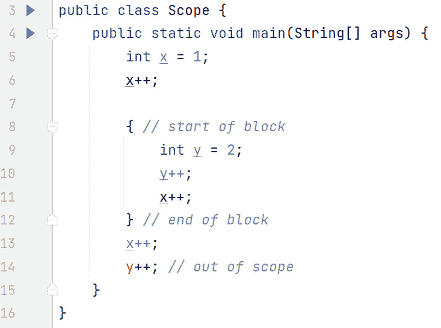

图 4.1 – Java 中的块作用域

在前面的图中，我们在第 5 行声明了一个 `int` 类型的变量 `x` 并将其初始化为 `1`。当前代码块是包围在 `{}` 中的 Java 语句组。因此，`x` 变量的代码块从第 4 行开始，即开括号所在的位置，到第 15 行结束，即闭括号所在的位置。因此，`x` 的作用域从声明它的第 5 行开始，到当前作用域的闭括号第 15 行。当我们第 6 行引用 `x` 时，没有问题，因为 `x` 在作用域内。

在第 8 行，我们使用 `{` 开始一个新的代码块/作用域。尽管有些不寻常，因为第 8 行之前没有代码，但第 8 行到第 12 行定义了一个有效的代码块。注意，外部作用域中的变量可以在内部（嵌套）作用域中可见。这可以在第 11 行看到，在内部作用域中，我们引用了在外部作用域中声明的变量，即 `x`，没有任何问题。

然而，情况并非总是如此；在内部作用域中定义的变量在外部作用域中不可见。`y` 变量的作用域从其声明处（内部作用域的第 9 行）到第 12 行（该作用域的闭括号）。因此，我们在第 14 行得到编译错误，因为在外部作用域中我们引用了 `y` 变量。

缩进

缩进确实有助于识别代码块和作用域。我们使用的风格是在行的末尾开始代码块。例如，在 *图 4.1* 中，注意第 3 行的开括号 `{`。该代码块的闭括号 `}`（以及作用域）在第 16 行。从缩进的角度来看，闭括号 `}` 直接位于第 3 行的 `public` 关键字下方。更具体地说，闭括号直接位于 `public` 中的 'p' 下方。虽然这对编译不是必需的，但它确实使代码更容易阅读和维护——作用域从第 3 行开始，要找到作用域的结束，只需扫描程序以找到匹配的闭括号 `}`，该括号与 `public`（第 3 行）对齐。

第 4 行也定义了一个代码块和作用域。第 15 行包含该作用域的匹配闭括号 `}`——注意闭括号与关键字 `public`（第 4 行）对齐。幸运的是，编辑器在保持代码正确缩进方面非常有帮助。

总结来说，代码块是用 `{}` 定义的。由于 Java 使用代码块作用域，代码块定义了变量可以使用的范围。变量在嵌套作用域中是可见的，但反之则不然。

现在我们已经了解了 Java 中的作用域，让我们来检查 Java 中的条件逻辑。我们将从 `if` 语句开始。

# 探索 if 语句

如其名所示，条件语句基于条件的评估。这个条件的结果是 `true` 或 `false`——换句话说，是一个布尔值。*图 4.2* 介绍了整体 `if` 语句的语法：

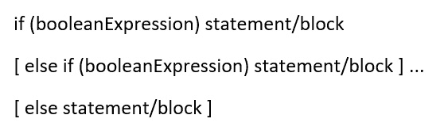

图 4.2 – if 语句的语法

前一个图中的方括号 `[]` 表示某项是可选的。例如，`else if` 语句和 `else` 语句都是可选的。`if` 语句本身是必需的。三个省略号 `...` 表示你可以有任意数量的 `else if` 语句（或者一个都没有）。

现在我们有了整体语法，让我们将其分解成更小的部分。

## `if` 语句本身

如前所述，`if` 语句评估一个 `boolean` 表达式。这个 `boolean` 表达式被括号包围。如果 `if` 子句之后只有一个语句，则界定代码块的括号是可选的。然而，始终显式声明一个代码块被认为是良好的实践。*图 4**.3* 展示了两种风格：


图 4.3 – 简单的 `if` 语句

首先，让我们解释一下代码。注意缩进，这是由代码编辑器自动提供的。这使得更容易看到受各种 `if` 语句控制的语句。第 9 行和第 11 行都展示了简单的 `if` 语句，它们只控制一个语句。第 9 行控制第 10 行。这意味着如果第 9 行是真的，则第 10 行将执行。如果第 9 行是假的，则跳过第 10 行。同样，如果第 11 行是真的：第 12 行将执行；如果第 11 行是假的，则跳过第 12 行。

然而，如果你希望在 `if` 语句为真时执行两个或更多语句，则需要一个代码块。这由第 13 行到第 16 行的代码块演示。如果第 13 行的布尔表达式评估为真，则第 14 行和第 15 行的两个语句都将执行。这是因为它们在一个代码块中。

关于运行程序，当 `x` 初始化为 `5`，`y` 为 `4` 时，当第 9 行执行，它为真（因为 `5 > 4`）。因此，第 10 行执行，因此 *图 4**.3* 的输出是 `5 > 4`。第 11 行和第 13 行都执行了，但它们都评估为假，所以屏幕上没有其他输出。

假设在第 8 行，我们将变量初始化如下：

`int x=4, y=5;`

现在，`if(x > y)` 为假且第 10 行未执行；`if(x < y)` 为真且第 12 行将 `4 < 5` 输出到屏幕上；`if(x == y)` 也为假，因此第 14 行和第 15 行未执行。

最后，让我们通过以下方式更改第 8 行，使变量相等：

`int x=4, y=4;`

现在，`if(x > y)` 为假，所以第 10 行未执行；`if(x < y)` 也为假，所以第 12 行未执行；然而，`if(x == y)` 为真，所以第 14 行将字符串 `s` 构建为 “4 == 4”，第 15 行将其输出。

注意缩进，这是由代码编辑器自动提供的。这使得更容易看到受各种 `if` 语句控制的语句。

## `else if` 语句

在 *图 4**.3* 中，没有代码来处理 `if` 表达式评估为假的情况。这就是 `else if` 语句发挥作用的地方。*图 4**.4* 展示了代码中的 `else if`：


图 4.4 – `else if`语句

由于`x`是 4 而`y`是 5（第 19 行），第 20 行的`if`表达式评估为假，因此控制跳转到第 22 行，那里第一个`else if`被评估。由于这评估为真，第 23 行被执行。*现在，不会评估其他分支*。换句话说，在执行第 23 行之后的下一行代码是第 27 行。请注意，根据良好的编码实践，每个分支都应编码为一个块，即使每个块中只有一个语句。

如果`x`被初始化为`5`，那么第 20 行和第 22 行都会评估为假。第 24 行将是真，因此第 25 行将被执行。

对于`if`和`else if`语句不匹配的情况，我们可以使用`else`语句。现在让我们来讨论这个问题。

## `else`语句

*图 4.4*中的代码评估了比较`x`和`y`时所有可能的情况。`x`可能大于、小于或等于`y`。这种逻辑非常适合引入`else`语句。`else`语句是一个*通配符*。正如*图 4.2*中的`[]`所示，`else`子句是可选的。如果存在，它必须在任何`if`和/或`else if`子句之后编码。*图 4.5*是使用`else`子句重构的*图 4.4*，除了*图 4.5*中的`x`和`y`的值现在相同。


图 4.5 – `else`语句

在*图 4.5*中，由于`x`和`y`都是`4`，第 31 行和第 33 行评估为`false`。然而，第 35 行没有条件，因为它只是一个`else`语句（而不是`else if`）。这意味着从第 35 行开始的代码块将自动执行，第 36 行将被执行。

关于`if else`语句，了解可能出现的微妙问题很重要，这个问题被称为“悬挂的`else`”问题。

### 悬挂的`else`

考虑以下未缩进的代码，它没有使用代码块：

```java
boolean flag=false;                // line 1if (flag)                          // line 2
if (flag)                          // line 3
System .out.println("True True");  // line 4
else                               // line 5
System.out.println("True False");  // line 6
```

这段代码有两个`if`语句但只有一个`else`语句。`else`与哪个`if`匹配？规则是：当`else`语句寻找与`if`匹配时，它将与它向上回溯代码时遇到的最近的*未匹配*`if`匹配。

依照这个规则，`else`语句与第二个`if`（第 3 行）匹配，因为那个`if`语句尚未匹配。这意味着第 2 行的`if`语句仍然未匹配。当使用适当的缩进编写代码时，代码会更加清晰：

```java
if (flag)                    // line 2    if (flag)                // line 3
        System.out.println("True True");     // line 4
    else                    // line 5
        System.out.println("True False");    // line 6
```

这一点通过输出得到证实。如果`flag`为真，输出将是`"True True"`；然而，如果`flag`为假，屏幕上则没有任何输出。有趣的是，现在无法到达第 6 行（因为布尔变量只有两个值：`true`和`false`）。

使用代码块可以使代码更容易理解，如下所示：

```java
if (flag) {    if (flag) {
        System.out.println("True True");
    }
    else {
        System.out.println("True False");
    }
}
```

这就是为什么即使对于一条语句，使用代码块也是非常有帮助的。在整个书中，我们将使用适当的缩进和代码块来帮助清晰和易于理解。

现在，让我们来看一个更复杂的例子。这个例子（以及随后的其他例子）使用了 Java **应用程序编程接口**（**API**）中预定义的`Scanner`类。API 是一套预定义的类型（例如类），可供我们使用。随着我们在书中继续前进，我们将涵盖这些主题，但可以说 API 非常有用，因为它为我们提供了预定义和经过良好测试的代码。

`Scanner`类位于`java.util`包中。因此，我们需要简要讨论这两个包和`Scanner`类。

### 包

包是一组相关的类型，例如类，我们可以使用。方便的是，许多已经为我们准备好了，可以在 API 中使用。

要访问这些类型，我们需要将它们“导入”到我们的代码中。为此，Java 提供了`import`关键字。任何`import`语句都放在文件的顶部。我们可以使用`*`通配符导入整个包；例如：`import java.util.*;`。我们也可以通过在`import`语句中命名它来显式地导入特定类型；例如：`import java.util.Scanner;`。

当你在类型前加上它的包名，例如`java.util.Scanner`，这被称为“完全限定名”。我们可以省略`import`语句，每次简单地使用其完全限定名来引用`Scanner`；换句话说，在提到`Scanner`的地方，将其替换为`java.util.Scanner`。然而，一般来说，导入类型并使用其非限定名是首选的。

有一个包是自动对我们可用的（已导入），那就是`java.lang`包。例如，`String`类位于`java.lang`中，这就是为什么我们永远不需要导入任何东西就能访问`String`类。

### Scanner 类

了解这一点是有帮助的，即虽然`Scanner`是一个多功能的类，但就我们的目的而言，我们只需使用`Scanner`来使我们能够从用户那里检索键盘输入。考虑到这一点，请注意，在示例中使用的`System.in`指的是已经打开并准备好提供输入数据的标准输入流。通常，这对应于键盘。因此，`System.in`非常适合通过键盘从用户那里获取输入数据。`Scanner`类提供了各种解析/解释键盘输入的方法。例如，当用户在键盘上输入一个数字时，`nextInt()`方法会以`int`原生的形式提供这个数字给我们。我们将在示例中使用这些方法。

### 嵌套 if 语句

现在我们已经讨论了包和`Scanner`，在**图 4**.6*和**图 4**.7*中，我们讨论了一个更复杂的`if-else`示例，该示例处理来自用户的输入（通过键盘）。这两个图都与一个示例相关。**图 4**.6*侧重于声明常量以使代码更易读。此外，**图 4**.6*还侧重于声明和使用`Scanner`。另一方面，**图 4**.7*侧重于随后的`if-else`结构。

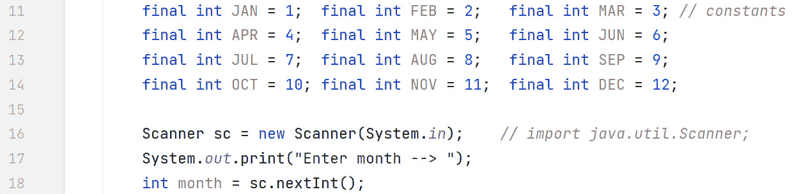

图 4.6 – 使用 Scanner 从键盘获取输入

第 11 到 14 行使用`final`关键字定义常量。这意味着它们的值不能改变。使用大写标识符（单词之间用下划线分隔）作为常量的命名习惯是好的。这将使**图 4**.7*中的代码更易读；换句话说，我们不会比较`month`与`1`（在这个上下文中表示一月），而是将`month`与`JAN`进行比较，这样读起来更好。为了简洁起见，我们每行声明了三个常量，但你也可以轻松地每行声明一个。

在**图 4**.6*的第 16 行创建我们的`Scanner`对象引用，`sc`。本质上，我们创建了一个引用，即`sc`，它指向使用`new`关键字创建的`Scanner`对象。正如之前所述，`System.in`意味着`sc`正在查看键盘。这个引用是我们用来与`Scanner`交互的，就像遥控器用来与电视交互一样。

第 17 行提示用户在键盘上输入一个月份（`1..12`）。这实际上非常重要，因为没有提示，光标就会闪烁，用户会想知道他们应该输入什么。第 18 行是`Scanner`真正发挥作用的地方。在这里，我们使用`nextInt()`方法获取一个数字。目前，只需知道当我们调用`sc.nextInt()`时，Java 不会返回到我们的代码中，直到用户输入了一些内容并按下了回车键。目前，我们将做出（方便的）假设，它是一个整数。我们将返回的`int`原始值存储在我们的`int`原始值`month`中。现在，在我们的代码中，我们可以使用用户输入的内容。**图 4**.7*展示了这一过程。

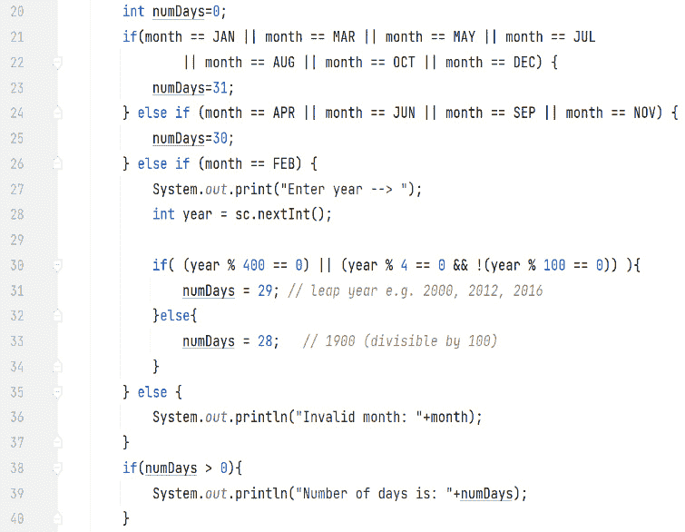

图 4.7 – 一个复杂的 if 语句

注意，前面图像中显示的代码是**图 4**.6*的**延续**。在第 20 行，我们声明了一个`int`变量，即`numDays`，并将其初始化为`0`。第 21 到 22 行是`if`语句的开始。使用`boolean`逻辑或运算符，`if`语句检查`month`值是否与**图 4**.6*中定义的任何常量匹配。在后台，使用常量值，所以实际上，`if`语句如下：

```java
if(month == 1 || month == 3 || month == 5 || month == 7 ||   month == 8 || month == 10 || month == 12)
```

注意，每次都必须指定`month`变量。换句话说，`if(month == JAN || MAR || MAY || JUL || AUG || OCT || DEC)`将**无法**编译。

假设用户输入`1`（代表一月），`month`变为`1`，因此第 21 到 22 行评估为真，第 23 行将`numDays`设置为`31`。如果用户输入`3`、`5`、`7`、`8`、`10`和`12`，分别代表三月、五月、七月、八月、十月和十二月，逻辑相同。

如果用户输入`4`（代表四月），第 21 到 22 行评估为假，第 24 行的`else if`语句将被评估。第 24 行评估为真，第 25 行将`numdays`设置为`30`。如果用户输入`6`、`9`和`11`，分别代表六月、九月和十一月，逻辑相同。

现在，让我们处理用户输入的`2`，代表二月。第 21 到 22 行的`if`条件和第 24 行的`else if`条件都评估为假。第 26 行评估为真。现在，我们需要回顾闰年的逻辑。当然，二月每年都有 28 天（所有月份都是这样！），但在闰年时会有额外的一天。判断是否为闰年的逻辑如下：

+   `year`是 400 的倍数 => 闰年

+   `year`是 4 的倍数且`year`不是 100 的倍数 => 闰年

以下都是闰年：2000 年（满足情况 A），2012 年和 2016 年（都满足情况 B）。

由于闰年算法依赖于年份，我们首先需要从用户那里获取年份。第 27 到 28 行完成了这个任务。然后，我们遇到了从第 30 到 34 行的嵌套`if`语句，它根据前面概述的逻辑确定用户输入的年份是否为闰年。第 30 行实现了 A 和 B 两种情况下的逻辑。判断`year`是否是 400 的倍数是通过`(year % 400 == 0)`实现的。`year`是 4 的倍数且不是 100 的倍数的条件是通过

`(year % 4 == 0 && !( year % 100 == 0))`。通过在它们之间使用逻辑或运算符，使得任一条件满足闰年计算。假设年份为 2000，第 30 行将为真，`numDays`将被设置为`29`。假设年份为 1900，第 30 行的`if`语句为假，由于第 32 行没有条件（它只是一个`else`语句），因此执行第 33 行，将`numDays`设置为`28`。

无效的`month`值，例如`25`或`-3`，会导致第 35 行的`else`分支被执行。结果，第 36 行将输出错误消息到屏幕。

第 38 到 40 行在`numDays`从其初始值`0`改变时输出天数。第 38 行的`if`语句防止在用户输入无效的`month`值时在屏幕上显示消息`"Number of days is: 0"`。

这就结束了我们对`if`语句的处理。现在，让我们来检查两个`switch`语句和表达式，在某些情况下，它们可能是一个更优雅的选择。

# 掌握`switch`语句和表达式

复杂的 `if` 语句，带有许多 `else if` 分支和一个 `else` 分支可能会很冗长。在许多情况下，`switch` 结构可以更加简洁和优雅。让我们从 `switch` 语句开始。

## switch 语句

首先，让我们来检查 `switch` 语句的语法。*图 4.8* 介绍了语法。

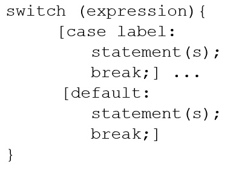

图 4.8 – switch 语句语法

`switch` 语句评估一个表达式。从 Java 21 开始，表达式可以是一个整型原始值（不包括 `long`）或任何引用类型。这意味着我们可以对 `byte`、`char`、`short` 或 `int` 类型的原始变量进行 `switch`，也可以对类类型、枚举类型、记录类型和数组类型进行 `switch`。现在 `case` 标签可以包括一个 `null` 标签。Java 21 还引入了 *switch 的模式匹配*。当涉及到这些主题时，我们将展示另一个 `switch` 示例来演示这个功能（*第九章*）。在此之前，我们将专注于更传统的 `switch`。

包装类型

对于每种原始类型，都有一个相应的类，称为“包装类型”：`byte`（由 `Byte` 包装），`short` (`Short`)，`int` (`Integer`)，`long` (`Long`)，`float` (`Float`)，`double` (`Double`)，`boolean` (`Boolean`)，和 `char` (`Character`)。它们之所以被称为包装类型，是因为它们代表封装原始值的对象。由于它们是类类型，因此有可用的一些有用方法。例如，`int val = Integer.parseInt("22");` 将 `String "22"` 转换为数字 `22`，存储在 `val` 中，我们可以在其中执行算术运算。

刚刚评估的表达式与 `case` 标签进行比较。`case` 标签与 `switch` 表达式具有相同类型的编译时常量。如果与 `case` 标签匹配，则执行相关的代码块（注意：在 `case` 或 `default` 块中不需要花括号）。要退出 `case` 块，请确保插入一个 `break` 语句。`break` 语句退出 `switch` 块。然而，`break` 语句是可选的。如果您省略了 `break` 语句，即使没有匹配，代码也会 *跌入* 到下一个 `case` 标签（或 `default`）。

`default` 关键字用于指定在没有任何 `case` 标签匹配时执行的代码块。通常，它被编码在 `switch` 块的末尾，但这不是强制性的。实际上，`default` 可以出现在 `switch` 块的任何位置，具有类似的语义（然而，这并不是一个好的编程实践）。

*图 4.9* 展示了一个示例。

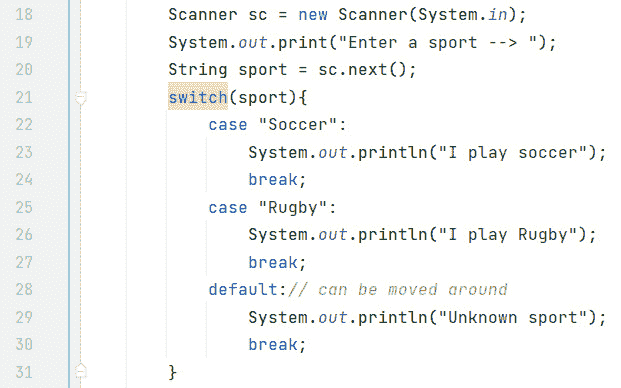

图 4.9 – 在 String 上进行 switch 的示例

使用 `Scanner` 类，第 18 到 20 行会询问并从用户那里检索一项运动。请注意，在这种情况下使用的 `Scanner` 方法是 `next()`，它返回一个 `String` 类型（与原始类型相反）。

第 21 行到第 31 行展示了 `switch` 块。请注意，第 22 行和第 25 行的 `case` 标签都是 `String` 编译时常量。如果用户输入 `"Soccer"`，则第 22 行的 `case` 标签匹配，并且第 23 行和第 24 行都将执行。有趣的是，尽管有两个语句要执行，但这里不需要花括号。这是 `switch` 块的一个特性。由于第 22 行匹配，第 23 行将执行，并且 `"I play soccer"` 将被显示在屏幕上。第 24 行的 `break` 语句确保退出 `switch` 块，并且不执行 `"Rugby"` 部分。

如果用户输入 `"Rugby"`，则第 25 行匹配，并且 `"I play Rugby"` 将被显示在屏幕上。同样，这次在第 27 行的 `break` 语句确保退出 `switch` 块，并且不执行 `default` 部分。

如果用户输入 `"Tennis"`，则第 22 行和第 25 行的 `case` 标签都不会匹配。这时 `default` 部分就派上用场了。当没有任何 `case` 标签匹配时，将执行 `default` 部分。通常，`default` 部分被编码在 `switch` 块的末尾，并且传统上插入 `break` 语句以确保完整性。

`case` 标签是区分大小写的

注意，`case` 标签是区分大小写的。换句话说，在 *图 4**.9* 中，如果用户输入 `"soccer"`，则第 22 行的 `case` 标签不会匹配。自然地，`"Rugby"` 的 `case` 标签也不会匹配。因此，将执行 `default` 部分，并且 `"Unknown sport"` 将被显示（打印）在屏幕上。

让我们来看另一个例子。*图 4**.10* 是一个基于整数的 `switch` 语句。

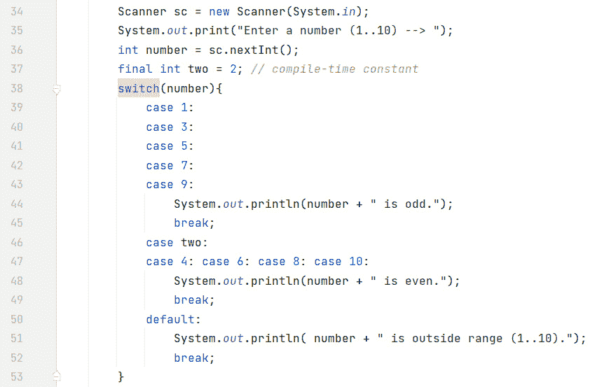

图 4.10 – 整数开关示例

在前面的图中，第 37 行声明了一个编译时常量 `two`，并将其初始化为整数文字 `2`。第 38 行通过切换名为 `number` 的 `int` 变量开始 `switch` 块，该变量在第 36 行根据用户输入声明并初始化。现在 `switch` 块中的所有 `case` 标签都必须是整数——无论是第 39 到 43 行和第 47 行的文本值，还是第 46 行的编译时常量。请注意，如果 `two` 变量不是 `final` 的，将生成编译时错误（因为它不再是常量）。

在这个例子中，我们有多个标签一起，例如，第 39-43 行。这段代码可以读作 *如果数字是 1 或 3 或 5 或 7 或 9，则执行以下操作*。例如，如果用户输入 `1`，第 39 行的 `case` 标签匹配。这被称为 `switch` 语句的 *入口点*。由于第 39 行没有 `break` 语句，代码会 *穿透* 到第 40 行，尽管第 40 行有一个 `case` 标签用于 `3`。同样，第 40 行没有 `break` 语句，代码会 *穿透* 到第 41 行。实际上，代码会从入口点一直执行到遇到 `break` 语句（或 `switch` 语句本身的末尾）。这种 *穿透* 行为使得 *如果是 1 或 3 或 5 或 7 或 9* 类型的逻辑能够工作。如果没有这种 *穿透* 行为，我们就必须为每个 `case` 标签复制第 44 至 45 行！第 44 行使用 `String` 追加输出输入的数字是奇数，通过将 `"is odd"` 追加到数字上——例如，`"7 is odd"`。第 45 行是确保我们退出 `switch` 块的 `break` 语句。

第 46 行只是为了演示编译时常量对 `case` 标签有效。第 47 行显示，如果需要，`case` 标签可以按水平方式组织。记住，缩进和间距的使用只是为了提高人类可读性——编译器只看到一长串字符。因此，第 46 至 47 行与数字 2、4、6、8 和 10 匹配。同样，使用 *穿透* 逻辑来保持代码简洁。第 48 至 49 行输出该数字是偶数，并退出 `switch` 块。

第 50 行是 `default` 部分，用于处理 `1..10` 范围之外的任何数字。第 51 行输出输入的数字超出范围，第 52 行是 `break` 语句。虽然在这里 `break` 语句不是严格必需的（因为 `default` 在 `switch` 语句的底部），但包括它是良好的实践。

让我们用 `switch` 语句重写 *图 4.7* 中的代码，而不是复杂的 `if-else` 语句。请注意，*图 4.6* 仍然适用于声明 `Scanner` 和使用的常量；这就是为什么我们将其分开（这样我们就可以同时使用 `if` 和 `switch` 代码）。*图 4.11* 表示使用 `switch` 语句重构的 *图 4.7*。

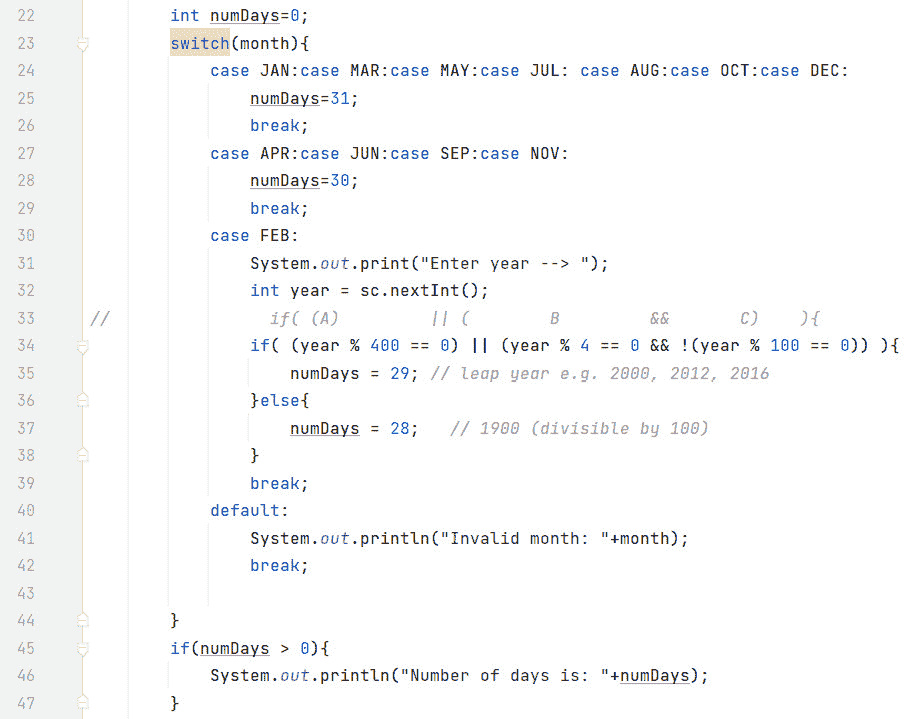

图 4.11 – 使用 switch 语句重构 if 语句

在前面的图中，我们可以看到 `switch` 语句从第 23 行开始。第一组 `case` 标签在第 24 行，第二组在第 27 行。二月，作为特例，有一个单独的 `case` 标签（第 30 行）。最后，`default` 标签在第 40 行。就我个人而言，由于没有像 *图 4.7*（第 21 至 22 行和第 24 行）中所需的多个逻辑 OR 表达式，我认为在这个例子中使用 `switch` 更为可取。

现在我们已经介绍了有效的 `switch` 语句，让我们在 *图 4*.12 中检查一些可能导致编译器错误的情况。

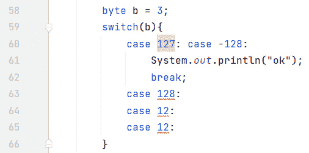

图 4.12 – 一些 switch 编译器错误

在前面的图中，我们正在根据 `byte` 变量 `b` 进行切换。回想一下，有效的 `byte` 范围是 `-128` 到 `+127`。第 60 行演示了最小和最大值是正常的。第 63 行显示，由于 `128` 超出了我们的 `byte` 类型 `b` 的范围，超出 `switch` 变量范围的 `case` 标签会导致编译器错误。第 64 行原本是好的，直到第 65 行使用了相同的 `case` 标签——不允许 `case` 标签重复。

我们将通过讨论 `switch` 表达式来结束对 `switch` 的讨论。

## switch 表达式

与所有表达式一样，`switch` 表达式计算出一个单一值，因此使我们能够返回值。到目前为止的所有 `switch` 示例都一直是 `switch` *语句*，它们不返回任何内容。请注意，在 `switch` 表达式中不允许使用 `break` 语句。

另一方面，`switch` *表达式* 会返回一些内容——无论是隐式地还是显式地（使用 `yield`）。我们很快就会解释 `yield`，但请注意，`yield` 不能在 `switch` 语句中使用（因为它们不返回任何内容）。此外，`switch` 语句可以 *穿透*，而 `switch` 表达式则不能。这些差异在 *表 4.1* 中得到了封装。

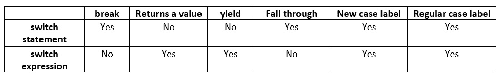

表 4.1 – switch 语句与 switch 表达式的比较

让我们看看一些示例代码来展示这些差异。*图 4*.13 是传统的 `switch` 语句。

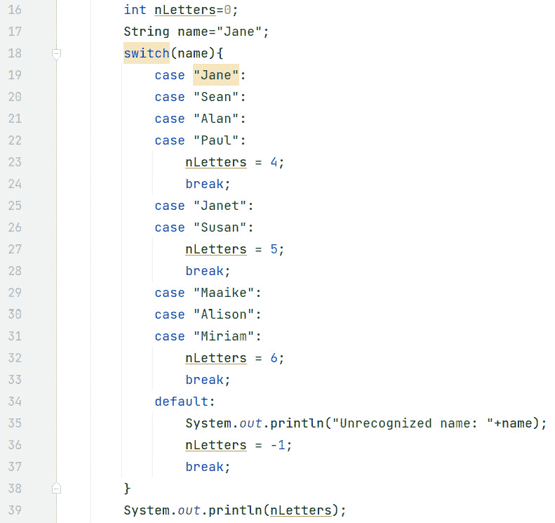

图 4.13 – 一个传统的 switch 语句

在前面的图中，我们正在根据 `String` 变量 `name` 进行切换。由于它被初始化为 `"Jane"`，第 19 行为真，第 23 行将 `nLetters` 设置为 `4`（"Jane" 中的字母数量）。第 24 行的 `break` 语句确保没有穿透到第 27 行。第 39 行将 `4` 输出到屏幕上。

注意，代码相当冗长，需要正确使用 `break` 语句来防止穿透。此外，这些 `break` 语句编写起来很繁琐，很容易忘记。*图 4*.14 表示使用 `switch` 表达式编写的 *图 4*.13。

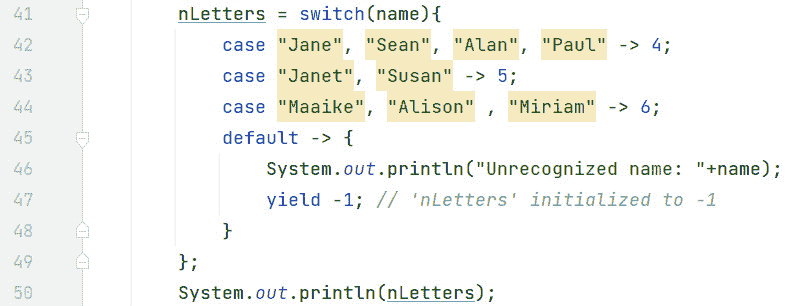

图 4.14 – switch 表达式

前面的图示显示了新的`case`标签，其中标签以逗号分隔，并且一个箭头符号将标签与表达式（或代码块）分开。任何地方都不需要`break`语句，因为没有需要担心的穿透行为。由于`name`仍然是`"Jane"`（来自*图 4.13*，第 17 行），第 42 行被执行，将`4`初始化/返回到`nLetters`中。因此，第 50 行输出`4`。请注意，`switch`表达式中的`case`标签列表必须是详尽的。在几乎所有情况下，这意味着需要一个`default`子句。在这个例子中，`default`子句执行一个代码块（第 45-48 行），其中将错误输出到屏幕上，并使用`yield`关键字，将`nLetters`初始化为（错误值）`-1`。

我们可以通过直接将表达式值返回到`System.out.println()`语句来省略对`nLetters`变量的需求。*图 4.15*展示了这一点。

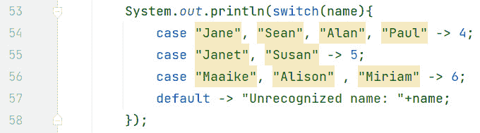

图 4.15 – 一个直接返回到 System.out.println()的 switch 表达式

在前面的图示中，没有变量用于存储`switch`表达式的结果。这使得代码更加简洁。`switch`表达式的结果直接返回到`System.out.println()`语句中。同样，`4`被输出到屏幕上。

### yield 关键字

*图 4.14*和*图 4.15*是简单的`switch`表达式，其中（大部分情况下），箭头符号右侧是返回的值。然而，如果你不仅想返回一个值，还想执行一个代码块，那么`yield`就派上用场了。*图 4.16*展示了在`switch`表达式中使用`yield`。

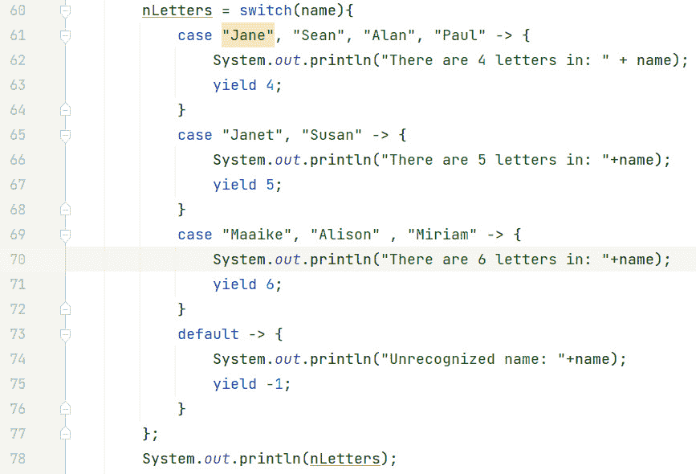

图 4.16 – 使用 yield 的 switch 表达式

前面的图示强调了这样一个事实，如果你需要在`switch`表达式中执行多个语句，你必须提供一个代码块。这通过第 61-64 行、65-68 行、69-72 行和 73-76 行的花括号来展示。要从代码块返回一个表达式结果，我们使用`yield`。这就是第 63、67、71 和 75 行所做的工作，分别返回`4`、`5`、`6`和`-1`。由于`name`仍然是`"Jane"`，第 63 行从`switch`表达式中返回`4`，将`nLetters`初始化为`4`。因此，第 78 行输出`4`。

为了增加灵活性，你可以在一定程度上混合语法。换句话说，在`switch`表达式中可以使用常规的`case`标签，在`switch`语句中可以使用新的`case`标签语法。然而，如前所述，`break`只出现在`switch`*语句*中，而`yield`（如果需要）只出现在`switch`*表达式*中。*图 4.17*是对*图 4.13*中冗长的`switch`语句的重构，其中使用了新的`case`标签。


图 4.17 – 使用新`case`标签和箭头标记的`switch`语句

在前面的图中，标签是逗号分隔的，并且存在箭头标记。和之前一样，在箭头标记的右侧，我们有`nLetters`的初始化，即名字中的字母数。然而，与*图 4.13*不同，因为我们使用了箭头标记，所以不需要`break`语句。然而请注意，根据`default`子句（第 86-89 行），代码块需要大括号。

我们也可以使用常规的`case`标签与`switch`表达式一起使用。这如图 4.18 所示，它是图 4.16 的重构版本。


图 4.18 – 使用旧式`case`标签的`switch`表达式

在前面的图中，使用了旧式的`case`标签。这意味着关键字`case`必须在每个标签之前。然而，代码块的括号可以省略。由于这是一个`switch`表达式，当找到匹配时，会有多个语句需要执行，因此我们需要使用`yield`来返回表达式结果。由于`name`变量在整个示例中从未从`"Jane"`改变，因此在第 95 行进行匹配，导致第 99 行将`"There are 4 letters in: Jane"`输出到屏幕。第 100 行的`yield`返回`4`，因此`nLetters`被初始化为`4`。最后，第 114 行将`4`输出到屏幕。

这完成了我们对`switch`表达式以及一般`switch`语句的处理。现在，我们将所学应用到实践中。

# 练习

我们最终拥有了做出决策的编码能力。中生代伊甸园将因此受益匪浅。让我们展示我们新获得的本领，怎么样？

1.  我们需要确定恐龙是肉食性还是草食性。编写一个`if`语句，根据布尔变量打印恐龙是肉食性还是草食性。这些信息对于饲养和护理指南至关重要。

1.  不同的物种需要不同的护理策略，并表现出独特的行为特征。编写一个`switch`语句，根据恐龙的物种打印恐龙的描述。这将有助于教育员工和公园游客。

1.  有些恐龙比其他恐龙更难处理。编写一个`if`语句，检查是否有足够的经验来处理某种类型的恐龙。这确保了我们的恐龙和员工的安全。

1.  我们正在与美丽但危险的生物打交道。所以，安全第一。编写一个程序，如果公园的安全评级低于某个阈值，则打印警告信息。我们必须始终保持警惕，以防止可能伤害我们的员工、游客或恐龙的问题。

1.  适当的住所对于恐龙的幸福至关重要。编写一个`switch`语句，根据恐龙的大小（XS、S、M、L 或 XL）将其分配到特定的围栏。

1.  适当的营养对于维持我们恐龙的健康至关重要。编写一个`if`语句，根据恐龙的体重确定其每天所需的喂食次数。

1.  正确地委派任务是保持运营顺利的重要因素。创建一个程序，使用`switch`语句根据员工的职位分配不同的职责。

1.  公园不是全天 24 小时对日间游客开放。编写一个`if`语句，根据时间检查公园是否对日间游客开放。他们从上午 10 点到下午 7 点对日间游客开放。这有助于管理游客的期望和员工的时间表。

# 项目 – 任务分配系统

中生代伊甸园的经理需要一个系统化的方法来管理团队并确保所有任务都高效完成。

设计一个简单的程序，根据员工的角色（例如，喂食、清洁、安全和导游）将任务分配给中生代伊甸园的员工。该程序应根据时间、员工的角色和其他因素（如公园的安全评级）来决定任务。

这个程序不仅可以帮助简化运营，还可以确保我们员工、游客以及最重要的是恐龙的安全和满意度！

# 摘要

在本章中，我们首先解释了 Java 使用块作用域。一个块由`{}`界定。一个变量从声明点可见到该块的结束`}`。由于块（以及因此作用域）可以嵌套，这意味着在块中定义的变量对任何内部/嵌套块都是可见的。然而，反之则不成立。在内部块中声明的变量在外部块中不可见。

条件语句使我们能够做出决定，并基于条件的评估结果为真或假。`if`语句允许评估多个分支。一旦某个分支评估为真并执行，则不会评估其他分支。`if`语句可以单独编码，而不需要任何`else if`或`else`子句。`else if`和`else`子句是可选的。然而，如果存在`else`子句，它必须是最后一个子句。我们看到了一个复杂的`if`示例如何导致代码冗长。

我们简要讨论了包和`Scanner`类。`Scanner`类位于`java.util`包中，对于从用户那里获取键盘输入非常有用。

我们还讨论了`switch`语句和`switch`表达式。一个表达式可以返回一个值，但一个语句不能。我们看到了`switch`语句如何使复杂的`if`语句更加简洁和优雅。你`switch`上的表达式（通常是变量）可以是原始类型`byte`、`char`、`short`或`int`；或者是一个引用类型。`case`标签必须是编译时常量，并且必须在`switch`变量的范围内。`switch`语句有一个穿透特性，这使得多个`case`标签可以使用相同的代码段而不需要重复。然而，这种穿透行为需要`break`语句来退出`switch`语句。这需要小心，因为`break`语句很容易忘记。

`switch`表达式可以返回一个值。它们没有穿透逻辑，所以不需要`break`语句。这使得代码更加简洁且错误更少。如果你想在`switch`表达式中执行一个代码块，请使用`yield`来返回值。

`switch`语句不支持`yield`（因为它们不返回任何内容），而`switch`表达式不支持`break`（因为它们必须返回某些内容）。然而，两种`case`标签，即旧式的`case X:`和新式的`case A, B, C ->`，都可以与`switch`语句或`switch`表达式一起使用。

现在我们知道了如何做出决策，我们将在下一章中继续讨论迭代，我们将检查 Java 结构，这些结构使我们能够重复执行语句。
