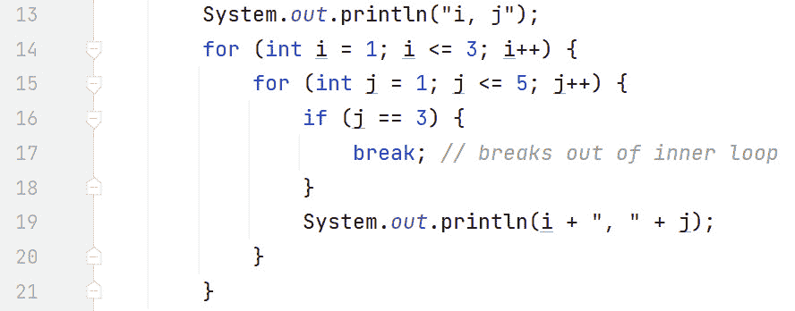

# 第五章：理解迭代

在 *第四章* 中，我们学习了 Java 中的作用域和条件语句。作用域决定了标识符的可见性——换句话说，你可以在哪里使用它们。Java 使用块作用域，由花括号 `{}` 定义。作用域可以嵌套，但不能反过来。

我们讨论了 `if` 语句的变体。这些语句中的每一个都会评估一个布尔条件，结果为真或假。如果为真，则执行该分支，不评估其他分支。如果为假，则评估下一个分支。除非存在 else 子句，否则可能根本不会执行任何分支。

对于复杂的 `if` 语句，Java 支持更优雅的 `switch` 结构。我们考察了 `switch` 语句及其 *穿透* 行为，以及 `break` 语句的使用。此外，我们还讨论了 `switch` 表达式，其中可以返回一个值，以及它们使用 `yield` 的方式。

现在我们已经了解了条件逻辑，让我们来考察迭代（循环）。循环结构使我们能够重复执行语句和/或代码块有限次数，直到布尔条件为真或直到数组/集合中还有更多条目。到本章结束时，你将能够使用 Java 的循环结构。

在本章中，我们将涵盖以下主要主题：

+   `while` 循环

+   `do-while` 循环

+   `for` 循环

+   增强的 `for` (`for-each`) 循环

+   `break` 和 `continue` 语句

# 技术要求

本章的代码可以在 GitHub 上找到，地址为 [`github.com/PacktPublishing/Learn-Java-with-Projects/tree/main/ch5`](https://github.com/PacktPublishing/Learn-Java-with-Projects/tree/main/ch5)。

# `while` 循环

任何编程语言的一个重要特性是能够重复执行一个动作。这被称为“循环”。我们可能想要有限次数地重复一段代码，或者直到满足某个条件；例如，用户输入一个值表示循环应该终止。在大多数情况下，可以使用布尔表达式来确定循环是否继续。

`while` 循环是这样一种循环结构。只要布尔表达式为真，它就会重复执行一个语句或代码块。一旦布尔表达式为假，循环就会退出，然后执行 `while` 循环之后的下一个语句。


图 5.1 – `while` 循环语法

在前面的图中，我们假设了一段代码块，因此有花括号 `{}`。当然，你可以省略花括号 `{}`，循环将只重复执行一个语句（以分号结束）。有趣的是，由于布尔表达式可能一开始就是假的，`while` 循环可能根本不会执行。更正式地说，`while` 循环执行 *零* 次或多次。让我们看看一些例子。*图 5.2* 展示了一个简单的 `while` 循环：


图 5.2 – 一个简单的 while 循环

在前一个图中的第 9 行，局部变量`x`被初始化为`1`。第 11 行评估布尔表达式`x <= 3`。由于`x`是`1`，布尔表达式为 true，循环执行。第 12 行输出`"Loop: 1"`，第 13 行将`x`增加到`2`。第 14 行的`}`符号被到达，循环条件（第 11 行）会自动重新检查是否仍然成立。由于`x`现在是`2`且`2 <= 3`为 true，条件为 true，我们重新进入循环。第 12 行输出`"Loop: 2"`，第 13 行将`x`增加到`3`。在第 14 行达到代码块的末尾，再次，循环继续表达式被重新评估。由于表达式`3 <= 3`为 true，循环再次执行。第 12 行输出`"Loop: 3"`，第 13 行将`x`增加到`4`。再次，达到代码块的末尾并重新评估循环继续表达式。由于`x`现在是`4`且`4 <= 3`为 false，循环退出。这由第 15 行输出`"Final x value is: 4"`所示。

注意，如果在第 9 行，`x`被初始化为`11`（而不是`1`），那么第 11 行的初始布尔表达式将被评估为 false，循环将根本不会执行。

当你不知道循环将迭代多少次时，`while`循环非常有用。例如，循环继续表达式可能基于用户输入。*图 5.3*就是这样一种循环。


图 5.3 – 基于用户输入结束的 while 循环

在前一个图中，展示了一个求和算法，该算法用于累加用户输入的正数序列。循环将一直进行，累加用户输入的数字，直到输入一个负数。这个负数自然地，不是总和的一部分。让我们更详细地讨论一下。

第 19 行声明了一个局部`int`变量`sum`并将其初始化为`0`。第 20 行声明了一个局部布尔变量`keepGoing`并将其设置为 true。第 21 行的布尔表达式评估为 true（由于第 20 行），因此循环块执行。第 22 行声明了我们的`Scanner`引用`sc`指向键盘。第 23 行提示用户输入一个数字，同时告知用户任何负数将终止循环。第 24 行使用`Scanner`方法`nextInt()`从用户那里获取一个整数（整数）。这个数字被存储在局部变量`n`中。第 25 行检查是否输入了一个负数。如果是这样，第 26 行将`keepGoing`标志设置为 false，这样循环就不会再次执行。如果用户输入了一个非负整数，那么输入的数字`n`将被添加到运行总和`sum`中。

让我们通过一个例子来了解一下。我们将添加以下数字：`1`、`2`和`3`，总共是 6。这是屏幕输出的样子：

```java
Enter a number (negative number to exit) -->1
Enter a number (negative number to exit) -->
2
Enter a number (negative number to exit) -->
3
Enter a number (negative number to exit) -->
-1
Sum of numbers is: 6
```

让我们来检查代码中正在发生的事情。循环（第 21 行）被进入，因为第 20 行将`keepGoing`布尔值设置为 true。然后我们被提示输入第一个数字（第 23 行）。我们输入`1`，导致第 24 行将`n`初始化为`1`。由于`n`是`1`，第 25 行的`if`语句为假，执行`else`块（第 27-29 行）；将`sum`设置为`1`（0 + 1）。

达到循环块末尾（第 30 行），循环继续表达式自动重新评估（第 21 行）。由于`keepGoing`仍然为 true，循环继续。我们被提示输入第二个数字；我们输入`2`，`sum`变为`3`（1 + 2）。

再次达到循环块末尾，并且由于`keepGoing`仍然为 true，循环继续。我们被提示输入下一个数字；我们输入`3`，`sum`变为`6`（3 + 3）。

再次，达到循环块末尾，并且由于`keepGoing`仍然为 true，循环继续。我们被提示输入下一个数字。这次我们输入`-1`。由于`n`现在是负数，第 25 行的`if`语句为真，`keepGoing`被设置为 false（第 26 行）。现在，当下一次评估循环继续表达式时，由于`keepGoing`为 false，循环退出。

最后，第 31 行输出`"数字之和是：6"`。

现在我们已经介绍了`while`循环，让我们来考察它的近亲，`do-while`循环。

# do-while 循环

正如我们在`while`循环中看到的那样，布尔循环继续表达式位于循环的开始。尽管与`while`循环相似，但`do-while`循环在一点上有所不同：在`do-while`循环中，循环继续表达式位于循环的*末尾*。因此，`do-while`循环至少执行*一次*。更正式地说，`do-while`循环执行*一次或多次*。

*图 5.4*展示了`do-while`循环的语法。


图 5.4 – do-while 循环语法

如前图所示，循环继续表达式位于循环的末尾，在第一次循环迭代之后。注意在`)`之后有一个分号，`;`。

*图 5.5*展示了*图 5.2*的`do-while`版本。


图 5.5 – 基于用户输入结束的 do-while 循环

在前面的图中，与*图 5.2*相比，唯一的区别是第 21 行和第 30 行。在第 21 行，我们简单地进入循环，因为在`while`循环中，没有条件阻止我们这样做。第 30 行检查是否可以重新进入循环。其余的代码相同，执行也相同。

虽然（请原谅这个双关语）给出的两个示例在结果上没有实质性的区别，但让我们考察一个使用`while`循环而不是`do-while`循环更可取的情况。

## while 与 do-while

如前所述，`do-while`循环至少执行一次，而`while`循环可能根本不执行。这在某些情况下非常有用。让我们看看这样一个例子。*图 5.6*展示了一个检查一个人是否达到法定年龄购买酒精（在爱尔兰是 18 岁）的`while`循环。


图 5.6 – 防止未成年购买酒精的`while`循环

在前面的图中，第 49 行声明了`Scanner`并将其指向键盘，这样我们就可以获取用户输入。第 50 行提示用户输入他们的年龄。第 51 行接收用户输入并将其存储在局部变量`age`中。第 52 行很重要。该条件防止循环使用无效的`age`执行。循环本身很简单，只是输出包含`age`的消息，这样我们就可以验证循环是否正确执行。

第 57 到 58 行非常重要，因为它们使我们能够提示并从用户那里获取一个新的`age`。代码故意覆盖了`age`变量。如果我们不这样做，那么`age`将保持为用户首次输入的值，我们将有一个无限循环。因此，第一个年龄是在进入`while`循环之前输入的，而其他每个年龄都是在循环的末尾输入的。这是`while`循环中的常见模式。第 52 行的条件防止任何小于 18 岁的`age`输入进入循环。

这是*图 5.6*中代码的第一次运行：

```java
Please enter your age -- >21
As you are 21 years of age, you can purchase alcohol.
Please enter your age -- >
12
```

前两行：提示和用户输入，在`while`循环之前，由于 21 岁大于等于 18 岁，我们进入了循环。消息`As you are 21 years of age, you can purchase alcohol.`是完全正确的。最后两行：重复提示和用户输入，来自循环的底部。我们输入了`12`，这导致`while`循环终止。

如果在提示输入第一个年龄时我们输入`12`，以下是将显示的输出：

```java
Please enter your age -- >12
Process finished with exit code 0
```

重要的是，关于购买酒精的消息**没有**出现。

现在，让我们看看`do-while`版本。*图 5.7*展示了*图 5.6*中`while`循环的`do-while`版本。


图 5.7 – 防止未成年购买酒精的`do-while`循环

为了使代码尽可能相似，第 49 到 51 行保持不变。第 52 和 59 行是唯一有所更改的地方。现在条件位于循环的末尾，循环迭代一次之后。当我们从`12`岁开始时，这会产生影响，如输出所示：

```java
Please enter your age -- >12
As you are 12 years of age, you can purchase alcohol.
Please enter your age -- >
12
Process finished with exit code 0
```

输出的第三行存在问题。显然，12 岁太小，不能购买酒精，但`do-while`循环需要`if`语句来保护其代码，而`while`循环则自动提供这种保护。因此，在这个例子中，使用`while`循环而不是`do-while`循环具有实质性的优势。

现在我们已经介绍了`while`循环和`do-while`循环，让我们现在讨论`for`循环。

# for 循环

`for`循环有两种风格：传统的`for`循环和增强的`for`循环。增强的`for`循环也被称为`for-each`循环，它专门设计用来与数组集合一起工作。我们将首先检查传统的`for`循环。

## 传统 for 循环

这种类型的`for`循环在你事先知道要执行多少次迭代时非常有用。其语法在*图 5**.8*中有详细说明。


图 5.8 – 传统的 for 循环

上一个图中的代码块是可选的。我们可以简单地控制一个语句，例如`System.out.println("Looping");`，并省略`{}`。`for`头是`()`内的部分。它由三个部分组成，由分号分隔：

+   `i`、`j`、`k`等等。

+   `while`循环和传统的`for`循环可以互换使用。

+   **增量/减量部分**：这是你增加/减少循环控制变量（在初始化部分声明）的地方，以便循环终止。

我们必须理解循环执行的顺序。换句话说，哪个部分被执行，何时执行。*图 5**.9*，展示了一个简单的`for`循环，将有助于这一点。


图 5.9 – 一个简单的传统 for 循环

在这个图中，代码执行的顺序用数字顺序表示如下：

1.  `i`被声明并初始化为`1`。

1.  **布尔表达式**：评估布尔表达式以确定是否可以执行循环。因为 1 <= 3，所以可以进入循环。

1.  显示到屏幕上。

1.  `i`从`1`增加到`2`，然后执行跳转到布尔表达式。

1.  **评估布尔表达式**：因为 2 <= 3，所以循环被执行。

1.  将`2`显示到屏幕上。

1.  **从 2 增加到 3 增加 i**：然后跳转到布尔表达式。

1.  **评估布尔表达式**：因为 3 <= 3，所以循环被执行。

1.  将`3`显示到屏幕上。

1.  **从 3 增加到 4 增加 i**：然后跳转到布尔表达式。

1.  **评估布尔表达式**：因为 4 不是<= 3，所以循环退出。

总结来说，初始化部分仅在循环开始时执行一次。布尔表达式被评估，并且假设它是真的，那么循环体将被执行，随后是增量/减量部分。布尔表达式再次被评估，并且再次假设它是真的，那么循环体将被执行，随后是增量/减量部分。这种循环体执行后跟增量/减量部分的重复执行会一直持续到布尔表达式失败，循环退出。

*图 5**.10*展示了一个从`3`递减到`1`的`for`循环，每次递减 1：


图 5.10 – 一个按降序操作的简单 for 循环

在前面的图中，我们将 `i` 初始化为 `3` 并检查布尔表达式。由于 `3 >= 1`，我们进入循环并输出 `3`。然后我们将 `i` 减少到 `2` 并再次检查布尔表达式。由于 `2 >= 1`，我们输出 `2` 并将 `i` 减少到 `1`。由于布尔表达式仍然为真，我们输出 `1` 并将 `i` 减少到 `0`。此时，由于 `i` 为 `0`，布尔表达式为假，循环终止。

*图 5**.11* 展示了一些代码示例，使我们能够进一步讨论这个循环结构。


图 5.11 – 附加的传统 for 循环

在前面图中的第一个循环（第 20-22 行）中，需要注意的重要事情是 `;` 符号，它位于 `for` 标头的 `)` 符号之后。这个循环控制一个空语句！尽管缩进可能暗示了其他情况，但随后的代码块与循环没有任何关系，因此输出中只出现一次 `"Looping"`。实际上，循环迭代了三次，每次都没有做任何事情。第 21 行周围的代码块不基于任何条件，并且只执行一次（像正常一样）。

在第二个循环（第 24-26 行）中，循环控制变量 `i` 从 `10` 开始，每次增加 10，直到达到 `60`，此时循环终止。每个有效的 `i` 值都会输出到屏幕上——换句话说，`10`、`20`、`30`、`40` 和 `50`。请注意，第 27 行无法编译，因为前面循环中声明的每个 `i` 变量只在其各自的循环范围内有效。例如，第 20 行声明的 `i` 变量仅在直到第 22 行可用；同样，第 24 行声明的 `i` 变量仅在直到第 26 行可用。注意：显然，为了使代码编译和运行，第 27 行必须被注释掉。

最后一个循环（第 29-31 行）显示我们可以声明多个循环控制变量并在整个循环中使用它们。在这个循环中，我们声明了 `i` 和 `j` 并将它们都初始化为 `0`。布尔表达式为真，因为 `i < 1` 和 `j < 1` 都为真（true && true == true）。因此，我们执行循环并输出 `0` 和 `0`。然后 `i` 和 `j` 都增加到 `1`。循环条件失败，循环终止。

虽然 `for` 循环将在 *第六章* 中详细讨论，但由于 `for` 循环与数组如此自然地匹配，我们在此也插入了一些示例。让我们首先检查传统的 `for` 循环如何用于处理数组。

### 处理数组

任何`for`循环都适用于遍历数组。数组简单地说是一个分配了内存并赋予标识符名称的区域，以便于引用。数组由元素组成，这些元素按连续的内存位置组织 – 换句话说，数组元素在内存中紧挨着。这使得使用循环处理数组变得容易。

数组中的每个元素都通过索引来访问。关键的是，数组索引从`0`开始，每次递增 1。因此，最后一个有效的索引是数组大小减一。例如，大小为`5`的数组有有效的索引`0`、`1`、`2`、`3`和`4`。*图 5.12*是一个处理数组的循环。


图 5.12 – 使用传统 for 循环处理数组

在这个图中，第 33 行声明了一个包含值`1`、`2`和`3`的`int`数组，分别位于索引`0`、`1`和`2`。数组的长度，可以通过`length`属性访问，是`3`。`for`循环（第 34-35 行）处理数组，逐个输出每个位置。因此，当`i`为`0`时，`ia[0]`将`1`输出到屏幕上；当`i`为`1`时，`ia[1]`输出`2`，当`i`为`2`时，`ia[2]`输出`3`。

现在我们已经介绍了传统的`for`循环，让我们来考察增强型`for`循环。

## 增强型 for 循环

如前所述，增强型`for`循环，也称为`for-each`循环，非常适合处理数组以及/或者集合。我们将在*第十三章*中详细讨论集合。目前，只需想象一个集合是一个*列表*的项目。增强型`for`循环允许你逐个元素遍历列表。增强型`for`循环的语法在*图 5.13*中概述。


图 5.13 – 增强型 for 循环语法

在前面的图中，我们可以看到一个变量的声明。变量的类型与数组/集合的类型相匹配。例如，如果数组是一个`String`数组，那么`String`就是变量的数据类型。变量名当然由我们决定。再次强调，代码块是可选的。

让我们通过一个例子来进一步解释。*图 5.14*是*图 5.12*中展示的传统`for`循环的增强型`for`循环版本。


图 5.14 – 使用增强型 for 循环处理数组

在这个图中，第 38 行的内容如下：*对于数组（ia）中的每个 int n*。因此，在第一次迭代中，`n`是`1`；在第二次迭代中，`n`是`2`；在最后一次迭代中，`n`是`3`。在增强的`for`循环中，我们不必自己跟踪循环控制变量。虽然这很有用，但请注意，你被限制从数组的开始处开始，逐个元素前进，直到达到末尾。使用传统的`for`循环，这些限制都不适用。

然而，使用传统的`for`循环，如果你错误地编码了增量/减量部分，你可能会陷入无限循环。在增强的`for`版本中这是不可能的。

## 嵌套循环

当然，循环可以嵌套。换句话说，循环可以编码在其他循环内。**图 5.15**展示了这样一个例子。


**图 5.15** – 嵌套循环

此程序的输出以**图 5.16**展示。在前面的图中，我们表示一个`int`值数组，即`data`，为一个直方图（表示为一行星号）。数组在 12 行声明。第 14 行输出一行文本，以便程序输出更容易解释。输出有三个列：当前数组索引、该索引处`data`数组中的值，以及直方图。注意，输出是制表符分隔的。这是通过使用`\t`转义序列实现的。

转义序列

转义序列是前面带有反斜杠的字符。例如，`\t`是一个有效的转义序列。当编译器看到`\`时，它会向前查看下一个字符，并检查这两个字符是否组成一个有效的转义序列。常见的转义序列如下：

`\t`: 在文本此点插入制表符

`\b`: 在文本此点插入退格符

`\n`: 在文本此点插入换行符

`\"`: 在文本此点插入双引号

`\\`: 在文本此点插入反斜杠

在某些情况下，它们非常有用。例如，如果我们想将文本*我的名字是“Alan”*（包括双引号）输出到屏幕上，我们会说：

`System.out.println("My name` `is \"Alan\"");`

如果我们没有在`Alan`中的`A`之前转义双引号（换句话说，如果我们尝试`System.out.println("My name is "Alan");`），那么`Alan`前的双引号将与字符串开头的第一个`"`匹配。这将导致编译器错误，错误出现在`Alan`中的`A`。

通过在`Alan`中的`A`之前跳过双引号，编译器不再将那个双引号视为字符串结束的双引号，而是将`"`插入到要输出的字符串中。同样，在`Alan`中的`n`之后的双引号也是如此——它也被跳过，因此被视为字符串结束的双引号并插入到要输出的字符串中。然而，在`)`之前的双引号没有被跳过，它被用来匹配字符串的开头双引号，即`(`之后的那个。

外层循环（第 15-21 行）遍历`data`数组。由于数组有 4 个元素，有效的索引是`0`、`1`、`2`和`3`。这些是第 15 行声明的`i`循环控制变量将表示的值。第 16 行输出了两列：当前数组索引和`data`数组中该索引的值。例如，当`i`为`0`时，`data[0]`是`9`，所以输出`"0\t9\t"`；当`i`为`1`时，`data[1]`是`3`，所以输出`"1\t3\t"`，依此类推。

内层循环（第 17-19 行）输出实际的直方图，作为一排水平的星号。内层循环控制变量`j`从`1`到`data[i]`的值。例如，如果`i`是`0`，`data[i]`是`9`；因此，`j`从`1`到`9`，每次输出一个星号。请注意，使用的是`print()`方法而不是`println()`——这是因为`println()`会自动将你带到下一行，而`print()`则不会。由于我们希望星号水平输出，`print()`正是我们需要的。当我们输出一排星号后，我们执行`System.out.println()`（第 20 行），这会将我们带到下一行。

*图 5.16*表示了*图 5.15*中的代码输出。


图 5.16 – 图 5.15 中的代码输出

在这个图中，你可以看到第一列是数组索引。第二列是`data`数组在该索引处的值，第三列是基于第二列的星号直方图。例如，当`i`为`2`时，`data[2]`是`5`，我们输出一个包含`5`个星号的直方图。

现在我们已经了解了循环，我们将继续讨论两个与循环特别相关的关键字，即`break`和`continue`。

# break 和 continue 语句

`break`和`continue`语句都可以用在循环中，但它们的语义非常不同。在提供的代码示例中，我们将使用嵌套循环来对比带标签的版本和不带标签的版本。我们将从`break`语句开始。

## break 语句

我们已经在`switch`语句中遇到了`break`。当在循环中使用时，循环会立即退出。*图 5.17*展示了嵌套的`for`循环，其中内层循环有一个`break`。



图 5.17 – 展示循环中的 break

在这个图中，外循环由`i`控制，从`1`开始循环到`3`，每次增加 1。内循环由`j`控制，从`1`开始循环到`5`，每次增加 1。

第 16 行的`if`语句在`j`为`3`时变为真。此时，执行第 17 行的`break`语句。没有标签的`break`语句退出最近的包围循环。换句话说，第 17 行的`break`指的是第 15 行（由`j`控制）的循环。由于两个循环的结束`}`之间没有代码（第 20 行和第 21 行），当在这个程序中执行`break`时，接下来执行的代码是外循环的`}`（第 21 行）。自动地，外循环的下一个迭代`i++`（第 14 行）开始。实际上，输出中永远不会出现`j`值为`3`或更高的值，因为当`j`为`3`时，我们跳出内循环并从`i`的下一个值开始。输出反映了这一点：

```java
i, j1, 1
1, 2
2, 1
2, 2
3, 1
3, 2
```

没有任何`break`语句，换句话说，如果我们注释掉第 16 到 18 行，输出将如下（注意`j`的值从 1 到 5）：

```java
i, j1, 1
1, 2
1, 3
1, 4
1, 5
2, 1
2, 2
2, 3
2, 4
2, 5
3, 1
3, 2
3, 3
3, 4
3, 5
```

在我们讨论带标签的`break`之前，我们将简要讨论标签本身。

### 标签

标签是一个区分大小写的标识符，后跟一个冒号，紧接在要标识的循环之前。例如，以下代码为`i`控制的循环定义了一个有效的标签`OUTER`：

```java
OUTER:for (int i = 1; i <= 3; i++) {
    for (int j = 1; j <= 5; j++) {
```

现在，让我们看看带标签的`break`本身。

### 带标签的断点

使用标签的`break`语句退出由该标签标识的循环。带标签的`break`语句必须在该循环的范围内。换句话说，你不能将`break`到代码中的其他地方，与当前作用域完全不相关。*图 5**.18*与*图 5**.17*中的代码密切相关，但这次使用了标签和带标签的`break`。


图 5.18 – 带标签的断点

在前面的图中，我们在第 26 行将外循环标记为`OUTERLOOP`。是的，想出这个标识符花了一些时间！请注意，在标签和循环之间有任何代码都是编译错误。这就是为什么第 25 行在标签之前的原因。

循环控制变量`i`和`j`的行为与之前相同；`i`从`1`开始，每次增加 1，直到`3`；在`i`的每个步骤中，`j`从`1`开始，每次增加 1，直到`5`。然而，这次当内循环中的`j`为`3`时，我们不是跳出内循环，而是跳出外循环。在执行带标签的`break`（第 30 行）之后，不再有`i`的迭代，接下来执行的是第 35 行的`System.out.println("here")`。因此，输出如下：

```java
i, j1, 1
1, 2
here
```

如所示，一旦`j`达到`3`，外循环就会退出，并输出`here`。

现在，让我们看看`continue`语句。

## continue 语句

`continue`语句只能出现在循环内部。当执行时，`continue`表示“跳转到循环的*下一个*迭代”。当前迭代中剩余的任何其他语句都将被跳过。还有一个带标签的版本。我们将首先检查无标签版本。*图 5**.19*展示了`continue`的一个示例。


图 5.19 – `continue`示例

在前面的图中，嵌套循环与之前相同 – 外部循环从`1`迭代到`3`；在其内部，内部循环从`1`迭代到`5`。这次，当`j`为`3`时，我们执行`continue`。这意味着我们会跳到循环的末尾，接下来要执行的语句是`j++`。这意味着第 38 行将被跳过，值为 3 的`j`将永远不会被输出。输出展示了这一点：

```java
i, j1, 1
1, 2
1, 4
1, 5
2, 1
2, 2
2, 4
2, 5
3, 1
3, 2
3, 4
3, 5
```

如所示，值为`3`的`j`永远不会被输出。现在，让我们检查带标签的`continue`。

### 带标签的`continue`

使用标签的`continue`语句会继续执行由该标签标识的循环的下一个迭代。所有其他语句都将被跳过。与带标签的`break`语句一样，带标签的`continue`语句必须位于标识的循环的作用域内。*图 5**.20*与*图 5**.19*中的代码密切相关，但这次使用了标签和带标签的`continue`语句。


图 5.20 – 带标签的`continue`示例

在这个图中，第 29 行将`OUTERLOOP`标签赋予从第 30 行开始的循环。现在，当`j`为`3`且执行`continue OUTERLOOP`时，接下来要执行的代码行是`i++`。因此，每次`j`达到`3`时，我们都会从`i`的下一个值开始。所以，没有大于`2`的`j`值被输出，如输出所示：

```java
i, j1, 1
1, 2
2, 1
2, 2
3, 1
3, 2
```

这就完成了我们对各种循环结构和与它们一起使用的`break`和`continue`语句的解释。现在让我们将这些知识付诸实践，以巩固这些概念。

# 练习

现在我们能够迭代了，是时候做一些与之前章节类似但迭代多个值的任务了！

在实现这些时要有创意，并在需要的地方添加上下文。就像往常一样，没有唯一正确的答案：

1.  我们所有的恐龙都是独一无二的。好吧，我们克隆了它们的 DNA，但仍然如此。假设它们有独特的个性。这就是为什么我们所有恐龙的 ID 都是独一无二的：它们被称为`dino1`、`dino2`、`dino3`等等。编写一个`for`循环，打印出公园前 100 只恐龙的 ID。

1.  我们的一些恐龙食量很大！编写一个`do-while`循环，持续给恐龙喂食，直到它不再饿。

1.  我们都喜欢等待公园开门的刺激感。使用`while`循环打印出公园开门时间的倒计时。

1.  为了规划目的，知道特定围栏中所有恐龙的总重量是至关重要的。编写一个`for`循环来计算这个值。

1.  在旺季，售票可能会变得非常繁忙。编写一个`while`循环来模拟公园的售票过程，直到票售罄。

1.  安全是我们最优先考虑的事项。使用`do-while`循环来模拟一个安全检查过程，直到所有安全措施都得到满足。

# 项目 – 恐龙餐食计划

恐龙不是容易饲养的动物。这是一项非常高级的宠物饲养。正确的营养管理很困难，但对于它们的健康和福祉至关重要。因此，你需要创建一个系统来管理我们各种恐龙居民的喂食时间表。

该项目的首要目标是创建一个程序，计算每种恐龙的餐食分量和喂食时间。由于我们还没有介绍数组，我们现在将专注于单个恐龙。

下面是如何做到这一点：

1.  首先声明一个变量来保存当前时间；假设它是一个整数，从`0`（午夜）到`23`（一天中的最后一个小时）。

1.  为每种恐龙定义不同的喂食时间变量。例如，霸王龙可以在早上 8 点、下午 2 点以及晚上 8 点进食，而长颈龙可以在早上 7 点、上午 11 点、下午 3 点以及晚上 7 点进食。

1.  接下来，建立一个条件语句（例如`if-else`块）来检查是否是每种动物的喂食时间，比较当前时间与它们的喂食时间。

1.  现在，让我们定义恐龙的喂食分量。我们可以假设每种动物需要的食物量不同，这取决于它们的体型。例如，霸王龙每餐需要 100 公斤的食物，而长颈龙每餐需要 250 公斤的食物。

1.  类似地，使用`if-else`块，检查你正在处理哪种动物，并相应地分配食物分量。

1.  最后，打印结果。例如，`"现在是 8:00 - 给重达 100kg 的霸王龙喂食时间"`。

1.  将所有上述信息包裹在一个从`0`到`23`的循环中，模拟一天中的 24 小时。

代表公园里饥饿的恐龙们：非常感谢您将您的 Java 技能付诸实践！

# 概述

在本章中，我们讨论了 Java 如何实现迭代（循环）。我们从`while`循环开始，由于条件在循环的开始处，它将执行零次或多次。相比之下，`do-while`循环的条件在循环的末尾，它将执行一次或多次。`while`和`do-while`循环在你不知道循环将迭代多少次时非常有用。

相比之下，当你知道循环需要执行的频率时，传统的`for`循环非常有用。传统的`for`循环的头部由三部分组成：初始化部分、布尔表达式和增量/减量部分。因此，我们可以迭代一个离散的次数。这使得传统的`for`循环非常适合处理数组。

增强的`for`（`for-each`）循环在处理数组（和集合）方面更加合适，前提是你不关心当前循环的迭代索引。它简洁、简明且易于编写，是一个更优雅的`for`循环。

实际上，如果你需要循环特定次数，请使用传统的`for`循环。如果你需要从开始到结束处理数组/集合，而不关心循环索引，请使用增强的`for`版本。

当然，所有循环都可以嵌套，我们查看了一个这样的例子。我们定义标签为一个区分大小写的标识符，后跟一个冒号，该冒号紧接在循环之前。

嵌套循环和标签为我们讨论`break`和`continue`关键字做好了准备。`break`也可以在`switch`语句中使用，而`continue`只能用于循环内部。两者都有带标签和不带标签的版本。关于`break`，不带标签的版本会退出当前循环，而带标签的版本会退出指定的循环。至于`continue`，不带标签的版本会继续当前循环的下一个迭代，而带标签的版本会继续指定循环的下一个迭代。

这样，我们就完成了对迭代的讨论。在本章中，我们简要提到了数组。接下来，我们将进入下一章，*第六章*，我们将详细讲解数组。
