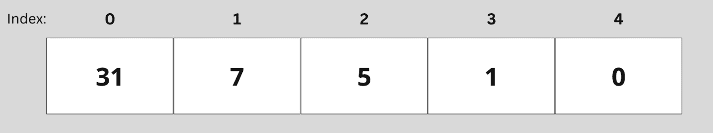
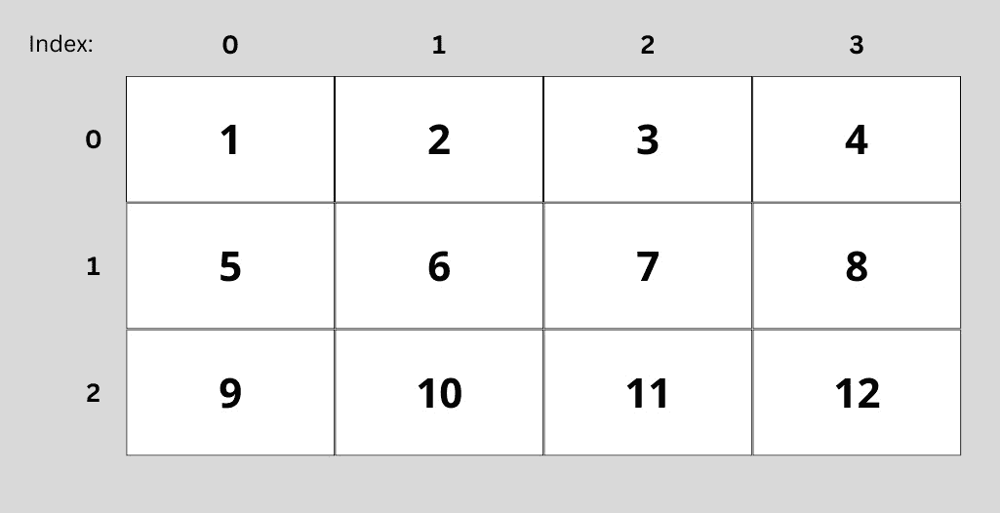

# 6

# 与数组一起工作

数组是一种基本的数据结构，你可以用它在一个变量中存储多个值。掌握数组不仅会使你的代码更加有序和高效，而且会打开通往更高级编程技术的大门。一旦你加入了数组，你就可以提升你应用程序的数据结构。

在本章中，我们将探讨数组，并为你提供有效使用这种基本数据结构所需的技术。你将学习如何创建、操作和遍历数组，以解决各种编程挑战。

下面是本章我们将涵盖的内容概述：

+   数组是什么以及如何使用它们

+   声明和初始化数组

+   访问数组元素

+   获取数组的长度并理解边界

+   遍历数组及其元素的不同方式

+   与多维数组一起工作

+   使用`Arrays`类执行数组的常见操作

到本章结束时，你将拥有处理数组的坚实基础，这将使你能够自信地应对更复杂的编程任务。所以，让我们深入探讨吧！

# 技术要求

本章的代码可以在 GitHub 上找到：[`github.com/PacktPublishing/Learn-Java-with-Projects/tree/main/ch6`](https://github.com/PacktPublishing/Learn-Java-with-Projects/tree/main/ch6)。

# 数组——是什么，何时，为什么？

到目前为止，我们只看到了单个值，比如`int`、`double`和`String`。想象一下，我们想要计算一个平均值。那看起来可能像这样：

```java
double result1 = 7.0;double result2 = 8.6;
double result3 = 9.0;
double total = result1 + result2 + result3;
double average = total / 3;
System.out.println(average);
```

这段代码的可扩展性不高。如果我们想添加第四个结果，我们需要做三件事才能让它工作：

+   声明并初始化第四个变量

+   将这个第四个变量加到总数中

+   用`4`除而不是用`3`

这很麻烦，而且容易出错。如果我们了解数组，我们只需更改代码中的一个元素就能改变这一点。让我们看看数组是什么。然后，当我们能够遍历数组时，我们将重新编写这个示例。

Java 不能做基本的数学运算吗？!

如果你运行前面的代码片段，你会看到一些有趣的东西。如果我问你计算平均值，你会说 8.2，而且你会是对的。如果我们让 Java 来做，它会说 8.200000000000001。

你可能会想，如果 Java 不能进行基本的计算，那么学习 Java 还有什么用呢？这不仅仅是一个 Java 问题；这是一个普遍的计算机问题。它必须将十进制数字转换为二进制数字——就像你不能精确地用十进制数表示 1/3（0.33333）一样。

## 数组解释

好吧，所以**数组**可以在某些特定情况下更好地结构化我们的代码。但它们是什么？数组是一种数据结构，可以存储固定大小的、有序的相同数据类型的元素集合。数组中的元素存储在连续的内存位置中，这使得计算机更容易访问和操作数据。

到目前为止，我们还没有看到很多需要它们的情况。现在，我们将真正提高我们逻辑的复杂性，因为我们学习如何处理数组。

## 何时使用数组

因此，让我们谈谈何时使用数组。在我们之前的示例中，当我们计算平均值时，使用数组意味着我们不需要三个单独的变量来存储我们的三个结果。我们可以将它们存储在一个双精度数组类型的单个变量中。这使得处理数据更加容易。

数组（以及我们稍后将看到的存储多个值的其他类型方式）用于各种原因：

+   **组织数据**：数组可以帮助以结构化的方式组织和管理工作量大的数据

+   **简化代码**：使用数组可以通过减少存储和操作数据所需的变量数量来简化代码

+   **提高性能**：访问和修改数组中的元素比使用其他数据结构更快，因为元素存储在连续的内存位置

能够处理数组将成为你的 Java 工具箱中的强大工具！让我们看看我们如何声明和初始化它们。

# 声明和初始化数组

在 Java 中声明和初始化数组有不同的方法。你需要什么将很大程度上取决于具体情况。所以，让我们先从声明数组的基础知识开始。

## 声明数组

在 Java 中声明数组时，你需要指定元素的数据类型，然后是方括号(`[]`)和数组的名称。以下是一个示例：

```java
int[] ages;
```

在这里，`int[]`是数组的数据类型，而`ages`是数组的名称。目前，我们无法向数组添加任何值，因为它尚未初始化。这与我们迄今为止所看到的初始化变量不同。让我们看看如何初始化数组。

## 初始化数组

在声明数组之后，需要对其进行初始化。我们通过指定其大小并为元素分配内存来完成此操作。我们可以使用`new`关键字来完成此操作，然后指定数据类型，并在方括号内指定数组的大小。以下是一个示例：

```java
ages = new int[5];
```

此代码将`ages`变量初始化为包含大小为`5`的整数数组的数组。

我们也可以在一行代码中声明和初始化数组：

```java
int[] ages = new int[5];
```

在这里，我们首先在左侧声明数组，然后在右侧初始化它。我们还可以使用特殊的简短语法直接分配其值，我们将在下面探讨。

# 数组初始化的简短语法

我们可以使用 Java 的快捷语法来声明和初始化具有特定值的数组。我们不需要分别声明和初始化数组，而是可以使用花括号(`{}`)直接指定元素。请看以下示例：

```java
int[] ages = {31, 7, 5, 1, 0};
```

此代码创建了一个整数数组，并使用指定的值对其进行初始化。数组的大小由花括号内的元素数量确定。

实际上，我们之前的数组也有值，因为当你使用`new`关键字创建数组时，Java 会自动根据其数据类型使用默认值初始化元素。默认值如下：

+   数值类型（`byte`、`short`、`int`、`long`、`float`、`double`）：`0`或`0.0`

+   `char`: ‘`\u0000`’（Unicode 中的`null`字符）

+   `boolean`：`false`

+   引用类型（对象和数组）：`null`

例如，假设你创建了一个大小为`3`的整数数组：

```java
int[] results = new int[3];
```

Java 使用默认值`0`初始化元素，因为`int`是数值类型。到目前为止，我们已经看到了如何声明和初始化数组。现在是时候学习如何访问数组中的元素并更新值了。

# 访问数组中的元素

为了访问数组中的元素，我们需要使用它们的**索引**。索引表示数组中的位置。这使我们能够检索特定位置的值并将其赋予新的值。让我们首先谈谈索引。

## 理解索引

在 Java 中，数组使用基于 0 的索引，这意味着第一个元素的索引是`0`，第二个元素的索引是`1`，依此类推。看看我们的`ages`数组示例：

```java
int[] ages = {31, 7, 5, 1, 0};
```

这意味着第一个元素（`31`）的索引是`0`，最后一个元素的索引是`4`。



图 6.1 – 使用年龄数组解释索引

我们像通常那样计算数组的长度，从`1`开始。因此，这个数组的长度将是`5`。数组中的最后一个元素的索引等于数组的长度减去`1`。对于一个长度为 N 的数组，有效的索引范围是 0 到 N-1。

了解如何使用索引很重要，因为这样我们可以访问数组中的元素。

## 访问数组元素

要访问数组中的元素，你可以使用数组名称，后跟方括号内所需元素的索引。例如，要访问名为`ages`的数组的第一个元素，你可以使用以下代码：

```java
int maaikesAge = ages[0];
```

这将在`age`变量中存储值`31`。为了访问第二个元素，你必须这样做：

```java
int gaiasAge = ages[1];
```

我们还可以使用索引访问元素，并在该元素中存储另一个值。

打印数组

如果我们打印包含数组的变量，我们可以得到类似以下的内容：`[I@28a418fc`

这不会很有帮助。所以请注意，你正在打印`toString()`方法返回的内容。这不是针对数组定制的，也不是很有用。我们最可能想看到的是数组中的元素。有一种打印数组内容的方法。我们将在介绍处理数组的内置方法时看到这一点。

## 修改数组元素

修改元素也是通过索引完成的。这看起来很像我们之前所做的变量赋值。例如，要更改我们数组中名为`ages`的最后一个元素的值，我们可以使用以下代码：

```java
ages[4] = 37;
```

我们只能访问存在的元素。如果我们尝试获取不存在的元素，我们会得到一个异常（错误）消息。

# 处理长度和边界

为了避免得到异常，我们需要保持在数组的边界内。索引始终从`0`开始，结束于数组长度减 1。如果你尝试访问这个范围之外的元素，你会得到`ArrayIndexOutOfBoundsException`。避免这种情况的关键是处理数组的长度。

## 确定数组长度

我们可以使用`length`属性来确定数组的长度。`length`属性返回数组中的元素数量。例如，要获取`ages`数组的长度，我们可以使用以下代码：

```java
int arrLength = ages.length;
```

数组的长度从`1`开始计数。因此，我们的`ages`数组长度为`5`。最大索引是`4`。

## 处理数组的边界

如果你尝试使用无效索引（小于 0 或大于或等于数组长度的索引）访问或修改数组元素，Java 将抛出`ArrayIndexOutOfBoundsException`异常。这个异常是一个运行时错误，这意味着它在程序运行时发生，而不是在编译时。我们将在*第十一章*中了解更多关于异常的内容。

为了防止`ArrayIndexOutOfBoundsExceptions`，我们应该在使用数组索引访问或修改数组元素之前始终验证索引。我们可以通过检查索引是否在有效范围内（`0`到数组长度减 1）来完成此操作。以下是一个演示如何验证数组索引的示例：

```java
String[] names = {"Maria", "Fatiha", "Pradeepa", "Sarah"};int index = 5;
if (index >= 0 && index < names.length) {
    System.out.println("Element at index " + index + ": " +
      names[index]);
} else {
    System.out.println("Invalid index: " + index);
}
```

输出将如下所示：

```java
Invalid index: 5
```

这段代码片段在访问数组元素之前检查索引是否在有效范围内。如果索引无效，程序将打印错误消息而不是抛出异常。

我们还可以使用我们在上一章中学到的循环来遍历数组中的元素，访问或修改它们的值。

# 遍历数组

遍历数组有不同的方法。我们将查看传统`for`循环和增强型`for`循环（也称为`for-each`循环）的使用。

## 使用 for 循环

我们可以使用传统的`for`循环通过索引变量遍历数组。循环从索引`0`开始，直到索引达到数组的长度。以下是一个演示如何使用`for`循环遍历数组并打印其元素的示例：

```java
int[] results = {10, 20, 30, 40, 50};for (int i = 0; i < results.length; i++) {
    System.out.println("Element at " + i + ": " +
      results[i]);
}
```

输出将如下所示：

```java
Element at 0: 10Element at 1: 20
Element at 2: 30
Element at 3: 40
Element at 4: 50
```

到目前为止，我们已经足够了解如何回顾本章开头看到的示例，计算几个结果的平均值。现在，我们不再有单独的原始数据类型，而是将有一个数组。它看起来是这样的：

```java
double[] results = {7.0, 8.6, 9.0};double total = 0;
for(int i = 0; i < results.length; i++) {
    total += results[i];
}
double average = total / results.length;
System.out.println(average);
```

如果我们现在想要添加一个结果，我们只需要在一个地方修改它。我们只需将结果添加到 `results` 数组中。由于我们遍历了所有元素，我们不需要添加一个额外的变量来计算总结果。此外，由于我们使用了长度，我们不需要将 `3` 改为 `4`。

我们也可以使用循环来修改数组的值。以下是一个示例，演示了如何使用 `for` 循环将数组中每个元素的值加倍：

```java
int[] results = {10, 20, 30, 40, 50};// Double the value of each element
for (int i = 0; i < results.length; i++) {
    results[i] = results[i] * 2;
}
// Print the updated array elements
for (int i = 0; i < results.length; i++) {
    System.out.println("Element at " + i + ": " +
      results[i]);
}
```

输出将如下所示：

```java
Element at 0: 20Element at 1: 40
Element at 2: 60
Element at 3: 80
Element at 4: 100
```

如你所见，在第一个 `for` 循环中，数组元素被加倍。在第二个 `for` 循环中，它们被打印出来。正如输出所示，值确实加倍了！

让我们看看增强型 `for` 循环以及我们如何使用它来遍历数组。

## 使用 `for-each` 循环

我们还可以使用 `for-each` 循环，也称为增强型循环，来遍历数组。这个特殊的 `for` 循环简化了遍历数组（以及其他可迭代对象）的过程。`for-each` 循环会自动遍历数组中的元素，并且不需要索引变量。以下是一个示例，演示了如何使用 `for-each` 循环遍历数组并打印其元素：

```java
int[] results = {10, 20, 30, 40, 50};for (int result : results) {
    System.out.println("Element: " + result);
}
```

输出将如下所示：

```java
Element: 10Element: 20
Element: 30
Element: 40
Element: 50
```

`for-each` 循环需要一个临时变量，用于在每次迭代中存储当前元素。在我们的例子中，这是 `int result`。将其称为 `result` 是有逻辑的，因为它是在 `results` 数组中的一个元素。但这不是功能所必需的；我也可以将其称为 `x`，如下所示：

```java
int[] results = {10, 20, 30, 40, 50};for (int x : results) {
    System.out.println("Element: " + x);
}
```

输出将完全相同。我喜欢在心中这样阅读代码行 `for (int x : results)`：对于 `results` 中的每个元素 `x`，执行代码块中的任何操作。

因此，有两种遍历数组的方法，让我们谈谈何时选择哪一种。

## 在常规循环和增强型循环之间进行选择

我们可以使用常规 `for` 循环和（增强型）`for-each` 循环来遍历数组。这两种方法有一些区别，选择其中一种的原因。

当你需要索引可用时，你应该使用传统的 `for` 循环，因为这个循环使用索引变量来访问数组中的元素，而 `for-each` 循环直接访问元素而不使用索引变量。

`for-each` 循环不允许你在迭代过程中修改数组元素，因为它不提供访问索引变量的权限。如果你需要在迭代过程中修改数组元素，你应该使用传统的 `for` 循环。

如果你只想读取变量而不需要索引，通常你想要选择 `for-each` 循环，因为其语法更简单。

好的，现在我们知道了如何遍历数组。让我们使数据结构稍微复杂一些，并学习关于多维数组的内容。

# 处理多维数组

**多维数组**是数组的数组。在 Java 中，你可以创建具有两个或更多维度的数组。最常见类型的多维数组是二维数组，也称为矩阵或表格，其中元素按行和列排列。

让我们看看如何创建多维数组。

## 声明和初始化多维数组

要声明二维数组，您需要指定元素的数据类型，然后是两对方括号(`[][]`)和数组名。以下是一个示例：

```java
int[][] matrix;
```

就像一维数组一样，我们使用`new`关键字初始化二维数组，后面跟着方括号内每个维度的数据类型和大小，如下所示：

```java
matrix = new int[3][4];
```

此代码初始化了一个 3 行 4 列的矩阵。类型是`int`，因此我们知道矩阵的值是整数。

我们也可以在一行中声明和初始化多维数组：

```java
int[][] matrix = new int[3][4];
```

我们也可以使用简短语法。要使用特定值初始化多维数组，我们使用嵌套花括号(`{}`)：

```java
int[][] matrix = {    {1, 2, 3, 4},
    {5, 6, 7, 8},
    {9, 10, 11, 12}
};
```

就像一维数组一样，Java 通过提供的值来确定长度。这个矩阵有三个内部数组（三行），每个数组包含四个元素（四列）。访问和修改多维数组中的元素与之前类似，但现在我们需要提供两个索引。

## 访问和修改多维数组的元素

要访问或修改多维数组的元素，您需要在方括号内指定每个维度的索引。例如，要访问名为`matrix`的二维数组的第一行第二列的元素，可以使用以下代码：

```java
int element = matrix[0][1];
```

要修改相同的元素，可以使用以下代码：

```java
matrix[0][1] = 42;
```

*图 6**.2*展示了我们的二维数组`matrix`的索引工作方式。



图 6.2 – 数组矩阵的行和列索引

因此，如果我们想获取值为`12`的元素并将其存储在`last`变量中，我们的代码如下所示：

```java
int last = matrix[2][3];
```

我们也可以遍历多维数组中的所有变量。让我们看看这是如何实现的。

## 遍历多维数组

由于多维数组只是数组中的数组，我们可以使用嵌套循环来遍历多维数组。以下是一个示例，展示了我们如何使用嵌套`for`循环遍历二维数组：

```java
int[][] matrix = {    {1, 2, 3, 4},
    {5, 6, 7, 8},
    {9, 10, 11, 12}
};
for (int i = 0; i < matrix.length; i++) {
    for (int j = 0; j < matrix[i].length; j++) {
        System.out.print(matrix[i][j] + " ");
    }
    System.out.println();
}
```

输出将如下所示：

```java
1 2 3 45 6 7 8
9 10 11 12
```

目前我们做的只是打印这个元素。这也是我们可以使用增强的`for`循环遍历多维数组时可以做到的。以下是一个示例，展示了如何做到这一点：

```java
int[][] matrix = {    {1, 2, 3, 4},
    {5, 6, 7, 8},
    {9, 10, 11, 12}
};
for (int[] row : matrix) {
    for (int element : row) {
        System.out.print(element + " ");
    }
    System.out.println();
}
```

输出将与上一个示例相同：

```java
1 2 3 45 6 7 8
9 10 11 12
```

如你所见，外部的 `for-each` 循环遍历二维数组的行。行本身也是一个数组，这就是为什么类型是 `int[]`。内部的 `for-each` 循环遍历每一行中的元素。这些是整数。

传统的嵌套 `for` 循环和嵌套 `for-each` 循环都可以用来遍历多维数组。这取决于个人喜好以及你是否需要访问元素的索引。

数组可以有很多层级，但这并不真正改变基本原理。例如，对于四维数组，类型后面会有 `[][][][]`，你需要四个级别的嵌套循环来遍历所有元素。

Java 以不同的方式帮助我们处理数组。让我们看看我们可以使用的数组的一些内置方法。

# 使用 Java 的内置数组方法

处理数组非常常见。通常，对于非常常见的事情，Java 有内置的功能。我们可以使用内置 `Arrays` 类的方法来做许多我们想对数组做的事情。

## 用于处理数组的内置 `Arrays` 类

内置的 `Arrays` 类是 `java.util` 包中的一个辅助类。它提供了许多实用方法，帮助我们高效地处理数组。我们将使用 `Arrays` 类来探索一些常见的数组操作任务。

### `toString()` 方法

你可能想在数组上执行的一个非常有用的操作是将它转换成一个 `String`，这对于调试和日志记录非常有价值。为了实现这一点，`Arrays` 类提供了一个专门的方法，称为 `toString()`。需要注意的是，这个方法是静态的，允许我们直接在 `Arrays` 类上调用它。

```java
import java.util.Arrays;public class ArrayHelperMethods {
    public static void main(String[] args) {
        int[] results = {30, 10, 50, 20, 40};
        // Convert the array to a string representation
        String arrayAsString = Arrays.toString(results);
        System.out.println("Array: " + arrayAsString);
    }
}
```

输出将如下所示：

```java
Array: [30, 10, 50, 20, 40]
```

如你所见，`results` 数组被转换成一个表示数组元素的字符串，这些元素被方括号包围并由逗号分隔。`Arrays` 类上有许多这样的方法！接下来，让我们探索 `sort` 方法。

### `sort()` 方法

你想在数组上执行的一个常见操作是对数组进行排序。以下是一个示例，展示了如何使用 `Arrays` 类的 `sort` 方法对数组的值进行排序：

```java
import java.util.Arrays;public class ArrayHelperMethods {
    public static void main(String[] args) {
        int[] results = {30, 10, 50, 20, 40};
        // Sort the array
        Arrays.sort(results);
        System.out.println(Arrays.toString(results));
    }
}
```

输出将如下所示：

```java
[10, 20, 30, 40, 50]
```

如你所见，`results` 数组最初是无序的。我们可以直接在 `Arrays` 类上调用 `Arrays` 类的方法，因为它们是静态的。对于整数值，默认情况下按从低到高的顺序排序。我们可以改变这种行为，但我们还没有掌握所需的知识。

我们使用另一个内置方法 `toString` 来打印数组。这会将数组转换成我们可以理解的形式。

当数组排序后，我们可以使用 `binarySearch` 方法来查找一个值。

### `binarySearch()` 方法

我们还可以在数组中搜索一个值。我们将使用内置的 `binarySearch` 方法来完成此操作。非常重要的一点是，由于搜索算法的工作方式，这只能在排序数组中完成。以下是如何做到这一点的示例：

```java
import java.util.Arrays;public class ArrayHelperMethods {
    public static void main(String[] args) {
        int[] results = {10, 20, 30, 40, 50};
        int target = 30;
        int index = Arrays.binarySearch(results, target);
        System.out.println("Index of " + target + ": " +
          index);
    }
}
```

输出将如下所示：

```java
Index of 30: 2
```

`binarySearch` 方法要求输入数组在之前已经排序。`binarySearch` 算法旨在在排序数组中查找目标值。它不是逐个搜索数组元素，而是将数组分成两半，直到找到目标或剩余要搜索的部分变为空。当中间的值更大时，它知道需要向数组的左侧移动，当它更小时，它知道需要向右侧移动。这就是为什么数组必须排序。如果找到了目标值，`binarySearch` 方法返回目标值的索引。如果目标值未找到，它返回一个负值，这表示插入点。所以，假设我们更新了我们的代码如下：

```java
        int[] results = {10, 20, 30, 40, 50};        int target = 31;
        int index = Arrays.binarySearch(results, target);
        System.out.println("Index of " + target + ": " +
          index);
```

这将导致以下结果：

```java
Index of 31: -4
```

这是因为它原本将在数组的第四个位置（而不是第四个索引！）。

让我们看看如何使用 `fill` 方法给数组中的所有元素赋予一个特定的值。

### `fill()` 方法

有时，您可能需要以编程方式创建具有相同值的数组。以下是如何做到这一点的示例。我们使用 `Arrays` 类中的 `fill` 方法。以下是操作方法：

```java
import java.util.Arrays;public class ArrayHelperMethods {
    public static void main(String[] args) {
        int[] results = new int[5];
        Arrays.fill(results, 42);
        System.out.println(Arrays.toString(results));
    }
}
```

输出将如下所示：

```java
[42, 42, 42, 42, 42]
```

`fill` 方法将数组中的所有元素设置为指定的值。有时我们需要创建数组的副本或调整它的大小。在这种情况下，我们可以使用 `copyOf` 方法。

### `copyOf()` 方法

有时您需要创建数组的副本，例如，当您想在应用程序的另一个位置结束它时，但不想影响您的原始数组。

这是一个示例，说明我们如何创建数组的副本：

```java
import java.util.Arrays;public class ArrayHelperMethods {
    public static void main(String[] args) {
        int[] results = {10, 20, 30, 40, 50};
        int[] copiedResults = Arrays.copyOf(results,
          results.length);
        System.out.println(Arrays.toString(copiedResults));
    }
}
```

输出将如下所示：

```java
[10, 20, 30, 40, 50]
```

我们可以用以下代码证明我们已经复制了数组：

```java
copiedResults[0] = 1000;System.out.println(Arrays.toString(copiedResults));
System.out.println(Arrays.toString(results));
```

如果我们没有创建副本，而是将其存储在另一个变量中，它将同时改变两个数组。前面的代码片段将给出以下输出：

```java
[1000, 20, 30, 40, 50][10, 20, 30, 40, 50]
```

但假设我们有以下代码：

```java
int[] copiedResults = results;copiedResults[0] = 1000;
System.out.println(Arrays.toString(copiedResults));
System.out.println(Arrays.toString(results));
```

它将给出以下输出：

```java
[1000, 20, 30, 40, 50][1000, 20, 30, 40, 50]
```

如您所见，这改变了持有数组的两个变量。这是因为这两个变量，`copiedResults` 和 `results`，都指向相同的数组对象。所以，如果您在一个地方更改它，它就会对两个都进行更改。这就是为什么有时您需要创建数组的副本。

因此，`copyOf` 方法创建了一个与原始数组具有相同元素的新数组，而第二种方法只是创建了一个指向相同数组对象的新变量。我们还可以通过传递第二个参数来调整数组的大小。

### 使用 `copyOf()` 方法调整数组大小

数组的大小是固定的，但有时你仍然需要更改大小。我们刚刚看到的 `Arrays.copyOf()` 方法也适用于调整数组大小。要调整数组大小，你可以创建一个具有所需大小的新数组，并将原始数组中的元素复制到新数组中。你只需要提供一个第二个参数。

这里有一个示例，演示了如何调整大小：

```java
import java.util.Arrays;int[] originalArray = {10, 20, 30, 40, 50};
int newLength = 7;
int[] resizedArray = Arrays.copyOf(originalArray, newLength);
System.out.println("Original array: " + Arrays.toString(originalArray));
System.out.println("Resized array: " + Arrays.toString(resizedArray));
```

输出将如下所示：

```java
Original array: [10, 20, 30, 40, 50]Resized array: [10, 20, 30, 40, 50, 0, 0]
```

在这个例子中，我们将长度为 `5` 的 `originalArray` 调整大小到新的长度 `7`。新数组包含原始数组中的元素，后面跟着默认值（对于 `int` 是 `0`）来填充剩余的位置。

这不是你应该经常做的事情。在性能方面可能效率低下。如果您需要经常调整数组大小，那么查看 *第十三章*，在那里我们学习了**集合**，是值得的。

### equals() 方法

我们将要讨论的最后一个内置方法是 `equals()` 方法。此方法可以确定两个数组是否具有相同的值。使用此内置方法，您可以比较两个数组是否相等。以下是操作方法：

```java
import java.util.Arrays;public class ArrayHelperMethods {
    public static void main(String[] args) {
        int[] results1 = {10, 20, 30, 40, 50};
        int[] results2 = {10, 20, 30, 40, 50};
        boolean arraysEqual = Arrays.equals(results1,
          results2);
        System.out.println("Are the arrays equal? " +
          arraysEqual);
    }
}
```

输出将如下所示：

```java
Are the arrays equal? true
```

equals() 方法逐个元素比较两个数组，以检查它们是否具有相同顺序的相同值。如果数组相等，则返回 `true`；否则返回 `false`。

干得好！

你在数组学习方面做得很好！在这个阶段，你准备好理解这个编程笑话了：

为什么 Java 开发者辞职了？

因为他们无法得到“数组！”

# 练习

数组对于存储和管理类似类型的数据非常有用，例如恐龙名称列表、恐龙重量和游客最喜欢的零食。数组很有用，并且使我们能够管理 Mesozoic Eden 中的更复杂数据。尝试以下操作：

1.  我们公园的独特吸引力在于我们恐龙种类的多样性。（而且我们确实有恐龙。）创建一个数组来存储公园中所有恐龙种类的名称。这份清单将帮助我们进行库存管理。

1.  每位游客都有自己的最爱恐龙，对许多人来说，那就是最重的那个。编写一个程序来找出这个明星在恐龙重量数组中的重量。然后，我们可以将此信息突出显示在我们的公园游览和教育项目中。

1.  恐龙有各种大小，最小的那些在孩子们的心中占有特殊的位置。编写一个程序来找出这个最小的恐龙在恐龙重量数组中的位置。

1.  经营一个恐龙公园不是一个人的表演，需要一支专门的员工团队。创建一个公园员工名称数组，并使用增强型 `for` 循环打印出这些名称。这将帮助我们更有效地欣赏和管理我们的员工。

1.  为了确保我们恐龙居民的福祉，监测它们的平均年龄是至关重要的。这些数据可以帮助我们更好地调整我们的护理和喂养计划，以适应我们恐龙的年龄特征。编写一个程序，使用恐龙年龄数组来计算这个值。

1.  我们的公园被细致地划分为各个区域，以方便游客导航和恐龙的饲养。创建一个表示公园地图的二维数组，每个单元格包含一个字符串数组，表示某个区域的围栏或设施。

1.  公园之旅的乐趣在很大程度上取决于舒适的座位安排。使用嵌套循环从二维数组中打印出公园游览巴士的座位图。这将帮助我们确保每位游客在整个公园的旅程中都有愉快的体验。

# 项目 – 恐龙追踪器

安全总是第一位的。这就是为什么跟踪我们所有的恐龙居民至关重要。公园管理者需要有一个易于使用的系统来管理他们这些略带异国情调的宠物的信息。

对于这个项目，你将创建一个恐龙追踪器。这是一个简单的追踪系统，用于记录每只恐龙的名称、年龄、物种和围栏编号。这将通过固定数组来完成——总共四个数组，每个属性一个。

假设你公园里现在有 10 个恐龙的空间，所以每个数组应该有 10 个长度。每个恐龙将对应数组中的一个索引。例如，如果恐龙“Rex”在名称数组的第一个位置，它的年龄、物种和围栏编号也将分别位于它们各自数组的第一个位置。

你将打印有关所有恐龙的信息，并在之后打印它们的平均年龄和体重。

我意识到这可能会很多。如果你需要一些额外的指导，以下是一些指导你通过这个过程的步骤：

1.  `dinoNames`、`dinoAges`、`dinoSpecies`和`dinoEnclosures`。每个数组的大小应为 10。

1.  名称使用`Dinosaur1`、`Dinosaur2`等。

1.  **显示详情**：编写一个循环遍历数组，并以可读的格式打印出每只恐龙的详细信息。

1.  将`dinoAges`数组除以恐龙的数量。当然，这个过程对于体重也是类似的，但使用体重数组。

# 概述

在本章中，我们探讨了 Java 中的数组。数组是数据结构，允许我们在连续的内存块中存储相同数据类型的多个值。它们提供了一种有效的方式来组织数据列表。

我们首先讨论了数组的声明和初始化。我们学习了不同的声明和初始化数组的方法，包括使用数组初始化的快捷语法。我们还介绍了如何使用默认值初始化数组。

之后，我们讨论了如何使用索引访问和修改数组元素。我们了解了数组长度的重要性，以及我们可以通过使用`length`属性来找出长度。我们还讨论了通过验证数组索引来避免`ArrayIndexOutOfBoundsExceptions`。 

然后，我们探讨了使用传统的`for`循环和增强的`for`循环（即`for-each`循环）遍历数组的方法。

在此之后，我们探讨了多维数组，即数组的数组，并学习了如何声明、初始化和访问它们的元素。我们还讨论了如何遍历多维数组。

最后，我们使用`Arrays`类及其内置方法介绍了常见的数组操作。我们看到了如何排序数组，在排序数组中搜索元素，用特定值填充数组，复制和调整数组大小，以及比较数组。

通过掌握这些概念，你现在有了在 Java 中使用数组的坚实基础。这种理解将帮助你更有效地在 Java 程序中存储和处理数据。我们最后查看了一些内置方法。在下一章中，你将学习如何编写自己的方法。
