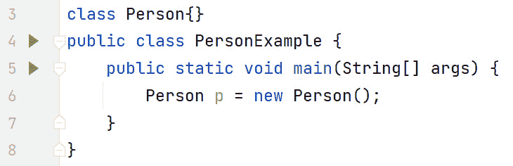
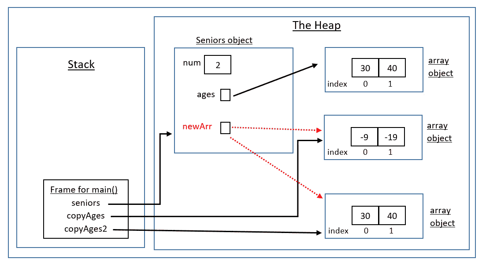

# 8

# 类、对象和枚举

在*第七章*中，我们学习了 Java 中的方法。在理解了方法为什么有用之后，我们了解到方法有两个部分——方法定义和方法调用。我们看到，方法定义是在通过方法调用调用方法时执行的代码。我们讨论了方法签名如何实现方法重载。我们还学习了`varargs`如何帮助我们用零个或多个参数调用方法。最后，我们讨论了 Java 的按值调用机制，其中传递给方法的参数在内存中被复制。根据传递的参数类型，原始类型或引用类型，将影响调用方法对调用方法传递的参数所做的更改的效果。

*第七章*总结了本书的 Java 基础知识部分。该部分的内容在许多编程语言中都是通用的，包括非面向对象编程（OOP）语言，如 C。*第八章*开始介绍本书的 OOP 部分。

在本章中，我们将涵盖类、对象、记录和枚举。类和对象是面向对象编程语言（如 Java）独有的；换句话说，非 OOP 语言（如 C）不支持它们。尽管它们密切相关，理解类和对象之间的区别很重要。我们将讨论类与类对象之间的关系。要访问对象，我们必须使用引用。将引用与对象分离将在以后证明非常有用。将实例成员与类成员进行讨论，以及何时使用任一或两者。本章还将解释`'this'`引用及其与当前执行实例方法的对象之间的关系。

我们还将解释 Java 中的访问修饰符。这些访问修饰符是实现面向对象编程（OOP）的关键基石之一，即封装。尽管基本的封装可以轻易实现，但正确封装你的类需要额外的注意。这将在高级封装部分进行说明。

理解对象生命周期，考虑到程序执行时内存中的情况，对于避免许多细微的错误至关重要。这个主题将通过图表进行解释。

在本章的末尾，鉴于我们对引用（以及它们所引用的对象的分离）的理解，我们将讨论`instanceof`关键字。最后，我们将介绍类的一种变体，即`枚举`，其中对象实例的数量受到限制。

本章涵盖了以下主要主题：

+   理解类和对象之间的区别

+   对比实例与类成员

+   探索`'this'`引用

+   应用访问修饰符

+   实现封装

+   掌握高级封装

+   深入探讨对象生命周期

+   解释`instanceof`关键字

+   理解枚举

+   欣赏记录

# 技术要求

本章的代码可以在 GitHub 上找到，链接为[`github.com/PacktPublishing/Learn-Java-with-Projects/tree/main/ch8`](https://github.com/PacktPublishing/Learn-Java-with-Projects/tree/main/ch8)。

# 理解类和对象之间的区别

由于类和对象对于面向对象编程至关重要，理解它们之间的区别是至关重要的。在本节中，我们将讨论类与其对象之间的关系。由于创建对象需要使用`new`关键字，这也会被涵盖。我们还将探讨构造函数及其作用。所有这些主题都是相互关联的：对象是类的内存表示（模板）；要创建对象，使用构造函数，要调用构造函数，我们使用`new`关键字。让我们逐一检查这些内容。

## 类

在 Java 中，类是如此重要，以至于你无法编写任何不定义类的程序！类是你对象的蓝图或模板。它类似于房屋的设计图——使用房屋设计图，你可以讨论房屋的所有内容；然而，你不能走进厨房泡上一杯茶/咖啡。在这一点上，房屋设计图是抽象的，类也是如此。类定义了字段（属性）和操作这些字段的方法。字段是你的数据，方法使你可以操作这些数据。

## 对象

对象是你对类的内存表示。如果类是你的房屋设计图，那么对象就是你的建成房屋。现在，你可以走进厨房，泡上一杯茶/咖啡。就像房屋和房屋设计图一样，你可以基于类创建许多对象。这些对象被称为对象*实例*，强调每个对象都是其独特的实例。

总结来说，类是模板，对象是类的内存表示。如果你想执行其（实例）方法，你需要一个对象（实例）。那么，我们如何创建对象呢？我们使用`new`关键字。

## 熟悉`new`关键字

Java 中的`new`关键字使我们能够创建对象。对象在堆上创建，堆是内存中为对象保留的特殊区域。返回对象的引用（类似于指针）。这个引用使我们能够操作对象；例如，执行实例方法。让我们来检查*图 8**.1*中显示的代码示例：



图 8.1 – 创建对象

在前面的图中，第 3 行定义了一个`Person`类。目前它没有任何内容；随着我们的进展，我们将对其进行扩展。第 6 行很重要——我们正在使用`new`关键字创建一个`Person`对象。除了`new`关键字外，第 6 行与任何方法调用非常相似。`p`引用（在栈上）被初始化为指向堆上的`Person`类型对象。名为`p`的`Person`引用正指向一个`Person`对象；然而，在前进的过程中，这种情况很少见。当使用`new`关键字“构造”对象时，被调用的方法是一个特殊的方法，称为*构造函数*。

构造函数

构造函数是一个特殊的方法，它由`new`关键字调用。它有两个独特的属性，使其与其他方法区分开来：它具有与类相同的名称，并且不定义任何返回类型，甚至不是`void`。（Java 在后台返回对象的引用）。

每个类都包含一个构造函数，即使你没有自己编写。如果你没有为你的类编写构造函数，Java 会为你自动生成（或定义）一个“默认构造函数”。默认构造函数将具有与常规构造函数相同的属性；即，与类相同的名称且没有返回类型。然而，默认构造函数不会定义任何参数；它将具有与类相同的访问修饰符，并且只包含一行代码，即`super();`。我们将在本章后面讨论访问修饰符，并在*第九章*中讨论`super()`。

注意，如果你插入了一个构造函数，默认构造函数就不会被自动生成。这就像编译器说：“好吧，你已经有了构造函数（们），你知道你在做什么，所以我不介入。”

既然我们知道默认构造函数何时由编译器生成，我们就可以看到在*图 8**.1*中`Person`和`PersonExample`都需要默认构造函数。*图 8**.2*表示编译器插入默认构造函数后的代码：


图 8.2 – 插入的默认构造函数

前面图中的红色矩形表示编译器插入的默认构造函数。这发生在两个类上，因为两个类都没有定义任何构造函数，而每个类都需要一个构造函数。除了具有与类相同的名称且不返回任何内容（甚至不是`void`）之外，默认构造函数不定义任何参数（第 4 行和第 9 行），并且简单地调用`super();`。正如前一个提示中所述，`super()`将在我们讨论*第九章*中的继承时进行讨论。

我们将在后面详细讨论访问修饰符，但请注意，默认构造函数的访问权限与它们各自类的访问权限相匹配。例如，`PersonExample` 是一个 `public` 类，因此它的构造函数也是 `public`（分别在第 8 和第 9 行）。`Person` 类没有提及任何 *显式* 访问修饰符，其构造函数也是如此（分别在第 3 和第 4 行）。

现在，你可以看到为什么第 13 行的 `new Person();` 不会生成编译器错误。为了清楚起见，第 13 行没有编译器错误，因为编译器插入了 `Person` 类的默认构造函数（第 4 至 6 行），因此 `new Person()` 能够找到构造函数并因此编译。

`PersonExample` 的默认构造函数（第 9 至 11 行）在这个程序中没有实质性的影响。JVM 在每个程序的 `main` 方法中启动程序。

我们现在将转向讨论实例成员与类成员的区别。请注意，局部变量（在方法中）也不是。

# 对比实例成员与类成员

一个对象更准确地可以称为对象 *实例*。这就是 *实例* 成员（方法/数据）获得名称的地方：每个对象都会获得一个实例成员的副本。然而，类成员是不同的，因为每个类只有一个副本，无论创建了多少对象实例。我们现在将讨论这两个主题。

## 实例成员（方法/数据）

这一点通过先展示一个代码示例更容易解释。*图 8.3* 展示了一个具有实例成员的类：


图 8.3 – 具有实例成员的类

当你使用 `new` 创建一个对象时，你正在创建一个对象 *实例*。每个实例都获得实例成员（变量和方法）的副本。关于实例变量，我们需要定义实例变量在哪里声明以及它们的范围。实例变量是在类内部定义的，但不在类中编写的每个方法之外。因此，实例变量的范围是类本身；这意味着，类中的每个实例方法都可以访问实例变量。

现在我们来讨论代码示例。在前面的图中，`Person` 类定义了实例变量和实例方法。由于实例变量是在每个方法外部声明的，因此它们的范围是类级别的。实例变量被标记为 `private` 以及实例方法被标记为 `public` 的原因将在本章后面解释。构造函数如下：

```java
Person(String aName) { // constructor    name = aName;
    count++;
}
```

这个构造函数使我们能够传入一个 `String` 并根据该 `String` 初始化实例变量。例如，当我们按照以下方式实例化一个对象时：

```java
Person p1 = new Person("Maaike");
```

我们将`"Maaike"`传递给构造函数，因此`p1`引用的对象中的`name`实例变量引用了`"Maaike"`。构造函数还通过每次调用构造函数时增加`count`来记录创建的对象数量。请注意，在这个例子中，编译器没有插入默认的`Person`构造函数，因为类中已经编写了构造函数。

我们还使用`p1`和`p2`引用调用了`getName()`实例方法，如下所示：

```java
System.out.println(p1.getName()); // MaaikeSystem.out.println(p2.getName()); // Sean
```

这种`refName.instanceMethod()`的语法称为*点表示法*。根据代码中的注释，`"Maaike"`和`"Sean"`将按顺序输出到屏幕上。（*图 8**.4*）显示了在创建了两个对象，分别由`p1`和`p2`引用后，代码在内存中的表示：


图 8.4 – 图 8.3 的内存表示（行 27 开始）

如前图所示，我们有堆栈上的两个引用，即`p1`和`p2`。`p1`引用堆上的第一个`Person`对象——即第 23 行创建的对象。`p1`的实例变量值（其“状态”）是`name`的`"Maaike"`和`count`的`1`。由于字符串是对象，`name`是一个引用另一个对象的引用，即一个值为`"Maaike"`的`String`对象。同样，`p2`引用指向第 24 行创建的对象。从图中可以看出，`p2`的实例变量值是`name`的`"Sean"`和`count`的`1`。

注意，堆上的每个`Person`对象*实例*都有一个*实例*变量的副本。这就是为什么它们被称为实例变量。

第 27 和 28 行将`name`实例变量的值分别更改为`"Maaike van Putten"`和`"Sean Kennedy"`，对应于`p1`和`p2`。(*图 8**.5*)显示了这些更改：


图 8.5 – 图 8.3 的内存表示（行 29 开始）

此图显示，两个`String`对象已被更改：`p1`的实例变量`name`引用了`"Maaike van Putten"`，而`p2`的实例变量`name`引用了`"Sean Kennedy"`。因此，第 29 到 30 行分别输出了`"Maaike van Putten"`和`"Sean Kennedy"`。

字符串不可变性

字符串是不可变对象。这意味着一旦创建了`String`对象，就不能更改。永远不能。虽然看起来它们已经改变了，因为产生了变化的效果，但实际上已经创建了一个全新的对象，而原始对象保持未变。我们将在*第十二章*中更详细地回顾`String`不可变性。

因此，原始的`String`对象，`"Sean"`和`"Maaike"`，仍然在堆上占用空间。它们没有用处，因为我们没有对这些对象的引用，所以我们无法访问它们。记住，`p1`和`p2`的`name`实例变量分别引用了新创建的包含`"Maaike van Putten"`和`"Sean Kennedy"`的`String`对象。

那么，这些不再使用的对象会怎样呢？它们会被“垃圾回收”。我们很快就会讨论这个问题，但首先，只需知道 JVM 在后台运行一个名为垃圾回收器的进程来整理（回收）所有无法访问的对象。我们无法控制这个进程何时运行，但有一个垃圾回收器可以让我们免于自己清理（而与其他 OOP 语言如 C++不同，你必须这样做！）。

*图 8.3* 中的代码存在问题 – `count` 的值为 1，而它应该是 2。实例变量默认初始化为`0`。在每次构造函数调用中，我们将`count`从`0`增加到`1`。我们希望第一次构造函数调用将`count`从`0`增加到`1`，而第二次构造函数调用将`count`从`1`增加到`2`。这就是类成员发挥作用的地方。

## 类成员（方法/数据）

要将字段和/或方法标记为类成员，而不是实例成员，可以在成员的声明中插入`static`关键字。类成员由类的所有实例共享。这意味着你不需要创建对象实例来访问类的`static`成员。

访问`static`成员的语法与访问实例成员的语法不同。而不是使用引用，使用类名，如`className.staticMember`。这强调了被访问成员的类性质。例如，JVM 使用`PersonExample.main()`在*图 8.3*中启动程序。这就是 JVM 以节省构建对象及其内存占用为代价启动每个程序的方式。

让我们回到我们的`count`问题（它的值应该是 2 而不是 1）。*图 8.6*表示必须进行的更改以解决这个问题：


图 8.6 – 使“count”静态化

将*图 8.6*中的代码与*图 8.3*中的代码进行对比，我们可以看到`count`被声明为`static`（第 5 行）。因此，只有一个`count`的副本，它在所有`Person`实例之间共享。因此，`p1`和`p2`正在查看相同的`count`。

在构造函数（第 9 行）中，虽然不是必需的，但我们使用正确的语法来强调 `count` 的 `static` 特性。同样，由于 `getCount`（第 17 行）只是返回一个 `static` 成员，我们将其标记为 `static`。此外，我们使用了 `Person.count` 静态语法（第 18 行）。最后，第 25 行使用正确的语法 `Person.getCount` 访问了 `private` 类变量 `count`。我们可以看到它输出了 `2`，这是正确的。比较代码中的其他差异，`main`（*图 8**.3*）中的一些额外代码已被删除，以帮助我们关注这里讨论的内容。

实例到静态，但反之则不行

如果您在一个实例方法中，您可以访问一个 `static` 成员，但反之则不行。当我们解释 `this` 引用时，我们将讨论为什么。这意味着，在 *图 8**.6* 中，您可以使用 `p1` 引用来访问 `getCount` 方法（第 25 行）。因此，`p1.getCount()` 是有效的，但这是一种 *较差* 的编程实践，因为它给人一种 `getCount` 是实例方法的印象，而实际上它是一个 `static` 方法 - 按照代码使用 `Person.getCount()`。

*图 8**.7* 显示了 *图 8**.6* 代码的内存表示：


图 8.7 – 图 8.6 代码的内存表示

如前一个图例的右下角所示，`Person` 类的 `static`/`class` 成员与实例本身存储在分开的地方。现在只有一个 `count` 的副本，它被 `p1` 和 `p2` 共享。因此，`count` 的值为 `2` 是正确的。

类和实例变量的默认值

每次创建一个新类时，实例变量都会初始化为默认值。

类变量在类首次加载时初始化为默认值。这可能在使用 `new` 或引用类成员（使用类语法）时发生。

类和实例变量的默认值如下：

| **类型** | **默认值** |
| --- | --- |
| `byte, short,` 和 `int` | `0` |
| `long` | `0L` |
| `float` | `0.0f` |
| `double` | `0.0d` |
| `char` | ‘`\u0000`’ (Unicode 零) |
| `String` (或任何对象的引用) | `null` |
| `boolean` | `false` |

表 8.1 – 类和实例变量的默认值

在之前的提示中，我们强调了您可以从实例方法中访问类成员，但反之则不行。现在让我们深入探讨这一点。

# 探索“this”引用

当您调用一个实例方法时，编译器会秘密地将调用该方法的对象引用的副本传递到方法中。这个引用作为 `this` 引用对实例方法可用。

类方法不会获得 `this` 引用。这就是为什么如果你在一个 `static` 方法（上下文）中尝试直接访问实例成员（没有对象引用），你会得到编译器错误。实际上，每个实例成员在访问时都需要一个对象引用。这很有意义，因为实例成员是实例特定的，因此你需要一个实例（引用）来说明，“我想访问这个特定的实例/对象，而不是那个特定的对象。”

让我们重构 *图 8.3* 中的代码，以便 `Person` 类显式地使用 `this` 引用。此外，所有对不正确工作的 `count` 实例变量的引用都已删除，以便我们可以专注于 `this` 引用。*图 8.8* 包含重构后的 `Person` 类（`PersonExample` 类保持不变）：


图 8.8 – 使用“this”引用

在前面的图中，第 7、11 和 15 行被注释掉，分别替换为第 8、12 和 16 行。让我们更仔细地对比一下被注释掉的 7 行和新的 8 行：

```java
// name = aName; // line 7this.name = aName; // line 8
```

首先，假设第 7 行被取消注释。第 7 行是如何协调其变量的？最初，编译器检查当前作用域（代码的构造块），并将 `aName` 协调为构造函数的参数。然而，编译器还没有协调 `name`，因此它检查下一个外部作用域，即类作用域，其中定义了实例/类变量。在这里，它找到一个名为 `name` 的实例变量，因此第 7 行可以编译。

第 8 行的操作有些不同。是的，它以类似的方式协调 `aName`，但现在，它遇到了 `this.name`（而不是 `name`）。看到 *this* 后，编译器立即检查已声明的实例变量。它找到一个名为 `name` 的实例变量，因此第 8 行可以编译。第 7 行和第 8 行实际上是相同的。

第 16 行与第 8 行相同，因为我们使用了相同的参数标识符，`aName`。第 12 行只是简单地返回 `name` 实例变量。

因此，这涵盖了如何在类中使用 `this`，但我们是怎样将实例与 `this` 关联起来的呢？

## 将实例与“this”引用关联

幸运的是，编译器会自动完成这项工作。正如之前所述，`this` 引用仅（秘密地）传递给实例方法，并且它指向当时调用该方法的实例。例如，当执行 `p1.getName()` 时，`getName` 中的 `this` 引用指向 `p1`，而当执行 `p2.getName()` 时，`getName` 中的 `this` 引用指向 `p2`。因此，`this` 引用会根据调用方法的实例而变化。*图 8.9* 表示了 `this` 引用动态特性的实际应用：


图 8.9 – “this”引用的动态特性

此图表示我们在执行第 24 行方法调用时，从 *图 8**.8* 中的代码执行第 12 行时的内存表示。当第 24 行的 `getName` 在 `p2` 上被调用——换句话说，`p2.getName();`——`getName` 中的 `this` 引用指向与 `p2` 指向相同的对象。这由从 `this` 引用指向与 `p2` 指向相同对象的实线表示。

虚线表示第 12 行方法调用中 `this` 引用所指向的内容，即 `p1`。因此，`this` 引用是动态地指向由 `p1` 或 `p2` 引用的实例。

正如我们在 *图 8**.8* 中的代码所看到的，`this` 引用是不必要的。让我们考察一个需要 `this` 引用的情况。

## 阴影或隐藏实例变量

当一个变量与实例变量具有相同的标识符时，就会发生实例变量的阴影。*图 8**.10* 展示了这种情况的代码，以便我们可以观察它造成的问题：


图 8.10 – 实例变量的阴影

在前面的图中，构造函数存在逻辑问题；换句话说，代码可以编译，但代码没有按预期工作。第 7 行是问题所在。记住，如果一个变量没有用 `this` 限定，则检查当前作用域以查看是否在该作用域中声明了该变量。在第 6 行，我们声明了一个使用 `name` 标识符的构造函数参数，它与第 4 行的实例变量具有相同的标识符。因此，第 7 行实际上是将局部变量赋值给自己，而实例变量保持未更改。由于实例变量是 `String` 类型，其默认值是 `null`。因此，第 19 行输出的是 `null` 而不是 `"Maaike"`。

为了解决这个问题，我们有两种选择。第一种选择是为构造函数参数使用不同的标识符，并使用这个新标识符。这就是 `setName` 所做的（第 12-13 行）：使用一个不与 `name` 实例标识符阴影的方法参数 `aName`。第二种选择是使用 `this` 引用来指定正在初始化的变量是实例变量。*图 8**.11* 展示了这一点：


图 8.11 – 使用 “this” 解决阴影问题

在此图中，第 7 行很重要：`this.name` 指向 `name` 实例变量，而 `name` 单独使用时，则指向方法参数。因此，阴影已被消除，第 19 行现在输出预期的 `"Maaike"`。

我们知道只有非静态（实例）方法接收 `this` 引用。让我们考察这个问题如何影响我们以及如何解决它。*图 8**.12* 展示了在 `static` 上下文（方法）中，我们尝试直接访问实例变量的代码：


图 8.12 – 从“静态”上下文访问实例变量

在前面的图中，我们有一个名为`x`的实例变量（第 4 行），一个名为`m`的实例方法（第 5 行），以及一个名为`main`的`static`方法（第 6-19 行）。正如我们所知，`static`方法如`main`不会自动获得`this`引用（因为它们是类方法而不是实例方法）。

第 9、10、11 和 12 行存在编译错误。当你直接访问实例成员时，如第 9 和 11 行，编译器会在成员前插入`this`。换句话说，当编译器完成第 9 和 11 行时，从内部来看，它们看起来与第 10 和 12 行相同。因此，由于`main`没有`this`引用，编译器会对第 9、10、11 和 12 行提出抱怨。

第 15-18 行封装了解决这个问题的方法。当你处于`static`上下文并且想要访问实例成员（变量或方法）时，你需要创建一个对象实例来引用实例成员。因此，在第 15 行，我们创建了一个包含实例成员的类（对象）的实例，即`PersonExample`，并将引用存储在一个标识符`pe`中。现在我们有了实例，我们可以访问实例成员，我们在第 16、17 和 18 行这样做。第 16 行成功将`x`从（其默认值）0 更改为 999。这是第 18 行输出的内容。第 17 行显示访问`m`也没有问题。请注意，在代码编译和运行之前，你必须注释掉第 9-12 行。

在这些示例中，我们使用了`private`和`public`访问修饰符。让我们更详细地讨论这些内容。

# 应用访问修饰符

面向对象编程（OOP）的一个基石是*封装*（数据抽象）原则。封装可以通过访问修饰符来实现。在我们讨论封装之前，我们必须理解访问修饰符本身。

访问修饰符决定了类、字段或方法的可见性和可用性。你正在注解的级别决定了可用的访问修饰符：

+   `public`或包私有（无关键字）

+   `private`、包私有、`protected`和`public`

让我们依次讨论这些内容。

## private

被标记为`private`的成员只能在它自己的类中访问。换句话说，类的块作用域定义了边界。当在一个类（作用域）中时，你不能访问另一个类的`private`成员，即使你有指向包含`private`成员的类的对象引用。

## 包私有

对于`package-private`没有特殊的关键字。如果一个类型（类、接口、记录或枚举）没有访问修饰符，则应用`package-private`。`package-private`的类型仅在同一包内可见。回想一下，包只是一个相关类型的命名组。

*图 8**.11 中的`Person`类（第 3 行）是一个`包私有`类，这意味着`Person`不能被导入到另一个包中。此外，`Person`构造函数（第 6 行）是包私有的，这意味着你无法从不同的包中创建`Person`类型的对象。

在成员级别，有一些例外情况需要你在省略访问修饰符时注意：

+   类/记录成员默认是`包私有`。

+   接口成员默认是`public`。

+   枚举常量（成员）默认是`public` `static`和`final`。枚举构造函数默认是`private`。我们将在本章后面讨论枚举。

默认包

默认包也被称为无名称包或未命名的包。在文件顶部没有显式包声明的类型会被放入这个包中。这就是放置了*图 8**.11 中的`Person`和`PersonExample`类的包。

这个问题的含义是，由于包没有名称，如果我们处于不同的（命名）包中，我们就无法导入`Person`和`PersonExample`。`PersonExample`是`public`（第 16 行）的事实并没有区别。因此，只有同一（默认）包中的其他类型可以访问它们。

## protected

被标记为`protected`的成员意味着它在自己的包内可见（与包私有类似），但也可以被包外部的子类访问。当我们讨论继承时，我们将在*第九章*中更详细地讨论子类和`protected`。

## public

被标记为`public`的类型或成员在所有地方都是可见的。因此，没有边界限制。

*表 8.2*总结了访问修饰符及其可见性：


表 8.2 – 访问修饰符及其可见性

让我们水平地检查*表 8.2*。只有类可以访问标记为`private`的成员。如果一个类或成员没有访问修饰符（包私有），那么这个类或成员只能在类和包内部可见。如果成员被标记为`protected`，那么这个成员对类、包以及该类的子类都是可见的，无论包如何。最后，如果一个类或成员被标记为`public`，那么这个类或成员在所有地方都是可见的。

为了进一步解释*表 8.2*，让我们绘制一个示例类集及其相关包的图，并为其制作另一个专门的可见性表。*图 8**.13 展示了这一点：


图 8.13 – 示例访问修饰符图

在这个图中，`Dog` 类被加粗并下划线，因为下面的表格，*表 8.3*，代表了其成员的可见性。例如，当阅读 `private` 行时，假设我们在 `Dog` 中标记了一个成员为 `private`，并正在确定它在其他类中的可见性。让我们来查看 *表 8.3*：


表 8.3 – 当应用于 Dog 成员时修饰符的可见性

因此，如果一个 `Dog` 成员是 `private`，只有 `Dog` 可以看到它。如果 `Dog` 成员是包私有，只有 `Dog` 和 `Cat` 可以看到它。如果 `Dog` 成员是 `protected`，`Dog` 和 `Cat` 可以看到它。最后，如果一个 `Dog` 成员是 `public`，每个类都可以看到它。

(*) 我们将在继承章节回顾 `protected` 时完成这个表格。

访问级别如何影响你？

访问级别将以两种方式影响你。首先，你可能会使用一个外部类（例如 Java API 中的类）并想知道你是否可以在你的代码中使用该类及其成员。其次，当编写一个类时，你将想要决定每个类和成员的访问级别。一个很好的经验法则是尽可能地将成员保持为 `private` 以避免误用。此外，除非它们是常量，否则请避免使用 `public` 字段。我们将在讨论封装时进一步讨论这一点。

让我们来看看这些访问修饰符在代码中的应用。特别是，我们将关注包，并学习如何创建一个包以及边界如何影响访问。

## 包

回想一下，完全限定类型名称包括包名。*包定义了一个命名空间*。例如，在 *图 8**.13* 中，`ch8.animals` 包中的 `Dog` 类完全限定为 `ch8.animals.Dog`。因此，一个名为 `kennel` 的包中的 `Dog` 类将有完全限定的名称 `kennel.Dog`；这与 `ch8.animals.Dog` 完全不同。因此，Java 可以区分这两种 `Dog` 类型，并且不会发生名称冲突。正如我们将看到的，包结构也被用作你的 java 文件的目录结构。Oracle 提供了非常好的指南（见 [`docs.oracle.com/javase/tutorial/java/package/namingpkgs.html`](https://docs.oracle.com/javase/tutorial/java/package/namingpkgs.html)），说明如何命名你的包，以便你的类型不会与其他人的冲突。包名全部使用小写字母书写，以区分类型名称。随后，公司应使用反向互联网域名来开始它们的包名。例如，如果你在名为 `somecompany.com` 的公司工作，并且你正在创建一个名为 `somepackage` 的包，那么完整的包名应该是 `com.somecompany.somepackage`。在公司内部，命名可以遵循公司惯例，例如包括地区：`com.somecompany.region.somepackage`。

让我们检查 *图 8**.13* 中的包。我们将从 `ch8.animals` 开始：


图 8.14 – 图 8.13 中的“ch8.animals”包

在这个图中，为了简单起见，我们将包中的两个类组合到一个 Java 文件中。这个文件叫做`Dog.java`（因为`public`类是`Dog`）。第一行很重要：`package ch8.animals`表示在这里定义的类型（类等）将放入这个包中。此外，Dog.java 文件将被放入硬盘上名为`ch8\animals`的文件夹中。

在这个图中，第 4 行定义了一个名为`dogName`的`private`实例变量。这个变量只能在类内部访问（如第 6 行和第 9 行所示），但不能在类外部访问（如第 18 行所示）。

第 5 行定义了一个名为`age`的`protected`实例变量，我们可以在包内的另一个类中访问它（第 19 行）。第 12 行定义了一个名为`pkgPrivate()`的包私有方法，第 20 行显示我们可以从同一包内的另一个类中访问它。注意，`Cat`类及其构造函数都是包私有（分别在第 14 行和第 15 行）。

*图 8**.15*显示了另一个包，`ch8.farm`：


图 8.15 – 图 8.13 中的“ch8.farm”包

再次注意，第 1 行声明了包名——这是`ch8.farm`包。文件名为`Pig.java`（因为`public`类是`Pig`），文件将被放入硬盘上名为`ch\farm`的文件夹中。

注意导入时使用完全限定名（第 3 行和第 4 行）。因为我们想访问位于单独包中的`Dog`类，我们必须导入它。导入`Dog`没有问题，因为它是`public`的。然而，我们无法导入`Cat`，因为`Cat`是包私有（而且我们处于不同的包中）。

第 8 行演示了`Pig`可以创建一个`Dog`对象。注意这里有两个访问点：`Dog`类是`public`的（因此我们可以`import`它）；`Dog`构造函数也是`public`的（因此我们可以从不同包中的代码创建`Dog`的实例）。这就是为什么类和构造函数的访问修饰符应该匹配。第 9 行显示，当我们处于不同的包中时，我们没有权限访问来自另一个包的包私有成员。

现在我们已经了解了访问修饰符，我们可以讨论封装。

# 封装

如前所述，封装是面向对象编程中的一个关键概念。这里的原理是保护你类中的数据，并确保数据只能通过你的代码进行操作（检索和/或更改）。换句话说，你控制外部类如何与你的内部状态（数据）交互。那么，我们如何做到这一点呢？

## 实现封装

基本封装很容易实现。你只需将你的数据标记为 `private`，并通过 `public` 方法来操作数据。因此，外部类不能直接访问数据（因为它被标记为 `private`）；这些外部类必须通过你的 `public` 方法来检索或更改数据。

这些 `public` 方法构成了类的“接口”；换句话说，你如何与类交互。这个“接口”（一组 `public` 方法）与语言构造 `interface`（第十章）非常不同，不应混淆。*图 8.16* 展示了一个代码示例，以帮助我们进一步探讨这个主题：


图 8.16 – 基本封装的实际应用

在前面的图中，`Adult` 类有两个 `private` 实例变量，分别是 `name` 和 `age`（分别在第 4 行和第 5 行）。因此，这些实例变量只能在 `Adult` 代码块内部访问。请注意，即使有一个 `Adult` 对象引用也无法绕过这个访问规则——第 29 行（注释掉的）上的编译错误证明了这一点。

公共类名与文件名的关系

在 Java 中，`public` 类的名称必须与文件名匹配。在 *图 8.16* 中，`public` 类是 `BasicEncapsulation`。这意味着文件名必须是 `BasicEncapsulation.java`，它确实是这样的。这个规则意味着你不能在同一个文件中有两个 `public` 类——这就是为什么 `Adult` 类不是 `public` 的。

如果我们处于不同的包中，并且想要创建一个如图 *8.16* 所示的 `Adult` 对象，会发生什么？这是一个问题，因为 `Adult` 是包私有的（第 3 行）。为了解决这个问题，我们需要将 `Adult` 类设为 `public`，这样我们就可以在不同的包中 `import` 它。这意味着我们需要将 `Adult` 类移动到一个单独的文件中，命名为 `Adult.java`。此外，`Adult` 及其构造函数都需要是 `public` 的。为什么？因为我们处于不同的包中时，类是 `public` 的使我们能够 `import` 类，构造函数是 `public` 的使我们能够创建 `Adult` 类型的对象。

`Adult` 构造函数（第 7 行）没有访问修饰符，因此是包私有的。因此，只有同一包内的类可以调用这个构造函数。换句话说，只有 `ch8` 包（第 1 行）中的类可以创建 `Adult` 对象。由于 `BasicEncapsulation` 也在 `ch8` 包中，所以第 26 行的对象创建是正确的。

`Adult` 类的其余部分（第 11-20 行）提供了用于操作对象状态（实例变量）的 getter/setter 方法对。这些 getter/setter 方法也分别被称为访问器/修改器方法。通常每个实例变量都有一个对应的方法对，它们遵循以下格式（注意这只是一个示例）：

```java
public int getAge(){    return age;
}
public void setAge(int age){    
    this.age = age;
}
```

在*图 8.16*的第 26 行创建`Adult`对象后，我们使用`public`访问器方法`getName`和`getAge`（第 27-28 行）输出对象状态。由于这些访问器方法是`public`的，这些方法对任何包中的任何类都是可用的。鉴于输出了`'John'`和`20`，我们知道我们的对象被正确创建。

假设我们是`Adult`类的开发者，并要求成年人的年龄必须是 18 岁或以上。此外，我们还将假设我们不知道`BasicEncapsulation`类的开发者。第 29 行展示了，由于我们的`Adult`数据是`private`的，它被保护免受直接外部破坏。这正是封装提供的东西；这正是它的存在理由！

第 30 行展示了对象的状态仍然可能被破坏。然而，第 30 行通过 set/mutator 方法进行的破坏与第 29 行的直接破坏非常不同。作为`Adult`类的作者，我们可以控制和因此修复`set`（mutator）方法中的破坏错误。我们`set`（mutator）方法的问题在构造函数中也被复制。*图 8.17*在构造函数和 mutator 方法中解决了这个（内部）破坏问题：


图 8.17 – 确保年龄至少为 18 岁

由于`BasicEncapsulation`保持不变，它不包括在先前的图中。请注意，已经引入了一个新的`isAgeOk`方法（第 27-29 行）。该方法接受一个`int`参数`age`并检查它是否`>= 18`。如果是这样，该方法返回`true`；否则，它返回`false`。

`isAgeOk`方法是从`setAge`mutator 方法（第 21 行）调用的。由于构造函数调用`setAge`（第 8 行），它也利用了年龄检查逻辑。如果将无效的年龄传递给构造函数或`setAge`，则设置错误值为-1。请注意，有更好的方法来做这件事，但现在这样是可以的。当我们现在运行程序时，由于传递给`setAge`的`age`值是-99（`john.setAge(-99)`），实例变量`age`被设置为错误值-1。

这涵盖了基本的封装。我们现在将讨论基本封装的一个特定问题以及如何通过高级封装来解决它。

# 掌握高级封装

“私有数据，公共方法”的简单原则（其中`public`方法操作数据）在确保数据适当封装方面走得很远。然而，你仍然不完全安全。在本节中，我们将回顾 Java 的传值原则，该原则用于向方法传递参数和从方法返回值。我们将检查这可能会带来一个微妙的问题。最后，我们将检查如何保护你的代码，防止遇到这个问题。

## 传值调用再探讨

在*第七章*，我们讨论了当向方法传递参数时，Java 的*按值调用*机制会创建那些参数的*副本*。我们看到了意识到当参数是一个引用时，例如数组，被调用方法现在可以操作调用方法正在查看的数组对象的必要性。

类似地，当一个方法正在*返回*某些内容时，按值调用再次适用。换句话说，你返回的内容会创建一个副本。根据副本的内容，这可能会导致封装被破坏或不被破坏。如果你返回的是`private`原始数据，那么就没有问题——原始数据会返回一个副本，客户端可以对副本做任何它想做的事情；你的`private`原始数据是安全的。你可能还记得，从*第七章*，复制原始数据就像复印一张纸。复印的纸张可以被写上内容，而不会影响原始副本。

## 问题

如果你的`private`数据是一个引用（到一个对象），问题就会出现。如果客户端收到这个引用的副本，那么客户端就可以操作你的`private`对象！从*第七章*，你可能还记得，复制一个引用就像复制电视的遥控器一样。新的遥控器可以改变同一台电视的频道。*图 8**.18*展示了破坏封装的代码：


图 8.18 – 破坏封装的代码

在前面的图中，`Seniors`类有两个`private`实例变量（第 6-7 行），即`ages`和`num`。构造函数（第 9-13 行）初始化实例变量。我们有一个公共的`getNum`访问器方法，它返回`private`实例变量`num`（第 14 行）。请注意，我们为了节省空间，把这个方法放在了一行。

我们还有一个名为`getAges`的访问器方法（第 15-17 行），它返回一个名为`ages`的`private`数组。*第 16 行是问题所在*，因为它破坏了封装。当我们讨论`main`中的代码时，我们将解释原因。

在`main`中，我们首先做的事情是创建一个`Seniors`的实例（第 21 行）。这样我们就可以访问`Seniors`中定义的实例方法。`main`的其余部分分为两部分：一部分（第 23-27 行）演示了返回`private`原始数据是可行的；另一部分（第 30-37 行）演示了仅仅返回`private`*引用*会破坏封装。

让我们检查第一部分。第 23 行根据`seniors.getNum()`的返回值初始化局部变量`num`。由于`private`的`Seniors`实例变量`num`在`Seniors`构造函数（第 10 行）中被初始化为`2`，因此（完全独立的）局部变量`num`也被初始化为`2`。我们在第 24 行输出了这一事实。然后我们将局部`num`变量的值更改为`-100`（第 25 行）。现在的问题是，当我们更改局部变量`num`时，`private`的`Seniors`实例变量`num`是否也被更改？为了找出答案，我们可以简单地使用公共访问器方法`getNum`（第 26 行）再次检索`num`。第 27 行输出`2`，证明`private`原始数据`num`在`main`中做出的更改是安全的。

第二部分是事情变得有趣的地方。第 30 行根据`public`访问器方法`seniors.getAges()`的返回值初始化局部变量`copyAges`。由于`getAges`只是返回（一个副本的）`private`的`ages`引用，我们现在有两个引用指向同一个数组对象。这些引用是`private`实例变量`ages`和局部变量`copyAges`。第 31 行输出了`copyAges`的值，对于索引`0`和`1`分别是`30`和`40`。这些是`private`的`ages`数组在`Seniors`构造函数（第 11-12 行）中初始化时的相同值。

现在，在第 34-35 行，我们更改了`copyAges`数组中的值：索引`0`被设置为`-9`，索引`1`被设置为`-19`。与第一部分一样，我们现在想知道，更改局部数组是否对`Seniors`中的`private`实例数组有任何影响？答案是肯定的！为了证明这一点，我们可以再次使用`getAges`（第 36 行）检索`private`数组并输出其值（第 37 行）。输出值`-9`和`-19`表明客户端`AdvancedEncapsulation`能够操作（更改）所谓的`Seniors`的`private`数据。因此，`Seniors`最终并没有实现封装。

*图 8**.19*展示了内存中的情况，揭示了为什么`Seniors`没有实现封装：


图 8.19 – 图 8.18（第 37 行）的内存表示

在前面的图中，局部变量`num`位于栈上。它是`private`的`Seniors`实例变量`num`的一个副本，并且随着我们通过`main`的进展，其不同的值以删除线字体反映出来。第 25 行（*图 8**.18*）将局部变量更改为`-100`。如所见，这种更改不会影响`Seniors`中的`private`实例变量`num`，它仍然为`2`。

问题出在 `private` 数组对象 `ages` 的引用上。因为 `getAges`（第 15 行）只是返回引用，所以这个引用的副本被存储在局部变量 `copyAges`（第 30 行）。由于局部引用 `copyAges` 和 `private` 引用 `ages` 现在指向同一个对象，副本引用可以更改 `private` 数组对象。这就是为什么数组对象在索引 `0` 和 `1` 分别有 `-9` 和 `-19` 的值。`copyAges2` 引用只是用来证明这一点。

## 解决方案

既然我们已经知道了问题，修复它就相当直接了。关键是，在返回引用时，确保你简单地不要返回 `private` 引用（因为按值调用将返回该引用的副本）。解决方案是 *复制你希望返回的对象，并返回对新对象的引用*。这样，外部类（客户端）就可以操作这个新对象，而不会影响你的私有内部对象。*图 8.20* 是正确封装、重构后的 *图 8.18* 版本：


图 8.20 – 正确封装的代码

在前面的图中，我们用一个新的版本（第 15-18 行）替换了访问器方法 `getAges`。这个新版本是正确封装的。在第 16 行，我们不是简单地返回数组实例变量（或其引用），而是将数组 `ages` 复制到一个新的数组，即 `newArr`。我们使用 `Arrays.copyOf` 方法实现这一点。我们返回新数组对象的（副本）引用。

现在，在第 24 行，当我们初始化 `copyAges` 时，它指的是在第 16 行创建的副本数组。这个引用 `newArr` 已经超出作用域（因为我们从 `getAges` 返回），但新的数组对象仍然在堆上，`copyAges` 指向它。这里的重要点是，在第 25 行，我们有两个不同的数组引用：`ages` 实例和局部 `copyAges`。这些引用现在指向两个 *不同* 的对象。

第 25 行输出了副本数组的详细信息；索引 `0` 为 `30`，索引 `1` 为 `40`。这是预期的。第 26 和 27 行将副本数组索引 `0` 和 `1` 的内容分别更改为 `-9` 和 `-19`。现在，我们需要检查一下：当我们更改 `copyAges` 数组的内容时，`private` 内部 `Seniors` 数组的 `ages` 内容是否也改变了？为了检查，在第 28 行，我们可以使用 `private` 数组 `ages` 的（副本）内容初始化一个 `copyAges2` 数组。当我们输出第 29 行的 `copyAges2` 的详细信息时，我们得到 `30` 和 `40`，从而证明当我们更改局部 `copyAges` 数组（第 26-27 行）时，`private` 内部数组 `ages` 并没有改变。现在，`Seniors` 已经被正确封装。

*图 8.21* 展示了在执行第 29 行时内存中的这种情况：



图 8.21 – 图 8.20 的内存表示

在前面的图中，就在`Seniors`对象构建之后（第 22 行），堆栈上有一个`seniors`引用，指向堆上的`Seniors`对象。`Seniors`对象包含一个设置为 2 的`num`原始值（第 10 行）和一个指向数组对象的`ages`数组引用（第 11-12 行）。

当我们调用`getAges`（第 24 行）时，复制数组`newArr`被创建（第 16 行），尽管这里没有显示，但新数组最初包含`30`和`40`的值（分别对应索引`0`和`1`），如第 25 行所示。当`newArr`从`getAges`返回（第 17 行）时，（副本的）引用被分配给`copyAges`（第 24 行）。如前图所示，`copyAges`局部变量和`ages`实例变量指向两个不同的数组对象。这正是我们想要的。*使用* `copyAges` *所做的任何更改都不会影响私有数组* `ages`。

这正是第 26-27 行所做的更改所展示的内容。使用`copyAges`引用所做的更改反映在图中。为了证明第 26-27 行的更改没有影响`private`数组`ages`，我们再次调用`getAges`。一个新的数组，代表`private`数组的副本，再次被创建（第 16 行），并且（副本的）新数组引用被返回并分配给局部引用`copyAges2`。当我们输出第 29 行的新数组内容时，我们得到`30`和`40`，这表明`private`数组没有受到局部数组（第 26-27 行）更改的影响。

现在我们已经理解了按值传递和高级封装，我们处于一个很好的位置来讨论对象生命周期。

# 深入了解对象生命周期

要理解 Java，了解后台在内存中发生的事情非常有帮助。本节将帮助我们巩固在调用方法、声明局部/实例变量等时堆栈和堆上发生的事情。

局部变量保存在堆栈上（以便快速访问），而实例变量和对象则存在于堆上（一大块内存区域）。正如我们所知，我们使用`new`关键字来创建 Java 对象。`new`关键字在堆上为对象分配空间，并返回对象的引用。如果对象不再可访问会发生什么？例如，引用可能已经超出作用域。我们如何回收那块内存？这就是垃圾回收发挥作用的地方。

## 垃圾回收

如前所述，垃圾回收会回收不再被使用的对象占用的内存；也就是说，没有引用指向这些对象。这个垃圾回收过程是 JVM 在后台运行的一个进程。JVM 可能会在空闲时决定运行垃圾回收，也可能不会。简单来说，我们无法控制垃圾回收何时运行。即使我们调用了`System.gc()`，这也只是向 JVM 提出运行垃圾回收的建议——JVM 可以自由地忽略这个建议。垃圾回收的主要优势是我们不需要自己进行清理；而在像 C++这样的语言中，我们必须这样做。

想要了解更多关于 Java 内存管理的细节，请参阅我们之前出版的书籍：[`www.amazon.com/Java-Memory-Management-comprehensive-collection/
dp/1801812853/ref=sr_1_1?crid=3QUEBKJP46CN7&keywords=java+memory+management+maaike&qid=1699112145&sprefix=java+memory+
management+maaike%2Caps%2C148&sr=8-1`](https://www.amazon.com/Java-Memory-Management-comprehensive-collection/dp/1801812853/ref=sr_1_1?crid=3QUEBKJP46CN7&keywords=java+memory+ management+maaike&qid=1699112145&sprefix=java+memory+management+maaike%2Caps%2C148&sr=8-1).

## 对象生命周期示例

在这个阶段，一个示例程序会有所帮助。*图 8**.22* 展示了一个符合我们目的的程序：


图 8.22 – 解释对象生命周期的示例程序

当这个（简单且非常人为的）程序执行时，有三个方法被推入栈中，分别是`main`、`tagAnimal`和`setCountry`。*图 8**.23* 表示我们即将退出`setCountry`方法（第 19 行）时的内存表示：


图 8.23 – 图 8.22 中代码的内存表示

让我们更详细地看看这个例子。

### 主方法

如前两个图所示，第 9 行在堆上创建了`Cow`对象，在`main`帧的栈上的局部引用`cow1`指向它。此时，堆上的`Cow`对象的实例变量，即`tag`和`country`，将是`null`。

第 10 行将`cow1`中的值赋给`main`中的另一个局部引用，即`cow2`。现在，在第 11 行，我们在栈上有一个`main`的帧，包含两个局部引用变量，即`cow1`和`cow2`，它们都指向堆上的一个`Cow`对象。

第 11 行使用`cow2`引用来执行实例方法`tagAnimal`。因此，当在`tagAnimal`方法内部（这次调用期间），`this`引用将指向`cow2`所指向的内容（即堆上的`Cow`对象）。此外，`cow1`引用被作为参数传递给`tagAnimal`方法。这并不是必要的，因为`tagAnimal`已经有一个指向`Cow`对象的引用（使用`this`），但这个程序只是为了示例目的。

### `tagAnimal` 方法

与任何方法调用一样，`tagAnimal` 的栈帧被压入栈中。根据按值调用规则，`tagAnimal`（第 13 行）将方法参数 `cow` 别名为来自第 11 行的 `cow1`。因此，`tagAnimal` 中的 `cow` 引用和 `main` 中的 `cow1` 引用指向同一个 `Cow` 对象，该对象是在第 9 行创建的。

如我们所知，`this` 引用指向负责方法调用的对象实例——在这种情况下，`cow2`（第 11 行）。因此，第 14 行的 `tag` 引用（实际上是 `this.tag`）是指向可以通过 `cow2` 访问的 `tag` 实例变量。因此，第 14 行在堆上创建了一个新的 `Tag` 对象，并将其引用存储在 `Cow` 对象的 `tag` 实例变量中，覆盖了其先前的默认值 `null`。请注意，鉴于这个例子是人为设计的，`Cow` 对象通过三个不同的引用被引用：`main` 中的 `cow1` 和 `cow2`；以及 `tagAnimal` 中的 `cow`。

第 15 行指定了一个 `"France"` 的 `String` 文字。由于 `String` 文字是对象，因此在堆上创建了一个 `String` 对象。使用 `cow` 引用，调用 `setCountry` 方法，传递 `String` 文字 `"France"`。

### `setCountry` 方法

`setCountry` 的栈帧被压入栈中。`setCountry` 声明将方法参数 `country` 别名为引用 `String` 文字 `"France"`，它在方法调用中传递下来（第 15 行）。第 18 行将 `country` 实例变量初始化为传递下来的参数，即 `"France"`。第 18 行明确使用了 `this` 引用，因为参数名和实例变量具有相同的标识符 `country`。`this` 引用指向 `cow` 所指向的内容，即堆上的 `Cow` 对象。这是因为 `setCountry` 方法调用（第 15 行）是在 `cow` 引用上执行的。

既然我们已经知道了方法是如何压入栈中的，那么让我们在从这些方法调用返回时检查内存——换句话说，当我们弹出栈时。*图 8**.24* 表示在退出 `setCountry` 方法但退出 `tagAnimal` 方法之前内存中的表示：


图 8.24 – “setCountry”方法完成后内存中的表示

如前图所示，`setCountry` 帧已从栈中弹出。然而，`String` 对象 `"France"` 仍然位于堆上，因为 `Cow` 实例对象中的 `country` 实例变量仍然指向它。只有没有任何引用指向它们的对象才有资格进行垃圾回收。

*图 8**.25* 表示在 `tagAnimal` 方法完成但 `main` 方法完成之前内存中的表示：


图 8.25 – “tagAnimal”方法完成后内存表示

与前一个图相比，这个图几乎没有变化，只是 `tagAnimal` 的栈帧已经被弹出。堆上的 `Cow` 对象不能被垃圾回收，因为 `main` 中的两个引用 `cow1` 和 `cow2` 都指向它。此外，由于 `Cow` 对象不能被移除，`Tag` 或 `String` 对象也不能被移除。这是因为 `Cow` 实例变量 `tag` 和 `country` 指向它们。这个图表示了内存中的情况，直到 `main` 退出，此时可以回收一切。

这就结束了我们对对象生命周期的讨论。现在，我们将继续讨论 `instanceof` 关键字。

# 解释 instanceof 关键字

`instanceof` 关键字使我们能够确定引用所引用的对象类型。这就是为什么将引用与对象分开是如此关键的原因。引用的类型和对象类型通常非常不同。事实上，在大多数情况下，它们是不同的。当我们讨论继承（*第九章*）以及接口（*第十章*）时，我们将更详细地讨论 `instanceof`。

因此，目前我们将保持简单 – 当引用类型和对象类型相同时。*图 8.26* 展示了一个这样的代码示例：


图 8.26 – 基本的“instanceof”示例

在这个图中，第 7 行创建了一个名为 `dog` 的 `Dog` 引用，它引用了一个 `Dog` 对象。第 8 行创建了一个名为 `cat` 的 `Cat` 引用，它引用了一个 `Cat` 对象。第 9 行检查 `dog` 引用末尾的对象是否是 `Dog` 的“实例”。它是，所以第 10 行执行。同样，第 12 行检查 `cat` 引用所引用的对象是否是 `Cat` 类型。它是，所以第 13 行执行。

第 15 行被注释掉了，因为它会生成编译器错误。由于 `Cat` 和 `Dog` 是完全不相关的类（第 3-4 行），编译器知道没有一种方法可以让 `Cat` 引用，即 `cat`，引用 `Dog` 对象。相反，`Dog` 引用，如 `dog`，也不能引用 `Cat` 对象。

我们将在本章后面讨论 `instanceof`。现在，让我们继续讨论下一个主题，它与类密切相关：即枚举。

# 理解枚举

**枚举**，或简称为 **enum**，是一种特殊类型的类。在类中，你可以有任意多的实例（类的实例）；而在枚举中，实例是预定义的，因此受到限制。枚举在适用于有限值集的情况下非常有用 – 例如，一周中的日子、一年的季节和方向。

这确保了*类型安全*，因为有了编译器的帮助，只允许定义的实例。在编译时发现问题总是比在运行时更好。例如，如果你有一个定义了`String`参数的方法，即`direction`，那么有人可以用`"WESTT"`（注意拼写错误）调用该方法。编译器不会捕获这个错误，因为它是一个有效的`String`，所以错误会在运行时显现。然而，如果方法参数是一个枚举，编译器就会捕获它。我们很快就会看到这一点。

枚举有两种类型：简单和复杂。我们现在来讨论它们。

## 简单枚举

一个简单的枚举之所以被命名为“简单”，是因为它确实很简单。从某种意义上说，当你查看枚举时，代码很少。*图 8.27*展示了使用简单枚举的代码：


图 8.27 – 简单枚举

在前面的图中，定义了`Water`枚举（第 3-5 行）。枚举的值用大写字母表示（类似于常量）。这不是强制性的，但这是常见的做法。这个枚举所表达的意思是我们有一个名为`Water`的枚举，只允许有两个实例，即`STILL`和`SPARKLING`。实际上，`STILL`和`SPARKLING`是对唯一允许的对象实例的引用。第 4 行末尾的分号对于简单枚举是可选的。对于复杂枚举，相应的分号是强制性的。枚举值从`0`开始给出序号值。因此，对于`Water`，`STILL`的序号值为`0`，而`SPARKLING`的序号值为`1`。

如前所述，枚举是一种特殊类型的类。然而，也有一些区别。其中之一是枚举构造函数默认是`private`的。这包括编译器生成的默认构造函数（如*图 8.27*中的`Water`）。与类的默认构造函数相比，它具有与类相同的访问权限。因此，你不能像普通对象那样实例化枚举。这就是为什么第 8 行不会编译——编译器生成的默认枚举构造函数是`private`的，因此对外部类型不可访问。

因此，如果我们不能使用`new`创建枚举实例，我们该如何创建枚举实例呢？换句话说，构造函数调用在哪里？*枚举值的声明，即* `STILL` *和* `SPARKLING` *，(第 4 行)就是构造函数调用！* 因为它们在类内部，所以它们可以访问`private`构造函数。这些枚举值只初始化一次——也就是说，当枚举首次使用时。

因此，要创建枚举（对象），请使用相关的枚举值。这是在第 11 行完成的，我们现在有一个引用 `stillWater`，它引用了 `STILL` 实例。将第 11 行与第 9 行（无法编译）进行对比。尝试使用任何其他值，如 `EXTRA_SPARKLING`，将无法编译。这就是我们之前讨论的类型安全。只允许两个 `Water` 实例，`STILL` 和 `SPARKLING`，编译器强制执行此规则。

第 12 行和第 13 行演示了只创建了一个 `Water.STILL` 的实例。由于等价运算符和 `equals` 方法都返回 `true`，因此只能有一个实例。

继承的方法

虽然继承将在第九章*中详细讨论，但我们需要深入了解这个主题以理解枚举。Java 中的每个类都隐式继承自一个名为 `Object` 的类。这意味着你可以默认获得 `Object` 中的方法。这就是 Java 确保每个类都有某些重要方法的方式。你可以接受来自 `Object` 的版本或替换它（称为 *重写* 方法）。

从 `Object` 继承来的这些方法之一是 `equals`。`Object` 中的版本比较引用以查看它们是否相等，并根据该比较返回 `true` 或 `false`。本质上，这与使用 `==` 来比较引用相同。

枚举隐式继承自 `Enum` 类（`Enum` 继承自 `Object`，因此无法避免 `Object`！）。因此，枚举可以访问 `valueOf`、`values`、`ordinal` 和 `name` 等方法。

`switch` 语句（第 14-20 行）根据 `Water` 引用切换，即 `stillWater`（第 14 行）。`case` 标签是不带限定符的枚举值（`STILL`，第 15 行）。第 18 行显示带限定符的枚举值是不正确的。第 19 行（和第 21 行）演示了即使枚举值有序号，枚举也是类型而不是整数。

由于继承，`Enum` 类型中存在一些有趣的方法可供我们使用。让我们从 `valueOf(String)` 开始。

### `valueOf(String)` 方法

这是一个隐式声明的方法，当给定一个枚举常量名称时，返回该枚举实例（第 22 行）。因此，此方法提供了一种快速简单的方法来创建枚举实例，一旦你知道常量名称。

让我们看看如何使用 `values()` 方法遍历所有枚举实例。

### `values()` 方法

这是一种隐式方法。在第 25 行，我们使用增强型 `for` 循环按枚举声明的顺序遍历枚举，即第 4 行声明的 `STILL` 后跟 `SPARKLING`。一旦我们实例化了一个枚举，我们就可以使用其他方法来获取该特定枚举的详细信息。

让我们看看 `ordinal()` 方法是如何为枚举提供序号的。

### `ordinal()` 方法

`ordinal()` 方法（第 28 行）返回此枚举的序数值。初始枚举常量被赋予序数值 0；因此，`STILL` 的 `ordinal()` 返回 0，而 `SPARKLING` 的 `ordinal()` 返回 1。

要确定枚举的名称，我们可以使用 `name()` 方法。

### `name()` 方法

`name()` 方法（第 28 行）返回此枚举的名称，与在枚举中声明的完全一致（第 4 行）。例如，`STILL` 的 `name()` 返回 `"STILL"`，而 `SPARKLING` 的 `name()` 返回 `"SPARKLING"`。请注意，与其使用 `name` 方法，更好的选择是重写 `toString()` 方法，因为你可以自定义显示（给用户）的 `String`，使其更友好。我们将在继承中做很多这样的操作（*第九章*）。

现在我们已经检查了简单的枚举，让我们继续讨论复杂枚举。

## 复杂枚举

如前所述，枚举是一种特殊的类类型，其中实例是有限的。由于简单枚举非常直接，因此很难看到类/枚举之间的关系。对于复杂枚举，确定枚举与类之间的关系要容易得多。

复杂枚举具有实例变量、构造函数和方法，因此它们与类非常相似。*图 8**.28* 展示了一个用于讨论的复杂枚举：


图 8.28 – 一个复杂枚举

在此图中，我们声明了 `WorkDay` 枚举（第 3-25 行）。这个 `enum` 封装了我们在办公室从周一到周五 9 点到 5 点工作，周六在家从 10 点到 1 点工作的情况。假设我们在周日休息！

枚举常量从第 5-13 行声明。有一个名为 `hoursOfWork` 的 `private` 实例变量（第 15 行），它由构造函数（第 16-18 行）初始化。请注意，构造函数默认是 `private` 的。访问器方法 `getHoursOfWork`（第 19-21 行）是外部类获取对 `private` 实例变量 `hoursOfWork` 访问的方式。另一个访问器方法 `getWorkLocation`（第 22-24 行）假设我们每天都在办公室工作（当然，这是大流行前的假设！）。`SATURDAY` 常量（第 10-13 行）值得讨论，我们很快就会谈到这一点。

让我们仔细检查第 5 行：这是一个对已声明（第 16-18 行）的构造函数的调用。换句话说，`hoursOfWork` 实例变量被设置为 `"9-5"` 用于 `MONDAY`。其他常量 – `TUESDAY`、`WEDNESDAY`、`THURSDAY` 和 `FRIDAY`（第 6-9 行） – 以类似方式初始化。

那么`SATURDAY`呢？由于我们还没有介绍继承，这可能会有些棘手。我们说的是，对于周六，我们只在家工作。要做到这一点，我们必须替换（覆盖）默认的`getWorkLocation`方法（第 22-24 行）。默认的`getWorkLocation`方法返回`"Office"`，但我们的自定义`getWorkLocation`（第 12 行）对于`SATURDAY`返回`"Home"`。`SATURDAY`常量定义了一个“特定于常量的类体”，它从第 10 行的花括号开始，到第 13 行的花括号结束。

注意，第 13 行的分号*是*在复杂枚举常量末尾必需的，无论它们是否声明特定于常量的类体。那个特定的分号（第 13 行）告诉编译器，“我们现在已经完成了枚举常量的定义，所以你可以从现在开始期望实例变量或构造函数或方法。”

现在我们已经定义了我们的`enum`，让我们来使用它。第 28 行实例化`MONDAY`，导致枚举常量（第 5 行）执行构造函数（第 16-18 行），从而初始化`MONDAY`实例的`hoursOfWork`为`"9-5"`。第 29 行通过输出`"9-5"`来证明这一点。第 30 行调用（默认）版本的`getWorkLocation`（第 22-24 行），从而将`"Office"`输出到屏幕。

第 31 行实例化`SATURDAY`，并将`hoursOfWork`输出为`"10-1"`，因为这是从第 10 行传递到构造函数的内容。第 32 行调用`SATURDAY`的特定版本`getWorkLocation`，将`"Home"`输出到屏幕。

这就完成了我们对枚举的讨论。现在让我们讨论一个非常有用的特性，即记录。

# 欣赏记录

记录是一种特殊的类，被认为是“数据载体”。它们帮助我们避免输入大量的模板代码。记录通过记录声明来指定，其中列出记录的*组件*。在后台隐式生成的是规范构造函数；`toString`、`equals`和`hashCode`方法以及为每个指定的组件生成`public`访问器方法。访问器方法采用与组件相同的名称（与更传统的`get`方法相反）。记录最好通过与常规类进行对比来解释。*图 8**.29*展示了一个带有大量模板代码的正常类：


图 8.29 - 一个有很多模板代码的类

在前一个图中的`Person`类进行了一些定制，以便更容易地映射到一个记录。例如，类本身是`final`（第 5 行），实例变量，即`name`和`age`（第 6-7 行），也是`final`。实例变量是`blank final`（声明为`final`但不在声明时初始化）的事实意味着实例变量必须在构造函数中初始化。这正是构造函数所做的事情（第 10-11 行）。

有两个访问器方法用于检索实例变量，即`name`（第 13-15 行）和`age`（第 16-18 行）。请注意，方法名前面没有`get`，换句话说，不是`getName`和`getAge`。这是因为记录使用组件标识符来命名实例变量和访问器方法。

此外，这个类还有自定义的`equals`、`hashCode`和`toString`版本，分别位于第 20-26 行、第 28-30 行和第 32-36 行。这些方法中的每一个都是通过提供特定的自定义版本来覆盖继承的版本。覆盖这个主题在继承部分有详细的讨论（见*第九章*）。`toString`方法的作用是返回包含实例变量值（组件值）的字符串。`equals`方法确保如果两个记录类型相同且包含相等的组件值，则它们被认为是相等的。`hashCode`方法确保相等的对象返回相同的哈希码值（关于这一点，请参阅*第十三章*）。

现在我们来检查*图 8**.30*中的等价记录：


图 8.30 - 类 8.29 的等价记录

是的——只需要一行代码！正如你所见，这使我们免去了很多样板代码。实际上，*图 8.29*和*图 8.30*是等价的（编译器完成时）。这两个参数被称为组件，前面的单行代码导致在后台生成以下代码：

+   以记录命名的`final class`（在这个例子中是`Person`）。

+   `private final`实例变量，每个组件一个，以组件命名。

+   用于初始化组件（实例变量）的规范构造函数。

+   访问器方法，每个组件一个，以组件命名。

+   自定义的`toString`、`equals`和`hashCode`方法。

记录是可定制的。换句话说，如果我们愿意，我们可以覆盖（替换）所有默认版本。*图 8**.31*展示了这种情况。


图 8.31 - 规范和紧凑构造函数

在这个图中，我们正在自定义规范构造函数（第 7-13 行），因为我们想验证人的`age`组件——如果他们小于 18 岁，那将是一个错误，我们将生成自定义错误值。再次注意，有更好的方法来处理错误值，但到目前为止，这已经足够了。否则，组件初始化为传入的值。

然而，这个规范构造函数可以以更简洁的方式编写。紧凑构造函数（第 15-19 行）正在替换规范构造函数。紧凑构造函数是规范构造函数的一种变体，并且是特定于记录的。注意，第 15 行甚至没有一对圆括号——组件可以从组件列表（第 5 行）推断出来。此外，没有必要根据第 11-12 行初始化组件；编译器可以为我们完成这项工作。

第 23-26 行演示了如何使用我们声明的记录 `Person`。第 23 行声明了一个名为 `p1` 的 `Person` 实例。第 24 行调用了 `Record` 类提供的隐式 `toString` 方法（每个记录都从该类继承）。第 25-26 行调用了两个访问器方法；注意它们的名称分别是 `name()` 和 `age()`。输出在每行的右侧注释中（第 24-26 行）。

由于记录与类密切相关，记录可以用 `instanceof` 关键字使用，这并不奇怪。这就是我们将要检查的记录模式。

## 记录模式

在过去的几年里，`instanceof` 关键字已经从简单的 `instanceof`-and-cast 习语发展到支持类型模式和记录模式。让我们首先讨论一下“类型模式”和“模式匹配”是什么。

### 类型模式和模式匹配

在 Java 16 中，`instanceof` 被扩展为接受类型模式并执行模式匹配。在 Java 16 之前，以下代码很常见：

```java
if(obj instanceof String){ // 'obj' is of type Object    String s = (String)obj;
    System.out.println(s.toUpperCase());
}
```

这段代码检查 `Object` 引用 `obj` 是否指向一个 `String` 对象，如果是，则（安全地）将引用转换为 `String`，这样我们就可以访问 `String` 方法。记住，你可以访问的方法基于引用类型。然而，如果引用末尾的对象是一个 `String` 对象，那么我们可以安全地将引用转换为 `String`，从而使用新的 `String` 引用访问 `String` 方法。我们将在继承部分（*第九章*）中更详细地讨论这一点。

截至 Java 16，我们可以更简洁、更安全地编写之前的代码段：

```java
if(obj instanceof String s){ // "String s" - type pattern//    String s = (String)obj; // no longer needed
    System.out.println(s.toUpperCase());
}
```

有两个变化需要注意。第一个变化是使用类型模式 `String s` 作为 `instanceof` 的一部分。模式匹配在运行时发生，其中 `instanceof` 将类型与提供的类型模式进行比较，如果匹配，则为我们执行类型转换。第二个变化是，由于 `instanceof` 代表我们执行类型转换，我们不再需要自己进行转换。这导致了一种更声明性的风格（你只需说明你想要什么，而不是如何得到你想要的东西）。

这很自然地引出了 Java 21 中引入的记录模式。在记录模式之前，需要以下代码（假设使用 *图 8**.30* 中的 `Person` 记录）：

```java
if(obj instanceof Person p){ // type pattern    String name = p.name(); // accessor
    int age     = p.age();  // accessor
    System.out.println(name + "," + age);
}
```

使用记录模式，之前的代码可以更简洁地表达：

```java
if(obj instanceof Person(String sName, Integer nAge))    System.out.println(sName + "," + nAge);
}
```

在这段代码中，`Person(String sName, Integer nAge)` 是一个记录模式。记录模式由一个类型、一个组件模式列表（可能为空）和一个可选的标识符组成。记录模式为我们做了两件事：首先，检查对象是否通过 `instanceof` 测试；其次，将记录实例分解为其组件。所以，在我们的例子中，假设 `obj` 指的是一个 `Person` 对象，那么局部变量 `sName` 将初始化为 `name()` 访问器方法的返回值，局部变量 `nAge` 将初始化为 `age()` 访问器方法的返回值。我们故意使用不同的标识符来强调它们不必与 *图 8**.30* 中使用的组件标识符匹配。然而，需要注意的是，类型的顺序必须匹配；换句话说，记录模式必须指定一个 `String` 变量，然后是一个 `Integer` 变量，正如 *图 8**.30* 中组件列表的顺序。

这样，我们就完成了对记录的讨论，并且确实结束了 *第八章*。现在，让我们将所学知识付诸实践，以巩固我们学到的概念。

# 练习

类、对象和枚举非常适合增强我们的中生代伊甸园软件。在这些练习中，你将创建类来表示公园中的不同实体，并使用枚举来定义一组固定的常量：

1.  我们公园里有很多种类的恐龙，每种恐龙都有其独特的特征。定义一个名为 `Dinosaur` 的类，具有诸如名称、年龄和物种等属性。

1.  我们公园的灵魂和核心在于其员工。创建一个名为 `Employee` 的类，用于封装诸如名称、职位和经验年数等属性。

1.  在有了这些类之后，创建一些 `Dinosaur` 和 `Employee` 的实例，并练习操作这些对象。我很难为这个练习提供更多细节，但例如，你可以创建一个新的类 `App`。然后，在这个类中，你可以创建一些 `Dinosaur` 和 `Employee` 的实例。如果你想发挥创意，你可以添加一个接受 `Dinosaur` 作为参数的方法，然后打印出这个恐龙的信息（如它的名称、年龄等）。当然，你也可以为 `Employee` 做同样的事情。

1.  “公园”本身可以被视为一个具有自身属性和行为的对象。设计一个 `Park` 类，其中包含打开和关闭公园、添加或删除恐龙等方法。你也可以考虑给它一个员工数组和一个恐龙数组。

1.  我们提供给恐龙的食物种类繁多。定义一个 `Food` 类，具有诸如名称、营养价值和成本等属性。

1.  如你所知，安全是我们的首要任务。出于明显的安全原因，我们的恐龙被安置在不同的围栏中。创建一个 `Enclosure` 类，其中包含一个 `Dinosaur` 对象数组。

1.  为了增加清晰度，让我们定义一个用于恐龙类型的枚举，例如草食性、肉食性和杂食性。

1.  没有门票的公园参观是不完整的。创建一个具有价格、访客姓名和访问日期等属性的`Ticket`类。

# 项目 - Mesozoic Eden 公园管理员

在这个项目中，你将创建一个名为 Mesozoic Eden 公园管理员的完全交互式控制台应用程序。这个应用程序允许公园管理员监督和管理恐龙公园的各个方面。公园管理员可以使用这个应用程序来高效地管理多个恐龙、公园员工和公园门票。这个系统的关键特性应该包括以下内容：

1.  创建、编辑或删除恐龙档案、公园员工档案和公园门票的能力。

1.  一个实时跟踪系统，用于监控公园内恐龙的位置和状态。

1.  一个基本的名单系统，用于组织和管理工作人员的排班。

1.  一个强大的票务系统，用于管理访客入场并确保公园保持最佳容量。

1.  系统还应处理特殊场景，如紧急情况或 VIP 访客访问。

这可能听起来很多。所以，这里有一个逐步指南来实现这一点：

1.  `Dinosaur`和`Employee`类。另外，添加一个名为`Guest`的类。每个类都应该包含更多的属性和方法。

1.  `Dinosaur`、`Guest`和`Employee`对象。

1.  `Scanner`类。这个接口应该为公园管理员提供管理公园的各种选项。

1.  **增强菜单创建**：菜单现在应包括管理多个恐龙、员工和票证的选项。每个选项都应该对应程序中的特定功能。

1.  **处理操作**：每个菜单项都应该触发一个函数。例如，选择**管理恐龙**选项可以触发一个函数来添加、删除或编辑恐龙档案。

1.  **退出程序**：提供一个选项让用户退出程序。

这里是一个起始代码片段：

```java
import java.util.Scanner;public class Main {
    // Use Scanner for reading input from the user
    Scanner scanner = new Scanner(System.in);
    public static void main(String[] args) {
        Main main = new Main();
        main.start();
    }
    public void start() {
        // This is the main loop of the application. It
          will keep running until the user decides to exit.
        while (true) {
            displayMenu();
            int choice = scanner.nextInt();
            handleMenuChoice(choice);
        }
    }
    public void displayMenu() {
        System.out.println("Welcome to Mesozoic Eden Park
          Manager!");
        System.out.println("1\. Manage Dinosaurs");
        System.out.println("2\. Manage Park Employees");
        System.out.println("3\. Manage Tickets");
        System.out.println("4\. Check Park Status");
        System.out.println("5\. Handle Special Events");
        System.out.println("6\. Exit");
        System.out.print("Enter your choice: ");
    }
    public void handleMenuChoice(int choice) {
        switch (choice) {
            case 1:
                // manageDinosaurs();
                break;
            case 2:
                // manageEmployees();
                break;
            case 3:
                // manageTickets();
                break;
            case 4:
                // checkParkStatus();
                break;
            case 5:
                // handleSpecialEvents();
                break;
            case 6:
                System.out.println("Exiting...");
                System.exit(0);
        }
    }
}
```

注释掉的方法调用是您需要根据数据结构和功能实现的方法的占位符。

# 概述

在本章中，我们通过区分对象和类开始了我们的讨论。类类似于房子的设计图，而对象则是（建造的）房子本身。我们使用`new`关键字创建对象，并使用其引用来操作对象。区分引用和对象在以后非常重要。一个有用的类比是，引用就像遥控器，而对象就像电视。

构造函数是用于构建对象时使用的特殊方法。构造函数是一个与类名相同但没有返回类型的方法。始终存在构造函数 - 如果您没有提供，编译器会介入并插入默认构造函数。构造函数通常用于初始化实例变量。

每个对象都获得实例成员（变量和方法）的副本。类成员被标记为 `static`，并由所有实例共享。当访问实例成员时，我们使用引用，而当访问类成员时，我们使用类名。点符号适用于这两种语法。

`this` 引用是我们实例方法中可用的一种特殊引用。它指向负责方法调用的对象实例。因此，它是动态的，因为它的值取决于调用方法时使用的引用。它对类（静态）方法不可用。

访问修饰符既适用于顶级（类/接口/记录）级别，也适用于成员级别。在顶级级别，`public` 或包私有访问适用。包私有通过完全不指定任何关键字来实现，并确保顶级构造仅在同一个包内可见。如果顶级构造是 `public`，则它在任何地方都可用；没有限制。

除了 `public` 和包私有（具有相同的语义）之外，成员（变量/方法）还可以是 `private` 和 `protected`。`private` 意味着成员仅在类内部可见。`protected` 与包私有类似，但子类（无论包如何）都可以访问成员。

封装是面向对象编程的基石之一。这意味着一个类可以隐藏其数据以防止外部滥用；这通常被称为“数据隐藏”。在 Java 中，这是通过将数据标记为 `private` 并提供 `public` 访问器/修改器（get/set）方法来操纵数据来实现的。这里的重要概念是外部代码必须通过你的 `public` 方法访问 `private` 数据。因此，通过在 `public` 方法中使用条件逻辑，你可以防止你的数据被破坏。

然而，“私有数据，公有方法”的原则仅到此为止。当返回对 `private` 对象的引用时，Java 的按值调用机制返回该引用的副本。因此，`private` 对象现在可以通过外部代码*直接*访问。高级封装通过复制 `private` 对象并返回副本对象的引用来对抗这种情况。因此，你的 `private` 对象仍然是私有的，并且免受外部干扰。

理解一个对象的生命周期非常有用。局部变量存在于栈上，而对象和实例变量存在于堆上。当一个对象不再有任何引用指向它时，它就有资格进行垃圾回收。垃圾回收是由 JVM 在 JVM 选择的时间自动运行的过程。当垃圾回收器运行时，有资格进行垃圾回收的对象将被移除，堆空间将被回收。

`instanceof` 关键字使我们能够确定引用所指向的对象类型。这将在以后非常有用。

枚举（enums）与类紧密相关，因为枚举实际上就是类，其实例数量是有限且已指定的。它们在确保类型安全方面非常有用，编译器会标记错误而不是在运行时发现错误。

枚举分为两种类型：简单和复杂。简单枚举仅指定常量值；编译器会自动生成默认构造函数。所有枚举构造函数默认为`private`。因此，外部类不能`new`它们——实际上定义的常量是构造函数的调用。复杂枚举看起来与类非常相似，因为它们有实例变量、（显式）构造函数和方法。

当你拥有大量样板代码的类时，记录（Records）非常有用。记录的组件在记录声明中指定。编译器在后台生成实例变量、规范构造函数、访问器方法、`toString`、`equals`和`hashCode`方法。记录是`final`的，实例变量（组件）也是如此。紧凑构造函数是规范构造函数的一种更简洁的变体。

这就完成了我们对类、对象和枚举的讨论。我们现在将转向另一个重要的面向对象编程（OOP）章节：继承。
