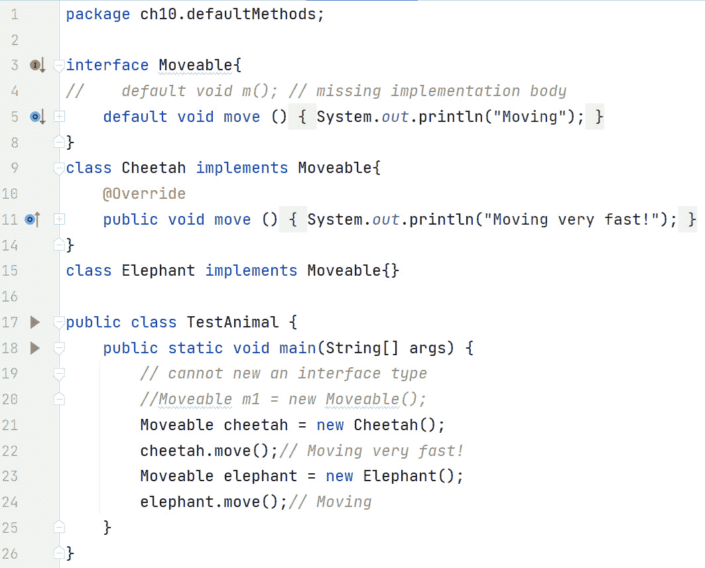

# 10

# 接口和抽象类

在*第九章*中，我们学习了面向对象编程的另一个核心支柱，即继承。我们了解到 Java 使用`extends`关键字来定义子类和父类之间的“是”继承关系。子类从其父类继承功能，这实现了代码重用，这是继承的核心好处。Java 通过确保一次只能从一个类扩展来防止多重类继承。

我们还深入探讨了面向对象编程（OOP）的另一个支柱——多态。多态是通过子类重写父类实例方法来实现的。我们了解到，在层次结构中，引用可以指向它们自己的类型对象（跨类型）和子类对象（向下）。如果引用尝试指向层次结构中的父对象，则会发生异常。

接下来，我们比较和对比了方法重载和方法重写。在方法重写中，方法签名必须匹配（除了协变返回）。在方法重载中，虽然方法名称相同，但方法签名必须不同。

我们还发现构造函数调用的顺序是从上（基类）到下。这是由`super()`关键字实现的。要访问父（非构造函数）成员，我们可以使用`super.`语法。

然后，我们回顾了`protected`访问修饰符，并演示了对于包外部的子类要访问受保护的成员，它们必须以非常具体的方式通过继承来这样做。实际上，一旦包外部，受保护的成员对子类（包含受保护成员的类）来说就变成了私有。

然后，我们介绍了两个对继承有影响的关键字：`abstract`和`final`。由于抽象方法没有实现代码，它旨在被重写。第一个非抽象（具体）子类必须为任何继承的`abstract`方法提供实现代码。`final`关键字可以在几种情况下应用。关于继承，`final`方法不能被重写，`final`类不能被继承。

接下来，我们讨论了`sealed`类，它使我们能够限制继承树的部分。使用`sealed`和`permits`关键字，我们可以声明一个类只能被某些其他命名的类继承。`non-sealed`关键字结束范围任务，因此使我们能够正常地继承。

我们还检查了继承层次结构中的`instance`和`static`块。`static`块仅在类首次加载时执行一次。另一方面，`instance`块在每次创建对象实例时执行，这使得它成为插入对所有构造函数都通用的代码的理想位置。

最后，我们探讨了向上转型和向下转型。向上转型永远不会成为问题，而向下转型可能会导致异常。使用`instanceof`关键字有助于防止这种异常。

在本章中，我们将介绍`abstract`类和接口。我们将比较和对比它们。接口在多年中经历了几次变化。通过示例，我们将检查这些变化。Java 8 为接口引入了`static`和`default`方法，从而使得代码第一次可以存在于接口中。在 Java 9 中，为了减少代码重复并提高封装性，接口中引入了`private`方法。最后，Java 17 引入了`sealed`接口，这使得我们可以自定义哪些类可以实现我们的接口。

本章涵盖了以下主要主题：

+   理解`abstract`类

+   掌握接口

+   检查`default`和`static`接口方法

+   解释`private`接口方法

+   探索`sealed`接口

# 技术要求

本章的代码可以在 GitHub 上找到，网址为[`github.com/PacktPublishing/Learn-Java-with-Projects/tree/main/ch10`](https://github.com/PacktPublishing/Learn-Java-with-Projects/tree/main/ch10)。

# 理解`abstract`类

在*第九章*中，我们介绍了`abstract`关键字。让我们回顾一下我们讨论的一些关键点。一个`abstract`方法正是如此——它是抽象的。它没有代码。甚至没有花括号——`{}`。这通常是一个设计决策。包含`abstract`方法的类希望子类提供代码。这意味着该类本身是“不完整”的，因此任何定义`abstract`方法的类本身也必须是`abstract`。任何`abstract`类的子类必须要么覆盖`abstract`方法，要么声明它本身也是`abstract`。否则，编译器会报错。

然而，情况并非总是如此——一个`abstract`类根本不需要有任何`abstract`方法。同样，这也是一个设计决策。由于类被标记为`abstract`，它被认为是“不完整”的（即使它可能包含所有方法的代码）。这阻止了基于`abstract`类的对象被实例化。换句话说，你不能基于`abstract`类创建对象。然而，你可以有一个基于`abstract`类型的引用。

请参阅*图 9**.14*以获取`abstract`方法和类的代码示例。

# 掌握接口

默认情况下，接口是一个`abstract`结构。在 Java 8 之前，接口中的所有方法都是`abstract`的。一般来说，当你创建一个接口时，你是在定义一个关于类可以做什么的合同，而没有说关于类将如何做的任何事情。一个类在实现接口时签署了这个合同。实现接口的类是同意“遵守”接口中定义的合同。“遵守”在这里意味着，如果一个具体的（非抽象）类实现了接口，编译器将确保该类为接口中的每个`abstract`方法都有实现代码。正如 Oracle 教程所述，“*实现接口允许一个类更正式地承诺它将提供的行为*。”

与类不同，你只能（直接）从另一个类继承，但一个类可以实现多个接口。因此，接口实现了多重继承。让我们看看一个例子：

```java
class Dog extends Animal implements Moveable, Loveable {}
```

这行代码表明`Dog`“是”`Animal`、`Moveable`和`Loveable`。接口名称通常是形容词，因为它们通常描述名词的性质。因此，接口名称通常以“able”结尾。例如，`Iterable`和`Callable`是 Java API 中的接口名称。

在上一行代码中，我们受限于只能从一个类扩展，但我们可以实现任意多的接口。这种灵活性非常强大，因为我们可以在不强制人工类关系的情况下链接到层次结构。这是接口的核心原因之一——*能够将类型转换为多个*基础类型*。

与`abstract`类一样，由于接口也是`abstract`的，你不能`new`一个接口类型。此外，类似于`abstract`类，你可以（并且经常这样做）有接口类型的引用。

在后面的章节中，我们将讨论具有实现代码的`static`、`default`和`private`方法。在此之前，我们将处理我们可以在接口中使用的另一种类型的方法：`abstract`方法。此外，我们还将讨论接口常量。

## 接口中的抽象方法

在 Java 8 之前，接口中的所有方法默认都是`public`和`abstract`的。那时，你可以认为接口是一个“纯粹的抽象类”。

关于`public`访问修饰符，尽管 Java 9 引入了`private`方法，但这仍然适用。这意味着你可以在接口中显式地将一个方法标记为`public`或`private`。然而，如果你没有指定任何访问修饰符，`public`是默认的。

他们的抽象性质如何呢？嗯，任何未标记为`static`、`default`或`private`的方法默认情况下都是`abstract`的。*图 10.1*概括了这一点：


图 10.1 – 接口中的抽象方法

在这个图中，我们可以看到`m2()`方法是`public`和`abstract`的，尽管这些关键字都没有明确编码。唯一的其他有效访问修饰符是`private`，正如在第 6 行声明`m3()`时所示。`m4()`无法编译（第 7 行）的事实表明，`protected`不是接口方法的有效访问修饰符。

我们能否在接口中声明变量？是的，我们可以。现在让我们来讨论它们。

## 接口常量

接口中指定的任何变量默认都是`public`、`static`和`final`。实际上，它们是常量，因此，它们的初始值不能被更改。通过将这些常量放在接口中，任何实现该接口的类都可以访问它们（通过继承），但它们是只读的。*图 10**.2*展示了某些接口常量：


图 10.2 – 接口常量

在前面的图中，我们有两个变量，即`VALUE1`和`VALUE2`。它们都是常量。`VALUE1`明确声明它是`public`、`static`和`final`，而`VALUE2`隐式地做了同样的事情（没有使用关键字）。

现在，让我们来看一个类实现接口的例子。

*图 10**.3*表示一个实现接口的类：


图 10.3 – 实现接口的类

在这个图中，第 3-6 行代表一个名为`Moveable`的接口，它声明了一个常量`HOW`和一个方法`move()`。第 7 行的`Dog`类声明它实现了`Moveable`。因此，由于`Dog`是一个具体的、非抽象类，它必须为`move()`提供实现。

如我们所知，接口方法默认是`public`的。然而，对于类来说并非如此。在类中，方法默认是包私有（package-private）；这意味着，如果你在类中的方法上没有提供访问修饰符，该方法是包私有的。因此，当在类中重写接口方法时，请确保该方法为`public`。因为`package-private`（第 9 行）比`public`（第 5 行）的权限弱，所以我们得到编译器错误——因此这一行被注释掉了。第 11 行显示，在`Dog`中必须显式声明`move()`为`public`。

第 15 行显示，在第 4 行声明的`HOW`是一个常量。如果取消注释，第 15 行将给出编译器错误，因为常量一旦赋值后就不能更改。

第 16 行和第 17 行展示了我们可以访问`HOW`常量的两种方式——要么在接口名称前加上它（第 16 行），要么直接访问（第 17 行）。

第 19 行显示，一旦进入一个`static`方法，例如`main()`方法，就不能直接访问实例方法，例如`move()`方法。这是因为实例方法秘密地传递了一个指向调用它的（对象）实例的引用，即`this`引用。由于`static`方法与类相关，而不是与类的特定实例相关，因此在`static`方法中没有`this`引用。因此，根据第 20 行，我们需要创建一个实例，然后使用该实例来调用`move()`。

当我们运行这个程序时，第 16 行和第 17 行都输出了`walk`常量的值。第 20 行输出了`Dog::move()`，这是`Dog`对`move()`（第 12 行）的实现的结果。

注意

自 Java 8 以来，允许在`default`方法中编写代码。由于`default`方法是可继承的，编译器必须介入以防止接口中的多重继承导致问题。我们将在讨论接口中的`default`方法时回到这个问题。

现在，让我们看看多重接口继承。

## 多重接口继承

与类不同，在 Java 中不允许多重继承，但在接口中允许多重继承。请注意，多重类继承的问题在于，如果允许多重类继承，你可能会继承两个不同的同一方法实现。

*图 10**.4* 展示了多重接口继承的一个例子：


图 10.4 – 多重接口继承

在这个图中，第 2 行的`MoveableObject`接口是一个没有任何方法的接口。这被称为标记接口。标记接口用于使用`instanceof`进行类型信息。例如，如果你想检查一个对象是否是实现了`MoveableObject`的类的实例，你会编写以下代码：

```java
if (objectRef instanceof MoveableObject) {}
```

第 3-5 行定义了一个名为`Spherical`的接口。在这个阶段，我们可以简单地定义一个类，直接实现这两个接口，如下所示：

```java
class BallGame implements MoveableObject, Spherical{     @Override doSphericalThings(){}
}
```

第 6 行很有趣——我们可以定义一个接口（在这个例子中是`Bounceable`），它从其他两个接口（即`MoveableObject`和`Spherical`）中扩展（继承）。因此，`Bounceable`有两个`abstract`方法：一个它自己定义的，称为`bounce()`，另一个它从`Spherical`继承的，称为`doSphericalThings()`。

由于`Volleyball`类实现了`Bounceable`（第 11 行），它必须重写`bounce()`和`doSphericalThings()`这两个方法。当`Volleyball`这样做时，它就可以编译了。

注意，在第 17 行，`abstract`类`Beachball`声明它也实现了`Bounceable`。然而，由于`Beachball`是`abstract`的，所以“合同”不必遵守；这意味着`Beachball`可以自由实现`Bounceable`中所有、一些或没有任何`abstract`方法。在这个例子中，`Beachball`没有实现`Bounceable`所要求的任何`abstract`方法。

现在我们已经了解了接口中的`abstract`方法对实现类的影响，让我们来检查接口中的两个非`abstract`方法——`default`和`static`方法。

# 检查默认和静态接口方法

在 Java 8 之前，接口中只允许有`abstract`方法。这意味着如果你向现有的接口中引入一个新的`abstract`方法，已经实现该接口的类将会出错。这对 Java 开发者来说不方便，对 Java 的设计者来说也是如此。

所有这些都在 Java 8 中发生了变化，引入了`default`和`static`方法。引入`default`方法的主要驱动力是能够在接口中引入代码，而不破坏现有的客户端基础。这保持了向后兼容性。此外，新代码自动对实现该接口的客户端可用。

引入`static`方法的主要驱动力是将实用代码保留在接口内部，而不是像引入之前那样放在一个单独的类中。

让我们依次讨论它们，首先是`default`方法。

## ‘默认’接口方法

接口使用`default`关键字来标记一个方法，使其可以被实现类继承。正如之前所述，如果你没有指定访问修饰符，它们默认是`public`（请原谅这个双关语！）。默认方法必须有一个实现 - 必须存在一组花括号（即使它们是空的花括号）。实现接口的类会继承任何`default`方法。这些类可以覆盖继承的版本，但这不是必需的。

让我们看看一些示例代码：



图 10.5 – 接口默认方法

在这个图中，我们有一个名为`Moveable`的`interface`（第 3-8 行）。如果第 4 行取消注释，它将无法编译，因为`default`（或`static`）接口方法必须具有代码体。第 5 行定义了一个名为`move()`的`default`方法。由于`Moveable`中没有`abstract`方法，实现`Moveable`的类不需要提供任何特定的方法。

`Cheetah`类（第 9-14 行）实现了`Moveable`并覆盖了`move()`方法。`Elephant`类（第 15 行）也实现了`Moveable`，但没有覆盖`move()`方法。

因此，`Cheetah`对象将有一个自定义的`move()`实现，而`Elephant`对象将使用从`Moveable`继承的版本。

第 20 行显示，与`abstract`类一样，你不能`new`一个接口类型。

第 21 行创建了一个名为`Cheetah`的对象，通过一个`Moveable`引用进行引用，即`cheetah`。这完全没问题，原因有两个。首先，引用可以是`接口`类型，在许多情况下确实是。其次，只要对象类型实现了接口类型，无论是直接实现（如这里的情况）还是间接实现（通过从实现了接口的类继承），这个程序就可以编译。由于`Cheetah`类实现了`Moveable`接口，所以一切正常。

第 22 行以多态方式执行了`Cheetah`类的`move()`方法，结果在屏幕上输出了`Moving very fast!`。

第 23 行创建了一个名为`Elephant`的对象，通过一个`Moveable`引用进行引用，即`elephant`。由于`Elephant`实现了`Moveable`接口，这是可以的。

第 24 行很有趣。由于`Elephant`没有提供自定义的`move()`版本，因此使用了`Moveable`接口（`Elephant`实现了该接口）的默认版本。因此，屏幕上输出了`Moving`。

现在，让我们讨论一下`静态`接口方法。

## ‘静态’接口方法

接口使用`static`关键字来标记一个方法作为工具方法。与`default`方法一样，`static`方法默认是`public`的。同样，与`default`方法一样，`static`方法必须有实现。然而，实现接口的类不会继承`static`方法。要访问`static`方法，你必须使用`InterfaceName.staticMethodName()`语法。

让我们通过代码示例来看看：


图 10.6 – 接口静态方法

在前面的图中，我们有一个接口`I`，它在第 5 行有一个名为`m1()`的静态方法。请注意，第 4 行被注释掉了，因为与`default`方法一样，静态方法也必须有代码体。

`TestStaticMethods`类实现了`I`接口。由于接口中没有`抽象`方法，因此没有实现特定的方法。第 9 行显示了错误的语法，因此会生成编译器错误。第 10 行显示了正确的语法，并在运行时输出了`3`。

之前，我们提到多接口继承可能存在关于`default`方法的潜在问题。现在让我们来探讨一下。

## 多接口继承

死亡菱形([`en.wikipedia.org/wiki/Multiple_inheritance#:~:text=The%20”diamond%20problem”%20(sometimes,from%20both%20B%20and%20C`](https://en.wikipedia.org/wiki/Multiple_inheritance#:~:text=The%20”diamond%20problem”%20(sometimes,from%20both%20B%20and%20C)))出现在一个类发现它继承了两个同名方法时；它应该使用哪一个？这在允许多重继承的 C++中是一个问题，并且是禁止 Java 多重继承的一个影响因素。

然而，Java 始终允许一个类实现多个接口。然而，现在 Java 8 允许有代码体的可继承的`default`方法，Java 8 不可能遇到“死亡菱形”场景吗？一个类是否可以实现两个（或更多）具有相同`default`方法的接口？那会怎样呢？好消息是编译器介入并强制你的类覆盖“违规”的`default`方法。

那么，这就留下了一个问题，如果我们想访问每个`default`方法怎么办？例如，假设我们在接口`A`中有一个名为`foo()`的`default`方法，在接口`B`中也有一个名为`foo()`的`default`方法。如果在我们自己的类中，我们想执行`foo()`的三个不同版本——来自`A`的、来自`B`的以及编译器强制我们创建的来自我们自己的类，会怎样呢？

*图 10.7* 展示了如何在代码中实现这一点：


图 10.7 – 访问多个默认代码实现

在这个图中，接口`A`在第 4 行定义了它的`foo()`方法，而接口`B`在第 7 行定义了它的`foo()`方法。`TestMultipleInheritance`类实现了`A`和`B`。由于`A`和`B`都有`foo()`代码，编译器必须介入以防止“死亡菱形”。因此，`TestMultipleInheritance`中的`foo()`方法（第 11-16 行）是强制性的；否则，代码将无法编译。由于`default`方法是实例方法，当我们覆盖接口版本的`foo()`时，我们必须确保它是非静态的。

第 13 行展示了调用`A`中的`foo()`的语法。这个语法是`InterfaceName.super.methodName()`。所以在这个例子中，它是`A.super.foo()`。由于使用了`super`，方法必须是实例方法。这是因为只有实例方法才能访问（使用`super`引用的父实例）`super`引用（以及使用`this`引用的当前实例）。

类似地，第 15 行使用`B.super.foo()`从`B`中调用`foo()`。

注意，第 14 行无法编译，因此被注释掉了。这是因为，使用`A.foo()`语法，编译器正在寻找接口`A`中名为`foo()`的`static`方法。然而，`A`中的`foo()`方法是非静态的（第 4 行）。

有趣的是，第 18 行无法编译。这是因为，由于`main()`是一个`static`方法（一个`static`上下文），我们不能使用`super`。

第 19 行展示了如何在类本身中执行自定义的`foo()`方法。回想一下，当我们从`static`方法中调用非静态（实例）方法时，我们需要一个实例，因此有`new TestMultipleInheritance()`。

有了这些，我们已经涵盖了两种非抽象方法的类型，即`default`方法和`static`方法。还有一个：`private`接口方法。

# 解释“私有”接口方法

接口也可以有带有代码实现的`private`方法。它们被引入以减少代码重复并提高封装性。这些`private`方法可以是`static`的也可以是非`static`的。由于它们是`private`的，它们只能从接口内部访问。与类一样，你不能从一个`static`方法中访问一个非`static`方法。

让我们看看一个代码示例。首先，我们将检查有代码重复的代码。*图 10.8*显示了这样的接口：


图 10.8 – 带有代码重复的接口

正如图中所示，第 6、11 和 16 行是相同的。此外，第 8、13 和 18 行也是相同的。我们将通过使用`private`方法重构这个接口来解决这个代码重复问题。*图 10.9*显示了相应的代码：


图 10.9 – 带有私有方法的接口

在这个图中，我们有一个名为`hit(String)`的`private``static`方法，它接受要执行的击球（射击）。首先要注意的是，与`default`和`static`方法一样，预期并存在一个代码体。

第 25 行，在*图 10.8*中重复了三次，现在只出现一次。第 27 行也是如此。第 26 行输出正在进行的击球动作。请注意`hit(String)`是`static`的。这使得方法可以从`static`方法（如第 32 行的`forehand()`）中调用。

接口中存在`default`、`static`和`private`方法的混合，以促进进一步的讨论。首先，第 29 行是一个`default`方法，它调用了`private`的`hit(String)`方法，传递了`backhand`字符串。请注意，`default`方法不能也被标记为`private`，因为它们的语义相反——`private`方法，就像类一样，是不可继承的，而`default`方法是可继承的。

其次，`forehand()`方法（第 30-33 行）表示从`static`上下文（第 32 行）调用`hit(String)`，传递`forehand`。第 31 行表示尝试从一个`static`方法中调用一个名为`smash()`的非`static``private`方法。与类一样，这是不允许的，因此已被注释掉。

最后，我们可以从其他`private`方法中调用`private`方法（第 34 行）。

第 35 行是一个提醒，即未标记为`default`、`static`或`private`的方法默认是`abstract`的，因此不允许有代码。

让我们来看看如何从一个实现了它的类中如何使用`EfficientTennis`接口：


图 10.10 – 带有私有方法的接口

首先，要注意的是`SportTest`类没有要实现的方法。这是因为`EfficientTennis`没有声明任何`abstract`方法，只有`default`、`static`和`private`方法。

第 41 行执行了名为`backhand()`的`default`方法，第 42 行执行了名为`forehand()`的`static`方法。请注意，第 43 行尝试访问名为`hit(String)`的`private`方法。由于该方法是对接口私有的，这是不允许的，因此第 43 行被注释掉了。这表明`hit(String)`被封装在外部世界之外。实际上，`SportTest`不知道`hit(String)`方法，因此不依赖于它。如果`hit(String)`被更改或甚至删除，只要`backhand()`和`forehand()`方法仍然工作，`SportTest`就不会受到影响。

现在，让我们继续我们的最后一个主题：`sealed`接口。

# 探索封闭接口

在*第九章*中，我们了解到`sealed`类使我们能够通过指定哪些类可以成为我们的类的子类型来范围我们的继承层次结构。我们使用`sealed`和`permits`关键字作为一对来完成此操作。一旦一个类被封闭，该类的每个子类都必须是`sealed`、`non-sealed`或`final`——也就是说，我们继续封闭层次结构（`sealed`）、结束封闭层次结构（`non-sealed`）或完全结束层次结构（`final`）。

封闭接口也是可能的。我们将使用来自*第九章*的例子，并进行一些小的修改。首先，*图 10*.*11*显示了相关的 UML 图，这将有助于解释代码：


图 10.11 – 封闭接口 UML 图

在这个图中，我们有一个接口，用`<<interface>>`表示，称为`Driveable`。在 UML 中，为了指定一个类实现一个接口，使用`<<realize>>`关键字（加上指向接口的虚线箭头）。

在这个例子中，我们将对层次结构进行如下范围定义：允许实现`Driveable`的唯一类是`Vehicle`，允许的`Vehicle`子类是`Car`，允许的`Car`子类是`Saloon`。

当我们到达`Saloon`时，我们希望再次打开层次结构——如果你愿意的话，就是解封它。这允许`Ford`和`Volvo`从`Saloon`扩展。请注意，这只是为了演示目的，因为现在任何类都可以成为`Saloon`的子类。

`Chair`、`Table`和`Window`类都是无关的，并且不是封闭层次结构的一部分。

*图 10*.*12*显示了使用封闭接口的一些代码：


图 10.12 – 封闭接口代码

此图中的重要行是第 3-4 行。第 3 行说明`Driveable`接口是`sealed`的，并且只允许一个类实现它，即`Vehicle`。`Vehicle`现在必须实现`Driveable`；否则，代码将无法编译。`Vehicle`确实实现了`Driveable`（第 4 行），所以一切正常。此外，`Vehicle`是`sealed`的，允许的唯一子类是`Car`。

第 6 行指出`Car`是`Vehicle`的子类，而`Saloon`是唯一允许的子类型。

第 7 行指出`Saloon`是预期的`Car`子类。`Saloon`是`non-sealed`的事实打开了层次结构，并允许`Volvo`（第 8 行）和`Ford`（第 9 行）从`Saloon`扩展。

第 11-13 行都无法编译。第 11 行提醒我们`Vehicle`只允许`Car`子类型。同样，第 12 行提醒我们`Car`只允许`Saloon`子类型。第 13 行显示，根据第 3 行的内容，唯一可以实现`Driveable`的类是`Vehicle`。

这就完成了我们对接口和`abstract`类的讨论。现在，让我们应用我们所学到的知识！

# 练习

通过接口和`abstract`类，我们可以进一步改进我们的应用程序结构！查看以下练习以测试你的知识：

1.  恐龙，无论具体物种如何，都有共同的行为，如进食和移动。定义一个封装这些行为的接口，并为它想出一个合理的名字，然后在`Dinosaur`类中实现它。

1.  我们公园使用不同类型的车辆来完成不同的目的。设计一个名为`Vehicle`的`abstract`类，并从中派生出如`Jeep`和`Helicopter`等具体类。

1.  修改`Vehicle`类，使其包含一个名为`travel()`的`abstract`方法，并在其子类中提供不同的实现。

1.  通过实现`Comparable`接口来比较恐龙的年龄，使我们的`Dinosaur`类可排序。

1.  同样，我们的员工也有共同的行为。定义一个`Worker`接口，其中包含代表这些行为的函数，并在`Employee`类中实现它。

1.  我们把恐龙安置在不同的围栏里。使用`ArrayList`实现`List`接口来管理围栏中的恐龙。

1.  恐龙的进食行为根据它们的饮食不同。创建`Carnivore`和`Herbivore`接口，并在适当的恐龙子类中实现它们。

# 项目 - 统一公园管理系统

在这个相对高级的项目中，你将把中生代伊甸园公园管理应用提升到下一个层次。你可以通过利用你之前创建的类来实现这一点。你可以继续进行上一个项目，或者从头开始。

增强后的系统将实现多态性，以便可以管理不同类型的恐龙和员工。这将增加公园管理的灵活性和功能性，允许多样化的恐龙物种和员工角色。增强后的系统应包括以下内容：

+   管理各种恐龙物种档案的能力，扩大了你公园的多样性

+   管理不同类型员工档案的能力，例如兽医、导游、维修工人和安全人员

+   所有其他功能也应适应这些新变化，包括编辑和删除档案、追踪恐龙、管理员工日程、管理游客入场和处理特殊事件

这是一个逐步计划来实现这一点：

1.  将`Dinosaur`和`Employee`类扩展到各种子类中，以表示不同类型的恐龙和员工。请确保您使用多态原则。

1.  `Dinosaur`和`Employee`对象，每个都可以是任何子类的实例。

1.  **更新交互**：调整您的基于控制台的交互界面，使其能够处理新的恐龙和员工类型。您可能需要添加新选项或子菜单。

1.  **更新菜单创建**：您的菜单现在应提供管理各种类型恐龙和员工的选择。确保每个选项对应程序中的特定功能。

1.  `Manage Dinosaurs`选项现在可以触发一个函数，用于添加、删除或编辑任何恐龙物种的配置文件。

1.  **退出程序**：提供一个选项让用户退出程序。

您的起始代码将与最后两个章节中展示的代码非常相似。一些方法，如`manageDinosaurs()`和`manageEmployees()`，需要更新并变得更加复杂：

```java
public void handleMenuChoice(int choice) {    switch (choice) {
        case 1:
            manageDinosaurs();  // This method now needs
              to handle different types of dinosaurs
            break;
        case 2:
            manageEmployees();  // This method now needs
              to handle different types of employees
            break;
        case 3:
            // manageTickets();
            break;
        case 4:
            // checkParkStatus();
            break;
        case 5:
            // handleSpecialEvents();
            break;
        case 6:
            System.out.println("Exiting...");
            System.exit(0);
    }
}
```

`manageDinosaurs()`、`manageEmployees()`、`manageTickets()`、`checkParkStatus()`和`handleSpecialEvents()`方法需要处理增加的复杂性。

# 摘要

我们在本章开始时考察了`抽象`类。一个`抽象`类可以有零个或多个`抽象`方法。然而，如果任何方法是`抽象`的，那么该类必须是`抽象`的。虽然`抽象`类不能被实例化，但引用可以是`抽象`类型。

在 Java 8 之前，接口只包含`抽象`方法（和常量）。我们关于接口的讨论始于这一点，当时所有方法都是`抽象`的。虽然一个类只能从一个类扩展，但一个类可以实现多个接口。这是引入接口的主要原因之一——能够将类型转换为多个基类型。

实现接口的类签订了一个“合同”，为接口中（如果有）的每个`抽象`方法提供代码。如果接口中有一个`抽象`方法，而具体的非抽象类没有为其提供代码实现，编译器会报错。因此，接口是保证某些方法存在于类中的绝佳方式。接口中的变量默认为常量。这些常量对实现类可用，但只读。我们注意到，允许多接口继承，即一个接口可以继承自多个其他接口。这与类形成对比，无论是`抽象`类还是具体类，多重继承都是被禁止的。

在 Java 8 中，接口中引入了具有代码体的`default`方法和`static`方法。这是第一次允许在接口中添加代码。关于继承，`default`方法会被实现类继承，而`static`方法则不会。因此，访问这两种方法需要不同的语法。由于`default`方法可以被继承，实现类可以覆盖它们。这两种方法类型，与`abstract`方法一样，默认情况下都是`public`的。

接下来，我们看到了编译器如何防止我们遇到“死亡菱形”问题。当两个接口具有相同的`default`方法名称时，可能会出现这个问题。实现这两个接口的类被迫提供自定义实现以避免歧义。这很自然地引出了语法（使用`super`），它使我们能够在两个接口中实现`default`方法，并在类中实现自定义（非默认）版本。

Java 9 引入了具有代码体的`private`接口方法。它们被引入以减少代码重复并提高封装性。我们详细说明了通过引入`private`接口方法重构代码的例子。

我们通过讨论在 Java 17 中引入的`sealed`接口来结束本章。与`sealed`类（*第九章*）类似，`sealed`接口使我们能够限制层次结构——也就是说，当我们声明一个`sealed`接口时，我们指定允许实现它的类。我们提供了一个 UML 图和一些代码来更详细地解释这一点。

这就完成了我们对接口和`abstract`类的讨论。在下一章中，我们将介绍异常。
