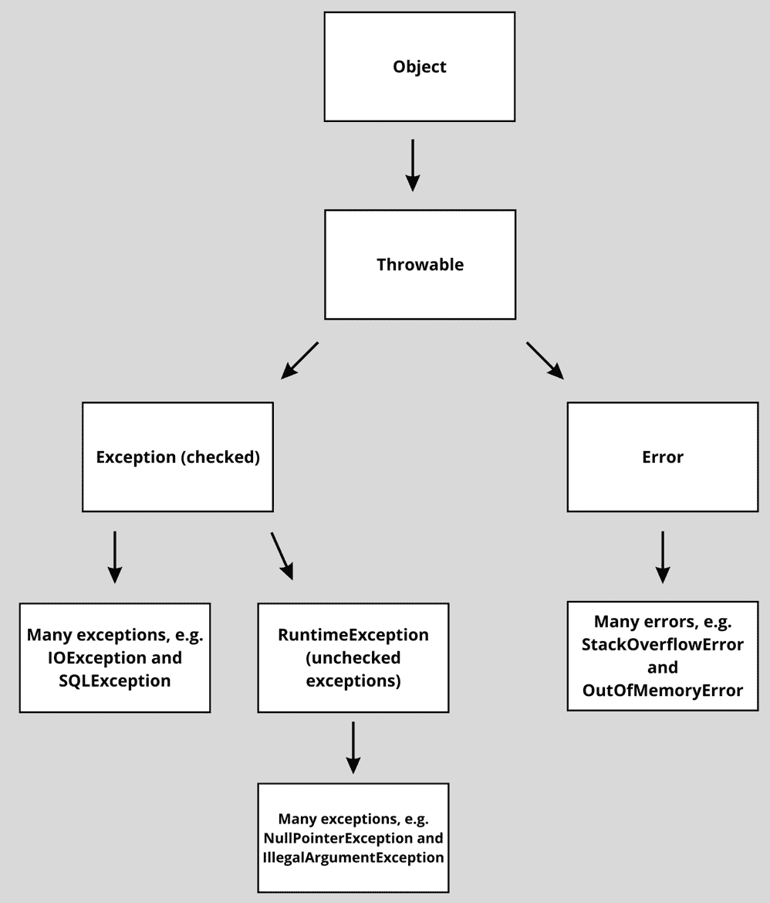
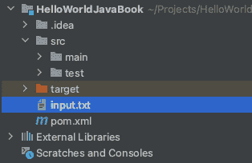

# 11

# 处理异常

错误处理是软件开发中的另一个基本概念。当程序无法或不知道如何对某种情况进行反应时，就会发生错误。错误处理允许你优雅地应对程序中的意外事件。如果没有错误处理，当错误发生时，应用程序会崩溃并停止运行。

在 Java 中，我们有不同类型的错误。我们处理最多的一种错误称为**异常**。在 Java 术语中，我们稍后会学到，异常并不是错误。这与类层次结构有关。然而，从日常语言学的角度来看，将异常视为某种错误并不奇怪。

但是，我们通常不谈论错误，而是谈论异常。错误也会发生，但错误通常是应用程序无法恢复的情况。你的应用程序应该能够从异常中恢复。

Java 中的异常处理允许你管理程序中的问题和意外事件。掌握异常处理不仅会提高你代码的健壮性，还能帮助你更有效地维护和调试应用程序。通过理解异常的工作原理，你可以编写处理意外情况而不会崩溃或产生错误结果的代码。

确保你具备管理应用程序中异常的必要技能正是我们将在本章中学习的内容。以下是我们将涵盖的概述：

+   理解异常及其目的

+   异常类型 – 检查和不检查

+   基本 I/O 操作

+   抛出异常

+   创建自定义异常

+   抓捕或声明原则

+   使用 try-catch 块、try-catch-finally 和 try-with-resources

+   在方法签名中处理继承和异常

因此，让我们深入探索异常的世界！

# 技术要求

本章的代码可以在 GitHub 上找到：[`github.com/PacktPublishing/Learn-Java-with-Projects/tree/main/ch11`](https://github.com/PacktPublishing/Learn-Java-with-Projects/tree/main/ch11)。

# 理解异常

在日常生活中，我们必须执行许多过程。而且，我们总是在发生一些小插曲，这些不应该破坏我们的日子。这些小插曲不被认为是事件中的快乐路径，但它们经常发生，我们从它们中恢复过来，继续正常工作。

还有一些更严重的问题可能会发生，我们需要有正式的备份计划，比如在火灾中疏散建筑物。

Java 中的异常就像这样。这些是不应该发生的事情；有时，我们控制它们发生，有时，我们则不。在某些情况下，我们有义务指定一个备份计划，而在其他情况下，我们则没有。首先，让我们再谈谈什么是异常。

## 异常是什么？

异常是中断程序正常流程的事件。它们通常由程序在运行过程中遇到的错误或意外条件引起。Java 中的异常是对象。这些异常由`Exception`类或其子类的实例表示。`Exception`类是`Throwable`类的子类。

当发生异常时，Java 运行时系统会创建一个包含错误信息的异常对象，例如错误的类型和错误发生时程序的状态。这个过程被称为*抛出异常*。处理异常被称为*捕获异常*。

如果程序没有捕获并处理异常，Java 运行时系统将终止程序，通常显示错误信息和堆栈跟踪。因此，让我们谈谈异常处理的需求。

堆栈跟踪

你可能还不知道这个术语，但你很可能已经遇到过。当异常发生时，会出现堆栈跟踪。它显示了代码到达错误所在的“路径”。以下是一个示例：

`Exception in thread "main" java.lang.ArrayIndexOutOfBoundsException: Index 0 out of bounds for length 0`

`at javabook.Example.printFirstValueArray(Example.java:21)`

`at javabook.Example.main(Example.java:8)`

正如你在本例中看到的，最终触发异常的行是第 21 行，方法名为`printFirstValueArray`。该方法在`main`方法的第 8 行被调用。

## 异常处理的需求

由于我们不希望每次程序抛出异常时都停止运行，因此异常处理是编程中的一个关键方面。我们通常将代码逻辑与异常处理逻辑分开。这有助于我们创建一个可维护和有弹性的应用程序。当我们设置了适当的异常处理时，我们的程序可以从意外情况中优雅地恢复。这比程序崩溃并停止，甚至产生错误的结果要更好。

由于这非常常见，Java 提供了一个内置的异常处理机制，允许我们捕获和处理异常。这样，我们可以从异常中恢复，并继续执行程序。这个机制鼓励（甚至强制）我们思考程序可能遇到的可能的异常条件，并编写代码来有效地处理这些异常。让我们谈谈需要异常处理的一些情况。

## 需要异常处理的常见情况

有许多可能导致异常的情况。其中一些在我们控制范围内，但最重要的是，我们必须处理无法完全控制的情况下的异常可能性。在查看异常代码之前，我们将讨论一些常见的情况。

### 文件 I/O 操作

需要异常处理的一个非常常见的情况是处理文件 I/O 操作的逻辑。当处理文件 I/O 操作时，可以使用异常来处理文件找不到或无法读取或写入的情况。这些都是程序员无法控制的情况。程序可能没有正确的权限，文件可能已被删除，或者文件可能已经被使用——许多其他超出你控制的情况也可能发生。

Java 有特定的子类来处理这些类型的异常。处理 I/O 操作的主要子类是 `IOException`。它有自己的子类，例如 `FileNotFoundException`。

### 数据库操作

我们依赖外部部分的另一种类型的情况是各种数据库操作。数据库可能会宕机或被修改，作为开发者，这超出了你的控制。因此，我们需要处理在连接到、查询或更新数据库时可能发生的异常。例如，当数据库连接有问题或执行了无效的 SQL 查询，或者违反了数据库约束（数据库特定的规则）时，可能会抛出 `SQLException`。适当的异常处理允许你的程序从这些问题中恢复，例如通过重新建立连接或回滚事务。

### 用户输入验证

当你的应用程序需要用户输入时，可以使用异常来处理输入无效或不符合预期格式的情况。例如，在尝试将非数字字符串解析为整数时，可能会抛出 `NumberFormatException`。妥善处理这类异常可以帮助你的应用程序向用户提供有用的反馈，并确保他们输入有效数据，同时将核心逻辑与错误处理分离。

### 资源管理

你的程序依赖于外部资源，如内存和系统资源。这些资源也可以是第三方服务，如 API。在这些所有情况下，都可能发生异常。我们需要处理这些资源不可用或耗尽的情况。例如，当抛出 `OutOfMemoryError` 时，可以使用 `InterruptedException` 来处理在等待资源时线程被中断的情况。在这些场景中，适当的处理可以帮助你的应用程序恢复或优雅地降低其功能。

可能令人印象深刻的是，我们有一个用于处理内存不足情况的 *错误*，但到目前为止，我们一直在谈论 *异常* 而不是错误。让我们看看层次结构，以了解这里发生了什么。

# 理解异常层次结构

Java 是一种面向对象的语言，对象可以形成层次结构。在 Java 中，所有异常都是 `Throwable` 类的子类。在出现问题时，应用程序可以抛出的任何内容都是 `Throwable` 类型。`Throwable` 类有两个主要的子类：`Error` 和 `Exception`。

*错误* 表示在运行时系统操作期间发生的严重问题，通常表明 JVM 或应用程序环境存在关键问题。例如包括 `OutOfMemoryError` 和 `StackOverflowError`。错误通常是不可恢复的，并且不建议在代码中捕获和处理它们。

另一方面，`Exception` 类及其子类代表程序可以处理的异常条件。异常主要有两大类：检查异常和未检查异常。

## 检查异常

`IOException`、`FileNotFoundException` 和 `SQLException`。

检查异常是 `Exception` 类的子类，但不包括 `RuntimeException` 及其子类。

## 未检查异常

**未检查异常** 代表不需要显式处理的编程错误。这些异常通常是由于编程错误或正常程序执行期间预期不会发生的情况而抛出的。

由于未检查异常通常表明代码中的错误，Java 编译器假设你的程序不需要显式地捕获或声明它们。然而，你仍然可以选择捕获和处理未检查异常。当你想要提供更友好的错误消息或记录错误以供调试时，这可能会很有用。

未检查异常的例子包括 `NullPointerException`、`IndexOutOfBoundsException` 和 `IllegalArgumentException`。这些未检查异常是 `RuntimeException` 的子类。这个类是 `Exception` 的子类。与 `Exception` 的所有其他子类不同，`RuntimeException` 及其子类不需要被处理。（你可以说是…一个异常。）

在 **图 11**.1 中，你可以以图表的形式看到这个层次结构：



图 11.1 – 可抛出类层次结构

理解异常层次结构对于有效地处理异常至关重要。正如你所见，存在不同类型的异常。其中一些（检查异常）需要处理，而另一些则不需要（未检查异常）。

在本章中，我们将使用 I/O 操作来演示异常。这是我们之前没有见过的。所以，让我们首先介绍 I/O 操作。

# 使用基本 I/O 操作

我们将通过 I/O 操作来展示异常是如何工作的。因此，在深入异常处理之前，我们将简要介绍基本的 I/O 操作。有好多方法可以做到这一点，但我们将使用 `FileReader` 和 `FileWriter` - `FileReader` 和 `FileWriter` 是 `java.io` 包中的类，允许你读取和写入字符。我们选择这两个类是因为它们提供了在 Java 中处理文本文件的一种简单方法，并且在现实世界的文件 I/O 操作中也经常被使用。首先，让我们用 `FileReader` 来读取。

其他 I/O 操作类

在常见情况下，通常使用其他类进行 I/O 操作。例如，如果你要从文件中读取行，你可能想使用`BufferedReader`。这不是本章的重点。我们只想了解足够的 I/O 操作，以便演示一些异常处理的实际场景。

## 使用 FileReader 从文件中读取

要使用`FileReader`从文本文件中读取，你首先需要创建一个`FileReader`对象，并将文件路径作为参数传递。然后你可以使用`read()`方法从文件中读取字符。使用`FileReader`后，你必须关闭它，以确保你不锁定文件，并且不使用任何不必要的资源。下面是使用`FileReader`读取文件的示例：

```java
import java.io.FileReader;import java.io.IOException;
public class ReadFileExample {
    public static void main(String[] args) {
        try {
            FileReader reader = new
            FileReader("input.txt");
            int character;
            while ((character = reader.read()) != -1) {
                System.out.print((char) character);
            }
            reader.close();
        } catch (IOException e) {
            e.printStackTrace();
        }
    }
}
```

这段代码是从名为`input.txt`的文件中读取的。*try-catch*块是我们将在本章后面看到的；它是用于异常处理的，你现在不需要理解它。

我们创建了一个新的`FileReader`实例，并传递了输入文件的路径。为了使读取操作生效，`input.txt`已经被放置在项目文件夹中。对我来说，它看起来就像*图 11.2*所示的结构：



图 11.2 – 项目中 input.txt 的位置

读取文件的最复杂的代码片段可能是以下这个：

```java
int character;while ((character = reader.read()) != -1) {
    System.out.print((char) character);
}
```

`FileReader`将逐字符读取输入文件。`read()`方法读取一个字符并移动光标。光标是它开始读取下一个字符的位置。因此，我们需要将读取的结果存储在一个变量中，以免丢失字符。当达到文件末尾时，`read()`将返回`-1`。这意味着我们需要读取直到达到`-1`。这正是`while ((character = reader.read()) != -1)`所做的事情。

我们将要打印的`input.txt`文件将显示在输出中。当然，我们可以用文件内容做更多有趣的事情，但这不是这里的重点。我们只想看到如何处理异常。如果代码只是这样，它将不会运行：

```java
FileReader reader = new FileReader("input.txt");  int character;
while ((character = reader.read()) != -1) {
  System.out.print((char) character);
}
reader.close();
```

这就是读取文件的方法。接下来，我们将学习如何将内容写入文件。

## 使用 FileWriter 写入文件

这听起来可能相当直观，但要将内容写入文本文件，我们可以使用`FileWriter`。步骤与使用`FileReader`类似：

1.  首先，你需要创建一个`FileWriter`对象，并将文件路径作为参数传递。

1.  接下来，你可以使用`write()`方法将字符或字符串写入文件。

1.  最后，关闭`FileWriter`。

下面是使用`FileWriter`写入文件的示例：

```java
import java.io.FileWriter;import java.io.IOException;
public class WriteFileExample {
    public static void main(String[] args) {
        try {
            FileWriter writer = new
              FileWriter("output.txt");
            String content = "I can write!";
            writer.write(content);
            writer.close();
        } catch (IOException e) {
            e.printStackTrace();
        }
    }
}
```

如您所见，首先，我们创建了一个`FileWriter`的实例。然后，我们创建了一个名为`content`的`String`类型变量。我们使用`write()`方法将这个变量写入`output.txt`文件。再次忽略 try-catch 部分。我们很快就会了解到这一点。

现在我们已经介绍了基本的文件 I/O 操作，我们可以继续介绍异常和异常处理。我们将使用`FileReader`和`FileWriter`作为处理各种类型异常的现实世界示例。

# 抛出异常

当出现问题时，程序会*抛出异常*。这是因为创建 Java 或你正在使用的库的人，在某个时刻，这样编写了代码。Java 库中的许多部分都是编程为抛出异常的，例如在以下情况下：

+   当你尝试访问 null 实例的字段或方法时，会抛出`NullPointerException`

+   当你尝试除以 0 时，会抛出`ArithmeticException`

+   当你尝试访问数组中不属于数组范围的索引时，会抛出`ArrayIndexOutOfBoundsException`

这是抛出异常的代码输出的示例：

```java
int x = 2 / 0;
```

这是输出：

```java
Exception in thread "main" java.lang.ArithmeticException: /by zero
    at ThrowingExceptions.main(ThrowingExceptions.java:3)
```

你可以在输出中看到异常的名称（`java.lang.ArithmeticException`），以及消息，指出`/` `by zero`。

在异常下面，我们可以看到*堆栈跟踪*。堆栈跟踪是应用程序到达异常的步骤。堆栈跟踪的顶部显示了触发异常的行。这是一个非常短的堆栈跟踪，因为它直接在主方法中出错，所以我们只有一行。

当出现问题时，Java 库会抛出异常。这是通过`throw`关键字实现的。在下一节中，我们将看到如何使用这个`throw`关键字来自己抛出异常。

## `throw`关键字

我们可以使用`throw`关键字显式地抛出异常。这通常用于当你的代码检测到异常条件或当你想在代码中强制执行特定约束时。

这是抛出异常的语法：

```java
throw new IllegalArgumentException("Age cannot benegative.");
```

我们从`throw`关键字开始；之后，有一个`Throwable`实例。在这种情况下，我们抛出一个新的`IllegalArgumentException`实例，并在消息中指定年龄不能是负值。

当抛出异常时，程序的正常执行被中断，控制权转移到最近的匹配的 catch 块。如果没有，程序停止并显示异常和堆栈跟踪。

## 创建和抛出自定义异常

Java 有很多内置的异常，但在某些情况下，你可能需要更具体的异常。好消息是，你还可以创建和抛出你自己的自定义异常！自定义异常在你想提供有关发生问题的更具体信息时很有用，或者当你想在 catch 块中不同地处理某些类型的异常时。

要创建自定义异常，你需要定义一个新的类，该类扩展了`Exception`类或其子类。以下是一个自定义异常类的示例：

```java
public class InvalidAgeException extends Exception {    public InvalidAgeException() {
        super();
    }
    public InvalidAgeException(String message) {
        super(message);
    }
    public InvalidAgeException(Exception e) {
        super(e);
    }
}
```

我们重写了以下三个构造函数。这是推荐的做法以支持约定：

+   `无参数`构造函数

+   包含消息的`String`参数的构造函数

+   接受另一个异常的构造函数

`InvalidAgeException` 自定义类扩展了 `Exception` 类。因此，`InvalidAgeException` 是一个需要处理的检查型异常。如果它扩展了 `RuntimeException` 或其子类，它就是一个非检查型异常，不需要处理。让我们谈谈如何捕获和处理异常。

# catch 或 declare 原则

catch 或 declare 原则指出，当一个方法可以抛出检查型异常时，该方法必须使用 try-catch 语句捕获异常或在它的方法签名中声明它抛出异常。这个规则确保了检查型异常得到适当的处理或传播到调用栈，以便调用方法可以处理它们。

## 理解原理

对于检查型异常，catch 或 declare 原则适用。如果一个检查型异常没有被声明或捕获，代码将无法编译。对于非检查型异常，catch 或 declare 规则不适用。它们通常由编程错误或无法预测或预料到的情况引起。非检查型异常可以被捕获和处理，但这不是强制性的。让我们看看我们如何声明异常。

现在我们已经看到了如何声明异常，让我们看看如何使用 try-catch 语句处理异常。

## 使用 throws 声明异常

`throws` 关键字用于声明一个方法可能会抛出某种异常。通过使用 `throws` 关键字，你可以表明一个方法可能会抛出一个或多个检查型异常。调用声明异常的其他方法的方法有责任处理它们。

声明异常并不困难。你只需在方法签名后简单添加 `throws` 并跟随着异常类型即可。以下是一个使用 `FileReader` 的代码示例：

```java
 public static void read(String fileName) throws   IOException {
    FileReader = new FileReader(fileName);
}
```

在这个例子中，`read` 方法声明它可能会抛出 `IOException`。当另一个方法调用这个方法时，它有责任处理这个异常。当你知道你想要如何处理一个异常时，你可以使用 try-catch 语句来处理它，而不是声明它。

## 使用 try-catch 处理异常

当一个方法声明了一个检查型异常时，调用该方法的方法有义务处理它。这可以通过捕获异常或在其自己的方法签名中声明异常来完成。

让我们看看如何使用 try-catch 块处理异常。try-catch 块有多种形式，但我们将从最基本的形式开始。

### 基本的 try-catch 块

try-catch 块用于处理在执行特定代码块期间可能抛出的异常。可能抛出异常的代码放置在 `try` 块内，处理异常的代码放置在相应的 `catch` 块内。以下是 try-catch 块的语法：

```java
try {  //... code that might throw an exception ...
} catch(SomeException e) {
  //... code that handles the exception ...
}
```

以下是一个基本的 try-catch 块示例，其中包含可能抛出异常的代码和一些基本的处理。我们在学习`FileReader`时看到了这个例子：

```java
import java.io.FileReader;import java.io.IOException;
public class ReadingFile {
    public static void main(String[] args) {
        try {
            FileReader fr = new FileReader("input.txt");
            int character;
            while ((character = fr.read()) != -1) {
                System.out.print((char) character);
            }
            fr.close();
        } catch (IOException e) {
            e.printStackTrace();
        }
    }
}
```

在这段代码中，`FileReader`可能会抛出多个异常。例如，当文件不存在时，它会抛出`FileNotFoundException`。这个异常是一个`IOException`，而`IOException`又是一个`Exception`。因此，`FileReader`可能会抛出一个检查型异常。检查型异常需要被处理。因此，我们必须将可能抛出异常（s）的代码放在`try`块中。我们通过打印堆栈跟踪在捕获块中处理`Exception`。处理完异常后，程序会继续正常执行。

如果我们需要为不同类型的异常指定特定的处理，我们也可以指定多个捕获块。

### 多个捕获块

一段代码可能会抛出多种类型的异常。我们可以使用*多个捕获块*来处理不同的异常。将最具体的异常放在最上面是很重要的。如果我们首先捕获`Exception`，例如，它总是会进入那个捕获块。这是因为所有异常都继承自`Exception`，并且会是`Exception`类型。`catch(Exception e)`会捕获所有可能的异常，使得其余的捕获子句不可达。因此，如果你尝试这样做，它将无法编译。

这里是一个使用多个捕获块的例子：

```java
public class MultipleCatchExample {    public static void main(String[] args) {
        try {
            FileReader fr= new FileReader("input.txt");
            int character;
            while ((character = fr.read()) != -1) {
                System.out.print((char) character);
            }
            fr.close();
        } catch (FileNotFoundException e) {
            System.out.println("Not found:" +
              e.getMessage());
        } catch (IOException e) {
            System.out.println("IO error:" +
              e.getMessage());
        }
    }
}
```

在这个例子中，我们有两个捕获块——一个用于`FileNotFoundException`，另一个用于`IOException`。如果抛出异常，将根据异常类型执行相应的捕获块。

有时，我们希望在捕获之后清理资源或执行其他类型的操作。我们可以通过`finally`块来实现这一点。

### try-catch-finally

`finally`块是一个可选的代码块，它跟在 try-catch 块之后。它无论是否抛出异常都会被执行。`finally`块通常用于清理资源。这些资源可能是需要关闭的文件流或网络连接。

这里是一个使用`finally`块的例子：

```java
public class TryCatchFinallyExample {    public static void main(String[] args) {
        try {
            // Code that might throw an exception
        } catch (Exception e) {
            System.out.println("Oops: " + e.getMessage());
        } finally {
            System.out.println("This code will always
              run.");
        }
    }
}
```

在这个例子中，`finally`块在`try-catch`块之后执行，无论是否发生异常。唯一不执行`finally`块的方法是在`try-catch`块完成之前完全停止程序。

#### `finally`块的使用场景

`finally`块可以用来清理资源。这确保了即使在抛出异常的情况下，它们也能被正确释放。以下是一个使用`finally`块关闭`FileReader`实例的例子：

```java
import java.io.*; public class FileResourceCleanup {
    public static void main(String[] args) {
        FileReader reader = null;
        try {
            reader = new FileReader("input.txt");
            int character;
            while ((character = reader.read()) !=-1){
                System.out.print((char) character);
            }
        } catch (IOException e) {
            System.out.println("Err: " + e.getMessage());
        } finally {
            if (reader != null){
                try {
                    reader.close();
                } catch (IOException e) {
                    System.out.println("Err closing: " +
                      e.getMessage());
                }
            }
        }
    }
}
```

这个例子有一点不同。让我们从最显著的不同之处开始：我们现在在`finally`块中关闭了`readerin`。这确保了`readergets`即使在`try`块中发生异常之前也会被关闭。

为了使 `reader` 在 `finally` 块中仍然有效，我们必须在 `try` 块之外声明它。这就是为什么我们在 `try` 块上方有这一行：

```java
FileReader reader = null;
```

我们不能在 `try` 块之外初始化它，因为那部分需要位于 `try` 块中，因为它可能会抛出异常。

当没有异常发生时，代码的流程如下：

1.  `try`: 初始化 `FileReader` 并读取文件。

1.  `finally`: 关闭 `reader`.

1.  在 `finally` 块之后继续执行剩余的代码。

当发生异常时，代码的流程如下：

1.  `try`: 初始化 `FileReader` 并读取文件。

1.  `catch`: 处理异常。

1.  `finally`: 关闭 reader。

1.  在 `finally` 块之后继续执行剩余的代码。

无论是否抛出异常，`finally` 块都确保 `reader` 被关闭。

关闭 `reader` 可能会抛出另一个异常，这就是为什么我们在 `finally` 块中又有一个 try-catch 语句。可以说，这不是一个非常漂亮的语法。对于许多这种情况的解决方案是使用 **try-with-resources** 语句。

## 使用 try-with-resources 处理异常

Java 7 引入了 `finally` 块，用于清理许多类型的类。try-with-resources 语句可以在没有 catch 或 `finally` 块的情况下使用。正常的 `try` 语句必须至少有一个这些块。

### 什么是 try-with-resources？

try-with-resources 语句为您处理资源管理。资源是一个特殊的 Java 对象，它打开一个需要关闭的通道，以便资源可以被 Java 标记为清理。我们已经看到，`FileReader` 对象是这种资源的例子。

在 try-with-resources 语句中声明的资源将在 `try` 块完成后自动关闭。当然，就像 `finally` 块一样，无论是否抛出异常，资源都将被关闭。

这里是一个使用 try-with-resources 的例子：

```java
try (FileReader fileReader = new FileReader("input.txt")) {    int character;
    StringBuilder content = new StringBuilder();
    while ((character = fileReader.read()) != -1) {
        content.append((char) character);
    }
    System.out.println(content.toString());
} catch (IOException e) {
    System.out.println("Oops: " + e.getMessage());
}
```

资源需要在 `try` 块之后的括号内打开。在 `try` 块结束时，资源将被关闭。

您可以使用分号分隔打开多个资源，如下所示：

```java
try (FileReader fileReader = new FileReader("input.txt");     BufferedReader bufferedReader = new BufferedReader
       (fileReader);
     FileWriter fileWriter = new FileWriter("output.txt");
     BufferedWriter bufferedWriter = new BufferedWriter
       (fileWriter)) {
    String line;
    while ((line = bufferedReader.readLine()) != null) {
        String uppercaseLine = line.toUpperCase();
        bufferedWriter.write(uppercaseLine);
        bufferedWriter.newLine();
    }
} catch (IOException e) {
    System.out.println("Oops: " + e.getMessage());
}
```

由于我们没有讨论 `BufferedReader` 和 `BufferedWriter`，所以您不需要理解这个例子中代码的细节。这些类是提供缓冲功能的实用类，用于读写文本文件。通过缓冲，我们可以通过最小化系统调用的次数来提高 I/O 操作的性能。

前面的代码片段使用 `FileReader` 和 `BufferedReader` 来读取文件内容，而 `FileWriter` 和 `BufferedWriter` 用于将内容（全部大写）转换为 `output.txt`。

try-with-resources 块确保在资源使用后自动关闭所有资源。它是按照与声明相反的顺序关闭的，所以它首先关闭最后一个。这很重要，因为正如你所看到的，我们正在使用`fileWriter`来创建`bufferedWriter`。以不同的顺序关闭它们可能会导致问题。

请不要忘记，并不是所有的类都可以自动关闭。为了让 Java 能够自动关闭一个类，这个类需要实现`AutoCloseable`接口。

### 实现`AutoCloseable`接口

要能够使用一个（自定义）类与 try-with-resources 语句一起使用，这个类应该实现`AutoCloseable`接口并重写`close()`方法。

我们可以创建自己的类，这些类可以自动关闭。以下是一个实现`AutoCloseable`的自定义资源的示例：

```java
public class SomeResource implements AutoCloseable {    public void doSomething() {
        System.out.println("Doing something...");
    }
    @Override
    public void close() {
        System.out.println("Resource closed.");
    }
}
```

这个资源现在可以在 try-with-resources 语句中使用：

```java
public class SomeResourceExample {    public static void main(String[] args) {
        try (SomeResource resource = new SomeResource()) {
            resource.doSomething();
        }
    }
}
```

这段代码在 try-with-resources 语句中打开`SomeResource`。然后我们调用`doSomething()`方法，该方法向控制台打印一行。在代码块结束时，资源被关闭。我们在必须为`AutoCloseable`接口实现`close()`方法时打印另一行。

这是输出：

```java
Doing something...Resource closed.
```

如你所见，它打印了`doSomething()`方法的行。`close()`方法也被触发。正如我们所看到的，它在输出中打印的消息。我们不自己触发`close()`方法，这是由`try-with-resources`语句的机制完成的。

这就是 try-with-resources 语句的基础，这样你就可以开始使用它了。现在是我们讨论一个通常被认为相当具有挑战性的主题的时候了：处理继承和异常。

# 使用继承和异常处理

当一个类继承自另一个类时，它可以重写这个其他类中的方法。处理声明的异常和重写方法有一些特殊的规则。理解这些规则对于成功重写声明异常的方法非常重要。

## 在方法签名中声明异常

当一个方法可以抛出一个未被该方法中的 try-catch 处理的检查异常时，它会在方法签名中声明。我们刚刚学到，这是通过`throws`关键字后跟异常类型（s）来完成的。

这里是一个示例：

```java
public void readFile(String filename) throws IOException {    // Read file code
}
```

`readFile`方法的签名声明它可以抛出`IOException`。当我们扩展这个方法所在的类时，我们可以重写`readFile`方法。处理声明的异常有一些重要的规则。

## 重写方法和异常处理

让我们暂时放下代码，同时更抽象和具体地思考一下。假设你和我下周在你办公室见面讨论一个软件应用，我告诉你由于日托问题我必须带上我的小孩子。你知道可能会发生某些*异常*：孩子的闹脾气、孩子之间的争吵、头发和衣服上的食物，等等。然而，你同意和我见面。

如果我计划也带来我的三只罗威纳犬，因为我的宠物看护者取消了，我可能想提前通知你，这样你可以决定是否仍然可以让我在这些新条件下过来。你已经在你做出的决定中包含了*孩子异常*，但你还没有决定你是否也接受*狗异常*。这包括泥泞的爪子、口水、狗毛，以及可能不小心和这些温柔的巨兽分享你的饼干。

在此之前通知你带来可爱的保护者可能被认为是有礼貌的。然而，如果最终我有一个保姆并且我自己来，我可能不需要提前提这件事，因为这会使事情更加方便。（不，我不讨厌我的孩子。）

好吧——在我们回到 Java 的过程中，请记住这一点。

当你在子类中重写一个方法时，重写的方法必须遵循有关异常的某些规则：

+   它不能抛出在父类方法签名中未声明的已检查异常。（我们不能不通知就带来狗。）

+   如果被重写的方法声明了一个已检查异常，重写的方法可以声明相同的异常、该异常的子类或异常的子集。（只带一个孩子而不是两个。）

+   什么也可以被认为是一个子集。因此，我们也可以选择不在重写方法的孩子类中声明任何异常。（不带孩子们。）

这里有一个声明子类的重写示例：

```java
class Parent {    public void readStuff() throws IOException {
        // Parent implementation
    }
}
class Child extends Parent {
    @Override
    public void readStuff () throws FileNotFoundException {
        // Child implementation
    }
}
```

`Child`类重写了`Parent`类的`readStuff`方法。由于被重写的方法声明了`IOException`，重写的方法可以声明相同的异常或其子类（例如，`FileNotFoundException`）或者根本不声明任何异常。

未检查异常总是可以添加的。它们对调用代码没有任何影响。同时，通常声明它们也没有太多意义，因为它们没有义务处理它们。

# 练习

让我们处理一些我们应用中常见的令人不快的路径场景。当这些发生时，我们需要我们的应用能够从中恢复：

1.  在读取和写入恐龙数据时，由于不同情况，文件可能无法打开。也许有人移动了它，它在使用中，或者发生了其他事情。你的任务是模拟一个尝试从文件（可能不存在）中读取并处理已检查异常的情况。

1.  在更新恐龙数据时，有时可能会提供无效的值。编写一个 `updateDinosaurWeight` 方法，该方法接受一个重量值和一个 `Dinosaur` 对象。如果重量值小于零，该方法应抛出 `IllegalArgumentException`。使用 try-catch 块来处理这个异常。目前，处理可以是简单的 `System.out.println`。

1.  即使在异常情况下，某些操作也应该始终执行。例如，无论是否发生异常（例如由于体重过低），都应该进行恐龙的健康每日审计。在你的程序中使用 `finally` 块来演示这一点。编写逻辑，即使更新恐龙健康记录时出现错误，也应该打印出每日审计完成的消息。

1.  在我们的恐龙公园中，恐龙饮食数据存储在外部资源中。在这种情况下，外部资源是一个文件。编写一个程序，其中你使用 try-with-resources 块从该文件中读取数据，确保在使用后正确关闭文件，即使数据检索过程中发生错误。以下是一个名为 `DinoDiet.txt` 的示例文件，你可以使用它：

    ```java
    Tyrannosaurus: CarnivoreBrachiosaurus: HerbivoreTriceratops: HerbivoreVelociraptor: CarnivoreStegosaurus: HerbivoreSpinosaurus: CarnivoreAnkylosaurus: Herbivore
    ```

1.  如果恐龙的健康评分低于某个临界值，程序应抛出一个名为 `CriticalHealthException` 的自定义异常。创建这个自定义异常并在你的程序中使用它来处理这个特定的问题条件。

# 项目 – 恐龙护理系统

经营一个恐龙公园充满了意外情况。有些是小事，比如奶酪味薯片用完了。有些是大事，比如霸王龙逃跑了。我们恐龙和游客的幸福、健康和安全很重要，因此我们的系统应该能够处理异常情况。

为中生代伊甸园设计一个“恐龙护理系统”，该系统可以处理诸如恐龙生病、围栏被破坏等异常情况。使用适当的异常来表示各种错误条件，并正确处理它们。

这里是执行这些步骤的方法：

1.  设置你的项目：

    1.  在你选择的 IDE 中创建一个新的 Java 项目。

    1.  创建一个名为 `exception` 的新包。

1.  创建自定义异常：

    1.  在异常包中创建一个名为 `DinosaurIllException` 的新类。这个类应该扩展 `Exception` 类，并代表恐龙生病时的错误条件。

    1.  类似地，为围栏被破坏的错误条件创建 `EnclosureBreachedException`。

1.  创建恐龙护理系统：

    1.  创建一个名为 `DinosaurCareSystem` 的新类。

    1.  在这个类中，创建一个名为 `handleDinosaurHealth()` 的方法，该方法抛出 `DinosaurIllException`。你可以模拟恐龙的随机健康状况。

    1.  类似地，创建一个名为 `handleEnclosureSecurity()` 的方法，该方法抛出 `EnclosureBreachedException`。使用这个方法，你可以模拟恐龙围栏的随机安全状态。

# 摘要

我们刚刚探讨了异常处理的重要性。我们现在知道它如何使我们能够将代码逻辑与错误处理逻辑分离。我们深入了解了两种主要的异常类型：检查异常和非检查异常。检查异常是需要显式处理的异常，而非检查异常通常由编程错误引起，不需要显式捕获或声明。

我们讨论了捕获或声明原则，该原则要求检查异常必须在 try-catch 块中捕获或在方法签名中声明。try-catch 块允许我们在发生异常时执行替代代码来处理异常。我们还学习了如何使用多个 catch 块来处理不同类型。

接下来，我们看到了`finally`块，无论是否发生异常都会被执行。这个块用于清理资源并确保某些操作始终被执行。自从 Java 7 以来，`finally`块变得不那么常见，因为尽可能使用`try-with-resources`。这通过在`try`块执行完毕后自动关闭资源来简化资源管理。

最后，我们检查了方法异常签名以及它们与继承的关系，同时关注了在覆盖方法时检查异常的规则。

到目前为止，你应该对 Java 异常处理有了稳固的理解。现在，是时候学习更多关于 Java 核心 API 的知识了。
