# 14

# Lambda 表达式

在本章中，我们将介绍 lambda 表达式，这是我最喜欢的特性之一。Java 8 引入的 lambda 表达式（*lambdas*）将函数式编程带到了 Java。首先，我们将定义*功能接口*及其与 lambda 的关系。我们将演示自定义和基于 API 的 lambda 表达式。我们还将解释关于 lambda 表达式内部使用的局部变量的“final 或实际上是 final”的概念。

在此之后，我们将介绍方法引用。我们将讨论并展示绑定、未绑定、静态和构造方法引用的示例代码。最后，我们将解释上下文在理解方法引用中的关键作用。

本章涵盖了以下主要主题：

+   理解 lambda 表达式

+   从 API 探索功能接口

+   掌握方法引用

# 技术要求

本章的代码可以在 GitHub 上找到：[`github.com/PacktPublishing/Learn-Java-with-Projects/tree/main/ch14`](https://github.com/PacktPublishing/Learn-Java-with-Projects/tree/main/ch14)。

# 理解 lambda 表达式

Lambda 表达式节省了按键次数，因此使你的代码更加简洁，从而更易于阅读和维护。为了实现这一点，编译器必须能够生成你不再输入的代码。这把我们带到了我们的第一个主题：功能接口。为了理解 lambda 表达式，我们首先必须理解功能接口。

## 功能接口

回想一下，接口有`default`、`static`、`private`和`abstract`方法。实现接口的具体（非抽象）类必须为所有`abstract`方法提供代码。*功能接口是一个只有一个抽象方法的接口* – `default`、`static`和`private`方法不计入。也不计入从`Object`继承的任何方法。这个唯一的`abstract`方法被称为*功能方法*。

## Lambda 表达式

*lambda 表达式是实现功能接口的类的实例*。lambda 被简化为其基本要素。lambda 看起来很像方法（实际上在某些领域被称为“匿名方法”）。然而，lambda 是一个实例，除了方法之外，其他所有东西都有。

让我们从示例功能接口及其常规类的实现开始：

```java
interface SampleFI{    void m();
}
class SampleClass implements SampleFI{
   @Override
   public void m(){System.out.println("m()");}
}
```

现在，让我们检查一下执行相同操作的 lambda 版本：

```java
      SampleFI lambda = () -> System.out.println("m()");      lambda.m();
```

前两行代码可以出现在任何方法中。第一行声明/定义了 lambda 表达式，第二行执行它。请注意，在定义 lambda 时，没有提到实现功能接口`SampleFI`的类，也没有提到功能方法`m()`。实际上，在 lambda 声明中，`()`是`m()`方法的参数列表，它不接受任何参数；`->`符号将方法头与方法体分开，`System.out.println("m()")`是方法`m()`的代码。别担心，我们很快会用更多的代码示例详细解释 lambda 语法。

请记住，lambda 表达式可以节省我们编写不必要的代码。为了实现这一点，编译器必须在后台为我们生成（缺失的）代码。这就是为什么 lambda 表达式只适用于功能接口——由于只有一个`abstract`方法的存在，编译器可以从接口定义中推断出很多信息。编译器看到这个`abstract`方法，就会立即知道 lambda 所需的签名。所以，为了总结：

+   Lambda 使你的代码更简洁

+   Lambda 表达式只与功能接口一起使用

+   Lambda 表达式是实现功能接口的类的实例

现在我们来看一些例子。

### Lambda 表达式 – 示例 1

*图 14.1* 展示了一个与相关功能接口关联的自定义 lambda 表达式：

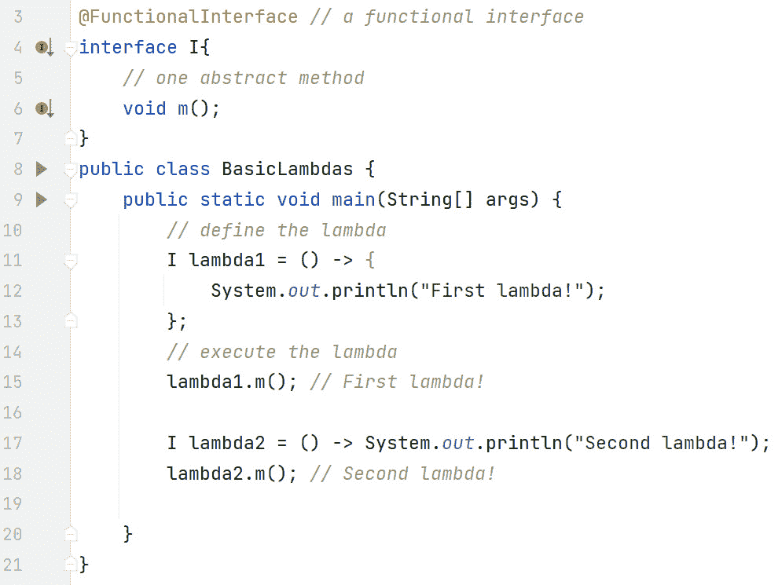

图 14.1 – 带有 lambda 表达式的功能接口

在这个图中，我们定义了一个功能接口`SomeFunctionalInterface`。

```java
interface SomeFunctionalInterface {    void m();
}
```

它有一个名为`m()`的`abstract`方法。按照代码编写，这个功能接口`SomeFunctionalInterface`现在可以用于 lambda 表达式。

第 11-13 行定义了第一个 lambda 表达式，即`lambda1`：

```java
SomeFunctionalInterface lambda1 = () -> {   System.out.println("First lambda!");
};
```

引用类型是`SomeFunctionalInterface`类型，我们的功能接口类型。`lambda1`引用被分配（以引用）实现`SomeFunctionalInterface`的类的实例。

在赋值的右侧是圆括号`()`。这些是为接口中的`m()`方法，即`SomeFunctionalInterface`。在接口的方法声明中没有定义任何参数，因此没有传递任何参数。由于没有参数，所以需要`()`。请注意，没有必要提到方法名——这是因为，由于`SomeFunctionalInterface`是一个功能接口，编译器知道唯一的`abstract`方法是`m()`。而且由于`m()`没有定义参数，lambda 头只是`()`。

箭头符号 `->` 将方法头（如果有参数传入）与方法体分开。在这个例子中，方法体是一段代码块；换句话说，就像在普通方法中一样，有花括号 `{}`。一旦指定了一个代码块，就遵循通常的代码块规则——这意味着编译器会退后一步，不会为你做任何事情。例如，如果你想从代码块中返回某个值，你必须自己这样做。在下一个例子中，我们将看到，如果你不使用代码块，编译器会为你执行 `return`。

这个例子中的 lambda 只是将 `"First lambda!"` 输出到屏幕上。第 13 行的分号是正常的语句结束标记。第 11-13 行只是 *定义* lambda。到目前为止还没有执行任何代码。

第 15 行，`lambda1.m()` 执行了由 `lambda1` 指向的 lambda 表达式，导致屏幕上输出 `"First lambda!"`。

第 17 行定义了一个类似的 lambda，但它更加简洁：

```java
SomeFunctionalInterface lambda2 = () ->    System.out.println("Second lambda!");
```

这个 lambda，`lambda2`，利用了编译器可以为我们做更多工作的特点。如果你只有一个要执行的语句，那么，就像循环等其他结构一样，不需要花括号 `{}`。因为我们只执行 `System.out.println()`，所以我们不需要花括号。第 17 行末尾的分号实际上是赋值语句的结束，而不是 `System.out.println()` 的结束。换句话说，第 17 行末尾的分号与第 13 行末尾的分号相同（而不是第 12 行末尾的分号）。

再次，第 17 行只定义了 lambda，没有执行任何代码。第 18 行，`lambda2.m()` 执行了 lambda，导致屏幕上输出 `"Second lambda!"`。

注意，`@FunctionalInterface` 注解（*图 14*.1 中的第 3 行）。这个注解确保接口只定义了一个 `abstract` 方法。尽管这个注解是可选的，但使用它是良好的实践，因为它向其他开发者表明了我们使用这个接口的意图。此外，使用这个注解允许编译器在我们未能提供确切的一个 `abstract` 方法时介入。

让我们看看另一个例子。这次，功能方法将接受一个参数并返回一个值。

### Lambda 表达式——示例 2

*图 14*.2 展示了一个示例，这将使我们能够进一步讨论细微差别：

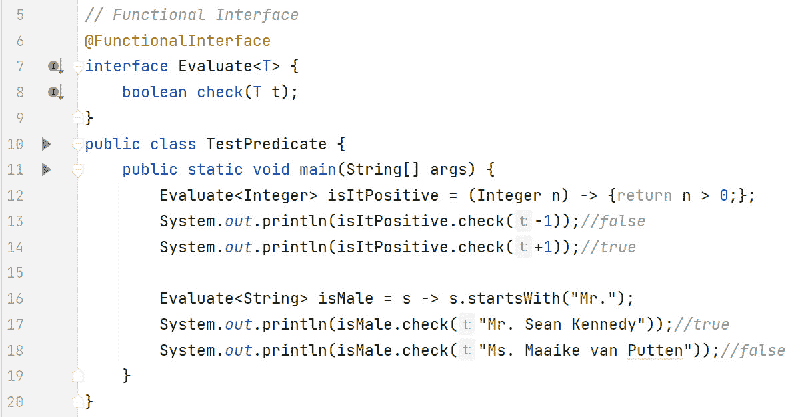

图 14.2 - 带有 lambda 表达式的更复杂功能接口

在这个图中，`Evaluate`函数接口泛型类型为`<T>`。这意味着我们可以为各种类型使用它，例如`Integer`（第 12 行）和`String`（第 16 行）。`check`功能方法（第 8 行）接受一个类型为`T`的参数，即`t`，并返回一个`boolean`值。这个特定的功能接口与我们稍后将在 Java API 中看到的非常相似，即`Predicate`。相比之下，第一个 lambda（第 12 行）的编码与第二个 lambda（第 16 行）的编码相当不同。

在第 12 行，我们声明了一个`Evaluate`引用，即`isItPositive`，它仅用于整数。使用 lambda 表达式时，上下文至关重要。由于我们将`isItPositive`的类型指定为`Integer`，这意味着括号中的标识符`n`是`Integer`类型！我们在本例中明确指定了`n`的类型，但这是不必要的，因为编译器可以从上下文中推断出来。换句话说，我们本可以使用`(n)`或简单地使用`n`在 lambda 表达式中，它也会正常工作。我们只是将其留为`(Integer n)`，以便 lambda 表达式（第 12 行）和`check(T t)`功能方法（第 8 行）之间的关系更清晰。

第 12 行的`=`右侧我们有`(Integer n) -> {return n>0;}`。这是实现`Evaluate`类的`check(T t)`方法的代码。因此，需要一个参数，由于`Evaluate<`*Integer*`>`声明，参数类型为`Integer`，并且必须返回一个`boolean`类型的值。

我们再次使用`->`符号来区分方法头和方法体。

在第 12 行，与所有 lambda 表达式一样，`->`符号的右侧是方法体。在这种情况下，我们有`{return n>0;}`。由于我们使用了花括号，我们必须在代码块内部遵循常规语法规则。鉴于`check(T t)`方法返回类型为`boolean`，我们必须从代码块中返回一个`boolean`值。此外，`return`语句需要像往常一样有一个分号作为结束符。整个赋值语句也需要一个分号作为结束符。这就是为什么在行尾附近有两个分号（第 12 行）。在这个 lambda 表达式中，我们说的是，如果传入的`Integer`类型大于 0，我们返回`true`；否则，返回`false`。

第 13 行，`isItPositive.check(-1)` 执行了 lambda 表达式，传入`-1`，返回`false`。第 14 行，`isItPositive.check(+1)` 同样执行了 lambda 表达式，这次传入`+1`，返回`true`。

第 16 行是：`Evaluate<String> isMale = s -> s.startsWith("Mr.");`。这定义了一个 `Evaluate` lambda，类型为 `String`，通过 `isMale` 引用。因为我们为 `String` 类型的 lambda 编写了代码，所以这次传入的参数 `s` 是 `String` 类型。记住，我们在第 16 行定义的是 `check(T t)` 方法的代码。注意，这次我们没有指定 `s` 的类型，因为编译器可以从上下文中推断出来（`Evaluate<String>`）。另外，由于只有一个参数且我们没有指定类型，我们可以省略圆括号，`()`。然而，正如我们已经看到的，如果你没有任何参数，你必须指定 `()`。

此外，在第 16 行，请注意，由于我们没有使用代码块，我们不需要显式的 `return` 语句，因为编译器会为我们完成这个工作。由于 `s` 是 `String` 类型，我们可以调用 `String` 方法；这就是为什么我们可以没有问题地调用 `startsWith("Mr.")`。行尾的分号是用于整个赋值语句的，而不是用于 lambda（因为不需要）。在这个 lambda 中，我们只是评估传入的字符串是否以“Mr.”开头，如果是，则返回 `true`；否则，返回 `false`。

现在 lambda 已经定义，我们可以执行它。第 17 行，`isMale.check("Mr. Sean Kennedy")` 返回 `true`，第 18 行，`isMale.check("Ms. Maaike van Putten")` 返回 `false`。

正如你所见，编译器推断了很多，这为我们节省了很多打字。适应 lambda 需要一段时间，但一旦适应了，你就会爱上它们。*表 14.1* 总结了语法：

| **功能接口** | **示例 Lambda 表达式** |
| --- | --- |
| `interface FI{``void m();``}` | `FI fi1 = () ->` `System.out.println("lambda");``fi1.m(); //` `outputs "lambda"``FI fi2 = () -> { System.out.println("lambda"); } ;``fi2.m(); //` `outputs "lambda"` |
| `interface FI{``int` `m(int x);``}` | `FI fi3 = (int x) -> { return x *` `x;};``System.out.println(fi3.m(5)); //` `25``FI fi4 = x -> x *` `x;``System.out.println(fi4.m(6)); //` `36` |
| `interface FI{``String m(String a,` `String b);``}` | `FI fi5 = (s1, s2) -> s1 +` `s2;``// 下一行返回 '``Sean Kennedy'``System.out.println(fi5.m("Sean", "` `Kennedy"));``FI fi6 = (String s1 , String s2) -> {return s1 +` `s2; };``// 下一行返回 '``Sean Kennedy'``System.out.println(fi6.m("Sean", "` `Kennedy"));` |

表 14.1 – 功能接口及其相关 lambda 表达式的示例

较长的语法，包括参数类型、代码块和 `return` 语句，在语法上与常规方法类似（除了方法名被省略）。较短的、更简洁的语法展示了编译器可以从周围上下文中推断出多少。这是可能的，因为函数式接口中只有一个 `abstract` 方法。Lambda 不能也不适用于具有多个 `abstract` 方法的接口。由于接口可以相互继承，所以要小心继承一个 `abstract` 方法然后尝试定义自己的——这对 Lambda 是不起作用的。

现在我们已经了解了函数式接口以及如何使用 Lambda 表达式实现它们，让我们来探讨为什么局部变量必须是 `final` 或“实际上最终”。

## final 或实际上最终

回想一下，通过声明一个变量 `final`，你正在将其声明为一个常量，这意味着变量的值一旦赋值后就不能更改。“实际上最终”意味着尽管在变量声明中没有使用 `final` 关键字，但编译器通过确保如果你尝试更改其值，你会得到编译器错误来使其成为“实际上最终”。请注意，这个 `final` 或“实际上最终”的规则仅适用于局部变量，不适用于实例或类变量。

*图 14**.3* 展示了使用 `final` 或“实际上最终”的代码示例。我们首先解释代码，然后解释为什么局部变量是“实际上最终”的。

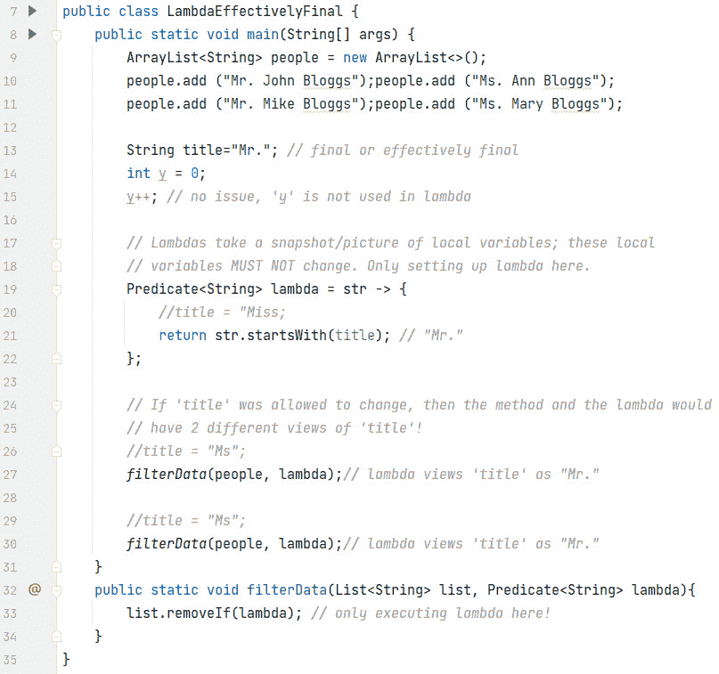

图 14.3 – “final”或“实际上最终”代码示例

在这个图中，算法从列表中删除了以 `"Mr."` 开头的任何名称。第 9-11 行声明并填充了一个 `ArrayList` 列表。

第 13 行声明了一个名为 `title` 的局部 `String` 变量。这个变量在 Lambda（第 21 行）中使用，因此，由于它没有明确声明为 `final`，它是“实际上最终”的。

第 14-15 行声明并更改了一个局部 `int` 变量 `y`。由于 `y` 在 Lambda 表达式中没有使用，这是可以的。

第 19-22 行展示了 Lambda 表达式：

```java
Predicate<String> lambda = str -> {     return str.startsWith(title);
};
```

Lambda 是一个 `Predicate`，其类型为 `String`。`Predicate` 是一个 API 函数式接口，我们将在下一节中详细讨论。`Predicate` 的函数式方法是 `boolean test(T t)`。由于我们已经将 `Predicate` 类型化为 `String`，因此 `T` 以及随之而来的 `str` 都是 `String` 类型。Lambda 返回 `true` 或 `false`，这取决于 `str` 是否以 `"Mr."` 开头，从而匹配 `test` 函数式方法的返回类型。这是一个重要的点——Lambda 已经捕捉了局部变量 `title` 中的值；即 `"Mr."`。

第 27 行和第 30 行都调用了 `filterData(people, lambda)`。这是 Lambda 的一个真正优点——它们可以被传递！但记住，Lambda 中的 `title` 值是 `"Mr."`。

第 32-34 行显示了 `filterData()` 方法：

```java
public static void filterData(List<String> list,                              Predicate<String> lambda) {
     list.removeIf(lambda);
};
```

lambda 被传递到从 `Collection` 继承的 `default` 方法 `removeIf(Predicate)`。`Collection` 是 `List` 的父接口。`removeIf(Predicate)` 从列表中删除所有满足传入的谓词（lambda）的元素。在这个例子中，任何以 `"Mr."` 开头的名字都被删除。

现在，您可以看到为什么 `title`（第 13 行）的值绝对不能改变——lambda 使用了 `"Mr."`（第 21 行）。如果我们允许在 lambda（第 20 行）或方法（第 26 行或第 29 行）中更改 `title`，那么方法中的 `title` 值和 lambda 中的 `title` 值就不会匹配！这种情况绝对不能发生。因此，无论是方法还是 lambda 中的 `title` 任何更改都是被禁止的。这就是为什么第 20 行、第 26 行和第 29 行都被注释出来的原因。取消注释任何一行都会导致编译器错误。

# 探索 API 中的函数式接口

现在，让我们检查 API 中定义的一些流行的函数式接口。有趣的是，来自*第十三章*的两个排序接口 `Comparator` 和 `Comparable` 都是函数式接口。`Comparable` 定义了一个 `abstract` 方法，即 `int compareTo(T o)`，而 `Comparator` 定义了两个 `abstract` 方法，即 `int compare(T o1, T o2)` 和 `boolean equals(Object o)`。然而，请记住，从 `Object` 继承的方法在您决定一个接口是否是函数式接口时不计算在内。由于 `boolean equals(Object o)` 是从 `Object` 继承的，这意味着 `Comparator` 是一个函数式接口。

在本节中，我们将集中讨论在 `java.util.function` 包中定义的函数式接口([`docs.oracle.com/en/java/javase/21/docs/api/java.base/java/util/function/package-summary.html`](https://docs.oracle.com/en/java/javase/21/docs/api/java.base/java/util/function/package-summary.html))。此包包含大量通用函数式接口，这些接口由 JDK 使用，也对我们可用。*表 14.2* 展示了最常用的几个。请参考 API 获取更多详细信息。我们将很快检查这些函数式接口及其 lambda 表达式：

| **函数式接口** | **函数式方法** | **描述** |
| --- | --- | --- |
| `Predicate<T>` | `boolean test(T t)` | 适用于测试 |
| `BiPredicate<T, U>` | `boolean test(T t, U u)` | 这是 `Predicate` 的双参数特殊化 |
| `Supplier<T>` | `T get()` | 适用于您想要值而不提供输入时 |
| `Consumer<T>` | `void accept(T t)` | 适用于您传入输入但不关心返回值时 |
| `BiConsumer<T, U>` | `void accept(T t, U u)` | 这是 `Consumer` 的双参数特殊化 |
| `Function<T, R>` | `R apply(T t)` | 将输入转换为输出（类型可以不同） |
| `BiFunction<T, U, R>` | `R apply(T t, U u)` | 这是 `Function` 的双参数特殊化 |
| `UnaryOperator<T>` | `T apply(T t)` | 与 `Function` 相同，但类型相同 |
| `BinaryOperator<T>` | `T apply(T t, T t2)` | 与 `BiFunction` 相同，但类型都是相同的 |

表 14.2 – API 中流行的函数式接口

现在，让我们检查前面提到的每个函数式接口及其相关的代码中的 lambda 表达式。让我们从 `Predicate` 和 `BiPredicate` 开始。

## 谓词和双谓词

谓词是一个布尔值函数（一个将返回 `boolean` 的函数）。*图 14.4* 展示了 `Predicate` 和 `BiPredicate`：

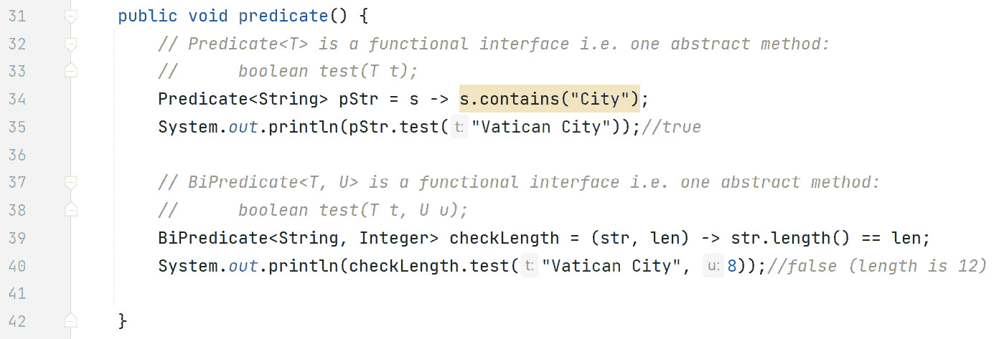

图 14.4 – 代码中的谓词和双谓词

在这个图中，我们首先想讨论 API 中函数式接口的泛型类型与其函数式方法之间的关系。理解这种关系对于理解示例和创建编译器使用的上下文至关重要。当我们讨论方法引用时，这个上下文将非常重要。

如第 32-33 行的注释所示，泛型类型与函数式方法使用的参数和返回类型之间存在直接关系。在这种情况下，`Predicate` 的泛型类型为 `T`（第 32 行），函数式方法的输入参数也针对 `T` 类型化（第 33 行）。因此，如果我们为 `Predicate` 类型化为 `Integer`，那么函数式方法中的参数将是 `Integer`。我们不能传递 `Cat`、`Dog`、`String` 或任何其他类型作为参数。现在，让我们看看例子。

第 34 行定义了一个 `Predicate`，泛型类型为 `String`，即 `isCityInName`。`cityName -> cityName.contains("City")` 是 `boolean test(T t)` 函数式方法的代码。由于泛型类型是 `String`，`T` 在这个函数式方法中现在是 `String`，这意味着参数类型是 `String`。因此，第 34 行的 `cityName` 变量代表一个 `String` 变量。这就是为什么编译器在 lambda 表达式中对 `cityName.contains("City")` 没有问题。由于 `cityName.contains("City")` 是一个简单的表达式，我们不需要 `{}` 或 `return` 语句——编译器会为我们填写所有这些。请注意，我们使用的表达式必须返回一个 `boolean` 值，因为 `boolean test(T t)` 函数式方法返回 `boolean`。`String` 方法 `boolean contains(CharSequnce)` 正好做到这一点，所以我们没问题。因此，在我们的 lambda 表达式定义之后，让我们执行它。

第 35 行执行了第 34 行定义的`isCityInName` lambda。请注意，使用`isCityInName`引用调用的方法是`boolean test(T t)`函数式方法。由于我们将`isCityInName`泛型化为`String`，我们传入的参数必须是`String`类型的参数。这正是我们所做的，传入`"Vatican City"`。这意味着我们的 lambda（第 34 行）中的`cityName`参数变为`"Vatican City"`，因此`boolean test(T t)`方法中的代码变为`"Vatican City".contains("City")`。因此，第 35 行输出`true`。

第 39 行定义了一个泛型为`String, Integer`的`BiPredicate`，即`checkStringLength`。同样，注释（第 37-38 行）展示了函数式接口的泛型类型与函数式方法参数之间的紧密关系。`BiPredicate`只是`Predicate`的扩展，除了函数式方法现在有两个（输入）参数，而不是一个。函数式方法名称仍然是`test`，返回类型仍然是`boolean`。

由于`checkStringLength`被定义为`BiPredicate<String, Integer>`，函数式方法的签名现在是`boolean test(String str, Integer len)`。然后 lambda 检查作为第一个参数传入的字符串的长度是否等于作为第二个参数传入的数字。

在第 40 行，我们测试`BiPredicate`，按照顺序传入`"Vatican City"`和`8`。由于`"Vatican City"`字符串的长度是`12`（而不是`8`），lambda 返回`false`。

如前所述，`Predicate`和`BiPredicate`都对`T`进行了泛型化。这意味着它们的函数式方法消耗一个类型`T`，例如`String`、`Integer`等。这与消耗原始类型的谓词形成对比。以下表格，*表 14.3*，展示了 API 中为希望消耗原始类型的谓词定义的函数式接口：

| **功能接口** | **功能方法** | **示例** |
| --- | --- | --- |
| `DoublePredicate` | `boolean test(double value)` | `DoublePredicate p1 = d -> d > 0;` |
| `IntPredicate` | `boolean test(int value)` | `IntPredicate p2 = i -> i > 0;` |
| `LongPredicate` | `boolean test(long value)` | `LongPredicate p3 = lg -> lg > 0;` |

表 14.3 – API 中 Predicate 的原始测试特殊化

从表中可以看出，函数式接口的名称中没有泛型类型，例如`<T>`。函数式方法具有原始参数（而不是泛型类型）。由于我们处理的是原始类型，lambda 不能在参数上调用方法（因为原始类型只是简单类型，没有方法）。

现在，让我们讨论`Supplier`函数式接口。

## Supplier

*图 14.5* 展示了演示`Supplier`的代码：

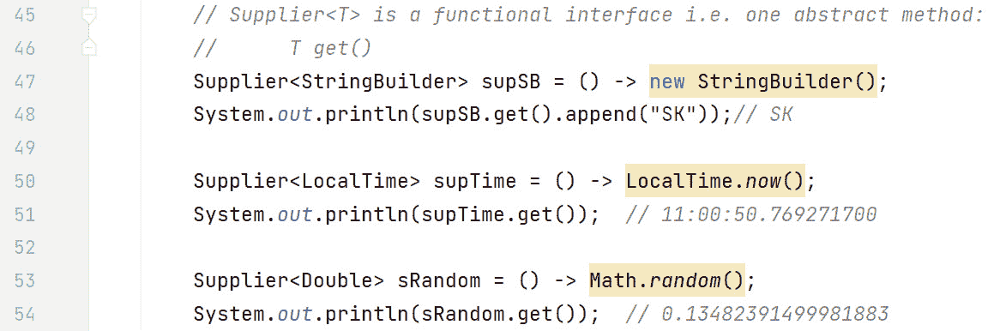

图 14.5 – 代码中的 Supplier

当你想要一个新对象时，`Supplier`函数式接口非常有用。泛型类型决定了提供的结果。换句话说，第 47 行将`supSB`类型化为`StringBuilder`，其中函数式方法`get()`返回`StringBuilder`。第 47 行还演示了如果没有参数，你必须指定圆括号`()`。

第 48 行执行了第 47 行定义的 lambda 表达式。请注意，我们将`append("SK")`链接到`get()`方法的返回值。这只有在`get()`方法返回`StringBuilder`对象时才能工作，它确实是这样。

第 50 行定义了一个针对`LocalTime`的`Supplier`函数式接口，称为`supTime`。lambda 表达式返回本地时间。第 51 行通过调用`Supplier`的函数式方法`T get()`来执行它。一个示例运行的输出包含在右侧的注释中。

第 53 行定义了一个针对`Double`的`Supplier`函数式接口，称为`sRandom`，它返回一个随机数。`Math.random()`返回一个大于或等于 0.0 且小于 1.0 的`double`值。第 54 行通过右侧的注释中的示例输出来执行它。

泛型类型的`Supplier`函数式接口也有针对原始类型的变体。*表 14.4*展示了这些：

| **函数式接口** | **函数式方法** | **示例** |
| --- | --- | --- |
| `BooleanSupplier` | `boolean getAsBoolean()` | `BooleanSupplier bS = () ->` `LocalDate.now().isLeapYear();` |
| `System.out.println(bS.getAsBoolean());` |
| `DoubleSupplier` | `double getAsDouble()` | `DoubleSupplier dS = () ->` `Math.random();` |
| `System.out.println(dS.getAsDouble());` |
| `IntSupplier` | `int getAsInt()` | `IntSupplier iS = () -> (``int)(Math.random()*20);` |
| `System.out.println(iS.getAsInt());` |
| `LongSupplier` | `long getAsLong()` | `LongSupplier lgS = () -> (``long)(Math.random()*100);` |
| `System.out.println(lgS.getAsLong());` |

表 14.4 – API 中供应商的原始生成专业化

在这个表中，函数式接口的名称标识了生成的原始类型。例如，`BooleanSupplier`生成一个`boolean`原始类型。相应的函数式方法也遵循类似模式；例如，`BooleanSupplier`有一个`boolean getAsBoolean()`方法。其他函数式接口也遵循类似的模式。

现在，让我们讨论`Consumer`和`BiConsumer`函数式接口。

## Consumer 和 BiConsumer

我们将从`Consumer`开始，根据 API，“*它表示一个接受单个输入但不返回结果的运算操作。*”图 14.6*展示了使用`Consumer`的代码示例：

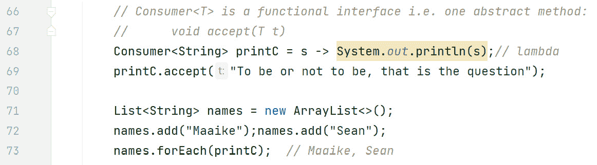

图 14.6 – 代码中的 Consumer

在这个图中，第 67 行（注释）说明了`void accept(T t)`这个功能方法确实按照 API 的要求执行：接受一个输入并返回空（`void`）。消费者对于输出集合非常有用。在这个例子中，`Consumer`（第 68 行）接受一个`String`类型的`s`，并将其回显到标准输出（屏幕）。我们执行 lambda（第 69 行），传入我们想要显示的字符串。因此，`"To be or not to be, that is the question"`这个字符串是`void accept(T t)`这个功能方法的参数。在这里，`s`参数（第 68 行）接受字符串值，然后输出。

Iterable 接口

`Iterable`接口被许多其他流行的接口继承，如`List`和`Set`，因此由大量类实现。在 Java 8 之前，接口只有`abstract`方法——没有`default`、`static`或`private`方法（它们都是在后来的 Java 版本中引入的）。这意味着如果你更改接口（方法签名或添加新方法），现有的代码库就会崩溃。引入`default`方法的主要原因之一是 Java 设计者希望在不会破坏现有代码库的情况下，将`default`方法`forEach(Consumer<? super T> action)`引入`Iterable`。默认实现是在集合中的每个元素上执行`Consumer` lambda。

现在，让我们看看 Java API 是如何使用消费者的。第 71 行声明了一个字符串`ArrayList`，名为`names`。第 72 行将`"Maaike"`和`"Sean"`添加到列表中。

第 73 行非常有趣。我们在列表上执行`forEach()`方法，传入在第 68 行创建的消费者 lambda，`printC`。`forEach()`方法遍历列表中的每个`String`，并对每个`String`调用`Consumer` lambda，`printC`。实际上，在后台发生以下操作：

```java
printC.accept("Maaike");printC.accept("Sean");
```

现在，让我们看看`BiConsumer`接口在实际中的应用示例。*图 14**.7*展示了这样一个例子：

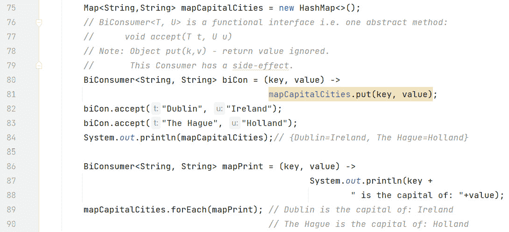

图 14.7 – 代码中的 BiConsumer

在这个图中，第 75 行，我们声明了一个`Map<String, String>`，名为`mapCapitalCities`，由`HashMap`实现。地图中的键和值都是字符串。`BiConsumer` `biCon`在第 80-81 行声明。功能方法`void accept(T t, U u)`需要两个参数——我们称它们为`key`和`value`。由于上下文（`biCon`的声明），两者都是字符串。第 81 行的 lambda 只是将`key`和`value`插入到地图中。这被称为“副作用”（见说明）。第 82-83 行使用 lambda 填充地图，第 84 行输出地图。

副作用

在 Java 中，lambda 表达式被认为是函数式编程风格。虽然函数式编程超出了本书的范围，但遵循函数式编程风格的函数不应产生副作用。副作用是对程序状态的改变，这种改变没有反映在函数的输出中。`Consumer` 与 Java 中大多数其他函数式接口不同，预期通过副作用来操作（因为函数式方法的返回类型是 `void`）。有关更多详细信息，请参阅：[`en.wikipedia.org/wiki/Functional_programming`](https://en.wikipedia.org/wiki/Functional_programming)

对于 `Map` 有没有 `forEach()` 方法？幸运的是，有。这是一个在 `Map` 接口中定义的 `default` 方法，其签名是 `default void forEach(BiConsumer<? super K, ? super V) action)`。第 86-88 行设置了 lambda 表达式以输出装饰后的字符串，指出 `key` 是 `value` 的首都（取决于键/值对）。第 89 行执行 `forEach()`，传入我们的 `BiConsumer`。`forEach()` 方法遍历映射中的每个条目，并对每个条目调用 `BiConsumer` lambda，`mapPrint`。实际上，在后台发生以下操作：

```java
mapPrint.accept("Dublin", "Ireland");mapPrint.accept("The Hague", "Holland");
```

泛型类型的 `Consumer` 函数式接口也有针对原始类型的变体。*表 14.5* 展示了这些：

| **函数式接口** | **函数式方法** | **示例** |
| --- | --- | --- |
| `DoubleConsumer` | `void` `accept(double value)` | `DoubleConsumer dc = d ->` `System.out.println(d);` |
| `dc.accept(2.4);` |
| `IntConsumer` | `void` `accept(int value)` | `IntConsumer ic = i ->` `System.out.println(i);` |
| `ic.accept(2);` |
| `LongConsumer` | `void` `accept(long value)` | `LongConsumer lc = lg ->` `System.out.println(lg);` |
| `lc.accept(8L);` |

表 14.5 – API 中 Consumer 的原始接受特殊化

再次强调，原始名称嵌入到了函数式接口名称中。请注意，每次传递给 `accept()` 函数式方法的参数类型都是原始类型

现在，让我们讨论 `Function` 和 `BiFunction` 函数式接口。

## Function 和 BiFunction

一个函数接受一个参数并产生一个结果。*图 14**.8* 展示了一些代码，演示了如何使用 `Function` 和 `BiFunction`：

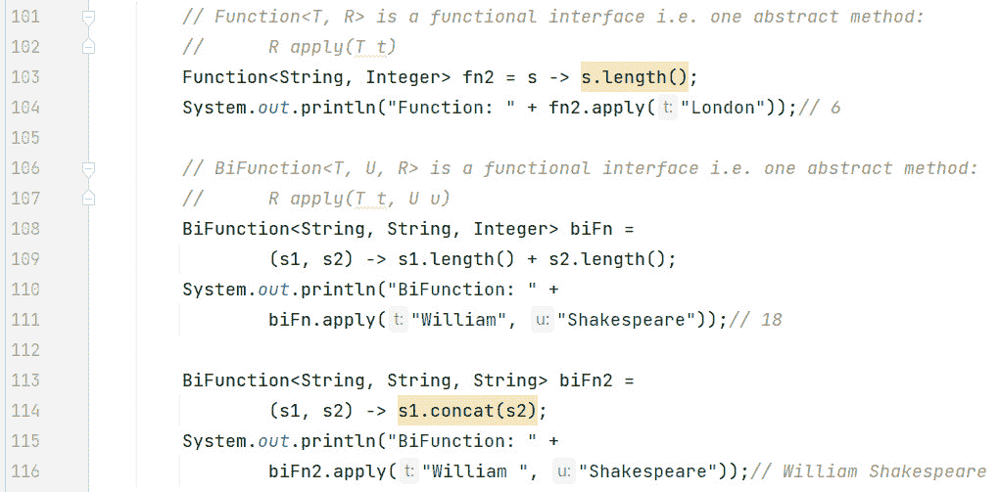

图 14.8 – 代码中的 Function 和 BiFunction

在这个图中，第 101-102 行的注释显示了 `Function` 函数式接口及其函数方法在 API 中的出现。`Function` 是泛型类型的，第一个类型 `T` 代表输入类型，第二个类型 `R` 代表输出类型。这意味着，当我们在第 103 行声明 `Function<String, Integer>` 时，函数方法是 `Integer apply(String s)`。这反映在第 103 行的 Lambda 表达式中，我们接受一个字符串 `s` 并返回其长度。请注意，字符串的 `length()` 方法返回一个 `int` 类型的值，但 Java 会自动装箱为我们返回一个 `Integer` 类型的值。

第 104 行执行了 Lambda 表达式，传入 `"London"`，返回 `6`。

`BiFunction` 函数式接口表示一个接受两个参数并产生结果的函数。第 106-107 行的注释显示了其在 API 中的签名，即 `BiFunction<T, U, R>`，以及其函数方法的签名，即 `R apply(T t, U u)`。因此，前两种类型是输入类型，最后一种类型是输出类型。

第 108-109 行定义了一个 `BiFunction` 接口，其中我们接受两个 `String` 类型的参数并返回一个 `Integer` 类型的结果。实现它的 Lambda 表达式接受两个 `String` 参数，即 `s1` 和 `s2`，并返回它们长度的总和。

第 111 行调用 Lambda 表达式，传入 `"William"` 和 `"Shakespeare"` 字符串。它们的长度分别是 `7` 和 `11`，Lambda 表达式返回 `18`。

第 113-114 行定义了一个 `BiFunction` 接口，其中我们再次接受两个 `String` 类型的参数，但这次返回一个 `String` 类型的结果。Lambda 表达式（第 114 行）简单地将第二个 `String` 连接到第一个 `String` 上并返回结果。第 116 行执行了 Lambda 表达式，同时传入相同的两个字符串，`"William"` 和 `"Shakespeare"`。这次，结果是两个字符串的连接，即 `"William Shakespeare"`。

泛型类型的 `Function` 函数式接口也有针对原始类型的变体。*表 14.6* 展示了其中的一部分：

| **函数式接口** | **函数方法** | **示例** |
| --- | --- | --- |
| `DoubleFunction<R>` | `R` `apply(double value)` | `DoubleFunction<String> df = (double dbl) -> "" + Math.pow(dbl, 2);` |
| `df.apply(2.0); // "4.0"` |
| `DoubleToIntFunction` | `int` `applyAsInt(double value)` | `DoubleToIntFunction dtoif = dbl -> (int)Math.round(dbl);` |
| `dtoif.applyAsInt(4.2);// 4` |
| `DoubleToLongFunction` | `long` `applyAsLong(double value)` | `DoubleToLongFunction dtolf = (dbl) -> Math.round(dbl);` |
| `dtolf.applyAsLong(4.0);// 4` |

表 14.6 – API 中 Function 的双精度（原始类型）特殊化

API 中比 *表 14.6* 展示的函数式接口要多得多。请参阅 API 获取更多详细信息。它们可能令人望而生畏，但请记住，函数式接口名称及其关联的函数方法名称中存在一种模式。这有助于理解它们的功能。

例如，在 *表 14.6* 中，`double` 原始类型由 `DoubleFunction<R>`、`DoubleToIntFunction` 和 `DoubleToLongFunction` 提供。对于 `int` 和 `long` 也有相应的函数式接口。

`int` 函数式接口是 `IntFunction<R>`、`IntToDoubleFunction` 和 `IntToLongFunction`。这些与 `int` 相关的函数式接口与它们的 `double` 对应者（如 *表 14.6* 中概述的）做相同的事情，除了输入是 `int` 而不是 `double`。相关的函数方法名称将取决于结果类型。例如，`IntToDoubleFunction` 的函数方法将是 `double applyAsDouble(int value)`。

对于 `long` 原始类型也是同样的情况。`long` 函数式接口是 `LongFunction<R>`、`LongToDoubleFunction` 和 `LongToIntFunction`。它们的函数方法名称遵循与 `int` 和 `double` 相同的模式。

让我们通过检查 `UnaryOperator` 和 `BinaryOperator` 来完成对函数式接口的讨论。

## UnaryOperator 和 BinaryOperator

这两个函数式接口都是其他接口的特殊化。我们先来讨论 `UnaryOperator`。

### UnaryOperator

在 API 中，`Function` 函数式接口定义为 `Function<T, R>`。`T` 代表函数的输入，`R` 代表函数的输出。字母不同是很重要的。这意味着，虽然类型当然可以是相同的，但它们也可以，并且通常是不同的。

`UnaryOperator` 是 `Function` 的一个特殊化，其中输入和输出类型都是相同的。在 API 中，`UnaryOperator` 定义为 `UnaryOperator<T> extends Function<T, T>`，其函数式方法是 `T apply(T t)`。

*图 14.9* 展示了一个代码示例：

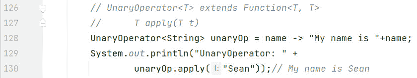

图 14.9 – 代码中的 UnaryOperator

在这个图中，第 128 行定义了一个针对 `String` 类型的 `UnaryOperator`。这意味着输入和输出现在都是字符串。`name` 标识符是一个 `String`，我们只是在 `name` 前面添加 `"My name is "`。

第 130 行通过传入 `"Sean"` 来执行 lambda 表达式。返回的 `String` 类型的 `"My name is Sean"` 输出到屏幕上。

现在，让我们来检查 `BinaryOperator`。

### BinaryOperator

`BinaryOperator` 函数式接口相当于 `BiFunction` 相当于 `Function`。换句话说，`BiFunction` 允许我们指定两个输入参数和一个输出结果，所有这些都可以是不同类型。`BinaryOperator`，它扩展了 `BiFunction`，要求两个输入类型和输出类型必须相同。

在 API 中，`BinaryOperator` 定义为 `BinaryOperator<T> extends BiFunction<T, T, T>`，其函数式方法是 `T apply(T t1, T t2)`。

*图 14.10* 展示了一个代码示例：

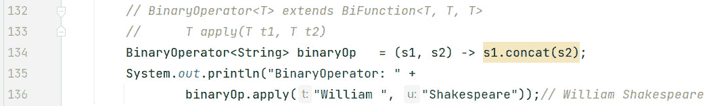

图 14.10 – 代码中的 BinaryOperator

在这个图中，第 134 行定义了一个针对`String`类型的`BinaryOperator`。这意味着输入参数和结果现在都是字符串。`s1`和`s2`标识符是字符串，我们只是将`s2`连接到`s1`上。

第 136 行通过传递`"William"`和`"Shakespeare"`来执行 lambda 表达式。返回的`String` `"William Shakespeare"`被输出到屏幕上。

# 掌握方法引用

现在，让我们继续讨论另一个关于 lambda 表达式的重要主题，那就是方法引用。尽管 lambda 表达式已经很简洁，但在某些情况下，它们甚至可以更简洁！这就是方法引用适用的地方。如果你的 lambda 表达式只是调用一个方法，那么这就是使用方法引用的机会。此外，如果一个 lambda 参数只是传递给一个方法，那么指定变量的冗余也可以被移除。

让我们来看一个例子：

```java
List<String> names = Arrays.asList("Maaike", "Sean");names.forEach(name -> System.out.println(name); // lambda
names.forEach(System.out::println); // method reference
```

在这段代码中，我们通过调用`Arrays.asList()`方法声明了一个字符串列表。第一个`forEach(Consumer)`展示了如何使用 lambda 表达式输出列表。回想一下，`Consumer`的功能方法是`void accept(T t)`。

第二个`forEach(Consumer)`展示了方法引用的语法。注意双冒号操作符`::`（或方法引用操作符），以及方法名后面没有圆括号`()`，就像`println`一样。

时刻记住代码最终必须生成。如果我们已经指定了所有代码，那么编译器就没有事情可做。然而，如果我们使用了 lambda 表达式和/或方法引用，编译器就必须介入并生成省略的代码。编译器只有在理解了*上下文*的情况下才能这样做。这对于理解省略了大量代码的方法引用至关重要。此外，具有功能方法的函数式接口对于提供上下文至关重要。

方法引用有四种不同类型：

+   绑定

+   未绑定

+   静态

+   构造函数

这些内容最好通过代码示例来解释。关于示例，为了使它们更容易理解，我们为每个示例都编写了 lambda 表达式和方法引用版本。lambda 变量使用`"L"`后缀，方法引用变量使用`"MR"`后缀。此外，在每个示例之前的注释中，都有函数式接口及其相关功能方法的签名。

现在，让我们从第一种方法引用类型：绑定方法引用开始。

## 绑定方法引用

绑定引用之所以得名，是因为引用绑定到特定对象的实例上。绑定方法引用有时被称为“特定对象的引用”。让我们用一个例子来进一步解释这一点。*图 14.11*展示了绑定方法引用的例子：

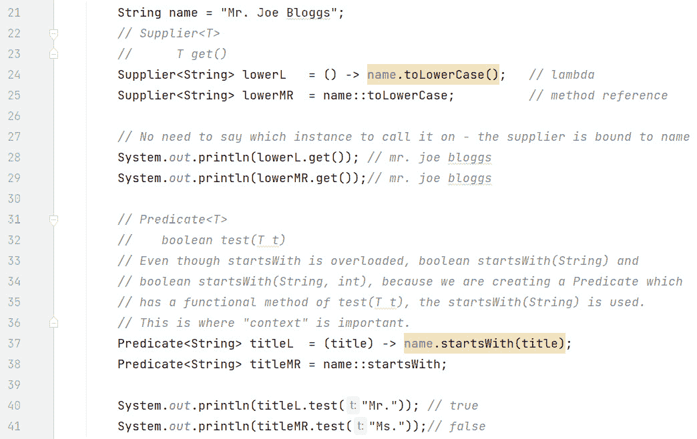

图 14.11 – 绑定方法引用示例

在这个图中，第 21 行声明了一个名为`name`的`String`变量，初始化为`"Mr. Joe Bloggs"`。第 22-23 行概述了`Supplier`功能接口及其功能方法的签名`T get()`在 API 中。第 24 行声明了一个将`name`转换为小写的`Supplier` lambda 表达式。这个 lambda 表达式与第 21 行声明的`name`变量相同。因此，这个 lambda 在编译时绑定到`name`变量。由于 lambda 只是调用一个方法，这是一个引入方法引用的机会。

给定第 24 行的 lambda 表达式，第 25 行概述了等效的方法引用。注意`name`变量的使用；方法引用操作符`::`以及方法名之后省略的圆括号`()`。此外，注意`name`是一个`String`，而`toLowerCase()`方法是`String`类中的一个方法。

第 28 行和第 29 行分别执行了 lambda 表达式和方法引用版本，两种情况下都返回了`"mr. joe bloggs"`。

*图 14**.11*中的第一个示例使用了`Supplier`功能接口，它不需要输入参数。如果我们想传递一个值呢？`Supplier`功能接口将不起作用，因为它的功能方法是`T get()`，不接受参数。然而，`Predicate`将起作用，因为它的功能方法`boolean test(T t)`接受输入参数。*图 14**.11*中的第二个示例展示了这一点。

第 37 行是 lambda 版本。由于`Predicate`被指定为`String`类型，`title`是一个`String`。再次，我们将`name`绑定并执行`String`方法`startsWith()`，传递输入参数。我们可以看到 lambda 中的冗余，因为`title`被提到了两次。结合 lambda 只是调用一个方法的事实，我们又有机会引入方法引用。

第 38 行是第 37 行 lambda 表达式的等效方法引用版本。然而，这个方法引用需要更多的解释，因为在`String`类中，`startsWith()`方法是重载的。重载版本有`boolean startsWith(String, int)`和`boolean startsWith(String)`。编译器是如何决定使用哪个版本的`startsWith()`呢？这就是上下文重要性的地方！我们正在定义一个`Predicate`，`Predicate`的功能方法是`boolean test(T t)` - 由于这个方法只接受一个参数，编译器选择了一个参数的方法`startsWith(String)`。

第 40 行执行了 lambda 版本，传递了`"Mr."`。这导致 lambda 执行`"Mr. Joe Bloggs".startsWith("Mr.")`，结果是 true。

第 41 行执行了方法引用版本，传递了`"Ms."`。由于编译器将方法引用在后台转换为 lambda 表达式，这导致 lambda 执行`"Mr. Joe Bloggs".startsWith("Ms.")`，结果是 false。

现在，我们将检查未绑定方法引用。

## 未绑定方法引用

未绑定方法引用不会绑定到变量。相反，在运行时提供要使用的实例。未绑定方法引用有时被称为“特定类型的任意对象的实例的引用”。*图 14.12*展示了代码中的示例：

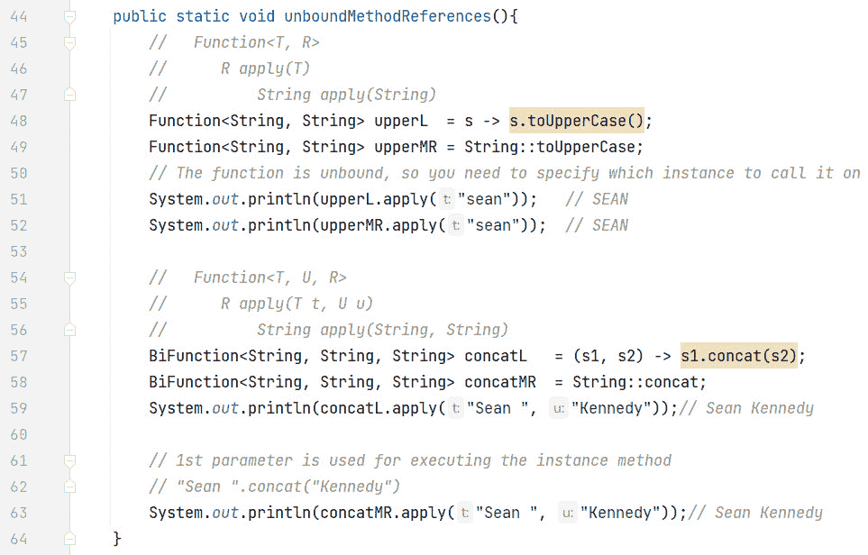

图 14.12 – 未绑定方法引用示例

在这个图中，我们在第 48 行定义了一个 lambda 表达式。这个 lambda 表达式是`Function<String, String>`类型，这意味着功能方法是`String apply(String)`。因此，`s`是一个`String`，我们可以调用`String`方法`toUpperCase()`。请注意，`s`不是方法作用域中的变量。在*图 4.11*中，我们绑定到了方法中声明的`name`变量。然而，现在`s`只有 lambda 表达式的范围。这意味着方法引用是*未绑定的*。lambda 参数`s`将在运行时（当`apply()`方法被调用时）绑定，就像第 51 行所示。

由于 lambda 表达式只有一个方法调用，并且在`->`符号的两侧都有`s`的冗余，我们可以使用方法引用。第 49 行表示第 48 行的 lambda 表达式的引用版本。注意方法引用操作符`::`的使用以及方法名`toLowerCase`后面的括号`()`的缺失。由于`toLowerCase`是`String`方法，所以在方法引用中`String`位于`::`操作符之前。第 49 行的方法引用在语义上等同于第 48 行的 lambda 表达式。

第 57 行声明了一个`BiFunction` lambda。回想一下，`BiFunction`接受两个输入并返回一个结果。在这种情况下，所有都是`String`类型。传入的参数将被连接并返回。再次强调，我们在 lambda 表达式中只有一个方法调用和变量的冗余，所以我们可以编写一个方法引用。

第 58 行表示第 57 行的 lambda 表达式的引用版本。再次强调，上下文将是确定方法引用的关键。`BiFunction<String, String, String>`和`String::concat`通知编译器这是一个未绑定方法引用，它将接受两个`String`参数并将它们连接起来。

这里隐含的另一条信息是 – 在`apply()`方法调用中提供的第一个参数是要用于`concat()`方法的实例；第二个参数是要传递给`concat()`方法作为参数。这意味着如下：

```java
concatMR.apply("Orange", " Juice");
```

这可以转换为以下内容：

```java
"Orange ".concat("Juice");
```

这可以在第 62 行和第 63 行中看到。第 63 行的方法引用执行转换为第 62 行注释中的代码。lambda 和方法的引用调用（分别在第 59 行和第 63 行）都返回`"Sean Kennedy"`。

现在，让我们来探讨静态方法引用。

## 静态方法引用

一个`static`方法引用也被认为是未绑定的，因为我们没有绑定到外部作用域的变量。被调用的方法是`static`的，因此得名。让我们通过代码来检查一个`static`方法引用。*图 14.13*展示了这样的一个示例：

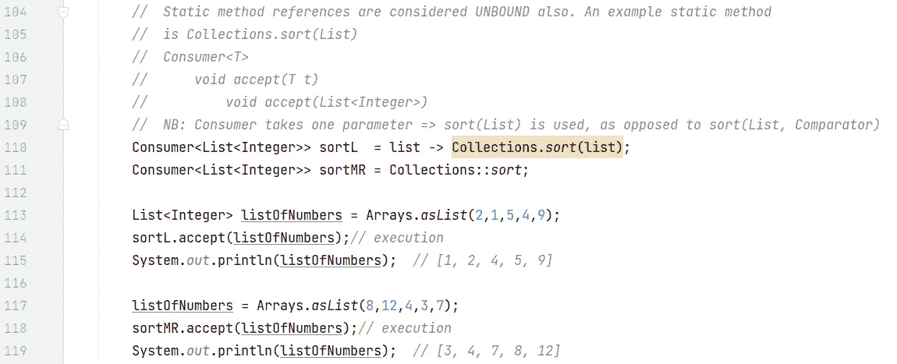

图 14.13 – 静态方法引用示例

在这个图中，我们定义了一个`Consumer` lambda（第 110 行），它接受一个`List<Integer>`列表。正如我们所知，`Consumer`接受一个参数而不返回任何内容。副作用是调用`static`的`Collections`方法`sort`，传递要排序的列表。由于我们的 lambda 只有一个方法调用，并且存在冗余（`->`标记两边的`list`），我们可以将 lambda 重写得更简洁，作为一个方法引用。

第 111 行是第 110 行编写的 lambda 表达式的引用版本。`Collections.sort()`方法被重载了——一个版本是`sort(List)`，另一个版本是`sort(List, Comparator)`。上下文决定了编译器选择哪一个。由于`Consumer` lambda 的函数式方法是`void accept(T t)`，它只接受一个参数，因此使用了一个参数的`sort()`，即`sort(List)`。

第 113 行使用`Arrays.asList()`方法生成一个`List<Integer>`。第 114 和 115 行执行并输出 lambda 版本。

第 117 行再次使用`Arrays.asList()`方法重新生成一个`List<Integer>`。第 118 和 119 行执行并输出方法引用版本。

我们最后的方法引用类型是构造方法引用。现在让我们来讨论它们。

## 构造方法引用

构造方法引用是一种特殊的方法引用类型，因为它不是调用一个（常规）方法，而是使用`new`关键字并实例化一个对象。供应商是构造方法引用的天然选择。*图 14.14*展示了代码中的示例：

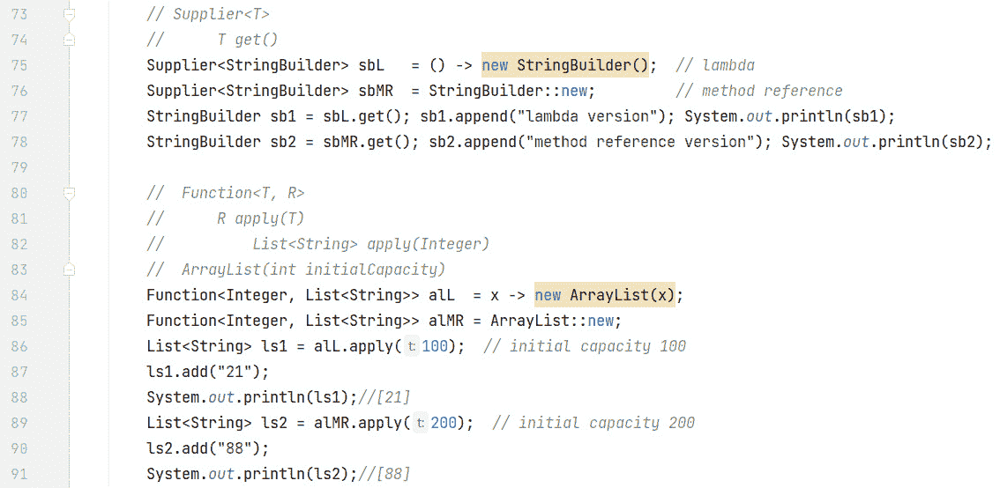

图 14.14 – 构造方法引用示例

在这个图中，第 75 行定义了一个`Supplier<StringBuilder>` lambda。`Supplier` lambda 的函数式方法是`T get()`，所以我们什么也没有传递。由于我们为`StringBuilder`输入了`sbL`，lambda 代码是`new StringBuilder()`。由于 lambda 中只有一个方法调用，我们可以编写一个方法引用版本。

第 76 行的方法引用是第 75 行定义的 lambda 表达式的构造方法引用等价物。注意在语法中`::`操作符后面的`new`关键字的使用。

第 77 和 78 行分别调用了 lambda 和方法引用。此外，创建的`StringBuilder`对象被填充并输出。

如前所述，`Supplier`是构造方法引用的完美匹配。但如果你想要传递一个参数怎么办？`Supplier`不接受参数（`T get()`）。我们需要一个接受参数并返回结果的函数式接口。`Function`在这个用例中会很合适。

*图 14.14*中的第二个例子展示了基于`Function`的构造方法引用。`ArrayList`构造函数是重载的——其中一个版本接受`int`类型，用于指定初始容量。

第 84 行定义了一个基于`Function`的 lambda，它接受`Integer`类型并返回一个`List<String>`列表。lambda 接受一个`Integer`类型的`x`，并构造一个初始容量为`x`的`ArrayList`。`x`的值将从 lambda 调用中获取（例如，第 86 行的 100）。

由于 lambda 中只有一个方法调用，并且`x`在`->`符号的两侧重复（冗余），我们可以编写一个等效的方法引用。

第 85 行是第 84 行编写的 lambda 表达式的等效方法引用。`ArrayList`被指定以表明我们想要返回哪种`List`的实现。`::new`语法是构造方法引用特有的。第 89 行显示了方法引用的执行方式——在这个例子中，传递 200 调用`apply()`方法。

这就结束了我们对四种不同类型的方法引用的讨论。然而，在我们离开方法引用之前，我们想讨论一个例子，说明在尝试理解方法引用时上下文是多么重要。

## 方法引用和上下文

这个例子将展示三个 lambda 及其对应的方法引用。*图 14.15*显示了代码示例：

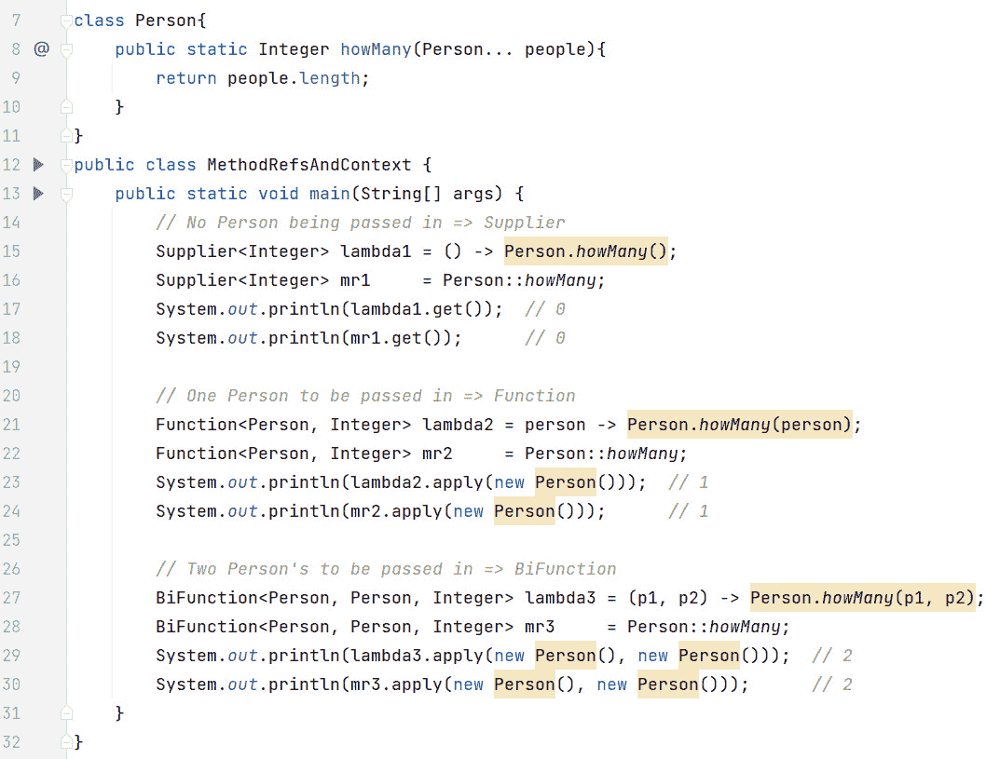

图 14.15 – 方法引用和上下文

在这个图中，第 7-11 行定义了一个名为`Person`的类。第 8 行定义了一个`static`的`howMany()`方法，它返回`Person`数组中的对象数量。回想一下，`varargs`用`…`表示，在方法内部，它被当作数组处理（因此有`length`属性）。由于`people`参数是一个`varargs`参数，我们可以用 0 个或多个参数调用`howMany()`。

第一个场景是没有任何`Person`对象调用`howMany()`并返回传递的对象计数，这将是一个 0。`Supplier`非常适合，因为我们不会向 lambda 传递任何东西，但会得到一个`Integer`结果。第 15 行是这个场景的 lambda。我们不传递任何东西，返回一个`Integer`计数，这是传递给`howMany()`的`Person`对象的数量。当然，这是`0`。

第 16 行是第 15 行 lambda 表达式的等效方法引用。我们很快就会回到这个话题进行讨论。

第二种情况是使用一个 `Person` 对象调用 `howMany()` 并返回传递的对象数量，这将会是 `1`。`Function` 适配得很好，因为我们将会向 lambda 函数传递一个 `Person` 对象并接收 `Integer` 类型的计数。第 21 行是这个场景的 lambda 表达式。我们接受一个 `Person` 对象并返回一个 `Integer`，代表传递给 `howMany()` 的 `Person` 对象数量。这是 `1`。

第 22 行是第 21 行 lambda 表达式的等价方法引用。我们很快会回到这个话题进行讨论。

第三种情况是使用两个 `Person` 对象调用 `howMany()` 并返回传递的对象数量，这将会是 `2`。`BiFunction` 适配得很好，因为我们将会向 lambda 函数传递两个 `Person` 对象并接收 `Integer` 类型的计数。第 27 行是这个场景的 lambda 表达式。我们接受两个 `Person` 对象并返回一个 `Integer`，代表传递给 `howMany()` 的 `Person` 对象数量。这是 `2`。

第 28 行是第 27 行 lambda 表达式的等价方法引用。

现在，让我们讨论方法引用（第 16、22 和 28 行）。注意它们都是相同的！再次强调，这是上下文至关重要的地方。编译器可以根据指定的功能接口和泛型类型生成相关的 lambda 表达式。以下是一个示例：

```java
Supplier<Integer> mr1 = Person::howMany;
```

首先，由于 `howMany()` 是 `Person` 类中的 `static` 方法，编译器知道 lambda 将会是 `Person.howMany()`。但是应该传递多少个对象呢？由于它是一个 `Supplier` 接口，其功能方法是 `T get()`，编译器知道不会有参数输入，因此它知道不需要向 `howMany()` 传递任何内容。至于返回值，`Supplier` 被指定为 `Integer` 类型，这与 `howMany()` 方法的返回类型相匹配。

如果我们想向 `howMany()` 函数传递一个对象，让我们检查第二个方法引用：

```java
Function<Person, Integer> mr2     = Person::howMany;
```

这里的一个区别是我们声明了一个 `Function` 而不是之前的 `Supplier`。`Function` 接受一个参数并返回一个结果。我们知道返回类型必须是 `Integer`，因为那是 `howMany()` 方法的返回类型。所以，编译器在这里所做的就是接收输入并将其传递给 `howMany()` 方法。等价的 lambda（第 21 行）显示了背后的操作。

最后，如果我们想向 `howMany()` 函数传递两个对象，会怎样呢？最后一个方法引用示例展示了如何做到这一点：

```java
BiFunction<Person, Person, Integer> mr3     =  Person::howMany;
```

编译器看到 `BiFunction` 并意识到 `BiFunction` 需要两个输入，因此它将两个输入传递给 `howMany()`。当然，这个特定的 `BiFunction` 返回类型 `Integer` 与 `howMany()` 方法的返回类型相匹配。

因此，由于有三个不同的上下文，我们有了三个等价的方法引用映射到三个不同的 lambda 表达式。方法引用可能会有些棘手。检查上下文，并在可能的情况下，将方法引用映射到其等价的 lambda 表达式。一旦转换为 lambda 形式，就更容易理解了。

这完成了我们对方法引用的讨论，并结束了第十四章。现在，让我们将所学知识付诸实践，以巩固我们学到的概念。

# 练习

1.  恐龙养护任务通常非常相似，但并不完全相同。为了使我们的代码更简洁，我们可以使用 Lambda 表达式。创建一个名为 `DinosaurHandler` 的自定义函数式接口，其中有一个名为 `handle(Dinosaur dinosaur)` 的方法。在 Lambda 表达式中实现它，该表达式将恐龙设置为睡眠或清醒（首先，如果需要，请向您的 `Dinosaur` 类添加一个属性）。

1.  Lambda 表达式与 `java.util.function` 接口结合使用非常有效。让我们使用它们来管理恐龙：

    +   编写一个检查恐龙是否为肉食性的 `Predicate<Dinosaur>` Lambda 表达式

    +   编写一个返回新恐龙的 `Supplier<Dinosaur>` Lambda 表达式

    +   编写一个打印恐龙名称的 `Consumer<Dinosaur>` Lambda 表达式

    +   编写一个返回恐龙饮食的 `Function<Dinosaur, String>` Lambda 表达式

1.  Lambda 表达式在变量使用方面有特定的规则。我们将创建一个 Lambda 表达式的示例，该表达式修改一个“有效最终”变量。添加一个跟踪恐龙数量的变量，并创建一个 Lambda 表达式来增加这个计数。

1.  方法引用可以使我们的代码更易读。请编写在您的公园环境中使用方法引用的示例：

    +   使用 `System.out::println` 打印恐龙名称。

    +   使用 `Dinosaur::getName`（假设 `Dinosaur` 类有一个 `getName()` 方法）来获取每个恐龙的名称。

    +   使用 `Collections::sort` 对恐龙名称列表进行排序。

    +   使用 `Dinosaur::new` 创建一个新的恐龙（假设 `Dinosaur` 类有一个合适的构造函数）

# 项目 - 灵活的恐龙养护系统

我们的公园正在发展，需要完成的工作也在增加。Lambda 表达式可以简化我们的代码并提高操作效率。让我们将它们集成到我们的系统中！

将 Lambda 表达式纳入您的“恐龙养护系统”，用于排序、过滤和对恐龙集合执行操作。此外，设计一个使用方法引用的通知系统，以提醒公园工作人员各种事件，增强我们公园内的沟通和响应能力。

这里是步骤。我们假设某些方法存在。您必须根据您的 `Dinosaur` 类的设计创建这些方法：

1.  定义具有 `name`、`species`、`healthStatus` 等属性的 `Dinosaur` 类。您还希望有一个 `DinosaurCareSystem` 类，其中实现了处理恐龙的主要功能。

1.  您想要按名称对 `Dinosaur` 对象进行排序。使用 `List` 接口的 `sort` 方法和一个 Lambda 表达式。以下是一个示例：`dinosaurs.sort((d1, d2) -> d1.getName().compareTo(d2.getName()))`。

1.  `List<Dinosaur> illDinosaurs = dinosaurs.stream().filter(d -> d.isIll()).collect(Collectors.toList())`。

1.  在`DinosaurCareSystem`类中，创建一个名为`sendNotification(String message)`的方法。然后在另一个方法中，例如检查恐龙健康状况时，每次发现恐龙生病，就使用方法引用调用`sendNotification`。代码可能看起来像这样：`dinosaurs.stream().filter(Dinosaur::isIll).forEach(d -> sendNotification(d.getName() + " is ill."))`.

1.  `healthboosting`程序。使用 lambda 表达式，你可以在列表上直接这样做：`dinosaurs.forEach(d -> d.increaseHealth(10))`.

# 概述

在本章中，我们了解到 lambda 表达式可以使你的代码更加简洁。我们看到了功能接口是一个只有一个`abstract`方法的面接口。lambda 表达式是实现功能接口的类，除了最基本的部分之外，其他都实现了。

术语`final`和“effectively final”指的是在 lambda 表达式中使用的局部变量。任何被 lambda 使用的非`final`局部变量都不应改变其值，无论是在方法中还是在 lambda 表达式中本身。编译器强制执行此规则，从而使局部变量“实际上”是 final 的。这是为了确保方法对局部变量值的看法与 lambda 对局部变量值的看法一致。这不适用于实例或`static`变量，或者不在 lambda 内部使用的局部变量。

我们从 API 深入研究了功能接口。我们研究了断言（测试条件），例如`Predicate<T>`和`BiPredicate<T, U>`，以及它们的原始消耗对应物，`DoublePredicate`、`IntPredicate`和`LongPredicate`。

我们还研究了`Supplier<T>`（提供某些东西）及其原始消耗的特化，分别是`BooleanSupplier`、`DoubleSupplier`、`IntSupplier`和`LongSupplier`。

我们探讨了消费者（只接收但不返回），`Consumer<T>`和`BiConsumer<T, U>`，以及它们的原始消耗特化，`DoubleConsumer`、`IntConsumer`和`LongConsumer`。

我们还研究了函数（既接收又返回），`Function<T, R>`和`BiFunction<T, U, R>`，以及它们的原始消耗对应物。

最后，我们研究了函数的变体。`UnaryOperator<T>`是`Function`的一种变体，其中输入和输出类型都是相同的。同样，`BinaryOperator<T>`是`BiFunction`的一种变体，其中两个输入类型和输出类型都是相同的。

为了使你的代码更加简洁，在某些情况下，你可以使用方法引用而不是 lambda 表达式。如果你的 lambda 只是调用一个方法，并且有关参数存在冗余，则可以编写方法引用。

方法引用有四种不同类型：绑定、未绑定、静态和构造器。绑定方法引用绑定到方法中的现有变量，该变量位于 lambda 的作用域之外。未绑定方法引用依赖于在运行时传递的实例。静态方法引用也被视为未绑定，并执行一个 `static` 方法。最后，构造器方法引用使用 `::``new` 语法创建对象。

我们还探讨了在理解方法引用时上下文的重要性。我们看到了一个例子，由于三个不同的上下文，同一个方法引用在后台生成了三个不同的 lambda 表达式。

这完成了我们对 lambda 表达式的讨论。随着我们继续学习与 Stream 相关的下一章，它们将变得非常重要。
