# 15

# 流 - 基础知识

在*第十四章*中，我们学习了 lambda 表达式。Lambda 表达式使我们能够编写更简洁的代码。然而，请注意，编译器在后台正在插入我们省略的代码。为了使其工作，编译器必须没有决策要做。这就是“函数式接口”发挥作用的地方。函数式接口是一个只有一个`abstract`方法的接口；这被称为“函数方法”。Lambda 表达式只能与函数式接口一起使用。

我们看到，如果一个局部变量在 lambda 表达式中被使用，那么这个变量必须是`final`或“实际上是 final”的。这保持了变量值（方法和 lambda）的两个视图的一致性。换句话说，方法和 lambda 在所有时间对变量的值都是相同的。

我们还检查了 API 中更流行的函数式接口，包括`Predicate`、`BiPredicate`、`Supplier`、`Consumer`、`BiConsumer`、`Function`和`BiFunction`。API 中还有许多其他函数式接口，包括针对原始数据类型（而不是对象）的变体。

接下来，我们讨论了方法引用，这可以使你的代码比 lambda 表达式更加简洁。方法引用是 lambda 表达式的简写。为了从方法引用生成 lambda 表达式，上下文是关键。上下文包括声明的函数式接口和使用的泛型类型。

我们还探讨了四种方法引用类型：绑定、非绑定、静态和构造器。绑定方法引用在编译时绑定到方法中的一个变量，而非绑定方法则依赖于在运行时传入的对象。静态方法引用是非绑定的，并调用一个`static`方法。构造器方法引用使用`::new`语法来创建对象。

我们通过讨论一个在三个不同上下文中使用相同方法引用的例子来结束本章。由于上下文的不同，每个方法引用都导致了不同的 lambda。这证明了在检查方法引用时上下文的重要性。

在本章中，我们将开始对流的介绍。这是一个庞大且重要的主题，需要两章来涵盖。Java 8 引入了 lambda 和流，以实现更函数式的编程风格。这可以导致代码更加清晰、更具表现力，因为我们不必纠结于如何做某事；我们只需表达我们想要它完成。

我们将首先讨论流管道。然后，我们将讨论流的“惰性”，接着展示创建流的方法。最后，我们将借助代码示例来检查终端操作。

本章涵盖了以下主要主题：

+   理解流管道

+   探索流的惰性

+   创建流

+   精通终端操作

# 技术要求

本章的代码可以在 GitHub 上找到，地址为[`github.com/PacktPublishing/Learn-Java-with-Projects/tree/main/ch15`](https://github.com/PacktPublishing/Learn-Java-with-Projects/tree/main/ch15)。

# 理解流管道

Java 中的*流*是一系列可以由操作处理的数据。流不是另一种组织数据的方式，例如使用数组或`Collection`，因为流不持有数据。流全部关于高效处理流动的数据。

让我们看看流管道。

## 流管道

*流管道*是一组在流上运行的运算，以产生结果。至少，流管道由一个源、零个或多个中间操作和一个终端操作组成，顺序如下。管道类似于工厂中的装配线。让我们看一个例子。

### 装配线类比

假设我们有一个任务，需要削和盖章目前放在盒子里的铅笔（盒子里有 100 支铅笔）。盖章意味着在铅笔上标记铅笔类型，例如 2B、2H 等等。铅笔必须按照顺序削尖、盖章，最后打包。声明一个流就是向主管下达指令。在这个装配线上，Java 是主管。没有人会做任何事情，直到主管喊“开始”。主管检查指令，并设置工作站和工人——一个从盒子里拿铅笔，一个削铅笔，一个盖章削好的铅笔，一个打包完成的铅笔。

从盒子里拿铅笔的工人是管道的*源*。铅笔是数据。削铅笔和盖章是*中间操作*。最后一个操作，将铅笔打包，是*终端操作*。终端操作非常重要，因为主管不会在看到终端操作之前喊“开始”。然而，一旦看到，主管会喊“开始”，然后流程就会开始。

让我们检查这个过程。

第一个工人从盒子里拿出铅笔，交给第二个工人，第二个工人将其削尖。第二个工人将削好的铅笔交给下一个工人，下一个工人盖章，然后交给装配线上的最后一个工人，他将铅笔打包。

注意，铅笔（和数据）只能单向移动——一旦工人传递了铅笔，他们就不能再取回。从 Java 的角度来看，这使得流与数组或集合（你可以随时访问数据）不同。

此外，在流中还有一个“懒惰评估”的原则，我们必须在这里注意。我们将在下一节更详细地讨论懒惰评估，但就现在而言，请理解数据不是预先生成的；它只在实际需要时创建。这提高了性能，因为当你扩展要处理的数据量时。关于我们的装配线示例，这意味着第二支铅笔只有在需要时才会被检索。如果你只需要一支铅笔，为什么要多磨几支铅笔并盖章呢？主管拥有整体指令，会意识到这一点并确保第二支铅笔永远不会开始。

让我们回到我们的类比，在这个点上，我们已经有了一支铅笔被收好。假设我们只想磨两支铅笔并盖章。这需要一个新的工人在装配线上计数。主管会将这个新工人安排在盖章工人的后面。新工人的工作是数过（要打包）的铅笔，并在有两支铅笔通过时通知主管。主管随后指示第一个工人从盒子里取出第二支铅笔。这支铅笔被磨尖并盖章。新工人看到第二支铅笔通过并被打包，并通知主管这一事实。主管让最后一个工人完成第二支铅笔的打包，然后喊道“停止。”因此，其他 98 支铅笔从未从盒子里取出，因为它们并不需要。这是一种懒惰评估。

现在，让我们讨论构成流管道的内容。

### 流管道的元素

流管道由以下内容组成：

+   `varargs`。

+   **中间操作**：它们将流转换成另一个流。我们可以有任意多或任意少（零个或多个）。由于懒惰评估，它们不会运行，直到终端操作运行。

+   **终端操作**：这是启动整个过程并产生结果所必需的。流只能使用一次——在终端操作完成后，流就不再可用（如果需要，重新生成流）。

让我们用一个例子来讨论管道。*图 15.1*展示了样本管道：

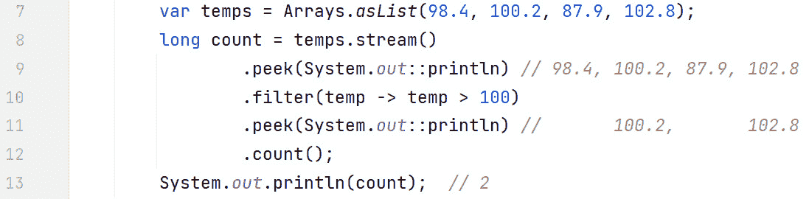

图 15.1 – 样本管道

`var`关键字

`var`关键字被称为`temps`是一个`List<Double>`。

上一图输出的结果如下：

```java
98.4100.2
100.2
87.9
102.8
102.8
2
```

在这个图中，我们正在计算温度`> 100`的数量。由于流不保存数据，管道指定了我们想要如何操作源。我们首先做的事情是创建一个由`temps`表示的`List<Double>`列表：

```java
var temps = Arrays.asList(98.4, 100.2, 87.9, 102.8);
```

然后，我们流式传输列表——换句话说，列表是我们的源：

```java
temps.stream()
```

接下来，我们使用`peek(Consumer)`中间操作，这对于调试管道以及展示管道中的数据位置非常有用：

```java
.peek(System.out::println)
```

在这一点上，我们想要过滤出大于 100 的温度。换句话说，只有大于`100`的温度才能通过过滤器：

```java
.filter(temp -> temp > 100)
```

现在我们有一个大于 100 的温度，我们再次使用`peek(Consumer)`来确保我们的过滤器工作正常：

```java
.peek(System.out::println)
```

最后，我们有终端操作`count()`，它启动了整个过程：

```java
.count();
```

让我们讨论一下流处理过程是如何工作的。首先，`98.4`被流处理。由于`98.4`没有通过过滤器，它被从流中移除。接下来，`100.2`被流处理；它通过了过滤器，Java 将计数设置为 1。然后，下一个值`87.9`被流处理，但它没有通过过滤器。最后，`102.8`被流处理，它也通过了过滤器，因此计数增加到 2。因此，大于`100`的温度计数是 2（`100.2`和`102.8`）。注意值从流中出来的顺序展示了流的惰性。

我们将在适当的时候讨论这个例子中的各种操作。目前，我们想更详细地介绍流惰性。

# 探索流惰性

惰性求值的原则是，你只在你需要的时候得到你需要的东西。例如，如果像亚马逊这样的购物网站要向用户显示 10,000 条记录，那么惰性求值的原则就是先检索前 50 条，当用户查看这些记录时，在后台检索下一条 50 条。急切求值就是一次性检索所有 10,000 条记录。对于流来说，这意味着直到终端操作被调用之前，不会发生任何事情。

管道指定了我们想要在源上执行的操作以及它们的顺序。由于直到终端操作运行之前不会发生任何事情，Java 知道整个管道。这使得 Java 能够在可能的情况下引入效率。例如，为什么要在不需要操作的数据上运行操作呢？这可能会出现在以下情况下：

+   我们已经找到了我们正在寻找的数据项

+   我们可能设置了一个元素数量的限制（就像铅笔的类比一样）

让我们考察一个示例，其中处理源中元素顺序展示了惰性求值。*图 15*.*2*（`Laziness.java`）展示了这一点：

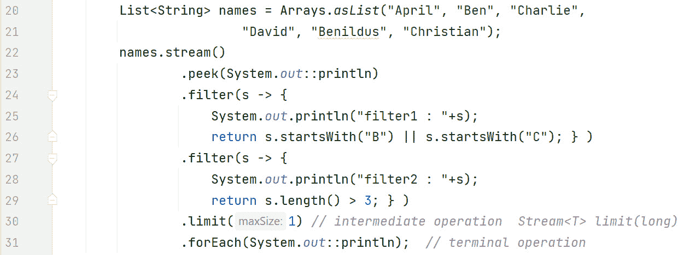

图 15.2 – 惰性求值 – 流管道示例

图中的算法获取以'B'或'C'开头且长度超过 3 个字符的第一个名字。在这个例子中，我们最初创建了一个名为`names`的`List<String>`：

```java
   List<String> names = Arrays.asList("April", "Ben",             "Charlie","David", "Benildus", "Christian");
```

由于 Java 在遇到终端操作之前不会进行任何流操作；在这个例子中，直到`forEach(Consumer)`操作（第 31 行）发生之前，没有任何事情发生。这意味着在开始时，`names.stream()`代码仅仅创建了一个对象，当流开始时，这个对象知道数据在哪里。

在这个管道中，我们首先使用`peek(Consumer)`中间操作输出当前字符串，该字符串代表使用的人名：

```java
.peek(System.out::println)
```

接下来，我们使用`filter(Predicate)`中间操作来过滤出以“B”或“C”开头的名字：

```java
.filter(s -> {    System.out.println("filter1 : "+s);
    return s.startsWith("B") || s.startsWith("C"); } )
```

紧接着，我们过滤出长度超过三个字符的名字：

```java
.filter(s -> {    System.out.println("filter2 : "+s);
    return s.length() > 3; } )
```

之后，我们使用`limit(long)`中间操作来跟踪通过第二个过滤器的名字数量：

```java
.limit(1)
```

在这个例子中，一旦一个名字通过，JVM 就会得到通知，并且不会从源中流式传输其他名字。最后，我们提供（必需的）终端操作：

```java
.forEach(System.out::println);
```

*图 15**.3* 展示了来自 *图 15**.2* 代码的输出，这非常具有启发性：

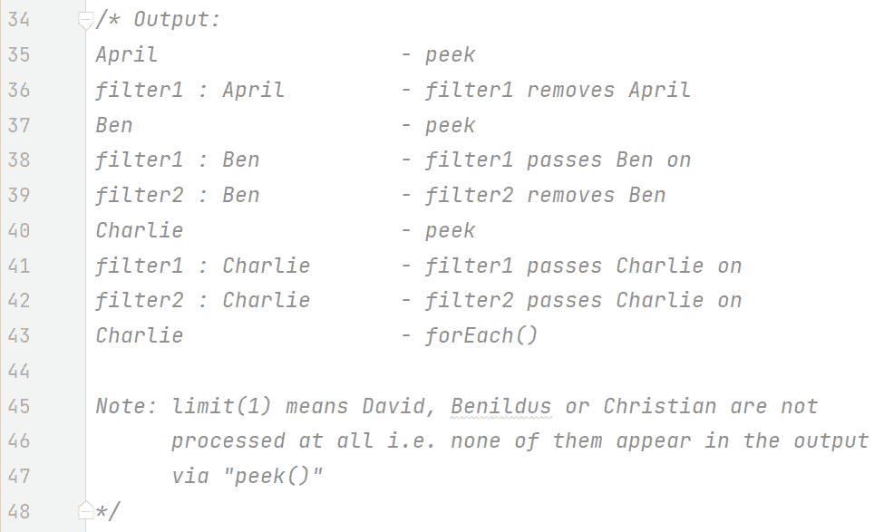

图 15.3 – 图 15.2 的输出（右侧有注释）

第 35 行显示了第一个名字，`April`，从列表中流式传输。`April`通过了第一个过滤器并被移除（因为`April`不以“B”或“C”开头）。

第 37 行显示了下一个名字，`Ben`，正在流式传输。`Ben`通过了第一个过滤器并到达第二个过滤器。然而，由于`Ben`的长度只有 3 个字符，它被第二个过滤器移除。

第 40 行显示了下一个名字，`Charlie`，正在流式传输。`Charlie`通过了第一个过滤器（因为`Charlie`以“C”开头）并被传递到第二个过滤器。`Charlie`也通过了这个过滤器，因为`Charlie`的长度大于 3 个字符。因此，`Charlie`被传递到`limit(long)`中间操作，该操作指出这是第一个通过的名字。由于限制设置为 1，JVM 被通知。`Charlie`通过`forEach(Consumer)`终端操作打印出`Charlie`（第 43 行），并且流被关闭。

注意，其他名字 – `David`、`Benildus`或`Christian` – 都没有进行流式传输。这是一个小例子，但你可以想象当你处理数百万数据项时的效率。

我们现在将讨论如何创建流。

# 创建流

流可以从各种来源生成，无论是有限的还是无限的。例如，可以使用数组、集合、`varargs`和文件等作为来源。我们将依次检查这些来源。目前，我们将处理非原始类型；所有流都将串行（非并行）。在第*第十六章*中，我们将讨论原始流和并行流。

## 从数组中流式传输

我们将使用`Stream<T> Arrays.stream(T[] array)`来完成这个操作。这个`static`方法接受一个类型为`T`的数组，并返回`Stream<T>`。*图 15**.4* (`CreatingStreams.java`) 展示了一个示例：

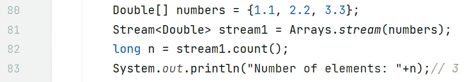

图 15.4 – 流式传输数组

在这个图中，我们声明了一个`Double`数组（注意这不是一个原始的`double`数组）。流对象是通过调用`Arrays.stream(T[] array)`方法创建的。我们使用终端操作`count()`开始流。最后，我们输出数组中的元素数量。请注意，这只是一个示例，而且有更直接的方法（使用`length`属性）来输出数组中的元素数量。

让我们看看如何从集合中流式传输。

## 流式传输集合

通过“集合”，我们指的是`Collection`接口层次结构。`Collection`接口有一个`default Stream<E> stream()`方法。*图 15.5* (`CreatingStreams.java`)展示了从集合生成流的代码：

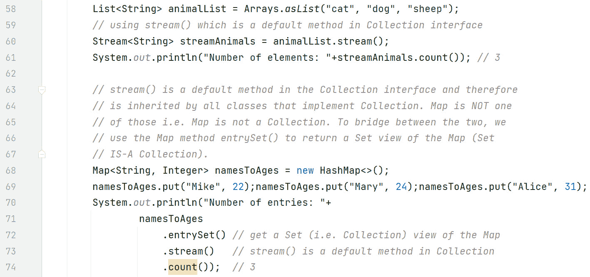

图 15.5 – 流式传输集合

在这个图中，我们最初使用`Arrays.asList(T… a)`创建了一个`List<String>`：

```java
List<String> animalList = Arrays.asList("cat", "dog", "sheep");
```

然后，我们使用`Collection`的`stream()`方法创建流对象：

```java
Stream<String> streamAnimals = animalList.stream();
```

要开始流，我们使用终端操作`count()`：

```java
System.out.println("Number of elements: "+streamAnimals.count()); // 3
```

如果你有`Map`并想流式传输它怎么办？记住，`Map`不是一个`Collection`，因为它没有实现它。这就是第二个示例所展示的。首先，让我们声明并填充这个映射：

```java
Map<String, Integer> namesToAges = new HashMap<>();namesToAges.put("Mike", 22);
namesToAges.put("Mary", 24);
namesToAges.put("Alice", 31);
```

要从`Map`转换到`Collection`，我们将执行以下操作：

```java
   namesToAges.entrySet()
```

`Map`中的`entrySet()`方法返回映射中条目的`Set`视图。由于`Set`是`Collection`的子接口，`Set`“是”`Collection`。在这个点上，我们现在可以像平常一样流式传输集合：

```java
.stream()
```

最后，我们使用终端操作`count()`开始过程，它返回`3`，表明流已成功工作。

现在，让我们看看`Stream.of()`方法。

## Stream.of()

`static <T> Stream<T> of(T… values)`是一个非常有用的方法。虽然它的签名可能看起来有点令人困惑，但它非常容易使用。这是一个`static`方法，它具有泛型类型，因此是`<T>`。因此，编译器不会对签名中`T`的使用提出异议。它返回`Stream<T>`，而`T`取决于传入的内容。例如，如果你传入字符串，那么你将得到`Stream<String>`。参数是一个`varargs`列表，它非常灵活。

让我们看看一些示例。*图 15.6* (`BuildStreams.java`)展示了代码：

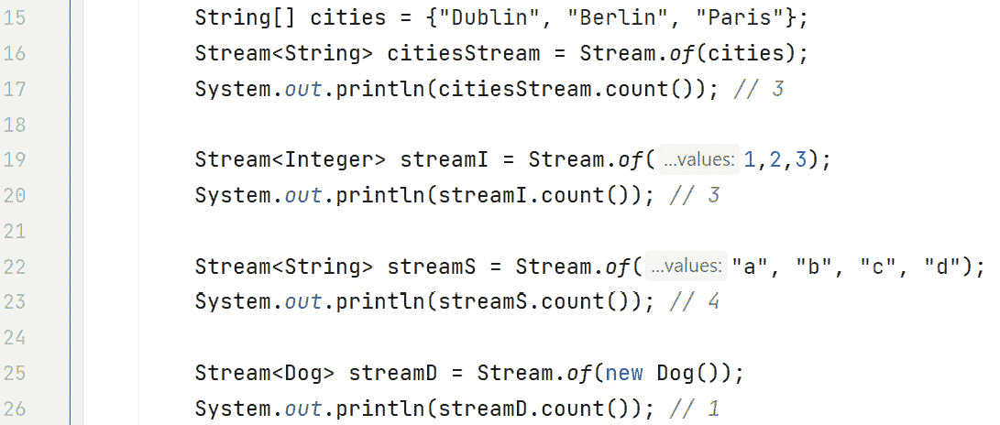

图 15.6 – Stream.of()示例

在这个图中，我们最初声明了一个字符串数组：

```java
String[] cities = {"Dublin", "Berlin", "Paris"};
```

使用`Stream.of()`方法，我们声明流源为数组：

```java
Stream<String> citiesStream = Stream.of(cities);
```

声明后，我们使用`count()`终端操作开始流：

```java
System.out.println(citiesStream.count()); // 3
```

接下来，`Stream.of()`从传入的整数`varargs`（作为`Integer`装箱）中获取流源：

```java
Stream<Integer> streamI = Stream.of(1,2,3);
```

我们像以前一样开始流式传输过程，使用`count()`终端操作：

```java
System.out.println(streamI.count()); // 3
```

之后，`Stream.of()`从字符串的`varargs`中获取流源并将它们流式传输：

```java
Stream<String> streamS = Stream.of("a", "b", "c", "d");System.out.println(streamS.count()); // 4
```

最后，我们从`Dog`的`varargs`（只有一个）中获取流源并将它们流式传输：

```java
Stream<Dog> streamD = Stream.of(new Dog());System.out.println(streamD.count()); // 1
```

现在，让我们看看如何从文件中流式传输数据。

## 从文件流式传输

要流式传输文件，我们可以使用 `Files.lines()` 方法。它的签名是 `public static Stream<String> lines(Path path)` `throws IOException`。

`Path` 参数指的是我们想要处理的文件。这个文件需要被分隔；例如，使用正斜杠（`/`）字符。我们将使用的文件包含以下行：

```java
Fido/BlackLily/White
```

返回的 `Stream<String>` 指的是文件的行，每行一个 `String`。我们可以使用在 `Stream` 接口中定义的 `forEach(Consumer)` 终端操作来处理返回的流。在消费者代码块内部，每行文件（一个 `String`）可以使用 `String` 类的 `split()` 方法解析为 `String[]` – 其中我们传递分隔符并返回一个包含元素的 `String[]`。一旦我们有了这个 `String[]`，我们就可以轻松地创建我们的对象并将其添加到集合中，例如 `ArrayList`。这是一个 `Consumer` 副作用示例。

假设有一个 `Cat` 类，它有 `name` 和 `color` 实例变量以及一个相关构造函数（ProcessFile.java），我们可以做以下操作：

```java
try(Stream<String> stream =  Files.lines(Paths.get(filename))){
       stream.forEach(line -> {
           String[] catsArray = line.split("/");
           cats.add(new Cat(catsArray[0], catsArray[1]));
       });
  } catch (IOException ioe) {
            ioe.printStackTrace();
  }
```

`forEach(Consumer)` 与 `forEach(Consumer)`

在 Java API 中，这两个版本的 `forEach()` 看起来非常相似，但实际上它们来自两个非常不同的层次结构。一个是 `Iterable` 接口（`Collection` 继承自它）中的 `default` 方法。另一个是 `Stream` 接口中的终端操作。

## 无限流

无限流可以很容易地使用 `Stream` 接口中的两个 `static` 方法创建，即 `generate()` 和 `iterate()`。让我们逐一考察它们。

### Stream<T> generate(Supplier<T> s)

根据 API，它“返回一个无限、顺序的无序流，其中每个元素都是由提供的 `Supplier` 生成的。”*图 15.7* (`InfiniteStreamsGenerate.java`) 展示了一些我们可以讨论的代码：

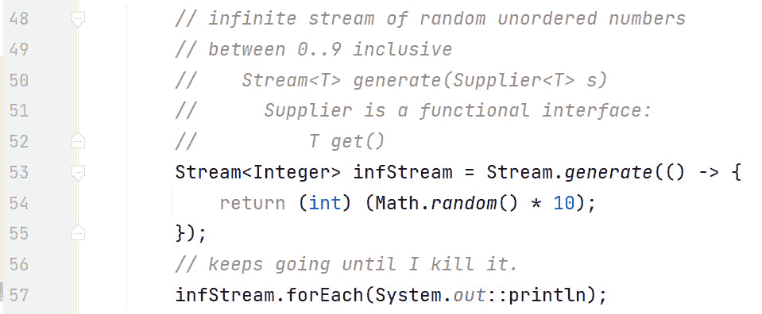

图 15.7 – 使用 generate() 创建无限流

如此图所示，提供的 `Supplier` 生成介于 0 和 9（包括 0 和 9）之间的随机数：

```java
() -> (int) (Math.random() * 10);
```

我们使用 `forEach(Consumer)` 终端操作开始流处理过程：

```java
infStream.forEach(System.out::println);
```

`Consumer` 接受一个方法引用以输出生成的数字。此流将持续进行，直到我们终止应用程序（例如，从 IDE 内部）。

Math.random()

回想一下，`Math.random()` 返回一个介于 `0.0 <= x < 1.0` 的 `double` 类型。换句话说，一个介于 `0` 和小于 `1` 之间的数字。当我们把这个数字乘以 `10`，然后将其转换为 `int` 类型时，实际上是将它缩放到 `0 <= x <` `10`。

现在，让我们讨论生成无限流的另一种方法，即 `iterate()`。

### Stream<T> iterate(T seed, UnaryOperator<T> fn)

这种方法让你对生成的数字有更多的控制。第一个参数是种子，它是流中的第一个数字。第二个参数是一个`UnaryOperator`（一个输入和输出类型相同的`Function`）。这个`UnaryOperator`函数是一个 lambda 表达式，它接受前一个值并生成下一个值。*图 15**.8* (`InfiniteStreamsIterate.java`)展示了我们进一步讨论这个问题的代码示例：

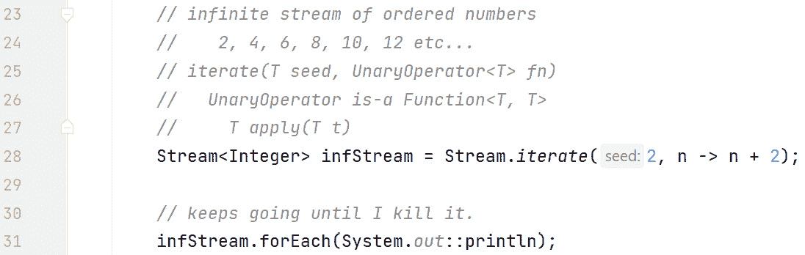

图 15.8 – 使用 iterate()创建无限流

如此图所示，种子是`2`，lambda 表达式生成`2`之后的下一个偶数，依此类推。因此，这个流生成`2`、`4`、`6`、`8`，等等，直到我们终止应用程序。

如果我们只想得到这么多的数字呢？例如，如果我们只想得到`20`（从`2`开始）以内的偶数呢？`iterate()`有一个重载版本可以满足这个需求——它的第二个参数是一个`Predicate`，它指定何时结束。*图 15**.9* (`InfiniteStreamsIterate.java`)展示了这个示例：

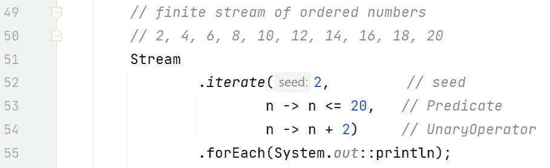

图 15.9 – 使用 iterate()和 Predicate 创建无限/有限流

`Predicate`条件：

```java
n -> n <=20
```

这一行在这里很重要，它指定了流何时停止。因此，这是从无限流创建有限流的一种方法。如果`Predicate`条件持续返回`true`，流将不断生成数字，直到你终止应用程序。

在这个图中，`2`、`4`、`6`、`8`、`10`、`12`、`14`、`16`、`18`和`20`都通过了`Predicate`条件并被输出。一旦生成`22`并且`Predicate`失败，流就会停止。

将无限流转换为有限流的另一种方法是使用`limit()`中间操作。*图 15**.10* (`InfiniteStreamsIterate.java`)展示了这种情况：

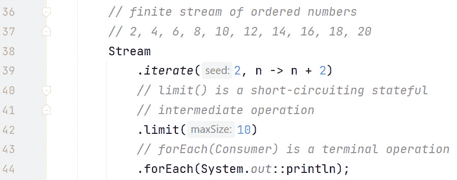

图 15.10 – 使用 limit()创建有限流

在这个图中，我们通过使用`limit()`中间操作将生成的数字限制为 10。我们将在*第十六章*中讨论中间操作。在这个例子中，一旦第 10 个数字通过，`limit()`就会通知 JVM 这一事实，并且不再生成更多的数字。

现在我们已经知道了如何创建流，让我们来检查终端操作。

# 掌握终端操作

正如我们之前讨论的，直到终端操作执行之前不会发生流操作。这给了 JVM 一个流管道的整体视图，从而使得在后台引入效率成为可能。

终端操作可以在没有任何中间操作的情况下执行，但不能反过来。*归约*是终端操作的一种特殊类型，其中流的所有内容都被组合成一个单一的原语或*Object*（例如，一个*Collection*）。

*表 15.1* 代表我们将在本节中讨论的终端操作：

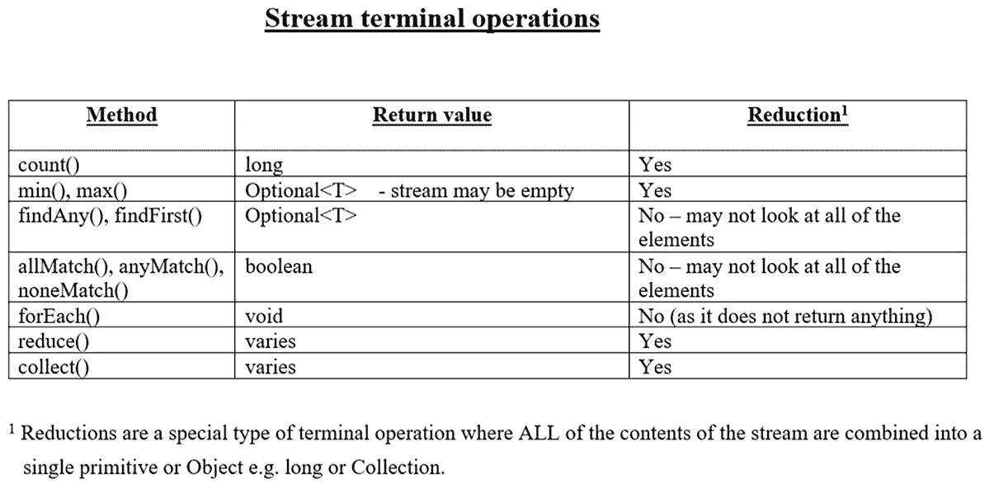

表 15.1 – 终端操作

在我们依次讨论它们之前，先简要讨论一下表格。记住，归约必须查看流中的所有元素，然后返回一个原始类型或`Object`。

一些终端操作，如`allMatch(Predicate)`，可能不会查看流中的所有元素。例如，假设我们有以下代码：

```java
List<String> names = Arrays.asList("Alan","Brian","Colin");Predicate<String> pred = name -> name.startsWith("A");
System.out.println(names.stream().allMatch(pred)); // false
```

`Predicate`条件在`"Brian"`上失败，因为它不以`"A"`开头，因此`allMatch()`返回`false`。因此，`"Colin"`永远不会被检查，因此`allMatch()`不是归约操作。

我们将在稍后讨论`Optional`，但到目前为止，`Optional`是在 Java 8 中引入的，以替换`null`返回值（从而有助于减少`NullPointerException`的数量）。如果流为空，则返回一个空的`Optional`（而不是`null`）。因此，`Optional`对象要么具有非`null`值，要么为空。导致空流的一种方式是在调用终端操作之前过滤掉其所有元素。

让我们依次处理这些操作。

## count()

我们已经遇到了`count()`，因此已经在*图* *15**.11* (`TerminalOperations.java`)中提供了一个快速示例：

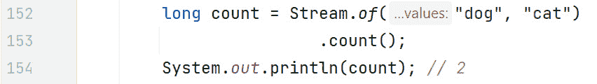

图 15.11 – 代码中的 count()

`count()`方法与有限流一起工作，因为它永远不会为无限流终止。在这个例子中，两个字符串`"dog"`和`"cat"`被流式传输，并返回计数`2`。请注意，`count()`是一个归约操作，因为它查看流中的每个元素，并返回一个单一值。

## min()和 max()

与`count()`一样，`min()`和`max()`都与有限流一起工作，并挂起无限流（以防可能还有其他值是最小值或最大值）。两者都是归约操作，因为它们在处理整个流之后返回一个单一值。鉴于流可能为空，*Optional*是返回类型。

*图* *15**.12* (TerminalOperations.java)展示了使用`min()`和`max()`的一些代码：

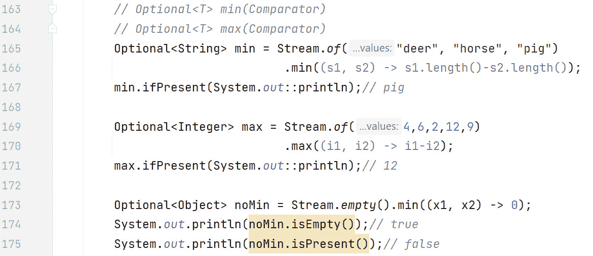

图 15.12 – 代码中的 min()和 max()

在这个例子中，我们最初定义了一个自定义的`Comparator`，该`Comparator`将字符串列表按字符串长度升序排序。然后，这个`Comparator`被传递到`min()`方法中，其中`"pig"`被返回到`Optional`：

```java
.min((s1, s2) -> s1.length()-s2.length())
```

我们随后使用函数式风格的`Optional`方法`ifPresent()`，以确定`Optional`中是否存在非`null`值。由于`"pig"`存在（存在），因此输出如下：

```java
min.ifPresent(System.out::println);// pig
```

接下来是一个不同的自定义`Comparator`，它将数字列表按升序排序。然后将其传递到`max()`方法中，其中`12`存储在`Optional`变量`max`中：

```java
.max((i1, i2) -> i1-i2)
```

再次，我们使用`ifPresent()`方法来确定`max`中是否存在非`null`值。由于`12`存在，它被输出：

```java
max.ifPresent(System.out::println);// 12
```

最后，我们演示了你可以使用`Stream.empty()`来创建一个空流：

```java
Optional<Object> noMin = Stream.empty().min((x1, x2) -> 0)
```

在这个例子中，由于流为空，比较器`(x1, x2) -> 0`从未被调用，因此`Optional`中没有值。因此，`isEmpty()`返回`true`，`isPresent()`返回`false`：

```java
System.out.println(noMin.isEmpty());// trueSystem.out.println(noMin.isPresent());// false
```

## findAny()和 findFirst()

这些终端操作不是归约操作，因为它们不处理整个流。正如其名称所暗示的，`findAny()`将返回任何元素——通常返回第一个元素，但这并不保证。另一方面，`findFirst()`正是这样做的——它返回第一个元素。不出所料，这些方法可以与无限流一起工作（因为它们不处理整个流）。在两种情况下都返回一个`Optional`（因为当它们被调用时流可能为空）。

定义一个*短路*终端操作为一个操作，当遇到无限输入时，可能在有限时间内终止。鉴于这些操作可以在处理完整个流之前返回，它们被认为是短路操作。

*图 15**.13* (`TerminalOperationsFindAnyFindFirst.java`) 展示了它们在代码中的使用：

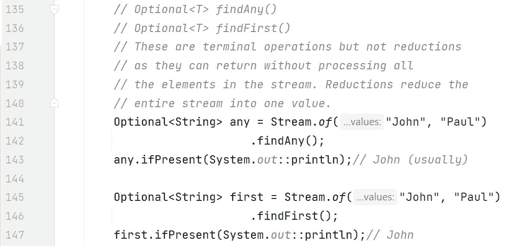

图 15.13 – 代码中的 findAny()和 findFirst()

在这个图中，我们对字符串流`"John"`和`"Paul"`执行`findAny()`操作。这通常返回`"John"`，但不保证；而当我们对同一流执行`findFirst()`时，总是返回`"John"`。正如这个示例所展示的，这两个操作都没有处理`"Paul"`，因此它们不被认为是归约操作。

## anyMatch(), allMatch, and noneMatch()

这三个终端操作都接受一个`谓词`条件并返回一个`布尔`值。就像`"find"`方法一样，它们也不是归约操作，因为它们可能不会查看所有的元素。根据数据的不同，这些操作在遇到无限流时可能终止也可能不终止。话虽如此，由于它们可能终止，它们被认为是短路操作。*图 15**.14* (`TerminalOperations.java`) 展示了一个示例：

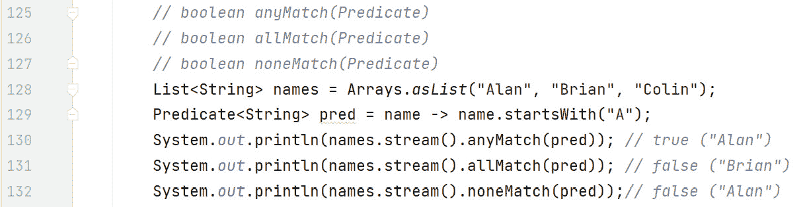

图 15.14 – 代码中的 anyMatch(), allMatch(), and noneMatch()

在这个图中，我们定义了一个包含`String`名称的有限流，如下所示：

```java
List<String> names = Arrays.asList("Alan", "Brian", "Colin");
```

定义一个谓词来检查一个名称是否以`"A"`开头：

```java
Predicate<String> pred = name -> name.startsWith("A");
```

然后，我们流式传输（源）名称列表，并使用`anyMatch()`检查是否有名称以`"A"`开头——由于`"Alan"`是，返回`true`：

```java
names.stream().anyMatch(pred); // true ("Alan")
```

接下来，我们重新流式传输列表并使用`allMatch()`检查所有名称是否以`"A"`开头——由于`"Brian"`不是，返回`false`：

```java
names.stream().allMatch(pred); // false ("Brian")
```

然后，我们重新流式传输列表并使用 `noneMatch()` 检查是否有任何名字以 `"A"` 开头——因为 `"Alan"` 以 `"A"` 开头，所以返回 `false`：

```java
names.stream().noneMatch(pred);// false ("Alan")
```

注意，我们必须重新流式传输源两次（对于 `allMatch()` 和 `noneMatch()`）。这是因为一旦执行了终端操作，流就被认为是消耗过的，不能再使用。如果你需要相同的数据，那么你必须回到源并获取一个新的流。这正是我们在这里所做的事情。在已关闭的源上尝试操作会生成一个 `IllegalStateException` 错误。

让我们更深入地探讨这些操作在处理无限数据时的短路特性。以下示例（*图 15**.15*）展示了代码（`TerminalOperations.java`），其中每个操作在给定的无限流中可能终止或不终止。它们是否终止取决于数据（以及与该数据测试的谓词）：

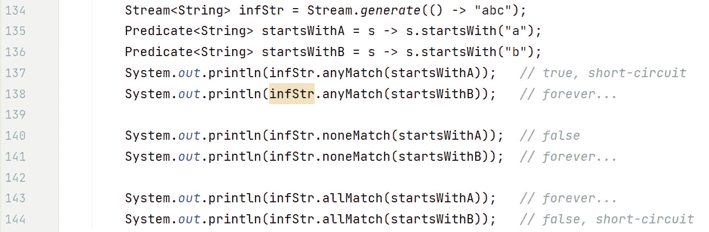

图 15.15 – 代码中 anyMatch()、allMatch()和 noneMatch()的短路特性

在这个图中，我们生成了一串无限的 `"abc"` 字符串，并定义了两个谓词；一个检查字符串是否以 `"a"` 开头，另一个检查字符串是否以 `"b"` 开头。请注意，正如之前解释的那样，在使用之前必须重新打开关闭的流。因此，第 137-144 行是**互斥的**——一次只能使用其中之一。我们保留了所有未注释的行，因为这有助于图表的清晰度。当我们运行代码时，我们必须注释掉六行中的五行。

`infStr.anyMatch(startsWithA)` 检查是否有任何字符串以 `"a"` 开头——因为第一个是以 `"a"` 开头的，所以它短路并返回 `true`。

`infStr.anyMatch(startsWithB)` 检查是否有任何字符串以 `"b"` 开头——第一个不是，所以它检查下一个；它也不是，以此类推。在这种情况下，我们不得不终止程序。

`infStr.noneMatch(startsWithA)` 检查是否有任何字符串以 `"a"` 开头——因为 `"abc"` 以 `"a"` 开头，`noneMatch()` 短路并返回 `false`。

`infStr.noneMatch(startsWithB)` 检查是否有任何字符串以 `"b"` 开头——第一个不是，所以它检查下一个；它也不是，以此类推。这会一直进行下去，所以我们必须终止程序。那么，`noneMatch()` 何时返回 `true`？如果你有一个有限的流，其中没有任何元素匹配给定的谓词。

`infStr.allMatch(startsWithA)` 检查所有字符串是否以 `"a"` 开头。在这种情况下，这会一直进行下去，因为我们不断生成以 `"a"` 开头的字符串，确保 `allMatch()` 需要检查下一个，以此类推。

`infStr.allMatch(startsWithB)` 可以短路，因为 `"abc"` 不是以 `"b"` 开头，这使得 `allMatch()` 能够返回 `false`。

## forEach()

由于 `forEach(Consumer)` 没有返回值（返回 `void`），它不被视为一个减少操作。因为它不返回任何内容，所以你希望进行的任何更改都必须在 `Consumer` 中作为副作用发生。我们已经讨论了几个 `forEach()` 的例子，所以 *图 15**.16*（TerminalOperations.java）只显示了一个简单的例子：

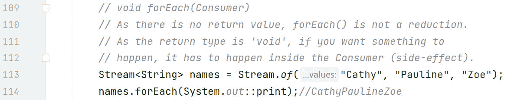

图 15.16 – 代码中的 forEach()终端操作

在这个例子中，我们正在流式传输一个字符串列表，代表人们的名字，并将它们回显到屏幕上。

## reduce()

`reduce()` 方法将流合并成一个单一的对象。因为它处理所有元素，所以它是一个减少操作。有三个重载版本。我们将依次通过示例来讨论它们。

### T reduce(T identity, BinaryOperator<T> accumulator)

这是最常见的减少方式 – 从一个初始值（初始值）开始，并持续将其与下一个值合并。除了初始值是初始值之外，如果流为空，它也是返回的值。这意味着总会有一个结果，因此 `Optional` 不是返回类型（在这个版本中）。

累加器将当前结果与流中的当前值结合。由于它是一个 `BinaryOperator`，这意味着它是一个两个输入和返回类型都是相同类型的函数。

*图 15**.17* (`TerminalOperations.java`) 展示了一些例子以帮助解释这一点：

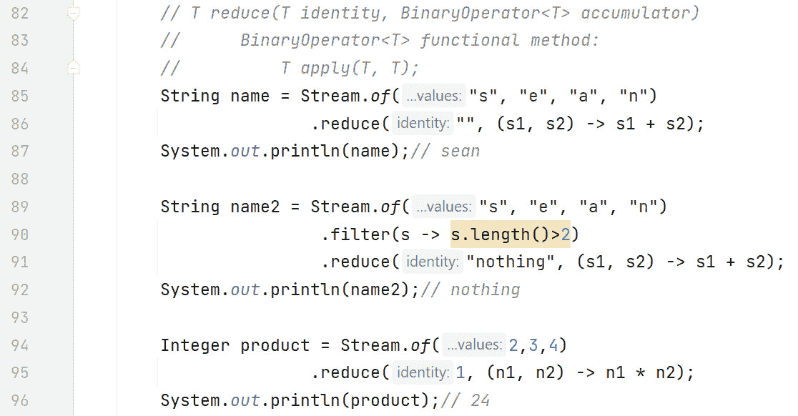

图 15.17 – T reduce(T identity, BinaryOperator<T> acc) 代码中的操作

让我们来检查这个图中的第一次减少操作：

```java
String name = Stream.of("s", "e", "a", "n")                    .reduce("", (s1, s2) -> s1 + s2);
System.out.println(name);// sean
```

这个减少操作将空字符串定义为初始值。这既是我们的起始字符串，也是如果流为空时返回的字符串。累加器接受两个字符串，即 `s1` 和 `s2`。第一次循环时，`s1` 是 `""`，`s2` 是 `"s"`，结果是 `"s"`。下一次循环时，`s1` 是前一次运行的结果，即 `"s"`，`s2` 是 `"e"`，结果是 `"se"`。之后，`s1` 是 `"se"`，`s2` 是 `"a"`，结果是 `"sea"`。最后，`s1` 是 `"sea"`，`s2` 是 `"n"`，结果是 `"sean"`。这就是累加器的工作方式。

第二次减少操作从重新流式传输源开始：

```java
String name2 = Stream.of("s", "e", "a", "n")                .filter(s -> s.length()>2)
                .reduce("nothing", (s1, s2) -> s1 + s2);
System.out.println(name2);// nothing
```

然而，应用了一个过滤器中间操作。这个过滤器确保只有长度大于 `2` 的字符串被保留，导致 `reduce()` 的流为空。因此，`reduce()` 返回的 `"``nothing"` 是一个初始值。

最后的减少操作给出了另一个关于初始值和累加器在操作中的示例：

```java
Integer product = Stream.of(2,3,4)                        .reduce(1, (n1, n2) -> n1 * n2);
System.out.println(product);// 24
```

值序列为 `n1` 是 `1`，`n2` 是 `2`，结果是 `2`；`n1` 是 `2`，`n2` 是 `3`，结果是 `6`；`n1` 是 `6`，`n2` 是 `4`，结果是 `24`。

### Optional<T> reduce(BinaryOperator<T> accumulator)

这与第一个版本非常相似，只是没有提供恒等值。由于没有提供恒等值，`Optional`是返回类型（考虑到，在调用此方法之前，流可能为空）。有三种可能的返回值：

1.  空的流——结果是一个空的`Optional`

1.  流中的一个元素——返回该元素（在`Optional`中）

1.  流中的多个元素——应用累加器

为什么会有两个如此相似的版本？为什么不只保留有恒等值的第一个版本呢？好吧，可能存在一种情况，尽管可能性很小，累加器返回的值与恒等值相同。在这种情况下，你将无法知道流是否为空（恒等值返回）或者不是（累加器应用）。这个第二个版本，通过使用`Optional`，确保你知道流是否为空。

现在，让我们来检查`reduce()`的第三个版本。

### <U> reduce(U identity, BiFunction accumulator, BinaryOperator combiner)

当我们处理不同类型且在最后合并中间减少的结果时，使用这个版本。在并行流中，这个版本非常有用，因为流可以被不同的线程分解和重新组装。*图 15.18**.18* (`TerminalOperations.java`)展示了代码中的示例：

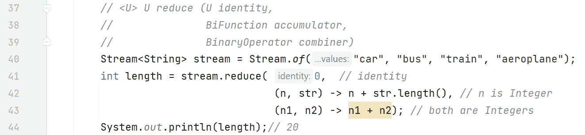

图 15.18 - U reduce(U identity, BiFunction accumulator, BinaryOperator combiner) 代码示例

在这个例子中，我们正在流式传输一个字符串列表，我们想要计算所有字符串中的总字符数。`reduce()`方法的代码如下：

```java
   stream.reduce( 0,  // identity              (n, str) -> n + str.length(), // n is Integer
              (n1, n2) -> n1 + n2); // both are Integers
```

并且有 3 个元素：

+   0 是恒等值，它代表我们的起始值。

+   `(n, str) -> n + str.length()`是`BiFunction`累加器。在这种情况下，第一个参数是`Integer`，第二个参数是`String`。返回类型与第一个参数匹配——换句话说，是`Integer`。我们没有在方法签名中突出显示这一点，因为所有字母有时可能会引起混淆。这个累加器将当前`String`的长度添加到当前总和中。

+   `(n1, n2) -> n1 + n2`代表合并器`BinaryOperator`（一个类型相同的函数）。它的 lambda 表达式简单地添加两个数字并返回总和。这个函数将累加器中的中间结果相加。

因此，使用并行流时，一个线程可以返回 6 的累积值，这是"car"和"bus"长度的总和，而另一个线程可以返回 14 的累积值，这是"train"和"aeroplane"长度的总和。这两个值随后由合并器合并，得到 20。

现在，我们将继续介绍一个强大的终端操作，即`collect()`。

## collect()

这是一种特殊的归约类型，称为可变归约，因为我们使用相同的可变对象进行累积。这使得它比常规归约更高效。常见的可变对象包括`StringBuilder`和`ArrayList`。

这个操作对于获取数据`Map`、`List`或`Set`非常有用。

有两个版本 – 一个版本让你完全控制收集过程，另一个版本提供了 API 中的预定义收集器。我们将从第一个版本开始，你可以自己指定一切。

### collect(Supplier, BiConsumer, BiConsumer)

这个方法最好通过一个代码示例来解释，请参阅*图 15.19*，它来自 repo 上的`TerminalOperations.java`。

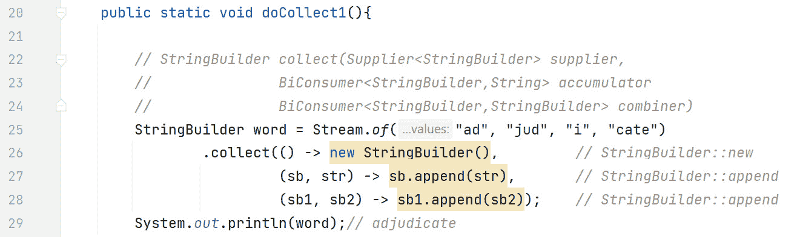

图 15.19 – 代码中的 collect(Supplier, BiConsumer, BiConsumer)操作

在这个图中，我们正在从一系列较小的单词构建一个长单词。请注意，等效的方法引用（用于 lambdas 的），位于每行的右侧注释中。

`collect()`的第一个参数是一个`Supplier`，它指定我们想要使用`StringBuilder`：

```java
() -> new StringBuilder()
```

累加器将当前的`String`添加到`StringBuilder`中：

```java
(sb, str) -> sb.append(str)
```

组合器将两个`StringBuilder`合并：

```java
(sb1, sb2) -> sb1.append(sb2)
```

在并行处理中，这很有用，因为不同的线程可以执行累积并将结果合并。在这个例子中，线程 1 可以返回`"adjud"`，这是累积`"ad"`和`"jud"`的结果；线程 2 可以返回`"icate"`，这是累积`"i"`和`"cate"`的结果。这两个结果合并成`"adjudicate"`。

现在，让我们看看传递预定义 API 收集器的`collect()`版本。

## collect(Collector)

这是接受预定义 API 收集器的版本。我们通过`Collectors`类中的`static`方法访问这些收集器。这些收集器本身不做任何事情 – 它们存在是为了传递给`collect(Collector)`方法。

我们将检查许多这样的方法，特别是那些帮助我们从流中提取数据到集合以供后续处理的方法。此外，我们还将探讨如何分组和分区信息。让我们从一些更基本的收集器开始。

### Collectors.joining(CharSequence delimiter)

这个收集器返回一个`Collector`，它将输入元素连接起来，元素之间由指定的分隔符分隔。流顺序保持不变。*图 15.20*展示了示例（来自 repo 上的`CollectorsExamples.java`）。

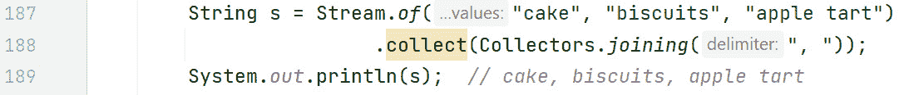

图 15.20 - 代码中的 Collectors.joining()

在这个例子中，字符串被连接在一起，并用`", "`分隔。

### Collectors.averagingInt(ToIntFunction)

这返回一个`Collector`，它产生由提供的函数生成的整数的平均值。*图 15.21*（`CollectorsExamples.java`）展示了示例：


图 15.21 – 代码中的`Collectors.averagingInt(ToIntFunction)`

在这个例子中，我们正在流式传输表示甜点的字符串。每个字符串都有一个长度，我们想要计算长度的平均值。函数`s -> s.length()`接收一个`String`，即`s`，并返回其整数长度。方法引用版本在右侧的注释中。然后输出平均值。

现在，让我们看看如何将流内容提取到`List`、`Set`或`Map`中。我们将从`List`开始。

### `Collectors.toList()`

这返回一个将元素累积到新`List`的`Collector`操作。`List`的类型没有保证。例如，不能保证`List`是`ArrayList`或`LinkedList`。为了获得这种程度的控制，必须使用`toCollection(Supplier)`方法（我们将在`Set`示例中使用它）。*图 15.22*展示了我们将用于下一个几个示例的`Car`类型（`CollectorsExamples.java`）：


图 15.22 – `Car`类

*图 15.23*展示了`Collectors.toList()`在代码中的示例（来自存储库中的`CollectorsExamples.java`）：


图 15.23 – 代码中的`Collectors.toList()`

在这个例子中，我们向我们的`List`中添加了三个`Car`对象。回想一下，`List`维护插入顺序。`map(Function)`方法是一个中间操作，它接收一个流并将其转换成另一个流。我们将在*第十六章*中更详细地讨论`map()`方法，但到目前为止，请认识到有`Stream<Car>`进入`map()`，并输出`Stream<String>`。这是因为`Car`中的`brand`是一个`String`。现在，我们有一个`Stream<String>`，可以用于`collect()`操作以提取成`List`格式。

如前所述，实现类型没有保证。如果我们想要一个特定的实现，并且不仅仅是这样的实现，而是一个在添加元素时对元素进行排序的实现呢？`TreeSet`会这样做。现在让我们看看这一点。

### `Collectors.toSet()`和`Collectors.toCollection(Supplier)`

`Collectors.toSet()`返回一个将元素累积到新`Set`的`Collector`。`Set`的类型没有保证。然而，在这个例子中，我们想要一个特定的`Set`，即`TreeSet`。当我们想要一个特定的实现时，我们可以使用`Collectors.toCollection(Supplier)`。*图 15.24*展示了代码（`CollectorsExamples.java`）：


图 15.24 – 代码中的`Collectors.toCollection(Supplier)`

在这个例子中，汽车被故意添加到我们的`ArrayList`中，品牌顺序未排序。下面的行是魔法发生的地方：

```java
.collect(Collectors.toCollection(TreeSet::new));
```

我们传递一个`Supplier`方法引用来创建一个`TreeSet`，然后将其传递给`Collectors.toCollection()`方法。这导致了一个`TreeSet`实现。当我们输出`treeSet`时，我们得到：

```java
[Audi, Ford, Tesla]
```

注意，品牌现在按字母顺序排序（字符串的默认排序顺序）。我们还可以从流中提取数据到`Map`中。现在让我们来考察一下。

### Collectors.toMap(Function keyMapper, Function valueMapper)

这返回一个`Collector`，它将元素收集到一个`Map`中，其中键和值是应用提供的映射函数到流元素的结果。同样，没有返回`Map`类型的保证。*图 15.25*展示了代码中的例子（`CollectorsExamples.java`）：

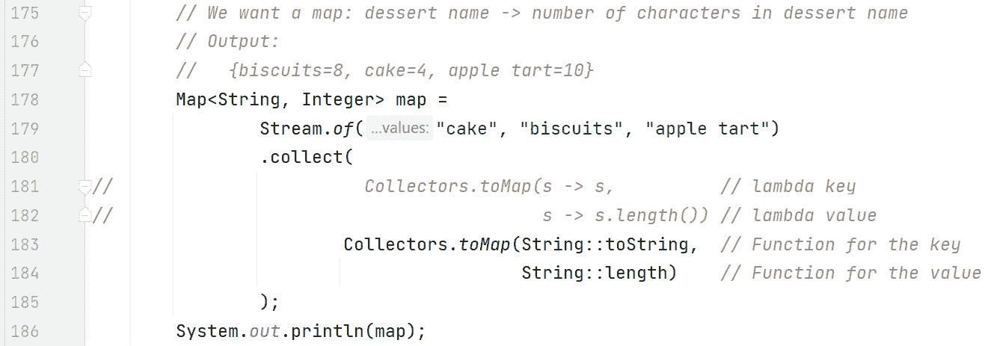

图 15.25 – 代码中的 Collectors.toMap(Function keyMapper, Function valueMapper)

在这个例子中，我们正在流式传输一个甜点列表（作为字符串）。声明的`Map`表明我们的键是`String`类型，值是`Integer`类型。这是因为我们想要设置一个`Map`，使得甜点名称是键，甜点名称中的字符数是值。

`Map`中的键是通过以下`Function`设置的：

```java
String::toString  // Function for key, same as: s -> s
```

回想一下，`Function<T, R>`接受一个类型为`T`的参数，并返回一个类型为`R`的结果。在这个例子中，我们的函数将是`Function<String, String>`，因为我们正在流式传输一个甜点（`String`），这是我们想要用作键的甜点。我们可以简单地使用 lambda 表达式`s -> s`或者使用`String::toString`方法引用。两种版本都可以工作。

Map 中的值是通过以下`Function`设置的：

```java
String::length     // Same as: s -> s.length()
```

在这种情况下，我们的函数是`Function<String, Integer>`，因为我们希望函数返回甜点的长度。我们可以使用 lambda 表达式`s -> s.length()`或者`String::length`方法引用。

生成的输出是：

```java
{biscuits=8, cake=4, apple tart=10}
```

在我们展示下一个版本之前，让我们看看一个会抛出异常的例子。*图 15.26*展示了代码中的例子（CollectorsExamples.java）：

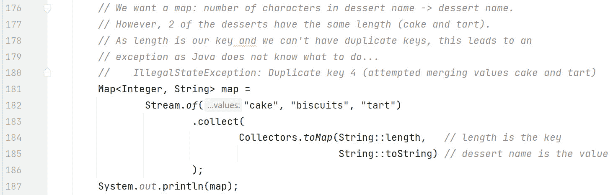

图 15.26 – Collectors.toMap(Function keyMapper, Function valueMapper)异常

在这个图中，我们试图设置一个`Map`，其中键是甜点名称的长度，值是甜点名称本身。请注意，甜点名称与上一图略有不同。现在，我们不再是`"apple tart"`，而是`"tart"`。这将导致问题。Map 不能有重复的键，而`"cake"`和`"tart"`都是 4 个字符长。这会导致`IllegalStateException`错误。

为了解决这个问题，我们需要使用`toMap()`的第二版。

### Collectors.toMap(Function, Function, BinaryOperator mergeFunction)

此收集器的工作方式与之前的收集器类似，除了当我们遇到重复键时。在这种情况下，合并函数应用于 *值*。合并函数是一个 `BinaryOperator<T,>`，它是一个 `BiFunction<T,T,T>`。换句话说，有两个输入和一个结果，它们都是同一类型。*图 15**.27* 展示了包含合并函数的代码（`CollectorsExamples.java`），用于处理重复键：

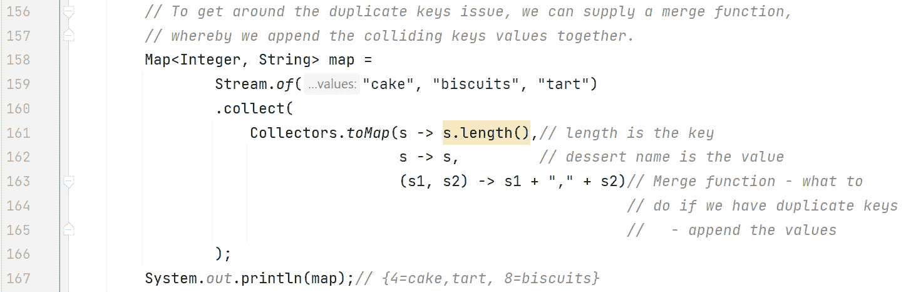

图 15.27 – Collectors.toMap(Function, Function, BinaryOperator)

在这个例子中，唯一的区别是合并函数：

```java
(s1, s2) -> s1 + "," + s2)
```

合并函数接收 `s1` 和 `s2`，两个冲突键的值。在这个例子中，值之间用逗号分隔进行追加。

生成的输出是：

```java
{4=cake,tart, 8=biscuits}
```

冲突键是 `4`，它们的值是 `"cake"` 和 `"tart"`，结果为 `"``4=cake, tart"`。

下一版本使我们能够指定我们想要的 `Map` 实现类型。

### Collectors.toMap(Function, Function, BinaryOperator, Supplier mapFactory)

如我们所知，返回的 `Map` 实现没有保证。您可能会得到 `HashMap` 或 `TreeMap` 实现之一。这个 `toMap()` 版本与上一个版本非常相似，只是多了一个额外的参数，我们可以指定我们的实现类型。*图 15**.28* 展示了使用构造方法引用确保 `TreeMap` 实现的代码（`CollectorsExamples.java`）：

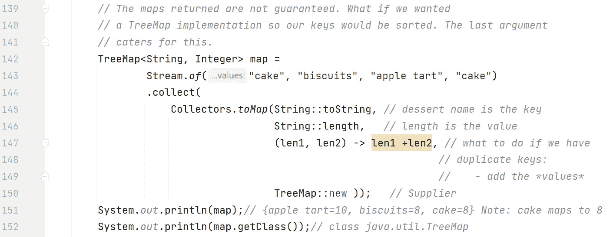

图 15.28 – Collectors.toMap(Function, Function, BinaryOperator, Supplier)

在这个图中，甜点名称是键，甜点名称的长度是值。`"cake"` 在源中出现了两次，导致重复键问题并调用合并函数。在这种情况下，重复键的值应该被添加。由于 `"cake"` 只出现两次，这意味着 `"cake=8"` 将在 `Map` 中。

在这个例子中，我们想要一个 `TreeMap` 实现类型。为了确保这一点，我们指定了一个额外的参数，以下 `Supplier`：

```java
   TreeMap::new
```

因此，我们的键将被排序。当我们输出我们的映射时，我们可以看到键是按字母顺序排序的，正如预期的那样：

```java
   {apple tart=10, biscuits=8, cake=8}
```

此外，请注意 `"cake"` 映射到 8（4 + 4）。

我们还可以使用 `getClass()` 方法来证明我们确实有一个 `TreeMap` 实现：

```java
   System.out.println(map.getClass());// java.util.TreeMap
```

现在，让我们来检查 `groupingBy` 终端操作。

### Collectors.groupingBy(Function classifier)

`groupingBy()` 操作告诉 `collect()` 将所有元素分组到一个 `Map` 实现中。`Function` 参数确定 `Map` 中的键。值是一个 `List`（默认）中所有匹配该键的条目。将值作为 `List` 返回，如我们所见，可以更改。不保证使用的 `Map` 或 `List` 实现类型。*图 15**.29* 展示了一个示例代码，取自存储库中的 `CollectorsExamples.java`：

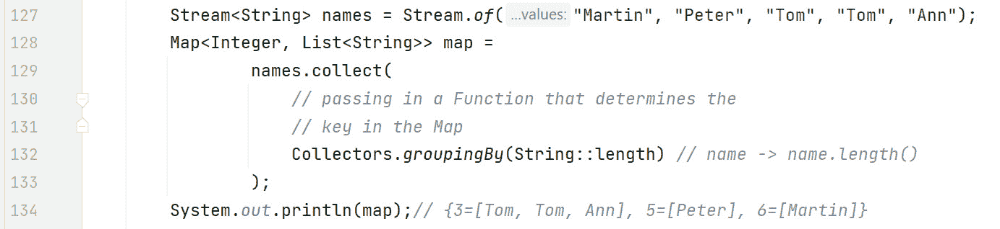

图 15.29 – 代码中的 Collectors.groupingBy(Function)

在这个例子中，我们正在流式传输一个姓名列表，并从流中提取一个`Map<Integer, List<String>`（如声明所示）。传递到`groupingBy()`的`Function`参数`String::length`告诉`collect()`，映射中的键是`String`的长度（实际上是名字中的字符数）。值组织成一个`List`，列表中的每个条目都是一个`String`，其长度与键匹配。例如，根据输出：

```java
   {3=[Tom, Tom, Ann], 5=[Peter], 6=[Martin]}
```

`5`映射到`"Peter"`，`6`映射到`"Martin"`。注意，在输出中，`"Tom"`在列表中出现了两次。这是因为列表允许重复。

如果我们希望输出列表中只出现一次`"Tom"`呢？`groupingBy()`有一个重载版本可以帮助我们。

### Collectors.groupingBy(Function keyMapper, Collector downstreamCollector)

回想一下，`Set`实现不允许重复，所以与默认的`List`相比，使用`Set`实现值将解决这个问题。这里的第二个参数被称为*下游收集器*。下游收集器的功能是对*值*执行一些特殊操作。在这个例子中，我们希望值以`Set`实现的形式组织。*图 15**.30*展示了代码（`CollectorsExamples.java`）调整：

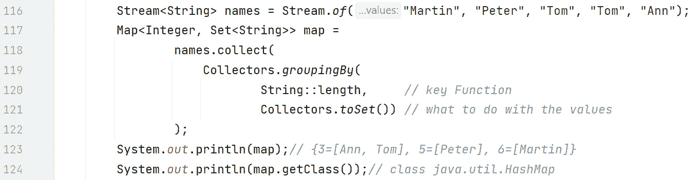

图 15.30 – 使用 Collectors.groupingBy(Function, Collector)进行 Set 实现

在这个例子中，`Map`中值的类型是`Set<String>`而不是`List<String>`。下游收集器：

```java
   Collectors.toSet()
```

表明我们希望值以`Set`的形式组织。输出显示 `"Tom"` 现在只列了一次：

```java
   {3=[Ann, Tom], 5=[Peter], 6=[Martin]}
```

注意，我们的`Map`的实现类型恰好是`HashMap`实现：

```java
   System.out.println(map.getClass());// java.util.HashMap
```

此实现没有保证。如果我们想保证`TreeMap`实现呢？这里有一个重载版本可以帮助我们。

### Collectors.groupingBy(Function, Supplier mapFactory, Collector)

此版本接受一个`Supplier`作为其第二个参数。此`Supplier`返回你想要的实现。

*图 15**.31*展示了代码调整（`CollectorsExamples.java`）：

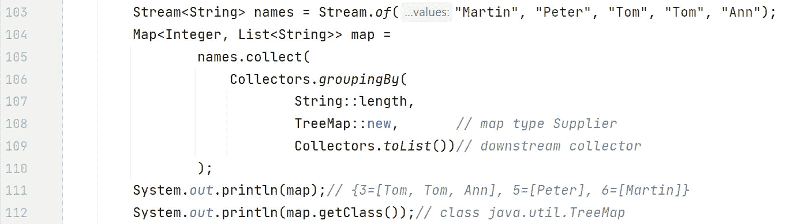

图 15.31 – 使用 Collectors.groupingBy(Function, Supplier, Collector)进行 TreeMap 实现

在这个例子中，我们正在将值重新转换为`List`类型：

```java
Map<Integer, List<String>> map
```

要将流数据提取为`List`类型，我们必须使用适当的下游收集器：

```java
Collectors.toList()
```

如输出所示：

```java
{3=[Tom, Tom, Ann], 5=[Peter], 6=[Martin]}
```

`"Tom"` 再次重复（因为列表允许重复）。

我们还向`groupingBy()`传递了一个`Supplier`参数，表示我们想要`TreeMap`实现：

```java
TreeMap::new
```

`map.getClass()` 调用输出：

```java
java.util.TreeMap
```

这表明我们有一个 `TreeMap` 实现。

现在，我们将探讨分组的一个特殊情况，称为分区。

### Collectors.partitioningBy(Predicate)

分区是分组的一个特殊情况，其中只有两个组 – true 和 false。因此，`Map` 实现中的键将是 `Boolean` 类型。值将默认为 `List` 类型。无法保证返回的 `Map` 或 `List` 实现。

*图 15.32* 展示了一个代码示例（CollectorsExamples.java）：

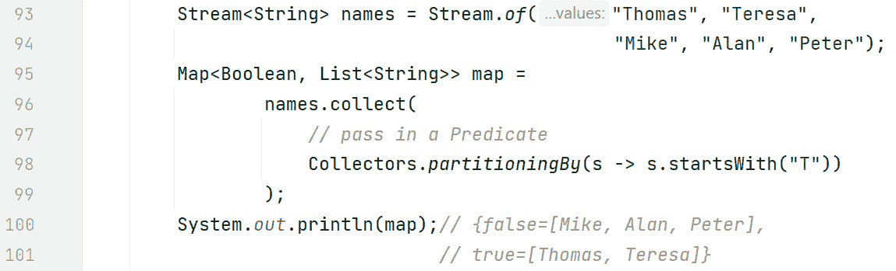

图 15.32 – 代码中的 Collectors.partitioningBy(Predicate)

在这个图中，我们将数据从流中提取到 `Map<Boolean, List<String>>`。键将是 true 和 false。值将是基于提供的谓词为 true 或 false 的流中的元素。

使用以下代码行，我们告诉 `collect()` 根据字符串名称是否以 `"T"` 开头来分区流：

```java
   Collectors.partitioningBy(s -> s.startsWith("T"))
```

如输出所示：

```java
   {false=[Mike, Alan, Peter, Alan], true=[Thomas, Teresa]}
```

真分区包含 `"Thomas"` 和 `"Teresa"`，而假分区包含所有其他名称。请注意，`"Alan"` 在假分区中出现了两次，因为列表允许重复。

`partitioningBy()` 有一个重载版本，使我们能够传递一个下游收集器。

### Collectors.partitioningBy(Predicate, Collector downstreamCollector)

下游收集器对于指定不同的值集合非常有用。例如，我们可能想要一个 `Set` 视图，以便自动删除重复项。*图 15.33* 展示了一个代码示例（CollectorsExamples.java）：

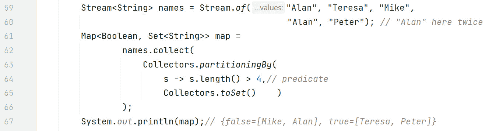

图 15.33 – 代码中的 Collectors.partitioningBy(Predicate, Collector)

在这个示例中，请注意，名称 `"Alan"` 在源中出现了两次：

```java
Stream.of("Alan", "Teresa", "Mike", "Alan", "Peter");
```

此外，我们还将数据收集到 `Map<Boolean, Set<String>>`。

我们也仅仅为了做一些不同的事情而更改了谓词：

```java
s -> s.length() > 4,// predicate
```

因此，如果字符串的字符数大于 `4`，则字符串将被放置在真分区中；否则，字符串将被放置在假分区中。

我们如下指定所需的下游收集器：

```java
Collectors.toSet()
```

这意味着值应以 `Set` 的形式返回。如输出所示，`"Alan"` 仅出现一次（在 `false` 分区中）：

```java
{false=[Mike, Alan], true=[Teresa, Peter]}
```

这完成了我们对终端操作部分的讨论，同时也结束了*第十五章*。现在，让我们将所学知识付诸实践，以巩固我们学到的概念。

# 练习

1.  创建一个恐龙名称的流（使用列表或数组）。使用 `filter` 方法创建一个新的流，该流仅包含肉食性恐龙的名称。然后，使用 `forEach` 方法打印出这些名称。

1.  通过从恐龙年龄列表创建流来演示流的惰性。使用`filter`方法过滤掉大于 100 岁的年龄，然后使用`map`方法将剩余的每个年龄增加 10。然而，不要使用任何终端操作。解释为什么直到调用终端操作（如`forEach`）之前不会打印任何内容或执行任何操作。

1.  使用恐龙重量流（作为双精度浮点数），使用过滤和计数终端操作来计算重量超过 5000 公斤的恐龙数量。

1.  给定一个恐龙物种名称流（字符串），使用`findFirst`终端操作检索列表上的第一个名称。

# 项目 – 动态恐龙护理系统

将 Stream API 集成到您的恐龙护理系统中，以处理大量的恐龙数据，例如健康记录、喂食时间表等。系统还应适当地采用`Optional`和并行流，优化数据处理并最小化潜在的空指针异常。

这里有一些步骤可以帮助你达到那里：

1.  `Dinosaur`类具有`name`、`species`、`healthStatus`等属性。还应该有一个`DinosaurCareSystem`类来实现主要功能。

1.  从记录列表中`Stream`，并使用`filter`方法获取这些记录。以下是一个示例：`List<HealthRecord> criticalRecords = records.stream().filter(r -> r.getHealthStatus() < CRITICAL_THRESHOLD).collect(Collectors.toList())`。

1.  使用`Stream`过滤时间表。以下是一个示例：`List<FeedingSchedule> morningFeeds = schedules.stream().filter(s -> s.getTime().isBefore(LocalTime.NOON)).collect(Collectors.toList())`。

+   使用`NullPointerException`和`Optional`来避免`NullPointerException`错误。以下是一个示例：`Optional.ofNullable(dinosaur.getTrainer()).map(Trainer::getName).orElse("No trainer assigned")`。*   在前面的示例中使用`stream()`和`parallelStream()`。然而，请注意，并非每个问题都适合并行处理。如果任务有依赖关系或需要按特定顺序处理，请坚持使用常规流。

# 摘要

在本章中，我们探讨了流和流终端操作的基本原理。流（以及 lambda 表达式）使一种称为函数式编程风格的编程方式成为可能，在这种风格中，你声明你想解决的问题，而不是如何解决它（命令式风格）。函数式编程风格通常更容易阅读，因为在命令式编程中，解决问题的细节可能会在实现中混淆。

我们使用流水线类比讨论了流管道。流管道由数据源、零个或多个中间操作以及一个终端操作组成，顺序依次排列。流是惰性评估的，这意味着数据仅在需要时才提供。这是可能的，因为 JVM 对整个管道有一个整体视图，因为直到终端操作执行之前，没有任何事情发生。

流源可以是从数组（`Arrays.stream(arrayToUse)`）、集合（`collectionToUse.stream()`）和文件（`Files.lines(Path)`）到可变数量的参数（`Stream.of(varargs)`）。可以使用 Stream API 中的两个`static`方法生成无限流：`Stream.generate()`和`Stream.iterate()`。

终端操作启动整个管道，每个管道都必须有一个终端操作。一旦在流上执行了终端操作，流就被关闭，必须重新流式传输才能重用。流行的终端操作包括`forEach()`、`count()`、`min()`、`max()`、`findAny()`、`findFirst()`、`allMatch()`、`anyMatch()`、`noneMatch()`、`reduce()`和`collect()`。

减少是一种特殊的终端操作，其中所有流项目都被组合成一个原始类型或`Object`。`reduce()`方法有重载版本以方便这一操作。`collect()`方法在从流中提取数据到集合（如`List`或`Map`）中非常有用。`collect()`方法接受收集器，您可以自己定义，或者可以简单地使用 API 中预定义的许多收集器之一。

这就完成了我们对流的基本原理的讨论。在下一章中，我们将扩展到更高级的流概念。
