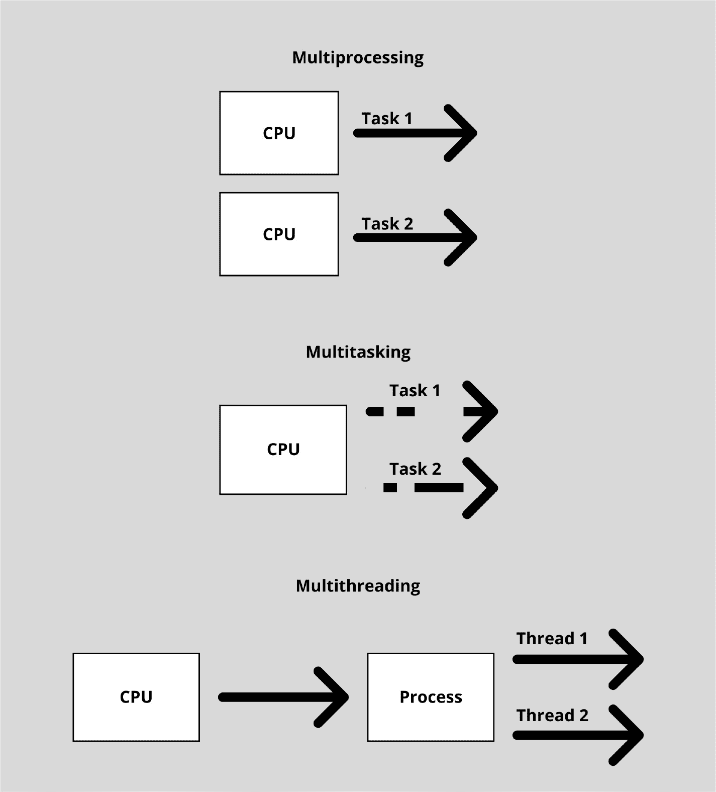

# 第十七章：并发

在上一章中，我们探讨了利用现代多核处理器的强大功能进行数据操作和并行操作的细微差别。这已经是对本章主题的初步介绍：并发！

并发允许应用程序同时执行多个任务。这使得系统更加高效。任何可用的资源都可以更有效地利用，这导致整体性能的提高。为了在 Java 中同时做很多事情，我们需要了解很多。这正是本章的目的！

下面是我们将要涵盖的内容：

+   并发的定义

+   与线程一起工作

+   原子类

+   同步关键字

+   使用锁进行线程独占访问

+   并发集合

+   使用 `ExecutorService`

+   常见的线程问题及其避免方法

这通常是一个令人畏惧（或线程化的？）的话题，尤其是对于新开发者来说，所以如果你需要反复阅读本章的部分内容，请不要气馁。我将尽力仔细地引导你了解你需要知道的所有概念。与你的应用程序不同，请专注于本章，并且不要同时做其他事情。让我们开始吧！

# 技术要求

本章的代码可以在 GitHub 上找到：[`github.com/PacktPublishing/Learn-Java-with-Projects/tree/main/ch17`](https://github.com/PacktPublishing/Learn-Java-with-Projects/tree/main/ch17)。

# 理解并发

你是否曾经想过一台计算机可以真正同时运行多少个任务？说“几个”可能很有诱惑力，然而，实际上，单核计算机在某一时刻只能执行一个进程。这可能会因为 CPU 在进程之间切换的速度之快而显得像是同时多任务处理，从而产生多任务处理的错觉。

并发是指同时执行多个任务或线程的概念，而不是按顺序执行。在顺序系统中，任务一个接一个地执行，每个任务在开始之前都要等待其前一个任务完成。

对于我们的 Java 应用程序来说，并发指的是同时执行程序的不同部分。这里的“同时”可能有点模糊，因为它可能意味着多种含义——这是因为并发可以在硬件级别发生，例如在多核处理器中，或者可以在软件级别发生。操作系统可以安排线程在不同的核心上运行。

我们具体指的是哪种并发类型取决于所采用的并发方式。它们的一个概述可以在*图 17**.1*中找到。这些可以是以下任何一种：

+   多进程

+   多任务处理

+   多线程

首先，让我们讨论多进程。

## 多进程

在**多进程**的背景下，多个 CPU 的存在使得同时执行多种进程变得容易。每个 CPU 独立执行自己的进程。为了从我们的日常生活中找到类比，考虑两个人管理一个家庭的情况，其中一个人忙于照顾孩子，而另一个人外出购物。他们都是“CPU”，同时并行处理独特的任务。

## 多任务

接下来的概念是**多任务**，其中“同时”这个词获得了一个稍微不同的含义。它意味着快速交替执行，而不是字面上的同时执行。想象一个场景，一个人在做饭的同时，不时地出去晾衣服（当然是在远离孩子的安全地方）。他们是“CPU”，在两个（或更多）任务之间不断切换，给人一种同时进步的错觉。然而，这并不完全构成并行执行，但确实是一种非常有效的资源利用方式。

## 多线程

最后但同样重要的是，我们有**多线程**——这恰好是我们的主要关注点。多线程涉及程序的不同部分在不同的执行线程上运行。这可以在单 CPU 和多 CPU 环境中发生。前面提到的两个日常场景都可以作为多线程的例子。



图 17.1 - 多进程、多任务和多线程的示意图

我们很快将深入探讨线程的概念。首先，让我们谈谈为什么我们需要在我们的应用程序（或者实际上是我们生活中！）中实现并发。

## 现代应用程序中并发的重要性

为了帮助您可视化计算中的并发，考虑您的计算机同时运行多个程序的方式。您可能同时运行浏览器、电子邮件客户端、文本编辑器、代码编辑器和 Slack。这种操作需要能够同时管理多个进程的能力。这种操作也存在于应用程序中，例如 IDE 在执行代码的同时处理您的输入。如果没有某种并发机制，停止具有无限循环的脚本将是不可能的，因为 IDE 会过于专注于无限循环的执行，而无法处理您点击按钮的操作。

让我们再思考一下网络服务；想象一个网络服务器同时处理数百甚至数千个请求。没有并发机制，这样的操作将是不切实际的，所以可以说，并发是我们日常计算机使用甚至日常生活中的一个基本方面！

让我们总结一下优势：

+   **性能提升**：应用程序可以更快地完成操作

+   **响应性**：即使在执行资源密集型任务时，应用程序也能保持响应（因为后台线程可以处理这些任务，而不会阻塞主线程）

+   **资源利用**：通过利用多核处理器和其他硬件资源，更有效地使用系统资源

这样的优势使得实时执行用例成为可能。在这个时候，你可能会非常热衷于并发。你应该这样！然而，在我们的 Java 应用程序中采用并发确实带来了一组自己的成本和复杂性。让我们来谈谈它。

## 并发编程的挑战

我以前说过，现在再说一遍：每个魔术技巧都有代价。虽然并发提供了许多好处，但它也引入了可能使并发编程复杂甚至容易出错的挑战。我们甚至有一些在并发环境中独有的错误。我们稍后会更详细地提到它们，但在深入之前，记住这些是有好处的：

+   **数据竞争**：当多个线程以非同步方式访问同一内存位置，并且至少有一个线程执行写操作时。例如，一个线程想要读取值并得出结论该值是 5，但另一个线程将其增加到 6。这样，前面的线程就没有最新的值。

+   **竞态条件**：由于事件的时间和顺序而出现的问题。这种问题的事件顺序可能会影响结果的正确性。竞态条件通常需要来自操作系统、硬件甚至用户的输入。例如，当两个用户试图使用相同的用户名同时注册时，这种情况可能会发生。如果处理不当，这可能会导致不可预测和不受欢迎的结果。

+   **死锁**：当两个或更多线程都在等待对方释放资源时，可能会发生死锁，导致应用程序无响应。例如，当你认为你的朋友会给你打电话，你一直等到他们这样做，而你的朋友认为你会给他们打电话，他们也一直等到你这样做，什么也没有发生，友谊就陷入了僵局。

+   **活锁**：与死锁类似，当两个或更多线程陷入循环，由于不断变化的条件而无法前进时，会发生活锁。比如说，你和你的朋友说你们会在市中心的一个教堂见面。你在教堂 *a*，你的朋友在教堂 *b*。你怀疑你的朋友是否在教堂 *b*，于是你走去那里。你的朋友怀疑你是否在教堂 *a*，也走去那里。（而你选择了不同的路线，没有碰到彼此。）你们在教堂没有找到对方，继续从教堂 *a* 走到教堂 *b*。这不是很有效的资源利用（但所有这些走路可能对你的健康都有好处！）

饥饿：当一个线程无法获得其进步所需的资源时，它可能会经历饥饿，导致应用程序性能下降和资源使用效率低下。一个现实生活中的例子可能是一个繁忙的酒吧，许多人试图从酒保那里获取饮料。酒吧里的人很多；这些人代表线程。酒保正在为那些喊得最响亮的人服务（相当于具有较高优先级的线程）。那个不出众的害羞的人会经历“饥饿”（或渴望），因为他无法访问共享资源（酒保）。

挑战是存在的！Java 提供了各种并发构造和工具，我们将在本章中探讨这些内容。我会不时地提到上述问题。在本章结束时，你甚至将看到一些破坏事物的例子！但首先，让我们谈谈并发的一个关键概念：线程！

# 线程的工作

让我们最终来解释一下*线程*。线程是一系列执行指令的序列，代表着执行的最基本单元。每个线程都遵循代码中的特定路径。线程在进程内执行特定任务。一个进程通常由多个线程组成。

例如，我们迄今为止创建的程序都有一个用户创建的线程（在这种情况下，用户是开发者）。线程按照一定的顺序遍历代码行；例如，当调用一个方法时，线程会在继续执行方法调用后直接位于方法之后的下一行代码之前执行该方法。这是线程的执行路径。

当多个线程运行时，代码中的多个执行路径正在被遍历，这就是为什么同一时间会发生多件事情的原因。

为了使这成为可能，我们需要某些 Java 结构的副本。例如，我们不能有两个线程使用相同的栈。这就是为什么每个线程都有自己的栈。我们不会深入探讨 Java 内存模型的细节。然而，至少要意识到，尽管每个线程都有自己的栈，但它们与其他线程共享堆。

为了让你们的大脑更容易消化，我们将用一些不太有趣但易于理解的例子来解释这个理论。我们将从线程开始。创建和启动线程有多种方式。让我们看看如何使用`Thread`类来创建一个线程。

## `Thread`类

创建线程最简单的方法之一是通过扩展`Thread`类。`Thread`类通过`run()`方法为线程的执行提供了一个入口点。要创建一个自定义线程，你需要定义一个`Thread`的子类，并用线程应该执行的代码覆盖`run()`方法。以下是一个用于演示的愚蠢示例：

```java
class MyThread extends Thread {    @Override
    public void run() {
        System.out.println("Hello from MyThread!");
    }
}
```

然后在某个其他类（或者甚至是在同一个类中，但这可能会令人困惑），我们可以创建一个新的`MyThread`，并通过`start()`方法启动线程执行：

```java
public class Main {    public static void main(String[] args) {
        MyThread myThread = new MyThread();
        myThread.start(); // starts the new thread
    System.out.println("Hello from Main!");
    }
}
```

这将输出以下两行，但我们无法确定它们的顺序：

```java
Hello from MyThread!Hello from Main!
```

`start()`方法是继承自我们的`Thread`类的一部分，用于启动一个新的线程。你也可以通过调用`myThread.run()`来执行`run()`方法的内容，但这不会启动一个新的线程！这将与执行`main`方法的同一个线程相同，这将执行`run()`方法的内容。

我们以这种方式创建线程是因为它最容易理解。这绝对不是最常见的方式。更常见的是实现`Runnable`接口。让我们看看如何实现它。

## 可运行的接口

创建线程的另一种方法是实现`Runnable`接口。这是一个内置的函数式接口，可以用于在 Java 中创建线程。`Runnable`接口有一个单一的方法`run()`，当你扩展此接口时，必须在你的类中实现此方法。与扩展`Thread`类不同，你将你的`Runnable`实现实例传递给`Thread`对象。以下是一个示例：

```java
class MyRunnable implements Runnable {    @Override
    public void run() {
        System.out.println("Hello from MyRunnable!");
    }
}
```

再次强调，我们现在可以在另一个位置实例化`MyRunnable`。然而，第二步是不同的；我们将实例化`Thread`类，并将我们的`MyRunnable`实例传递给其构造函数。这样，当我们启动线程实例时，我们在`Runnable`实例的`run()`方法中指定的任何内容都将被执行：

```java
public class Main {    public static void main(String[] args) {
        MyRunnable myRunnable = new MyRunnable();
        Thread thread = new Thread(myRunnable);
        thread.start(); // starts the new thread
    }
}
```

这将输出以下内容：

```java
Hello from MyRunnable!
```

再次强调，为了执行`MyRunnable`的`run`方法中的内容，我们本来可以写`myRunnable.run()`，但这也不会启动一个新的线程！让我们证明我们实际上启动了一个新的线程。每个线程都有一个唯一的 ID。通过在`run`方法中输出线程的 ID，我们可以证明它是一个不同的线程。以下是调整后的示例：

```java
class MyRunnable implements Runnable {    @Override
    public void run() {
        System.out.println("Hello from thread: " + Thread.
          currentThread().threadId());
    }
}
```

下面是我们的调整后的`Main`类：

```java
public class Main {    public static void main(String[] args) {
        System.out.println("Hello from main: " + Thread.
          currentThread().threadId());
        MyRunnable myRunnable = new MyRunnable();
        Thread thread = new Thread(myRunnable);
        thread.start(); // starts the new thread
    }
}
```

这将打印以下内容：

```java
Hello from main: 1Hello from thread: 22
```

请注意，对于你来说，ID 可能不同，但它们也将是两个不同的线程。由于 Java 启动的一些后台线程（如垃圾收集器）的原因，线程 ID 在多次执行中保持一致。假设我们将`start()`方法改为`run()`，如下所示：

```java
public static void main(String[] args) {        System.out.println("Hello from main: " + Thread.
          currentThread().threadId());
        MyRunnable myRunnable = new MyRunnable();
        Thread thread = new Thread(myRunnable);
        thread.run(); // doesn't start a new thread
    }
```

ID 是相同的；这是结果：

```java
Hello from main: 1Hello from thread: 1
```

这已经相当常见了，但更常见的情况是我们不创建一个`Runnable`的类，而是使用 Lambda 表达式实现`Runnable`。你可能还记得从第十五章和第十六章的 Lambda 表达式章节中，我们可以使用 Lambda 表达式实现任何函数式接口。让我们看看这是如何实现的。

## 带有 Runnable 的 Lambda 表达式

由于`Runnable`接口是一个只有一个方法的函数式接口，你可以使用 Lambda 表达式更简洁地创建和运行线程。以下是一个使用 Lambda 表达式的示例：

```java
public static void main(String[] args) {    Runnable myRunnable = () -> System.out.println("Hello
      from a lambda Runnable!");
    Thread thread = new Thread(myRunnable);
    thread.start(); // starts the new thread
}
```

如你所见，我们不再需要为`Runnable`创建一个单独的类。我们可以在*现场*完成它。以下是输出：

```java
Hello from a lambda Runnable!
```

正如我之前提到过几次，如果你使用`run()`而不是`start()`，在这种情况下你会得到相同的输出，但这并不是由一个新线程完成的。

这些是创建线程的基本方法。让我们看看我们如何通过`sleep()`和`join()`来控制执行。所以，和我一起进入睡眠状态吧！

# 线程管理——sleep()和 join()

这可能是一个奇怪的说法，但线程可以进入*睡眠*状态。这意味着线程的执行会暂停一段时间。在我们深入探讨如何做到这一点之前，值得注意的是，这通常被认为是一种代码异味。这意味着它可能是解决数据竞争或加载时间挑战等问题的有问题的解决方案。然而，有时你将需要这样做——例如，为了减慢后台线程。只是确保在这里谨慎行事。现在让我们看看我们如何让我们的线程进入睡眠状态。

## Thread.sleep()方法

`Thread.sleep()`方法是一个静态方法，它会导致当前正在执行的线程进入睡眠状态。这意味着暂停其执行一段时间。这对于模拟延迟、允许其他线程执行或执行基于时间的操作很有用。`sleep()`方法接受一个单一参数，即睡眠的持续时间（以毫秒为单位）。以下是一个示例：

```java
public class Main {    public static void main(String[] args) {
        Thread t = new Thread(() -> {
            try {
      // Next two lines represent the same Java line
                System.out.println("Thread will go to sleep
                  for 2 seconds...");
                Thread.sleep(2000);
                System.out.println("*Yawn...* I'm awake!");
            } catch (InterruptedException e) {
                e.printStackTrace();
            }
        });
        t.start();
    }
}
```

我们需要在这里使用`try`/`catch`块，因为`sleep()`可以被中断。这种中断会导致检查型异常`InterruptedException`被抛出。

## 处理`InterruptedException`

假设主线程决定执行时间过长并想要结束程序，它可以通过使用`interrupt`方法建议次级线程停止。如果实例被命名为 t，这可以通过`t.interrupt()`来实现。中断一个正在睡眠的线程会抛出`InterruptedException`。

这是一个检查型异常，如果你使用`Thread.sleep()`方法，你必须处理它。我们也可以让我们的线程等待另一个线程完成。这是通过`join()`方法完成的。

## 使用`join()`方法

线程可以等待另一个线程完成。`join()`方法允许调用线程等待直到指定的线程完成其执行。这在需要确保在继续之前特定线程已完成其工作时很有用。以下是一个示例，其中主线程正在等待线程`t1`：

```java
public class Main {    public static void main(String[] args) {
        Thread t1 = new Thread(() -> {
            System.out.println("t1 started");
            try {
                Thread.sleep(2000);
            } catch (InterruptedException e) {
                e.printStackTrace();
            }
            System.out.println("Thread finished!");
        });
        t1.start();
        try {
            System.out.println("Main thread will be waiting
              for other t1 to be done...");
            t1.join();
            System.out.println("Main thread continues...");
        } catch (InterruptedException e) {
            e.printStackTrace();
        }
    }
}
```

这将输出以下内容：

```java
Main thread will be waiting for other t1 to be done...t1 started
t1 finished!
Main thread continues...
```

因此，如您所见，调用了`t1.join()`。这使得主线程等待`t1`完成执行（包括 2 秒的睡眠时间）之后，主线程才继续。主线程也可以通过调用`t1.join(1000)`来等待指定的时间，例如 1 秒。这要安全一些，因为如果`t1`由于某种原因无限期地挂起，我们的程序会卡住。你应该尝试移除`join()`并运行程序几次，以检查行为并看你是否能让它无限期地挂起。

如您所见，当我们使用`join()`方法时，也需要捕获`InterruptedException`。这是在调用线程在等待其他线程完成时被中断的情况下。

让我们看看如何避免（或解决）并发环境中读写操作的一些常见问题。

# 原子类

在并发程序中，数据完整性可能很容易成为问题。想象两个线程读取一个值，然后都更改它，并在之后立即覆盖彼此的更改。例如，这可能导致计数器最终只增加了一个，而它应该是增加两个。数据完整性丢失！这就是原子类发挥作用的地方。

原子类用于原子操作。这意味着读取（获取值）和写入（更改值）被视为一个操作，而不是两个独立的操作。这避免了我们刚刚演示的数据完整性问题。我们将简要讨论如何使用`AtomicInteger`、`AtomicLong`和`AtomicReference`。

## AtomicInteger、AtomicLong 和 AtomicReference

有几个原子类用于基本数据类型。我们有`AtomicInteger`来表示整数值并支持对其执行原子操作。同样，我们有`AtomicLong`用于`Long`类型。我们有`AtomicReference`用于对象的引用并支持对其执行原子操作。

这些原子类提供了执行原子操作的方法，例如`get`、`set`、`compareAndSet`以及各种算术操作。让我们看看一个没有`AtomicInteger`会出问题的例子：

```java
public class ExampleAtomicInteger {    private static AtomicInteger counter = new
      AtomicInteger(0);
    public static void main(String[] args) throws
      InterruptedException {
        Thread thread1 = new Thread(() -> {
            for (int i = 0; i < 10000; i++) {
                counter.getAndIncrement();
            }
        });
        Thread thread2 = new Thread(() -> {
            for (int i = 0; i < 10000; i++) {
                counter.getAndIncrement();
            }
        });
        thread1.start();
        thread2.start();
        thread1.join();
        thread2.join();
        System.out.println("Counter value: " + counter);
    }
}
```

此代码将打印以下输出：

```java
Counter value: 20000
```

没有使用`AtomicInteger`，程序结束时`counter`的值可能会有所不同。它可能是 14387、15673、19876 等等。（它不能超过 20000）。这是因为多个线程会同时读取它（所以读取相同的值），然后在下一个操作中更新它，从而可能写入一个比`counter`当前值更低的值。

为了说明，想象一下。你和两个朋友在一个房间里。桌子上有一个帽子，里面有一张纸。纸是折叠的，上面有一个数字，数字 4。你们三个人都需要将值增加 1。如果你的朋友读取了值，然后把它放回帽子，然后开始在房子里找纸和笔。你的另一个朋友可能在你的朋友有机会增加数字之前就读取了值。你的另一个朋友有一张纸和一支笔可用（真是个好朋友，不与另一个朋友分享），并用新值 5 替换了纸条。然后你接着去，读取值，看到它是 5，拿出你的纸和笔，写下数字 6 并将其放入帽子。然后你的另一个朋友最后回来，并更新纸条的新值，根据他阅读时的知识，应该是 5。帽子中的最终值是 5。尽管之前是 6，但它又回到了 5。你和你的朋友的行为就像线程，它们将读取和写入视为两个不同的操作。

假设你们不仅是朋友，而且是原子朋友。这意味着你们会将读取和写入视为一个动作。所以，在读取之后，你们不会在更新新值之前将纸条放回帽子中。因此，现在，如果你们所有人都必须将其增加 1，就不会有混淆，值最终会是 7。

我们可以使用原子类以 Java 方式完成这项操作。在上面的代码片段中，`getAndIncrement` 方法确保两个线程不能同时访问计数器，并保证计数器将具有正确的值。这是因为获取和增加不是两个独立的操作，而是一个原子操作。这就是为什么原子类在需要确保在不使用显式同步的情况下消费共享资源的多线程环境中特别有用。然而，我们始终可以使用显式同步。接下来，让我们探讨 `synchronized` 关键字。

# `synchronized` 关键字

正如我们刚才看到的，与许多线程一起工作可能会带来潜在的新问题，例如数据完整性。`synchronized` 关键字是 Java 中的一个关键字，它使用锁机制来实现同步。它用于控制不同线程对代码关键部分的访问。当一个线程在同步方法或块内部时，其他线程不能进入同一对象的任何同步方法。

为了理解同步的需求，让我们考虑另一个简单的并发计数场景，其中可能会出现意外结果。我们有一个名为 `Count` 的类，其中有一个静态的 `counter` 变量。这个类还有一个方法，`incrementCounter`，它将 `counter` 的值增加 1：

```java
public class Count {    static int counter = 0;
    static void incrementCounter() {
        int current = counter;
        System.out.println("Before: " + counter + ",
          Current thread: " + Thread.currentThread()
            .threadId());
        counter = current + 1;
        System.out.println("After: " + counter);
    }
}
```

这个程序在单线程环境中以`for`循环运行 10 次，将按预期行为，将计数器顺序地从 0 增加到 10。线程的 ID 值也将相同，因为它是单线程。

```java
Before: 0, Current thread: 1After: 1
Before: 1, Current thread: 1
After: 2
Before: 2, Current thread: 1
After: 3
Before: 3, Current thread: 1
After: 4
Before: 4, Current thread: 1
After: 5
Before: 5, Current thread: 1
After: 6
Before: 6, Current thread: 1
After: 7
Before: 7, Current thread: 1
After: 8
Before: 8, Current thread: 1
After: 9
Before: 9, Current thread: 1
After: 10
```

现在，想象一下，我们不是在一个单线程环境中，而是有 10 个线程，每个线程的任务是增加`counter`：

```java
public class Main {    public static void main(String[] args) {
        for (int i = 0; i < 10; i++) {
            new Thread(Count::incrementCounter).start();
        }
    }
}
```

现在我们遇到了一个问题！这是我的输出（你的可能不同！）：

```java
Before: 0, Current thread: 26Before: 0, Current thread: 29
Before: 0, Current thread: 22
Before: 0, Current thread: 30
Before: 0, Current thread: 25
Before: 0, Current thread: 31
Before: 0, Current thread: 23
Before: 0, Current thread: 24
Before: 0, Current thread: 27
Before: 0, Current thread: 28
After: 1
After: 1
After: 1
After: 1
After: 1
After: 1
After: 1
After: 1
After: 1
After: 1
```

输出变得不可预测，这是因为一种称为*线程干扰*的现象。在多线程环境中，多个线程可能同时读取和增加`counter`的值。这种并发修改可能导致意外结果，造成数据完整性的丢失。这又是由于竞争条件引起的。我们已经看到如何通过使用原子类来解决这个问题，但我们也可以通过同步方法来解决。最佳选择是允许代码的大部分部分有多个线程，而不创建数据完整性问题。对于这种情况，那就是原子类。然而，这是一个很好的例子，可以展示`同步`关键字是如何工作的。

## 使用同步方法

要创建一个同步方法，你只需在方法定义之前添加`同步`关键字。这确保了对于给定的对象实例，一次只有一个线程可以执行该方法。以下是更新后的示例：

```java
public class Count {    static int counter = 0;
    static synchronized void incrementCounter() {
        int current = counter;
        System.out.println("Before: " + counter + ",
          Current thread: " + Thread.currentThread()
            .threadId());
        counter = current + 1;
        System.out.println("After: " + counter);
    }
}
```

在这种情况下，如果多个线程同时调用`incrementCounter()`方法，`同步`关键字确保一次只有一个线程可以访问该方法。这防止了竞争条件。在不修改`Main`类的情况下，这将产生以下输出（你的线程 ID 可能不同）：

```java
Before: 0, Current thread: 22After: 1
Before: 1, Current thread: 31
After: 2
Before: 2, Current thread: 30
After: 3
Before: 3, Current thread: 29
After: 4
Before: 4, Current thread: 28
After: 5
Before: 5, Current thread: 27
After: 6
Before: 6, Current thread: 26
After: 7
Before: 7, Current thread: 25
After: 8
Before: 8, Current thread: 24
After: 9
Before: 9, Current thread: 23
After: 10
```

你可以想象，同步整个方法可能是不高效的。因为这会使所有线程在方法外部等待，并可能成为性能的瓶颈。很可能方法中的一部分代码可以在不威胁数据完整性的情况下由多个线程同时执行。有时，你可能只需要同步方法的一部分。这可以通过同步块来实现。

## 使用同步块

在某些情况下，你可能只想同步方法的一部分，而不是整个方法。为此，你可以使用一个*同步块*。同步块需要一个对象来锁定，并且代码块在持有锁的情况下执行。以下是一个示例：

```java
class Counter {    private int count;
    public void increment() {
        synchronized (this) {
            count++;
        }
    }
    public int getCount() {
        synchronized (this) {
            return count;
        }
    }
}
```

在这个代码片段中，`increment()`和`getCount()`方法使用同步块而不是同步方法。结果是相同的——在多线程环境中，`count`变量被安全地访问和修改。

## 同步方法与同步块的比较

最小化同步的范围是一种最佳实践，可以提高性能并减少线程之间的竞争。这个概念与**锁粒度**密切相关，它指的是被锁定代码的大小或范围。粒度越细，锁定的部分越小，允许更多的线程并行执行，而不必互相等待。

将大量代码或整个方法同步化被认为是粗粒度锁定，可能会导致性能下降。在这种情况下，多个线程可能会排队等待单个锁被释放，这可能会创建瓶颈。虽然粗粒度锁定对于确保数据完整性可能是必要的，但它应该谨慎使用，并且只有在没有其他选择的情况下才使用。

另一方面，细粒度锁定涉及使用同步块将同步的范围限制在最小的可能关键部分。这允许更好的并发性，因为线程不太可能因为等待锁而被阻塞，从而提高系统的吞吐量。

因此，为了在不牺牲数据完整性的情况下实现最佳性能，应尽可能使用同步块来实现细粒度锁定。这与最小化同步范围的原则相吻合。`synchronized`关键字提供了一种低级同步机制。对于更复杂的情况，考虑使用更高级的并发构造，例如`Lock`接口或并发集合。接下来，让我们看看`Lock`接口！

# 锁定接口

让我们谈谈`Lock`接口。这是处理并发控制的`synchronized`关键字的替代方案。虽然`synchronized`帮助我们实现线程安全，但它也引入了一些缺点：

+   线程在等待锁时会被阻塞，这可能会浪费处理时间

+   没有机制可以检查锁是否可用，或者如果锁被持有时间过长则超时

如果需要克服这些限制，可以使用提供更多同步控制的内置`Lock`接口的实现。我们将讨论最常见的一种实现：`ReentrantLock`。

## ReentrantLock

`ReentrantLock`类是`Lock`接口的一个流行实现。`ReentrantLock`用于保护代码的一部分，类似于`synchronized`，但通过其方法提供了额外的功能：

+   `lock()`：此方法锁定锁

+   `unlock()`：此方法释放锁

+   `tryLock()`：此方法尝试获取锁，并返回一个布尔值，指示是否获取了锁

+   `tryLock(time, unit)`：此方法尝试在指定的时间内获取锁

让我们更新我们用来演示`ReentrantLock`的同步关键字的示例：

```java
import java.util.concurrent.locks.Lock;import java.util.concurrent.locks.ReentrantLock;
public class Count {
    static int counter = 0;
    static Lock lock = new ReentrantLock();
    static void incrementCounter() {
        try {
            lock.lock();
            int current = counter;
            System.out.println("Before: " + counter + ",
              Current thread: " + Thread.currentThread()
                .threadId());
            counter = current + 1;
            System.out.println("After: " + counter);
        } finally {
            lock.unlock();
        }
    }
}
```

在前面的代码片段中，我们用`ReentrantLock`替换了`synchronized`块。我们在临界区之前锁定`Lock`，并在`finally`块之后解锁。在`finally`块中的解锁至关重要；否则，当发生异常时，锁不会被释放。

`Main`类保持不变：

```java
public class Main {    public static void main(String[] args) {
        for (int i = 0; i < 10; i++) {
            new Thread(Count::incrementCounter).start();
        }
    }
}
```

这一切运作得就像魔法一样。以下是输出结果：

```java
Before: 0, Current thread: 22After: 1
Before: 1, Current thread: 23
After: 2
Before: 2, Current thread: 24
After: 3
Before: 3, Current thread: 25
After: 4
Before: 4, Current thread: 26
After: 5
Before: 5, Current thread: 27
After: 6
Before: 6, Current thread: 28
After: 7
Before: 7, Current thread: 29
After: 8
Before: 8, Current thread: 30
After: 9
Before: 9, Current thread: 31
After: 10
```

但如果块已经被锁定呢？我们不想无限期地等待。在这种情况下，可能最好使用`tryLock`。如果锁不可用，线程可以继续执行其他任务。这是与使用`synchronized`关键字相比的一个优点！以下是更新后的代码：

```java
public class Count {    static int counter = 0;
    static Lock lock = new ReentrantLock();
    static void incrementCounter() {
        if (lock.tryLock()) {
            try {
                int current = counter;
                System.out.println("Before: " + counter +
                  ", Current thread: " + Thread.
                    currentThread().threadId());
                counter = current + 1;
                System.out.println("After: " + counter);
            } finally {
                lock.unlock();
            }
        } else {
            System.out.println("Thread didn't get the lock
              and is looking for a new task.");
        }
    }
}
```

如您所见，我们用`tryLock()`包围了`try`块。如果锁不可用，线程将继续执行其他工作。我们也可以使用`tryLock(time, unit)`方法等待特定时间的锁。

由于本书的范围，我们不会深入探讨，但还有其他锁可用——例如，`ReadWriteLock`接口。它将读操作和写操作分开，允许多个并发读取但独占写入。这可以在读取密集型工作负载中提高性能。

## 使用锁的最佳实践

当使用`Lock`接口工作时，需要牢记以下几点最佳实践：

+   总是在`finally`块中解锁，以确保即使在异常情况下也能释放锁。

+   使用`tryLock()`进行非阻塞操作，这有助于避免死锁并提高性能。

+   尽管我们没有详细讨论，但考虑在读取密集型工作负载中使用`ReadWriteLock`。这允许并发读取和独占写入。这可以提高应用程序的吞吐量。

关于锁的话题就到这里吧！让我们谈谈在 Java 中处理并发性的另一个关键工具：并发集合！

# 并发集合

多线程环境对于性能很重要，但在任何多线程环境中，数据完整性都成为一个需要考虑的问题。想象一下这种情况：你有几个线程正在与一个共享数据结构（如`ArrayList`或`HashMap`）交互。当一个线程可能正在尝试从结构中读取数据时，另一个线程可能正在写入它。这可能导致数据不一致和其他类型的错误。

在这种情况下出现的一个常见问题是并发修改异常。这发生在当一个线程正在遍历一个数据结构时，另一个线程试图修改它。Java 意识到这可能导致不一致性，并抛出异常以防止这种危险的操作。

考虑以下示例，其中使用了`HashMap`：

```java
Map<String, String> languageMap = new HashMap<>();languageMap.put("Maaike", "Java");
languageMap.put("Seán", "C#");
for (String key : languageMap.keySet()) {
    System.out.println(key + " loves coding");
    languageMap.remove(key);
}
```

在这个例子中，我们试图在过程中遍历`HashMap`并删除一个条目。这将抛出`ConcurrentModificationException`。

你可能已经猜到了；这正是为什么我们有并发集合。并发集合，如 `ConcurrentHashMap`，是 `HashMap` 的线程安全替代品，这意味着它可以处理来自多个线程的并发读取和写入。使用 `ConcurrentHashMap`，你可以在遍历地图的同时修改它：

```java
ConcurrentMap<String, String> languageMap = new  ConcurrentHashMap<>();
languageMap.put("Maaike", "Java");
languageMap.put("Seán", "C#");
for (String key : languageMap.keySet()) {
    System.out.println(key + " loves coding");
    languageMap.remove(key);
}
```

这次我们不会得到 `ConcurrentModificationException`。`ConcurrentHashMap` 允许我们在迭代时移除项目。

不仅如此！并发集合还提供了另一个优势。它们允许我们基于段进行锁定。这意味着多个线程可以同时具有读取访问权限，这可以在不牺牲数据完整性的情况下提高性能。

## 并发集合接口

在 `java.util.concurrent` 包中，有几个接口旨在促进集合上的并发操作。我们将讨论的两个主要接口是 `ConcurrentMap` 和 `BlockingQueue`。

### ConcurrentMap

`ConcurrentMap` 是标准 `java.util.Map` 的子接口。它提供了对键值对进行添加、删除和替换的原子操作，增强了线程安全性。`ConcurrentMap` 的两种主要实现是 `ConcurrentHashMap` 和 `ConcurrentSkipListMap`。它的工作方式与常规 `Map` 非常相似：

```java
ConcurrentMap<String, String> map = new  ConcurrentHashMap<>();
map.put("Nadesh", "PHP");
String language = map.get("Nadesh");  // Returns "PHP"
```

`ConcurrentHashMap` 是一种线程安全的 `Map` 实现，其性能优于 `Hashtable`（一种较老的线程安全替代品）。它允许并发读取和写入，最小化竞争。

### 阻塞队列

`BlockingQueue` 是另一个接口，是 `Queue` 的子类型，针对多线程操作进行了优化。与标准队列不同，当尝试向满队列添加元素或从空队列中检索元素时，`BlockingQueue` 将会阻塞或超时：

```java
BlockingQueue<String> queue = new LinkedBlockingQueue<>();queue.offer("Maria");
String name = queue.poll();
```

这些接口提供了在多线程环境中工作时非常有价值的功能，提高了性能和数据完整性。

在未来，你可能会遇到相当多的其他并发集合实现，它们的工作方式与它们的非并发对应物非常相似。我们将讨论两个类别：`SkipList` 和 `CopyOnWrite` 集合。

## 理解 SkipList 集合

`ConcurrentSkipList` 集合表示自然排序的集合，这意味着它们以排序的方式维护其元素。`ConcurrentSkipListSet` 和 `ConcurrentSkipListMap` 是两种最常见的 `ConcurrentSkipList` 集合。它们的工作方式与我们习惯的集合非常相似。

### ConcurrentSkipListSet

使用 `ConcurrentSkipListSet` 与使用 `TreeSet` 相同，但它针对并发使用进行了优化。让我们看看一个例子：

```java
Set<String> set = new ConcurrentSkipListSet<>();set.add("Gaia");
set.add("Jonas");
set.add("Adnane");
for (String s : set) {
    System.out.println(s);
}
```

在前面的代码块中，当你打印集合时，元素将以它们的自然顺序显示：`Adnane`、`Gaia` 和 `Jonas`。

### ConcurrentSkipListMap

`ConcurrentSkipListMap` 的工作方式与 `TreeMap` 类似，但它是为并发操作设计的。像 `ConcurrentSkipListSet` 一样，映射条目按照其键的自然顺序维护：

```java
Map<String, String> map = new ConcurrentSkipListMap<>();map.put("Flute", "Nabeel");
map.put("Bass", "Job");
map.put("Piano", "Malika");
for (String s : map.keySet()) {
    System.out.println(s + ": " + map.get(s));
}
```

在此代码中，映射条目按照键的字母顺序打印：`Bass`、`Flute` 和 `Piano`。

## 理解 CopyOnWrite 集合

如其名称所示，`CopyOnWrite` 集合在每次修改时都会创建集合的新副本。这意味着当读操作多于写操作时，它们表现良好，但当写操作多于读操作时，可能会效率低下。让我们讨论常见的实现。

### CopyOnWriteArrayList

`CopyOnWriteArrayList` 的工作方式与常规 `ArrayList` 相同，但每次修改列表时都会创建列表的新副本：

```java
List<String> list = new CopyOnWriteArrayList<>();list.add("Squirrel");
list.add("Labradoodle");
list.add("Bunny");
for (String item : list) {
    System.out.println(item);
    list.add(item);
}
System.out.println(list);
```

即使我们在迭代过程中修改列表，也不会导致 `ConcurrentModificationException`，因为修改时创建了一个列表的新副本。

### CopyOnWriteArraySet

`CopyOnWriteArraySet` 与 `HashSet` 类似，但每次修改集合时都会创建一个新的副本：

```java
Set<String> set = new CopyOnWriteArraySet<>();set.add("Dog");
set.add("Cat");
set.add("Horse");
for (String s : set) {
    System.out.println(s);
    set.add(s);
}
System.out.println(set);
```

在前面的代码中，由于集合只包含唯一对象，因此循环结束后集合的大小保持不变。

## 同步集合

*同步集合* 是在多线程环境中使用集合的另一种方式。`Collections` 类提供了几个静态方法，用于返回常规集合（如 `List`、`Set` 和 `Map`）的同步版本。以下是一个 `List` 的示例：

```java
List<String> regularList = new ArrayList<>();List<String> syncList =
  Collections.synchronizedList(regularList);
```

在这个例子中，`syncList` 是 `regularList` 的线程安全版本。当需要将现有的集合转换为线程安全集合时，这些同步集合是一个不错的选择，但如果知道集合在创建时将在多线程环境中使用，则最好使用并发集合，因为它们的性能更好。

同步集合和并发集合之间最重要的区别是，同步集合不能在循环中修改，否则会抛出 `ConcurrentModificationException`。在其他方面，它们是安全的，并且在使用多个线程时不会导致数据完整性问题。手动管理大量线程将是一项相当艰巨的任务。幸运的是，有一个特殊的接口 `ExecutorService`，可以帮助我们完成这项任务！

# ExecutorService 和线程池

Java 的 `ExecutorService` 是异步执行任务的机制。作为 `java.util.concurrent` 包的一部分，`ExecutorService` 是一个用于在多线程环境中管理和控制线程执行的接口。我们迄今为止已经看到了如何手动控制线程，现在我们将看到如何使用 `ExecutorService`。我们将看到 `ExecutorService` 及其实现（如 `SingleThreadExecutor` 和 `ScheduledExecutorService`）的详细信息。让我们首先看看 `SingleThreadExecutor`。

## 使用 SingleThreadExecutor 执行任务

首先，让我们从`SingleThreadExecutor`开始。这个`ExecutorService`有一个单独的工作线程来处理任务，保证任务按照提交的顺序执行。当我们需要顺序执行时，它很有用。

考虑一个选举场景，其中正在计算选票。为了模拟这个过程，我们将每个投票表示为一个任务。为了简单起见，让我们假设我们正在计算一个候选人的选票。

我们可以这样做到：

```java
import java.util.concurrent.ExecutorService;import java.util.concurrent.Executors;
public class VoteCounter {
    public static void main(String[] args) {
        ExecutorService executor = Executors.
          newSingleThreadExecutor();
        // Submitting tasks
        for(int i=1; i<=4; i++) {
      // We must create a new variable to use in the
      // lambda, because variables in lambdas must be
      // effectively final. And i is not.
            int voteId = i;
            executor.execute(() -> {
                System.out.println("Vote " + voteId + "
                  counted by " + Thread.currentThread().
                    threadId());
            });
        }
        // Remember to shutdown the executor
        executor.shutdown();
    }
}
```

在前面的代码块中，我们首先创建了一个`SingleThreadExecutor`实例。然后提交了四个任务，每个任务代表一个正在计算的投票。请注意，我们使用`executor.execute()`，传递一个`Runnable` lambda 函数作为参数。这个函数打印投票编号和处理的线程 ID。最后，我们使用`executor.shutdown()`关闭`ExecutorService`。这是至关重要的，因为要终止执行器的非守护线程，否则将阻止您的应用程序终止。非守护线程是一种阻止程序结束的线程。当你忘记这样做时，你会看到一旦运行程序，它就不会停止。停止按钮将保持可见。

这是我输出的结果（对我来说）：

```java
Vote 1 counted by 22Vote 2 counted by 22
Vote 3 counted by 22
Vote 4 counted by 22
```

如您所见，它将计算四个投票，每次打印相应的投票编号和相同的线程 ID，因为所有任务都由单个线程处理。实际上，我们也可以同时调用多个任务。在我们能够这样做之前，我们需要了解`Callable`和`Future`。那么，让我们首先看看这意味着什么——未来是在调用我们吗？

## Callable 接口和 Future

虽然`Runnable`接口允许你并发执行代码，但它不会返回结果。相比之下，`Callable`接口允许并发任务产生结果。它有一个单一的`call`方法，返回一个值。因此，它也是一个函数式接口。

`ExecutorService`不仅执行`Runnable`任务，还执行返回结果的`Callable`任务。`submit()`方法用于执行`Callable`任务。这个`submit()`方法返回一个`Future`对象，可以在结果准备好后用来检索结果。如果你想用一个非代码的例子来思考，你可以将其比作在餐厅下订单：你收到一个代币（`Future`），你可以在它准备好时用它来取回你的订单（结果）。

`Future`对象代表一个正在进行的计算的结果——一种占位符。当你向`ExecutorService`提交一个`Callable`任务时，它返回一个`Future`对象。你可以使用这个`Future`对象来检查计算是否完成，等待其完成，并检索结果。现在是时候看看一个例子了！

## 提交任务和处理结果

让我们模拟使用`Callable`任务计算选票并维护计票。在这里，我们将使用`submit()`方法，它返回一个`Future`对象。

代码可能看起来像这样：

```java
import java.util.concurrent.*;public class VoteCounter {
    private static final ExecutorService executorService =
      Executors.newSingleThreadExecutor();
    public static void main(String[] args) {
        try {
            Future<Integer> vote1 = getRandomVote(1);
            Future<Integer> vote2 = getRandomVote(2);
            Future<Integer> vote3 = getRandomVote(3);
            Future<Integer> vote4 = getRandomVote(4);
            // wait until all tasks are done
            while (!(vote1.isDone() && vote2.isDone() &&
              vote3.isDone() && vote4.isDone())) {
                Thread.sleep(10); // sleep for 10ms then
                                 //   try again
            }
            int totalVotes = vote1.get() + vote2.get() +
              vote3.get() + vote4.get();
            System.out.println("Total votes: " +
              totalVotes);
        } catch (InterruptedException |
            ExecutionException e) {
            e.printStackTrace();
        } finally {
            executorService.shutdown();
        }
    }
    public static Future<Integer> getRandomVote(int i) {
        return executorService.submit(() -> {
            Thread.sleep(1000); // simulate delay
            System.out.println("Vote " + i + " counted by "
              + Thread.currentThread().threadId());
            return 1; // each vote counts as 1
        });
    }
}
```

下面是它将输出的结果：

```java
Vote 1 counted by 22Vote 2 counted by 22
Vote 3 counted by 22
Vote 4 counted by 22
Total votes: 4
```

在前面的代码中，我们仍在使用`SingleExecutorService`。在`getRandomVote`方法中，我们使用`executorService.submit()`向我们的`ExecutorService`提交了四个`Callable`任务。每个任务等待一秒钟（模拟投票计数）然后返回`1`（代表一票）。每个提交都返回一个`Future`对象，分别存储在`vote1`、`vote2`、`vote3`和`vote4`中。

然后，我们循环等待直到所有`Future`对象报告它们已完成。一旦所有投票都已计数（所有`Future`对象已完成），我们就使用每个`Future`对象的`get()`方法检索结果。这被包裹在一个`try`/`catch`块中，以处理可能出现的异常。最后，我们将所有投票相加并打印总票数。在我们继续之前，让我们再谈谈`Future`类上的方法。

## 未来对象及其方法

`Future`对象提供了几个方法来处理异步计算的结果。我们已使用`isDone()`来检查任务是否完成并且结果已就绪。并且我们已经使用`get()`在任务完成时获取任务的结果。这个`get()`方法会等待直到任务执行完成。以下是一些其他重要的方法：

+   `get(long timeout, TimeUnit unit)`: 只有在提供的超时时间内就绪时才检索结果

+   `isCancelled()`: 检查计算是否被取消

+   `cancel(boolean mayInterruptIfRunning)`: 尝试取消任务

在最新的示例中，我们逐个提交了四个任务，但我们也可以同时提交多个任务。让我们看看这是如何完成的。

## 调用多个任务并处理结果

我们可以提交多个任务并处理它们的结果。为此，我们将使用`invokeAny()`和`invokeAll()`方法，并将任务表示为`Callable`任务而不是`Runnable`任务。

`invokeAny()`方法接受一个`Callable`对象的集合，并返回一个成功执行的任务的结果（第一个完成），取消所有其他任务。相反，`invokeAll()`执行所有任务，并返回一个表示结果的`Future`对象列表。

考虑以下代码，它再次计算我们的投票。在这种情况下，人们可以为选项 1 或选项 2 投票。计数现在使用`Callable`和`Future`实现。我们将在这个代码片段中演示`invokeAny`（不太民主）和`invokeAll`的使用：

```java
import java.util.Arrays;import java.util.List;
import java.util.concurrent.*;
public class VoteCounter {
    public static void main(String[] args) {
        ExecutorService executor = Executors.
          newSingleThreadExecutor();
        List<Callable<Integer>> callables = Arrays.asList(
                () -> { Thread.sleep(1000); return 1; },
                () -> { Thread.sleep(2000); return 2; }
        );
        try {
            // Invoking any task and printing result
            Integer result = executor.invokeAny(callables);
            System.out.println("Result of the fastest task:
              " + result);
            // Invoking all tasks and printing results
            List<Future<Integer>> futures = executor.
              invokeAll(callables);
            for (Future<Integer> future : futures) {
                System.out.println("Task result: " +
                  future.get());
            }
        } catch (InterruptedException |
             ExecutionException e) {
            e.printStackTrace();
        }
        executor.shutdown();
    }
}
```

这就是代码输出的内容：

```java
Result of the fastest task: 1Task result: 1
Task result: 2
```

在代码中，我们首先定义了一个`Callable`任务的列表。每个`Callable`在一定的睡眠期后返回一个`Integer`（模拟任务完成的工作）。然后我们使用`invokeAny()`和`invokeAll()`方法调用任务，并相应地显示结果。`try`/`catch`块是必要的，以处理在任务执行过程中可能出现的异常。

此示例让我们对使用 `ExecutorService` 调用任务和处理结果有了很好的理解。到目前为止，我们只看到了 `SingleThreadExecutor`。还有其他使用多个线程的 `ExecutorService` 可用。这将使事情变得更有趣（并且更复杂，所以请保持专注！）。让我们看看接下来的内容。

## 线程池和任务执行

线程池是并发编程的一个关键概念。线程池可以比作一群工人——多个线程等待任务。当有任务可用时，每个线程都可以从队列中取出它，执行它，并等待新任务，而不是被销毁。与为每个任务创建新线程相比，这要高效得多。

有不同的 `ExecutorServices` 来管理线程池，并且每个都有其特定的用例。让我们首先探索 `FixedThreadPool`。

### FixedThreadPool

`FixedThreadPool` 维护固定数量的线程。如果提交了一个任务且所有线程都处于活动状态，该任务将等待在队列中，直到有线程可用。

到目前为止，我们一直让单个线程为我们进行所有投票计数。相反，考虑一个选举场景，其中你有三个投票站来计数所有 100 个投票站的投票：

```java
public static void main(String[] args) {    ExecutorService executorService = Executors.
      newFixedThreadPool(3);
    for (int i = 0; i < 100; i++) {
        final int stationId = i;
        executorService.submit(() -> {
            try {
                System.out.println("Counting votes from
                   station: " + stationId + ", Thread id: "
                     + Thread.currentThread().threadId());
                Thread.sleep((int) (Math.random() * 200));
            } catch (InterruptedException e) {
                e.printStackTrace();
            }
        });
    }
    executorService.shutdown();
}
```

这将输出类似以下内容：

```java
Counting votes from station: 1, Thread id: 23Counting votes from station: 2, Thread id: 24
Counting votes from station: 0, Thread id: 22
Counting votes from station: 3, Thread id: 23
Counting votes from station: 4, Thread id: 23
[part omitted]
Counting votes from station: 97, Thread id: 22
Counting votes from station: 98, Thread id: 23
Counting votes from station: 99, Thread id: 24
```

每次运行程序时，它都会有所不同！每个投票的计数都是异步进行的，如随机分配的睡眠时间所示。这是因为我们在模拟一个场景，其中三个线程（在本例中为 id `22`、`23` 和 `24`）对应于开始计数的投票站。即使有大量的投票，也仍然只有三个线程（投票站）进行计数。

如您所见，投票站顺序不再相同。这是因为有多个线程同时工作。这并不是问题，因为它不会影响最终结果。

### CachedThreadPool

另一方面，`CachedThreadPool` 会根据需要创建新线程，并在可用的情况下重用之前构建的线程。在此池中未使用一定时间的线程将被终止并从缓存中移除。

想象一个有众多移动投票站的选举，这些投票站会移动到不同的地点并按需计数投票：

```java
public static void main(String[] args) {    ExecutorService executorService = Executors.
       newCachedThreadPool();
    for (int i = 0; i < 100; i++) {
        final int stationId = i;
        executorService.submit(() -> {
            try {
                System.out.println("Counting votes at
                   station: " + stationId + ", Thread id: "
                     + Thread.currentThread().threadId());
                Thread.sleep((int) (Math.random() * 200));
            } catch (InterruptedException e) {
                e.printStackTrace();
            }
        });
    }
    executorService.shutdown();
}
```

此代码可以输出以下内容：

```java
Counting votes at station: 5, Thread id: 27Counting votes at station: 19, Thread id: 41
Counting votes at station: 24, Thread id: 46
Counting votes at station: 3, Thread id: 25
Counting votes at station: 6, Thread id: 28
Counting votes at station: 0, Thread id: 22
[middle omitted]
Counting votes at station: 97, Thread id: 125
Counting votes at station: 98, Thread id: 126
Counting votes at station: 99, Thread id: 127
```

在这种情况下，`CachedThreadPool` 会根据需要创建尽可能多的线程来同时处理投票，从而加快投票计数。然而，这会以系统资源为代价，因为可能会创建不受控制的线程数量。

我们还有另一个选择，即安排在给定延迟后或定期运行命令。这是通过 `ScheduledExecutorService` 实现的。让我们看看我们如何安排在特定延迟后或定期运行任务。

## ScheduledExecutorServices

现在，我们将来看看`ScheduledExecutorService`。正如其名所示，`ScheduledExecutorService`允许你在一段时间后安排任务执行，或者周期性地执行任务。当你需要定期执行任务而不必每次都手动重新安排时，这非常有用。

要使用`ScheduledExecutorService`，你首先使用`Executors`类创建一个。有多种选择，但我们只会使用`newScheduledThreadPool()`。

让我们看看一些示例代码。假设我们正在构建一个简单的投票系统，我们需要在一段时间后安排一个任务来关闭投票过程，比如说 1 小时。我们可以这样操作：

```java
import java.util.concurrent.Executors;import java.util.concurrent.ScheduledExecutorService;
import java.util.concurrent.TimeUnit;
public class VotingSystem {
    private static final ScheduledExecutorService scheduler
      = Executors.newScheduledThreadPool(1);
    public static void main(String[] args) {
        // Open voting
        System.out.println("Voting started!");
        // Schedule voting to close after 1 hour
        scheduler.schedule(VotingSystem::closeVoting, 1,
          TimeUnit.HOURS);
    }
    private static void closeVoting() {
        // Close voting
        System.out.println("Voting closed!");
        // Shut down the scheduler
        scheduler.shutdown();
    }
}
```

这会输出以下内容：

```java
Voting started!Voting closed!
```

我们使用单个线程创建`ScheduledExecutorService`。然后我们使用`schedule()`方法安排`closeVoting()`方法在 1 小时后执行。`schedule()`方法接受三个参数：要执行的函数、执行前的延迟，以及延迟的时单位。

这是一个简单的例子。你也可以安排周期性执行的任务。例如，如果你想每 15 分钟提醒选民投票即将关闭，你可以这样做：

```java
// Schedule reminders every 15 minutes  scheduler.scheduleAtFixedRate(VotingSystem::remindVoters,
  15, 15, TimeUnit.MINUTES);
// ...
private static void remindVoters() {
    // Remind voters
    System.out.println("Remember to vote! Voting will close
      soon!");
}
```

在这段代码中，我们使用`scheduleAtFixedRate()`方法来安排`remindVoters()`方法每 15 分钟执行一次。`scheduleAtFixedRate()`方法接受四个参数：要执行的函数、执行前的初始延迟、执行之间的周期，以及延迟和周期的时单位。

经过这些修改后，它输出的结果是：

```java
Voting started!Remember to vote! Voting will close soon!
Remember to vote! Voting will close soon!
Remember to vote! Voting will close soon!
Remember to vote! Voting will close soon!
Voting closed!
```

记住，当你完成你的`ScheduledExecutorService`时，不要忘记关闭它。这将停止接受任何新任务，并允许现有任务完成。如果你不关闭`ScheduledExecutorService`，你的应用程序可能无法终止，因为池中的非守护线程会保持其运行。

这就是你需要了解的，以便开始使用`ScheduledExecutorService`。在继续介绍其他 Java 工具，如用于处理并发的原子类之前，让我们更详细地探讨数据竞争问题。

# 数据竞争

我们不如先从一个称为数据竞争的问题的例子开始解释，而不是从原子类开始解释。我们已经看到了如何使用原子类、同步关键字和锁来解决这个问题。你能在以下代码片段中找到问题吗？

`public class` `Main {`

```java
    private static int counter = 0;    public static void main(String[] args) throws
      InterruptedException {
        Thread thread1 = new Thread(() -> {
            for (int i = 0; i < 10000; i++) {
                counter++;
            }
        });
        Thread thread2 = new Thread(() -> {
            for (int i = 0; i < 10000; i++) {
                counter++;
            }
        });
        thread1.start();
        thread2.start();
        thread1.join();
        thread2.join();
        System.out.println("Counter value: " + counter);
    }
}
```

我们有一个静态的`int`计数器，它被两个线程增加了 10,000 次。你可能会预期计数器会是 20,000，对吧？然而，如果我们打印计数器的值，我们会得到以下结果：

```java
Counter value: 12419
```

如果我们再次运行它，我们会得到以下结果：

```java
Counter value: 13219
```

第三次了？我们得到的结果是：

```java
Counter value: 15089
```

简而言之，我们有一个问题！但为什么呢？好吧，我们正在查看数据竞争的结果。数据竞争发生在两个或多个线程同时访问共享数据时，其中至少有一个线程修改了数据。所以，在我们的情况下，`thread1`读取值并想要增加它，但与此同时，`thread2`也在读取值并增加它。假设当时的值是 2,000。`thread1`和`thread2`都将它增加到 2,001。还有其他一些可能的变体，例如，`thread1`写入 4,022，然后`thread2`用远低于该值的值覆盖它，比如 3,785。

这是因为这些`++`和`--`运算符不是原子运算符。这意味着获取值和增加它是两个独立的操作，允许另一个线程介入。为了避免这种情况，我们可以使用原子类。正如我们所见，对于原子类，获取和修改值只是一个单一的操作，避免了这个问题。

非代码数据竞争

让我们给你讲一个真实的故事，给你一个非代码示例（以及一个第一世界问题），关于我亲身经历的数据竞争。我喜欢我的朋友们在生日时有愿望清单，这样我就可以给他们买他们想要的东西，而不是花很多时间去想送他们什么。所以显然，我和另一个朋友看到我们其中一个朋友的儿子想要一个充气弹跳独角兽。所以我们几乎同时查看清单，看到充气独角兽仍然是一个可选的礼物。我们俩都把它划掉，得到了独角兽。（好吧，说实话，我记得我实际上得划掉两次，但我认为是故障。）

结果是我们同时查看那个清单，订购独角兽并划掉它。不能说这最终成为一个真正的问题，因为对 6 岁的孩子来说，有什么比一个充气弹跳独角兽更好呢？是的，两个充气弹跳独角兽！

在结束这一章之前，让我们看看这里提到的常见问题，如数据竞争。

# 线程问题

在处理并发时，我们有提高性能的机会！然而，权力越大，责任越大；事情也可能出奇地糟糕。因此，我们必须意识到由于不正确或低效的同步可能出现的几个潜在问题。让我们讨论四个常见的线程问题：数据竞争、竞态条件、死锁、活锁和饥饿。

## 数据竞争

我们已经讨论了很多关于数据竞争的内容。数据竞争发生在两个或多个线程并发访问共享数据时，其中至少有一个线程修改了数据，导致结果不可预测。以下是一个看似无害的代码片段示例，在多线程环境中可能导致数据竞争：

```java
class Counter {    private int count = 0;
    public void increment() {
        count++;
    }
    public int getCount() {
        return count;
    }
}
```

如果多个线程同时调用`increment()`方法，`count`变量的值可能不会正确更新，导致最终计数不正确。

### 防止数据竞争的策略

为了防止数据竞争，你可以使用我们在本章中看到的各种同步技术，例如以下内容：

+   在方法或代码块上使用 `synchronized` 关键字

+   使用原子类，例如 `AtomicInteger`、`AtomicLong` 和 `AtomicReference`

+   使用锁，例如 `ReentrantLock` 或 `ReadWriteLock`

## 竞态条件

竞态条件是在并发编程中，程序的结果可以根据线程调度的顺序或时间而改变的情况。当事件的时间或顺序影响程序的正确性时，就会发生这种缺陷。与数据竞争不同，数据竞争的问题在于对共享数据的并发访问，而竞态条件是关于多个线程错误地序列化它们的操作。

下面是一个示例代码片段来说明这个问题：

```java
class Flight {    private int seatsAvailable;
    public Flight(int seats) {
        this.seatsAvailable = seats;
    }
    public void bookSeat() {
        if(seatsAvailable > 0) {
            try {
                // Simulate the time needed
                Thread.sleep(100);
            } catch (InterruptedException e) {
                Thread.currentThread().interrupt();
                throw new RuntimeException(e);
            }
            seatsAvailable--;
            System.out.println(Thread.currentThread().
                getName() + " successfully booked a seat.
                Remaining seats: " + seatsAvailable);
        } else {
            System.out.println("Sorry, " + Thread.
              currentThread().getName() + ". The flight is
                fully booked.");
        }
    }
    public int getSeatsAvailable() {
        return seatsAvailable;
    }
}
```

如果两个线程（代表两个客户）同时在只剩下一个座位时调用 `bookSeat` 方法，它们都可能通过 `if(seatsAvailable > 0)` 检查，在任何一个线程有机会减少 `seatsAvailable` 之前。结果，两个客户可能会预订最后一个座位，这是一个竞态条件。

这种情况是一个竞态条件的例子，因为操作的顺序（检查可用性然后减少座位数）对于正确性很重要。具体来说，有一个关键代码段（`if(seatsAvailable > 0)` 和 `seatsAvailable--;`），它需要原子性地（无中断地）执行，以防止错误。

为了确保我们理解数据竞争的差异，数据竞争特别涉及对共享数据的并发访问，其中至少有一个操作是写操作。在我们的例子中，如果多个线程同时尝试减少 `seatsAvailable`，可能会导致一个线程在另一个线程完成减少之前读取 `seatsAvailable` 的值，从而引发数据竞争。

### 防止竞态条件的策略

为了避免这些类型的问题，我们需要确保关键代码段是原子性地执行的，这可以通过同步来实现。例如，我们可以使用 `synchronized` 关键字来防止多个线程同时执行关键部分。你应该考虑以下一般策略：

+   使用 `synchronized` 关键字或显式锁来确保一次只有一个线程可以执行关键部分。

+   **原子操作**：使用单步完成且不可能被中断的原子操作。

+   **顺序设计**：设计你的程序，使得线程对共享数据的访问是有序的或协调的，从而消除事件的时间或顺序作为因素，减少竞态条件的发生机会

+   `java.util.concurrent` 包提供了高级同步工具，如 `Semaphores`、`CountDownLatches` 和 `CyclicBarriers`，这些工具可以用来协调线程间的操作，从而防止竞态条件。

## 死锁

当两个或更多线程等待其他线程释放资源，从而形成一个循环等待模式时，就会发生死锁。这里是一个死锁的例子：

```java
Object resourceA = new Object();Object resourceB = new Object();
Thread thread1 = new Thread(() -> {
    synchronized (resourceA) {
        try {
            Thread.sleep(100);
        } catch (InterruptedException e) {
            e.printStackTrace();
        }
        synchronized (resourceB) {
            System.out.println("Thread 1: Locked
              ResourceB");
        }
    }
});
Thread thread2 = new Thread(() -> {
    synchronized (resourceB) {
        try {
            Thread.sleep(100);
        } catch (InterruptedException e) {
            e.printStackTrace();
        }
        synchronized (resourceA) {
            System.out.println("Thread 2: Locked
              ResourceA");
        }
    }
});
thread1.start();
thread2.start();
```

因此，请注意这里的问题是 `synchronized` 关键字的错误使用！`thread1` 变量获取了 `resourceA` 的锁，而 `thread2` 获取了 `resourceB` 的锁。然后，两个线程都试图获取另一个资源的锁，导致死锁。这意味着两个线程都会无限期地卡住。

### 防止和解决死锁的策略

为了防止和解决死锁，你可以采用以下策略：

+   **避免嵌套锁**：确保一次只锁定一个资源，或者按照特定的顺序获取锁。

+   **使用锁超时**：为获取锁设置超时，如果超时到期则释放锁。

## 活锁

当两个或更多线程陷入一个循环，反复释放和重新获取资源，而没有取得任何进展时，就会发生活锁。这里有一个荒谬的活锁例子：

```java
public class ExampleLivelock {    public static void main(String[] args) {
        run();
    }
    public static void run(){
        final PhoneCall buddy1 = new PhoneCall("Patricia");
        final PhoneCall buddy2 = new PhoneCall("Patrick");
        final HangUpButton s = new HangUpButton(buddy1);
        new Thread(new Runnable() {
            public void run() { buddy1.callWith(s, buddy2); }
        }).start();
        new Thread(new Runnable() {
            public void run() { buddy2.callWith(s, buddy1); }
        }).start();
    }
    static class HangUpButton {
        private PhoneCall owner;
        public HangUpButton(PhoneCall d) { owner = d; }
        public PhoneCall getOwner() { return owner; }
        public synchronized void setOwner(PhoneCall d) {
            owner = d;
        }
        public synchronized void use() {
            System.out.printf("%s has hang up!",
              owner.name);
        }
    }
    static class PhoneCall {
        private String name;
        private boolean isDone;
        public PhoneCall(String n) {
            name = n; isDone = true;
        }
        public String getName() { return name; }
        public boolean isDone() { return isDone; }
        public void callWith(HangUpButton hangUpButton,
          PhoneCall buddy) {
            while (isDone) {
                if (hangUpButton.owner != this) {
                    try {
                        Thread.sleep(1);
                    }catch(InterruptedException e) {
                        continue;
                    }
                    continue;
                }
                if (buddy.isDone()) {
                    System.out.printf(
                            "%s: You hang up, buddy %s!%n",
                            name, buddy.getName());
                    hangUpButton.setOwner(buddy);
                    continue;
                }
            }
        }
    }
}
```

在这个例子中，两个 `PhoneCall` 对象，`Patricia` 和 `Patrick`，正在尝试使用一个共享的 `hangUpButton` 对象挂断电话。`hangUpButton` 对象一次只能有一个所有者。`Patricia` 和 `Patrick` 都似乎有这样一个规则：如果他们拥有 `hangUpButton` 而对方还没有挂断电话，他们就会将 `hangUpButton` 传递给对方。这导致他们两个不断地互相传递 `hangUpButton`，因为他们总是看到对方还没有挂断电话，这是一个活锁情况。

请注意，在这个特定的荒谬代码中，没有机制可以跳出活锁（`callWith` 方法中的无限 `while` 循环）。在实际场景中，应该实现一个检测和从活锁中恢复的机制。

### 防止和解决活锁的策略

为了防止和解决活锁，可以考虑以下策略：

+   **使用退避算法**：在重试操作之前引入（非常小的）随机延迟或指数退避，以最小化活锁的可能性。

+   **优先级资源或线程**：为资源或线程分配优先级，以避免竞争并确保高优先级任务可以继续进行。

+   **检测和从活锁中恢复**：监控应用程序中的活锁，并采取纠正措施，例如重启线程或重新分配优先级。

活锁是资源饥饿的特殊情况。这是一种状态，其中两个或多个进程不断地根据其他进程（或多个进程）的变化改变自己的状态，而不做任何有用的工作。接下来，让我们谈谈饥饿问题。

## 饥饿

当一个线程无法在较长时间内访问共享资源时，就会发生饥饿，阻碍其进展。这通常发生在高优先级线程垄断资源，导致低优先级线程饥饿。以下是一个饥饿的例子：

```java
Object sharedResource = new Object();Thread highPriorityThread = new Thread(() -> {
    synchronized (sharedResource) {
        try {
            Thread.sleep(10000);
        } catch (InterruptedException e) {
            e.printStackTrace();
        }
    }
});
highPriorityThread.setPriority(Thread.MAX_PRIORITY);
highPriorityThread.start();
Thread lowPriorityThread = new Thread(() -> {
    synchronized (sharedResource) {
        System.out.println("Low priority thread accessed
          the shared resource.");
    }
});
lowPriorityThread.setPriority(Thread.MIN_PRIORITY);
lowPriorityThread.start();
```

在这个例子中，高优先级线程长时间垄断共享资源，导致低优先级线程饥饿。请注意，线程优先级只是给调度器的提示。具体由操作系统实现来决定。

### 防止和解决饥饿的策略

为了防止和解决饥饿，你可以采用以下策略：

+   `ReentrantLock` 将 `fair` 参数设置为 `true`。

+   **监控资源使用**：跟踪资源使用情况，并调整线程优先级或访问模式以避免资源垄断。

+   **使用时间共享**：限制线程持有资源的时间，或确保每个线程定期有机会访问资源。

到此为止就这些了！实际上关于并发还有很多知识要了解，我们甚至可以为此写一本书——但这些都足以让你开始。现在是时候卷起袖子，开始动手实践部分了！

# 练习

1.  `FeedingActivity` 和 `CleaningActivity`。让 `FeedingActivity` 继承 `Thread` 类，而 `CleaningActivity` 实现 `Runnable` 接口。在这两个类中，重写 `run` 方法以打印出活动的名称和表示活动正在进行的消息。

1.  `ParkOperations` 类有两个线程，一个用于喂食，另一个用于清洁。启动这两个线程，然后使用 `sleep()` 模拟喂食活动的延迟。使用 `join()` 确保清洁只在喂食完成后进行。

1.  `TaskAssigner` 类，其中使用 `ExecutorService` 将任务分配给员工。任务可以用 `Runnable` 或 `Callable` 对象表示，员工可以用线程表示。

1.  解决以下代码片段中的竞态条件。`updater1` 和 `updater2` 都试图更新同一个恐龙对象的状态。由于它们是并发运行的，可能会导致输出不一致。使用 `synchronized` 关键字或 `AtomicReference` 防止数据不一致：

    ```java
    class Dinosaur {    private String status;    public Dinosaur(String status) {        this.status = status;    }    public String getStatus() {        return status;    }    public void setStatus(String status) {        this.status = status;    }}class DinosaurStatusUpdater implements Runnable {    private Dinosaur;    private String newStatus;    public DinosaurStatusUpdater(Dinosaur dinosaur,      String newStatus) {        this.dinosaur = dinosaur;        this.newStatus = newStatus;    }    @Override    public void run() {        dinosaur.setStatus(newStatus);        System.out.println("Dinosaur status set to: "          + dinosaur.getStatus());    }}public class Main {    public static void main(String[] args) {        Dinosaur dinosaur = new Dinosaur("Healthy");        Thread updater1 = new Thread(new          DinosaurStatusUpdater(dinosaur, "Feeding"));        Thread updater2 = new Thread(new          DinosaurStatusUpdater(dinosaur, "Resting"));        updater1.start();        updater2.start();    }}
    ```

# 项目 - 公园运营系统 - 暴风雨前的平静

当我们的公园因充满活力的恐龙和兴奋的游客而繁荣时，幕后的运营必须并发且无缝进行。使用并发可以确保像喂食恐龙、跟踪恐龙移动和安排员工班次等任务得到有效处理。

然而，尽管我们尽了最大努力，事情开始变得不顺利。一些恐龙变得不安分，安全系统开始出现故障，员工报告了神秘事件。这可能是暴风雨前的平静，我们是否会再次经历那个著名的竞争公园发生的事情？

更新以下 *公园运营系统*，以便它能够并发安全地处理不同的公园运营。使用低级线程、`ExecutorService`、原子类、同步块和 `Lock` 接口来管理对共享资源的并发访问。防止和处理竞争条件、死锁、活锁和饥饿场景，以保持事物在紧张局势上升时处于控制之下。

这是导致问题的有问题的代码：

```java
import java.util.concurrent.*;class ParkStatus {
    private int foodStock;
    public ParkStatus(int foodStock) {
        this.foodStock = foodStock;
    }
    public int getFoodStock() {
        return this.foodStock;
    }
    public void reduceFood(int amount) {
        this.foodStock -= amount;
    }
}
class FeedingDinosaurs implements Runnable {
    private ParkStatus parkStatus;
    public FeedingDinosaurs(ParkStatus parkStatus) {
        this.parkStatus = parkStatus;
    }
    @Override
    public void run() {
        while (true) {
            parkStatus.reduceFood(1);
            System.out.println("Food stock after feeding: "
              + parkStatus.getFoodStock());
        }
    }
}
class TrackingMovements implements Runnable {
    private ParkStatus parkStatus;
    public TrackingMovements(ParkStatus parkStatus) {
        this.parkStatus = parkStatus;
    }
    @Override
    public void run() {
        while (true) {
            System.out.println("Current food stock: " +
              parkStatus.getFoodStock());
        }
    }
}
public class Main {
    public static void main(String[] args) {
        ParkStatus parkStatus = new ParkStatus(100);
        Thread feedingThread = new Thread(new
          FeedingDinosaurs(parkStatus));
        Thread trackingThread = new Thread(new
          TrackingMovements(parkStatus));
        feedingThread.start();
        trackingThread.start();
    }
}
```

如您所见，在访问和修改 `foodStock` 时存在竞争条件。此外，这些线程将无限运行，可能会造成系统中其他线程的饥饿。

下面是一些修改的提示：

+   `Lock` 接口，或一个原子类。记住，目标是确保 `reduceFood()` 方法和对 `foodStock` 的读取是原子性的。

+   `ExecutorService`：而不是直接创建线程，你可以使用 `ExecutorService` 来管理线程。这提供了更多的灵活性和线程处理实用方法。

+   `FeedingDinosaurs` 和 `TrackingMovements` 的 `run` 方法会无限运行。你可以使用条件来控制这些循环，并确保在操作完成后 `ExecutorService` 关闭。

+   **死锁、活锁和饥饿**：为了模拟和防止这些情况，请考虑添加更多共享资源和线程，并尝试不同的锁定顺序、锁定释放机制和线程优先级。

修改代码时请谨慎，以防止和处理这些并发问题。不正确的修改可能会造成比解决的问题更多的问题。感谢您挽救了这一天！

# 摘要

并发是现代软件开发中的一个基本概念，它允许应用程序同时执行多个任务，并有效地利用系统资源。在本章中，我们探讨了 Java 中并发编程的各个方面，从基本的线程创建和管理到处理同步和共享数据的高级技术。

我们首先介绍了并发及其重要性，然后通过使用 `Thread` 类、`Runnable` 接口以及使用 lambda 表达式实现 `Runnable` 接口来创建线程。然后，我们转向了两种线程管理方法：`sleep()` 和 `join()`。接下来，我们讨论了 `ExecutorService`，它为管理线程执行提供了更高层次的抽象，使我们的生活变得稍微容易一些（在使其变得更难之后）。

并发编程的一个关键方面是避免数据竞争。我们演示了一个数据竞争示例，并讨论了解决策略，包括使用原子类和 `synchronized` 关键字。我们还探讨了 `Lock` 接口作为 `synchronized` 关键字的替代方案。这给了我们更多的灵活性和控制力。

并发集合，如`ConcurrentHashMap`、`CopyOnWriteArrayList`和`ConcurrentLinkedQueue`，提供了对标准 Java 集合的线程安全替代方案。我们简要介绍了它们的优点和用例，并看到了一些它们的使用示例。

最后，我们探讨了常见的线程问题，包括数据竞争、竞态条件、死锁、活锁和饥饿。我们提供了示例和策略来预防和解决这些问题。到这一点，你应该对 Java 中的并发编程有了扎实的理解，并且具备了处理多线程应用程序的技能。
