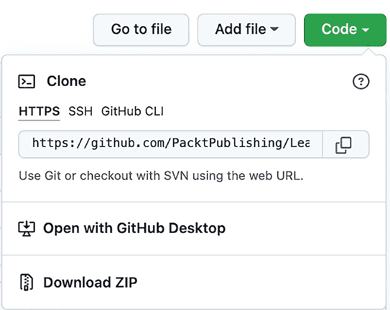
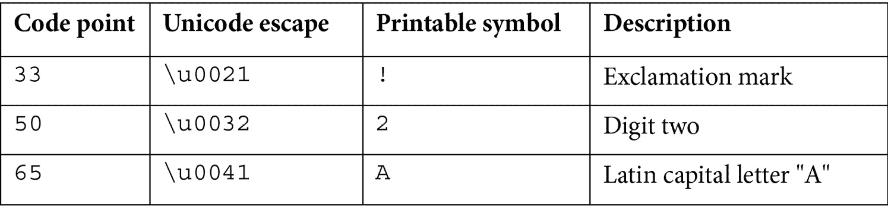

# *第一章*：Java 17 入门

本章介绍如何开始学习 Java 17 以及 Java 的一般知识。我们将从基础知识开始，首先解释什么是 Java 以及其主要术语，然后介绍如何安装编写和运行（执行）程序所需的工具。在这方面，Java 17 与之前的 Java 版本没有太大区别，因此本章的内容也适用于旧版本。

我们将描述并演示构建和配置 Java 编程环境所需的所有必要步骤。这是您计算机上开始编程所需的最基本内容。我们还描述了基本的 Java 语言结构，并通过可以立即执行的示例来展示它们。

学习一种编程语言——或者任何语言，最好的方式是使用它，本章将指导读者如何使用 Java 来实现这一点。在本章中，我们将涵盖以下主题：

+   如何安装和运行 Java

+   如何安装和运行集成开发环境（**IDE**）

+   Java 原始类型和运算符

+   字符串类型和字面量

+   **标识符**（**IDs**）和变量

+   Java 语句

# 技术要求

要能够执行本章提供的代码示例，您需要以下内容：

+   配有 Microsoft Windows、Apple macOS 或 Linux 操作系统的计算机

+   Java SE 版本 17 或更高版本

+   一个 IDE 或您偏好的代码编辑器

如何设置 Java `examples/src/main/java/com/packt/learnjava/ch01_start` 文件夹的说明。

# 如何安装和运行 Java

当有人说“*Java*”时，他们可能意味着完全不同的事情。他们可能指的是以下任何一个：

+   **Java 编程语言**：一种高级编程语言，允许用人类可读的格式表达意图（程序），该格式可以被翻译成计算机可执行的二进制代码

+   **Java 编译器**：一个程序，可以读取用 Java 编程语言编写的文本，并将其翻译成可以被 Java 虚拟机（**JVM**）解释的二进制代码，该代码可以被计算机执行

+   **JVM**：一个程序，读取编译好的 Java 程序的字节码，并将其解释成计算机可执行的二进制代码

+   **Java 开发工具包**（**JDK**）：一组程序（工具和实用程序），包括 Java 编译器、JVM 和支持库，允许用 Java 语言编写的程序进行编译和执行

以下部分将指导您安装 Java 17 的 JDK 以及相关的基本术语和命令。

## JDK 是什么以及为什么我们需要它？

如我们之前提到的，JDK 包括 Java 编译器和 JVM。编译器的任务是读取包含用 Java 编写的程序文本的`.java`文件（称为源代码），并将其转换（编译）成存储在`.class`文件中的字节码。然后 JVM 可以读取`.class`文件，将字节码解释成二进制代码，并将其发送到操作系统执行。编译器和 JVM 都必须从命令行显式调用。

Java 程序使用的语言层次结构如下：

+   你编写 Java 代码（`.java`文件）。

+   编译器将你的 Java 代码转换成字节码（`.class`文件）。

+   JVM 将字节码转换成机器级汇编指令（在硬件上运行）。

看看下面的例子：

`int a = b + c;`

当你编写前面的代码时，编译器会将以下字节码添加到`.class`文件中：

```java
ILOAD b
```

```java
ILOAD c
```

```java
IADD
```

```java
ISTORE a
```

*一次编写，到处运行* 是最著名的编程营销口号，推动了全球的采用。Oracle 声称超过 1000 万开发者使用 Java，它在 130 亿台设备上运行。你编写 Java 代码，并将其编译成`.class`文件中的字节码。对于 Windows、Mac、Unix、Linux 等操作系统，都有不同的 JVM，但相同的`.class`文件可以在所有这些操作系统上运行。

为了支持`.java`文件的编译及其字节码执行，JDK 安装还包括称为**Java 类库**（**JCL**）的标准 Java 库。如果程序使用第三方库，它必须在编译和执行期间存在。它必须从调用编译器的相同命令行引用，后来当字节码由 JVM 执行时也是如此。另一方面，JCL 不需要显式引用。假设标准 Java 库位于 JDK 安装的默认位置，以便编译器和 JVM 知道它们的位置。

如果你不需要编译 Java 程序，只想运行已经编译好的`.class`文件，你可以下载并安装**Java 运行环境**（**JRE**）。例如，它包括 JDK 的一个子集，但不包括编译器。

有时候，JDK 被称为**软件开发工具包**（**SDK**），这是一个集合软件工具和支持库的通用名称，允许使用某种编程语言编写的源代码创建可执行版本。因此，JDK 是 Java 的 SDK。这意味着可以将 JDK 称为 SDK。

你也可能听到将*Java 平台*和*Java 版本*应用于 JDK 的术语。一个典型的平台是一个操作系统，它允许软件开发和执行。由于 JDK 提供了自己的操作系统环境，因此它也被称为平台。版本是针对特定目的组装的 Java 平台（JDK）的变体。这里有四个 Java 平台版本，如下所示：

+   **Java 平台 SE** (**Java SE**): 这包括 JVM、JCL 以及其他工具和实用程序。

+   **Java 平台企业版** (**Java EE**): 这包括 Java SE、服务器（为应用程序提供服务的计算机程序）、JCL、其他库、代码示例、教程和其他用于开发部署大规模、多层和安全的网络应用程序的文档。

+   **Java 平台微型版** (**Java ME**): 这是 Java SE 的一个子集，包含一些用于开发并将 Java 应用程序部署到嵌入式和移动设备（如手机、个人数字助理、机顶盒、打印机和传感器）的专用库。Java ME 的一个变体（具有自己的 JVM 实现）称为 Android SDK，它是 Google 为 Android 编程开发的。

+   **Java Card**: 这是 Java 版本中最小的一个，旨在开发并将 Java 应用程序部署到小型嵌入式设备上，例如智能卡。它有两个版本：Java Card 经典版，用于智能卡（基于**国际标准化组织** (**ISO**) 7816 和 ISO 14443 通信），以及 Java Card 连接版，它支持 Web 应用程序模型，并以**传输控制协议/互联网协议** (**TCP/IP**)作为基本协议，运行在高性能安全微控制器上。

+   因此，安装 Java 意味着安装 JDK，这也意味着在列出的版本之一上安装 Java 平台。在这本书中，我们将讨论并使用 Java SE（它包括 JVM、JCL 以及其他将您的 Java 程序编译成字节码、解释成二进制代码并将其自动发送到您的操作系统以执行所需的工具和实用程序）。

## 安装 Java SE

所有最近发布的 JDK 都在官方 Oracle 页面上列出，请参阅[`www.oracle.com/java/technologies/downloads/#java17`](https://www.oracle.com/java/technologies/downloads/#java17)（我们将在后续章节中将其称为*安装主页*）。

安装 Java SE 需要遵循以下步骤：

1.  使用您的操作系统选择 Java SE 选项卡。

1.  点击适合您操作系统和熟悉格式的（扩展名）安装程序的链接。

1.  如果有疑问，请点击下面的**安装说明**链接，并阅读您操作系统的安装说明。

1.  按照与您的操作系统对应的步骤进行操作。

1.  当您的计算机上的`java -version`命令显示正确的 Java 版本时，JDK 安装成功，如下面的示例截图所示：


## 命令、工具和实用程序

如果你遵循安装说明，你可能已经注意到一个链接（`bin` 目录包含构成 Java 命令、工具和实用程序的 所有可执行程序。如果 `bin` 目录没有自动添加到 `PATH` 环境变量中，请考虑手动添加，这样你就可以从任何目录启动 Java 可执行程序。

在上一节中，我们已经展示了 `java -version` Java 命令。其他可用的 Java 可执行程序（命令、工具和实用程序）的列表可以在 Java SE 文档中找到（[`www.oracle.com/technetwork/java/javase/documentation/index.html`](https://www.oracle.com/technetwork/java/javase/documentation/index.html)），通过点击 **Java 平台标准版技术文档** 网站链接，然后点击下一页上的 **工具参考链接**。你可以通过点击其链接来了解更多关于每个可执行工具的信息。

你也可以使用以下选项之一在你的计算机上运行列出的每个可执行程序：

`-?`, `-h`, `--help` 或 `-help`

这些将显示可执行程序的简要描述及其所有选项。

这里列出了最重要的 Java 命令：

+   `javac`: 这将读取 `.java` 文件，编译它，并创建一个或多个相应的 `.class` 文件，具体取决于 `.java` 文件中定义了多少个 Java 类。

+   `java`: 这将执行 `.class` 文件。

这些是使编程成为可能命令。每个 Java 程序员都必须对其结构和功能有良好的理解，但如果你是 Java 编程的新手并使用 IDE（见 *如何安装和运行 IDE* 部分），你不需要立即掌握这些命令。一个好的 IDE 通过每次你对其 `.java` 文件进行更改时自动编译它来隐藏它们。它还提供了一个图形元素，每次你点击它时都会运行程序。

另一个非常有用的 Java 工具是 jcmd。它便于与任何当前运行的 Java 进程（JVM）进行通信和诊断，并且有许多选项。但在最简单的形式下，不使用任何选项，它将列出所有当前运行的 Java 进程及其 **进程 ID**（**PID**）。你可以用它来查看你是否存在失控的 Java 进程。如果有，你可以使用提供的 PID 来终止这样的进程。

# 如何安装和运行 IDE

最初只是一个专门编辑器，允许以与 Word 编辑器检查英语句子语法相同的方式检查编写程序的语法，逐渐演变成集成开发环境（IDE）。它的主要功能体现在名称上。它将编写、编译和执行程序所需的所有工具集成在一个 **图形用户界面**（**GUI**）下。利用 Java 编译器的功能，IDE 可以立即识别语法错误，并通过提供上下文相关的帮助和建议来帮助提高代码质量。

## 选择 IDE

对于 Java 程序员来说，有多个 IDE 可用，例如 NetBeans、Eclipse、IntelliJ IDEA、BlueJ、DrJava、JDeveloper、JCreator、jEdit、JSource 和 jCRASP 等。您可以通过以下链接阅读顶级 Java IDE 的评测和每个 IDE 的详细信息：[`www.softwaretestinghelp.com/best-java-ide-and-online-compilers`](https://www.softwaretestinghelp.com/best-java-ide-and-online-compilers)。最受欢迎的当属 NetBeans、Eclipse 和 IntelliJ IDEA。

NetBeans 的开发始于 1996 年，当时在布拉格的查尔斯大学作为 Java IDE 学生项目启动。1999 年，该项目及其周围的公司被 Sun Microsystems 收购。在 Oracle 收购 Sun Microsystems 之后，NetBeans 成为了开源项目，许多 Java 开发者随后为该项目做出了贡献。它随 JDK 8 一起捆绑发布，并成为了 Java 开发的官方 IDE。2016 年，Oracle 将其捐赠给了 Apache 软件基金会。

NetBeans IDE 支持 Windows、Linux、Mac 和 Oracle Solaris 系统。它支持多种编程语言，并且可以通过插件进行扩展。截至撰写本文时，NetBeans 仅与 JDK 8 捆绑，但 NetBeans 8.2 也可以与 JDK 9 一起使用，并使用 JDK 9 引入的特性，例如 Jigsaw。在 [netbeans.apache.org](http://netbeans.apache.org) 上，您可以了解更多关于 NetBeans IDE 的信息，并下载最新版本，撰写本文时版本为 12.5。

*Eclipse* 是最广泛使用的 Java IDE。为 IDE 添加新功能的插件列表不断增长，因此无法一一列举 IDE 的所有功能。Eclipse IDE 项目自 2001 年以来作为 **开源软件**（**OSS**）进行开发。2004 年，成立了非营利性、会员支持的 Eclipse 基金会，以提供基础设施（**版本控制系统**（**VCSs**）、代码审查系统、构建服务器、下载站点等）和结构化流程。Eclipse 基金会的 30 多名员工中没有人在 150 个 Eclipse 支持的项目上工作。

Eclipse IDE 插件的数量和种类繁多，对于初学者来说构成了一定的挑战，因为您需要熟悉不同实现方式相同或类似的功能，这些功能有时可能不兼容，可能需要进行深入调查，并清楚了解所有依赖关系。尽管如此，Eclipse IDE 非常受欢迎，并且拥有坚实的社区支持。您可以在 [www.eclipse.org/ide](http://www.eclipse.org/ide) 上了解 Eclipse IDE 并下载最新版本。

IntelliJ IDEA 有两个版本：付费版和免费社区版。付费版一直被评为最佳 Java IDE，但社区版也被列为三大领先 Java IDE 之一。开发该 IDE 的 JetBrains 软件公司在布拉格、圣彼得堡、莫斯科、慕尼黑、波士顿和诺沃西比尔斯克设有办事处。该 IDE 以其深入智能而闻名，正如作者在网站上描述产品时所说：“*在任何上下文中提供相关建议：即时且聪明的代码补全、即时代码分析以及可靠的重构工具*”。在*安装和配置 IntelliJ IDEA*部分，我们将向您介绍 IntelliJ IDEA 社区版的安装和配置过程。

## 安装和配置 IntelliJ IDEA

以下是你需要遵循的步骤来下载和安装 IntelliJ IDEA：

1.  从 [www.jetbrains.com/idea/download](http://www.jetbrains.com/idea/download) 下载 IntelliJ IDEA 社区版的安装程序。

1.  启动安装程序并接受所有默认值。

1.  在**安装选项**屏幕上选择`.java`。我们假设你已经安装了 JDK，所以你不需要勾选**下载并安装 JRE**选项。

1.  最后一个安装屏幕有一个**运行 IntelliJ IDEA**复选框，你可以勾选以自动启动 IDE。或者，你可以在安装完成后手动启动 IDE，不勾选复选框。

1.  当 IDE 首次启动时，它会提供一个**导入 IntelliJ IDEA 设置**选项。如果你之前没有使用过 IntelliJ IDEA，请勾选**不导入设置**复选框。

1.  接下来的几个屏幕会询问你是否接受**JetBrains 隐私政策**，以及你是否愿意为许可证付费或更喜欢继续使用免费社区版或免费试用版（这取决于你下载的具体版本）。

1.  按照你喜欢的任何方式回答问题，如果你接受隐私政策，**自定义 IntelliJ IDEA**屏幕将要求你选择一个主题：**白色（IntelliJ）**或**深色（Darcula）**。

1.  接受默认设置。

1.  如果你决定更改设置值，你可以在稍后通过选择最顶部的菜单**文件** | **设置**（在 Windows 上）或**首选项**（在 Linux 和 macOS 上）来更改。

## 创建项目

在你开始编写程序之前，你需要创建一个项目。在 IntelliJ IDEA 中创建项目有几种方法，这与任何 IDE 都相同，如下所示：

1.  **新建项目**：这将从零开始创建一个新项目。

1.  **打开**：这有助于从文件系统中读取现有项目。

1.  **从版本控制系统获取**：这有助于从版本控制系统读取现有项目。

在本书中，我们将向您介绍第一个选项——使用 IDE 提供的引导步骤序列。选项 *2* 和 *3* 包含许多由导入具有这些设置的现有项目自动设置的设置。一旦你学会了如何从头创建新项目，IDE 中启动项目的其他方式对你来说将会非常容易。

首先点击 **新建项目** 链接，然后按照以下步骤继续操作：

1.  在左侧面板中选择 **Maven**，并为 **项目 SDK**（如果你已经安装了 JDK 17，则为 Java 版本 17）选择一个值，然后点击 **下一步**。

1.  Maven 是一个项目配置工具，其主要功能是管理项目依赖。我们将在稍后讨论它。现在，我们将使用它的另一个职责：使用三个 **工件坐标** 属性（见下文）定义和保存项目代码身份。 

1.  输入项目名称——例如，`myproject`。

1.  在 **位置字段** 设置中选择所需的项目位置（这是你的新代码将驻留的地方）。

1.  点击 `GroupId`：这是标识组织内部或开源社区中一组项目的基包名。在我们的案例中，让我们输入 `com.mywork`。

1.  `ArtifactId`：用于标识组内的特定项目。将其保留为 `myproject`。

1.  `版本`：用于标识项目的版本。将其保留为 `1.0-SNAPSHOT`。

主要目标是使项目的身份在世界所有项目中独一无二。为了避免 `GroupId` 冲突，约定要求你从组织域名反向开始构建。例如，如果一家公司有一个 `company.com` 域名，其项目的 `GroupId` 属性应该以 `com.company` 开头。这就是为什么在这个演示中我们使用 `com.mywork`，而在本书中的代码，我们使用 `com.packt.learnjava` 的 `GroupID` 值。

1.  点击 **完成**。

1.  你将看到以下项目结构和生成的 `pom.xml` 文件：


现在，如果有人想在他们的应用程序中使用你的项目代码，他们将通过显示的三个值来引用它，并且 Maven（如果他们使用它）将把它引入（当然，如果你将你的项目上传到公开共享的 Maven 仓库的话）。有关 Maven 的更多信息，请参阅 [`maven.apache.org/guides`](https://maven.apache.org/guides)。`GroupId` 值的另一个功能是定义包含你的项目代码的文件夹树根目录。`main` 下的 `java` 文件夹将包含应用程序代码，而 `test` 下的 `java` 文件夹将包含测试代码。

让我们按照以下步骤创建我们的第一个程序：

1.  右键点击 `java`，选择 **新建**，然后点击 **包**，如图所示：


1.  在 `com.mywork.myproject` 中按下 *Enter*。

你应该在左侧面板中看到以下一组新文件夹：


1.  右键单击`com.mywork.myproject`，选择**新建**，然后点击**Java 类**，如下面的截图所示：


1.  在提供的输入窗口中，键入`HelloWorld`，如下所示：

1.  按下*Enter*键，您将看到在`com.mywork.myproject`包中创建的第一个 Java 类`HelloWorld`，如下面的截图所示：


该包反映了 Java 类在文件系统中的位置。我们将在*第二章*，*Java 面向对象编程（OOP）*中更详细地讨论这一点。现在，为了运行一个程序，我们创建一个`main()`方法。如果存在，此方法可以被执行，作为进入应用程序的入口点。它具有特定的格式，如下所示：


这必须具有以下属性：

+   `public`：可以从包外部自由访问

+   `static`：应该能够在不创建它所属的类对象的情况下调用

它还应该有以下内容：

+   返回`void`（无）

接受一个`String`数组作为输入，或者`varargs`，正如我们所做的那样。我们将在*第二章*，*Java 面向对象编程（OOP）*中讨论`varargs`。现在，只需说`String[] args`和`String... args`基本上定义了相同的输入格式。

在*使用命令行执行示例*部分，我们解释了如何使用命令行运行`main`类。您可以在官方 Oracle 文档中了解更多关于 Java 命令行参数的信息：[`docs.oracle.com/javase/tutorial/essential/environment/cmdLineArgs.html`](https://docs.oracle.com/javase/tutorial/essential/environment/cmdLineArgs.html)。您也可以从 IntelliJ IDEA 中运行这些示例。

注意下一张截图左侧的两个绿色三角形。通过单击其中的任何一个，您可以执行`main()`方法。例如，让我们显示`Hello, world!`。

为了做到这一点，请在`main()`方法中键入以下行：

```java
System.out.println("Hello, world!");
```

以下截图显示了程序运行后的样子：


然后，点击一个绿色三角形，您应该在终端区域得到以下输出：


从现在开始，每次我们将讨论代码示例时，我们都会以相同的方式运行它们，即使用`main()`方法。在这样做的时候，我们不会捕获截图，而是将结果放在注释中，因为这种风格更容易跟随。例如，以下代码片段显示了之前的代码演示将以这种方式看起来：

```java
System.out.println("Hello, world!"); //prints: Hello, world!
```

可以在代码行的右侧添加注释（任何文本），用双斜杠`//`分隔。编译器不会读取此文本，只是将其保持原样。注释的存在不会影响性能，并且用于向人类解释程序员的意图。

## 导入项目

我们将使用本书的源代码演示项目导入。我们假设您已在计算机上安装了 Maven([`maven.apache.org/install.html`](https://maven.apache.org/install.html))和 Git([`gist.github.com/derhuerst/1b15ff4652a867391f03`](https://gist.github.com/derhuerst/1b15ff4652a867391f03))，并且可以使用它们。我们还假设您已安装了 JDK 17，正如在*安装 Java SE*部分所述。

要导入本书的代码示例项目，请按照以下步骤操作：

1.  前往源代码库([`github.com/PacktPublishing/Learn-Java-17-Programming`](https://github.com/PacktPublishing/Learn-Java-17-Programming))，点击**代码**下拉菜单，如图所示

1.  复制提供的**统一资源定位符**（**URL**）（点击 URL 右侧的*复制*符号），如图所示：



1.  选择您希望在计算机上放置源代码的目录，然后运行`git clone https://github.com/PacktPublishing/Learn-Java-17-Programming.git` Git 命令，并观察以下截图所示的类似输出：


1.  创建了一个新的`Learn-Java-17-Programming`文件夹。

或者，您可以选择不克隆，而是使用截图所示的前一个“下载 ZIP”链接下载源代码作为`.zip`文件。在您希望在计算机上放置源代码的目录中解压缩下载的源代码，然后通过从其名称中移除`-master`后缀来重命名新创建的文件夹，确保文件夹的名称为`Learn-Java-17-Programming`。

1.  新的`Learn-Java-17-Programming`文件夹包含本书的所有源代码。如果您愿意，可以随意重命名此文件夹。在我们的例子中，我们将其重命名为`LearnJava`以简化。

1.  现在，运行 IntelliJ IDEA，点击`LearnJava`（在我们的例子中），然后点击**打开**按钮。

1.  如果在右下角出现以下弹出窗口，请点击**加载**：


1.  此外，点击**信任项目...**，如图所示：


1.  然后，点击弹出的窗口中的**信任项目**按钮

1.  现在，转到**项目结构**（右上角的齿轮符号）并确保已选择 Java 17 作为 SDK，如图所示：


1.  点击**应用**并确保默认的**项目 SDK**设置为 Java **版本 17**，**项目语言级别**设置为**17**，如图所示

1.  通过选择`LearnJava`模块并点击`"-"`，如下所示：


1.  在弹出的窗口中通过点击**是**确认移除`LearnJava`模块，如下所示：


1.  最终模块列表应如下所示

在右下角点击**确定**按钮，然后返回到您的项目。在左侧面板中点击 examples，继续向下查看源树，直到您看到以下类列表：


在右侧面板中点击绿色箭头并执行任何类中的`main()`方法。例如，让我们执行`PrimitiveTypes`类的`main()`方法。您将在**运行**窗口中看到的输出应该类似于以下内容：


## 从命令行执行示例

要从命令行执行示例，请转到包含`pom.xml`文件的`examples`文件夹，并运行`mvn clean package`命令。如果命令执行成功，您可以从命令行运行`examples`文件夹中任何程序的`main()`方法。例如，要执行`ControlFlow.java`文件中的`main()`方法，请按以下命令执行：

```java
java -cp target/examples-1.0-SNAPSHOT.jar   com.packt.learnjava.ch01_start.ControlFlow
```

您将看到以下结果：


这样，您可以运行任何包含`main()`方法的类。`main()`方法的内容将被执行。

# Java 原始类型和运算符

在所有主要的编程工具都已就绪的情况下，我们可以开始讨论 Java 作为一种语言。该语言的语法由**Java 语言规范**定义，您可以在[`docs.oracle.com/javase/specs`](https://docs.oracle.com/javase/specs)找到它。不要犹豫，每次需要澄清时都参考它——它并不像许多人想象的那样令人畏惧。

Java 中的所有值分为两类：引用类型和原始类型。我们以原始类型和运算符作为任何编程语言的自然入口点。在本章中，我们还将讨论一个名为`String`的引用类型（见**String 类型和字面量**部分）。

所有原始类型可以分为两组：布尔类型和数值类型。

## 布尔类型

Java 中只有两个布尔类型值：`true`和`false`。这样的值只能分配给`boolean`类型的变量，如下例所示：

```java
boolean b = true;
```

`boolean`类型的变量通常用于控制流语句中，我们将在**Java 语句**部分讨论这些。以下是一个例子：

```java
boolean b = x > 2;
```

```java
if(b){ 
```

```java
    //do something
```

```java
}
```

在前面的代码中，我们将`x > 2`表达式的评估结果赋值给`b`变量。如果`x`的值大于`2`，则`b`变量将获得分配的值，`true`。然后，花括号`{}`内的代码将被执行。

## 数值类型

Java 数值类型分为两组：整数类型（`byte`、`char`、`short`、`int`和`long`）和浮点类型（`float`和`double`）。

### 整数类型

整数类型消耗以下内存量：

+   `byte`: 8 位

+   `char`: 16 位

+   `short`: 16 位

+   `int`: 32 位

+   `long`: 64 位

`char`类型是一个无符号整数，可以存储一个值（称为码点），范围从 0 到 65,535（包含）。它表示一个 Unicode 字符，这意味着有 65,536 个 Unicode 字符。以下是基本拉丁字符集的三个记录：



以下代码演示了`char`类型的属性（执行`com.packt.learnjava.ch01_start.PrimitiveTypes`类的`main()`方法——查看`charType()`方法）：

```java
char x1 = '\u0032';
```

```java
System.out.println(x1);  //prints: 2
```

```java
char x2 = '2';
```

```java
System.out.println(x2);  //prints: 2
```

```java
x2 = 65;
```

```java
System.out.println(x2);  //prints: A
```

```java
char y1 = '\u0041';
```

```java
System.out.println(y1);  //prints: A
```

```java
char y2 = 'A';
```

```java
System.out.println(y2);  //prints: A
```

```java
y2 = 50;
```

```java
System.out.println(y2);  //prints: 2
```

```java
System.out.println(x1 + x2);  //prints: 115
```

```java
System.out.println(x1 + y1);  //prints: 115
```

上一段代码示例的最后两行解释了为什么`char`类型被认为是整型，因为`char`值可以用于算术运算。在这种情况下，每个`char`值由其码点表示。

其他整型的值范围如下所示：

+   `byte`: 从 -128 到 127（包含）

+   `short`: 从 -32,768 到 32,767（包含）

+   `int`: 从 -2,147,483,648 到 2,147,483,647（包含）

+   `long`: 从 -9,223,372,036,854,775,808 到 9,223,372,036,854,775,807（包含）

您可以从相应的 Java 常量中检索到每种原始类型的最大和最小值，如下所示（执行`com.packt.learnjava.ch01_start.PrimitiveTypes`类的`main()`方法——查看`minMax()`方法）：

```java
System.out.println(Byte.MIN_VALUE);      //prints: -128
```

```java
System.out.println(Byte.MAX_VALUE);      //prints:  127
```

```java
System.out.println(Short.MIN_VALUE);     //prints: -32768
```

```java
System.out.println(Short.MAX_VALUE);     //prints:  32767
```

```java
System.out.println(Integer.MIN_VALUE);   //prints: -2147483648
```

```java
System.out.println(Integer.MAX_VALUE);   //prints:  2147483647
```

```java
System.out.println(Long.MIN_VALUE);      
```

```java
                                 //prints: -9223372036854775808
```

```java
System.out.println(Long.MAX_VALUE);
```

```java
                                  //prints: 9223372036854775807
```

```java
System.out.println((int)Character.MIN_VALUE); //prints: 0
```

```java
System.out.println((int)Character.MAX_VALUE); //prints: 65535
```

最后两行中的构造（`int`）是使用类型转换运算符的示例。它强制将一个值从一种类型转换为另一种类型，在这种情况下，这种转换并不总是保证成功。正如您从我们的示例中看到的那样，某些类型允许比其他类型更大的值。但是，程序员可能知道某个变量的值永远不会超过目标类型的最大值，类型转换运算符是程序员强制其意见于编译器的方式。否则，如果没有类型转换运算符，编译器将引发错误，不允许赋值。然而，程序员可能会犯错误，值可能会变得更大。在这种情况下，执行时将引发运行时错误。

虽然原则上某些类型不能转换为其他类型，或者至少不能转换为所有类型——例如，布尔类型值不能转换为整型值。

### 浮点类型

在这个原始类型组中有两种类型——`float`和`double`。它们消耗以下内存量：

+   `float`: 32 位

+   `double`: 64 位

它们的正最大和最小可能值如下所示（执行`com.packt.learnjava.ch01_start.PrimitiveTypes`类的`main()`方法——查看`minMax()`方法）：

```java
System.out.println(Float.MIN_VALUE);  //prints: 1.4E-45
```

```java
System.out.println(Float.MAX_VALUE);  //prints: 3.4028235E38
```

```java
System.out.println(Double.MIN_VALUE); //prints: 4.9E-324
```

```java
System.out.println(Double.MAX_VALUE); 
```

```java
                               //prints: 1.7976931348623157E308
```

最大和最小的负值与上面显示的相同，只是在它们前面有一个负号（`-`）。因此，实际上，`Float.MIN_VALUE`和`Double.MIN_VALUE`的值不是最小值，而是相应类型的精度。对于每个浮点类型，零值可以是 0.0 或-0.0。

浮点类型的一个特殊特性是存在一个点 (`.`)，它将数字的整数部分和小数部分分开。在 Java 中，默认情况下，带点的数字被认为是 `double` 类型。例如，以下被认为是 `double` 值：

`42.3`

这意味着以下赋值会导致编译错误：

```java
float f = 42.3;
```

要表示您希望将其视为 `float` 类型，您需要添加 `f` 或 `F`。例如，以下赋值不会导致错误（执行 `com.packt.learnjava.ch01_start.PrimitiveTypes` 类的 `main()` 方法——请参阅 `casting()` 方法）：

```java
float f = 42.3f;
```

```java
float d = 42.3F;
```

```java
double a = 42.3f;
```

```java
double b = 42.3F;
```

```java
float x = (float)42.3d;
```

```java
float y = (float)42.3D;
```

如您可能已从前面的示例中注意到，`d` 和 `D` 表示 `double` 类型，但我们能够将它们转换为 `float` 类型，因为我们确信 `42.3` 在可能的 `float` 类型值范围内。

## 原始类型的默认值

在某些情况下，即使程序员不希望这样做，变量也必须被赋予一个值。我们将在 *第二章*，*Java 面向对象编程 (OOP)* 中讨论此类情况。在这种情况下，原始类型的默认值如下概述：

+   `byte`, `short`, `int`, 和 `long` 类型具有默认值 0。

+   `char` 类型具有默认值 `\u0000`，代码点为 0。

+   `float` 和 `double` 类型具有默认值 0.0。

+   `boolean` 类型具有默认值 `false`。

## 原始类型字面量

值的表示称为字面量。`boolean` 类型有两个字面量：`true` 和 `false`。`byte`、`short`、`int` 和 `long` 整数类型的字面量默认为 `int` 类型，如下所示：

```java
byte b = 42;
```

```java
short s = 42;
```

```java
int i = 42;
```

```java
long l = 42;
```

此外，为了表示 `long` 类型的字面量，您可以在末尾附加字母 `l` 或 `L`，如下所示：

```java
long l1 = 42l;
```

```java
long l2 = 42L;
```

字母 `l` 容易与数字 `1` 混淆，因此使用 `L`（而不是 `l`）来表示此目的是一种良好的做法。

到目前为止，我们已使用十进制数系统表示整数字面量。同时，`byte`、`short`、`int` 和 `long` 类型的字面量也可以用二进制（基数为 2，数字为 0-1）、八进制（基数为 8，数字为 0-7）和十六进制（基数为 16，数字为 0-9 和 a-f）数制表示。二进制字面量以 0b（或 0B）开头，后跟用二进制系统表示的值。例如，十进制的 42 表示为 101010 = 2⁰*0 + 2¹*1 + 2²*0 + 2³ *1 + 2⁴ *0 + 2⁵ *1（我们从右边开始计数 0）。八进制字面量以 0 开头，后跟用八进制系统表示的值，因此 42 表示为 52 = 8⁰*2+ 8¹*5。十六进制字面量以 0x（或 0X）开头，后跟用十六进制系统表示的值。因此，42 表示为 2a = 16⁰*a + 16¹*2，因为在十六进制系统中，符号 `a` 到 `f`（或 `A` 到 `F`）映射到十进制值 10 到 15。以下为演示代码（执行 `com.packt.learnjava.ch01_start.PrimitiveTypes` 类的 `main()` 方法——请参阅 `literals()` 方法）：

```java
int i = 42;
```

```java
System.out.println(Integer.toString(i, 2));       // 101010
```

```java
System.out.println(Integer.toBinaryString(i));    // 101010
```

```java
System.out.println(0b101010);                     // 42
```

```java
System.out.println(Integer.toString(i, 8));       // 52
```

```java
System.out.println(Integer.toOctalString(i));     // 52
```

```java
System.out.println(052);                           // 42
```

```java
System.out.println(Integer.toString(i, 10));       // 42
```

```java
System.out.println(Integer.toString(i));           // 42
```

```java
System.out.println(42);                            // 42
```

```java
System.out.println(Integer.toString(i, 16));       // 2a
```

```java
System.out.println(Integer.toHexString(i));        // 2a
```

```java
System.out.println(0x2a);                          // 42
```

如您所见，Java 提供了将十进制系统值转换为不同基数的系统的方法。所有这些数值表达都称为字面量。

数值字面量的一项特性使它们对人类友好。如果数字很大，可以将其分成由下划线（`_`）分隔的三部分。例如，观察以下内容：

```java
int i = 354_263_654;
```

```java
System.out.println(i);  //prints: 354263654
```

```java
float f = 54_436.98f;
```

```java
System.out.println(f);  //prints: 54436.98
```

```java
long l = 55_763_948L;
```

```java
System.out.println(l);  //prints: 55763948
```

编译器忽略嵌入的下划线符号。

`char` 类型有两种字面量：单个字符或转义序列。我们在讨论数值类型时已经看到了 `char` 类型的字面量示例，您还可以在此处看到一些其他示例：

```java
char x1 = '\u0032';
```

```java
char x2 = '2';
```

```java
char y1 = '\u0041';
```

```java
char y2 = 'A';
```

如您所见，字符必须用单引号括起来。

转义序列以反斜杠（`\`）开头，后跟字母或另一个字符。以下是一个完整的转义序列列表：

+   `\b`: 退格 BS，Unicode 转义 `\u0008`

+   `\t`: 水平制表符 HT，Unicode 转义 `\u0009`

+   `\n`: 换行 LF，Unicode 转义 `\u000a`

+   `\f`: 页面分隔 FF，Unicode 转义 `\u000c`

+   `\r`: 回车 CR，Unicode 转义 `\u000d`

+   `\"`: 双引号 “，Unicode 转义 `\u0022`

+   `\‘`: 单引号 ‘，Unicode 转义 `\u0027`

+   `\\`: 反斜杠 \，Unicode 转义 `\u005c`

在八个转义序列中，只有最后三个由符号表示。它们在无法以其他方式显示此符号时使用。例如，观察以下内容：

```java
System.out.println("\"");   //prints: "
```

```java
System.out.println('\'');   //prints: '
```

```java
System.out.println('\\');   //prints: \
```

其余的更多用作控制代码，指导输出设备执行某些操作，如下例所示：

```java
System.out.println("The back\bspace");
```

```java
                                        //prints: The backspace
```

```java
System.out.println("The horizontal\ttab"); 
```

```java
                                   //prints: The horizontal tab
```

```java
System.out.println("The line\nfeed"); 
```

```java
                                        //prints: The line feed
```

```java
System.out.println("The form\ffeed");      
```

```java
                                        //prints: The form feed
```

```java
System.out.println("The carriage\rreturn");//prints: return
```

如您所见，`\b` 删除前一个符号，`\t` 插入制表符空格，`\n` 换行并开始新的一行，`\f` 强制打印机退出当前页面并在另一页顶部继续打印，而 `\r` 则从当前行的开头开始。

## 新的紧凑数字格式

`java.text.NumberFormat` 类以各种格式呈现数字。它还允许调整格式以适应提供的格式，包括区域设置。Java 12 中添加到此类的新功能称为紧凑或短数字格式。

它以区域特定、人类可读的形式表示数字。例如，观察以下内容（执行 `com.packt.learnjava.ch01_start.PrimitiveTypes` 类的 `main()` 方法——见 `newNumberFormat()` 方法）：

```java
NumberFormat fmt = NumberFormat.getCompactNumberInstance(Locale.US, NumberFormat.Style.SHORT);
```

```java
System.out.println(fmt.format(42_000));          //prints: 42K
```

```java
System.out.println(fmt.format(42_000_000));      //prints: 42M
```

```java
NumberFormat fmtP = NumberFormat.getPercentInstance();
```

```java
System.out.println(fmtP.format(0.42));          //prints: 42%
```

如您所见，要访问此功能，您必须获取 `NumberFormat` 类的特定实例，有时基于提供的区域设置和样式。

## 运算符

Java 中有 44 个运算符。以下表格列出了它们：


我们将不会描述不常使用的 `&=`, `|=`, `^=`, `<<=`, `>>=`, `>>>=` 赋值运算符和位运算符，但你可以在 Java 规范中阅读有关它们的内容（[`docs.oracle.com/javase/specs`](https://docs.oracle.com/javase/specs)）。箭头（`->`）和方法引用（`::`）运算符将在 *第十四章*，*Java 标准流* 中描述。`new` 实例创建运算符、`.` 字段访问/方法调用运算符和 `instanceof` 类型比较运算符将在 *第二章*，*Java 面向对象编程 (OOP)* 中讨论。至于类型转换运算符，我们已经在 *整型* 部分中描述过。

### 算术一元（+ 和 -）和二元（+、-、*、/ 和%）运算符

大多数算术运算符和正负号（一元运算符）对我们来说都很熟悉。取模运算符（`%`）将左操作数除以右操作数并返回余数，如下所示（执行 `com.packt.learnjava.ch01_start.Operators` 类的 `main()` 方法——见 `integerDivision()` 方法）：

```java
int x = 5;
```

```java
System.out.println(x % 2);   //prints: 1
```

值得注意的是，Java 中两个整数相除会丢失分数部分，因为 Java 假设结果应该是一个整数数字 `2`，如下所示：

```java
int x = 5;
```

```java
System.out.println(x / 2);   //prints: 2
```

如果需要保留结果的分数部分，将其中一个操作数转换为浮点类型。这里有几种方法（许多方法中的一种）可以实现这一点：

```java
int x = 5;
```

```java
System.out.println(x / 2.);           //prints: 2.5
```

```java
System.out.println((1\. * x) / 2);     //prints: 2.5
```

```java
System.out.println(((float)x) / 2);   //prints: 2.5
```

```java
System.out.println(((double) x) / 2); //prints: 2.5
```

### 增量和减量一元运算符（++ 和 --）

`++` 运算符将整型值增加 1，而 `--` 运算符将其减少 1。如果放在变量之前（前缀），则在返回变量值之前改变其值。但如果是放在变量之后（后缀），则在返回变量值之后改变其值。以下是一些示例（执行 `com.packt.learnjava.ch01_start.Operators` 类的 `main()` 方法——见 `incrementDecrement()` 方法）：

```java
int i = 2;
```

```java
System.out.println(++i);   //prints: 3
```

```java
System.out.println(i);     //prints: 3
```

```java
System.out.println(--i);   //prints: 2
```

```java
System.out.println(i);     //prints: 2
```

```java
System.out.println(i++);   //prints: 2
```

```java
System.out.println(i);     //prints: 3
```

```java
System.out.println(i--);   //prints: 3
```

```java
System.out.println(i);     //prints: 2
```

### 等于运算符（== 和 !=）

`==` 运算符表示等于，而 `!=` 运算符表示不等于。它们用于比较相同类型的值，如果操作数的值相等，则返回 `true` 布尔值，否则返回 `false`。例如，观察以下内容（执行 `com.packt.learnjava.ch01_start.Operators` 类的 `main()` 方法——见 `equality()` 方法）：

```java
int i1 = 1;
```

```java
int i2 = 2;
```

```java
System.out.println(i1 == i2);        //prints: false
```

```java
System.out.println(i1 != i2);        //prints: true
```

```java
System.out.println(i1 == (i2 - 1));  //prints: true
```

```java
System.out.println(i1 != (i2 - 1));  //prints: false
```

然而，在比较浮点类型值时，要小心谨慎，尤其是在比较计算结果时。在这种情况下使用关系运算符（`<`、`>`、`<=` 和 `>=`）要更可靠，因为像 1/3 这样的计算会产生一个永不结束的分数部分 0.33333333...，并且最终取决于精度实现（这是一个超出本书范围的主题）。

### 关系运算符（<、>、<= 和 >=）

关系操作符比较值并返回一个布尔值。观察以下示例，例如（执行 `com.packt.learnjava.ch01_start.Operators` 类的 `main()` 方法——见 `relational()` 方法）：

```java
int i1 = 1;
```

```java
int i2 = 2;
```

```java
System.out.println(i1 > i2);         //prints: false
```

```java
System.out.println(i1 >= i2);        //prints: false
```

```java
System.out.println(i1 >= (i2 - 1));  //prints: true
```

```java
System.out.println(i1 < i2);         //prints: true
```

```java
System.out.println(i1 <= i2);        //prints: true
```

```java
System.out.println(i1 <= (i2 - 1));  //prints: true
```

```java
float f = 1.2f;
```

```java
System.out.println(i1 < f);          //prints: true
```

### 逻辑操作符（!、& 和 |）

逻辑操作符可以定义为如下：

+   `!` 二进制操作符如果操作数是 `false` 则返回 `true`；否则返回 `false`。

+   `&` 二进制操作符如果两个操作数都是 `true` 则返回 `true`。

+   `|` 二进制操作符如果至少有一个操作数是 `true` 则返回 `true`。

下面是一个示例（执行 `com.packt.learnjava.ch01_start.Operators` 类的 `main()` 方法——见 `logical()` 方法）：

```java
boolean b = true;
```

```java
System.out.println(!b);    //prints: false
```

```java
System.out.println(!!b);   //prints: true
```

```java
boolean c = true;
```

```java
System.out.println(c & b); //prints: true
```

```java
System.out.println(c | b); //prints: true
```

```java
boolean d = false;
```

```java
System.out.println(c & d); //prints: false
```

```java
System.out.println(c | d); //prints: true
```

### 条件操作符（&&、|| 和 ? :) 

`&&` 和 `||` 操作符产生与刚刚演示的 `&` 和 `|` 逻辑操作符相同的结果，如下所示（执行 `com.packt.learnjava.ch01_start.Operators` 类的 `main()` 方法——见 `conditional()` 方法）：

```java
boolean b = true;
```

```java
boolean c = true;
```

```java
System.out.println(c && b); //prints: true
```

```java
System.out.println(c || b); //prints: true
```

```java
boolean d = false;
```

```java
System.out.println(c && d); //prints: false
```

```java
System.out.println(c || d); //prints: true
```

区别在于 `&&` 和 `||` 操作符并不总是评估第二个操作数。例如，在 `&&` 操作符的情况下，如果第一个操作数是 `false`，则不会评估第二个操作数，因为整个表达式的结果无论如何都将为 `false`。同样，在 `||` 操作符的情况下，如果第一个操作数是 `true`，则整个表达式将明确地评估为 `true`，而无需评估第二个操作数。我们可以在以下代码片段中演示这一点：

```java
int h = 1;
```

```java
System.out.println(h > 3 && h++ < 3);  //prints: false
```

```java
System.out.println(h);                //prints: 2
```

```java
System.out.println(h > 3 && h++ < 3); //prints: false
```

```java
System.out.println(h);                //prints: 2
```

`? :` 操作符被称为三元操作符。它评估一个条件（在 `?` 符号之前），如果结果为 `true`，则将第一个表达式（在 `?` 和 `:` 符号之间）计算出的值赋给变量；否则，将第二个表达式（在 `:` 符号之后）计算出的值赋给变量，如下面的代码片段所示：

```java
int n = 1, m = 2;
```

```java
float k = n > m ? (n * m + 3) : ((float)n / m); 
```

```java
System.out.println(k);           //prints: 0.5
```

### 赋值操作符（=、+=、-=、*=、/= 和 %=）

`=` 操作符只是将指定的值赋给一个变量，如下所示：

```java
x = 3;
```

其他赋值操作符在赋值之前计算一个新的值，如下所示：

+   `x += 42` 将 `x` 赋值为 `x = x + 42` 加法操作的结果。

+   `x -= 42` 将 `x` 赋值为 `x = x - 42` 减法操作的结果。

+   `x *= 42` 将 `x` 赋值为 `x = x * 42` 乘法操作的结果。

+   `x /= 42` 将 `x` 赋值为 `x = x / 42` 除法操作的结果。

+   `x %= 42` 将 `x` 赋值为 `x = x + x % 42` 除法操作的余数。

这里是如何使用这些操作符的（执行 `com.packt.learnjava.ch01_start.Operators` 类的 `main()` 方法——见 `assignment()` 方法）：

```java
float a = 1f;
```

```java
a += 2;
```

```java
System.out.println(a); //prints: 3.0
```

```java
a -= 1;
```

```java
System.out.println(a); //prints: 2.0
```

```java
a *= 2;
```

```java
System.out.println(a); //prints: 4.0
```

```java
a /= 2;
```

```java
System.out.println(a); //prints: 2.0
```

```java
a %= 2;
```

```java
System.out.println(a); //prints: 0.0
```

# 字符串类型和字面量

我们刚刚描述了 Java 语言的原始值类型。Java 中的所有其他值类型都属于引用类型类别。每个引用类型都比一个值更复杂。它由一个类描述，该类作为创建对象的模板，并包含在类中定义的值和方法（处理代码）。对象是通过`new`运算符创建的。我们将在*第二章*，*Java 面向对象编程（OOP）*中更详细地讨论类和对象。

在本章中，我们将讨论一种称为`String`的引用类型。它由`java.lang.String`类表示，正如你所看到的，它属于 JDK 最基础的包`java.lang`。我们之所以这么早引入`String`类，是因为它在某些方面与原始类型非常相似，尽管它是一个引用类型。

引用类型之所以被称为引用类型，是因为在代码中，我们并不直接处理这种类型的值。引用类型的值比原始类型的值更复杂。它被称为对象，需要更复杂的内存分配，因此引用类型变量包含一个内存引用。它指向（引用）对象所在的内存区域，因此得名。

当将引用类型变量作为参数传递给方法时，这种引用类型的特性需要特别注意。我们将在*第三章*，*Java 基础知识*中更详细地讨论这个问题。现在，我们将看看`String`作为引用类型，如何通过只存储每个`String`值一次来帮助优化内存使用。

## 字符串字面量

`String`类在 Java 程序中表示字符字符串。我们已经看到了几个这样的字符串。例如，我们看到了`Hello, world!`。这是一个`String`字面量。

字面量的另一个例子是`null`。任何引用类型都可以引用`null`字面量。它表示一个不指向任何对象的引用值。对于`String`类型，它看起来是这样的：

```java
String s = null;
```

但由双引号括起来的字面量（例如`"abc"`，`"123"`，和`"a42%$#"`）只能为`String`类型。在这方面，`String`类作为引用类型，与原始类型有共同之处。所有`String`字面量都存储在内存的一个专用部分，称为字符串池中，两个字面量如果拼写相同则表示池中的相同值（执行`com.packt.learnjava.ch01_start.StringClass`类的`main()`方法——参见`compareReferences()`方法）：

```java
String s1 = "abc";
```

```java
String s2 = "abc";
```

```java
System.out.println(s1 == s2);    //prints: true
```

```java
System.out.println("abc" == s1); //prints: true
```

JVM 的作者选择了这样的实现方式以避免重复并提高内存使用率。之前的代码示例看起来非常像涉及原始类型的操作，不是吗？但是当使用`new`运算符创建`String`对象时，新对象的内存是在字符串池之外分配的，因此两个`String`对象或任何其他对象的引用总是不同的，正如我们在这里看到的：

```java
String o1 = new String("abc");
```

```java
String o2 = new String("abc");
```

```java
System.out.println(o1 == o2);    //prints: false
```

```java
System.out.println("abc" == o1); //prints: false
```

如果需要，可以使用`intern()`方法将使用`new`运算符创建的字符串值移动到字符串池中，如下所示：

```java
String o1 = new String("abc");
```

```java
System.out.println("abc" == o1);          //prints: false
```

```java
System.out.println("abc" == o1.intern()); //prints: true
```

在之前的代码片段中，`intern()`方法试图将新创建的`"abc"`值移动到字符串池中，但发现这样的字面量已经存在那里，因此它重用了字符串池中的字面量。这就是为什么前一个示例中最后一行的引用是相等的。

好消息是，你可能不需要使用`new`运算符创建`String`对象，大多数 Java 程序员也从不这样做。但是当`String`对象作为输入传递到你的代码中，而你无法控制其来源时，仅通过引用进行比较可能会导致错误的结果（如果字符串拼写相同但由`new`运算符创建）。这就是为什么当需要通过拼写（和大小写）比较两个字符串时，`equals()`方法是一个更好的选择，如下所示：

```java
String o1 = new String("abc");
```

```java
String o2 = new String("abc");
```

```java
System.out.println(o1.equals(o2));       //prints: true
```

```java
System.out.println(o2.equals(o1));       //prints: true
```

```java
System.out.println(o1.equals("abc"));    //prints: true
```

```java
System.out.println("abc".equals(o1));    //prints: true
```

```java
System.out.println("abc".equals("abc")); //prints: true
```

我们将很快讨论`equals()`方法和`String`类的其他方法。

另一个使字符串字面量和对象看起来像原始值的功能是，它们可以使用`+`算术运算符进行相加，如下所示（执行`com.packt.learnjava.ch01_start.StringClass`类的`main()`方法——查看`operatorAdd()`方法）：

```java
String s1 = "abc";
```

```java
String s2 = "abc";
```

```java
String s = s1 + s2;
```

```java
System.out.println(s);              //prints: abcabc
```

```java
System.out.println(s1 + "abc");     //prints: abcabc
```

```java
System.out.println("abc" + "abc");  //prints: abcabc
```

```java
String o1 = new String("abc");
```

```java
String o2 = new String("abc");
```

```java
String o = o1 + o2;
```

```java
System.out.println(o);              //prints: abcabc
```

```java
System.out.println(o1 + "abc");     //prints: abcabc 
```

不能将其他算术运算符应用于字符串字面量或对象。

Java 15 引入了一个新的字符串字面量，称为文本块。它便于保留缩进和换行，而不在引号中添加空白。例如，以下是程序员在 Java 15 之前如何添加缩进以及如何使用`\n`来换行的示例：

```java
String html = "<html>\n" +
```

```java
              "   <body>\n" +
```

```java
              "       <p>Hello World.</p>\n" +
```

```java
              "   </body>\n" +
```

```java
              "</html>\n";
```

下面是如何使用 Java 15 实现相同结果的示例：

```java
String html = """
```

```java
               <html>
```

```java
                   <body>
```

```java
                       <p>Hello World.</p>
```

```java
                   </body>
```

```java
               </html>
```

```java
              """;
```

要查看它是如何工作的，请执行`com.packt.learnjava.ch01_start.StringClass`类的`main()`方法——查看`textBlock()`方法。

## 字符串不可变性

由于所有字符串字面量都可以共享，JVM 的作者确保一旦存储，字符串变量就不能更改。这不仅有助于避免代码不同地方对同一值的并发修改问题，还能防止对字符串值（通常代表用户名或密码）的未授权修改。

以下代码看起来像是对`String`值进行修改：

```java
String str = "abc";
```

```java
str = str + "def";
```

```java
System.out.println(str);       //prints: abcdef
```

```java
str = str + new String("123");
```

```java
System.out.println(str);       //prints: abcdef123
```

但是，在幕后，原始的`"abc"`字面量仍然保持不变。相反，创建了一些新的字面量：`"def"`、`"abcdef"`、`"123"`和`"abcdef123"`。为了证明这一点，我们执行了以下代码：

```java
String str1 = "abc";
```

```java
String r1 = str1;
```

```java
str1 = str1 + "def";
```

```java
String r2 = str1;
```

```java
System.out.println(r1 == r2);      //prints: false
```

```java
System.out.println(r1.equals(r2)); //prints: false
```

如您所见，`r1`和`r2`变量指向不同的内存，它们所指向的对象的拼写也不同。

我们将在*第五章*，*字符串、输入/输出和文件*中更多地讨论字符串。

# IDs 和变量

从我们的学校时代起，我们就对变量有一个直观的理解。我们把它看作是一个代表值的名称。我们使用像*x*加仑的水或*n*英里的距离这样的变量来解决问题，等等。在 Java 中，变量的名称被称为 ID，可以按照某些规则构建。使用 ID，可以声明（定义）并初始化变量。

## ID

根据*Java 语言规范*([`docs.oracle.com/javase/specs`](https://docs.oracle.com/javase/specs))，ID（变量名）可以是一系列表示字母、数字 0-9、美元符号（`$`）或下划线（`_`）的 Unicode 字符。

其他限制在此概述：

+   ID 的第一个符号不能是数字。

+   ID 不能与关键字有相同的拼写（参见*第三章*，*Java 基础*）中的*Java 关键字*部分）。

+   它不能被拼写为`true`或`false`布尔字面量，也不能被拼写为`null`字面量。

+   并且自从 Java 9 以来，ID 不能只是一个下划线（`_`）。

这里有一些不寻常但合法的 ID 示例：

```java
$
```

```java
_42
```

```java
αρετη
```

```java
String
```

## 变量声明（定义）和初始化

变量有一个名称（ID）和一个类型。通常，它指的是存储值的内存，但也可能什么也不指（即`null`）或者根本不指任何东西（那么，它就没有初始化）。它可以代表类属性、数组元素、方法参数和局部变量。最后一个是使用最频繁的变量类型。

在变量可以使用之前，它必须被声明和初始化。在其他一些编程语言中，变量也可以被定义，因此 Java 程序员有时使用单词*定义*作为声明的同义词，这并不完全正确。

这里有一个术语回顾和示例：

```java
int x;      //declaration of variable x
```

```java
x = 1;      //initialization of variable x
```

```java
x = 2;      //assignment of variable x
```

初始化和赋值看起来相同。它们之间的区别在于它们的顺序：第一个赋值称为初始化。如果没有初始化，变量就不能使用。

声明和初始化可以合并为单个语句。例如，观察以下内容：

```java
float $ = 42.42f;
```

```java
String _42 = "abc";
```

```java
int αρετη = 42;
```

```java
double String = 42.;
```

### var 类型持有者

在 Java 10 中，引入了一种类型持有者，`var`。*Java 语言规范*这样定义它：“*var 不是一个关键字，但是一个具有特殊意义的标识符，用作局部变量声明的类型*。”

在实际应用中，它让编译器能够确定声明的变量的性质，如下所示（参见`com.packt.learnjava.ch01_start.PrimitiveTypes`类中的`var()`方法）：

```java
var x = 1;
```

在前面的例子中，编译器可以合理地假设`x`具有`int`原始类型。

如你所猜，为了完成这个任务，仅仅声明是不够的，正如我们在这里可以看到的：

```java
var x;    //compilation error
```

也就是说，没有初始化，当使用`var`时，编译器无法确定变量的类型。

# Java 语句

一个 Java 语句是最小可执行结构。它描述了一个动作并以分号（`;`）结束。我们已经看到了许多语句。例如，以下有三个语句：

```java
float f = 23.42f;
```

```java
String sf = String.valueOf(f);
```

```java
System.out.println(sf);
```

第一行是一个声明语句与赋值语句的组合。第二行也是一个声明语句与赋值语句和方法调用语句的组合。第三行只是一个方法调用语句。

这里是 Java 语句类型列表：

+   一个只包含一个符号（`;`，分号）的空语句

+   一个类或接口声明语句（我们将在*第二章*，*Java 面向对象编程（OOP）*）中讨论这个问题。

+   一个局部变量声明语句：`int x`;

+   一个同步语句：这超出了本书的范围

+   一个表达式语句

+   一个控制流语句

一个表达式语句可以是以下之一：

+   一个方法调用语句：`someMethod();`

+   一个赋值语句：`n = 23.42f;`

+   一个对象创建语句：`new String("abc");`

+   一个一元增量或减量语句：`++x`；或`--x`；或`x++`；或`x--;`

我们将在*表达式语句*部分更多地讨论表达式语句。

一个控制流语句可以是以下之一：

+   一个选择语句：`if-else`或`switch-case`

+   一个迭代语句：`for`、`while`或`do-while`

+   一个异常处理语句：`throw`、`try-catch`或`try-catch-finally`

+   一个分支语句：`break`、`continue`或`return`

我们将在*控制流语句*部分更多地讨论控制语句。

## 表达式语句

一个表达式语句由一个或多个表达式组成。一个表达式通常包括一个或多个运算符。它可以被评估，这意味着它可以产生以下类型之一的结果：

+   一个变量：例如`x = 1`

+   一个值：例如`2*2`

当表达式是一个返回`void`的方法调用时，它不返回任何内容。这样的方法被称为只产生副作用：例如`void someMethod()`。

考虑以下表达式：

```java
x = y++; 
```

前面的表达式将一个值赋给`x`变量，并且副作用是将`y`变量的值增加 1。

另一个例子是一个打印行的方法，如下所示：

```java
System.out.println(x); 
```

`println()`方法不返回任何内容，并且有一个打印某些内容的副作用。

从其形式来看，一个表达式可以是以下之一：

+   一个原始表达式：一个字面量、一个新的对象创建、一个字段或方法访问（调用）。

+   一个一元运算符表达式：例如`x++`。

+   一个二元运算符表达式：例如`x*y`。

+   三元运算符表达式：例如 `x > y ? true : false`。

+   一个 lambda 表达式：`x -> x + 1`（见*第十四章*，*Java 标准流*）。

+   如果一个表达式由其他表达式组成，通常使用括号来清楚地标识每个表达式。这样，更容易理解并设置表达式的优先级。

## 控制流语句

当 Java 程序执行时，它是逐语句执行的。一些语句必须根据表达式评估的结果有条件地执行。这类语句被称为控制流语句，因为在计算机科学中，控制流（或控制流程）是指单个语句执行或评估的顺序。

控制流语句可以是以下之一：

+   选择语句：`if-else` 或 `switch-case`

+   一个迭代语句：`for`、`while` 或 `do-while`

+   一个异常处理语句：`throw`、`try-catch` 或 `try-catch-finally`

+   一个分支语句：`break`、`continue` 或 `return`

### 选择语句

选择语句基于表达式评估，有四种变体，如下概述：

+   `if` (表达式) {执行某些操作}

+   `if` (表达式) {执行某些操作} `else` {执行其他操作}

+   `if` (表达式) {执行某些操作} `else if` {执行其他操作} `else` {执行其他操作}

+   `switch...case` 语句

这里有一些 `if` 语句的示例：

```java
if(x > y){
```

```java
    //do something
```

```java
}
```

```java
if(x > y){
```

```java
    //do something
```

```java
} else {
```

```java
    //do something else
```

```java
}
```

```java
if(x > y){
```

```java
    //do something
```

```java
} else if (x == y){
```

```java
    //do something else
```

```java
} else {
```

```java
    //do something different
```

```java
}
```

`switch...case` 语句是 `if...else` 语句的一种变体，如下所示：

```java
switch(x){
```

```java
    case 5:               //means: if(x = 5)
```

```java
        //do something 
```

```java
        break;
```

```java
    case 7:             
```

```java
        //do something else
```

```java
        break;
```

```java
    case 12:
```

```java
        //do something different
```

```java
        break;
```

```java
    default:             
```

```java
        //do something completely different
```

```java
        //if x is not 5, 7, or 12
```

```java
}
```

如您所见，`switch...case` 语句根据变量的值分支执行流程。`break` 语句允许执行 `switch...case` 语句。否则，将执行所有后续的情况。

在 Java 14 中，引入了一种新的 `switch...case` 语句，其形式更为简洁，如下所示：

```java
void switchStatement(int x){
```

```java
    switch (x) {
```

```java
        case 1, 3 -> System.out.print("1 or 3");
```

```java
        case 4    -> System.out.print("4");
```

```java
        case 5, 6 -> System.out.print("5 or 6");
```

```java
        default   -> System.out.print("Not 1,3,4,5,6");
```

```java
    }
```

```java
    System.out.println(": " + x);
```

```java
}
```

如您所见，它使用箭头 (`->`) 而不使用 `break` 语句。

执行 `com.packt.learnjava.ch01_start.ControlFlow` 类的 `main()` 方法——查看调用 `switchStatement()` 方法并传递不同参数的 `selection()` 方法，如下所示：

```java
switchStatement(1);    //prints: 1 or 3: 1
```

```java
switchStatement(2);    //prints: Not 1,3,4,5,6: 2
```

```java
switchStatement(5);    //prints: 5 or 6: 5
```

您可以从注释中看到结果。

如果每个情况下需要执行多行代码，您只需在代码块周围放置大括号 (`{}`)，如下所示：

```java
switch (x) {
```

```java
    case 1, 3 -> { 
```

```java
                    //do something
```

```java
                 }
```

```java
    case 4    -> {
```

```java
                    //do something else 
```

```java
                 }
```

```java
    case 5, 6 -> System.out.println("5 or 6");
```

```java
    default   -> System.out.println("Not 1,3,4,5,6");
```

```java
}
```

Java 14 的 `switch...case` 语句甚至可以返回一个值，从而实际上成为了一个 `switch` 表达式。例如，以下是一个基于 `switch...case` 语句结果来分配另一个变量的情况：

```java
void switchExpression1(int i){
```

```java
    boolean b = switch(i) {
```

```java
        case 0, 1 -> false;
```

```java
        case 2 -> true;
```

```java
        default -> false;
```

```java
    };
```

```java
    System.out.println(b);
```

```java
}
```

如果我们执行 `switchExpression1()` 方法（请参阅 `com.packt.learnjava.ch01_start.ControlFlow` 类的 `selection()` 方法），结果将如下所示：

```java
switchExpression1(0);    //prints: false
```

```java
switchExpression1(1);    //prints: false
```

```java
switchExpression1(2);    //prints: true
```

以下 `switch` 表达式的示例基于一个常量：

```java
static final String ONE = "one", TWO = "two", THREE = "three", 
```

```java
                    FOUR = "four", FIVE = "five";
```

```java
void switchExpression2(String number){
```

```java
    var res = switch(number) {
```

```java
        case ONE, TWO -> 1;
```

```java
        case THREE, FOUR, FIVE -> 2;
```

```java
        default -> 3;
```

```java
    };
```

```java
    System.out.println(res);
```

```java
}
```

如果我们执行 `switchExpression2()` 方法（请参阅 `com.packt.learnjava.ch01_start.ControlFlow` 类的 `selection()` 方法），结果将如下所示：

```java
switchExpression2(TWO);            //prints: 1
```

```java
switchExpression2(FOUR);           //prints: 2
```

```java
switchExpression2("blah");         //prints: 3
```

这里是另一个 `switch` 表达式的示例，这次基于 `enum` 值：

```java
enum Num { ONE, TWO, THREE, FOUR, FIVE }
```

```java
void switchExpression3(Num number){
```

```java
    var res = switch(number) {
```

```java
        case ONE, TWO -> 1;
```

```java
        case THREE, FOUR, FIVE -> 2;
```

```java
    };
```

```java
    System.out.println(res);
```

```java
}
```

如果我们执行 `switchExpression3()` 方法（请参阅 `com.packt.learnjava.ch01_start.ControlFlow` 类的 `selection()` 方法），结果将看起来像这样：

```java
switchExpression3(Num.TWO);        //prints: 1
```

```java
switchExpression3(Num.FOUR);       //prints: 2
```

```java
//switchExpression3("blah"); //does not compile
```

如果需要根据特定的输入值执行一段代码块，则不能使用 `return` 语句，因为它已经被保留用于从方法返回值。这就是为什么，要从代码块返回一个值，我们必须使用 `yield` 语句，如下面的示例所示：

```java
void switchExpression4(Num number){
```

```java
    var res = switch(number) {
```

```java
        case ONE, TWO -> 1;
```

```java
        case THREE, FOUR, FIVE -> {
```

```java
            String s = number.name();
```

```java
            yield s.length();
```

```java
        }
```

```java
    };
```

```java
    System.out.println(res);
```

```java
}
```

如果我们执行 `switchExpression4()` 方法（请参阅 `com.packt.learnjava.ch01_start.ControlFlow` 类的 `selection()` 方法），结果将看起来像这样：

```java
switchExpression4(Num.TWO);        //prints: 1
```

```java
switchExpression4(Num.THREE);      //prints: 5
```

### 迭代语句

迭代语句可以采取以下三种形式之一：

+   `while` 语句

+   `do...while` 语句

+   `for` 语句，也称为循环语句

`while` 语句看起来是这样的：

```java
while (boolean expression){
```

```java
      //do something
```

```java
}
```

下面是一个具体的示例（执行 `com.packt.learnjava.ch01_start.ControlFlow` 类的 `main()` 方法——请参阅 `iteration()` 方法）：

```java
int n = 0;
```

```java
while(n < 5){
```

```java
 System.out.print(n + " "); //prints: 0 1 2 3 4 
```

```java
 n++;
```

```java
}
```

在某些示例中，我们使用 `print()` 方法而不是 `println()` 方法，`print()` 方法不会换行（不会在其输出末尾添加换行控制）。`print()` 方法在单行中显示输出。

`do...while` 语句具有非常相似的形式，如下所示：

```java
do {
```

```java
    //do something
```

```java
} while (boolean expression)
```

它与 `while` 语句的不同之处在于，它总是在评估表达式之前至少执行一次语句块，如下面的代码片段所示：

```java
int n = 0;
```

```java
do {
```

```java
    System.out.print(n + " ");   //prints: 0 1 2 3 4
```

```java
    n++;
```

```java
} while(n < 5);
```

如您所见，当第一次迭代表达式为 `true` 时，它表现相同。但如果表达式评估为 `false`，结果将不同，如下所示：

```java
int n = 6;
```

```java
while(n < 5){
```

```java
    System.out.print(n + " ");   //prints nothing
```

```java
    n++;
```

```java
}
```

```java
n = 6;
```

```java
do {
```

```java
    System.out.print(n + " ");   //prints: 6
```

```java
    n++;
```

```java
} while(n < 5);
```

`for` 语句的语法如下所示：

```java
for(init statements; boolean expression; update statements) {
```

```java
 //do what has to be done here
```

```java
}
```

这就是 `for` 语句的工作方式：

1.  `init` 语句初始化一个变量。

1.  使用当前变量的值评估布尔表达式：如果为 `true`，则执行语句块；否则，`for` 语句退出。

1.  `update` 语句更新变量，然后使用这个新值再次评估布尔表达式：如果为 `true`，则执行语句块；否则，`for` 语句退出。

1.  除非退出，否则最后一步会重复。

如您所见，如果不小心，可能会进入无限循环：

```java
for (int x = 0; x > -1; x++){
```

```java
    System.out.print(x + " ");  //prints: 0 1 2 3 4 5 6 ...
```

```java
}
```

因此，你必须确保布尔表达式保证最终退出循环，如下所示：

```java
for (int x = 0; x < 3; x++){
```

```java
    System.out.print(x + " ");  //prints: 0 1 2
```

```java
}
```

以下示例演示了多个初始化和 `update` 语句：

```java
for (int x = 0, y = 0; x < 3 && y < 3; ++x, ++y){
```

```java
    System.out.println(x + " " + y);
```

```java
}
```

以下是前面代码的变体，用于演示目的：

```java
for (int x = getInitialValue(), i = x == -2 ? x + 2 : 0, 
```

```java
             j = 0; i < 3 || j < 3 ; ++i, j = i) {
```

```java
 System.out.println(i + " " + j);
```

```java
}
```

如果 `getInitialValue()` 方法实现如下 `int getInitialValue(){ return -2; }`，那么前面的两个 `for` 语句将产生完全相同的结果。

要遍历一个值数组，你可以使用数组索引，如下所示：

```java
int[] arr = {24, 42, 0};
```

```java
for (int i = 0; i < arr.length; i++){
```

```java
    System.out.print(arr[i] + " ");  //prints: 24 42 0
```

```java
}
```

或者，您可以使用更紧凑的 `for` 语句形式，产生相同的结果，如下所示：

```java
int[] arr = {24, 42, 0};
```

```java
for (int a: arr){
```

```java
    System.out.print(a + " ");  //prints: 24 42 0
```

```java
}
```

这种最后的形式在处理集合时特别有用，如下所示：

```java
List<String> list = List.of("24", "42", "0");
```

```java
for (String s: list){
```

```java
    System.out.print(s + " ");  //prints: 24 42 0
```

```java
}
```

我们将在*第六章*，*数据结构、泛型和常用工具*中讨论集合。

### 异常处理语句

在 Java 中，有一些称为异常的类，它们代表中断正常执行流程的事件。它们通常以`Exception`结尾：`NullPointerException`、`ClassCastException`、`ArrayIndexOutOfBoundsException`等，仅举几例。

所有的异常类都扩展了`java.lang.Exception`类，该类反过来又扩展了`java.lang.Throwable`类（我们将在*第二章*，*Java 面向对象编程（OOP）*中解释这意味着什么）。这就是为什么所有异常对象都有共同的行为。它们包含有关异常条件的原因及其起源位置（源代码的行号）的信息。

每个异常对象都可以由 JVM 或使用`throw`关键字的应用代码自动生成（抛出）。如果代码块抛出异常，可以使用`try-catch`或`try-catch-finally`结构来捕获抛出的异常对象，并将执行流程重定向到另一段代码。如果周围的代码没有捕获异常对象，它将一直传播到应用程序中的 JVM，并强制其退出（并中止应用程序执行）。因此，在可能抛出异常且不希望应用程序中止执行的所有地方使用`try-catch`或`try-catch-finally`是一种良好的做法。

这里是一个典型的异常处理示例：

```java
try {
```

```java
    //x = someMethodReturningValue();
```

```java
    if(x > 10){
```

```java
        throw new RuntimeException("The x value is out
```

```java
                                    of range: " + x);
```

```java
    }
```

```java
    //normal processing flow of x here
```

```java
} catch (RuntimeException ex) {
```

```java
    //do what has to be done to address the problem
```

```java
}
```

在前面的代码片段中，如果`x > 10`，则不会执行正常的处理流程。相反，将执行`do what has to be done`块。但是，在`x <= 10`的情况下，将运行正常的处理流程块，而`do what has to be done`块将被忽略。

有时，无论是否抛出/捕获异常，都需要执行一段代码。而不是在两个地方重复相同的代码块，可以将它放在`finally`块中，如下所示（执行`com.packt.learnjava.ch01_start.ControlFlow`类的`main()`方法——请参阅`exception()`方法）：

```java
try {
```

```java
    //x = someMethodReturningValue();
```

```java
    if(x > 10){
```

```java
        throw new RuntimeException("The x value is out 
```

```java
                                    of range: " + x);
```

```java
    }
```

```java
    //normal processing flow of x here
```

```java
} catch (RuntimeException ex) {
```

```java
   System.out.println(ex.getMessage());   
```

```java
   //prints: The x value is out of range: ...
```

```java
   //do what has to be done to address the problem
```

```java
} finally {
```

```java
   //the code placed here is always executed
```

```java
}
```

我们将在*第四章*，*异常处理*中更详细地讨论异常处理。

### 分支语句

分支语句允许中断当前执行流程，并从当前块之后的第一个语句或控制流程的某个（标记的）点继续执行。

分支语句可以是以下之一：

+   `break`

+   `continue`

+   `return`

我们已经看到了`break`在`switch-case`语句中的应用。这里还有一个例子（执行`com.packt.learnjava.ch01_start.ControlFlow`类的`main()`方法——请参阅`branching()`方法）：

```java
String found = null;
```

```java
List<String> list = List.of("24", "42", "31", "2", "1");
```

```java
for (String s: list){
```

```java
    System.out.print(s + " ");         //prints: 24 42 31
```

```java
    if(s.contains("3")){
```

```java
        found = s;
```

```java
        break;
```

```java
    }
```

```java
}
```

```java
System.out.println("Found " + found);  //prints: Found 31
```

如果我们需要找到第一个包含 `"3"` 的列表元素，我们可以在 `s.contains("3")` 条件评估为 `true` 时立即停止执行。剩余的列表元素将被忽略。

在更复杂的场景中，有嵌套的 `for` 循环时，可以设置一个标签（使用 `a : column`），指明哪个 `for` 循环需要退出，如下所示：

```java
String found = null;
```

```java
List<List<String>> listOfLists = List.of(
```

```java
        List.of("24", "16", "1", "2", "1"),
```

```java
        List.of("43", "42", "31", "3", "3"),
```

```java
        List.of("24", "22", "31", "2", "1")
```

```java
);
```

```java
exit: for(List<String> l: listOfLists){
```

```java
    for (String s: l){
```

```java
        System.out.print(s + " "); //prints: 24 16 1 2 1 43
```

```java
        if(s.contains("3")){
```

```java
            found = s;
```

```java
            break exit;
```

```java
        }
```

```java
    }
```

```java
}
```

```java
System.out.println("Found " + found);  //prints: Found 43
```

我们选择了标签名为 `exit`，但也可以叫其他任何名字。

`continue` 语句的工作方式类似，如下所示：

```java
String found = null;
```

```java
List<List<String>> listOfLists = List.of(
```

```java
                List.of("24", "16", "1", "2", "1"),
```

```java
                List.of("43", "42", "31", "3", "3"),
```

```java
                List.of("24", "22", "31", "2", "1")
```

```java
);
```

```java
String checked = "";
```

```java
cont: for(List<String> l: listOfLists){
```

```java
        for (String s: l){
```

```java
           System.out.print(s + " "); 
```

```java
                  //prints: 24 16 1 2 1 43 24 22 31
```

```java
           if(s.contains("3")){
```

```java
               continue cont;
```

```java
           }
```

```java
           checked += s + " ";
```

```java
        }
```

```java
}
```

```java
System.out.println("Found " + found);  //prints: Found 43
```

```java
System.out.println("Checked " + checked);  
```

```java
                            //prints: Checked 24 16 1 2 1 24 22
```

它与 `break` 的不同之处在于指明哪个 `for` 循环需要继续而不是退出。

`return` 语句用于从方法返回结果，如下所示：

```java
String returnDemo(int i){
```

```java
    if(i < 10){
```

```java
        return "Not enough";
```

```java
    } else if (i == 10){
```

```java
        return "Exactly right";
```

```java
    } else {
```

```java
        return "More than enough";
```

```java
    }
```

```java
}
```

如您所见，一个方法中可以有多个 `return` 语句，每个 `return` 语句在不同的环境下返回不同的值。如果方法不返回任何内容（`void`），则不需要 `return` 语句，尽管它经常被用于提高可读性，如下所示：

```java
void returnDemo(int i){
```

```java
    if(i < 10){
```

```java
        System.out.println("Not enough");
```

```java
        return;
```

```java
    } else if (i == 10){
```

```java
        System.out.println("Exactly right");
```

```java
        return;
```

```java
    } else {
```

```java
        System.out.println("More than enough");
```

```java
        return;
```

```java
    }
```

```java
}
```

通过运行 `com.packt.learnjava.ch01_start.ControlFlow` 类的 `main()` 方法来执行 `returnDemo()` 方法（请参阅 `branching()` 方法）。结果将如下所示：

```java
String r = returnDemo(3);
```

```java
System.out.println(r);      //prints: Not enough
```

```java
r = returnDemo(10);
```

```java
System.out.println(r);      //prints: Exactly right 
```

```java
r = returnDemo(12);
```

```java
System.out.println(r);      //prints: More than enough
```

语句是 Java 编程的构建块。它们就像英语中的句子——可以执行的动作的完整意图表达。它们可以被编译和执行。编程就像在语句中表达一个行动计划。

通过这种方式，Java 基础的讲解就结束了。恭喜您完成了这一过程！

# 摘要

本章向您介绍了激动人心的 Java 编程世界。我们首先解释了主要术语，然后解释了如何安装必要的工具——JDK 和 IDE——以及如何配置和使用它们。

在建立开发环境后，我们向读者提供了 Java 作为编程语言的基础知识。我们描述了 Java 原始类型、`String` 类型及其字面量。我们还定义了什么是 ID 以及什么是变量，并以 Java 语句的主要类型结束，所有讨论点都通过具体的代码示例进行了说明。

在下一章中，我们将讨论 `final` 关键字。

# 测验

1.  JDK 代表什么？

    1.  Java 文档克洛诺斯

    1.  六月开发空手道

    1.  Java 开发工具包

    1.  Java 开发工具包

1.  JCL 代表什么？

    1.  Java 古典库

    1.  Java 类库

    1.  初级古典自由

    1.  Java 类库

1.  Java SE 代表什么？

    1.  Java 高级版

    1.  Java 星版

    1.  Java 结构选举

    1.  Java 标准版

1.  IDE 代表什么？

    1.  初始开发版

    1.  集成开发环境

    1.  国际开发版

    1.  集成开发版

1.  Maven 的功能有哪些？

    1.  项目构建

    1.  项目配置

    1.  项目文档

    1.  项目取消

1.  以下哪些是 Java 原始类型？

    1.  `布尔`

    1.  `数值`

    1.  `整数`

    1.  `字符串`

1.  以下哪些是 Java 数值类型？

    1.  `长`

    1.  `位`

    1.  `短`

    1.  `字节`

1.  什么是 *字面量*？

    1.  基于字母的字符串

    1.  基于数字的字符串

    1.  变量的表示

    1.  值的表示

1.  以下哪些是字面量？

    1.  `\\`

    1.  `2_0`

    1.  `2__0f`

    1.  `\f`

1.  以下哪些是 Java 运算符？

    1.  `%`

    1.  `$`

    1.  `&`

    1.  `->`

1.  以下代码片段打印什么？

    ```java
    int i = 0; System.out.println(i++);
    ```

    1.  `0`

    1.  `1`

    1.  `2`

    1.  `3`

1.  以下代码片段打印什么？

    ```java
    boolean b1 = true;
     boolean b2 = false;
     System.out.println((b1 & b2) + " " + (b1 && b2));
    ```

    1.  `false true`

    1.  `false false`

    1.  `true false`

    1.  `true true`

1.  以下代码片段打印什么？

    ```java
    int x = 10;
     x %= 6;
     System.out.println(x);
    ```

    1.  `1`

    1.  `2`

    1.  `3`

    1.  `4`

1.  以下代码片段的结果是什么？

    ```java
    System.out.println("abc" - "bc");
    ```

    1.  `a`

    1.  `abc-bc`

    1.  编译错误

    1.  执行错误

1.  以下代码片段打印什么？

    ```java
    System.out.println("A".repeat(3).lastIndexOf("A"));
    ```

    1.  `1`

    1.  `2`

    1.  `3`

    1.  `4`

1.  以下哪些是正确的 ID？

    1.  `int __` (两个下划线)

    1.  `2a`

    1.  `a2`

    1.  `$`

1.  以下代码片段打印什么？

    ```java
    for (int i=20, j=-1; i < 23 && j < 0; ++i, ++j){
             System.out.println(i + " " + j + " ");
     }
    ```

    1.  `20 -1 21 0`

    1.  无限循环

    1.  `21 0`

    1.  `20 -1`

1.  以下代码片段打印什么？

    ```java
    int x = 10;
    try {
        if(x++ > 10){
            throw new RuntimeException("The x value is out of the range: " + x);
        }
        System.out.println("The x value is within the range: " + x);
    } catch (RuntimeException ex) {
        System.out.println(ex.getMessage());
    }
    ```

    1.  编译错误

    1.  `x`的值超出范围：11

    1.  `x`的值在范围内：11

    1.  执行时间错误

1.  以下代码片段打印什么？

```java
int result = 0;
```

```java
List<List<Integer>> source = List.of(
```

```java
        List.of(1, 2, 3, 4, 6),
```

```java
        List.of(22, 23, 24, 25),
```

```java
        List.of(32, 33)
```

```java
);
```

```java
cont: for(List<Integer> l: source){
```

```java
    for (int i: l){
```

```java
        if(i > 7){
```

```java
            result = i;
```

```java
            continue cont;
```

```java
        }
```

```java
     }
```

```java
}
```

```java
System.out.println("result=" + result);
```

1.  `result = 22`

1.  `result = 23`

1.  `result = 32`

1.  `result = 33`

1.  选择以下所有正确的语句：

    1.  变量可以被声明。

    1.  变量可以被赋值。

    1.  变量可以被定义。

    1.  变量可以被确定。

1.  从以下选项中选择所有正确的 Java 语句类型：

    1.  一个可执行语句

    1.  选择语句

    1.  方法结束语句

    1.  增量语句
