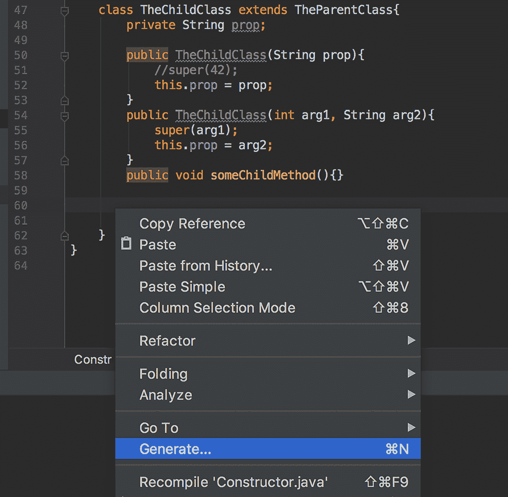
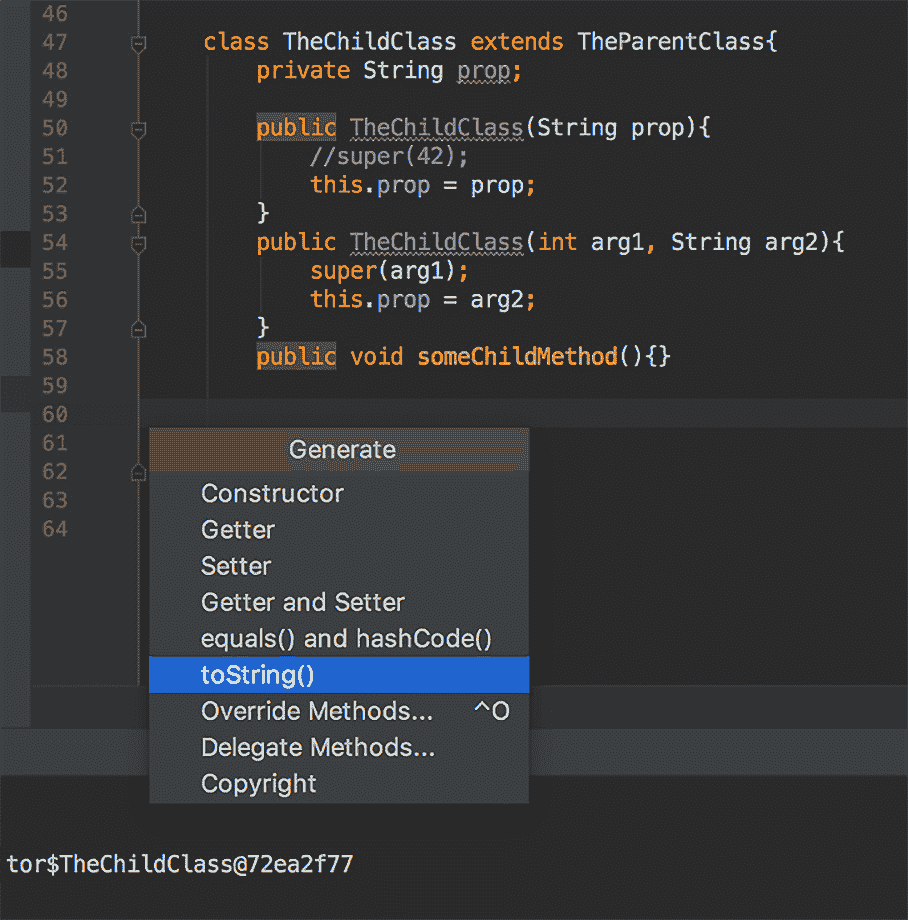
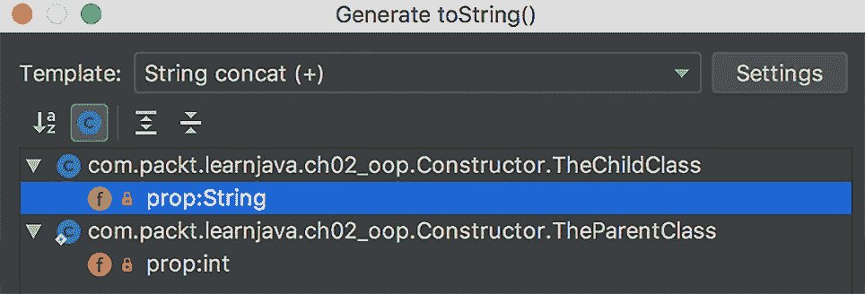

# *第二章*：Java 面向对象编程（OOP）

**面向对象编程**（**OOP**）的诞生源于更好地控制共享数据并发修改的必要性，这是面向对象编程之前的诅咒。这个想法的核心不是允许直接访问数据，而是只通过一个专门的代码层来访问。由于数据需要在过程中传递和修改，因此产生了对象的概念。在最一般的意义上，一个**对象**是一组可以传递和通过传递的方法访问的数据。这些数据被称为**对象状态**，而方法构成了**对象行为**。对象状态被隐藏（**封装**）以防止直接访问。

每个对象都是基于称为**类**的特定模板构建的。换句话说，类定义了一类对象。每个对象都有一个特定的**接口**，这是其他对象如何与之交互的正式定义。最初，一个对象会通过调用另一个对象的方法来向另一个对象发送消息。但这个术语并不适用，尤其是在引入了基于消息的协议和系统之后。

为了避免代码重复，引入了对象之间的父子关系——一个类可以从另一个类继承行为。在这种关系中，第一个类被称为**子类**或**子类**，而第二个类被称为**父类**、**基类**或**超类**。

之间定义了另一种形式的关系——一个类可以**实现**一个接口。由于接口描述了如何与对象交互，但没有描述对象如何响应交互，因此不同的对象在实现相同接口时可以表现出不同的行为。

在 Java 中，一个类只能有一个直接父类，但可以实现多个接口。

能够像其任何祖先一样表现并遵守多个接口的能力称为**多态性**。

在本章中，我们将探讨这些 OOP 概念以及它们如何在 Java 中实现。讨论的主题包括以下内容：

+   面向对象编程（OOP）概念

+   类

+   接口

+   超载、重写和隐藏

+   最终变量、方法和类

+   记录和密封类

+   多态性实例

# 技术要求

要能够执行本章提供的代码示例，您需要以下条件：

+   配有 Microsoft Windows、Apple macOS 或 Linux 操作系统的计算机

+   Java SE 版本 17 或更高

+   您偏好的 IDE 或代码编辑器

本书第一章，“Java 17 入门”，提供了如何设置 Java SE 和 IntelliJ IDEA 编辑器的说明。本章的代码示例文件可在 GitHub 仓库[`github.com/PacktPublishing/Learn-Java-17-Programming.git`](https://github.com/PacktPublishing/Learn-Java-17-Programming.git)的`examples/src/main/java/com/packt/learnjava/ch02_oop`文件夹中找到。

# 面向对象编程概念

如我们在引言中已经所述，主要的面向对象编程（OOP）概念如下：

+   **类**：这定义了基于此类的对象的属性和行为（方法）。

+   **对象**：这定义了状态（数据）为其属性的值，添加了从类中取出的行为（方法），并将它们组合在一起。

+   **继承**：这通过父-child 关系将行为传播到类链中。

+   **接口**：这描述了如何访问对象数据和行为。它将对象的（外观）与其实现（行为）隔离开来（抽象化）。

+   **封装**：这隐藏了状态和实现的细节。

+   **多态**：这允许对象假设实现接口的外观并表现出任何祖先类的行为。

## 对象/类

从原则上讲，你可以通过最小化使用类和对象来创建一个非常强大的应用程序。在 Java 8 中添加了函数式编程之后，这变得更加容易，因为 JDK 允许你将行为作为一个函数传递。然而，传递数据（状态）仍然需要类/对象。这意味着 Java 作为面向对象编程语言的地位仍然保持不变。

一个类定义了所有内部对象属性的类型，这些属性持有对象状态。一个类还定义了由方法代码表达的对象行为。可能存在没有状态或行为的类/对象。Java 还有一个静态访问行为的条款——无需创建对象。但这些可能性不过是向为了保持状态和行为在一起而引入的对象/类概念中添加的补充。

为了说明这个概念，例如，一个`Vehicle`类在原则上定义了车辆的性质和行为。让我们使模型简单化，并假设一个车辆只有两个属性——重量和一定功率的引擎。它还可以具有某种行为——在特定时间内达到一定的速度，这取决于其两个属性的价值。这种行为可以通过一个方法来表达，该方法计算车辆在特定时间内可以达到的速度。`Vehicle`类的每个对象都将具有特定的状态（其属性值）和速度计算将在相同的时间段内产生不同的速度。

所有的 Java 代码都包含在方法中。**方法**是一组具有（可选的）输入参数并返回一个值（也是可选的）的语句集合。此外，每个方法都可以有副作用——它可以显示一条消息或将数据写入数据库，例如。类/对象的行为是在方法中实现的。

要遵循我们的示例，速度计算可以放在一个`double calculateSpeed(float seconds)`方法中，例如。正如你可以猜到的，方法的名字是`calculateSpeed`。它接受一个带有小数部分的秒数作为参数，并返回速度值作为`double`类型。

## 继承

正如我们已经提到的，对象可以通过这种方式建立父子关系并共享属性和行为。例如，我们可以创建一个继承自`Vehicle`类的`Car`类，继承其属性（例如重量）和行为（例如速度计算）。此外，`子`类可以有自己的属性（例如乘客数量）和特定于汽车的行为（例如软冲击吸收）。但是，如果我们创建一个作为车辆子类的`Truck`类，它的附加特定于卡车的属性（例如载重）和行为（例如硬冲击吸收）将是不同的。

据说`Car`或`Truck`类的每个对象都有一个`Vehicle`类的父对象。但是`Car`和`Truck`类的对象并不共享特定的`Vehicle`对象（每次创建子对象时，首先创建一个新的父对象）。它们只共享父的行为。这就是为什么所有子对象都可以有相同的行为但不同的状态。这是实现代码重用的一种方式，但当对象行为需要动态变化时，可能不够灵活。在这种情况下，对象组合（从其他类引入行为）或函数式编程更为合适（参见*第十三章*，*函数式编程*）。

有可能使子对象的行为与继承的行为不同。为了实现这一点，捕获该行为的可以在`子`类中重新实现该方法。据说子对象可以*重写*继承的行为。我们将在稍后解释如何做到这一点（参见*重载、重写和隐藏*部分）。例如，如果`Car`类有自己的速度计算方法，则`Vehicle`父类的相应方法不会被继承，而是使用在`子`类中实现的新的速度计算方法。

父类属性也可以被继承（但不能被重写）。然而，类属性通常声明为私有；它们不能被继承——这就是封装的目的。请参阅*第三章*中关于各种访问级别——`public`、`protected`、`default`和`private`——的描述，*访问修饰符*部分。

如果父类从另一个类继承了一些行为，那么 `child` 类也会获得（继承）这种行为，除非，当然，父类重写了它。继承链的长度没有限制。

Java 中使用 `extends` 关键字表达父子关系：

```java
class A { }
```

```java
class B extends A { }
```

```java
class C extends B { }
```

```java
class D extends C { }
```

在此代码中，`A`、`B`、`C` 和 `D` 类有以下关系：

+   `D` 类继承自 `A`、`B` 和 `C` 类。

+   `C` 类继承自 `A` 和 `B` 类。

+   `B` 类继承自 `A` 类。

`A` 类的所有非私有方法都被 `B`、`C` 和 `D` 类继承（如果未被重写）。

`B` 类的所有非私有方法都被 `C` 和 `D` 类继承（如果未被重写）。

`C` 类的所有非私有方法都被 `D` 类继承（如果未被重写）。

## 抽象/接口

方法名称及其参数类型列表被称为 `Car` 或 `Truck`（在我们的例子中），可以访问。这样的描述与 `return` 类型一起呈现为一个接口。它并没有说关于执行计算的代码——只关于方法名称、参数类型、它们在参数列表中的位置以及结果类型。所有实现细节都被隐藏（封装）在实现此接口的类中。

如我们之前提到的，一个类可以实现许多不同的接口。但即使两个不同的类（及其对象）实现了相同的接口，它们的行为也可能不同。

类似于类，接口也可以使用 `extends` 关键字建立父子关系：

```java
interface A { }
```

```java
interface B extends A {}
```

```java
interface C extends B {}
```

```java
interface D extends C {}
```

在此代码中，`A`、`B`、`C` 和 `D` 接口有以下关系：

+   `D` 接口继承自 `A`、`B` 和 `C` 接口。

+   `C` 接口继承自 `A` 和 `B` 接口。

+   `B` 接口继承自 `A` 接口。

`A` 接口的所有非私有方法都被 `B`、`C` 和 `D` 接口继承。

`B` 接口的所有非私有方法都被 `C` 和 `D` 接口继承。

`C` 接口的所有非私有方法都被 `D` 接口继承。

抽象/接口还可以减少代码不同部分之间的依赖性，从而提高其可维护性。只要接口保持不变，每个类都可以更改，而无需与其客户端协调。

## 封装

**封装**通常被定义为数据隐藏或一组公开可访问的方法和私有可访问的数据。在广义上，封装是对对象属性访问的控制。

对象属性值的快照称为 **对象状态**。这是封装的数据。因此，封装解决了推动面向对象编程创建的主要问题——更好地管理对共享数据的并发访问，例如以下内容：

```java
class A {
```

```java
  private String prop = "init value";
```

```java
  public void setProp(String value){
```

```java
     prop = value;
```

```java
  }
```

```java
  public String getProp(){
```

```java
     return prop;
```

```java
  }
```

```java
}
```

如您所见，由于`private`访问修饰符，我们不能直接访问`prop`属性的值来读取或修改它。相反，我们只能通过`setProp(String value)`和`getProp()`方法来执行它。

## 多态

多态是对象以不同类或不同接口的实现的行为的能力。它归功于之前提到的所有概念——继承、接口和封装。没有它们，多态将不可能存在。

继承允许一个对象获取或覆盖其所有祖先的行为。接口隐藏了实现它的类的名称。封装防止暴露对象状态。

在接下来的章节中，我们将演示所有这些概念的实际应用，并在*多态的实际应用*部分查看多态的具体用法。

# 类

Java 程序是一系列表达可执行动作的语句。这些语句组织在方法中，方法组织在类中。一个或多个类存储在`.java`文件中。它们可以通过`javac` Java 编译器编译（从 Java 语言转换为字节码），并存储在`.class`文件中。每个`.class`文件只包含一个编译后的类，并且可以被 JVM 执行。

`java`命令启动 JVM 并告诉它哪个类是`main`类，即具有名为`main()`的方法的类。`main`方法有特定的声明——它必须是`public static`，必须返回`void`，名称为`main`，并接受一个`String`类型数组的单个参数。

JVM 将主类加载到内存中，找到`main()`方法，并逐句执行它。`java`命令还可以传递参数（参数）给`main()`方法，这些参数作为`String`值数组的参数接收。如果 JVM 遇到需要执行另一个类中方法的语句，那么该类（其`.class`文件）也会被加载到内存中，并执行相应的方法。因此，Java 程序流程完全是关于加载类和执行它们的方法。

这里是`main`类的一个示例：

```java
public class MyApp {
```

```java
  public static void main(String[] args){
```

```java
     AnotherClass an = new AnotherClass();
```

```java
     for(String s: args){
```

```java
        an.display(s);
```

```java
     }
```

```java
   }
```

```java
}
```

它代表了一个非常简单的应用，该应用接收任意数量的参数并将它们逐个传递到`AnotherClass`类的`display()`方法中。当 JVM 启动时，它首先从`MyApp.class`文件中加载`MyApp`类。然后，它从`AnotherClass.class`文件中加载`AnotherClass`类，使用`new`运算符（我们将在稍后讨论）创建该类的对象，并在其上调用`display()`方法。

这里是`AnotherClass`类：

```java
public class AnotherClass {
```

```java
   private int result;
```

```java
   public void display(String s){
```

```java
      System.out.println(s);
```

```java
   }
```

```java
   public int process(int i){
```

```java
      result = i *2;
```

```java
      return result;
```

```java
   }
```

```java
   public int getResult(){
```

```java
      return result;
```

```java
   }
```

```java
} 
```

如您所见，`display()`方法仅用于其副作用——它打印出传入的值，并返回空（`void`）。`AnotherClass`类还有其他两个方法：

+   `process()` 方法将输入整数加倍，将其存储在其 `result` 属性中，并将值返回给调用者。

+   `getResult()` 方法允许你在任何时间之后从对象中获取结果。

这两个方法在我们的演示应用程序中没有被使用。我们展示了它们只是为了表明一个类可以具有属性（在这种情况下是 `result`）和许多其他方法。

`private` 关键字使得值仅可以从类内部，从其方法中访问。`public` 关键字使得属性或方法可以被任何其他类访问。

## 方法

正如我们已经提到的，Java 语句被组织成方法：

```java
<return type> <method name>(<list of parameter types>){
```

```java
     <method body that is a sequence of statements>
```

```java
}
```

我们已经看到了一些例子。一个方法有一个名称，一组输入参数或者根本没有参数，一个在 `{}` 括号内的主体，以及一个返回类型或 `void` 关键字，表示该方法不返回任何值。

方法名称和参数类型列表一起被称为**方法签名**。输入参数的数量被称为**参数数量**。

重要提示

如果两个方法具有相同的名称、相同的参数数量和输入参数列表中相同类型的顺序，则它们具有相同的**签名**。

以下两个方法具有相同的签名：

```java
double doSomething(String s, int i){
```

```java
    //some code goes here
```

```java
}
```

```java
double doSomething(String i, int s){
```

```java
    //some code other code goes here
```

```java
}
```

即使签名相同，方法内的代码也可能不同。

以下两个方法具有不同的签名：

```java
double doSomething(String s, int i){
```

```java
    //some code goes here
```

```java
}
```

```java
double doSomething(int s, String i){
```

```java
    //some code other code goes here
```

```java
}
```

只需改变参数的顺序就会使签名不同，即使方法名称保持不变。

### 可变参数

一种特殊的参数类型需要特别提及，因为它与其他所有参数类型都相当不同。它通过三个点声明为一个类型。它被称为**可变参数（varargs**），代表**可变参数**。但是，首先，让我们简要地定义一下在 Java 中数组是什么。

**数组**是一种数据结构，它包含相同类型的元素。元素通过一个数值索引来引用。这就是我们现在需要知道的所有内容。我们将在*第六章*，*数据结构、泛型和常用工具*中更详细地讨论数组。

让我们从例子开始。让我们使用 `varargs` 声明方法参数：

```java
String someMethod(String s, int i, double... arr){
```

```java
 //statements that compose method body
```

```java
}
```

当调用 `someMethod` 方法时，Java 编译器从左到右匹配参数。一旦它到达最后一个 `varargs` 参数，它就会创建一个剩余参数的数组并将其传递给方法。以下是一个演示代码：

```java
public static void main(String... args){
```

```java
    someMethod("str", 42, 10, 17.23, 4);
```

```java
}
```

```java
private static String someMethod(
```

```java
        String s, int i, double... arr){
```

```java
    System.out.println(arr[0] + ", " + arr[1] + ", " + arr[2]); 
```

```java
                                     //prints: 10.0, 17.23, 4.0
```

```java
    return s;
```

```java
}
```

如您所见，`varargs` 参数类似于指定类型的数组。它可以作为方法的最后一个或唯一参数列出。这就是为什么有时您会看到像前面示例中那样的 `main` 方法被声明。

## 构造函数

当创建一个对象时，JVM 为整型使用 `0`，为浮点型使用 `0.0`，为布尔型使用 `false`。对于其他 Java 引用类型（见*第三章*，*Java 基础*），默认值是 `null`，这意味着引用类型的属性没有被分配任何值。

重要提示

当一个类中没有声明构造函数时，我们说该类具有由 JVM 提供的无参数默认构造函数。

如果需要，可以显式声明任意数量的构造函数，每个构造函数接受不同的一组参数来设置初始状态。以下是一个示例：

```java
class SomeClass {
```

```java
     private int prop1;
```

```java
     private String prop2;
```

```java
     public SomeClass(int prop1){
```

```java
         this.prop1 = prop1;
```

```java
     }
```

```java
     public SomeClass(String prop2){
```

```java
         this.prop2 = prop2;
```

```java
     }
```

```java
     public SomeClass(int prop1, String prop2){
```

```java
         this.prop1 = prop1;
```

```java
         this.prop2 = prop2;
```

```java
     }   
```

```java
     // methods follow 
```

```java
}
```

如果构造函数没有设置属性，则将自动分配相应类型的默认值。

当几个类沿着相同的继承线相关联时，首先创建父对象。如果父对象需要为其属性设置非默认的初始值，则必须在子构造函数的第一行使用`super`关键字调用其构造函数，如下所示：

```java
class TheParentClass {
```

```java
    private int prop;
```

```java
    public TheParentClass(int prop){
```

```java
        this.prop = prop;
```

```java
    }
```

```java
    // methods follow
```

```java
}
```

```java
class TheChildClass extends TheParentClass{
```

```java
    private int x;
```

```java
    private String prop;
```

```java
    private String anotherProp = "abc";
```

```java
    public TheChildClass(String prop){
```

```java
       super(42);
```

```java
       this.prop = prop;
```

```java
    }
```

```java
    public TheChildClass(int arg1, String arg2){
```

```java
       super(arg1);
```

```java
       this.prop = arg2;
```

```java
    }
```

```java
    // methods follow
```

```java
}
```

在前面的代码示例中，我们向`TheChildClass`添加了两个构造函数——一个总是将`42`传递给`TheParentClass`的构造函数，另一个接受两个参数。请注意，`x`属性已声明但未显式初始化。当创建`TheChildClass`的对象时，它将被设置为`int`类型的默认值`0`。另外，请注意，`anotherProp`属性被显式初始化为值`"abc"`。否则，它将被初始化为`null`值，这是任何引用类型的默认值，包括`String`。

从逻辑上讲，当在类中不需要显式定义构造函数时，存在三种情况：

+   当对象及其任何父类都没有需要初始化的属性时

+   当每个属性都随着类型声明一起初始化时（例如`int x = 42`）

+   当属性的初始化默认值足够好时

尽管如此，即使满足上述三个条件（列出的条件），仍然可能实现构造函数。例如，你可能想要执行一些初始化外部资源的语句——一个文件或另一个数据库——对象创建时将需要这些资源。

一旦添加了显式构造函数，就不会提供默认构造函数，以下代码会生成错误：

```java
class TheParentClass {
```

```java
    private int prop;
```

```java
    public TheParentClass(int prop){
```

```java
        this.prop = prop;
```

```java
    }
```

```java
    // methods follow
```

```java
}
```

```java
class TheChildClass extends TheParentClass{
```

```java
    private String prop;
```

```java
    public TheChildClass(String prop){
```

```java
        //super(42);  //No call to the parent's constructor
```

```java
        this.prop = prop;
```

```java
    }
```

```java
    // methods follow
```

```java
}
```

为了避免错误，可以向`TheParentClass`添加一个无参数的构造函数，或者在子构造函数的第一行显式调用父类的构造函数。以下代码不会生成错误：

```java
class TheParentClass {
```

```java
    private int prop;
```

```java
    public TheParentClass() {}
```

```java
    public TheParentClass(int prop){
```

```java
        this.prop = prop;
```

```java
    }
```

```java
    // methods follow
```

```java
}
```

```java
class TheChildClass extends TheParentClass{
```

```java
    private String prop;
```

```java
    public TheChildClass(String prop){
```

```java
        this.prop = prop;
```

```java
    }
```

```java
    // methods follow
```

```java
}
```

一个需要注意的重要方面是，尽管构造函数看起来像方法，但它们既不是方法也不是类的成员。构造函数没有返回类型，并且总是与类的名称相同。它的唯一目的是在创建类的新实例时被调用。

## 新操作符

`new`运算符通过为新对象的属性分配内存来创建一个类的对象（也可以说它是**实例化一个类**或**创建一个类的实例**），并返回对该内存的引用。这个内存引用被分配给一个与创建对象的类或其父类相同类型的变量：

```java
TheChildClass ref1 = new TheChildClass("something"); 
```

```java
TheParentClass ref2 = new TheChildClass("something");
```

这里有一个有趣的观察。在代码中，`ref1`和`ref2`这两个对象引用都可以访问`TheChildClass`和`TheParentClass`的方法。例如，我们可以向这些类添加方法，如下所示：

```java
class TheParentClass {
```

```java
    private int prop;
```

```java
    public TheParentClass(int prop){
```

```java
        this.prop = prop;
```

```java
    }
```

```java
    public void someParentMethod(){}
```

```java
}
```

```java
class TheChildClass extends TheParentClass{
```

```java
    private String prop;
```

```java
    public TheChildClass(int arg1, String arg2){
```

```java
        super(arg1);
```

```java
        this.prop = arg2;
```

```java
    }
```

```java
    public void someChildMethod(){}
```

```java
}
```

然后，我们可以使用以下任何一种引用来调用它们：

```java
TheChildClass ref1 = new TheChildClass("something");
```

```java
TheParentClass ref2 = new TheChildClass("something");
```

```java
ref1.someChildMethod();
```

```java
ref1.someParentMethod();
```

```java
((TheChildClass) ref2).someChildMethod();
```

```java
ref2.someParentMethod();
```

注意，为了使用父类的类型引用来访问子类的方法，我们必须将其转换为子类的类型。否则，编译器会生成错误。这是可能的，因为我们已经将子类对象的引用分配给了父类的类型引用。这就是多态的力量。我们将在*多态实践*部分更多地讨论它。

自然地，如果我们把父类的对象分配给父类类型的变量，即使进行类型转换，我们也不能访问子类的方法，如下例所示：

```java
TheParentClass ref2 = new TheParentClass(42);
```

```java
((TheChildClass) ref2).someChildMethod();  //compiler's error
```

```java
ref2.someParentMethod();
```

为新对象分配内存的区域称为**堆**。JVM 有一个名为**垃圾收集**的过程，它会监视这个区域的用法，并在对象不再需要时立即释放内存。例如，看看以下方法：

```java
void someMethod(){
```

```java
   SomeClass ref = new SomeClass();
```

```java
   ref.someClassMethod();
```

```java
   //other statements follow
```

```java
}
```

一旦`someMethod()`方法的执行完成，`SomeClass`的对象就不再可访问了。这就是垃圾收集器所注意到的，它会释放这个对象占用的内存。我们将在*第九章*中讨论垃圾收集过程，*JVM 结构和垃圾收集*。

## 类`java.lang.Object`

在 Java 中，所有类默认都是`Object`类的子类，即使你没有显式地指定。`Object`类声明在标准 JDK 库的`java.lang`包中。我们将在*包、导入和访问*部分定义什么是*包*，并在*第七章*中描述库，*Java 标准库和外部库*。

让我们回顾一下我们在*继承*部分提供的示例：

```java
class A { }
```

```java
class B extends A {}
```

```java
class C extends B {}
```

```java
class D extends C {}
```

所有类，`A`、`B`、`C`和`D`，都是`Object`类的子类，它有 10 个方法，每个类都会继承：

+   `public String toString()`

+   `public int hashCode()`

+   `public boolean equals (Object obj)`

+   `public Class getClass()`

+   `protected Object clone()`

+   `public void notify()`

+   `public void notifyAll()`

+   `public void wait()`

+   `public void wait(long timeout)`

+   `public void wait(long timeout, int nanos)`

前三个，`toString()`、`hashCode()`和`equals()`，是最常用的方法，通常会被重新实现（重写）。`toString()`方法通常用于打印对象的状态。在 JDK 中的默认实现看起来像这样：

```java
public String toString() {
```

```java
   return getClass().getName()+"@"+
```

```java
                     Integer.toHexString(hashCode());
```

```java
}
```

如果我们在`TheChildClass`类的对象上使用它，结果将如下所示：

```java
TheChildClass ref1 = new TheChildClass("something");
```

```java
System.out.println(ref1.toString());  
```

```java
//prints: com.packt.learnjava.ch02_oop.
```

```java
//Constructor$TheChildClass@72ea2f77
```

顺便说一下，在将对象传递给`System.out.println()`方法以及类似的输出方法时，没有必要显式调用`toString()`，因为它们在方法内部已经做了这件事，在我们的例子中，`System.out.println(ref1)`会产生相同的结果。

因此，正如你所看到的，这样的输出不是面向人类的，所以重写`toString()`方法是个好主意。最简单的方法是使用 IDE。例如，在 IntelliJ IDEA 中，在`TheChildClass`代码内部右键单击，如图下截图所示：



选择并点击**生成...**，然后选择并点击**toString()**，如图下截图所示：



新弹出的窗口将允许你选择你希望在`toString()`方法中包含的属性。只选择`TheChildClass`的属性，如下所示：



点击**确定**按钮后，将生成以下代码：

```java
@Override
```

```java
public String toString() {
```

```java
    return "TheChildClass{" +
```

```java
            "prop='" + prop + '\'' +
```

```java
            '}';
```

```java
}
```

如果类中有更多属性并且你选择了它们，方法输出中将会包含更多属性及其值。如果我们现在打印对象，结果将是这样的：

```java
TheChildClass ref1 = new TheChildClass("something");
```

```java
System.out.println(ref1.toString());  
```

```java
                      //prints: TheChildClass{prop='something'}
```

这就是为什么`toString()`方法经常被重写，甚至被包含在 IDE 的服务中。

我们将在*第六章*中更详细地讨论`hashCode()`和`equals()`方法，*数据结构、泛型和常用工具*。

`getClass()`和`clone()`方法使用得不太频繁。`getClass()`方法返回一个`Class`类的对象，该对象有许多提供各种系统信息的方法。最常用的方法是返回当前对象类名的那个方法。`clone()`方法可以用来复制当前对象。只要当前对象的所有属性都是基本类型，它就能正常工作。但是，如果存在引用类型属性，`clone()`方法必须被重新实现，以便正确地复制引用类型。否则，只会复制引用，而不是对象本身。这种复制被称为`protected`关键字表示只有类的子类可以访问它。请参阅*包、导入和访问*部分。

类`Object`的最后一个五个方法用于线程之间的通信——轻量级进程用于并发处理。它们通常不会被重新实现。

## 实例和静态属性和方法

到目前为止，我们主要看到的方法只能在一个类的（实例）对象上调用。这类方法被称为`静态`方法，并且可以在不创建对象的情况下调用。一个这样的方法的例子是`main()`方法。下面是另一个例子：

```java
class SomeClass{
```

```java
    public static void someMethod(int i){
```

```java
        //do something
```

```java
    }
```

```java
}
```

这个方法可以这样调用：

```java
SomeClass.someMethod(42);
```

重要提示

静态方法也可以在对象上调用，但这被认为是不良的实践，因为它隐藏了方法对试图理解代码的人的静态性质。此外，它还会引发编译器警告，并且根据编译器的实现，甚至可能生成编译器错误。

同样，一个属性也可以被声明为静态，因此可以在不创建对象的情况下访问，例如以下内容：

```java
class SomeClass{
```

```java
    public static String SOME_PROPERTY = "abc";
```

```java
}
```

这个属性可以通过类直接访问，如下所示：

```java
System.out.println(SomeClass.SOME_PROPERTY);  //prints: abc
```

有这样的静态属性与状态封装的理念相悖，并可能导致并发数据修改的所有问题，因为它在 JVM 内存中作为一个单独的副本存在，并且所有使用它的方法共享相同的值。这就是为什么静态属性通常用于两个目的：

+   要存储一个常量——一个可以读取但不能修改的值（也称为**只读值**）

+   要存储一个创建成本高昂或保持只读值的无状态对象

常见的常量例子是一个资源的名称：

```java
class SomeClass{
```

```java
    public static final String INPUT_FILE_NAME = "myFile.csv";
```

```java
}
```

注意静态属性前面的`final`关键字。它告诉编译器和 JVM，这个值一旦分配，就不能改变。尝试这样做会生成错误。它有助于保护值并清楚地表达将此值作为常量的意图。当人类试图理解代码的工作方式时，这样的看似微小的细节使代码更容易理解。

话虽如此，考虑使用接口来达到这样的目的。自从 Java 1.8 以来，接口中声明的所有字段都是隐式静态和最终的，因此你忘记声明一个值是最终的几率更小。我们很快就会谈到接口。

当一个对象被声明为静态最终类属性时，并不意味着它的所有属性都会自动变为最终。它只保护属性不被分配相同类型的另一个对象。我们将在*第八章*中讨论对象属性并发访问的复杂过程，*多线程和并发处理*。尽管如此，程序员经常使用静态最终对象来存储只通过它们在应用程序中的使用方式读取的值。一个典型的例子就是应用程序配置信息。一旦从磁盘读取后创建，即使可以改变，也不会改变。此外，从外部资源获取的数据缓存。

再次提醒，在将此类属性用于此目的之前，考虑使用提供更多默认行为以支持只读功能的接口。

与静态属性类似，静态方法可以在不创建类实例的情况下调用。例如，考虑以下类：

```java
class SomeClass{
```

```java
    public static String someMethod() {
```

```java
        return "abc";
```

```java
    }
```

```java
}
```

我们可以使用类名直接调用前面的方法：

```java
System.out.println(SomeClass.someMethod()); //prints: abc
```

# 接口

在*抽象/接口*部分，我们一般性地讨论了接口。在本节中，我们将描述一个 Java 语言结构，它表达了接口的概念。

接口展示了对象可以期望的行为。它隐藏了实现细节，只暴露带有返回值的方法签名。例如，以下是一个声明了两个抽象方法的接口：

```java
interface SomeInterface {
```

```java
    void method1();
```

```java
    String method2(int i);
```

```java
}
```

下面是一个实现它的类：

```java
class SomeClass implements SomeInterface{
```

```java
    public void method1(){
```

```java
        //method body
```

```java
    }
```

```java
    public String method2(int i) {
```

```java
        //method body
```

```java
        return "abc";
```

```java
    }
```

```java
}
```

接口不能被实例化。只能通过创建实现此接口的类的对象来创建接口类型的对象：

```java
SomeInterface si = new SomeClass(); 
```

如果接口的所有抽象方法都没有被实现，则该类必须被声明为抽象类，并且不能被实例化。请参阅*接口与抽象类*部分。

接口不描述如何创建类的对象。要发现这一点，您必须查看类并查看它有哪些构造函数。接口也不描述静态类方法。因此，接口只是类实例（对象）的公共面孔。

在 Java 8 中，接口不仅获得了具有抽象方法（没有方法体）的能力，还获得了真正实现的方法的能力。根据 Java 语言规范，“*接口的主体可以声明接口的成员，即字段、方法、类和接口*。”这样的广泛声明引发了一个问题，接口和类之间的区别是什么？我们已经指出的一个主要区别是——接口不能被实例化；只有类可以被实例化。

另一个区别是，接口内部实现的非静态方法被声明为`default`或`private`。相比之下，类方法中不可用`default`声明。

此外，接口中的字段默认是公共的、静态的和最终的。相比之下，类属性和方法默认不是静态或最终的。类的隐式（默认）访问修饰符，包括其字段、方法和构造函数，是包私有的，这意味着它只在其自己的包内可见。

## 默认方法

要了解接口中默认方法的功能，让我们看看以下接口及其实现类的示例：

```java
interface SomeInterface {
```

```java
    void method1();
```

```java
    String method2(int i);
```

```java
    default int method3(){
```

```java
        return 42;
```

```java
    }
```

```java
}
```

```java
class SomeClass implements SomeInterface{
```

```java
    public void method1(){
```

```java
        //method body
```

```java
    }
```

```java
    public String method2(int i) {
```

```java
        //method body
```

```java
        return "abc";
```

```java
    }
```

```java
}
```

我们现在可以创建`SomeClass`类的对象并执行以下调用：

```java
SomeClass sc = new SomeClass();
```

```java
sc.method1();
```

```java
sc.method2(22);  //returns: "abc"
```

```java
System.out.println(sc.method2(22)); //prints: abc
```

```java
sc.method3();    //returns: 42
```

```java
System.out.println(sc.method3());   //prints: 42
```

如您所见，`method3()`在`SomeClass`类中没有实现，但看起来类好像有它。这是在不更改现有类的情况下向现有类添加新方法的一种方式——通过向类实现的接口添加默认方法。

现在我们也将`method3()`的实现添加到类中，如下所示：

```java
class SomeClass implements SomeInterface{
```

```java
    public void method1(){
```

```java
        //method body
```

```java
    }
```

```java
    public String method2(int i) {
```

```java
        //method body
```

```java
        return "abc";
```

```java
    }
```

```java
    public int method3(){
```

```java
        return 15;
```

```java
    }
```

```java
}
```

现在，将忽略`method3()`的接口实现：

```java
SomeClass sc = new SomeClass();
```

```java
sc.method1();
```

```java
sc.method2(22);  //returns: "abc"
```

```java
sc.method3();    //returns: 15
```

```java
System.out.println(sc.method3());      //prints: 15
```

重要提示

接口中的默认方法的目的在于向实现此接口的类提供新的方法，而无需更改它们。但是，一旦类实现了新方法，接口实现就会被忽略。

## 私有方法

如果接口中有多个默认方法，则可以创建仅由接口的默认方法可访问的私有方法。它们可以用来包含通用功能，而不是在每个默认方法中重复：

```java
interface SomeInterface {
```

```java
    void method1();
```

```java
    String method2(int i);
```

```java
    default int method3(){
```

```java
        return getNumber();
```

```java
    }
```

```java
    default int method4(){
```

```java
        return getNumber() + 22;
```

```java
    }
```

```java
    private int getNumber(){
```

```java
        return 42;
```

```java
    }
```

```java
}
```

这种私有方法的概念与类中的私有方法没有区别（参见*包、导入和访问*部分）。私有方法不能从接口外部访问。

## 静态字段和方法

自 Java 8 以来，接口中声明的所有字段都是隐式公共的、静态的和最终的常量。这就是为什么接口是常量的首选位置。你不需要在它们的声明中添加`public static final`。

至于静态方法，它们在接口中的功能与在类中相同：

```java
interface SomeInterface{
```

```java
   static String someMethod() {
```

```java
      return "abc";
```

```java
   }
```

```java
}
```

注意，没有必要将接口方法标记为`public`。所有非私有接口方法默认都是公共的。

我们可以使用接口名称来调用前面的方法：

```java
System.out.println(SomeInetrface.someMethod()); //prints: abc
```

## 接口与抽象类

我们已经提到，一个类可以被声明为`abstract`。它可能是一个我们不希望实例化的常规类，或者它可能是一个包含（或继承）抽象方法的类。在后一种情况下，我们必须将此类声明为`abstract`以避免编译错误。

在许多方面，抽象类与接口非常相似。它强制每个扩展它的`子`类实现抽象方法。否则，子类无法实例化，必须将其声明为抽象。

然而，接口与抽象类之间的一些主要差异使它们在不同的场景中都有用：

+   抽象类可以有构造函数，而接口则不能。

+   抽象类可以有状态，而接口则不能。

+   抽象类的字段可以是`public`、`private`或`protected`，可以是`static`也可以不是，可以是`final`也可以不是，而在接口中，字段始终是`public`、`static`和`final`。

+   抽象类中的方法可以是`public`、`private`或`protected`，而接口方法只能是`public`或`private`。

+   如果你想要修改的类已经扩展了另一个类，你不能使用抽象类，但你可以实现一个接口，因为一个类只能扩展一个其他类，但可以实现多个接口。

你将在*多态的实际应用*部分看到一个抽象使用的例子。

# 资重载、覆盖和隐藏

我们已经在*继承*和*抽象/接口*章节中提到了覆盖。它是在父类中实现的非静态方法与子类中具有相同签名的方法的替换。接口的默认方法也可以在扩展它的接口中被覆盖。隐藏与覆盖类似，但仅适用于静态方法和静态属性以及实例属性。

赋值重载是指在同一个类或接口中创建具有相同名称但参数不同（因此，签名不同）的多个方法。

在本节中，我们将讨论所有这些概念，并演示它们在类和接口中的应用方式。

## 赋值重载

在同一个接口或类中不可能有两个具有相同签名的不同方法。为了有不同的签名，新方法必须具有新的名称或不同的参数类型列表（参数类型的顺序也很重要）。具有相同名称但参数类型列表不同的两个方法构成了赋值重载。以下是一些在接口中合法的赋值重载方法的示例：

```java
interface A {
```

```java
    int m(String s);
```

```java
    int m(String s, double d);
```

```java
    default int m(String s, int i) { return 1; }
```

```java
    static int m(String s, int i, double d) { return 1; }
```

```java
}
```

注意，前面提到的任何两种方法都没有相同的签名，包括默认和静态方法。否则，编译器将生成错误。无论是默认还是静态的指定都不会影响赋值重载。返回类型也不会影响赋值重载。我们在这里使用`int`作为返回类型，只是为了使示例更简洁。

类中的方法重载方式类似：

```java
    class C {
```

```java
        int m(String s){ return 42; }
```

```java
        int m(String s, double d){ return 42; }
```

```java
        static int m(String s, double d, int i) { return 1; }
```

```java
    }
```

并且，方法具有相同名称的位置并不重要。以下的方法重载与前面的示例没有区别，如下所示：

```java
interface A {
```

```java
    int m(String s);
```

```java
    int m(String s, double d);
```

```java
}
```

```java
interface B extends A {
```

```java
    default int m(String s, int i) { return 1; }
```

```java
    static int m(String s, int i, double d) { return 1; }
```

```java
}
```

```java
class C {
```

```java
     int m(String s){ return 42; }
```

```java
}
```

```java
class D extends C {
```

```java
     int m(String s, double d){ return 42; }
```

```java
     static int m(String s, double d, int i) { return 1; }
```

```java
}
```

私有非静态方法只能由同一类中的非静态方法重载。

重要提示

当方法具有相同的名称但不同的参数类型列表，并且属于同一个接口（或类）或不同的接口（或类），其中一个接口（或类）是另一个的祖先时，就会发生赋值重载。私有方法只能由同一类中的方法重载。

## 覆盖

与赋值重载不同，赋值重载发生在静态和非静态方法中，而方法覆盖仅发生在非静态方法中，并且只有当它们具有*完全相同的签名*并且*属于不同的接口（或类）*时才会发生，其中一个接口（或类）是另一个的祖先。

重要提示

覆盖的方法位于子接口（或类）中，而被覆盖的方法具有相同的签名，并属于祖先接口（或类）之一。私有方法不能被覆盖。

以下是一个方法覆盖接口的示例：

```java
interface A {
```

```java
    default void method(){
```

```java
        System.out.println("interface A");
```

```java
    }
```

```java
}
```

```java
interface B extends A{
```

```java
    @Override
```

```java
    default void method(){
```

```java
        System.out.println("interface B");
```

```java
    }
```

```java
}
```

```java
class C implements B { }
```

如果我们使用`C`类实例调用`method()`，结果如下：

```java
C c = new C();
```

```java
c.method();      //prints: interface B
```

请注意`@Override`注解的使用。它告诉编译器程序员认为注解的方法覆盖了祖先接口中的一个方法。这样，编译器可以确保确实发生了覆盖，如果没有，则生成错误。例如，程序员可能会拼错方法名，如下所示：

```java
interface B extends A{
```

```java
    @Override
```

```java
    default void method(){
```

```java
        System.out.println("interface B");
```

```java
    }
```

```java
}
```

如果发生这种情况，编译器会生成一个错误，因为没有`metod()`方法可以覆盖。如果没有`@Override`注解，程序员可能不会注意到这个错误，结果会完全不同：

```java
C c = new C();
```

```java
c.method();      //prints: interface A
```

重写的规则同样适用于类实例方法。在以下示例中，`C2`类覆盖了`C1`类的一个方法：

```java
class C1{
```

```java
    public void method(){
```

```java
        System.out.println("class C1");
```

```java
    }
```

```java
}
```

```java
class C2 extends C1{
```

```java
    @Override
```

```java
    public void method(){
```

```java
        System.out.println("class C2");
```

```java
    }
```

```java
}
```

结果如下：

```java
C2 c2 = new C2();
```

```java
c2.method();      //prints: class C2
```

不论重写方法所在的类或接口与重写方法所在的类或接口之间有多少祖先，这都没有关系：

```java
class C1{
```

```java
    public void method(){
```

```java
        System.out.println("class C1");
```

```java
    }
```

```java
}
```

```java
class C3 extends C1{
```

```java
    public void someOtherMethod(){
```

```java
        System.out.println("class C3");
```

```java
    }
```

```java
}
```

```java
class C2 extends C3{
```

```java
    @Override
```

```java
    public void method(){
```

```java
        System.out.println("class C2");
```

```java
    }
```

```java
}
```

上述方法重写的结果仍然相同。

## 隐藏

**隐藏**对于许多人来说是一个复杂的话题，但它不应该如此复杂，我们将尝试让它看起来很简单。

“隐藏”这个名字来源于类和接口的静态属性和方法的行为。每个静态属性或方法在 JVM 的内存中只存在一个副本，因为它们与接口或类相关联，而不是与对象相关联。接口或类作为一个单独的副本存在。这就是为什么我们不能说子类的静态属性或方法会覆盖父类的同名静态属性或方法。所有静态属性和方法仅在类或接口加载时加载到内存中，并保持在那里，不会被复制到任何地方。让我们看一个例子。

让我们创建两个具有父子关系的接口，它们具有相同名称的静态字段和方法：

```java
interface A {
```

```java
    String NAME = "interface A";
```

```java
    static void method() {
```

```java
        System.out.println("interface A");
```

```java
    }
```

```java
}
```

```java
interface B extends A {
```

```java
    String NAME = "interface B";
```

```java
    static void method() {
```

```java
        System.out.println("interface B");
```

```java
    }
```

```java
}
```

请注意接口字段标识符的大小写。这是通常用来表示常量的约定，无论它是在接口中还是类中声明。只是为了提醒你，Java 中的常量是一个变量，一旦初始化，就不能重新分配另一个值。接口字段默认是常量，因为接口中的任何字段都是*final*（参见“*最终属性、方法和类*”部分）。

如果我们从`B`接口打印`NAME`并执行其`method()`，我们会得到以下结果：

```java
System.out.println(B.NAME); //prints: interface B
```

```java
B.method();                 //prints: interface B
```

它看起来很像重写，但实际上，我们只是调用与这个特定接口相关联的特定属性或方法。

类似地，考虑以下类：

```java
public class C {
```

```java
    public static String NAME = "class C";
```

```java
    public static void method(){
```

```java
        System.out.println("class C"); 
```

```java
    }
```

```java
    public String name1 = "class C";
```

```java
}
```

```java
public class D extends C {
```

```java
    public static String NAME = "class D";
```

```java
    public static void method(){
```

```java
        System.out.println("class D"); 
```

```java
    }
```

```java
    public String name1 = "class D";
```

```java
}
```

如果我们尝试使用`D`类本身来访问其静态成员，我们会得到我们请求的结果：

```java
System.out.println(D.NAME);  //prints: class D
```

```java
D.method();                  //prints: class D
```

只有当通过对象访问属性或静态方法时，才会出现混淆：

```java
C obj = new D();
```

```java
System.out.println(obj.NAME);        //prints: class C
```

```java
System.out.println(((D) obj).NAME);  //prints: class D
```

```java
obj.method();                        //prints: class C
```

```java
((D)obj).method();                   //prints: class D
```

```java
System.out.println(obj.name1);       //prints: class C
```

```java
System.out.println(((D) obj).name1); //prints: class D
```

`obj`变量指向`D`类的对象，正如前例所示，类型转换证明了这一点。但是，即使我们使用对象，尝试访问静态属性或方法也会带来用作声明变量类型的类的成员。至于示例最后两行中的实例属性，Java 中的属性并不符合多态行为，我们得到的是父`C`类的`name1`属性，而不是预期的子`D`类的属性。

重要提示

为了避免与类的静态成员混淆，始终使用类而不是对象来访问它们。为了避免与实例属性混淆，始终将它们声明为私有，并通过方法访问它们。

为了说明最后一条建议，考虑以下类：

```java
class X {
```

```java
    private String name = "class X";
```

```java
    public String getName() {
```

```java
        return name;
```

```java
    }
```

```java
    public void setName(String name) {
```

```java
        this.name = name;
```

```java
    }
```

```java
}
```

```java
class Y extends X {
```

```java
    private String name = "class Y";
```

```java
    public String getName() {
```

```java
        return name;
```

```java
    }
```

```java
    public void setName(String name) {
```

```java
        this.name = name;
```

```java
    }
```

```java
}
```

如果我们对实例属性运行与`C`和`D`类相同的测试，结果将是这样的：

```java
X x = new Y();
```

```java
System.out.println(x.getName());      //prints: class Y
```

```java
System.out.println(((Y)x).getName()); //prints: class Y
```

现在，我们通过方法访问实例属性，这些方法是重写效应的主题，并且不再有意外结果。

在结束对 Java 中隐藏特性的讨论后，我们想提及另一种隐藏类型，即当局部变量与同名实例或静态属性隐藏时。以下是一个实现此功能的类：

```java
public class HidingProperty {
```

```java
   private static String name1 = "static property";
```

```java
   private String name2 = "instance property";
```

```java
   public void method() {
```

```java
      var name1 = "local variable";
```

```java
      System.out.println(name1);     //prints: local variable
```

```java
      var name2 = "local variable";  //prints: local variable
```

```java
      System.out.println(name2);
```

```java
      System.out.println(HidingProperty.name1); 
```

```java
                                     //prints: static property
```

```java
      System.out.println(this.name2);
```

```java
                                   //prints: instance property
```

```java
   }
```

```java
}
```

如您所见，`name1`局部变量隐藏了同名的静态属性，而`name2`局部变量隐藏了实例属性。仍然可以使用类名访问静态属性（见`HidingProperty.name1`）。请注意，尽管它被声明为`private`，但仍然可以从类内部访问。

实例属性始终可以通过使用`this`关键字来访问，这意味着**当前对象**。

# `final`变量、方法和类

我们多次提到`final`属性与 Java 中常量的概念相关，但这只是使用`final`关键字的一个例子。它可以应用于任何变量。类似地，可以将类似约束应用于方法甚至类，从而防止方法被重写和类被扩展。

## `final`变量

在变量声明前放置`final`关键字使得该变量在初始化后不可变，例如以下所示：

```java
final String s = "abc";
```

初始化甚至可以延迟：

```java
final String s;
```

```java
s = "abc";
```

对于`object`属性，这种延迟只能持续到对象被创建。这意味着属性可以在构造函数中初始化，如下所示：

```java
class A {
```

```java
    private final String s1 = "abc";
```

```java
    private final String s2;
```

```java
    private final String s3;   //error
```

```java
    private final int x;       //error
```

```java
    public A() {
```

```java
        this.s1 = "xyz";      //error
```

```java
        this.s2 = "xyz";     
```

```java
    }
```

```java
}
```

注意，即使在对象构造过程中，也无法对属性进行两次初始化——一次在声明时，一次在构造函数中。值得注意的是，必须显式初始化`final`属性。正如前例所示，编译器不允许将`final`属性初始化为默认值。

还可以在初始化块中初始化`final`属性：

```java
class B {
```

```java
    private final String s1 = "abc";
```

```java
    private final String s2;
```

```java
    {
```

```java
        s1 = "xyz"; //error
```

```java
        s2 = "abc";
```

```java
    }
```

```java
}
```

对于静态属性，无法在构造函数中初始化它，因此必须在声明期间或静态初始化块中初始化：

```java
class C {
```

```java
    private final static String s1 = "abc";
```

```java
    private final static String s2;
```

```java
    static {
```

```java
        s1 = "xyz"; //error
```

```java
        s2 = "abc";
```

```java
    }
```

```java
}
```

在接口中，所有字段始终是最终的，即使它们没有被声明为最终。由于接口中不允许有构造函数或初始化块，初始化接口字段的唯一方法是在声明期间。未能这样做会导致编译错误：

```java
interface I {
```

```java
    String s1;  //error
```

```java
    String s2 = "abc";
```

```java
}
```

## 最终方法

声明为`final`的方法不能在`子`类中重写，或者在静态方法的情况下隐藏。例如，Java 中所有类的祖先`java.lang.Object`类，其中一些方法被声明为`final`：

```java
public final Class getClass()x
```

```java
public final void notify()
```

```java
public final void notifyAll()
```

```java
public final void wait() throws InterruptedException
```

```java
public final void wait(long timeout) 
```

```java
                         throws InterruptedException
```

```java
public final void wait(long timeout, int nanos)
```

```java
                         throws InterruptedException
```

`final`类的所有私有方法和非继承方法实际上是最终的，因为你不能重写它们。

## 最终类

`final`类不能被扩展。它不能有子类，这使得类的所有方法实际上也是`final`。这个特性用于安全或当程序员想要确保类功能不能因为其他设计考虑而被重写、覆盖或隐藏。

# 记录类

`record`类是在 Java 16 中添加到 SDK 的。这是一个长期期待的功能。它允许你在需要不可变类（只有 getters）的情况下避免编写样板代码，如下面的`Person`类所示（请参阅`ch02_oop`文件夹中的`Record`类）：

```java
final class Person {
```

```java
    private int age;
```

```java
    private String name;
```

```java
    public Person(int age, String name) {
```

```java
        this.age = age;
```

```java
        this.name = name;
```

```java
    }
```

```java
    public int age() { return age; }
```

```java
    public String name() { return name; }
```

```java
    @Override
```

```java
    public boolean equals(Object o) {
```

```java
        //implementation not shown for brevity
```

```java
    }
```

```java
    @Override
```

```java
    public int hashCode() {
```

```java
        //implementation not shown for brevity
```

```java
    }
```

```java
    @Override
```

```java
    public String toString() {
```

```java
        //implementation not shown for brevity
```

```java
    }
```

请注意，前面上面的 getters 没有`get`前缀。这是故意为之，因为在不可变类的情况下，没有必要区分 getters 和 setters，因为如果我们想使类真正不可变，那么 setters 既不应该也不应该存在。这就是此类与 JavaBeans 之间的主要区别，JavaBeans 是可变的，既有 setters 也有 getters。

`record`类允许你只用一行代码替换前面的实现：

```java
record Person(int age, String name){}
```

我们可以用以下代码来演示：

```java
record PersonR(int age, String name){} //We added suffix "R" 
```

```java
                 //to distinguish this class from class Person
```

```java
Person person = new Person(25, "Bill");
```

```java
System.out.println(person);  
```

```java
                          //prints: Person{age=25, name='Bill'}
```

```java
System.out.println(person.name());            //prints: Bill
```

```java
Person person1 = new Person(25, "Bill");
```

```java
System.out.println(person.equals(person1));   //prints: true
```

```java
PersonR personR = new PersonR(25, "Bill");
```

```java
System.out.println(personR);   
```

```java
                         //prints: PersonR{age=25, name='Bill'}
```

```java
System.out.println(personR.name());           //prints: Bill
```

```java
PersonR personR1 = new PersonR(25, "Bill");
```

```java
System.out.println(personR.equals(personR1)); //prints: true
```

```java
System.out.println(personR.equals(person));   //prints: false
```

除了是`final`（不可扩展）和不可变之外，`record`不能扩展另一个类，因为它已经扩展了`java.lang.Record`，但它可以实现另一个接口，如下面的示例所示：

```java
interface Student{
```

```java
    String getSchoolName();
```

```java
}
```

```java
record StudentImpl(String name, String school) implements Student{
```

```java
    @Override
```

```java
    public String getSchoolName() { return school(); }
```

```java
}
```

可以向`record`添加一个`static`方法，如下面的代码片段所示：

```java
record StudentImpl(String name, String school) implements Student{
```

```java
    public static String getSchoolName(Student student) {
```

```java
         return student.getSchoolName();
```

```java
    }
```

```java
}
```

静态方法既不能也不能访问实例属性，只能利用传递给它的参数值。

`record`可以有一个额外的构造函数，例如可以添加如下：

```java
record StudentImpl(String name, String school) implements Student{
```

```java
    public StudentImpl(String name) {
```

```java
        this(name, "Unknown");
```

```java
    } 
```

```java
}
```

正如你可能已经注意到的，无法向`record`添加另一个属性或 setter，而所有额外的 getters 都必须只使用`record`已提供的 getters。

# 密封类和接口

一个`final`类不能被扩展，而非公共类或接口的访问权限有限。然而，有时一个类或接口需要从任何地方都可以访问，但只能由某个特定的类或接口扩展，或者在接口的情况下，只能由某些类实现。这就是在 Java 17 中向 SDK 添加`密封`类和接口的动机。

`密封`类或接口与`final`类或接口之间的区别在于，`密封`类或接口总是有一个`permits`关键字，后面跟着允许扩展`密封`类或接口的现有直接子类列表，或者在接口的情况下，实现它的类。请注意，这里的词*existing*。在`permits`关键字后面的子类必须在编译时存在于与密封类相同的模块中，或者在默认（未命名的）模块中，如果是在同一个包中。

`密封`类的子类必须标记为`sealed`、`final`或`non-sealed`。`密封`接口的子类必须标记为`sealed`或`non-sealed`，因为接口不能是`final`。

让我们先来看一个`密封`接口的例子：

```java
sealed interface Engine permits EngineBrand {
```

```java
    int getHorsePower();
```

```java
}
```

```java
sealed interface EngineBrand extends Engine permits Vehicle {
```

```java
    String getBrand();
```

```java
} 
```

```java
non-sealed class Vehicle implements EngineBrand {
```

```java
    private final String make, model, brand;
```

```java
    private final int horsePower;
```

```java
    public Vehicle(String make, String model, 
```

```java
                   String brand, int horsePower) {
```

```java
        this.make = make;
```

```java
        this.model = model;
```

```java
        this.brand = brand;
```

```java
        this.horsePower = horsePower;
```

```java
    }
```

```java
    public String getMake() { return make; }
```

```java
    public String getModel() { return model; }
```

```java
    public String getBrand() { return brand; }
```

```java
    public int getHorsePower() { return horsePower; }
```

```java
}
```

正如你所看到的，`EngineBrand`接口扩展了`Engine`接口，并允许（允许）`Vehicle`实现。或者，我们也可以允许`Vehicle`类直接实现`Engine`接口，如下面的例子所示：

```java
sealed interface Engine permits EngineBrand, Vehicle {
```

```java
    int getHorsePower();
```

```java
}
```

```java
sealed interface EngineBrand extends Engine permits Vehicle {
```

```java
    String getBrand();
```

```java
} 
```

```java
non-sealed class Vehicle implements Engine, EngineBrand {...}
```

现在，让我们来看一个`密封`类的例子：

```java
sealed class Vehicle permits Car, Truck {
```

```java
    private final String make, model;
```

```java
    private final int horsePower;
```

```java
    public Vehicle(String make, String model, int horsePower) {
```

```java
        this.make = make;
```

```java
        this.model = model;
```

```java
        this.horsePower = horsePower;
```

```java
    }
```

```java
    public String getMake() { return make; }
```

```java
    public String getModel() { return model; }
```

```java
    public int getHorsePower() { return horsePower; }
```

```java
}
```

以下是一个`Car`和`Truck`作为`Vehicle` `密封`类允许的子类的例子：

```java
final class Car extends Vehicle {
```

```java
    private final int passengerCount;
```

```java
    public Car(String make, String model, int horsePower, 
```

```java
      int passengerCount) {
```

```java
        super(make, model, horsePower);
```

```java
        this.passengerCount = passengerCount;
```

```java
    }
```

```java
    public int getPassengerCount() { return passengerCount; }
```

```java
}
```

```java
non-sealed class Truck extends Vehicle {
```

```java
    private final int payloadPounds;
```

```java
    public Truck(String make, String model, int horsePower, 
```

```java
      int payloadPounds) {
```

```java
        super(make, model, horsePower);
```

```java
        this.payloadPounds = payloadPounds;
```

```java
    }
```

```java
    public int getPayloadPounds() { return payloadPounds; }
```

```java
}
```

为了支持`密封`类，Java 17 中的 Java Reflections API 有两个新方法，`isSealed()`和`getPermittedSubclasses()`。以下是他们使用的一个例子：

```java
Vehicle vehicle = new Vehicle("Ford", "Taurus", 300);
```

```java
System.out.println(vehicle.getClass().isSealed());  
```

```java
                                                 //prints: true
```

```java
System.out.println(Arrays.stream(vehicle.getClass()
```

```java
                .getPermittedSubclasses())
```

```java
                .map(Objects::toString).toList());
```

```java
                             //prints list of permitted classes
```

```java
Car car = new Car("Ford", "Taurus", 300, 4);
```

```java
System.out.println(car.getClass().isSealed());  //prints: false
```

```java
System.out.println(car.getClass().getPermittedSubclasses());
```

```java
                                                 //prints: null
```

`密封`接口与`record`很好地集成，因为`record`是`final`的，可以被列为允许的实现。

# 多态的实际应用

多态是面向对象编程（OOP）中最强大和最有用的特性。它使用了我们迄今为止所展示的所有其他 OOP 概念和特性。它是掌握 Java 编程道路上的最高概念点。在讨论完它之后，本书的其余部分将主要关于 Java 语言语法和 JVM 功能。

正如我们在*OOP 概念*部分所提到的，多态是对象能够表现为不同类或不同接口的实现的能力。如果你在网上搜索单词*polymorphism*，你会发现它是*以几种不同形式出现的状态*。变形是*通过自然或超自然手段将事物或人的形式或本质改变为完全不同的一种形式*。所以，**Java 多态**是对象能够表现为好像经历变形，并在不同条件下表现出完全不同的行为的能力。

我们将通过实际动手的方式来展示这个概念，使用一个**对象工厂**——工厂模式的具体编程实现，它是一个*返回不同原型或类的对象的方法*（[`en.wikipedia.org/wiki/Factory_(object-oriented_programming`](https://en.wikipedia.org/wiki/Factory_(object-oriented_programming))）。

## 对象工厂

对象工厂背后的理念是创建一种方法，在特定条件下返回某种类型的新对象。例如，看看`CalcUsingAlg1`和`CalcUsingAlg2`类：

```java
interface CalcSomething{ double calculate(); }
```

```java
class CalcUsingAlg1 implements CalcSomething{
```

```java
    public double calculate(){ return 42.1; }
```

```java
}
```

```java
class CalcUsingAlg2 implements CalcSomething{
```

```java
    private int prop1;
```

```java
    private double prop2;
```

```java
    public CalcUsingAlg2(int prop1, double prop2) {
```

```java
        this.prop1 = prop1;
```

```java
        this.prop2 = prop2;
```

```java
    }
```

```java
    public double calculate(){ return prop1 * prop2; }
```

```java
}
```

如您所见，它们都实现了相同的接口`CalcSomething`，但使用了不同的算法。现在，假设我们决定算法的选择将在`属性`文件中完成。然后，我们可以创建以下对象工厂：

```java
class CalcFactory{
```

```java
    public static CalcSomething getCalculator(){
```

```java
        String alg = getAlgValueFromPropertyFile();
```

```java
        switch(alg){
```

```java
            case "1":
```

```java
                return new CalcUsingAlg1();
```

```java
            case "2":
```

```java
                int p1 = getAlg2Prop1FromPropertyFile();
```

```java
                double p2 = getAlg2Prop2FromPropertyFile();
```

```java
                return new CalcUsingAlg2(p1, p2);
```

```java
            default:
```

```java
                System.out.println("Unknown value " + alg);
```

```java
                return new CalcUsingAlg1();
```

```java
        }
```

```java
    }
```

```java
}
```

工厂根据`getAlgValueFromPropertyFile()`方法返回的值来选择使用哪个算法。对于第二个算法，它还使用`getAlg2Prop1FromPropertyFile()`方法和`getAlg2Prop2FromPropertyFile()`来获取算法的输入参数。但这种复杂性对客户端是隐藏的：

```java
CalcSomething calc = CalcFactory.getCalculator();
```

```java
double result = calc.calculate();
```

我们可以添加新的算法变体，改变算法参数的来源或算法选择的过程，但客户端不需要更改代码。这就是多态的力量。

或者，我们可以使用继承来实现多态行为。考虑以下类：

```java
class CalcSomething{
```

```java
    public double calculate(){ return 42.1; }
```

```java
}
```

```java
class CalcUsingAlg2 extends CalcSomething{
```

```java
    private int prop1;
```

```java
    private double prop2;
```

```java
    public CalcUsingAlg2(int prop1, double prop2) {
```

```java
        this.prop1 = prop1;
```

```java
        this.prop2 = prop2;
```

```java
    }
```

```java
    public double calculate(){ return prop1 * prop2; }
```

```java
}
```

然后，我们的工厂可能看起来如下：

```java
class CalcFactory{
```

```java
    public static CalcSomething getCalculator(){
```

```java
        String alg = getAlgValueFromPropertyFile();
```

```java
        switch(alg){
```

```java
            case "1":
```

```java
                return new CalcSomething();
```

```java
            case "2":
```

```java
                int p1 = getAlg2Prop1FromPropertyFile();
```

```java
                double p2 = getAlg2Prop2FromPropertyFile();
```

```java
                return new CalcUsingAlg2(p1, p2);
```

```java
            default:
```

```java
                System.out.println("Unknown value " + alg);
```

```java
                return new CalcSomething();
```

```java
        }
```

```java
    }
```

```java
}
```

但客户端代码并没有改变：

```java
CalcSomething calc = CalcFactory.getCalculator();
```

```java
double result = calc.calculate();
```

在有选择的情况下，经验丰富的程序员会使用一个通用的接口来实现。这允许有更灵活的设计，因为 Java 中的一个类可以实现多个接口，但只能扩展（继承自）一个类。

## instanceof 运算符

不幸的是，生活并不总是那么简单，有时候程序员不得不处理由不相关的类组装的代码，甚至来自不同的框架。在这种情况下，使用多态可能不是一个选择。然而，你可以使用`instanceof`运算符来隐藏算法选择复杂性，甚至模拟多态行为，当对象是某个类的实例时，它会返回`true`。

假设我们有两个不相关的类：

```java
class CalcUsingAlg1 {
```

```java
    public double calculate(CalcInput1 input){
```

```java
        return 42\. * input.getProp1();
```

```java
    }
```

```java
}
```

```java
class CalcUsingAlg2{
```

```java
    public double calculate(CalcInput2 input){
```

```java
        return input.getProp2() * input.getProp1();
```

```java
    }
```

```java
}
```

每个类都期望输入一个特定类型的对象：

```java
class CalcInput1{
```

```java
    private int prop1;
```

```java
    public CalcInput1(int prop1) { this.prop1 = prop1; }
```

```java
    public int getProp1() { return prop1; }
```

```java
}
```

```java
class CalcInput2{
```

```java
    private int prop1;
```

```java
    private double prop2;
```

```java
    public CalcInput2(int prop1, double prop2) {
```

```java
        this.prop1 = prop1;
```

```java
        this.prop2 = prop2;
```

```java
    }
```

```java
    public int getProp1() { return prop1; }
```

```java
    public double getProp2() { return prop2; }
```

```java
}
```

假设我们实现的方法接收这样一个对象：

```java
void calculate(Object input) {
```

```java
    double result = Calculator.calculate(input);
```

```java
    //other code follows
```

```java
}
```

我们在这里仍然使用多态，因为我们把我们的输入描述为`Object`类型。我们可以这样做，因为`Object`类是所有 Java 类的基类。

现在，让我们看看`Calculator`类是如何实现的：

```java
class Calculator{
```

```java
    public static double calculate(Object input){
```

```java
        if(input instanceof CalcInput1 calcInput1){
```

```java
            return new CalcUsingAlg1().calculate(calcInput1);
```

```java
        } else if (input instanceof CalcInput2 calcInput2){
```

```java
            return new CalcUsingAlg2().calculate(calcInput2);
```

```java
        } else {
```

```java
            throw new RuntimeException("Unknown input type " + 
```

```java
                          input.getClass().getCanonicalName());
```

```java
        }
```

```java
    }
```

```java
}
```

如您所见，它使用`instanceof`运算符来选择合适的算法。通过使用`Object`类作为输入类型，`Calculator`类也利用了多态性，但它的实现大部分与此无关。然而，从外部看，它看起来是多态的，确实如此，但只是程度不同。

# 概述

本章向您介绍了面向对象的概念以及它们如何在 Java 中实现。它解释了每个概念，并通过具体的代码示例演示了如何使用它们。详细讨论了`class`和`interface`的 Java 语言构造。您还学习了什么是重载、重写和隐藏，以及如何使用`final`关键字来保护方法不被重写。

在*多态性实践*部分，您了解了 Java 强大的多态特性。本节将所有展示的材料汇总在一起，展示了多态性如何成为面向对象的核心。

在下一章中，您将熟悉 Java 语言的语法，包括包、导入、访问修饰符、保留和限制性关键字，以及 Java 引用类型的一些方面。您还将学习如何使用`this`和`super`关键字，了解原始类型宽化和窄化转换、装箱和拆箱、原始类型和引用类型赋值，以及引用类型`equals()`方法的工作原理。

# 测验

1.  从以下列表中选择所有正确的面向对象概念：

    1.  封装

    1.  隔离

    1.  传粉

    1.  继承

1.  从以下列表中选择所有正确的陈述：

    1.  一个 Java 对象有状态。

    1.  一个 Java 对象有行为。

    1.  一个 Java 对象有状态。

    1.  一个 Java 对象有方法。

1.  从以下列表中选择所有正确的陈述：

    1.  一个 Java 对象的行为可以被继承。

    1.  一个 Java 对象的行为可以被重写。

    1.  一个 Java 对象的行为可以被重载。

    1.  一个 Java 对象的行为可以被覆盖。

1.  从以下列表中选择所有正确的陈述：

    1.  不同类的 Java 对象可以具有相同的行为。

    1.  不同类的 Java 对象共享父对象的状态。

    1.  不同类的 Java 对象有一个相同类的父对象。

    1.  不同类的 Java 对象可以共享行为。

1.  从以下列表中选择所有正确的陈述：

    1.  方法签名包括返回类型。

    1.  如果返回类型不同，方法签名会不同。

    1.  如果两个相同类型的参数交换位置，方法签名会改变。

    1.  如果两个不同类型的参数交换位置，方法签名会改变。

1.  从以下列表中选择所有正确的陈述：

    1.  封装隐藏了类名。

    1.  封装隐藏了行为。

    1.  封装允许仅通过方法访问数据。

    1.  封装不允许直接访问状态。

1.  从以下列表中选择所有正确的陈述：

    1.  类在`.java`文件中声明。

    1.  类的字节码存储在`.class`文件中。

    1.  父类存储在`.base`文件中。

    1.  `child`类存储在`.sub`文件中。

1.  从以下列表中选择所有正确的陈述：

    1.  一个方法定义了对象的状态。

    1.  一个方法定义了对象的行为。

    1.  没有参数的方法标记为`void`。

    1.  一个方法可以有多个`return`语句。

1.  从以下列表中选择所有正确的陈述：

    1.  `Varargs`声明为`var`类型。

    1.  `Varargs`代表*各种参数*。

    1.  `Varargs`是一个`String`数组。

    1.  `Varargs`可以作为指定类型的数组。

1.  从以下列表中选择所有正确的陈述：

    1.  构造函数是一个创建状态的方法。

    1.  构造函数的主要责任是初始化状态。

    1.  JVM 始终提供默认构造函数。

    1.  可以使用`parent`关键字调用父类构造函数。

1.  从以下列表中选择所有正确的陈述：

    1.  `new`运算符为对象分配内存。

    1.  `new`运算符为对象属性分配默认值。

    1.  `new`运算符首先创建一个父对象。

    1.  `new`运算符首先创建一个子对象。

1.  从以下列表中选择所有正确的陈述：

    1.  `Object`类属于`java.base`包。

    1.  `Object`类属于`java.lang`包。

    1.  `Object`类属于 Java 类库的包。

    1.  `Object`类自动导入。

1.  从以下列表中选择所有正确的陈述：

    1.  实例方法使用对象调用。

    1.  静态方法使用类调用。

    1.  实例方法使用类调用。

    1.  静态方法使用对象调用。

1.  从以下列表中选择所有正确的陈述：

    1.  接口中的方法隐式为`public`、`static`和`final`。

    1.  接口可以有方法可以在不实现于类的情况下调用。

    1.  接口可以有字段可以在没有任何类的情况下使用。

    1.  接口可以被实例化。

1.  从以下列表中选择所有正确的陈述：

    1.  接口的默认方法始终默认调用。

    1.  接口中的私有方法只能通过默认方法调用。

    1.  接口静态方法可以在不实现于类的情况下调用。

    1.  默认方法可以增强实现接口的类。

1.  从以下列表中选择所有正确的陈述：

    1.  一个`抽象`类可以有一个默认方法。

    1.  一个`抽象`类可以声明而没有`抽象`方法。

    1.  任何类都可以声明为抽象。

    1.  接口是一个没有构造函数的`抽象`类。

1.  从以下列表中选择所有正确的陈述：

    1.  只能在接口中重载。

    1.  只在有一个类扩展另一个类时才能重载。

    1.  可以在任何类中重载。

    1.  重载的方法必须有相同的签名。

1.  从以下列表中选择所有正确的陈述：

    1.  只能在`child`类中重写。

    1.  可以在接口中重载。

    1.  被重写的方法必须具有相同的名称。

    1.  `Object`类的任何方法都不能被重写。

1.  从以下列表中选择所有正确的陈述：

    1.  任何方法都可以被隐藏。

    1.  变量可以隐藏属性。

    1.  静态方法可以被隐藏。

    1.  公共实例属性可以被隐藏。

1.  从以下列表中选择所有正确的陈述：

    1.  任何变量都可以被声明为 final。

    1.  公共方法不能被声明为 final。

    1.  受保护的可以声明为 final。

    1.  类可以被声明为 protected。

1.  从以下列表中选择所有正确的陈述：

    1.  多态行为可以基于继承。

    1.  多态行为可以基于重载。

    1.  多态行为可以基于重写。

    1.  多态行为可以基于接口。
