# *第五章*：字符串、输入/输出和文件

在本章中，您将更详细地了解 `String` 类的方法。我们还将讨论标准库和 Apache Commons 项目中的流行字符串实用工具。接下来将概述 Java 输入/输出流和 `java.io` 包的相关类，以及 `org.apache.commons.io` 包的一些类。文件管理类及其方法将在专门的章节中描述。完成本章学习后，您将能够编写使用标准 Java API 和 Apache Commons 实用工具处理字符串和文件的代码。

本章将涵盖以下主题：

+   字符串处理

+   I/O 流

+   文件管理

+   Apache Commons 的 `FileUtils` 和 `IOUtils` 实用工具

# 技术要求

要执行本章提供的代码示例，您需要以下内容：

+   拥有 Microsoft Windows、Apple macOS 或 Linux 操作系统的计算机

+   Java SE 版本 17 或更高版本

+   您偏好的 IDE 或代码编辑器

在本书中，关于如何设置 Java SE 和 IntelliJ IDEA 编辑器的说明提供在 *第一章*，*开始使用 Java 17*，其中。本章的代码示例文件可在 GitHub 仓库的 [`github.com/PacktPublishing/Learn-Java-17-Programming.git`](https://github.com/PacktPublishing/Learn-Java-17-Programming.git) 中的 [examples/src/main/java/com/packt/learnjava/ch05_stringsIoStreams](https://examples/src/main/java/com/packt/learnjava/ch05_stringsIoStreams) 文件夹中找到。

# 字符串处理

在主流编程中，`String` 可能是最受欢迎的类。在 *第一章*，*开始使用 Java 17*，我们学习了该类、其字面量以及其称为 `String` 类方法和实用工具类的特定功能，特别是来自 `org.apache.commons.lang3` 包的 `StringUtils` 类。

## String 类的方法

`String` 类有超过 70 个方法，可以用于分析、修改和比较字符串，以及将数字字面量转换为相应的字符串字面量。要查看 `String` 类的所有方法，请参阅 Java API 在线文档 [`docs.oracle.com/en/java/javase`](https://docs.oracle.com/en/java/javase)。

### 字符串分析

`length()` 方法返回字符串中的字符数，如下面的代码所示：

```java
String s7 = "42";
```

```java
System.out.println(s7.length());    //prints: 2
```

```java
System.out.println("0 0".length()); //prints: 3
```

以下 `isEmpty()` 方法在字符串长度（字符数）为 `0` 时返回 `true`：

```java
System.out.println("".isEmpty());   //prints: true
```

```java
System.out.println(" ".isEmpty());  //prints: false
```

`indexOf()` 和 `lastIndexOf()` 方法返回指定子字符串在字符串中的位置，如下代码片段所示：

```java
String s6 = "abc42t%";
```

```java
System.out.println(s6.indexOf(s7));            //prints: 3
```

```java
System.out.println(s6.indexOf("a"));           //prints: 0
```

```java
System.out.println(s6.indexOf("xyz"));         //prints: -1
```

```java
System.out.println("ababa".lastIndexOf("ba")); //prints: 3
```

如您所见，字符串中的第一个字符位置（索引）为 `0`，而指定子字符串不存在则导致索引为 `-1`。

`matches()` 方法将作为参数传递的正则表达式应用于字符串，如下所示：

```java
System.out.println("abc".matches("[a-z]+"));   //prints: true
```

```java
System.out.println("ab1".matches("[a-z]+"));   //prints: false
```

正则表达式超出了本书的范围。您可以在 [`www.regular-expressions.info`](https://www.regular-expressions.info) 了解它们。在上面的示例中，`[a-z]+` 表达式仅匹配一个或多个字母。

### 字符串比较

在 *第三章* 的 *Java 基础* 中，我们讨论了 `equals()` 方法，它仅在两个 `String` 对象或字面量拼写完全相同的情况下返回 `true`。以下代码片段演示了它是如何工作的：

```java
String s1 = "abc";
```

```java
String s2 = "abc";
```

```java
String s3 = "acb";
```

```java
System.out.println(s1.equals(s2));     //prints: true
```

```java
System.out.println(s1.equals(s3));     //prints: false
```

```java
System.out.println("abc".equals(s2));  //prints: true
```

```java
System.out.println("abc".equals(s3));  //prints: false
```

另一个 `String` 类，`equalsIgnoreCase()` 方法执行类似的工作，但忽略字符的大小写差异，如下所示：

```java
String s4 = "aBc";
```

```java
String s5 = "Abc";
```

```java
System.out.println(s4.equals(s5));           //prints: false
```

```java
System.out.println(s4.equalsIgnoreCase(s5)); //prints: true
```

`contentEquals()` 方法与 `equals()` 方法类似，如下所示：

```java
String s1 = "abc";
```

```java
String s2 = "abc";
```

```java
System.out.println(s1.contentEquals(s2));    //prints: true
```

```java
System.out.println("abc".contentEquals(s2)); //prints: true 
```

区别在于 `equals()` 方法检查两个值是否都由 `String` 类表示，而 `contentEquals()` 仅比较字符序列（内容）。字符序列可以由 `String`、`StringBuilder`、`StringBuffer`、`CharBuffer` 或任何实现 `CharSequence` 接口的类表示。尽管如此，如果两个序列包含相同的字符，则 `contentEquals()` 方法将返回 `true`，而如果其中一个序列不是由 `String` 类创建的，则 `equals()` 方法将返回 `false`。

`contains()` 方法返回 `true` 如果 `string` 包含某个子字符串，如下所示：

```java
String s6 = "abc42t%";
```

```java
String s7 = "42";
```

```java
String s8 = "xyz";
```

```java
System.out.println(s6.contains(s7));    //prints: true
```

```java
System.out.println(s6.contains(s8));    //prints: false
```

`startsWith()` 和 `endsWith()` 方法执行类似的检查，但仅检查字符串值的开头或结尾，如下面的代码所示：

```java
String s6 = "abc42t%";
```

```java
String s7 = "42";
```

```java
System.out.println(s6.startsWith(s7));      //prints: false
```

```java
System.out.println(s6.startsWith("ab"));    //prints: true
```

```java
System.out.println(s6.startsWith("42", 3)); //prints: true
```

```java
System.out.println(s6.endsWith(s7));        //prints: false
```

```java
System.out.println(s6.endsWith("t%"));      //prints: true
```

`compareTo()` 和 `compareToIgnoreCase()` 方法按字典顺序比较字符串——基于字符串中每个字符的 Unicode 值。如果字符串相等，则返回 `0`；如果第一个字符串在字典顺序上小于第二个字符串（具有较小的 Unicode 值），则返回负整数值；如果第一个字符串在字典顺序上大于第二个字符串（具有较大的 Unicode 值），则返回正整数值，如下所示：

```java
String s4 = "aBc";
```

```java
String s5 = "Abc";
```

```java
System.out.println(s4.compareTo(s5));             //prints: 32
```

```java
System.out.println(s4.compareToIgnoreCase(s5));   //prints: 0
```

```java
System.out.println(s4.codePointAt(0));            //prints: 97
```

```java
System.out.println(s5.codePointAt(0));            //prints: 65
```

从这段代码片段中，您可以看到 `compareTo()` 和 `compareToIgnoreCase()` 方法是基于组成字符串的字符的代码点。`s4` 字符串比 `s5` 字符串大 `32` 的原因是 `a` 字符的代码点（`97`）比 `A` 字符的代码点（`65`）大 `32`。

给定的示例还表明，`codePointAt()` 方法返回字符串中指定位置的字符的代码点。代码点在 *第一章* 的 *整数类型* 部分进行了描述，*Java 17 入门*。

### 字符串转换

`substring()` 方法返回从指定位置（索引）开始的子字符串，如下所示：

```java
System.out.println("42".substring(0));   //prints: 42
```

```java
System.out.println("42".substring(1));   //prints: 2
```

```java
System.out.println("42".substring(2));   //prints:
```

```java
System.out.println("42".substring(3)); 
```

```java
                                //error: index out of range: -1
```

```java
String s6 = "abc42t%";
```

```java
System.out.println(s6.substring(3));     //prints: 42t%
```

```java
System.out.println(s6.substring(3, 5));  //prints: 42
```

`format()` 方法使用传入的第一个参数作为模板，并按顺序将其他参数插入模板的相应位置。以下代码示例打印了句子 `Hey, Nick! Give me 2 apples, please!` 三次：

```java
String t = "Hey, %s! Give me %d apples, please!";
```

```java
System.out.println(String.format(t, "Nick", 2));
```

```java
String t1 = String.format(t, "Nick", 2);
```

```java
System.out.println(t1);
```

```java
System.out.println(String.format("Hey, 
```

```java
                  %s! Give me %d apples, please!", "Nick", 2));
```

`%s` 和 `%d` 符号被称为 `java.util.Formatter` 类。

`concat()` 方法与算术运算符 (`+`) 的工作方式相同，如下所示：

```java
String s7 = "42";
```

```java
String s8 = "xyz";
```

```java
String newStr1 = s7.concat(s8);
```

```java
System.out.println(newStr1);    //prints: 42xyz
```

```java
String newStr2 = s7 + s8;
```

```java
System.out.println(newStr2);    //prints: 42xyz
```

以下 `join()` 方法的工作方式类似，但允许添加分隔符：

```java
String newStr1 = String.join(",", "abc", "xyz");
```

```java
System.out.println(newStr1);        //prints: abc,xyz
```

```java
List<String> list = List.of("abc","xyz");
```

```java
String newStr2 = String.join(",", list);
```

```java
System.out.println(newStr2);        //prints: abc,xyz
```

以下 `replace()`、`replaceFirst()` 和 `replaceAll()` 方法组将字符串中的某些字符替换为提供的字符：

```java
System.out.println("abcbc".replace("bc","42"));
```

```java
                                                //prints: a4242
```

```java
System.out.println("abcbc".replaceFirst("bc", "42"));
```

```java
                                                //prints: a42bc
```

```java
System.out.println("ab11bcd".replaceAll("[a-z]+", "42"));
```

```java
                                               //prints: 421142
```

上述代码的第一行将所有 `"bc"` 实例替换为 `"42"`。第二行只替换第一个 `"bc"` 实例为 `"42"`，最后一行替换所有与提供的正则表达式匹配的子字符串为 `"42"`。

`toLowerCase()` 和 `toUpperCase()` 方法改变整个字符串的大小写，如下所示：

```java
System.out.println("aBc".toLowerCase());   //prints: abc
```

```java
System.out.println("aBc".toUpperCase());   //prints: ABC
```

`split()` 方法将字符串拆分为子字符串，使用提供的字符作为分隔符，如下所示：

```java
String[] arr = "abcbc".split("b");
```

```java
System.out.println(arr[0]);   //prints: a
```

```java
System.out.println(arr[1]);   //prints: c
```

```java
System.out.println(arr[2]);   //prints: c
```

有几个 `valueOf()` 方法可以将原始类型的值转换为 `String` 类型，如下所示：

```java
float f = 23.42f;
```

```java
String sf = String.valueOf(f);
```

```java
System.out.println(sf);         //prints: 23.42
```

还有 `()` 和 `getChars()` 方法可以将字符串转换为相应类型的数组，而 `chars()` 方法创建一个字符的 `IntStream`（它们的代码点）。我们将在 *第十四章* 中讨论流，*Java 标准流*。

### Java 11 添加的方法

Java 11 在 `String` 类中引入了几个新方法。

`repeat()` 方法允许你根据相同字符串的多次连接创建一个新的 `String` 值，如下面的代码所示：

```java
System.out.println("ab".repeat(3)); //prints: ababab
```

```java
System.out.println("ab".repeat(1)); //prints: ab
```

```java
System.out.println("ab".repeat(0)); //prints:
```

`isBlank()` 方法如果字符串长度为 `0` 或仅由空白字符组成，则返回 `true`，如下所示：

```java
System.out.println("".isBlank());     //prints: true
```

```java
System.out.println("   ".isBlank());  //prints: true
```

```java
System.out.println(" a ".isBlank());  //prints: false
```

`stripLeading()` 方法从字符串中删除前导空白字符，`stripTrailing()` 方法删除尾随空白字符，而 `strip()` 方法删除两者，如下所示：

```java
String sp = "   abc   ";
```

```java
System.out.println("'" + sp + "'");                 
```

```java
                                          //prints: '   abc   '
```

```java
System.out.println("'" + sp.stripLeading() + "'");  
```

```java
                                             //prints: 'abc   '
```

```java
System.out.println("'" + sp.stripTrailing() + "'"); 
```

```java
                                              //prints: '  abc'
```

```java
System.out.println("'" + sp.strip() + "'");
```

```java
                                                //prints: 'abc'
```

最后，`lines()` 方法通过行终止符拆分字符串，并返回一个包含结果的 `Stream<String>` 行。行终止符是一个转义序列换行符 (`\n`) (`\u000a`)、回车符 (`\r`) (`\u000d`) 或回车符后立即跟换行符 (`\r\n`) (`\u000d\u000a`)，如下所示：

```java
String line = "Line 1\nLine 2\rLine 3\r\nLine 4";
```

```java
line.lines().forEach(System.out::println); 
```

上述代码的输出如下：

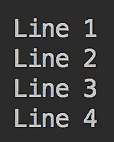

我们将在 *第十四章* 中讨论流，*Java 标准流*。

## 字符串实用工具

除了 `String` 类之外，还有许多其他类具有处理 `String` 值的方法。其中最有用的是来自名为 `pom.xml` 文件的项目中的 `org.apache.commons.lang3` 包的 `StringUtils` 类：

```java
<dependency>
```

```java
    <groupId>org.apache.commons</groupId>
```

```java
    <artifactId>commons-lang3</artifactId>
```

```java
    <version>3.8.1</version>
```

```java
</dependency>
```

`StringUtils` 类是许多程序员的宠儿。它通过提供以下安全操作（当方法以这种方式实现时——例如，通过检查 `null` 值——不会抛出 `NullPointerException`）来补充 `String` 类的方法：

+   `isBlank(CharSequence cs)`: 如果输入值是空白、空 (`""`) 或 `null`，则返回 `true`

+   `isNotBlank(CharSequence cs)`: 当前面的方法返回 `true` 时返回 `false`

+   `isEmpty(CharSequence cs)`: 如果输入值是空 (`""`) 或 `null`，则返回 `true`

+   `isNotEmpty(CharSequence cs)`: 当前面的方法返回 `true` 时返回 `false`

+   `trim(String str)`: 从输入值中移除前导和尾随空白，并处理 `null`、空 (`""`) 和空白，如下所示：

    ```java
    System.out.println("'" + StringUtils.trim(" x ")+"'");
                                                //prints: 'x'
    System.out.println(StringUtils.trim(null));
                                               //prints: null
    System.out.println("'" + StringUtils.trim("") + "'");
                                                 //prints: ''
    System.out.println("'" + StringUtils.trim("   ")+"'"); 
                                                 //prints: ''
    ```

+   `trimToNull(String str)`: 从输入值中移除前导和尾随空白，并处理 `null`、空 (`""`) 和空白，如下所示：

    ```java
    System.out.println("'"+StringUtils.trimToNull(" x ")+"'");  
                                               // prints: 'x'
    System.out.println(StringUtils.trimToNull(null));
                                               //prints: null
    System.out.println(StringUtils.trimToNull(""));
                                               //prints: null
    System.out.println(StringUtils.trimToNull("   "));
                                               //prints: null
    ```

+   `trimToEmpty(String str)`: 从输入值中移除前导和尾随空白，并处理 `null`、空 (`""`) 和空白，如下所示：

    ```java
    System.out.println("'" + 
              StringUtils.trimToEmpty(" x ") + "'");   // 'x'
    System.out.println("'" + 
              StringUtils.trimToEmpty(null) + "'");    // ''
    System.out.println("'" + 
              StringUtils.trimToEmpty("") + "'");      // ''
    System.out.println("'" + 
              StringUtils.trimToEmpty("   ") + "'");   // ''
    ```

+   `strip(String str)`, `stripToNull(String str)`, 和 `stripToEmpty(String str)`: 与前面的 `trim(String str)`、`trimToNull(String str)` 和 `trimToEmpty(String str)` 方法产生相同的结果，但使用更广泛的空白定义（基于 `Character.isWhitespace(int codepoint)`），因此移除与 `trim(String str)`、`trimToNull(String str)` 和 `trimToEmpty(String str)` 方法相同的字符，以及更多

+   `strip(String str, String stripChars)`, `stripAccents(String input)`, `stripAll(String... strs)`, `stripAll(String[] strs, String stripChars)`, `stripEnd(String str, String stripChars)`, 和 `stripStart(String str, String stripChars)`: 从 `String` 或 `String[]` 数组元素的部分移除特定的字符

+   `startsWith(CharSequence str, CharSequence prefix)`, `startsWithAny(CharSequence string, CharSequence... searchStrings)`, `startsWithIgnoreCase(CharSequence str, CharSequence prefix)`, 以及类似的 `endsWith*()` 方法：检查 `String` 值是否以某个前缀（或后缀）开头（或结尾）

+   `indexOf`, `lastIndexOf`, `contains`: 以安全的方式检查索引

+   `indexOfAny`, `lastIndexOfAny`, `indexOfAnyBut`, `lastIndexOfAnyBut`: 返回一个索引

+   `containsOnly`, `containsNone`, 和 `containsAny`: 检查值是否包含某些字符

+   `substring`, `left`, `right`, 和 `mid`: 以安全的方式返回子字符串

+   `substringBefore`, `substringAfter`, `substringBetween`: 从相对位置返回一个子字符串

+   `split` 或 `join`: 分别分割或连接一个值

+   `remove` 和 `delete`: 删除一个子字符串

+   `replace` 和 `overlay`: 替换一个值

+   `chomp` 和 `chop`: 移除末尾

+   `appendIfMissing`: 如果不存在，则添加一个值

+   `prependIfMissing`: 如果不存在，则将前缀添加到 `String` 值的开头

+   `leftPad`、`rightPad`、`center` 和 `repeat`：添加填充

+   `upperCase`、`lowerCase`、`swapCase`、`capitalize` 和 `uncapitalize`：更改大小写

+   `countMatches`: 返回子字符串出现的次数

+   `isWhitespace`、`isAsciiPrintable`、`isNumeric`、`isNumericSpace`、`isAlpha`、`isAlphaNumeric`、`isAlphaSpace` 和 `isAlphaNumericSpace`：检查是否存在某种类型的字符

+   `isAllLowerCase` 和 `isAllUpperCase`：检查大小写

+   `defaultString`、`defaultIfBlank` 和 `defaultIfEmpty`：如果为 `null` 则返回默认值

+   `rotate`: 使用循环移位旋转字符

+   `reverse` 和 `reverseDelimited`：反转字符或分隔的字符组

+   `abbreviate` 和 `abbreviateMiddle`：使用省略号或其他值缩略值

+   `difference`: 返回值之间的差异

+   `getLevenshteinDistance`: 返回将一个值转换为另一个值所需的变化次数

如您所见，`StringUtils` 类提供了一套非常丰富的（我们并未列出所有）用于字符串分析、比较和转换的方法，这些方法与 `String` 类的方法相辅相成。

# I/O 流

任何软件系统都必须接收和产生某种可以组织为一系列独立的输入/输出或数据流的类型的数据。一个流可以是有限的或无限的。程序可以从流中读取（称为 **输入流**）或向流中写入（称为 **输出流**）。Java I/O 流要么基于字节，要么基于字符，这意味着其数据要么被解释为原始字节，要么被解释为字符。

`java.io` 包包含支持许多但不是所有可能数据源的类。它主要围绕从文件、网络流和内部内存缓冲区输入和输出构建。它不包含许多必要的网络通信类。它们属于 `java.net`、`javax.net` 和其他 Java 网络 API 的包。只有当网络源或目的地建立（例如网络套接字）之后，程序才能使用 `java.io` 包中的 `InputStream` 和 `OutputStream` 类读取和写入数据。

`java.nio` 包的类几乎与 `java.io` 包的类具有相同的功能。但是，除此之外，它们还可以在 *非阻塞* 模式下工作，这在某些情况下可以显著提高性能。我们将在 *第十五章* *响应式编程* 中讨论非阻塞处理。

## 流数据

输入数据至少必须是二进制的一——用 0 和 1 表示——因为这是计算机可以读取的格式。数据可以一次读取或写入一个字节，或者一次读取或写入几个字节的数组。这些字节可以是二进制格式，也可以被解释为字符。

在第一种情况下，`InputStream`和`OutputStream`类的后代，如（如果类属于`java.io`包则省略包名）`ByteArrayInputStream`、`ByteArrayOutputStream`、`FileInputStream`、`FileOutputStream`、`ObjectInputStream`、`ObjectOutputStream`、`javax.sound.sampled.AudioInputStream`和`org.omg.CORBA.portable.OutputStream`，可以将它们作为字节或字节数组读取；你使用哪一个取决于数据源或目的地。`InputStream`和`OutputStream`类本身是抽象的，不能被实例化。

在第二种情况下，可以解释为字符的数据被称为`Reader`和`Writer`，它们也是抽象类。它们的子类示例包括`CharArrayReader`和`CharArrayWriter`、`InputStreamReader`和`OutputStreamWriter`、`PipedReader`和`PipedWriter`以及`StringReader`和`StringWriter`。

你可能已经注意到我们成对地列出了类。但并非每个输入类都有对应的输出特殊化——例如，有`PrintStream`和`PrintWriter`类支持输出到打印设备，但没有相应的输入伙伴，至少不是按名称。然而，有一个`java.util.Scanner`类可以解析已知格式的输入文本。

还有一组配备了缓冲区的类，通过一次读取或写入更大的数据块来提高性能，尤其是在访问源或目的地耗时较长的情况下。

在本节的其余部分，我们将回顾`java.io`包中的类以及来自其他包的一些流行的相关类。

## `InputStream`类及其子类

在 Java 类库中，`InputStream`抽象类有以下直接实现：`ByteArrayInputStream`、`FileInputStream`、`ObjectInputStream`、`PipedInputStream`、`SequenceInputStream`、`FilterInputStream`和`javax.sound.sampled.AudioInputStream`。

所有这些都可以直接使用，或者覆盖`InputStream`类的以下方法：

+   `int available()`: 返回可读取的字节数

+   `void close()`: 关闭流并释放资源

+   `void mark(int readlimit)`: 在流中标记一个位置并定义可以读取的字节数

+   `boolean markSupported()`: 如果标记被支持则返回`true`

+   `static InputStream nullInputStream()`: 创建一个空流

+   `abstract int read()`: 读取流中的下一个字节

+   `int read(byte[] b)`: 从流中读取数据到`b`缓冲区

+   `int read(byte[] b, int off, int len)`: 从流中读取`len`或更少的字节到`b`缓冲区

+   `byte[] readAllBytes()`: 从流中读取所有剩余的字节

+   `int readNBytes(byte[] b, int off, int len)`: 将`len`或更少的字节读取到`b`缓冲区的`off`偏移量

+   `byte[] readNBytes(int len)`: 将`len`或更少的字节读取到`b`缓冲区

+   `void reset()`: 将读取位置重置为`mark()`方法上次调用时的位置

+   `long skip(long n)`: 跳过`n`或更少的字节流；返回实际跳过的字节数

+   `long transferTo(OutputStream out)`: 从输入流读取并逐字节写入提供的输出流；返回实际传输的字节数

`abstract int read()`是唯一必须实现的方法，但这个类的许多子类也覆盖了许多其他方法。

### ByteArrayInputStream

`ByteArrayInputStream`类允许将字节数组作为输入流读取。它有以下两个构造函数，用于创建类的对象并定义用于读取字节数字输入流的缓冲区：

+   `ByteArrayInputStream(byte[] buffer)`

+   `ByteArrayInputStream(byte[] buffer, int offset, int length)`

第二个构造函数允许你设置缓冲区，包括缓冲区的偏移量和长度。让我们看一个例子，看看这个类是如何使用的。我们将假设有一个`byte[]`数组的数据源：

```java
byte[] bytesSource(){
```

```java
    return new byte[]{42, 43, 44};
```

```java
}
```

然后，我们可以写出以下内容：

```java
byte[] buffer = bytesSource();
```

```java
try(ByteArrayInputStream bais = new ByteArrayInputStream(buffer)){
```

```java
    int data = bais.read();
```

```java
    while(data != -1) {
```

```java
        System.out.print(data + " ");   //prints: 42 43 44
```

```java
        data = bais.read();
```

```java
    }
```

```java
} catch (Exception ex){
```

```java
    ex.printStackTrace();
```

```java
}
```

`bytesSource()`方法产生一个字节数组，该数组填充了传递给`ByteArrayInputStream`类构造函数的缓冲区作为参数。然后使用`read()`方法逐字节读取流，直到到达流的末尾（并且`read()`方法返回`-1`）。每个新的字节被打印出来（没有换行符，并在其后有空白，因此所有读取的字节都在一行中显示，由空白分隔）。

前面的代码通常以更紧凑的形式表达，如下所示：

```java
byte[] buffer = bytesSource();
```

```java
try(ByteArrayInputStream bais = new ByteArrayInputStream(buffer)){
```

```java
    int data;
```

```java
    while ((data = bais.read()) != -1) {
```

```java
        System.out.print(data + " ");   //prints: 42 43 44
```

```java
    }
```

```java
} catch (Exception ex){
```

```java
    ex.printStackTrace();
```

```java
}
```

而不是仅仅打印字节，它们可以以任何其他必要的方式进行处理，包括将它们解释为字符，如下所示：

```java
byte[] buffer = bytesSource();
```

```java
try(ByteArrayInputStream bais = 
```

```java
                             new ByteArrayInputStream(buffer)){
```

```java
  int data;
```

```java
  while ((data = bais.read()) != -1) {
```

```java
      System.out.print(((char)data) + " ");   //prints: * + ,
```

```java
  }
```

```java
} catch (Exception ex){
```

```java
    ex.printStackTrace();
```

```java
}
```

但是，在这种情况下，最好使用专门用于字符处理的`Reader`类之一。我们将在*读取器和写入器类及其子类*部分中讨论它们。

### FileInputStream

`FileInputStream`类从文件系统中的文件获取数据——例如图像的原始字节。它有以下三个构造函数：

+   `FileInputStream(File file)`

+   `FileInputStream(String name)`

+   `FileInputStream(FileDescriptor fdObj)`

每个构造函数都打开指定的文件。第一个构造函数接受`File`对象；第二个，文件系统中的文件路径；第三个，表示文件系统中的实际文件连接的文件描述符对象。让我们看看以下示例：

```java
String file =  classLoader.getResource("hello.txt").getFile();
```

```java
try(FileInputStream fis = new FileInputStream(file)){
```

```java
    int data;
```

```java
    while ((data = fis.read()) != -1) {
```

```java
        System.out.print(((char)data) + " ");   
```

```java
                                          //prints: H e l l o !
```

```java
    }
```

```java
} catch (Exception ex){
```

```java
    ex.printStackTrace();
```

```java
}
```

在`src/main/resources`文件夹中，我们创建了`hello.txt`文件，其中只有一行内容——`Hello!`。前面示例的输出如下：

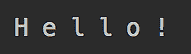

在从`hello.txt`文件读取字节之后，我们决定，出于演示目的，将每个`byte`转换为`char`，这样你就可以看到代码确实是从指定的文件中读取的，但`FileReader`类是处理文本文件更好的选择（我们很快就会讨论它）。如果没有进行转换，结果将是以下内容：

```java
System.out.print((data) + " ");   
```

```java
                                //prints: 72 101 108 108 111 33
```

顺便说一下，因为`src/main/resources`文件夹是由 IDE（使用 Maven）放置在类路径上的，所以放在其中的文件也可以通过创建使用其自己的`InputStream`实现的流的类加载器来访问：

```java
try(InputStream is = InputOutputStream.class.getResourceAsStream("/hello.txt")){
```

```java
    int data;
```

```java
    while ((data = is.read()) != -1) {
```

```java
        System.out.print((data) + " ");   
```

```java
             //prints: 72 101 108 108 111 33
```

```java
    }
```

```java
} catch (Exception ex){
```

```java
    ex.printStackTrace();
```

```java
}
```

在前面的例子中，`InputOutputStream`类不是来自某个库的类。它只是我们用来运行示例的主类。`InputOutputStream.class.getResourceAsStream()`构造函数允许你使用加载了`InputOutputStream`类的相同类加载器，用于在类路径上查找文件并创建包含其内容的流。在*文件管理*部分，我们将介绍其他读取文件的方法。

### ObjectInputStream

`ObjectInputStream`类的方法集比任何其他`InputStream`实现的方法集都要大。这是因为它是围绕读取各种类型的对象字段值构建的。为了使`ObjectInputStream`能够从数据输入流中构造一个对象，该对象必须是*可反序列化的*，这意味着它首先必须是*可序列化的*——也就是说，可以转换成字节流。通常，这是为了在网络中传输对象。在目的地，序列化的对象被反序列化，原始对象的值被恢复。

基本数据类型和大多数 Java 类，包括`String`类和基本数据类型包装器，都是可序列化的。如果一个类有自定义类型的字段，它们必须通过实现`java.io.Serializable`来使其可序列化。如何实现这一点超出了本书的范围。现在，我们将只使用可序列化类型。让我们看看这个类：

```java
class SomeClass implements Serializable {
```

```java
    private int field1 = 42;
```

```java
    private String field2 = "abc";
```

```java
}
```

我们必须告诉编译器它是可以序列化的。否则，编译将失败。这样做是为了确保在声明类是可序列化之前，程序员要么审查了所有字段并确保它们是可序列化的，要么实现了序列化所需的必要方法。

在我们可以创建输入流并使用`ObjectInputStream`进行反序列化之前，我们需要首先序列化对象。这就是为什么我们首先使用`ObjectOutputStream`和`FileOutputStream`来序列化一个对象并将其写入`someClass.bin`文件。我们将在*输出流类及其子类*部分更多地讨论它们。然后，我们使用`FileInputStream`从文件中读取，并使用`ObjectInputStream`反序列化文件内容：

```java
String fileName = "someClass.bin";
```

```java
try (ObjectOutputStream oos = new ObjectOutputStream(new FileOutputStream(fileName));
```

```java
     ObjectInputStream ois = new ObjectInputStream(new 
```

```java
                             FileInputStream(fileName))){
```

```java
    SomeClass obj = new SomeClass();
```

```java
    oos.writeObject(obj);
```

```java
    SomeClass objRead = (SomeClass) ois.readObject();
```

```java
    System.out.println(objRead.field1);  //prints: 42
```

```java
    System.out.println(objRead.field2);  //prints: abc
```

```java
} catch (Exception ex){
```

```java
    ex.printStackTrace();
```

```java
}
```

注意，必须在运行前面的代码之前先创建文件。我们将在 *创建文件和目录* 部分展示如何做到这一点。并且，作为提醒，我们使用了 `try-with-resources` 语句，因为 `InputStream` 和 `OutputStream` 都实现了 `Closeable` 接口。

### PipedInputStream

管道输入流有一个非常特殊的专业化；它被用作线程之间通信的机制之一。一个线程从 `PipedInputStream` 对象读取并传递数据给另一个线程，该线程将数据写入 `PipedOutputStream` 对象。以下是一个示例：

```java
PipedInputStream pis = new PipedInputStream();
```

```java
PipedOutputStream pos = new PipedOutputStream(pis);
```

或者，当一个线程从 `PipedOutputStream` 对象读取数据，另一个线程将数据写入 `PipedInputStream` 对象时，数据可以沿相反方向移动，如下所示：

```java
PipedOutputStream pos = new PipedOutputStream();
```

```java
PipedInputStream pis = new PipedInputStream(pos);
```

在这个领域工作的人熟悉消息 `Broken pipe`，这意味着提供数据的管道流已停止工作。

管道流也可以在没有连接的情况下创建，稍后连接，如下所示：

```java
PipedInputStream pis = new PipedInputStream();
```

```java
PipedOutputStream pos = new PipedOutputStream();
```

```java
pos.connect(pis); 
```

例如，这里有将要由不同线程执行的两个类——首先，`PipedOutputWorker` 类，如下所示：

```java
class PipedOutputWorker implements Runnable{
```

```java
    private PipedOutputStream pos;
```

```java
    public PipedOutputWorker(PipedOutputStream pos) {
```

```java
        this.pos = pos;
```

```java
    }
```

```java
    @Override
```

```java
    public void run() {
```

```java
        try {
```

```java
            for(int i = 1; i < 4; i++){
```

```java
                pos.write(i);
```

```java
            }
```

```java
            pos.close();
```

```java
        } catch (Exception ex) {
```

```java
            ex.printStackTrace();
```

```java
        }
```

```java
    }
```

```java
}
```

`PipedOutputWorker` 类有一个 `run()` 方法（因为它实现了 `Runnable` 接口），将数字 `1`、`2` 和 `3` 写入流，然后关闭。现在，让我们看看 `PipedInputWorker` 类，如下所示：

```java
class PipedInputWorker implements Runnable{
```

```java
    private PipedInputStream pis;
```

```java
    public PipedInputWorker(PipedInputStream pis) {
```

```java
        this.pis = pis;
```

```java
    }
```

```java
    @Override
```

```java
    public void run() {
```

```java
        try {
```

```java
            int i;
```

```java
            while((i = pis.read()) > -1){
```

```java
                System.out.print(i + " ");  
```

```java
            }
```

```java
            pis.close();
```

```java
        } catch (Exception ex) {
```

```java
            ex.printStackTrace();
```

```java
        }
```

```java
    }
```

```java
}
```

它也具有一个 `run()` 方法（因为它实现了 `Runnable` 接口），从流中读取并打印出每个字节，直到流结束（由 `-1` 表示）。现在，让我们连接这些管道并执行这些类的 `run()` 方法：

```java
PipedOutputStream pos = new PipedOutputStream();
```

```java
PipedInputStream pis = new PipedInputStream();
```

```java
try {
```

```java
    pos.connect(pis);
```

```java
    new Thread(new PipedOutputWorker(pos)).start();
```

```java
    new Thread(new PipedInputWorker(pis)).start(); 
```

```java
                                                //prints: 1 2 3
```

```java
} catch (Exception ex) {
```

```java
    ex.printStackTrace();
```

```java
}
```

如您所见，工作对象的实例被传递到 `Thread` 类的构造函数中。`Thread` 对象的 `start()` 方法执行传入的 `Runnable` 的 `run()` 方法。我们看到的结果正如预期——`PipedInputWorker` 打印出 `PipedOutputWorker` 写入管道流的所有字节。我们将在 *第八章*，*多线程和并发处理* 中更详细地介绍线程。

### SequenceInputStream

`SequenceInputStream` 类将输入流连接到以下构造函数之一作为参数：

+   `SequenceInputStream(InputStream s1, InputStream s2)`

+   `SequenceInputStream(Enumeration<InputStream> e)`

`SequenceInputStream` 类从第一个输入字符串开始读取，直到其结束，然后从第二个字符串读取，依此类推，直到最后一个流的结束。例如，让我们在 `hello.txt` 文件旁边的 `resources` 文件夹中创建一个 `howAreYou.txt` 文件（内容为 `How are you?`）。然后可以使用 `SequenceInputStream` 类如下：

```java
String file1 = classLoader.getResource("hello.txt").getFile();
```

```java
String file2 = classLoader.getResource("howAreYou.txt").getFile();
```

```java
try(FileInputStream fis1 = 
```

```java
                    new FileInputStream(file1);
```

```java
    FileInputStream fis2 = 
```

```java
                    new FileInputStream(file2);
```

```java
    SequenceInputStream sis=
```

```java
            new SequenceInputStream(fis1, fis2)){
```

```java
    int i;
```

```java
    while((i = sis.read()) > -1){
```

```java
        System.out.print((char)i);       
```

```java
                                   //prints: Hello!How are you?
```

```java
    }
```

```java
} catch (Exception ex) {
```

```java
    ex.printStackTrace();
```

```java
}
```

类似地，当传递输入流枚举时，每个流都会被读取（在我们的情况下是打印出来），直到流的结束。

### FilterInputStream

`FilterInputStream` 类是围绕在构造函数中作为参数传递的 `InputStream` 对象的一个包装器。以下是 `FilterInputStream` 类的构造函数和两个 `read()` 方法：

```java
protected volatile InputStream in;
```

```java
protected FilterInputStream(InputStream in) { this.in = in; }
```

```java
public int read() throws IOException { return in.read(); }
```

```java
public int read(byte b[]) throws IOException { 
```

```java
    return read(b, 0, b.length);
```

```java
}
```

`InputStream` 类的所有其他方法都类似地被覆盖；函数被委托给分配给 `in` 属性的对象。

如您所见，构造函数是受保护的，这意味着只有子类可以访问它。这种设计隐藏了流的实际来源，并迫使程序员使用 `FilterInputStream` 类的扩展之一：`BufferedInputStream`、`CheckedInputStream`、`DataInputStream`、`PushbackInputStream`、`javax.crypto.CipherInputStream`、`java.util.zip.DeflaterInputStream`、`java.util.zip.InflaterInputStream`、`java.security.DigestInputStream` 或 `javax.swing.ProgressMonitorInputStream`。或者，您可以创建一个自定义扩展。但在创建自己的扩展之前，查看列出的类，看看其中是否有符合您需求的类。以下是一个使用 `BufferedInputStream` 类的示例：

```java
String file = classLoader.getResource("hello.txt").getFile();
```

```java
try(FileInputStream  fis = new FileInputStream(file);
```

```java
    FilterInputStream filter = new BufferedInputStream(fis)){
```

```java
    int i;
```

```java
    while((i = filter.read()) > -1){
```

```java
        System.out.print((char)i);     //prints: Hello!
```

```java
    }
```

```java
} catch (Exception ex) {
```

```java
    ex.printStackTrace();
```

```java
}
```

`BufferedInputStream` 类使用缓冲区来提高性能。当从流中跳过或读取字节时，内部缓冲区会自动用必要的字节从包含的输入流中重新填充。

`CheckedInputStream` 类为正在读取的数据添加校验和，允许使用 `getChecksum()` 方法验证输入数据的完整性。

`DataInputStream` 类以机器无关的方式读取和解释输入数据为原始 Java 数据类型。

`PushbackInputStream` 类添加了使用 `unread()` 方法推回读取数据的 ability。这在代码具有分析刚读取的数据并决定将其推回以便在下一步重新读取的逻辑时很有用。

`javax.crypto.CipherInputStream` 类将 `Cipher` 添加到 `read()` 方法中。如果 `Cipher` 被初始化为解密，`javax.crypto.CipherInputStream` 将尝试在返回之前解密数据。

`java.util.zip.DeflaterInputStream` 类在 deflate 压缩格式中压缩数据。

`java.util.zip.InflaterInputStream` 类在 deflate 压缩格式中解压缩数据。

`java.security.DigestInputStream` 类使用通过流的位更新相关的消息摘要。`on (boolean on)` 方法打开或关闭 `digest` 函数。可以通过 `getMessageDigest()` 方法检索计算出的摘要。

`javax.swing.ProgressMonitorInputStream` 类提供了从 `InputStream` 读取进度的监控器。可以通过 `getProgressMonitor()` 方法访问监控器对象。

### javax.sound.sampled.AudioInputStream

`AudioInputStream` 类表示具有指定音频格式和长度的输入流。它有以下两个构造函数：

+   `AudioInputStream (InputStream stream, AudioFormat format, long length)`: 接受音频数据流、请求的格式和样本帧长度

+   `AudioInputStream (TargetDataLine line)`: 接受指定的目标数据行

`javax.sound.sampled.AudioFormat` 类描述了音频格式属性，如通道、编码、帧率和类似属性。`javax.sound.sampled.TargetDataLine` 类有 `open()` 方法，用于以指定的格式打开行，以及 `read()` 方法，用于从数据行的输入缓冲区读取音频数据。

此外，还有 `javax.sound.sampled.AudioSystem` 类，其方法处理 `AudioInputStream` 对象。它们可以用于从音频文件、流或 URL 中读取，并将数据写入音频文件。它们还可以用于将音频流转换为另一种音频格式。

## `OutputStream` 类及其子类

`OutputStream` 类是 `InputStream` 类的同伴，它写入数据而不是读取。它是一个抽象类，在 `ByteArrayOutputStream`、`FilterOutputStream`、`ObjectOutputStream`、`PipedOutputStream` 和 `FileOutputStream` 中有如下直接实现。

`FileOutputStream` 类有以下直接扩展：`BufferedOutputStream`、`CheckedOutputStream`、`DataOutputStream`、`PrintStream`、`javax.crypto.CipherOutputStream`、`java.util.zip.DeflaterOutputStream`、`java.security.DigestOutputStream` 和 `java.util.zip.InflaterOutputStream`。

所有这些都可以直接使用，或者覆盖 `OutputStream` 类的以下方法：

+   `void close()`: 关闭流并释放资源

+   `void flush()`: 强制将剩余的字节写入输出流

+   `static OutputStream nullOutputStream()`: 创建一个新的 `OutputStream`，该流写入的内容为空

+   `void write(byte[] b)`: 将提供的字节数组写入输出流

+   `void write(byte[] b, int off, int len)`: 从提供的字节数组的 `off` 偏移量开始，将 `len` 个字节写入输出流

+   `abstract void write(int b)`: 将提供的字节写入输出流

只需实现 `abstract void write(int b)` 这个方法，但 `OutputStream` 类的大部分子类也覆盖了许多其他方法。

在学习了 *The InputStream class and its subclasses* 部分的输入流之后，除了 `PrintStream` 类之外的所有 `OutputStream` 实现都应该对你来说很直观。因此，我们在这里只讨论 `PrintStream` 类。

### `PrintStream`

`PrintStream` 类为另一个输出流添加了将数据作为字符打印的能力。我们实际上已经多次使用过它。`System` 类有一个 `PrintStream` 类的对象被设置为 `System.out` 的公共静态属性。这意味着每次我们使用 `System.out` 打印东西时，我们实际上是在使用 `PrintStream` 类：

```java
System.out.println("Printing a line");
```

让我们看看 `PrintStream` 类使用的另一个示例：

```java
String fileName = "output.txt";
```

```java
try(FileOutputStream  fos = new FileOutputStream(fileName);
```

```java
    PrintStream ps = new PrintStream(fos)){
```

```java
    ps.println("Hi there!");
```

```java
} catch (Exception ex) {
```

```java
    ex.printStackTrace();
```

```java
}
```

如您所见，`PrintStream`类接受`FileOutputStream`对象并打印它生成的字符。在这种情况下，它打印出`FileOutputStream`写入文件的所有字节。顺便说一下，没有必要显式创建目标文件。如果不存在，它将在`FileOutputStream`构造函数内部自动创建。如果在运行前面的代码之后打开文件，我们将看到其中有一行——`"Hi there!"`”。

或者，可以使用另一个接受`File`对象的`PrintStream`构造函数来达到相同的结果，如下所示：

```java
String fileName = "output.txt";
```

```java
File file = new File(fileName);
```

```java
try(PrintStream ps = new PrintStream(file)){
```

```java
    ps.println("Hi there!");
```

```java
} catch (Exception ex) {
```

```java
    ex.printStackTrace();
```

```java
}
```

可以使用`PrintStream`构造函数的第三个变体来创建一个更简单的解决方案，该变体将文件名作为参数：

```java
String fileName = "output.txt";
```

```java
try(PrintStream ps = new PrintStream(fileName)){
```

```java
    ps.println("Hi there!");
```

```java
} catch (Exception ex) {
```

```java
    ex.printStackTrace();
```

```java
}
```

前两个示例之所以可行，是因为`PrintStream`构造函数在幕后使用了`FileOutputStream`类，正如我们在`PrintStream`类使用的第一个示例中所做的那样。因此，`PrintStream`类有几个构造函数只是为了方便，但它们本质上具有相同的功能：

+   `PrintStream(File file)`

+   `PrintStream(File file, String csn)`

+   `PrintStream(File file, Charset charset)`

+   `PrintStream(String fileName)`

+   `PrintStream(String fileName, String csn)`

+   `PrintStream(String fileName, Charset charset)`

+   `PrintStream(OutputStream out)`

+   `PrintStream(OutputStream out, boolean autoFlush)`

+   `PrintStream(OutputStream out, boolean autoFlush, String encoding)`

+   `PrintStream(OutputStream out, boolean autoFlush, Charset charset)`

一些构造函数还接受一个`Charset`实例或其名称（`String csn`），这允许你在 16 位 Unicode 代码单元序列和字节序列之间应用不同的映射。你可以通过简单地打印它们来查看所有可用的字符集，如下所示：

```java
for (String chs : Charset.availableCharsets().keySet()) {
```

```java
    System.out.println(chs);
```

```java
}
```

其他构造函数将`boolean autoFlush`作为参数。此参数表示（当为`true`时），在写入数组或遇到符号换行符时，应自动刷新输出缓冲区。

一旦创建了`PrintStream`对象，它就提供了各种方法，如下所示：

+   `void print(T value)`: 打印传入的任何`T`原始类型的值，而不移动到另一行

+   `void print(Object obj)`: 在传入的对象上调用`toString()`方法并打印结果，而不移动到另一行；如果传入的对象是`null`，则不会生成`NullPointerException`并打印`null`

+   `void println(T value)`: 打印传入的任何`T`原始类型的值并移动到另一行

+   `void println(Object obj)`: 在传入的对象上调用`toString()`方法，打印结果并移动到另一行；如果传入的对象是`null`，则不会生成`NullPointerException`并打印`null`

+   `void println()`: 只移动到另一行

+   `PrintStream printf(String format, Object... values)`: 将提供的`format`字符串中的占位符替换为提供的`values`，并将结果写入流

+   `PrintStream printf(Locale l, String format, Object... args)`: 与前面的方法相同，但使用提供的`Locale`对象应用本地化；如果提供的`Locale`对象为`null`，则不应用本地化，并且此方法的行为与前面的方法完全相同

+   `PrintStream format(String format, Object... args)`和`PrintStream format(Locale l, String format, Object... args)`: 与`PrintStream printf(String format, Object... values)`和`PrintStream printf(Locale l, String format, Object... args)`（已在列表中描述）的行为相同，例如以下内容：

    ```java
    System.out.printf("Hi, %s!%n", "dear reader"); 
                                   //prints: Hi, dear reader!
    System.out.format("Hi, %s!%n", "dear reader"); 
                                   //prints: Hi, dear reader!
    ```

在前面的示例中，（`%`）表示格式化规则。以下符号（`s`）表示`String`值。此位置的其他可能符号可以是（`d`）（十进制）、（`f`）（浮点数）等等。符号（`n`）表示换行符（与（`\n`）转义字符相同）。有许多格式化规则。所有这些都在`java.util.Formatter`类的文档中进行了描述。

+   `PrintStream append(char c)`, `PrintStream append(CharSequence c)`, 和 `PrintStream append(CharSequence c, int start, int end)`: 将提供的字符追加到流中，例如以下内容：

    ```java
    System.out.printf("Hi %s", "there").append("!\n");  
                                          //prints: Hi there!
    System.out.printf("Hi ")
                   .append("one there!\n two", 4, 11);  
                                          //prints: Hi there!
    ```

通过这一点，我们结束了对`OutputStream`子类的讨论，现在我们将注意力转向另一个类层次结构——来自 JCL 的`Reader`和`Writer`类及其子类。

## `Reader`和`Writer`类及其子类

正如我们多次提到的，`Reader`和`Writer`类在功能上与`InputStream`和`OutputStream`类非常相似，但专门用于处理文本。它们将流字节解释为字符，并有自己的独立`InputStream`和`OutputStream`类层次结构。可以在没有`Reader`和`Writer`或其任何子类的情况下将流字节作为字符处理。我们已经在前面几节描述`InputStream`和`OutputStream`类的部分中看到了这样的例子。然而，使用`Reader`和`Writer`类可以使文本处理更简单，代码更容易阅读。

### `Reader`及其子类

`Reader`类是一个抽象类，它以字符的形式读取流。它是`InputStream`的类似物，具有以下方法：

+   `abstract void close()`: 关闭流和其他使用的资源

+   `void mark(int readAheadLimit)`: 标记流中的当前位置

+   `boolean markSupported()`: 如果流支持`mark()`操作，则返回`true`

+   `static Reader nullReader()`: 创建一个空的`Reader`，不读取任何字符

+   `int read()`: 读取一个字符

+   `int read(char[] buf)`: 将字符读取到提供的`buf`数组中，并返回读取的字符数

+   `abstract int read(char[] buf, int off, int len)`: 从 `off` 索引开始将 `len` 个字符读入数组

+   `int read(CharBuffer target)`: 尝试将字符读入提供的 `target` 缓冲区

+   `boolean ready()`: 当流准备好读取时返回 `true`

+   `void reset()`: 重置标记；然而，并非所有流都支持此操作，有些支持但最初不支持设置标记

+   `long skip(long n)`: 尝试跳过 `n` 个字符；返回跳过的字符数

+   `long transferTo(Writer out)`: 从这个读取器中读取所有字符并将字符写入提供的 `Writer` 对象

如您所见，唯一需要实现的方法是两个抽象的 `read()` 和 `close()` 方法。尽管如此，这个类的许多子类也会重写其他方法，有时是为了更好的性能或不同的功能。JCL 中的 `Reader` 子类包括 `CharArrayReader`、`InputStreamReader`、`PipedReader`、`StringReader`、`BufferedReader` 和 `FilterReader`。`BufferedReader` 类有一个 `LineNumberReader` 子类，而 `FilterReader` 类有一个 `PushbackReader` 子类。

### `Writer` 及其子类

抽象的 `Writer` 类写入字符流。它是 `OutputStream` 的类似物，具有以下方法：

+   `Writer append(char c)`: 将提供的字符追加到流中

+   `Writer append(CharSequence c)`: 将提供的字符序列追加到流中

+   `Writer append(CharSequence c, int start, int end)`: 将提供的字符序列的子序列追加到流中

+   `abstract void close()`: 清空并关闭流和相关系统资源

+   `abstract void flush()`: 清空流

+   `static Writer nullWriter()`: 创建一个新的 `Writer` 对象，该对象丢弃所有字符

+   `void write(char[] c)`: 写入一个 `c` 字符数组

+   `abstract void write(char[] c, int off, int len)`: 从 `off` 索引开始写入一个 `c` 字符数组中的 `len` 个元素

+   `void write(int c)`: 写入一个字符

+   `void write(String str)`: 写入提供的字符串

+   `void write(String str, int off, int len)`: 从提供的 `str` 字符串中写入一个长度为 `len` 的子串，从 `off` 索引开始

如您所见，这个类的三个抽象方法 `write(char[], int, int)`、`flush()` 和 `close()` 必须由这个类的子类实现。它们通常也会重写其他方法。

JCL 中的 `Writer` 子类包括 `CharArrayWriter`、`OutputStreamWriter`、`PipedWriter`、`StringWriter`、`BufferedWriter`、`FilterWriter` 和 `PrintWriter`。`OutputStreamWriter` 类有一个 `FileWriter` 子类。

## `java.io` 包的其他类

`java.io` 包的其他类包括以下内容：

+   `Console`: 允许与基于字符的控制台设备进行交互，与当前 Java 虚拟机实例相关联

+   `StreamTokenizer`: 接收一个输入流并将其解析为 `tokens`

+   `ObjectStreamClass`: 类的序列化描述符

+   `ObjectStreamField`: 可序列化类的可序列化字段的描述

+   `RandomAccessFile`: 允许随机访问文件进行读取和写入，但其讨论超出了本书的范围

+   `File`: 允许创建和管理文件和目录；在 *文件管理* 部分中描述

### Console

创建和运行执行应用程序的 **Java 虚拟机**（**JVM**）实例有几种方法。如果 JVM 是从命令行启动的，则将自动打开一个控制台窗口。它允许您从键盘在显示上键入；然而，JVM 也可以由后台进程启动。在这种情况下，不会创建控制台。

要以编程方式检查控制台是否存在，您可以调用 `System.console()` 静态方法。如果没有控制台设备可用，则调用该方法将返回 `null`。否则，它将返回一个 `Console` 类的对象，允许与控制台设备和应用程序用户进行交互。

让我们创建以下 `ConsoleDemo` 类：

```java
package com.packt.learnjava.ch05_stringsIoStreams;
```

```java
import java.io.Console;
```

```java
public class ConsoleDemo {
```

```java
    public static void main(String... args)  {
```

```java
        Console console = System.console();
```

```java
        System.out.println(console);
```

```java
    }
```

```java
}
```

如果我们从 IDE 中运行它，就像我们通常做的那样，结果将如下所示：

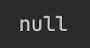

这是因为 JVM 不是从命令行启动的。为了做到这一点，让我们编译我们的应用程序，并在项目的根目录中执行 `mvn clean package` Maven 命令来创建一个 `.jar` 文件。（我们假设您已经在您的计算机上安装了 Maven。）它将删除 `target` 文件夹，然后重新创建它，将所有 `.java` 文件编译成 `target` 文件夹中的相应 `.class` 文件，然后将其存档到 `.jar` 文件中，`learnjava-1.0-SNAPSHOT.jar`。

现在，我们可以使用以下命令从同一项目根目录启动 `ConsoleDemo` 应用程序：

```java
java -cp ./target/examples-1.0-SNAPSHOT.jar  
          com.packt.learnjava.ch05_stringsIoStreams.ConsoleDemo
```

之前的 `–cp` 命令选项表示类路径，因此在我们的情况下，我们告诉 JVM 在 `target` 文件夹中的 `.jar` 文件中查找类。命令分为两行显示，因为页面宽度无法容纳它。但如果你要运行它，请确保你将其作为一行运行。结果将如下所示：

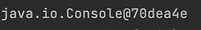

这告诉我们我们现在有了 `Console` 类对象。让我们看看我们可以用它做什么。该类有以下方法：

+   `String readLine()`: 等待用户按下 *Enter* 键，并从控制台读取一行文本

+   `String readLine(String format, Object... args)`: 显示一个提示（在提供的格式之后，将提供的占位符替换为提供的参数后生成的消息），等待用户按下 *Enter* 键，并从控制台读取一行文本；如果没有提供参数（`args`），则显示格式作为提示

+   `char[] readPassword()`: 与 `readLine()` 函数执行相同的功能，但不回显输入的字符

+   `char[] readPassword(String format, Object... args)`: 执行与 `readLine(String format, Object... args)` 相同的功能，但不回显输入的字符

要单独运行以下每个代码段，您需要在 `main` 方法中注释掉 `console1()` 调用，并取消注释 `console2()` 或 `console3()`，使用 `mvn package` 重新编译，然后重新运行之前显示的 `java` 命令。

让我们通过以下示例（`console2()` 方法）演示上述方法：

```java
Console console = System.console();
```

```java
System.out.print("Enter something 1: "); 
```

```java
String line = console.readLine();
```

```java
System.out.println("Entered 1: " + line);
```

```java
line = console.readLine("Enter something 2: ");
```

```java
System.out.println("Entered 2: " + line);
```

```java
line = console.readLine("Enter some%s", "thing 3: ");
```

```java
System.out.println("Entered 3: " + line);
```

```java
System.out.print("Enter password: ");
```

```java
char[] password = console.readPassword();
```

```java
System.out.println("Entered 4: " + new String(password));
```

```java
password = console.readPassword("Enter password 5: ");
```

```java
System.out.println("Entered 5: " + new String(password));
```

```java
password = console.readPassword("Enter pass%s", "word 6: ");
```

```java
System.out.println("Entered 6: " + new String(password));
```

上述示例的结果如下：

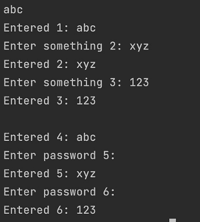

一些 IDE 无法运行这些示例并抛出 `NullPointerException`。如果是这种情况，请按照之前所述从命令行运行与控制台相关的示例。别忘了每次更改代码时都运行 `maven package` 命令。

另一组 `Console` 类方法可以与之前演示的方法一起使用：

+   `Console format(String format, Object... args)`: 将提供的 `format` 字符串中的占位符替换为提供的 `args` 值，并显示结果

+   `Console printf(String format, Object... args)`: 与 `format()` 方法行为相同

例如，看看以下行：

```java
String line = console.format("Enter some%s", "thing:").readLine();
```

它产生与该行相同的结果：

```java
String line = console.readLine("Enter some%s", "thing:");
```

最后，`Console` 类的最后三个方法如下：

+   `PrintWriter writer()`: 创建一个与该控制台关联的 `PrintWriter` 对象，可以用来生成字符输出流

+   `Reader reader()`: 创建一个与该控制台关联的 `Reader` 对象，可以用来将输入作为字符流读取

+   `void flush()`: 清空控制台并强制任何缓冲的输出立即写入

这里是他们使用的一个示例（`console3()` 方法）：

```java
try (Reader reader = console.reader()){
```

```java
    char[] chars = new char[10];
```

```java
    System.out.print("Enter something: ");
```

```java
    reader.read(chars);
```

```java
    System.out.print("Entered: " + new String(chars));
```

```java
} catch (IOException e) {
```

```java
    e.printStackTrace();
```

```java
}
```

```java
PrintWriter out = console.writer();
```

```java
out.println("Hello!");
```

```java
console.flush();
```

上述代码的结果如下：

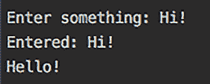

`Reader` 和 `PrintWriter` 也可以用来创建本节中提到的其他 `Input` 和 `Output` 流。

### StreamTokenizer

`StreamTokenizer` 类解析输入流并生成令牌。其 `StreamTokenizer(Reader r)` 构造函数接受一个 `Reader` 对象，它是令牌的来源。每次在 `StreamTokenizer` 对象上调用 `int nextToken()` 方法时，都会发生以下情况：

1.  解析下一个令牌。

1.  `StreamTokenizer` 实例字段 `ttype` 由表示令牌类型的值填充：

    +   `ttype` 值可以是以下整数常量之一：`TT_WORD`、`TT_NUMBER`、`TT_EOL`（行尾）或 `TT_EOF`（流尾）。

    +   如果 `ttype` 值是 `TT_WORD`，则 `StreamTokenizer` 实例的 `sval` 字段由令牌的 `String` 值填充。

    +   如果 `ttype` 值是 `TT_NUMBER`，则 `StreamTokenizer` 实例字段 `nval` 由令牌的 `double` 值填充。

1.  `StreamTokenizer` 实例的 `lineno()` 方法返回当前行号。

在讨论`StreamTokenizer`类的其他方法之前，让我们看看一个例子。假设在项目`resources`文件夹中有一个`tokens.txt`文件，它包含以下四行文本：

```java
There
```

```java
happened
```

```java
42
```

```java
events.
```

以下代码将读取文件并标记其内容（`InputOutputStream`类的`streamTokenizer()`方法）：

```java
String file =  classLoader.
```

```java
                           getResource("tokens.txt").getFile();
```

```java
try(FileReader fr = new FileReader(file);
```

```java
   BufferedReader br = new BufferedReader(fr)){
```

```java
  StreamTokenizer st = new StreamTokenizer(br);
```

```java
  st.eolIsSignificant(true);
```

```java
  st.commentChar('e');
```

```java
  System.out.println("Line " + st.lineno() + ":");
```

```java
  int i;
```

```java
  while ((i = st.nextToken()) != StreamTokenizer.TT_EOF) {
```

```java
    switch (i) {
```

```java
       case StreamTokenizer.TT_EOL:
```

```java
            System.out.println("\nLine " + st.lineno() + ":");
```

```java
            break;
```

```java
       case StreamTokenizer.TT_WORD:
```

```java
            System.out.println("TT_WORD => " + st.sval);
```

```java
            break;
```

```java
       case StreamTokenizer.TT_NUMBER:
```

```java
            System.out.println("TT_NUMBER => " + st.nval);
```

```java
            break;
```

```java
       default:
```

```java
            System.out.println("Unexpected => " + st.ttype);
```

```java
       }
```

```java
  }         
```

```java
} catch (Exception ex){
```

```java
    ex.printStackTrace();
```

```java
}
```

如果我们运行此代码，结果将是以下内容：

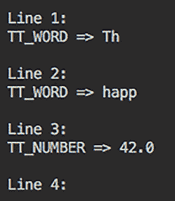

我们已经使用了`BufferedReader`类，这是一个提高效率的好做法，但在这个案例中，我们可以轻松避免它，如下所示：

```java
 FileReader fr = new FileReader(filePath);
```

```java
 StreamTokenizer st = new StreamTokenizer(fr);
```

结果不会改变。我们还使用了以下三个尚未描述的方法：

+   `void eolIsSignificant(boolean flag)`: 表示是否应该将行尾视为一个标记

+   `void commentChar(int ch)`: 表示哪个字符开始注释，因此该行其余部分将被忽略

+   `int lineno()`: 返回当前行号

以下方法可以使用`StreamTokenizer`对象调用：

+   `void lowerCaseMode(boolean fl)`: 表示是否应该将单词标记转换为小写

+   `void ordinaryChar(int ch)`, `void ordinaryChars(int low, int hi)`: 指示特定字符或必须被处理为*普通*（不是注释字符、单词组成部分、字符串分隔符、空白或数字字符）的字符范围

+   `void parseNumbers()`: 表示具有双精度浮点数格式的单词标记必须被解释为数字，而不是单词

+   `void pushBack()`: 强制`nextToken()`方法返回`ttype`字段的当前值

+   `void quoteChar(int ch)`: 表示提供的字符必须被解释为字符串值的开始和结束，该字符串值必须按原样（作为引号）接受

+   `void resetSyntax()`: 重置此标记器的语法表，使所有字符都是*普通*的

+   `void slashSlashComments(boolean flag)`: 表示必须识别 C++风格注释

+   `void slashStarComments(boolean flag)`: 表示必须识别 C 风格注释

+   `String toString()`: 返回标记和行号的字符串表示形式

+   `void whitespaceChars(int low, int hi)`: 表示必须解释为空白的字符范围

+   `void wordChars(int low, int hi)`: 表示必须解释为单词的字符范围

如您所见，使用前面方法的丰富性允许您微调文本解释。

### ObjectStreamClass 和 ObjectStreamField

`ObjectStreamClass`和`ObjectStreamField`类提供了对在 JVM 中加载的类的序列化数据的访问。可以使用以下查找方法之一找到/创建`ObjectStreamClass`对象：

+   `static ObjectStreamClass lookup(Class cl)`: 查找可序列化类的描述符

+   `static ObjectStreamClass lookupAny(Class cl)`: 查找任何类的描述符，无论是否可序列化

在找到`ObjectStreamClass`并且类是可序列化的（实现`Serializable`接口）之后，可以使用它来访问包含有关一个序列化字段信息的`ObjectStreamField`对象。如果类不可序列化，则与任何字段都不关联`ObjectStreamField`对象。

让我们来看一个例子。以下是从`ObjectStreamClass`和`ObjectStreamField`对象中获取信息的显示方法：

```java
void printInfo(ObjectStreamClass osc) {
```

```java
    System.out.println(osc.forClass());
```

```java
    System.out.println("Class name: " + osc.getName());
```

```java
    System.out.println("SerialVersionUID: " +
```

```java
                                   osc.getSerialVersionUID());
```

```java
    ObjectStreamField[] fields = osc.getFields();
```

```java
    System.out.println("Serialized fields:");
```

```java
    for (ObjectStreamField osf : fields) {
```

```java
        System.out.println(osf.getName() + ": ");
```

```java
        System.out.println("\t" + osf.getType());
```

```java
        System.out.println("\t" + osf.getTypeCode());
```

```java
        System.out.println("\t" + osf.getTypeString());
```

```java
    }
```

```java
}
```

为了演示其工作原理，我们将创建一个可序列化的`Person1`类：

```java
package com.packt.learnjava.ch05_stringsIoStreams;
```

```java
import java.io.Serializable;
```

```java
public class Person1 implements Serializable {
```

```java
    private int age;
```

```java
    private String name;
```

```java
    public Person1(int age, String name) {
```

```java
        this.age = age;
```

```java
        this.name = name;
```

```java
    }
```

```java
}
```

我们没有添加方法，因为只有对象状态是可序列化的，而不是方法。现在，让我们运行以下代码：

```java
ObjectStreamClass osc1 = 
```

```java
        ObjectStreamClass.lookup(Person1.class);
```

```java
printInfo(osc1);
```

结果将如下所示：

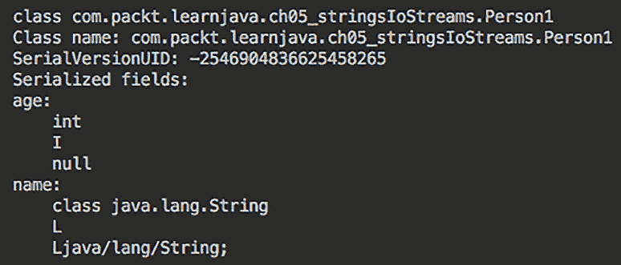

如您所见，有关类名和所有字段名和类型的详细信息。还有两个其他可以使用`ObjectStreamField`对象调用的方法：

+   `boolean isPrimitive()`: 如果此字段具有原始类型，则返回`true`

+   `boolean isUnshared()`: 如果此字段不可共享（私有或只能从同一包中访问），则返回`true`

现在，让我们创建一个不可序列化的`Person2`类：

```java
package com.packt.learnjava.ch05_stringsIoStreams;
```

```java
public class Person2 {
```

```java
    private int age;
```

```java
    private String name;
```

```java
    public Person2(int age, String name) {
```

```java
        this.age = age;
```

```java
        this.name = name;
```

```java
    }
```

```java
}
```

这次，我们将运行只查找类的代码，如下所示：

```java
ObjectStreamClass osc2 = 
```

```java
             ObjectStreamClass.lookup(Person2.class);
```

```java
System.out.println("osc2: " + osc2);    //prints: null
```

如预期的那样，使用`lookup()`方法没有找到不可序列化的对象。为了找到不可序列化的对象，我们需要使用`lookupAny()`方法：

```java
ObjectStreamClass osc3 = 
```

```java
           ObjectStreamClass.lookupAny(Person2.class);
```

```java
printInfo(osc3);
```

如果我们运行前面的示例，结果将如下所示：

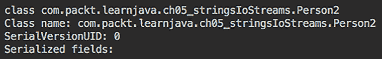

从一个不可序列化的对象中，我们能够提取有关类的信息，但不能提取有关字段的信息。

## `java.util.Scanner`类

`java.util.Scanner`类通常用于从键盘读取输入，但也可以从实现`Readable`接口的任何对象中读取文本（此接口只有一个`int read(CharBuffer buffer)`方法）。它通过分隔符（默认分隔符为空白字符）将输入值分割成令牌，并使用不同的方法处理这些令牌。

例如，我们可以从`System.in`读取输入——一个标准输入流，它通常代表键盘输入：

```java
Scanner sc = new Scanner(System.in);
```

```java
System.out.print("Enter something: ");
```

```java
while(sc.hasNext()){
```

```java
    String line = sc.nextLine();
```

```java
    if("end".equals(line)){
```

```java
        System.exit(0);
```

```java
    }
```

```java
    System.out.println(line);
```

```java
}
```

它接受多行输入（每行在按下*Enter*键后结束），直到输入行`end`被输入，如下所示：

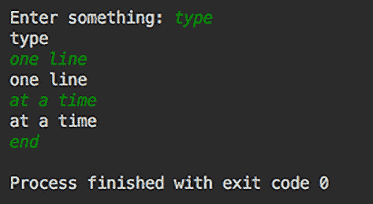

或者，`Scanner`可以读取文件中的行：

```java
String file =  classLoader.getResource("tokens.txt").getFile();
```

```java
try(Scanner sc = new Scanner(new File(file))){
```

```java
    while(sc.hasNextLine()){
```

```java
        System.out.println(sc.nextLine());
```

```java
    }
```

```java
} catch (Exception ex){
```

```java
    ex.printStackTrace();
```

```java
}
```

如您所见，我们再次使用了`tokens.txt`文件。结果如下所示：

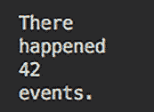

为了演示`Scanner`通过分隔符分割输入，让我们运行以下代码：

```java
String input = "One two three";
```

```java
Scanner sc = new Scanner(input);
```

```java
while(sc.hasNext()){
```

```java
    System.out.println(sc.next());
```

```java
}
```

结果如下所示：

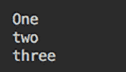

要使用另一个分隔符，可以设置如下：

```java
String input = "One,two,three";
```

```java
Scanner sc = new Scanner(input).useDelimiter(",");
```

```java
while(sc.hasNext()){
```

```java
    System.out.println(sc.next());
```

```java
}
```

结果保持不变：

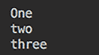

还可以使用正则表达式提取令牌，但这本书的范围之外。

`Scanner` 类还有许多其他方法，使其使用适用于各种源和所需结果。`findInLine()`、`findWithinHorizon()`、`skip()` 和 `findAll()` 方法不使用分隔符；它们只是尝试匹配提供的模式。有关更多信息，请参阅 Scanner 文档 ([`docs.oracle.com/en/java/javase/17/docs/api/java.base/java/util/Scanner.html`](https://docs.oracle.com/en/java/javase/17/docs/api/java.base/java/util/Scanner.html))。

# 文件管理

我们已经使用了一些方法来使用 JCL 类查找、创建、读取和写入文件。我们必须这样做，以便支持输入/输出流的演示代码。在本节中，我们将更详细地讨论使用 JCL 进行文件管理。

来自 `java.io` 包的 `File` 类表示底层文件系统。可以使用以下构造函数之一创建 `File` 类的实例：

+   `File(String pathname)`: 基于提供的路径名创建一个新的 `File` 实例

+   `File(String parent, String child)`: 基于提供的父路径名和子路径名创建一个新的 `File` 实例

+   `File(File parent, String child)`: 基于提供的父 `File` 对象和子路径名创建一个新的 `File` 实例

+   `File(URI uri)`: 基于提供的 `URI` 对象创建一个新的 `File` 实例，该对象表示路径名

在讨论创建和删除文件时，我们将现在看到构造函数使用的一些示例。

## 创建和删除文件和目录

要在文件系统中创建文件或目录，您需要首先使用 *文件管理* 部分中列出的构造函数之一构建一个新的 `File` 对象。例如，假设文件名为 `FileName.txt`，则 `File` 对象可以创建为 `new File("FileName.txt")`。如果文件必须创建在目录中，则必须在文件名之前添加一个路径（当它传递给构造函数时），或者必须使用其他三个构造函数之一，例如以下示例（请参阅 `Files` 类中的 `createFile2()` 方法）：

```java
String path = "demo1" + File.separator + 
```

```java
                            "demo2" + File.separator;
```

```java
String fileName = "FileName.txt";
```

```java
File f = new File(path + fileName);
```

注意使用 `File.separator` 而不是斜杠符号（`/`）或反斜杠符号（`\`）。这是因为 `File.separator` 返回平台特定的斜杠符号。以下是一个另一个 `File` 构造函数使用的示例：

```java
String path = "demo1" + File.separator + 
```

```java
                            "demo2" + File.separator;
```

```java
String fileName = "FileName.txt";
```

```java
File f = new File(path, fileName);
```

还可以使用以下构造函数：

```java
String path = "demo1" + File.separator + 
```

```java
                            "demo2" + File.separator;
```

```java
String fileName = "FileName.txt";
```

```java
File f = new File(new File(path), fileName);
```

然而，如果您更喜欢或必须使用这样的 `File` 对象：

```java
String path = "demo1" + File.separator + 
```

```java
                            "demo2" + File.separator;
```

```java
String fileName = "FileName.txt";
```

```java
URI uri = new File(path + fileName).toURI();
```

```java
File f = new File(uri);
```

然后，必须在新建的 `File` 对象上调用以下方法之一：

+   `boolean createNewFile()`: 如果不存在具有此名称的文件，则创建一个新文件并返回 `true`；否则返回 `false`

+   `static File createTempFile(String prefix, String suffix)`: 在临时文件目录中创建一个文件

+   `static File createTempFile(String prefix, String suffix, File directory)`: 创建目录；提供的前缀和后缀用于生成目录名

如果您想要创建的文件必须放置在尚不存在的目录中，必须首先使用以下方法之一，在表示文件文件系统路径的 `File` 对象上调用：

+   `boolean mkdir()`: 创建具有提供名称的目录

+   `boolean mkdirs()`: 创建具有提供名称的目录，包括任何必要的但尚不存在的父目录

在我们查看代码示例之前，我们需要解释 `delete()` 方法的工作原理：

+   `boolean delete()`: 删除文件或空目录，这意味着您可以删除文件，但不能删除所有目录，如下所示：

    ```java
    String path = "demo1" + File.separator + 
                                "demo2" + File.separator;
    String fileName = "FileName.txt";
    File f = new File(path + fileName);
    f.delete();
    ```

让我们看看以下示例中如何克服这一限制：

```java
String path = "demo1" + File.separator + 
```

```java
                            "demo2" + File.separator;
```

```java
String fileName = "FileName.txt";
```

```java
File f = new File(path + fileName);
```

```java
try {
```

```java
    new File(path).mkdirs();
```

```java
    f.createNewFile();
```

```java
    f.delete();
```

```java
    path = StringUtils
```

```java
            .substringBeforeLast(path, File.separator);
```

```java
    while (new File(path).delete()) {
```

```java
        path = StringUtils
```

```java
             .substringBeforeLast(path, File.separator);
```

```java
    }
```

```java
} catch (Exception e) {
```

```java
    e.printStackTrace();
```

```java
}
```

此示例创建并删除了一个文件及其所有相关目录。注意我们使用 `org.apache.commons.lang3.StringUtils` 类的方式，我们在 *String utilities* 部分讨论了它。它允许我们从路径中删除刚刚删除的目录，并继续这样做，直到所有嵌套目录都被删除，最后删除顶级目录。

## 列出文件和目录

以下方法可用于列出目录及其中的文件：

+   `String[] list()`: 返回目录中文件和目录的名称

+   `File[] listFiles()`: 返回表示目录中文件和目录的 `File` 对象

+   `static File[] listRoots()`: 列出可用的文件系统根

为了演示前面的方法，让我们假设我们已经创建了目录和其中的两个文件，如下所示：

```java
String path1 = "demo1" + File.separator;
```

```java
String path2 = "demo2" + File.separator;
```

```java
String path = path1 + path2;
```

```java
File f1 = new File(path + "file1.txt");
```

```java
File f2 = new File(path + "file2.txt");
```

```java
File dir1 = new File(path1);
```

```java
File dir = new File(path);
```

```java
dir.mkdirs();
```

```java
f1.createNewFile();
```

```java
f2.createNewFile();
```

之后，我们应该能够运行以下代码：

```java
System.out.print("\ndir1.list(): ");
```

```java
for(String d: dir1.list()){
```

```java
    System.out.print(d + " ");
```

```java
}
```

```java
System.out.print("\ndir1.listFiles(): ");
```

```java
for(File f: dir1.listFiles()){
```

```java
    System.out.print(f + " ");
```

```java
}
```

```java
System.out.print("\ndir.list(): ");
```

```java
for(String d: dir.list()){
```

```java
    System.out.print(d + " ");
```

```java
}
```

```java
System.out.print("\ndir.listFiles(): ");
```

```java
for(File f: dir.listFiles()){
```

```java
    System.out.print(f + " ");
```

```java
}
```

```java
System.out.print("\nFile.listRoots(): ");
```

```java
for(File f: File.listRoots()){
```

```java
    System.out.print(f + " ");
```

```java
}
```

结果应该是这样的：

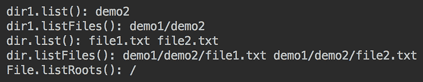

可以通过向这些方法中添加以下过滤器来增强演示的方法，以便它们只列出匹配过滤器的文件和目录：

+   `String[] list(FilenameFilter filter)`

+   `File[] listFiles(FileFilter filter)`

+   `File[] listFiles(FilenameFilter filter)`

然而，关于文件过滤器的讨论超出了本书的范围。

# Apache Commons 的 FileUtils 和 IOUtils 工具

JCL 的一个流行伴侣是 Apache Commons 项目 ([`commons.apache.org`](https://commons.apache.org))，该项目提供了许多补充 JCL 功能的库。`org.apache.commons.io` 包的类包含在以下根包和子包中：

+   `org.apache.commons.io` 根包包含具有静态方法的实用工具类，用于常见任务，例如流行的 `FileUtils` 和 `IOUtils` 类，分别在 *FileUtils 类* 和 *Class IOUtils 类* 部分进行描述。

+   `org.apache.commons.io.input` 包包含基于 `InputStream` 和 `Reader` 实现的输入支持类，例如 `XmlStreamReader` 或 `ReversedLinesFileReader`。

+   `org.apache.commons.io.output` 包包含基于 `OutputStream` 和 `Writer` 实现的输出支持类，例如 `XmlStreamWriter` 或 `StringBuilderWriter`。

+   `org.apache.commons.io.filefilter` 包包含充当文件过滤器类的实现，例如 `DirectoryFileFilter` 或 `RegexFileFilter`。

+   `org.apache.commons.io.comparator` 包包含各种 `java.util.Comparator` 的实现，用于文件，例如 `NameFileComparator`。

+   `org.apache.commons.io.serialization` 包提供了一个控制类反序列化的框架。

+   `org.apache.commons.io.monitor` 包允许监控文件系统，检查目录，以及文件的创建、更新或删除。你可以将 `FileAlterationMonitor` 对象作为线程启动，并创建一个 `FileAlterationObserver` 对象，该对象在指定的时间间隔内检查文件系统中的更改。

参考 Apache Commons 项目文档([`commons.apache.org/`](https://commons.apache.org/))以获取更多详细信息。

## `FileUtils` 类

流行的 `org.apache.commons.io.FileUtils` 类允许你执行所有可能的文件操作，如下所示：

+   向文件写入

+   从文件读取

+   创建目录，包括父目录

+   复制文件和目录

+   删除文件和目录

+   将内容转换为 URL 和从 URL 转换

+   通过过滤器扩展列出文件和目录

+   比较文件内容

+   获取文件最后修改日期

+   计算校验和

如果你计划以编程方式管理文件和目录，那么研究 Apache Commons 项目网站上的这个类的文档是必不可少的 ([`commons.apache.org/proper/commons-io/javadocs/api-2.7/org/apache/commons/io/FileUtils.html`](https://commons.apache.org/proper/commons-io/javadocs/api-2.7/org/apache/commons/io/FileUtils.html))。

## `IOUtils` 类

`org.apache.commons.io.IOUtils` 是另一个非常有用的实用工具类，它提供了以下通用的 I/O 流操作方法：

+   关闭流，忽略 null 和异常的 `closeQuietly` 方法

+   读取流数据的 `toXxx/read` 方法

+   写入数据到流的 `write` 方法

+   复制方法，将所有数据从一 个流复制到另一个流

+   比较两个流内容的 `contentEquals` 方法

这个类中所有读取流的方 法都内部进行了缓冲，因此不需要使用 `BufferedInputStream` 或 `BufferedReader` 类。`copy` 方法在幕后都使用了 `copyLarge` 方法，这大大提高了它们的性能和效率。

这个类对于管理 I/O 流是必不可少的。有关这个类及其方法的更多详细信息，请参阅 Apache Commons 项目网站 ([`commons.apache.org/proper/commons-io/javadocs/api-2.7/org/apache/commons/io/IOUtils.html`](https://commons.apache.org/proper/commons-io/javadocs/api-2.7/org/apache/commons/io/IOUtils.html))。

# 概述

在本章中，我们讨论了允许分析、比较和转换字符串的`String`类方法。我们还讨论了 JCL 和 Apache Commons 项目中的流行字符串实用工具。本章的两个大节专门用于输入/输出流以及 JCL 和 Apache Commons 项目中的支持类。文件管理类及其方法也在特定的代码示例中进行了讨论和演示。现在，你应该能够编写使用标准 Java API 和 Apache Commons 实用工具处理字符串和文件的代码。

在下一章中，我们将介绍 Java 集合框架及其三个主要接口，`List`、`Set`和`Map`，包括泛型的讨论和演示。我们还将讨论用于管理数组、对象以及`时间`/`日期`值的实用工具类。

# 测验

1.  以下代码打印什么？

    ```java
    String str = "&8a!L";
    System.out.println(str.indexOf("a!L"));
    ```

    1.  `3`

    1.  `2`

    1.  `1`

    1.  `0`

1.  以下代码打印什么？

    ```java
    String s1 = "x12";
    String s2 = new String("x12");
    System.out.println(s1.equals(s2)); 
    ```

    1.  `Error`

    1.  `Exception`

    1.  `true`

    1.  `false`

1.  以下代码打印什么？

    ```java
    System.out.println("%wx6".substring(2));
    ```

    1.  `wx`

    1.  `x6`

    1.  `%w`

    1.  `Exception`

1.  以下代码打印什么？

    ```java
    System.out.println("ab"+"42".repeat(2));
    ```

    1.  `ab4242`

    1.  `ab42ab42`

    1.  `ab422`

    1.  `Error`

1.  以下代码打印什么？

    ```java
    String s = "  ";
    System.out.println(s.isBlank()+" "+s.isEmpty());
    ```

    1.  `false false`

    1.  `false true`

    1.  `true true`

    1.  `true false`

1.  选择所有正确陈述：

    1.  流可以表示数据源。

    1.  输入流可以写入文件。

    1.  流可以表示数据目的地。

    1.  输出流可以在屏幕上显示数据。

1.  选择关于`java.io`包中类的所有正确陈述：

    1.  `Reader`扩展了`InputStream`。

    1.  读者扩展了`OutputStream`。

    1.  `Reader`扩展了`java.lang.Object`。

    1.  `Reader`扩展了`java.lang.Input`。

1.  选择关于`java.io`包中类的所有正确陈述：

    1.  `Writer`扩展了`FilterOutputStream`。

    1.  `Writer`扩展了`OutputStream`。

    1.  `Writer`扩展了`java.lang.Output`。

    1.  `Writer`扩展了`java.lang.Object`。

1.  选择关于`java.io`包中类的所有正确陈述：

    1.  `PrintStream`扩展了`FilterOutputStream`。

    1.  `PrintStream`扩展了`OutputStream`。

    1.  `PrintStream`扩展了`java.lang.Object`。

    1.  `PrintStream`扩展了`java.lang.Output`。

1.  以下代码做什么？

    ```java
    String path = "demo1" + File.separator + "demo2" + File.separator;
    String fileName = "FileName.txt";
    File f = new File(path, fileName);
    try {
        new File(path).mkdir();
        f.createNewFile();
    } catch (Exception e) {
        e.printStackTrace();
    } 
    ```

    1.  在`demo2`目录中创建两个目录和一个文件

    1.  在其中创建一个目录和一个文件

    1.  不创建任何目录

    1.  `Exception`
