# 第十二章：Java GUI 编程

本章提供了 Java **图形用户界面**（**GUI**）技术的概述，并演示了如何使用 JavaFX 工具包创建 GUI 应用程序。JavaFX 的最新版本不仅提供了许多有用的功能，还允许保留和嵌入旧版实现和样式。

在某种程度上，GUI 是应用程序最重要的部分。它直接与用户交互。如果 GUI 不方便、不吸引人或不清晰，即使是最优秀的后端解决方案也可能无法说服用户使用这个应用程序。相比之下，一个经过深思熟虑、直观且设计精良的 GUI 有助于保留用户，即使应用程序的工作效果不如竞争对手。

本章的议程要求我们涵盖以下主题：

+   Java GUI 技术概述

+   JavaFX 基础知识

+   使用 JavaFX 的 HelloWorld

+   控制元素

+   图表

+   应用 CSS

+   使用 FXML

+   嵌入 HTML

+   播放媒体

+   添加效果

到本章结束时，您将能够使用 Java GUI 技术创建用户界面，以及创建和使用用户界面项目作为独立应用程序。

# 技术要求

要能够执行本章提供的代码示例，您需要以下内容：

+   一台装有 Microsoft Windows、Apple macOS 或 Linux 操作系统的计算机

+   Java SE 版本 17 或更高版本

+   您选择的 IDE 或代码编辑器

如何设置 Java SE 和 IntelliJ IDEA 编辑器的说明在 *第一章*，“开始使用 Java 17”中提供。本章的代码示例文件可在 GitHub 上找到，网址为 [`github.com/PacktPublishing/Learn-Java-17-Programming.git`](https://github.com/PacktPublishing/Learn-Java-17-Programming.git)，在 `examples/src/main/java/com/packt/learnjava/ch12_gui` 文件夹和 `gui` 文件夹中，其中包含一个独立的 GUI 应用程序。

# Java GUI 技术概述

**Java 基础类**（**JFC**）的名称可能是一个引起许多混淆的来源。它暗示了 *Java 的基础类*，而实际上，JFC 只包括与 GUI 相关的类和接口。为了更精确，JFC 是三个框架的集合：**抽象窗口工具包**（**AWT**）、Swing 和 Java 2D。

JFC 是 **Java 类库**（**JCL**）的一部分，尽管 JFC 的名称直到 1997 年才出现，而 AWT 从一开始就是 JCL 的一部分。当时，Netscape 开发了一个名为 **Internet Foundation Classes**（**IFC**）的 GUI 库，Microsoft 也为 GUI 开发创建了 **Application Foundation Classes**（**AFC**）。因此，当 Sun Microsystems 和 Netscape 决定创建一个新的 GUI 库时，他们继承了单词 *Foundation* 并创建了 JFC。Swing 框架接管了从 AWT 到 Java GUI 编程，并且成功使用了近二十年。

在 Java 8 中，Java 控制台库（JCL）中添加了一个新的 GUI 编程工具包，JavaFX。它在 Java 11 中被从 JCL 中移除，从那时起，它作为由公司 Gluon 支持的开源项目的一部分，以可下载模块的形式存在，除了 JDK。JavaFX 在 GUI 编程方面采用了与 AWT 和 Swing 略有不同的方法。它提供了一个更一致和更简单的设计，并且有很大的机会成为获胜的 Java GUI 编程工具包。

# JavaFX 基础知识

纽约、伦敦、巴黎和莫斯科等城市拥有众多剧院，居住在那里的人们不可避免地会听到几乎每周都会发布的新剧本和制作。这使得他们不可避免地熟悉了剧院术语，其中*舞台*、*场景*和*事件*这些术语可能被使用得最为频繁。这三个术语也是 JavaFX 应用程序结构的基础。

JavaFX 中代表所有其他组件的最高级容器是由`javafx.stage.Stage`类表示的。因此，可以说在 JavaFX 应用程序中，所有事情都是在*舞台*上发生的。从用户的角度来看，这是一个显示区域或窗口，所有控件和组件都在这里执行它们的动作（就像剧院中的演员一样）。而且，与剧院中的演员类似，它们在*场景*的上下文中执行，由`javafx.scene.Scene`类表示。因此，JavaFX 应用程序，就像剧院中的戏剧一样，是由在`Stage`对象内部一次呈现一个的`Scene`对象组成的。每个`Scene`对象包含一个图，定义了场景演员（称为`javafx.scene.Node`）的位置。

一些节点控件与*事件*相关联：例如，按钮点击或复选框勾选。这些事件可以通过与相应控件元素关联的事件处理器进行处理。

JavaFX 应用程序的主要类必须扩展抽象的`java.application.Application`类，该类有几个生命周期方法。我们按调用顺序列出它们：`launch()`、`init()`、`notifyPreloader()`、`start()`和`stop()`。看起来有很多要记住。但，很可能是你只需要实现一个方法，即`start()`，在这里实际构建和执行 GUI。尽管如此，我们仍将回顾所有生命周期方法，以确保完整性：

+   `static void launch(Class<? extends Application> appClass, String... args)`: 这将启动应用程序，通常被称为`main`方法；它不会返回，直到调用`Platform.exit()`或所有应用程序窗口关闭。`appClass`参数必须是一个具有公共无参数构造函数的`Application`类的公共子类。

+   `static void launch(String... args)`: 与前面的方法相同，假设`Application`类的公共子类是立即封装的类。这是启动 JavaFX 应用程序最常用的方法；我们也将要在我们的示例中使用它。

+   `void init()`: 在`Application`类加载后调用此方法；通常用于某种类型的资源初始化。默认实现不执行任何操作，我们也不会使用它。

+   `void notifyPreloader(Preloader.PreloaderNotification info)`: 当初始化耗时较长时，可以使用此方法来显示进度；我们不会使用它。

+   `abstract void start(Stage primaryStage)`: 我们将要实现的方法。在`init()`方法返回后，以及系统准备好执行主要工作后调用。`primaryStage`参数是应用程序将要展示其场景的阶段。

+   `void stop()`: 当应用程序应该停止时调用此方法，可以用来释放资源。默认实现不执行任何操作，我们也不会使用它。

JavaFX 工具包的 API 可以在网上找到（[`openjfx.io/javadoc/18//`](https://openjfx.io/javadoc/18/)）。截至写作时，最新版本是*18*。Oracle 还提供了广泛的文档和代码示例（[`docs.oracle.com/javafx/2//`](https://docs.oracle.com/javafx/2/)）。文档包括 Scene Builder（一个提供可视化布局环境并允许您快速为 JavaFX 应用程序设计用户界面的开发工具）的描述和用户手册。这个工具对于创建复杂和精细的 GUI 可能很有用，许多人一直在使用它。然而，在这本书中，我们将专注于不使用此工具的 JavaFX 代码编写。

要能够做到这一点，以下是一些必要的步骤：

1.  将以下依赖项添加到`pom.xml`文件中：

    ```java
    <dependency>
       <groupId>org.openjfx</groupId>
       <artifactId>javafx-controls</artifactId>
       <version>18</version>
    </dependency>
    <dependency>
       <groupId>org.openjfx</groupId>
       <artifactId>javafx-fxml</artifactId>
       <version>18</version>
    </dependency>
    ```

1.  从[`gluonhq.com/products/javafx/`](https://gluonhq.com/products/javafx/)（截至写作时的`openjfx-18_osx-x64_bin-sdk.zip`文件）下载适用于您的操作系统的 JavaFX SDK，并将其解压缩到任何目录中。

1.  假设您已将 JavaFX SDK 解压缩到`/path/javafx-sdk/`文件夹中，请将以下选项添加到 Java 命令中，这将启动 Linux 平台上的 JavaFX 应用程序：

    ```java
    --module-path /path/javafx-sdk/lib   
    --add-modules=javafx.controls,javafx.fxml
    ```

在 Windows 上，这些选项看起来如下：

```java
--module-path C:\path\javafx-sdk\lib  
--add-modules=javafx.controls,javafx.fxml
```

`/path/JavaFX/`和`C:\path\JavaFX\`是您需要用包含 JavaFX SDK 的文件夹的实际路径替换的占位符。

假设应用程序的主类是`HelloWorld`，在 IntelliJ 中，将前面的选项输入到`VM options`字段中，如下所示（示例为 Linux）：

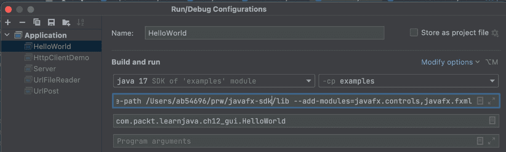

这些选项必须添加到源代码中`ch12_gui`包的`HelloWorld`、`BlendEffect`和`OtherEffects`类的`Run/Debug Configurations`中。如果您更喜欢不同的 IDE 或使用不同的操作系统，您可以在`openjfx.io`文档中找到如何设置的推荐方法（[`openjfx.io/openjfx-docs`](https://openjfx.io/openjfx-docs)）。

要从命令行运行 `HelloWorld`、`BlendEffect` 和 `OtherEffects` 类，请在 Linux 平台上的项目根目录（`pom.xml` 文件所在位置）使用以下命令：

```java
mvn clean package
java --module-path /path/javafx-sdk/lib                 \
     --add-modules=javafx.controls,javafx.fxml          \
     -cp target/examples-1.0-SNAPSHOT.jar:target/libs/* \
      com.packt.learnjava.ch12_gui.HelloWorld
java --module-path /path/javafx-sdk/lib                  \
     --add-modules=javafx.controls,javafx.fxml           \
     -cp target/examples-1.0-SNAPSHOT.jar:target/libs/*  \ 
      com.packt.learnjava.ch12_gui.BlendEffect
java --module-path /path/javafx-sdk/lib                  \
     --add-modules=javafx.controls,javafx.fxml           \
     -cp target/examples-1.0-SNAPSHOT.jar:target/libs/*  \ 
      com.packt.learnjava.ch12_gui.OtherEffects
```

在 Windows 上，相同的命令如下所示：

```java
mvn clean package
java --module-path C:\path\javafx-sdk\lib                \
     --add-modules=javafx.controls,javafx.fxml           \
     -cp target\examples-1.0-SNAPSHOT.jar;target\libs\*  \
      com.packt.learnjava.ch12_gui.HelloWorld
java --module-path C:\path\javafx-sdk\lib                 \
     --add-modules=javafx.controls,javafx.fxml            \
     -cp target\examples-1.0-SNAPSHOT.jar;target\libs\*   \
      com.packt.learnjava.ch12_gui.BlendEffect
java --module-path C:\path\javafx-sdk\lib                  \
     --add-modules=javafx.controls,javafx.fxml             \
     -cp target\examples-1.0-SNAPSHOT.jar;target\libs\*    \
      com.packt.learnjava.ch12_gui.OtherEffects
```

`HelloWorld`、`BlendEffect` 和 `OtherEffects` 每个类都有两个 `start()` 方法：`start1()` 和 `start2()`。运行该类一次后，将 `start()` 重命名为 `start1()`，将 `start1()` 重命名为 `start()`，然后再次运行前面的命令。然后，将 `start()` 重命名为 `start2()`，将 `start2()` 重命名为 `start()`，再次运行前面的命令。依此类推，直到所有 `start()` 方法都执行完毕。这样你将看到本章中所有示例的结果。

这就完成了 JavaFX 的高级介绍。有了这个，我们将转向最激动人心（对于任何程序员来说）的部分：编写代码。

# HelloWorld with JavaFX

下面是显示`Hello, World!`和“退出”文本的 `HelloWorld` JavaFX 应用程序：

```java
import javafx.application.Application;
```

```java
import javafx.application.Platform;
```

```java
import javafx.scene.control.Button;
```

```java
import javafx.scene.layout.Pane;
```

```java
import javafx.scene.text.Text;
```

```java
import javafx.scene.Scene;
```

```java
import javafx.stage.Stage;
```

```java
public class HelloWorld extends Application {
```

```java
  public static void main(String... args) {
```

```java
      launch(args);
```

```java
  }
```

```java
  @Override
```

```java
  public void start(Stage primaryStage) {
```

```java
    Text txt = new Text("Hello, world!");
```

```java
    txt.relocate(135, 40);
```

```java
    Button btn = new Button("Exit");
```

```java
    btn.relocate(155, 80);
```

```java
    btn.setOnAction(e:> {
```

```java
        System.out.println("Bye! See you later!");
```

```java
        Platform.exit();
```

```java
    });
```

```java
    Pane pane = new Pane();
```

```java
    pane.getChildren().addAll(txt, btn);
```

```java
    primaryStage
```

```java
        .setTitle("The primary stage (top-level container)");
```

```java
    primaryStage.onCloseRequestProperty()
```

```java
        .setValue(e:> System.out.println(
```

```java
                                       "Bye! See you later!"));
```

```java
    primaryStage.setScene(new Scene(pane, 350, 150));
```

```java
    primaryStage.show();
```

```java
  }
```

```java
}
```

如你所见，应用程序是通过调用 `Application.launch(String... args)` 静态方法启动的。`start(Stage primaryStage)` 方法创建了一个带有消息“按钮”的 `Text` 节点，文本“退出”位于绝对位置 155（水平）和 80（垂直）。当点击 `Button`（当它被点击时）时，分配的动作将打印 `Platform.exit()` 方法。这两个节点被添加为布局面板的子节点，允许绝对定位。

`Stage` 对象被分配了标题“主舞台（顶级容器）”。它还被分配了一个在窗口右上角点击关闭窗口符号（Linux 系统的左上角和 Windows 系统的右上角）的动作。

在创建动作时，我们使用了 Lambda 表达式，我们将在*第十三章*“函数式编程”中讨论。

创建的布局面板被设置在 `Scene` 对象上。场景大小设置为水平 350 像素和垂直 150 像素。`Scene` 对象被放置在舞台上。然后，通过调用 `show()` 方法显示舞台。

如果我们运行前面的应用程序（`HellowWorld` 类的 `start()` 方法），将弹出以下窗口：

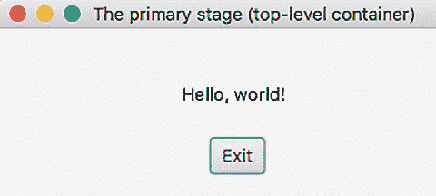

点击 **退出** 按钮将显示预期的消息：


但是，如果你需要在 `HelloWorld` 类的 `stop()` 方法之后执行其他操作。在这个例子中看起来如下所示：

```java
@Override
public void stop(){
    System.out.println(
                  "Doing what has to be done before closing");}
```

如果你点击 **x** 按钮或 **退出** 按钮，显示将如下所示：

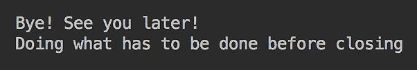

这个例子让你对 JavaFX 的工作方式有一个感觉。从现在开始，在回顾 JavaFX 功能时，我们只会在 `start()` 方法中展示代码。

工具包有大量的包，每个包中都有许多类，每个类都有许多方法。我们无法讨论所有这些。相反，我们将以最简单、最直接的方式概述 JavaFX 功能的所有主要区域。

# 控制元素

`javafx.scene.control` 包 ([`openjfx.io/javadoc/11/javafx.controls/javafx/scene/control/package-summary.html`](https://openjfx.io/javadoc/11/javafx.controls/javafx/scene/control/package-summary.html))。其中包含超过 80 个类，包括按钮、文本字段、复选框、标签、菜单、进度条和滚动条等。正如我们之前提到的，每个控件元素都是 `Node` 的子类，它有超过 200 个方法。因此，你可以想象使用 JavaFX 构建的 GUI 是多么丰富和精细。然而，本书的范围仅允许我们涵盖一些元素及其方法。

在上一节中的示例中，我们已经实现了一个按钮。现在，让我们使用一个标签和一个文本字段来创建一个简单的表单，其中包含输入字段（名字，姓氏和年龄）以及在 `HelloWorld` 类中的 `start()` 方法（将之前的 `start()` 方法重命名为 `start1()`，将 `start2()` 方法重命名为 `start()`）。

首先，让我们创建控件：

```java
Text txt = new Text("Fill the form and click Submit");
```

```java
TextField tfFirstName = new TextField();
```

```java
TextField tfLastName = new TextField();
```

```java
TextField tfAge = new TextField();
```

```java
Button btn = new Button("Submit");
```

```java
btn.setOnAction(e:> action(tfFirstName, tfLastName, tfAge));
```

如你所猜，文本将用作表单说明。其余部分相当直接，看起来与我们在 `HelloWorld` 示例中看到的内容非常相似。`action()` 是以下方法实现的一个函数：

```java
void action(TextField tfFirstName, 
```

```java
                TextField tfLastName, TextField tfAge ) {
```

```java
    String fn = tfFirstName.getText();
```

```java
    String ln = tfLastName.getText();
```

```java
    String age = tfAge.getText();
```

```java
    int a = 42;
```

```java
    try {
```

```java
        a = Integer.parseInt(age);
```

```java
    } catch (Exception ex){}
```

```java
    fn = fn.isBlank() ? "Nick" : fn;
```

```java
    ln = ln.isBlank() ? "Samoylov" : ln;
```

```java
    System.out.println("Hello, "+fn+" "+ln + ", age " + 
```

```java
                                                      a + "!");
```

```java
    Platform.exit();
```

```java
}
```

此函数接受三个参数（`javafx.scene.control.TextField` 对象），然后获取提交的输入值并直接打印它们。代码确保始终有一些默认值可用于打印，并且输入非数字的 `age` 值不会破坏应用程序。

在放置了控件和动作之后，我们使用 `javafx.scene.layout.GridPane` 类将它们放入一个网格布局中：

```java
GridPane grid = new GridPane();
```

```java
grid.setAlignment(Pos.CENTER);
```

```java
grid.setHgap(15);
```

```java
grid.setVgap(5);
```

```java
grid.setPadding(new Insets(20, 20, 20, 20));
```

`GridPane` 布局面板有行和列，它们形成节点可以设置的单元格。节点可以跨越列和行。`setAlignment()` 方法将网格的位置设置为场景的中心（默认位置是场景的左上角）。`setHgap()` 和 `setVgap()` 方法设置列（水平）和行（垂直）之间的间距（以像素为单位）。`setPadding()` 方法在网格面板的边缘添加一些空间。`Insets()` 对象按顺序设置顶部、右侧、底部和左侧的值。

现在，我们将创建的节点放置在相应的单元格中（排列成两列）：

```java
int i = 0;
```

```java
grid.add(txt,    1, i++, 2, 1);
```

```java
GridPane.setHalignment(txt, HPos.CENTER);
```

```java
grid.addRow(i++, new Label("First Name"), tfFirstName);
```

```java
grid.addRow(i++, new Label("Last Name"),  tfLastName);
```

```java
grid.addRow(i++, new Label("Age"), tfAge);
```

```java
grid.add(btn,    1, i);
```

```java
GridPane.setHalignment(btn, HPos.CENTER);
```

`add()` 方法接受三个或五个参数：

+   节点，列索引和行索引

+   节点，列索引，行索引，跨越多少列，跨越多少行

列和行的索引从 `0` 开始。

`setHalignment()` 方法设置节点在单元格中的位置。`HPos` 枚举有 `LEFT`、`RIGHT` 和 `CENTER` 三个值。`addRow(int i, Node... nodes)` 方法接受行索引和节点变量的参数。我们使用它来放置 `Label` 和 `TextField` 对象。

`start()` 方法的其余部分与 `HelloWorld` 示例非常相似（只有标题和大小有所变化）：

```java
primaryStage.setTitle("Simple form example");
```

```java
primaryStage.onCloseRequestProperty()
```

```java
     .setValue(e -> System.out.println("Bye! See you later!"));
```

```java
primaryStage.setScene(new Scene(grid, 300, 200));
```

```java
primaryStage.show();
```

如果我们运行新实现的 `start()` 方法，结果将如下所示：

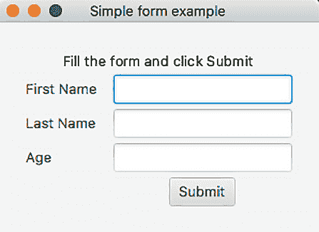

我们可以这样填充数据，例如：

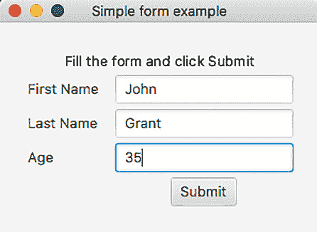

在您点击 **提交** 按钮后，将显示以下消息，并且应用程序退出：

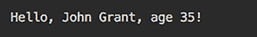

为了帮助可视化布局，特别是在更复杂的设计中，您可以使用 `setGridLinesVisible(boolean v)` 网格方法使网格线可见。这有助于看到单元格是如何对齐的。我们可以在我们的示例中添加（取消注释）以下行：

```java
grid.setGridLinesVisible(true);
```

我们再次运行它，结果如下：

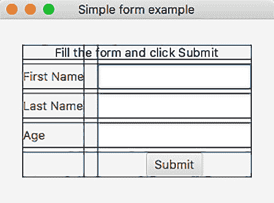

如您所见，布局现在被明确地勾勒出来，这有助于我们可视化设计。

`javafx.scene.layout` 包包括 24 个布局类，例如 `Pane`（我们在 `HelloWorld` 示例中见过）、`StackPane`（允许我们叠加节点）、`FlowPane`（允许节点位置随窗口大小变化而流动）、`AnchorPane`（保持节点相对于其锚点的位置），等等。下一节将演示 `VBox` 布局，*图表*。

# 图表

JavaFX 在 `javafx.scene.chart` 包中提供了以下图表组件用于数据可视化：

+   `LineChart`：在系列中的数据点之间添加线条。通常用于展示随时间的变化趋势。

+   `AreaChart`：与 `LineChart` 类似，但填充连接数据点和坐标轴之间的区域。通常用于比较随时间累积的总数。

+   `BarChart`：以矩形条的形式展示数据。用于离散数据的可视化。

+   `PieChart`：将圆形分成几个部分（用不同颜色填充），每个部分代表总值的比例。我们将在本节中演示它。

+   `BubbleChart`：以二维椭圆形形状（称为气泡）展示数据，允许展示三个参数。

+   `ScatterChart`：以系列中的数据点原样展示。有助于识别是否存在聚类（数据相关性）。

以下示例（`HellowWorld` 类的 `start3()` 方法）演示了如何将测试结果以饼图的形式展示。每个部分代表测试成功、失败或忽略的数量：

```java
Text txt = new Text("Test results:");
```

```java
PieChart pc = new PieChart();
```

```java
pc.getData().add(new PieChart.Data("Succeed", 143));
```

```java
pc.getData().add(new PieChart.Data("Failed" ,  12));
```

```java
pc.getData().add(new PieChart.Data("Ignored",  18));
```

```java
VBox vb = new VBox(txt, pc);
```

```java
vb.setAlignment(Pos.CENTER);
```

```java
vb.setPadding(new Insets(10, 10, 10, 10));
```

```java
primaryStage.setTitle("A chart example");
```

```java
primaryStage.onCloseRequestProperty()
```

```java
      .setValue(e:> System.out.println("Bye! See you later!"));
```

```java
primaryStage.setScene(new Scene(vb, 300, 300));
```

```java
primaryStage.show();
```

我们创建了两个节点——`Text`和`PieChart`，并将它们放置在`VBox`布局的单元格中，使它们按列排列，一个在上一个下面。我们在`VBox`面板的边缘添加了 10 像素的填充。请注意，VBox 扩展了`Node`和`Pane`类，就像其他面板一样。我们还使用`setAlignment()`方法将面板定位在场景的中心。其余的与所有其他先前的示例相同，只是场景标题和大小不同。

如果我们运行这个示例（将之前的`start()`方法重命名为`start2()`，将`start3()`方法重命名为`start()`），结果将如下所示：

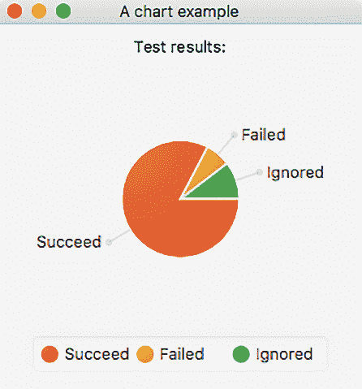

`PieChart`类以及任何其他图表都有几个其他方法，这些方法可以用于以用户友好的方式展示更复杂和动态的数据。

现在，让我们讨论如何通过使用**层叠样式表**（**CSS**）的力量来丰富您应用程序的外观和感觉。

# 应用 CSS

默认情况下，JavaFX 使用随分发 JAR 文件一起提供的样式表。要覆盖默认样式，您可以使用`getStylesheets()`方法将样式表添加到场景中：

```java
scene.getStylesheets().add("/mystyle.css");
```

`mystyle.css`文件必须放置在`src/main/resources`文件夹中。让我们这样做，并将以下内容的`mystyle.css`文件添加到`HelloWorld`示例中：

```java
#text-hello {
```

```java
  :fx-font-size: 20px;
```

```java
   -fx-font-family: "Arial";
```

```java
   -fx-fill: red;
```

```java
}
```

```java
.button {
```

```java
   -fx-text-fill: white;
```

```java
   -fx-background-color: slateblue;
```

```java
}
```

如您所见，我们希望以某种方式样式化具有`text-hello` ID 的`Button`节点和`Text`节点。我们还必须通过向`Text`元素添加 ID 并将样式表文件添加到场景中（`start4()`方法）来修改`HelloWorld`示例：

```java
Text txt = new Text("Hello, world!");
```

```java
txt.setId("text-hello");
```

```java
txt.relocate(115, 40);
```

```java
Button btn = new Button("Exit");
```

```java
btn.relocate(155, 80);
```

```java
btn.setOnAction(e -> {
```

```java
    System.out.println("Bye! See you later!");
```

```java
    Platform.exit();
```

```java
});
```

```java
Pane pane = new Pane();
```

```java
pane.getChildren().addAll(txt, btn);
```

```java
Scene scene = new Scene(pane, 350, 150);
```

```java
scene.getStylesheets().add("/mystyle.css");
```

```java
primaryStage.setTitle("The primary stage (top-level container)");
```

```java
primaryStage.onCloseRequestProperty()
```

```java
   .setValue(e -> System.out.println("\nBye! See you later!"));
```

```java
primaryStage.setScene(scene);
```

```java
primaryStage.show();
```

如果我们运行此代码（将之前的`start()`方法重命名为`start3()`，将`start4()`方法重命名为`start()`），结果将如下所示：

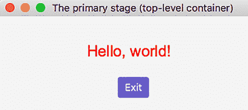

或者，可以在任何将要使用的节点上设置内联样式，以覆盖文件样式表，无论是默认的还是其他样式。让我们向最新的`HelloWorld`示例中添加（取消注释）以下行：

```java
btn.setStyle("-fx-text-fill: white; -fx-background-color: red;");
```

如果我们再次运行这个示例，结果将如下所示：

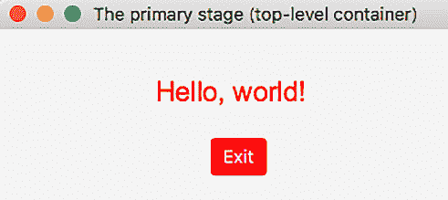

查阅 JavaFX CSS 参考指南（[`docs.oracle.com/javafx/2/api/javafx/scene/doc-files/cssref.html`](https://docs.oracle.com/javafx/2/api/javafx/scene/doc-files/cssref.html)），以了解自定义样式的多样性和可能选项。

现在，让我们讨论一种为 FX 应用程序构建用户界面的替代方法，这种方法不需要编写 Java 代码，而是通过使用**FX 标记语言**（**FXML**）。

# 使用 FXML

**FXML**是一种基于 XML 的语言，允许独立于应用程序（业务）逻辑（就外观和感觉而言，或其他与展示相关的更改）构建用户界面和维护它。使用 FXML，您可以在不写一行 Java 代码的情况下设计用户界面。

FXML 没有模式，但其功能反映了用于构建场景的 JavaFX 对象的 API。这意味着您可以使用 API 文档来了解在 FXML 结构中允许哪些标签和属性。大多数时候，JavaFX 类可以用作标签，它们的属性可以用作属性。

除了 FXML 文件（视图）之外，控制器（Java 类）还可以用于处理模型和组织页面流程。模型由视图和控制器管理的域对象组成。它还允许使用 CSS 样式和 JavaScript 的全部功能。但是，在这本书中，我们只能演示基本的 FXML 功能。其余的可以在 FXML 介绍([`docs.oracle.com/javafx/2/api/javafx/fxml/doc-files/introduction_to_fxml.html`](https://docs.oracle.com/javafx/2/api/javafx/fxml/doc-files/introduction_to_fxml.html))和许多在线的优秀教程中找到。

为了演示 FXML 的使用，我们将重新创建在*控制元素*部分创建的简单表单，并通过添加页面流程来增强它。以下是我们的表单，包含名字、姓氏和年龄，如何在 FXML 中表示：

```java
<?xml version="1.0" encoding="UTF-8"?>
```

```java
<?import javafx.scene.Scene?>
```

```java
<?import javafx.geometry.Insets?>
```

```java
<?import javafx.scene.text.Text?>
```

```java
<?import javafx.scene.control.Label?>
```

```java
<?import javafx.scene.control.Button?>
```

```java
<?import javafx.scene.layout.GridPane?>
```

```java
<?import javafx.scene.control.TextField?>
```

```java
<Scene fx:controller="com.packt.learnjava.ch12_gui.HelloWorldController"
```

```java
       xmlns:fx="http://javafx.com/fxml"
```

```java
       width="350" height="200">
```

```java
    <GridPane alignment="center" hgap="15" vgap="5">
```

```java
        <padding>
```

```java
            <Insets top="20" right="20" bottom="20" left="20"/>
```

```java
        </padding>
```

```java
        <Text id="textFill" text="Fill the form and click 
```

```java
         Submit" GridPane.rowIndex="0" GridPane.columnSpan="2">
```

```java
            <GridPane.halignment>center</GridPane.halignment>
```

```java
        </Text>
```

```java
        <Label text="First name"
```

```java
               GridPane.columnIndex="0" GridPane.rowIndex="1"/>
```

```java
        <TextField fx:id="tfFirstName"
```

```java
               GridPane.columnIndex="1" GridPane.rowIndex="1"/>
```

```java
        <Label text="Last name"
```

```java
               GridPane.columnIndex="0" GridPane.rowIndex="2"/>
```

```java
        <TextField fx:id="tfLastName"
```

```java
               GridPane.columnIndex="1" GridPane.rowIndex="2"/>
```

```java
        <Label text="Age"
```

```java
               GridPane.columnIndex="0" GridPane.rowIndex="3"/>
```

```java
        <TextField fx:id="tfAge"
```

```java
               GridPane.columnIndex="1" GridPane.rowIndex="3"/>
```

```java
        <Button text="Submit"
```

```java
                GridPane.columnIndex="1" GridPane.rowIndex="4"
```

```java
                onAction="#submitClicked">
```

```java
            <GridPane.halignment>center</GridPane.halignment>
```

```java
        </Button>
```

```java
    </GridPane>
```

```java
</Scene>
```

如您所见，它表达了您已经熟悉的期望场景结构，并指定了控制器类`HelloWorldController`，我们很快就会看到。正如我们之前提到的，标签与我们在仅使用 Java 构建相同 GUI 时使用的类名相匹配。我们将前面的 FXML 代码（作为`helloWorld.fxml`文件）放入`resources`文件夹。

现在，让我们看看`HelloWorld`类的`start5()`方法（将其重命名为`start()`），它使用`helloWorld.fxml`文件：

```java
try {
```

```java
  ClassLoader classLoader =
```

```java
             Thread.currentThread().getContextClassLoader();
```

```java
  String file =
```

```java
        classLoader.getResource("helloWorld.fxml").getFile();
```

```java
  FXMLLoader lder = new FXMLLoader();
```

```java
  lder.setLocation(new URL("file:" + file));
```

```java
  Scene scene = lder.load();
```

```java
  primaryStage.setTitle("Simple form example");
```

```java
  primaryStage.setScene(scene);
```

```java
  primaryStage.onCloseRequestProperty().setValue(e ->
```

```java
                  System.out.println("\nBye! See you later!"));
```

```java
  primaryStage.show();
```

```java
} catch (Exception ex){
```

```java
    ex.printStackTrace();
```

```java
}
```

`start()`方法只是加载`helloWorld.fxml`文件并设置舞台，后者与我们的前例中的操作完全相同。

现在，让我们看看`HelloWorldController`类。如果需要，我们可以只使用以下内容启动应用程序：

```java
public class HelloWorldController {
```

```java
    @FXML
```

```java
    protected void submitClicked(ActionEvent e) {
```

```java
    }
```

```java
}
```

表单将会显示，但按钮点击将不会执行任何操作。这就是我们在谈论与应用程序逻辑无关的用户界面开发时的意思。注意`@FXML`注解。它使用它们的 ID 将方法和属性绑定到 FXML 标签。以下是完整的控制器实现：

```java
@FXML
```

```java
private TextField tfFirstName;
```

```java
@FXML
```

```java
private TextField tfLastName;
```

```java
@FXML
```

```java
private TextField tfAge;
```

```java
@FXML
```

```java
protected void submitClicked(ActionEvent e) {
```

```java
    String fn = tfFirstName.getText();
```

```java
    String ln = tfLastName.getText();
```

```java
    String age = tfAge.getText();
```

```java
    int a = 42;
```

```java
    try {
```

```java
        a = Integer.parseInt(age);
```

```java
    } catch (Exception ex) {
```

```java
    }
```

```java
    fn = fn.isBlank() ? "Nick" : fn;
```

```java
    ln = ln.isBlank() ? "Samoylov" : ln;
```

```java
    String hello = "Hello, " + fn + " " + ln + ", age " + 
```

```java
                                                       a + "!";
```

```java
    System.out.println(hello);
```

```java
    Platform.exit();
```

```java
}
```

对于大部分内容来说，它应该非常熟悉。唯一的区别是我们不是直接（如之前那样）引用字段及其值，而是使用带有`@FXML`注解的绑定来引用。如果我们现在运行`HelloWorld`类（别忘了将`start5()`方法重命名为`start()`），页面外观和行为将与我们之前在*控制元素*部分描述的完全相同：

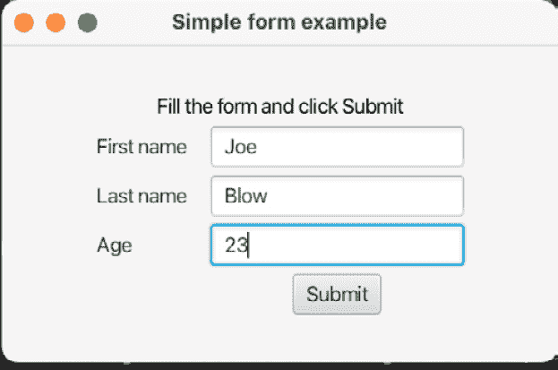

如果点击了右上角的**x**按钮，屏幕上会显示以下输出：

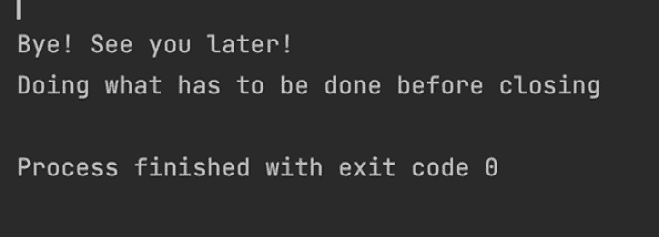

如果点击**提交**按钮，输出会显示以下消息：

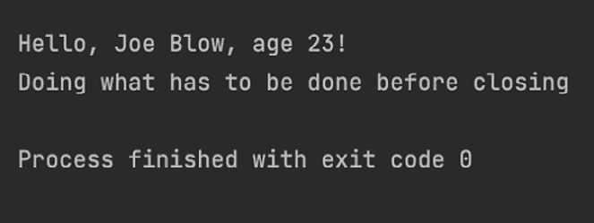

现在，让我们看看作为单独项目在`gui`文件夹中实现的具有两个页面的独立 GUI 应用程序：

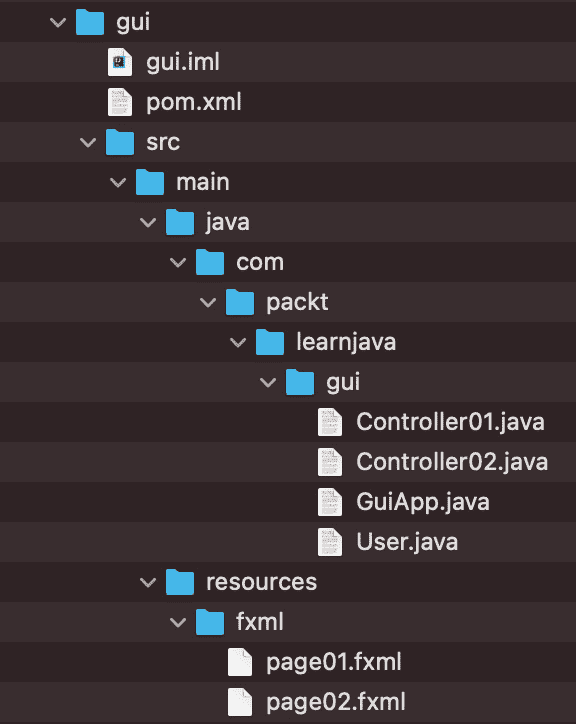

如您所见，此应用程序由主`GuiApp`类、两个`Controller`类、`User`类和两个页面（`.fxml`文件）组成。让我们从`.fxml`文件开始。为了简单起见，`page01.fxml`文件几乎与上一节中描述的`helloWorld.fxml`文件内容完全相同。唯一的区别是它引用了`Controller01`类，该类实现了与之前描述的`start5()`方法相同的`start()`方法。主`GuiApp`类看起来非常简单：

```java
public class GuiApp extends Application {
```

```java
    public static void main(String... args) {
```

```java
        launch(args);
```

```java
    }
```

```java
    @Override
```

```java
    public void stop(){
```

```java
        System.out.println("Doing what has to be done...");
```

```java
    }
```

```java
    public void start(Stage primaryStage) {
```

```java
        Controller01.start(primaryStage);
```

```java
    }
```

```java
}
```

如您所见，它只是调用了`Controller01`类中的`start()`方法，该方法反过来显示您熟悉的页面：


在表单填写完毕后，将`Controller01`类传递给`Controller02`类，使用`Controller01`类的`submitClicked()`方法：

```java
    @FXML
```

```java
    protected void submitClicked(ActionEvent e) {
```

```java
        String fn = tfFirstName.getText();
```

```java
        String ln = tfLastName.getText();
```

```java
        String age = tfAge.getText();
```

```java
        int a = 42;
```

```java
        try {
```

```java
            a = Integer.parseInt(age);
```

```java
        } catch (Exception ex) {
```

```java
        }
```

```java
        fn = fn.isBlank() ? "Nick" : fn;
```

```java
        ln = ln.isBlank() ? "Samoylov" : ln;
```

```java
        Controller02.goToPage2(new User(a, fn, ln));
```

```java
        Node source = (Node) e.getSource();
```

```java
        Stage stage = (Stage) source.getScene().getWindow();
```

```java
        stage.close();
```

```java
    }
```

`Controller02.goToPage2()`方法看起来如下：

```java
public static void goToPage2(User user) {
```

```java
  try {
```

```java
    ClassLoader classLoader =
```

```java
             Thread.currentThread().getContextClassLoader();
```

```java
    String file = classLoader.getResource("fxml" + 
```

```java
                  File.separator + "page02.fxml").getFile();
```

```java
    FXMLLoader loader = new FXMLLoader();
```

```java
    loader.setLocation(new URL("file:" + file));
```

```java
    Scene scene = loader.load();
```

```java
    Controller02 c = loader.getController();
```

```java
    String hello = "Hello, " + user.getFirstName() + " " + 
```

```java
        user.getLastName() + ", age " + user.getAge() + "!";
```

```java
    c.textHello.setText(hello);
```

```java
    Stage primaryStage = new Stage();
```

```java
    primaryStage.setTitle("Second page of GUI App");
```

```java
    primaryStage.setScene(scene);
```

```java
    primaryStage.onCloseRequestProperty()
```

```java
        .setValue(e -> {
```

```java
                          System.out.println("\nBye!");
```

```java
                          Platform.exit();
```

```java
                       });
```

```java
    primaryStage.show();
```

```java
  } catch (Exception ex) {
```

```java
       ex.printStackTrace();
```

```java
  }
```

```java
}
```

第二个页面仅显示接收到的数据。以下是其 FXML 的样式（`page2.fxml`文件）：

```java
<?xml version="1.0" encoding="UTF-8"?>
```

```java
<?import javafx.scene.Scene?>
```

```java
<?import javafx.geometry.Insets?>
```

```java
<?import javafx.scene.text.Text?>
```

```java
<?import javafx.scene.layout.GridPane?>
```

```java
<Scene fx:controller="com.packt.lernjava.gui.Controller02"
```

```java
       xmlns:fx="http://javafx.com/fxml"
```

```java
       width="350" height="150">
```

```java
    <GridPane alignment="center" hgap="15" vgap="5">
```

```java
        <padding>
```

```java
            <Insets top="20" right="20" bottom="20" left="20"/>
```

```java
        </padding>
```

```java
        <Text fx:id="textHello"
```

```java
              GridPane.rowIndex="0" GridPane.columnSpan="2">
```

```java
            <GridPane.halignment>center</GridPane.halignment>
```

```java
        </Text>
```

```java
        <Text id="textDo" text="Do what has to be done here"
```

```java
              GridPane.rowIndex="1" GridPane.columnSpan="2">
```

```java
            <GridPane.halignment>center</GridPane.halignment>
```

```java
        </Text>
```

```java
    </GridPane>
```

```java
</Scene>
```

如您所见，页面只有两个只读的`Text`字段。第一个（`id="textHello"`）显示从上一页传递的数据。第二个仅显示消息，“在这里完成必须做的事情”。这并不复杂，但它展示了数据流和页面如何组织。

如果我们执行`GuiApp`类，我们将看到熟悉的表单并可以填写数据：


在我们点击**提交**按钮后，此窗口将关闭，新的窗口将出现：


现在，我们可以点击左上角（或在 Windows 上的右上角）的**x**按钮，并看到以下信息：

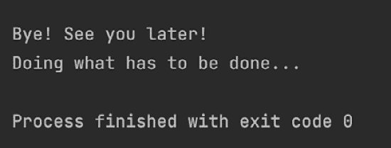

`stop()`方法按预期工作。

有了这个，我们就结束了 FXML 的介绍，并转向下一个主题，即向 JavaFX 应用程序添加 HTML。

# 嵌入 HTML

向 JavaFX 添加 HTML 很容易。您只需使用`javafx.scene.web.WebView`类即可，该类提供了一个窗口，其中添加的 HTML 以类似于浏览器中的方式渲染。`WebView`类使用 WebKit，开源浏览器引擎，因此支持完整的浏览功能。

与所有其他 JavaFX 组件一样，`WebView`类扩展了`Node`类，可以在 Java 代码中这样处理。此外，它还具有自己的属性和方法，允许通过设置窗口大小（最大、最小和首选高度和宽度）、字体缩放、缩放率、添加 CSS、启用上下文（右键单击）菜单等方式调整浏览器窗口以适应包含的应用程序。`getEngine()`方法返回一个与它关联的`javafx.scene.web.WebEngine`对象。它提供了加载 HTML 页面、导航它们、对加载的页面应用不同的样式、访问它们的浏览历史和文档模型以及执行 JavaScript 的能力。

要开始使用`javafx.scene.web`包，首先需要执行以下两个步骤：

1.  将以下依赖项添加到`pom.xml`文件中：

    ```java
    <dependency>
       <groupId>org.openjfx</groupId>
       <artifactId>javafx-web</artifactId>
       <version>11.0.2</version>
    </dependency>
    ```

`javafx-web`的版本通常与 Java 版本保持同步，但在撰写本文时，`javafx-web`的版本 12 尚未发布，因此我们使用最新可用的版本，*11.0.2*。

1.  由于`javafx-web`使用已被从 Java 9 中移除的`com.sun.*`包（[`docs.oracle.com/javase/9/migrate/toc.htm#JSMIG-GUID-F7696E02-A1FB-4D5A-B1F2-89E7007D4096`](https://docs.oracle.com/javase/9/migrate/toc.htm#JSMIG-GUID-F7696E02-A1FB-4D5A-B1F2-89E7007D4096)），要从 Java 9+访问`com.sun.*`包，除了在`Run/Debug Configuration`中`ch12_gui`包的`HtmlWebView`类的 JavaFX 基础知识部分描述的`--module-path`和`--add-modules`之外，还需要设置以下 VM 选项（对于 Windows，将斜杠符号改为反斜杠）：

    ```java
    --add-exports javafx.graphics/com.sun.javafx.sg.prism=ALL-UNNAMED 
    --add-exports javafx.graphics/com.sun.javafx.scene=ALL-UNNAMED 
    --add-exports javafx.graphics/com.sun.javafx.util=ALL-UNNAMED 
    --add-exports javafx.base/com.sun.javafx.logging=ALL-UNNAMED 
    --add-exports javafx.graphics/com.sun.prism=ALL-UNNAMED 
    --add-exports javafx.graphics/com.sun.glass.ui=ALL-UNNAMED 
    --add-exports javafx.graphics/com.sun.javafx.geom.transform=ALL-UNNAMED 
    --add-exports javafx.graphics/com.sun.javafx.tk=ALL-UNNAMED 
    --add-exports javafx.graphics/com.sun.glass.utils=ALL-UNNAMED 
    --add-exports javafx.graphics/com.sun.javafx.font=ALL-UNNAMED 
    --add-exports javafx.graphics/com.sun.javafx.application=ALL-UNNAMED 
    --add-exports javafx.controls/com.sun.javafx.scene.control=ALL-UNNAMED 
    --add-exports javafx.graphics/com.sun.javafx.scene.input=ALL-UNNAMED 
    --add-exports javafx.graphics/com.sun.javafx.geom=ALL-UNNAMED 
    --add-exports javafx.graphics/com.sun.prism.paint=ALL-UNNAMED 
    --add-exports javafx.graphics/com.sun.scenario.effect=ALL-UNNAMED 
    --add-exports javafx.graphics/com.sun.javafx.text=ALL-UNNAMED 
    --add-exports javafx.graphics/com.sun.javafx.iio=ALL-UNNAMED
    --add-exports javafx.graphics/com.sun.scenario.effect.impl.prism=ALL-UNNAMED
    --add-exports javafx.graphics/com.sun.javafx.scene.text=ALL-UNNAMED
    ```

1.  要从命令行执行`HtmlWebView`类，请转到`examples`文件夹，并使用以下命令（不要忘记将`/path/JavaFX`替换为包含 JavaFX SDK 的实际路径）：

    ```java
    mvn clean package
    java --module-path /path/javaFX/lib --add-modules=javafx.controls,javafx.fxml --add-exports javafx.graphics/com.sun.javafx.sg.prism=ALL-UNNAMED --add-exports javafx.graphics/com.sun.javafx.scene=ALL-UNNAMED --add-exports javafx.graphics/com.sun.javafx.util=ALL-UNNAMED --add-exports javafx.base/com.sun.javafx.logging=ALL-UNNAMED --add-exports javafx.graphics/com.sun.prism=ALL-UNNAMED --add-exports javafx.graphics/com.sun.glass.ui=ALL-UNNAMED --add-exports javafx.graphics/com.sun.javafx.geom.transform=ALL-UNNAMED --add-exports javafx.graphics/com.sun.javafx.tk=ALL-UNNAMED --add-exports javafx.graphics/com.sun.glass.utils=ALL-UNNAMED  --add-exports javafx.graphics/com.sun.javafx.font=ALL-UNNAMED  --add-exports javafx.graphics/com.sun.javafx.application=ALL-UNNAMED --add-exports javafx.controls/com.sun.javafx.scene.control=ALL-UNNAMED --add-exports javafx.graphics/com.sun.javafx.scene.input=ALL-UNNAMED --add-exports javafx.graphics/com.sun.javafx.geom=ALL-UNNAMED  --add-exports javafx.graphics/com.sun.prism.paint=ALL-UNNAMED  --add-exports javafx.graphics/com.sun.scenario.effect=ALL-UNNAMED --add-exports javafx.graphics/com.sun.javafx.text=ALL-UNNAMED --add-exports javafx.graphics/com.sun.javafx.iio=ALL-UNNAMED --add-exports javafx.graphics/com.sun.scenario.effect.impl.prism=ALL-UNNAMED --add-exports javafx.graphics/com.sun.javafx.scene.text=ALL-UNNAMED  -cp target/examples-1.0-SNAPSHOT.jar com.packt.learnjava.ch12_gui.HtmlWebView
    ```

1.  在 Windows 上，相同的命令如下（不要忘记将`C:\path\JavaFX`替换为包含 JavaFX SDK 的实际路径）：

    ```java
    mvn clean package
    java --module-path C:\path\JavaFX\lib --add-modules=javafx.controls,javafx.fxml --add-exports javafx.graphics\com.sun.javafx.sg.prism=ALL-UNNAMED --add-exports javafx.graphics\com.sun.javafx.scene=ALL-UNNAMED --add-exports javafx.graphics\com.sun.javafx.util=ALL-UNNAMED --add-exports javafx.base\com.sun.javafx=ALL-UNNAMED --add-exports javafx.base\com.sun.javafx.logging=ALL-UNNAMED --add-exports javafx.graphics\com.sun.prism=ALL-UNNAMED --add-exports javafx.graphics\com.sun.glass.ui=ALL-UNNAMED --add-exports javafx.graphics\com.sun.javafx.geom.transform=ALL-UNNAMED --add-exports javafx.graphics\com.sun.javafx.tk=ALL-UNNAMED --add-exports javafx.graphics\com.sun.glass.utils=ALL-UNNAMED  --add-exports javafx.graphics\com.sun.javafx.font=ALL-UNNAMED  --add-exports javafx.graphics\com.sun.javafx.application=ALL-UNNAMED --add-exports javafx.controls\com.sun.javafx.scene.control=ALL-UNNAMED --add-exports javafx.graphics\com.sun.javafx.scene.input=ALL-UNNAMED --add-exports javafx.graphics\com.sun.javafx.geom=ALL-UNNAMED  --add-exports javafx.graphics\com.sun.prism.paint=ALL-UNNAMED  --add-exports javafx.graphics\com.sun.scenario.effect=ALL-UNNAMED --add-exports javafx.graphics\com.sun.javafx.text=ALL-UNNAMED --add-exports javafx.graphics\com.sun.javafx.iio=ALL-UNNAMED --add-exports javafx.graphics\com.sun.scenario.effect.impl.prism=ALL-UNNAMED --add-exports javafx.graphics\com.sun.javafx.scene.text=ALL-UNNAMED  -cp target\examples-1.0-SNAPSHOT.jar com.packt.learnjava.ch12_gui.HtmlWebView
    ```

`HtmlWebView`类还包含几个`start()`方法。按照*JavaFX 基础知识*部分所述，逐个重命名并执行它们。

现在，让我们看看一些示例。我们创建一个新的应用程序，`HtmlWebView`，并使用我们描述的 VM 选项（`--module-path`、`--add-modules`和`--add-exports`）为它设置 VM 选项。现在，我们可以编写和执行使用`WebView`类的代码。

首先，这是如何在 JavaFX 应用程序中添加简单的 HTML（`HtmlWebView`类中的`start()`方法）：

```java
WebView wv = new WebView();
```

```java
WebEngine we = wv.getEngine();
```

```java
String html = 
```

```java
        "<html><center><h2>Hello, world!</h2></center></html>";
```

```java
we.loadContent(html, "text/html");
```

```java
Scene scene = new Scene(wv, 200, 60);
```

```java
primaryStage.setTitle("My HTML page");
```

```java
primaryStage.setScene(scene);
```

```java
primaryStage.onCloseRequestProperty()
```

```java
     .setValue(e -> System.out.println("Bye! See you later!"));
```

```java
primaryStage.show();
```

上述代码创建了一个`WebView`对象，从中获取`WebEngine`对象，使用获取到的`WebEngine`对象加载 HTML，将`WebView`对象设置在场景中，并配置舞台。`loadContent()`方法接受两个字符串：内容和其 MIME 类型。内容字符串可以在代码中构建或从读取`.html`文件中创建。

如果我们运行`HtmlWebView`类，结果将如下所示：


如果需要，你可以在同一个窗口中显示其他 JavaFX 节点，与`WebView`对象一起。例如，让我们在嵌入的 HTML 上方添加一个`Text`节点（`HtmlWebView`类的`start2()`方法）：

```java
Text txt = new Text("Below is the embedded HTML:");
```

```java
WebView wv = new WebView();
```

```java
WebEngine we = wv.getEngine();
```

```java
String html = 
```

```java
      "<html><center><h2>Hello, world!</h2></center></html>";
```

```java
we.loadContent(html, "text/html");
```

```java
VBox vb = new VBox(txt, wv);
```

```java
vb.setSpacing(10);
```

```java
vb.setAlignment(Pos.CENTER);
```

```java
vb.setPadding(new Insets(10, 10, 10, 10));
```

```java
Scene scene = new Scene(vb, 300, 120);
```

```java
primaryStage.setScene(scene);
```

```java
primaryStage.setTitle("JavaFX with embedded HTML");
```

```java
primaryStage.onCloseRequestProperty()
```

```java
     .setValue(e -> System.out.println("Bye! See you later!"));
```

```java
primaryStage.show();
```

如你所见，`WebView`对象不是直接设置在场景上，而是与一个`txt`对象一起设置在布局对象上。然后，布局对象被设置在场景上。前面代码的结果如下：

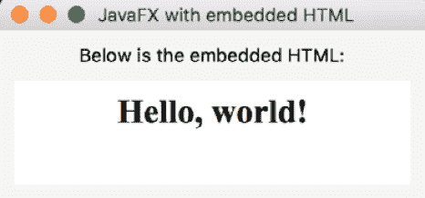

对于更复杂的 HTML 页面，可以使用`load()`方法直接从文件中加载。为了演示这种方法，让我们在`resources`文件夹中创建一个`form.html`文件，内容如下：

```java
<!DOCTYPE html>
```

```java
<html lang="en">
```

```java
<head>
```

```java
    <meta charset="UTF-8">
```

```java
    <title>The Form</title>
```

```java
</head>
```

```java
<body>
```

```java
<form action="http://someServer:port/formHandler" method="post">
```

```java
  <table>
```

```java
    <tr>
```

```java
      <td><label for="firstName">First name:</label></td>
```

```java
      <td><input type="text" id="firstName" name="firstName">
```

```java
      </td>
```

```java
    </tr>
```

```java
    <tr>
```

```java
      <td><label for="lastName">Last name:</label></td>
```

```java
      <td><input type="text" id="lastName" name="lastName">
```

```java
      </td>
```

```java
    </tr>
```

```java
    <tr>
```

```java
      <td><label for="age">Age:</label></td>
```

```java
      <td><input type="text" id="age" name="age"></td>
```

```java
    </tr>
```

```java
    <tr>
```

```java
      <td></td>
```

```java
      <td align="center">
```

```java
          <button id="submit" name="submit">Submit</button>
```

```java
      </td>
```

```java
    </tr>
```

```java
  </table>
```

```java
</form>
```

```java
</body>
```

```java
</html>
```

这个 HTML 展示了一个与我们在*使用 FXML*部分创建的表单类似的表单。在`\formHandler` URI（见`<form>` HTML 标签）之后。要在 JavaFX 应用程序中展示这个表单，可以使用以下代码：

```java
ClassLoader classLoader =
```

```java
              Thread.currentThread().getContextClassLoader();
```

```java
String file = classLoader.getResource("form.html").getFile();
```

```java
Text txt = new Text("Fill the form and click Submit");
```

```java
WebView wv = new WebView();
```

```java
WebEngine we = wv.getEngine();
```

```java
File f = new File(file);
```

```java
we.load(f.toURI().toString());
```

```java
VBox vb = new VBox(txt, wv);
```

```java
vb.setSpacing(10);
```

```java
vb.setAlignment(Pos.CENTER);
```

```java
vb.setPadding(new Insets(10, 10, 10, 10));
```

```java
Scene scene = new Scene(vb, 300, 200);
```

```java
primaryStage.setScene(scene);
```

```java
primaryStage.setTitle("JavaFX with embedded HTML");
```

```java
primaryStage.onCloseRequestProperty()
```

```java
     .setValue(e -> System.out.println("Bye! See you later!"));
```

```java
primaryStage.show();
```

如你所见，与我们其他示例的不同之处在于，我们现在使用`File`类及其`toURI()`方法直接访问`src/main/resources/form.html`文件中的 HTML，而不必先将内容转换为字符串。如果你运行`HtmlWebView`类的`start3()`方法（已重命名为`start()`），结果如下所示：

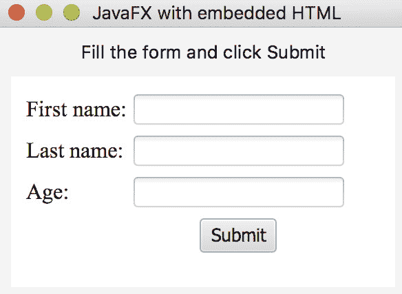

当你需要从你的 JavaFX 应用程序发送请求或提交数据时，这个解决方案很有用。但是，当你想要用户填写的表单已经在服务器上可用时，你只需从 URL 加载它。

例如，让我们在 JavaFX 应用程序中集成一个 Google 搜索。我们可以通过更改`load()`方法的参数值为我们想要加载的页面 URL（`HtmlWebView`类的`start4()`方法）来实现：

```java
Text txt = new Text("Enjoy searching the Web!");
```

```java
WebView wv = new WebView();
```

```java
WebEngine we = wv.getEngine();
```

```java
we.load("http://www.google.com");
```

```java
VBox vb = new VBox(txt, wv);
```

```java
vb.setSpacing(20);
```

```java
vb.setAlignment(Pos.CENTER);
```

```java
vb.setStyle("-fx-font-size: 20px;-fx-background-color: lightblue;");
```

```java
vb.setPadding(new Insets(10, 10, 10, 10));
```

```java
Scene scene = new Scene(vb,750,500);
```

```java
primaryStage.setScene(scene);
```

```java
primaryStage.setTitle(
```

```java
                   "JavaFX with the window to another server");
```

```java
primaryStage.onCloseRequestProperty()
```

```java
     .setValue(e -> System.out.println("Bye! See you later!"));
```

```java
primaryStage.show();
```

我们还向布局添加了样式，以增加字体并给背景添加颜色，这样我们就可以看到渲染的 HTML 嵌入区域的轮廓。当我们运行这个示例时（别忘了将`start4()`方法重命名为`start()`），以下窗口将出现：


在这个窗口中，你可以执行所有通常通过浏览器访问的搜索操作。

此外，正如我们之前提到的，你可以放大渲染的页面。例如，如果我们向前面的示例中添加`wv.setZoom(1.5)`行，结果将如下所示：


同样，我们可以设置字体和甚至样式的缩放比例，从文件中设置：

```java
wv.setFontScale(1.5);
```

```java
we.setUserStyleSheetLocation("mystyle.css");
```

注意，尽管我们在`WebView`对象上设置了字体缩放比例，但我们是在`WebEngine`对象上设置了样式。

我们还可以使用`WebEngine`类的方法`getDocument()`访问（并操作）加载页面的 DOM 对象：

```java
Document document = we.getDocument();
```

我们还可以访问浏览历史记录，获取当前索引，并前后移动历史记录：

```java
WebHistory history = we.getHistory();  
```

```java
int currInd = history.getCurrentIndex(); 
```

```java
history.go(-1);
```

```java
history.go( 1);
```

对于历史记录中的每个条目，我们可以提取其 URL、标题或最后访问日期：

```java
WebHistory history = we.getHistory();
```

```java
ObservableList<WebHistory.Entry> entries = 
```

```java
                                          history.getEntries();
```

```java
for(WebHistory.Entry entry: entries){
```

```java
    String url = entry.getUrl();
```

```java
    String title = entry.getTitle();
```

```java
    Date date = entry.getLastVisitedDate();
```

```java
}
```

阅读关于 `WebView` 和 `WebEngine` 类的文档，以获取更多关于如何利用它们功能性的想法。

# 播放媒体

在 JavaFX 应用程序的场景中添加图像不需要 `com.sun.*` 包，因此 *嵌入 HTML* 部分中列出的 `--add-export` 虚拟机选项不是必需的。但是，即使如此也没有坏处，所以如果你已经添加了这些选项，请保留 `--add-export` 选项。

可以使用 `javafx.scene.image.Image` 和 `javafx.scene.image.ImageView` 类将图像包含在场景中。为了演示如何做到这一点，我们将使用位于 `resources` 文件夹中的 Packt 标志，`packt.png`。以下是实现此功能的代码（`HelloWorld` 类的 `start6()` 方法）：

```java
ClassLoader classLoader =
```

```java
             Thread.currentThread().getContextClassLoader();
```

```java
String file = classLoader.getResource("packt.png").getFile();
```

```java
Text txt = new Text("What a beautiful image!");
```

```java
FileInputStream input = new FileInputStream(file);
```

```java
Image image = new Image(input);
```

```java
ImageView iv = new ImageView(image);
```

```java
VBox vb = new VBox(txt, iv);
```

```java
vb.setSpacing(20);
```

```java
vb.setAlignment(Pos.CENTER);
```

```java
vb.setPadding(new Insets(10, 10, 10, 10));
```

```java
Scene scene = new Scene(vb, 300, 200);
```

```java
primaryStage.setScene(scene);
```

```java
primaryStage.setTitle("JavaFX with embedded HTML");
```

```java
primaryStage.onCloseRequestProperty()
```

```java
     .setValue(e -> System.out.println("Bye! See you later!"));
```

```java
primaryStage.show();
```

如果我们运行前面的代码，结果将如下所示：

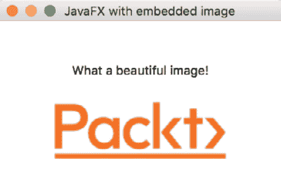

当前支持的图像格式有 BMP、GIF、JPEG 和 PNG。通过查看 `Image` 和 `ImageView` 类的 API ([`openjfx.io/javadoc/11/javafx.graphics/javafx/scene/image/package-summary.html`](https://openjfx.io/javadoc/11/javafx.graphics/javafx/scene/image/package-summary.html)) 来了解图像可以以多种方式格式化和调整。

现在，让我们看看如何在 JavaFX 应用程序中使用其他媒体文件。播放音频或电影文件需要 *嵌入 HTML* 部分中列出的 `--add-export` 虚拟机选项。

当前支持的编码如下：

+   `AAC`: **高级音频编码** 音频压缩

+   `H.264/AVC`: H.264/MPEG-4 Part 10 / **AVC** (**高级视频编码**) 视频压缩

+   `MP3`: 原始的 MPEG-1, 2, 和 2.5 音频；层 I, II, 和 III

+   `PCM`: 未压缩的原始音频样本

你可以在 API 文档中看到对支持的协议、媒体容器和元数据标签的更详细描述 ([`openjfx.io/javadoc/11/javafx.media/javafx/scene/media/package-summary.html`](https://openjfx.io/javadoc/11/javafx.media/javafx/scene/media/package-summary.html))。

以下三个类允许构建一个可以添加到场景中的媒体播放器：

```java
javafx.scene.media.Media;
```

```java
javafx.scene.media.MediaPlayer;
```

```java
javafx.scene.media.MediaView;
```

`Media` 类表示媒体的来源。`MediaPlayer` 类提供了控制媒体播放的所有方法：`play()`、`stop()`、`pause()`、`setVolume()` 以及类似的方法。你还可以指定媒体应该播放的次数。`MediaView` 类扩展了 `Node` 类，可以添加到场景中。它提供了媒体播放器播放的媒体视图，并负责媒体的外观。

为了演示，让我们运行 `HtmlWebView` 类的 `start5()` 方法，它播放位于 `resources` 文件夹中的 `jb.mp3` 文件：

```java
Text txt1 = new Text("What a beautiful music!");
```

```java
Text txt2 = 
```

```java
   new Text("If you don't hear music, turn up the volume.");
```

```java
ClassLoader classLoader =
```

```java
             Thread.currentThread().getContextClassLoader();
```

```java
String file = classLoader.getResource("jb.mp3").getFile();
```

```java
File f = new File(file);
```

```java
Media m = new Media(f.toURI().toString());
```

```java
MediaPlayer mp = new MediaPlayer(m);
```

```java
MediaView mv = new MediaView(mp);
```

```java
VBox vb = new VBox(txt1, txt2, mv);
```

```java
vb.setSpacing(20);
```

```java
vb.setAlignment(Pos.CENTER);
```

```java
vb.setPadding(new Insets(10, 10, 10, 10));
```

```java
Scene scene = new Scene(vb, 350, 100);
```

```java
primaryStage.setScene(scene);
```

```java
primaryStage.setTitle("JavaFX with embedded media player");
```

```java
primaryStage.onCloseRequestProperty()
```

```java
     .setValue(e -> System.out.println("Bye! See you later!"));
```

```java
primaryStage.show();
```

```java
mp.play();
```

注意一个 `Media` 对象是如何基于源文件构建的。`MediaPlayer` 对象是基于 `Media` 对象构建的，然后设置为 `MediaView` 类构造函数的属性。`MediaView` 对象与两个 `Text` 对象一起设置在场景上。我们使用 `VBox` 对象来提供布局。最后，在场景设置在舞台并舞台变得可见（在 `show()` 方法完成后）之后，对 `MediaPlayer` 对象调用 `play()` 方法。默认情况下，媒体只播放一次。

如果我们执行此代码，以下窗口将出现，并播放 `jb.m3` 文件：

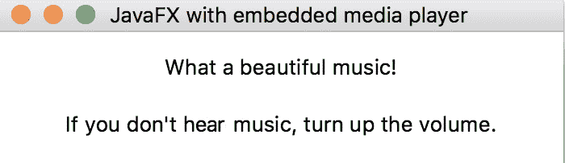

我们可以添加停止、暂停和调整音量的控件，但这将需要更多的代码，并且会超出本书的范围。您可以在 Oracle 在线文档中找到如何操作的指南（[`docs.oracle.com/javafx/2/media/jfxpub-media.htm`](https://docs.oracle.com/javafx/2/media/jfxpub-media.htm)）。

一个 `sea.mp4` 视频文件可以类似地播放（`HtmlWebView` 类的 `start6()` 方法）：

```java
Text txt = new Text("What a beautiful movie!");
```

```java
ClassLoader classLoader =
```

```java
             Thread.currentThread().getContextClassLoader();
```

```java
String file = classLoader.getResource("sea.mp4").getFile(); 
```

```java
File f = new File(file);
```

```java
Media m = new Media(f.toURI().toString());
```

```java
MediaPlayer mp = new MediaPlayer(m);
```

```java
MediaView mv = new MediaView(mp);
```

```java
VBox vb = new VBox(txt, mv);
```

```java
vb.setSpacing(20);
```

```java
vb.setAlignment(Pos.CENTER);
```

```java
vb.setPadding(new Insets(10, 10, 10, 10));
```

```java
Scene scene = new Scene(vb, 650, 400);
```

```java
primaryStage.setScene(scene);
```

```java
primaryStage.setTitle("JavaFX with embedded media player");
```

```java
primaryStage.onCloseRequestProperty()
```

```java
     .setValue(e -> System.out.println("Bye! See you later!"));
```

```java
primaryStage.show();
```

```java
mp.play();
```

唯一的区别是需要不同大小的场景来显示这个特定剪辑的全帧。我们在经过几次试错调整后找到了必要的大小。或者，我们可以使用 `MediaView` 方法（`autosize()`, `preserveRatioProperty()`, `setFitHeight()`, `setFitWidth()`, `fitWidthProperty()`, `fitHeightProperty()` 和类似方法）来调整嵌入窗口的大小，并自动匹配场景的大小。如果我们执行前面的示例，以下窗口将弹出并播放剪辑：

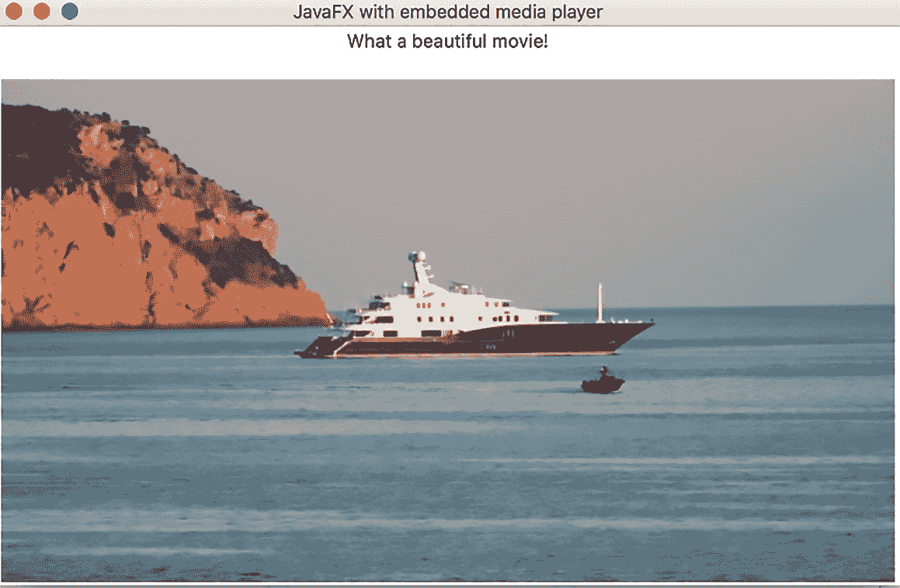

我们甚至可以将播放音频和视频文件并行进行，从而提供带有音轨的电影（`HtmlWebView` 类的 `start7()` 方法）：

```java
Text txt1 = new Text("What a beautiful movie and sound!");
```

```java
Text txt2 = new Text("If you don't hear music, turn up the volume.");
```

```java
ClassLoader classLoader =
```

```java
             Thread.currentThread().getContextClassLoader();
```

```java
String file = classLoader.getResource("jb.mp3").getFile(); 
```

```java
File fs = new File(file);
```

```java
Media ms = new Media(fs.toURI().toString());
```

```java
MediaPlayer mps = new MediaPlayer(ms);
```

```java
MediaView mvs = new MediaView(mps);
```

```java
File fv = 
```

```java
     new File(classLoader.getResource("sea.mp4").getFile());
```

```java
Media mv = new Media(fv.toURI().toString());
```

```java
MediaPlayer mpv = new MediaPlayer(mv);
```

```java
MediaView mvv = new MediaView(mpv);
```

```java
VBox vb = new VBox(txt1, txt2, mvs, mvv);
```

```java
vb.setSpacing(20);
```

```java
vb.setAlignment(Pos.CENTER);
```

```java
vb.setPadding(new Insets(10, 10, 10, 10));
```

```java
Scene scene = new Scene(vb, 650, 500);
```

```java
primaryStage.setScene(scene);
```

```java
primaryStage.setTitle("JavaFX with embedded media player");
```

```java
primaryStage.onCloseRequestProperty()
```

```java
     .setValue(e -> System.out.println("Bye! See you later!"));
```

```java
primaryStage.show();
```

```java
mpv.play();
```

```java
mps.play();
```

这是因为每个播放器都由其自己的线程执行。

关于 `javafx.scene.media` 包的更多信息，请阅读在线的 API 和开发者指南，以下提供了链接：

+   [JavaFX 2 媒体包 API](https://openjfx.io/javadoc/11/javafx.media/javafx/scene/media/package-summary.html)

+   [JavaFX 2 媒体包使用教程](https://docs.oracle.com/javafx/2/media/jfxpub-media.htm)

# 添加效果

`javafx.scene.effects` 包包含许多类，允许向节点添加各种效果：

+   `Blend`: 使用预定义的 `BlendModes` 之一将两个来源（通常是图像）的像素合并

+   `Bloom`: 使输入图像更亮，使其看起来像在发光

+   `BoxBlur`: 为图像添加模糊效果

+   `ColorAdjust`: 允许调整图像的色调、饱和度、亮度和对比度

+   `ColorInput`: 渲染一个填充给定油漆的矩形区域

+   `位移图`：将每个像素移动指定的距离

+   `阴影`：在给定内容后面渲染阴影

+   `高斯模糊`：使用特定的（高斯）方法添加模糊

+   `发光`：使输入图像看起来像在发光

+   `内部阴影`：在框架内部创建阴影

+   `照明`：模拟光源照射在内容上，使平面物体看起来更真实

+   `运动模糊`：模拟运动中的给定内容

+   `透视变换`：以透视方式变换内容

+   `反射`：在实际输入内容下方渲染输入的反射版本

+   `棕褐色调`：产生棕褐色调效果，类似于古董照片的外观

+   `阴影`：创建具有模糊边缘的单色内容副本

所有效果都有一个父类，即`Effect`抽象类。`Node`类有`setEffect(Effect e)`方法，这意味着任何效果都可以添加到任何节点上。这是将效果应用于节点的主要方式——在舞台上产生场景的演员（如果我们回忆起本章开头引入的类比）。

唯一的例外是`混合`效果，这使得其使用比其他效果更复杂。除了使用`setEffect(Effect e)`方法外，`Node`类的一些子类也具有`setBlendMode(BlendMode bm)`方法，这允许调节图像重叠时如何相互混合。因此，可以以不同的方式设置不同的混合效果，这些效果可以相互覆盖并产生难以调试的意外结果。这就是`混合`效果使用更复杂的原因，这就是为什么我们将从如何使用`混合`效果开始概述。

三个方面调节两个图像重叠区域的外观（我们在示例中使用两个图像以使其更简单，但在实践中，许多图像可以重叠）：

+   **不透明度属性的价值**：这定义了可以通过图像看到多少内容；不透明度值 0.0 表示图像完全透明，而不透明度值 1.0 表示其后面没有任何内容可见。

+   **每个颜色的 alpha 值和强度**：这定义了颜色的透明度，作为 0.0-1.0 或 0-255 范围内的双值。

+   **混合模式，由 BlendMode 枚举值定义**：根据模式、每个颜色的不透明度和 alpha 值，结果也可能取决于图像被添加到场景中的顺序；首先添加的图像称为底部输入，而重叠图像中的第二个称为顶部输入。如果顶部输入完全不透明，则底部输入被顶部输入隐藏。

重叠区域的结果外观是根据不透明度、颜色的 alpha 值、颜色的数值（强度）和混合模式计算的，混合模式可以是以下之一：

+   `ADD`: 顶部输入的颜色和 alpha 分量加到底部输入的相应分量上。

+   `BLUE`: 底部输入的蓝分量被顶部输入的蓝分量替换；其他颜色分量不受影响。

+   `COLOR_BURN`: 底部输入颜色分量的倒数除以顶部输入颜色分量，所有这些取反后以产生结果颜色。

+   `COLOR_DODGE`: 底部输入的颜色分量除以顶部输入颜色分量的倒数以产生结果颜色。

+   `DARKEN`: 从两个输入的颜色分量中选择较暗的分量以产生结果颜色。

+   `DIFFERENCE`: 两个输入的颜色分量中较暗的分量从较亮的分量中减去以产生结果颜色。

+   `EXCLUSION`: 两个输入的颜色分量相乘并加倍，然后从底部输入颜色分量的总和减去，以产生结果颜色。

+   `GREEN`: 底部输入的绿分量被顶部输入的绿分量替换；其他颜色分量不受影响。

+   `HARD_LIGHT`: 输入颜色分量根据顶部输入颜色是相乘还是相屏。

+   `LIGHTEN`: 从两个输入中选择颜色分量中较亮的分量以产生结果颜色。

+   `MULTIPLY`: 第一个输入的颜色分量与第二个输入的颜色分量相乘。

+   `OVERLAY`: 输入颜色分量根据底部输入颜色是相乘还是相屏。

+   `RED`: 底部输入的红分量被顶部输入的红分量替换；其他颜色分量不受影响。

+   `SCREEN`: 两个输入的颜色分量都取反，然后相互乘积，最后再次取反以产生结果颜色。

+   `SOFT_LIGHT`: 输入颜色分量根据顶部输入颜色是变暗还是变亮。

+   `SRC_ATOP`: 顶部输入中位于底部输入内部的部分与底部输入混合。

+   `SRC_OVER`: 顶部输入覆盖在底部输入上。

为了演示`Blend`效果，让我们创建另一个应用程序，称为`BlendEffect`。它不需要`com.sun.*`包，因此不需要`--add-export`虚拟机选项。只需设置*JavaFX 基础知识*部分中描述的`--module-path`和`--add-modules`选项即可用于编译和执行。

本书范围不允许我们展示所有可能的组合，因此我们将创建一个红色圆圈和一个蓝色正方形（见`BlendEffect`类）：

```java
Circle createCircle(){
```

```java
    Circle c = new Circle();
```

```java
    c.setFill(Color.rgb(255, 0, 0, 0.5));
```

```java
    c.setRadius(25);
```

```java
    return c;
```

```java
}
```

```java
Rectangle createSquare(){
```

```java
    Rectangle r = new Rectangle();
```

```java
    r.setFill(Color.rgb(0, 0, 255, 1.0));
```

```java
    r.setWidth(50);
```

```java
    r.setHeight(50);
```

```java
    return r;
```

```java
}
```

我们使用了 `Color.rgb(int red, int green, int blue, double alpha)` 方法来定义每个图形的颜色，但还有许多其他方法可以做到这一点。请阅读 `Color` 类的 API 文档以获取更多详细信息 ([`openjfx.io/javadoc/11/javafx.graphics/javafx/scene/paint/Color.html`](https://openjfx.io/javadoc/11/javafx.graphics/javafx/scene/paint/Color.html))。

为了重叠创建的圆和正方形，我们将使用 `Group` 节点：

```java
Node c = createCircle();
```

```java
Node s = createSquare();
```

```java
Node g = new Group(s, c);
```

在前面的代码中，正方形是底层输入。我们还将创建一个组，其中正方形是顶层输入：

```java
Node c = createCircle();
```

```java
Node s = createSquare();
```

```java
Node g = new Group(c, s);
```

这种区别很重要，因为我们定义圆为半不透明，而正方形是完全不透明的。我们将在所有示例中都使用相同的设置。

让我们比较两种模式，`MULTIPLY` 和 `SRC_OVER`。我们将使用 `setEffect()` 方法在组上设置它们，如下所示：

```java
Blend blnd = new Blend();
```

```java
blnd.setMode(BlendMode.MULTIPLY);
```

```java
Node c = createCircle();
```

```java
Node s = createSquare();
```

```java
Node g = new Group(s, c);
```

```java
g.setEffect(blnd);
```

在被调用的 `BlendEffect` 类的 `start()` 方法中，对于每种模式，我们创建两个组，一个是在圆在正方形顶部时的输入，另一个是在正方形在圆顶部时的输入，我们将四个创建的组放入 `GridPane` 布局中（详细信息请参阅源代码）。如果我们运行 `BlendEffect` 应用程序，结果将如下所示：

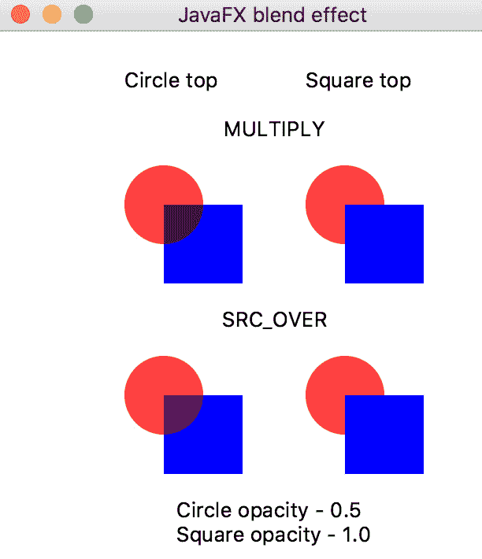

如预期的那样，当正方形在顶部（右侧的两个图像）时，重叠区域完全由不透明的正方形占据。但是，当圆是顶层输入（左侧的两个图像）时，重叠区域部分可见，并且基于混合效果进行计算。

然而，如果我们直接在组上设置相同的模式，结果会有所不同。让我们运行相同的代码，但将模式设置为组：

```java
Node c = createCircle();
```

```java
Node s = createSquare();
```

```java
Node g = new Group(c, s);
```

```java
g.setBlendMode(BlendMode.MULTIPLY);
```

在 `start()` 方法中定位以下代码：

```java
      Node[] node = setEffectOnGroup(bm1, bm2);
```

```java
      //Node[] node = setModeOnGroup(bm1, bm2);
```

然后将其更改为以下内容：

```java
      //Node[] node = setEffectOnGroup(bm1, bm2);
```

```java
      Node[] node = setModeOnGroup(bm1, bm2);
```

如果我们再次运行 `BlendEffect` 类，结果将如下所示：

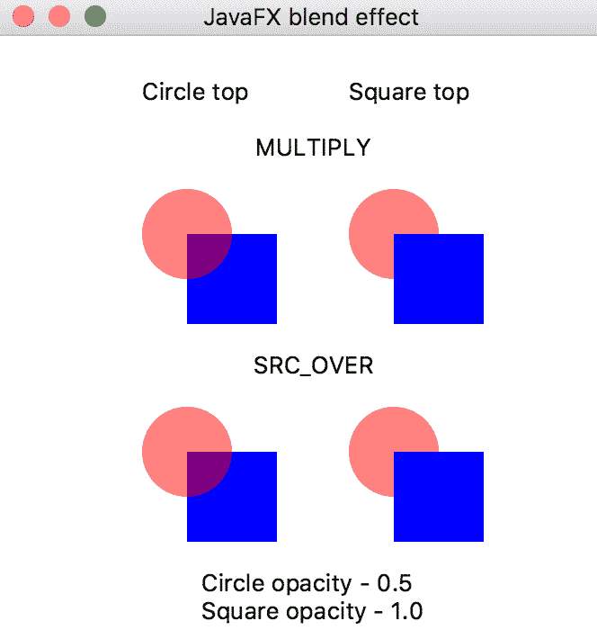

如您所见，圆的红色略有变化，`MULTIPLY` 和 `SRC_OVER` 模式之间没有区别。这正是我们在本节开头提到的添加节点到场景顺序的问题。

结果也会根据效果设置在哪个节点上而改变。例如，不是在组上设置效果，而是只设置在圆上：

```java
Blend blnd = new Blend();
```

```java
blnd.setMode(BlendMode.MULTIPLY);
```

```java
Node c = createCircle();
```

```java
Node s = createSquare();
```

```java
c.setEffect(blnd);
```

```java
Node g = new Group(s, c);
```

在 `start()` 方法中定位以下代码：

```java
      Node[] node = setModeOnGroup(bm1, bm2);
```

```java
      //Node[] node = setEffectOnCircle(bm1, bm2);
```

然后将其更改为以下内容：

```java
      //Node[] node = setModeOnGroup(bm1, bm2);
```

```java
      Node[] node = setEffectOnCircle(bm1, bm2);
```

我们运行应用程序并看到以下内容：

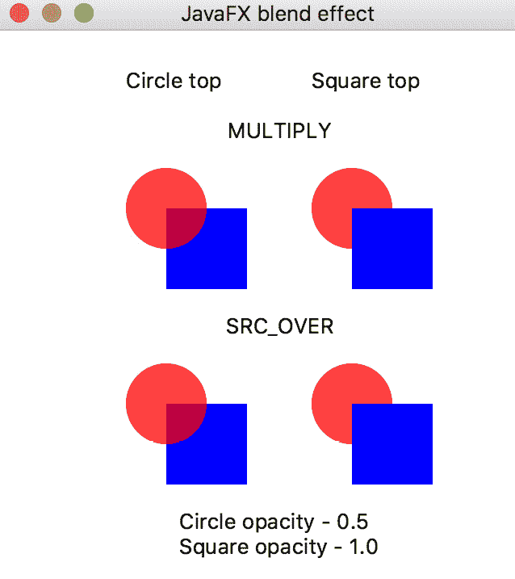

右侧的两个图像与所有之前的示例相同，但左侧的两个图像显示了重叠区域的新颜色。现在，让我们将相同的效果应用于正方形而不是圆，如下所示：

```java
Blend blnd = new Blend();
```

```java
blnd.setMode(BlendMode.MULTIPLY);
```

```java
Node c = createCircle();
```

```java
Node s = createSquare();
```

```java
s.setEffect(blnd);
```

```java
Node g = new Group(s, c);
```

在 `start()` 方法中定位以下代码：

```java
      Node[] node = setEffectOnCircle(bm1, bm2);
```

```java
      //Node[] node = setEffectOnSquare(bm1, bm2);
```

然后将其更改为以下内容：

```java
      //Node[] node = setEffectOnCircle(bm1, bm2);
```

```java
      Node[] node = setEffectOnSquare(bm1, bm2); 
```

结果还会略有变化，如下面的截图所示：

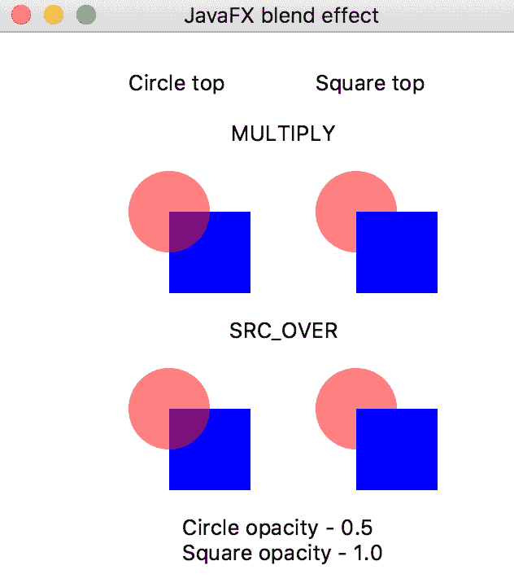

`MULTIPLY`和`SRC_OVER`模式之间没有区别，但红色与我们在圆形上设置效果时的颜色不同。

我们可以再次改变方法，直接在圆形上设置混合模式，如下所示：

```java
Node c = createCircle();
```

```java
Node s = createSquare();
```

```java
c.setBlendMode(BlendMode.MULTIPLY);
```

在`start()`方法中定位以下代码：

```java
      Node[] node = setEffectOnSquare(bm1, bm2);
```

```java
      //Node[] node = setModeOnCircle(bm1, bm2);
```

然后将其更改为以下内容：

```java
      //Node[] node = setEffectOnSquare(bm1, bm2);
```

```java
      Node[] node = setModeOnCircle(bm1, bm2);
```

结果再次改变：

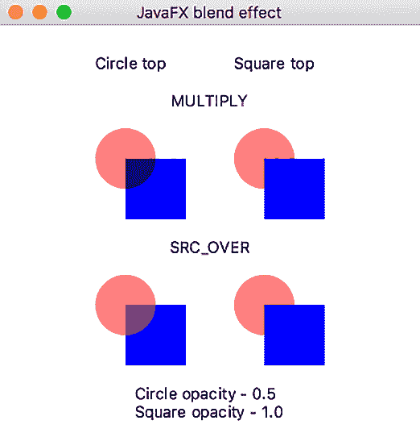

仅在正方形上设置混合模式再次消除了`MULTIPLY`和`SRC_OVER`模式之间的差异。

在`start()`方法中定位以下代码：

```java
      Node[] node = setModeOnCircle(bm1, bm2);
```

```java
      //Node[] node = setModeOnSquare(bm1, bm2);
```

然后将其更改为以下内容：

```java
      //Node[] node = setModeOnCircle(bm1, bm2);
```

```java
      Node[] node = setModeOnSquare(bm1, bm2);
```

结果如下：

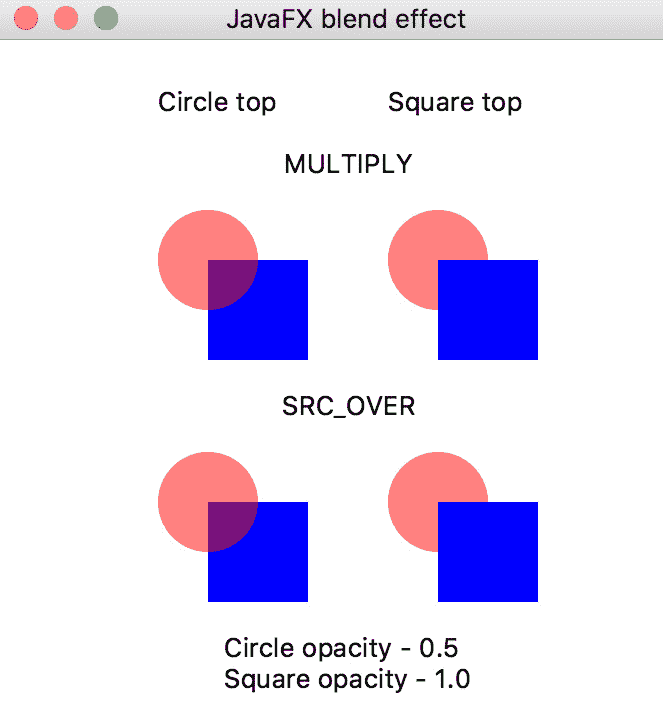

为了避免混淆并使混合结果更可预测，您必须注意节点添加到场景中的顺序以及混合效果应用的一致性。

在本书提供的源代码中，您将找到包含在`javafx.scene.effects`包中的所有效果的示例。它们都是通过并排比较来演示的。以下是一个示例：

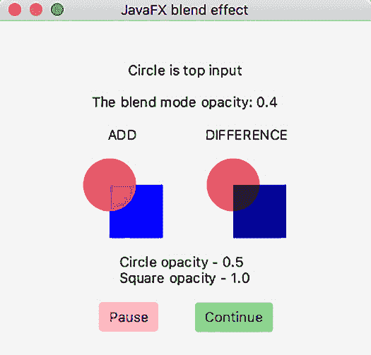

为了您的方便，提供了**暂停**和**继续**按钮，允许您暂停演示并查看设置在混合效果上的不同透明度值的结果。

为了演示所有其他效果，我们创建了另一个名为`OtherEffects`的应用程序，它也不需要`com.sun.*`包，因此不需要`--add-export`虚拟机选项。演示的效果包括`Bloom`、`BoxBlur`、`ColorAdjust`、`DisplacementMap`、`DropShadow`、`Glow`、`InnerShadow`、`Lighting`、`MotionBlur`、`PerspectiveTransform`、`Reflection`、`ShadowTone`和`SepiaTone`。我们使用了两张图片来展示应用每个效果的结果（Packt 标志和山湖景观）：

```java
ClassLoader classLoader = 
```

```java
              Thread.currentThread().getContextClassLoader(); 
```

```java
String file = classLoader.getResource("packt.png").getFile(); FileInputStream inputP = new FileInputStream(file);
```

```java
Image imageP = new Image(inputP);
```

```java
ImageView ivP = new ImageView(imageP);
```

```java
String file2 = classLoader.getResource("mount.jpeg").getFile(); FileInputStream inputM = new FileInputStream(file2);
```

```java
Image imageM = new Image(inputM);
```

```java
ImageView ivM = new ImageView(imageM);
```

```java
ivM.setPreserveRatio(true);
```

```java
ivM.setFitWidth(300);
```

我们还添加了两个按钮，允许您暂停和继续演示（它遍历效果及其参数值）：

```java
Button btnP = new Button("Pause");
```

```java
btnP.setOnAction(e1 -> et.pause());
```

```java
btnP.setStyle("-fx-background-color: lightpink;");
```

```java
Button btnC = new Button("Continue");
```

```java
btnC.setOnAction(e2 -> et.cont());
```

```java
btnC.setStyle("-fx-background-color: lightgreen;");
```

`et`对象是`EffectsThread`线程的对象：

```java
EffectsThread et = new EffectsThread(txt, ivM, ivP);
```

线程遍历效果列表，创建相应的效果 10 次（使用 10 个不同的效果参数值），然后，每次都将创建的`Effect`对象设置在每个图像上，然后暂停 1 秒钟，以便您有机会查看结果：

```java
public void run(){
```

```java
    try {
```

```java
        for(String effect: effects){
```

```java
            for(int i = 0; i < 11; i++){
```

```java
                double d = Math.round(i * 0.1 * 10.0) / 10.0;
```

```java
                Effect e = createEffect(effect, d, txt);
```

```java
                ivM.setEffect(e);
```

```java
                ivP.setEffect(e);
```

```java
                TimeUnit.SECONDS.sleep(1);
```

```java
                if(pause){
```

```java
                    while(true){
```

```java
                        TimeUnit.SECONDS.sleep(1);
```

```java
                        if(!pause){
```

```java
                            break;
```

```java
                        }
```

```java
                    }
```

```java
                }
```

```java
            }
```

```java
        }
```

```java
        Platform.exit();
```

```java
    } catch (Exception ex){
```

```java
        ex.printStackTrace();
```

```java
    }
```

```java
}
```

我们将在效果结果的截图下方展示每个效果是如何创建的。为了展示结果，我们使用了`GridPane`布局：

```java
GridPane grid = new GridPane();
```

```java
grid.setAlignment(Pos.CENTER);
```

```java
grid.setVgap(25);
```

```java
grid.setPadding(new Insets(10, 10, 10, 10));
```

```java
int i = 0;
```

```java
grid.add(txt,    0, i++, 2, 1);
```

```java
GridPane.setHalignment(txt, HPos.CENTER);
```

```java
grid.add(ivP,    0, i++, 2, 1);
```

```java
GridPane.setHalignment(ivP, HPos.CENTER);
```

```java
grid.add(ivM,    0, i++, 2, 1);
```

```java
GridPane.setHalignment(ivM, HPos.CENTER);
```

```java
grid.addRow(i++, new Text());
```

```java
HBox hb = new HBox(btnP, btnC);
```

```java
hb.setAlignment(Pos.CENTER);
```

```java
hb.setSpacing(25);
```

```java
grid.add(hb,    0, i++, 2, 1);
```

```java
GridPane.setHalignment(hb, HPos.CENTER);
```

最后，创建的`GridPane`对象被传递到场景中，然后场景被放置在我们早期示例中熟悉的舞台上：

```java
Scene scene = new Scene(grid, 450, 500);
```

```java
primaryStage.setScene(scene);
```

```java
primaryStage.setTitle("JavaFX effect demo");
```

```java
primaryStage.onCloseRequestProperty()
```

```java
    .setValue(e3 -> System.out.println("Bye! See you later!"));
```

```java
primaryStage.show();
```

以下截图展示了 13 个参数值各自的效果示例。在每个截图下方，我们展示了从`createEffect(String effect, double d, Text txt)`方法中创建此效果的代码片段：

+   参数值 1 的效果：

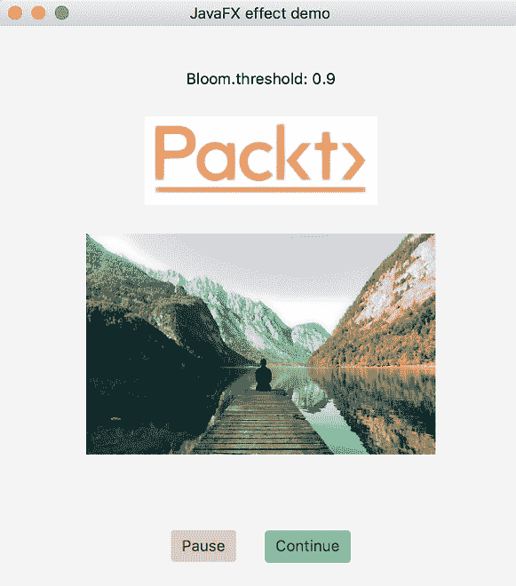

```java
//double d = 0.9;
```

```java
txt.setText(effect + ".threshold: " + d);
```

```java
Bloom b = new Bloom();
```

```java
b.setThreshold(d);
```

+   参数值 2 的效果：

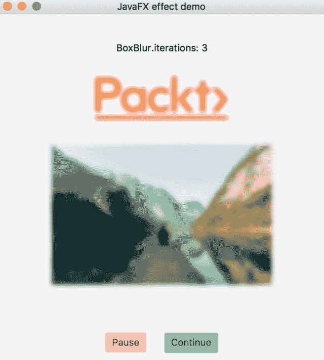

```java
// double d = 0.3;
```

```java
int i = (int) d * 10;
```

```java
int it = i / 3;
```

```java
txt.setText(effect + ".iterations: " + it);
```

```java
BoxBlur bb = new BoxBlur();
```

```java
bb.setIterations(i);
```

+   参数值 3 的影响：

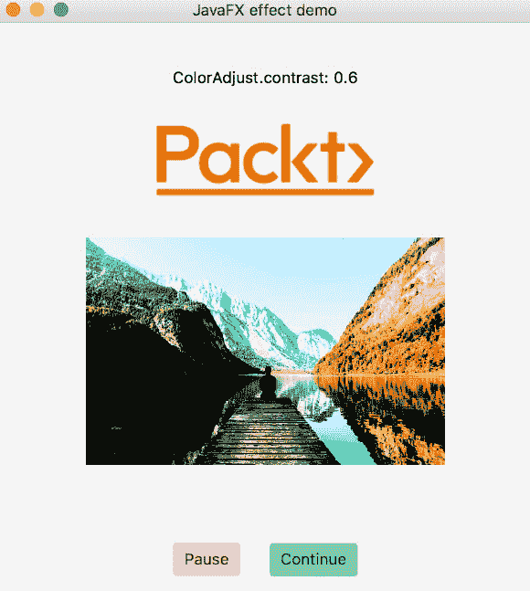

```java
double c = Math.round((-1.0 + d * 2) * 10.0) / 10.0;     // 0.6
```

```java
txt.setText(effect + ": " + c);
```

```java
ColorAdjust ca = new ColorAdjust();
```

```java
ca.setContrast(c);
```

+   参数值 4 的影响：

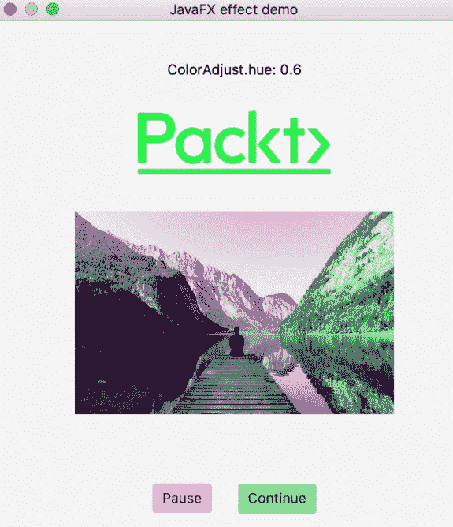

```java
double h = Math.round((-1.0 + d * 2) * 10.0) / 10.0;     // 0.6
```

```java
txt.setText(effect + ": " + h);
```

```java
ColorAdjust ca1 = new ColorAdjust();
```

```java
ca1.setHue(h);
```

+   参数值 5 的影响：

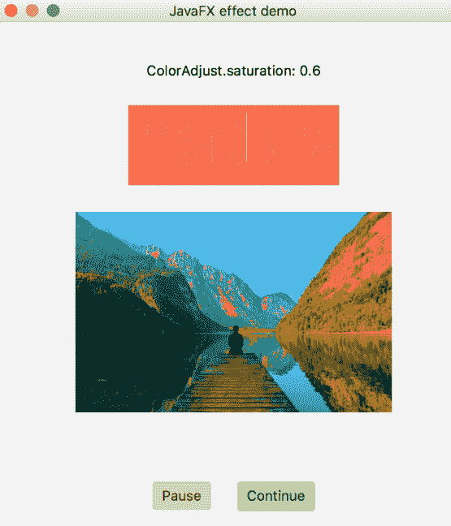

```java
double st = Math.round((-1.0 + d * 2) * 10.0) / 10.0;    // 0.6
```

```java
txt.setText(effect + ": " + st);
```

```java
ColorAdjust ca3 = new ColorAdjust();
```

```java
ca3.setSaturation(st);
```

+   参数值 6 的影响：

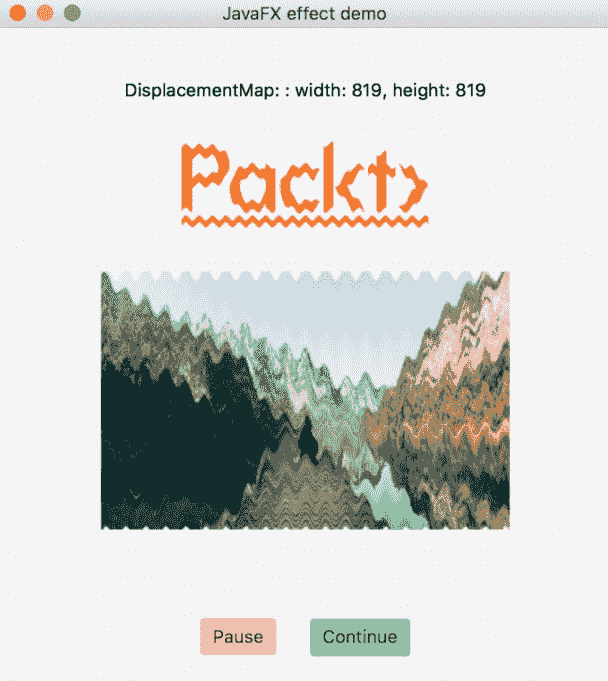

```java
int w = (int)Math.round(4096 * d);  //819
```

```java
int h1 = (int)Math.round(4096 * d); //819
```

```java
txt.setText(effect + ": " + ": width: " + w + ", height: " + 
```

```java
                                                           h1);
```

```java
DisplacementMap dm = new DisplacementMap();
```

```java
FloatMap floatMap = new FloatMap();
```

```java
floatMap.setWidth(w);
```

```java
floatMap.setHeight(h1);
```

```java
for (int k = 0; k < w; k++) {
```

```java
    double v = (Math.sin(k / 20.0 * Math.PI) - 0.5) / 40.0;
```

```java
    for (int j = 0; j < h1; j++) {
```

```java
        floatMap.setSamples(k, j, 0.0f, (float) v);
```

```java
    }
```

```java
}
```

```java
dm.setMapData(floatMap);
```

+   参数值 7 的影响：

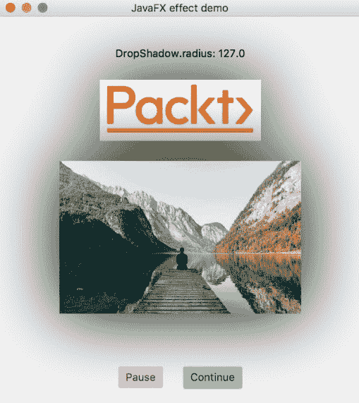

```java
double rd = Math.round((127.0 * d) * 10.0) / 10.0; // 127.0
```

```java
System.out.println(effect + ": " + rd);
```

```java
txt.setText(effect + ": " + rd);
```

```java
DropShadow sh = new DropShadow();
```

```java
sh.setRadius(rd);
```

+   参数值 8 的影响：

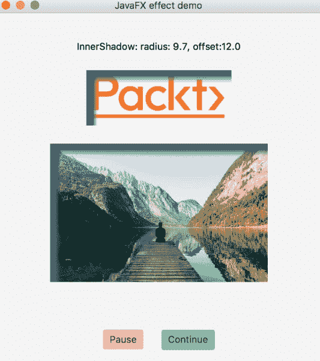

```java
double rad = Math.round(12.1 * d *10.0)/10.0;      // 9.7
```

```java
double off = Math.round(15.0 * d *10.0)/10.0;      // 12.0
```

```java
txt.setText("InnerShadow: radius: " + rad + ", offset:" + off);
```

```java
InnerShadow is = new InnerShadow();
```

```java
is.setColor(Color.web("0x3b596d"));
```

```java
is.setOffsetX(off);
```

```java
is.setOffsetY(off);
```

```java
is.setRadius(rad);
```

+   参数值 9 的影响：

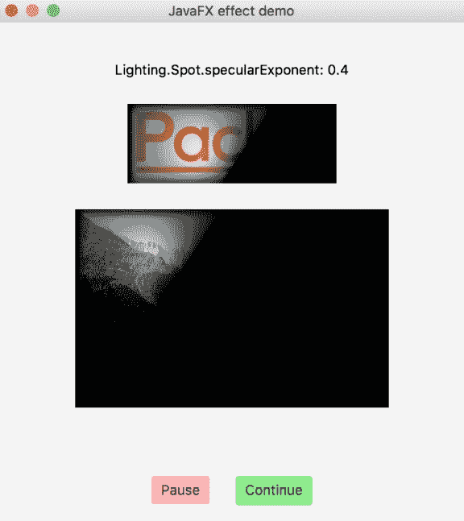

```java
double sS = Math.round((d * 4)*10.0)/10.0;      // 0.4
```

```java
txt.setText(effect + ": " + sS);
```

```java
Light.Spot lightSs = new Light.Spot();
```

```java
lightSs.setX(150);
```

```java
lightSs.setY(100);
```

```java
lightSs.setZ(80);
```

```java
lightSs.setPointsAtX(0);
```

```java
lightSs.setPointsAtY(0);
```

```java
lightSs.setPointsAtZ(-50);
```

```java
lightSs.setSpecularExponent(sS);
```

```java
Lighting lSs = new Lighting();
```

```java
lSs.setLight(lightSs);
```

```java
lSs.setSurfaceScale(5.0);
```

+   参数值 10 的影响：

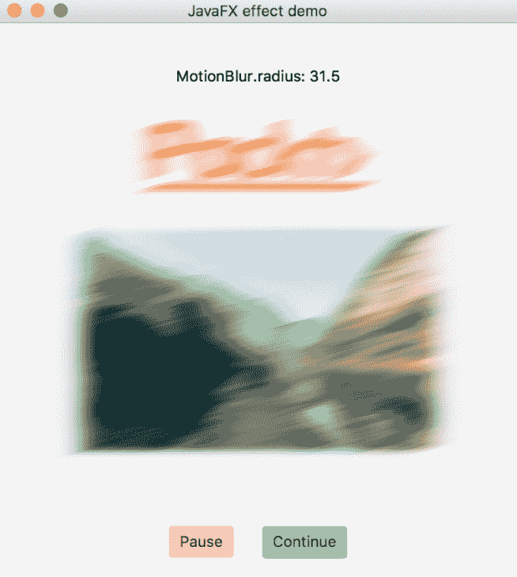

```java
double r = Math.round((63.0 * d)*10.0) / 10.0;      // 31.5
```

```java
txt.setText(effect + ": " + r);
```

```java
MotionBlur mb1 = new MotionBlur();
```

```java
mb1.setRadius(r);
```

```java
mb1.setAngle(-15);
```

+   参数值 11 的影响：

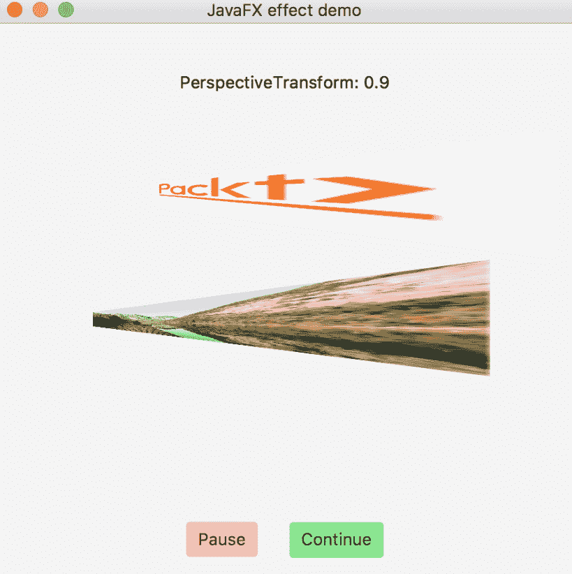

```java
// double d = 0.9;
```

```java
txt.setText(effect + ": " + d); 
```

```java
PerspectiveTransform pt =
```

```java
        new PerspectiveTransform(0., 1\. + 50.*d, 310., 50\. - 
```

```java
       50.*d, 310., 50\. + 50.*d + 1., 0., 100\. - 50\. * d + 2.);
```

+   参数值 12 的影响：

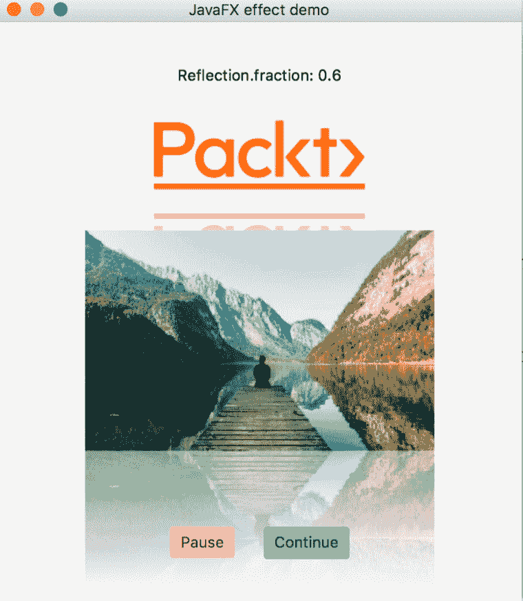

```java
// double d = 0.6;
```

```java
txt.setText(effect + ": " + d);
```

```java
Reflection ref = new Reflection();
```

```java
ref.setFraction(d);
```

+   参数值 13 的影响：

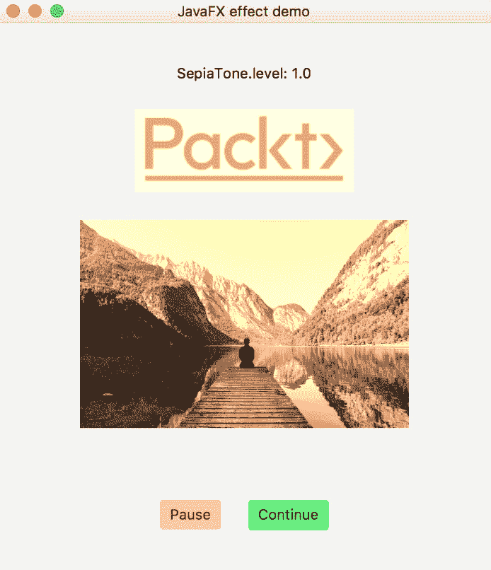

```java
// double d = 1.0;
```

```java
txt.setText(effect + ": " + d);
```

```java
SepiaTone sep = new SepiaTone();
```

```java
sep.setLevel(d);
```

本书提供了此演示的完整源代码，并在 GitHub 上可用。

# 摘要

在本章中，您介绍了 JavaFX 工具包，其主要功能和如何使用它来创建 GUI 应用程序。涵盖的主题包括 Java GUI 技术概述、JavaFX 控件元素、图表、使用 CSS、FXML、嵌入 HTML、播放媒体和添加特效。

现在，您可以使用 Java GUI 技术创建用户界面，以及创建和使用作为独立应用程序的用户界面项目。

下一章专门介绍函数式编程。它概述了 JDK 中的函数式接口，解释了 Lambda 表达式是什么，以及如何在 Lambda 表达式中使用函数式接口。它还解释并演示了如何使用方法引用。

# 测验

1.  JavaFX 中的顶级内容容器是什么？

1.  JavaFX 中所有场景参与者的基础类是什么？

1.  命名 JavaFX 应用程序的基本类。

1.  JavaFX 应用程序必须实现的一个方法是什么？

1.  `main` 方法必须调用哪个 `Application` 方法来执行 JavaFX 应用程序？

1.  执行 JavaFX 应用程序需要哪些两个 VM 选项？

1.  当使用右上角的 **x** 按钮关闭 JavaFX 应用程序窗口时，会调用哪个 `Application` 方法？

1.  嵌入 HTML 需要使用哪个类？

1.  列出必须用于播放媒体的三种类。

1.  为了播放媒体，需要添加哪个 VM 选项？

1.  列出五个 JavaFX 特效。
