# *第十五章*：反应式编程

在本章中，您将了解**反应式宣言**和反应式编程的世界。我们首先定义并讨论反应式编程的主要概念——异步、非阻塞和响应性。使用这些概念，我们接下来定义并讨论反应式编程、主要反应式框架，并更详细地讨论**RxJava**。

在本章中，我们将涵盖以下主题：

+   异步处理

+   非阻塞 API

+   反应式——响应性、弹性、可恢复性和消息驱动系统

+   反应式流

+   RxJava

到本章结束时，您将能够使用反应式编程编写异步处理的代码。

# 技术要求

要能够执行本章提供的代码示例，您需要以下条件：

+   配备操作系统的计算机：Microsoft Windows、Apple macOS 或 Linux

+   Java SE 版本 17 或更高

+   您喜欢的任何 IDE 或代码编辑器

本书*第一章*“Java 17 入门”中提供了如何设置 Java SE 和 IntelliJ IDEA 编辑器的说明。本章的文件和代码示例可以从 GitHub 仓库[`github.com/PacktPublishing/Learn-Java-17-Programming.git`](https://github.com/PacktPublishing/Learn-Java-17-Programming.git)获取。您可以在[examples/src/main/java/com/packt/learnjava/ch15_reactive](https://examples/src/main/java/com/packt/learnjava/ch15_reactive)文件夹中找到它们。

# 异步处理

**异步**意味着请求者立即获得响应，但结果尚未出现。相反，请求者等待结果发送给他们、保存到数据库中，或者例如以允许您检查结果是否准备好的对象形式呈现。如果后者是情况，请求者将定期调用该对象上的某个方法，当结果准备好时，使用该对象上的另一个方法检索它。异步处理的优势在于请求者可以在等待时做其他事情。

在*第八章*“多线程与并发处理”中，我们展示了如何创建一个子线程。然后，这个子线程发送一个非异步（阻塞）请求并等待其返回，什么都不做。同时，主线程继续执行并定期调用子线程对象以查看结果是否已准备好。这是异步处理实现中最基本的。实际上，我们在使用并行流时已经使用了它。

在幕后创建子线程的并行流操作将流拆分为段，将每个段分配给一个专用线程进行处理，然后将所有段的局部结果汇总为最终结果。在前一章中，我们甚至编写了执行汇总工作的函数。作为提醒，该函数被命名为**combiner**。

让我们通过一个示例比较顺序流和并行流的性能。

## 顺序流和并行流

为了演示顺序处理和并行处理之间的差异，让我们想象一个从 10 个物理设备（如传感器）收集数据并计算平均值的系统。以下是一个`get()`方法，它从由其 ID 标识的传感器收集测量值：

```java
double get(String id){
```

```java
    try{
```

```java
        TimeUnit.MILLISECONDS.sleep(100);
```

```java
    } catch(InterruptedException ex){
```

```java
        ex.printStackTrace();
```

```java
    }
```

```java
    return id * Math.random();
```

```java
}
```

我们包括了一个 100 毫秒的延迟来模拟从传感器收集测量值所需的时间。至于结果测量值，我们使用`Math.random()`方法。我们将使用`MeasuringSystem`类的对象调用这个`get()`方法，这是该方法所属的地方。

然后，我们将计算平均值以抵消单个设备中的误差和其他个性特征：

```java
void getAverage(Stream<Integer> ids) {
```

```java
    LocalTime start = LocalTime.now();
```

```java
    double a = ids.mapToDouble(id -> new MeasuringSystem()
```

```java
                  .get(id))
```

```java
                  .average()
```

```java
                  .orElse(0);
```

```java
    System.out.println((Math.round(a * 100.) / 100.) + " in " +
```

```java
       Duration.between(start, LocalTime.now()).toMillis() +  
```

```java
                                                         "ms");
```

```java
}
```

注意我们如何使用`mapToDouble()`操作将 ID 流转换为`DoubleStream`，以便我们可以应用`average()`操作。`average()`操作返回一个`Optional<Double>`对象，我们调用它的`orElse(0)`方法，该方法返回计算值或零（例如，如果测量系统无法连接到其任何传感器并返回一个空流）。

`getAverage()`方法的最后一行打印结果及其计算所需的时间。在实际代码中，我们会返回结果并用于其他计算。然而，出于演示目的，我们只打印它。

现在我们可以比较顺序流处理与并行处理的性能（请参阅`MeasuringSystem`类和`compareSequentialAndParallelProcessing()`方法）：

```java
List<Integer> ids = IntStream.range(1, 11)
```

```java
                             .mapToObj(i -> i)
```

```java
                             .collect(Collectors.toList());
```

```java
getAverage(ids.stream());          //prints: 2.99 in 1030 ms
```

```java
getAverage(ids.parallelStream());  //prints: 2.34 in  214 ms
```

如果您运行此示例，结果可能会有所不同，因为如您所记得的，我们模拟收集的测量值为随机值。

如您所见，并行流的处理速度比顺序流快五倍。结果不同，因为测量每次产生略微不同的结果。

虽然并行流在幕后使用异步处理，但这并不是程序员在谈论请求的异步处理时所考虑的内容。从应用程序的角度来看，它只是并行处理（也称为并发处理）。它比顺序处理更快，但主线程必须等待所有调用完成并且数据被检索。如果每个调用至少需要 100 毫秒（正如我们的情况），那么即使每个调用都由专用线程执行，所有调用的处理也无法在更短的时间内完成。

当然，我们可以创建一个服务，使用子线程来执行所有调用，而主线程做其他事情。稍后，主线程可以再次调用该服务并获取结果或从之前约定的位置获取。这正是程序员所讨论的异步处理。

但在编写这样的代码之前，让我们看看位于`java.util.concurrent`包中的`CompletableFuture`类。它做了所有描述的事情，还有更多。

## 使用`CompletableFuture`对象

使用`CompletableFuture`对象，我们可以将向测量系统发送请求与从`CompletableFuture`对象获取结果分开。这正是我们在解释异步处理时描述的场景。让我们在代码中演示它（参见`MeasuringSystem`类和`completableFuture()`方法）：

```java
List<CompletableFuture<Double>> list = ids.stream()
```

```java
     .map(id -> CompletableFuture.supplyAsync(() ->
```

```java
  new MeasuringSystem().get(id))).collect(Collectors.toList());
```

`supplyAsync()`方法不会等待调用测量系统的返回。相反，它立即创建一个`CompletableFuture`对象并返回它。这样，客户端可以在稍后任何时候使用此对象来检索测量系统返回的结果。以下代码获取`CompletableFuture`对象列表，遍历它，从每个对象中检索结果并计算平均值：

```java
LocalTime start = LocalTime.now();
```

```java
double a = list.stream()
```

```java
               .mapToDouble(cf -> cf.join().doubleValue())
```

```java
               .average()
```

```java
               .orElse(0);
```

```java
System.out.println((Math.round(a * 100.) / 100.) + " in " +
```

```java
  Duration.between(start, LocalTime.now()).toMillis() + " ms"); 
```

```java
                                         //prints: 2.92 in 6 ms
```

此外，一些方法允许你检查值是否被返回，但这不是本演示的重点，重点是展示如何使用`CompletableFuture`类来组织异步处理。

创建的`CompletableFuture`对象列表可以存储在任何地方，并且可以非常快速地处理（在我们的案例中，6 毫秒），前提是已经收到了测量值（所有`get()`方法都被调用并返回了值）。在创建`CompletableFuture`对象列表并在处理之前，系统不会被阻塞，可以执行其他操作。这正是异步处理的优势。

`CompletableFuture`类有许多方法，并支持几个其他类和接口。例如，可以添加一个固定大小的线程池来限制线程数量（参见`MeasuringSystem`类和`threadPool()`方法）：

```java
ExecutorService pool = Executors.newFixedThreadPool(3);
```

```java
List<CompletableFuture<Double>> list = ids.stream()
```

```java
        .map(id -> CompletableFuture.supplyAsync(() -> 
```

```java
                         new MeasuringSystem().get(id), pool))
```

```java
        .collect(Collectors.toList());
```

有各种这样的池，用于不同的目的和不同的性能。但使用池不会改变整体系统设计，所以我们省略了这个细节。

如你所见，异步处理的力量是巨大的。还有一个异步 API 的变体，称为**非阻塞 API**。我们将在下一节中讨论这个问题。

# 非阻塞 API

非阻塞 API 的客户端可以在不阻塞很长时间的情况下获取结果，从而允许客户端在结果准备期间做其他事情。因此，非阻塞 API 的概念意味着一个高度响应的应用程序。请求的处理（即获取结果）可以是同步的或异步的——对客户端来说无关紧要。然而，在实践中，通常应用程序使用异步处理来提高 API 的吞吐量和性能。

`java.nio`包术语。**非阻塞输入/输出**（**NIO**）为密集的**输入/输出**（**I/O**）操作提供支持。它描述了应用程序的实现方式：它不为每个请求分配一个执行线程，而是提供几个轻量级的工作线程，它们异步和并发地执行处理。

## Java.io 包与 Java.nio 包

将数据写入和读取到外部内存（例如，硬盘）的操作比仅内存处理慢得多。最初，`java.io`包中已经存在的类和接口运行良好，但偶尔会创建性能瓶颈。新的`java.nio`包被创建以提供更有效的 I/O 支持。

`java.io`实现基于 I/O 流处理。正如我们在上一节所看到的，本质上，即使幕后发生某种并发，这仍然是一个阻塞操作。为了提高速度，引入了基于内存中缓冲区读写操作的`java.nio`实现。这种设计允许它将填充/清空缓冲区的缓慢过程与快速读写操作分开。

在某种程度上，这与我们在`CompletableFuture`使用示例中所做的是相似的。拥有缓冲区中数据的额外优势是，可以检查数据，在缓冲区中来回移动，这在从流中顺序读取时是不可能的。它在数据处理期间提供了更多的灵活性。此外，`java.nio`实现引入了另一个中间过程，称为**通道**，用于大量数据在缓冲区之间传输。

读取线程从通道获取数据，并且只接收当前可用的数据或什么也不接收（如果没有数据在通道中）。如果数据不可用，线程不会保持阻塞，而是可以执行其他操作——例如，以与我们的`CompletableFuture`示例中的主线程相同的方式读取/写入其他通道。

这样，不再为每个 I/O 过程分配一个线程，而是几个工作线程可以服务许多 I/O 过程。这种解决方案最终被称为 NIO，后来应用于其他过程，最突出的是在事件循环中的**事件处理**，这也可以称为**运行循环**。

## 事件/运行循环

许多非阻塞系统基于**事件**（或**运行**）循环——一个持续执行的线程。它接收事件（请求和消息），然后将它们分发给相应的事件处理器（工作者）。事件处理器并没有什么特别之处。它们只是程序员为处理特定事件类型而指定的方法（函数）。

这种设计被称为**反应器设计模式**。它是围绕处理事件和服务请求并发构建的。此外，它还为**响应式编程**和**响应式系统**命名，这些系统对事件做出反应并并发处理它们。

基于事件循环的设计在操作系统和图形用户界面中得到了广泛应用。自 Spring 5 以来，Spring WebFlux 就提供了这种功能，并且可以在 JavaScript 和流行的执行环境 Node.js 中实现。后者使用事件循环作为其处理的核心。工具包 Vert.x 也是围绕事件循环构建的。

在采用事件循环之前，每个传入的请求都会分配一个专用线程——就像我们在流处理演示中所做的那样。每个线程都需要分配一定数量的资源，这些资源不是针对请求的，因此一些资源——主要是内存分配——被浪费了。然后，随着请求数量的增加，CPU 需要更频繁地在线程之间切换上下文，以便更或更少地并发处理所有请求。在负载下，切换上下文的开销足够大，足以影响应用程序的性能。

实现事件循环解决了这两个问题。它通过避免为每个请求创建线程来消除资源浪费，并移除了切换上下文的开销。有了事件循环，每个请求捕获其具体信息所需的内存分配会更小，这使得能够将更多的请求保留在内存中，以便它们可以并发处理。由于上下文大小的减小，CPU 上下文切换的开销也变得非常小。

非阻塞 API 是一种处理请求的方式，使得系统能够在保持高度响应性和弹性的同时处理更大的负载。

# 响应式

通常，术语`java.util.concurrent`包。它允许一个`Publisher`生成一个数据流，`Subscriber`可以异步订阅。

反应式流与标准流（也称为`java.util.stream`包）的一个主要区别在于，反应式流中的源（发布者）会以自己的速率将元素推送给订阅者，而在标准流中，只有在处理完前一个元素之后，才会拉取并发射新的元素（实际上，它就像一个`for`循环）。

正如你所见，我们甚至没有使用这个新 API，也能通过使用`CompletableFuture`来异步处理数据。但写了几次这样的代码后，你可能会注意到大部分代码只是管道，所以你会觉得肯定有一个更简单、更方便的解决方案。这就是反应式流倡议（[`www.reactive-streams.org`](http://www.reactive-streams.org)）产生的原因。该努力的范畴如下定义：

*反应式流的范畴是找到一组最小的接口、方法和协议，这些将描述必要的操作和实体，以实现目标——具有非阻塞背压的异步数据流。*

术语**非阻塞背压**指的是异步处理中存在的问题之一：协调输入数据的速度与系统处理这些数据的能力，无需停止（阻塞）数据输入。解决方案是通知源，消费者难以跟上输入。此外，处理应该比仅仅阻塞流更灵活地响应输入数据速率的变化，因此得名*反应式*。

已经有几个库实现了反应式流 API：RxJava ([`reactivex.io`](http://reactivex.io))、Reactor ([`projectreactor.io`](https://projectreactor.io))、Akka Streams ([`akka.io/docs`](https://akka.io/docs))和 Vert.x ([`vertx.io/`](https://vertx.io/))是最著名的。使用 RxJava 或其他异步流库编写代码构成了*反应式编程*。它通过构建*响应式*、*弹性*、*可伸缩*和*消息驱动*的系统来实现反应式宣言（[`www.reactivemanifesto.org`](https://www.reactivemanifesto.org)）中声明的目标。

## 响应式

这个术语相对容易理解。及时响应的能力是任何系统的主要品质之一。实现它的方法有很多。即使是传统阻塞 API，只要服务器和其他基础设施足够强大，也能在增长负载下实现良好的响应性。

反应式编程通过使用更少的硬件来帮助实现这一点。这需要我们改变对控制流的传统思考方式。但经过一段时间，这种新的思维方式会像其他任何熟悉的技能一样自然。

在接下来的章节中，我们将看到许多反应式编程的示例。

## 弹性

失败是不可避免的。硬件崩溃、软件有缺陷、收到意外数据或采取了未经测试的执行路径——任何这些事件，或它们的组合，都可能随时发生。*弹性*是指系统在意外情况下继续提供预期结果的能力。

例如，可以通过部署组件和硬件的冗余、通过隔离系统的一部分以减少多米诺效应的可能性、通过设计具有自动可替换部件的系统，或者通过发出警报以便合格人员介入来实现。此外，我们已经讨论了分布式系统作为设计良好的弹性系统的好例子。

分布式架构消除了单点故障。此外，将系统分解成许多相互通过消息通信的专用组件，可以更好地调整最关键部分的复制，并创造更多隔离和潜在故障控制的机会。

## 弹性

通常，能够承受最大可能的负载的能力与**可扩展性**相关联。但能够在变化负载下保持相同的性能特征，而不仅仅是增长负载下，这种能力被称为**弹性**。

弹性系统的客户端不应在空闲期间和高峰负载期间之间注意到任何差异。非阻塞的反应式实现风格促进了这一品质。此外，将程序分解成更小的部分并将它们转换为可以独立部署和管理的服务，允许对资源分配进行微调。

这样的小型服务被称为微服务，许多微服务组合在一起可以构成一个既可扩展又具有弹性的反应式系统。我们将在接下来的章节和下一章中更详细地讨论这种架构。

## 消息驱动

我们已经确定，组件隔离和系统分布是帮助保持系统响应性、弹性和弹性的两个方面。松散和灵活的连接也是支持这些品质的重要条件。反应式系统的异步特性也迫使设计者别无选择，只能构建组件之间的通信和消息。

它为每个组件周围创造了呼吸空间，没有这些空间，系统将变成一个紧密耦合的单体，容易受到各种问题的困扰，更不用说维护噩梦了。

在下一章中，我们将探讨一种可以用来构建应用作为松散耦合的微服务集合的架构风格，这些微服务通过消息进行通信。

# 反应式流

Java 9 中引入的反应式流 API 包含以下四个接口：

```java
@FunctionalInterface
```

```java
public static interface Flow.Publisher<T> {
```

```java
    public void subscribe(Flow.Subscriber<T> subscriber);
```

```java
}
```

```java
public static interface Flow.Subscriber<T> {
```

```java
    public void onSubscribe(Flow.Subscription subscription);
```

```java
    public void onNext(T item);
```

```java
    public void onError(Throwable throwable);
```

```java
    public void onComplete();
```

```java
}
```

```java
public static interface Flow.Subscription {
```

```java
    public void request(long numberOfItems);
```

```java
    public void cancel();
```

```java
}
```

```java
public static interface Flow.Processor<T,R>
```

```java
               extends Flow.Subscriber<T>, Flow.Publisher<R> {
```

```java
}
```

可以将 `Flow.Subscriber` 对象作为参数传递给 `Flow.Publisher<T>` 的 `subscribe()` 方法。然后，发布者调用订阅者的 `onSubscribe()` 方法，并将一个 `Flow.Subscription` 对象作为参数传递给它。现在，订阅者可以在订阅对象上调用 `request(long numberOfItems)` 来请求从发布者那里获取数据。这就是订阅上的 `cancel()` 方法的工作方式。

作为回报，发布者可以通过调用订阅者的 `onNext()` 方法将新项目传递给订阅者。当没有更多数据将到来（即，所有来自源的数据都已发出）时，发布者调用订阅者的 `onComplete()` 方法。此外，通过调用订阅者的 `onError()` 方法，发布者可以告诉订阅者它遇到了问题。

`Flow.Processor` 接口描述了一个可以同时作为订阅者和发布者的实体。它允许你创建这样的处理器的链（或管道），因此订阅者可以从发布者那里接收一个项目，对其进行转换，然后将结果传递给下一个订阅者或处理器。

在推送模型中，发布者可以在没有订阅者请求的情况下调用 `onNext()`。如果处理速度低于发布项目的速度，订阅者可以使用各种策略来缓解压力。例如，它可以跳过项目或创建一个用于临时存储的缓冲区，希望项目生产速度会减慢，订阅者能够赶上。

这是反应式流倡议定义的接口的最小集合，以支持具有非阻塞背压的异步数据流。正如你所见，它允许订阅者和发布者相互通信并协调数据流入的速度；因此，它使得我们讨论的 *Reactive* 部分中提到的背压问题有各种解决方案。

实现这些接口的方法有很多。目前，在 JDK 9 中，只有一个接口的实现：`SubmissionPublisher` 类实现了 `Flow.Publisher`。这是因为这些接口不应该被应用程序开发者使用。它是一个 **服务提供者接口** (**SPI**)，由反应式流库的开发者使用。如果需要，可以使用现有的工具包之一来实现我们之前提到的反应式流 API：RxJava、Reactor、Akka Streams、Vert.x 或任何其他你偏好的库。

# RxJava

在我们的示例中，我们将使用 **RxJava 2.2.21** ([`reactivex.io`](http://reactivex.io))。它可以通过以下依赖项添加到项目中：

```java
<dependency>
```

```java
    <groupId>io.reactivex.rxjava2</groupId>
```

```java
    <artifactId>rxjava</artifactId>
```

```java
    <version>2.2.21</version>
```

```java
</dependency>
```

首先，让我们比较使用 `java.util.stream` 包和 `io.reactivex` 包实现的相同功能的两种实现。示例程序将会非常简单：

+   创建一个整数流：`1`、`2`、`3`、`4` 和 `5`。

+   只过滤偶数（即，`2` 和 `4`）。

+   计算每个过滤数字的平方根。

+   计算所有平方根的总和。

这是如何使用`java.util.stream`包实现的（请参阅`ObservableIntro`类和`squareRootSum()`方法）：

```java
double a = IntStream.rangeClosed(1, 5)
```

```java
                    .filter(i -> i % 2 == 0)
```

```java
                    .mapToDouble(Double::valueOf)
```

```java
                    .map(Math::sqrt)
```

```java
                    .sum();
```

```java
System.out.println(a);          //prints: 3.414213562373095
```

此外，使用 RxJava 实现相同功能的样子如下：

```java
Observable.range(1, 5)
```

```java
      .filter(i -> i % 2 == 0)
```

```java
      .map(Math::sqrt)
```

```java
      .reduce((r, d) -> r + d)
```

```java
      .subscribe(System.out::println); 
```

```java
                                    //prints: 3.414213562373095
```

RxJava 基于`Observable`对象（充当`Publisher`）和订阅`Observable`对象并等待数据发射的`Observer`。

与`Stream`功能相比，`Observable`具有显著不同的能力。例如，一旦流关闭，就不能重新打开，而`Observable`对象可以再次使用。以下是一个示例（请参阅`ObservableIntro`类和`reuseObservable()`方法）：

```java
Observable<Double> observable = Observable.range(1, 5)
```

```java
     .filter(i -> i % 2 == 0)
```

```java
     .doOnNext(System.out::println)    //prints 2 and 4 twice
```

```java
     .map(Math::sqrt);
```

```java
observable
```

```java
     .reduce((r, d) -> r + d)
```

```java
     .subscribe(System.out::println);  
```

```java
                                    //prints: 3.414213562373095
```

```java
observable
```

```java
     .reduce((r, d) -> r + d)
```

```java
     .map(r -> r / 2)
```

```java
     .subscribe(System.out::println);  
```

```java
                                   //prints: 1.7071067811865475
```

在前面的示例中，如注释所示，`doOnNext()`操作被调用了两次，这意味着可观察对象也发射了两次值，每次处理管道一次：

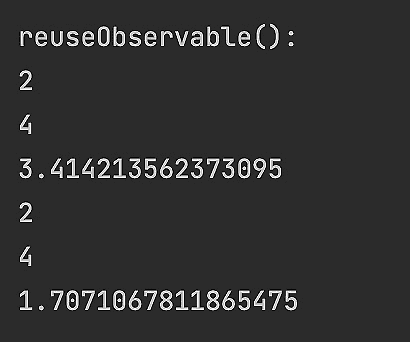

如果我们不希望`Observable`运行两次，我们可以通过添加`cache()`操作来缓存其数据（请参阅`ObservableIntro`类和`cacheObservableData()`方法）：

```java
Observable<Double> observable = Observable.range(1,5)
```

```java
     .filter(i -> i % 2 == 0)
```

```java
     .doOnNext(System.out::println)  //prints 2 and 4 only once
```

```java
     .map(Math::sqrt)
```

```java
     .cache();
```

```java
observable
```

```java
     .reduce((r, d) -> r + d)
```

```java
     .subscribe(System.out::println); 
```

```java
                                    //prints: 3.414213562373095
```

```java
observable
```

```java
     .reduce((r, d) -> r + d)
```

```java
     .map(r -> r / 2)
```

```java
     .subscribe(System.out::println);  
```

```java
                                   //prints: 1.7071067811865475
```

如您所见，相同`Observable`对象的第二次使用利用了缓存的数据，从而提高了性能：

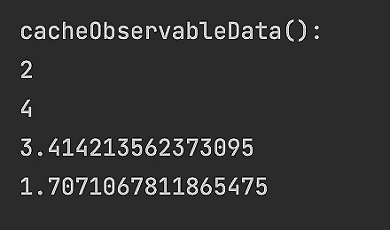

RxJava 提供了如此丰富的功能，以至于我们无法在这本书中全部进行回顾。相反，我们将尝试涵盖最流行的功能。API 描述了使用`Observable`对象可调用的方法。这些方法也被称为**操作**（如在标准 Java 8 流的情况下）或**算子**（这个术语主要与响应式流相关联）。我们将将这些三个术语——方法、操作和算子——互换使用，作为同义词。

## 可观察类型

讨论 RxJava 2 API（请注意，它与 RxJava 1 相当不同），我们将使用在线文档，该文档可以在[`reactivex.io/RxJava/2.x/javadoc/index.html`](http://reactivex.io/RxJava/2.x/javadoc/index.html)找到。

观察者订阅以接收来自可观察对象的价值，它可以表现为以下类型之一：

+   **阻塞**: 这会等待直到结果返回。

+   **非阻塞**: 这以异步方式处理发射的元素。

+   **冷处理**: 这会在观察者的请求下发射一个元素。

+   **热**: 无论观察者是否已订阅，都会发射元素。

一个可观察的对象可以是`io.reactivex`包中以下类之一：

+   `Observable<T>`：这可以发射零个、一个或多个元素；它不支持背压。

+   `Flowable<T>`：这可以发射零个、一个或多个元素；它支持背压。

+   `Single<T>`：这可以发射一个元素或一个错误；不适用背压的概念。

+   `Maybe<T>`：这表示一个延迟的计算。它可以发出没有值、一个值或一个错误；背压的概念不适用。

+   `Completable`：这表示一个没有值的延迟计算。这表示任务的完成或错误；背压的概念不适用。

每个这些类的对象都可以作为阻塞、非阻塞、冷或热可观察对象的行为。它们之间的区别在于可以发出的值的数量、延迟返回结果或仅返回任务完成标志的能力，以及处理背压的能力。

### 阻塞与非阻塞

为了展示这种行为，我们创建了一个可观察对象，该对象发出五个连续的整数，从`1`开始（参见`BlockingOperators`类和`observableBlocking1()`方法）：

```java
Observable<Integer> obs = Observable.range(1,5);
```

`Observable`的所有阻塞方法（操作符）都以“blocking.”开头。例如，`blockingLast()`操作符会阻塞管道，直到最后一个元素被发出：

```java
Double d2 = obs.filter(i -> i % 2 == 0)
```

```java
               .doOnNext(System.out::println)  //prints 2 and 4
```

```java
               .map(Math::sqrt)
```

```java
               .delay(100, TimeUnit.MILLISECONDS)
```

```java
               .blockingLast();
```

```java
System.out.println(d2);                        //prints: 2.0
```

在这个例子中，我们只选择偶数，打印选定的元素，然后计算平方根并等待 100 毫秒（模拟长时间运行的计算）。这个例子的结果如下：

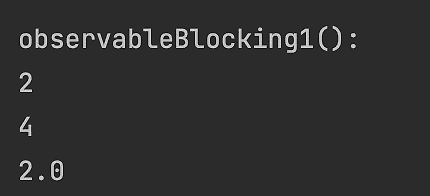

相同功能的非阻塞版本如下（参见`BlockingOperators`类和`observableBlocking1()`方法的第二部分）：

```java
List<Double> list = new ArrayList<>();
```

```java
obs.filter(i -> i % 2 == 0)
```

```java
   .doOnNext(System.out::println)  //prints 2 and 4
```

```java
   .map(Math::sqrt)
```

```java
   .delay(100, TimeUnit.MILLISECONDS)
```

```java
   .subscribe(d -> {
```

```java
        if(list.size() == 1){
```

```java
            list.remove(0);
```

```java
        }
```

```java
        list.add(d);
```

```java
   });
```

```java
System.out.println(list);          //prints: []
```

我们使用`List`对象来捕获结果，因为，你可能记得，lambda 表达式不允许我们使用非 final 变量。

如你所见，结果列表是空的。这是因为管道计算是在非阻塞（异步）的情况下进行的。我们设置了 100 毫秒的延迟（模拟耗时处理），但没有阻塞操作，所以控制流到下一行，打印列表内容，仍然是空的。

为了防止控制过早地转到这一行，我们可以在它前面设置一个延迟（参见`BlockingOperators`类和`observableBlocking2()`方法）：

```java
try {
```

```java
    TimeUnit.MILLISECONDS.sleep(250);
```

```java
} catch (InterruptedException e) {
```

```java
    e.printStackTrace();
```

```java
}
```

```java
System.out.println(list);   //prints: [2.0]
```

注意，延迟至少需要 200 毫秒，因为管道处理两个元素，每个元素都有 100 毫秒的延迟。现在你可以看到列表中有一个预期的值`2.0`。

实质上，这就是阻塞和非阻塞操作符之间的区别。其他表示`observable`的类也有类似的阻塞操作符。以下是一些阻塞的`Flowable`、`Single`和`Maybe`的示例（参见`BlockingOperators`类和`flowableBlocking()`、`singleBlocking()`、`maybeBlocking()`方法）：

```java
Flowable<Integer> obs = Flowable.range(1,5);
```

```java
Double d2 = obs.filter(i -> i % 2 == 0)
```

```java
        .doOnNext(System.out::println)  //prints 2 and 4
```

```java
        .map(Math::sqrt)
```

```java
        .delay(100, TimeUnit.MILLISECONDS)
```

```java
        .blockingLast();
```

```java
System.out.println(d2);                 //prints: 2.0
```

```java
Single<Integer> obs2 = Single.just(42);
```

```java
int i2 = obs2.delay(100, TimeUnit.MILLISECONDS).blockingGet();
```

```java
System.out.println(i2);                 //prints: 42
```

```java
Maybe<Integer> obs3 = Maybe.just(42); 
```

```java
int i3 = obs3.delay(100, TimeUnit.MILLISECONDS).blockingGet(); 
```

```java
System.out.println(i3);                 //prints: 42 
```

`Completable`类有阻塞操作符，允许我们设置超时（参见`BlockingOperators`类和`completableBlocking()`方法的第二部分）：

```java
(1) Completable obs = Completable.fromRunnable(() -> {
```

```java
         System.out.println("Run");           //prints: Run
```

```java
         try {
```

```java
              TimeUnit.MILLISECONDS.sleep(200);
```

```java
         } catch (InterruptedException e) {
```

```java
              e.printStackTrace();
```

```java
         }
```

```java
    });                                           
```

```java
(2) Throwable ex = obs.blockingGet();
```

```java
(3) System.out.println(ex);                   //prints: null
```

```java
//(4) ex = obs.blockingGet(15, TimeUnit.MILLISECONDS);
```

```java
// java.util.concurrent.TimeoutException: 
```

```java
//      The source did not signal an event for 15 milliseconds.
```

```java
(5) ex = obs.blockingGet(150, TimeUnit.MILLISECONDS);
```

```java
(6) System.out.println(ex);                   //prints: null
```

```java
(7) obs.blockingAwait();
```

```java
(8) obs.blockingAwait(15, TimeUnit.MILLISECONDS);
```

前述代码的结果如下所示：

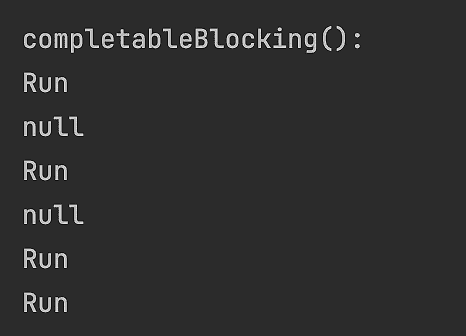

第一个`Run`消息来自第 2 行，是对阻塞`blockingGet()`方法调用的响应。第一个`null`消息来自第 3 行。第 4 行抛出异常，因为超时设置为 15 毫秒，而实际处理设置为 100 毫秒的延迟。第二个`Run`消息来自第 5 行，是对`blockingGet()`方法调用的响应。这次，超时设置为 150 毫秒，这比 100 毫秒多，所以方法能够在超时之前返回。

最后两行，第 7 行和第 8 行，展示了在有无超时的情况下使用`blockingAwait()`方法的使用方法。此方法不返回任何值，但允许可观察管道运行其流程。有趣的是，即使超时设置得比管道完成所需的时间短，它也不会抛出异常。显然，它会在管道完成处理之后开始等待，除非这是一个将在以后修复的缺陷（关于这一点，文档并不明确）。

尽管存在阻塞操作（我们将在以下各节中讨论每个可观察类型时回顾更多），但它们应该只在使用非阻塞操作无法实现所需功能的情况下使用。响应式编程的主要目标是努力以非阻塞方式异步处理所有请求。

### 冷与热

到目前为止，我们所看到的所有示例都只展示了冷可观察对象，它只在处理完前一个值后，在处理管道的请求下提供下一个值。这里还有一个示例（参见`ColdObservable`类和`main()`方法）：

```java
Observable<Long> cold = 
```

```java
        Observable.interval(10, TimeUnit.MILLISECONDS);
```

```java
cold.subscribe(i -> System.out.println("First: " + i));
```

```java
pauseMs(25);
```

```java
cold.subscribe(i -> System.out.println("Second: " + i));
```

```java
pauseMs(55);
```

我们使用`interval()`方法创建了一个表示每指定间隔（在我们的情况下，每 10 毫秒）发出序列数字的可观察对象。然后，我们订阅创建的对象，等待 25 毫秒，再次订阅，并等待另一个 55 毫秒。`pauseMs()`方法如下：

```java
void pauseMs(long ms){
```

```java
    try {
```

```java
        TimeUnit.MILLISECONDS.sleep(ms);
```

```java
    } catch (InterruptedException e) {
```

```java
        e.printStackTrace();
```

```java
    }
```

```java
}
```

如果我们运行前面的示例，输出将类似于以下内容：

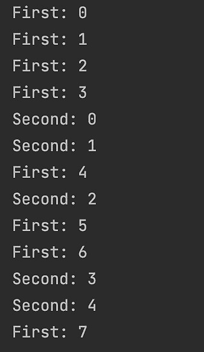

如您所见，每个管道都处理了冷可观察对象发出的每个值。

要将*冷*可观察对象转换为*热*可观察对象，我们使用`publish()`方法，该方法将可观察对象转换为扩展`Observable`对象的`ConnectableObservable`对象（参见`HotObservable`类和`hot1()`方法）：

```java
ConnectableObservable<Long> hot = 
```

```java
      Observable.interval(10, TimeUnit.MILLISECONDS).publish();
```

```java
hot.connect();
```

```java
hot.subscribe(i -> System.out.println("First: " + i));
```

```java
pauseMs(25);
```

```java
hot.subscribe(i -> System.out.println("Second: " + i));
```

```java
pauseMs(55);
```

如您所见，我们必须调用`connect()`方法，这样`ConnectableObservable`对象才会开始发出值。输出看起来类似于以下内容：

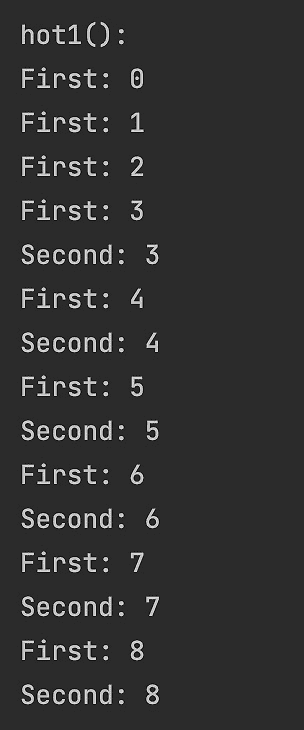

前面的输出显示，第二个管道没有收到前三个值，因为它是在稍后订阅了可观察对象。因此，可观察对象发出的值独立于观察者处理它们的能力。如果处理落后，并且新的值不断到来，而先前的值尚未完全处理，`Observable`类将它们放入缓冲区。如果这个缓冲区变得足够大，JVM 可能会耗尽内存，因为我们之前提到，`Observable`类不具备背压管理能力。

对于这种情况，`Flowable`类是更好的候选者，因为它确实具有处理背压的能力。以下是一个示例（参见`HotObservable`类和`hot2()`方法）：

```java
PublishProcessor<Integer> hot = PublishProcessor.create();
```

```java
hot.observeOn(Schedulers.io(), true)
```

```java
   .subscribe(System.out::println, Throwable::printStackTrace);
```

```java
for (int i = 0; i < 1_000_000; i++) {
```

```java
    hot.onNext(i);
```

```java
}
```

`PublishProcessor`类扩展了`Flowable`，并有一个`onNext(Object o)`方法，它强制它发出传入的对象。在调用它之前，我们已经使用`Schedulers.io()`线程订阅了可观察对象。我们将在*多线程（调度器）*部分讨论调度器。

`subscribe()`方法有几个重载版本。我们决定使用接受两个`Consumer`函数的那个版本：第一个处理传入的值，第二个处理如果管道操作抛出异常的情况（它的工作方式类似于`Catch`块）。

如果我们运行前面的示例，它将成功打印前 127 个值，然后抛出`MissingBackpressureException`，如下面的截图所示：

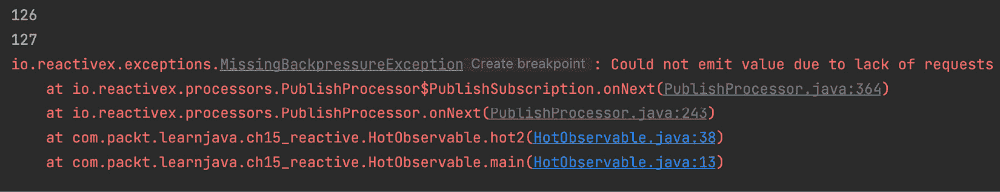

异常中的消息提供了一个线索：“由于请求不足，无法发出值”。显然，发出值的速率高于消费它们的速率，而内部缓冲区只能保持 128 个元素。如果我们添加延迟（以模拟更长的处理时间），结果会更糟（参见`HotObservable`类和`hot3()`方法）：

```java
PublishProcessor<Integer> hot = PublishProcessor.create();
```

```java
hot.observeOn(Schedulers.io(), true)
```

```java
   .delay(10, TimeUnit.MILLISECONDS)
```

```java
   .subscribe(System.out::println, Throwable::printStackTrace);
```

```java
for (int i = 0; i < 1_000_000; i++) {
```

```java
    hot.onNext(i);
```

```java
}
```

即使前 128 个元素也无法通过，输出将只有`MissingBackpressureException`。

为了解决这个问题，必须设置一个背压策略。例如，让我们丢弃管道未能处理的每个值（参见`HotObservable`类和`hot4()`方法）：

```java
PublishProcessor<Integer> hot = PublishProcessor.create();
```

```java
hot.onBackpressureDrop(v -> System.out.println("Dropped: "+ v))
```

```java
   .observeOn(Schedulers.io(), true)
```

```java
   .subscribe(System.out::println, Throwable::printStackTrace);
```

```java
for (int i = 0; i < 1_000_000; i++) {
```

```java
    hot.onNext(i);
```

```java
}
```

注意，策略必须在`observeOn()`操作之前设置，这样它就会被创建的`Schedulers.io()`线程获取。

输出显示许多发出的值都被丢弃了。以下是一个输出片段：

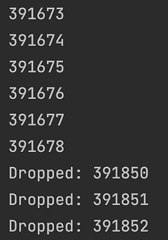

当我们概述相应的操作符时，我们将在*操作符*部分讨论其他背压策略。

## 可处置

注意，`subscribe()`方法实际上返回一个`Disposable`对象，可以查询以检查管道处理是否已完成并已处置（参见`DisposableUsage`类和`disposable1()`方法）：

```java
Observable<Integer> obs = Observable.range(1,5);
```

```java
List<Double> list = new ArrayList<>();
```

```java
Disposable disposable =
```

```java
     obs.filter(i -> i % 2 == 0)
```

```java
        .doOnNext(System.out::println)     //prints 2 and 4
```

```java
        .map(Math::sqrt)
```

```java
        .delay(100, TimeUnit.MILLISECONDS)
```

```java
        .subscribe(d -> {
```

```java
            if(list.size() == 1){
```

```java
                list.remove(0);
```

```java
            }
```

```java
            list.add(d);
```

```java
        });
```

```java
System.out.println(disposable.isDisposed()); //prints: false
```

```java
System.out.println(list);                    //prints: []
```

```java
try {
```

```java
    TimeUnit.MILLISECONDS.sleep(200);
```

```java
} catch (InterruptedException e) {
```

```java
    e.printStackTrace();
```

```java
}
```

```java
System.out.println(disposable.isDisposed());  //prints: true
```

```java
System.out.println(list);                     //prints: [2.0]
```

此外，还可以强制销毁管道，从而有效地取消处理（参见 `DisposableUsage` 类和 `disposable2()` 方法）。

```java
Observable<Integer> obs = Observable.range(1,5);
```

```java
List<Double> list = new ArrayList<>();
```

```java
Disposable disposable =
```

```java
     obs.filter(i -> i % 2 == 0)
```

```java
        .doOnNext(System.out::println)       //prints 2 and 4
```

```java
        .map(Math::sqrt)
```

```java
        .delay(100, TimeUnit.MILLISECONDS)
```

```java
        .subscribe(d -> {
```

```java
            if(list.size() == 1){
```

```java
                list.remove(0);
```

```java
            }
```

```java
            list.add(d);
```

```java
        });
```

```java
System.out.println(disposable.isDisposed()); //prints: false
```

```java
System.out.println(list);                    //prints: []
```

```java
disposable.dispose();
```

```java
try {
```

```java
    TimeUnit.MILLISECONDS.sleep(200);
```

```java
} catch (InterruptedException e) {
```

```java
    e.printStackTrace();
```

```java
}
```

```java
System.out.println(disposable.isDisposed()); //prints: true
```

```java
System.out.println(list);                    //prints: []
```

如您所见，通过添加对 `disposable.dispose()` 的调用，我们已经停止了处理，因此即使延迟了 200 毫秒，列表仍然为空（参见前一个示例的最后一行）。

这种强制销毁的方法可以用来确保没有失控的线程。每个创建的 `Disposable` 对象都可以以与 `finally` 块中释放资源相同的方式销毁。`CompositeDisposable` 类帮助我们以协调的方式处理多个 `Disposable` 对象。

当发生 `onComplete` 或 `onError` 事件时，管道会自动销毁。

例如，您可以使用 `add()` 方法并将新创建的 `Disposable` 对象添加到 `CompositeDisposable` 对象中。然后，在需要时，可以在 `CompositeDisposable` 对象上调用 `clear()` 方法。它将移除收集到的 `Disposable` 对象，并对每个对象调用 `dispose()` 方法。

## 创建可观察对象

您已经在我们的示例中看到了一些创建可观察对象的方法。还有很多其他的工厂方法，包括 `Observable`, `Flowable`, `Single`, `Maybe`, 和 `Completable`。然而，以下方法并不在所有这些接口中都有（见注释；*所有* 表示所有列出的接口都有它）：

+   `create()`: 通过提供完整的实现来创建一个 `Observable` 对象（所有）。

+   `defer()`: 每次有新的 `Observer` 订阅时，都会创建一个新的 `Observable` 对象（所有）。

+   `empty()`: 这将创建一个空的 `Observable` 对象，在订阅时立即完成（所有，除了 `Single`）。

+   `never()`: 这将创建一个不发出任何内容且什么都不做的 `Observable` 对象；它甚至不会完成（所有）。

+   `error()`: 这将创建一个在订阅时立即抛出异常的 `Observable` 对象（所有）。

+   `fromXXX()`: 这将创建一个 `Observable` 对象，其中 XXX 可以是 *Callable*，*Future*（所有），*Iterable*，*Array*，*Publisher*（`Observable` 和 `Flowable`），*Action* 或 *Runnable*（`Maybe` 和 `Completable`）；这意味着它基于提供的函数或对象创建一个 `Observable` 对象。

+   `generate()`: 这将创建一个基于提供的函数或对象的冷 `Observable` 对象，生成值（仅限 `Observable` 和 `Flowable`）。

+   `range(), rangeLong(), interval(), intervalRange()`: 这将创建一个发出连续 `int` 或 `long` 值的 `Observable` 对象，这些值可能或可能不被指定的范围限制，并且由指定的时间间隔分隔（仅限 `Observable` 和 `Flowable`）。

+   `just()`: 这将基于提供的对象或一组对象创建一个 `Observable` 对象（所有，除了 `Completable`）。

+   `timer()`: 这将创建一个`Observable`对象，在指定时间后，发出一个`0L`信号（所有）然后对`Observable`和`Flowable`完成。

此外，还有很多其他有用的方法，例如`repeat()`、`startWith()`等。我们只是没有足够的空间列出所有这些方法。请参阅在线文档([`reactivex.io/RxJava/2.x/javadoc/index.html`](http://reactivex.io/RxJava/2.x/javadoc/index.html))。

让我们看看`create()`方法的使用示例。`Observable`的`create()`方法如下：

```java
public static Observable<T> create(ObservableOnSubscribe<T> source)
```

传入的对象必须实现`ObservableOnSubscribe<T>`功能接口，该接口只有一个抽象方法`subscribe()`：

```java
void subscribe(ObservableEmitter<T> emitter)
```

`ObservableEmitter<T>`接口包含以下方法：

+   `boolean isDisposed()`: 如果处理管道被销毁或发射器被终止，则返回`true`。

+   `ObservableEmitter<T> serialize()`: 这提供了`Emitter`基类中位于`onNext()`、`onError()`和`onComplete()`调用中使用的序列化算法。

+   `void setCancellable(Cancellable c)`: 这在此发射器上设置一个`Cancellable`实现（即只有一个方法`cancel()`的功能接口）。

+   `void setDisposable(Disposable d)`: 这在此发射器上设置一个`Disposable`实现（这是一个有两个方法`isDispose()`和`dispose()`的接口）。

+   `boolean tryOnError(Throwable t)`: 这处理错误条件，尝试发出提供的异常，如果发出不被允许则返回`false`。

要创建一个可观察对象，所有前面的接口都可以按以下方式实现（参见`CreateObservable`类和`main()`方法）：

```java
ObservableOnSubscribe<String> source = emitter -> {
```

```java
    emitter.onNext("One");
```

```java
    emitter.onNext("Two");
```

```java
    emitter.onComplete();
```

```java
};
```

```java
Observable.create(source)
```

```java
          .filter(s -> s.contains("w"))
```

```java
          .subscribe(v -> System.out.println(v),
```

```java
                     e -> e.printStackTrace(),
```

```java
                    () -> System.out.println("Completed"));
```

```java
pauseMs(100); 
```

让我们更仔细地看看前面的例子。我们创建了一个`ObservableOnSubscribe`函数作为`source`并实现了发射器：我们告诉发射器在第一次调用`onNext()`时发出`One`，在第二次调用`onNext()`时发出`Two`，然后调用`onComplete()`。我们将`source`函数传递给`create()`方法并构建处理所有发出值的管道。

为了让它更有趣，我们添加了`filter()`运算符，它只允许你使用字符`*w*`进一步传播值。此外，我们选择了带有三个参数的`subscribe()`方法版本：`Consumer onNext`、`Consumer onError`和`Action onComplete`函数。第一个在每次下一个值达到方法时被调用，第二个在发出异常时被调用，第三个在源发出`onComplete()`信号时被调用。在创建管道后，我们暂停了 100 毫秒，以给异步过程一个完成的机会。结果是如下所示：

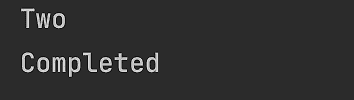

如果我们从发射器实现中移除`emitter.onComplete()`这一行，则只会显示消息`Two`。

因此，这些都是`create()`方法的基本用法。正如你所见，它允许完全自定义。在实践中，它很少被使用，因为创建可观察对象有更简单的方法。我们将在接下来的章节中回顾它们。

此外，你还将看到其他在本章其他部分示例中使用的工厂方法的示例。

## 操作符

在每个可观察接口中，`Observable`、`Flowable`、`Single`、`Maybe`和`Completable`，实际上都有数百（如果我们计算所有重载版本）的操作符可用。

在`Observable`和`Flowable`接口中，方法数量超过 500。这就是为什么在本节中，我们将只提供一个概述和一些示例，帮助你导航可能的选项迷阵。

我们已经将所有操作符分为 10 个类别：转换、过滤、组合、从 XXX 转换、异常处理、生命周期事件处理、实用工具、条件性和布尔值、背压和可连接。

请注意，这些并不是所有可用的操作符。你可以在在线文档中查看更多（[`reactivex.io/RxJava/2.x/javadoc/index.html`](http://reactivex.io/RxJava/2.x/javadoc/index.html)）。

### 转换

以下操作符将转换由可观察对象发出的值：

+   `buffer()`：根据提供的参数或使用提供的函数收集发出的值。它定期逐个发出这些包。

+   `flatMap()`：根据当前可观察对象产生可观察对象，并将它们插入到当前流中；这是最受欢迎的操作符之一。

+   `groupBy()`：将当前的`Observable`对象划分为可观察对象（`GroupedObservables`对象）的组。

+   `map()`：使用提供的函数转换发出的值。

+   `scan()`：将提供的函数应用于每个值，并结合前一次应用相同函数到前一个值产生的结果。

+   `window()`：发出与`buffer()`类似的值组，但作为可观察对象，每个可观察对象都发出原始可观察对象的一个子集的值，然后通过`onCompleted()`终止。

以下代码演示了`map()`、`flatMap()`和`groupBy()`的使用（请参阅`NonBlockingOperators`类和`transforming()`方法）：

```java
Observable<String> obs = Observable.fromArray("one", "two");
```

```java
obs.map(s -> s.contains("w") ? 1 : 0)
```

```java
   .forEach(System.out::print);              //prints: 01
```

```java
System.out.println();
```

```java
List<String> os = new ArrayList<>();
```

```java
List<String> noto = new ArrayList<>();
```

```java
obs.flatMap(s -> Observable.fromArray(s.split("")))
```

```java
        .groupBy(s -> "o".equals(s) ? "o" : "noto")
```

```java
        .subscribe(g -> g.subscribe(s -> {
```

```java
            if (g.getKey().equals("o")) {
```

```java
                os.add(s);
```

```java
            } else {
```

```java
                noto.add(s);
```

```java
            }
```

```java
        }));
```

```java
System.out.println(os);                  //prints: [o, o]
```

```java
System.out.println(noto);                //prints: [n, e, t, w]
```

### 过滤

以下操作符（及其多重重载版本）用于选择哪些值将继续通过管道流动：

+   `debounce()`：仅在经过指定的时间间隔没有可观察对象发出另一个值时才发出值。

+   `distinct()`：仅选择唯一值。

+   `elementAt(long n)`：仅发出流中指定`n`位置的值。

+   `filter()`：仅发出符合指定标准的值。

+   `firstElement()`：仅发出第一个值。

+   `ignoreElements()`: 这不发出值；只有`onComplete()`信号通过。

+   `lastElement()`: 这只发出最后一个值。

+   `sample()`: 这在指定的时问间隔内发出最近发出的值。

+   `skip(long n)`: 这将跳过前`n`个值。

+   `take(long n)`: 这只发出前`n`个值。

以下代码展示了上述操作符的一些用法示例（请参阅`NonBlockingOperators`类和`filtering()`方法）：

```java
Observable<String> obs = Observable.just("onetwo")
```

```java
        .flatMap(s -> Observable.fromArray(s.split("")));
```

```java
// obs emits "onetwo" as characters           
```

```java
obs.map(s -> {
```

```java
            if("t".equals(s)){
```

```java
               NonBlockingOperators.pauseMs(15);
```

```java
            }
```

```java
            return s;
```

```java
        })
```

```java
        .debounce(10, TimeUnit.MILLISECONDS)
```

```java
        .forEach(System.out::print);               //prints: eo
```

```java
obs.distinct().forEach(System.out::print);      //prints: onetw
```

```java
obs.elementAt(3).subscribe(System.out::println);   //prints: t
```

```java
obs.filter(s -> s.equals("o"))
```

```java
   .forEach(System.out::print);                    //prints: oo
```

```java
obs.firstElement().subscribe(System.out::println); //prints: o
```

```java
obs.ignoreElements().subscribe(() -> 
```

```java
       System.out.println("Completed!"));  //prints: Completed!
```

```java
Observable.interval(5, TimeUnit.MILLISECONDS)
```

```java
   .sample(10, TimeUnit.MILLISECONDS)
```

```java
   .subscribe(v -> System.out.print(v + " ")); 
```

```java
                                            //prints: 1 3 4 6 8 
```

```java
pauseMs(50);
```

### 组合

以下操作符（及其多重重载版本）使用多个源可观察对象创建一个新的可观察对象：

+   `concat(src1, src2)`: 这创建一个`Observable`对象，它发出`src1`的所有值，然后是`src2`的所有值。

+   `combineLatest(src1, src2, combiner)`: 这创建一个`Observable`对象，它发出两个源中任一源发出的值，并结合每个源最近发出的值，使用提供的`combiner`函数。

+   `join(src2, leftWin, rightWin, combiner)`: 这根据`combiner`函数，在`leftWin`和`rightWin`时间窗口内结合两个可观察对象发出的值。

+   `merge()`: 这将多个可观察对象合并为一个；与`concat()`不同，它可能会交错它们，而`concat()`永远不会交错来自不同可观察对象的发出值。

+   `startWith(T item)`: 这在从源可观察对象发出值之前，添加指定的值。

+   `startWith(Observable<T> other)`: 这将在从源可观察对象发出值之前，添加指定可观察对象的值。

+   `switchOnNext(Observable<Observable> observables)`: 这创建一个新的`Observable`对象，它发出指定可观察对象最近发出的值。

+   `zip()`: 这使用提供的函数组合指定可观察对象的值。

以下代码演示了这些操作符的一些用法（请参阅`NonBlockingOperators`类和`combined()`方法）：

```java
Observable<String> obs1 = Observable.just("one")
```

```java
             .flatMap(s -> Observable.fromArray(s.split("")));
```

```java
Observable<String> obs2 = Observable.just("two")
```

```java
             .flatMap(s -> Observable.fromArray(s.split("")));
```

```java
Observable.concat(obs2, obs1, obs2)
```

```java
          .subscribe(System.out::print);    //prints: twoonetwo
```

```java
Observable.combineLatest(obs2, obs1, (x,y) -> "("+x+y+")")
```

```java
          .subscribe(System.out::print); //prints: (oo)(on)(oe)
```

```java
System.out.println();
```

```java
obs1.join(obs2, i -> Observable.timer(5, 
```

```java
                TimeUnit.MILLISECONDS),i -> Observable.timer(5, 
```

```java
                TimeUnit.MILLISECONDS),(x,y) -> "("+x+y+")")
```

```java
                                 .subscribe(System.out::print); 
```

```java
                 //prints: (ot)(nt)(et)(ow)(nw)(ew)(oo)(no)(eo)
```

```java
Observable.merge(obs2, obs1, obs2)
```

```java
          .subscribe(System.out::print);  
```

```java
                       //prints: twoonetwo obs1.startWith("42")
```

```java
    .subscribe(System.out::print);         //prints: 42one
```

```java
Observable.zip(obs1, obs2, obs1,  (x,y,z) -> "("+x+y+z+")")
```

```java
          .subscribe(System.out::print); 
```

```java
                                      //prints: (oto)(nwn)(eoe) 
```

### 从 XXX 转换

这些操作符相当直观。以下是`Observable`类的 from-XXX 操作符列表：

+   `fromArray(T... items)`: 这从一个可变参数创建一个`Observable`对象。

+   `fromCallable(Callable<T> supplier)`: 这从一个`Callable`函数创建一个`Observable`对象。

+   `fromFuture(Future<T> future)`: 这从一个`Future`对象创建一个`Observable`对象。

+   `fromFuture(Future<T> future, long timeout, TimeUnit unit)`: 这将从带有超时参数应用于`future`的`Future`对象创建一个`Observable`对象。

+   `fromFuture(Future<T> future, long timeout, TimeUnit unit, Scheduler scheduler)`: 这将从带有超时参数应用于`future`和调度器的`Future`对象创建一个`Observable`对象（注意`Schedulers.io()`被推荐；请参阅*多线程（调度器）*部分）。

+   `fromFuture(Future<T> future, Scheduler scheduler)`: 从指定调度器上的 `Future` 对象创建一个 `Observable` 对象（注意，推荐使用 `Schedulers.io()`；请参阅 *多线程（调度器）* 部分）。

+   `fromIterable(Iterable<T> source)`: 从可迭代对象（例如，`List`）创建一个 `Observable` 对象。

+   `fromPublisher(Publisher<T> publisher)`: 从 `Publisher` 对象创建一个 `Observable` 对象。

### 异常处理

`subscribe()` 算子有一个重载版本，它接受 `Consumer<Throwable>` 函数，该函数处理管道中引发的异常。它的工作方式类似于全面的 `try-catch` 块。如果您将此函数传递给 `subscribe()` 算子，您可以确信这是所有异常最终结束的唯一地方。

然而，如果您需要在管道中间处理异常，值流可以被恢复并由其余算子处理，即算子抛出异常之后。以下算子（及其多个重载版本）可以帮助做到这一点：

+   `onErrorXXX()`: 当捕获到异常时恢复提供的序列；XXX 表示算子执行的操作：`onErrorResumeNext()`、`onErrorReturn()` 或 `onErrorReturnItem()`。

+   `retry()`: 这将创建一个重复从源发出的发射的 `Observable` 对象；如果它调用 `onError()`，则重新订阅源 `Observable`。

演示代码如下（请参阅 `NonBlockingOperators` 类和 `exceptions()` 方法）：

```java
Observable<String> obs = Observable.just("one")
```

```java
              .flatMap(s -> Observable.fromArray(s.split("")));
```

```java
Observable.error(new RuntimeException("MyException"))
```

```java
  .flatMap(x -> Observable.fromArray("two".split("")))
```

```java
  .subscribe(System.out::print,
```

```java
      e -> System.out.println(e.getMessage()) 
```

```java
                                          //prints: MyException
```

```java
  );
```

```java
Observable.error(new RuntimeException("MyException"))
```

```java
          .flatMap(y -> Observable.fromArray("two".split("")))
```

```java
          .onErrorResumeNext(obs)
```

```java
          .subscribe(System.out::print);          //prints: one
```

```java
Observable.error(new RuntimeException("MyException"))
```

```java
          .flatMap(z -> Observable.fromArray("two".split("")))
```

```java
          .onErrorReturnItem("42")
```

```java
          .subscribe(System.out::print);          //prints: 42
```

### 生命周期事件处理

这些算子在每个管道中发生的某个事件上被调用。它们的工作方式与 *异常处理* 部分中描述的算子类似。

这些算子的格式为 `doXXX()`，其中 XXX 是事件的名称：`onComplete`、`onNext`、`onError` 等。并非所有这些类都提供所有这些，其中一些在 `Observable`、`Flowable`、`Single`、`Maybe` 或 `Completable` 中略有不同。然而，我们没有空间列出所有这些类的所有变体，因此我们将概述限制在 `Observable` 类的生命周期事件处理算子的几个示例：

+   `doOnSubscribe(Consumer<Disposable> onSubscribe)`: 当观察者订阅时执行。

+   `doOnNext(Consumer<T> onNext)`: 当源可观察对象调用 `onNext` 时应用提供的 `Consumer` 函数。

+   `doAfterNext(Consumer<T> onAfterNext)`: 在当前值被推送到下游之后，应用提供的 `Consumer` 函数。

+   `doOnEach(Consumer<Notification<T>> onNotification)`: 对每个发出的值执行 `Consumer` 函数。

+   `doOnEach(Observer<T> observer)`: 对每个发出的值和它发出的终端事件通知一个 `Observer` 对象。

+   `doOnComplete(Action onComplete)`: 在源可观察对象生成`onComplete`事件后，执行提供的`Action`函数。

+   `doOnDispose(Action onDispose)`: 在管道被下游处置后，执行提供的`Action`函数。

+   `doOnError(Consumer<Throwable> onError)`: 当发送`onError`事件时执行。

+   `doOnLifecycle(Consumer<Disposable> onSubscribe, Action onDispose)`: 为相应的事件调用相应的`onSubscribe`或`onDispose`函数。

+   `doOnTerminate(Action onTerminate)`: 当源可观察对象生成`onComplete`事件或抛出异常（`onError`事件）时，执行提供的`Action`函数。

+   `doAfterTerminate(Action onFinally)`: 在源可观察对象生成`onComplete`事件或抛出异常（`onError`事件）后，执行提供的`Action`函数。

+   `doFinally(Action onFinally)`: 在源可观察对象生成`onComplete`事件或抛出异常（`onError`事件）后，或管道被下游处置后，执行提供的`Action`函数。

这里是演示代码（见`NonBlockingOperators`类和`events()`方法）：

```java
Observable<String> obs = Observable.just("one")
```

```java
            .flatMap(s -> Observable.fromArray(s.split("")));
```

```java
obs.doOnComplete(() -> System.out.println("Completed!")) 
```

```java
        .subscribe(v -> {
```

```java
            System.out.println("Subscribe onComplete: " + v);
```

```java
        });        
```

```java
pauseMs(25);
```

如果我们运行此代码，输出将如下所示：

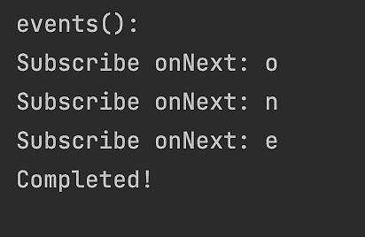

你也将在*多线程（调度器）*部分看到这些操作符使用的其他示例。

### 工具

可以使用各种有用的操作符（及其多种重载版本）来控制管道行为：

+   `delay()`: 这会延迟指定时间段内的发射。

+   `materialize()`: 这会创建一个`Observable`对象，它代表发射的值和发送的通知。

+   `dematerialize()`: 这会反转`materialize()`操作符的结果。

+   `observeOn()`: 指定`Observer`应该观察`Observable`对象的`Scheduler`（线程）（见*多线程（调度器）*部分）。

+   `serialize()`: 强制序列化发射的值和通知。

+   `subscribe()`: 订阅来自可观察对象的发射和通知；各种重载版本接受用于各种事件的回调，包括`onComplete`和`onError`；只有在调用`subscribe()`之后，值才开始通过管道流动。

+   `subscribeOn()`: 使用指定的`Scheduler`（线程）异步地将`Observer`订阅到`Observable`对象（见*多线程（调度器）*部分）。

+   `timeInterval(), timestamp()`: 将发射值的`Observable<T>`类转换为`Observable<Timed<T>>`，它反过来发射发射之间的时间间隔或相应的时间戳。

+   `timeout()`: 重复源`Observable`的发射；如果在指定时间段内没有发生发射，则生成错误。

+   `using()`: 这创建一个资源，它将与`Observable`对象一起自动释放；它的工作方式类似于 try-with-resources 构造。

以下代码包含一些这些操作符在管道中使用示例（请参阅`NonBlockingOperators`类和`utilities()`方法）：

```java
Observable<String> obs = Observable.just("one")
```

```java
          .flatMap(s -> Observable.fromArray(s.split("")));
```

```java
obs.delay(5, TimeUnit.MILLISECONDS)
```

```java
   .subscribe(System.out::print);           //prints: one
```

```java
pauseMs(10);
```

```java
System.out.println(); //used here just to break the line
```

```java
Observable source = Observable.range(1,5);
```

```java
Disposable disposable = source.subscribe();
```

```java
Observable.using(
```

```java
  () -> disposable,
```

```java
  x -> source,
```

```java
  y -> System.out.println("Disposed: " + y) 
```

```java
                               //prints: Disposed: DISPOSED
```

```java
)
```

```java
.delay(10, TimeUnit.MILLISECONDS)
```

```java
.subscribe(System.out::print);              //prints: 12345
```

```java
pauseMs(25);
```

如果我们运行所有这些示例，输出将如下所示：

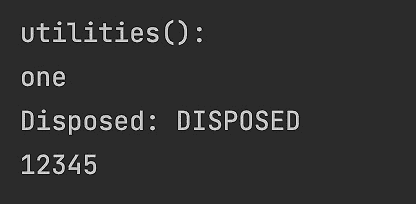

如您所见，当完成时，管道将`DISPOSED`信号发送到`using`操作符（第三个参数），因此我们作为第三个参数传递的`Consumer`函数可以释放管道使用的资源。

### Conditional and Boolean

以下操作符（及其多个重载版本）允许您评估一个或多个可观察对象或发出的值，并相应地更改处理逻辑：

+   `all(Predicate criteria)`: 这返回带有`true`值的`Single<Boolean>`，即如果所有发出的值都符合提供的标准。

+   `amb()`: 这接受两个或更多源可观察对象，并只从它们中发出开始发出的第一个值。

+   `contains(Object value)`: 这返回带有`true`的`Single<Boolean>`，即如果可观察对象发出提供的值。

+   `defaultIfEmpty(T value)`: 如果源`Observable`没有发出任何内容，则发出提供值。

+   `sequenceEqual()`: 这返回带有`true`的`Single<Boolean>`，即如果提供的源发出相同的序列；一个重载版本允许我们提供用于比较的相等函数。

+   `skipUntil(Observable other)`: 这将丢弃发出的值，直到提供的`Observable other`发出一个值。

+   `skipWhile(Predicate condition)`: 只要提供的条件保持`true`，就会丢弃发出的值。

+   `takeUntil(Observable other)`: 在提供的`Observable other`发出值后，将丢弃发出的值。

+   `takeWhile(Predicate condition)`: 在提供的条件变为`false`后，将丢弃发出的值。

以下代码包含一些演示示例（请参阅`NonBlockingOperators`类和`conditional()`方法）：

```java
Observable<String> obs = Observable.just("one")
```

```java
              .flatMap(s -> Observable.fromArray(s.split("")));
```

```java
Single<Boolean> cont = obs.contains("n");
```

```java
System.out.println(cont.blockingGet());          //prints: true
```

```java
obs.defaultIfEmpty("two")
```

```java
   .subscribe(System.out::print);                 //prints: one
```

```java
Observable.empty().defaultIfEmpty("two")
```

```java
          .subscribe(System.out::print);          //prints: two
```

```java
Single<Boolean> equal = Observable.sequenceEqual(obs, 
```

```java
                                 Observable.just("one"));
```

```java
System.out.println(equal.blockingGet());        //prints: false
```

```java
equal = Observable.sequenceEqual(Observable.just("one"), 
```

```java
                                 Observable.just("one"));
```

```java
System.out.println(equal.blockingGet());         //prints: true
```

```java
equal = Observable.sequenceEqual(Observable.just("one"), 
```

```java
                                 Observable.just("two"));
```

```java
System.out.println(equal.blockingGet());        //prints: false
```

### Backpressure

因此，我们在*冷与热*部分讨论并演示了**背压**效果和可能的丢弃策略。另一种策略可能如下：

```java
Flowable<Double> obs = Flowable.fromArray(1.,2.,3.);
```

```java
obs.onBackpressureBuffer().subscribe();
```

```java
//or
```

```java
obs.onBackpressureLatest().subscribe();
```

缓冲策略允许您定义缓冲区大小，并提供一个在缓冲区溢出时可以执行的功能。最新的策略告诉值生产者在消费者无法及时处理发出的值时暂停，并在请求时发出下一个值。

注意，背压操作符仅在`Flowable`类中可用。

### Connectable

此类操作符允许我们连接可观察对象，从而实现更精确的订阅动态控制：

+   `publish()`: 这将`Observable`对象转换为`ConnectableObservable`对象。

+   `replay()`: 这返回一个`ConnectableObservable`对象，每次新的`Observer`订阅时都会重复所有发出的值和通知。

+   `connect()`: 这指示`ConnectableObservable`对象开始向订阅者发出值。

+   `refCount()`: 这将`ConnectableObservable`对象转换为`Observable`对象。

我们已经在“冷与热”部分展示了`ConnectableObservable`的工作原理。`ConnectableObservable`与`Observable`之间的一个主要区别是，`ConnectableObservable`不会开始发出值，直到其`connect`操作符被调用。

## 多线程（调度器）

默认情况下，RxJava 是单线程的。这意味着源可观察对象及其所有操作符都在调用`subscribe()`操作符的同一线程上通知观察者。

有两个操作符，`observeOn()`和`subscribeOn()`，允许您将单个操作的执行移动到不同的线程。这些方法接受一个`Scheduler`对象作为参数，该参数将单个操作调度到不同的线程上执行。

`subscribeOn()`操作符声明了哪个调度器应该发出值。

`observeOn()`操作符声明了哪个调度器应该观察和处理值。

`Schedulers`类包含创建具有不同生命周期和性能配置的`Scheduler`对象的工厂方法：

+   `computation()`: 这创建了一个基于有界线程池的调度器，其大小最多可达可用处理器的数量；它应该用于 CPU 密集型计算。使用`Runtime.getRuntime().availableProcessors()`来避免使用比可用处理器更多的此类调度器；否则，由于线程上下文切换的开销，性能可能会下降。

+   `io()`: 这创建了一个基于无界线程池的调度器，用于 I/O 相关的工作，例如在源交互本质上是阻塞的情况下，通常用于处理文件和数据库；避免在其他情况下使用它，因为它可能会启动太多线程，从而对性能和内存使用产生负面影响。

+   `newThread()`: 每次都会创建一个新线程，并且不使用任何池；这是一种昂贵的创建线程的方式，因此您应该确切知道使用它的原因。

+   `single()`: 这根据单个线程创建一个调度器，该线程按顺序执行所有任务；当执行顺序很重要时很有用。

+   `trampoline()`: 这创建了一个以先入先出方式执行任务的调度器；这对于执行递归算法很有用。

+   `from(Executor executor)`: 这根据提供的执行器（线程池）创建一个调度器，这允许更好地控制最大线程数及其生命周期。

在 *第八章*，*多线程和并发处理*中，我们讨论了线程池。为了提醒您，以下是讨论的线程池：

```java
          Executors.newCachedThreadPool();
```

```java
          Executors.newSingleThreadExecutor();
```

```java
          Executors.newFixedThreadPool(int nThreads);
```

```java
          Executors.newScheduledThreadPool(int poolSize);
```

```java
          Executors.newWorkStealingPool(int parallelism);
```

如您所见，`Schedulers` 类的一些其他工厂方法背后是这些线程池之一，它们只是线程池声明的更简单、更简短的表示。为了使示例更简单、更具有可比性，我们只将使用 `computation()` 调度器。让我们看看 RxJava 中并行/并发处理的基本知识。

以下代码是将 CPU 密集型计算委托给专用线程的示例（参见 `Scheduler` 类和 `parallel1()` 方法）：

```java
Observable.fromArray("one","two","three")
```

```java
          .doAfterNext(s -> System.out.println("1: " + 
```

```java
                Thread.currentThread().getName() + " => " + s))
```

```java
          .flatMap(w -> Observable.fromArray(w.split(""))
```

```java
                           .observeOn(Schedulers.computation())
```

```java
              //.flatMap(s -> {             
```

```java
              //      CPU-intensive calculations go here
```

```java
              // }  
```

```java
                .doAfterNext(s -> System.out.println("2: " + 
```

```java
                Thread.currentThread().getName() + " => " + s))
```

```java
          )
```

```java
          .subscribe(s -> System.out.println("3: " + s));
```

```java
pauseMs(100);
```

在这个示例中，我们决定从每个发出的单词创建一个子流，并让一个专用线程处理每个单词的字符。本例的输出如下所示：

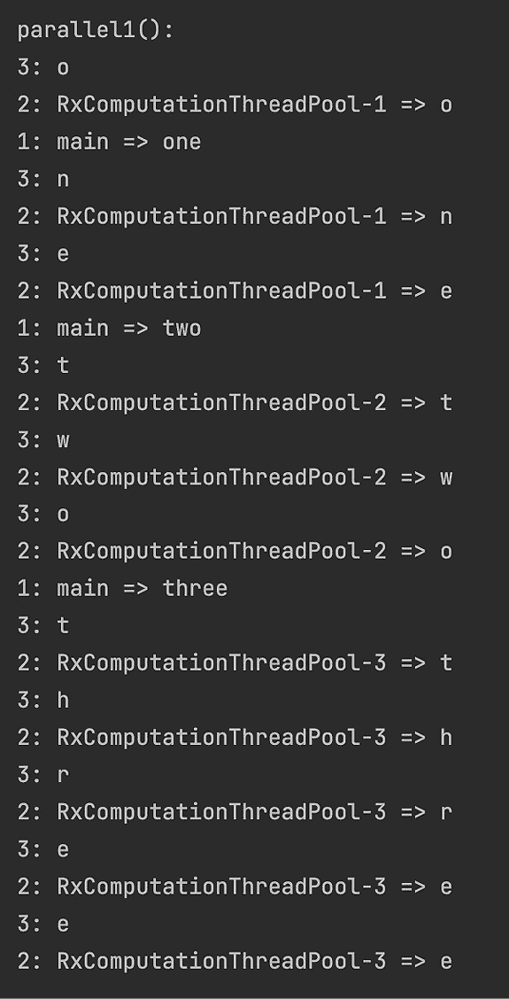

如您所见，主线程用于发出单词，每个单词的字符由一个专用线程处理。请注意，尽管在这个示例中，到达 `subscribe()` 操作的结果序列与单词和字符发出的序列相对应，但在实际情况下，每个值的计算时间可能不同。因此，不能保证结果将以相同的顺序到来。

如果需要，我们还可以将每个单词的发出放在一个专用的非主线程上，这样主线程就可以自由地做其他任何事情。例如，注意以下内容（参见 `Scheduler` 类和 `parallel2()` 方法）：

```java
Observable.fromArray("one","two","three")
```

```java
        .observeOn(Schedulers.computation())
```

```java
        .doAfterNext(s -> System.out.println("1: " + 
```

```java
                Thread.currentThread().getName() + " => " + s))
```

```java
        .flatMap(w -> Observable.fromArray(w.split(""))
```

```java
                .observeOn(Schedulers.computation())
```

```java
                .doAfterNext(s -> System.out.println("2: " + 
```

```java
                Thread.currentThread().getName() + " => " + s))
```

```java
        )
```

```java
        .subscribe(s -> System.out.println("3: " + s));
```

```java
pauseMs(100);
```

本例的输出如下：

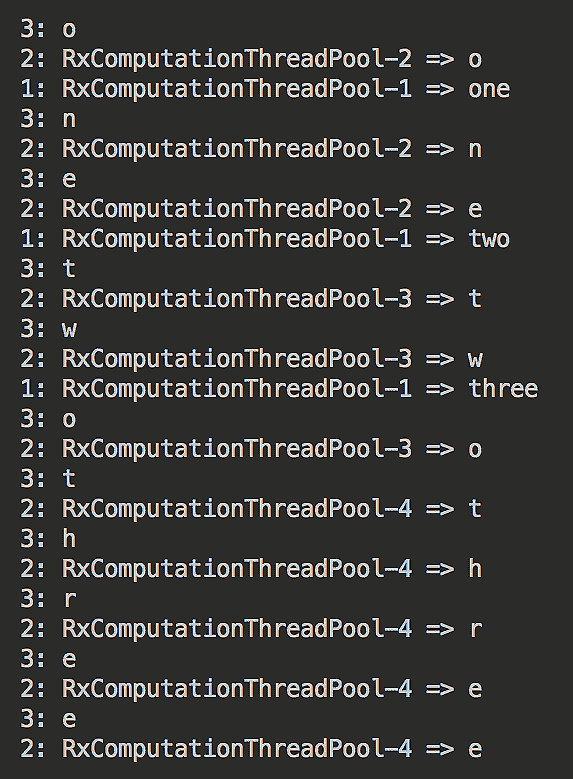

如您所见，主线程不再发出单词。

在 RxJava 2.0.5 中，引入了一种新的、更简单的并行处理方式，类似于标准 Java 8 流中的并行处理。使用 `ParallelFlowable`，可以以以下方式实现相同的功能（参见 `Scheduler` 类和 `parallel3()` 方法）：

```java
ParallelFlowable src = 
```

```java
            Flowable.fromArray("one","two","three").parallel();
```

```java
src.runOn(Schedulers.computation())
```

```java
   .doAfterNext(s -> System.out.println("1: " + 
```

```java
                Thread.currentThread().getName() + " => " + s))
```

```java
   .flatMap(w -> Flowable.fromArray(((String)w).split("")))
```

```java
   .runOn(Schedulers.computation())
```

```java
   .doAfterNext(s -> System.out.println("2: " + 
```

```java
                Thread.currentThread().getName() + " => " + s))
```

```java
   .sequential()
```

```java
   .subscribe(s -> System.out.println("3: " + s));
```

```java
pauseMs(100);
```

如您所见，`ParallelFlowable` 对象是通过将 `parallel()` 操作符应用于常规的 `Flowable` 操作符来创建的。然后，`runOn()` 操作符指示创建的观察者使用 `computation()` 调度器来发出值。请注意，在 `flatMap()` 操作符内部无需设置另一个调度器（用于处理字符）。它可以在外部设置——只需在主管道中，这使得代码更简单。结果如下所示：

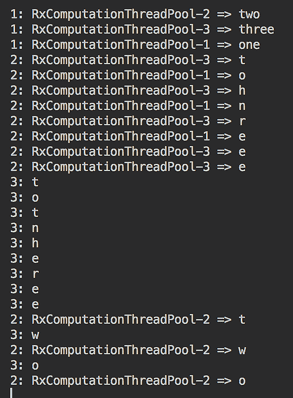

关于 `subscribeOn()` 操作符，它在管道中的位置不起任何作用。无论它放在哪里，它仍然告诉观察者哪个调度器应该发出值。以下是一个示例（参见 `Scheduler` 类和 `subscribeOn1()` 方法）：

```java
Observable.just("a", "b", "c")
```

```java
          .doAfterNext(s -> System.out.println("1: " + 
```

```java
                Thread.currentThread().getName() + " => " + s))
```

```java
          .subscribeOn(Schedulers.computation())
```

```java
          .subscribe(s -> System.out.println("2: " + 
```

```java
               Thread.currentThread().getName() + " => " + s));
```

```java
pauseMs(100);
```

结果如下所示：

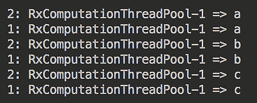

即使我们将`subscribeOn()`操作符的位置改变，如以下示例所示，结果也不会改变（参见`Scheduler`类和`subscribeOn2()`方法）：

```java
Observable.just("a", "b", "c")
```

```java
          .subscribeOn(Schedulers.computation())
```

```java
          .doAfterNext(s -> System.out.println("1: " + 
```

```java
                Thread.currentThread().getName() + " => " + s))
```

```java
          .subscribe(s -> System.out.println("2: " + 
```

```java
               Thread.currentThread().getName() + " => " + s));
```

```java
pauseMs(100);
```

最后，这是包含两个操作符的示例（参见`Scheduler`类和`subscribeOnAndObserveOn()`方法）：

```java
Observable.just("a", "b", "c")
```

```java
          .subscribeOn(Schedulers.computation())
```

```java
          .doAfterNext(s -> System.out.println("1: " + 
```

```java
                Thread.currentThread().getName() + " => " + s))
```

```java
          .observeOn(Schedulers.computation())
```

```java
          .subscribe(s -> System.out.println("2: " + 
```

```java
               Thread.currentThread().getName() + " => " + s));
```

```java
pauseMs(100);
```

现在的结果显示使用了两个线程：一个用于订阅，另一个用于观察：

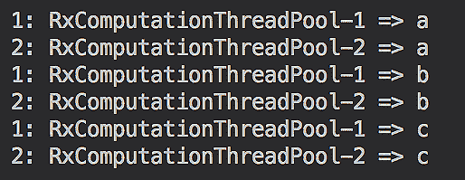

这就结束了我们对 RxJava 的简要概述，RxJava 是一个庞大且仍在增长的库，具有许多可能性，其中许多我们在这本书中没有空间进行回顾。我们鼓励你尝试并学习它，因为似乎响应式编程是现代数据处理的发展方向。

在以下章节中，我们将演示如何使用 Spring Boot 和 Vert.x 构建响应式应用程序（微服务）。

# 摘要

在本章中，你学习了响应式编程是什么以及其主要概念：异步、非阻塞、响应式等。以简单术语介绍了响应式流，并解释了 RxJava 库，这是第一个支持响应式编程原则的稳定实现。

现在，你可以使用响应式编程编写异步处理代码。

在下一章中，我们将讨论微服务作为创建响应式系统的基石，并回顾另一个成功支持响应式编程的库：**Vert.x**。我们将使用它来演示如何构建各种微服务。

# 测验

1.  选择所有正确的陈述：

    1.  异步处理总是比阻塞调用提供结果晚。

    1.  异步处理总是能快速提供响应。

    1.  异步处理可以使用并行处理。

    1.  异步处理总是比阻塞调用提供结果更快。

1.  可以在不使用线程池的情况下使用`CompletableFuture`吗？

1.  `java.nio`中的`nio`代表什么？

1.  `event`循环是唯一支持非阻塞 API 的设计吗？

1.  RxJava 中的`Rx`代表什么？

1.  **Java 类库（JCL**）的哪个 Java 包支持响应式流？

1.  从以下列表中选择所有可以表示响应式流中可观察对象的类：

    1.  `Flowable`

    1.  `Probably`

    1.  `CompletableFuture`

    1.  `Single`

1.  你如何知道`Observable`类的特定方法（操作符）是阻塞的？

1.  冷和热可观察对象之间的区别是什么？

1.  `Observable`的`subscribe()`方法返回一个`Disposable`对象。当在这个对象上调用`dispose()`方法时会发生什么？

1.  选择所有创建`Observable`对象的方法的名称：

    1.  `interval()`

    1.  `new()`

    1.  `generate()`

    1.  `defer()`

1.  列出两个转换`Observable`操作符。

1.  列出两个过滤`Observable`操作符。

1.  列出两种背压处理策略。

1.  列出两个允许你向管道处理中添加线程的`Observable`操作符。
