# *第十六章*：Java 微基准工具

在本章中，你将了解一个**Java 微基准工具**（**JMH**）项目，它允许测量各种代码性能特征。如果你的应用程序性能是一个重要问题，这个工具可以帮助你精确地识别瓶颈，甚至到方法级别。

除了理论知识，你还有机会通过实际演示示例和建议来运行 JMH。

本章将涵盖以下主题：

+   什么是 JMH？

+   创建 JMH 基准

+   运行基准测试

+   使用 IDE 插件

+   JMH 基准参数

+   JMH 使用示例

到本章结束时，你不仅能够测量应用程序的平均执行时间和其他性能值（例如吞吐量），而且还能以受控的方式进行测量——无论是带有还是不带 JVM 优化、预热运行等。

# 技术要求

为了能够执行本章提供的代码示例，你需要以下内容：

+   搭载 Microsoft Windows、Apple macOS 或 Linux 操作系统的计算机

+   Java SE 版本 17 或更高版本

+   你偏好的 IDE 或代码编辑器

如何设置 Java SE 和 IntelliJ IDEA 编辑器的说明已在 *第一章*，*Java 17 入门*中提供。本章的代码示例文件可在 GitHub 的 [`github.com/PacktPublishing/Learn-Java-17-Programming.git`](https://github.com/PacktPublishing/Learn-Java-17-Programming.git) 仓库的 `examples/src/main/java/com/packt/learnjava/ch16_microbenchmark` 文件夹中找到。

# 什么是 JMH？

根据《牛津高阶英汉双解大词典》，**基准**是**一个标准或参考点，可以用来比较或评估事物**。在编程中，它是比较应用程序性能或方法性能的方式。**微基准**专注于后者——较小的代码片段而不是整个应用程序。JMH 是一个用于测量单个方法性能的框架。

这可能看起来非常有用。我们能否只是将一个方法循环运行 1,000 或 100,000 次，测量它花费的时间，然后计算方法的平均性能？我们可以。问题是 JVM 不仅仅是一个代码执行机器，它是一个更加复杂的程序。它有优化算法，旨在使应用程序代码尽可能快地运行。

例如，让我们看看以下类：

```java
class SomeClass {
```

```java
    public int someMethod(int m, int s) {
```

```java
        int res = 0;
```

```java
        for(int i = 0; i < m; i++){
```

```java
            int n = i * i;
```

```java
            if (n != 0 && n % s == 0) {
```

```java
                res =+ n;
```

```java
            }
```

```java
        }
```

```java
        return res;
```

```java
    }
```

```java
}
```

我们在 `someMethod()` 方法中填充了一些没有太多意义但能让方法忙碌的代码。为了测试这个方法的性能，我们可能会倾向于将代码复制到测试方法中并循环运行：

```java
public void testCode() {
```

```java
   StopWatch stopWatch = new StopWatch();
```

```java
   stopWatch.start();
```

```java
   int xN = 100_000;
```

```java
   int m = 1000;
```

```java
   for(int x = 0; i < xN; x++) {
```

```java
        int res = 0;
```

```java
        for(int i = 0; i < m; i++){
```

```java
            int n = i * i;
```

```java
            if (n != 0 && n % 250_000 == 0) {
```

```java
                res += n;
```

```java
            }
```

```java
        }
```

```java
    }
```

```java
    System.out.println("Average time = " + 
```

```java
           (stopWatch.getTime() / xN /m) + "ms");
```

```java
}
```

然而，JVM 会发现 `res` 结果从未被使用，并将这些计算视为**死代码**（从未被执行的代码段）。那么，为什么还要执行这段代码呢？

你可能会惊讶地发现，算法的显著复杂化或简化并不影响性能。这是因为，在所有情况下，代码实际上并没有被执行。

你可以更改测试方法，并假装返回的结果被使用：

```java
public int testCode() {
```

```java
   StopWatch stopWatch = new StopWatch();
```

```java
   stopWatch.start();
```

```java
   int xN = 100_000;
```

```java
   int m = 1000;
```

```java
   int res = 0;
```

```java
   for(int x = 0; i < xN; x++) {
```

```java
        for(int i = 0; i < m; i++){
```

```java
            int n = i * i;
```

```java
            if (n != 0 && n % 250_000 == 0) {
```

```java
                res += n;
```

```java
            }
```

```java
        }
```

```java
   }
```

```java
   System.out.println("Average time = " + 
```

```java
          (stopWatch.getTime() / xN / m) + "ms");
```

```java
   return res;
```

```java
}
```

这可能会让 JVM 每次都执行代码，但这并不是保证的。JVM 可能会注意到计算输入没有变化，并且这个算法每次运行都会产生相同的结果。由于代码基于常量输入，这种优化被称为**常量折叠**。这种优化的结果是，这段代码可能只执行一次，并且每次运行都假设得到相同的结果，而实际上并不执行代码。

然而，在实践中，基准测试通常围绕一个方法构建，而不是一段代码块。例如，测试代码可能看起来如下：

```java
public void testCode() {
```

```java
   StopWatch stopWatch = new StopWatch();
```

```java
   stopWatch.start();
```

```java
   int xN = 100_000;
```

```java
   int m = 1000;
```

```java
   SomeClass someClass = new SomeClass();
```

```java
   for(int x = 0; i < xN; x++) {
```

```java
        someClass.someMethod(m, 250_000);
```

```java
    }
```

```java
    System.out.println("Average time = " + 
```

```java
          (stopWatch.getTime() / xN / m) + "ms");
```

```java
}
```

但即使这个代码也容易受到我们刚才描述的相同 JVM 优化的影响。

JMH 是为了帮助避免这种和类似的陷阱而创建的。在 *JMH 使用示例* 部分，我们将向你展示如何使用 JMH 来绕过死代码和常量折叠优化，使用 `@State` 注解和 `Blackhole` 对象。

此外，JMH 允许测量不仅平均执行时间，还包括吞吐量和其他性能特征。

# 创建 JMH 基准测试

要开始使用 JMH，必须在 `pom.xml` 文件中添加以下依赖项：

```java
<dependency>
```

```java
    <groupId>org.openjdk.jmh</groupId>
```

```java
    <artifactId>jmh-core</artifactId>
```

```java
    <version>1.21</version>
```

```java
</dependency>
```

```java
<dependency>
```

```java
    <groupId>org.openjdk.jmh</groupId>
```

```java
    <artifactId>jmh-generator-annprocess</artifactId>
```

```java
    <version>1.21</version>
```

```java
</dependency>
```

第二个 `.jar` 文件名，`annprocess`，暗示了 JMH 使用注解。如果你猜对了，那么你是对的。以下是一个为测试算法性能而创建的基准测试示例：

```java
public class BenchmarkDemo {
```

```java
    public static void main(String... args) throws Exception{
```

```java
        org.openjdk.jmh.Main.main(args);
```

```java
    }
```

```java
    @Benchmark
```

```java
    public void testTheMethod() {
```

```java
        int res = 0;
```

```java
        for(int i = 0; i < 1000; i++){
```

```java
            int n = i * i;
```

```java
            if (n != 0 && n % 250_000 == 0) {
```

```java
                res += n;
```

```java
            }
```

```java
        }
```

```java
    }
```

```java
}
```

请注意 `@Benchmark` 注解。它告诉框架这个方法的性能需要被测量。如果你运行前面的 `main()` 方法，你将看到类似于以下输出的结果：

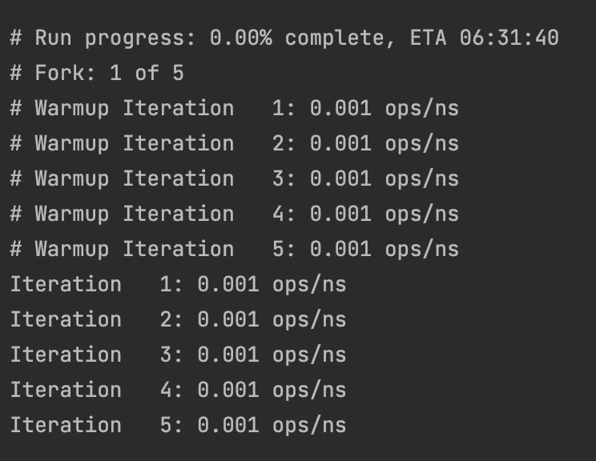

这只是大量输出的一部分，包括在不同条件下多次迭代，目的是避免或抵消 JVM 优化。它还考虑了单次运行代码和多次运行代码之间的差异。在后一种情况下，JVM 开始使用即时编译器，将常用字节码编译成原生二进制代码，甚至不读取字节码。预热循环就是为了这个目的——代码在没有测量其性能的情况下执行，作为预热 JVM 的干运行。

还有一种方法可以告诉 JVM 哪个方法需要编译并直接作为二进制使用，哪个方法每次都需要编译，并提供类似的指令来禁用某些优化。我们将在稍后讨论这个问题。

现在我们来看看如何运行基准测试。

# 运行基准测试

如你所猜，运行基准的一种方法就是直接执行`main()`方法。这可以通过直接使用`java`命令或使用 IDE 来完成。我们已经在*第一章*，“Java 17 入门”中讨论过。但还有更简单、更方便的方法来运行基准：通过使用 IDE 插件。

## 使用 IDE 插件

所有主要的 Java 支持 IDE 都拥有这样的插件。我们将演示如何在 macOS 计算机上安装 IntelliJ 的插件，但它同样适用于 Windows 系统。

这里是遵循的步骤：

1.  要开始安装插件，按住*command*键和逗号(*,*)一起，或者只需点击顶部水平菜单中的扳手符号（悬停文本为**首选项**）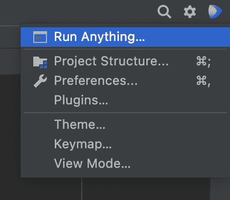

1.  它将打开一个窗口，左侧面板中有以下菜单：

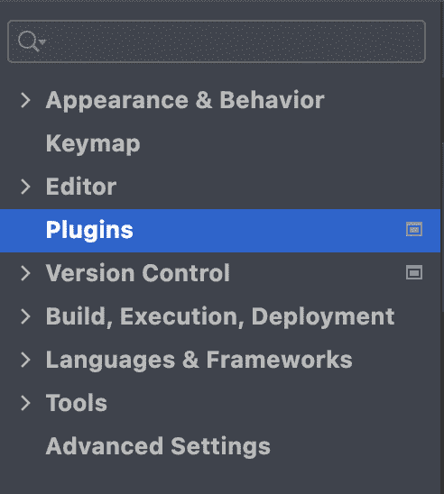

1.  如前图所示，选择**插件**，并观察以下顶部水平菜单：


1.  在**在市场插件中搜索**输入字段中选择`JMH`，然后按*Enter*。如果你有互联网连接，它将显示一个**JMH 插件**符号，类似于以下截图所示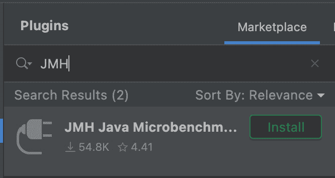

1.  点击**安装**按钮，然后，当它变为**重启 IDE**时，再次点击它：

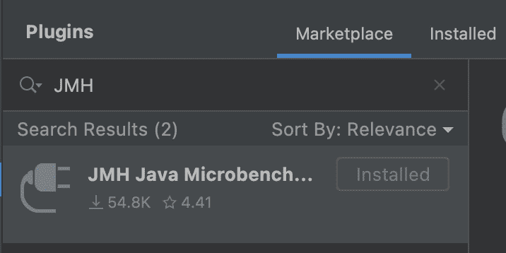

1.  在 IDE 重启后，插件就准备好使用了。现在你不仅可以运行`main()`方法，如果你有多个带有`@Benchmark`注解的方法，你也可以选择并执行其中的基准方法。要做到这一点，从**运行**下拉菜单中选择**运行...**：

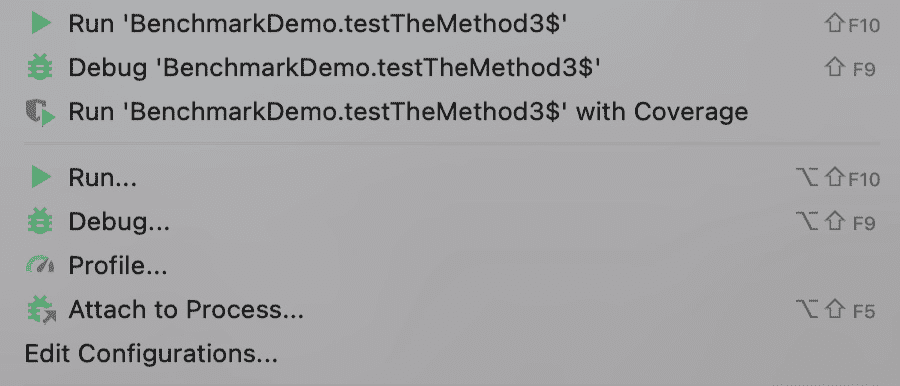

1.  它将弹出一个窗口，其中包含你可以运行的方法选择：

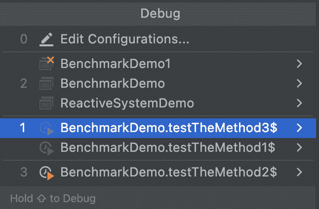

1.  选择你想要运行的，它将被执行。在你至少运行了一个方法之后，你只需右键单击它，然后从弹出菜单中执行它：

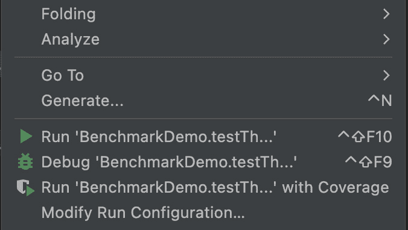

1.  你也可以使用每个菜单项右侧显示的快捷键。

现在，让我们回顾一下可以传递给基准的参数。

# JMH 基准参数

有许多基准参数允许针对手头任务的特定需求进行微调测量。我们将只介绍其中主要的。

## 模式

第一组参数定义了特定基准需要测量的性能方面（模式）：

+   `Mode.AverageTime`：测量平均执行时间

+   `Mode.Throughput`：通过迭代调用基准方法来测量吞吐量

+   `Mode.SampleTime`：采样执行时间，而不是平均它；允许我们推断分布、百分位数等

+   `Mode.SingleShotTime`：测量单个方法调用时间；允许在不连续调用基准方法的情况下测试冷启动

这些参数可以在`@BenchmarkMode`注解中指定，例如：

```java
@BenchmarkMode(Mode.AverageTime)
```

可以组合几个模式：

```java
@BenchmarkMode({Mode.Throughput, Mode.AverageTime, Mode.SampleTime, Mode.SingleShotTime}
```

也可以请求所有这些：

```java
@BenchmarkMode(Mode.All)
```

描述的参数以及我们将在本章后面讨论的所有参数都可以在方法和/或类级别设置。方法级别的设置值会覆盖类级别的值。

## 输出时间单位

用于呈现结果的单位时间可以使用`@OutputTimeUnit`注解来指定：

```java
@OutputTimeUnit(TimeUnit.NANOSECONDS)
```

可能的时间单位来自`java.util.concurrent.TimeUnit`枚举。

## 迭代次数

另一组参数定义了用于预热和测量的迭代次数，例如：

```java
@Warmup(iterations = 5, time = 100, 
```

```java
                          timeUnit =  TimeUnit.MILLISECONDS)
```

```java
@Measurement(iterations = 5, time = 100, 
```

```java
                           timeUnit = TimeUnit.MILLISECONDS)
```

## 分叉

在运行多个测试时，`@Fork`注解允许你将每个测试设置在单独的进程中运行，例如：

```java
@Fork(10)
```

传入的参数值表示 JVM 可以分叉成多少个独立进程。默认值是`-1`。如果没有它，如果你在测试中使用实现相同接口的几个类，并且它们相互影响，测试的性能可能会混合。

`warmups`参数是另一个可以设置的参数，用来指示基准测试必须执行多少次而不收集测量数据：

```java
@Fork(value = 10, warmups = 5)
```

它还允许你向 java 命令行添加 Java 选项，例如：

```java
@Fork(value = 10, jvmArgs = {"-Xms2G", "-Xmx2G"})
```

JMH 参数的完整列表以及如何使用它们的示例可以在`openjdk`项目中找到（[`hg.openjdk.java.net/code-tools/jmh/file/tip/jmh-samples/src/main/java/org/openjdk/jmh/samples`](http://hg.openjdk.java.net/code-tools/jmh/file/tip/jmh-samples/src/main/java/org/openjdk/jmh/samples)）。例如，我们没有提到`@Group`、`@GroupThreads`、`@Measurement`、`@Setup`、`@Threads`、`@Timeout`、`@TearDown`或`@Warmup`。

# JMH 使用示例

现在我们运行几个测试并比较它们。首先，我们运行以下测试方法：

```java
@Benchmark
```

```java
@BenchmarkMode(Mode.All)
```

```java
@OutputTimeUnit(TimeUnit.NANOSECONDS)
```

```java
public void testTheMethod0() {
```

```java
    int res = 0;
```

```java
    for(int i = 0; i < 1000; i++){
```

```java
        int n = i * i;
```

```java
        if (n != 0 && n % 250_000 == 0) {
```

```java
            res += n;
```

```java
        }
```

```java
    }
```

```java
}
```

如你所见，我们已经请求测量所有性能特征，并在呈现结果时使用纳秒。在我们的系统中，测试执行大约花费了 20 分钟，最终结果摘要如下所示：

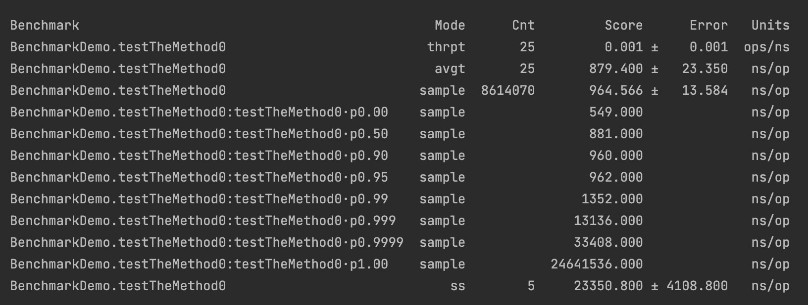

现在我们将测试修改如下：

```java
@Benchmark
```

```java
@BenchmarkMode(Mode.All)
```

```java
@OutputTimeUnit(TimeUnit.NANOSECONDS)
```

```java
public void testTheMethod1() {
```

```java
    SomeClass someClass = new SomeClass();
```

```java
    int i = 1000;
```

```java
    int s = 250_000;
```

```java
    someClass.someMethod(i, s);
```

```java
}
```

如果我们现在运行`testTheMethod1()`，结果将略有不同：

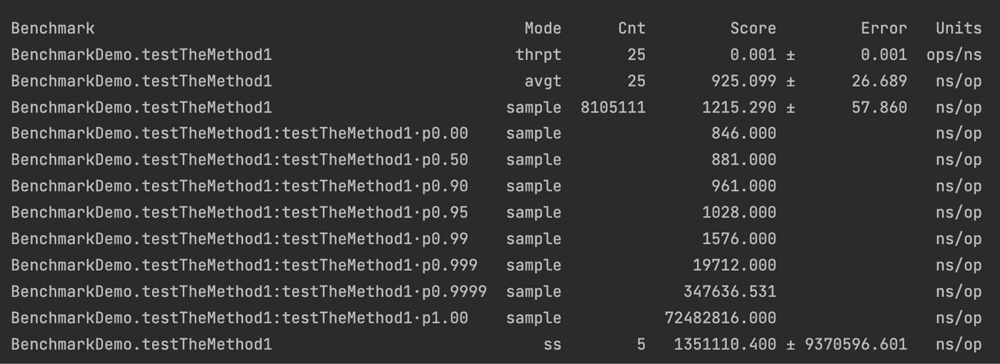

结果在采样和单次运行方面大多不同。你可以玩转这些方法，并更改分叉和预热的次数。

## 使用@State 注解

JMH 的这个特性允许你将数据的来源隐藏于 JVM 中，从而防止死代码优化。你可以添加一个类作为输入数据来源，如下所示：

```java
@State(Scope.Thread)
```

```java
public static class TestState {
```

```java
    public int m = 1000;
```

```java
    public int s = 250_000;
```

```java
}
```

```java
@Benchmark
```

```java
@BenchmarkMode(Mode.All)
```

```java
@OutputTimeUnit(TimeUnit.NANOSECONDS)
```

```java
public int testTheMethod3(TestState state) {
```

```java
    SomeClass someClass = new SomeClass();
```

```java
    return someClass.someMethod(state.m, state.s);
```

```java
}
```

`Scope`值用于在测试之间共享数据。在我们的案例中，只有一个使用`TestCase`类对象的测试，我们没有共享的需求。否则，该值可以设置为`Scope.Group`或`Scope.Benchmark`，这意味着我们可以向`TestState`类添加设置器，并在其他测试中读取/修改它。

当我们运行这个版本的测试时，我们得到了以下结果：

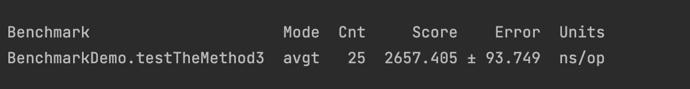

数据再次发生了变化。注意，执行的平均时间增加了三倍，这表明没有应用更多的 JVM 优化。

## 使用 Blackhole 对象

这个 JMH 特性允许模拟结果使用，从而防止 JVM 实现折叠常量优化：

```java
@Benchmark
```

```java
@BenchmarkMode(Mode.All)
```

```java
@OutputTimeUnit(TimeUnit.NANOSECONDS)
```

```java
public void testTheMethod4(TestState state, 
```

```java
                                       Blackhole blackhole){
```

```java
  SomeClass someClass = new SomeClass();
```

```java
  blackhole.consume(someClass.someMethod(state.m, state.s));
```

```java
}
```

如您所见，我们刚刚添加了一个`Blackhole`参数对象，并对其调用了`consume()`方法，从而假装测试方法的结果是已被使用。

当我们运行这个版本的测试时，我们得到了以下结果：

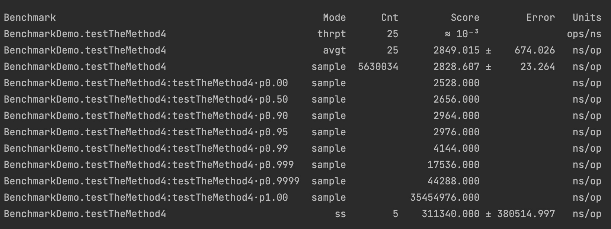

这次，结果看起来并没有太大的不同。显然，在添加`Blackhole`使用之前，常量折叠优化已经被中和了。

## 使用@CompilerControl 注解

调整基准测试的另一种方法是告诉编译器编译、内联（或不内联）、排除（或不排除）代码中的特定方法。例如，考虑以下类：

```java
class SomeClass{
```

```java
     public int oneMethod(int m, int s) {
```

```java
        int res = 0;
```

```java
        for(int i = 0; i < m; i++){
```

```java
            int n = i * i;
```

```java
            if (n != 0 && n % s == 0) {
```

```java
                res = anotherMethod(res, n);
```

```java
            }
```

```java
        }
```

```java
        return res;
```

```java
    }
```

```java
    @CompilerControl(CompilerControl.Mode.EXCLUDE)
```

```java
    private int anotherMethod(int res, int n){
```

```java
        return res +=n;
```

```java
    }
```

```java
}
```

假设我们感兴趣的是`anotherMethod()`方法的编译/内联如何影响性能，我们可以将其`CompilerControl`模式设置为以下：

+   `Mode.INLINE`：强制方法内联

+   `Mode.DONT_INLINE`：避免方法内联

+   `Mode.EXCLUDE`：避免方法编译

## 使用@Param 注解

有时，有必要为不同的输入数据集运行相同的基准测试。在这种情况下，`@Param`注解非常有用。

`@Param`是一个标准的 Java 注解，被各种框架使用，例如 JUnit。它标识了一个参数值的数组。带有`@Param`注解的测试将根据数组中的值运行多次。每次测试执行都会从数组中选取不同的值。

这里有一个例子：

```java
@State(Scope.Benchmark)
```

```java
public static class TestState1 {
```

```java
    @Param({"100", "1000", "10000"})
```

```java
    public int m;
```

```java
    public int s = 250_000;
```

```java
}
```

```java
@Benchmark
```

```java
@BenchmarkMode(Mode.All)
```

```java
@OutputTimeUnit(TimeUnit.NANOSECONDS)
```

```java
public void testTheMethod6(TestState1 state, 
```

```java
                                       Blackhole blackhole){
```

```java
  SomeClass someClass = new SomeClass();
```

```java
  blackhole.consume(someClass.someMethod(state.m, state.s));
```

```java
}
```

`testTheMethod6()`基准测试将使用参数`m`列出的每个值。

# 警告：请注意

所描述的测试框架移除了测量性能的程序员的大部分担忧。然而，几乎不可能覆盖 JVM 优化、性能分析共享以及 JVM 实现类似方面的所有情况，尤其是如果我们考虑到 JVM 代码会演变并且不同实现之间会有所不同。JMH 的作者通过在测试结果中打印以下警告来承认这一事实：

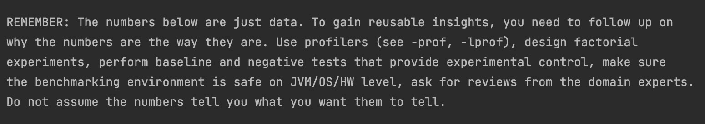

分析器的描述及其使用方法可以在`openjdk`项目中找到（[`hg.openjdk.java.net/code-tools/jmh/file/tip/jmh-samples/src/main/java/org/openjdk/jmh/samples`](http://hg.openjdk.java.net/code-tools/jmh/file/tip/jmh-samples/src/main/java/org/openjdk/jmh/samples)）。在相同的样本中，您将遇到 JMH 基于注解生成的代码的描述。

如果您想深入了解代码执行和测试的细节，没有比研究生成的代码更好的方法了。它描述了 JMH 为了运行请求的基准测试所采取的所有步骤和决策。您可以在`target/generated-sources/annotations`中找到生成的代码。

由于本书的范围不允许过多地详细介绍如何阅读，但它并不困难，尤其是如果您从仅测试一个方法的简单案例开始。我们希望您在这项努力中一切顺利。

# 摘要

在本章中，您学习了 JMH 工具，并能够将其用于您的应用程序。您学习了如何创建和运行基准测试，如何设置基准测试参数，以及如果需要如何安装 IDE 插件。我们还提供了实际的建议和进一步阅读的参考。

现在您不仅可以测量应用程序的平均执行时间和其他性能值（例如吞吐量），还可以以受控的方式进行测量——无论是带有还是不带 JVM 优化、预热运行等。

在下一章中，您将学习设计和编写应用程序代码的有用实践。我们将讨论 Java 惯用语的实现和使用，并提供实现`equals()`、`hashCode()`、`compareTo()`和`clone()`方法的建议。我们还将讨论`StringBuffer`和`StringBuilder`类使用上的区别，如何捕获异常，最佳设计实践以及其他经过验证的编程实践。

# 测验

1.  选择所有正确的陈述：

    1.  由于 JMH 在非生产环境中运行方法，因此它毫无用处。

    1.  JMH 能够绕过一些 JVM 优化。

    1.  JMH 不仅可以测量平均性能时间，还可以测量其他性能特征。

    1.  JMH 也可以用来测量小型应用程序的性能。

1.  列出开始使用 JMH 的两个必要步骤。

1.  列出四种运行 JMH 的方式。

1.  列出两种可以使用（测量）JMH 的模式（性能特征）。

1.  列出两种可以用来表示 JMH 测试结果的时间单位。

1.  如何在 JMH 基准测试之间共享数据（结果、状态）？

1.  如何告诉 JMH 为具有枚举值列表的参数运行基准测试？

1.  如何强制或关闭方法的编译？

1.  如何关闭 JVM 的常量折叠优化？

1.  如何以编程方式提供 Java 命令选项以运行特定的基准测试？
