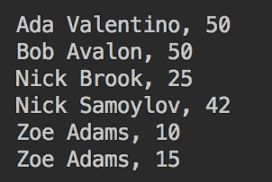
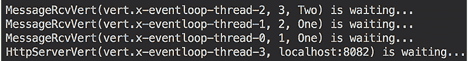
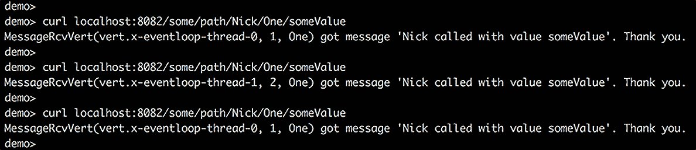
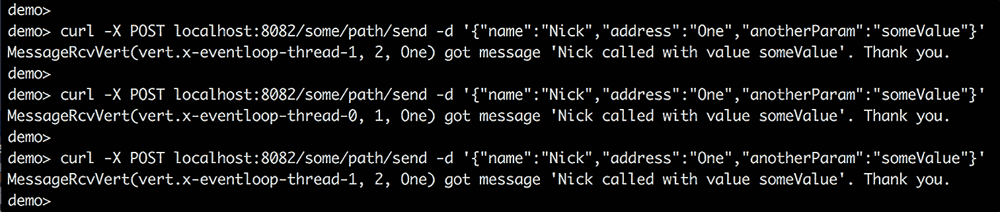
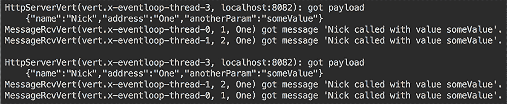

# *第十七章*：编写高质量代码的最佳实践

当程序员之间交流时，他们经常使用非程序员无法理解或不同编程语言程序员模糊理解的术语。但使用相同编程语言的人可以很好地理解彼此。有时，这也可能取决于程序员的了解程度。新手可能无法理解经验丰富的程序员在谈论什么，而经验丰富的同事则会点头并相应地回应。本章旨在填补这一差距，提高不同水平程序员之间的理解。在本章中，我们将讨论一些 Java 编程术语——描述某些特性、功能、设计解决方案等的 Java 习惯用法。你还将了解设计和编写应用程序代码最流行和最有用的实践。

本章将涵盖以下主题：

+   Java 习惯用法、它们的实现和它们的用法

+   `equals()`, `hashCode()`, `compareTo()`, 和 `clone()` 方法

+   `StringBuffer` 和 `StringBuilder` 类

+   `try`、`catch` 和 `finally` 子句

+   最佳设计实践

+   编写的代码是为了给人看

+   使用经过良好建立的框架和库

+   测试是通往高质量代码的最短路径

到本章结束时，你将深刻理解其他 Java 程序员在讨论他们的设计决策和使用的功能时所谈论的内容。

# 技术要求

要执行本章提供的代码示例，你需要以下内容：

+   拥有 Microsoft Windows、Apple macOS 或 Linux 的计算机

+   Java SE 版本 17 或更高版本

+   你选择的 IDE 或代码编辑器

如何设置 Java SE 和 IntelliJ IDEA 编辑器的说明已在 *第一章**,* *开始使用 Java 17* 中提供。本章的代码示例文件可在 GitHub 上找到，网址为 [`github.com/PacktPublishing/Learn-Java-17-Programming.git`](https://github.com/PacktPublishing/Learn-Java-17-Programming.git)，位于 examples/src/main/java/com/packt/learnjava/ch17_bestpractices 文件夹以及 `spring` 和 `reactive` 文件夹中。

# Java 习惯用法、它们的实现和它们的用法

除了作为专业人士之间交流的手段外，编程习惯用法也是经过证明的编程解决方案和常见实践，这些解决方案并非直接来自语言规范，而是源于编程经验。在本节中，我们将讨论最常用的那些。你可以在官方 Java 文档中找到并研究完整的习惯用法列表（[`docs.oracle.com/javase/tutorial`](https://docs.oracle.com/javase/tutorial)）。

## `equals()` 和 `hashCode()` 方法

`java.lang.Object` 类中 `equals()` 和 `hashCode()` 方法的默认实现如下：

```java
public boolean equals(Object obj) {
```

```java
    return (this == obj);
```

```java
}
```

```java
/**
```

```java
* Whenever it is invoked on the same object more than once during
```

```java
* an execution of a Java application, the hashCode method
```

```java
* must consistently return the same integer...
```

```java
* As far as is reasonably practical, the hashCode method defined
```

```java
* by class Object returns distinct integers for distinct objects.
```

```java
*/
```

```java
@HotSpotIntrinsicCandidate
```

```java
public native int hashCode();
```

如您所见，`equals()`方法的默认实现仅比较指向存储对象地址的内存引用。同样，正如您从注释（从源代码中引用）中看到的那样，`hashCode()`方法为相同的对象返回相同的整数，而为不同的对象返回不同的整数。让我们使用`Person`类来演示这一点：

```java
public class Person {
```

```java
  private int age;
```

```java
  private String firstName, lastName;
```

```java
  public Person(int age, String firstName, String lastName){
```

```java
      this.age = age;
```

```java
      this.lastName = lastName;
```

```java
      this.firstName = firstName;
```

```java
  }
```

```java
  public int getAge() { return age; }
```

```java
  public String getFirstName() { return firstName; }
```

```java
  public String getLastName() { return lastName; }
```

```java
}
```

下面是一个默认的`equals()`和`hashCode()`方法行为的例子：

```java
Person person1 = new Person(42, "Nick", "Samoylov");
```

```java
Person person2 = person1;
```

```java
Person person3 = new Person(42, "Nick", "Samoylov");
```

```java
System.out.println(person1.equals(person2)); //prints: true
```

```java
System.out.println(person1.equals(person3)); //prints: false
```

```java
System.out.println(person1.hashCode());
```

```java
                                            //prints: 777874839
```

```java
System.out.println(person2.hashCode());
```

```java
                                            //prints: 777874839
```

```java
System.out.println(person3.hashCode());
```

```java
                                            //prints: 596512129
```

您的系统中的输出可能会有所不同。

`person1`和`person2`引用及其哈希码相等，因为它们指向同一个对象（相同的内存区域和相同的地址），而`person3`引用指向另一个对象。

然而，在实践中，正如我们在*第六章*，*数据结构、泛型和常用工具*中所描述的，我们希望对象的相等性基于对象的所有属性或某些属性值。因此，下面是`equals()`和`hashCode()`方法的典型实现：

```java
@Override
```

```java
public boolean equals(Object o) {
```

```java
    if (this == o) return true;
```

```java
    if (o == null) return false;
```

```java
    if(!(o instanceof Person)) return false;
```

```java
    Person person = (Person)o;
```

```java
    return getAge() == person.getAge() &&
```

```java
       Objects.equals(getFirstName(), person.getFirstName()) &&
```

```java
           Objects.equals(getLastName(), person.getLastName());
```

```java
}
```

```java
@Override
```

```java
public int hashCode() {
```

```java
  return Objects.hash(getAge(), getFirstName(), getLastName());
```

```java
}
```

过去这更为复杂，但使用`java.util.Objects`实用工具使得它变得容易得多，尤其是如果您注意到`Objects.equals()`方法也处理`null`。

在这里，我们已经将描述的`equals()`和`hashCode()`方法的实现添加到`Person1`类中，并执行了相同的比较：

```java
Person1 person1 = new Person1(42, "Nick", "Samoylov");
```

```java
Person1 person2 = person1;
```

```java
Person1 person3 = new Person1(42, "Nick", "Samoylov");
```

```java
System.out.println(person1.equals(person2)); //prints: true
```

```java
System.out.println(person1.equals(person3)); //prints: true
```

```java
System.out.println(person1.hashCode());
```

```java
                                           //prints: 2115012528
```

```java
System.out.println(person2.hashCode());
```

```java
                                           //prints: 2115012528
```

```java
System.out.println(person3.hashCode());
```

```java
                                           //prints: 2115012528
```

如您所见，我们所做的更改不仅使相同的对象相等，而且使具有相同属性值的两个不同对象也相等。此外，哈希码值现在也基于相同的属性值。

在*第六章*，*数据结构、泛型和常用工具*中，我们解释了为什么在实现`equals()`方法的同时实现`hashCode()`方法很重要。

在`equals()`方法中建立相等性和在`hashCode()`方法中进行哈希计算时必须使用相同的一组属性。

在这些方法前加上`@Override`注解可以确保它们覆盖了`Object`类中的默认实现。否则，方法名称中的错误可能会造成一种假象，即新实现正在被使用，而实际上并没有。调试此类情况比仅仅添加`@Override`注解要困难得多，而且成本也更高，因为如果方法没有覆盖任何内容，`@Override`注解会生成一个错误。

## `compareTo()`方法

在*第六章*，*数据结构、泛型和常用工具*中，我们广泛使用了`compareTo()`方法（`Comparable`接口的唯一方法），并指出基于此方法（集合元素的实现）建立的组织顺序被称为**自然顺序**。

为了演示这一点，我们创建了`Person2`类：

```java
  public class Person2 implements Comparable<Person2> {
```

```java
    private int age;
```

```java
    private String firstName, lastName;
```

```java
    public Person2(int age, String firstName, String lastName)
```

```java
    {
```

```java
        this.age = age;
```

```java
        this.lastName = lastName;
```

```java
        this.firstName = firstName;
```

```java
    }
```

```java
    public int getAge() { return age; }
```

```java
    public String getFirstName() { return firstName; }
```

```java
    public String getLastName() { return lastName; }
```

```java
    @Override
```

```java
    public int compareTo(Person2 p) {
```

```java
        int result = Objects.compare(getFirstName(), 
```

```java
                  p.getFirstName(), Comparator.naturalOrder());
```

```java
        if (result != 0) {
```

```java
            return result;
```

```java
        }
```

```java
        result = Objects.compare(getLastName(), 
```

```java
                   p.getLastName(), Comparator.naturalOrder());
```

```java
        if (result != 0) {
```

```java
            return result;
```

```java
        }
```

```java
        return Objects.compare(age, p.getAge(), 
```

```java
                                    Comparator.naturalOrder());
```

```java
    }
```

```java
    @Override
```

```java
    public String toString() {
```

```java
        return firstName + " " + lastName + ", " + age;
```

```java
    }
```

```java
  }
```

然后，我们组成了一列`Person2`对象并对其进行排序：

```java
Person2 p1 = new Person2(15, "Zoe", "Adams");
```

```java
Person2 p2 = new Person2(25, "Nick", "Brook");
```

```java
Person2 p3 = new Person2(42, "Nick", "Samoylov");
```

```java
Person2 p4 = new Person2(50, "Ada", "Valentino");
```

```java
Person2 p6 = new Person2(50, "Bob", "Avalon");
```

```java
Person2 p5 = new Person2(10, "Zoe", "Adams");
```

```java
List<Person2> list = 
```

```java
       new ArrayList<>(List.of(p5, p2, p6, p1, p4, p3));
```

```java
Collections.sort(list);
```

```java
list.stream().forEach(System.out::println); 
```

结果如下所示：



有三件事值得注意：

+   根据 `Comparable` 接口，`compareTo()` 方法必须返回一个负整数、零或正整数，如果对象小于、等于或大于另一个对象。在我们的实现中，如果两个对象的相同属性值不同，我们立即返回结果。我们已经知道，无论其他属性如何，这个对象是 *更大* 或 *更小* 的。但是，比较两个对象属性顺序的顺序会影响最终结果。它定义了属性值影响顺序的优先级。

+   我们将 `List.of()` 的结果放入了一个 `new ArrayList()` 对象中。我们这样做是因为，如我们已在 *第六章* 中提到的，*数据结构、泛型和常用工具*，由 `of()` 工厂方法创建的集合是不可修改的。无法向其中添加或删除元素，也无法更改元素的顺序，而我们需要对创建的集合进行排序。我们只使用 `of()` 方法，因为它更方便，提供了更短的表示法。

+   最后，使用 `java.util.Objects` 来比较属性，使得实现比自定义编码更容易、更可靠。

在实现 `compareTo()` 方法时，重要的是要确保以下规则不被违反：

+   `obj1.compareTo(obj2)` 返回与 `obj2.compareTo(obj1)` 相同的值，但只有当返回值是 `0` 时。

+   如果返回值不是 `0`，则 `obj1.compareTo(obj2)` 的符号与 `obj2.compareTo(obj1)` 相反。

+   如果 `obj1.compareTo(obj2) > 0` 且 `obj2.compareTo(obj3) > 0`，那么 `obj1.compareTo(obj3) > 0`。

+   如果 `obj1.compareTo(obj2) < 0` 且 `obj2.compareTo(obj3) < 0`，那么 `obj1.compareTo(obj3) < 0`。

+   如果 `obj1.compareTo(obj2) == 0`，那么 `obj2.compareTo(obj3)` 和 `obj1.compareTo(obj3)` 具有相同的符号。

+   `obj1.compareTo(obj2)` 和 `obj2.compareTo(obj1)` 如果抛出异常，则抛出相同的异常。

此外，建议（但不总是必需）如果 `obj1.equals(obj2)`，则 `obj1.compareTo(obj2) == 0`，并且同时，如果 `obj1.compareTo(obj2) == 0`，则 `obj1.equals(obj2)`。

## `clone()` 方法

`java.lang.Object` 类中 `clone()` 方法的实现如下：

```java
@HotSpotIntrinsicCandidate
```

```java
protected native Object clone() throws CloneNotSupportedException;
```

前面代码中显示的注释说明了以下内容：

```java
/**
```

```java
 * Creates and returns a copy of this object.  The precise 
```

```java
 * meaning of "copy" may depend on the class of the object.
```

```java
 ***/
```

此方法的默认结果返回对象字段的副本，如果值是原始类型，则这是可以接受的。然而，如果一个对象属性持有对另一个对象的引用，则只会复制引用本身，而不是被引用的对象。这就是为什么这样的复制被称为 `clone()` 方法，并克隆每个引用对象的属性。

无论如何，为了能够克隆一个对象，它必须实现`Cloneable`接口，并确保继承树上的所有对象（以及是对象的属性）也实现`Cloneable`接口（除了`java.lang.Object`类）。`Cloneable`接口只是一个标记接口，它告诉编译器程序员已经做出了有意识的决策，允许这个对象被克隆（无论是由于浅拷贝足够好，还是因为重写了`clone()`方法）。尝试在未实现`Cloneable`接口的对象上调用`clone()`将导致`CloneNotSupportedException`。

它看起来已经很复杂了，但在实践中，还有更多的陷阱。例如，假设`Person`类有一个`address`属性，其类型为`Address`。`Person`对象`p1`的浅拷贝`p2`将引用相同的`Address`对象，因此`p1.address == p2.address`。以下是一个例子。`Address`类如下所示：

```java
  class Address {
```

```java
    private String street, city;
```

```java
    public Address(String street, String city) {
```

```java
        this.street = street;
```

```java
        this.city = city;
```

```java
    }
```

```java
    public void setStreet(String street){ 
```

```java
                                        this.street = street; }
```

```java
    public String getStreet() { return street; }
```

```java
    public String getCity() { return city; }
```

```java
  }
```

`Person3`类是这样使用的：

```java
  class Person3 implements Cloneable{
```

```java
    private int age;
```

```java
    private Address address;
```

```java
    private String firstName, lastName;
```

```java
    public Person3(int age, String firstName, 
```

```java
                            String lastName, Address address) {
```

```java
        this.age = age;
```

```java
        this.address = address;
```

```java
        this.lastName = lastName;
```

```java
        this.firstName = firstName;
```

```java
    }
```

```java
    public int getAge() { return age; }
```

```java
    public Address getAddress() { return address; }
```

```java
    public String getLastName() { return lastName; }
```

```java
    public String getFirstName() { return firstName; }
```

```java
    @Override
```

```java
    public Person3 clone() throws CloneNotSupportedException{
```

```java
        return (Person3) super.clone();
```

```java
    }
```

```java
  }
```

注意，`clone()`方法执行的是浅拷贝，因为它没有克隆`address`属性。以下是使用这种`clone()`方法实现的示例：

```java
Person3 p1 = new Person3(42, "Nick", "Samoylov",
```

```java
                      new Address("25 Main Street", "Denver"));
```

```java
Person3 p2 = p1.clone();
```

```java
System.out.println(p1.getAge() == p2.getAge());
```

```java
                                                        // true
```

```java
System.out.println(p1.getLastName() == p2.getLastName()); 
```

```java
                                                        // true
```

```java
System.out.println(p1.getLastName().equals(p2.getLastName())); 
```

```java
                                                        // true
```

```java
System.out.println(p1.getAddress() == p2.getAddress());   
```

```java
                                                        // true
```

```java
System.out.println(p2.getAddress().getStreet());  
```

```java
                                       //prints: 25 Main Street
```

```java
p1.getAddress().setStreet("42 Dead End");
```

```java
System.out.println(p2.getAddress().getStreet());  
```

```java
                                          //prints: 42 Dead End
```

如您所见，在克隆完成后，对源对象`address`属性的更改反映在克隆对象的相同属性中。这并不直观，对吧？在克隆过程中，我们期望得到一个独立的副本，不是吗？

为了避免共享`Address`对象，您还必须显式地克隆它。为此，您必须使`Address`对象可克隆，如下所示：

```java
  public class Address implements Cloneable{
```

```java
    private String street, city;
```

```java
    public Address(String street, String city) {
```

```java
        this.street = street;
```

```java
        this.city = city;
```

```java
    }
```

```java
    public void setStreet(String street){ 
```

```java
                                        this.street = street; }
```

```java
    public String getStreet() { return street; }
```

```java
    public String getCity() { return city; }
```

```java
    @Override
```

```java
    public Address clone() throws CloneNotSupportedException {
```

```java
        return (Address)super.clone();
```

```java
    }
```

```java
  }
```

在实现到位后，我们现在可以为克隆添加`address`属性：

```java
  class Person4 implements Cloneable{
```

```java
    private int age;
```

```java
    private Address address;
```

```java
    private String firstName, lastName;
```

```java
    public Person4(int age, String firstName, 
```

```java
                            String lastName, Address address) {
```

```java
        this.age = age;
```

```java
        this.address = address;
```

```java
        this.lastName = lastName;
```

```java
        this.firstName = firstName;
```

```java
    }
```

```java
    public int getAge() { return age; }
```

```java
    public Address getAddress() { return address; }
```

```java
    public String getLastName() { return lastName; }
```

```java
    public String getFirstName() { return firstName; }
```

```java
    @Override
```

```java
    public Person4 clone() throws CloneNotSupportedException{
```

```java
        Person4 cl = (Person4) super.clone();
```

```java
        cl.address = this.address.clone();
```

```java
        return cl;
```

```java
    }
```

```java
  }
```

现在，如果我们运行相同的测试，结果将是我们最初预期的：

```java
Person4 p1 = new Person4(42, "Nick", "Samoylov",
```

```java
                      new Address("25 Main Street", "Denver"));
```

```java
Person4 p2 = p1.clone();
```

```java
System.out.println(p1.getAge() == p2.getAge());         // true
```

```java
System.out.println(p1.getLastName() == p2.getLastName()); 
```

```java
                                                        // true
```

```java
System.out.println(p1.getLastName().equals(p2.getLastName())); 
```

```java
                                                        // true
```

```java
System.out.println(p1.getAddress() == p2.getAddress());  
```

```java
                                                       // false
```

```java
System.out.println(p2.getAddress().getStreet()); 
```

```java
                                       //prints: 25 Main Street
```

```java
p1.getAddress().setStreet("42 Dead End");
```

```java
System.out.println(p2.getAddress().getStreet()); 
```

```java
                                       //prints: 25 Main Street
```

因此，如果应用程序期望所有属性都进行深度复制，所有相关的对象都必须是可克隆的。只要相关的对象（无论是当前对象的属性还是父类及其属性和父类）在没有使它们可克隆的情况下不获取新的对象属性，并且在容器对象的`clone()`方法中显式克隆，那就没问题。这个最后的陈述很复杂。其复杂性的原因在于克隆过程的底层复杂性。这就是为什么程序员常常避免使对象可克隆。

相反，他们更倾向于在必要时手动克隆对象，如下面的代码所示：

```java
Person4 p1 = new Person4(42, "Nick", "Samoylov",
```

```java
                      new Address("25 Main Street", "Denver"));
```

```java
Address address = new Address(p1.getAddress().getStreet(), 
```

```java
                                    p1.getAddress().getCity());
```

```java
Person4 p2 = new Person4(p1.getAge(), p1.getFirstName(), 
```

```java
                                    p1.getLastName(), address);
```

```java
System.out.println(p1.getAge() == p2.getAge());
```

```java
                                                        // true
```

```java
System.out.println(p1.getLastName() == p2.getLastName()); 
```

```java
                                                        // true
```

```java
System.out.println(p1.getLastName().equals(p2.getLastName())); 
```

```java
                                                        // true
```

```java
System.out.println(p1.getAddress() == p2.getAddress());// false
```

```java
System.out.println(p2.getAddress().getStreet()); 
```

```java
                                       //prints: 25 Main Street
```

```java
p1.getAddress().setStreet("42 Dead End");
```

```java
System.out.println(p2.getAddress().getStreet()); 
```

```java
                                       //prints: 25 Main Street
```

这种方法仍然需要在任何相关对象中添加其他属性时进行代码更改。然而，它提供了对结果更多的控制，并且不太可能出现意外的后果。

幸运的是，`clone()`方法并不常用。您可能永远不会遇到需要使用它的需求。

## `StringBuffer`和`StringBuilder`类

我们在*第六章*，“数据结构、泛型和常用工具”中讨论了`StringBuffer`和`StringBuilder`类的区别。我们在这里不再重复。相反，我们只想提到，在单线程过程中（这是大多数情况），`StringBuilder`类是首选，因为它更快。

## try、catch 和 finally 子句

*第四章*，“异常处理”专门讨论了使用`try`、`catch`和`finally`子句，所以我们在这里不再重复。我们想重申，使用`try-with-resources`语句是释放资源（传统上在`finally`块中完成）的首选方式。推迟库使代码更简单、更可靠。

# 最佳设计实践

术语*最佳*通常是主观的和情境依赖的。这就是为什么我们想透露，以下建议是基于主流编程中绝大多数情况。然而，它们不应该盲目和无条件地遵循，因为有些情况下，这些实践中的某些，在某些情境下，可能是无用的，甚至是错误的。在遵循它们之前，试着理解它们背后的动机，并将其用作你决策的指南。例如，大小很重要。如果应用程序不会增长到几千行代码，一个简单的单体，具有清单式代码就足够了。但如果存在复杂的代码块，并且有几个人在处理它，将代码分解成专门的片段将有利于代码理解、维护，甚至如果某个特定的代码区域需要比其他区域更多的资源，还有助于扩展。

我们将无特定顺序地从更高层次的设计决策开始。

## 识别松散耦合的功能区域

这些设计决策可以在非常早期就做出，仅基于对未来系统主要部分的总体理解，它们的功能，以及它们产生和交换的数据。这样做有几个好处：

+   你可以识别未来系统的结构，这对后续的设计步骤和实施有影响

+   你可以专门分析和深入研究部分

+   你可以并行开发部分

+   你可以更好地理解数据流

## 将功能区域分解为传统的层级

在每个功能区域就位后，可以根据技术方面和技术使用专门化。传统的技术专门化分离如下：

+   前端（用户图形或网络界面）

+   具有广泛业务逻辑的中层

+   后端（数据存储或数据源）

做这件事的好处包括以下内容：

+   你可以按层级部署和扩展

+   你可以根据你的专业知识获得程序员的专业化

+   你可以并行开发部分

## 面向接口编码

根据前两个小节中描述的决策，必须在一个隐藏实现细节的接口中描述专门的部分。这种设计的优势在于**面向对象编程**（**OOP**）的基础，这在*第二章*《Java 面向对象编程（OOP）》中已经详细描述，所以我们在这里不再重复。

## 使用工厂

我们在*第二章*《Java 面向对象编程（OOP）》中也讨论了这一点。根据定义，接口不能也不能描述实现该接口的类的构造函数。使用工厂允许你关闭这个差距，并向客户端暴露一个接口。

## 优先使用组合而非继承

最初，OOP 侧重于继承作为在对象之间共享公共功能的方法。继承甚至是我们描述在*第二章*《Java 面向对象编程（OOP）》中的四个 OOP 原则之一。然而，在实践中，这种功能共享方法在同一个继承线上的类之间产生了过多的依赖。应用程序功能的演变往往是不可预测的，继承链中的某些类开始获得与类链原始目的无关的功能。我们可以争论，有一些设计解决方案可以让我们不做这样的事情，并保持原始类不变。但是，在实践中，这样的事情经常发生，子类可能会突然改变行为，仅仅是因为它们通过继承获得了新的功能。我们无法选择我们的父母，对吧？此外，这样会破坏封装，这是 OOP 的另一个基础原则。

另一方面，组合允许我们选择和控制使用类的哪些功能以及忽略哪些功能。它还允许对象保持轻量级，不被继承所负担。这种设计更加灵活、可扩展和可预测。

## 使用库

在整本书中，我们提到使用**Java 类库**（**JCL**）和外部（相对于**Java 开发工具包**（**JDK**））的 Java 库可以使编程更加容易，并产生更高质量的代码。*第七章*《Java 标准库和外部库》概述了最流行的 Java 库。创建库的人投入了大量的时间和精力，因此你应该在可能的情况下利用它们。

在*第十三章*《函数式编程》中，我们描述了位于 JCL 的`java.util.function`包中的标准函数式接口。这是利用库的另一种方式——通过使用其一系列已知和共享的接口，而不是定义自己的接口。

这最后一点很好地过渡到下一个关于编写其他人容易理解的代码的主题。

# 代码是为人类编写的

编程的前几十年需要编写机器命令，以便电子设备能够执行它们。这不仅是一项繁琐且容易出错的任务，而且还需要你以产生最佳性能的方式编写指令。这是因为计算机速度慢，几乎没有进行代码优化。

从那时起，我们在硬件和编程方面都取得了很大的进步。现代编译器在很大程度上使提交的代码尽可能快地运行，即使程序员没有考虑这一点。我们在上一章中通过具体例子讨论了这一点。

这使得程序员可以写出更多的代码行，而不必过多考虑优化。但传统和许多关于编程的书籍仍然要求这样做，一些程序员仍然担心他们的代码性能——甚至比结果更重要。遵循传统比打破传统更容易。这就是为什么程序员往往更关注他们编写代码的方式，而不是他们自动化的业务，尽管实现错误业务逻辑的好代码是无用的。

然而，回到主题。随着现代 JVM 的出现，程序员进行代码优化的需求不像以前那么迫切了。如今，程序员必须主要关注大局，避免导致代码性能不佳的结构性错误，以及多次使用的代码。随着 JVM 变得更加复杂，实时观察代码，并在相同的输入多次调用相同的代码块时仅返回结果（而不执行），后者变得不那么紧迫。

这就让我们得出唯一可能的结论——在编写代码时，你必须确保代码对人类来说易于阅读和理解，而不是对计算机。那些在业界工作了一段时间的人可能会对几年前写的代码感到困惑。你可以通过清晰性和意图的透明度来改进你的代码编写风格。

现在，让我们讨论注释的必要性。我们不需要注释来重复代码的功能，如下面的例子所示：

```java
//Initialize variable
```

```java
int i = 0;
```

解释意图的注释更有价值：

```java
// In case of x > 0, we are looking for a matching group 
```

```java
// because we would like to reuse the data from the account.
```

```java
// If we find the matching group, we either cancel it and 
```

```java
// clone, or add the x value to the group, or bail out.
```

```java
// If we do not find the matching group,
```

```java
// we create a new group using data of the matched group.
```

注释的代码可能非常复杂。好的注释能够解释意图并提供帮助，使我们理解代码。然而，程序员往往懒得写注释。反对写注释的论点通常包括以下两点：

+   注释必须与代码一起维护和更新；否则，它们可能会产生误导。然而，没有任何工具能够提示程序员在更改代码的同时调整注释。因此，注释是有风险的。

+   代码本身必须编写（包括变量和方法名称的选择）以便不需要额外的解释。

这两个陈述都是正确的，但事实也是，注释可以非常有帮助，尤其是那些捕捉意图的注释。此外，这样的注释通常需要更少的调整，因为代码意图不经常改变，甚至从不改变。

# 使用成熟的框架和库

程序员并不总是有机会选择框架和库来开发软件。通常，公司更愿意继续使用他们已经用于其他项目的软件和开发工具集。但是，当您有机会选择时，可用的产品种类可能会让人感到不知所措。选择编程社区中最新流行的产品也可能很有吸引力。然而，经验一次又一次地证明，最佳的行动方案是选择一些成熟且经过证明的生产级产品。此外，使用历史悠久且稳固的软件通常需要编写更少的样板代码。

为了说明这一点，我们创建了两个项目：

+   使用 Spring Boot 框架

+   使用 **Vert.x** 工具包

我们从 Spring Boot 开始。它是一个开源的基于 Java 的框架，由 Pivotal 团队开发，用于构建独立的生产级应用程序。默认情况下，它不需要外部 web 服务器，因为它内置了一个 web 服务器（Tomcat 或 Netty）。因此，Spring Boot 用户不需要编写任何非业务代码。您甚至不需要创建配置，就像在 Spring 中那样。您只需定义您需要的非业务功能（例如健康检查、指标或 Swagger 文档等）使用属性文件，并通过注解进行调整。

自然地，因为幕后有如此多的实现，Spring Boot 非常具有意见。但您很难找到一个不能用来生成稳固高效应用程序的案例。最有可能的是，Spring Boot 的限制将在大型项目中显现出来。使用 Spring Boot 的最佳方法就是接受它的做事方式，因为这样做您可以节省大量时间，并获得一个健壮且经过优化的解决方案。

为了简化依赖管理，Spring Boot 提供了所谓的 `starter` JAR 文件中每个类型应用程序所需的第三方依赖项。例如，spring-boot-starter-web 将所有必要的库引入到项目中，用于 Spring MVC（模型-视图-控制器）和 Tomcat web 服务器。基于所选的 `starter` 包，Spring Boot 自动配置应用程序。

您可以在 [`spring.io/projects/spring-boot`](https://spring.io/projects/spring-boot) 找到针对所有级别程序员的全面且编写良好的信息——从初学者到经验丰富的专业人士。如果您计划在工作中使用 Spring Boot，我们鼓励您阅读它。

为了展示 Spring Boot 的功能和优势，我们在 `spring` 文件夹中创建了一个项目。要运行此示例应用程序，您需要运行此书第 *10* 章，*在数据库中管理数据* 中创建的数据库。该示例应用程序管理（创建、读取、更新、删除）数据库中的人员记录。此功能可以通过用户界面（HTML 页面）访问，面向人类。此外，我们还实现了通过 RESTful 服务访问相同功能，这些服务可以被其他应用程序使用。

您可以通过执行 `Application` 类从 IDE 运行应用程序。或者，您可以从命令行启动应用程序。在 `spring` 文件夹中有两个命令文件：`mvnw`（用于 Unix/Linux/Mac 系统）和 `mvnw.cmd`（用于 Windows）。它们可以用来启动应用程序，如下所示：

+   对于 Unix/Linux/Mac 系统：

    ```java
    ./mvnw spring-boot:run 
    ```

+   对于 Windows：

    ```java
    .\mvnw.cmd spring-boot:run 
    ```

当您第一次这样做时，可能会出错：

```java
java.lang.ClassNotFoundException: org.apache.maven.wrapper.MavenWrapperMain 
```

如果发生这种情况，请通过执行以下命令安装 Maven 包装器：

```java
mvn -N io.takari:maven:wrapper 
```

或者，您也可以构建可执行的 `.jar` 文件：

+   对于 Unix/Linux/Mac 系统：

    ```java
    ./mvnw clean package 
    ```

+   对于 Windows：

    ```java
    .\mvnw.cmd clean package 
    ```

然后，您可以将创建的 `.jar` 文件放在任何已安装 Java 17 的计算机上并运行它，使用以下命令：

```java
java -jar target/spring-0.0.1-SNAPSHOT.jar 
```

应用程序运行后，执行以下命令：

```java
curl –XPOST localhost:8083/ws/new                  \ 
       -H 'Content-Type: application/json'         \ 
       -d '{"dob":"2002-08-14",                    \ 
            "firstName":"Mike","lastName":"Brown"}' 
```

`curl` 命令需要应用程序创建一个新的个人记录。预期的响应如下（每次运行此命令时 `id` 值都会不同）：

```java
  Person{id=42, dob=2002-08-14, firstName='Mike', 
                        lastName='Brown'} successfully updated. 
```

要查看响应中的 HTTP 状态码，请将选项 `-v` 添加到命令中。HTTP 状态码 200 表示请求处理成功。

现在让我们执行 `update` 命令：

```java
curl –XPUT localhost:8083/ws/update              \ 
   -H 'Content-Type: application/json'           \ 
   -d '{"id":42,"dob":"2002-08-14",              \ 
            "firstName":"Nick","lastName":"Brown"}' 
```

应用程序会以以下方式响应此命令：

```java
  Person{id=42, dob=2002-08-14, firstName='Nick', 
```

```java
                        lastName='Brown'} successfully updated. 
```

注意，不是所有字段都必须在有效负载中填充。只需要 `id` 值，并且必须与现有记录之一匹配。应用程序通过提供的 `id` 值检索当前的 `Person` 记录，并仅更新提供的属性。

`delete` 端点构建方式类似。区别在于数据（`Person` 记录身份号码 `id`）作为 URL 的一部分传递。现在让我们执行以下命令：

```java

curl localhost:8083/ws/delete/1 

```

应用程序会以以下消息响应此命令：

```java
  Person{id=42, dob=2002-08-14, firstName='Nick', 
```

```java
                        lastName='Brown'} successfully deleted. 
```

可以使用以下命令检索所有现有记录的列表：

```java
curl localhost:8083/ws/list 
```

所有的先前功能都可以通过用户界面访问。在浏览器中输入 URL `http://localhost:8083/ui/list` 并点击相应的链接。

您也可以在浏览器 URL 中输入 `http://localhost:8083` 并访问以下页面：


然后，再次点击任何可用的链接。`Home` 页面展示了当前应用程序版本及其健康状况。`http://localhost:8083/swagger-ui.html` URL 会显示所有应用程序端点列表。

我们强烈建议你研究应用程序代码并阅读[`spring.io/projects/spring-boot`](https://spring.io/projects/spring-boot)网站上的 Spring Boot 文档。

现在，让我们查看`reactive`文件夹中的项目。它展示了使用 Vert.x 的响应式通信方法，Vert.x 是一个事件驱动的非阻塞轻量级多语言工具包。它允许你使用 Java、JavaScript、Groovy、Ruby、Scala、Kotlin 和 Ceylon 编写组件。它支持异步编程模型和分布式事件总线，该总线延伸到 JavaScript 浏览器，从而允许创建实时 Web 应用程序。然而，由于本书的焦点，我们将只使用 Java。

为了展示如果使用**Vert**.x 工具包实现微服务响应式系统可能看起来是什么样子，我们创建了一个可以接受基于 REST 的请求到系统的 HTTP 服务器，向另一个*verticle*（**Vert**.x 工具包中的基本处理单元，可以被部署）发送基于 EventBus 的消息，接收回复，并将响应发送回原始请求。

我们创建了两个 verticles：

+   `HttpServerVert`，它作为一个服务器并接收 HTTP 消息，然后将这些消息通过 EventBus（一个轻量级的分布式消息系统）发送到特定的地址

+   `MessageRcvVert`，它监听特定的事件总线地址上的消息

现在，我们可以按照以下方式部署它们：

```java
public class ReactiveSystemDemo { 
```

```java
   public static void main(String... args) { 
```

```java
     Vertx vertx = Vertx.vertx(); 
```

```java
     RxHelper.deployVerticle(vertx,  
```

```java
                    new MessageRcvVert("1", "One")); 
```

```java
     RxHelper.deployVerticle(vertx,  
```

```java
                    new MessageRcvVert("2", "One")); 
```

```java
     RxHelper.deployVerticle(vertx,  
```

```java
                    new MessageRcvVert("3", "Two")); 
```

```java
     RxHelper.deployVerticle(vertx, 
```

```java
                    new HttpServerVert(8082)); 
```

```java
   } 
```

```java
 } 
```

要执行此代码，运行`ReactiveSystemDemo`类。预期的结果是如下所示：



让我们现在开始向我们的系统发送 HTTP 请求。首先，让我们发送三次相同的 HTTP `GET`请求：



如果有多个 verticles 注册了相同的地址（正如我们的情况：我们注册了两个具有相同`One`地址的 verticles），系统将使用轮询算法选择应该接收下一个消息的 verticle。

第一次请求发送到了`ID="1"`的接收者，第二次请求发送到了`ID="2"`的接收者，第三次请求又发送到了`ID="1"`的接收者。

使用 HTTP `POST`请求对`/some/path/send`路径，我们得到相同的结果：



再次，消息的接收者使用轮询算法进行轮换。现在，让我们向我们的系统发布两次消息。

由于接收者的回复不能传播回系统用户，我们需要查看后端记录的消息：



正如你所见，`publish()`方法将消息发送到注册到指定地址的所有 verticles。请注意，具有`ID="3"`（在`Two`地址上注册）的 verticle 从未收到任何消息。

在我们结束这个反应式系统演示之前，值得提一下，**Vert.x**工具包允许你轻松地集群 verticles。你可以在[`vertx.io/docs/vertx-core/java`](https://vertx.io/docs/vertx-core/java)的**Vert.x**文档中了解更多关于这个功能的信息。

这两个例子展示了如果你使用一个成熟的框架，创建一个完整的网络应用所需的代码量是多么少。这并不意味着你不能探索最新和最好的框架。无论如何，你应该这样做，以跟上你所在行业的进步。只需记住，一个新产品要成熟并变得足够可靠和有用，以创建一个强大的生产级软件解决方案，需要一些时间。

# 测试是通往高质量代码的捷径

我们将要讨论的最后一条最佳实践是这一声明：*测试不是额外的负担；它是程序员成功的指南*。唯一的问题是何时编写测试。

有一个强有力的论点要求在编写任何代码行之前编写测试。如果你能这样做，那很好。我们不会试图说服你放弃。但如果你不这样做，在你编写了一行或所有分配给你的代码之后，尝试开始编写测试。

在实践中，许多经验丰富的程序员发现，在实现一些新功能之后开始编写测试代码是有帮助的。这是因为这时程序员能更好地理解新代码如何融入现有环境。他们甚至可能尝试硬编码一些值，以查看新代码与调用新方法的代码的集成情况。在确保新代码良好集成后，程序员可以继续实现和调整它，同时测试新实现与调用代码上下文中的要求。

必须添加一个重要条件——在编写测试时，最好由分配任务给你的人或测试员来设置输入数据和测试标准。根据代码产生的结果来设置测试是一个众所周知的程序员陷阱。客观的自我评估并不容易，如果可能的话。

# 摘要

在本章中，我们讨论了主流程序员在日常工作中遇到的 Java 惯用法。我们还讨论了最佳设计实践和相关建议，包括代码编写风格和测试。

你还了解了一些与特定功能、功能性和设计解决方案相关的最流行的 Java 惯用法。这些惯用法通过实际示例进行了演示，你学习了如何将它们融入你的代码和与程序员交流的专业语言。

本章总结了关于 Java 17 及其在编写有效应用程序代码中使用的书籍。如果你已经阅读了全部内容，那么你应该对这个主题有一个很好的概述，并获得了可以立即应用于专业领域的宝贵编程知识和技能。如果你觉得这些材料很有价值，那么让我们知道我们已经实现了我们的目标。感谢阅读。

# 小测验

回答以下问题以测试你对本章知识的了解：

1.  选择所有正确的陈述：

    1.  习语可以用来传达代码的意图。

    1.  习语可以用来解释代码的功能。

    1.  习语可能会被误用，从而模糊谈话的主题。

    1.  为了清晰地表达思想，应避免使用习语。

1.  每次实现`equals()`时是否必须实现`hasCode()`？

1.  如果`obj1.compareTo(obj2)`返回负值，这意味着什么？

1.  深拷贝的概念在克隆原始值时适用吗？

1.  `StringBuffer`和`StringBuilder`哪个更快？

1.  遵循接口编码有哪些好处？

1.  使用组合与继承相比有哪些好处？

1.  使用库与编写自己的代码相比有什么优势？

1.  你的代码的目标受众是谁？

1.  是否需要测试？
