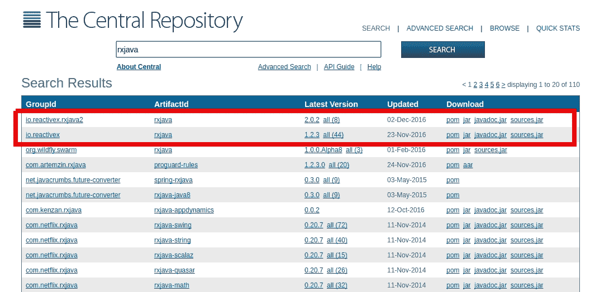
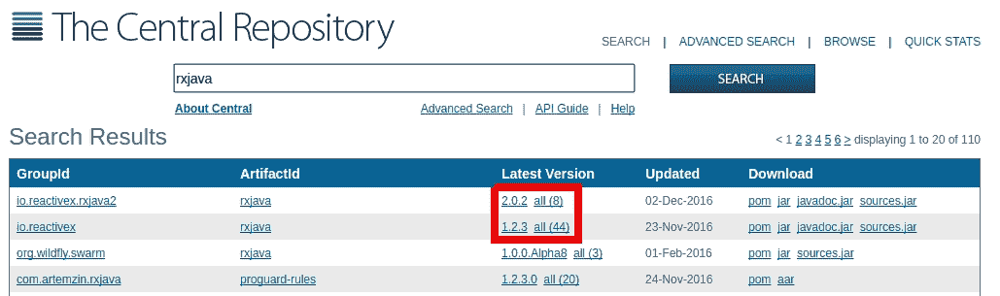
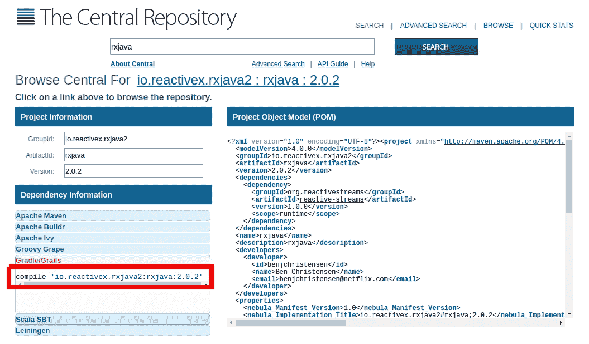
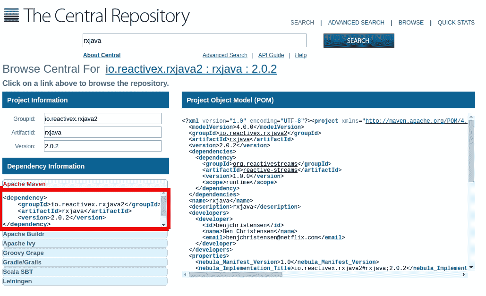

# 反应式思维

假设您对 Java 比较熟悉，并且知道如何使用类、接口、方法、属性、变量、静态/非静态作用域和集合。如果您没有进行过并发或多线程编程，那也无所谓。RxJava 使这些高级主题变得更加容易理解。

准备好您喜欢的 Java 开发环境，无论是 Intellij IDEA、Eclipse、NetBeans 还是您选择的任何其他环境。我将使用 Intellij IDEA，尽管这不应该影响本书中的示例。我建议您还应该有一个构建自动化系统，例如 Gradle 或 Maven，我们很快就会介绍这些。

在我们深入探讨 RxJava 之前，我们首先会介绍一些核心主题：

+   Reactive Extensions 和 RxJava 的简要历史

+   反应式思维

+   利用 RxJava

+   设置您的第一个 RxJava 项目

+   构建您的第一个反应式应用程序

+   RxJava 1.0 和 RxJava 2.0 之间的区别

# ReactiveX 和 RxJava 的简要历史

作为开发者，我们倾向于训练自己以反直觉的方式思考。用代码来模拟我们的世界从未缺乏挑战。面向对象编程被看作是解决这个问题的银弹，不久前还被视为革命性的想法，而类和对象的核心概念至今仍在影响我们的编码方式。然而，业务和用户需求持续增长，复杂性也在增加。随着 2010 年的临近，很明显，面向对象编程只解决了问题的一部分。

类和对象在表示具有属性和方法的对象方面做得很好，但当它们需要以越来越复杂（并且通常是未计划）的方式相互交互时，它们就会变得混乱。解耦模式和范式出现了，但这导致了大量样板代码的副作用。为了应对这些问题，函数式编程开始复兴，不是为了取代面向对象编程，而是为了补充它并填补这个空白。反应式编程，一种函数式事件驱动编程方法，开始受到特别的关注。

最终出现了几个反应式框架，包括 **Akka** 和 **Sodium**。但在微软，一位名叫 Erik Meijer 的计算机科学家创建了一个名为 **Reactive Extensions** 的反应式编程框架。在短短几年内，Reactive Extensions（也称为 **ReactiveX** 或 **Rx**）被移植到包括 JavaScript、Python、C++、Swift 和 Java 在内的多种语言和平台上。ReactiveX 迅速成为跨语言标准，将反应式编程带入行业。

RxJava，Java 的 ReactiveX 端口，主要由 Netflix 的 Ben Christensen 和 David Karnok 创建。RxJava 1.0 于 2014 年 11 月发布，随后在 2016 年 11 月发布了 RxJava 2.0。RxJava 是其他 ReactiveX JVM 端口的支柱，例如**RxScala**、**RxKotlin**和**RxGroovy**。它已成为 Android 开发的核心技术，并且也进入了 Java 后端开发领域。许多 RxJava 适配库，如**RxAndroid** ([`github.com/ReactiveX/RxAndroid`](https://github.com/ReactiveX/RxAndroid))、**RxJava-JDBC** ([`github.com/davidmoten/rxjava-jdbc`](https://github.com/davidmoten/rxjava-jdbc))、**RxNetty** ([`github.com/ReactiveX/RxNetty`](https://github.com/ReactiveX/RxNetty))和**RxJavaFX** ([`github.com/ReactiveX/RxJavaFX`](https://github.com/ReactiveX/RxJavaFX))，将几个 Java 框架适配为响应式，并能够与 RxJava 无缝协作。

所有这些都表明，RxJava 不仅仅是一个库。它是更大的 ReactiveX 生态系统的一部分，代表了整个编程方法。ReactiveX 的基本思想是*事件是数据，数据是事件*。这是一个强大的概念，我们将在本章后面进行探讨，但首先，让我们退后一步，用响应式视角来看待这个世界。

# 响应式思考

暂时放下你对 Java（以及一般编程）的所有已知知识，让我们对我们的世界做一些观察。这些可能听起来像是显而易见的陈述，但作为开发者，我们很容易忽略它们。请注意，一切都在运动。交通、天气、人们、对话、金融交易等等都在移动。技术上，甚至像石头这样静止的东西也因为地球的旋转和轨道而处于运动状态。当你考虑一切都可以被建模为运动的可能性时，你可能会发现这作为开发者来说有点令人不知所措。

另一个值得注意的观察是，这些不同的事件是同时发生的。多个活动在同一时间进行。有时，它们独立行动，但有时，它们可以在某个点上汇聚以进行交互。例如，一辆车在跑步者没有受到影响的情况下行驶。它们是两个独立的事件流。然而，它们可能在某个点上汇聚，当车遇到跑步者时，车会停下来。

如果我们的世界就是这样运作的，为什么我们不以这种方式来建模我们的代码呢？为什么我们不把代码建模为同时发生的多个并发的事件或数据流呢？开发者花费更多时间管理对象的状态，并以命令式和顺序的方式进行操作，这种情况并不少见。你可能将你的代码结构化为执行**过程 1**、**过程 2**，然后是**过程 3**，这依赖于过程 1 和过程 2。为什么不同时启动过程 1 和过程 2，然后这两个事件的完成立即启动过程 3 呢？当然，你可以使用回调和 Java 并发工具，但 RxJava 使这变得更加容易和安全地表达。

让我们做一个最后的观察。一本书或音乐 CD 是静态的。一本书是一系列不变的文字，CD 是一系列曲目。它们没有动态性。然而，当我们读书时，我们是逐个阅读每个单词。这些单词实际上被置于运动中，作为被我们眼睛消费的流。音乐 CD 的曲目也是如此，每个曲目被置于运动中，作为声波，你的耳朵消费每个曲目。静态物品实际上也可以被置于运动中。这是一个抽象但强大的想法，因为我们把每个静态物品变成了一系列事件。当我们通过将数据和事件同等对待来使数据与事件处于同一水平时，我们就释放了函数式编程的力量，并解锁了你以前可能认为不切实际的能力。反应式编程背后的基本思想是**事件是数据，数据是事件**。这可能看起来很抽象，但当你考虑我们的现实世界例子时，实际上并不需要很长时间就能理解。跑步者和汽车都有属性和状态，但它们也在运动中。当它们被消费时，书和 CD 被置于运动中。将事件和数据合并为一个整体，使得代码感觉有机且能代表我们正在建模的世界。

# 我为什么要学习 RxJava？

ReactiveX 和 RxJava 为程序员每天面临的许多问题画了一幅广泛的画，允许你表达业务逻辑，并减少编写代码的时间。你是否曾经为并发、事件处理、过时的数据状态和异常恢复而挣扎过？关于使你的代码更具可维护性、可重用性和可扩展性，以便它能跟上你的业务？称反应式编程为这些问题的**银弹**可能有些自以为是，但它确实是在解决这些问题方面的一个进步飞跃。

用户对使应用程序实时和响应的需求也在不断增长。反应式编程允许你快速分析和处理实时数据源，如 Twitter 流或股价。它还可以取消和重定向工作，与并发性一起扩展，并处理快速发射的数据。将事件和数据作为可以混合、合并、过滤、拆分和转换的流来组合，开辟了极其有效的代码组合和演变方式。

总结来说，反应式编程使得许多困难任务变得简单，使你能够以你之前可能认为不切实际的方式增加价值。如果你有一个编写为反应式的进程，并且发现你需要将其中一部分运行在不同的线程上，你可以在几秒钟内实现这个更改。如果你发现网络连接问题间歇性地使你的应用程序崩溃，你可以优雅地使用等待并重试的反应式恢复策略。如果你需要在进程的中间注入一个操作，这就像插入一个新的操作符一样简单。反应式编程被分解为模块化的链链接，可以添加或删除，这有助于快速克服上述所有问题。本质上，RxJava 允许应用程序在保持生产稳定性同时变得战术性和可演化的。

# 我们在这本书中将学到什么？

如前所述，RxJava 是 Java 的 ReactiveX 端口。在这本书中，我们将主要关注 RxJava 2.0，但我将指出 RxJava 1.0 中的显著差异。我们将优先学习如何以反应式的方式思考并利用 RxJava 的实用功能。从高层次的理解开始，我们将逐渐深入了解 RxJava 的工作原理。在这个过程中，我们将学习关于反应式模式和解决程序员遇到的常见问题的技巧。

在第二章，*可观察者和订阅者*，第三章，*基本操作符*和第四章，*合并可观察者*中，我们将通过`Observable`、`Observer`和`Operator`来介绍 Rx 的核心概念。这三个核心实体构成了 RxJava 应用程序。你将立即开始编写反应式程序，并拥有一个坚实的基础来构建整本书。

第五章，*多播、重放和缓存*以及第六章，*并发和并行化*将探讨 RxJava 的更多细微之处以及如何有效地利用并发。

在第七章，*切换、节流、窗口和缓冲*以及第八章，*可流动性和背压*中，我们将学习如何应对产生数据/事件的速度超过其消费速度的反应式流的不同方法。

最后，第九章 *转换器和自定义操作符*，第十章 *测试和调试*，第十一章 *RxJava 在 Android 上的应用*，以及第十二章 *使用 Kotlin 新特性与 RxJava 结合* 将涉及一些（但很重要）的杂项主题，包括自定义操作符以及如何使用测试框架、Android 和 Kotlin 语言与 RxJava 结合。

# 设置

目前存在两个共存的 RxJava 版本：1.0 和 2.0。我们将在稍后讨论一些主要差异，并讨论你应该使用哪个版本。

RxJava 2.0 是一个相对轻量级的库，其大小仅为 2 **兆字节**（**MBs**）。这使得它在需要低依赖开销的 Android 和其他项目中非常实用。RxJava 2.0 只有一个依赖项，称为 **Reactive Streams**（[`www.reactive-streams.org/`](http://www.reactive-streams.org/)），这是一个核心库（由 RxJava 的创建者制作），为异步流实现设定了标准，其中之一就是 RxJava 2.0。

它可以用于 RxJava 之外的库，并且是 Java 平台上反应式编程标准化的关键努力。请注意，RxJava 1.0 没有任何依赖项，包括 Reactive Streams，这是在 1.0 之后实现的。

如果你是从零开始一个项目，尝试使用 RxJava 2.0。这是我们将在本书中介绍的这个版本，但我会指出 1.0 版本中的重大差异。虽然由于无数项目在使用它，RxJava 1.0 将会得到一段时间的支持，但创新可能只会继续在 RxJava 2.0 中进行。RxJava 1.0 将只获得维护和错误修复。

RxJava 1.0 和 2.0 都运行在 Java 1.6+ 上。在这本书中，我们将使用 Java 8，并建议你使用至少 Java 8，这样你就可以直接使用 lambda 表达式。对于 Android，稍后我们将讨论如何利用早期 Java 版本的 lambda 表达式。但考虑到 Android Nougat 使用 Java 8，而 Java 8 自 2014 年以来就已经发布，希望你不需要进行任何工作来利用 lambda 表达式。

# 导航中央仓库

要将 RxJava 作为依赖项引入，你有几种选择。最好的开始方法是访问中央仓库（搜索 [`search.maven.org/`](http://search.maven.org/)）并搜索 `rxjav`。你应该在搜索结果顶部看到 RxJava 2.0 和 RxJava 1.0 作为单独的仓库，如下面的截图所示：



在中央仓库中搜索 RxJava（RxJava 2.0 和 1.0 被突出显示）

在撰写本文时，RxJava 2.0.2 是 RxJava 2.0 的最新版本，RxJava 1.2.3 是 RxJava 1.0 的最新版本。您可以通过点击下载列最右侧的 JAR 链接下载任何一个的最新 JAR 文件。然后，您可以配置您的项目使用该 JAR 文件。

然而，您可能还想考虑使用 Gradle 或 Maven 自动将这些库导入到您的项目中。这样，您可以轻松地共享和存储您的代码项目（通过 GIT 或其他版本控制系统），而无需每次都手动下载和配置 RxJava。要查看 Maven、Gradle 以及其他几个构建自动化系统的最新配置，请点击任一存储库的版本号，如下面的截图所示：



点击“最新版本”列下的版本号，可以查看 Maven、Gradle 以及其他主要构建自动化系统的配置。

# 使用 Gradle

可用的自动化构建系统有很多，但最主流的两个选项是 Gradle 和 Maven。Gradle 可以说是 Maven 的继承者，并且是 Android 开发的首选构建自动化解决方案。如果您不熟悉 Gradle 并且想学习如何使用它，请查看 Gradle 入门指南 ([`gradle.org/getting-started-gradle-java/`](https://gradle.org/getting-started-gradle-java/))。

此外，还有一些不错的书籍涵盖了不同深度的 Gradle，您可以在 [`gradle.org/books/`](https://gradle.org/books/) 找到它们。以下截图显示了中央仓库页面，展示了如何为 Gradle 设置 RxJava 2.0.2：



您可以在 Gradle 脚本中找到最新的 Gradle 配置代码并将其复制进去

在您的 `build.gradle` 脚本中，请确保您已声明 `mavenCentral()` 作为您的仓库之一。输入或粘贴以下依赖项行 `compile 'io.reactivex.rxjava2:rxjava:x.y.z'`，其中 `x.y.z` 是您想要使用的版本号，如下面的代码片段所示：

```java
apply plugin: 'java'

sourceCompatibility = 1.8

repositories {
      mavenCentral()
}

dependencies {
      compile 'io.reactivex.rxjava2:rxjava:x.y.z'
}

```

构建 Gradle 项目，您应该就可以使用了！然后，您将在项目中可以使用 RxJava 及其类型。

# 使用 Maven

您还有选择使用 Maven 的选项，您可以通过选择以下截图所示的 Apache Maven 配置信息在中央仓库中查看相应的配置：



选择并复制 *Apache Maven* 配置

然后，您可以复制并粘贴包含 RxJava 配置的 `<dependency>` 块，并将其粘贴到您的 `pom.xml` 文件中的 `<dependencies>` 块内。重新构建您的项目，现在您应该已经将 RxJava 设置为依赖项。`x.y.z` 版本号对应于您想要使用的 RxJava 版本：

```java
<project>
  <modelVersion>4.0.0</modelVersion>
    <groupId>org.nield</groupId>
    <artifactId>mavenrxtest</artifactId>
    <version>1.0</version>
  <dependencies>
    <dependency>
     <groupId>io.reactivex.rxjava2</groupId>
     <artifactId>rxjava</artifactId>
     <version>x.y.z</version>
    </dependency>
  </dependencies>
</project>

```

# 快速了解 RxJava

在我们深入探讨 RxJava 的响应式世界之前，这里有一个快速介绍，让你先湿一下脚。在 ReactiveX 中，你将工作的核心类型是`Observable`。我们将在本书的其余部分学习更多关于`Observable`的内容。但基本上，`Observable`推送事物。给定的**`Observable<T>`**通过一系列操作符推送类型为`T`的事物，直到到达一个消费这些项的`Observer`。

例如，在你的项目中创建一个新的`Launcher.java`文件，并放入以下代码：

```java
import io.reactivex.Observable;
public class Launcher {
      public static void main(String[] args) {
        Observable<String> myStrings =
          Observable.just("Alpha", "Beta", "Gamma", "Delta", 
"Epsilon");
      }
}

```

在我们的`main()`方法中，我们有一个将推送五个字符串对象的`Observable<String>`。`Observable`可以从几乎任何来源推送数据或事件，无论是数据库查询还是实时 Twitter 流。在这种情况下，我们使用`Observable.just()`快速创建一个`Observable`，它将发射一组固定项。

在 RxJava 2.0 中，你将使用的多数类型都包含在`io.reactivex`包中。在 RxJava 1.0 中，类型包含在`rx`包中。

然而，运行这个`main()`方法除了声明`Observable<String>`之外不会做任何事情。为了使这个`Observable`实际上推送这五个字符串（称为排放），我们需要一个`Observer`来订阅它并接收这些项。我们可以通过传递一个 lambda 表达式来快速创建和连接一个`Observer`，该 lambda 表达式指定对每个接收到的字符串要执行的操作：

```java
import io.reactivex.Observable;

public class Launcher {
      public static void main(String[] args)  {
        Observable<String> myStrings =
          Observable.just("Alpha", "Beta", "Gamma", "Delta", 
"Epsilon");

        myStrings.subscribe(s -> System.out.println(s));
      }
}

```

当我们运行这段代码时，我们应该得到以下输出：

```java
    Alpha 
    Beta 
    Gamma 
    Delta 
    Epsilon
```

发生在这里的情况是，我们的`Observable<String>`逐个将字符串对象推送到我们的`Observer`，我们使用 lambda 表达式`s -> System.out.println(s)`来简写它。我们通过参数`s`（我随意命名的）传递每个字符串，并指示它打印每个字符串。Lambda 表达式本质上是一些小函数，允许我们快速传递对每个传入项要采取的操作的指令。箭头`->`左侧是参数（在这种情况下是一个我们命名为`s`的字符串），右侧是操作（即`System.out.println(s)`）。

如果你对 lambda 表达式不熟悉，请参阅*附录*，了解更多关于它们的工作原理。如果你想额外花时间理解 lambda 表达式，我强烈推荐你至少阅读理查德·沃伯顿的《Java 8 Lambdas》（O'Reilly）的前几章（[`shop.oreilly.com/product/0636920030713.do`](http://shop.oreilly.com/product/0636920030713.do)）。Lambda 表达式是现代编程中的一个关键主题，自从 Java 8 引入以来，对 Java 开发者来说尤其相关。在这本书中，我们将不断使用 lambda 表达式，所以请确保花些时间熟悉它们。

我们也可以在`Observable`和`Observer`之间使用几个运算符来转换每个推送的项目或以某种方式操作它们。每个运算符都会返回一个新的`Observable`，它是从上一个`Observable`派生出来的，但反映了这种转换。例如，我们可以使用`map()`将每个字符串发射转换为它的`length()`，然后每个长度整数将被推送到`Observer`，如下面的代码片段所示：

```java
import io.reactivex.Observable;

public class Launcher {
 public static void main(String[] args) {

   Observable<String> myStrings =
     Observable.just("Alpha", "Beta", "Gamma", "Delta",
      "Epsilon");

     myStrings.map(s -> s.length()).subscribe(s -> 
     System.out.println(s));
  }
}
```

当我们运行这段代码时，我们应该得到以下输出：

```java
    5
    4
    5
    5
    7
```

如果你曾经使用过 Java 8 Streams 或 Kotlin 序列，你可能想知道`Observable`有什么不同。关键的区别是`Observable`推送项目，而 Streams 和序列则拉取项目。这看起来可能很微妙，但基于推送的迭代的影响远大于基于拉取的迭代。正如我们之前看到的，你可以推送不仅数据，还可以事件。例如，`Observable.interval()`将在每个指定的时间间隔推送一个连续的`Long`，如下面的代码片段所示。这个`Long`发射不仅是数据，也是一个事件！让我们看看：

```java
import io.reactivex.Observable;
import java.util.concurrent.TimeUnit;

public class Launcher {
      public static void main(String[] args) {
        Observable<Long> secondIntervals =
          Observable.interval(1, TimeUnit.SECONDS);

        secondIntervals.subscribe(s -> System.out.println(s));

        /* Hold main thread for 5 seconds
        so Observable above has chance to fire */
        sleep(5000);
      }

      public static void sleep(long millis) {
        try {
          Thread.sleep(millis);
        } catch (InterruptedException e) {
          e.printStackTrace();
        }
      }
}

```

当我们运行这段代码时，我们应该得到以下输出：

```java
0 
1 
2 
3 
4 
```

当你运行前面的代码时，你会看到每秒都会触发一个连续的发射。这个应用程序将在大约五秒后退出，你可能会看到发射`0`到`4`，每个发射之间只隔了一秒钟。这个简单的想法，即数据是随时间的一系列事件，将为我们解决编程问题提供新的可能性。

顺便说一下，我们将在稍后更深入地探讨并发，但我们必须创建一个**`sleep()`**方法，因为当订阅时，这个`Observable`会在计算线程上触发发射。用于启动我们应用程序的主线程不会等待这个`Observable`，因为它在计算线程上触发，而不是主线程。因此，我们使用`sleep()`暂停主线程 5000 毫秒，然后允许它到达`main()`方法的末尾（这将导致应用程序终止）。这给了`Observable.interval()`一个在应用程序退出前五秒内触发发射的机会。

在整本书中，我们将揭示许多关于`Observable`及其为我们处理的强大抽象的奥秘。如果你到目前为止已经从概念上理解了这里发生的事情，恭喜你！你已经开始熟悉响应式代码的工作方式。再次强调，发射是一次性推送到`Observer`的。发射代表数据和事件，这些事件可以在时间上发射。当然，除了`map()`之外，RxJava 还有数百个运算符，我们将在本书中学习关键的一些。了解在特定情况下使用哪些运算符以及如何组合它们是掌握 RxJava 的关键。在下一章中，我们将更全面地介绍`Observable`和`Observer`。我们还将进一步揭开`Observable`中代表的事件和数据。

# RxJava 1.0 与 RxJava 2.0 对比 - 我该使用哪一个？

如前所述，如果你能使用 RxJava 2.0，我们鼓励你使用它。它将继续增长并接收新功能，而 RxJava 1.0 将仅用于修复错误。然而，还有其他考虑因素可能会让你选择使用 RxJava 1.0。

如果你继承了一个已经使用 RxJava 1.0 的项目，你可能会继续使用它，直到重构到 2.0 成为可行。你也可以查看 David Akarnokd 的 *RxJava2Interop* 项目 ([`github.com/akarnokd/RxJava2Interop`](https://github.com/akarnokd/RxJava2Interop))，该项目可以将 RxJava 1.0 的类型转换为 RxJava 2.0，反之亦然。在你完成这本书之后，你可以考虑使用这个库来利用 RxJava 2.0，即使你有 RxJava 1.0 的遗留代码。

在 RxJava 中，有几个库可以将多个 Java API 转换为响应式，并无缝地集成到 RxJava 中。仅举几个例子，这些库包括 RxJava-JDBC、RxAndroid、RxJava-Extras、RxNetty 和 RxJavaFX。在撰写本文时，只有 RxAndroid 和 RxJavaFX 已经完全移植到 RxJava 2.0（尽管许多其他库也在跟进）。在你阅读本文时，所有主要的 RxJava 扩展库有望被移植到 RxJava 2.0。

你还可能希望优先考虑 RxJava 2.0，因为它建立在从 RxJava 1.0 获得的许多经验和智慧之上。它具有更好的性能、更简单的 API、更清晰的背压处理方法，以及在你编写自定义操作符时提供更多安全性。

# 何时使用 RxJava

响应式编程新手的常见问题是，在什么情况下需要采取响应式方法？我们是否总是想使用 RxJava？作为一个已经生活在响应式编程中的人，我了解到这个问题有两个答案：

第一个答案是当你刚开始的时候：**是的**！你总是希望采取响应式的方法。真正成为响应式编程大师的唯一方法是从头开始构建响应式应用程序。将一切视为 `Observable`，并始终以数据和事件流来建模你的程序。当你这样做时，你将利用响应式编程提供的所有功能，并看到你应用程序的质量显著提高。

第二个答案是，当你对 RxJava 有经验时，你会发现一些情况下 RxJava 可能并不适用。偶尔会有时候，响应式方法可能不是最佳选择，但通常，这个例外只适用于你代码的一部分。你的整个项目本身应该是响应式的。可能会有一些部分不是响应式的，而且有很好的理由。这些例外只会让有经验的 Rx 老兵注意到，返回 `List<String>` 可能比返回 `Observable<String>` 更好。

对于 Rx 新手来说，不必担心何时应该使用响应式编程，何时不应该。随着时间的推移，他们将会开始看到那些使 Rx 优势边缘化的案例，而这只有通过经验才能获得。

因此，现在不要妥协。全面拥抱响应式编程！

# 摘要

在本章中，我们学习了如何以响应式的方式看待世界。作为一个开发者，你可能需要从传统的命令式思维模式中重新训练自己，并发展出响应式思维。特别是如果你长时间从事命令式和面向对象的编程，这可能会是一项挑战。但回报将是显著的，因为你的应用程序将变得更加易于维护、可扩展和可进化。你也将拥有更快的周转时间和更易读的代码。

我们还介绍了如何使用 Gradle 或 Maven 配置 RxJava 项目，以及应该根据什么决策来选择 RxJava 2.0 而不是 RxJava 1.0。我们还简要介绍了响应式代码以及 `Observable` 如何通过基于推送的迭代工作。

当你完成这本书的时候，你可能会希望发现响应式编程直观且易于理解。我希望你发现 RxJava 不仅使你更高效，还帮助你承担之前犹豫不决的任务。那么，让我们开始吧！
