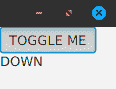

# `Observable`和订阅者

我们已经在第一章《反应式思考》中窥见了`Observable`及其工作原理。你可能对它如何精确运作以及它有哪些实际应用有很多疑问。本章将为理解`Observable`的工作原理及其与`Observer`的关键关系奠定基础。我们还将介绍几种创建`Observable`的方法，并通过介绍一些操作符使其变得有用。为了使本书的其余部分流畅，我们还将直接覆盖所有关键细节，以建立一个坚实的基础，避免你在以后遇到惊喜。

本章我们将涵盖以下内容：

+   `Observable`

+   `Observer`

+   其他`Observable`工厂

+   `Single`、`Completable`和`Maybe`

+   `Disposable`

# `Observable`

如在第一章《反应式思考》中所述，`Observable`是一个基于推送的**可组合迭代器**。对于给定的`Observable<T>`，它通过一系列操作符推送类型为`T`的项目（称为发射），直到最终到达一个最终的`Observer`，它消费这些项目。我们将介绍几种创建`Observable`的方法，但首先，让我们深入了解`Observable`是如何通过其`onNext()`、`onCompleted()`和`onError()`调用工作的。

# `Observable`的工作原理

在我们做任何事情之前，我们需要研究`Observable`如何顺序地将项目传递到链中的`Observer`。在最高层次上，`Observable`通过传递三种类型的事件来工作：

+   `onNext()`：这个方法将每个项目逐个从源`Observable`传递到`Observer`。

+   `onComplete()`：这个方法将完成事件传递到`Observer`，表明将不再发生`onNext()`调用。

+   `onError()`：这个方法将错误传递到链中的`Observer`，其中`Observer`通常定义如何处理它。除非使用`retry()`操作符来拦截错误，否则`Observable`链通常终止，不再发生更多的发射。

这三个事件是`Observer`类型中的抽象方法，我们将在稍后介绍一些实现。现在，我们将实用主义地关注它们在日常使用中的工作方式。

在 RxJava 1.0 中，`onComplete()`事件实际上被称作`onCompleted()`。

# 使用 Observable.create()

让我们从使用`Observable.create()`创建一个源`Observable`开始。相对而言，源`Observable`是一个发射起源于此的`Observable`，并且是我们`Observable`链的起点。

`Observable.create()` 工厂允许我们通过提供一个接收 `Observable` 发射器的 lambda 来创建一个 `Observable`。我们可以调用 `Observable` 发射器的 `onNext()` 方法将发射（一次一个）向上传递到链中，以及调用 `onComplete()` 来表示完成并传达将没有更多项目。这些 `onNext()` 调用会将这些项目向上传递到链中的 `Observer`，它将打印每个项目，如下面的代码片段所示：

```java
    import io.reactivex.Observable;

    public class Launcher {

      public static void main(String[] args) {

        Observable<String> source = Observable.create(emitter -> {
            emitter.onNext("Alpha");
            emitter.onNext("Beta");
            emitter.onNext("Gamma");
            emitter.onNext("Delta");
            emitter.onNext("Epsilon");
            emitter.onComplete();
        });

        source.subscribe(s -> System.out.println("RECEIVED: " + s));
      }
    }
```

输出如下：

```java
    RECEIVED: Alpha
    RECEIVED: Beta
    RECEIVED: Gamma
    RECEIVED: Delta
    RECEIVED: Epsilon
```

在 RxJava 1.0 中，请确保使用 `Observable.fromEmitter()` 而不是 `Observable.create()`。在 RxJava 1.0 中，后者是完全不同的东西，仅适用于高级 RxJava 用户。

`onNext()` 方法是将每个项目（从 `Alpha` 开始）传递给链中的下一个步骤的一种方式。在这个例子中，下一个步骤是观察者，它使用 **`s -> System.out.println("RECEIVED: " + s)`** lambda 打印项目。这个 lambda 在 `Observer` 的 `onNext()` 调用中被调用，我们稍后会更详细地了解 `Observer`。

注意，`Observable` 协议 ([`reactivex.io/documentation/contract.html`](http://reactivex.io/documentation/contract.html)) 规定发射必须按顺序逐个传递。`Observable` 不能并发或并行地传递发射。这看起来可能是一个限制，但实际上它确实简化了程序，并使 Rx 更容易推理。我们将在第六章 并发和并行化中学习一些强大的技巧，以有效地利用并发和并行化，而不会破坏 `Observable` 协议。

`onComplete()` 方法用于向上传递到 `Observer`，表示没有更多项目到来。实际上，观察者可以是无限的，如果这种情况发生，`onComplete()` 事件将永远不会被调用。技术上，源可以停止发出 `onNext()` 调用并永远不调用 `onComplete()`。但这可能是不良的设计，因为如果源不再计划发送发射。

虽然这个特定的例子不太可能抛出错误，但我们可以在 `Observable.create()` 块内部捕获可能发生的错误，并通过 `onError()` 发出它们。这样，错误就可以被推送到链的上方，并由 `Observer` 处理。我们设置的特定 `Observer` 并不处理异常，但你可以像下面这样做到：

```java
    import io.reactivex.Observable;

      public class Launcher {

      public static void main(String[] args) {

        Observable<String> source = Observable.create(emitter -> {
          try {
            emitter.onNext("Alpha");
            emitter.onNext("Beta");
            emitter.onNext("Gamma");
            emitter.onNext("Delta");
            emitter.onNext("Epsilon");
            emitter.onComplete();
          } catch (Throwable e) {
            emitter.onError(e);
          }
        });

        source.subscribe(s -> System.out.println("RECEIVED: " + s),      Throwable::printStackTrace);
      }
   }
```

注意，`onNext()`、`onComplete()` 和 `onError()` 并不一定直接推送到最终的观察者。它们也可以推送到作为链中下一个步骤的操作符。在下面的代码中，我们使用 `map()` 和 `filter()` 操作符派生新的观察者，这些操作符将在源 `Observable` 和最终 `Observer` 打印项目之间起作用：

```java
    import io.reactivex.Observable;

    public class Launcher {
    public static void main(String[] args) {
      Observable<String> source = Observable.create(emitter -> {
        try {
          emitter.onNext("Alpha");
          emitter.onNext("Beta");
          emitter.onNext("Gamma");
          emitter.onNext("Delta");
          emitter.onNext("Epsilon");
          emitter.onComplete();
        } catch (Throwable e) {
          emitter.onError(e);
        }
      });
      Observable<Integer> lengths = source.map(String::length);

      Observable<Integer> filtered = lengths.filter(i -> i >= 5);

      filtered.subscribe(s -> System.out.println("RECEIVED: " +  
      s));    
     }
    }
```

这是运行代码后的输出：

```java
    RECEIVED: 5
    RECEIVED: 5
    RECEIVED: 5
    RECEIVED: 7
```

在源 `Observable` 和 Observer 之间使用 `map()` 和 `filter()` 操作符时，`onNext()` 将每个项目交给 `map()` 操作符。内部，它将充当中间 Observer，并将每个字符串转换为它的 `length()`。这将反过来调用 `filter()` 上的 `onNext()` 来传递那个整数，lambda 条件 `i -> i >= 5` 将抑制长度不足五个字符的发射。最后，`filter()` 操作符将调用 `onNext()` 将每个项目交给最终的 `Observer`，在那里它们将被打印出来。

重要的是要注意，`map()` 操作符将产生一个新的 `Observable<Integer>`，它是从原始的 `Observable<String>` 派生出来的。`filter()` 也会返回一个 `Observable<Integer>`，但会忽略不符合标准的事件。由于像 `map()` 和 `filter()` 这样的操作符产生新的 Observables（它们内部使用 `Observer` 实现来接收事件），我们可以通过下一个操作符链式连接所有返回的 Observables，而不是将每个 Observables 无需保存到中间变量中：

```java
    import io.reactivex.Observable;

      public class Launcher {
      public static void main(String[] args) {
        Observable<String> source = Observable.create(emitter -> {
          try {
            emitter.onNext("Alpha");
            emitter.onNext("Beta");
            emitter.onNext("Gamma");
            emitter.onNext("Delta");
            emitter.onNext("Epsilon");
            emitter.onComplete();
          } catch (Throwable e) {
            emitter.onError(e);
          }
        });
        source.map(String::length)
        .filter(i -> i >= 5)
          .subscribe(s -> System.out.println("RECEIVED: " + s));
       }
    }
```

输出如下：

```java
    RECEIVED: 5
    RECEIVED: 5
    RECEIVED: 5
    RECEIVED: 7
```

以这种方式链式连接操作符在响应式编程中很常见（并且被鼓励）。它有一个很好的特性，就像一本书一样，可以从左到右、从上到下阅读，这有助于维护性和可读性。

在 RxJava 2.0 中，Observables 不再支持发出 null 值。如果你创建了一个尝试发出 null 值的 `Observable`，你将立即得到一个非 null 异常。如果你需要发出 null，考虑将其包装在 Java 8 或 Google Guava Optional 中。

# 使用 `Observable.just()`

在我们更详细地查看 `subscribe()` 方法之前，请注意，你可能不太经常需要使用 `Observable.create()`。它有助于连接某些非响应式的源，我们将在本章后面的几个地方看到这一点。但通常，我们使用精简的工厂来为常见的源创建 Observables。

在我们之前的 `Observable.create()` 示例中，我们可以使用 `Observable.just()` 来完成这个任务。我们可以传递最多 10 个我们想要发出的项目。它将为每个项目调用 `onNext()` 调用，然后在它们全部被推入后调用 `onComplete()`：

```java
    import io.reactivex.Observable;

    public class Launcher {
      public static void main(String[] args) {
        Observable<String> source =
          Observable.just("Alpha", "Beta", "Gamma", "Delta", 
          "Epsilon");

    source.map(String::length).filter(i -> i >= 5)
          .subscribe(s -> System.out.println("RECEIVED: " + s));
      }
    }
```

我们还可以使用 `Observable.fromIterable()` 来从任何 Iterable 类型（如 `List`）发出项目。它也会为每个元素调用 `onNext()`，然后在迭代完成后调用 `onComplete()`。你可能会经常使用这个工厂，因为 Java 中的 Iterables 很常见，并且可以很容易地使其响应式：

```java
    import io.reactivex.Observable;
    import java.util.Arrays;
    import java.util.List;

    public class Launcher {
      public static void main(String[] args) {

        List<String> items =
          Arrays.asList("Alpha", "Beta", "Gamma", "Delta", "Epsilon");

        Observable<String> source = Observable.fromIterable(items);
        source.map(String::length).filter(i -> i >= 5)
          .subscribe(s -> System.out.println("RECEIVED: " + s));
      }
   }
```

我们将在本章后面探索其他创建 Observables 的工厂，但到目前为止，让我们先放一放，更多地了解 Observers。

# Observer 接口

`onNext()`、`onComplete()`和`onError()`方法实际上定义了观察者类型，这是一个在 RxJava 中实现以通信这些事件的抽象接口。这是 RxJava 中显示在代码片段中的观察者定义。现在不必担心`onSubscribe()`，因为我们将在本章末尾讨论它。只需关注其他三个方法：

```java
    package io.reactivex;

    import io.reactivex.disposables.Disposable;

    public interface Observer<T> {
      void onSubscribe(Disposable d);
      void onNext(T value);
      void onError(Throwable e);
      void onComplete();
   }
```

观察者和源`Observable`是相对的。在一个上下文中，源`Observable`是`Observable`链开始的地方，也是发射的起源。在我们的前例中，可以说我们从`Observable.create()`方法或`Observable.just()`返回的`Observable`是源`Observable`。但对`filter()`操作符来说，从`map()`操作符返回的`Observable`是源。它不知道发射从哪里起源，它只知道它立即从上游的操作符接收发射，这些发射来自`map()`。

相反，每个由操作符返回的`Observable`在内部都是一个观察者，它接收、转换并将发射传递给下一个`Observer`。它不知道下一个`Observer`是另一个操作符还是链尾的最终`Observer`。当我们谈论`Observer`时，我们通常指的是`Observable`链尾的最终`Observer`，它消费这些发射。但每个操作符，如`map()`和`filter()`，也内部实现了`Observer`。

我们将在第九章变换器和自定义操作符中详细了解操作符是如何构建的。现在，我们将专注于使用`Observer`来调用`subscribe()`方法。

在 RxJava 1.0 中，订阅者本质上成为了 RxJava 2.0 中的观察者。在 RxJava 1.0 中有一个定义了三个事件方法的`Observer`类型，但订阅者是传递给`subscribe()`方法的，并且实现了`Observer`。在 RxJava 2.0 中，订阅者仅在讨论`Flowables`时存在，我们将在第八章 Flowables 和背压中讨论。

# 实现并订阅一个观察者

当你在`Observable`上调用`subscribe()`方法时，使用一个`Observer`通过实现其方法来消费这三个事件。我们不再像之前那样指定 lambda 参数，我们可以实现一个`Observer`并将其实例传递给`subscribe()`方法。现在不必担心`onSubscribe()`，只需将其实现留空，直到我们在本章末尾讨论它：

```java
    import io.reactivex.Observable;
    import io.reactivex.Observer;
    import io.reactivex.disposables.Disposable;

    public class Launcher {

      public static void main(String[] args) {

        Observable<String> source =
          Observable.just("Alpha", "Beta", "Gamma", "Delta", 
          "Epsilon");

        Observer<Integer> myObserver = new Observer<Integer>() {
          @Override
          public void onSubscribe(Disposable d) {
            //do nothing with Disposable, disregard for now 
          }

          @Override
          public void onNext(Integer value) {
            System.out.println("RECEIVED: " + value);
          }

          @Override
          public void onError(Throwable e) {
            e.printStackTrace();
          }

          @Override
          public void onComplete() {
            System.out.println("Done!");
          }
         };

         source.map(String::length).filter(i -> i >= 5)
           .subscribe(myObserver);
       }
    }

```

输出如下：

```java
    RECEIVED: 5
    RECEIVED: 5
    RECEIVED: 5
    RECEIVED: 7
    Done!
```

我们快速创建一个`Observer<Integer>`作为我们的`Observer`，它将接收整数长度的发射。我们的`Observer`在`Observable`链的末尾接收发射，并作为消耗发射的终点。通过消耗，这意味着它们到达过程的末尾，被写入数据库、文本文件、服务器响应、在 UI 中显示，或者（在这种情况下）只是打印到控制台。

为了更详细地解释这个示例，我们从源头的字符串发射开始。我们提前声明我们的`Observer`，并在`Observable`链的末尾将其传递给`subscribe()`方法。请注意，每个字符串都被转换为其长度。`onNext()`方法接收每个整数长度的发射，并使用`System.out.println("RECEIVED: " + value)`打印出来。运行这个简单的过程不会出现任何错误，但如果在`Observable`链的任何地方发生了错误，它将被推送到`Observer`上的`onError()`实现，在那里将打印出`Throwable`的堆栈跟踪。最后，当源没有更多的发射（在推送"`Epsilon`"之后），它将调用链中的`onComplete()`直到 Observer，在那里它的`onComplete()`方法将被调用，并在控制台打印`Done!`。

# 使用 lambda 的简写 Observer

实现`Observer`有点冗长和繁琐。幸运的是，`subscribe()`方法被重载以接受我们的三个事件的 lambda 参数。这可能是我们大多数情况下想要使用的，我们可以指定三个用逗号分隔的 lambda 参数：`onNext` lambda、`onError` lambda 和`onComplete` lambda。对于我们之前的示例，我们可以使用这三个 lambda 合并我们的三个方法实现：

```java
    Consumer<Integer> onNext = i ->  System.out.println("RECEIVED: "          + i);

    Action onComplete = () -> System.out.println("Done!");

    Consumer<Throwable> onError = Throwable::printStackTrace;

```

我们可以将这三个 lambda 作为参数传递给`subscribe()`方法，它将使用它们为我们实现一个`Observer`。这要简洁得多，需要的样板代码也少得多：

```java
    import io.reactivex.Observable;

    public class Launcher {

      public static void main(String[] args) {

        Observable<String> source =
          Observable.just("Alpha", "Beta", "Gamma", "Delta",
          "Epsilon");

        source.map(String::length).filter(i -> i >= 5)
          .subscribe(i -> System.out.println("RECEIVED: " + i),
          Throwable::printStackTrace,
() ->  System.out.println("Done!"));
      }
   }

```

输出如下：

```java
    RECEIVED: 5
    RECEIVED: 5
    RECEIVED: 5
    RECEIVED: 7
    Done!
```

注意，`subscribe()`还有其他重载。您可以省略`onComplete()`，只实现`onNext()`和`onError()`。这将不再为`onComplete()`执行任何操作，但可能存在不需要一个的情况：

```java
    import io.reactivex.Observable;

    public class Launcher {

      public static void main(String[] args) {

        Observable<String> source =
          Observable.just("Alpha", "Beta", "Gamma", "Delta", 
          "Epsilon");

        source.map(String::length).filter(i -> i >= 5)
          .subscribe(i -> System.out.println("RECEIVED: " + i),
            Throwable::printStackTrace);
      }
    }
```

输出如下：

```java
    RECEIVED: 5
    RECEIVED: 5
    RECEIVED: 5
    RECEIVED: 7

```

如您在之前的示例中看到的，您甚至可以省略`onError`，只需指定`onNext`：

```java
    import io.reactivex.Observable;

    public class Launcher {

      public static void main(String[] args) {

        Observable<String> source =
          Observable.just("Alpha", "Beta", "Gamma", "Delta",
          "Epsilon");

        source.map(String::length).filter(i -> i >= 5)
          .subscribe(i -> System.out.println("RECEIVED: " + i));
      }
   }

```

然而，在生产中不实现`onError()`是您想要避免做的事情。在`Observable`链的任何地方发生的错误都将传播到`onError()`进行处理，然后没有更多的发射终止`Observable`。如果您没有为`onError`指定操作，错误将不会被处理。

如果发生错误，您可以使用`retry()`运算符尝试恢复并重新订阅一个`Observable`。我们将在下一章中介绍如何做到这一点。

重要的是要注意，大多数的 `subscribe()` 重载变体（包括我们刚刚提到的简写 lambda 变体）返回一个 `Disposable`，我们没有对其进行任何操作。`disposables` 允许我们断开 `Observable` 和 `Observer` 的连接，以便提前终止发射，这对于无限或长时间运行的观察量至关重要。我们将在本章末尾介绍 `disposables`。

# 冷观察量与热观察量

根据 `Observable` 的实现方式，`Observable` 和 `Observer` 之间的关系存在细微的行为差异。需要了解的一个重要特征是冷观察量与热观察量，它定义了当存在多个观察者时观察量的行为。首先，我们将介绍冷观察量。

# 冷观察量

冷观察量非常像一张可以被每位听众重放的音乐 CD，所以每个人都可以在任何时候听到所有曲目。同样，冷观察量将重新播放发射给每个 `Observer`，确保所有观察者都能获得所有数据。大多数数据驱动的观察量都是冷的，这包括 `Observable.just()` 和 `Observable.fromIterable()` 工厂。

在下面的例子中，我们有两个观察者订阅了一个 `Observable`。`Observable` 将首先将所有发射传递给第一个 `Observer` 并调用 `onComplete()`。然后，它将再次将所有发射传递给第二个 `Observer` 并调用 `onComplete()`。他们各自通过获取两个单独的流接收相同的数据集，这是冷 `Observable` 的典型行为：

```java
      import io.reactivex.Observable;

      public class Launcher {
      public static void main(String[] args) {

        Observable<String> source =
          Observable.just("Alpha","Beta","Gamma","Delta","Epsilon");

        //first observer
        source.subscribe(s -> System.out.println("Observer 1 Received: 
          " + s));

        //second observer
        source.subscribe(s -> System.out.println("Observer 2 Received:
          " + s));

      }
    }
```

输出如下：

```java
    Observer 1 Received: Alpha
    Observer 1 Received: Beta
    Observer 1 Received: Gamma
    Observer 1 Received: Delta
    Observer 1 Received: Epsilon
    Observer 2 Received: Alpha
    Observer 2 Received: Beta
    Observer 2 Received: Gamma
    Observer 2 Received: Delta
    Observer 2 Received: Epsilon
```

即使第二个 `Observer` 使用操作符转换其发射，它仍然会得到自己的发射流。对冷 `Observable` 使用如 `map()` 和 `filter()` 这样的操作符仍然会保持产生的观察量的冷性质：

```java
    import io.reactivex.Observable;

    public class Launcher {
      public static void main(String[] args) {

        Observable<String> source =
          Observable.just("Alpha","Beta","Gamma","Delta","Epsilon");

        //first observer
        source.subscribe(s -> System.out.println("Observer 1 Received:
          " + s));

        //second observer
        source.map(String::length).filter(i -> i >= 5)
          .subscribe(s -> System.out.println("Observer 2 Received: " + 
        s));

      }
   }
```

输出如下：

```java
    Observer 1 Received: Alpha
    Observer 1 Received: Beta
    Observer 1 Received: Gamma
    Observer 1 Received: Delta
    Observer 1 Received: Epsilon
    Observer 2 Received: 5
    Observer 2 Received: 5
    Observer 2 Received: 5
    Observer 2 Received: 7
```

如前所述，发射有限数据集的 `Observable` 源通常是冷的。

这里有一个更贴近现实世界的例子：Dave Moten 的 RxJava-JDBC ([`github.com/davidmoten/rxjava-jdbc`](https://github.com/davidmoten/rxjava-jdbc)) 允许你基于 SQL 数据库查询创建冷观察量。我们不会过多地深入这个库，但如果你想要查询 SQLite 数据库，例如，在你的项目中包含 **SQLite JDBC** 驱动和 **RxJava-JDBC** 库。然后你可以以响应式的方式查询数据库表，如下面的代码片段所示：

```java
    import com.github.davidmoten.rx.jdbc.ConnectionProviderFromUrl;
    import com.github.davidmoten.rx.jdbc.Database;
    import rx.Observable;
    import java.sql.Connection;

    public class Launcher {
      public static void main(String[] args) {
        Connection conn = 
      new ConnectionProviderFromUrl("jdbc:sqlite:/home/thomas 
            /rexon_metals.db").get();

      Database db = Database.from(conn);

        Observable<String> customerNames =
          db.select("SELECT NAME FROM CUSTOMER")
          .getAs(String.class);

        customerNames.subscribe(s -> System.out.println(s));
      }
   }

```

输出如下：

```java
    LITE Industrial
    Rex Tooling Inc
    Re-Barre Construction
    Prairie Construction
    Marsh Lane Metal Works
```

这个由 SQL 驱动的 `Observable` 是冷的。许多来自有限数据源（如数据库、文本文件或 JSON）的 `Observable` 都是冷的。仍然重要的是要注意源 `Observable` 的架构。RxJava-JDBC 将为每个 `Observer` 运行查询。这意味着如果在两次订阅之间数据发生变化，第二个 `Observer` 将获得与第一个不同的输出。但由于 `Observable` 正在重新执行查询（即使结果数据从底层表中更改），它仍然是冷的。

再次强调，冷观察者将以某种形式重复操作以向每个 `Observer` 生成这些输出。接下来，我们将介绍更类似于事件而不是数据的 **热观察者**。

# 热观察者

你刚刚了解了冷 `Observable`，它的工作方式类似于音乐 CD。热 `Observable` 更像是一个广播电台。它同时向所有观察者广播相同的输出。如果观察者订阅了一个热 `Observable`，接收了一些输出，然后另一个观察者随后加入，那么第二个观察者将错过那些输出。就像广播电台一样，如果你调得太晚，就会错过那首歌。

从逻辑上讲，热观察者通常表示事件而不是有限的数据集。事件可以携带数据，但存在一个时间敏感的组件，晚到的观察者可能会错过之前发出的数据。

例如，JavaFX 或 Android UI 事件可以表示为一个热 `Observable`。在 JavaFX 中，你可以使用 `Observable.create()` 创建一个基于 `ToggleButton` 的 `selectedProperty()` 操作符的 `Observable<Boolean>`。然后，你可以将布尔输出转换为表示 `ToggleButton` 是 `UP` 还是 `DOWN` 的字符串，并使用 `Observer` 在 `Label` 中显示它们，如下面的代码片段所示：

```java
    import io.reactivex.Observable;
    import javafx.application.Application;
    import javafx.beans.value.ChangeListener;
    import javafx.beans.value.ObservableValue;
    import javafx.scene.Scene;
    import javafx.scene.control.Label;
    import javafx.scene.control.ToggleButton;
    import javafx.scene.layout.VBox;
    import javafx.stage.Stage;

     public class MyJavaFxApp extends Application {

      @Override
     public void start(Stage stage) throws Exception {

      ToggleButton toggleButton = new ToggleButton("TOGGLE ME");
      Label label = new Label();

      Observable<Boolean> selectedStates =
        valuesOf(toggleButton.selectedProperty());

      selectedStates.map(selected -> selected ? "DOWN" : "UP")
        .subscribe(label::setText);

      VBox vBox = new VBox(toggleButton, label);

      stage.setScene(new Scene(vBox));
      stage.show();
     }

     private static <T> Observable<T> valuesOf(final
     ObservableValue<T> fxObservable) {
       return Observable.create(observableEmitter -> {

         //emit initial state
         observableEmitter.onNext(fxObservable.getValue());

         //emit value changes uses a listener
         final ChangeListener<T> listener = (observableValue, prev,
         current) -> observableEmitter.onNext(current);

         fxObservable.addListener(listener);
       });
     }
   }
```



由 `ToggleButton` 的选择状态创建的热 `Observable<Boolean>` 支持的 JavaFX 应用

注意，如果你使用 OpenJDK，你需要单独获取 JavaFX 库。最简单的方法是使用 Oracle 的官方 JDK，它包含 JavaFX，可在 [`www.oracle.com/technetwork/java/javase/downloads/index.html`](http://www.oracle.com/technetwork/java/javase/downloads/index.html) 获取。

JavaFX 的 `ObservableValue` 与 RxJava 的 `Observable` 没有任何关系。它是 JavaFX 的专有技术，但我们可以通过之前实现的 `valuesOf()` 工厂方法轻松地将它转换成 RxJava 的 `Observable`，并将 `ChangeListener` 作为 `onNext()` 调用挂钩。每次点击 `ToggleButton`，`Observable<Boolean>` 都会发出 `true` 或 `false`，反映选择状态。这是一个简单示例，说明这个 `Observable` 正在发出事件，同时也以 `true` 或 `false` 的形式发出数据。它将布尔值转换为字符串，并让观察者修改 `Label` 的文本。

在这个 JavaFX 示例中，我们只有一个观察者。如果我们在这个`ToggleButton`的事件发生后引入更多的观察者，那些新的观察者将错过这些事件。

JavaFX 和 Android 上的 UI 事件是热 Observables 的典型例子，但你也可以使用热 Observables 来反映服务器请求。如果你创建了一个从实时 Twitter 流中发出特定主题推文的`Observable`，那也将是一个热`Observable`**。**所有这些来源都可能无限，虽然许多热 Observables 确实是无限的，但它们不必是无限的。它们只需同时将事件共享给所有观察者，并且不会为迟到的观察者重新播放错过的事件。

注意，RxJavaFX（以及在第十一章中介绍的 RxAndroid，*RxJava 在 Android 上*）有将各种 UI 事件转换为 Observables 的工厂和绑定。使用 RxJavaFX，你可以使用`valuesOf()`工厂简化前面的示例。

注意，我们在这个 JavaFX 示例中确实留下了一个悬而未决的问题，因为我们从未处理过销毁。我们将在本章末尾介绍 Disposables 时重新讨论这个问题。

# ConnectableObservable

热 Observables 的一种有用形式是`ConnectableObservable`。它可以将任何`Observable`（即使是冷的）转换为热 Observables，以便所有事件一次播放给所有观察者。为此转换，你只需在任意的`Observable`上调用`publish()`，它将产生一个`ConnectableObservable`。但是订阅不会立即开始事件发射。你需要调用它的`connect()`方法来开始发射事件。这允许你事先设置好所有的观察者。看看下面的代码片段：

```java
    import io.reactivex.Observable;
    import io.reactivex.observables.ConnectableObservable;

    public class Launcher {
      public static void main(String[] args) {

        ConnectableObservable<String> source =

         Observable.just("Alpha","Beta","Gamma","Delta","Epsilon")
         .publish();

         //Set up observer 1
         source.subscribe(s -> System.out.println("Observer 1: " + s));

        //Set up observer 2
        source.map(String::length)
          .subscribe(i -> System.out.println("Observer 2: " + i));

        //Fire!
        source.connect();
      }
}
```

看看下面的代码：

```java
    Observer 1: Alpha
    Observer 2: 5
    Observer 1: Beta
    Observer 2: 4
    Observer 1: Gamma
    Observer 2: 5
    Observer 1: Delta
    Observer 2: 5
    Observer 1: Epsilon
    Observer 2: 7
```

注意，一个观察者接收字符串，而另一个接收长度，并且它们以交错的方式打印它们。这两个订阅都在之前设置好，然后调用`connect()`来触发事件。不是`观察者 1`在`观察者 2`之前处理所有事件，每个事件同时发送给每个观察者。`观察者 1`接收`Alpha`，`观察者 2`接收`5`，然后是`Beta`和`4`，依此类推。使用`ConnectableObservable`强制每个事件同时发送给所有观察者称为**多播**，我们将在第五章*多播*中详细讨论。

`ConnectableObservable`有助于防止将数据重新播放给每个观察者。你可能想这样做，如果重新播放发射很昂贵，你更愿意一次性将它们发射给所有观察者。你也可能只是想强制上游操作符使用单个流实例，即使下游有多个观察者。通常，多个观察者会导致上游有多个流实例，但使用`publish()`返回`ConnectableObservable`将`publish()`之前的所有上游操作合并成一个单一的流。再次强调，这些细微差别将在第五章，*多播*中更详细地介绍。

目前，请记住`ConnectableObservable`是热的，因此，如果在调用`connect()`之后发生新的订阅，它们将错过之前发射的发射。

# 其他 Observable 源

我们已经介绍了一些创建`Observable`源的工厂，包括`Observable.create()`、`Observable.just()`和`Observable.fromIterable()`。在介绍观察者和它们的细微差别之后，让我们继续之前的话题，并介绍一些更多的`Observable`工厂。

# Observable.range()

要发射一个连续的整数范围，你可以使用`Observable.range()`。这将从起始值开始发射每个数字，并在达到指定的计数之前递增每个发射。这些数字都通过`onNext()`事件传递，然后是`onComplete()`事件：

```java
    import io.reactivex.Observable;

    public class Launcher {
      public static void main(String[] args) {
        Observable.range(1,10)
          .subscribe(s -> System.out.println("RECEIVED: " + s));

      }
   }
```

输出如下：

```java
    RECEIVED: 1
    RECEIVED: 2
    RECEIVED: 3
    RECEIVED: 4
    RECEIVED: 5
    RECEIVED: 6
    RECEIVED: 7
    RECEIVED: 8
    RECEIVED: 9
    RECEIVED: 10
```

仔细注意，`Observable.range()`的两个参数不是下限/上限。第一个参数是起始值。第二个参数是发射的总数，这包括初始值和递增的值。尝试发射`Observable.range(5,10)`，你会注意到它首先发射`5`，然后是接下来的九个连续整数（总共发射 10 次）：

```java
    import io.reactivex.Observable;

    public class Launcher {
      public static void main(String[] args) {
        Observable.range(5,10)
        .subscribe(s -> System.out.println("RECEIVED: " + s));

      }
     }
```

输出如下：

```java
    RECEIVED: 5
    RECEIVED: 6
    RECEIVED: 7
    RECEIVED: 8
    RECEIVED: 9
    RECEIVED: 10
    RECEIVED: 11
    RECEIVED: 12
    RECEIVED: 13
    RECEIVED: 14
```

注意，如果你需要发射更大的数字，还有一个长等效函数`Observable.rangeLong()`。

# Observable.interval()

正如我们所见，Observables 有一个随时间发射的概念。发射是按顺序从源传递到观察者的。但是，这些发射可以根据源提供它们的时间来分散。我们的 JavaFX 示例使用`ToggleButton`展示了这一点，因为每次点击都会导致发射`true`或`false`。

但让我们看看使用`Observable.interval()`的一个基于时间的`Observable`的简单示例。它将在每个指定的时间间隔发射一个连续的长整数发射（从`0`开始）。在这里，我们有一个每秒发射一次的`Observable<Long>`：

```java
    import io.reactivex.Observable;

    import java.util.concurrent.TimeUnit;

     public class Launcher {
      public static void main(String[]args) {

        Observable.interval(1, TimeUnit.SECONDS)
          .subscribe(s -> System.out.println(s + " Mississippi"));
          sleep(5000);

      }
      public static void sleep(int millis) {
        try {
          Thread.sleep(millis);
        } catch (InterruptedException e) {
          e.printStackTrace();
        }
      }
    }
```

输出如下：

```java
    0 Mississippi
    1 Mississippi
    2 Mississippi
    3 Mississippi
    4 Mississippi
```

`Observable.interval()`将以指定的间隔无限发射（在本例中为 1 秒）。然而，因为它在计时器上操作，所以需要在单独的线程上运行，并且默认情况下将在计算**调度器**上运行。我们将在第六章中介绍并发和并行化，并学习调度器。现在，只需注意我们的`main()`方法将启动这个`Observable`，但它不会等待它完成。现在它在一个单独的线程上发射。为了防止我们的`main()`方法在`Observable`有机会发射之前完成并退出应用程序，我们使用`sleep()`方法使这个应用程序保持活跃五秒钟。这给我们的`Observable`五秒钟的时间来发射，然后应用程序退出。当您创建生产应用程序时，您可能很少会遇到这个问题，因为像网络服务、Android 应用程序或 JavaFX 这样的非守护线程将保持应用程序的活跃状态。

玩笑问题：`Observable.interval()`返回的是热可观察对象还是冷可观察对象？因为它是由事件驱动的（并且是无限的），您可能会想它是热的。但是，在它上面添加第二个`Observer`，等待五秒，然后添加另一个观察者。会发生什么？让我们看看：

```java
    import io.reactivex.Observable;
    import java.util.concurrent.TimeUnit;

    public class Launcher {

      public static void main(String[] args) {

        Observable<Long> seconds = Observable.interval(1,   
        TimeUnit.SECONDS);

        //Observer 1
        seconds.subscribe(l -> System.out.println("Observer 1: " + l));

        //sleep 5 seconds
        sleep(5000);

        //Observer 2
        seconds.subscribe(l -> System.out.println("Observer 2: " + l));

        //sleep 5 seconds
        sleep(5000);
       }

      public static void sleep(int millis) {
        try {
          Thread.sleep(millis);
        } catch (InterruptedException e) {
          e.printStackTrace();
        }
       }
    }
```

输出结果如下：

```java
    Observer 1: 0
    Observer 1: 1
    Observer 1: 2
    Observer 1: 3
    Observer 1: 4
    Observer 1: 5
    Observer 2: 0
    Observer 1: 6
    Observer 2: 1
    Observer 1: 7
    Observer 2: 2
    Observer 1: 8
    Observer 2: 3
    Observer 1: 9
    Observer 2: 4
```

看看五秒后发生了什么，当`Observer 2`到来时。注意，它有自己的单独计时器，从`0`开始！这两个观察者实际上是在获取它们自己的发射，每个都是从`0`开始的。所以这个`Observable`实际上是冷的。为了将所有观察者放在同一个计时器上，并具有相同的发射，您将想要使用`ConnectableObservable`来强制这些发射变为热：

```java
    import io.reactivex.Observable;
    import io.reactivex.observables.ConnectableObservable;
    import java.util.concurrent.TimeUnit;

     public class Launcher {

      public static void main(String[] args) {
        ConnectableObservable<Long> seconds =
          Observable.interval(1, TimeUnit.SECONDS).publish();

        //observer 1
        seconds.subscribe(l -> System.out.println("Observer 1: " + l));
        seconds.connect();

        //sleep 5 seconds
        sleep(5000);

        //observer 2
        seconds.subscribe(l -> System.out.println("Observer 2: " + l));

        //sleep 5 seconds
        sleep(5000);

      }

      public static void sleep(int millis) {
        try {
          Thread.sleep(millis);
        } catch (InterruptedException e) {
          e.printStackTrace();
        }
      }
    }
```

输出结果如下：

```java
    Observer 1: 0
    Observer 1: 1
    Observer 1: 2
    Observer 1: 3
    Observer 1: 4
    Observer 1: 5
    Observer 2: 5
    Observer 1: 6
    Observer 2: 6
    Observer 1: 7
    Observer 2: 7
    Observer 1: 8
    Observer 2: 8
    Observer 1: 9
    Observer 2: 9
```

现在，`Observer 2`虽然晚了 5 秒并且错过了之前的发射，但至少与`Observer 1`完全同步，并接收到了相同的发射。

# `Observable.future()`

RxJava 的可观察对象（Observables）比`Futures`更加健壮和表达性强，但如果您有现有的库返回`Futures`，您可以通过`Observable.future()`轻松地将它们转换为可观察对象：

```java
    import io.reactivex.Observable;
    import java.util.concurrent.Future;

    public class Launcher {
      public static void main(String[] args) {

        Future<String> futureValue = ...;

        Observable.fromFuture(futureValue)
          .map(String::length)
          .subscribe(System.out::println);
      }
    }
```

# `Observable.empty()`

虽然这可能看起来目前没有太大用处，但有时创建一个不发射任何内容并调用`onComplete()`的可观察对象是有帮助的：

```java
    import io.reactivex.Observable;

    public class Launcher {
      public static void main(String[] args) {

        Observable<String> empty = Observable.empty();

        empty.subscribe(System.out::println, 
          Throwable::printStackTrace,
          () -> System.out.println("Done!"));
       }
     }
```

输出结果如下：

```java
    Done!
```

注意，没有打印任何发射，因为没有发射。它直接调用`onComplete`，在观察者中打印了`Done!`消息。空的可观察对象常用于表示空数据集。它们也可能由`filter()`等操作符产生，当所有发射都未能满足条件时。有时，您会故意使用`Observable.empty()`创建空的可观察对象，我们将在本书的几个地方看到这个例子。

一个空的`Observable`基本上是 RxJava 的 null 概念。它是值的缺失（或者技术上，“值”）。空的`Observable`比 null 更优雅，因为操作将简单地继续为空而不是抛出`NullPointerExceptions`。但是，当 RxJava 程序中的事情出错时，有时是因为观察者没有收到任何发射物。当这种情况发生时，您必须追踪您的`Observable`的运算符链以找到导致发射物变为空的运算符。

# Observable.never()

`Observable.empty()`的一个近亲是`Observable.never()`。它们之间的唯一区别是它永远不会调用`onComplete()`，永远让观察者等待发射物，但永远不会实际提供任何：

```java
    import io.reactivex.Observable;

    public class Launcher {
      public static void main(String[] args) {

        Observable<String> empty = Observable.never();

        empty.subscribe(System.out::println,
          Throwable::printStackTrace,
            () -> System.out.println("Done!"));

        sleep(5000);

      }

      public static void sleep(int millis) {
        try {
          Thread.sleep(millis);
        } catch (InterruptedException e) {
          e.printStackTrace();
        }
       }
     } 
```

这个`Observable`主要用于测试，在生产环境中并不常用。我们在这里必须使用`sleep()`，就像使用`Observable.interval()`一样，因为启动后主线程不会等待它。在这种情况下，我们只使用`sleep()`五秒钟来证明没有发射物来自它。然后，应用程序将退出。

# Observable.error()

这也是您可能只会用于测试的事情，但您可以创建一个立即调用`onError()`并带有指定异常的`Observable`：

```java
    import io.reactivex.Observable;

    public class Launcher {
      public static void main(String[] args) {

        Observable.error(new Exception("Crash and burn!"))
          .subscribe(i -> System.out.println("RECEIVED: " + i),
            Throwable::printStackTrace,
              () ->  System.out.println("Done!"));
      }
     }
```

输出如下：

```java
    java.lang.Exception: Crash and burn!
    at Launcher.lambda$main$0(Launcher.java:7)
    at io.reactivex.internal.operators.observable.
      ObservableError.subscribeActual(ObservableError.java:32)
    at io.reactivex.Observable.subscribe(Observable.java:10514)
    at io.reactivex.Observable.subscribe(Observable.java:10500)
    ...
```

您也可以通过 lambda 表达式提供异常，这样它就是从头创建的，并且为每个观察者提供单独的异常实例：

```java
    import io.reactivex.Observable;

    public class Launcher {
      public static void main(String[] args) {

        Observable.error(() -> new Exception("Crash and burn!"))
          .subscribe(i -> System.out.println("RECEIVED: " + i),
           Throwable::printStackTrace,
           () ->  System.out.println("Done!"));
      }
    }
```

# Observable.defer()

`Observable.defer()`是一个强大的工厂，因为它能够为每个`Observer`创建一个单独的状态。当使用某些`Observable`工厂时，如果您的源是状态性的并且您想要为每个`Observer`创建一个单独的状态，您可能会遇到一些细微差别。您的源`Observable`可能没有捕捉到其参数的变化，并发送了过时的发射物。这里有一个简单的例子：我们有一个基于两个静态`int`属性`start`和`count`的`Observable.range()`。

如果您订阅了这个`Observable`，修改计数，然后再次订阅，您会发现第二个`Observer`看不到这个变化：

```java
    import io.reactivex.Observable;

     public class Launcher {

      private static int start = 1;
      private static int count = 5;

      public static void main(String[] args) {

        Observable<Integer> source = Observable.range(start,count);

        source.subscribe(i -> System.out.println("Observer 1: " + i));

        //modify count
        count = 10;

        source.subscribe(i -> System.out.println("Observer 2: " + i));
       }
     }
```

输出如下：

```java
    Observer 1: 1
    Observer 1: 2
    Observer 1: 3
    Observer 1: 4
    Observer 1: 5
    Observer 2: 1
    Observer 2: 2
    Observer 2: 3
    Observer 2: 4
    Observer 2: 5
```

为了解决`Observable`源没有捕捉状态变化的问题，您可以为每个订阅创建一个新的`Observable`。这可以通过使用`Observable.defer()`来实现，它接受一个 lambda 表达式，指示如何为每个订阅创建一个`Observable`。因为每次都会创建一个新的`Observable`，所以它会反映其参数的任何变化：

```java
    import io.reactivex.Observable;

    public class Launcher {

      private static int start = 1;
      private static int count = 5;

      public static void main(String[] args) {

        Observable<Integer> source = Observable.defer(() -> 
        Observable.range(start,count));

        source.subscribe(i -> System.out.println("Observer 1: " + i));

        //modify count
        count = 10;

        source.subscribe(i -> System.out.println("Observer 2: " + i));
      }
    }
```

输出如下：

```java
    Observer 1: 1
    Observer 1: 2
    Observer 1: 3
    Observer 1: 4
    Observer 1: 5
    Observer 2: 1
    Observer 2: 2
    Observer 2: 3
    Observer 2: 4
    Observer 2: 5
    Observer 2: 6
    Observer 2: 7
    Observer 2: 8
    Observer 2: 9
    Observer 2: 10
```

这样更好！当您的`Observable`源没有捕捉到驱动它的东西的变化时，尝试将其放入`Observable.defer()`。如果您的`Observable`源实现得过于简单并且与多个观察者（例如，它重用只迭代数据一次的迭代器）一起表现不佳，`Observable.defer()`也提供了一个快速解决方案。

# Observable.fromCallable()

如果你需要执行一个计算或操作然后发射它，你可以使用 `Observable.just()`（或 `Single.just()` 或 `Maybe.just()`，我们将在后面学习），但有时我们希望以懒或延迟的方式执行。此外，如果该过程抛出错误，我们希望它通过 `onError()` 发射到 `Observable` 链而不是在传统的 Java 风格中将错误抛出在那个位置。例如，如果你尝试将 `Observable.just()` 包裹在一个除以 `0` 的表达式中，异常将被抛出，而不是发射到 `Observer`：

```java
    import io.reactivex.Observable;
    public class Launcher {
      public static void main(String[] args) {

        Observable.just(1 / 0)
        .subscribe(i -> System.out.println("RECEIVED: " + i),
        e -> System.out.println("Error Captured: " + e));
      }
    }

```

输出如下：

```java
    Exception in thread "main" java.lang.ArithmeticException: / by zero
    at Launcher.main(Launcher.java:6)
    at sun.reflect.NativeMethodAccessorImpl.invoke0(Native Method)
    at sun.reflect.NativeMethodAccessorImpl.invoke
      (NativeMethodAccessorImpl.java:62)
    at sun.reflect.DelegatingMethodAccessorImpl.
      invoke(DelegatingMethodAccessorImpl.java:43)
    at java.lang.reflect.Method.invoke(Method.java:498)
    at com.intellij.rt.execution.
      application.AppMain.main(AppMain.java:147)
```

如果我们打算在错误处理方面做出反应，这可能不是所希望的。也许你希望错误被发射到链中的 `Observer`，在那里它将被处理。如果是这种情况，请使用 `Observable.fromCallable()`，因为它接受一个 lambda `Supplier<T>`，并且它将发射任何发生到 `Observer` 的错误：

```java
    import io.reactivex.Observable;

    public class Launcher {
    public static void main(String[] args) {

        Observable.fromCallable(() -> 1 / 0)
        .subscribe(i -> System.out.println("Received: " + i),
        e -> System.out.println("Error Captured: " + e));
      }
    }

```

输出如下：

```java
    Error Captured: java.lang.ArithmeticException: / by zero
```

这样更好！错误被发射到了 `Observer`，而不是在发生错误的地方抛出。如果你初始化发射有抛出错误的可能性，你应该使用 `Observable.fromCallable()` 而不是 `Observable.just()`。

# Single, Completable, and Maybe

有几种专门的 `Observable` 类型是明确为单个或零个发射而设置的：`Single`、`Maybe` 和 `Completable`。这些都与 `Observable` 非常接近，并且应该在你的响应式编码工作流程中使用起来很直观。你可以用类似 `Observable` 的方式创建它们（例如，它们各自都有自己的 `create()` 工厂），但某些 `Observable` 操作符也可能返回它们。

# Single

`Single<T>` 实质上是一个只发射一个项目的 `Observable<T>`。它的工作方式与可观察者类似，但它仅限于对单个发射有意义的操作符。它还有一个自己的 `SingleObserver` 接口：

```java
    interface SingleObserver<T> {
    void onSubscribe(Disposable d);
    void onSuccess(T value);
    void onError(Throwable error);
    }
```

`onSuccess()` 实质上将 `onNext()` 和 `onComplete()` 合并成一个接受一个发射的单个事件。当你对一个 Single 调用 `subscribe()` 时，你提供 `onSuccess()` 的 lambda 以及可选的 `onError()`：

```java
    import io.reactivex.Single;

    public class Launcher {

      public static void main(String[] args) {
        Single.just("Hello")
          .map(String::length)
          .subscribe(System.out::println, 
        Throwable::printStackTrace);
      }
    }

```

某些 RxJava 可观察者操作符将产生一个 Single，我们将在下一章中看到。例如，`first()` 操作符将返回一个 Single，因为该操作符在逻辑上只关注单个项目。然而，如果可观察者返回空值，它将接受一个默认值作为参数（以下示例中我将其指定为 `Nil`）：

```java
    import io.reactivex.Observable;

     public class Launcher {

      public static void main(String[] args) {
        Observable<String> source = 
        Observable.just("Alpha","Beta","Gamma");

        source.first("Nil") //returns a Single
          .subscribe(System.out::println);
       }
     }
```

输出如下：

```java
Alpha
```

`Single` 必须有一个发射，如果你只有一个发射要提供，你应该优先选择它。这意味着，而不是使用 `Observable.just("Alpha")`，你应该尝试使用 `Single.just("Alpha")`。`Single` 上有操作符可以将它转换为 `Observable`，例如 `toObservable()`。

如果有 `0` 或 `1` 个发射，你将想要使用 `Maybe`。

# Maybe

`Maybe` 与 `Single` 类似，但它允许根本不发生事件（因此称为 `Maybe`）。`MaybeObserver` 与标准观察者非常相似，但 `onNext()` 被称为 `onSuccess()`：

```java
      public interface MaybeObserver<T> {
      void onSubscribe(Disposable d);
      void onSuccess(T value);
      void onError(Throwable e);
      void onComplete();
    }
```

给定的 `Maybe<T>` 只会发出 `0` 或 `1` 个事件。它会将可能的事件传递给 `onSuccess()`，并在完成时调用 `onComplete()`。`Maybe.just()` 可以用来创建发出单个项的 `Maybe`，而 `Maybe.empty()` 将创建一个不产生任何事件的 `Maybe`：

```java
    import io.reactivex.Maybe;

    public class Launcher {

      public static void main(String[] args) {

        // has emission
        Maybe<Integer> presentSource = Maybe.just(100);

        presentSource.subscribe(s -> System.out.println("Process 1
          received: " + s),
        Throwable::printStackTrace,
        () -> System.out.println("Process 1 done!"));

        //no emission
        Maybe<Integer> emptySource = Maybe.empty();

        emptySource.subscribe(s -> System.out.println("Process 2
          received: " + s),
        Throwable::printStackTrace,
        () -> System.out.println("Process 2 done!"));
      }
     }
```

输出如下：

```java
    Process 1 received: 100
    Process 2 done!
```

我们稍后将要学习的某些 `Observable` 操作符会返回一个 `Maybe`。一个例子是 `firstElement()` 操作符，它与 `first()` 类似，但如果没有任何事件被发射，它将返回一个空的结果：

```java
    import io.reactivex.Observable;

    public class Launcher {

      public static void main(String[] args) {

        Observable<String> source =
          Observable.just("Alpha","Beta","Gamma","Delta","Epsilon");

        source.firstElement().subscribe(
          s -> System.out.println("RECEIVED " + s),
        Throwable::printStackTrace,
        () -> System.out.println("Done!"));
      }
    }
```

输出如下：

```java
    RECEIVED Alpha
```

# 可完成性

`Completable` 仅关注一个动作的执行，但它不会接收任何事件。从逻辑上讲，它没有 `onNext()` 或 `onSuccess()` 来接收事件，但它确实有 `onError()` 和 `onComplete()`：

```java
    interface CompletableObserver<T> {
    void onSubscribe(Disposable d);
    void onComplete();
    void onError(Throwable error);
    }
```

`Completable` 是你可能不会经常使用的东西。你可以通过调用 `Completable.complete()` 或 `Completable.fromRunnable()` 快速构建一个。前者会立即调用 `onComplete()` 而不执行任何操作，而 `fromRunnable()` 将在调用 `onComplete()` 之前执行指定的动作：

```java
    import io.reactivex.Completable;

    public class Launcher {

      public static void main(String[] args) {

        Completable.fromRunnable(() -> runProcess())
        .subscribe(() -> System.out.println("Done!"));

      }
      public static void runProcess() {
        //run process here
       }
     }
```

输出如下：

```java
    Done!
```

# 清理

当你订阅一个 `Observable` 来接收事件时，会创建一个流来处理这些事件通过 `Observable` 链。当然，这会使用资源。当我们完成时，我们想要清理这些资源，以便它们可以被垃圾回收。幸运的是，调用 `onComplete()` 的有限 `Observable` 通常会在完成时安全地清理自己。但是，如果你正在处理无限或长时间运行的 `Observable`，你可能会遇到想要明确停止事件发射并清理与该订阅相关的一切的情况。实际上，你不能依赖垃圾回收器来处理不再需要的活动订阅，显式清理是防止内存泄漏所必需的。

`Disposable` 是 `Observable` 和活动观察者之间的一个链接，你可以调用它的 `dispose()` 方法来停止事件发射并清理用于该观察者的所有资源。它还有一个 `isDisposed()` 方法，指示它是否已经被清理：

```java
    package io.reactivex.disposables;

    public interface Disposable {
      void dispose();
      boolean isDisposed();
    }
```

当你将 `onNext()`、`onComplete()` 和/或 `onError()` 作为参数传递给 `subscribe()` 方法时，它实际上会返回一个 `Disposable`。你可以通过调用其 `dispose()` 方法在任何时候停止事件发射。例如，我们可以在五秒后停止接收来自 `Observable.interval()` 的发射：

```java
    import io.reactivex.Observable;
    import io.reactivex.disposables.Disposable;
    import java.util.concurrent.TimeUnit;

    public class Launcher {

      public static void main(String[] args) {

        Observable<Long> seconds =
          Observable.interval(1, TimeUnit.SECONDS);

        Disposable disposable =
          seconds.subscribe(l -> System.out.println("Received: " + l));

        //sleep 5 seconds
        sleep(5000);

        //dispose and stop emissions
        disposable.dispose();

        //sleep 5 seconds to prove
        //there are no more emissions
        sleep(5000);

      }

      public static void sleep(int millis) {
        try {
          Thread.sleep(millis);
        } catch (InterruptedException e) {
          e.printStackTrace();
        }
       }
     }
```

在这里，我们让 `Observable.interval()` 在一个观察者中运行五秒钟，但我们保存了从 `subscribe()` 方法返回的 `Disposable`。然后我们调用 `Disposable` 的 `dispose()` 方法来停止进程并释放任何正在使用的资源。然后，我们再睡五秒钟，只是为了证明没有更多的发射发生。

# 在观察者内部处理销毁

之前，我回避了在 `Observer` 中谈论 `onSubscribe()` 方法，但现在我们将解决这个问题。你可能已经注意到，`Disposable` 是通过 `onSubscribe()` 方法在 `Observer` 的实现中传递的。这个方法是在 RxJava 2.0 中添加的，它允许 `Observer` 在任何时候都有权取消订阅。

例如，你可以实现自己的 `Observer` 并使用 `onNext()`、`onComplete()` 或 `onError()` 来访问 `Disposable`。这样，这三个事件可以在 `Observer` 不想接收更多发射的任何原因下调用 `dispose()`：

```java
    Observer<Integer> myObserver = new Observer<Integer>() {
      private Disposable disposable;

      @Override
      public void onSubscribe(Disposable disposable) {
        this.disposable = disposable;
      }

      @Override
      public void onNext(Integer value) {
        //has access to Disposable
      }

      @Override
      public void onError(Throwable e) {
        //has access to Disposable
      }

      @Override
      public void onComplete() {
        //has access to Disposable
       }
     };
```

`Disposable` 从源头一路传递到观察者，所以 `Observable` 链中的每一步都有权访问 `Disposable`。

注意，将 `Observer` 传递给 `subscribe()` 方法将无效，并且不会返回 `Disposable`，因为假设 `Observer` 将处理它。如果你不想显式处理 `Disposable`，并希望 RxJava 为你处理（这可能是一个好主意，直到你有理由接管），你可以扩展 `ResourceObserver` 作为你的观察者，它使用默认的 `Disposable` 处理。将此传递给 `subscribeWith()` 而不是 `subscribe()`，你将获得默认的 `Disposable` 返回：

```java
    import io.reactivex.Observable;
    import io.reactivex.disposables.Disposable;
    import io.reactivex.observers.ResourceObserver;
    import java.util.concurrent.TimeUnit;

    public class Launcher {
      public static void main(String[] args) {

        Observable<Long> source =
        Observable.interval(1, TimeUnit.SECONDS);

         ResourceObserver<Long> myObserver = new  
         ResourceObserver<Long>() {
          @Override
          public void onNext(Long value) {
            System.out.println(value);
          }

          @Override
          public void onError(Throwable e) {
            e.printStackTrace();
          }

          @Override
          public void onComplete() {
            System.out.println("Done!");
          }
        };

        //capture Disposable
        Disposable disposable = source.subscribeWith(myObserver);
       }
      }
```

# 使用 `CompositeDisposable`

如果你需要管理并销毁多个订阅，使用 `CompositeDisposable` 可能会有所帮助。它实现了 `Disposable`，但内部持有 `disposables` 的集合，你可以添加到其中，然后一次性销毁所有：

```java
    import io.reactivex.Observable;
    import io.reactivex.disposables.CompositeDisposable;
    import io.reactivex.disposables.Disposable;
    import java.util.concurrent.TimeUnit;

    public class Launcher {

      private static final CompositeDisposable disposables
        = new CompositeDisposable();

      public static void main(String[] args) {

        Observable<Long> seconds =
        Observable.interval(1, TimeUnit.SECONDS);

        //subscribe and capture disposables
        Disposable disposable1 =
          seconds.subscribe(l -> System.out.println("Observer 1: " + 
          l));

        Disposable disposable2 =
          seconds.subscribe(l -> System.out.println("Observer 2: " + 
         l));

        //put both disposables into CompositeDisposable
        disposables.addAll(disposable1, disposable2);

        //sleep 5 seconds
        sleep(5000);

        //dispose all disposables
        disposables.dispose();

        //sleep 5 seconds to prove
        //there are no more emissions
        sleep(5000);

      }

      public static void sleep(int millis) {
        try {
          Thread.sleep(millis);
        } catch (InterruptedException e) {
          e.printStackTrace();
        }
      }
    }
```

`CompositeDisposable` 是一个简单但有用的实用工具，可以维护一个你可以通过调用 `add()` 或 `addAll()` 添加的 `disposables` 集合。当你不再需要这些订阅时，你可以调用 `dispose()` 一次性销毁所有这些。

# 使用 `Observable.create()` 处理销毁

如果你的 `Observable.create()` 返回一个长时间运行或无限的 `Observable`，你应该理想地定期检查 `ObservableEmitter` 的 `isDisposed()` 方法，以查看你是否应该继续发送发射。这可以防止在订阅不再活跃时进行不必要的操作。

在这种情况下，你应该使用 `Observable.range()`，但为了举例，让我们假设我们在 `Observable.create()` 中的 `for` 循环中发射整数。在发射每个整数之前，你应该确保 `ObservableEmitter` 没有指示已经调用销毁：

```java
    import io.reactivex.Observable;

    public class Launcher {
      public static void main(String[] args) {
        Observable<Integer> source = 
        Observable.create(observableEmitter -> {
          try {
            for (int i = 0; i < 1000; i++) {
              while (!observableEmitter.isDisposed()) {
                observableEmitter.onNext(i);
              } 
              if (observableEmitter.isDisposed()) 
                return;
            }
            observableEmitter.onComplete();
          } catch (Throwable e) {
            observableEmitter.onError(e);
          }
        });
       }
     }
```

如果你的 `Observable.create()` 包围了一些资源，你也应该处理该资源的释放以防止泄漏。`ObservableEmitter` 有 `setCancellable()` 和 `setDisposable()` 方法来处理。在我们的早期 JavaFX 示例中，当发生释放操作时，我们应该从我们的 JavaFX `ObservableValue` 中移除 `ChangeListener`。我们可以提供一个 lambda 表达式给 `setCancellable()`，它将执行以下操作，当调用 `dispose()` 时会发生：

```java
    private static <T> Observable<T> valuesOf(final ObservableValue<T> 
    fxObservable) {
      return Observable.create(observableEmitter -> {

        //emit initial state
        observableEmitter.onNext(fxObservable.getValue());

        //emit value changes uses a listener
        final ChangeListener<T> listener =
          (observableValue, prev, current) ->  
           observableEmitter.onNext(current);

        //add listener to ObservableValue
        fxObservable.addListener(listener);

        //Handle disposing by specifying cancellable
        observableEmitter.setCancellable(() -> 
       fxObservable.removeListener(listener));
      });
     }

```

# 摘要

这是一个充满挑战的章节，但当你学习如何使用 RxJava 来处理现实世界的工作时，它将为你提供一个坚实的基础。RxJava，凭借其强大的表达能力，有一些细微之处完全是因为它要求的心态转变。它已经做了令人印象深刻的工作，将像 Java 这样的命令式语言适应成反应式和函数式。但这种互操作性需要理解 `Observable` 和 `Observer` 之间的实现细节。我们讨论了创建 Observables 的各种方法以及它们如何与 Observers 交互。

仔细消化所有这些信息，但不要让它阻止你继续阅读下一章，在那里 RxJava 的实用性开始形成。在下一章中，RxJava 的实用价值将开始变得清晰。
