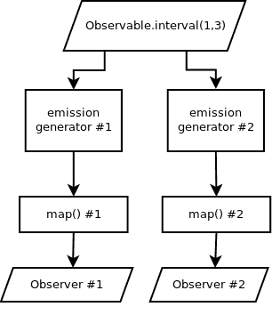
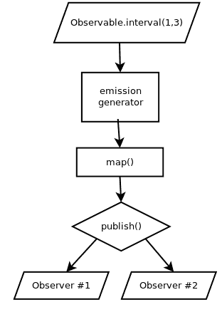
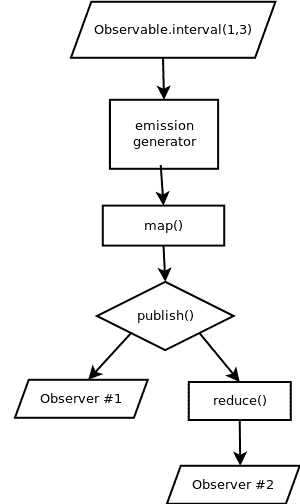

# 第五章：多播、重放和缓存

我们在这本书中已经看到了热和冷`Observable`的实际应用，尽管我们的大部分例子都是冷`Observable`（甚至包括使用`Observable.interval()`的例子）。事实上，在`Observable`的热和冷特性中有很多细微之处，我们将在本章中探讨。当你有多个`Observer`时，默认行为是为每个`Observer`创建一个单独的流。这可能是或可能不是期望的，我们需要意识到何时需要通过多播使用`ConnectableObservable`来强制`Observable`变为热。我们在第二章，*Observables and Subscribers*中简要介绍了`ConnectableObservable`，但我们将在一个完整的`Observable`操作符链的更深入背景下探讨它。

在本章中，我们将详细学习使用`ConnectableObservable`进行多播，并揭示其细微之处。我们还将学习重放和缓存，这两者都进行多播并利用`ConnectableObservable`。最后，我们将学习 Subjects，这是一个在多播时可能很有用的工具，但应该谨慎使用，仅适用于特定情况。我们将涵盖不同类型的 Subjects，以及何时以及何时不应使用它们。

这里是一个预期的概要：

+   理解多播

+   自动连接

+   重放和缓存

+   Subjects

# 理解多播

我们在第二章，*Observables and Subscribers*中之前已经使用过`ConnectableObservable`。还记得冷`Observable`，例如`Observable.range()`，会为每个`Observer`重新生成发射吗？让我们看一下以下代码：

```java
import io.reactivex.Observable;

public class Launcher {
    public static void main(String[] args) {

        Observable<Integer> threeIntegers  = Observable.range(1, 3);

        threeIntegers.subscribe(i -> System.out.println("Observer One: " + i));
        threeIntegers.subscribe(i -> System.out.println("Observer Two: " + i));
    }
}
```

输出如下：

```java
Observer One: 1
Observer One: 2
Observer One: 3
Observer Two: 1
Observer Two: 2
Observer Two: 3
```

在这里，`Observer One`接收了所有三个发射并调用了`onComplete()`。之后，`Observer Two`接收了三个发射（这些发射再次被生成）并调用了`onComplete()`。这些是为两个不同的订阅生成的两个单独的数据流。如果我们想将它们合并成一个数据流，同时将每个发射推送到两个 Observer，我们可以在`Observable`上调用`publish()`，这将返回一个`ConnectableObservable`。我们可以在事先设置好 Observer 后，然后调用`connect()`来开始发射，这样两个 Observer 将同时接收相同的发射。这将通过以下打印的每个`Observer`的交错来表示：

```java
import io.reactivex.Observable;
import io.reactivex.observables.ConnectableObservable;

public class Launcher {
    public static void main(String[] args) {

        ConnectableObservable<Integer> threeIntegers =
                Observable.range(1, 3).publish();

        threeIntegers.subscribe(i -> System.out.println("Observer One: " + i));
        threeIntegers.subscribe(i -> System.out.println("Observer Two: " + i));

        threeIntegers.connect();
    }
}

```

输出如下：

```java
Observer One: 1
Observer Two: 1
Observer One: 2
Observer Two: 2
Observer One: 3
Observer Two: 3
```

使用 `ConnectableObservable` 将迫使源发射变为热发射，将单个发射流同时推送到所有观察者，而不是为每个 `Observer` 提供单独的流。这种流合并的想法被称为多播，但其中有一些细微差别，尤其是在操作符介入时。即使你调用 `publish()` 并使用 `ConnectableObservable`，任何后续的操作符也可以再次创建单独的流。我们将探讨这种行为以及如何管理它。

# 使用操作符进行多播

要查看操作符链中的多播是如何工作的，我们将使用 `Observable.range()` 并将每个发射映射到一个随机整数。由于这些随机值将是非确定性的，并且对于每个订阅都是不同的，这将为我们提供一个很好的方法来查看我们的多播是否工作，因为观察者应该接收到相同的数字。

让我们从发射数字 1 到 3 开始，并将每个数字映射到 0 到 100,000 之间的一个随机整数。如果我们有两个观察者，我们可以预期每个观察者都会得到不同的整数。请注意，由于随机数生成，你的输出将不同于我的输出，只是承认两个观察者都在接收不同的随机整数：

```java
import io.reactivex.Observable;
import java.util.concurrent.ThreadLocalRandom;

public class Launcher {
    public static void main(String[] args) {

        Observable<Integer> threeRandoms = Observable.range(1,3)
                        .map(i -> randomInt());

        threeRandoms.subscribe(i -> System.out.println("Observer 1: " + i));
        threeRandoms.subscribe(i -> System.out.println("Observer 2: " + i));

    }

    public static int randomInt() {
        return ThreadLocalRandom.current().nextInt(100000);
    }
}
```

输出如下：

```java
Observer 1: 38895
Observer 1: 36858
Observer 1: 82955
Observer 2: 55957
Observer 2: 47394
Observer 2: 16996
```

发生在这里的是，`Observable.range()` 源将产生两个独立的发射生成器，并且每个生成器将为每个 `Observer` 冷发射一个单独的流。每个流也有它自己的单独的 `map()` 实例，因此每个 `Observer` 都得到不同的随机整数。你可以在以下图中直观地看到这两个单独的流的结构：

**图 5.1** - 为每个观察者创建了两个独立的操作流

假设你想要向两个观察者发射相同的三个随机整数。你的第一个直觉可能是调用 `publish()` 在 `Observable.range()` 之后，以产生一个 `ConnectableObservable`。然后，你可以在它上面调用 `map()` 操作符，接着是观察者和一个 `connect()` 调用。但你将看到这并没有达到我们期望的结果。每个 `Observer` 仍然得到三个不同的随机整数：

```java
import io.reactivex.Observable;
import io.reactivex.observables.ConnectableObservable;
import java.util.concurrent.ThreadLocalRandom;

public class Launcher {
    public static void main(String[] args) {

        ConnectableObservable<Integer> threeInts = Observable.range(1,3).publish();

        Observable<Integer> threeRandoms = threeInts.map(i -> randomInt());

        threeRandoms.subscribe(i -> System.out.println("Observer 1: " + i));
        threeRandoms.subscribe(i -> System.out.println("Observer 2: " + i));

        threeInts.connect();
    }

    public static int randomInt() {
        return ThreadLocalRandom.current().nextInt(100000);
    }
}

```

输出如下：

```java
Observer 1: 99350
Observer 2: 96343
Observer 1: 4155
Observer 2: 75273
Observer 1: 14280
Observer 2: 97638
```

这是因为我们在 `Observable.range()` 之后进行了多播，但多播发生在 `map()` 操作符之前。尽管我们合并了来自 `Observable.range()` 的一组发射，但每个观察者仍然会在 `map()` 时得到一个单独的流。`publish()` 之前的一切都被合并到一个单独的流中（或者更技术地说，一个单独的代理 `Observer`）。但在 `publish()` 之后，它将再次为每个观察者分叉成单独的流，如图所示：


图 5.2 - 在 `Observable.range()` 之后进行多播将合并间隔发射到一个单独的流，但在 `publish()` 之后仍将为每个观察者分叉成两个单独的流。

如果我们想要防止`map()`操作符为每个`Observer`产生两个独立的数据流，我们需要在`map()`之后调用`publish()`：

```java
import io.reactivex.Observable;
import io.reactivex.observables.ConnectableObservable;
import java.util.concurrent.ThreadLocalRandom;

public class Launcher {
    public static void main(String[] args) {

        ConnectableObservable<Integer> threeRandoms = Observable.range(1,3)
                .map(i -> randomInt()).publish();

        threeRandoms.subscribe(i -> System.out.println("Observer 1: " + i));
        threeRandoms.subscribe(i -> System.out.println("Observer 2: " + i));

        threeRandoms.connect();
    }

    public static int randomInt() {
        return ThreadLocalRandom.current().nextInt(100000);
    }
}

```

输出如下：

```java
Observer 1: 90125
Observer 2: 90125
Observer 1: 79156
Observer 2: 79156
Observer 1: 76782
Observer 2: 76782
```

这样更好！每个`Observer`都得到了相同的三个随机整数，我们有效地在两个`Observer`之前多播了整个操作，如下面的图所示。现在，由于`map()`现在在`publish()`之后，整个链中只有一个流实例：



图 5.3 - 一个完全多播的操作，保证两个`Observer`都能接收到相同的排放，因为所有操作都在`publish()`调用之后

# 何时进行多播

多播有助于防止多个`Observer`执行冗余工作，并且使所有`Observer`订阅单个数据流，至少在它们有共同操作这一点上是这样。你可能这样做是为了提高性能，减少内存和 CPU 使用，或者仅仅因为你的业务逻辑需要将相同的排放推送到所有`Observer`。

数据驱动的冷`Observable`只有在出于性能原因并且有多个`Observer`同时接收相同数据时才应该进行多播。记住，多播会创建热`ConnectableObservables`，你必须小心并适时调用`connect()`，以确保数据不会被`Observer`错过。通常在你的 API 中，保持你的冷`Observable`为冷状态，并在需要将其变为热状态时调用`publish()`。

即使你的源`Observable`是热的（例如 JavaFX 或 Android 中的 UI 事件），对该`Observable`应用操作符也可能导致冗余工作和监听器。当只有一个`Observer`时（并且多播可能引起不必要的开销），没有必要进行多播。但是如果有多个`Observer`，你需要找到可以进行多播和整合上游操作的代理点。这个点通常是`Observer`在上游有共同操作而下游分叉的不同操作的边界。

例如，你可能有一个`Observer`用于打印随机整数，另一个`Observer`使用`reduce()`来计算总和。在这个阶段，实际上这个单一的数据流应该分成两个独立的数据流，因为它们不再冗余，正在执行不同的任务，如下面的代码片段所示：

```java
import io.reactivex.Observable;
import io.reactivex.observables.ConnectableObservable;
import java.util.concurrent.ThreadLocalRandom;

public class Launcher {
    public static void main(String[] args) {

        ConnectableObservable<Integer> threeRandoms = Observable.range(1,3)
                .map(i -> randomInt()).publish();

        //Observer 1 - print each random integer
        threeRandoms.subscribe(i -> System.out.println("Observer 1: " + i));

        //Observer 2 - sum the random integers, then print
        threeRandoms.reduce(0, (total,next) -> total + next)
                .subscribe(i -> System.out.println("Observer 2: " + i));

        threeRandoms.connect();
    }

    public static int randomInt() {
        return ThreadLocalRandom.current().nextInt(100000);
    }
}
```

输出如下：

```java
Observer 1: 40021
Observer 1: 78962
Observer 1: 46146
Observer 2: 165129
```

这里是一个显示正在多播的常见操作的视觉图：

****

图 5.4 - 两个`Observer`之间共享的常见操作放在`publish()`之后，而分叉操作发生在`publish()`之后

在对`ConnectableObservable`和多播有充分理解的基础上，我们将继续探讨一些有助于简化多播的便利操作符。

# 自动连接

确实有需要手动在`ConnectableObservable`上调用`connect()`的时候，以便精确控制发射开始触发的时间。有一些方便的操作符会自动为你调用`connect()`，但有了这种便利，了解它们的订阅时间行为就很重要了。如果你不小心，允许`Observable`动态连接可能会适得其反，因为 Observers 可能会错过发射。

# autoConnect()

`ConnectableObservable`上的`autoConnect()`操作符非常方便。对于给定的`ConnectableObservable<T>`，调用`autoConnect()`将返回一个`Observable<T>`，该`Observable<T>`将在指定数量的 Observers 订阅后自动调用`connect()`。由于我们之前的例子有两个 Observers，我们可以在`publish()`之后立即调用`autoConnect(2)`来简化流程：

```java
import io.reactivex.Observable;
import java.util.concurrent.ThreadLocalRandom;

public class Launcher {
    public static void main(String[] args) {

        Observable<Integer> threeRandoms = Observable.range(1,3)
                .map(i -> randomInt())
                .publish()
                .autoConnect(2);

        //Observer 1 - print each random integer
        threeRandoms.subscribe(i -> System.out.println("Observer 1: " + i));

        //Observer 2 - sum the random integers, then print
        threeRandoms.reduce(0, (total,next) -> total + next)
                .subscribe(i -> System.out.println("Observer 2: " + i));
    }

    public static int randomInt() {
        return ThreadLocalRandom.current().nextInt(100000);
    }
}
```

输出如下：

```java
Observer 1: 83428
Observer 1: 77336
Observer 1: 64970
Observer 2: 225734
```

这避免了我们需要保存`ConnectableObservable`并稍后调用其`connect()`方法的问题。相反，它将在获得`2`个订阅时开始触发，这是我们提前计划和指定的参数。显然，当你有一个未知数量的 Observers 并且你希望他们都能接收到所有发射时，这不会很好地工作。

即使所有下游 Observers 完成或销毁，`autoConnect()`也会持续其对源的订阅。如果源是有限的并且被销毁，那么当新的`Observer`在下游订阅时，它将不会再次订阅它。如果我们向我们的例子中添加第三个`Observer`，但将`autoConnect()`指定为`2`而不是`3`，那么第三个`Observer`很可能会错过发射：

```java
import io.reactivex.Observable;
import java.util.concurrent.ThreadLocalRandom;

public class Launcher {
    public static void main(String[] args) {

        Observable<Integer> threeRandoms = Observable.range(1,3)
                .map(i -> randomInt()).publish().autoConnect(2);

        //Observer 1 - print each random integer
        threeRandoms.subscribe(i -> System.out.println("Observer 1: " + i));

        //Observer 2 - sum the random integers, then print
        threeRandoms.reduce(0, (total,next) -> total + next)
                .subscribe(i -> System.out.println("Observer 2: " + i));

        //Observer 3 - receives nothing
        threeRandoms.subscribe(i -> System.out.println("Observer 3: " + i);
    }

    public static int randomInt() {
        return ThreadLocalRandom.current().nextInt(100000);
    }
}
```

输出如下：

```java
Observer 1: 8198
Observer 1: 31718
Observer 1: 97915
Observer 2: 137831
```

注意，如果你没有为`numberOfSubscribers`传递任何参数，它将默认为`1`。如果你希望它在第一次订阅时开始触发，并且不关心后续的 Observers 错过之前的发射，这可能会很有帮助。在这里，我们`publish`并`autoConnect`了`Observable.interval()`。第一个`Observer`开始触发发射，3 秒后，另一个`Observer`到来，但错过了最初的几次发射。但从那时起，它确实接收到了实时的发射：

```java
import io.reactivex.Observable;
import java.util.concurrent.TimeUnit;

public class Launcher {
    public static void main(String[] args) {

        Observable<Long> seconds =
                Observable.interval(1, TimeUnit.SECONDS)
                        .publish()
                        .autoConnect();

        //Observer 1
        seconds.subscribe(i -> System.out.println("Observer 1: " + i));

        sleep(3000);

        //Observer 2
        seconds.subscribe(i -> System.out.println("Observer 2: " + i));

        sleep(3000);
    }
    public static void sleep(long millis) {
        try {
            Thread.sleep(millis);
        } catch (InterruptedException e) {
            e.printStackTrace();
        }
    }
}
```

输出如下：

```java
Observer 1: 0
Observer 1: 1
Observer 1: 2
Observer 1: 3
Observer 2: 3
Observer 1: 4
Observer 2: 4
Observer 1: 5
Observer 2: 5
```

如果你将`autoConnect()`函数的`numberOfSubscribers`参数传递为`0`，它将立即开始触发，而不等待任何`Observers`。这可以在不等待任何 Observers 的情况下立即开始触发发射非常有用。

# refCount() 和 share()

`ConnectableObservable`上的`refCount()`操作符类似于`autoConnect(1)`，它在获得一个订阅后触发。但有一个重要的区别；当它不再有任何 Observers 时，它会销毁自己，并在新的一个到来时重新开始。当它没有更多的 Observers 时，它不会持续对源的订阅，当另一个`Observer`跟随时，它将基本上“重新开始”。

看这个例子：我们有一个每秒发射一次的 `Observable.interval()`，它通过 `refCount()` 进行多播。`Observer 1` 接收了五个发射，而 `Observer 2` 接收了两个发射。我们使用 `sleep()` 函数将它们的订阅错开，它们之间有 3 秒的间隔。由于这两个订阅由于 `take()` 操作符而有限，它们应该在 `Observer 3` 来之前终止，并且不应该再有之前的观察者。注意 `Observer 3` 是从 `0` 开始的全新间隔重新开始的！让我们看一下以下代码片段：

```java
import io.reactivex.Observable;
import java.util.concurrent.TimeUnit;

public class Launcher {
    public static void main(String[] args) {

        Observable<Long> seconds =
                Observable.interval(1, TimeUnit.SECONDS)
                        .publish()
                        .refCount();

        //Observer 1
        seconds.take(5)
                .subscribe(l -> System.out.println("Observer 1: " + l));

        sleep(3000);

        //Observer 2
        seconds.take(2)
                .subscribe(l -> System.out.println("Observer 2: " + l));

        sleep(3000);
        //there should be no more Observers at this point

        //Observer 3
        seconds.subscribe(l -> System.out.println("Observer 3: " + l));

        sleep(3000);
    }
    public static void sleep(long millis) {
        try {
            Thread.sleep(millis);
        } catch (InterruptedException e) {
            e.printStackTrace();
        }
    }
}
```

输出如下：

```java
Observer 1: 0
Observer 1: 1
Observer 1: 2
Observer 1: 3
Observer 2: 3
Observer 1: 4
Observer 2: 4
Observer 3: 0
Observer 3: 1
Observer 3: 2
```

使用 `refCount()` 可以在多个观察者之间多播，但在没有下游观察者时销毁上游连接。您还可以使用 `share()` 操作符为 `publish().refCount()` 创建别名。这将达到相同的结果：

```java
Observable<Long> seconds =
        Observable.interval(1, TimeUnit.SECONDS).share();

```

# 重新播放和缓存

多播还允许我们在多个观察者之间缓存共享的值。这听起来可能有些令人惊讶，但当你仔细思考时，你可能会意识到这是有道理的。如果我们正在多个观察者之间共享数据，那么任何缓存功能也应该在观察者之间共享。重新播放和缓存数据是一种多播活动，我们将探讨如何使用 RxJava 安全且高效地完成它。

# 重新播放

`replay()` 操作符是一种强大的方式，可以在一定范围内保留之前的发射，并在新的 `Observer` 加入时重新发射它们。它将返回一个 `ConnectableObservable`，它将多播发射以及发射在范围内定义的之前发射。它缓存的之前发射将立即触发新的 `Observer` 以使其跟上，然后它将从该点开始触发当前发射。

让我们从不带参数的 `replay()` 开始。这将重新播放所有之前的发射给延迟的观察者，然后一旦延迟的 `Observer` 跟上，就立即发射当前的发射。如果我们使用 `Observable.interval()` 每秒发射一次，我们可以在它上面调用 `replay()` 来多播和重新播放之前的整数发射。由于 `replay()` 返回 `ConnectableObservable`，让我们使用 `autoConnect()` 以便它在第一次订阅时开始发射。3 秒后，我们将引入第二个 `Observer`。仔细观察发生了什么：

```java
import io.reactivex.Observable;
import java.util.concurrent.TimeUnit;

public class Launcher {
    public static void main(String[] args) {

        Observable<Long> seconds =
                Observable.interval(1, TimeUnit.SECONDS)
                    .replay()
                    .autoConnect();

        //Observer 1
        seconds.subscribe(l -> System.out.println("Observer 1: " + l));

        sleep(3000);

        //Observer 2
        seconds.subscribe(l -> System.out.println("Observer 2: " + l));

        sleep(3000);
    }
    public static void sleep(long millis) {
        try {
            Thread.sleep(millis);
        } catch (InterruptedException e) {
            e.printStackTrace();
        }
    }
}
```

输出如下：

```java
Observer 1: 0
Observer 1: 1
Observer 1: 2
Observer 2: 0
Observer 2: 1
Observer 2: 2
Observer 1: 3
Observer 2: 3
Observer 1: 4
Observer 2: 4
Observer 1: 5
Observer 2: 5
```

你看到了吗？在 3 秒后，`Observer 2` 进入并立即接收到了它错过的前三个排放：`0`、`1` 和 `2`。之后，它接收到的排放与 `Observer 1` 相同。请注意，这可能会因为内存而变得昂贵，因为 `replay()` 会持续缓存它接收到的所有排放。如果源是无限的，或者你只关心最后的前排放，你可能想指定一个 `bufferSize` 参数来限制只重放一定数量的最后排放。如果我们对第二个观察者调用 `replay(2)` 来缓存最后两个排放，它将不会得到 `0`，但它将接收到 `1` 和 `2`。`0` 落出了那个窗口，并在 `2` 进入时从缓存中释放。

输出如下：

```java
Observer 1: 0
Observer 1: 1
Observer 1: 2
Observer 2: 1
Observer 2: 2
Observer 1: 3
Observer 2: 3
Observer 1: 4
Observer 2: 4
Observer 1: 5
Observer 2: 5
```

注意，如果你总是想在 `replay()` 中持久化缓存的值，即使没有订阅，也要与 `autoConnect()` 一起使用，而不是 `refCount()`。如果我们通过 `Epsilon` 字符串发出 `Alpha` 并使用 `replay(1).autoConnect()` 来保留最后一个值，我们的第二个 `Observer` 将只会接收到预期的最后一个值：

```java
import io.reactivex.Observable;

public class Launcher {
    public static void main(String[] args) {

        Observable<String> source =
                Observable.just("Alpha", "Beta", "Gamma", 
"Delta", "Epsilon")
                    .replay(1)
                    .autoConnect();

        //Observer 1
        source.subscribe(l -> System.out.println("Observer 1: " + l));

        //Observer 2
        source.subscribe(l -> System.out.println("Observer 2: " + l));
    }
}
```

输出如下：

```java
Observer 1: Alpha
Observer 1: Beta
Observer 1: Gamma
Observer 1: Delta
Observer 1: Epsilon
Observer 2: Epsilon
```

在这里进行修改，使用 `refCount()` 而不是 `autoConnect()`，看看会发生什么：

```java
Observable<String> source =
        Observable.just("Alpha", "Beta", "Gamma", "Delta", "Epsilon")
            .replay(1)
            .refCount();
```

输出如下：

```java
Observer 1: Alpha
Observer 1: Beta
Observer 1: Gamma
Observer 1: Delta
Observer 1: Epsilon
Observer 2: Alpha
Observer 2: Beta
Observer 2: Gamma
Observer 2: Delta
Observer 2: Epsilon
```

这里发生的情况是，`refCount()` 导致缓存（以及整个链）在 `Observer 1` 完成时销毁并重置，因为没有更多的观察者。当 `Observer 2` 进入时，它从头开始，就像它是第一个观察者一样，并构建另一个缓存。这可能不是期望的结果，因此你可能考虑使用 `autoConnect()` 来持久化 `replay()` 的状态，而不是在没有观察者时销毁它。

`replay()` 有其他重载，特别是你可以指定的时间窗口。在这里，我们构建了一个每 300 毫秒发出一次的 `Observable.interval()` 并订阅它。我们还映射每个发出的连续整数到已过毫秒数。我们将只重放每个新 `Observer` 的最后 1 秒的排放，我们将在 2 秒后引入它：

```java
import io.reactivex.Observable;
import java.util.concurrent.TimeUnit;

public class Launcher {
    public static void main(String[] args) {

        Observable<Long> seconds =
                Observable.interval(300, TimeUnit.MILLISECONDS)
                        .map(l -> (l + 1) * 300) // map to elapsed milliseconds
                        .replay(1, TimeUnit.SECONDS)
                        .autoConnect();

        //Observer 1
        seconds.subscribe(l -> System.out.println("Observer 1: " + l));

        sleep(2000);

        //Observer 2
        seconds.subscribe(l -> System.out.println("Observer 2: " + l));

        sleep(1000);
    }
    public static void sleep(long millis) {
        try {
            Thread.sleep(millis);
        } catch (InterruptedException e) {
            e.printStackTrace();
        }
    }
}
```

输出如下：

```java
Observer 1: 300
Observer 1: 600
Observer 1: 900
Observer 1: 1200
Observer 1: 1500
Observer 1: 1800
Observer 2: 1500
Observer 2: 1800
Observer 1: 2100
Observer 2: 2100
Observer 1: 2400
Observer 2: 2400
Observer 1: 2700
Observer 2: 2700
Observer 1: 3000
Observer 2: 3000
```

仔细观察输出，你会看到当 `Observer 2` 进入时，它立即接收到了上一秒发生的排放，即 1500 和 1800。在这两个值重放之后，它从那时起接收到的排放与 `Observer 1` 相同。

你还可以在时间间隔之上指定 `bufferSize` 参数，这样在那一时间段内只缓冲一定数量的最后排放。如果我们修改我们的示例，只重放最后 1 秒内发生的排放，它应该只重放 `1800` 给 `Observer 2`：

```java
Observable<Long> seconds =
        Observable.interval(300, TimeUnit.MILLISECONDS)
                .map(l -> (l + 1) * 300) // map to elapsed milliseconds
                .replay(1, 1, TimeUnit.SECONDS)
                .autoConnect();

```

输出如下：

```java
Observer 1: 300
Observer 1: 600
Observer 1: 900
Observer 1: 1200
Observer 1: 1500
Observer 1: 1800
Observer 2: 1800
Observer 1: 2100
Observer 2: 2100
Observer 1: 2400
Observer 2: 2400
Observer 1: 2700
Observer 2: 2700
Observer 1: 3000
Observer 2: 3000
```

# 缓存

当你想要无限期地缓存所有排放物以供长期使用，并且不需要使用 `ConnectableObservable` 控制对源订阅的行为时，你可以使用 `cache()` 操作符。它将在第一个下游 `Observer` 订阅时订阅源并无限期地保留所有值。这使得它不太可能成为无限观察者或可能耗尽你内存的大量数据的候选者：

```java
import io.reactivex.Observable;

public class Launcher {
    public static void main(String[] args) {

        Observable<Integer> cachedRollingTotals =
                Observable.just(6, 2, 5, 7, 1, 4, 9, 8, 3)
                    .scan(0, (total,next) -> total + next)
                    .cache();

        cachedRollingTotals.subscribe(System.out::println);
    }
}
```

你还可以调用 `cacheWithInitialCapacity()` 并指定缓存中预期的元素数量。这将提前优化该大小元素的缓冲区：

```java
Observable<Integer> cachedRollingTotals =
        Observable.just(6, 2, 5, 7, 1, 4, 9, 8, 3)
            .scan(0, (total,next) -> total + next)
            .cacheWithInitialCapacity(9);
```

再次强调，除非你真的想无限期地保留所有元素且没有计划在任何时候销毁它们，否则不要使用 `cache()`。否则，最好使用 `replay()`，这样你可以更精细地控制缓存大小和窗口以及销毁策略。

# Subjects

在我们讨论 `Subject` 之前，如果不强调它们有使用场景，那就有些疏忽了。初学者经常错误地使用它们，最终陷入复杂的情况。正如你将要学习的，它们既是 `Observer` 也是 `Observable`**，充当一个代理多播设备（有点像事件总线）。它们在响应式编程中确实有自己的位置，但在使用它们之前，你应该尽力用完其他选项。ReactiveX 的创造者 Erik Meijer 将它们描述为响应式编程的“可变变量”。就像可变变量有时是必要的，尽管你应该努力追求不可变性一样，`Subject` 有时是调和命令式范式与响应式范式的一个必要工具。

但在我们讨论何时以及何时不使用它们之前，让我们先看看它们究竟做了什么。

# PublishSubject

`Subject` 有几种实现方式，它是一个抽象类型，实现了 `Observable` 和 `Observer`。这意味着你可以在 `Subject` 上手动调用 `onNext()`、`onComplete()` 和 `onError()`，然后它将把这些事件逐级传递给它的观察者。

最简单的 `Subject` 类型是 `PublishSubject`，它像所有 `Subject` 一样，向其下游观察者热切地广播。其他 `Subject` 类型增加了更多行为，但 `PublishSubject` 是“原味”类型，如果你愿意这样称呼的话。

我们可以声明一个 `Subject<String>`，创建一个映射其长度并订阅它的 `Observer`，然后调用 `onNext()` 来传递三个字符串。我们还可以调用 `onComplete()` 来传达没有更多事件将通过这个 `Subject` 传递：

```java
import io.reactivex.subjects.PublishSubject;
import io.reactivex.subjects.Subject;

public class Launcher {
    public static void main(String[] args) {

        Subject<String> subject = PublishSubject.create();

        subject.map(String::length)
                .subscribe(System.out::println);

        subject.onNext("Alpha");
        subject.onNext("Beta");
        subject.onNext("Gamma");
        subject.onComplete();
    }
}
```

输出如下：

```java
5
4
5
```

这表明 `Subject` 像神奇的设备一样，可以连接命令式编程和响应式编程，你是对的。接下来，让我们看看何时以及何时不使用 `Subject` 的案例。

# 何时使用 `Subject`

更可能的是，你会使用`Subject`来积极订阅多个未知数量的源观察者，并将它们的发射合并为一个单一的`Observable`。由于`Subject`是一个`Observer`，你可以轻松地将它们传递给`subscribe()`方法。这在模块化代码库中可能很有帮助，在这些代码库中，观察者和观察者之间的解耦发生，并且执行`Observable.merge()`并不那么容易。在这里，我使用`Subject`来合并和广播两个`Observable`间隔源：

```java
import io.reactivex.Observable;
import io.reactivex.subjects.PublishSubject;
import io.reactivex.subjects.Subject;
import java.util.concurrent.TimeUnit;

public class Launcher {
    public static void main(String[] args) {

        Observable<String> source1 =
                Observable.interval(1, TimeUnit.SECONDS)
                    .map(l -> (l + 1) + " seconds");

        Observable<String> source2 =
                Observable.interval(300, TimeUnit.MILLISECONDS)
                    .map(l -> ((l + 1) * 300) + " milliseconds");

        Subject<String> subject = PublishSubject.create();

        subject.subscribe(System.out::println);

        source1.subscribe(subject);
        source2.subscribe(subject);

        sleep(3000);
    }

    public static void sleep(long millis) {
        try {
            Thread.sleep(millis);
        } catch (InterruptedException e) {
            e.printStackTrace();
        }
    }
}
```

输出如下：

```java
300 milliseconds
600 milliseconds
900 milliseconds
1 seconds
1200 milliseconds
1500 milliseconds
1800 milliseconds
2 seconds
2100 milliseconds
2400 milliseconds
2700 milliseconds
3 seconds
3000 milliseconds
```

当然，我可以用`Observable.merge()`来完成这个任务（并且技术上我应该这样做）。但是，当你通过依赖注入或其他解耦机制管理模块化代码时，你可能没有提前准备好`Observable`源来放入`Observable.merge()`。例如，我可能有一个 JavaFX 应用程序，它有一个来自菜单栏、按钮或按键组合的刷新事件。我可以将这些事件源声明为观察者，并在后端类中将它们订阅到`Subject`上，以合并事件流，而不需要任何硬耦合。

另一点需要注意的是，第一个在`Subject`上调用`onComplete()`的`Observable`将停止其他`Observable`推送它们的发射，并且忽略下游的取消请求。这意味着你很可能会使用`Subject`来处理无限的事件驱动（即用户动作驱动）观察者。话虽如此，我们接下来将探讨`Subject`容易受到滥用的情况。

# 当`Subject`出错时

希望你能感觉到，我们之前关于`Subject`的例子，发出`Alpha`、`Beta`和`Gamma`，在考虑到我们迄今为止如何架构我们的响应式应用时，可能显得有些反直觉和落后。你这样想是有道理的。我们是在所有观察者都设置完毕之后，才定义了源发射，这个过程不再是从左到右、从上到下读取。由于`Subject`是活跃的，在观察者设置之前执行`onNext()`调用会导致这些发射在我们的`Subject`中被遗漏。如果你像这样移动`onNext()`调用，你将不会得到任何输出，因为`Observer`会错过这些发射：

```java
import io.reactivex.subjects.PublishSubject;
import io.reactivex.subjects.Subject;

public class Launcher {
    public static void main(String[] args) {

        Subject<String> subject = PublishSubject.create();

        subject.onNext("Alpha");
        subject.onNext("Beta");
        subject.onNext("Gamma");
        subject.onComplete();

        subject.map(String::length)
                .subscribe(System.out::println);
    }
}
```

这表明`Subject`可能有些随意且危险，尤其是如果你将它们暴露给整个代码库，并且任何外部代码都可以调用`onNext()`来传递发射。例如，假设我们的`Subject`被暴露给一个外部 API，并且可以任意地将发射`Puppy`放在`Alpha`、`Beta`和`Gamma`之上。如果我们希望我们的源只发射这些希腊字母，那么它很容易接收到意外的或不受欢迎的发射。响应式编程只有在源观察者来自一个定义良好且可预测的源时才能保持完整性。`Subject`也不是可丢弃的，因为它们没有公共的`dispose()`方法，并且当`dispose()`在下游被调用时，它们不会释放它们的源。

如果你想让这样的数据驱动源保持冷状态，并使用`publish()`或`replay()`进行多播以使它们变得热，那就好得多。当你需要使用`Subject`时，将其转换为`Observable`或者根本不暴露它。你也可以将一个`Subject`包裹在某种类的内部，并让方法将事件传递给它。

# 序列化 Subject

在 Subject 上需要注意的一个关键问题：`onSubscribe()`、`onNext()`、`onError()`和`onComplete()`调用不是线程安全的！如果你有多个线程调用这四个方法，发射可能会开始重叠并破坏`Observable`契约，该契约要求发射按顺序发生。如果发生这种情况，一个良好的做法是在`Subject`上调用`toSerialized()`以产生一个安全序列化的`Subject`实现（由私有的`SerializedSubject`支持）。这将安全地序列化并发事件调用，以确保不会发生灾难性的后果：

```java
Subject<String> subject = 
        PublishSubject.<String>create().toSerialized();
```

不幸的是，由于 Java 编译器的限制（包括 Java 8），我们不得不在`create()`工厂中提前显式声明类型参数`String`。编译器的类型推断不会超过一个方法调用，所以像之前演示的那样有两个调用将会有编译错误，没有显式类型声明。

# BehaviorSubject

还有几种 Subject 的其他风味。除了常用的`PublishSubject`之外，还有`BehaviorSubject`。它的行为几乎与`PublishSubject`相同，但它会将最后发射的项目回放给每个新的下游`Observer`。这有点像在`PublishSubject`之后放置`replay(1).autoConnect()`，但它将这些操作合并为一个单一的优化`Subject`实现，该实现会积极订阅源：

```java
import io.reactivex.subjects.BehaviorSubject;
import io.reactivex.subjects.Subject;

public class Launcher {
    public static void main(String[] args) {

        Subject<String> subject =
                BehaviorSubject.create();

        subject.subscribe(s -> System.out.println("Observer 1: " + s));

        subject.onNext("Alpha");
        subject.onNext("Beta");
        subject.onNext("Gamma");

        subject.subscribe(s -> System.out.println("Observer 2: " + s));
    }
}
```

输出如下：

```java
Observer 1: Alpha
Observer 1: Beta
Observer 1: Gamma
Observer 2: Gamma
```

在这里，你可以看到`Observer 2`即使错过了`Observer 1`接收到的三个发射，仍然接收到了最后的`Gamma`发射。如果你发现自己需要一个`Subject`并想要为新观察者缓存最后的发射，你将想要使用一个`BehaviorSubject`。

# ReplaySubject

`ReplaySubject`类似于`PublishSubject`后跟一个`cache()`操作符。它立即捕获发射，无论是否存在下游观察者，并优化在`Subject`本身内部发生缓存：

```java
import io.reactivex.subjects.ReplaySubject;
import io.reactivex.subjects.Subject;

public class Launcher {
    public static void main(String[] args) {

        Subject<String> subject =
                ReplaySubject.create();

        subject.subscribe(s -> System.out.println("Observer 1: " + s));

        subject.onNext("Alpha");
        subject.onNext("Beta");
        subject.onNext("Gamma");
        subject.onComplete();

        subject.subscribe(s -> System.out.println("Observer 2: " + s));
    }
}
```

输出如下：

```java
Observer 1: Alpha
Observer 1: Beta
Observer 1: Gamma
Observer 2: Alpha
Observer 2: Beta
Observer 2: Gamma
```

显然，就像使用无参数的`replay()`或`cache()`操作符一样，你需要小心使用它，因为如果发射量很大或来源无限，它将缓存所有内容并占用内存。

# AsyncSubject

`AsyncSubject`具有高度定制、有限特定的行为：它将只推送它接收到的最后一个值，然后是一个`onComplete()`事件：

```java
import io.reactivex.subjects.AsyncSubject;
import io.reactivex.subjects.Subject;

public class Launcher {
    public static void main(String[] args) {

        Subject<String> subject =
                AsyncSubject.create();

        subject.subscribe(s ->
        System.out.println("Observer 1: " + s),
                Throwable::printStackTrace,
                () -> System.out.println("Observer 1 done!")
        );

        subject.onNext("Alpha");
        subject.onNext("Beta");
        subject.onNext("Gamma");
        subject.onComplete();

        subject.subscribe(s ->
        System.out.println("Observer 2: " + s),
                Throwable::printStackTrace,
                () -> System.out.println("Observer 2 done!")
        );
    }
}
```

输出如下：

```java
Observer 1: Gamma
Observer 1 done!
Observer 2: Gamma
Observer 2 done!
```

从前面的命令中可以看出，在调用 `onComplete()` 之前，最后推送到 `AsyncSubject` 的值是 `Gamma`。因此，它只向所有 `Observer` 发射了 `Gamma`。这种 `Subject` 你不希望与无限源一起使用，因为它只在调用 `onComplete()` 时发射。

`AsyncSubject` 与 Java 8 的 `CompletableFuture` 类似，它将执行一个你可以选择观察其完成并获取值的计算。你还可以通过在 `Observable` 上使用 `takeLast(1).replay(1)` 来模仿 `AsyncSubject`。在求助于 `AsyncSubject` 之前，首先尝试使用这种方法。

# UnicastSubject

一种有趣且可能有用的 `Subject` 类型是 `UnicastSubject`。与所有 `Subject` 一样，`UnicastSubject` 将被用来观察和订阅源。但它将缓冲它接收到的所有发射数据，直到有 `Observer` 订阅它，然后它会将这些发射数据全部释放给 `Observer` 并清空其缓存：

```java
import io.reactivex.Observable;
import io.reactivex.subjects.ReplaySubject;
import io.reactivex.subjects.Subject;
import io.reactivex.subjects.UnicastSubject;
import java.util.concurrent.TimeUnit;

public class Launcher {
    public static void main(String[] args) {

        Subject<String> subject =
                UnicastSubject.create();

        Observable.interval(300, TimeUnit.MILLISECONDS)
                .map(l -> ((l + 1) * 300) + " milliseconds")
                .subscribe(subject);

        sleep(2000);

        subject.subscribe(s -> System.out.println("Observer 1: " + s));

        sleep(2000);

    }
    public static void sleep(long millis) {
        try {
            Thread.sleep(millis);
        } catch (InterruptedException e) {
            e.printStackTrace();
        }
    }
}
```

输出如下：

```java
Observer 1: 300 milliseconds
Observer 1: 600 milliseconds
Observer 1: 900 milliseconds
Observer 1: 1200 milliseconds
Observer 1: 1500 milliseconds
Observer 1: 1800 milliseconds
Observer 1: 2100 milliseconds
Observer 1: 2400 milliseconds
Observer 1: 2700 milliseconds
Observer 1: 3000 milliseconds
Observer 1: 3300 milliseconds
Observer 1: 3600 milliseconds
Observer 1: 3900 milliseconds
```

当你运行此代码时，你将看到在 2 秒后，前六个发射数据在 `Observer` 订阅时立即释放。然后，它将从那个点开始接收实时发射的数据。但 `UnicastSubject` 有一个重要的属性；它只与一个 `Observer` 一起工作，并且对于后续的任何 `Observer` 都会抛出错误。从逻辑上讲，这是有道理的，因为它设计成在获得 `Observer` 后释放其内部队列中的缓冲发射数据。但是，当这些缓存的发射数据被释放后，它们不能再次释放给第二个 `Observer`，因为它们已经消失了。如果你想让第二个 `Observer` 接收已错过的发射数据，你不妨使用 `ReplaySubject`。`UnicastSubject` 的好处是它在获得 `Observer` 后会清空其缓冲区，从而释放用于该缓冲区的内存。

如果你想要支持多个 `Observer` 并且只让后续的 `Observer` 接收实时发射的数据而不接收已错过发射的数据，你可以通过调用 `publish()` 来创建一个单例 `Observer` 代理，该代理可以将数据多播给多个 `Observer`，如下面的代码片段所示：

```java
import io.reactivex.Observable;
import io.reactivex.subjects.Subject;
import io.reactivex.subjects.UnicastSubject;
import java.util.concurrent.TimeUnit;

public class Launcher {
    public static void main(String[] args) {

        Subject<String> subject =
                UnicastSubject.create();

        Observable.interval(300, TimeUnit.MILLISECONDS)
                .map(l -> ((l + 1) * 300) + " milliseconds")
                .subscribe(subject);

        sleep(2000);

        //multicast to support multiple Observers
        Observable<String> multicast = subject.publish().autoConnect();

        //bring in first Observer
        multicast.subscribe(s -> System.out.println("Observer 1: " + s));
        sleep(2000);

        //bring in second Observer
        multicast.subscribe(s -> System.out.println("Observer 2: " + s));
        sleep(1000);
    }
    public static void sleep(long millis) {
        try {
            Thread.sleep(millis);
        } catch (InterruptedException e) {
            e.printStackTrace();
        }
    }
}

```

输出如下：

```java
Observer 1: 300 milliseconds
Observer 1: 600 milliseconds
Observer 1: 900 milliseconds
Observer 1: 1200 milliseconds
...
Observer 1: 3900 milliseconds
Observer 1: 4200 milliseconds
Observer 2: 4200 milliseconds
Observer 1: 4500 milliseconds
Observer 2: 4500 milliseconds
```

# 摘要

在本章中，我们介绍了使用 `ConnectableObservable` 和 `Subject` 进行多播。最大的收获是 `Observable` 操作符为每个订阅的 `Observer` 生成单独的事件流。如果你想将这些多个流合并为单个流以避免重复工作，最佳方式是在 `Observable` 上调用 `publish()` 以生成 `ConnectableObservable`。然后你可以手动调用 `connect()` 来在观察者设置完毕后触发发射，或者使用 `autoConnect()` 或 `refCount()` 自动触发连接。

多播还支持回放和缓存，因此迟到的 `Observer` 可以接收已错过的发射数据。`Subject` 提供了一种多播和缓存发射数据的方式，但你应该只在现有操作符无法实现你的需求时才使用它们。

在下一章中，我们将开始学习并发编程。这正是 RxJava 真正发光发热的地方，也是响应式编程的卖点之一。
